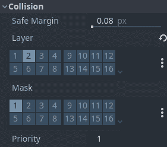
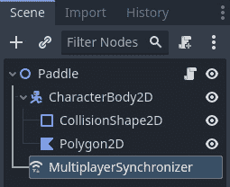

# 7

# 开发在线 Pong 游戏

是时候逐渐深入到制作在线多人游戏的更复杂方面了。在*第六章*“构建在线国际象棋游戏”中，我们看到了两位玩家如何共享同一个游戏世界，并看到他们的动作对其他玩家的游戏状态产生影响。这种情况发生在玩家轮流进行时，所以我们没有涉及到在线多人游戏中最麻烦的方面之一：时间。

在本章中，我们将开始处理动作游戏，这些游戏的核心特征是手眼协调和反应时间。我们将从一个最简单的基于物理学的游戏之一：Pong 的复制品开始。以基础项目为起点，我们将将其变成一个在线多人 Pong 游戏，其中每个玩家控制一个球拍，Godot 引擎的高级网络功能将负责在同一个游戏世界中保持玩家的同步。

在本章中，我们将涵盖以下主题：

+   介绍 Pong 项目

+   设置在线多人球拍

+   同步远程对象

# 技术要求

对于本章，我们将使用我们的在线项目仓库，您可以通过以下链接找到：

[`github.com/PacktPublishing/The-Essential-Guide-to-Creating-Multiplayer-Games-with-Godot-4.0`](https://github.com/PacktPublishing/The-Essential-Guide-to-Creating-Multiplayer-Games-with-Godot-4.0)

在 Godot 引擎中打开项目后，打开 `res://07.developing-online-pong` 文件夹；本章所需的一切都在那里。话虽如此，让我们首先了解我们的 Pong 项目是如何工作的，以及我们需要做什么才能将其变成一个在线多人游戏。正如前一章所述，我们也将使用 Godot 引擎版本 4.0，所以如果你有其他版本的引擎，请确保你使用的是正确的版本。

# 介绍 Pong 项目

欢迎来到我们虚构的独立游戏开发工作室的另一个项目，网络工程师！这次，我们需要为我们的下一个项目进行入职。

我们有一个 Pong 游戏，我们认为我们可以通过一些排行榜和所有这些酷炫的功能将其变成一个具有竞争力的在线多人游戏。您在这里的核心任务是使游戏的核心功能可以通过网络由两名玩家进行游戏。让我们了解我们目前拥有的内容，以便指出您将要修改的内容。

## 玩家球拍的工作原理

玩家的球拍是我们项目中最重要的部分。它们是玩家唯一可以控制的东西，因此它们是玩家与游戏互动的主要方式。通过移动它们，玩家可以将球反弹给对方。

让我们简要地看一下 `res://07.developing-online-pong/Paddle.tscn` 场景。其场景树结构如下：


图 7.1 – 球拍场景的节点层次结构

注意，球拍本身是一个`Node2D`节点，而实际的物理体是其子节点。这是一种很好的抽象游戏实体的方式。它们有一个物理体，但它们并不是物理体。这允许我们在更高级别的抽象中更好地理解它们。现在，让我们看看它的脚本：

```cpp
extends Node2D
@export var speed = 500.0
@export var up_action = "move_up"
@export var down_action = "move_down"
@onready var body = $CharacterBody2D
func _physics_process(delta):
     body.move_and_slide()
func _unhandled_input(event):
     if event.is_action_pressed(up_action):
          body.velocity.y = -speed
     elif event.is_action_released(up_action):
          if Input.is_action_pressed(down_action):
               body.velocity.y = speed
          else:
               body.velocity.y = 0.0
     if event.is_action_pressed(down_action):
          body.velocity.y = speed
     elif event.is_action_released(down_action):
          if Input.is_action_pressed(up_action):
               body.velocity.y = -speed
          else:
               body.velocity.y = 0.0
```

这段代码允许根据用户输入移动球拍，`speed`变量决定了移动速度，而`up_action`和`down_action`变量代表了移动球拍的输入动作。脚本处理输入事件并相应地调整角色的速度。球拍以恒定速度移动，或者在没有按键按下时停止。

在下一节中，让我们看看球是如何工作的。它是我们游戏中另一个核心对象，我们需要对其进行一些工作，以便将其变成一个在线多人游戏。

## 理解 Ball 场景

球是游戏中的被动元素，当它撞击另一个物理体时（无论是球拍、天花板还是地板），它本质上会弹跳。后两者是`StaticBody2D`，它们在`CollisionShape2D`中使用`WorldBoundaryShape2D`。

让我们看看`res://07.developing-online-pong/Ball.tscn`场景。场景结构如下：


图 7.2 – Ball 场景的节点层次结构

在我们打开`Ball`脚本之前，请注意，`CollisionShape2D`资源附有一个内置的工具脚本。这是一个非常简单的脚本，它使用`CanvasItem.draw_circle()`方法绘制`CircleShape2D`资源。这是其背后的逻辑：

```cpp
@tool
extends CollisionShape2D
@export var color = Color.WHITE
func _draw():
     draw_circle(Vector2.ZERO, shape.radius, color)
```

话虽如此，让我们打开`Ball`脚本，看看它是如何工作的，特别注意弹跳逻辑，因为它使用了一些有趣的`Vector2`方法：

```cpp
extends Node2D
@export var speed = 600.0
@onready var body = $CharacterBody2D
func move():
     body.velocity.x = [-speed, speed][randi()%2]
     body.velocity.y = [-speed, speed][randi()%2]
func reset():
     body.global_position = global_position
     move()
func _physics_process(delta):
     var collision = body.move_and_collide
         (body.velocity  delta)
     if collision:
          body.velocity = body.velocity.bounce
              (collision.get_normal())
```

这段代码以指定速度移动球的`CharacterBody2D`节点，随机化其运动方向，检测与其他对象的碰撞，并在碰撞时使角色从表面上弹起。通过使用此脚本，球可以进行动态和响应式的运动，并具有碰撞检测功能。

在下一节中，我们将了解如何检测玩家得分的情况。

## 管理玩家得分

当球到达屏幕的左侧或右侧时，另一侧的玩家应该得分。为了检测这种条件，我们使用了一个`ScoreArea`节点，本质上它是一个`Area2D`节点。

打开`res://07.developing-online-pong/ScoreArea.tscn`场景，我们将查看其场景树结构：


图 7.3 – ScoreArea 场景的节点层次结构

如前所述，它只是一个`Area2D`节点；它甚至没有`CollisionShape2D`资源，因为在这种情况中，在最终场景中添加它更为友好，这样我们就可以为每个`ScoreArea`节点选择一个特定的`Shape2D`资源。现在，让我们看看它的代码：

```cpp
extends Area2D
signal scored(score)
@export var score = 0
func _on_body_entered(body):
     score += 1
     scored.emit(score)
```

此代码提供了一个简单的方法，使用 `Area2D` 节点在游戏中跟踪得分。每当另一个物理体（在这种情况下，是球）进入区域时，它会发出得分信号，并将得分增加一分。通过连接到这个信号，其他游戏对象可以响应得分更新并执行相关操作。我们稍后在 `PongGame` 类中使用此信号。

为了确保 `ScoreArea` 节点只检测球，我们使用了 **碰撞层** 和 **碰撞掩码**。在球上，这些属性看起来是这样的：



图 7.4 – 球碰撞层和碰撞掩码属性

球位于第二个物理层，但它遮蔽了第一个层。这样做是为了检测与挡板、地板和天花板的碰撞。它只需要位于第二个物理层，因为 `ScoreArea` 节点只遮蔽第二个层。我们这样做是为了防止 `ScoreArea` 节点检测到任何其他物理体，例如地板或天花板：


图 7.5 – ScoreArea 碰撞层和碰撞掩码属性

这样我们就确保了 `ScoreArea` 节点只会与球交互。在下一节中，我们将看到如何使用 `ScoreArea` 节点发出的这个信号来实际更新显示的得分，以及 `PongGame` 类背后的整体逻辑。

## 将一切联系在一起

你可能已经注意到，这些类独立运行，没有任何耦合，这意味着它们不能单独形成一个完整的系统。将所有内容整合成一个连贯系统的责任落在 `PongGame` 类上。

让我们先看看它的场景树结构，这样我们就可以了解所有内容将如何交互。打开 `res://07.developing-online-pong/PongGame.tscn` 场景，并注意 **场景** 选项卡：


图 7.6 – PongGame 场景的节点层次结构

到目前为止，你已经对这些节点有了大致的了解。让我们花一点时间来理解 `ScoreLabel` 节点的作用。它本质上只是在屏幕上显示每个玩家得分的文本。为此，它使用一个根据 `ScoreArea.scored` 信号（一个整数）转换为字符串的方法来改变其文本属性。整个 `ScoreLabel` 节点的代码如下：

```cpp
extends Label
func update_score(new_score):
     text = "%s" % new_score
```

在这个前提下，让我们进入 `PongGame` 代码：

```cpp
extends Node2D
@export var speed = 600.0
@onready var body = $CharacterBody2D
func move():
     body.velocity.x = [-speed, speed][randi()%2]
     body.velocity.y = [-speed, speed][randi()%2]
func reset():
     body.global_position = global_position
     move()
func _physics_process(delta):
     var collision = body.move_and_collide
         (body.velocity  delta)
     if collision:
          body.velocity = body.velocity.bounce
              (collision.get_normal())
```

此代码跟踪得分，当玩家达到目标得分时显示获胜者，并且当任一玩家按下 `WinnerDisplay` 节点接口时允许游戏重新开始。为了视觉参考，这是 `WinnerDisplay` 节点开启时的样子：


图 7.7 – 显示比赛获胜者的 WinnerDisplay 叠加层

它还通过随机化球体的运动并开始其初始运动来初始化游戏。此外，当玩家得分时，它通过重新居中球体并再次开始其运动来重置球体。

在本节中，我们回顾了我们 Pong 游戏中的所有核心类。它们目前旨在支持本地多人游戏，因此我们需要修改它们以支持在线多人游戏。

在下一节中，我们将进行必要的工作，将我们的游戏转变为一个远程可玩的 Pong 游戏，其中两名玩家通过各自的拍子相互交互，以便他们可以一起竞争！

# 设置在线多人游戏拍子

是时候开始你的实际工作了。在理解整个项目之后，让我们做必要的工作，让玩家能够在线玩游戏！

在*第六章*《构建在线国际象棋游戏》中，我们看到了通过更改`SceneTree`分支的多人游戏权限，新的对等方可以接管对该节点分支所做的更改。这就是我们让白色队伍的玩家无法移动黑色队伍的棋子，反之亦然的方法。

能够动态改变多人游戏权限是我们需要培养的核心技能，以保持玩家共享世界的连贯性。在我们提到的情境中，玩家轮流进行，每个玩家执行一个动作，然后由对方玩家控制他们的棋子。另一方面，在本章中，玩家必须同时移动，因为这是一款动作游戏。

在接下来的章节中，我们将实现一个简单的方法，为每个玩家提供一个可以玩耍的拍子。

## 更改拍子的所有者

在我们的拍子实现中，我们有一个小问题需要解决。两个拍子都在`_physics_process()`回调中调用`CharacterBody2D.move_and_slide()`，同时在`_unhandled_input()`回调中检查`InputEvent`。这使得如果其他玩家移动他们的拍子，移动可能会在对手的游戏中被覆盖。因此，除了重新分配拍子的多人游戏权限外，我们还需要禁用对手的拍子回调。打开`res://07.developing-online-pong/Paddle.gd`并让我们来做这件事！按照以下步骤操作：

1.  创建一个名为`setup_multiplayer()`的方法，并包含`player_id`参数，它代表玩家的网络标识符：

    ```cpp
    func setup_multiplayer(player_id):
    ```

1.  使用`@rpc`注解装饰`setup_multiplayer()`函数并使用`call_local`选项。这将确保只有服务器可以调用此方法，并且它还会在服务器的端点上本地调用它：

    ```cpp
    @rpc("call_local")
    func setup_multiplayer(player_id):
    ```

1.  在函数内部，调用`set_multiplayer_authority()`方法并传递`player_id`参数。这样，我们就设置了拍子的新多人授权。现在，如果`player_id`参数不匹配其多人授权 ID，我们需要防止其移动。我们这样做是因为这个 RPC 函数将在所有对等方上调用，所以对手的拍子应该运行以下代码块：

    ```cpp
    @rpc("call_local")
    func setup_multiplayer(player_id):
         set_multiplayer_authority(player_id)
    ```

1.  使用`is_multiplayer_authority()`方法检查当前拍子的对等方 ID 是否与多人授权的对等方 ID 不匹配：

    ```cpp
         if not is_multiplayer_authority():
    ```

1.  如果是这样，调用`set_physics_process()`函数并传递`false`参数以禁用物理处理：

    ```cpp
         if not is_multiplayer_authority():
              set_physics_process(false)
    ```

1.  同样，调用`set_process_unhandled_input()`函数并传递`false`以禁用在此拍子上处理未处理输入事件：

    ```cpp
    if not is_multiplayer_authority():
              set_physics_process(false)
              set_process_unhandled_input(false)
    ```

1.  最后，整个`setup_multiplayer()`方法应该看起来像这样：

    ```cpp
    @rpc("call_local")
    func setup_multiplayer(player_id):
         set_multiplayer_authority(player_id)
         if not is_multiplayer_authority():
              set_physics_process(false)
              set_process_unhandled_input(false)
    ```

此代码通过将拍子的多人权限分配给指定的玩家来设置多人功能。然后根据当前实例是否是授权对等方来调整脚本的行为。如果实例不是授权对等方，它将禁用物理和未处理输入处理，以确保只有授权玩家在此实例中执行这些操作。

在下一节中，让我们了解我们如何收集并将玩家的 ID 分配给每个相应的拍子。

## 分配玩家的拍子

现在既然每个拍子都可以有自己的多人权限，并为每个玩家拥有独立的物理和输入处理过程，是时候了解我们如何将每个玩家分配到他们各自的拍子上了。为了做到这一点，让我们打开`res://07.developing-online-pong/PongGame.gd`脚本，并在其`_ready()`函数中创建必要的逻辑：

1.  首先，包含`await`关键字后跟`get_tree().create_timer(0.1).timeout`表达式。这会创建一个 0.1 秒的延迟并等待其`timeout`信号发出。这很重要，因为我们将要使用 RPC 调用远程节点上的函数，而这些节点可能不会在游戏执行此代码时准备好，因此它会在执行其行为之前等待一小段时间：

    ```cpp
    func _ready():
         randomize()
         await(get_tree().create_timer(0.1).timeout)
         ball.move()
    ```

1.  然后，使用`multiplayer.get_peers().size()`方法检查连接的对等方的大小是否大于`0`。这将确保以下行为仅在存在对等方时发生；否则，游戏将像本地一样运行：

    ```cpp
         await(get_tree().create_timer(0.1).timeout)
         if multiplayer.get_peers().size() > 0:
    ```

1.  如果是这样，使用`is_multiplayer_authority()`检查当前实例是否是当前多人授权。这确保只有服务器将执行玩家分配：

    ```cpp
         await(get_tree().create_timer(0.1).timeout)
         if multiplayer.get_peers().size() > 0:
              if is_multiplayer_authority():
    ```

1.  在这个条件内部，将第一个连接的对等方分配给`player_1`变量。这将在此变量中存储第一个玩家的 ID：

    ```cpp
         await(get_tree().create_timer(0.1).timeout)
         if multiplayer.get_peers().size() > 0:
              if is_multiplayer_authority():
                   var player_1 = multiplayer.get_peers
                       ()[0]
    ```

1.  然后，将第二个连接的对等方分配给`player_2`变量。这将在此变量中存储第二个玩家的 ID：

    ```cpp
         await(get_tree().create_timer(0.1).timeout)
         if multiplayer.get_peers().size() > 0:
              if is_multiplayer_authority():
                   var player_1 = multiplayer.get_peers
                       ()[0]
                   var player_2 = multiplayer.get_peers()
                       [1]
    ```

1.  然后，让我们使用`rpc()`方法在`player_1_paddle`和`player_2_paddle`节点上远程调用`setup_multiplayer`方法，传递它们各自的`player`变量：

    ```cpp
    if multiplayer.get_peers().size() > 0:
              if is_multiplayer_authority():
                   var player_1 = multiplayer.get_peers()
                       [0]
                   var player_2 = multiplayer.get_peers()
                       [1]
                   player_1_paddle.rpc
                       ("setup_multiplayer", player_1)
                   player_2_paddle.rpc
                       ("setup_multiplayer", player_2)
    ```

1.  在这些更改之后，整个`PongGame._ready()`回调应如下所示：

    ```cpp
    func _ready():
         randomize()
         await(get_tree().create_timer(0.1).timeout)
         if multiplayer.get_peers().size() > 0:
              if is_multiplayer_authority():
                   var player_1 = multiplayer.get_peers()
                       [0]
                   var player_2 = multiplayer.get_peers()
                       [1]
                   player_1_paddle.rpc
                       ("setup_multiplayer", player_1)
                   player_2_paddle.rpc
                       ("setup_multiplayer", player_2)
         ball.move()
    ```

此代码演示了异步编程和多玩家设置。它首先随机化随机数生成器，然后引入 0.1 秒的延迟。它检查是否有连接的对等体以及当前实例是否是多玩家权限者——换句话说，是服务器。如果这些条件得到满足，它将连接的对等体分配给变量，并使用 RPC 调用`Paddle.setup_multiplayer()`方法，传递相应的对等体信息。最后，它移动`ball`对象。

为了正确设置谁控制它，我们向`Paddle.setup_multiplayer()`提供所需的数据——具体来说，是玩家 ID。然而，当每个玩家只能控制他们自己的桨时，会出现一个小问题。玩家将如何更新对手的桨位置？此外，谁应该控制球，以及如何在两个玩家的游戏实例中更新其位置？这些问题将在下一节中解决。

# 同步远程对象

由于每个玩家都在他们自己的游戏实例中控制他们各自的桨，我们遇到了一个小问题。对手的桨不会更新其移动，因为我们确保在分配新的多玩家权限后，其物理和输入过程都被禁用了。因此，球也可能在对手的桨上弹跳，并在每个玩家的游戏实例中创建不同的运动轨迹。我们需要确保玩家共享相同的游戏世界，为此，我们将使用`MultiplayerSynchronizer`在网络中同步对象。在下一节中，我们将开始同步球。

## 更新球的位置

我们首先要确保球的位置在所有对等体之间同步。这是因为我们希望防止玩家在他们的游戏实例中处理不同的球，因为这可能导致他们根据错误的信息做出决策。例如，一个玩家可能朝着在他们自己的游戏实例中朝天花板移动的球移动，而在服务器的游戏实例中，球实际上是在朝地板移动。让我们打开`res://07.developing-online-pong/Ball.tscn`并开始简单的流程：

1.  将`MultiplayerSynchronizer`作为`Ball`节点的子节点添加。我们将使用此节点的功能来确保所有对等体都更新球的`CharacterBody2D`位置：


图 7.8 – 添加了 MultiplayerSynchronizer 节点的 Ball 场景的节点层次结构

1.  然后，使用`CharacterBody2D:position`属性在连接的对等体之间复制：


图 7.9 – 球体的 CharacterBody2D 位置属性在 MultiplayerSynchronizer 复制菜单中

1.  最后，由于我们在这里使用物理体，我们需要确保 `MultiplayerSynchronizer` 更新到本地的 `Physics` 更新，确保游戏在更新 `Paddle` 实例时会考虑任何碰撞和其他物理模拟：


图 7.10 – 球体的 MultiplayerSynchronizer 的 Visibility Update 属性设置为 Physics

1.  为了防止任何玩家实例中球体位置的覆盖，让我们打开球体的脚本，并在其 `_ready()` 回调中添加一个代码片段，表示如果这个节点不是多人权限，它将禁用球体的 `_physics_process()` 回调。这样，只有服务器才有权限实际计算球体的运动和最终位置，而玩家只需在他们的游戏实例中复制这些信息：

    ```cpp
    func _ready():
         if not is_multiplayer_authority():
              set_physics_process(false)
    ```

这样，球体的运动应该在整个连接的节点之间保持一致，防止他们根据其他节点看到的不同对象做出决策。这会破坏游戏体验，因为最终，玩家会在一个不同的游戏世界中玩游戏，他们的动作对其他节点来说没有意义。在下一节中，让我们对 `Paddle` 对象执行相同的过程；当然，在这个例子中，我们不需要禁用 `_physics_process()`，因为我们是在设置其多人权限时做的。

## 协调 paddle 的位置

最后，是时候同步玩家们的 paddle 位置了，这样他们就能看到对手的动作，并保持一致。让我们打开 `res://07.developing-online-pong/Paddle.tscn` 场景并开始工作：

1.  将一个新的 `MultiplayerSynchronizer` 作为 `Paddle` 子项添加：



图 7.11 – 添加了新的 MultiplayerSynchronizer 节点的 Paddle 场景的节点层次结构

1.  在 `CharacterBody2D:position` 属性中跨连接节点进行复制：


图 7.12 – MultiplayerSynchronizer 复制菜单中的 Paddle CharacterBody2D 位置属性

1.  就像在 **Ball** 场景案例中一样，我们在这里也使用了一个物理体，因此将 **Visibility Update** 属性更改为在 **Physics** 过程中更新：


图 7.13 – 橡皮球多玩家同步器的可见性更新属性设置为物理

通过这种实现，每个对手的橡皮球都将拥有其`CharacterBody2D`位置在游戏中的所有节点之间同步。这导致了一个共享的游戏世界，玩家可以在一个公平的环境中竞争的同时一起享受游戏。

# 摘要

在本章中，我们学习了 Godot 引擎高级网络 API 如何提供快速简便的解决方案来分配游戏对象的正确“所有者”并在网络中同步其状态。这确保了玩家在一个共享的环境中玩游戏，另一边是一个真实的人类对手。

我们学习了如何检查当前游戏实例是否是多玩家权限，并使其相应地执行正确的行为。我们还学习了如何在`SceneTree`上的节点层次结构中更改多玩家权限，确保只有指定的玩家可以对此节点及其子节点进行创建和同步更改。为了同步更改，我们使用了具有**物理**模式的**可见性更新**的`MultiplayerSynchronizer`，以确保游戏对象的物理交互在网络所有节点之间同步。

在接下来的章节中，我们将通过创建一个两个或更多玩家可以一起玩并随意探索游戏世界的平台游戏来加强我们对在线多人游戏的了解。我们相信这将是我们游戏开发技能的一个令人兴奋的补充。
