# 创建在线合作平台游戏原型

在本章中，我们将深入探讨创建动作多人在线游戏的工作。我们的目标是把一个本地多人拼图平台游戏原型转变为在线版本。

这就是最终拼图平台游戏原型的样子：

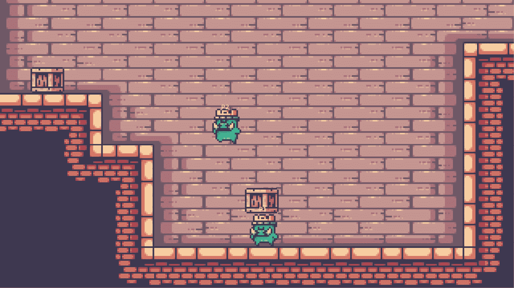

图 8.1 – 拼图平台游戏原型的预览

到本章结束时，您将了解如何使用`MultiplayerSpawner`节点的功能来创建和分配可玩角色给游戏中的每个玩家，并使用`MultiplayerSynchronizer`提供的功能同步相关属性。有了这些功能，我们不仅可以更新节点的位置；它们还将允许我们同步其他属性，尤其是动画。您还将学习如何利用**远程过程调用（RPCs**）来操纵节点的**多人权限**。这将使我们能够实现一个令人兴奋的对象抓取机制，这将是我们的原型中的关键元素。

# 技术要求

要访问本章的资源，您可以点击此处提供的链接找到我们的在线项目仓库：[`github.com/PacktPublishing/The-Essential-Guide-to-Creating-Multiplayer-Games-with-Godot-4.0`](https://github.com/PacktPublishing/The-Essential-Guide-to-Creating-Multiplayer-Games-with-Godot-4.0)。

一旦您有了仓库，请打开 Godot 引擎编辑器中的`res://08.designing-online-platformer`文件夹。本章所需的所有文件都位于那里。

现在，让我们开始入职流程。在接下来的部分，我们将熟悉项目，探索其主要类，并确定我们需要实现网络功能的地方。

# 介绍平台游戏项目

我们的项目展示了一个引人入胜的拼图平台游戏，玩家在克服挑战性障碍的过程中将测试他们的战略思维和协作技能。这个游戏的核心机制围绕着对象的操控，利用它们为其他玩家构建可以穿越的平台。

现在，让我们深入了解构成我们项目基础的基石类。我们的第一次接触将是`Player`类，它代表了每个玩家控制的化身。作为主要的主角，`Player`类处理诸如移动和与各种环境元素交互等基本功能。值得注意的是，`Player`类集成了`InteractionArea2D`，它可以检测与`InteractiveArea2D`的接触，使玩家能够在它们上执行特定操作。

接下来，我们遇到了 `InteractiveArea2D` 类。这个类扩展了 `Area2D` 节点的功能，并承担了检测交互的关键触发区域角色。当 `InteractionArea2D` 与 `InteractiveArea2D` 重叠时，它会对输入事件做出响应。触发指定的 *interact* 输入动作会发出信号，使我们能够创建更吸引人的游戏交互。

在我们的游戏中，`Crate` 类代表一个玩家可以熟练操作的交互式对象。每个 `Crate` 实例都有一个 `InteractiveArea2D` 节点和 `CharacterBody2D` 节点，为玩家提供了与它们碰撞和跳跃的机会，这使得玩家可以将它们作为可行的平台来导航关卡。这些箱子是解决谜题和通过游戏关卡的主要元素。

最后，我们遇到了多才多艺的 `PlayerSpawner` 类，它负责在游戏中动态生成和管理玩家。这个类能够灵活地适应参与玩家的数量，为每个玩家无缝地实例化一个 `Player` 实例。此外，在本地多人游戏中，`PlayerSpawner` 类通过为每个玩家设置独特的控制并优化游戏定制来确保流畅和沉浸式的游戏体验。

在接下来的部分，我们将深入研究 `Player` 对象，它由脚本和场景组成。我们将了解脚本如何与场景上的可用节点协同工作，并构建我们本地 `Player` 节点的期望行为。

## 理解 Player 类

`Player` 类和场景代表了游戏中的玩家角色。玩家正是通过这个场景和脚本与游戏世界进行交互。场景是一个带有 `CollisionShape2D` 资源的 `CharacterBody2D` 节点，一个名为 `Sprites` 的 `Node2D` 节点，我们用它来分组和旋转一个 `AnimatedSprite2D` 节点，以及一个 `InteractionArea2D` 节点，我们将在 *InteractiveArea2D 类的工作原理* 部分进行讨论。`InteractionArea2D` 节点也包含一个 `CollisionShape2D` 资源和一个 `RemoteTransformer2D` 节点，我们称之为 `GrabberRemoteTransformer2D`。一个 `RemoteTransformer2D` 节点允许我们远程同步一个节点（它位于 `RemoteTransformer2D` 父节点的层次结构之外）的位置、旋转和缩放，就像它是 `RemoteTransformer2D` 的兄弟节点一样，这非常有用。在这种情况下，我们使用 `GrabberRemoteTransformer2D` 节点来远程变换玩家可以抓取的对象，例如 *箱子*，我们将在 *揭开 Crate 类的面纱* 部分进行讨论。最后，`Player` 类还有一个 `Label` 节点，我们用它来视觉上传达控制角色的玩家。

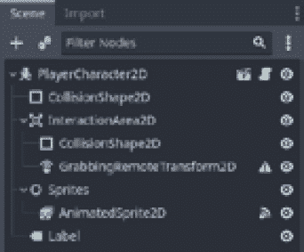

图 8.2 – 玩家的场景节点层次结构

现在，让我们看看脚本本身。在本节中，我们不会深入探讨一些方面，因为它们与基本平台游戏玩家移动更相关，而我们在这里的重点是网络多人游戏方面，所以我们将超出我们的范围。但对你工作来说重要的是要知道，当两个玩家在本地玩游戏时，`Player`节点可以动态设置其控制器，以便每个玩家只控制一个角色。在原型网络版本中，你必须实现这一点：每个玩家将只控制自己的角色。为了参考，以下代码片段在本地执行此操作：

```cpp
func setup_controller(index):
    for action in InputMap.get_actions():
        var new_action = action + "%s" % index
        InputMap.add_action(new_action)
        for event in InputMap.action_get_events(action):
            var new_event = event.duplicate()
            new_event.device = index
            InputMap.action_add_event(new_action, event)
        for property in get_property_list():
            if not typeof(get(property.name)) ==
                TYPE_STRING:
                continue
            if get(property.name) == action:
                set(property.name, new_action)
```

之前的代码遍历`InputMap`单例中的操作，并使用索引创建针对给定控制器设备的新操作。它还更新与操作相关的事件和属性，以确保它们针对特定设备。此代码的目的是为游戏中的不同玩家或设备设置控制器映射，允许自定义和区分输入控制。

在下一节中，让我们看看*Crate*场景是如何工作的，这是一个相当简单的场景，本质上作为一个被动对象，玩家可以用它作为移动的平台。

## 揭示*Crate*类

`Crate`场景在我们的游戏原型中起着至关重要的作用。它代表玩家可以熟练操作的交互式对象，以克服障碍并通过关卡。`Crate`场景的每个实例都配备了两个重要的组件：`InteractiveArea2D`节点和`CharacterBody2D`节点。

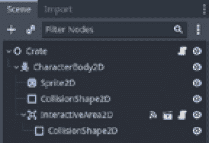

图 8.3 – *Crate*场景节点层次结构

`CharacterBody2D`节点代表游戏物理模拟中*Crate*节点的物理身体。它确保箱子与玩家的角色或其他对象发生碰撞。`CharacterBody2D`节点处理碰撞检测和响应，使玩家能够无缝地跳上并站在箱子上，就像它是一个坚固的平台。

至于`InteractiveArea2D`节点，它是一个特殊的`Area2D`节点，用于检测当`InteractiveArea2D`节点与其重叠时。在*Crate*类的上下文中，`InteractiveArea2D`节点允许玩家在按下`interact`动作且其`InteractionArea2D`节点与*Crate*的`InteractionArea2D`节点重叠时抓住并举起*Crate*节点。这种交互使玩家能够将*Crate*节点作为坚固的平台来导航关卡，因为他们将能够移动它们并在其他玩家抓住它们时跳上它们。`InteractiveArea2D`节点充当触发器，检测玩家的角色与`Crate`节点接触时，并将`Crate`节点分配给玩家的角色`GrabbingRemoteTransform2D`节点，即使他们在移动时也会同步其位置。

`Crate`脚本相当简单，它定义了`Crate`节点如何响应和更新与`Player`节点的交互：

```cpp
extends Node2D
@onready var body = $CharacterBody2D
@onready var shape = $CharacterBody2D/CollisionShape2D
@onready var interactive_area = $CharacterBody2D/
    InteractiveArea2D
var lift_transformer = null
func _on_interactive_area_2d_area_entered(area):
    lift_transformer = area.get_node
        ("GrabbingRemoteTransform2D")
func _on_interactive_area_2d_interacted():
    lift_transformer.remote_path =
        lift_transformer.get_path_to(body)
```

上述代码设置了`Crate`场景层次结构中节点的引用。它还定义了两个回调函数，用于处理来自`Crate`节点`InteractiveArea2D`节点的信号。当一个`InteractionArea2D`节点进入`Crate`节点的`InteractiveArea2D`节点时，我们假设它是`Player`节点进行交互，并检索`Player`节点的`"GrabbingRemoteTransform2D"`节点，将其分配给`lift_transformer`变量。

当发生交互时，代码将`lift_transformer.remote_path`节点分配给从`lift_transformer`变量到`Crate`节点身体的路径。记住，`lift_transformer`变量是一个`RemoteTransform2D`节点。这就是我们允许`Player`节点的`GrabbingRemoteTransform2D`节点远程变换`Crate`节点的`CharacterBody2D`节点位置的方式。

在下一节中，我们将了解`InteractiveArea2D`节点如何检测玩家与*Crate*节点的交互以及它在我们的游戏中的作用。

## InteractiveArea2D 类的工作原理

在本节中，我们将了解我们游戏机制核心中的一个主要场景的作用。这个场景被称为`InteractiveArea2D`节点，它在检测和启用玩家与游戏环境中的各种对象交互方面发挥着基本作用。`InteractiveArea2D`节点使我们能够将任何对象转换为玩家可以与之交互的对象。例如，在我们的原型中，我们使用`InteractiveArea2D`节点来允许玩家抓住`Crate`节点并将其移动。

基于`Area2D`节点构建的`InteractiveArea2D`场景是我们游戏中的基本组件。其主要功能是检测和简化玩家与对象的交互，尤其是在玩家与箱子交互机制中。通过使用信号和输入处理，`InteractiveArea2D`场景确保了流畅的游戏交互。

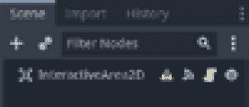

图 8.4 – InteractiveArea2D 场景节点层次结构

我们游戏的一个突出特点是玩家与`Crate`节点交互机制，它为玩家提供了操作交互对象的能力。`InteractiveArea2D`场景是这个交互的催化剂，它作为玩家可以与之互动的游戏世界中对象的门户。

通过使用信号，`InteractiveArea2D`场景与其他游戏对象和系统建立了通信渠道。每当玩家成功与一个对象交互时，`InteractiveArea2D`节点会发出`interacted`信号。除此之外，场景还会发出信号以指示交互的可用性或不可用性，使我们能够向玩家提供视觉和听觉反馈。

为了检测玩家输入，`InteractiveArea2D` 场景使用 `_unhandled_input` 回调。当玩家按下指定的 `interact` 输入动作时，它触发 `interacted` 信号，表示发生了交互。这种控制方案允许玩家与游戏世界进行交互。

理解 `InteractiveArea2D` 场景的作用以及它与玩家-`Crate` 节点交互系统的无缝集成是关键。现在，是时候深入代码，发挥这个关键场景在我们游戏中的全部潜力了：

```cpp
class_name InteractiveArea2D
extends Area2D
signal interacted
signal interaction_available
signal interaction_unavailable
@export var interact_input_action = "interact"
func _ready():
    set_process_unhandled_input(false)
func _unhandled_input(event):
    if event.is_action_pressed(interact_input_action):
        interacted.emit()
        get_viewport().set_input_as_handled()
func _on_area_entered(_area):
    set_process_unhandled_input(true)
    interaction_available.emit()
func _on_area_exited(_area):
    set_process_unhandled_input(false)
    interaction_unavailable.emit()
```

`InteractiveArea2D` 脚本扩展了 `Area2D` 节点，并提供了交互功能。当发生交互时，当交互变得可用时，以及当交互变得不可用时，它会发出信号。它还处理未处理的输入事件以触发交互。

在下一节和入门的最后部分，我们将看到如何根据有多少玩家在玩，动态地在游戏世界中创建和插入 `Player` 实例。

## 理解 PlayerSpawner 类

`PlayerSpawner` 场景是我们游戏中另一个关键组件，负责创建和定位 `Player` 实例。基于 `Marker2D` 节点的 `PlayerSpawner` 类遵循 `Spawner` 模式，使我们能够在游戏世界中动态生成 `Player` 实例。

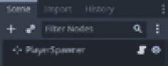

图 8.5 – PlayerSpawner 的场景节点层次结构

`PlayerSpawner` 类的一个关键特性是其能够定位生成的 `Player` 实例。作为一个 `Marker2D` 节点，`PlayerSpawner` 节点提供了一个方便的方式来指定玩家在游戏世界中的位置和朝向。这确保了每个玩家都能从适当的位置开始，准备好开始他们的冒险。

让我们看看它的代码，以了解这个类在底层做了什么：

```cpp
extends Marker2D
@export var players_scene = preload("res://08.designing-
    online-platformer/Actors/Player/Player2D.tscn")
func _ready():
    if Input.get_connected_joypads().size() < 1:
        var player = players_scene.instantiate()
        add_child(player)
        return
    for i in Input.get_connected_joypads():
        var player = players_scene.instantiate()
        add_child(player)
        player.setup_controller(i)
```

上述脚本展示了基于 `Marker2D` 节点的 `Spawner` 类的实现。它检查连接的控制器，并根据连接的控制器创建相应的 `Player` 场景实例。如果没有连接的控制器，它创建一个单独的实例。如果有连接的控制器，它为每个控制器创建一个 `Player` 实例并设置它们各自的控制。上述代码片段允许在多人游戏中动态创建 `Player` 实例，简化了我们开发多人游戏体验的工作。

我们终于完成了我们的入门；在下一节中，我们将开始实现我们的在线多人游戏功能，将我们的本地原型转变为我们可以安全工作并打磨的产品，因为我们知道它已经准备好与远程多人游戏功能一起发布。

# 在比赛中生成玩家

在本节中，我们将了解如何改进 `PlayerSpawner` 类，以将在线多人功能引入我们的游戏。利用 *理解 PlayerSpawner 类*、*揭示 Crate 类* 和 *理解 Player 类* 等章节所奠定的基础，这些增强功能使多个玩家能够无缝连接并在同步的游戏环境中交互。

`PlayerSpawner` 节点在我们游戏的多玩家架构中扮演着基本角色，作为负责为每个连接的玩家动态创建 `Player` 类实例的核心机制。这些实例代表玩家通过它们与游戏世界进行交互的化身。

通过集成多人功能，我们将添加专为在线多人体验设计的功能。这包括处理多人权限的机制，确保所有连接节点上的游戏玩法正确。在此基础上，代码将使用节点 ID 建立独特的玩家名称，使我们能够轻松识别网络上的玩家。为了确保同步动作，我们将使用 RPC，这将允许我们在所有连接的玩家之间共享事件和动作，特别是其他玩家的实例化。

我们在这里将要介绍的一个基本概念是 `MultiplayerSpawner` 节点。在 Godot Engine 4 高级网络 API 中，`MultiplayerSpawner` 节点是在网络化多人设置中创建同步场景的无价资产。在我们的上下文中，它是同步创建玩家核心组件，确保每个玩家都能实时看到并与其他玩家的化身进行交互。

使用 `MultiplayerSpawner` 节点，我们可以轻松地在所有连接的游戏实例中实例化和定位玩家化身。因此，首先，让我们打开位于 `res://08.designing-online-platformer/Levels/PlayerSpawner.tscn` 的 `PlayerSpawner` 场景，并将其作为子节点添加一个 `MultiplayerSpawner` 节点。

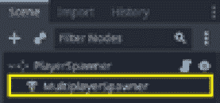

图 8.6 – PlayerSpawner 节点作为 PlayerSpawner 节点的子节点

之后，我们需要配置 `MultiplayerSpawner` 节点的 `PlayerSpawner` 属性。这告诉 `MultiplayerSpawner` 应该将哪个场景作为生成场景的父级。然后，第二个属性应该指向 `PlayerSpawner` 节点生成的相同 `PackedScene` 资源。这将确保，当本地创建新实例时，`MultiplayerSpawner` 节点将在连接的节点上复制它。

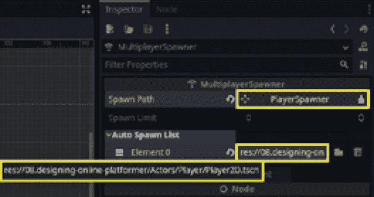

图 8.7 – 配置 MultiplayerSpawner 的生成路径和自动生成列表属性

这样，我们的`MultiplayerSpawner`节点就准备好在每个人的游戏实例上同步新玩家了。但我们仍然需要配置这些新实例，否则，只有服务器才能控制它们。所以，让我们看看我们如何赋予玩家控制自己化身的能力。打开`PlayerSpawner`脚本，位于`res://08.designing-online-platformer/Levels/PlayerSpawner.gd`。在下一节中，我们将对此脚本进行一些修改。

## 在`PlayerSpawner`中赋予玩家控制权

新的`PlayerSpawner`代码引入了增强游戏多人功能性的更改。具体来说，此代码包括处理多人同步的机制，并在多个 Peer 连接时正确设置`Player`实例。这些更改包括检查多人权限、设置玩家名称和使用 RPC 为每个连接的玩家设置多人功能。让我们实现这些功能：

1.  在`_ready()`回调的开始处添加`await(get_tree().create_timer(0.1).timeout)`。这一行使用计时器引入了 0.1 秒的延迟，为多人网络初始化完成留出了时间：

    ```cpp
    func _ready():
        await(get_tree().create_timer(0.1).timeout)
    ```

1.  然后，让我们检查是否有连接的 Peer，通过检查`multiplayer.get_peers()`数组的大小。有了这个，我们可以检查多人会话中是否有连接的 Peer。这个条件验证了这是否是一个本地游戏会话：

    ```cpp
    func _ready():
        await(get_tree().create_timer(0.1).timeout)
        if multiplayer.get_peers().size() < 1:
    ```

1.  如果是这样，我们使用在*理解 Player 类*部分看到的原始逻辑来设置本地玩家化身控制器。稍作修改，我们在最后使用`return`关键字来防止`_ready()`执行到下一步，这些步骤只有在是在线游戏会话时才是必要的：

    ```cpp
    func _ready():
        await(get_tree().create_timer(0.1).timeout)
        if multiplayer.get_peers().size() < 1:
            if Input.get_connected_joypads().size() < 1:
                var player = players_scene.instantiate()
                add_child(player)
                return
            for i in Input.get_connected_joypads():
                var player = players_scene.instantiate()
                add_child(player)
                player.setup_controller(i)
            return
    ```

1.  然后，如果这是一个在线游戏会话，我们检查这个游戏实例是否是多人权限（换句话说，是服务器），如果是的话，我们进入一个循环，遍历连接的 Peer：

    ```cpp
        if is_multiplayer_authority():
                for i in range(0, multiplayer.get_peers().
                    size()):
    ```

1.  与本地会话逻辑类似，我们为每个连接的玩家创建一个`Player`实例：

    ```cpp
        if is_multiplayer_authority():
                for i in range(0, multiplayer.get_peers().
                    size()):
                    var player = players_scene.
                        instantiate()
    ```

1.  这里有个关键点：在创建`Player`实例后，我们将其实例的名称设置为玩家的 Peer ID。只有在这个步骤之后，我们才将其添加为`PlayerSpawner`节点的子节点。这确保了每个`Player`实例都有一个唯一的名称，并将防止 RPC 和`MultiplayerSpawner`节点返回错误：

    ```cpp
    if is_multiplayer_authority():
            for i in range(0, multiplayer.get_peers().
                size()):
                var player = players_scene.instantiate()
                var player_id = multiplayer.get_peers()[i]
                player.name = str(player_id)
                add_child(player)
    ```

1.  然后，我们添加另一个`0.1`秒的计时器延迟。这个延迟给 Peer 的游戏实例同步多人设置留出了时间：

    ```cpp
    if is_multiplayer_authority():
            for i in range(0, multiplayer.get_peers().
                size()):
                var player = players_scene.instantiate()
                var player_id = multiplayer.get_peers()[i]
                player.name = str(player_id)
                add_child(player)
                await(get_tree().create_timer(0.1).
                    timeout)
    ```

1.  最后，我们通过传递`player_id`作为参数调用 RPC 到`Player.setup_multiplayer()`方法。`Player.setup_multiplayer()`负责根据玩家 ID 配置玩家的*多人权限*，最终允许这个玩家，而且只有这个玩家，控制这个实例。我们将在*设置玩家多人控制*部分实现此方法：

    ```cpp
    if is_multiplayer_authority():
            for i in range(0, multiplayer.get_peers().
                size()):
                var player = players_scene.instantiate()
                var player_id = multiplayer.get_peers()[i]
                player.name = str(player_id)
                add_child(player)
                await(get_tree().create_timer(0.1).
                    timeout)
                player.rpc("setup_multiplayer", player_id)
    ```

我们还没有完成。我们还需要在`MultiplayerSpawner`节点创建其他玩家的化身实例时设置多人游戏功能。为此，让我们使用名为`_on_multiplayer_spawner_spawned`的方法将`MultiplayerSpawner`节点的`spawned`信号连接到`PlayerSpawner`节点。

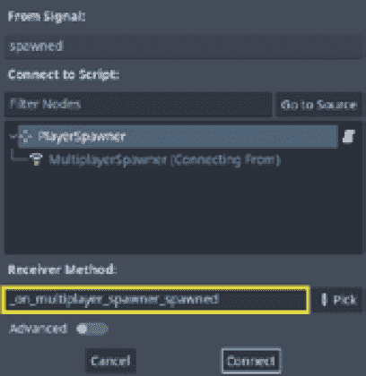

图 8.8 – MultiplayerSpawner 产生的信号连接到 PlayerSpawner 的 _on_multiplayer_spawner_spawned 回调

然后，我们使用节点名称作为参数在产生的节点的`setup_multiplayer`方法上执行 RPC。由于名称是一个`StringName`变量，我们需要将其转换为字符串，然后再将其转换为整数，以便`Player`类可以处理它。在做出这些更改后，完整的`PlayerSpawner`脚本应如下所示：

```cpp
extends Marker2D
@export var players_scene = preload("res://08.designing-
    online-platformer/Actors/Player/Player2D.tscn")
func _ready():
    await(get_tree().create_timer(0.1).timeout)
    if multiplayer.get_peers().size() < 1:
        if Input.get_connected_joypads().size() < 1:
            var player = players_scene.instantiate()
            add_child(player)
            return
        for i in Input.get_connected_joypads():
            var player = players_scene.instantiate()
            add_child(player)
            player.setup_controller(i)
        return
    if is_multiplayer_authority():
        for i in range(0, multiplayer.get_peers().size()):
            var player = players_scene.instantiate()
            var player_id = multiplayer.get_peers()[i]
            player.name = str(player_id)
            add_child(player)
            await(get_tree().create_timer(0.1).timeout)
            player.rpc("setup_multiplayer", player_id)
func _on_multiplayer_spawner_spawned(node):
    node.rpc("setup_multiplayer", int(str(node.name)))
```

更新的脚本通过为网络中的每个玩家创建`Player`实例来集成多人游戏功能。它检查连接的摇杆和多人游戏对等体的存在，以确定需要创建的`Player`实例的数量。代码还设置了`Player`实例的控制并同步它们的多人游戏设置。这些更改使得`PlayerSpawner`节点现在可以启用多人游戏，允许多个玩家同时控制他们的化身并在游戏世界中交互，没有任何控制冲突。

在接下来的部分中，我们将探讨`Player.setup_multiplayer()`方法的实现，该方法负责配置`Player`类的在线多人游戏设置。在`setup_multiplayer()`方法中，我们设置多人游戏权限，根据本地玩家对实例的权限禁用物理和输入处理，并设置一个视觉玩家索引标签，该标签会更新控制实例的玩家。

## 设置玩家多人游戏控制

在本节中，我们将探讨如何实现`Player.setup_multiplayer()`方法，该方法在设置`Player`类的在线多人游戏控制中起着核心作用。

在`setup_multiplayer()`方法中，我们需要采取一些关键步骤来实现我们的在线多人游戏控制。首先，我们需要建立新的多人游戏权限，验证玩家在多人游戏环境中的控制和决策能力。然后，我们将根据玩家 ID 是否与我们使用节点名称指定的玩家 ID 匹配来调整物理和输入处理。这确保了每个玩家控制正确的`Player`实例。

此外，该方法还更新了视觉玩家索引标签，使玩家能够看到分配给他们的化身。这种视觉反馈通过提供每个玩家身份和游戏中的存在感的明确指示，增强了多人游戏体验。

通过实现`setup_multiplayer()`方法，游戏实现了同步多人功能，创造了一个统一且沉浸式的多人体验。玩家可以相互互动和协作，在游戏世界中鼓励共享冒险和享受的感觉。

话虽如此，让我们深入代码，解锁我们原型中多人游戏功能的潜力！打开位于`res://08.designing-online-platformer/Actors/Player/Player2D.gd`的`Player`脚本，并实现`setup_multiplayer()`方法，最终允许玩家控制他们的化身：

1.  在`Player`脚本中，创建一个新的方法名为`setup_multiplayer()`。它应该接收一个参数来获取玩家的 ID；在这里，我们将它称为`player_id`：

    ```cpp
    func setup_multiplayer(player_id):
    ```

1.  然后，使用`@rpc`注解装饰该方法，使用`"any_peer"`和`"call_local"`选项。这指定了该方法可以被任何同伴调用并在本地执行。因此，当玩家生成他们的化身时，他们会告诉其他同伴设置他们的化身，同时在本地设置化身实例：

    ```cpp
    @rpc("any_peer", "call_local")
    func setup_multiplayer(player_id):
    ```

1.  在`setup_multiplayer()`方法内部，让我们调用`set_multiplayer_authority()`，传递`player_id`作为参数来设置这个`Player`实例的新多人权限。记住，多人权限决定了节点上同伴的控制和决策能力：

    ```cpp
    @rpc("any_peer", "call_local")
    func setup_multiplayer(player_id):
        set_multiplayer_authority(player_id)
    ```

1.  然后，让我们创建一个变量来存储`player_id`是否等于`Player`实例名称。有了这个，我们检查当前化身是否应该由本地玩家控制：

    ```cpp
    @rpc("any_peer", "call_local")
    func setup_multiplayer(player_id):
        set_multiplayer_authority(player_id)
        var is_player = str(player_id) == str(name)
    ```

1.  之后，我们根据`is_player`变量的值设置物理和未处理输入处理。有了这个，我们禁用了不属于本地玩家的`Player`实例上的物理处理和输入处理：

    ```cpp
    @rpc("any_peer", "call_local")
    func setup_multiplayer(player_id):
        set_multiplayer_authority(player_id)
        var is_player = str(player_id) == str(name)
        set_physics_process(is_player)
        set_process_unhandled_input(is_player)
    ```

1.  最后，我们将`label`节点的文本更新为显示玩家索引。在这里，`%s`是一个占位符，它会被`get_index()`返回的值替换，代表玩家在`PlayerSpawner`子节点层次结构中的索引（记住第一个节点是`MultiplayerSpawner`），因此玩家索引从`1`开始：

    ```cpp
    @rpc("any_peer", "call_local")
    func setup_multiplayer(player_id):
        set_multiplayer_authority(player_id)
        var is_player = str(player_id) == str(name)
        set_physics_process(is_player)
        set_process_unhandled_input(is_player)
        label.text = "P%s" % get_index()
    ```

这样，我们就有了准备在在线多人环境中表现的`Player`实例。`setup_multiplayer()`方法配置了`Player`实例中的多人功能。它设置多人权限，根据本地玩家 ID 调整物理处理和输入处理，并更新一个带有玩家索引的标签。

但是请注意，由于我们正在禁用物理和输入处理，从技术上讲，其他玩家的化身在整个游戏过程中将保持静态，对吧？每个玩家只能控制并看到他们自己的角色移动，我们不想这样。我们希望玩家能够相互互动，并看到其他玩家在这个共享体验中的行为。

在下一节中，我们将使用`MultiplayerSynchronizer`节点来确保所有玩家在彼此的角色的各个方面保持一致，包括不仅仅是角色的位置，还包括其动画等。我们还将了解如何处理`Crate`节点：由于玩家可以抓住并携带它，谁应该控制它？`Crate`节点的**多玩家权限**应该由谁拥有？

# 同步物理对象

在本节中，我们将了解如何使用`MultiplayerSynchronizer`节点进行位置更新以外的同步。该节点在确保玩家与游戏中其他玩家的角色保持同步方面发挥着重要作用。正如我们在*在 PlayerSpawner 中给予玩家控制权*部分所看到的，保持玩家之间的一致性对于创建无缝的多人游戏体验至关重要。

`MultiplayerSynchronizer`类作为玩家之间的桥梁，实现了各种属性的实时更新和同步。我们将探讨的一个关键方面是，如何根据携带`Crate`对象的玩家更新该对象的位置。这一功能允许玩家进行交互式和协作式游戏，玩家可以一起解决谜题或完成任务。

此外，我们将了解`MultiplayerSynchronizer`节点如何处理与角色动画相关的属性。通过利用`MultiplayerSynchronizer`类，我们可以确保所有玩家观察到其他玩家角色的相同动画状态，从而实现视觉上的一致体验。

通过使用`MultiplayerSynchronizer`节点，我们可以建立一个强大的同步框架，用于同步玩家动作、角色位置和动画。这种同步确保了所有玩家感知到一个统一和沉浸式的多人游戏环境，促进协作并提升整体游戏体验。

让我们探索`MultiplayerSynchronizer`的实现细节！

## 同步玩家的位置和动画

我们的`Player`场景中有些节点负责根据玩家的动作和当前角色状态播放动画，即`Sprites`和`AnimatedSprite2D`节点。同步`Sprites`节点的缩放和`AnimatedSprite`动画及帧非常重要，因为如果玩家跳跃、奔跑和保持静止，而游戏世界中没有视觉反馈来更新这些动作的表现，玩家角色看起来会相当奇怪。因此，在本节中，让我们确保除了位置之外，其他相关属性也在玩家之间同步。为此，让我们打开`Player`场景，路径为`res://08.designing-online-platformer/Actors/Player/Player2D.tscn`，当然，将其子节点添加为`MultiplayerSynchronizer`。有了这个，我们将执行以下步骤：

1.  首先，我们需要将`MultiplayerSynchronizer`的**可见性更新模式**更改为**物理**，以便它在远程玩家的游戏实例上同步物理模拟。

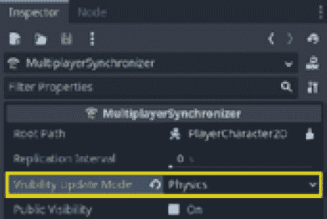

图 8.9 – 玩家的 MultiplayerSynchronizer 属性

1.  之后，在`PlayerCharacter2D`节点的`AnimatedSprite2D`节点的`Sprite`节点的`MultiplayerSynchronizer`节点也同步了动画相关属性，使得玩家可以看到他们的同伴的化身正在做什么。

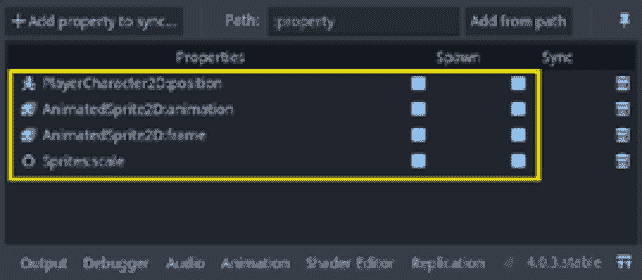

图 8.10 – MultiplayerSynchronizer 的复制属性

就这样！有了这个，我们的玩家就可以在共享的游戏世界中互动了。`MultiplayerSynchronizer`节点是我们工具箱中一个了不起的盟友，在开发在线多人游戏时。正如我们在这个部分所看到的，这些节点允许同步一系列不同的属性，可以帮助我们使在线游戏体验愉快。在这方面有一个小但非常重要的观察要提。正如我们在整本书中看到的，特别是在*第一部分*，我们不能传递对象，我们应该避免通过网络进行大量数据传输。所以，在向`MultiplayerSynchronizer`节点的**复制**菜单添加属性时要记住这一点。例如，如果你尝试同步一个**纹理**属性，你很可能会失败复制。

话虽如此，在下一节中，我们将使用`MultiplayerSynchronizer`节点来同步`Crate`节点的位置属性，但有一个转折。由于任何玩家都可以抓取一个`Crate`节点并移动它，那么它的**多玩家权限**应该归谁？嗯，这正是我们即将看到的！

## 远程更新箱子的位置

到目前为止，我们对`MultiplayerSynchronizer`节点的工作方式和节点多玩家权限的整体概念相当熟悉，对吧？我们在线多人解谜平台游戏中的一个核心机制是玩家能够通过拿取物体并将它们用作平台来通过关卡障碍。

在本节中，我们将看到如何根据当前与对象交互的是哪个玩家动态地更改对象的多玩家权限，以便只有那个玩家可以更改对象的属性。打开`Crate`场景在`res://08.designing-online-platformer/Objects/Crate/Crate.tscn`，并添加一个新的`MultiplayerSynchronizer`节点作为其子节点。然后，按照以下步骤操作：

1.  就像在`Player`场景中一样，我们需要将`MultiplayerSynchronizer`节点的**可见性更新模式**更改为**物理**，以保持物理模拟的一致性。

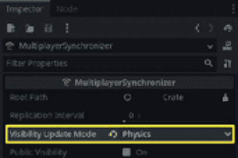

图 8.11 – 箱子的 MultiplerSynchronizer 属性

1.  然后，在`CharacterBody2D`节点的**位置**属性中进行同步。

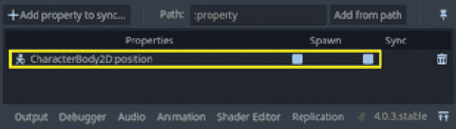

图 8.12 – 复制菜单中箱子的 CharacterBody2D 位置属性

相信与否，我们已经有同步箱子位置所需的一切了。目前，箱子没有内置的移动行为，因为它的位置预计将被与之交互的玩家更改。为了启用此功能，我们将对`Crate`脚本进行一些修改。要开始，让我们打开位于`res://08.designing-online-platformer/Objects/Crate/Crate.gd`的脚本文件。

在`_on_interactive_area_2d_area_entered()`方法中，我们需要将箱子的多人游戏权限更改为与它交互的玩家匹配。为此，我们可以调用`set_multiplayer_authority()`方法，传入区域的多人游戏权限。刚刚进入的这个区域是玩家的`InteractionArea2D`节点，因此它的多人游戏权限与玩家相同：

```cpp
func _on_interactive_area_2d_area_entered(area):
    lift_transformer = area.get_node
        ("GrabbingRemoteTransform2D")
    set_multiplayer_authority
        (area.get_multiplayer_authority())
```

有了这个，每当玩家的角色进入箱子的`InteractiveArea2D`节点时，玩家将成为箱子的多人游戏权限，并且一旦与它交互，就能抓住它并改变它的位置。有了这个新增功能，我们就可以见证箱子位置在玩家交互时的无缝同步。您可以测试原型来探索协作游戏的可能性，并享受我们刚刚创建的沉浸式多人游戏体验！

# 摘要

在本章中，我们深入探讨了在线多人解谜平台游戏的世界，这强调了团队合作和协作。玩家将面临挑战，需要共同努力，利用他们的技能克服障碍并穿越复杂的关卡。在整个章节中，我们探讨了增强多人游戏体验和创建无缝协作游戏环境的关键概念和技术。

为了启用多人游戏功能，我们引入了`MultiplayerSpawner`类，该类根据连接的玩家数量动态实例化`Player`实例。这确保了每个玩家在游戏中都有一个独特的角色，促进了个性化且沉浸式的多人游戏体验。`Player`类发挥了关键作用，我们实现了`setup_multiplayer()`方法来配置其多人游戏设置。此方法允许我们设置每个实例的多人游戏权限，调整物理和输入处理，并更新一个视觉玩家索引标签，为玩家提供清晰的识别。

为了实现玩家之间的同步，我们利用了`MultiplayerSynchronizer`节点的力量。这个强大的工具使我们能够同步玩家的位置以及他们的动画。通过整合`MultiplayerSynchronizer`节点，我们创造了一个视觉上引人入胜的多玩家体验，玩家在游戏中移动和互动，达到了完美的和谐。这种同步让多玩家游戏玩法栩栩如生，增强了沉浸感，并确保了一个连贯且愉快的共享体验。

我们实现的一个令人兴奋的功能是玩家能够抓取并操作`Crate`对象。通过动态改变箱子的多玩家权限，我们确保只有与箱子互动的玩家才能控制其移动。这增加了一层额外的协作和解决问题，因为玩家可以战略性地使用箱子作为平台来穿越关卡，促进团队合作和协调。

总结来说，这一章为使用 Godot 引擎高级网络 API 理解和实现多人功能提供了一个坚实的基础。通过结合探索的概念和技术，我们创建了一个在线多人益智平台游戏原型，玩家可以无缝协作，同步他们的行动，并共同克服挑战。这一章为未来多人游戏开发中的无限可能性打开了大门，赋予你创造引人入胜和互动的多玩家体验的能力。

在下一章中，我们将利用本书第二部分所看到的所有知识，创建一个具有持久部分系统的多人在线冒险游戏，玩家可以登录和登出并保持他们的进度。玩家还将同步服务器的世界与他们的游戏实例世界，这也意味着他们能够看到当前正在玩的所有其他玩家，并相互互动。这本质上是一个原型，如果你愿意，可以扩展成一个**大型多人在线角色扮演游戏**（**MMORPG**）。
