# 调试和监控网络

通过*第九章**，*创建在线冒险原型*，我们结束了第二部分，*创建在线多人机制*，的旅程，其中我们学习了如何使用 Godot 引擎的高级网络 API 将本地游戏机制转换为在线多人机制。现在，是时候超越实现并开始优化我们的机制了。本章开启了第三部分，*优化在线体验*，的旅程，通过 Godot 引擎创建在线多人游戏。

重要的是，你已经阅读、理解并实现了在*第九章**，*创建在线冒险原型*，中提供的内容，因为我们将在第三部分接下来的章节中，以最终项目作为我们的主要主题。

在这个特定的章节中，我们将了解如何使用 Godot 引擎内置的`MultiplayerSynchronizers`的性能，为我们提供一个关于网络实现中潜在问题的良好概述。最后，我们将学习如何使用调试器窗口的`Performance`单例来找出游戏中的潜在瓶颈并收集数据以设计潜在解决方案。

到本章结束时，你将了解如何使用强大的调试器工具，以下图中的元素不会再让你感到害怕；相反，它们将成为你最可靠的盟友：

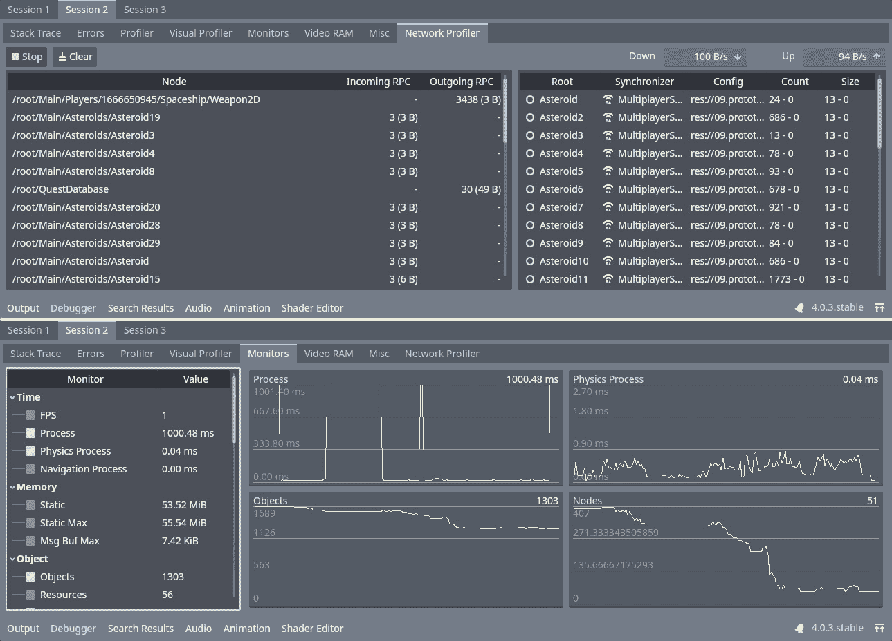

图 10.1 – 调试器的网络分析器（顶部）和监视器（底部）显示并绘制分析数据

如果你在本章结束时回到这个图并理解了每个图表和图表的含义，请不要感到惊讶。你会习惯它们的，因为它们将在下一章中大量出现，尤其是在*第十一章**，*优化数据请求*。

# 技术要求

如前所述，阅读并遵循在*第九章*，*创建在线冒险原型*中提供的说明至关重要。在本章中，我们将使用上一章结束时你应该拥有的最终产品。你可以通过以下链接访问本章的资源：

[`github.com/PacktPublishing/The-Essential-Guide-to-Creating-Multiplayer-Games-with-Godot-4.0`](https://github.com/PacktPublishing/The-Essential-Guide-to-Creating-Multiplayer-Games-with-Godot-4.0)

准备好*第九章**，*创建在线冒险原型*的结果后，我们可以继续了解如何改进它。

# 介绍 Godot 的调试器

调试器是开发者的最佳助手。我们的大部分工作与创建和实现功能无关；相反，它与我们评估这些实现可能引起的问题并修复它们有关。**调试器**窗口是 Godot 引擎与我们交流的地方，显示错误、警告、资源消耗、对象计数等等。因此，我们应该仔细倾听并妥善处理它显示的问题和数据。我们甚至可以要求它跟踪自定义数据，正如我们将在*使用监视器*标签部分中看到的那样。

如果您已经使用 Godot 引擎开发游戏足够长的时间以至于遇到了错误，您可能比您希望的更频繁地遇到了**调试器**窗口，对吧？在本节中，我们将深入探讨如何将其变成我们的好朋友，并希望它能够经常出现。让我们从理解它的每个标签开始，如何阅读它们，以及可以期待它们提供什么，从最常见的一个开始，可能也是您已经遇到困难的一个：**堆栈跟踪**标签。

## 掌握堆栈跟踪标签

当您点击**调试器**窗口时，Godot 引擎的编辑器将打开**堆栈跟踪**标签。让我们使用以下图示来导航它，并理解其每个元素的功能。

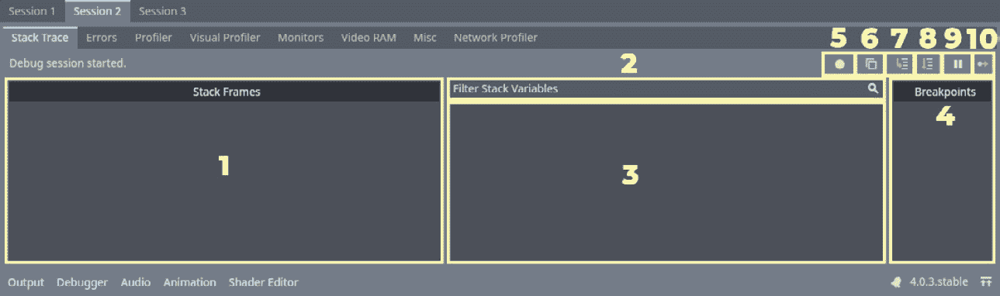

图 10.2 – 调试器窗口的堆栈跟踪标签及其元素

您可以看到图中的**堆栈跟踪**标签的每个元素都与一个数字相关联，这将有助于更好地理解。在以下列表中，我们有元素名称及其简要说明：

+   **堆栈帧**面板是导致错误或断点的函数堆栈（在*图 10.2*中突出显示并标记为**1**）。

+   **过滤堆栈变量**字段是您可以过滤变量名称以在下面的面板中显示它们的地方（在*图 10.2*中突出显示并标记为**2**）。

+   **成员**面板是您可以找到给定脚本中的变量的地方，包括临时变量和特定作用域的变量。在这里，您还可以查看和编辑它们的值（在*图 10.2*中突出显示并标记为**3**）。

+   **断点**面板是您可以查看给定实例脚本中达到的断点信息的地方（在*图 10.2*中突出显示并标记为**4**）。

+   **跳过断点**按钮，当开启时，允许游戏执行忽略断点（在*图 10.2*中突出显示并标记为**5**）。

+   **复制错误**按钮会将当前错误（如果有）复制到您的剪贴板（在*图 10.2*中突出显示并标记为**6**）。

+   当应用暂停时，包括达到断点时，点击**步入**按钮将执行下一个脚本指令（即行）。它将进入它自然进入的缩进代码块，并执行整个代码（如*图 10*.2 中所示，高亮并标记为**7**）。

+   当应用暂停时，包括达到断点时，点击**步过**按钮将执行下一个脚本指令（即行），但会跳过缩进的代码块（如*图 10*.2 中所示，高亮并标记为**8**）。

+   **断点**按钮会使应用暂停，就像它达到了断点一样（如*图 10*.2 中所示，高亮并标记为**9**）。

+   **继续**按钮会在应用暂停时恢复应用（如*图 10*.2 中所示，高亮并标记为**10**）。

利用这些元素，我们能够对我们的脚本进行实验，并收集有关我们游戏的无价信息。例如，我们可以通过**步入**按钮逐步查看 Godot 引擎如何处理一组指令，并查看它执行的函数堆栈以及每个步骤中对象变量的变化。

一个使用这些功能的技巧是不要害怕在脚本中添加断点，以了解何时、什么、如何以及为什么对象发生变化，以及导致这些变化的整个事件链。

在本节中，我们已介绍了**堆栈跟踪**选项卡，它为我们提供了游戏流程的概述，并提供了多种方式来收集关于通过此流程发生的变化的信息，使我们能够理解导致特定变化的原因和效果的整个链条。这特别有助于我们下一个选项卡，即**错误**选项卡。我们将在下一节中讨论它。

## 使用**错误**选项卡进行调试

这听起来可能有些奇怪，但在许多情况下，你可能希望 Godot 引擎提示错误，尤其是在处理网络功能时，因为有时你会被留在那里等待某个事件发生。如果发送的数据包没有到达目的地，你将挂在那里等待错误提示出现，但数据包没有到达目的地本身并不是错误。然而，这仍然是一种不希望出现的情况，可能会让你感到困惑。

**错误**选项卡是您与其他数千名开发者一起工作的地方，他们参与了 Godot 引擎核心的开发，并识别了数千个错误并对其进行了记录，以便当它们发生时，您可以对问题有所了解，并能够修复它。

然而，这个选项卡不仅显示错误。**错误**选项卡还会显示关于您脚本的警告。它们不一定破坏您的应用程序，但这是您应该注意并做出决定的事情。例如，在函数的实现中未使用的参数通常会收到警告。以下图显示了**错误**选项卡及其与数字关联的元素，就像在*掌握堆栈跟踪*选项卡部分一样：

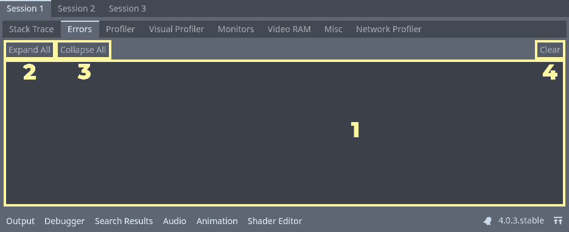

图 10.3 – 第 1 次会话调试器选项卡的错误选项卡及其元素

现在，让我们了解这些元素是什么以及它们如何对我们有用：

+   **错误和警告**面板是显示所有警告和致命及非致命错误的地方。您可以点击一个错误或警告来展开它，并跳转到触发它的脚本行。您也可以双击来展开一个错误或警告，并显示导致错误的代码堆栈。当您双击展开的错误或警告时，它会折叠（在*图 10.3*中突出显示并标记为**1**）。

+   **展开全部**按钮会展开所有错误和警告（在*图 10.3*中突出显示并标记为**2**）。

+   **折叠全部**按钮会折叠所有错误和警告（在*图 10.3*中突出显示并标记为**3**）。

+   **清除**按钮会清空**错误和警告**面板（在*图 10.3*中突出显示并标记为**4**）。

处理错误和警告的一个有趣之处在于，您可以创建自己的错误或警告消息。当与队友一起工作时，这尤其有用，而且，由于我们正在处理多个游戏实例运行，这也是将消息分离开到它们各自的`print()`语句来源的好方法。因此，您可以使用`push_error()`和`push_warning()`内置方法，Godot 将只在触发错误或警告的游戏会话的**调试器**选项卡中显示它们。以下图展示了**会话 3**的**错误**选项卡，其中展开了一个自定义警告，以便我们可以看到它的来源：

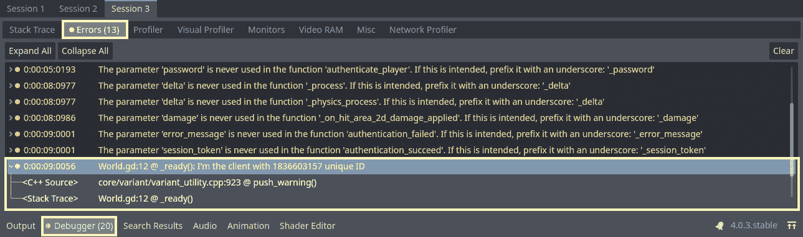

图 10.4 – 第 3 次会话错误选项卡突出显示一个自定义警告和其他内置警告

注意到底部的**调试器**按钮告诉我们总共有 20 个错误和警告，但当我们打开**会话 3**中的**错误**选项卡时，只有 13 个。这是因为其他错误来自其他会话，它们位于各自的**错误**选项卡中。

在我们的装备中有了这个强大的工具，我们可以在每个单独的游戏会话中触发各种错误和警告，这样我们就可以区分哪个会话是服务器，哪些是玩家（如果有任何对等体得到一个其他人没有的特定错误），等等。在下一节中，我们将讨论我们的第一个基于性能的调试选项卡，即**Profiler**选项卡，在那里我们可以看到我们的游戏性能如何，它消耗了多少资源，以及哪些对象和函数消耗了我们电脑的最大资源。

## 探索 Profiler 选项卡

大多数开发者总是在寻找最有效、最经济、最巧妙的优化，以便让他们的代码在烤面包机中运行。好吧，虽然这是一个美好而美丽的幻想，但现实是，除非你真的需要，否则你不应该如此专注于优化你的代码。行业内有一句话，“*过早优化是应用程序的厄运*。”

这里要关注的是**过早**这个词。

因此，如果过早优化是件坏事，但优化本身是件好事，那么何时优化你的游戏或应用程序才是正确的时机呢？答案并非一成不变，也没有一个明确的点可以指出并说“*在这里，经过 X 天的开发，是时候进行优化了*”，或者“*当你达到 80% 的生产水平时，是进行优化的信号*。”不，相反，你应该在问题出现时解决它们，并养成诊断游戏性能并决定是否根据你目标受众的电脑配置来挤压一些资源的习惯。这可以在游戏发布的第一天发生，或者游戏发布多年后。

因此，你需要养成定期查看游戏性能和寻找改进区域的习惯。

**Profiler**选项卡是你在优化中的最佳盟友之一。正是在这个选项卡中，你会看到渲染时间、物理模拟时间、音频处理时间，甚至你自定义脚本函数处理所需的时间和它们被调用的次数。让我们看一下下面的图，并了解**Profiler**选项卡如何显示所有这些信息。

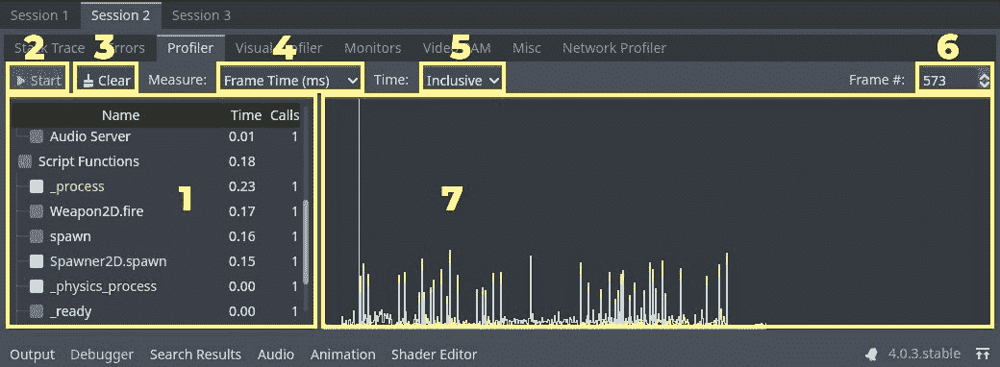

图 10.5 – 第 2 次会话的调试器停靠 Profiler 选项卡及其元素

让我们再次根据图中的编号来理解每个元素的作用：

+   **函数**面板显示当前可用的函数，这些函数是分析器可以跟踪的（在*图 10.5*中突出显示并标记为**1**）。

+   **开始**按钮初始化测量。请注意，如果不切换这个选项，分析器将不会做任何事情。分析非常消耗资源，所以默认情况下它是关闭的（在*图 10.5*中突出显示并标记为**2**）。

+   **清除**按钮清除当前收集和显示的数据（在*图 10.5*中突出显示并标记为**3**）。

+   **测量**下拉菜单允许我们更改我们想要测量的数据类型（在*图 10.5*中突出显示并标记为**4**）。当前选项如下：

    +   **帧时间（毫秒）**是 Godot 引擎处理一个帧所需的时间。

    +   **平均时间（毫秒）**是一个函数处理所需的时间。这是对任何给定函数的每次调用的时间的平均值。

    +   **框架百分比**是给定函数相对于帧渲染时间的百分比。例如，资源密集型函数会占用更大的百分比。

    +   **物理框架百分比**与**框架百分比**相同，但相对于物理框架处理过程。

+   **时间范围**下拉菜单允许我们更改我们想要测量的函数的时间范围（在*图 10.5*中突出显示并标记为**5**），并且有以下选项：

    +   **包含**，这将考虑一个函数及其所有嵌套函数渲染所需的时间

    +   **自我**，这只会考虑每个函数的个体时间，而不考虑被测量的函数所调用的函数调用

+   **帧编号**步进器或旋转框标记了你当前正在评估的帧（在*图 10.5*中突出显示并标记为**6**）。更改帧编号将允许你在**函数**面板中准确看到与该帧相关的函数测量。

+   **测量图**面板是数据被绘制的地方，因此我们可以看到它并访问任何异常数据。每个测量的函数都有其自己的颜色，以便在图表上容易看到它（在*图 10.5*中突出显示并标记为**7**）。

分析器是一个强大的盟友，它使我们能够访问有关资源管理的重要数据。现在我们了解了如何使用它，让我们继续到调试器停靠上的第二个分析器，即**视觉分析器**。

这一个专注于视觉资源和潜在瓶颈，以便我们可以改进我们的游戏在渲染和其他视觉过程方面的视觉效果。

## 探索视觉分析器选项卡

除了知道你的函数从 CPU 中消耗了多少处理资源外，评估与渲染相关的任务（如剔除、光照和绘制调用）从 GPU 中消耗了多少也同样重要。**视觉分析器**工具可以帮助你跟踪导致 CPU 和 GPU 渲染帧延迟最长的原因。通过识别由渲染引起的潜在瓶颈的来源，你可以优化 CPU 和 GPU 的性能。

**视觉分析器**选项卡与**分析器**选项卡非常相似，但专注于跟踪和测量与渲染相关的任务。看看以下图表，了解**视觉分析器**选项卡如何显示所有这些信息。

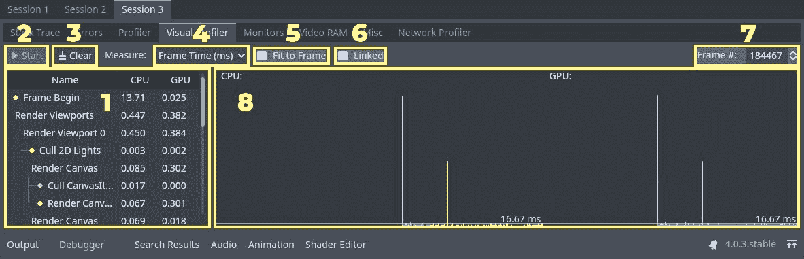

图 10.6 – 第 3 次会话的调试器停靠视觉分析器选项卡及其元素

为了更深入地理解这些元素中的每一个，让我们更仔细地看看它们各自的作用。再次强调，我们将按照数字顺序来跟踪这些元素：

+   **任务**面板显示按类别划分的与渲染相关的任务。请注意，它们被分解为相关视口和画布层等元素（在*图 10.6*中突出显示并标记为**1**）。

+   **开始**按钮，就像在**分析器**标签页中一样，初始化分析。默认情况下，视觉分析也被关闭（在*图 10.6*中突出显示并标记为**2**）。

+   **清除**按钮清除分析会话中收集的当前数据（在*图 10.6*中突出显示并标记为**3**）。

+   **测量**下拉菜单（在*图 10.6*中突出显示并标记为**4**）允许我们选择两个测量选项：

    +   **帧时间（毫秒）**是渲染一个帧所需的时间（以毫秒为单位）

    +   **帧百分比**是指给定过程从给定帧的渲染时间中占用的百分比

+   **适应帧**复选框将图形适应到默认帧比例（在*图 10.6*中突出显示并标记为**5**）。取消选中它以将图形适应到超过 60 **每秒帧数**（**FPS**）的部分。

+   **链接**复选框将 CPU 和 GPU 图表缩放到相同的比例（在*图 10.6*中突出显示并标记为**6**）。

+   **帧编号**步进器，就像在**分析器**标签页中一样，标记了你正在评估的当前帧。在**任务**面板中显示的渲染任务与这个帧相关（在*图 10.6*中突出显示并标记为**7**）。

**视觉分析器**是优化游戏渲染性能时的另一个强大盟友，它是一个改变游戏规则的工具，可以帮助你评估可能造成游戏卡顿和帧降的原因。在下一节中，我们将了解另一个可用于评估游戏健康状况的强大工具，即**监视器**标签页，在那里我们可以找到有关游戏的各种有趣信息。

好吧，让我们深入探讨，以便我们了解这些以及其他可用数据如何帮助我们解决游戏中性能的潜在问题。

## 探索监视器标签页

这里是你真正感觉像一名游戏医生的地方。**监视器**允许我们将重要数据作为图表来评估，并查看游戏的整体健康状况。在这个标签页中，我们可以通过图表跟踪与性能相关的数据。默认情况下，它显示一些有用的数据，如下所示：

+   与时间相关的数据，例如**FPS**、进程时间和物理进程时间

+   与内存相关的数据，例如静态内存、动态内存和消息缓冲区

+   与对象相关的数据，例如总对象数、资源数、节点数和孤儿节点

有一系列属性您可以跟踪并绘制到图表中，以便您分析游戏的健康状况并发现潜在的改进区域。在下面的图中，您可以看到带有一些属性被跟踪和绘制的调试器**监视器**选项卡。请注意，这些属性默认在左侧面板中已打开。**监视器**选项卡将只为我们在左侧面板中打开的属性绘制图表：

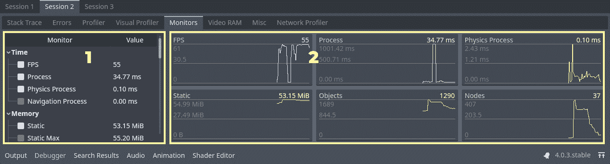

图 10.7 – 第 2 次会话的调试器停靠监视器选项卡及其元素

**监视器**选项卡似乎是我们迄今为止看到的选项卡中最简单的，但它仍然非常强大，所以让我们了解构建它的两个核心元素：

+   **监视器**面板是我们可以找到可用监视器的地方。监视器是标记为跟踪的数据。请注意，默认情况下有大量的监视器。通过使用它们，我们可以获得有关项目健康状况的一些有价值的信息（在*图 10.7*中突出显示并标记为**1**）。

+   **图表**面板是监视器作为图表绘制的地方，每个监视器都有自己的图表和度量。只有**监视器**面板中检查的监视器才会在**图表**面板中绘制（在*图 10.7*中突出显示并标记为**2**）。

注意，在**监视器**选项卡上没有*开始*、*停止*或*清除*按钮。这是因为 Godot 将始终跟踪可监视的数据。

关于`性能`单例的一些有趣之处。我们将在*识别项目的瓶颈*部分讨论这个问题，在那里我们还将深入讨论**监视器**面板。在下一节中，我们将讨论**视频 RAM**选项卡，在那里我们可以评估我们的视频相关资源。

## 了解视频 RAM 选项卡

当您想了解哪些资源对您的视频内存影响最大时，**视频 RAM**选项卡非常有用。这在 3D 游戏中非常有帮助，但也可以用于 2D 游戏 – 例如，当我们想评估是否需要将更多的精灵打包到一个纹理中时。

**视频 RAM**选项卡是一个相当简单的面板，其中包含您评估视频相关内存消耗所需的基本信息。在下面的图中，我们可以看到它由一个包含四个列的单个表格组成，位于面板内部：

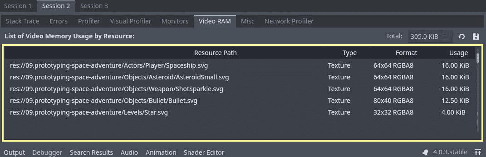

图 10.8 – 第 2 次会话的调试器停靠视频 RAM 选项卡面板

这是一个直观的面板，包含我们理解资源视频内存使用所需的数据。让我们了解每一列所呈现的信息类型：

+   **资源路径**是 Godot 引擎项目中资源的路径。

+   `AtlasTexture`资源或一组简单的纹理，例如。

+   **格式**列是我们可以找到有关文件格式的数据的地方。

+   **使用** 是我们最终想要的。它回答了一个重要的问题：鉴于所有之前的信息，这个资源占用了多少内存？

注意

如果你想导出表格并执行一些表格操作或创建图表，可以选择将表格保存为 CSV 文件。这在演示中可能非常有用。

调试部分中的 `Control` 节点。

## 理解 Misc 标签

如前所述，在 `Control` 节点中点击的调试器 `Control` 节点正在消耗输入，如果我们可以有一个负责该功能的另一个 `Control` 节点，那么我们应该修复这个问题。例如，当你有一个用于淡出屏幕的 `ColorRect` 节点时，这是常见的。如果你没有将 **鼠标过滤器** 设置为 **忽略**，它将消耗鼠标事件并阻止玩家与其他 UI 元素交互。在下面的图中，我们有我们游戏的 **Misc** 标签：

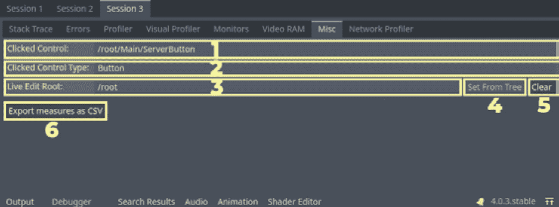

图 10.9 – 第 3 次会话的调试器停靠 Misc 标签及其元素

**Misc** 标签非常简单，我们用它做不了太多事情。尽管如此，当我们想要处理与界面相关的问题时，它仍然是一个很好的伴侣。让我们了解构建这个调试工具的元素：

+   调试部分中的 `Control` 节点（在 *图 10.9* 中突出显示并标记为 **1**）。

+   **Clicked Control Type** 行显示被点击控件的类型（在 *图 10.9* 中突出显示并标记为 **2**）。

+   `SceneTree` 实例（在 *图 10.9* 中突出显示并标记为 **3**）。

+   **Set From Tree** 按钮没有官方文档，并且似乎一直处于禁用状态，所以我们无法测试这个按钮的功能（在 *图 10.9* 中突出显示并标记为 **4**）。

+   **Clear** 按钮清除之前提到的行中的数据（在 *图 10.9* 中突出显示并标记为 **5**）。

+   **Export measures as CSV** 按钮允许你导出一个包含上述行数据的 CSV 文件。这可能有助于跟踪游戏流程，基于与控制器的交互（在 *图 10.9* 中突出显示并标记为 **6**）。

这个标签的一个很好的用途可能是 *点与点击* 游戏。由于这个游戏中大多数交互都是通过鼠标点击完成的，我们可以使用调试器的 **Misc** 标签来识别导致特定事件的元素。例如，当在显示对话框时点击菜单，哪个应该消耗鼠标点击？好吧，如果你选择的那个没有消耗输入，你可以使用调试器的 **Misc** 标签来查看发生了什么。

我们刚刚介绍了几乎所有可以用来调试和性能分析的游 戏工具。唯一缺少的一个，对你来说，作为我们假想工作室的网络工程师，是最重要的一个。网络分析器就是你在其中找到你的 RPC 调用和同步器影响的地方，以及其他与高级网络 API 相关联的相关信息。让我们直接进入正题吧！

# 理解网络分析器

是时候遇见你的最佳盟友了，它将帮助你解决作为我们虚构工作室的网络工程师时遇到的相关问题，并在你的旅程中提出潜在解决方案。正如其名所示，网络分析器是一个专门从事网络相关分析的分析器。它显示了关于 RPCs 的大小和数量信息，包括发送和接收的，发起和接收 RPCs 的节点，`MultiplayerSynchronizer`节点的网络消耗和同步次数，甚至还有一个带宽计，这些都是我们评估我们网络代码影响所需的一切。

注意，默认情况下，网络分析器仅跟踪高级网络 API 带宽。因此，如果您使用的是低级方法，例如 `PacketPeerUDP`、`UDPServer`、`StreamPeerTCP` 和 `TCPServer`，它们的消耗可能默认不会被网络分析器考虑在内。我们将在 *使用监控器* *标签* 部分中看到如何解决这个问题。

让我们深入了解**网络分析器**标签页中可用的功能。同样，界面中的每个元素都将编号以便进一步参考。

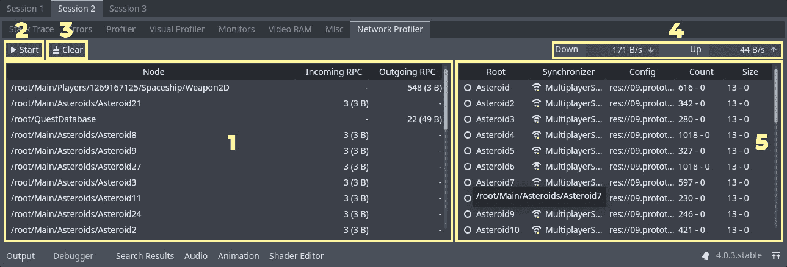

图 10.10 – 第 2 次会话的调试器停靠网络分析器选项卡及其元素

尽管网络分析器比其他分析器元素少，但每个元素也更加复杂。你可能也注意到了，没有图形元素，对吧？因此，评估这些数据可能稍微不太自然。但让我们了解每个元素的功能以及我们如何使用它们：

+   RPC 面板显示每个发送和接收 RPC 的节点（带有高亮和标记为 `Asteroid` 的节点有一个 `3`，这可能是由于它们接收了 3 次处理伤害的调用，并在第三次调用后立即被摧毁）。

+   `Weapon2D` 的 **Outgoing RPC** 值很大，因为它一直在告诉其同伴实例发射子弹。

    +   **Down** 显示在此分析会话期间每秒下载了多少字节

    +   **Up** 显示在此分析会话期间每秒上传了多少字节*   `MultiplayerSynchronizer` 节点，它们的 `SceneReplicationConfig` 资源，默认情况下总是内置的，同步计数以及以字节为单位的同步大小（突出显示并标记为 `MultiplayerSynchronizer` 节点的场景*   `MultiplayerSynchronizer`*   与 `MultiplayerSynchronizer` 相关的 `SceneReplicationConfig` 资源*   `MultiplayerSynchronizer` 节点同步了其复制数据*   **大小** 列显示在当前分析会话期间同步所占用数据的总大小，以字节为单位

拥有所有这些信息，我们可以理解我们的工作是如何影响项目整体性能的。了解节点调用其 RPC 的次数，其他节点调用其 RPC 的次数，交换的数据量等等，可以帮助我们正确地处理玩家需要以正确方式玩游戏所需的必要带宽，并优化游戏以适应网络配置较低的玩家。

在下一节中，我们将学习如何使用我们迄今为止看到的强大工具，通过网络分析器来发现我们网络方法中的瓶颈，并通过向 **监视器** 选项卡添加自定义监视器来扩展我们的分析。这样，我们可以确定 Godot 向我们报告的内容。

# 识别项目的瓶颈

在本章中我们迄今为止所看到的所有工具都在我们手中，现在是时候使用它们来评估我们项目的健康状况并寻找改进区域。由于你的重点是网络，我们将专注于与此区域相关的功能。在本节中，我们将使用 *第九章* 的最终版本，*创建在线冒险原型* 项目，使用 **网络分析器** 和 **监视器** 调试工具来寻找改进区域。你将学习如何执行以下操作：

+   分析入站和出站 RPC 计数和大小，以识别网络代码中的潜在瓶颈

+   使用带宽计来跟踪总带宽消耗并提出可能的解决方案

+   评估 `MultiplayerSynchronizer` 节点的同步计数和大小以优化复制数据

+   创建自定义监视器以分析项目特定的相关数据并跟踪潜在问题

让我们开始使用这个工具，它将是我们识别与高级网络 API 相关问题的可靠伴侣——网络分析器。

## 使用网络分析器

在上一节中，我们看到了网络分析器，这是我们用于识别与高级网络 API 相关问题的最强大工具之一。在本节中，我们将更深入地探讨如何使用网络分析器来识别与 RPC 和 `MultiplayerSynchronizer` 节点相关的瓶颈。为了完成这项任务，我们将使用 *第九章* 的最终版本，*创建在线冒险原型* 项目。

如前所述，我们可以使用网络分析器来收集有关节点传入和传出 RPC 的大小和计数的信息，`MultiplayerSynchronizer` 节点的网络消耗，同步计数，甚至带宽计。通过理解和分析这些数据，我们可以识别我们网络代码中的潜在问题，并提出可能的解决方案。

首先，让我们仔细查看传入和传出的 RPC 计数和大小，以识别我们网络代码中的潜在瓶颈。我们还将使用带宽计来跟踪总带宽消耗，并提出可能的改进措施。

然后，我们将评估 `MultiplayerSynchronizer` 同步的同步计数和大小，以优化复制数据。

到本节结束时，您将更好地了解如何使用网络分析器来识别和解决与您游戏网络性能相关的问题。那么，让我们开始吧！

RPC 是一种简单高效地在网络上传递数据和触发远程事件的方式。然而，重要的是要谨慎使用它们，以避免网络过载。

在本节中，我们将分析与我们项目 RPC 相关的数据，并探讨可能的改进。我们将在下一章中实施解决方案，但就目前而言，我们的重点是学习如何批判性地查看数据并做出明智的决定。

我们首先打开三个游戏会话来播放 `res://09.prototyping-space-adventure/MainMenu.tscn` 场景。让我们在所有三个会话上启动网络分析器。

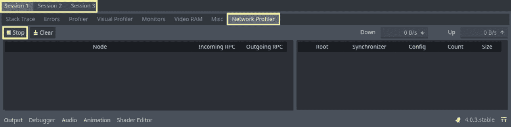

图 10.11 – 第 1 次会话调试器网络分析器开始分析

然后，让我们选择一个作为服务器，而使用其他作为客户端，换句话说，作为玩家。要启用多个游戏会话，您可以在“调试”→“运行多个实例”菜单中选择“运行 3 个实例”选项。

在所有三个会话都打开的情况下，让我们确定哪个是服务器。为此，打开调试器的“服务器按钮”。在我的情况下，它是**第 2 次会话**的游戏实例，如图下所示。

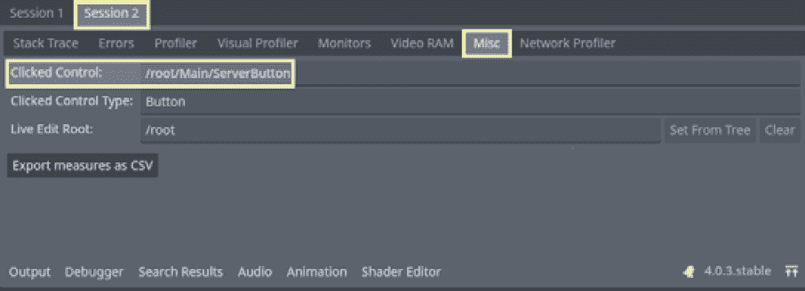

图 10.12 – 使用第 2 次会话的调试器“其他”选项卡来查找服务器的游戏实例

现在我们知道了 `QuestDatabase`。

为了测试这个修改是否有效，我用其中一个玩家的游戏实例摧毁了*小行星*，所以你也去做同样的事情。在摧毁所有 30 个*小行星*后，让我们分析网络分析器收集的数据。此时，如果你想的话，可以停止网络分析器。在下面的图中，我们有**第 1 次会话**的数据，所以我们可以假设它是一个客户端。

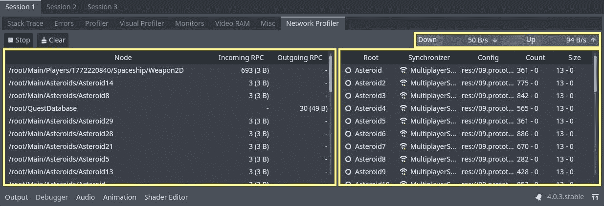

图 10.13 – 第 1 次会话调试器网络分析器显示其收集的数据

让我们从对 RPC 计数和大小的简要分析开始。你可以看到，在第一行，我们有一个玩家`Spaceship/Weapon2D`，它的`fire()`方法被另一个客户端的游戏实例调用，所以我们可以假设摧毁*小行星*的玩家使用了**第 3 次会话**。

这个客户端调用了这个方法 693 次。`fire()`方法不依赖于任何需要流式传输这么多次数的数据。`Weapon2D`本质上有两个主要状态：

+   发射

+   未发射

这意味着我们可以通过在玩家按下发射动作和释放发射动作时通过网络发送一个布尔值来改进这个 RPC 计数。同时，`Weapon2D`本身会在这两个状态之间切换，发射和不发射，并使用`process()`根据它们的发射速率生成*子弹*。这将大大减少这个 RPC 计数。

你是否注意到，在构建你的项目并沿途调整时，这项评估有多么重要？真是太酷了，对吧？

接下来，让我们看看第四行的`QuestDatabase`节点。这是唯一一个有出站 RPC 计数的节点，对吧？所以，它正在向服务器的游戏实例发送请求。它总共发送了 30 个 RPC，但请注意，它们的大小与 693 个传入的`fire()` RPC 相比要大得多。这意味着通过这个 RPC 传输的数据更大。我们应该注意这一点。这很可能是`update_player_progress()`方法。请注意，我们有 30 个*小行星*，每次我们摧毁其中一个，我们就会向`update_player_progress()`方法发送一个 RPC。计数是正确的，我看不出在这方面有明显的改进空间。它的比例是 1:1 – 一个事件，一个触发器。所以，我们很可能会找到一种方法来改进数据；也许通过某种方式压缩它以减少整体带宽。

最后，让我们看看*小行星*的 RPC 计数。每一个都只接收 3 个 RPC；这可能是由于服务器的*子弹*击中*小行星*，导致服务器在客户端实例上调用`hit()`方法两次。然后，当*子弹*第三次击中时，它调用`explode()`方法

的 *小行星*。看起来这个类在客户端的 RPC 计数方面相当健康。在这一关系的一侧没有需要改进的地方。让我们看看服务器端的情况。以下图展示了服务器的网络分析器。请注意，在这个测试中，服务器由游戏的 **会话 3** 实例表示。

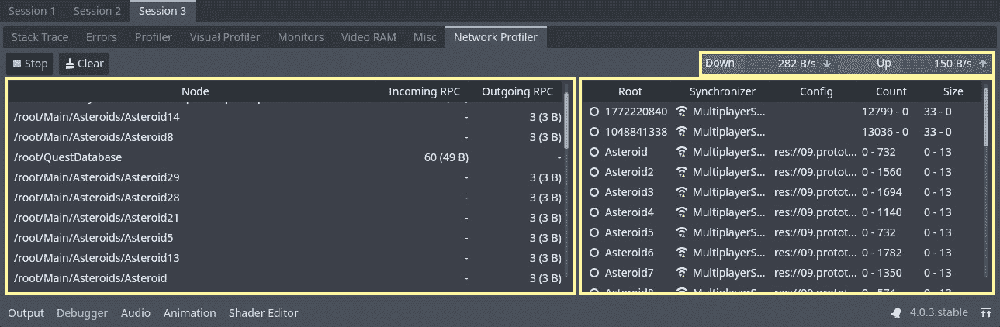

图 10.14 – 会话 3 调试器网络分析器显示其收集的数据

服务器在其 *小行星* 实例上有出站 RPC，并且还有一个 `SceneTree` 实例的总数，因此没有必要在服务器上播放动画。理想情况下，服务器将是一个无头实例，因此在上面播放动画真的没有必要。但我们现在不会深入探讨这些领域。在当前项目中，我们可以将 `hit()` 方法的 RPC 注解更改为仅远程调用，而不是本地调用。这样，至少击中动画只会播放客户端的一侧。

让我们以正在处理的 *小行星* 为例，并对它们的 `MultiplayerSynchronizer` 节点进行分析。您可以在右侧面板的 `World` 节点中看到它调用了 `sync_world()` 方法。之后，就没有必要继续更新小行星的属性了。因此，我们可以在 `sync_world()` 方法内部使用小行星的 `MultiplayerSynchronizer` `update_visibility()` 方法，并减少带宽消耗。

通过使用网络分析器，我们已经确定了改进的区域，例如减少发送到 `Weapon2D.fire()` 方法的 RPC 数量，并手动调用 `MultiplayerSynchronizer` 同步以减少整体带宽。我们还看到，我们可以将 `Asteroid.hit()` 的 RPC 注解更改为仅远程调用，而不是本地调用，以减少服务器端不必要的动画。

好吧，仅仅通过简要分析，我们就发现了明显的改进区域，不是吗？而且我们还没有完成评估！在下一节中，我们将看到如何使用 `Performance` 单例创建自定义监视器，并在监视器跟踪中跟踪它们。

## 使用监视器标签页

在上一节中，我们学习了网络分析器以及它是如何帮助我们识别游戏中网络性能的潜在瓶颈。在本节中，我们将关注 Godot 引擎中的另一个强大的调试工具：**监视器**标签页。

**监视器**标签页允许我们实时跟踪和分析特定的数据点。我们可以用它来跟踪变量、函数，甚至是我们自己定义的自定义数据点。通过监控这些数据点，我们可以深入了解项目性能，并识别出需要改进的领域。

除了内置的监视器外，我们还可以创建自定义监视器来跟踪项目中特定的变量或函数。为此，我们需要使用 `Performance.add_custom_monitor()` 方法，传递一个 ID、一个 `callable` 实例，以及可选的数组作为参数。Godot 将在 `id` 参数中创建一个监视器，并使用传递给 `callable` 参数的 `Callable` 实例跟踪数据。这意味着每次我们触发应计入数据跟踪的事件时，我们需要执行 `callable` 实例。

在本节中，我们将使用 `QuestDatabase` 节点和 `QuestSingleton` 节点。通过监控这些数据点，我们将深入了解我们的任务系统性能，并识别潜在的改进区域。

让我们从打开 `res://09.prototyping-spaceadventure/Quests/QuestDatabase.gd` 脚本开始。我们将创建一个成员变量来跟踪 `QuestDatabase.update_player_progress()` 方法被调用的次数。我们可以将此变量命名为 `quest_update_count` 并将其默认值设置为 `0`。然后，我们需要创建一个返回其当前值的方法；让我们称这个方法为 `get_quest_update_count()`：

```cpp
func get_quest_update_count():
     return quest_update_count
```

要更新 `quest_update_count`，请在服务器成功更新给定任务中玩家的进度后增加其值。因此，在 `update_player_progress()` 方法中，在 `if multiplayer.is_server()` 语句内添加一行代码，将 `quest_update_count` 增加 `1`：

```cpp
@rpc("any_peer", "call_remote")
func update_player_progress(quest_id, current_amount, completed, user):
     if multiplayer.is_server():
          progress_database[user][quest_id]["progress"] = current_amount
          progress_database[user][quest_id]["completed"] = completed
          quest_update_count += 1
```

有了这些，我们已经准备好将 `get_quest_update_count()` 添加到我们的 `_ready()` 回调中，创建一个指向 `QuestDatabase` 的 `Callable` 变量，使用 `self` 关键字，并指向 `"get_quest_update_count"`。我们可以将这个 `Callable` 变量命名为 `callable` 以简化过程：

```cpp
func _ready():
     if multiplayer.is_server():
          load_database()
          var callable = Callable(self, "get_quest_update_count")
```

然后，让我们调用 `Performance.add_custom_monitor()` 方法。为了保持组织有序，我们将使用名为 `"Network"` 的类别来命名我们的自定义监视器。因此，在 `id` 参数中，我们将传递 `"Network/Quests Updates"` 并将 `callable` 作为第二个参数传递：

```cpp
func _ready():
     if multiplayer.is_server():
          load_database()
         var callable = Callable(self, "get_quest_update_count")
          Performance.add_custom_monitor("Network/Quests Updates", callable)
```

让我们从打开 `res://09.prototyping-space- adventure/Quests/QuestDatabase.gd` 脚本开始。我们将创建一个成员变量来跟踪方法被调用的次数。

现在，为了测试这个自定义监视器是否正常工作并评估它将提供的数据，让我们使用三个调试会话来测试游戏，并使用其中一个客户端销毁一些 *小行星*。这次，我的服务器在 **Session 2**。以下图展示了 **Session 2** 的 **监视器** 选项卡。您可以在 **监视器** 面板的底部找到 **Quests Updates** 监视器；勾选复选框，Godot 将显示跟踪数据。

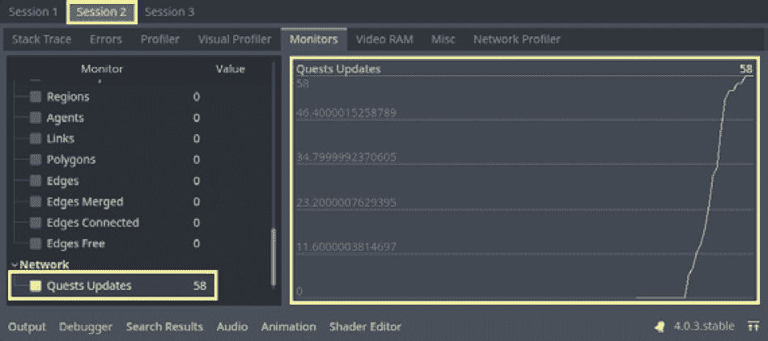

图 10.15 – 显示 Quests Updates 跟踪数据的 Session 2 调试器监视器选项卡

注意到 Godot 只计算了 58 个任务更新。所以我可能错过了一颗小行星。有趣，对吧？为什么一颗 *小行星* 会触发对 `QuestDatabase.update_player_progress()` 方法的两次调用？好吧，记住，目前任务进度是在所有对等体之间共享的，所以这可能会呈指数增长。如果有 3 个玩家，就会有 96 次对 `QuestDatabase.update_player_progress()` 的调用。我们需要找出一种限制它的方法。一个快速的解决方案是检查任务是否已经完成，如果是，就停止更新它。这将把这个特定的任务限制为每个玩家 10 次调用，这将是一个很好的改进。

让我们进行这个比较，仅用于测试目的。打开 `res://09.prototyping-space-adventure/Quests/QuestSingleton.gd` 并创建一个监控器，该监控器只会递增，直到任务达到完成任务所需的目标数量。为此，让我们创建一个新的成员变量名为 `increase_count` 并将其默认值设置为 `0`：

```cpp
var increase_count = 0
```

然后，让我们创建一个名为 `get_quest_increases()` 的方法，该方法将返回这个变量：

```cpp
func get_quest_increases():
  return increase_count
```

在 `_ready()` 回调中，如果这是一个客户端实例，我们将使用之前的方法作为 `callable` 添加一个新的自定义监控器，就像我们使用 `QuestDatabase.get_quest_update_count()` 一样：

```cpp
func _ready():
  if not multiplayer.is_server():
    var callable = Callable(self, "get_quest_increases")
    Performance.add_custom_monitor("Network/Quest Increases", callable)
```

现在，在 `increase_quest_progress()` 方法中，我们将创建一个 `if` 语句，该语句只有在 `quest.current_amount` 小于 `quest.target_amount` 时才会递增 `increase_count`：

```cpp
func increase_quest_progress(quest_id, amount):
  if not quest_id in quests.keys():
    return
  var quest = quests[quest_id]
  quest.current_amount += amount
  QuestDatabase.rpc_id(1, "update_player_progress", quest_id, quest.current_am
ount, quest.completed, AuthenticationCredentials.user)
  if quest.current_amount < quest.target_amount:
increase_count += 1
```

让我们再次测试游戏，看看客户端的 **监控** 标签页中会发生什么。在下面的图中，有一些非常有趣的事情正在发生。

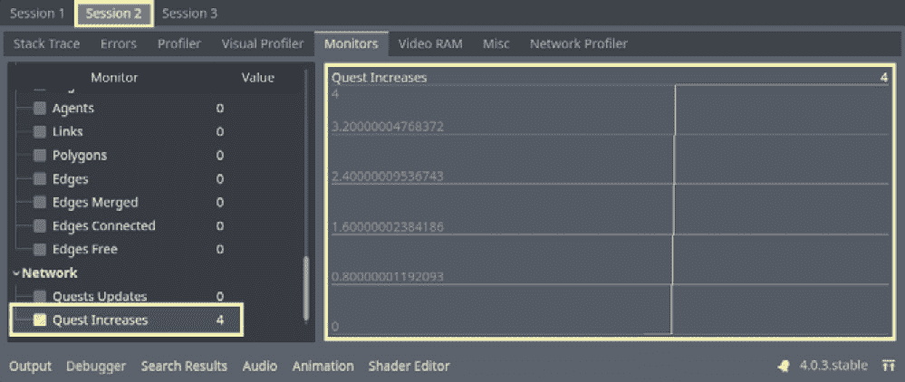

图 10.16 – 会话 2 调试器监控标签页显示的任务递增跟踪数据

这次是 `user2` 凭据。这有什么相关性？注意，在这个游戏实例中，`increase_count` 只增加了四次。这是因为，在 `res://09.prototyping-space-adventure/Quests/QuestDatabase.json` 文件中，`user2` 已经摧毁了五颗小行星，所以它只需要再摧毁五颗来完成任务。这意味着我们甚至可以在游戏会话之间改进这个方面。玩家在游戏会话中取得的进步越多，如果我们实施这种方法，我们就需要向服务器发出越少的 RPC 调用；这不是很酷吗？

在本节中，我们学习了如何使用 `Performance` 单例在 `Performance.add_custom_monitor()` 方法中创建新的监控器。我们还看到了如何创建方法来收集有关我们游戏中潜在瓶颈的数据。最后，我们看到了一些潜在的修复方法，以解决我们在调试游戏时发现的问题，以便优化它。

# 摘要

有了这些，我们就结束了本章的内容！在本章中，我们介绍了**调试器**面板，这是一个强大的工具，用于评估和调试游戏中可能存在的问题，以及优化其性能。

我们探讨了**堆栈跟踪**标签页，它为我们提供了对游戏流程的概述，并提供了多种方式来收集关于整个流程中发生的变化的信息，使我们能够理解导致特定变化的原因和效果的整个链条。我们还讨论了**错误**标签页，这是我们与数千名参与 Godot 引擎核心开发的其他开发者一起工作的地方，我们识别了数千个错误并对其进行了记录，以便当它们发生时，我们能够对问题有所了解并修复它。

此外，我们还探讨了两个基于性能的调试标签页：**性能分析器**标签页和**视觉性能分析器**标签页。**性能分析器**标签页是你在这项任务中的最佳盟友之一，因为它允许你看到渲染时间、物理模拟时间、音频处理时间，甚至每个自定义脚本函数处理所需的时间和它们被调用的次数。**视觉性能分析器**标签页专注于跟踪和测量与渲染相关的任务，可以帮助你追踪在 CPU 和 GPU 上渲染帧时造成最大延迟的原因。

然而，本章的主角是通过分析工具收集的数据来分析`MultiplayerSynchronizer`节点。通过理解和分析这些数据，我们提出了优化网络代码的可能解决方案。除此之外，我们还学习了如何使用`Performance`单例并在**监控器**标签页中创建自定义监控器，以实时跟踪特定的数据点。通过监控这些数据点，我们获得了关于项目性能的见解，甚至对潜在的改进进行了测试。

在下一章中，我们将优化数据请求，特别是关于`QuestDatabase.get_player_quests()`方法中的任务数据。

通过优化我们请求和处理数据的方式，我们可以提高游戏性能并为用户提供更好的体验。在那里见！
