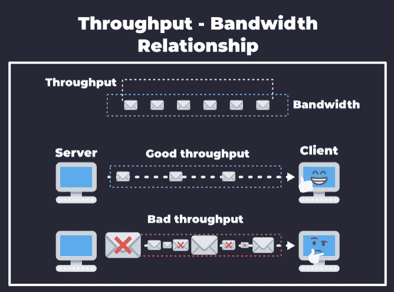
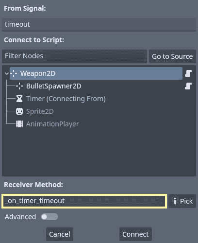
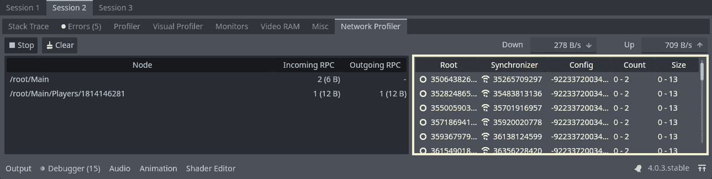
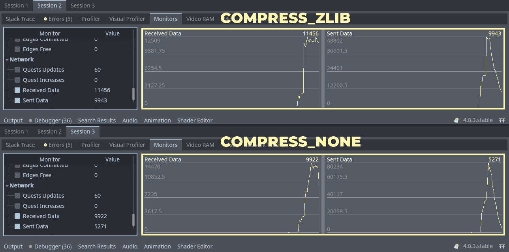

# 11

# 优化数据请求

欢迎来到*第十一章*，*优化数据请求*，我们将使用在*第十章*中看到的工具，*调试和性能分析网络*，并最终改进我们在*第九章*中编写的网络代码，*创建在线* *冒险原型*。

在本章中，我们将通过分析我们游戏当前的状态，对带宽和吞吐量有更深入的了解。在*第十章*中，*调试和性能分析网络*的*使用网络分析器*部分，我们看到了一些需要改进的地方，特别是在 MultiplayerSynchronizers 和`QuestDatabase`数据传输方面。因此，在这里，我们将看到如何减少请求数量，以及如何压缩和解压缩数据以减少带宽和吞吐量，使我们的游戏以更可靠和更优化的方式对更多人开放。

到本章结束时，你将了解到优化游戏有许多方法，而大多数优化将取决于游戏本身的具体需求。随着你的进步，你将培养出敏锐的判断力和对如何评估潜在改进区域以及你正在寻找的数据类型的理解，以及一些解决网络代码瓶颈的一般技术。

因此，本章将涵盖以下主题：

+   理解网络资源

+   减少请求数量

+   使用`ENetConnection`进行数据压缩

# 技术要求

如*第十章*中所述，*调试和性能分析网络*，*第三部分*，*优化在线体验*，是基于*第九章*中制作的项目最终版本，*创建在线冒险原型*，因此，阅读、实践和实施那里提出的概念是基本要求。

你可以通过以下链接获取开始本章所需的文件。这些文件包含了我们在*第十章*中实现的*调试和性能分析网络*：

[`github.com/PacktPublishing/The-Essential-Guide-to-Creating-Multiplayer-Games-with-Godot-4.0/tree/11.optimizing-data-requests`](https://github.com/PacktPublishing/The-Essential-Guide-to-Creating-Multiplayer-Games-with-Godot-4.0/tree/11.optimizing-data-requests)

同时，你也需要阅读并理解*第十章* *调试和性能分析网络*中介绍的概念和工具，这样我们才能在假设你已经知道它们是什么以及如何正确使用它们的前提下继续前进。特别是，你需要理解调试器的网络性能分析器和监视工具是如何工作的。所以，如果你不确定如何使用这些工具，请花些时间回顾*第十章* *调试和性能分析网络*，以便掌握这些和其他调试工具。

# 理解网络资源

我们已经提到了带宽和吞吐量的重要性；在*第一章* *设置服务器*中，我们甚至对*图 1.3*和*图 1.4*这一主题进行了简短的介绍和视觉表示。现在是我们深入理解这些概念的时候了，这些概念是网络使用优化的基础，也将是我们衡量我们向优化目标所取得的进步的主要资源。

通常情况下，我们的网络代码带宽越低、吞吐量越低，效果越好。当然，我们需要记住，所有的优化都应该保持游戏体验，所以我们处于一个非常微妙的地位。与其他处理、内存和图形优化不同，我们的工作不能创造“美丽的意外”，比如一个可能导致酷炫机制的优化。不，我们作为网络工程师的职责是复制已经建立好的机制和效果到网络中的所有节点。让我们了解我们是如何做到这一点的。

当谈到带宽时，可能会让人惊讶的是，大多数游戏实际上并不需要拥有巨大的基础设施。例如，一个视频会议需要的带宽比一个复杂的单人第一人称射击游戏或拥有大量物理模拟的战争模拟器要多得多，因为它需要处理以渲染图像形式存在的数据，这些数据必须在每个参与者的会议实例中传递和重新创建。在游戏的情况下，创建模拟所需的大部分必要资源已经存在于用户的机器上，因此我们的大部分工作是通过消息来沟通计算机应该加载什么，以同步客户端和服务器上的游戏实例。众所周知，玩家需要大约 5 Mbps 的带宽才能玩大多数现代在线多人游戏，包括像使命召唤、英雄联盟和堡垒之夜这样的大型游戏系列。

在本书的*第一部分* *握手和网络*中，我们了解到游戏主要使用不可靠的数据，这意味着大多数时候，我们只需要知道游戏中某个对象的最新数据以便同步它。这大大减少了网络使用量，并允许我们专注于复制服务器游戏世界到客户端游戏世界所需的具体数据类型。

在在线多人游戏中，我们主要关心的是我们保持数据传输流的一致性 – 最终，我们能否持续保持网络的吞吐量。这可能会受到延迟和其他外部因素的影响，所以我们能做的就是设计一个考虑延迟如何影响我们吞吐量的通信架构。当然，我们也会尽量将带宽保持在最低，以便如果同一网络连接了多个设备，我们的游戏仍有空间保持数据流动。

因此，请记住带宽和吞吐量是我们主要的资源，我们将查看它们以找到我们可以改进游戏的地方。

你可能还在试图弄清楚带宽和吞吐量之间的区别。那么，让我们简要地评估一下这两个概念。我们在*第一章*，“设置服务器”，中介绍了这些概念，所以如果你不太记得它们是什么，请花一点时间阅读该章节的“什么是 UDP 协议？”部分。

我们将使用带宽来了解我们的游戏需要多少网络才能正确运行，这意味着我们预计将通过网络传输多少数据，考虑到我们使用网络分析器观察到的所有测量值。这意味着如果我们有 1,000 个 MultiplayerSynchronizers 在游戏的任何一点同步 5 KB 的数据每秒，我们需要一个 5 Mbps 速度的网络。请注意，这并不意味着整个游戏会持续以 5 Mbps 的速度传输，但这是基于我们的测量结果，建议游戏可能需要一个能够管理高达 5 Mbps 的网络才能流畅运行。总之，带宽是连接中可用于数据传输的空间量，而不是传输本身。

现在，我们真正想要优化的是**吞吐量**，这指的是我们实际上通过网络传输的包的数量和这些包的大小。吞吐量是我们的实际数据流。你可以用类比来考虑它，其中带宽是管道，吞吐量是水。我们不能传输比管道能支持的更多的水；相反，我们可以传输直到可用管道大小的水。同样，我们可以有的吞吐量量是基于可用的带宽容量。

你可以在以下图中看到良好与不良吞吐量-带宽关系的示意图：



图 11.1 – 良好与不良吞吐量-带宽关系的示意图

注意，良好的吞吐量下，发送和接收的数据是一致的，不会超过带宽，而糟糕的吞吐量下，数据包的大小和频率不一致，有些甚至在传输过程中丢失。当数据包没有到达目的地时，我们称之为**丢包**，这可能会给玩家带来很多麻烦和投诉。

在丢包的情况下，客户端不知道如何正确处理他们的游戏实例。第二位玩家的飞船应该在哪个位置？它停止射击了吗？它是在射击`Asteroid`节点，还是没有更多的`Asteroid`节点可以射击？他们射击的`Asteroid`节点还在那里吗？我们将在*第十二章*，*实现延迟补偿*中看到如何处理这些情况，但理想情况下，我们应该通过关注吞吐量来避免它们。

就像这样，当可用的优化资源不足以让新的机制出现时，网络工程师处于一个非常微妙的地位。我们采取已经实施的机制，并尝试将它们全部纳入可用的资源中，通常是通过挤压它们来跟上可能需要更多这些资源的任何潜在变化，例如，需要更多带宽的新机制。因此，我们在优化网络时不能进行太多的实验。

在下一节中，让我们讨论如何通过减少游戏发出的请求数量来启动我们的优化。我们将评估在*第十章*，*调试和性能分析网络*中提出的问题，例如在`Weapon2D`中大量的 RPC 计数和`Asteroid`节点的`MultiplayerSynchronizer`节点的非必要同步。

# 减少请求数量

在*第十章*，*调试和性能分析网络*中，我们看到了对`Weapon2D`节点的`fire()` RPC 方法进行了不成比例和不必要的请求，我们甚至提出了可能解决这个问题的方案。我们还看到，我们可以通过仅使用`World`节点的`sync_world()` RPC 方法在给定玩家请求同步时更新一次`Asteroid`节点来减少`Asteroid`节点的同步问题。

在本节中，我们将实现这些优化方法，并提高我们网络的总体性能。让我们从`Weapon2D`节点问题开始。

## 减少武器射击次数

有时我们可能需要修改一个功能的核心代码以改进其网络性能，即使其本地性能保持不变，甚至可能下降。当谈到优化时，我们总是试图平衡事物并找出如何以允许更多玩家享受更好体验的方式使用可用资源。网络资源在大多数在线多人游戏中尤其是一个优先事项，因为只有通过良好的网络，玩家才能充分利用他们的共享体验。所以，让我们改变 `Player2D` 节点射击 `Weapon2D` 节点的方式。首先打开 `res://09.prototyping-space-adventure/Objects/Weapon/Weapon2D.tscn` 场景并执行以下步骤：

1.  将 `Timer` 节点的 `timeout` 信号连接到 `Weapon2D` 节点，并创建一个名为 `_on_timer_timeout()` 的回调方法：



图 11.2 – Timer 节点的超时信号连接到 Weapon2D 节点的 _on_timer_timeout() 回调

1.  打开 `res://09.prototyping-space-adventure/Objects/Weapon/Weapon2D.gd` 脚本，并在 `_on_timer_timeout()` 回调中调用 `fire()` 方法，以便 `Weapon2D` 节点在每个 `Timer` 节点的 tic 上进行射击。

1.  然后，让我们创建一个可以被任何对等节点调用并且也应该在本地调用的 RPC 方法。我们将使用此方法来改变 `Weapon2D` 的射击状态，因此它应该接收一个布尔变量作为参数：

    ```cpp
    @rpc("any_peer", "call_local")
    func set_firing(firing):
    ```

1.  在这个方法中，我们将检查 `firing` 状态，如果是 `true`，我们将调用 `fire()` 方法；否则，我们将告诉 `Timer` 停止：

    ```cpp
    @rpc("any_peer", "call_local")
    func set_firing(firing):
      if firing:
        fire()
      else:
        timer.stop()
    ```

1.  有了这个，我们可以移除 `fire()` 方法和 `if timer.is_stopped()` 语句上的 RPC 注释，因为现在 `Timer` 本身就会告诉 `Weapon2D` 何时射击。修改后的 `fire()` 方法应该如下所示：

    ```cpp
    func fire():
      animation_player.play("fire")
      spawner.spawn(bullet_scene)
      timer.start(1.0 / fire_rate)
    ```

有了这个，`Weapon2D` 将根据来自 `Timer` 的超时信号进行射击。使用新的 RPC 方法，我们可以改变射击状态，开始或停止创建新的 *子弹*。在这个阶段，`Weapon2D` 脚本应该看起来像这样：

```cpp
class_name Weapon2D
extends Marker2D
@export var bullet_scene: PackedScene
@export_range(0, 1, 1, "or_greater") var fire_rate = 3
@onready var spawner = $BulletSpawner2D
@onready var timer = $Timer
@onready var animation_player = $AnimationPlayer
func fire():
  animation_player.play("fire")
  spawner.spawn(bullet_scene)
  timer.start(1.0 / fire_rate)
@rpc("any_peer", "call_local")
func set_firing(firing):
  if firing:
    fire()
  else:
    timer.stop()
func _on_timer_timeout():
  fire()
```

现在，我们需要知道 `Weapon2D` 的射击状态何时改变，为此，我们需要对 `Player2D` 进行一些修改。所以，打开 `res://09.prototyping-space-adventure/Actors/Player/Player2D.gd` 并执行以下步骤：

1.  删除整个 `_process()` 回调代码。然后，重写 `_unhandled_input()` 回调：

    ```cpp
    func _unhandled_input(event):
    ```

1.  在 `_unhandled_input()` 回调内部，我们将检查是否按下了 `"shoot"` 动作或释放了它。如果按下，我们将 `weapon` 射击状态设置为 `true`，如果释放，则设置为 `false`（记住，我们应该使用 `rpc()` 方法来做这件事，以便玩家在所有网络对等实例上射击）：

    ```cpp
    func _unhandled_input(event):
      if event.is_action_pressed("shoot"):
        weapon.rpc("set_firing", true)
      elif event.is_action_released("shoot"):
        weapon.rpc("set_firing", false)
    ```

1.  接下来，我们需要在`setup_multiplayer()`方法中添加一行代码，以便根据飞船实例是当前玩家还是远程玩家来切换`_unhandled_input()`过程：

    ```cpp
    func setup_multiplayer(player_id):
      var self_id = multiplayer.get_unique_id()
      var is_player = self_id == player_id
      set_process(is_player)
      set_physics_process(is_player)
      set_process_unhandled_input(is_player)
    ```

这样，`Player2D`将根据“射击”动作是否被按下或释放来切换`Weapon2D`的发射状态，而不是在“射击”被按下时每帧调用它。

让我们对这次改进进行评估。打开网络分析器，看看效果如何。记住，根据分析段的持续时间，我们可能会得到不同的结果，所以这并不像单元测试那样准确；但仍然，它将给我们一个关于我们已做的任何潜在改进的良好感觉。在下面的图中，我们有`Player2D`实例：


图 11.3 – 第 1 次会话调试器的网络分析器标签页突出显示`Player2D`节点实例的传入 RPC

如图中所示，我在大约 20.0 秒的游玩过程中摧毁了所有 30 颗小行星，总共进行了六个来自`Player2D`实例的 RPC 调用。如果你将这个结果与*图 10.13*进行比较，在那里我们对于大约相同时长的会话进行了 693 次调用，这比之前的调用减少了超过 115 倍。我认为我们在这里做得很好。

因此，在本节中，我们学习了如何优化游戏中的数据请求以提高网络性能。我们关注了如何通过优化`Weapon2D`节点的触发来减少游戏中发出的请求的数量。我们还看到了如何创建一个可以改变`Weapon2D`发射状态的 RPC 方法，以及如何根据“射击”动作的按下或释放来切换发射状态，而不是在每帧的`_process()`回调中触发发射。最后，我们看到了如何使用网络分析器来评估这些优化对游戏性能的影响。在下一节中，我们将致力于减少小行星的`MultiplayerSynchronizer`请求。

## 减少小行星的同步计数

在*第十章*中，我们看到了另一个问题，即关于`Asteroid`节点的`MultiplayerSynchronizers`如何将位置同步给玩家的问题。由于它们在整个游玩过程中不移动，因此没有必要定期更新它们的位置和其他属性。相反，我们只需要在玩家请求`World`节点同步时同步一次。

因此，打开`res://09.prototyping-space-adventure/Objects/Asteroid/Asteroid.tscn`场景，并对这一方面进行必要的修改以改进我们的网络工程。

在这里，我们只需要将`MultiplayerSynchronizer`节点的**可见性更新模式**属性设置为**None**：


图 11.4 – 小行星节点的 MultiplayerSynchronizer 节点的可见性更新模式属性设置为 None

现在，我们只需要手动进行同步。`MultiplayerSynchronizer` 节点有一个名为 `update_visibility()` 的方法，它接收一个参数，我们可以传递我们想要同步的同伴的 ID；如果我们传递 `0`，则更新所有同伴。

注意，此方法考虑了我们在 *第九章* 的 *同步小行星* 部分中设置的过滤器，使用 `set_visibility_for()` 方法，这意味着只有使用此方法添加的同伴才会被同步。因此，在我们的情况下，如果我们不使用 `set_visibility_for()` 方法将同伴添加到过滤中，即使我们使用 `update_visibility()` 方法并传递正确的同伴 ID，该同伴也不会被同步。

手动同步 `Asteroid` 节点属性的最佳位置是在 `World` 类中，因此打开 `res://09.prototyping-space-adventure/Levels/World.gd` 脚本。然后，在 `sync_world()` 方法内部，让我们向 `"Sync"` 组添加另一个分组调用，但这次是调用 `update_visibility` 方法，并传递 `player_id` 作为参数。整个 `sync_world()` 方法应该看起来像这样：

```cpp
@rpc("any_peer", "call_local")
func sync_world():
  var player_id = multiplayer.get_remote_sender_id()
  get_tree().call_group("Sync", "set_visibility_for",
      player_id, true)
  get_tree().call_group("Sync", "update_visibility",
      player_id)
```

这样一来，所有 `Asteroid` 节点应该只对每个玩家同步一次，从而减少总网络资源的使用。

让我们也将这个更改进行性能分析，以查看其对整体网络消耗的影响。以下图展示了某些小行星的 MultiplayerSynchronizers 的同步计数：



图 11.5 – 第二次会话调试器的网络分析器突出显示小行星节点的 MultiplayerSynchronizer 节点的同步计数

将其与 *图 10.13* 进行比较，在那里我们有成百上千的更新，并且对于每一帧，更新计数都会增加。在我们所做之后，它们只会在玩家进入会话时增加一次，并且只针对那个特定的玩家。做得不错，对吧？

在本节中，我们了解了如何通过减少 `asteroid` 节点的 `MultiplayerSynchronizer` 节点的同步来优化数据请求。为此，我们在玩家加入游戏后禁用了自动同步，设置了 `MultiplayerSynchronizer` 节点的 `MultiplayerSynchronizer.update_visibility()` 方法。

在接下来的章节中，我们将了解如何压缩数据以优化数据包的大小。到目前为止，我们只处理了发送或接收的数据包数量，但这些数据包的大小同样非常重要。让我们了解我们有哪些可用的方法来做到这一点。

# 使用 ENetConnection 类压缩数据

Godot 引擎的高级网络 API 包含 `ENetConnection` 类。在服务器和客户端等对等体之间建立连接后，此类可用。使用 `ENetConnection`，我们可以调整对等体的连接，例如，指定压缩方法。在对等体成功连接后，我们可以访问 `ENetConnection` 实例。为此，我们可以使用 `ENetMultiplayerPeer.host` 属性。

在 `ENetConnection` 类中可以使用五种压缩方法：

+   `CompressionMode` 枚举的 `COMPRESS_NONE` 选项。文档中的说明如下：

    *这使用最多的带宽，但优点是需要的 CPU 资源最少。此选项还可以用于使用 Wireshark 等工具进行网络调试。*

+   ENet 内置的 `CompressionMode` 枚举的 `COMPRESS_RANGE_CODER` 选项。文档中的说明如下：

    *[这是] ENet 内置的范围编码。在小数据包上表现良好，但大于 *4 KB* 的数据包上不是最有效的算法。*

+   `CompressionMode` 枚举的 `COMPRESS_FASTLZ` 选项。文档中的说明如下：

    *此选项相比 COMPRESS_ZLIB 使用更少的 CPU 资源，但代价是使用更多的带宽。*

+   `CompressionMode` 枚举的 `COMPRESS_ZLIB` 选项。文档中的说明如下：

    *此选项相比 COMPRESS_FASTLZ 使用更少的带宽，但代价是使用更多的 CPU 资源。*

+   `CompressionMode` 枚举的 `COMPRESS_ZSTD` 选项。文档中的说明如下：

    *请注意，此算法在小于 4 KB 的小数据包上效率不高。因此，在大多数情况下，建议使用其他压缩算法。*

您可以通过以下链接在 Godot 文档中找到更多关于 `ENetConnection` 和 `CompressionMode` 的信息：

[`docs.godotengine.org/en/stable/classes/class_enetconnection.html#enum-enetconnection-compressionmode`](https://docs.godotengine.org/en/stable/classes/class_enetconnection.html#enum-enetconnection-compressionmode)

是时候着手优化我们通过网络传输的数据的大小了。在以下步骤中，我们将实现压缩以减小游戏的包大小并优化网络数据传输。请注意，如往常一样，带宽和 CPU 资源之间存在权衡。我们的游戏目前没有关于 CPU 使用的问题。因此，在这个阶段，我们可以专注于优化网络资源。为此，我们可以使用 `COMPRESS_ZLIB` 压缩模式。为此，让我们打开 `res://09.prototyping-space-adventure/Authentication.gd` 脚本并完成以下步骤：

1.  在 `_ready()` 回调中将 `multiplayer_peer` 设置为对等体之前，我们将更改 `ENetConnection` 的压缩模式。为此，我们访问 `host` 属性并使用 `compress()` 方法，将 `EnetConnection.COMPRESS_ZLIB` 作为参数传递：

    ```cpp
    func _ready():
      if multiplayer.is_server():
        peer.create_server(PORT)
        load_database()
      else:
        peer.create_client(ADDRESS, PORT)
        peer.host.compress(EnetConnection.COMPRESS_ZLIB)
      multiplayer.multiplayer_peer = peer
    ```

    我们需要在这里做这件事，因为压缩模式需要在建立连接之前设置，而连接是在我们设置`multiplayer.multiplayer_peer`属性之后建立的。

1.  我们还需要在`res://09.prototyping-spaceadventure/LoggingScreen.gd`脚本中做同样的事情，以便这个连接也匹配服务器的连接压缩。再次提醒，在设置`multiplayer.multiplayer_peer`之前，我们将 ENetConnection 的压缩设置为`COMPRESS_ZLIB`：

    ```cpp
    func _ready():
      peer.create_client(ADDRESS, PORT)
      peer.host.compress(ENetConnection.COMPRESS_ZLIB)
      multiplayer.multiplayer_peer = peer
    ```

通过这样，我们能够在玩家加入游戏世界时立即更改游戏网络连接中使用的压缩模式。目前，这不会产生很大的影响。正如我们在文档中的先前引用中看到的，大多数压缩算法的目标是使数据包的大小要么低于 4 KB，要么高于 4 KB。我们游戏的包目前还没有达到千字节，所以……坦白说，这可能不会有太大的影响，如果有的话。

如果我们想要测量我们正在使用的带宽量，并至少浏览一下任何可能的改进，我们可以使用调试器的`EnetConnection`实例的发送和接收数据。为此，我们可以使用`ENetConnection.pop_statistic()`方法，通过使用`Performance`单例来添加我们的自定义监视器，创建两个相关的监视器。让我们来做这件事：

1.  仍然在`World`类脚本中，创建一个名为`get_received_data()`的方法。这个方法需要返回一个整数或浮点数，这样我们就可以用它来创建一个监视器。在这种情况下，它将返回当前`ENetConnection`的接收数据统计信息。为此，我们可以使用`pop_statistic()`方法，传递`ENetConnection.HOST_TOTAL_RECEIVED_DATA`作为参数：

    ```cpp
    func get_received_data():
         var enet_connection = multiplayer.multiplayer_
             peer.host
         var data_received = enet_connection.pop_statistic
             (ENetConnection.HOST_TOTAL_RECEIVED_DATA)
         return data_received
    ```

1.  然后，我们将创建另一个名为`get_sent_data()`的方法，并做同样的事情，但这次传递`ENetConnection.HOST_TOTAL_SENT_DATA`作为参数：

    ```cpp
    func get_sent_data():
      var enet_connection = multiplayer.multiplayer_
          peer.host
      var data_sent = enet_connection.pop_statistic
          (ENetConnection.HOST_TOTAL_SENT_DATA)
      return data_sent
    ```

1.  现在，在`_ready()`回调中，我们检查这个实例是否是服务器，就在创建`Asteroid`实例的上方，我们将使用`Performance.add_custom_monitor()`方法将相应的`callable`添加到`Performance`单例中，如下所示：

    ```cpp
      var callable = Callable(self, "get_received_data")
      Performance.add_custom_monitor("Network/Received
          Data", callable)
      callable = Callable(self, "get_sent_data")
      Performance.add_custom_monitor("Network/Sent
          Data", callable)
      for i in 30:
        asteroid_spawner.spawn()
    ```

现在，我们能够监控不同压缩模式之间的差异，并看到哪个更适合我们的游戏。在下面的图中，我们比较了`COMPRESS_ZLIB`和`COMPRESS_NONE`压缩模式的用法：



图 11.6 – 使用 COMPRESS_ZLIB 和 COMPRESS_NONE 压缩模式发送和接收数据监视器的比较

注意，使用`COMPRESS_ZLIB`压缩时，接收数据达到了峰值 12,509 字节，而发送数据达到了峰值 48,802 字节。同时，使用`COMPRESS_NONE`，接收数据峰值达到 14,470 字节，发送数据峰值达到 80,234 字节——即使是非常小的数据包，我们也取得了巨大的收益，尤其是在服务器的发送数据指标上，所以我们在这方面也做得很好！

# 摘要

在本章中，我们学习了如何优化游戏中的数据请求以提高网络性能。我们专注于通过优化武器的发射来减少游戏中发出的请求次数。我们看到了如何创建一个可以改变武器发射状态的 RPC 方法，以及如何根据“射击”动作的按下或释放来切换发射状态，而不是在`_process()`回调的每一帧上触发发射。最后，我们看到了如何使用网络分析器来评估这些优化对游戏性能的影响。

之后，我们解决了`小行星`节点多玩家同步器同步的问题。当玩家加入游戏后，我们将`MultiplayerSynchronizer`设置为`MultiplayerSynchronizer.update_visibility()`方法来禁用自动同步。这减少了`小行星`节点的同步次数，并降低了总网络资源的使用量。我们还了解了如何使用调试器的网络分析器来衡量这些优化的有效性。

最后，我们了解了 Godot 引擎高级网络 API 的`ENetConnection`类，它提供了压缩方法以优化数据包大小。我们看到了如何使用`ENetConnection.pop_statistic()`方法通过使用`Performance`单例来创建自定义监控器，以跟踪 ENetConnection 的发送和接收数据。我们比较了`COMPRESS_ZLIB`和`COMPRESS_NONE`压缩模式的用法，并发现即使是非常小的数据包，我们也取得了巨大的收益，尤其是在服务器的发送数据指标上。

在下一章中，我们将更深入地探讨优化。我们将使用插值和预测来减少玩家飞船的`MultiplayerSynchronizer`同步次数，同时尝试在整个游戏网络实例中保持移动的一致性。那里见！
