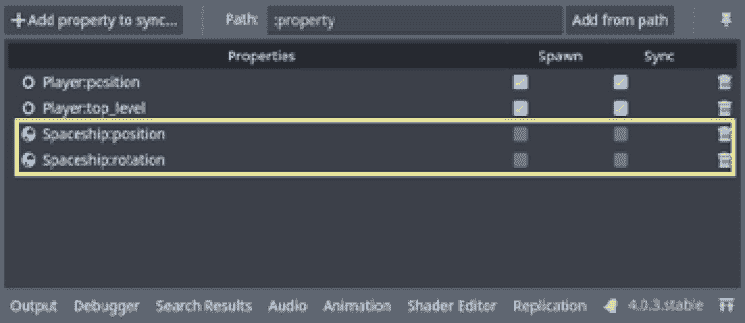
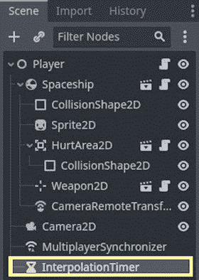
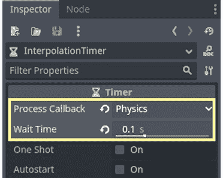
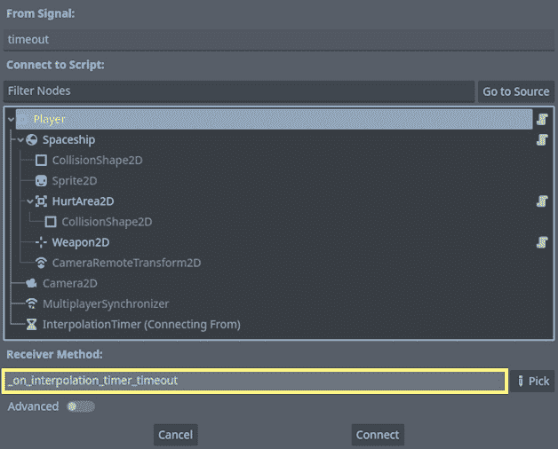
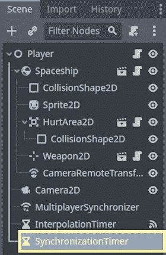

# 实现延迟补偿

欢迎来到本书中最受期待的章节之一。在这里，我们将深入探讨在线多人游戏优化的核心。在在线游戏的世界里，来自全球的玩家聚集在一起开始史诗般的冒险，两个强大的对手潜伏在阴影中；他们是**延迟**和**延迟**。这些敌人可以将激动人心的游戏体验转变为令人沮丧的考验。在本章中，我们将直面这些挑战，为你提供知识和工具来减轻它们的影响，并创建一个引人入胜的在线游戏环境。

在本章中，我们将使用`Player`节点的`Spaceship`节点来维护其位置和旋转，在整个游戏实例的网络中保持同步。为此，我们将了解与数据包丢失和延迟相关的核心问题，这在使用不可靠的数据包时很常见，就像我们使用 ENet 协议时那样。然后，我们将通过使用`Timer`节点来模拟一些延迟和数据包丢失，以便我们了解这些问题如何在实际游戏中显示。之后，我们将讨论一些常见的补偿技术来解决这些问题。

到本章结束时，你将了解我们如何模拟一些平滑的运动，即使游戏的`MultiplayerSynchronizer`未能将数据传递到对等游戏实例中。

在本章中，我们将涵盖以下主题：

+   介绍延迟问题

+   处理不可靠的数据包

+   常见的补偿技术

# 技术要求

如*第十章*，*调试和配置网络*，*第三部分*，*优化在线体验*中所述，本书的*第九章*，*创建在线冒险原型*中的项目最终版本是重点，因此阅读、练习和实现那里介绍的概念是基本的。你可以从以下链接获取开始本章所需的文件：[`github.com/PacktPublishing/The-Essential-Guide-to-Creating-Multiplayer-Games-with-Godot-4.0/tree/12.prediction-and-interpolation`](https://github.com/PacktPublishing/The-Essential-Guide-to-Creating-Multiplayer-Games-with-Godot-4.0/tree/12.prediction-and-interpolation)。它们包含了我们在*第十一章*，*优化* *数据请求*中进行的优化进展。

同时，你也需要阅读并理解了*第十一章*，*优化数据请求*中介绍的概念和工具，这样我们才能继续假设你已经知道它们是什么以及如何正确使用它们。

# 介绍延迟问题

解决延迟和不稳定的包涉及三种技术——**插值**、**预测**和**外推**。这些技术使玩家动作更加平滑，保持响应性，并预测物体运动。Godot 引擎的物理模拟和 RPC 方法在这些技术中至关重要，有助于实现逼真的物体运动和数据同步，即使在网络问题的情况下。

延迟和延迟是任何在线多人游戏的宿敌。延迟，通常与延迟互换使用，指的是玩家动作与其在游戏中的相应效果之间的延迟。这是拉动扳机和看到敌人倒下的瞬间暂停。另一方面，延迟表示数据从玩家设备传输到游戏服务器并返回所需的时间。这两个因素可以破坏游戏流畅性，让玩家感到挫败，并使他们与虚拟世界脱节。

在在线多人游戏的世界里，数据的传输很少是一帆风顺的。不稳定的包，这些调皮的信息片段，可能会因为顺序混乱或完全消失而造成问题。当包顺序混乱时，玩家可能会看到对手神奇地穿越地图并返回，或者完成不可能的壮举。数据丢失导致关键的游戏更新无法到达其目标位置，使得角色和物体停滞在时间中。在本章中，我们的任务是解决这些问题，将混乱变为有序。

在在线多人游戏领域，延迟和延迟是困扰开发者和玩家的一个反复出现且经常令人沮丧的问题。在本节中，我们将讨论这两个在线游戏的基本方面，并揭示它们对玩家体验的深远影响。正如你在前面的章节中已经发现的，创建一个无缝和沉浸式的多人环境需要对这些概念有细微的理解。

现在，让我们来谈谈延迟和延迟对游戏体验的影响。当玩家遇到延迟时，它会打断游戏的流畅性，可能导致错失机会、挫败感，在竞技场景中，甚至可能导致不利的结局。想象一下，在在线射击游戏中开火，却发现子弹在几秒后才被记录下来，而此时目标早已安全撤离。

理解延迟和延迟的原因对于有效缓解至关重要。网络拥塞、硬件限制以及玩家和服务器之间的地理距离是常见的原因。**网络拥塞**发生在网络上的数据流量过高，导致数据包延迟或丢失。硬件限制，如缓慢的互联网连接或性能不足的计算机，也可能导致延迟。

缓解延迟和延迟是游戏开发者面临的一个持续挑战。一种策略是服务器优化，游戏服务器被精细调整以高效处理大量数据。另一种方法是客户端预测和插值，这些技术有助于在网络延迟的情况下平滑游戏体验；我们将在*常见补偿技术*部分中讨论这些内容。除此之外，选择合适的网络基础设施，例如**内容分发网络**（**CDNs**），通过将游戏资产放置在玩家附近，可以显著降低延迟。

我们已经揭开了延迟和延迟的层，了解了这些因素如何影响在线多人游戏。我们看到了一些原因，并讨论了缓解策略，所有这些都有助于提升玩家的游戏体验。在下一节中，我们将讨论与不可靠数据包相关的问题，这是我们通常用于在线多人游戏中通过网络传输数据的方式。

# 处理不可靠的数据包

开发者在创建在线多人游戏时面临的一个主要担忧是数据包的可靠性。在本节中，我们将探讨围绕不可靠数据包的复杂性，揭示它们给在线多人游戏带来的问题。正如您从我们的讨论中已经了解到的，理解这些挑战是打造流畅和沉浸式多人游戏体验的核心。

如其名所示，**不可靠的数据包**是指在网络上发送的数据包，没有任何到达或顺序保证。它们就像随风飘散的信件，只有在条件有利的情况下才能到达目的地。这些数据包用于在线游戏中传输非关键数据，如角色位置，因为与具有内置交付保证的可靠数据包相比，它们提供了更低的延迟。

与不可靠数据包相关的一个主要问题是数据包丢失。这发生在从一位玩家的设备发送的数据包未能到达服务器或另一位玩家的设备时。这就像拼图碎片消失在空中，导致数据不完整和不一致。在快节奏的动作游戏中，数据包丢失可能表现为角色突然传送、消失的弹丸或玩家之间不可解释的同步错误。

另一个挑战是数据包的顺序到达。在一个理想的世界里，数据包会以发送时的相同顺序到达目的地。然而，网络路由的不确定性可能导致数据包顺序到达，导致游戏世界中的混乱。想象一下，你收到组装家具的指令，但步骤却顺序混乱；这是一场混乱和挫败的预兆。通常，在这些情况下，我们只使用最新的数据并忽略旧数据，因为只有最新的信息与游戏相关。

不可靠数据包对游戏的影响可能是灾难性的。数据包丢失和顺序错误到达可能导致玩家断开连接、角色位置不正确以及玩家之间的同步异常。例如，由于缺失数据包，玩家的角色可能会从一个位置跳跃到另一个位置。这不仅会破坏沉浸感，还会损害竞技游戏的公平性和完整性。

缓解不可靠数据包带来的问题需要多方面的方法。开发者通常会采用客户端预测等技术，客户端根据缺失的数据做出明智的猜测，以保持游戏状态的一致性。插值是另一个有价值的工具，通过在已知数据点之间平滑过渡，它平滑了由缺失数据包引起的抖动。

在本节中，我们了解到数据包丢失是一个常见问题，其中数据包未能到达目的地，导致数据不完整和不一致。我们还看到，一些数据包可能会顺序错误地到达，导致游戏世界中的混乱。这些问题可能导致玩家断开连接、角色位置不正确以及玩家之间的同步异常。在下一节中，我们将看到解决这些以及与延迟相关问题的最常见补偿技术。

# 常见的补偿技术

欢迎来到我们探索在线多人游戏开发领域的最期待部分。在前面的章节中，我们揭开了网络、同步以及处理不可靠数据包的复杂性的面纱。现在，我们站在一个关键的分岔路口，准备探索**插值**、**预测**和**外推**的迷人世界，这三项技术是创造无缝和响应式在线游戏体验的关键，或者至少让我们尽可能地接近这个圣杯。

想象一下——你正处于一场激烈的多玩家战斗的高潮，赌注无法更高。在在线游戏的世界里，每一秒都很重要，每一个动作都必须精确。但当网络延迟出现，导致玩家之间数据传输出现轻微延迟时，会发生什么呢？这就是插值、预测和外推发挥作用的地方。

实施插值、预测和外推的一个关键基石是将物理模拟与预测算法相结合。在**Godot 引擎**中，物理引擎在确定游戏世界中对象如何移动和交互方面发挥着至关重要的作用。通过将物理与预测算法相结合，你可以创建一个符合我们虚拟宇宙法则的逼真和响应式的游戏体验。

为了协调数据同步的交响乐，我们将移除`Player`节点的`MultiplayerSynchronizer`节点，并使用一些*RPC*方法。这些函数充当我们数据乐团的指挥，允许我们在需要时精确地向客户端或服务器发送必要的信息。通过 RPC，我们可以触发插值、预测或外推数据的传输，确保所有玩家保持一致。

在接下来的章节中，我们将深入探讨在我们的在线多人俯视冒险原型中实现插值、预测和外推。到那时，你将了解这些技术是如何共同工作以补偿网络延迟的。所以，系好安全带，因为我们即将导航在线多人游戏动态世界中的流畅和响应式游戏细节。

## 实现服务器端运动

为了更好地设置以了解延迟如何影响游戏体验，我们将对`Player`场景和脚本进行一些修改。我们不再允许在客户端发生移动并同步到服务器和其他对等节点，而是玩家将使用输入事件来改变服务器`Spaceship`实例的运动。这将使我们能够减少`MultiplayerSynchronizer`发送的同步数据量，因为现在我们将基于`Spaceship`的推力和旋转状态进行运动模拟。为此，让我们打开`res://09.prototyping-space-adventure/Actors/Player/Player2D.tscn`场景。然后，按照以下步骤进行：

1.  选择`MultiplayerSynchronizer`节点，并在**Spawn**和**Sync**选项上同步`Spaceship`的位置和旋转：



图 12.1 – 玩家场景的 MultiplayerSynchronizer 复制菜单，Spaceship 位置和旋转属性已禁用

1.  然后，让我们打开`res://09.prototyping-space-adventure/Actors/Player/Player2D.gd`文件，并对`setup_multiplayer()`方法进行一些修改。在这里要做的第一件事是删除启用`_physics_process()`和`_process()`回调的行，只留下`_unhandled_input()`。我们将在以下步骤中看到原因：

    ```cpp
    @rpc("any_peer", "call_local")
    func setup_multiplayer(player_id):
         var self_id = multiplayer.get_unique_id()
         var is_player = self_id == player_id
         set_process_unhandled_input(is_player)
         camera.enabled = is_player
    ```

1.  然后，我们将检查当前实例是否不是服务器；如果不是，我们将调用`make_current()`方法，从而在他们的游戏实例上有效启用此玩家的`Camera2D`节点：

    ```cpp
    func setup_multiplayer(player_id):
         var self_id = multiplayer.get_unique_id()     var is_player = self_id == player_id      set_process_unhandled_input(is_player)      camera.enabled = is_player
         if not multiplayer.is_server():
    ```

1.  接下来，我们将为新 `Spaceship` 节点的运动逻辑打下基础，移除 `_physics_process()` 回调，并在 `_unhandled_input()` 回调中工作。整个逻辑遵循 `Weapon2D` 的相同思路；`Spaceship` 将有 `thrusting`、`direction` 和 `turning` 变量，我们可以使用这些变量来改变其运动。基于我们在 `_unhandled_input()` 中获得的事件输入，我们将改变这些变量的状态。这里的秘密是我们将使用 `rpc_id()` 方法在服务器的 `Spaceship` 实例上改变这些状态。

    ```cpp
    _unhandled_input() callback after adding this new logic:
    ```

    ```cpp
    func _unhandled_input(event):
         if event.is_action_pressed("shoot"):
              weapon.rpc("set_firing", true)
         elif event.is_action_released("shoot"):
              weapon.rpc("set_firing", false)
    # Thrusting logic. The spaceship enables its thrust based on if the `thurst_acti
    on` was pressed or released
         if event.is_action_pressed(thrust_action):
              spaceship.rpc_id(1, "set_thrusting", true)
         elif event.is_action_released(thrust_action):
              spaceship.rpc_id(1, "set_thrusting", false)
    # Turning logic. If a turning key is just pressed or still pressed, the spaceshi
    p turns, it only stops turning if neither `turn_left_action` or `turn_right_action
    ` are pressed.
         if event.is_action_pressed(turn_left_action):
              spaceship.rpc_id(1, "set_direction", -1)
              spaceship.rpc_id(1, "set_turning", true)
         elif event.is_action_released(turn_left_action):
              if Input.is_action_pressed(turn_right_action):
    spaceship.rpc_id(1, "set_direction", 1)
    12 Implementing Lag Compensation 8
         else:
              spaceship.rpc_id(1, "set_turning", false)
              spaceship.rpc_id(1, "set_direction", 0)
         if event.is_action_pressed(turn_right_action):
              spaceship.rpc_id(1, "set_direction", 1)
              spaceship.rpc_id(1, "set_turning", true)
         elif event.is_action_released(turn_right_action):
         if Input.is_action_pressed(turn_left_action):
              spaceship.rpc_id(1, "set_direction", -1)
         else:
              spaceship.rpc_id(1, "set_turning", false)
              spaceship.rpc_id(1, "set_direction", 0)
    ```

1.  现在，让我们转到 `res://09.prototyping-space-adventure/Objects/Spaceship/Spaceship.gd` 脚本，在那里我们将实现上述更改所需的变量和方法。首先，让我们声明属性及其设置方法：

    ```cpp
    @export var thrusting = false : set = set_thrusting @export var turning = false : set = set_turning
    @export_range(-1, 1, 1) var direction = 0 : set = set_direction
    ```

1.  然后，让我们声明这些方法；这里有个技巧——它们是 *RPCs*，任何对等节点都可以调用，并且它们将在本地被调用：

    ```cpp
    @rpc("any_peer", "call_local")
    func set_thrusting(is_thrusting):
         thrusting = is_thrusting
    @rpc("any_peer", "call_local")
    func set_turning(is_turning):
         turning = is_turning
    @rpc("any_peer", "call_local")
    func set_direction(new_direction):
         direction = new_direction
    ```

1.  然后，我们将对 `thrust()` 和 `turn()` 方法进行修改。整个思路是它们现在将接收 delta 作为参数。`turn()` 方法不再需要接收方向参数，因为方向已经成为了一个 `member` 变量：

    ```cpp
    func thrust(delta):
         linear_velocity += (acceleration * delta) * Vector2.RIGHT.rotated(rotation)
    func turn(delta):
         angular_velocity += (direction * turn_torque) * delta
    ```

1.  最后，我们将使用 `_physics_process()` 回调根据推力和转向变量的状态调用 `thrust()` 和 `turn()` 方法：

    ```cpp
    func _physics_process(delta):
    if thrusting:
         thrust(delta)
    if turning:
         turn(delta)
    ```

    这样，我们就有了所有需要保持运动不变的东西，但现在服务器负责响应玩家的输入，而不是被动地对待玩家游戏实例中的 `Spaceship` 节点的行为。这很重要，因为延迟和延迟补偿的工作方式，我们需要一个游戏实例始终作为后备，以防我们需要更新可能已在网络上丢失的一些数据。此外，一些技术涉及服务器端最终处理差异。YouTube 上有一个名为 *How to reduce Lag - A Tutorial on Lag Compensation Techniques for Online Games* 的优秀视频，解释了连接每一方在延迟补偿技术中的作用。这个视频可以通过此链接访问，并且强烈推荐：[`www.youtube.com/watch?v=2kIgbvl7FRs`](https://www.youtube.com/watch?v=2kIgbvl7FRs)。

现在我们已经准备好了，我们可以开始实现实际的技术，这些技术将帮助我们处理这个问题。在下一节中，我们将设置我们的模拟延迟机制，这基本上是 `twoTimers`，并看看我们如何使用 `Tween` 节点在我们的游戏中实现 *插值*，以便我们可以创建基于稀疏的 `Spaceship` 节点位置和旋转更新的流畅运动。

## 通过插值弥合差距

**插值**是填补接收到的数据点之间空隙的艺术。当数据包由于网络延迟或数据包丢失而以不规则的时间间隔到达时，插值确保角色、对象和弹头的移动看起来平滑且连续。想象一下，它就像粘合碎片数据的魔法胶水，允许玩家见证不间断、流畅的运动。

在本节中，我们将了解如何使用`Tween`类来插值我们从玩家那里接收到的稀疏数据。`Tween`是一个专门用于在 Godot 引擎中插值值的类。我们还将使用 lerping 方法，`lerp()`和`lerp_angle()`，来找到用于插值的正确值，特别是对于`Spaceship`的旋转角度。

为了模拟一些延迟，我们将使用`Timer`节点，这样我们就可以看到我们的插值在不同场景下的工作情况。然而，理想情况下，你会使用`ENetPacketPeer.get_statistic()`方法，传递`ENetPacketPeer.PEER_ROUND_TRIP_TIME`作为参数来获取对实际网络延迟的访问权限。我们可以通过使用`multiplayer.multiplayer_peer.get_peer(1)`来引用服务器的 peer 连接，从而在它上面调用`get_statistic()`方法。因此，要访问玩家的延迟到服务器，我们可以使用以下代码片段：

```cpp
# Only clients should get statistics about their connection with the server, so we don't call that on the server itself.
if not multiplayer.is_server():
     var server_connection = multiplayer.multiplayer_peer.get_peer(1)
     var latency = server_connection.get_statistic(ENetPacketPeer.PEER_ROUND_TRIP_TIM
E))
     print(latency)
```

话虽如此，我们将对`Player`场景和脚本进行一些修改，以便我们可以实现插值逻辑并了解如何使用这项技术。打开`res://09.prototyping-space-adventure/Actors/Player/Player2D.tscn`场景，并按照以下步骤实现我们的插值逻辑：

1.  由于我们不再使用`MultiplayerSynchronizer`节点来同步`Spaceship`节点的位置和旋转属性，我们将添加`Timer`节点来模拟一些延迟。因此，向场景中添加一个新的`Timer`节点，并将其命名为`InterpolationTimer`。



图 12.2 – 带有新添加的 InterpolationTimer 的玩家场景节点层次结构

1.  然后，让我们设置`0.1`。在这个上下文中，`0.1`的等待时间相当于 100 毫秒的延迟，这已经足够高，以至于玩家开始注意到一些抖动和明显的交互延迟。



图 12.3 – InterpolationTimer 节点设置

1.  有了这个，我们的下一步是将`timeout`信号连接到`Player`节点的脚本；我们可以创建一个名为`_on_interpolation_timer_timeout()`的回调方法，如下所示：



图 12.4 – InterpolationTimer 超时信号连接

1.  然后，让我们继续到 `res://09.prototyping-space-nadventure/Actors/Player/Player2D.gd` 脚本。在这里，我们将创建两个新的变量来存储之前已知的 `Spaceship` 节点的位置和旋转。这将是在向前移动到最新值时进行插值所必需的：

    ```cpp
    @onready var previous_position = spaceship.position
    @onready var previous_rotation = spaceship.rotation
    ```

1.  现在，在 `_on_interpolation_timer_timeout()` 回调中，我们将进行两次 RPC 调用。一个是调用 `"interpolate_position"` 方法，另一个是调用 `"interpolate_rotation"` 方法。这些方法将请求两个参数——目标属性（例如，位置或旋转）和插值的持续时间。在这种情况下，我们将使用 `InterpolationTimer.wait_time` 属性作为持续时间，因为这是在此上下文中网络更新的时间间隔。我们将在以下步骤中设置这些方法：

    ```cpp
    func _on_interpolation_timer_timeout():
         rpc("interpolate_position", spaceship.position, $InterpolationTimer.wait_time)
         rpc("interpolate_rotation", spaceship.rotation, $InterpolationTimer.wait_time)
    ```

1.  现在，让我们声明这些方法，从 `interpolate_position()` 开始。只有服务器应该能够远程调用这些方法，因为服务器将更新这些属性，所以它们的 `@rpc` 注解应该使用 `"authority"` 和 `"call_remote"` 作为选项：

    ```cpp
    @rpc("authority", "call_remote")
    func interpolate_position(target_position, duration_in_seconds):
    ```

1.  在 `interpolate_position()` 方法内部，我们将首先创建一个新的 `Tween` 实例并将其存储在一个变量中，使用 `create_tween()` 方法：

    ```cpp
    @rpc("authority", "call_remote")
    func interpolate_position(target_position, duration_in_seconds):
         var tween = create_tween()
    ```

1.  然后，我们将使用 `lerp()` 函数来确定在插值中我们将使用的最终值。对于 `position` 属性，这并不那么有用，但在旋转的情况下将会很有用。然而，让我们这样操作以保持这些函数之间的一致性：

    ```cpp
    @rpc("authority", "call_remote")
    func interpolate_position(target_position, duration_in_seconds):
         var tween = create_tween()
    ```

1.  由于我们正在处理一个将运行一些物理模拟的实体，所以在 `tween` 变量中使用 `Tween.TWEEN_PROCESS_PHYSICS` 模式会更安全，这样插值就会在物理处理期间发生。为此，我们使用 `Tween.set_process_mode()` 方法：

    ```cpp
    @rpc("authority", "call_remote")
    func interpolate_position(target_position, duration_in_seconds):
         var tween = create_tween()
         var final_value = lerp(previous_position, target_position, 1.0)
         tween.set_process_mode(Tween.TWEEN_PROCESS_PHYSICS)
    ```

1.  然后，我们可以开始实际的插值；我们将将其存储到一个名为 `tweener` 的变量中，因为 `Tween.tween_property` 返回一个 `PropertyTween` 对象，我们可以在必要时使用它。在这个函数中，我们传递四个参数——对象、将要进行插值的属性、目标值和插值的持续时间（以秒为单位）：

    ```cpp
    @rpc("authority", "call_remote")
    func interpolate_position(target_position, duration_in_seconds):
         var tween = create_tween()
         var final_value = lerp(previous_position, target_position, 1.0)
         tween.set_process_mode(Tween.TWEEN_PROCESS_PHYSICS)
         var tweener = tween.tween_property(spaceship, "position", final_value, duration_
    in_seconds)
    ```

1.  为了确保插值将从之前已知的值和最新值发生，我们将使用 `from()` 方法更改 `tweener` 的起始值，并传递 `previous_position` 作为参数：

    ```cpp
    @rpc("authority", "call_remote")
    func interpolate_position(target_position, duration_in_seconds):
         var tween = create_tween()
         var final_value = lerp(previous_position, target_position, 1.0)
         tween.set_process_mode(Tween.TWEEN_PROCESS_PHYSICS)
         var tweener = tween.tween_property(spaceship, "position", final_value, duration_
    in_seconds)
         tweener.from(previous_position)
    ```

1.  然后，我们将更新 `previous_posistion` 以匹配现在已知的最新值，即我们的 `final_value`：

    ```cpp
    @rpc("authority", "call_remote")
    func interpolate_position(target_position, duration_in_seconds):var tween = create_tween()
         var final_value = lerp(previous_position, target_position, 1.0)
         tween.set_process_mode(Tween.TWEEN_PROCESS_PHYSICS)
         var tweener = tween.tween_property(spaceship, "position", final_value, duration_
    in_seconds)
         tweener.from(previous_position)
         previous_position = final_value
    ```

1.  至于`interpolate_rotation`，我们将做同样的事情，但这次我们将使用`lerp_angle()`函数。这是因为插值角度有点复杂，因为我们需要知道起始角度和目标角度之间的最短路径。使用这个函数并以`1.0`的权重提供最终值是正确的，并且为我们节省了很多时间。整个`interpolate_rotation()`方法与`interpolate_position()`方法非常相似，但当然，传递的是`previous_rotation`变量而不是`previous_position`变量。它看起来像这样：

    ```cpp
    @rpc("authority", "call_remote")
    func interpolate_rotation(target_rotation, duration_in_seconds):
         var tween = create_tween()
         var final_value = lerp_angle(previous_rotation, target_rotation, 1.0)
         tween.set_process_mode(Tween.TWEEN_PROCESS_PHYSICS)
         var tweener = tween.tween_property(spaceship, "rotation", final_value, duration_
    in_seconds)
         tweener.from(previous_rotation)
         previous_rotation = final_value
    ```

1.  现在，如果当前实例是连接的服务器，我们需要开始`InterpolationTimer`。为此，转到`setup_multiplayer()`方法并添加一个`else`语句；在它里面，启动定时器。别忘了删除设置新实例权限的行，因为从现在起，服务器本身将始终是`Player`的权限。`setup_multiplayer()`方法应该看起来像这样：

    ```cpp
    @rpc("any_peer", "call_local")
    func setup_multiplayer(player_id):
         var self_id = multiplayer.get_unique_id() var      is_player = self_id == player_id      set_process_unhandled_input(is_player)      camera.enabled = is_player
         if not multiplayer.is_server():
              camera.make_current()
         else:
    ```

    就这样，我们的插值逻辑已经准备好，只需从服务器获取稀疏更新，就可以平滑地移动和旋转我们的`Spaceship`节点。请注意，由于我们在模拟一些延迟，我们使用固定的插值持续时间。在更现实的场景中，你会使用`ENetPacketPeer.PEER_ROUND_TRIP_TIME`统计信息作为实际插值持续时间的参考。

在本节中，我们看到了如何使用`Timer`节点来模拟一些延迟，并通过使用`Tween`类，在`Spaceship`节点的位置和旋转之间进行插值。我们还看到了如何访问有关两个对等体之间连接的一些统计信息，特别是关于客户端和服务器之间的延迟。然而，当我们需要保持运动的一致性而服务器没有更新时会发生什么？这就是下一节我们将要讨论的内容！

## 提前预测

**预测**，与插值不同，完全是关于提前进入游戏——字面上的。它涉及到根据对象过去的行为做出关于其未来位置的有根据的猜测。当网络延迟导致数据更新滞后时，预测介入，确保你的角色动作保持响应和即时，即使在网络波动的情况下。

为了实现预测，我们将使用一些牛顿物理学来计算`Spaceship`节点的速度，并根据这个计算预测它下一个 tick 可能的位置，并使用它来外推其位置和旋转。这将帮助我们防止`Spaceship`节点空闲。

预测和外推的一个核心方面是它们旨在弥补插值的一些缺点。例如，有时我们需要重新同步实际 `Spaceship` 节点的位置，否则，由于插值持续时间和潜在的延迟，`Spaceship` 节点将始终落后，这可能会积累到游戏不再是实时进行的地步。此外，我们还将使用这个同步时间作为预测的参考。因此，打开 `res://09.prototyping-space-adventure/Actors/Player/Player2D.tscn` 场景，让我们开始实现必要的步骤：

1.  首先，让我们添加一个新的 `Timer` 节点，并将其命名为 `SynchronizationTimer`。这个节点的速度需要大于 `InterpolationTimer`。



图 12.5 – 带有同步定时器节点的玩家场景层次结构

1.  然后，我们将 `SynchronizationTimer` 节点的 `timeout` 信号连接到 `Player` 节点的脚本中的回调，我们可以将其命名为 `_on_synchronization_timer_timeout()`。


图 12.6 – 连接到玩家 `_on_synchronization_timer_timeout()` 方法的同步定时器超时信号

1.  然后，让我们打开 `res://09.prototyping-space-adventure/Actors/Player/Player2D.gd` 脚本，并在 `setup_multiplayer()` 方法中，如果这个实例是服务器，我们也将启动 `SynchronizationTimer`：

    ```cpp
    @rpc("any_peer", "call_local")
    func setup_multiplayer(player_id):
         var self_id = multiplayer.get_unique_id()
         var is_player = self_id == player_id
         set_process_unhandled_input(is_player)
         camera.enabled = is_player
         if not multiplayer.is_server():
              camera.make_current()
         else:
              $InterpolationTimer.start()
              $SynchronizationTimer.start()
    ```

1.  现在，在 `_on_synchronization_timer_timeout()` 回调中，我们将执行两个 *RPC* – 一个是调用 `synchronize_position()` 方法的，另一个是调用 `synchronize_rotation()` 方法的。我们将很快实现这些方法，但到目前为止，只需知道它们分别请求目标位置和旋转，以及一个同步节拍。对于同步节拍，我们将使用 `SynchronizationTimer` 节点的 `wait_time` 属性作为参考：

    ```cpp
    func _on_synchronization_timer_timeout():
         rpc("synchronize_position", spaceship.position, $SynchronizationTimer.wait_time)
         rpc("synchronize_rotation", spaceship.rotation, $SynchronizationTimer.wait_time)
    ```

1.  现在，让我们首先实现 `synchronize_position()` 方法。只有 `Spaceship` 节点，它应该只远程调用：

    ```cpp
    @rpc("authority", "call_remote")
    func synchronize_position(new_position, synchronization_tic):
    ```

1.  在这个方法内部，我们将停止所有当前正在处理的 `Tween` 实例；请注意，这种方法在我们的游戏中有效，因为我们只有 `interpolate_*()` 方法创建 `Tween` 实例。如果你在游戏中还有其他正在运行的 `Tween` 实例，我建议将它们存储在一个数组中，并遍历它们以停止活动的实例。我们这样做是为了停止插值继续，因为我们将会手动设置 `Spaceship` 节点的最终位置：

    ```cpp
    @rpc("authority", "call_remote")
    func synchronize_position(new_position, synchronization_tic):
         for tween in get_tree().get_processed_tweens():
              tween.stop()
    ```

1.  然后，我们将创建一个变量来存储基于我们即将做出的预测的未来位置，这个预测将基于我们刚刚收到的先前和新的位置。我们将在稍后处理预测方法，但现在，只需知道它将要求一个新位置以及你想要预测多少秒。我们将使用这个预测来在实现 *用外推法展望未来* 部分时外推运动：

    ```cpp
    @rpc("authority", "call_remote")
    func synchronize_position(new_position,      synchronization_tic):
         for tween in get_tree().get_processed_tweens():
         tween.stop()
         var future_position = predict_position(new_position, synchronization_tic)
    ```

1.  之后，我们可以将 `Spaceship` 节点的位置设置为新位置，并更新 `previous_position` 以匹配最新的值，这样在下一次滴答时，它就能保持对先前更新值的引用：

    ```cpp
    @rpc("authority", "call_remote")
    func synchronize_position(new_position, synchronization_tic):
    for tween in get_tree().get_processed_tweens():
    tween.stop()
    var future_position = predict_position(new_position, synchronization_tic)
    spaceship.position = new_position
    previous_position = new_position
    ```

1.  至于 `predict_position()` 方法，它将在客户端的本地发生，因此这里不需要进行 RPC。让我们声明函数的签名，看看我们如何通过一些物理知识来预测未来：

    ```cpp
    func predict_position(new_position, seconds_ahead):
    ```

    在 `predict_position()` 方法内部，我们将计算从先前位置到新位置的距离。我们还将计算从先前位置到新位置的方向，这样我们就有 `Vector2` 来工作，预测运动的速度：

    ```cpp
    func predict_position(new_position, seconds_ahead):
    var distance = previous_position.distance_to(new_position)
    var direction = previous_position.direction_to(new_position)
    ```

1.  有了这个，我们将根据我们想要预测多少秒来计算运动的线性速度。然后我们将这个线性速度设置为 `Spaceship`.`linear_velocity` 属性，这样它就不会在更新之间闲置，因为 `Spaceship` 节点将开始使用这个新速度移动：

    ```cpp
    func predict_position(new_position, seconds_ahead): var distance = previous_position.distance_to(new_position) var direction = previous_position.direction_to(new_position) var linear_velocity = (direction * distance) / seconds_ahead spaceship.linear_velocity = linear_velocity
    ```

1.  最后，我们将线性速度加到新位置上，以预测下一个位置将会是什么。然后我们将返回这个新位置，这样我们就可以在我们决定外推 `Spaceship` 节点的运动时使用这个值：

    ```cpp
    func predict_position(new_position, seconds_ahead):
    var distance = previous_position.distance_to(new_position)
    var direction = previous_position.direction_to(new_position)
    var linear_velocity = (direction * distance) / seconds_ahead
    spaceship.linear_velocity = linear_velocity
    var next_position = new_position + (linear_velocity * seconds_ahead)
    return next_position
    ```

1.  预测旋转的逻辑将完全相同，但请注意，我们将使用 `lerp_angle()` 内置方法来确定外推的最接近角度。`synchronize_rotation()` 方法将看起来像这样：

    ```cpp
    @rpc("authority", "call_remote")
    func synchronize_rotation(new_rotation, synchronization_tic):
    for tween in get_tree().get_processed_tweens():
    tween.stop()
    var future_rotation = predict_rotation(new_rotation, synchronization_tic)
    spaceship.rotation = new_rotation
    previous_rotation = new_rotation
    ```

1.  `predict_rotation()` 方法将看起来像这样：

    ```cpp
    func predict_rotation(new_rotation, seconds_ahead):
    var angular_velocity = lerp_angle(previous_rotation, new_rotation, 1.0) / second
    s_ahead
    spaceship.angular_velocity = angular_velocity
    var next_rotation = spaceship.rotation + (angular_velocity * seconds_ahead)
    return next_rotation
    ```

    有了这个方法，我们可以开始基于 `SynchronizationTimer` 节点的滴答声，对 `Spaceship` 节点在不久的将来可能的位置做出假设。然而，请注意，这是服务器端一个非常重要的可用功能，因为有时我们可能想用它来减轻 *Player* 交互中的延迟并触发正确的游戏事件。例如，如果我们决定有一些 **玩家对玩家** （**PvP**） 交互，我们可能需要预测当另一个玩家开枪时，给定玩家的 *Spaceship* 在哪里。这是因为，由于延迟，玩家可能已经做出猜测并击中目标。然而，是否击中实际上取决于服务器，考虑到延迟和其他方面。

在本节中，我们看到了处理在线多人游戏中滞后和延迟的两个重要技术——预测和同步。预测涉及根据物体的过去行为做出关于其未来位置和旋转的有根据的猜测。为了实现预测，使用牛顿物理学计算来计算 `Spaceship` 节点的速度，并预测其可能的位置和旋转。

我们还看到了如何通过停止正在进行的 `Tween` 实例并相应地更新 `Spaceship` 节点的位置和旋转来实现同步过程。

在下一节中，我们将使用预测的位置和旋转来外推 `Spaceship` 节点的移动，包括线性移动和角移动，这样如果我们错过了更新，我们至少可以模拟一个移动，并在必要时在同步中修复它。

## 通过外推展望未来

外推是滞后补偿三剑客中的先知，展望未来以预测物体将出现在哪里。通过分析游戏当前状态和物体的轨迹，外推超越了现有数据，提供对未来的洞察。这种技术在快节奏的游戏中特别有用，因为一秒钟的延迟可能意味着胜利和失败的区别。

外推的整体想法是它是对未来的插值。使用我们做出的预测，我们可以创建另一个基于一些假设的插值，即在我们等待其实际位置时玩家可能的位置。这将防止更新之间的中断和闲置。让我们实现我们的外推算法。打开 `res://09.prototyping-space-adventure/Actors/Player/Player2D.gd` 脚本，并按照以下步骤进行：

1.  从函数签名开始，`extrapolation_position()` 方法将请求下一个位置和持续时间的秒数，即外推持续的时间。在这里，我们将使用与预测中类似的术语，例如 `seconds_ahead`，因为我们将会处理未来的时间：

    ```cpp
    func extrapolate_position(next_position, seconds_ahead):
    ```

1.  这个函数仅在客户端发生，因此不需要向其添加任何 RPC 注解。在这个函数内部，我们将使用一个新的 `Tween` 实例，从先前已知的位置到预测的下一个位置进行插值，使用 `seconds_ahead` 变量作为持续时间：

    ```cpp
    func extrapolate_position(next_position, seconds_ahead):
         var tween = create_tween()
         tween.set_process_mode(Tween.TWEEN_PROCESS_PHYSICS)
         var tweener = tween.tween_property(spaceship, "position", next_position, seconds_ahead)
         tweener.from(previous_position)
    ```

1.  这基本上就是全部内容。我们将在更新当前和先前位置之前，在 `synchronize_position()` 方法中调用 `extrapolate_position()` 方法。此外，我们将使用 `future_position` 变量，它存储预测的位置，作为外推下一个位置的参数：

    ```cpp
    @rpc("authority", "call_remote")
    func synchronize_position(new_position, synchronization_tic):
         for tween in get_tree().get_processed_tweens():
              tween.stop()
         var future_position = predict_position(new_position, synchronization_tic)
         extrapolate_position(future_position, synchronization_tic)
         spaceship.position = new_position
         previous_position = new_position
    ```

1.  我们对 `extrapolate_rotation()` 方法也做同样的事情。它应该看起来像这样：

    ```cpp
    func extrapolate_rotation(target_rotation, seconds_ahead):
         var tween = create_tween()
         tween.set_process_mode(Tween.TWEEN_PROCESS_PHYSICS)
         var tweener = tween.tween_property(spaceship, "rotation", target_rotation, secon
    ds_ahead)
         tweener.from(previous_rotation)
    ```

1.  在添加调用 `extrapolate_rotation()` 方法的行之后，`synchronize_rotation()` 方法应该看起来像这样，使用 `future_rotation` 变量作为参数：

    ```cpp
    @rpc("authority", "call_remote")
    func synchronize_rotation(new_rotation, synchronization_tic):
         for tween in get_tree().get_processed_tweens():
              tween.stop()
         var future_rotation = predict_rotation(new_rotation, synchronization_tic)
         extrapolate_rotation(future_rotation, synchronization_tic)
         spaceship.rotation = new_rotation
         previous_rotation = new_rotation
    ```

在本节中，你学习了在线多人游戏开发中外推的概念。外推是一种展望未来以预测物体下一步位置的技巧。通过分析游戏当前状态和物体的轨迹，外推超越了现有数据，为未来可能发生的情况提供了一瞥。这在节奏快速的游戏中尤其有用，因为一秒钟的延迟可能会显著影响游戏体验。外推的实现涉及从先前的已知位置和旋转到预测的下一个位置和旋转的插值，使用`Tween`实例，持续时间设置为未来期望的时间。

# 摘要

在本章中，我们学习了由滞后、延迟和丢包引起的问题。然后，我们看到了如何通过实现滞后补偿技术来解决这个问题。我们探讨了插值、预测、同步和外推的概念，以确保即使在面对网络延迟的情况下，游戏也能保持平滑和响应。

首先，我们深入探讨了插值，这是关于滞后补偿的核心技术。插值通过在两个已知值之间进行动画，帮助解决延迟和稀疏数据更新的某些缺点，而实际更新尚未到达。这确保了`Spaceship`节点不会闲置，等待来自网络的新的更新。它将平滑地移动到新数据，而不是突然传送到它那里。

然后，我们讨论了预测，它涉及根据物体的过去行为做出关于其未来位置的明智猜测。通过使用牛顿物理学计算，我们能够计算出宇宙飞船的速度并预测其可能的位置和旋转。这有助于防止闲置动作并保持游戏响应。

然后，我们探讨了外推，它超越了现有数据以预测物体的下一步位置。通过从先前的已知位置和旋转到预测的下一个位置和旋转进行插值，我们能够创建平滑的运动，即使错过了更新。这种技术在节奏快速的游戏中特别有用，因为瞬间的延迟可能会显著影响游戏体验。

通过实现这些滞后补偿技术，我们可以在网络出现故障和延迟的情况下，为玩家提供无缝和沉浸式的多人游戏体验。

在下一章中，我们将看到如何将一些数据存储在客户端机器上，以减少我们游戏中使用的带宽，依赖于玩家已经在他们的机器上可用的数据。
