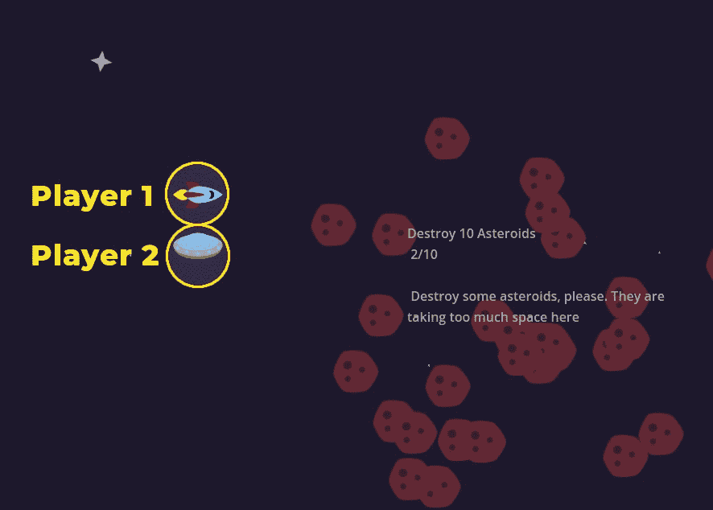
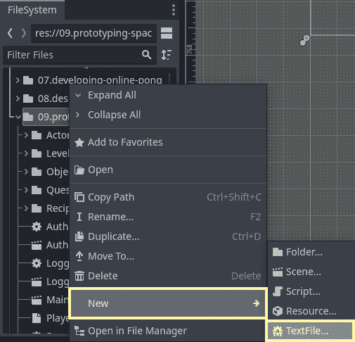
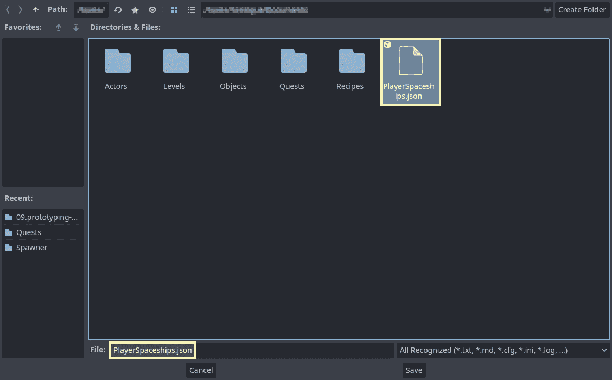
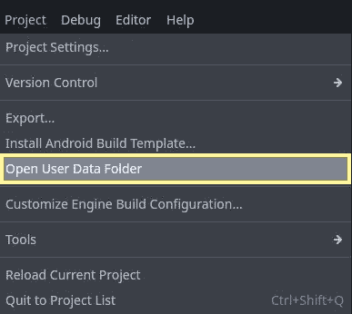
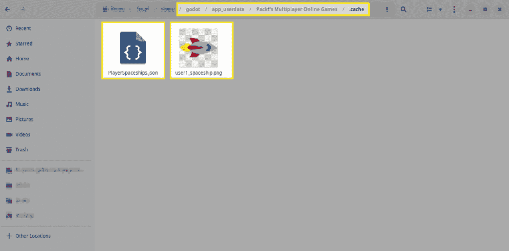
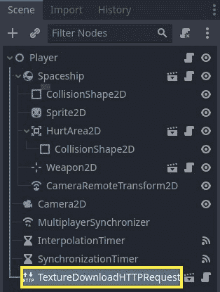
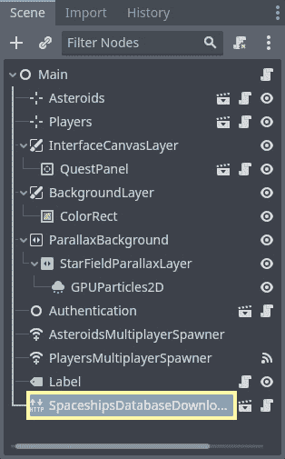
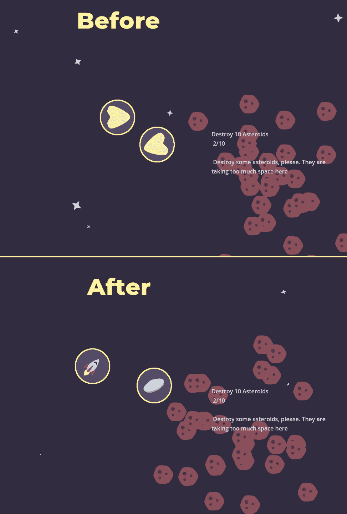
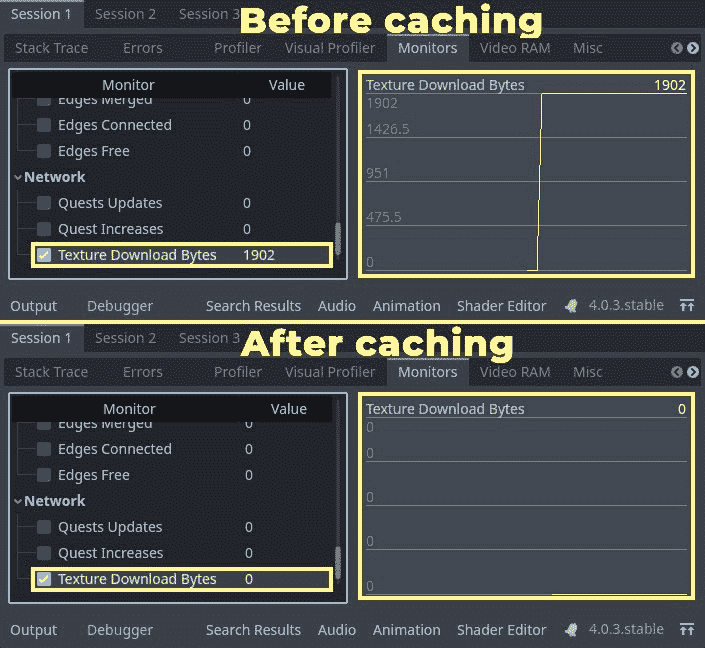

# 13

# 缓存数据以减少带宽

在游戏开发中，谈到减少带宽使用和优化网络使用，总会想到一种强大的技术：缓存。

缓存解决了这样一个问题：为什么我们可以在下载一次后，将其存储在某个地方，并在需要时重复使用，而无需反复下载相同的数据。在本章中，我们将深入研究缓存技术，并学习如何将它们应用于高效下载、存储和重复使用图像和其他相关数据。为此，我们将使用一个包含图像 URL 的数据库，我们将直接从互联网将其下载到玩家的机器中。

为了展示这些缓存技术的实现，我们将在我们的游戏项目中原型化一个新功能，玩家将能够上传自定义图像作为他们的飞船。为了节省时间并专注于这一功能的网络方面，我们将避免实现用户体验和用户界面方面，将这些任务留给我们想象中的独立工作室中的才华横溢的个体。作为开发者，您的角色将是处理这一功能的网络相关方面，并确保其无缝集成。

在下面的屏幕截图中，您可以见证这一功能在实际操作中的激动人心的结果。两位玩家正在使用从服务器下载的个性化飞船精灵进行游戏。这些精灵来自 Twemoji，这是一个由 Twitter 维护的 Creative Commons 许可的开源表情符号仓库。



图 13.1 – 为两位玩家从服务器下载的个性化飞船精灵

本章涵盖的主题如下：

+   理解缓存

+   设置`HTTPRequest`节点

+   实现纹理缓存

+   实现数据库缓存

+   缓存的进一步应用

# 技术要求

值得注意的是，本章建立在第十章中提出的概念之上，即*调试和性能分析网络*，以及第九章中开发的项目，即*创建在线冒险原型*。因此，熟悉那些章节中讨论的概念和技术对于完全理解这里提出的优化方法至关重要。我们还将基于第十二章的最终项目，即*实现延迟补偿*，您可以通过以下链接获取文件：

[`github.com/PacktPublishing/The-Essential-Guide-to-Creating-Multiplayer-Games-with-Godot-4.0/tree/12.prediction-and-interpolation`](https://github.com/PacktPublishing/The-Essential-Guide-to-Creating-Multiplayer-Games-with-Godot-4.0/tree/12.prediction-and-interpolation)

此外，在本章中，了解如何在在线服务上上传和托管内容的基本方法是很重要的。例如，我们将直接从项目的 GitHub 仓库以及名为 ImgBB 的服务下载文件，ImgBB 是一个免费图像托管平台。如果不理解使用直接链接进行内容托管和检索的机制，你可能会在理解和实施我们即将探讨的过程时遇到困难。

为了丰富你的学习体验，我强烈推荐下载 Twemoji 仓库的最新版本，该版本可以从[`github.com/twitter/twemoji`](https://github.com/twitter/twemoji)获取。通过探索这个仓库，你将深入了解如何管理和将图像和其他媒体内容纳入你的游戏开发项目中。

话虽如此，让我们来了解什么是缓存以及我们如何在我们的游戏项目中使用它。

# 理解缓存

在在线多人游戏中，每一秒都很宝贵。玩家期望无缝、实时的体验，没有中断。这就是缓存成为优化游戏性能的强大盟友的地方。那么，缓存究竟是什么，为什么它对在线多人游戏至关重要？

**缓存**是将频繁访问的数据或资源存储在本地设备或中间服务器上的过程。这些资源可以包括图像、声音文件、3D 模型，甚至是一些小的代码片段。游戏不需要每次需要这些资源时都从远程服务器获取，而是将它们存储在本地。当出现对这些资源的请求时，游戏会检查是否已经有一个本地副本。如果有，它将使用本地版本，这显著减少了加载时间并节省了宝贵的网络带宽。

缓存的原理简单而有效：如果你曾经使用过某个东西，那么你很可能还需要它。在我们多人游戏的环境中，这意味着玩家下载到他们设备上的图像、声音和资产可以被本地缓存。当另一个玩家进入视野时，游戏可以从本地缓存中检索这些资产，而不是重新下载。这创造了一个更流畅的体验，并减少了网络的压力。

缓存在线多人游戏中提供了许多优势。最突出的好处是提升了游戏体验。通过使用缓存的资源，玩家可以迅速与其他人互动，看到他们个性化的飞船设计，并参与战斗而不会出现显著的延迟。减少的加载时间意味着更流畅和沉浸式的游戏体验。此外，这个过程减轻了服务器的负担，使其能够同时处理更多的玩家。

缓存不仅仅是关于速度；它还关乎效率。重复下载相同的资源不仅浪费带宽，而且使游戏对环境不那么友好，对于数据计划有限的玩家来说可能还会产生额外成本。通过缓存常用资源，游戏变得更快、更环保、更经济。

在接下来的章节中，我们将探讨如何利用强大的`HTTPRequest`节点来实现自定义宇宙飞船图像的缓存。我们将深入探讨下载这些图像并确保它们在每个玩家的缓存中可用，从而增强在线多人游戏体验。敬请期待一步步指导如何在您的游戏中实现缓存。

# 设置 HTTPRequest 节点

如同章节引言中提到的，我们将实现一个功能，允许玩家在他们的宇宙飞船上使用自定义精灵。

为了原型化这个功能，我们将从提供免费图片托管服务的第三方图片托管服务下载图片。我们将通过使用**超文本传输协议**（**HTTP**）请求从第三方服务器检索图片文件来实现这一点。让我们深入了解 HTTP 的工作原理，以全面理解其操作并掌握实现过程。

## 理解 HTTP 协议

**HTTP**是万维网通信的基础。它是一种定义客户端和服务器之间交互和数据交换的协议。由蒂姆·伯纳斯-李在 20 世纪 90 年代初发明，HTTP 最初是为了方便检索超文本文档，也就是我们常说的网页。随着时间的推移，它已经发展支持各种类型的内容，包括图片、视频和文件。

当客户端，比如我们的玩家，想要从服务器检索资源时，它会发起一个 HTTP 请求。这个请求包含一个方法，指定了对资源要执行的操作，以及`GET`、`POST`、`PUT`和`DELETE`。在下载图片的上下文中，我们通常使用`GET`方法。

服务器在接收到 HTTP 请求后，会处理它并准备一个 HTTP 响应。这个响应包含请求的资源，并伴随 HTTP 状态码、内容类型和内容长度等元数据。

此外，服务器在响应中包含头部信息，以提供更多信息或指令给客户端。

要使用 HTTP 下载图片，客户端向服务器发送一个指定图片 URL 的`GET`请求。服务器处理这个请求，然后发送一个包含图片数据的 HTTP 响应。客户端接收这个响应，并将其解释为向用户显示图片。

HTTP 作为一个无状态协议运行，这意味着每个请求-响应周期都是独立的，并且不会保留任何关于之前交互的信息。

然而，可以使用诸如 cookies 和会话管理等机制来维护状态并启用更复杂的交互。

总结来说，HTTP 作为协议，促进了客户端和服务器之间的通信。它使我们能够通过向服务器发送 HTTP 请求并接收包含所需数据的 HTTP 响应来下载图像和其他资源。理解 HTTP 的工作原理对于实现如在我们游戏项目中下载图像等特性至关重要。

我们将要使用 HTTP 请求的原因是，我们想要缓存的文件类型相对于我们通常使用`HTTPRequest`节点和最小数据库（我们将匹配玩家的用户名和他们的自定义飞船精灵的 URL）传输的数据类型来说相当大。这个数据库打算放在服务器端，并在稍后缓存在玩家的机器上，正如我们将在*实现数据库* *缓存*部分中看到的那样。

## 设置场景和数据库

让我们开始设置场景和数据库。

要创建我们的数据库，让我们打开`res://09.prototyping-space-adventure/`文件夹并创建一个新的文本文件。你可以通过在**FileSystem**窗口中右键单击文件夹来快速完成此操作。下面的截图显示了弹出的菜单。从那里，选择**新建** | **文本文件...**。



图 13.2 – 通过 FileSystem 窗口直接创建新文本文件

然后，创建一个名为`PlayerSpaceships.json`的文件，如下面的截图所示：



图 13.3 – 创建一个名为 PlayerSpaceships.json 的新文本文件

现在，关于内容，我们将从`PlayerSpaceships.json`文件中维护的用户内容将如下所示：

```cpp
{
     "user1": "https://i.ibb.co/KxqzJMp/rocket.png",
     "user2": "https://i.ibb.co/d7BR6hX/saucer.png"
}
```

注意，你可以尝试使用其他图像和托管服务。只要你有图像的直接链接，通常指向`.png`文件，你就没问题了。

现在，是时候设置`HTTPRequest`节点了。我们将从从服务器下载`PlayerSpaceships.json`文件开始。在我们的例子中，这个文件托管在 GitHub 上，但你可以在任何其他服务器上存储它，只要你有指向实际数据库文件的直接链接。在我们的例子中，你可以在这里找到它：

[raw.githubusercontent.com/PacktPublishing/The-Essential-Guide-to-Creating-Multiplayer-Games-with-Godot-4.0/13.caching-data/source/09.prototyping-space-adventure/PlayerSpaceships.json](http://raw.githubusercontent.com/PacktPublishing/The-Essential-Guide-to-Creating-Multiplayer-Games-with-Godot-4.0/13.caching-data/source/09.prototyping-space-adventure/PlayerSpaceships.json)

当`PlayerSpaceships.json`文件已上传到互联网上时，让我们看看如何通过以下步骤将其下载到玩家的机器上：

1.  创建一个新的场景，并使用`HTTPRequest`节点作为根节点。

1.  将其重命名为 `SpaceshipsDatabaseDownloadHTTPRequest`，因为这个节点将负责从互联网下载数据库。

1.  将一个新的脚本附加到这个节点上，并保存场景和脚本。在这里，我直接将它们保存为 `res://09.prototyping-space-` `adventure/SpaceshipsDatabaseDownloadHTTPRequest`。

1.  现在，打开脚本，让我们做以下操作：

    1.  创建一个导出变量，用于存储我们将用于缓存的文件夹路径。在这里，使用 `user://` 数据文件夹路径非常重要，这样 Godot 引擎可以正确地根据游戏运行的平台调整路径：

    ```cpp
    extends HTTPRequest
    @export_global_dir var cache_directory = "user://.cache/"
    ```

    1.  然后，创建一个新的导出变量，它应该指向数据库文件将要保存的位置。让我们保持其默认文件名，并将其放入 `cache` 文件夹：

    ```cpp
    extends HTTPRequest
    @export_global_dir var cache_directory = "user://.cache/"
    @export_global_file var spaceships_database_path = "user://.  cache/PlayerSpaces
    hips.json"
    ```

    1.  然后，我们可以导出另一个变量。但现在我们需要存储 `PlayerSpaceships.json` 文件下载位置的链接：

    ```cpp
    extends HTTPRequest
    @export_global_dir var cache_directory = "user://.cache/"
    @export_global_file var spaceships_database_path = "user://.cache/PlayerSpaces
    hips.json"
    @export var spaceships_database_link = "https://raw.githubusercontent.com/PacktPublishing/The-Essential-Guide-to-Creating-Multiplayer-Games-with-Godot-4.0/13.caching-data/source/09.prototyping-space-adventure/PlayerSpaceships.json"
    ```

    1.  有了这些，我们可以继续到实际的下载方法。创建一个新的方法，命名为 `download_spaceships_database()`，然后开始它的实现。

    1.  我们在这里要做的第一件事是检查是否已经存在缓存目录。如果没有，我们将创建它：

    ```cpp
    func download_spaceships_database():
         var directory_access = DirAccess.open(cache_directory)
         if not directory_access:
              DirAccess.make_dir_absolute(cache_directory)
    ```

    1.  然后，我们将检查 `PlayerSpaceships.json` 文件是否存在。如果不存在，我们将开始实际的下载。开始下载的第一件事是在 `download_file` 成员变量中设置文件路径：

    ```cpp
    func download_spaceships_database():
         var directory_access = DirAccess.open(cache_directory)
         if not directory_access:
              DirAccess.make_dir_absolute(cache_directory)
         var file_access = FileAccess.open(spaceships_database_path, FileAccess.READ)
         if not file_access:
              download_file = spaceships_database_path
    ```

    1.  在设置好 `download_file` 之后，我们可以向文件发出请求。为此，我们将使用 `request()` 方法，该方法请求一个 URL。这个方法默认使用 `GET` 方法来发出请求，这正是我们想要的。但如果你想在传递一些自定义头信息后更改这个设置，你可以在第三个参数中更改它。在我们的情况下，我们不需要传递除了 URL 之外的其他任何内容：

    ```cpp
    func download_spaceships_database():
         var directory_access = DirAccess.open(cache_directory)
         if not directory_access:
              DirAccess.make_dir_absolute(cache_directory)
         var file_access = FileAccess.open(spaceships_database_path, FileAccess.READ)
         if not file_access:
              download_file = spaceships_database_path
              request(spaceships_database_link)
    ```

    1.  然后，我们需要等待请求完成。记住，由于这是一个异步过程，游戏需要在继续到任何依赖于这个文件的逻辑之前等待它完成：

    ```cpp
    func download_spaceships_database():
         var directory_access = DirAccess.open(cache_directory)
         if not directory_access:
              DirAccess.make_dir_absolute(cache_directory)
         var file_access = FileAccess.open(spaceships_database_path, FileAccess.READ)
         if not file_access:
              download_file = spaceships_database_path
              request(spaceships_database_link)
              await request_completed
    ```

在遵循前面的步骤之后，我们应该让 `SpaceshipsDatabaseDownloadHTTPRequest` 开始工作。如果你想测试它，可以在 `_ready()` 回调中调用 `download_spaceship_database()` 方法并运行场景。之后，如果你打开用户数据文件夹，你会看到 `.cache/` 文件夹，如果你进入这个文件夹，你应该在那里找到 `PlayerSpaceships.json` 文件。注意，在这种情况下，`.cache/` 是一个隐藏文件夹，所以请确保你可以在文件管理器中看到隐藏文件夹。要快速打开用户数据文件夹，你可以转到 **项目** | **打开用户数据文件夹**，如图下所示：



图 13.4 - 从编辑器的项目标签页打开用户数据文件夹

现在，让我们创建一个名为`TextureDownloadHTTPRequest`的场景，这样我们就可以使用`PlayerSpaceships.json`中的数据来有效地下载玩家的自定义飞船精灵。为此，请按照以下步骤操作：

1.  创建一个新的场景，并使用一个`HTTPRequest`节点作为根节点。

1.  将其重命名为`TextureDownloadHTTPRequest`，因为这个才是真正负责从互联网下载纹理的：

1.  将场景保存为`res://09.prototyping-space-` `adventure/TextureDownloadHTTPRequest.tscn`，并将其附加到一个脚本上，然后在脚本中执行以下操作：

    1.  导出一个变量，该变量应指向玩家机器上的`PlayerSpaceships.json`文件，因此此路径应使用`user://`文件路径：

    ```cpp
    extends HTTPRequest
    @export_global_file var spaceships_database_file = "user://.cache/PlayerSpaces hips.json"
    ```

    1.  创建一个名为`download_spaceship()`的新方法。此方法应接收两个参数，一个用于用户，另一个用于精灵将被保存的文件路径：

    ```cpp
    extends HTTPRequest
    @export_global_file var spaceships_database_file = "user://.cache/PlayerSpaces hips.json"
    func download_spaceship(user, sprite_file):
    ```

    1.  然后，在这个方法内部，我们将创建一个新的名为`players_spaceships`的`Dictionary`，它将开始为空，但很快将存储来自`PlayerSpaceships.json`文件的内容：

    ```cpp
    func download_spaceship(user, sprite_file):
         var players_spaceships = {}
    ```

    1.  现在，我们将检查由`spaceships_database_file`路径提供的文件是否存在。如果存在，我们将打开它，使用`FileAccess.get_as_text()`将其转换为字符串，并从 JSON 格式解析为`Dictionary`对象格式，将其存储在`players_spaceships`变量中：

    ```cpp
    func download_spaceship(user, sprite_file):
         var players_spaceships = {}     if FileAccess.file_exists(spaceships_database_file):
              var file = FileAccess.open(spaceships_database_file, FileAccess.READ)
              players_spaceships = JSON.parse_string(file.get_as_text())
    ```

    1.  之后，我们可以根据`PlayerSpaceships.json`数据库提供的 URL 下载`user`精灵，并将其存储在`sprite_file`参数提供的文件路径中。为此，我们将使用`HTTPRequest.download_file`和`HTTPRequest.request()`方法来下载。请注意，如果请求有任何问题，此方法会返回错误。让我们将其存储在`error`变量中，以便其他类可以验证请求是否成功：

    ```cpp
    func download_spaceship(user, sprite_file):
         var players_spaceships = {}
         if FileAccess.file_exists(spaceships_database_file):
              var file = FileAccess.open(spaceships_database_file, FileAccess.READ)
              players_spaceships = JSON.parse_string(file.get_as_text())
         if user in players_spaceships:
              download_file = sprite_file
              var error = request(players_spaceships[user])
    ```

    1.  由于 HTTP 请求可能需要一些时间才能完成内容的下载，我们需要在结束函数并返回错误之前等待`HTTPRequest.request_completed`信号。请注意，如果函数没有达到这些条件语句中的任何一个，我们应该返回`FAILED`以告知其他类`spaceships_database_file`不存在或数据库中不存在`user`：

    ```cpp
    func download_spaceship(user, sprite_file):
         var players_spaceships = {}
         if FileAccess.file_exists(spaceships_database_file):
              var file = FileAccess.open(spaceships_database_file, FileAccess.READ)
              players_spaceships = JSON.parse_string(file.get_as_text())
         if user in players_spaceships:
              download_file = sprite_file
              var error = request(players_spaceships[user])
              await request_completed
              return error
         return FAILED
    ```

好的，这就结束了我们设置 HTTPRequests 的旅程。我们创建了数据库和两个负责处理其数据的节点，将数据库下载到玩家的机器上，以及下载数据库中的内容，在这种情况下，是玩家的飞船自定义精灵。您也可以通过使用`"user1"`和`"user://.cache/user1_spaceship.png"`作为参数调用`download_spaceship()`方法来测试场景。只需确保您已经运行了`SpaceshipDatabaseDownloadHTTPRequest`场景，这样`PlayersSpaceships.json`文件就存在于`user://.cache/`文件夹中。有了这个，您应该会在用户数据文件夹中看到一个新的图像被下载！以下截图显示了我的`user://.cache/`文件夹的样子：



图 13.5 – 包含 PlayerSpaceships.json 文件和用户 1 自定义飞船精灵的用户数据文件夹

在本节中，我们学习了如何使用 HTTP 请求在用户数据文件夹中缓存数据和下载图像。我们看到了 UDP 和 HTTP 在传输大型文件（如图像）时的区别，以及如何使用`HTTPRequest`节点在 Godot 中使用 HTTP 协议并将数据从互联网传输到我们的机器。

在下一节中，我们将讨论在游戏中实现纹理缓存的方法，允许实时更改玩家的飞船。这个功能将通过使用我们创建的`HTTPRequest`节点和我们的最小数据库来获取玩家自定义飞船精灵的 URL 来实现。

# 实现纹理缓存

在上一节中，我们介绍了`HTTPRequest`节点，这是 Godot 引擎提供的内置解决方案，用于进行 HTTP 请求。然后我们创建了`TextureDownloadHTTPRequest`，这是一个专门用于从我们的`PlayersSpaceship.json`数据库下载图像的自定义节点。现在，让我们深入了解将此节点集成到我们的`Player2D`类中，以便我们可以在原型中实际使用它。

在本节中，我们将创建一个方法，使服务器能够动态地更改玩家的飞船精灵。但我们将不会加载任何精灵；我们将从我们在*设置场景和数据库*部分设置的`user://.cache/`文件夹中获取正确的文件。这种方法将增强游戏中的定制和交互，允许服务器实时向玩家发送自定义精灵。

为了实现这一点，我们将创建一个名为`load_spaceship()`的方法。这个方法将在我们的实现中扮演基本角色。它将是一个 RPC 函数，服务器可以远程触发以针对特定玩家。好吧，让我们开始吧！打开`res://09.prototyping-space-adventure/Actors/Player/Player2D.tscn`场景，并按照以下步骤进行操作：

1.  让我们先添加一个`TextureDownloadHTTPRequest`实例，直接作为`Player`节点的子节点。



图 13.6 – 在玩家场景中实例化的 TextureDownloadHTTPRequest

1.  然后，打开`res://09.prototyping-space-adventure/Actors/Player/Player2D.gd`脚本。

1.  让我们存储对`TextureDownloadHTTPRequest`节点的引用。我们可以简称为`http_request`：

    ```cpp
    @onready var http_request = $TextureDownloadHTTPRequest
    ```

1.  然后，在`setup_multiplayer()`方法下面，让我们创建`load_spaceship()`方法。它将是一个 RPC 方法，只能由服务器远程调用，并且也应该在本地调用，因此服务器也会更新图像。此方法接收用户，加载飞船：

    ```cpp
    @rpc("authority", "call_local")
    func load_spaceship(user):
    ```

1.  现在，在这个方法内部，我们将创建玩家机器中飞船纹理文件的文件路径并将其存储在一个名为 `spaceship_file` 的变量中。这个文件路径由 `"user://.cache/"` 字符串组成，后面跟着我们作为参数获取的 `user` 值，然后我们将追加 `"_spaceship.png"` 以创建带有图像扩展名的正确文件路径：

    ```cpp
    @rpc("authority", "call_local")
    func load_spaceship(user):
         var spaceship_file = "user://.cache/" + user + "_spaceship.png"
    ```

1.  在有了合适的文件路径后，下一步是查看该文件是否已经存在，因为缓存数据的整个想法是，如果它在玩家的机器中已经存在，我们可以加载它而不是重新下载它，从而减少资源消耗。以下代码检查文件是否存在。如果存在，我们将传递 `spaceship_file` 作为参数调用 `update_sprite()` 方法。我们将在稍后创建 `update_sprite()` 方法：

    ```cpp
    @rpc("authority", "call_local")
    func load_spaceship(user):
         var spaceship_file = "user://.cache/" + user + "_spaceship.png"
         if FileAccess.file_exists(spaceship_file):
              update_sprite(spaceship_file)
    ```

1.  现在，`TextureDownloadHTTPRequest` 将发挥其作用。如果文件不在缓存文件夹中，我们将调用 `TextureDownloadHTTPRequest.download_texture()` 方法并等待其完成；记住，这是一个异步方法。如果这个方法返回一个 `OK` 错误，意味着实际上没有错误，我们也会调用 `update_sprite()` 方法，以便游戏执行更新飞船精灵的程序。以下代码检查 `update_sprite()` 方法是否返回除了 `OK` 以外的任何内容。如果 `update_sprite()` 方法不返回 `OK`，这意味着不会加载任何精灵。由于自定义精灵不会影响玩家的核心体验，我们可以假设我们可以保留默认精灵并让游戏运行：

    ```cpp
    @rpc("authority", "call_local")
    func load_spaceship(user):
         var spaceship_file = "user://.cache/" + user + "_spaceship.png"
         if FileAccess.file_exists(spaceship_file):
              update_sprite(spaceship_file)
         else:
              if await http_request.download_spaceship(user, spaceship_file) == OK:
                   update_sprite(spaceship_file)
    ```

1.  现在，让我们创建 `update_sprite()` 方法。这是一个有效更改 `Sprite` 节点的 `Texture` 属性的方法。它将使用 `Image.load_from_file()` 方法从文件路径加载图像，并使用 `ImageTexture.create_from_image()` 方法将其转换为 `ImageTexture`：

    ```cpp
    func update_sprite(spaceship_file):
         var image = Image.load_from_file(spaceship_file)
         var texture = ImageTexture.create_from_image(image)
         $Spaceship/Sprite2D.texture = texture
    ```

在本节中，我们看到了如何使用 `TextureDownloadHTTPRequest` 节点从我们的数据库下载和缓存图像。我们还看到了如何使用缓存的图像动态更改玩家的飞船精灵，将它们作为图像资源加载，并将它们转换为飞船的 `Sprite2D` 节点可以使用的实际 `ImageTexture`。

现在，这个过程的缺失部分是…我们实际上是如何获取 `PlayersSpaceship.json` 数据库以及我们调用 `load_spaceship()` 方法的。嗯，这正是我们将在下一节要做的事情！

# 实现数据库缓存

一切就绪后，是时候再进一步，着手于将一切粘合在一起的 `World` 场景，并运行适当的程序以确保所有玩家都能看到相同的自定义精灵。我们在这个节点中这样做，因为这是一个负责设置与世界同步相关的一切的类，包括玩家的飞船自定义精灵。我们需要在一些核心方法中进行一些更改以实现这一点，但这会更好。

由于我们正在处理原型，所以我们不用担心更改函数签名和类的其他核心方面。但请注意，如果这是生产就绪的，我们会称这个类为“封闭”的，并避免做出像我们即将做出的核心更改。这将保持我们的游戏代码库一致，并避免错误。尽管我们即将做出的更改将主要扩展类的功能，但我们将在 `World.create_spaceship()` 方法中添加一个参数，由于该方法之前没有要求任何参数，这会破坏函数的契约。但，正如所说的，这是一个原型，我们有自由按自己的意愿调整事物。所以，让我们打开 `res://09.prototyping-space-adventure/Levels/World.tscn` 场景，通过以下步骤实现改进：

1.  首先，让我们将 `SpaceshipsDatabaseDownloadHTTPRequest` 节点的一个实例作为 `World` 节点的直接子节点添加。



图 13.7 – 在世界场景中实例化的 SpaceshipsDatabaseDownloadHTTPRequest

1.  然后，让我们打开 `res://09.prototyping-space-adventure/Levels/World.gd` 脚本，通过添加对 `SpaceshipsDatabaseDownloadHTTPRequest` 节点的引用来开始编写代码。在这里，我们也可以简单地将其称为 `http_request`：

    ```cpp
    @onready var http_request = $SpaceshipsDatabaseDownloadHTTPRequest
    ```

1.  我们还将创建一个新的变量来存储 `player_ids` 和它们的 `user`。这将允许我们查看此变量以找到与每个玩家的 peer ID 相关的正确用户名，这样我们就可以在数据库中轻松地将它们映射起来：

    ```cpp
    var player_users = {}
    ```

1.  现在，在 `_ready()` 回调中，在等待 `0.1` 秒 `SceneTree` 的计时器超时后，我们将等待 `http_request` 下载飞船数据库。记住，这只有在运行游戏的实例不是服务器的情况下才会发生：

    ```cpp
    func _ready():
         if not multiplayer.is_server():
              await(get_tree().create_timer(0.1).timeout)
              await http_request.download_spaceships_database()
    ```

1.  仍然在这个 `if` 语句中，我们将进行一个小改动。当调用服务器的 `create_spaceship()` 方法进行 RPC 时，我们也将传递玩家的用户信息。为此，我们将使用长时间未被使用的 `AuthenticationCredentials` 单例！

    ```cpp
    func _ready():
         if not multiplayer.is_server():
              await(get_tree().create_timer(0.1).timeout)
              await http_request.download_spaceships_database()
              rpc_id(1, "sync_world")
              rpc_id(1, "create_spaceship", AuthenticationCredentials.user)
    ```

1.  接下来，让我们进入 `create_spaceship()` 方法，当然，我们需要更改其函数签名以支持 `user` 参数：

    ```cpp
    @rpc("any_peer", "call_remote")
    func create_spaceship(user):
    ```

1.  然后，在将 `spaceship` 作为 `Players` 节点的子节点之前，我们将使用其名称（这实际上是玩家 peer ID 的字符串版本）作为 `player_users` 字典中的键，并将此键的值设置为 `user` 参数。这样，我们就有效地将玩家的 ID 与他们的用户名配对：

    ```cpp
    @rpc("any_peer", "call_remote")
    func create_spaceship(user):
         var player_id = multiplayer.get_remote_sender_id()
         var spaceship = preload("res://09.prototyping-space-adventure/Actors/Player/Play er2D.tscn").instantiate()
         spaceship.name = str(player_id)
         player_users[spaceship.name] = user
    ```

1.  在对新生成的玩家飞船的 `setup_multiplayer()` 方法进行 RPC 后，我们将通过也对该 `load_spaceship()` 方法进行 RPC 来实现魔法，这将触发我们在 *实现纹理缓存* 部分中制作的程序。经过这些更改后，`create_spaceship()` 方法的更新版本将如下所示：

    ```cpp
    @rpc("any_peer", "call_remote")
    func create_spaceship(user):
         var player_id = multiplayer.get_remote_sender_id()
         var spaceship = preload("res://09.prototyping-space-adventure/Actors/Player/Play er2D.tscn").instantiate()
         spaceship.name = str(player_id)
         player_users[spaceship.name] = user
         $Players.add_child(spaceship)
         await(get_tree().create_timer(0.1).timeout)
         spaceship.rpc("setup_multiplayer", player_id)
         spaceship.rpc("load_spaceship", user)
    ```

太好了！有了这个，每当玩家跳入游戏时，他们的宇宙飞船将改变其精灵为玩家上传的定制精灵（如果有的话）。现在，我们还需要让在玩家加入游戏时已经在游戏世界中的宇宙飞船也发生同样的变化。为此，我们需要在 `_on_players_multiplayer_spawner_spawned()` 回调中进行一些更改。仍然在 `res://09.prototyping- space-adventure/Levels/World.gd` 脚本中，让我们通过转到 `_on_players_multiplayer_spawner_spawned()` 方法并执行以下步骤来实现这些更改：

1.  让我们重新设计这个回调函数的整体逻辑，并从头开始。我们将首先创建一个变量来存储玩家的对等节点 ID，我们可以通过将最近生成的节点的名称转换为整数来获取它。节点名称是 `StringNames`，这意味着它们不是纯字符串，因此我们需要在将它们转换为整数之前将它们转换为默认字符串：

    ```cpp
    func _on_players_multiplayer_spawner_spawned(node):
         var player_id = int(str(node.name))
    ```

1.  之后，我们将对 `setup_multiplayer()` 方法进行全局 RPC，就像我们之前做的那样，但现在我们传递 `player_id` 作为参数：

    ```cpp
    func _on_players_multiplayer_spawner_spawned(node):
         var player_id = int(str(node.name))
         node.rpc("setup_multiplayer", player_id)
    ```

1.  然后是有趣的部分。在执行这个 RPC 之后，如果生成的节点，换句话说，生成的玩家，恰好位于另一个玩家的游戏实例中，而不是服务器的实例中，我们将直接对服务器进行 RPC，要求它使用一个方法（我们很快就会创建）来同步这个宇宙飞船，该方法接收一个玩家 ID 作为其参数：

    ```cpp
    func _on_players_multiplayer_spawner_spawned(node):
         var player_id = int(str(node.name))
         node.rpc("setup_multiplayer", player_id)
         if not multiplayer.is_server():
              rpc_id(1, "sync_spaceship", player_id)
    ```

1.  现在让我们继续到 `sync_spaceship()` 方法。让我们使用 RPC 注解来创建这个方法，这样任何对等节点都可以远程调用它，同时它也会在服务器本地被调用。记住，这个方法接收 `player_id` 作为其参数：

    ```cpp
    @rpc("any_peer", "call_local")
    func sync_spaceship(player_id):
    ```

1.  在 `sync_spaceship()` 方法内部，我们首先存储对调用此函数的人的 ID 的引用。这将允许我们直接调用刚刚加入游戏的玩家，而不是每次有玩家加入游戏时都调用每个玩家：

    ```cpp
    @rpc("any_peer", "call_local")
    func sync_spaceship(player_id):
         var requester = multiplayer.get_remote_sender_id()
    ```

1.  然后，我们将通过使用 `get_node()` 方法并附加 `player_id` 在 `Players` 节点的子节点中找到正确的玩家。记住，由于 `player_id` 也是节点的名称，这就是我们如何在所有 `Players` 子节点中轻松找到它的方法：

    ```cpp
    @rpc("any_peer", "call_local")
    func sync_spaceship(player_id):
         var requester = multiplayer.get_remote_sender_id()
         var node = get_node("Players/%s" % player_id)
    ```

1.  之后，我们将找到玩家的用户名。为此，我们将使用 `player_id` 作为 `player_users` 的键，这将返回正确的用户名：

    ```cpp
    @rpc("any_peer", "call_local")
    func sync_spaceship(player_id):
         var requester = multiplayer.get_remote_sender_id()
         var node = get_node("Players/%s" % player_id)
         var user = player_users[node.name]
    ```

1.  最后，在我们手中有了用户之后，我们可以对这个请求者的 `node` 实例上的 `load_spaceship()` 方法进行 RPC，该 `node` 代表在他们的游戏实例上生成的宇宙飞船：

    ```cpp
    @rpc("any_peer", "call_local")
    func sync_spaceship(player_id):
         var requester = multiplayer.get_remote_sender_id()
         var node = get_node("Players/%s" % player_id)
         var user = player_users[node.name]
         node.rpc_id(requester, "load_spaceship", user)
    ```

我们做到了！有了这个，游戏现在能够加载、存储和同步玩家的自定义飞船精灵。如果你现在运行游戏，你可以看到游戏正在缓存数据以减少带宽，并实时下载和更新玩家的飞船精灵。以下截图显示了实现此功能前后的对比：



图 13.8 – 实现自定义精灵功能前后的对比

如果你想要测量缓存带来的差异，一个有趣的方法是删除检查 `user://.cache/` 文件夹中文件是否存在的语句，并添加一个监控器来监控 `TextureDownloadHTTPRequest` 和 `SpaceshipsDatabaseDownloadHTTPRequest` 下载的字节数。为此，你可以使用 `HTTPRequest.get_downloaded_bytes()` 方法。例如，以下代码片段显示了如何在 `TextureDownloadHTTPRequest` 节点中创建一个监控器：

```cpp
func _ready():
     var callable = Callable(self, "get_texture_downloaded_bytes")
     Performance.add_custom_monitor("Network/Texture Download Bytes", callable)
func get_texture_downloaded_bytes():
     return get_downloaded_bytes()
```

有了这个，我们可以多次测试我们的游戏来模拟玩家登录和退出游戏，并查看缓存对每个阶段的影响。你会注意到，在图像被缓存后，当玩家再次登录游戏时，它们几乎是瞬间更新的。以下截图显示了在玩家机器中缓存图像前后对网络使用（以字节为单位）的实际影响：



图 13.9 – 比较玩家首次下载纹理和缓存纹理后的网络消耗

在本节中，我们看到了如何在我们的游戏中实现数据库缓存自定义飞船精灵。`World` 场景负责同步游戏世界，包括玩家的飞船精灵。因此，我们对它进行了一些修改，以实现我们在前几节中实现的缓存。我们看到了如何使用 `SpaceshipsDatabaseDownloadHTTPRequest` 节点下载飞船数据库，并通过 RPC 更新玩家的飞船精灵并同步飞船精灵，当玩家加入游戏时。在本节的最后，我们使用了一个监控器和 `HTTPRequest.get_downloaded_bytes()` 方法来查看缓存如何减少带宽使用并提高网络效率。

注意在 *图 13.9* 中仅缓存两个纹理时节省的字节数！想象一下，从长远来看，这将对每天多次登录和退出游戏的数百甚至数千名玩家产生怎样的影响。而我们在这里只谈论纹理。我们还能缓存什么，并有效地节省数十万网络字节？这正是我们将在下一节中要探讨的内容。

# 进一步探讨缓存

好吧，正如我们所见，图像并不是我们通过 `HTTPRequest` 节点从互联网下载的唯一数据类型；例如，我们还下载了 `PlayersSpaceship.json` 文件，这是一个文本文件。但我们可以使用此协议下载几乎所有内容，前提是它存储在 HTTP 页面上。但有时，一些文件并未存储，也没有在任何人都可以访问的 HTTP 页面上公开。通常在这种情况下，后端工程师会创建一个 REST API，我们可以用它直接从存储这些文件的数据库中检索这些文件。

这种功能需要物理基础设施和自定义 REST API 的开发，以便我们可以与之交互。不幸的是，这远远超出了本书的范围。但整个想法是，你可以使用自定义头和类似 RPC 的自定义 URL 来执行 HTTP 请求。因此，在 URL 本身中，你会添加一些参数，REST API 会将其解释为方法调用和参数。这与我们在 *第二章**，* 发送和接收数据* 中所做的是非常相似的，而且 REST API 通常使用 JSON 格式的字符串作为主要的数据结构。

例如，你可以在我的 YouTube 频道上查看一系列视频，这些视频大量使用 REST API 将第三方服务集成到我的游戏 *Moon Cheeser* 中。REST API 由 *LootLocker* 提供，在某个时刻，我从他们的服务器下载了一个完整的 `PacketScene`，并在玩家的机器上缓存它，以便他们始终拥有他们购买的皮肤的副本。你可以在以下链接中查看这个特定的视频：

[`youtu.be/w0qz-pJMIBo?si=WF2KH9-FRyO8glVq`](https://youtu.be/w0qz-pJMIBo?si=WF2KH9-FRyO8glVq)

好吧，我这里也要用 LootLocker 的公共 API 作为例子。这是我用来自取玩家购买皮肤相关文件的 HTTP 请求：

```cpp
curl -X GET "https://api.lootlocker.io/game/v1/assets/list?count=10&filter=purchasabl e" \-H "x-session-token: your_token_here"
```

这可以翻译成以下 `GDScript` 代码，使用 `HTTPRequest` 节点：

```cpp
var url = "https://api.lootlocker.io/game/v1/assets/list?count=10&filter=purchasable"
var header = ["Content-Type: application/json", "x-session-token: %s" % LootLocker.tok
en]
request(url, header)
```

现在是我们要探索的有趣部分。当这个请求完成并且服务器向客户端发送响应，包括一些非常有趣的数据时，`HTTPRequest.request_completed` 信号会被触发，这些数据通常包括响应体，它通常是一个包含我们想要文件 URL 的 JSON 文件。因此，你可以将这个信号连接到一个信号回调，并访问响应体以获取服务器为你提供的关于请求的信息。这可以从文件本身的内容到一个包含更多信息的 JSON 文件，包括下载你想要文件的 URL。

为了避免跑题，我强烈建议你观看视频，了解我们如何下载资源密集型文件。在这种情况下，我下载了一个自定义 `PackedScene` 实例及其依赖项，例如一个必要的图像，用于正确显示购买的皮肤，并将其缓存在玩家的设备中。

拥有这个工具，你就可以实现各种缓存功能，并大幅节省资源使用，无论是对于你的玩家还是服务器，因为它不会反复向相同的客户端发送相同的文件。

# 摘要

好吧，是时候结束这一章了！在本章中，我们讨论了缓存是什么以及它是如何帮助我们节省带宽的。我们学习了如何在游戏中为自定义飞船精灵实现缓存。为此，我们看到了如何通过发起 HTTP 请求使用`HTTPRequest`节点从互联网下载文件。我们还实现了一个自定义监控器，通过缓存纹理来查看在整个游戏会话中我们节省了多少数据。最后，我们看到了缓存如何超越图像和文本文件，以及使用 REST API 通过 HTTP 下载各种文件的可能性。

有了这些，我的 Godot 引擎开发者们，我们的旅程就到此结束了！

我们是从不知道如何向另一台计算机发送简单消息的人开始的，现在我们已经成为了完全合格的网络工程师，准备创造我们梦想中的游戏，并允许玩家拥有共享的体验，享受彼此的时光，并在世界各地建立社区。祝贺您完成这段旅程。您现在能够做到任何人类能够做到的最令人惊叹的事情之一：将人们连接起来，共同追求一个目标。

这是我的告别。我为我们所经历的一切感到非常自豪，并希望您能善用这份力量。您绝对可以期待我未来会有更多的作品。但就目前而言，这就是全部了。

非常感谢您的阅读。继续开发，直到下次再见！
