# 第七章：其他主题

恭喜！你在本书中构建的项目已经让你走上了成为 Godot 专家的道路。然而，你只是刚刚触及了 Godot 可能性的表面。随着你技能的提高，以及项目规模的扩大，你需要知道如何找到解决问题的方案，如何分发你的游戏以便它们可以被玩，甚至如何扩展引擎本身。

在本章中，你将学习以下主题：

+   如何有效使用 Godot 内置文档

+   将项目导出以在其他平台上运行

+   在 Godot 中使用其他编程语言

+   如何使用 Godot 的资源库安装插件

+   成为 Godot 贡献者

+   社区资源

# 使用 Godot 的文档

学习 Godot 的 API 可能一开始会感觉令人不知所措。你该如何学习所有不同的节点，以及每个节点包含的属性和方法？幸运的是，Godot 的内置文档就在那里帮助你。养成经常使用的习惯：在学习过程中这将帮助你找到所需内容，而且一旦你熟悉了环境，快速查找方法或属性作为参考也是一个很好的方法。

当你在编辑器的“脚本”选项卡中时，你会在右上角看到以下按钮：

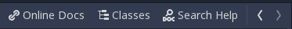

“在线文档”按钮将在你的浏览器中打开文档网站。如果你有多个显示器设置，保持 API 参考在一边以便在 Godot 中工作时快速参考将非常有用。

其他两个按钮允许你在 Godot 编辑器中直接查看文档。`类`按钮允许你浏览可用的节点和对象类型，而`搜索帮助`按钮允许你搜索任何方法或属性名称。两种搜索都是“智能”的，这意味着你可以输入单词的一部分，随着你输入，结果将缩小。请查看以下截图：

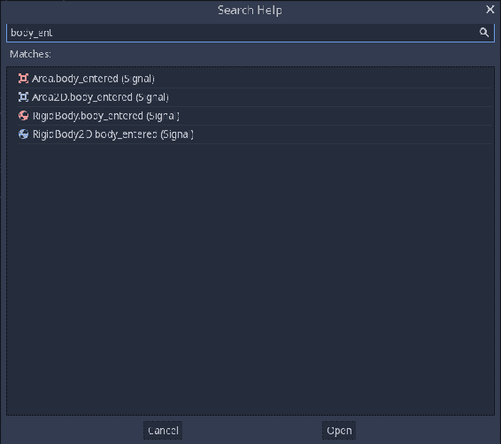

当你找到你正在寻找的属性或方法时，点击“打开”，该节点的文档引用将出现。

# 阅读 API 文档

当你找到你想要的节点的文档时，你会看到它遵循一个常见的格式，顶部是节点的名称，然后是几个信息子节，如下面的截图所示：

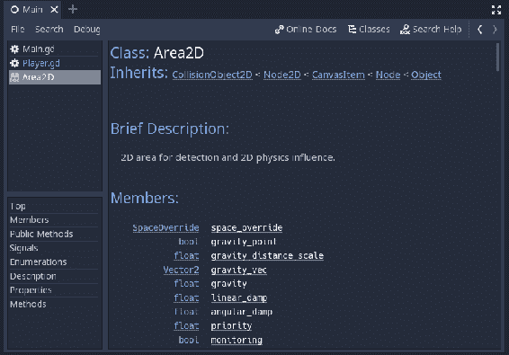

在文档的顶部有一个名为“Inherits”的列表，它显示了特定节点从所有方式构建的类链，直到 `Object`，这是 Godot 的基础对象类。例如，`Area2D` 节点具有以下继承链：

```cpp
CollisionObject2D < Node2D < CanvasItem < Node < Object
```

这让你可以快速查看此类对象可能具有的其他属性。你可以点击任何节点名称以跳转到该节点的文档。

你还可以查看一个列表，了解哪些节点类型（如果有），继承自该特定节点，以及节点的通用描述。下面，你可以看到节点的成员变量和方法。大多数方法和类型名称是链接，因此你可以点击任何项目来了解更多信息。

在工作过程中养成定期查阅 API 文档的习惯。你会发现，你将很快开始更深入地理解一切是如何协同工作的。

# 导出项目

最终，你的项目将到达你想要与世界分享的阶段。*导出*你的项目意味着将其转换为没有 Godot 编辑器的人可以运行的包。你可以为许多流行的平台导出你的项目。

在撰写本文时，Godot 支持以下目标平台：

+   Windows 通用

+   Windows 桌面

+   macOS

+   Linux

+   Android（移动）

+   iOS（移动）

+   HTML5（网页）

导出项目的具体方法取决于你针对的平台。例如，要导出到 iOS，你必须在一个安装了 Xcode 的 macOS 计算机上运行。

每个平台都是独特的，由于硬件限制、屏幕尺寸或其他因素，你的游戏的一些功能可能在某些平台上无法工作。例如，如果你想将 Coin Dash 游戏（来自第一章，*简介*）导出到 Android 平台，你的玩家将无法移动，因为键盘控制将不起作用！对于该平台，你需要在游戏代码中包含触摸屏控制（关于这一点稍后讨论）。

你甚至可能会发现，你需要为不同的平台在项目设置中设置不同的值。你可以通过选择设置并点击“覆盖为...”来完成此操作。这将创建一个针对该平台的新设置。

例如，如果你想启用 HiDPI 支持，但不允许 Android 平台启用，你可以为该设置创建一个覆盖：

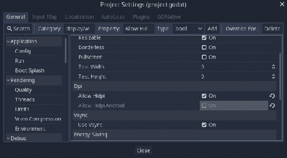

每个平台都是独特的，在配置项目以导出时需要考虑许多因素。请查阅官方文档，获取有关导出到您所需平台的最新说明。

# 获取导出模板

*导出模板*是针对每个目标平台编译的 Godot 版本，但不包括编辑器。你的项目将与目标平台的模板结合，以创建一个独立的应用程序。

要开始，你必须下载导出模板。从编辑器菜单中点击“管理导出模板”：

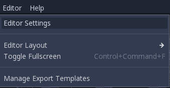

在此窗口中，你可以点击“下载”来获取导出模板：

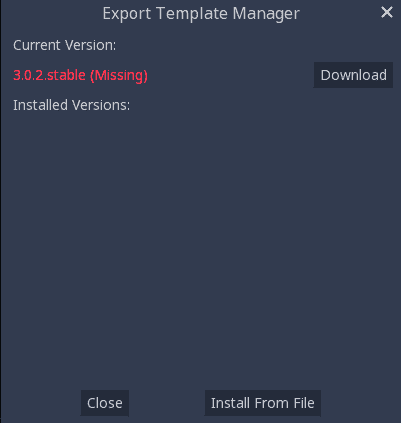

模板也可以从 Godot 网站下载，网址为[`godotengine.org/download`](http://godotengine.org/download)。如果你选择这样做，请使用“从文件安装”按钮来完成安装。

模板的版本必须与您使用的 Godot 版本相匹配。如果您升级到 Godot 的新版本，请确保您也下载了相应的模板，否则您的导出项目可能无法正常工作。

# 导出预设

当您准备好导出项目时，点击“项目”|“导出”：

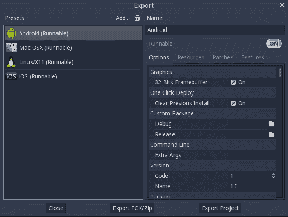

在此窗口中，您可以通过点击“添加...”并从列表中选择平台来为每个平台创建*预设*。您可以为每个平台创建尽可能多的预设。例如，您可能希望为项目创建调试和发布版本。

每个平台都有自己的设置和选项，太多无法在此描述。默认值通常是好的，但在分发项目之前，您应该彻底测试它们。

在“资源”选项卡中，您可以自定义导出项目中的哪些部分。例如，您可以选择仅导出选定的场景或从项目中排除某些源文件：


“补丁”选项卡允许您为之前导出的项目创建更新。

最后，“功能”选项卡显示了平台的功能摘要（在“选项”选项卡中配置），这些功能可以确定哪些属性由项目设置中的“覆盖”值自定义：


# 导出

窗口底部有两个导出按钮。第一个按钮“导出 PCK/Zip”将仅创建项目的 PCK 或打包版本。这不包括可执行文件，因此游戏不能独立运行。如果您需要为游戏提供附加组件或 DLC（可下载内容），此方法很有用。

第二个按钮“导出项目”将创建游戏的可执行版本，例如 Windows 的`.exe`或 Android 的`.apk`。

点击“保存”，您将拥有一个可玩的游戏版本。

# 示例 - 安卓平台的 Coin Dash

如果您有安卓设备，您可以按照此示例导出 Coin Dash 游戏到移动平台。对于其他平台，请参阅 Godot 的文档[`docs.godotengine.org/en/latest/getting_started/workflow/export`](http://docs.godotengine.org/en/latest/getting_started/workflow/export)。

移动设备具有各种各样的功能。始终参考前面链接中的官方文档，以获取有关您平台的信息以及可能适用于您的设备的任何限制。在大多数情况下，Godot 的默认设置将工作，但移动开发有时更多的是艺术而非科学，您可能需要进行一些实验并寻找帮助，以便让一切正常工作。

# 修改游戏

由于本章中编写的游戏使用了键盘控制，如果不进行一些修改，您将无法在移动设备上玩游戏。幸运的是，Godot 支持触摸屏输入。首先，打开项目设置，在显示/窗口部分，确保方向设置为纵向，并且模拟触摸屏开启。这将允许您通过将鼠标点击视为触摸事件来在计算机上测试程序：

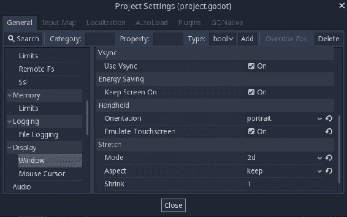

接下来，您需要更改玩家控制。玩家将不再使用四个方向输入，而是向触摸事件的位置移动。按照以下方式更改玩家脚本：

```cpp
var target = Vector2()

func _input(event):
    if event is InputEventScreenTouch and event.pressed:
        target = event.position

func _process(delta):
    velocity = (target - position).normalized() * speed
    if (target - position).length() > 5:
        position += velocity * delta
    else:
        velocity = Vector2()

    if velocity.length() > 0:
        $AnimatedSprite.animation = "run"
        $AnimatedSprite.flip_h = velocity.x < 0
    else:
        $AnimatedSprite.animation = "idle"
```

尝试一下，确保鼠标点击会导致玩家移动。如果一切正常，您就可以为 Android 开发设置计算机了。

# 准备您的系统

为了将您的项目导出为 Android 版本，您需要从[`developer.android.com/studio/`](https://developer.android.com/studio/)下载 Android **软件开发工具包** (**SDK**)，以及从[`www.oracle.com/technetwork/java/javase/downloads/index.html`](http://www.oracle.com/technetwork/java/javase/downloads/index.html)下载**Java 开发工具包** (**JDK**)。

当您第一次运行 Android Studio 时，点击“配置 | SDK 管理器”，并确保安装 Android SDK 平台工具：

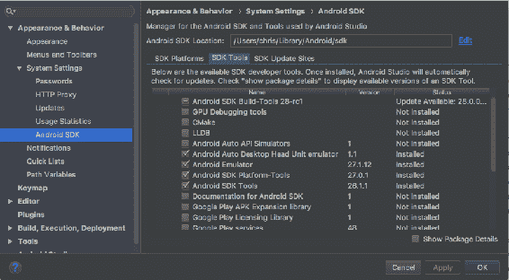

这将安装`adb`命令行工具，Godot 使用它来与您的设备通信。

安装开发工具后，通过运行以下命令创建一个调试密钥库：

```cpp
keytool -keyalg RSA -genkeypair -alias androiddebugkey -keypass android -keystore debug.keystore -storepass android -dname "CN=Android Debug,O=Android,C=US" -validity 9999
```

在 Godot 中，点击“编辑 | 编辑设置”，找到“导出/Android”部分，并设置系统上应用程序的路径。请注意，您只需做一次，因为编辑器设置与项目设置是独立的：

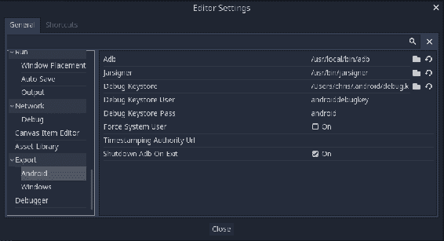

# 导出

您现在可以导出了。点击“项目 | 导出”，并为 Android 添加一个预设（参见上一节）。点击导出项目按钮，您将得到一个可以安装到您设备上的**Android 包工具包** (**APK**)。您可以使用图形工具或通过命令行使用`adb`来完成此操作：

```cpp
adb install dodge.apk
```

注意，如果您的系统支持，连接兼容的 Android 设备将导致一键部署按钮在 Godot 编辑器中显示：


点击此按钮将一次性导出项目并将其安装到您的设备上。您的设备可能需要处于开发者模式才能完成此操作：请查阅您的设备文档以获取详细信息。

# 着色器

**着色器**是一种设计在 GPU 上运行的程序，它改变了对象在屏幕上的显示方式。着色器在 2D 和 3D 开发中被广泛使用，以创建各种视觉效果。它们被称为着色器，因为它们最初用于着色和光照效果，但如今它们被用于各种视觉效果。因为它们在 GPU 上**并行**运行，所以它们非常快，但也带来了一些限制。

本节是对着色器概念的简要介绍。要深入了解，请参阅[`thebookofshaders.com/`](https://thebookofshaders.com/)和 Godot 的着色器文档[`docs.godotengine.org/en/latest/tutorials/shading/shading_language.html`](http://docs.godotengine.org/en/latest/tutorials/shading/shading_language.html)。

在 Godot 3.0 中，着色器是用一种与 GLSL ES 3.0 非常相似的语言编写的。如果你熟悉 C 语言，你会发现语法非常相似。如果你不熟悉，一开始可能会觉得有些奇怪。请参阅本节末尾的链接，了解更多资源。

Godot 中的着色器分为三种类型：**空间**（用于 3D 渲染）、**画布项**（用于 2D）和**粒子**（用于渲染粒子效果）。你的着色器第一行必须声明你正在编写哪种类型。

在确定着色器类型后，你还有三个选择，即你想影响的渲染阶段：片段、顶点以及/或光照。片段着色器用于设置每个受影响像素的颜色。顶点着色器用于修改形状或网格的顶点（因此通常在 3D 应用程序中使用得更多）。最后，光照着色器用于改变对象的光照处理方式。

在选择你的着色器类型之后，你将编写将在每个受影响的项目上**同时**运行的代码。这就是着色器的真正威力所在。例如，当使用片段着色器时，代码将在对象的每个像素上同时运行。这与使用传统语言时你可能习惯的过程非常不同，在传统语言中，你会逐个遍历每个像素。这种顺序代码的速度不足以处理现代游戏需要处理的巨大像素数量。

考虑一个以相对较低的分辨率 480 x 720 运行的游戏。屏幕上的像素总数接近 350,000。在代码中对这些像素的任何操作必须在不到 1/60 秒内完成，以避免延迟——当你考虑到还需要为每一帧运行的其他代码时，这个时间会更短：游戏逻辑、动画、网络和所有其他内容。这就是为什么 GPU 如此重要的原因，尤其是对于可能为每一帧处理数百万像素的高端游戏。

# 创建着色器

为了演示一些着色器效果，创建一个带有`Sprite`节点的场景，并选择你喜欢的任何纹理。这个演示将使用 Coin Dash 中的仙人掌图像：

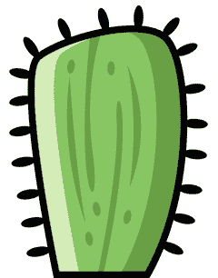

可以将着色器添加到任何由`CanvasItem`派生的节点中——在这个例子中，通过其材质属性添加到`Sprite`。在这个属性中，选择新的着色器材质，并点击新创建的资源。第一个属性是着色器，在这里你可以选择一个新的着色器。当你这样做时，着色器面板会出现在编辑器窗口的底部。

这是你将编写着色器代码的地方：

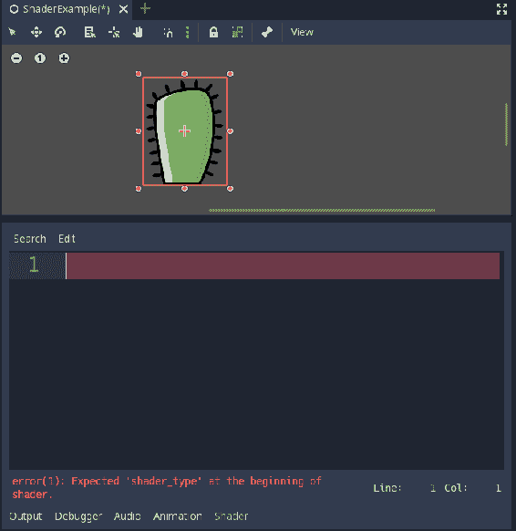

一个空白着色器看起来如下：

```cpp
shader_type canvas_item; // choose spatial, canvas_item, or particles

void fragment(){
    // code in this function runs on every pixel
}

void vertex() {
    // code in this function runs on each vertex
}

void light() {
    // code in this function affects light processing
}
```

对于这个示例的目的，你将编写一个 2D 片段着色器，因此你不需要包含其他两个函数。

着色器函数有许多*内置函数*，它们是输入值或输出值。例如，`TEXTURE`输入内置函数包含对象的纹理像素数据，而`COLOR`输出内置函数用于设置计算结果。记住，片段着色器的作用是影响每个处理像素的颜色。

当在`TEXTURE`属性中处理着色器时，例如，坐标是在一个*归一化*（即范围从`0`到`1`）的坐标空间中测量的。这个坐标空间被称为`UV`，以区别于*x*/*y*坐标空间：

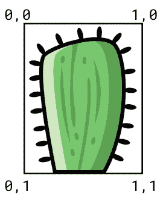

因此，坐标向量中的所有值都将介于`0`和`1`之间。

作为一个非常小的示例，这个第一个着色器将把仙人掌图像的像素都变成单一颜色。为了让你可以选择颜色，你可以使用一个`uniform`变量。

Uniforms 允许你从外部将数据传递到着色器中。声明一个`uniform`变量将使其出现在检查器中（类似于 GDScript 中的`export`工作方式），并允许你通过代码设置它。

在着色器面板中输入以下代码：

```cpp
shader_type canvas_item;

uniform vec4 fill_color:hint_color;

void fragment(){
    COLOR.rgb = fill_color.rgb;
}
```

你应该会立即看到图像的变化：整个图像变成了黑色。要选择不同的颜色，请在检查器中点击材质，你会在着色器参数下看到你的`uniform`变量。

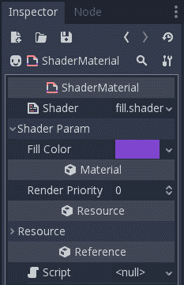

然而，你还没有完成。图片只是变成了一个彩色矩形，但你只想改变仙人掌的颜色，而不是其周围的透明像素。在设置`COLOR.rgb`之后，再添加一行：

```cpp
COLOR.a = texture(TEXTURE, UV).a;
```

这最后一行使着色器输出每个像素具有与原始纹理中像素相同的 alpha（透明度）值。现在仙人掌周围的空白区域保持透明，alpha 值为`0`。

以下代码显示了另一个示例。在这个着色器中，你通过将每个像素的颜色设置为周围像素的平均值来创建模糊效果：

```cpp
shader_type canvas_item;

uniform float radius = 10.0;

void fragment(){
    vec4 new_color = texture(TEXTURE, UV);
    vec2 pixel_size = TEXTURE_PIXEL_SIZE; // size of the texture in pixels

    new_color += texture(TEXTURE, UV + vec2(0, -radius) * pixel_size);
    new_color += texture(TEXTURE, UV + vec2(0, radius) * pixel_size);
    new_color += texture(TEXTURE, UV + vec2(-radius, 0) * pixel_size);
    new_color += texture(TEXTURE, UV + vec2(radius, 0) * pixel_size);

    COLOR = new_color / 5.0;
}
```

注意，由于你已经将五个颜色值相加（原始像素的，加上围绕它移动的四个方向找到的），你需要除以`5.0`以获得平均值。你使`radius`越大，图像看起来就越“模糊”：

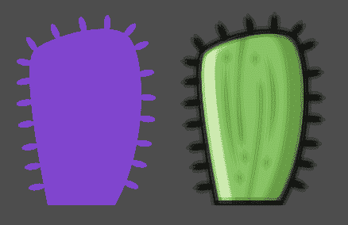

# 学习更多

着色器能够实现令人惊叹的范围的效果。在 Godot 的着色器语言上进行实验是学习基础的好方法，但互联网上也有大量资源可以帮助你学习更多。在学习着色器时，你可以使用不特定于 Godot 的资源，并且你不太可能遇到在 Godot 中使用它们的问题。这个概念在所有类型的图形应用程序中都是相同的。

要查看着色器有多强大的一些示例，请访问 [`www.shadertoy.com/`](https://www.shadertoy.com/)。

# 使用其他语言

本书中的所有项目都是使用 GDScript 编写的。GDScript 有许多优点，使其成为构建游戏的最佳选择。它与 Godot 的 API 集成非常紧密，其 Python 风格的语法使其适用于快速开发，同时也非常适合初学者。

然而，这并非唯一的选择。Godot 还支持两种其他“官方”脚本语言，并提供工具以集成使用各种其他语言的代码。

# C#

随着 2018 年初 Godot 3.0 的发布，首次添加了对 C# 作为脚本语言的支持。C# 在游戏开发中非常流行，Godot 版本基于 Mono 5.2 .NET 框架。由于其广泛的使用，有许多资源可用于学习 C#，并且在该语言中有大量用于完成各种游戏相关功能的现有代码。

在撰写本文时，当前 Godot 版本为 3.0.2。在这个版本中，C# 支持应被视为初步的；它是功能性的，但尚未经过全面测试。一些功能和功能，如导出项目，目前尚不支持。

如果你想要尝试 C# 实现，你首先需要确保已经安装了 Mono，你可以从 [`www.mono-project.com/download/`](http://www.mono-project.com/download/) 获取它。你还必须下载包含 C# 支持的 Godot 版本，你可以在 [`godotengine.org/download`](http://godotengine.org/download) 找到它，其中标记为 Mono 版本。

你可能还希望使用一个外部编辑器——例如 Visual Studio Code 或 MonoDevelop——它提供的调试和语言功能比 Godot 内置编辑器更强大。你可以在“编辑器设置”下的“Mono”部分设置此选项。

要将 C# 脚本附加到节点，请从“附加节点脚本”对话框中选择语言：

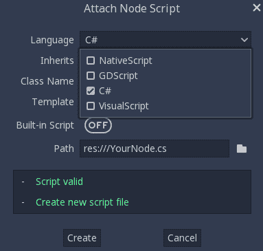

通常，C# 脚本的工作方式与你在 GDScript 中看到的方式非常相似。主要区别是 API 函数的命名改为 `PascalCase` 以符合 C# 标准，而不是 GDScript 的标准 `snake_case`。

下面是一个使用 C# 的 `KinematicBody2D` 运动的示例：

```cpp
using Godot;
using System;

public class Movement : KinematicBody2D
{
    [Export] public int speed = 200;

    Vector2 velocity = new Vector2();

    public void GetInput()
    {
        velocity = new Vector2();
        if (Input.IsActionPressed("right"))
        {
            velocity.x += 1;
        }
        if (Input.IsActionPressed("left"))
        {
            velocity.x -= 1;
        }
        if (Input.IsActionPressed("down"))
        {
            velocity.y += 1;
        }
        if (Input.IsActionPressed("up"))
        {
            velocity.y -= 1;
        }
        velocity = velocity.Normalized() * speed;
    }

    public override void _PhysicsProcess(float delta)
    {
        GetInput();
        MoveAndSlide(velocity);
    }
}
```

有关使用 C#的更多详细信息，请参阅[`docs.godotengine.org/en/latest/getting_started/scripting/`](http://docs.godotengine.org/en/latest/getting_started/scripting/)文档中的**脚本**部分。

# VisualScript

Visual scripting 旨在提供一种使用拖放视觉隐喻作为替代脚本方法，而不是编写代码。要创建脚本，您需要拖动代表函数和数据的节点（不要与 Godot 的节点混淆），并通过绘制线条将它们连接起来。运行您的脚本意味着沿着节点中的线条路径进行。这种展示风格的目标是提供一种更直观的方式来可视化程序流程，这对于需要协作完成项目的非程序员，如艺术家或动画师，非常有用。

实际上，这个目标还没有以实际的方式达到。Godot 的 VisualScript 也是在 3.0 版本中首次加入的，并且作为一个功能，目前还不够成熟，不能在实际项目中使用。就像 C#一样，它应该在测试中考虑，如果您对此感兴趣，您的测试和反馈将对 Godot 团队改进其功能非常有价值。

VisualScript 的一个潜在优势是将其用作脚本的第二层。您可以在 GDScript 中创建一个对象的核心行为，然后游戏设计师可以使用 VisualScript，在视觉节点中调用这些脚本的功能。

以下截图是一个 VisualScript 项目的示例。在这里，您可以看到 Coin Dash 中玩家移动代码的一部分：

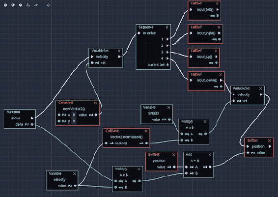

Coin Dash 中的玩家移动代码

# 本地代码 – GDNative

可供选择使用的编程语言有很多。每种语言都有其优势和劣势，以及一些更喜欢使用它而不是其他选择的粉丝。虽然直接在 Godot 中支持每种语言都没有意义，但在某些情况下，GDScript 可能不再足以解决特定问题。也许您想使用现有的外部库，或者您正在进行一些计算密集型的工作——例如 AI 或过程式世界生成，这些对于 GDScript 来说并不合适。

由于 GDScript 是一种解释型语言，它以灵活性为代价换取性能。这意味着对于一些处理器密集型代码，它可能运行得非常慢。在这种情况下，通过运行用编译语言编写的本地代码可以获得最高的性能。在这种情况下，您可以将该代码移动到 GDNative 库中。

GDNative 是一个 C API，外部库可以使用它与 Godot 进行接口。这些外部库可以是您自己的或任何您可能需要用于特定项目的现有第三方库。

在 GDScript 中，您可以使用`GDNative`和`GDNativeLibrary`类来加载和调用这些库中的函数。以下代码是调用已保存为`GDNativeLibrary`资源文件的库的示例：

```cpp
extends Node

func _ready():
    var lib = GDNative.new()
    lib.library = load("res://somelib.tres")
    lib.initialize()

    // call functions in the library
    var result = lib.call_native("call_type", "some_function", arguments_array)

    lib.terminate()
```

而库可能看起来像这样（以 C 语言为例）：

```cpp
#include <gdnative.h>

void GDN_EXPORT godot_gdnative_init(godot_gdnative_init_options *p_options) {
    // initialization code
}

void GDN_EXPORT godot_gdnative_terminate(godot_gdnative_terminate_options *p_options) {
    // termination code
}

void GDN_EXPORT godot_nativescript_init(void *p_handle) {

}

godot_variant GDN_EXPORT some_function(void *args) {
    // Do something
}
```

请记住，编写这样的代码肯定比坚持使用纯 GDScript 要复杂得多。在本地语言中，你需要处理对象的构造函数和析构函数的调用，并手动管理与 Godot 的`Variant`类的交互。你应该只在性能真正成为问题时才使用 GDNative，即使如此，也只有当功能确实需要使用它时才使用。

如果这个部分对你来说完全不知所云，请不要担心。大多数 Godot 开发者永远不会需要深入研究这一方面的发展。即使你发现自己需要更高性能的代码，你可能只需要查看资产库，看看是否有人已经为你创建了一个库。你可以在下一节中了解资产库。

# 语言绑定

GDNative 的另一个好处是它允许其他语言的倡导者创建 API 绑定，以实现这些语言的脚本化。

在撰写本文时，有几个项目可以使用 GDNative，允许你使用其他语言进行脚本化。这些包括 C、C++、Python、Nim、D、Go 和其他语言。尽管这些额外的语言绑定在撰写本文时仍然相对较新，但每个都有专门的开发者团队在开发它们。如果你对使用特定语言与 Godot 一起使用感兴趣，使用“godot + <语言名称>”进行谷歌搜索将帮助你找到可用的资源。

# 资产库

在编辑器窗口的顶部，在工作空间部分，你会找到一个标有 AssetLib 的按钮：

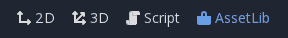

点击此按钮将带你去 Godot 的资产库。这是一个由 Godot 社区贡献的插件、工具和实用程序的集合，你可能会在项目中找到它们很有用。例如，如果你搜索`State`，你会看到库中有一个名为**有限状态机**（**FSM**）的工具。你可以点击其名称获取更多信息，如果你决定要尝试它，点击安装将其下载到`res://addons/`文件夹中，如果该文件夹不存在，将会创建：

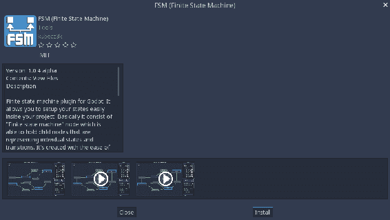

然后，你需要通过打开项目设置并选择插件选项卡来启用插件：

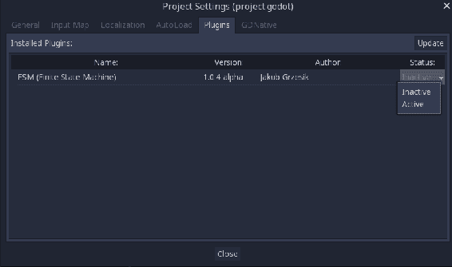

插件现在可以使用了。请务必阅读插件作者的说明，以了解其工作原理。

# 为 Godot 做贡献

Godot 是一个开源、社区驱动的项目。所有为构建、测试、编写文档和以其他方式支持 Godot 所做的工作，主要是热情的个人贡献他们的时间和技能完成的。对于大多数贡献者来说，这是一项充满爱心的劳动，他们为帮助构建人们喜欢使用的优质产品而感到自豪。

为了让 Godot 继续成长和改进，总需要更多的社区成员站出来做出贡献。无论你的技能水平如何，或者你能投入多少时间，都有很多种方式可以帮助。

# 为引擎贡献力量

你可以直接为 Godot 的开发做出贡献的主要方式有两种。如果你访问[`github.com/godotengine/godot`](https://github.com/godotengine/godot)，你可以看到 Godot 的源代码，以及了解正在进行的开发工作。点击“克隆”或“下载”按钮，你将获得最新的源代码，并可以测试最新的功能。你需要构建引擎，但不要感到害怕：Godot 是你能找到的最容易编译的开源项目之一。有关说明，请参阅[`docs.godotengine.org/en/latest/development/compiling/`](http://docs.godotengine.org/en/latest/development/compiling/)。

如果你无法实际为 C++代码贡献力量，请转到“问题”标签页，在那里你可以报告或阅读有关错误和建议改进的内容。总需要有人来确认错误报告、测试修复并就新功能提出意见。

# 编写文档

Godot 的官方文档的质量取决于其社区的贡献。从纠正一个错别字到编写整个教程，所有级别的帮助都非常受欢迎。官方文档的家园是[`github.com/godotengine/godot-docs`](https://github.com/godotengine/godot-docs)。

希望到现在为止，你已经花了一些时间浏览官方文档，并对可用的内容有了大致的了解。如果你发现有什么错误或遗漏，请在上述 GitHub 链接处打开一个问题。如果你熟悉使用 GitHub，甚至可以直接提交一个 pull request。但请确保首先阅读所有指南，以确保你的贡献会被接受。指南可以在[`docs.godotengine.org/en/latest/community/contributing/`](http://docs.godotengine.org/en/latest/community/contributing/)找到。

如果你说的不是英语，翻译也非常需要，并且会受到 Godot 的非英语用户的极大欢迎。有关如何用你的语言贡献的详细信息，请参阅[`hosted.weblate.org/projects/godot-engine/godot-docs/`](https://hosted.weblate.org/projects/godot-engine/godot-docs/)。

# 捐赠

Godot 是一个非营利项目，用户的捐赠对于支付托管费用和开发资源（如硬件）有很大帮助。财务贡献还允许项目支付核心开发者的工资，使他们能够全职或兼职专注于引擎的开发工作。

为 Godot 做出贡献最简单的方式是通过 Patreon 页面[`www.patreon.com/godotengine`](https://www.patreon.com/godotengine)。

# 寻求帮助 – 社区资源

Godot 的在线社区是其优势之一。由于其开源性质，有许多不同的人一起工作来改进引擎、编写文档以及互相帮助解决问题。

你可以在[`godotengine.org/community`](https://godotengine.org/community)找到社区资源的完整列表。

这些链接可能会随时间变化，但以下是你应该了解的主要社区资源。

# GitHub

**[`github.com/godotengine/`](https://github.com/godotengine/)**

Godot 的 GitHub 仓库是 Godot 的开发者工作的地方。如果你需要编译用于自己使用的自定义版本的引擎，你可以在这里找到 Godot 的源代码。

如果你发现引擎本身有任何问题——比如某些功能不工作、文档中的错别字等等——你应该在这里报告这些问题。

# Godot 问答

[`godotengine.org/qa/`](https://godotengine.org/qa/)

这是 Godot 的官方帮助网站。你可以在这里发布问题供社区回答，以及搜索不断增长的先前回答的问题数据库。如果你恰好看到一个问题你知道答案，你也可以提供帮助。

# Discord / 论坛

[`discord.gg/zH7NUgz`](https://discord.gg/zH7NUgz)

[`godotdevelopers.org/`](http://godotdevelopers.org/)

虽然不是官方的，但这些是两个非常活跃的 Godot 用户社区，你可以在这里获得帮助，找到问题的答案，并与他人讨论你的项目。

# 摘要

在本章中，你了解了一些额外的主题，这些主题将帮助你继续提升你的 Godot 技能。除了本书中探索的功能外，Godot 还有许多其他功能。当你开始独立工作项目时，你需要知道去哪里寻找信息和去哪里寻求帮助。

你还了解了一些更高级的主题，例如使用其他编程语言以及使用着色器来增强你的游戏视觉效果。

此外，由于 Godot 是由其社区构建的，你学习了如何参与其中并成为使其成为其类型中增长最快的项目之一的团队的一部分。
