# 第三章：逃离迷宫

在上一章中，您学习了 Godot 的节点系统如何工作，允许您使用更小的构建块构建复杂的场景，每个构建块都为您的游戏对象提供不同的功能。随着您进入更大、更复杂的项目，这个过程将继续。然而，有时您可能会在多个不同的对象中重复相同的节点和/或代码，本项目将介绍一些减少重复代码的技术。

在本章中，您将构建一个名为 **逃离迷宫** 的游戏。在这个游戏中，您将尝试在迷宫中导航以找到出口，同时避开游走的敌人：

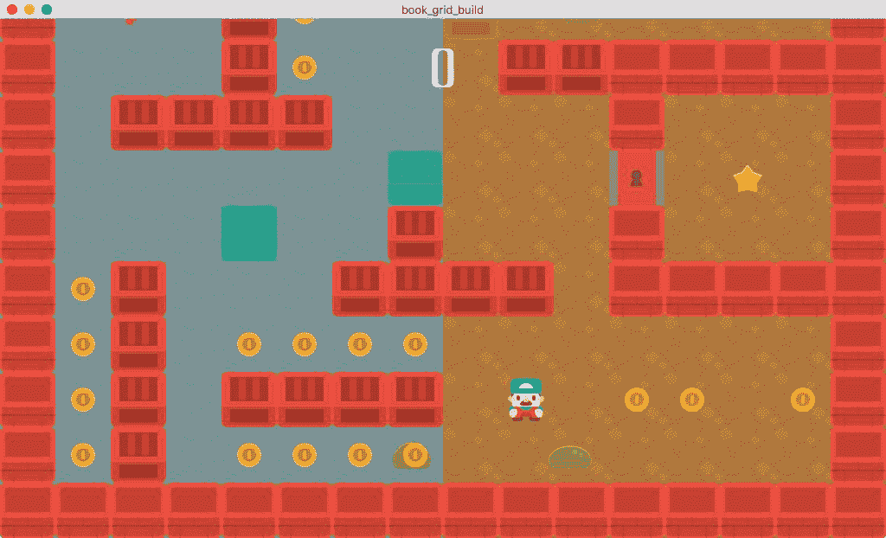

在本项目中，您将学习以下关键主题：

+   继承

+   基于网格的移动

+   Spritesheet 动画

+   使用 TileMaps 进行关卡设计

+   场景之间的转换

# 项目设置

创建一个新的项目，并从 [`github.com/PacktPublishing/Godot-Game-Engine-Projects/releases`](https://github.com/PacktPublishing/Godot-Game-Engine-Projects/releases) 下载项目资源。

如您之前所见，Godot 默认包含了一系列映射到各种键盘输入的动作。例如，在第一个项目中，您使用了 `ui_left` 和 `ui_right` 来进行箭头键移动。然而，通常您需要不同的输入，或者您想自定义动作的名称。您可能还希望添加鼠标或游戏手柄的输入动作。您可以在项目设置窗口中完成这些操作。

点击 Input Map 选项卡，通过在 Action: 框中输入名称并点击 Add 添加四个新的输入动作（左、右、上、下）。然后，对于每个新动作，点击 + 按钮添加一个键动作并选择相应的箭头键。如果您愿意，还可以添加 WASD 控制：

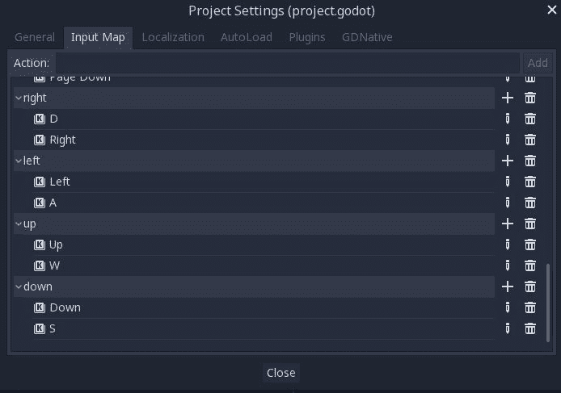

这款游戏将在屏幕上显示各种对象。其中一些对象应该检测碰撞（例如玩家与墙壁之间的碰撞），而其他对象应该相互忽略（例如敌人与金币之间的碰撞）。您可以通过设置对象的物理层和物理层掩码属性来解决此问题。为了使这些层更容易操作，Godot 允许您为游戏物理层指定自定义名称。

点击 General 选项卡，找到 Layer Names/2D Physics 部分。将前四个层命名为以下内容：

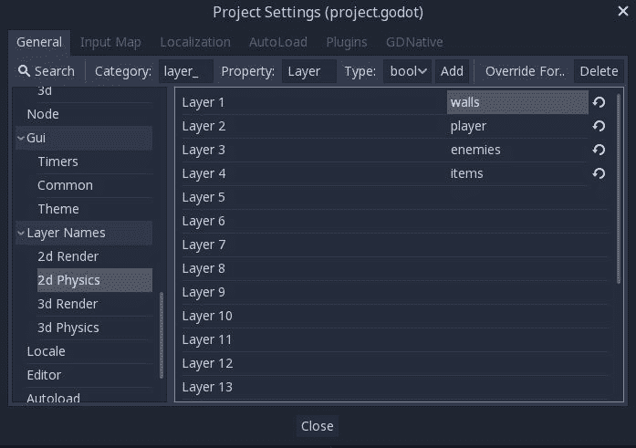

您将在项目后期看到碰撞层系统如何与游戏中的各种对象协同工作。

接下来，在 Display/Window 部分，将 Mode 设置为 viewport，将 Aspect 设置为 keep。这将使您能够在保持显示比例不变的情况下调整游戏窗口的大小。请参考以下截图：

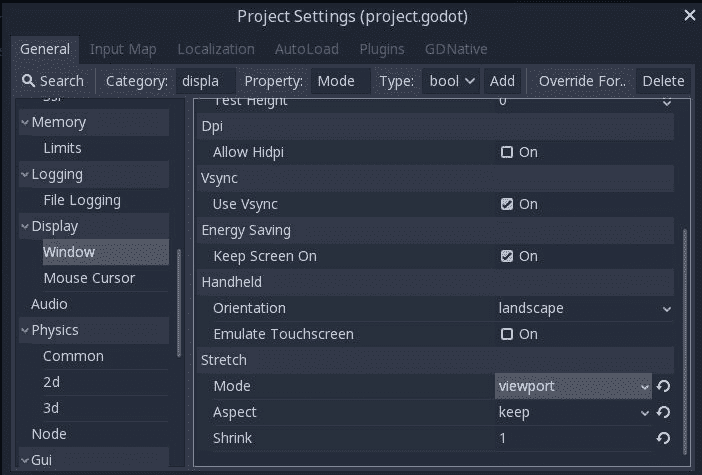

最后，在 渲染/质量 部分，将 使用像素捕捉 设置为开启。此设置非常有用，特别是对于像素艺术风格的游戏，因为它确保所有对象都以整数像素值绘制。请注意，这 不会影响移动、物理或其他属性；它仅适用于对象的渲染。请参考以下截图：

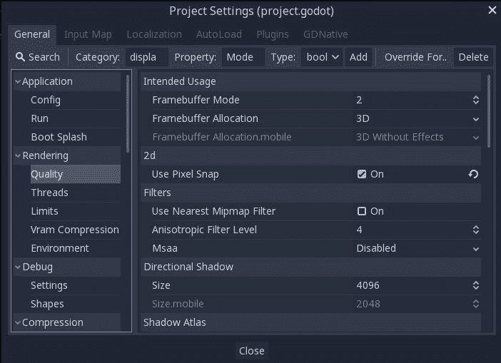

# 项目组织

随着你的项目变得更大、更复杂，你会发现将所有场景和脚本保存在同一个文件夹中变得难以管理。

Godot 初学者通常对此的反应是创建一个 `scenes` 文件夹和一个 `scripts` 文件夹，并将每种类型的文件保存在相应的文件夹中。这并不很有效。很快，你就会发现自己正在 `scripts` 文件夹中寻找需要的脚本，因为它与其他所有游戏脚本混在一起。

更合理的组织方式是为每种类型的对象创建一个文件夹。例如，一个 `player` 文件夹将包含玩家的场景文件、脚本（们）以及它需要的任何其他资源。以这种方式组织你的项目更具可扩展性，如果你有大量对象，还可以进一步扩展。例如，请参考以下截图：

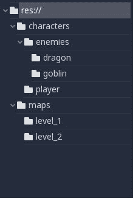

在整个项目中，示例将假设每个新的场景类型都保存在该类型的文件夹中，包括其脚本。例如，`Player.tscn` 和 `Player.gd` 文件将保存在一个 `player` 文件夹中。

# 继承

在 **面向对象编程**（**OOP**）中，继承是一个强大的工具。简要来说，你可以定义一个从另一个类继承的类。使用第一个类创建的对象将包含主类的所有方法和成员变量，以及它自己的。

Godot 是强面向对象的，这给了你使用继承的机会，不仅限于对象（脚本），还可以用于场景，这在你设计游戏架构时提供了很大的灵活性。它还消除了代码重复的需要——如果两个对象需要共享一组方法和变量，例如，你可以创建一个公共脚本，并让两个对象从它继承。如果你修改了那段代码，它将应用到两个对象上。

在这个项目中，玩家的角色将由按键事件控制，而怪物将在迷宫中随机游荡。然而，这两种类型的角色都需要一些共同的属性和功能：

+   包含四个方向移动动画的精灵图集

+   一个用于播放动作动画的 `AnimationPlayer`

+   基于网格的移动（角色每次只能移动一个完整的 *方块*）

+   碰撞检测（角色不能穿过墙壁）

通过使用继承，您可以创建一个包含所有角色所需的节点的通用`Character`场景。玩家和怪物场景可以从中继承共享节点。同样，实际的运动代码（尽管不是控制）在玩家和怪物之间将是相同的，因此它们都可以从相同的脚本中继承以处理运动。

# 角色场景

通过添加一个名为`Character`的`Area2D`并命名它来开始创建`Character`场景。`Area2D`是这类角色的好选择，因为其主要功能将是检测重叠——例如，当它移动到物品或敌人上时。

添加以下子项：

+   `Sprite`

+   `CollisionShape2D`

+   `Tween`（命名为`MoveTween`）

+   `AnimationPlayer`

在`Sprite`上不添加纹理，但在检查器中，在`Sprite`的动画部分，将 Vframes 和 Hframes 属性分别设置为`4`和`5`。这告诉 Godot 将纹理切割成 5 x 4 个单独图像的网格。

您将用于玩家和敌人的精灵表将按照完全相同的模式排列，每一行包含一个移动方向的动画帧：

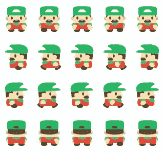

当使用 Vframes 和 Hframes 属性切割了精灵表后，您可以使用 Frame 属性来设置要使用的单个帧。在上面的玩家表中，面向左侧的动画将使用从左上角开始的第 5 帧到第 9 帧（从 0 开始计数）。您将使用`AnimationPlayer`来更改下面的 Frame 属性。参考以下截图：

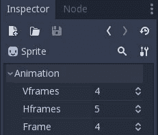

接下来，在碰撞形状的 Shape 中创建一个新的`RectangleShape2D`。点击新的`RectangleShape2D`，并在检查器中将它的 Extents 属性设置为`(16, 16)`。请注意，Extents 测量每个方向从中心点的距离，因此这会产生一个 32 x 32 像素的碰撞形状。

由于所有角色都以相同的比例绘制，我们可以确信相同大小的碰撞形状适用于所有角色。如果使用您使用的艺术作品中这种情况不成立，您可以在此处跳过设置碰撞形状，并在稍后为单个继承场景进行配置。

# 动画

在`AnimationPlayer`节点中创建四个新的动画。将它们命名为与输入动作中使用的四个方向（左、右、上和下）相匹配。在这里拼写非常重要：输入动作的名称必须与动画名称具有相同的拼写和大小写。如果您在命名上不一致，当您到达脚本阶段时，这会使事情变得困难得多。请参考以下截图：

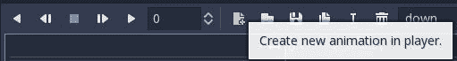

对于每个动画，将`Length`设置为`1`，将`Step`设置为`0.2`。这些属性位于动画面板的底部：

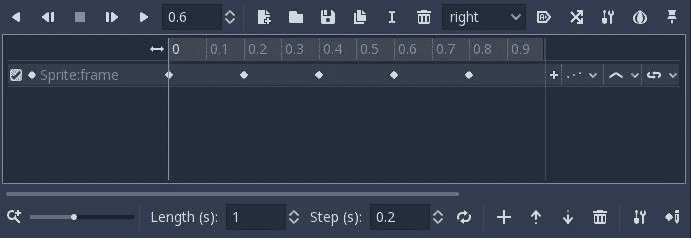

Starting with the down animation, click on the `Sprite` node and set its Frame property to `0`. Click the key icon next to the Frame property and confirm that you want to add a new track for the Frame property:

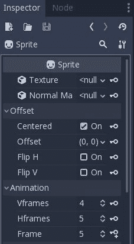

The Frame property will automatically be incremented by one and the animation track will be advanced by one step (0.2 seconds). Click the key again until you've reached frame 4\. You should now have five keyframes on the animation track. If you drag the bar back and forth, you'll see the Frame property change as you reach each keyframe:

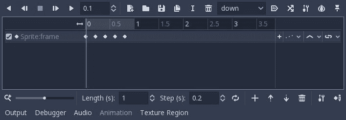

If, for some reason, you find that the frames aren't correct, you can delete any of the keyframes by clicking on the dot and pressing *Delete* on your keyboard, or right-clicking on the dot and choosing Remove Selection. Remember, whatever value you set Frame to, that will be the value of the keyframe when you press the Add Keyframe button. You can also click and drag keyframes to change their order in the timeline.

Repeat the process for the other animations, using the following table to guide you on which keyframes to use for each direction:

| **动画** | **帧** |
| --- | --- |
| 下 | `0, 1, 2, 3, 4` |
| 左 | `5, 6, 7, 8, 9` |
| 右 | `10, 11, 12, 13, 14` |
| 上 | `15, 16, 17, 18, 19` |

As long as the spritesheet for a character follows the same 5 x 4 arrangement, this `AnimationPlayer` configuration will work, and you won't need to create separate animations for each character. In larger projects, it can be a huge time-saver to create all your spritesheet animations while following a common pattern.

# 碰撞检测

Because the characters are moving on a grid, they need to either move the full distance to the next tile or not at all. This means that, before moving, the character needs to check to see if the move is possible. One way to test if an adjacent square has anything in it is by using a *raycast*. **光线投射**意味着从角色的位置向一个指定的目的地发射一条光线。如果光线在途中遇到任何物体，它将报告接触。通过向角色添加四个光线，它可以*观察*周围的方块，以查看它们是否被占用。

Add four `RayCast2D` nodes and set their names and **投射到** properties as follows:

| **名称** | **投射到** |
| --- | --- |
| RayCastRight | `(64, 0)` |
| RayCastLeft | `(-64, 0)` |
| RayCastDown | `(0, 64)` |
| RayCastUp | `(0, -64)` |

Make sure to set the Enabled property on each one (`RayCast2D` options are disabled by default). Your final node setup should look like this:

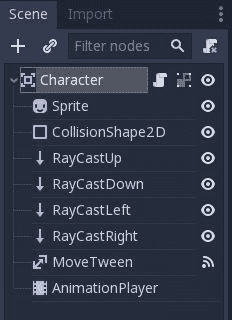

# Character script

Now, add a script to the `Character` node (make sure you've saved the scene first, and the script will automatically be named `Character.gd`). First, define the class variables:

```cpp
extends Area2D

export (int) var speed

var tile_size = 64
var can_move = true
var facing = 'right'
var moves = {'right': Vector2(1, 0),
             'left': Vector2(-1, 0),
             'up': Vector2(0, -1),
             'down': Vector2(0, 1)}
onready var raycasts = {'right': $RayCastRight,
                        'left': $RayCastLeft,
                        'up': $RayCastUp,
                        'down': $RayCastDown}
```

`speed`将控制角色的移动和动画速度，允许你自定义移动速度。正如你在第一章“简介”中学习的，使用`export`可以通过检查器设置变量的值。保存脚本，并在检查器中将速度属性设置为`3`。

`can_move`是一个标志，用于跟踪角色在当前帧期间是否允许移动。在移动进行时，它将被设置为`false`，以防止在上一移动完成之前启动第二次移动。`facing`是一个表示当前移动方向的字符串（再次强调，拼写和首字母大小写必须与项目开始时创建的输入动作完全一致）。`moves`字典包含描述四个方向的向量，而`raycasts`字典包含四个射线投射节点的引用。请注意，这两个字典的键与输入动作名称匹配。

在变量声明期间引用另一个节点时，必须使用`onready`以确保在引用的节点准备好之前变量没有被设置。你可以将其视为在`_ready()`函数中编写代码的快捷方式。这一行：

`onready var sprite = $Sprite`

等同于以下写法：

`var sprite`

`func _ready():`

`    sprite = $Sprite`

以下代码将执行从一个方块到另一个方块的移动：

```cpp
func move(dir):
    $AnimationPlayer.playback_speed = speed
    facing = dir
    if raycasts[facing].is_colliding():
        return

    can_move = false
    $AnimationPlayer.play(facing)
    $MoveTween.interpolate_property(self, "position", position,
                position + moves[facing] * tile_size,
                1.0 / speed, Tween.TRANS_SINE, Tween.EASE_IN_OUT)
    $MoveTween.start()
    return true
```

`move()`函数接受一个方向作为参数。如果给定方向的`RayCast2D`检测到碰撞，则移动将被取消，函数将返回而不执行进一步操作（注意，返回值将为`null`）。否则，它将`facing`更改为新方向，使用`can_move`禁用额外的移动，并开始播放匹配的动画。为了实际执行移动，`Tween`节点将`position`属性从当前值插值到当前值加上给定方向一个方块大小的移动。持续时间（`1.0 / speed`秒）设置为与动画长度相匹配。

使用`Tween.TRANS_SINE`过渡类型会产生令人愉悦、平滑的移动，先加速然后减速到最终位置。你可以自由尝试其他过渡类型来改变移动风格。

最后，为了再次启用移动，需要在移动完成后重置`can_move`。将`MoveTween`的`tween_completed`信号连接并添加以下代码：

```cpp
func _on_MoveTween_tween_completed( object, key ):
    can_move = true
```

# 玩家场景

玩家场景需要包含我们给`Character`的所有相同节点。这是你将利用继承的强大功能的地方。

首先创建一个新的场景。然而，不要创建一个新的空场景，而是在菜单中点击“场景”|“新建继承场景”。在“打开基础场景”窗口中，选择`res://character/Character.tscn`，如下截图所示：

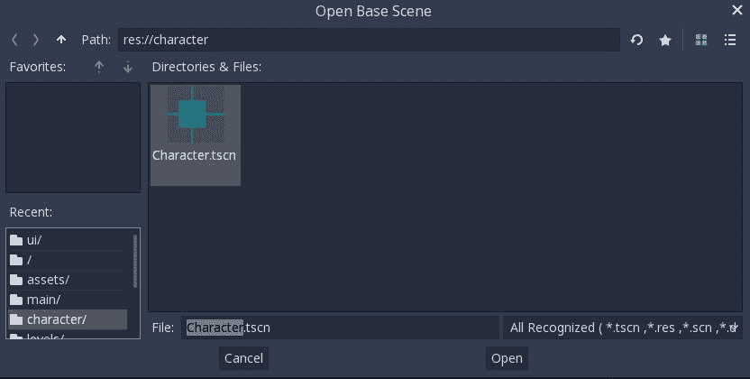

将这个新场景的根节点从`Character`重命名为`Player`并保存新场景。注意，所有的`Character`节点也都存在。如果你更改了`Character.tscn`并保存它，这些更改也会在`Player`场景中生效。

现在，你需要设置玩家的物理层，所以在检查器中找到碰撞部分，并设置层和掩码属性。层应设置为仅玩家，而掩码应显示墙壁、敌人和物品。参考以下截图：

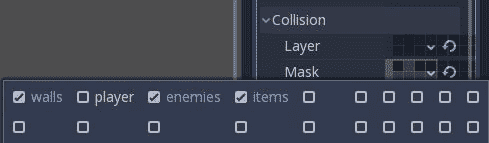

碰撞层系统是一个强大的工具，它允许你自定义哪些对象可以检测彼此。层属性将对象放置在一个或多个碰撞层中，而掩码属性定义了对象可以看到哪些层。如果另一个对象不在其掩码层之一中，它将不会被检测或碰撞。

需要更改的唯一其他节点是`Sprite`，在那里你需要设置纹理。从`res://assets`文件夹拖动玩家精灵表单，并将其放入`Sprite`的纹理属性中。接下来，测试`AnimationPlayer`中的动画，确保它们显示正确的方向。如果你发现任何动画有问题，确保你在`Character`场景中修复它，它也会自动在`Player`场景中修复：

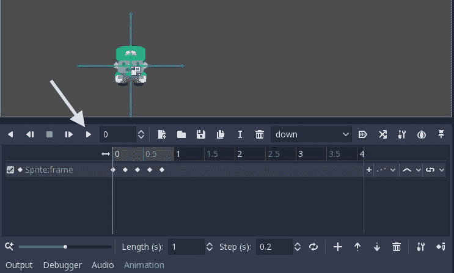

将`Camera`节点作为`Player`的子节点添加，并检查其当前属性是否为 On。Godot 将自动在游戏窗口中渲染当前相机看到的任何内容。这将允许你制作任何大小的地图，并且相机会随着玩家在地图上移动而滚动。注意，当你添加相机时，会出现一个紫色的框，它位于玩家的中心。这代表相机的可见区域，因为它作为玩家的子节点，所以会跟随玩家的移动。如果你查看检查器中的相机属性，你会看到四个限制属性。这些属性用于阻止相机滚动过某个点；例如，地图的边缘。尝试调整它们，看看当你拖动它时，框是如何停止跟随`Player`的（确保你移动的是`Player`节点本身，而不是其子节点）。稍后，这些限制将由关卡本身自动设置，这样相机就不会滚动到“关卡之外”。

# 玩家脚本

玩家脚本也需要扩展角色的。通过选择`Player`节点并点击清除脚本按钮来删除附加的脚本（`Character.gd`）：

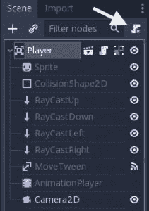

现在，再次点击按钮以附加新的脚本。在附加节点脚本对话框中，点击继承选项旁边的文件夹图标，并选择`Character.gd`：


这里是玩家脚本（注意它`extends`角色脚本）：

```cpp

extends "res://character/Character.gd"

signal moved

func _process(delta):
    if can_move:
        for dir in moves.keys():
            if Input.is_action_pressed(dir):
                if move(dir):
                    emit_signal('moved')
```

因为它继承了 `Character.gd` 中的所有行为，玩家也将拥有 `move()` 函数。你只需要用代码扩展它，根据输入事件调用 `move()`。正如你之前看到的，你可以使用 `process()` 函数来检查每一帧的输入状态。然而，只有当 `can_move` 允许时，你才实际上检查输入并调用 `move()`。

因为你在输入动作以及 `moves` 和 `raycasts` 字典的键中使用了 `up`、`down`、`left` 和 `right` 这些名称，你可以遍历这些键并检查每个键作为输入。

记住，`move()` 函数在成功时返回 `true`。如果成功，玩家会发出 `moved` 信号，你可以在以后与敌人一起使用这个信号。

运行场景并尝试在屏幕上移动玩家角色。

玩家还没有可以行走的关卡，但你可以继续添加玩家稍后需要的代码。当玩家在关卡中移动时，它会遇到各种对象并需要对其做出响应。通过使用信号，你可以在创建关卡之前就添加相应的代码。向脚本中添加三个额外的信号：

```cpp
signal dead
signal grabbed_key
signal win
```

然后，连接 `Player` 的 `area_entered` 信号并添加以下代码：

```cpp
func _on_Player_area_entered( area ):
    if area.is_in_group('enemies'):
        emit_signal('dead')
    if area.has_method('pickup'):
        area.pickup()
    if area.type == 'key_red':
        emit_signal('grabbed_key')
    if area.type == 'star':
        emit_signal('win')
```

当玩家遇到另一个 `Area2D` 时，此函数将运行。如果该对象是敌人，玩家将输掉游戏。注意 `has_method()` 的使用。这允许你通过检查是否有 `pickup()` 方法来识别可收集的对象，并且只有在方法存在时才调用该方法。

# 敌人场景

希望你现在已经看到了继承是如何工作的。你将使用相同的步骤创建 `Enemy` 场景。创建一个新的场景，从 `Character.tscn` 继承，并命名为 `Enemy`。将怪物精灵图集 `res://assets/slime.png` 拖到 `Sprite` 的纹理上。

在检查器的碰撞部分，设置 `Layer` 和 `Mask` 属性。`Layer` 应该设置为敌人，而 `Mask` 应该显示墙壁和玩家。

与 `Player` 一样，移除现有的脚本并附加一个新的脚本，从 `Character.gd` 继承：

```cpp
extends "res://character/Character.gd"

func _ready():
    can_move = false
    facing = moves.keys()[randi() % 4]
    yield(get_tree().create_timer(0.5), 'timeout')
    can_move = true

func _process(delta):
    if can_move:
         if not move(facing) or randi() % 10 > 5:
             facing = moves.keys()[randi() % 4] 
```

`_ready()` 函数中的代码起着重要的作用：因为敌人被添加到树形结构中 `TileMap` 节点之下，它们会被首先处理。你不想让敌人在墙壁被处理之前开始移动，否则它们可能会踩到墙壁的瓦片上而卡住。在它们开始之前需要有一个小的延迟，这也有助于给玩家准备的时间。为此，你不需要在场景中添加一个 `Timer` 节点，而是可以使用 `SceneTree` 的 `create_timer()` 函数创建一个一次性定时器，直到超时信号触发才执行。

GDScript 的 `yield()` 函数提供了一种方法，可以在稍后时间暂停函数的执行，同时允许游戏的其他部分继续运行。当传递一个对象和一个命名信号时，执行将在该对象发出给定信号时恢复。

每一帧，如果敌人能够移动，它就会移动。如果它撞到墙壁（即当`move()`返回`null`时），或者有时是随机地，它会改变方向。结果将是一个不可预测的（并且难以躲避！）敌人移动。记住，你可以独立地在它们的场景中调整`Player`和`Enemy`的速度，或者改变`Character`场景中的`speed`，这将影响它们两个。

# 可选 - 轮流移动

对于不同风格的游戏，你可以将`_process()`移动代码放入一个名为`_on_Player_moved()`的函数中，并将其连接到玩家的`moved`信号。这将使敌人只在玩家移动时移动，使游戏更具策略感，而不是快节奏的动作。

# 创建关卡

在本节中，你将创建所有动作将发生的地图。正如其名所示，你可能想要制作一个迷宫般的关卡，有很多转弯和曲折。

这里是一个示例关卡：

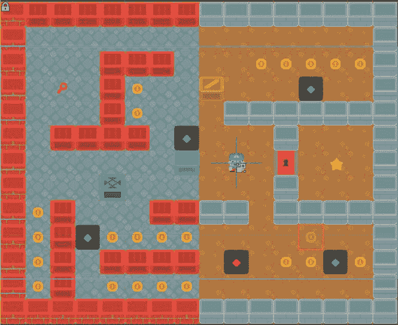

玩家的目标是到达星星。锁着的门只能通过捡起钥匙才能打开。绿色圆点标记着敌人的出生位置，而红色圆点标记着玩家的起始位置。金币是可以在路上捡到的额外物品，可以用来获得额外分数。请注意，整个关卡比显示窗口要大。当玩家在地图周围移动时，`Camera`会滚动地图。

你将使用`TileMap`节点来创建地图。使用`TileMap`进行关卡设计有几个好处。首先，它们通过在网格上*绘制*瓦片来绘制关卡布局，这比逐个放置`Sprite`节点要快得多。其次，它们允许创建更大的关卡，因为它们通过将瓦片批处理在一起并只绘制给定时间可见的地图的*块*来优化绘制大量瓦片。最后，你可以向单个瓦片和整个地图添加碰撞形状，这样整个地图将作为一个单独的碰撞体，简化你的碰撞代码。

完成这一部分后，你将能够创建你想要的任意数量的这些地图。你可以按顺序放置它们，以实现关卡到关卡的发展。

# 项目

首先，为玩家可以捡起的可收集对象创建一个新的场景。这些物品将在游戏运行时由地图生成。以下是场景树：

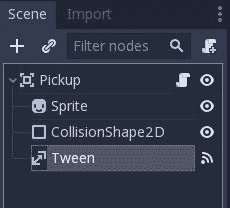

留下`Sprite`纹理为空。由于你正在使用这个对象来表示多个项目，纹理可以在创建项目时在项目的脚本中设置。

将`Pickup`的碰撞层设置为项目，并将其掩码设置为玩家。你不想在到达之前敌人就收集金币（尽管这可能会让游戏有一个有趣的变体，即你需要在坏人吞掉它们之前尽可能多地收集金币）。

给`CollisionShape2D`节点赋予矩形形状，并将其范围设置为`(32, 32)`（严格来说，你可以使用任何形状，因为玩家无论如何都会完全移动到瓦片上并完全覆盖物品）。

下面是`Pickup`的脚本：

```cpp
extends Area2D

var textures = {'coin': 'res://assets/coin.png',
                'key_red': 'res://assets/keyRed.png',
                'star': 'res://assets/star.png'}
var type

func _ready():
    $Tween.interpolate_property($Sprite, 'scale', Vector2(1, 1),
        Vector2(3, 3), 0.5, Tween.TRANS_QUAD, Tween.EASE_IN_OUT)
    $Tween.interpolate_property($Sprite, 'modulate',
        Color(1, 1, 1, 1), Color(1, 1, 1, 0), 0.5,
        Tween.TRANS_QUAD, Tween.EASE_IN_OUT)

func init(_type, pos):
    $Sprite.texture = load(textures[_type])
    type = _type
    position = pos

func pickup():
    $CollisionShape2D.disabled = true
    $Tween.start()
```

当物品创建并使用时，`type`变量将被设置，并用于确定对象应使用哪种纹理。在函数参数中使用`_type`作为变量名称允许你使用该名称而不与已使用的`type`冲突。

一些编程语言使用**私有**函数或变量的概念，这意味着它们仅用于本地。GDScript 中的`_`命名约定用于视觉上指定应被视为私有的变量或函数。请注意，它们实际上与其他名称没有任何不同；这仅仅是对程序员的一种视觉指示。

使用`Tween`的拾取效果与你在 Coin Dash 中用于硬币的效果相似——动画`Sprite`的缩放和透明度。将`Tween`的`tween_completed`信号连接起来，以便在效果完成后删除物品：

```cpp
func _on_Tween_tween_completed( object, key ):
     queue_free()
```

# TileSets

为了使用`TileMap`绘制地图，它必须分配一个`TileSet`。`TileSet`包含所有单个瓦片纹理以及它们可能具有的碰撞形状。

根据你有多少瓦片，创建`TileSet`可能很耗时，尤其是第一次。因此，`assets`文件夹中包含了一个预先生成的`TileSet`，标题为`tileset.tres`。你可以自由使用它，但请不要跳过以下部分。它包含有关`TileSet`如何工作的有用信息。

# 创建 TileSet

在 Godot 中，`TileSet`是一种`Resource`类型。其他资源的例子包括纹理、动画和字体。它们是包含特定类型数据的容器，通常保存为`.tres`文件。

默认情况下，Godot 以基于文本的格式保存文件，例如`.tscn`或`.tres`文件中的`t`表示。与二进制格式相比，基于文本的文件更受欢迎，因为它们是可读的。它们对**版本控制系统**（**VCS**）也更加友好，这允许你在构建项目的过程中跟踪文件更改。

要创建`TileSet`，你需要创建一个包含来自你的艺术资产的纹理的`Sprite`节点的场景。然后你可以向这些`Sprite`瓦片添加碰撞和其他属性。一旦创建了所有瓦片，你就可以将场景导出为`TileSet`资源，然后由`TileMap`节点加载。

下面是`TileSetMaker.tscn`场景的截图，其中包含你将用于构建游戏关卡所需的瓦片：

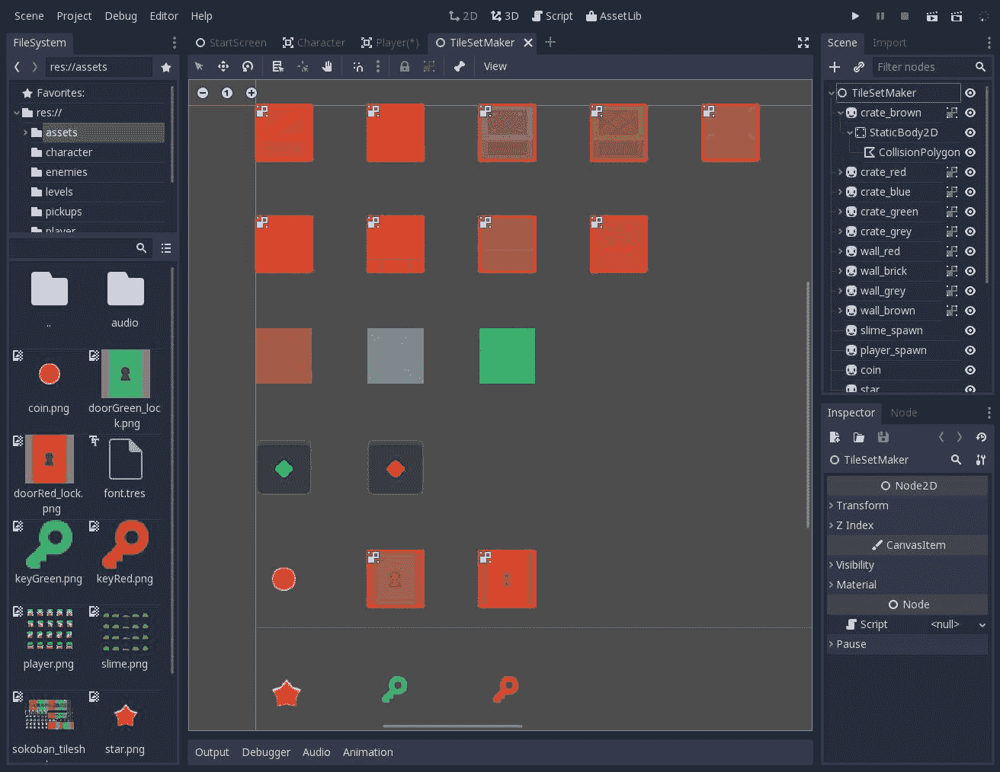

首先添加一个 `Sprite` 节点，并将其纹理设置为 `res://assets/sokoban_tilesheet.png`。要选择单个瓦片，将区域/启用属性设置为开启，并在编辑器窗口底部点击纹理区域以打开面板。将捕捉模式设置为网格捕捉，并在 *x* 和 *y* 方向上将步长设置为 64px。现在，当你点击并拖动纹理时，它只会允许你选择 64 x 64 的纹理区域：

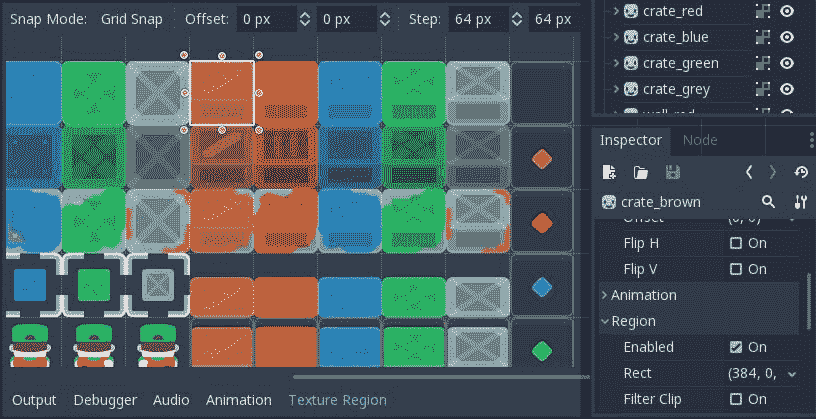

给精灵一个合适的名称（例如 `crate_brown` 或 `wall_red`）——这个名称将作为瓦片名称出现在 `TileSet` 中。添加一个 `StaticBody2D` 作为子节点，然后向其中添加一个 `CollisionPolygon2D`。确保碰撞多边形的大小适当，以便与放置在其旁边的瓦片对齐。在编辑器窗口中开启网格捕捉是最简单的方法。

点击使用捕捉按钮（看起来像一块磁铁），然后通过点击其旁边的三个点打开捕捉菜单：

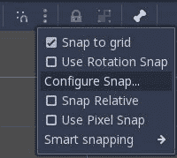

选择配置捕捉... 并将网格步长设置为 `64` x `64`：

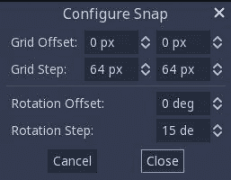

现在，当选择 `CollisionPolygon2D` 时，你可以逐个点击瓦片的四个角来创建一个闭合的方形（它将显示为红色橙色）：

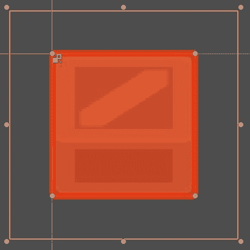

这个瓦片现在已完成。你可以复制它（*Ctrl* + *D*）并创建另一个，你只需要更改纹理区域。请注意，只有墙壁瓦片需要碰撞体。地面和物品瓦片不应包含它们。

当你创建完所有瓦片后，点击场景 | 转换为 | 瓦片集，并以适当的名称保存，例如 `tileset.tres`。如果你回来再次编辑场景，你需要重新进行转换。特别注意合并现有选项。如果设置为开启，当前场景的瓦片将与 `tileset` 文件中的瓦片合并。有时，这可能会导致瓦片索引发生变化，并以不希望的方式更改你的地图。请查看以下截图：

`tres` 代表文本资源，是 Godot 存储其资源文件的最常见格式。将其与 `tscn` 进行比较，这是文本场景存储格式。

你的 `TileSet` 资源现在可以使用了！

# 瓦片图

现在，让我们为游戏关卡创建一个新的场景。这个关卡将是一个独立的场景，包括地图和玩家，并处理在关卡中生成任何物品和敌人。对于根节点，使用 `Node2D` 并将其命名为 `Level1`（稍后，你可以复制此节点设置以创建更多关卡）。

你可以从资产文件夹中打开 `Level1.tscn` 文件，以查看本节中完成的关卡场景，尽管鼓励你创建自己的关卡。

当使用 `TileMap` 时，你可能会希望在一个给定位置出现多个瓦片对象。例如，你可能想要放置一棵树，但也希望在它下面有一个地面瓦片。这可以通过多次使用 `TileMap` 来创建数据层来实现。对于你的关卡，你将创建三个层来显示玩家可以行走的地面；墙壁，它们是障碍物；以及可收集的物品，它们是生成如硬币、钥匙和敌人的标记。

添加一个 `TileMap` 并将其命名为 `Ground`。将 `tileset.tres` 拖放到瓦片集属性中，你将在编辑器窗口的右侧看到瓦片出现，准备使用：

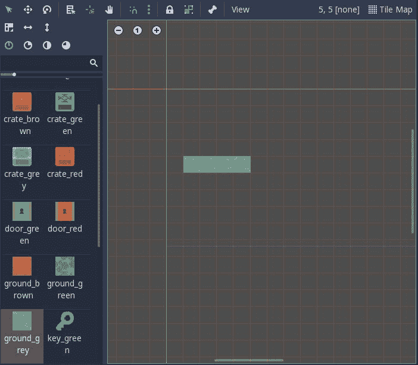

在编辑器窗口中不小心点击并拖动很容易移动整个瓦片图。为了防止这种情况，确保你选择了 `Ground` 节点并点击锁定按钮： 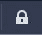。

将此 `TileMap` 复制两次，并将新的 `TileMap` 节点命名为 `Walls` 和 `Items`。记住，Godot 按照节点树中从上到下的顺序绘制对象，所以 `Ground` 应该在顶部，`Walls` 和 `Items` 在其下方。

当你在绘制你的关卡时，请注意你正在绘制哪个层！你应该只在物品层放置物品标记，例如，因为代码将在这里查找要创建的对象。不过，不要在该层放置任何其他对象，因为在游戏过程中该层本身将是不可见的。

最后，添加一个 `Player` 场景的实例。确保 `Player` 节点位于三个 `TileMap` 节点之下，这样它就会被绘制在最上面。最终的场景树应该看起来像这样：

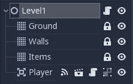

# 关卡脚本

现在关卡已经完成，附加一个创建关卡行为的脚本。此脚本将首先扫描 `Items` 映射以生成任何敌人和可收集物品。它还将用于监控游戏过程中发生的事件，例如捡起钥匙或遇到敌人：

```cpp
extends Node2D

export (PackedScene) var Enemy
export (PackedScene) var Pickup

onready var items = $Items
var doors = []
```

前两个变量包含了对从 `Items` 映射中实例化的场景的引用。由于该特定映射节点将被频繁引用，你可以将 `$Items` 查找缓存到一个变量中以节省一些时间。最后，一个名为 `doors` 的数组将包含地图上找到的门的位置。

保存脚本并将 `Enemy.tscn` 和 `Pickup.tscn` 文件拖放到检查器中相应的属性。

现在，添加以下代码到 `_ready()` 中：

```cpp
func _ready():
    randomize()
    $Items.hide()
    set_camera_limits()
    var door_id = $Walls.tile_set.find_tile_by_name('door_red')
    for cell in $Walls.get_used_cells_by_id(door_id):
        doors.append(cell)
    spawn_items()
    $Player.connect('dead', self, 'game_over')
    $Player.connect('grabbed_key', self, '_on_Player_grabbed_key')
    $Player.connect('win', self, '_on_Player_win')
```

函数首先确保 `Items` 瓦片图是隐藏的。你不希望玩家看到这些瓦片；它们的存在是为了让脚本检测物品的生成位置。

接下来，需要设置摄像机的限制，确保它不能滚动到地图的边缘。你需要创建一个函数来处理这个问题（见下面的代码）。

当玩家找到钥匙时，门需要打开，所以下一部分会在`Walls`地图中搜索任何`door_red`瓦片并将它们存储在数组中。请注意，你必须首先从`TileSet`中找到瓦片的`id`，因为`TileMap`的单元格只包含指向瓦片集的 ID 数字。

关于`spawn_items()`函数的更多内容将在后面介绍。

最后，`Player`信号都连接到将处理其结果的函数。

这是如何设置相机限制以匹配地图大小的：

```cpp
func set_camera_limits():
    var map_size = $Ground.get_used_rect()
    var cell_size = $Ground.cell_size
    $Player/Camera2D.limit_left = map_size.position.x * cell_size.x
    $Player/Camera2D.limit_top = map_size.position.y * cell_size.y
    $Player/Camera2D.limit_right = map_size.end.x * cell_size.x
    $Player/Camera2D.limit_bottom = map_size.end.y * cell_size.y
```

`get_used_rect()`返回一个包含`Ground`层大小的`Vector2`。将其乘以`cell_size`给出整个地图的像素大小，这用于在`Camera`节点上设置四个限制值。设置这些限制确保当你靠近边缘时，你不会看到地图外的任何*死区*。

现在，添加`spawn_items()`函数：

```cpp
func spawn_items():
    for cell in items.get_used_cells():
        var id = items.get_cellv(cell)
        var type = items.tile_set.tile_get_name(id)
        var pos = items.map_to_world(cell) + items.cell_size/2
        match type:
            'slime_spawn':
                var s = Enemy.instance()
                s.position = pos
                s.tile_size = items.cell_size
                add_child(s)
            'player_spawn':
                $Player.position = pos
                $Player.tile_size = items.cell_size
            'coin', 'key_red', 'star':
                var p = Pickup.instance()
                p.init(type, pos)
                add_child(p)
```

此函数在`Items`层中查找瓦片，由`get_used_cells()`返回。每个单元格都有一个`id`，它映射到`TileSet`中的一个名称（在创建`TileSet`时分配给每个瓦片的名称）。如果你创建了自定义瓦片集，请确保在这个函数中使用与你的瓦片匹配的名称。前面代码中使用的名称与包含在资产下载中的瓦片集相匹配。

`map_to_world()`将瓦片地图位置转换为像素坐标。这给出了瓦片的左上角，因此你必须添加半个瓦片大小以找到瓦片的中心。然后，根据找到的瓦片，实例化匹配的项目对象。

最后，添加玩家信号的相关三个函数：

```cpp
func game_over():
    pass

func _on_Player_win():
    pass

```

```cpp
func _on_Player_grabbed_key():
    for cell in doors:
        $Walls.set_cellv(cell, -1)
```

玩家信号`dead`和`win`应结束游戏并转到游戏结束屏幕（你尚未创建）。由于你目前还不能编写这些函数的代码，暂时使用`pass`。拾取钥匙的信号应移除任何门瓦片（通过将它们的瓦片索引设置为`-1`，这意味着空瓦片）。

# 添加更多关卡

如果你想要创建另一个关卡，你只需要复制这个场景树并将其相同的脚本附加到它上面。这样做最简单的方法是使用“场景”|“另存为”并将关卡保存为`Level2.tscn`。然后，你可以使用一些现有的瓦片或绘制一个全新的关卡布局。

随意使用你喜欢的关卡数量，确保将它们全部保存在`levels`文件夹中。在下一节中，你将看到如何将它们链接起来，以便每个关卡都将引导到下一个关卡。如果你编号错误，不用担心；你可以将它们按照你喜欢的任何顺序排列。

# 游戏流程

现在你已经完成了基本构建块，你需要将所有这些内容结合起来。在本节中，你将创建：

+   开始和游戏结束屏幕

+   一个全局脚本用于管理持久数据

游戏的基本流程遵循以下图表：

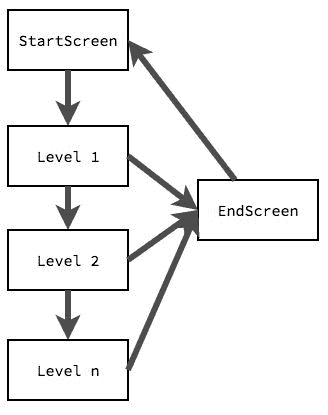

当玩家死亡或完成最后一个关卡时，他们会被发送到结束屏幕。经过短暂的时间后，结束屏幕会将玩家返回到起始屏幕，以便可以开始新游戏。

# 开始和结束屏幕

你需要两个场景来完成这部分：一个在游戏开始前显示的起始或标题屏幕（并允许玩家开始游戏），以及一个游戏结束屏幕，以通知玩家游戏已经结束。

创建一个新的场景并添加一个名为`StartScreen`的`Control`节点。添加一个子标签，并添加`res://assets/Unique.ttf`作为新的`DynamicFont`，字体大小为`64`。将“对齐”和“垂直对齐”属性设置为居中，并将文本设置为“逃离迷宫！”。在布局菜单中，选择“全矩形”。现在，复制此节点并将第二个标签的文本设置为按空格。

对于这个演示，`StartScreen`被保持得很简单。一旦它开始工作，你可以自由地添加装饰，甚至添加一个`AnimationPlayer`来让玩家精灵在屏幕上跑动。

选择“场景”|“另存为”来保存此场景的另一个副本，并将其命名为`EndScreen`。删除第二个`Label`（显示“按空格”的标签）并添加一个`Timer`节点。将“自动启动”属性设置为开启，将“单次启动”设置为开启，并将“等待时间”设置为`3`。

这个`Timer`在到期后会将游戏送回`StartScreen`。

然而，在你可以连接这些其他场景之前，你需要了解如何处理持久数据和*自动加载*。

# 全局变量

在游戏开发中，有一个非常常见的场景，你需要一些需要在多个场景中持久存在的数据。当场景切换时，场景中的数据会丢失，因此持久数据必须存在于当前场景之外。

Godot 通过使用自动加载来解决此问题。这些是每个场景都会自动加载的脚本或节点。因为 Godot 不支持全局变量，所以自动加载就像一个*单例*。这是一个（带有附加脚本的）节点，它会在*每个*场景中自动加载。自动加载的常见用途包括存储全局数据（得分、玩家数据等）、处理场景切换函数，或任何需要独立于当前运行场景的函数。

**单例**是编程中一个著名的模式，它描述了一个只能允许自身存在一个实例的类，并提供对其成员变量和函数的直接访问。在游戏开发中，它通常用于需要被游戏各个部分访问的持久数据。

当决定是否需要单例时，问问自己这个对象或数据是否需要*始终*存在，并且是否将始终只有一个该对象的实例。

# 全局脚本

首先，在脚本窗口中点击“文件”|“新建”来创建一个新的脚本。确保它从`Node`继承（这是默认设置），并在“路径”字段中设置名称为`Global.gd`。点击创建，并将以下代码添加到新脚本中：

```cpp
extends Node

var levels = ['res://levels/Level1.tscn',
              'res://levels/Level2.tscn']
var current_level

var start_screen = 'res://ui/StartScreen.tscn'
var end_screen = 'res://ui/EndScreen.tscn'

func new_game():
    current_level = -1
    next_level()

func game_over():
    get_tree().change_scene(end_screen)

func next_level():
    current_level += 1
    if current_level >= Global.levels.size():
        # no more levels to load :(
        game_over()
    else:
        get_tree().change_scene(levels[current_level])
```

此脚本提供了一些你需要的功能。

大部分工作是由`SceneTree`的`change_scene()`方法完成的。`SceneTree`代表当前正在运行的场景的基础。当一个场景被加载或添加新节点时，它成为`SceneTree`的一个成员。`change_scene()`用给定的场景替换当前场景。

`next_level()`函数遍历你制作的关卡列表，这些列表在`levels`数组中列出。如果你到达列表的末尾，游戏结束。

要将此脚本作为自动加载，打开项目设置并点击自动加载选项卡。点击路径旁边的..按钮，选择你的`Global.gd`脚本。节点名称将自动设置为 Global（这是你在脚本中引用节点的名称，如以下截图所示）：

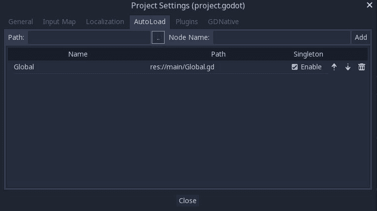

现在，你可以通过在任何脚本中使用其名称来访问全局脚本的所有属性，例如，`Global.current_level`。

将以下脚本附加到`StartScreen`：

```cpp
extends Control

func _input(event):
    if event.is_action_pressed('ui_select'):
        Global.new_game()
```

此脚本等待空格键被按下，然后调用`Global`的`new_game()`函数。

将此添加到`EndScreen`：

```cpp
extends Control

func _on_Timer_timeout():
    get_tree().change_scene(Global.start_screen)
```

你还需要连接`Timer`的`timeout`信号。为此，你必须首先创建脚本，然后`Connect`按钮会为你创建新的函数。

在`Level.gd`脚本中，你现在可以填写剩下的两个函数：

```cpp
func _on_Player_win():
    Global.next_level()

func game_over():
    Global.game_over()
```

# 分数

全局单例是一个很好的地方来保存玩家的分数，以便它在关卡之间保持持久。首先在文件顶部添加一个`var score`变量，然后在`new_game()`中添加`score = 0`。

现在，每次收集硬币时都需要添加一个点。转到`Pickup.gd`并添加`signal coin_pickup`在顶部。你可以在`pickup()`函数中发出此信号：

```cpp
func pickup():
    match type:
        'coin':
            emit_signal('coin_pickup', 1)
    $CollisionShape2D.disabled = true
    $Tween.start()
```

这里包含`1`的值，以防你以后想更改硬币的价值数量，或者添加其他增加不同分数的对象。这个信号将用于更新显示，因此现在你可以创建`HUD`。

创建一个新的场景，命名为`HUD`的`CanvasLayer`并保存场景。添加一个`MarginContainer`节点作为子节点，并在其下添加一个名为`ScoreLabel`的`Label`。

将`MarginContainer`布局设置为顶部宽，并设置其四个边距属性（在自定义常量下找到）均为`20`。然后添加与之前开始和结束屏幕相同的自定义字体属性，接着附加一个脚本：

```cpp
extends CanvasLayer

func _ready():
    $MarginContainer/ScoreLabel.text = str(Global.score)

func update_score(value):
    Global.score += value
    $MarginContainer/ScoreLabel.text = str(Global.score)
```

将`HUD`实例添加到`Level`场景中。记得从上一个项目中，`CanvasLayer`节点将保持在游戏其他部分之上。它还将忽略任何相机移动，因此显示将保持在玩家在关卡中移动时固定位置。

最后，在`Level.gd`脚本中，当你生成一个新的可收集对象时，将信号连接到`HUD`函数：

```cpp
    'coin', 'key_red', 'star':
        var p = Pickup.instance()
        p.init(type, pos)
        add_child(p)
        p.connect('coin_pickup', $HUD, 'update_score')
```

运行游戏并收集一些硬币以确认分数正在更新。

# 保存高分

许多游戏需要你在游戏会话之间保存某种信息。这是你希望保持可用的信息，即使应用程序本身已经退出。例如包括保存的游戏、用户创建的内容或可下载的资源包。对于这个游戏，你将保存一个高分值，该值将在游戏会话之间持续存在。

# 读取和写入文件

如你之前所见，Godot 将所有资源存储为项目文件夹中的文件。从代码中，这些资源可以通过`res://`文件夹路径访问。例如，`res://project.godot`将始终指向当前项目的配置文件，无论项目实际上存储在电脑上的哪个位置。

然而，当项目运行时，`res://`文件系统被设置为只读以保障安全。当项目导出时，它也是只读的。任何需要用户保留的数据都放置在`user://`文件路径中。这个文件夹的物理位置将根据游戏运行的平台而有所不同。

你可以使用`OS.get_user_data_dir()`找到当前平台的用户可写数据文件夹。将一个`print()`语句添加到你的脚本中的一个`ready()`函数中，以查看系统上的位置。

使用`File`对象来读取和写入文件。此对象用于以读取和/或写入模式打开文件，也可以用于检查文件是否存在。

将以下代码添加到`Global.gd`中：

```cpp
var highscore = 0
var score_file = "user://highscore.txt"

func setup():
    var f = File.new()
    if f.file_exists(score_file):
        f.open(score_file, File.READ)
        var content = f.get_as_text()
        highscore = int(content)
        f.close()
```

首先，你需要测试文件是否存在。如果存在，你可以读取存储为可读文本的值，并将其分配给`highscore`变量。如果需要，文件中也可以存储二进制数据，但文本将允许你自己查看文件并检查一切是否正常工作。

将以下代码添加以检查玩家是否打破了之前的高分：

```cpp
func game_over():
    if score > highscore:
        highscore = score
        save_score()
    get_tree().change_scene(end_screen)

func save_score():
    var f = File.new()
    f.open(score_file, File.WRITE)
    f.store_string(str(highscore))
    f.close()
```

`save_score()`函数用于打开文件以写入新值。请注意，如果文件不存在，以`WRITE`模式打开将自动创建它。

接下来，当游戏开始时，你需要调用`setup()`函数，所以将以下内容添加到`Global.gd`中：

```cpp
func _ready():
    setup()
```

最后，为了显示高分，将另一个`Label`节点添加到`StartScreen`场景中（你可以复制现有的一个）。将其安排在其他的标签下面（或按你喜欢的任何顺序）并命名为`ScoreNotice`。将以下内容添加到脚本中：

```cpp
func _ready():
    $ScoreNotice.text = "High Score: " + str(Global.highscore)
```

运行游戏并检查你的高分是否在击败它时增加，并在退出并重新开始游戏时持续存在。

# 完成细节

现在游戏的主要功能已经完成，你可以添加一些更多功能来稍微润色一下。

# 死亡动画

当敌人击中玩家时，你可以添加一个小动画而不是直接结束游戏。效果将使角色围绕旋转并缩小其缩放属性。

首先，选择`Player`中的`AnimationPlayer`节点，然后点击新建动画按钮：。将新动画命名为`die`。

在这个动画中，你将动画 Sprite 的旋转角度和缩放属性。在检查器中找到旋转角度属性，点击 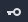 添加一个轨道。将刮擦器移动到动画的末尾，将旋转角度更改为 360，然后再次点击键。尝试播放动画以查看角色旋转。

请记住，虽然通常使用度数来表示检查器属性，但在编写代码时，大多数 Godot 函数期望角度以 *弧度* 来度量。

现在，用相同的操作处理 *缩放* 属性。在开始处添加一个关键帧 `(1, 1)`，然后在结束时添加另一个关键帧，将缩放设置为 `(0.2, 0.2)`。再次尝试播放动画以查看结果。

当玩家击中敌人时，需要触发新的动画。将以下代码添加到玩家的 `_on_Player_area_entered()` 函数中：

```cpp
if area.is_in_group('enemies'):
    area.hide()
    set_process(false)
    $CollisionShape2D.disabled = true
    $AnimationPlayer.play("die")
    yield($AnimationPlayer, 'animation_finished')
    emit_signal('dead')
```

添加的代码处理了一些需要发生的事情。首先，隐藏被击中的敌人确保它不会遮挡玩家并阻止你看到我们新的动画。接下来，使用 `set_process(false)` 停止 `_process()` 函数的运行，这样玩家在动画期间就不能继续移动。你还需要禁用玩家的碰撞检测，这样它就不会检测到另一个敌人，如果它恰好经过的话。

在开始 `die` 动画后，你需要让它完成，然后再发出 `dead` 信号，因此使用 `yield` 等待 `AnimationPlayer` 的信号。

尝试运行游戏并让敌人攻击你以查看动画。如果一切正常，你会在下一次播放时注意到一些问题：玩家变得很小！动画结束时，Sprite 的缩放设置为 `(0.2, 0.2)`，没有任何东西将其设置回正常大小。向玩家的脚本中添加以下内容，以便缩放始终从正确的值开始：

```cpp
func _ready():
    $Sprite.scale = Vector2(1, 1)
```

# 音效

在 `res://assets/audio` 文件夹中有六个音效可供你在游戏中使用。这些音频文件是 OGG 格式。默认情况下，Godot 在导入时将 OGG 文件设置为循环。在 FileSystem 选项卡中选择 OGG 文件（你可以使用 *Shift* + 点击来选择多个文件），然后在编辑器窗口的右侧点击 Import 选项卡。取消选择 Loop 并点击 Reimport 按钮：

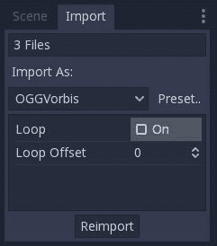

首先，添加物品的拾取声音。在 `Pickup` 场景中添加两个 `AudioStreamPlayer` 节点，分别命名为 `KeyPickup` 和 `CoinPickup`。将相应的音频文件拖动到每个节点的 Stream 属性中。

你还可以通过其 Volume Db 属性调整音量，如图所示：

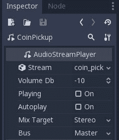

将以下代码添加到 `pickup()` 函数的开始部分：

```cpp
match type:
    'coin':
        emit_signal('coin_pickup', 1)
        $CoinPickup.play()
    'key_red':
        $KeyPickup.play()
```

其他音效将添加到 `Player` 场景中。添加三个 `AudioStreamPlayer` 节点，分别命名为 `Win`、`Lose` 和 `Footsteps`，并将匹配的音频文件添加到每个节点的 Stream 中。更新 `_on_Player_area_entered()` 函数如下：

```cpp
    if area.type == 'star':
        $Win.play()
        $CollisionShape2D.disabled = true
        yield($Win, "finished")
        emit_signal('win')
```

你需要禁用碰撞和 `yield` 以确保声音播放完成，否则它会被下一个关卡加载时立即终止。这样，玩家在继续前进之前有足够的时间听到声音。

要播放脚步声，在 `_process()` 函数中的 `if move(dir):` 后面添加 ``$Footsteps.play()``。注意：你可能想要降低脚步声的音量，以免它们压过其他所有声音；它们应该是微妙的背景声音。在 `Footsteps` 节点中，将 Volume Db 属性设置为 `-30`。

最后，为了播放 `Lose` 声音，将其添加到敌人碰撞代码中：

```cpp

if area.is_in_group('enemies'):
    area.hide()
    $CollisionShape2D.disabled = true
    set_process(false)
    $Lose.play()
    $AnimationPlayer.play("die")
    yield($Lose, 'finished')
    emit_signal('dead')
```

注意，你需要更改 `yield` 函数。由于声音比动画稍长，如果你在动画完成时结束它，它会被截断。或者，你可以调整动画的持续时间以匹配声音的长度。

# 摘要

在这个项目中，你学习了如何利用 Godot 的继承系统来组织和共享游戏中的不同对象之间的代码。这是一个非常强大的工具，每次你开始构建新游戏时都应该记住。如果你开始创建多个具有相同属性和/或代码的对象，你可能应该停下来思考一下你在做什么。问问自己：*我是否可以使用继承来共享这些对象共有的内容？* 在一个包含更多对象的大游戏中，这可以为你节省大量时间。

你看到了 `TileMap` 节点的工作原理以及它如何让你快速设计地图和生成新对象。它们在许多游戏类型中都有很多用途。正如你将在本书后面看到的那样，TileMaps 也非常适合设计平台游戏关卡。

你还介绍了 *AutoLoad* 功能，它允许你创建一个包含跨多个场景使用的持久数据的全局脚本。你还学习了如何实现基于网格的移动，并使用 `AnimationPlayer` 来处理精灵图动画。

在下一章中，你将学习关于 Godot 强大的物理体：`RigidBody2D`。你将使用它来创建一个经典类型的游戏：太空射击游戏。
