# 太空岩石

到现在为止，您应该已经对在 Godot 中工作感到更加得心应手；添加节点、创建脚本、在检查器中修改属性等等。随着您通过这本书的进展，您将不会被迫一次又一次地重复基础知识。如果您发现自己遇到了困难，或者感觉不太记得如何做某事，请随时回到之前的项目中，那里有更详细的解释。随着您在 Godot 中重复更常见的操作，它们将开始变得越来越熟悉。同时，每一章都将向您介绍更多节点和技术，以扩展您对 Godot 功能的理解。

在下一个项目中，您将制作一个类似于街机经典游戏《小行星》的空间射击游戏。玩家将控制一艘可以旋转和向任何方向移动的飞船。目标将是避开漂浮的*太空岩石*并用飞船的激光射击它们。请参考以下截图：

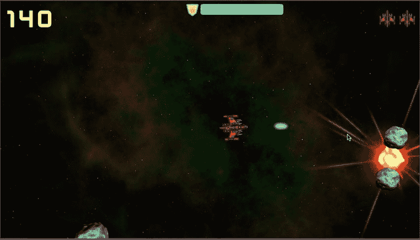

在这个项目中，您将学习以下关键主题：

+   使用`RigidBody2D`进行物理运算

+   有限状态机

+   构建动态、可扩展的用户界面

+   声音和音乐

+   粒子效果

# 项目设置

创建一个新的项目，并从[`github.com/PacktPublishing/Godot-Game-Engine-Projects/releases`](https://github.com/PacktPublishing/Godot-Game-Engine-Projects/releases)下载项目资源。

对于这个项目，您将使用输入映射来设置自定义输入操作。使用此功能，您可以定义自定义事件并将不同的键、鼠标事件或其他输入分配给它们。这使您在游戏设计上具有更大的灵活性，因为您的代码可以编写为响应例如`jump`输入，而无需确切知道用户按下了什么输入来触发事件。这允许您使相同的代码在不同的设备上工作，即使它们具有不同的硬件。此外，由于许多玩家期望能够自定义游戏的输入，这也使您能够为用户提供此选项。

要设置游戏的输入，请打开项目 | 项目设置并选择输入映射选项卡。

您需要创建四个新的输入操作：`rotate_left`、`rotate_right`、`thrust`和`shoot`。将每个操作的名称输入到动作框中并点击添加。然后，对于每个操作，点击+按钮并选择要分配的输入类型。例如，为了允许玩家使用箭头键和流行的 WASD 替代方案，设置将如下所示：

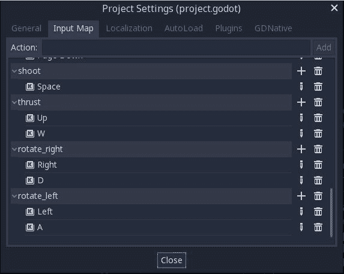

如果您的计算机连接了游戏手柄或其他控制器，您也可以以相同的方式将其输入添加到操作中。注意：我们目前只考虑按钮式输入，因此虽然您可以使用这个项目中的十字键，但使用模拟摇杆将需要修改项目的代码。

# 刚体物理

在游戏开发中，你经常需要知道游戏空间中的两个物体何时相交或接触。这被称为*碰撞检测*。当检测到碰撞时，你通常希望发生某些事情。这被称为*碰撞响应*。

Godot 提供了三种类型的物理刚体，这些刚体被归类在`PhysicsBody2D`对象类型下：

+   `StaticBody2D`：静态刚体是指不会被物理引擎移动的刚体。它参与碰撞检测，但不会对碰撞做出移动。这种类型的刚体通常用于环境中的物体或不需要任何动态行为的物体，例如墙壁或地面。

+   `RigidBody2D`：这是 Godot 中提供模拟物理的物理刚体。这意味着你不会直接控制`RigidBody2D`。相反，你对其施加力（重力、冲量等），然后 Godot 的内置物理引擎计算结果运动，包括碰撞、弹跳、旋转和其他效果。

+   `KinematicBody2D`：这种身体类型提供碰撞检测，但没有物理效果。所有运动都必须通过代码实现，并且你必须自己实现任何碰撞响应。运动刚体通常用于玩家角色或其他需要*街机风格*物理而不是真实模拟的演员。

了解何时使用特定的物理刚体类型是构建游戏的重要组成部分。使用正确的节点可以简化你的开发，而试图强制错误的节点完成工作可能会导致挫败感和不良结果。随着你与每种类型的刚体一起工作，你会了解它们的优缺点，并学会何时它们可以帮助构建你需要的东西。

在这个项目中，你将使用`RigidBody2D`节点来控制玩家飞船以及*太空岩石*本身。你将在后面的章节中了解其他刚体类型。

单个`RigidBody2D`节点有许多你可以用来自定义其行为的属性，例如`质量`、`摩擦`或`弹跳`。这些属性可以在检查器中设置：


刚体也受到世界属性的影响，这些属性可以在项目设置下的物理 | 2D 中设置。这些设置适用于世界中的所有刚体。请参考以下截图：

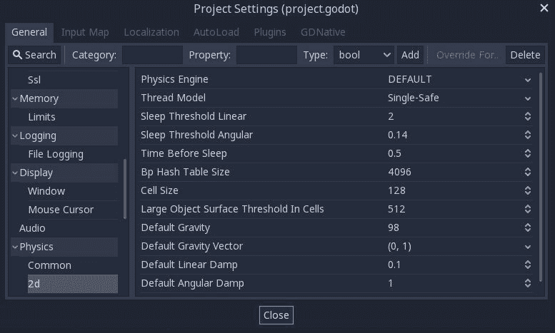

在大多数情况下，你不需要修改这些设置。但是，请注意，默认情况下，重力值为`98`，方向为`(0, 1)`（向下）。如果你想更改世界重力，你可以在这里进行更改。你还应该注意最后两个属性，默认线性阻尼和默认角阻尼。这些属性控制刚体将如何快速失去前进速度和旋转速度。将它们设置为较低的值会使世界感觉没有摩擦，而使用较大的值会使你的物体感觉像是在泥中移动。

`Area2D`节点也可以通过使用空间覆盖属性来影响刚体物理。然后，将自定义重力和阻尼值应用于进入该区域的任何物体。

由于这款游戏将在外太空进行，因此不需要重力，所以将默认重力设置为`0`。您可以保留其他设置不变。

# 玩家飞船

玩家飞船是游戏的核心。您将为这个项目编写的绝大部分代码都将关于使飞船工作。它将以经典的《小行星》风格进行控制，包括左右旋转和前进推进。它还将检测射击输入，以便玩家可以发射激光并摧毁漂浮的岩石。

# 身体设置和物理

创建一个新的场景，并将名为`Player`的`RigidBody2D`作为根节点添加，带有`Sprite`和`CollisionShape2D`子节点。将`res://assets/player_ship.png`图像添加到`Sprite`的纹理属性中。飞船图像相当大，因此将`Sprite`的缩放属性设置为`(0.5, 0.5)`，并将其旋转设置为`90`。

飞船的图像是向上绘制的。在 Godot 中，`0`度的旋转指向右侧（沿*x*轴）。这意味着您需要将`Sprite`节点的旋转设置为`90`，以便它与身体的朝向相匹配。

在`CollisionShape2D`的`Shape`属性中，添加一个`CircleShape2D`并将其缩放以尽可能紧密地覆盖图像（记住不要移动矩形大小手柄）：

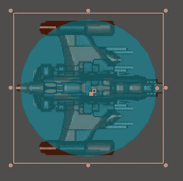

保存场景。在处理更大规模的项目时，建议根据每个游戏对象组织场景和脚本到文件夹中。例如，如果您创建一个`player`文件夹，可以将与玩家相关的文件保存在那里。这样，与将所有文件都放在单个文件夹中相比，更容易找到和修改您的文件。虽然这个项目相对较小，但随着项目规模和复杂性的增长，养成这种习惯是很好的。

# 状态机

在游戏过程中，玩家飞船可以处于多种不同的状态。例如，当*存活*时，飞船是可见的，并且可以被玩家控制，但容易受到岩石的攻击。另一方面，当*无敌*时，飞船应该看起来半透明，并且对伤害免疫。

程序员处理这类情况的一种方式是在代码中添加布尔标志变量。例如，当玩家生成时，将`invulnerable`标志设置为`true`，或者当玩家死亡时，将`alive`标志设置为`false`。然而，这可能会导致错误和奇怪的情况，即`alive`和`invulnerable`标志同时被设置为`true`。在这种情况下，如果一块石头击中玩家，会发生什么？这两个状态是互斥的，因此不应该允许这种情况发生。

解决这个问题的方法之一是使用**有限状态机**（**FSM**）。当使用 FSM 时，实体在给定时间只能处于一个状态。为了设计你的 FSM，你需要定义一些状态以及什么事件或动作可以导致从一个状态转换到另一个状态。

以下图概述了玩家飞船的 FSM：

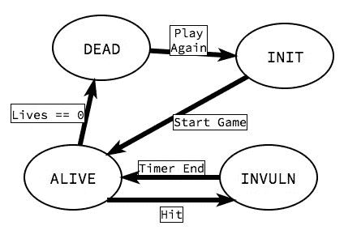

有四个状态，箭头表示允许的转换以及触发转换的事件。通过检查当前状态，你可以决定玩家被允许做什么。例如，在**DEAD**状态，不允许输入，或者在**INVULNERABLE**状态，不允许射击。

高级 FSM 实现可能相当复杂，细节超出了本书的范围（参见附录以获取进一步阅读）。在最纯粹的意义上，技术上你不会创建一个真正的 FSM，但为了这个项目的目的，它将足以说明这个概念并避免布尔标志问题。

将脚本添加到`Player`节点，并开始创建 FSM 实现的骨架：

```cpp
extends RigidBody2D

enum {INIT, ALIVE, INVULNERABLE, DEAD}
var state = null
```

`enum`（枚举的缩写）是创建一组常量的便捷方式。前面代码片段中的`enum`语句等同于以下代码：

```cpp
const INIT = 0
const ALIVE = 1
const INVULNERABLE = 2
const DEAD = 3
```

你也可以给一个`enum`赋予一个名称，这在单个脚本中有多个常量集合时很有用。例如：

```cpp
enum States {INIT, ALIVE}

var state = States.INIT
```

然而，在这个脚本中不需要这个，因为您只会使用一个`enum`来跟踪飞船的状态。

接下来，创建`change_state`函数来处理状态转换：

```cpp
func _ready():
    change_state(ALIVE)

func change_state(new_state):
    match new_state:
        INIT:
            $CollisionShape2D.disabled = true
        ALIVE:
            $CollisionShape2D.disabled = false
        INVULNERABLE:
            $CollisionShape2D.disabled = true
        DEAD:
            $CollisionShape2D.disabled = true
    state = new_state
```

每次你需要更改玩家的状态时，你将调用`change_state()`函数并传递新状态的值。然后，通过使用`match`语句，你可以执行伴随状态转换到新状态的任何代码。为了说明这一点，`CollisionShape2D`是通过`new_state`值启用/禁用的。在`_ready()`中，你指定初始状态——目前是`ALIVE`以便测试，但稍后你会将其更改为`INIT`。

# 控制器

将以下变量添加到脚本中：

```cpp
export (int) var engine_power
export (int) var spin_power

var thrust = Vector2()
var rotation_dir = 0
```

`engine_power`和`spin_power`控制飞船加速和转向的速度。在检查器中，将它们分别设置为`500`和`15000`。`thrust`将代表飞船引擎施加的力：当滑行时为`(0, 0)`，当开启动力时为一个长度为`engine_power`的向量。`rotation_dir`将代表飞船转向的方向并施加扭矩，即旋转力。

默认情况下，物理设置提供了一些*阻尼*，这会减少物体的速度和旋转。在太空中，没有摩擦，所以为了真实感，不应该有任何阻尼。然而，为了达到街机风格的体验，当您松开按键时，飞船应该停止。在检查器中，将玩家的线性/阻尼设置为`1`，其角/阻尼设置为`5`。

下一步是检测输入并移动船只：

```cpp
func _process(delta):
    get_input()

func get_input():
    thrust = Vector2()
    if state in [DEAD, INIT]:
        return
    if Input.is_action_pressed("thrust"):
        thrust = Vector2(engine_power, 0)
    rotation_dir = 0
    if Input.is_action_pressed("rotate_right"):
        rotation_dir += 1
    if Input.is_action_pressed("rotate_left"):
        rotation_dir -= 1

func _physics_process(delta):
    set_applied_force(thrust.rotated(rotation))
    set_applied_torque(spin_power * rotation_dir)

```

`get_input()`函数捕获关键操作并设置飞船的推力开启或关闭，以及旋转方向（`rotation_dir`）为正或负值（表示顺时针或逆时针旋转）。此函数在`_process()`中每帧都会被调用。注意，如果状态是`INIT`或`DEAD`，`get_input()`将在检查按键操作之前使用`return`退出。

当使用物理体时，它们的移动和相关函数应在`_physics_process()`中调用。在这里，你可以使用`set_applied_force()`将引擎推力应用到飞船面向的任何方向。然后，你可以使用`set_applied_torque()`使飞船旋转。

播放场景后，你应该能够自由飞行。

# 屏幕卷曲

经典 2D 街机游戏的一个特点是*屏幕卷曲*。如果玩家离开屏幕的一侧，他们*就会出现在另一侧*。在实践中，你将传送或瞬间改变飞船的位置到另一侧。将以下内容添加到脚本顶部的类变量中：

```cpp
var screensize = Vector2() 
```

并将以下内容添加到`_ready()`中：

```cpp
screensize = get_viewport().get_visible_rect().size
```

之后，游戏的主脚本将处理设置所有游戏对象的`screensize`，但现在，这将允许你仅使用玩家场景测试屏幕卷曲。

当首次接近这个问题时，你可能认为可以使用身体的`position`属性，如果它超出屏幕边界，就将其设置为相反的一侧。然而，当使用`RigidBody2D`时，你不能直接设置其`position`，因为这会与物理引擎正在计算的移动冲突。一个常见的错误是尝试在`_physics_process()`中添加类似以下内容：

```cpp
func _physics_process(delta):
    if position.x > screensize.x:
        position.x = 0
    if position.x < 0:
        position.x = screensize.x
    if position.y > screensize.y:
        position.y = 0
    if position.y < 0:
        position.y = screensize.y
    set_applied_force(thrust.rotated(rotation))
    set_applied_torque(rotation_dir * spin_thrust)
```

这将失败，将玩家困在屏幕边缘（并且偶尔在角落处不可预测地*闪烁*）。那么，为什么这不起作用呢？Godot 文档建议使用`_physics_process()`来编写与物理相关的代码——它甚至包含*物理*这个词。乍一看，这似乎应该能正常工作。

事实上，解决这个问题的正确方法*不是*使用`_physics_process()`。

引用`RigidBody2D`文档：

“你不应该在每一帧或非常频繁地更改 RigidBody2D 的`position`或线性速度。如果你需要直接影响身体的`state`，请使用`_integrate_forces`，这允许你直接访问物理状态。”

并且在`_integrate_forces()`的描述中：

“（它）允许你读取和安全地修改对象的模拟状态。如果你需要直接更改身体的`position`或其他物理属性，请使用此方法代替`_physics_process`。（强调部分）”

答案是将物理回调更改为`_integrate_forces()`，这让你可以访问身体的`Physics2DDirectBodyState`。这是一个包含大量关于身体当前物理状态的有用信息的 Godot 对象。在位置方面，关键信息是身体的`Transform2D`。

一个 *变换* 是一个表示二维空间中一个或多个变换（如平移、旋转和/或缩放）的矩阵。通过访问 `Transform2D` 的 `origin` 属性可以找到平移（即位置）信息。

使用这些信息，你可以通过将 `_physics_process()` 改为 `_integrate_forces()` 并改变变换的原点来实现环绕效果：

```cpp
func _integrate_forces(physics_state):
    set_applied_force(thrust.rotated(rotation))
    set_applied_torque(spin_power * rotation_dir)
    var xform = physics_state.get_transform()
    if xform.origin.x > screensize.x:
        xform.origin.x = 0
    if xform.origin.x < 0:
        xform.origin.x = screensize.x
    if xform.origin.y > screensize.y:
        xform.origin.y = 0
    if xform.origin.y < 0:
        xform.origin.y = screensize.y
    physics_state.set_transform(xform)
```

注意，函数的参数名称已从默认的 `state` 改为 `physics_state`。这是为了避免与已经存在的 `state` 变量产生任何可能的混淆，该变量跟踪玩家当前分配到的 FSM 状态。

再次运行场景并检查一切是否按预期工作。确保你尝试在所有四个方向上进行环绕。一个常见的错误是意外地翻转大于或小于符号，所以如果你在屏幕的某个边缘遇到问题，首先检查这一点。

# 射击

现在，是时候给你的飞船装备一些武器了。当按下 `shoot` 动作时，子弹应该从飞船的前端生成并沿直线飞行，直到它退出屏幕。然后，直到经过一小段时间后，枪才允许再次开火。

# 子弹场景

这是子弹的节点设置：

+   `Area2D`（命名为 `Bullet`）

+   `Sprite`

+   `CollisionShape2D`

+   `VisibilityNotifier2D`

使用从资源文件夹 `res://assets/laser.png` 中的 `laser.png` 作为 `Sprite` 的纹理，以及 `CapsuleShape2D` 作为碰撞形状。你需要将 `CollisionShape2D` 的旋转设置为 `90` 以确保正确匹配。你还应该将 `Sprite` 缩小到一半大小（`(0.5, 0.5)`）。

将以下脚本添加到 `Bullet` 节点：

```cpp
extends Area2D

export (int) var speed
var velocity = Vector2()

func start(pos, dir):
    position = pos
    rotation = dir
    velocity = Vector2(speed, 0).rotated(dir)

func _process(delta):
    position += velocity * delta
```

将导出的 `speed` 属性设置为 `1000`。

`VisibilityNotifier2D` 是一个节点，它可以通知你（使用信号）每当一个节点变为可见或不可见时。你可以使用这个功能在子弹离开屏幕时自动删除它。连接 `VisibilityNotifier2D` 的 `screen_exited` 信号并添加以下内容：

```cpp
func _on_VisibilityNotifier2D_screen_exited():
    queue_free()
```

最后，连接子弹的 `body_entered` 信号，以便你可以检测到子弹击中岩石的情况。子弹不需要 *知道* 任何关于岩石的信息，只需知道它击中了某个东西。当你创建岩石时，你将它们添加到名为 `rocks` 的组中，并给它们一个 `explode()` 方法：

```cpp
func _on_Bullet_body_entered( body ):
    if body.is_in_group('rocks'):
        body.explode()
        queue_free()
```

# 发射子弹

现在，每当玩家开火时，你需要创建子弹的实例。然而，如果你将子弹设置为玩家的子节点，那么它会随着玩家移动和旋转，而不是独立移动。相反，你应该将子弹添加到主场景的子节点。一种方法是通过使用`get_parent().add_child()`来实现，因为当游戏运行时，`Main`场景将是玩家的父节点。但是，这意味着你将无法像以前那样单独运行`Player`场景，因为`get_parent()`会产生错误。或者，如果在`Main`场景中你决定以不同的方式安排事物，使玩家成为某个其他节点的子节点，子弹就不会出现在你期望的位置。

通常，编写假设固定树布局的代码是一个坏主意。特别是尽可能避免使用`get_parent()`。一开始你可能觉得这种方式很难想通，但它将导致一个更模块化的设计，并防止一些常见的错误。

相反，玩家将通过信号将子弹“给予”主场景。这样，`Player`场景就不需要“知道”关于`Main`场景如何设置的信息，甚至不知道`Main`场景是否存在。生成子弹并将其传递是`Player`对象唯一的职责。

向玩家添加一个名为`Muzzle`的`Position2D`节点。这将标记枪的**枪口**——子弹将从中生成的位置。将其位置设置为`(50, 0)`以将其直接放置在船的前方。

接下来，添加一个名为`GunTimer`的`Timer`节点。这将给枪提供一个**冷却时间**，防止在经过一定时间后再次发射子弹。勾选“单次射击”和“自动播放”框。

将以下新变量添加到玩家的脚本中：

```cpp
signal shoot

export (PackedScene) var Bullet
export (float) var fire_rate

var can_shoot = true
```

将`Bullet.tscn`拖放到检查器中的新`Bullet`属性上，并将射击频率设置为`0.25`（此值以秒为单位）。

将以下内容添加到`_ready()`中：

```cpp
$GunTimer.wait_time = fire_rate
```

然后将以下内容添加到`get_input()`中：

```cpp
if Input.is_action_pressed("shoot") and can_shoot:
    shoot()
```

现在，创建一个`shoot()`函数，该函数将处理创建子弹：

```cpp
func shoot():
    if state == INVULNERABLE:
        return
    emit_signal("shoot", Bullet, $Muzzle.global_position, rotation)
    can_shoot = false
    $GunTimer.start()
```

当发射`shoot`信号时，你传递`Bullet`本身及其起始位置和方向。然后，通过`can_shoot`标志禁用射击，并启动`GunTimer`。为了允许枪再次射击，连接`GunTimer`的`timeout`信号：

```cpp
func _on_GunTimer_timeout():
    can_shoot = true
```

现在，创建你的主场景。添加一个名为`Main`的`Node`和一个名为`Background`的`Sprite`。使用`res://assets/space_background.png`作为纹理。将`Player`的实例添加到场景中。

向`Main`添加一个脚本，然后连接`Player`节点的`shoot`信号，并将以下内容添加到创建的函数中：

```cpp
func _on_Player_shoot(bullet, pos, dir):
    var b = bullet.instance()
    b.start(pos, dir)
    add_child(b)
```

播放`Main`场景并测试你是否可以飞行和射击。

# 岩石

游戏的目标是摧毁漂浮的太空岩石，因此，现在您能够射击，是时候添加它们了。像飞船一样，岩石也将是 `RigidBody2D`，这将使它们以恒定的速度直线运动，除非受到干扰。它们还会以逼真的方式相互弹跳。为了使事情更有趣，岩石最初是大的，当您射击它们时，会破碎成多个较小的岩石。

# 场景设置

通过创建一个 `RigidBody2D`，将其命名为 `Rock`，并使用 `res://assets/rock.png` 纹理添加一个 `Sprite` 来开始一个新的场景。添加一个 `CollisionShape2D`，但 *不要* 向其中添加形状。因为您将生成不同大小的岩石，碰撞形状需要在代码中设置并调整到正确的大小。

将 `Rock` 的弹跳属性设置为 `1`，并将线性/阻尼和角/阻尼都设置为 `0`。

# 变量大小

添加一个脚本并定义成员变量：

```cpp
extends RigidBody2D

var screensize = Vector2()
var size
var radius
var scale_factor = 0.2
```

`Main` 脚本将处理生成新的岩石，包括在关卡开始时以及在大岩石爆炸后出现的较小岩石。大岩石将具有 `3` 的 `size`，并破碎成 `2` 尺寸的岩石，依此类推。`scale_factor` 乘以 `size` 以设置精灵的缩放、碰撞半径等。您可以在以后调整它以改变每种岩石的大小。

所有这些都将通过 `start()` 方法设置：

```cpp
func start(pos, vel, _size):
    position = pos
    size = _size
    mass = 1.5 * size
    $Sprite.scale = Vector2(1, 1) * scale_factor * size
    radius = int($Sprite.texture.get_size().x / 2 * scale_factor * size)
    var shape = CircleShape2D.new()
    shape.radius = radius
    $CollisionShape2D.shape = shape
    linear_velocity = vel
    angular_velocity = rand_range(-1.5, 1.5)
```

这里您需要根据岩石的 `size` 计算正确的碰撞形状并将其添加到 `CollisionShape2D`。请注意，由于 `size` 已经作为类变量使用，您可以使用 `_size` 作为函数参数。

岩石还需要在屏幕周围环绕，因此使用您为 `Player` 使用过的相同技术：

```cpp
func _integrate_forces(physics_state):
    var xform = physics_state.get_transform()
    if xform.origin.x > screensize.x + radius:
       xform.origin.x = 0 - radius
    if xform.origin.x < 0 - radius:
       xform.origin.x = screensize.x + radius
    if xform.origin.y > screensize.y + radius:
       xform.origin.y = 0 - radius
    if xform.origin.y < 0 - radius:
       xform.origin.y = screensize.y + radius
    physics_state.set_transform(xform)
```

这里的不同之处在于包含身体的 `radius` 会使得传送看起来更平滑。岩石看起来会完全退出屏幕，然后从对面进入。您可能还想对玩家飞船做同样的事情。试试看，看看您更喜欢哪种效果。

# 实例化

当生成新的岩石时，主场景需要选择一个随机的起始位置。为此，您可以使用一些几何形状来选择屏幕边缘的随机点，但您可以利用另一种 Godot 节点类型。您将在屏幕边缘绘制一个路径，脚本将选择路径上的一个随机位置。添加一个 `Path2D` 节点并将其命名为 `RockPath`。当您点击 `Path2D` 时，您将在编辑器的顶部看到一些新的按钮：


选择中间的（添加点）通过点击添加显示的点来绘制路径。为了使点对齐，请确保启用“吸附到网格”。此选项位于“锁定”按钮左侧的“吸附选项”按钮下。它看起来像一系列三个垂直点。请参考以下截图：


按照以下截图所示的顺序绘制点。点击第四个点后，点击关闭曲线按钮（**5**），你的路径将完成：

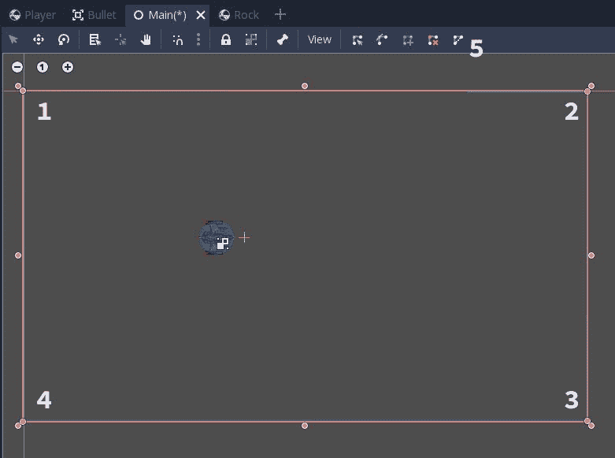

现在路径已经定义，将`PathFollow2D`节点作为`RockPath`的子节点添加，并命名为`RockSpawn`。此节点的作用是在移动时自动跟随路径，使用其`set_offset()`方法。偏移量越高，它沿着路径移动的距离就越远。由于我们的路径是闭合的，如果偏移值大于路径长度，它将循环。

接下来，添加一个`Node`并命名为`Rocks`。此节点将作为容器来保存所有岩石。通过检查其子节点数量，你可以判断是否还有剩余的岩石。

现在，将以下内容添加到`Main.gd`中：

```cpp
export (PackedScene) var Rock

func _ready():
    randomize()
    screensize = get_viewport().get_visible_rect().size
    $Player.screensize = screensize
    for i in range(3):
        spawn_rock(3)
```

脚本首先获取`screensize`并将其传递给`Player`。然后，使用在以下代码中定义的`spawn_rock()`，生成三个大小为`3`的岩石。不要忘记将`Rock.tscn`拖放到检查器中的`Rock`属性：

```cpp
func spawn_rock(size, pos=null, vel=null):
    if !pos:
        $RockPath/RockSpawn.set_offset(randi())
        pos = $RockPath/RockSpawn.position
    if !vel:
        vel = Vector2(1, 0).rotated(rand_range(0, 2*PI)) * rand_range(100, 150)
    var r = Rock.instance()
    r.screensize = screensize
    r.start(pos, vel, size)
    $Rocks.add_child(r)
```

此函数将有两个作用。当只传递一个大小参数时，它会在`RockPath`上随机选择一个位置和一个随机速度。然而，如果也提供了这些值，它将使用它们。这将允许你在爆炸的位置生成较小的岩石。

运行游戏后，你应该看到三个岩石在周围漂浮。然而，你的子弹不会影响它们。

# 爆炸岩石

`Bullet`正在检查`rocks`组中的身体，因此，在`Rock`场景中，点击节点选项卡并选择组。键入`rocks`并点击添加：

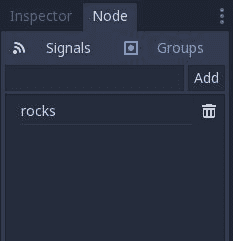

现在，如果你运行游戏并射击岩石，你会看到一个错误消息，因为子弹正在尝试调用岩石的`explode()`方法，但你还没有定义它。此方法需要做三件事：

+   移除岩石

+   播放爆炸动画

+   通知`Main`生成新的、更小的岩石

# 爆炸场景

爆炸将是一个独立的场景，你可以将其添加到`Rock`和后来到`Player`。它将包含两个节点：

+   `Sprite`（命名为`Explosion`)

+   `AnimationPlayer`

对于精灵的纹理，使用`res://assets/explosion.png`。你会注意到这是一个精灵图集——由 64 个较小的图像组成的网格图案。这些图像是动画的单独帧。你经常会发现以这种方式打包的动画，并且 Godot 的`Sprite`节点支持将它们作为单独的帧使用。

在检查器中，找到精灵的动画部分。将 Vframes 和 Hframes 都设置为`8`。这将*切割*精灵图集成其单独的图像。你可以通过将帧属性更改为`0`到`63`之间的不同值来验证这一点。完成时，请确保将帧属性恢复到`0`：

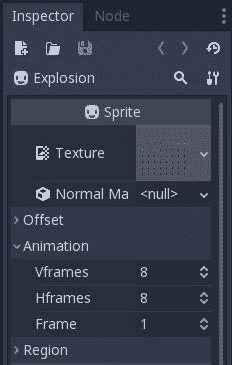

`AnimationPlayer` 可以用来动画化任何节点的任何属性。你将使用 `AnimationPlayer` 来随时间改变帧属性。首先点击节点，你将看到动画面板在底部打开，如下截图所示：

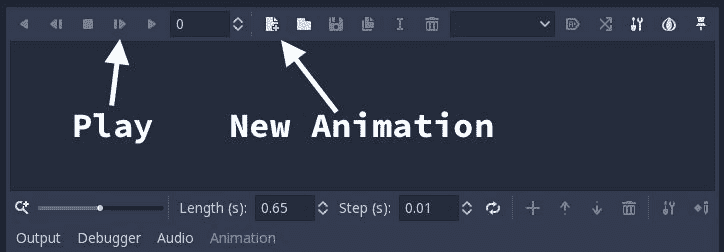

点击新建动画按钮，将其命名为 `explosion`。设置长度为 `0.64`，步长为 `0.01`。现在，点击 `Sprite` 节点，你会注意到检查器中现在每个属性旁边都有一个键按钮。每次点击键，你就在当前动画中创建一个关键帧。帧属性旁边的键按钮上还有一个 `+` 符号，表示当你添加关键帧时，它将自动增加值。

点击键并确认你想要创建一个新的动画轨道。注意，帧属性已增加到 `1`。重复点击键按钮，直到达到最终帧（`63`）。

在动画面板中点击播放按钮，以查看动画播放。

# 添加到岩石

在 `Rock` 场景中，添加一个 `Explosion` 实例，并在 `start()` 中添加此行：

```cpp
$Explosion.scale = Vector2(0.75, 0.75) * size
```

这将确保爆炸的缩放与岩石的大小相匹配。

在脚本顶部添加一个名为 `exploded` 的信号，然后添加 `explode()` 函数，该函数将在子弹击中岩石时被调用：

```cpp
func explode():
    layers = 0
    $Sprite.hide()
    $Explosion/AnimationPlayer.play("explosion")
    emit_signal("exploded", size, radius, position, linear_velocity)
    linear_velocity = Vector2()
    angular_velocity = 0
```

`layers` 属性确保爆炸效果将被绘制在屏幕上其他精灵之上。然后，你将发送一个信号，让 `Main` 知道生成新的岩石。此信号还需要传递必要的数据，以便新岩石具有正确的属性。

当动画播放完毕后，`AnimationPlayer` 将发出一个信号。要连接它，你需要使 `AnimationPlayer` 节点可见。右键单击实例化的爆炸，选择 Editable Children，然后选择 `AnimationPlayer` 并连接其 `animation_finished` 信号。确保在连接到节点部分选择 `Rock`。动画的结束意味着可以安全地删除岩石：

```cpp
func _on_AnimationPlayer_animation_finished( name ):
    queue_free()
```

现在，测试游戏并检查在射击岩石时是否可以看到爆炸效果。此时，你的岩石场景应该看起来像这样：

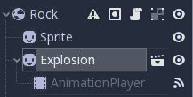

# 生成较小的岩石

`Rock` 正在发出信号，但需要在 `Main` 中连接。你不能使用节点标签页来连接它，因为岩石实例是在代码中创建的。信号也可以在代码中连接。将此行添加到 `spawn_rock()` 的末尾：

```cpp
r.connect('exploded', self, '_on_Rock_exploded')
```

这将把岩石的信号连接到 `Main` 中名为 `_on_Rock_exploded()` 的函数。创建该函数，它将在岩石发送其 `exploded` 信号时被调用：

```cpp
func _on_Rock_exploded(size, radius, pos, vel):
    if size <= 1:
        return
    for offset in [-1, 1]:
        var dir = (pos - $Player.position).normalized().tangent() * offset
        var newpos = pos + dir * radius
        var newvel = dir * vel.length() * 1.1
        spawn_rock(size - 1, newpos, newvel)
```

在这个函数中，除非刚刚被摧毁的石头是它可能的最小尺寸，否则将创建两个新的石头。`offset`循环变量将确保它们向相反方向（即，一个将是另一个的负值）生成和移动。`dir`变量找到玩家和石头之间的向量，然后使用`tangent()`找到该向量的垂直向量。这确保了新石头会远离玩家：


再次玩游戏并检查一切是否按预期工作。

# UI

创建游戏 UI 可能非常复杂，或者至少很耗时。精确放置单个元素并确保它们在不同大小的屏幕和设备上工作，对于许多程序员来说，是游戏开发中最不有趣的部分。Godot 提供了各种`Control`节点来协助这个过程。学习如何使用各种`Control`节点将有助于减轻创建游戏 UI 的痛苦。

对于这个游戏，你不需要一个非常复杂的 UI。游戏需要提供以下信息和交互：

+   开始按钮

+   状态信息（准备或游戏结束）

+   分数

+   生命计数器

以下是你将能够创建的预览：

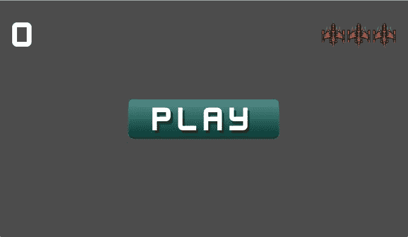

创建一个新的场景，并添加一个名为`HUD`的`CanvasLayer`作为根节点。UI 将通过使用 Godot 的`Control`布局功能构建在这个层上。

# 布局

Godot 的`Control`节点包括许多专门的容器。这些节点可以嵌套使用，以创建所需的精确布局。例如，`MarginContainer`会自动为其内容添加填充，而`HBoxContainer`和`VBoxContainer`则分别按行或列组织其内容。

首先添加一个`MarginContainer`，它将包含分数和生命计数器。在布局菜单下，选择顶部宽。然后，向下滚动到自定义常量部分，将所有四个边距设置为`20`。

接下来，添加一个`HBoxContainer`，它将包含左边的分数计数器和右边的生命计数器。在这个容器下，添加一个`Label`（命名为`ScoreLabel`）和另一个`HBoxContainer`（命名为`LivesCounter`）。

将`ScoreLabel`的文本设置为`0`，在`Size Flags`下设置水平为填充、扩展。在自定义字体中，添加一个`DynamicFont`，就像你在第一章“简介”中做的那样，使用`res://assets/kenvector_future_thin.ttf`从`assets`文件夹中设置大小为`64`。

在`LivesCounter`下添加一个`TextureRect`并命名为`L1`。将`res://assets/player_small.png`拖到纹理属性中，并将拉伸模式设置为保持宽高比居中。确保选中`L1`节点，然后按两次复制（*Ctrl* + *D*）来创建`L2`和`L3`（它们将被自动命名）。在游戏中，`HUD`将显示/隐藏这三个纹理，以指示用户剩余多少生命。

在一个更大、更复杂的 UI 中，你可以将这一部分保存为其自己的场景，并将其嵌入 UI 的其他部分。然而，这个游戏只需要 UI 的几个更多组件，所以将它们全部组合在一个场景中是完全可以的。

作为`HUD`节点的子节点，添加一个名为`StartButton`的`TextureButton`，一个名为`MessageLabel`的`Label`，以及一个名为`MessageTimer`的`Timer`。

在`res://assets`文件夹中，有两个用于`StartButton`的纹理，一个正常纹理（`play_button.png`）和一个当鼠标悬停时显示的纹理（`play_button_h.png`）。将它们分别拖到“Textures/Normal”和“Textures/Hover”属性中。在布局菜单中，选择居中。

对于`MessageLabel`，在指定布局之前，请确保首先设置字体，否则它将无法正确居中。你可以使用与`ScoreLabel`相同的设置。设置字体后，将布局设置为全矩形。

最后，将`MessageTimer`的“One Shot”属性设置为“On”以及其等待时间为`2`。

完成后，你的 UI 场景树应该看起来像这样：


# UI 函数

你已经完成了 UI 布局，现在让我们给`HUD`添加一个脚本，以便你可以添加功能：

```cpp
extends CanvasLayer

signal start_game

onready var lives_counter = [$MarginContainer/HBoxContainer/LivesCounter/L1,
                             $MarginContainer/HBoxContainer/LivesCounter/L2,
                             $MarginContainer/HBoxContainer/LivesCounter/L3]
```

当玩家点击`StartButton`时，将发出`start_game`信号。变量`lives_counter`是一个包含三个生命计数器图像引用的数组。名称相当长，所以请确保让编辑器的自动完成功能帮你填写，以避免出错。

接下来，你需要函数来处理更新显示信息：

```cpp
func show_message(message):
    $MessageLabel.text = message
    $MessageLabel.show()
    $MessageTimer.start()

func update_score(value):
    $MarginContainer/MarginContainer/HBoxContainer/ScoreLabel.text = str(value)

func update_lives(value):
    for item in range(3):
        lives_counter[item].visible = value > item
```

每个函数将在值改变时被调用以更新显示。

接下来，添加一个处理“游戏结束”状态的功能：

```cpp
func game_over():
    show_message("Game Over")
    yield($MessageTimer, "timeout")
    $StartButton.show()
```

现在，连接`StartButton`的`pressed`信号，以便它可以发出信号到`Main`：

```cpp
func _on_StartButton_pressed():
    $StartButton.hide()
    emit_signal("start_game")
```

最后，连接`MessageTimer`的`timeout`信号，以便它可以隐藏信息：

```cpp
func _on_MessageTimer_timeout():
    $MessageLabel.hide()
    $MessageLabel.text = ''
```

# 主场景代码

现在，你可以在`Main`场景中添加一个`HUD`实例。将以下变量添加到`Main.gd`中：

```cpp
var level = 0
var score = 0
var playing = false
```

这些将跟踪命名数量。以下代码将处理开始新游戏：

```cpp
func new_game():
    for rock in $Rocks.get_children():
        rock.queue_free()
    level = 0
    score = 0
    $HUD.update_score(score)
    $Player.start()
    $HUD.show_message("Get Ready!")
    yield($HUD/MessageTimer, "timeout")
    playing = true
    new_level()
```

首先，你需要确保删除任何从上一局游戏留下的剩余岩石并初始化变量。不用担心玩家上的`start()`函数；你很快就会添加它。

在显示`"Get Ready!"`信息后，你将使用`yield`等待信息消失，然后实际开始关卡：

```cpp
func new_level():
    level += 1
    $HUD.show_message("Wave %s" % level)
    for i in range(level):
        spawn_rock(3)
```

这个函数将在每次关卡改变时被调用。它宣布关卡编号并生成与数量相匹配的岩石。注意——由于你将`level`初始化为`0`，这将使它对于第一个关卡设置为`1`。

为了检测关卡是否结束，你需要持续检查`Rocks`节点有多少个子节点：

```cpp
func _process(delta):
    if playing and $Rocks.get_child_count() == 0:
        new_level()
```

现在，你需要将 HUD 的 `start_game` 信号（在按下播放按钮时发出）连接到 `new_game()` 函数。选择 `HUD`，点击节点标签页，并连接 `start_game` 信号。将“Make Function”设置为关闭，并在“Method In Node”字段中键入 `new_game`。

接下来，添加以下函数来处理游戏结束时发生的事情：

```cpp
func game_over():
    playing = false
    $HUD.game_over()
```

播放游戏并检查按下播放按钮是否开始游戏。注意，`Player` 目前处于 `INIT` 状态，所以你还不能飞来飞去——`Player` 还不知道游戏已经开始。

# 玩家代码

在 `Player.gd` 中添加一个新的信号和一个新的变量：

```cpp
signal lives_changed

var lives = 0 setget set_lives
```

在 GDScript 中，`setget` 语句允许你指定一个函数，每当给定变量的值发生变化时，该函数将被调用。这意味着当 `lives` 减少，你可以发出一个信号让 `HUD` 知道它需要更新显示：

```cpp
func set_lives(value):
    lives = value
    emit_signal("lives_changed", lives)
```

当新游戏开始时，`Main` 会调用 `start()` 函数：

```cpp
func start():
    $Sprite.show()
    self.lives = 3
    change_state(ALIVE)
```

当使用 `setget` 时，如果你在本地（在本地脚本中）访问变量，必须在变量名前加上 `self.`。如果不这样做，`setget` 函数将不会被调用。

现在，你需要将来自 `Player` 的此信号连接到 `HUD` 中的 `update_lives` 方法。在 `Main` 中，点击 `Player` 实例，并在节点标签页中找到其 `lives_changed` 信号。点击连接，在连接窗口中，在“Connect to Node”下选择 `HUD`。对于“Method In Node”，键入 `update_lives`。确保“Make Function”已关闭，并按连接，如图所示：

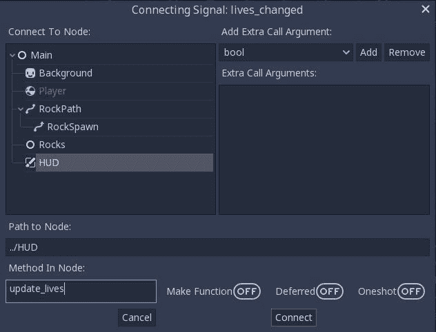

# 游戏结束

在本节中，你将使玩家检测它被岩石击中，添加一个无敌特性，并在玩家生命耗尽时结束游戏。

将 `Explosion` 的一个实例添加到 `Player`，以及一个 `Timer` 节点（命名为 `InvulnerabilityTimer`）。在检查器中，将 `InvulnerabilityTimer` 的“Wait Time”设置为 `2` 并将其 One Shot 设置为开启。将此添加到 `Player.gd` 的顶部：

```cpp
signal dead
```

此信号将通知 `Main` 场景玩家生命耗尽且游戏结束。在此之前，你需要更新状态机以在每个状态下做更多的事情：

```cpp
func change_state(new_state):
    match new_state:
        INIT:
            $CollisionShape2D.disabled = true
            $Sprite.modulate.a = 0.5
        ALIVE:
            $CollisionShape2D.disabled = false
            $Sprite.modulate.a = 1.0
        INVULNERABLE:
            $CollisionShape2D.disabled = true
            $Sprite.modulate.a = 0.5
            $InvulnerabilityTimer.start()
        DEAD:
            $CollisionShape2D.disabled = true
            $Sprite.hide()
            linear_velocity = Vector2()
            emit_signal("dead")
    state = new_state
```

一个精灵的 `modulate.a` 属性设置了其 alpha 通道（透明度）。将其设置为 `0.5` 使其半透明，而 `1.0` 是不透明的。

进入 `INVULNERABLE` 状态后，你开始 `InvulnerabilityTimer`。连接其 `timeout` 信号：

```cpp
func _on_InvulnerabilityTimer_timeout():
    change_state(ALIVE)
```

此外，像在 `Rock` 场景中那样连接 `Explosion` 动画的 `animation_finished` 信号：

```cpp
func _on_AnimationPlayer_animation_finished( name ):
    $Explosion.hide()
```

# 检测物理实体之间的碰撞

当你飞行时，玩家飞船会从岩石上弹开，因为这两个物体都是`RigidBody2D`节点。然而，如果你想当两个刚体碰撞时发生某些事情，你需要启用接触监控。选择`Player`节点，并在检查器中设置接触监控为开启。默认情况下，不会报告任何接触，因此你还必须将接触报告设置为`1`。现在，当身体接触另一个身体时，它将发出信号。点击节点标签页，并连接`body_entered`信号：

```cpp
func _on_Player_body_entered( body ):
    if body.is_in_group('rocks'):
        body.explode()
        $Explosion.show()
        $Explosion/AnimationPlayer.play("explosion")
        self.lives -= 1
        if lives <= 0:
            change_state(DEAD)
        else:
            change_state(INVULNERABLE)
```

现在，转到`主`场景，并将玩家的`死亡`信号连接到`game_over()`函数。玩玩游戏，尝试撞上岩石。你的飞船应该会爆炸，变得无敌（两秒钟），并失去一条生命。检查如果你被击中三次，游戏是否会结束。

# 暂停游戏

许多游戏都需要某种暂停模式，以便玩家在动作中休息。在 Godot 中，暂停是场景树的一个功能，可以使用`get_tree().paused = true`来设置。当`SceneTree`暂停时，会发生三件事：

+   物理线程停止运行

+   `_process`和`_physics_process`不再被调用，因此那些方法中的代码不再运行

+   `_input`和`_input_event`也没有被调用

当暂停模式被触发时，正在运行的游戏中的每个节点都可以根据你的配置做出相应的反应。这种行为是通过节点的暂停/模式属性设置的，你可以在检查器列表的最底部找到它。

暂停模式可以设置为三个值：`INHERIT`（默认值）、`STOP`和`PROCESS`。`STOP`表示在树暂停时节点将停止处理，而`PROCESS`将节点设置为继续运行，忽略树的暂停状态。由于在游戏中为每个节点设置此属性会很麻烦，`INHERIT`允许节点使用与父节点相同的暂停模式。

打开输入映射标签页（在项目设置中），创建一个新的输入动作，命名为`pause`。选择你想要用来切换暂停模式的键；例如，P 是一个不错的选择。

接下来，将以下函数添加到`Main.gd`中，以响应输入动作：

```cpp
func _input(event):
    if event.is_action_pressed('pause'):
        if not playing:
            return
    get_tree().paused = not get_tree().paused
    if get_tree().paused:
        $HUD/MessageLabel.text = "Paused"
        $HUD/MessageLabel.show()
    else:
        $HUD/MessageLabel.text = ""
        $HUD/MessageLabel.hide()
```

如果你现在运行游戏，你会遇到问题——所有节点都处于暂停状态，包括`Main`。这意味着由于它没有处理`_input`，它无法再次检测输入来暂停游戏！为了解决这个问题，你需要将`Main`的`Pause/Mode`设置为`PROCESS`。现在，你遇到了相反的问题：`Main`下面的所有节点都继承了这个设置。这对大多数节点来说是可以的，但你需要在这三个节点上设置模式为`STOP`：`Player`、`Rocks`和`HUD`。

# 敌人

空间中充满了比岩石更多的危险。在本节中，你将创建一个会定期出现并向玩家开火的敌人士兵飞船。

# 沿着路径移动

当敌人出现时，它应该在屏幕上跟随一条路径。为了防止它看起来过于重复，你可以创建多条路径，并在敌人开始时随机选择一条。

创建一个新的场景并添加一个 `Node`。将其命名为 `EnemyPaths` 并保存场景。要绘制路径，添加一个 `Path2D` 节点。正如您之前所看到的，此节点允许您绘制一系列连接的点。添加节点时，会出现一个新的菜单栏：


这些按钮允许您绘制和修改路径的点。点击带有 + 符号的按钮以添加点。点击以在游戏窗口（蓝色紫色矩形）的外侧开始路径，然后点击几个更多点以创建一个曲线。暂时不用担心让它变得平滑：

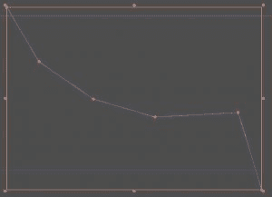

当敌舰跟随路径时，当它遇到尖锐的角落时，看起来不会非常平滑。为了平滑曲线，点击路径工具栏中的第二个按钮（其工具提示说选择控制点）。现在，如果您点击并拖动曲线的任何点，您将添加一个控制点，允许您调整线和曲线的角度。平滑前面的线会产生类似这样的效果：

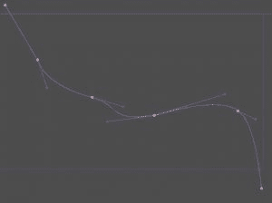

向场景中添加更多 `Path2D` 节点，并按照您喜欢的样式绘制路径。添加循环和曲线而不是直线会使敌人看起来更加动态（并且更难被击中）。请记住，您点击的第一个点将是路径的起点，因此请确保将它们放置在屏幕的不同侧面，以增加多样性。以下是一些示例路径：

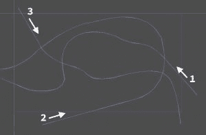

保存场景。您将将其添加到敌人的场景中，以提供它可以跟随的路径。

# 敌人场景

为敌人创建一个新的场景，使用 `Area2D` 作为其根节点。添加一个 `Sprite` 并使用 `res://assets/enemy_saucer.png` 作为其纹理。将动画/帧数设置为 `3` 以便在不同颜色的飞船之间进行选择：


如您之前所做的那样，添加一个 `CollisionShape2D` 并将其 `CircleShape2D` 缩放以覆盖精灵图像。接下来，添加一个 `EnemyPaths` 场景实例和一个 `AnimationPlayer`。在 `AnimationPlayer` 中，您需要两个动画：一个用于使飞碟在移动时旋转，另一个用于当飞碟被击中时产生闪光效果：

+   **旋转动画**：添加一个名为 `rotate` 的新动画，并将其 *长度* 设置为 `3`。在将 `Sprite` 的 Transform/Rotation Degrees 属性设置为 `0` 后，添加一个关键帧，然后将播放条拖动到末尾并添加一个旋转设置为 `360` 的关键帧。点击循环按钮和自动播放按钮。

+   **击中动画**：添加一个名为 `flash` 的第二个动画。将其 *长度* 设置为 `0.25`，将 *步长* 设置为 `0.01`。您将动画化的属性是精灵的 Modulate（在 *可见性* 下找到）。为 Modulate 添加一个关键帧以创建轨迹，然后将刮擦器移动到 `0.04` 并将 Modulate 颜色更改为红色。再向前移动 `0.04` 并将颜色改回白色。

重复此过程两次，以便总共有三个闪光效果。

如同其他对象一样，添加`Explosion`场景的实例。同样，就像岩石一样，连接爆炸的`AnimationPlayer`的`animation_finished`信号，并在爆炸完成后删除敌人：

```cpp
func _on_AnimationPlayer_animation_finished(anim_name):
    queue_free()
```

接下来，添加一个名为`GunTimer`的`Timer`节点，它将控制敌人射击玩家的频率。将其等待时间设置为`1.5`，自动启动设置为`On`。连接其`timeout`信号，但现在请保留代码读取为`pass`。

最后，点击`Area2D`和节点标签，并将其添加到名为`enemies`的组中。就像岩石一样，这将为你提供一种识别对象的方法，即使屏幕上同时有多个敌人。

# 移动敌人

将脚本附加到`Enemy`场景。首先，你将编写选择路径并使敌人沿着该路径移动的代码：

```cpp
extends Area2D

signal shoot

export (PackedScene) var Bullet
export (int) var speed = 150
export (int) var health = 3

var follow
var target = null

func _ready():
    $Sprite.frame = randi() % 3
    var path = $EnemyPaths.get_children()[randi() % $EnemyPaths.get_child_count()]
    follow = PathFollow2D.new()
    path.add_child(follow)
    follow.loop = false
```

`PathFollow2D`节点是一种可以自动沿着父`Path2D`移动的节点。默认情况下，它设置为在路径上循环，因此你需要手动将属性设置为`false`。

下一步是沿着路径移动：

```cpp
func _process(delta):
    follow.offset += speed * delta
    position = follow.global_position
    if follow.unit_offset > 1:
        queue_free()
```

当`offset`大于路径总长度时，你可以检测路径的结束。然而，使用`unit_offset`会更简单，它在路径长度上从零变化到一。

# 生成敌人

打开`Main`场景，并添加一个名为`EnemyTimer`的`Timer`节点。将其一次性属性设置为`On`。然后，在`Main.gd`中添加一个变量来引用你的敌人场景（在保存脚本后将其拖动到检查器中）：

```cpp
export (PackedScene) var Enemy
```

将以下代码添加到`new_level()`中：

```cpp
$EnemyTimer.wait_time = rand_range(5, 10)
$EnemyTimer.start()
```

连接`EnemyTimer`的`timeout`信号，并添加以下内容：

```cpp
func _on_EnemyTimer_timeout():
    var e = Enemy.instance()
    add_child(e)
    e.target = $Player
    e.connect('shoot', self, '_on_Player_shoot')
    $EnemyTimer.wait_time = rand_range(20, 40)
    $EnemyTimer.start()
```

当`EnemyTimer`计时器超时时，此代码实例化敌人。当你给敌人添加射击功能时，它将使用与`Player`相同的流程，因此你可以重用相同的子弹生成函数，即`_on_Player_shoot()`。

玩这个游戏，你应该会看到一个飞碟出现在你的路径之一上。

# 敌人射击和碰撞

敌人需要射击玩家，并且当被玩家或玩家的子弹击中时也要做出反应。

打开`Bullet`场景，并将其另存为`EnemyBullet.tscn`（之后，别忘了将根节点也重命名）。通过选择根节点并点击清除脚本按钮来删除脚本：

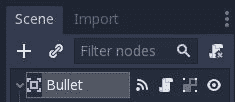

你还需要通过点击节点标签并选择断开连接来断开信号连接：

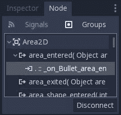

在`assets`文件夹中还有一个不同的纹理，你可以使用它使敌人子弹看起来与玩家的子弹不同。

此脚本将与普通子弹非常相似。连接区域的`body_entered`信号和`VisibilityNotifier2D`的`screen_exited`信号：

```cpp
extends Area2D

export (int) var speed

var velocity = Vector2()

func start(_position, _direction):
    position = _position
    velocity = Vector2(speed, 0).rotated(_direction)
    rotation = _direction

func _process(delta):
    position += velocity * delta

func _on_EnemyBullet_body_entered(body):
    queue_free()

func _on_VisibilityNotifier2D_screen_exited():
    queue_free()
```

目前，子弹对玩家不会造成任何伤害。你将在下一节中为玩家添加护盾，因此你可以同时添加它。

保存场景，并将其拖动到`Enemy`的`Bullet`属性上。

在`Enemy.gd`中添加`shoot`函数：

```cpp
func shoot():
    var dir = target.global_position - global_position
    dir = dir.rotated(rand_range(-0.1, 0.1)).angle()
    emit_signal('shoot', Bullet, global_position, dir)
```

首先，你必须找到指向玩家位置的向量，然后给它添加一点随机性，这样子弹就不会沿着完全相同的路径飞行。

为了增加挑战，你可以让敌人以*脉冲*的形式射击，或者进行多次快速射击：

```cpp
func shoot_pulse(n, delay):
    for i in range(n):
        shoot()
        yield(get_tree().create_timer(delay), 'timeout')
```

这个函数创建了一定数量的子弹，它们之间有`delay`时间间隔。你可以使用这个函数 whenever the `GunTimer` 触发射击：

```cpp
func _on_GunTimer_timeout():
    shoot_pulse(3, 0.15)
```

这将发射一串`3`个子弹，它们之间有`0.15`秒的间隔。很难躲避！

接下来，当敌人被玩家的射击击中时，它需要受到伤害。它将使用你制作的动画闪烁，然后当其健康值达到`0`时爆炸。

将以下功能添加到`Enemy.gd`中：

```cpp
func take_damage(amount):
    health -= amount
    $AnimationPlayer.play('flash')
    if health <= 0:
        explode()
    yield($AnimationPlayer, 'animation_finished')
    $AnimationPlayer.play('rotate')

func explode():
    speed = 0
    $GunTimer.stop()
    $CollisionShape2D.disabled = true
    $Sprite.hide()
    $Explosion.show()
    $Explosion/AnimationPlayer.play("explosion")
    $ExplodeSound.play()
```

此外，连接区域的`body_entered`信号，这样当玩家撞到敌人时，敌人会爆炸：

```cpp
func _on_Enemy_body_entered(body):
    if body.name == 'Player':
        pass
    explode()
```

再次强调，你正在等待玩家护盾将伤害添加到玩家身上，所以现在暂时留下`pass`占位符。

目前，玩家的子弹只检测物理体，因为它的`body_entered`信号已连接。然而，敌人是一个`Area2D`，所以它不会触发该信号。为了检测敌人，你还需要连接`area_entered`信号：

```cpp
func _on_Bullet_area_entered(area):
    if area.is_in_group('enemies'):
        area.take_damage(1)
    queue_free()
```

再次尝试玩游戏，你将与一个侵略性的外星对手战斗！验证所有碰撞组合是否被处理。此外，请注意敌人的子弹可以被岩石阻挡——也许你可以躲在它们后面作为掩护！

# 额外功能

游戏的结构已经完成。你可以开始游戏，玩一遍，当它结束时，再次玩。在本节中，你将添加一些额外的效果和功能来改善游戏体验。效果是一个广泛的概念，可以指许多不同的技术，但在这个案例中，你将具体解决三件事：

+   **音效和音乐：**音频往往被忽视，但可以是游戏设计中非常有效的部分。好的音效可以提升游戏的*感觉*。糟糕或令人讨厌的声音可能会引起无聊或挫败感。你将添加一些充满动作的背景音乐，以及游戏中几个动作的声音效果。

+   **粒子效果：**粒子效果是图像，通常是小的，由粒子系统生成并动画化。它们可以用于无数令人印象深刻的视觉效果。Godot 的粒子系统非常强大；在这里完全探索它可能过于强大，但你会学到足够的知识来开始实验。

+   **玩家护盾：**如果你觉得游戏太难，尤其是在有大量岩石的高级关卡中，给玩家添加一个护盾将大大提高你的生存机会。你还可以让大岩石对护盾造成的伤害比小岩石更多。你还会在 HUD 上制作一个漂亮的显示条，以显示玩家剩余的护盾等级。

# 音频/音乐

在`res://assets/sounds`文件夹中，有几个包含不同 OggVorbis 格式声音的音频文件。默认情况下，Godot 会将导入的`.ogg`文件设置为循环播放。在`explosion.ogg`、`laser_blast.ogg`和`levelup.ogg`的情况下，你不想让声音循环，因此需要更改这些文件的导入设置。为此，在文件系统窗口中选择文件，然后点击位于编辑器窗口右侧场景标签旁边的导入标签。取消循环旁边的框，然后点击重新导入。为这三个声音都这样做。参考以下截图：


要播放声音，需要通过`AudioStreamPlayer`节点加载。在`Player`场景中添加两个这样的节点，分别命名为`LaserSound`和`EngineSound`。将相应的声音拖入每个节点的 Stream 属性中，在检查器中进行操作。要在射击时播放声音，请将以下行添加到`Player.gd`中的`shoot()`函数：

```cpp
$LaserSound.play()
```

播玩游戏并尝试射击。如果你觉得声音有点响，可以调整 Volume Db 属性。尝试使用`-10`的值。

引擎声音的工作方式略有不同。它需要在推力开启时播放，但如果你尝试在`get_input()`函数中直接`play()`声音，只要按下输入，声音就会在每一帧重新开始播放。这听起来不太好，所以你只想在声音尚未播放时开始播放。以下是`get_input()`函数中的相关部分：

```cpp
if Input.is_action_pressed("thrust"):
    thrust = Vector2(engine_power, 0)
    if not $EngineSound.playing:
        $EngineSound.play()
 else:
     $EngineSound.stop()
```

注意，如果玩家在按住推力键的情况下死亡，引擎声音会卡在播放状态。这可以通过在`change_state()`函数中的`DEAD`状态添加`$EngineSound.stop()`来解决。

在`Main`场景中，添加三个额外的`AudioStreamPlayer`节点：`ExplodeSound`、`LevelupSound`和`Music`。在它们的 Stream 属性中，分别放置`explosion.ogg`、`levelup.ogg`和`Funky-Gameplay_Looping.ogg`。

在`_on_Rock_exploded()`的第一行添加`$ExplodeSound.play()`，并将`$LevelupSound.play()`添加到`new_level()`中。

要开始/停止音乐，请在`new_game()`中添加`$Music.play()`，在`game_over()`中添加`$Music.stop()`。

敌人也需要一个`ExplodeSound`和一个`ShootSound`。你可以使用与玩家相同的爆炸声，但有一个`enemy_laser.wav`声音用于射击。

# 粒子

玩家飞船的推力是使用粒子效果的完美例子，可以从引擎中创建一条流动的火焰。在`Player`场景中添加一个`Particles2D`节点，并将其命名为`Exhaust`。你可能需要在执行这部分操作时放大飞船图像。

当首次创建时，`Particles2D`节点有一个警告：*未分配处理粒子的材质*。粒子将不会发射，直到你在检查器中分配一个`Process Material`。有两种类型的材质：`ShaderMaterial`和`ParticlesMaterial`。`ShaderMaterial`允许你用类似 GLSL 的语言编写着色器代码，而`ParticlesMaterial`在检查器中配置。在`Particles Material`旁边点击向下箭头，然后选择“新建 ParticlesMaterial”。

你会看到从玩家飞船中心流下的一行白色点。你现在的挑战是将这些点变成尾气火焰。

在配置粒子时，有非常多的属性可供选择，尤其是在`ParticlesMaterial`下。在开始之前，设置这些`Particles2D`的属性：

+   数量：`25`

+   变换/位置：*`(-28, 0)`

+   变换/旋转：`180`

+   可见性/显示在父级之后：`开启`

现在，点击`ParticlesMaterial`。这是你找到影响粒子行为的大多数属性的地方。从发射形状开始——将其更改为框。这将揭示框范围，应设置为`(1, 5, 1)`。现在，粒子是在一个小区域内发射，而不是从单个点发射。

接下来，将扩散/扩散设置为`0`，将重力/重力设置为`(0, 0, 0)`。现在，粒子不会下落或扩散，但它们移动得非常慢。

下一个属性是初始速度。将速度设置为`400`。然后，向下滚动到缩放并设置为`8`。

要使大小随时间变化，你可以设置一个缩放曲线。点击“新建曲线纹理”并点击它。会出现一个新的标签为“曲线”的面板。左侧的点代表起始缩放，右侧的点代表结束。将右侧的点向下拖动，直到你的曲线看起来像这样：


现在，粒子随着年龄的增长而缩小。点击检查器顶部的左箭头返回上一部分。

最后要调整的部分是颜色。为了让粒子看起来像火焰，粒子应该从明亮的橙黄色开始，逐渐变为红色，同时逐渐消失。在颜色渐变属性中，点击“新建渐变纹理”。然后，在渐变属性中，选择“新建渐变”：


标有 1 和 2 的滑块选择起始和结束颜色，而 3 显示当前所选滑块上设置的颜色。点击滑块 1，然后点击 3 选择橙色，然后点击滑块 2 并将其设置为深红色。

现在我们已经可以看到粒子在做什么了，它们持续的时间太长了。回到`Exhaust`节点，将寿命改为`0.1`。

希望你的飞船尾气看起来有点像火焰。如果不像，请随意调整`ParticlesMaterial`属性，直到你满意为止。

现在船的`Exhaust`已配置，需要根据玩家输入开启/关闭。转到玩家脚本，并在`get_input()`的开始处添加`$Exhaust.emitting = false`。然后，在检查推力输入的`if`语句下添加`$Exhaust.emitting = true`。

# 敌人轨迹

你也可以使用粒子在敌人后面创建轨迹效果。将`Particles2D`添加到敌人场景中，并设置以下属性：

+   数量：`20`

+   本地坐标：`Off`

+   纹理：`res://assets/corona.png`

+   在父元素后面显示：`On`

注意你使用的纹理效果是白色背景上的白色。这张图片需要更改其混合模式。为此，在粒子节点上，找到材质属性（它在`CanvasItem`部分）。选择新的`CanvasItemMaterial`，然后在生成的材质中，将混合模式更改为`Add`。

现在，创建一个`ParticlesMaterial`，就像你之前所做的那样，并使用以下设置：

+   发射形状：

    +   形状：Box

    +   箱体范围：(`25`, `25`, `1`)

+   扫描范围：`25`

+   重力：(0, 0, 0)

现在，创建一个`ScaleCurve`，就像你为玩家排气所做的那样。这次，使曲线看起来像以下这样：


尝试运行游戏并查看效果。你可以随意调整设置，直到你满意为止。

# 玩家护盾

在本节中，你将为玩家添加一个护盾，并在`HUD`中添加一个显示当前护盾等级的显示元素。

首先，将以下内容添加到`Player.gd`脚本的顶部：

```cpp
signal shield_changed

export (int) var max_shield
export (float) var shield_regen

var shield = 0 setget set_shield
```

`shield`变量将类似于`lives`，每当它改变时都会向`HUD`发送信号。保存脚本，并在检查器中将`max_shield`设置为`100`，将`shield_regen`设置为`5`。

接下来，添加以下函数，该函数处理更改护盾值：

```cpp
func set_shield(value):
    if value > max_shield:
        value = max_shield
    shield = value
    emit_signal("shield_changed", shield/max_shield)
    if shield <= 0:
        self.lives -= 1
```

此外，由于一些事情，如再生，可能会增加护盾的值，你需要确保它不会超过最大允许值。然后，当你发送`shield_changed`信号时，传递`shield/max_shield`的比率。这样，HUD 的显示就不需要了解实际值，只需了解护盾的相对状态。

将此行添加到`start()`和`set_lives()`中：

```cpp
    self.shield = max_shield
```

击中岩石会损坏护盾，较大的岩石应该造成更多伤害：

```cpp
func _on_Player_body_entered( body ):
    if body.is_in_group('rocks'):
        body.explode()
        $Explosion.show()
        $Explosion/AnimationPlayer.play("explosion")
        self.shield -= body.size * 25
```

敌人的子弹也应该造成伤害，所以更新`EnemyBullet.gd`中的以下内容：

```cpp
func _on_EnemyBullet_body_entered(body):
    if body.name == 'Player':
        body.shield -= 15
    queue_free()
```

此外，撞到敌人应该会伤害玩家，所以更新`Enemy.gd`中的以下内容：

```cpp
func _on_Enemy_body_entered(body):
    if body.name == 'Player':
        body.shield -= 50
        explode()
```

玩家脚本中的最后一个添加是每帧再生护盾。将此行添加到`_process()`中：

```cpp
    self.shield += shield_regen * delta
```

下一步是向`HUD`添加显示元素。而不是在`Label`中显示护盾的值，你将使用`TextureProgress`节点。这是一个`Control`节点，它是一种`ProgressBar`：一个显示给定值的填充条的节点。`TextureProgress`节点允许你为条形显示分配纹理。

在现有的`HBoxContainer`中添加`TextureRect`和`TextureProgress`。将它们放置在`ScoreLabel`之后和`LivesCounter`之前。将`TextureProgress`的名称改为 ShieldBar。你的节点设置应该看起来像这样：

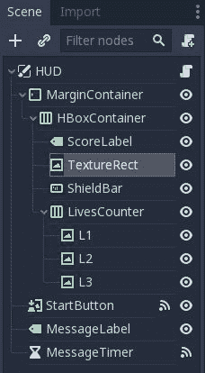

将`res://assets/shield_gold.png`纹理拖动到`TextureRect`的`Texture`属性中。这将是一个图标，表示条形显示的内容。

ShieldBar 有三个纹理属性：Under、Over 和 Progress。Progress 是作为条形值显示的纹理。将`res://assets/barHorizontal_green_mid 200.png`拖动到这个属性中。其他两个纹理属性允许你通过设置图像来自定义外观，该图像将被绘制在进度纹理的下方或上方。将`res://assets/glassPanel_200.png`拖动到`Over`纹理属性中。

在`范围`部分，你可以设置条形的数值属性。最小值`Min Value`和最大值`Max Value`应设置为`0`和`100`，因为这条条形将显示护盾的百分比值，而不是其原始值。值是控制当前显示填充值的属性。将其更改为`75`以查看条形部分填充。同时，设置其水平大小标志为填充、扩展。

现在，你可以更新 HUD 脚本以控制护盾条。在顶部添加以下变量：

```cpp
onready var ShieldBar = $MarginContainer/HBoxContainer/ShieldBar
var red_bar = preload("res://assets/barHorizontal_red_mid 200.png")
var green_bar = preload("res://assets/barHorizontal_green_mid 200.png")
var yellow_bar = preload("res://assets/barHorizontal_yellow_mid 200.png")
```

除了绿色的条形纹理外，你还在`assets`文件夹中有红色和黄色的条形。这将允许你随着值的降低改变护盾的颜色。以这种方式加载纹理使得在脚本中稍后更容易访问，当你想要为`TextureProgress`节点分配适当的图像时：

```cpp
func update_shield(value):
    ShieldBar.texture_progress = green_bar
    if value < 40:
        ShieldBar.texture_progress = red_bar
    elif value < 70:
        ShieldBar.texture_progress = yellow_bar
    ShieldBar.value = value
```

最后，点击`Main`场景的`Player`节点，并将`shield_changed`信号连接到你刚刚创建的`update_shield()`函数。运行游戏并验证你是否能看到护盾并且它正在工作。你可能想要增加或减少再生速率以调整到你喜欢的高速。

# 摘要

在本章中，你学习了如何使用`RigidBody2D`节点，并更深入地了解了 Godot 物理的工作原理。你还实现了一个基本的有限状态机——随着你的项目越来越大，你会发现它越来越有用。你看到了`Container`节点如何帮助组织和保持 UI 节点对齐。最后，你添加了一些音效，并通过使用`AnimationPlayer`和`Particles2D`节点，第一次尝到了高级视觉效果的滋味。

你还使用标准的 Godot 层次结构创建了许多游戏对象，例如将`CollisionShapes`附加到`CollisionObjects`。在这个阶段，一些这些节点配置应该开始对你来说变得熟悉。

在继续之前，再次查看项目。播放它。确保你理解每个场景在做什么，并阅读脚本以回顾一切是如何连接在一起的。

在下一章中，你将学习关于运动体，并使用它们来创建一个侧滚动平台游戏。
