# 第六章：3D 迷你高尔夫

这本书中的前几个项目都是在 2D 空间中设计的。这是故意的，为了在保持项目范围有限的同时介绍 Godot 的各种功能和概念。在本章中，你将进入游戏开发的 3D 方面。对于一些人来说，3D 开发感觉管理起来要困难得多；对于另一些人来说，它则更为直接。无论如何，你确实需要理解一个额外的复杂性层次。

如果你之前从未使用过任何类型的 3D 软件，你可能会发现自己遇到了许多新概念。本章将尽可能多地解释它们，但请记住，在需要更深入理解特定主题时，要参考 Godot 文档。

本章中你将制作的游戏被称为**迷你高尔夫**。这包括一个小型可定制的球场、一个球和一个瞄准并射击球向洞的方向的界面。

这是本章你将学习的内容：

+   导航 Godot 的 3D 编辑器

+   空间节点及其属性

+   导入 3D 网格并使用 3D 碰撞形状

+   如何使用 3D 相机，包括静止的和移动的

+   使用 GridMap 放置你的高尔夫球场的瓷砖

+   设置照明和环境

+   PBR 渲染和材质简介

但首先，这里是对 Godot 中 3D 的简要介绍。

# 3D 简介

Godot 的一个优点是它能够处理 2D 和 3D 游戏。虽然你在这本书中之前学到的许多内容在 3D 中同样适用（节点、场景、信号等），但从 2D 到 3D 的转变会带来全新的复杂性和功能。首先，你会发现 3D 编辑器窗口中有一些额外的功能，熟悉如何在 3D 编辑器窗口中导航是个好主意。

# 在 3D 空间中的定位

当你在编辑器窗口顶部的 3D 按钮上点击时，你会看到 3D 项目视图：

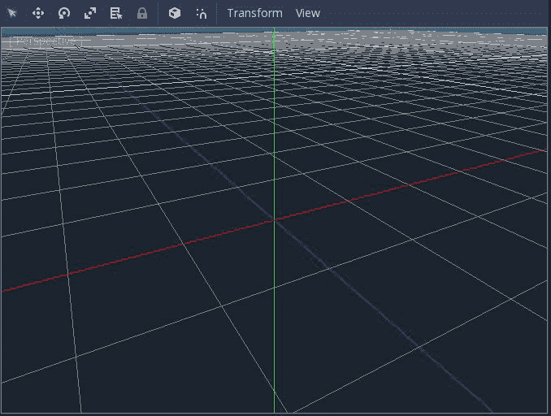

你首先应该注意到的是中心的三条彩色线条。这些是*x*（红色）、*y*（绿色）和*z*（蓝色）轴。它们相交的点就是原点，坐标为`(0, 0, 0)`。

就像你使用`Vector2(x, y)`来表示二维空间中的一个位置一样，`Vector3(x, y, z)`描述了沿着这三个轴的三维空间中的一个位置。

在 3D 环境中工作时，会出现的一个问题是不同的应用程序使用不同的方向约定。Godot 使用 Y-Up 方向，因此当查看坐标轴时，如果*x*指向左/右，那么*y*就是上/下，而*z*是前/后。你可能在使用其他流行的 3D 软件时会发现它们使用 Z-Up。了解这一点是好的，因为它在在不同程序之间移动时可能会导致混淆。

另一个需要注意的主要方面是度量单位。在 2D 中，所有内容都是以像素为单位测量的，这在屏幕上绘制时是一个自然的度量基础。然而，当在 3D 空间中工作时，像素并不太有用。两个大小完全相同的对象，根据它们与摄像机的距离不同，将在屏幕上占据不同的区域（关于摄像机的更多信息即将揭晓）。因此，在 3D 空间中，Godot 中的所有对象都使用通用单位进行测量。您可以自由地称这些单位为米、英寸，甚至光年，具体取决于您游戏世界的规模。

# Godot 的 3D 编辑器

在开始使用 3D 之前，简要回顾如何在 Godot 的 3D 空间中导航将很有用。相机由鼠标和键盘控制：

+   鼠标滚轮向上/向下：缩放

+   中间按钮 + 拖动：围绕当前目标旋转相机

+   *Shift* + 中间按钮 + 拖动：上下/左右平移相机

+   右键点击 + 拖动：在当前位置旋转相机

如果您熟悉像*Minecraft*这样的流行 3D 游戏，您可以按*Shift* + *F*切换到 Freelook 模式。在此模式下，您可以使用 WASD 键在场景中*飞行*，同时用鼠标瞄准。再次按*Shift* + *F*退出 Freelook 模式。

您还可以通过点击左上角的[视角]标签来改变相机的视图。在这里，您可以快速定位相机到特定的方向，如俯视图或前视图：

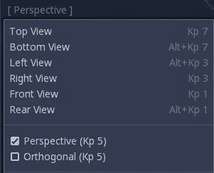

这在结合使用多个视口的大屏幕上尤其有用。点击视图菜单，您可以将屏幕分割成多个空间视图，让您能够同时从各个侧面看到对象。

注意，这些菜单选项中的每一个都有一个与之关联的键盘快捷键。您可以通过点击编辑器 *|* 编辑器设置 *|* 3D 来调整 3D 导航和快捷键，以满足您的需求。

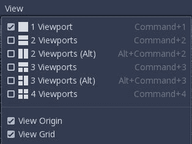

当使用多个视口时，每个视口都可以设置为不同的视角，这样您就可以同时从多个方向看到您动作的效果：


# 添加 3D 对象

是时候添加您的第一个 3D 节点了。就像所有 2D 节点都继承自`Node2D`，它提供了如`position`和`rotation`等属性一样，3D 节点继承自`Spatial`节点。将一个添加到场景中，您将看到以下内容：

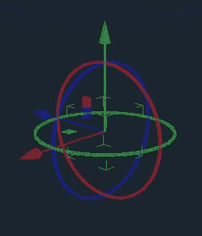

您看到的那个彩色对象不是节点，而是一个 3D *gizmo*。Gizmos 是允许您在空间中移动和旋转对象的工具。三个环控制旋转，而三个箭头沿着三个轴移动（平移）对象。请注意，环和箭头是按照轴的颜色进行编码的。箭头沿着相应的轴移动对象，而环则围绕特定的轴旋转对象。还有三个小方块可以锁定一个轴，并允许您在单个平面上移动对象。

花几分钟时间进行实验，熟悉小工具。如果你发现自己迷失了方向，请使用撤销。

有时，小工具会碍事。你可以点击模式图标来限制自己只进行一种类型的变换：移动、旋转或缩放：

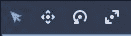

*Q*、*W*、*E*和*R*键是这些按钮的快捷键，允许快速在模式之间切换。

# 全局空间与局部空间

默认情况下，小工具控件在全局空间中操作。尝试旋转对象。无论你如何转动它，小工具的运动箭头仍然沿着轴指向。现在试试这个：将`Spatial`节点放回其原始位置和方向（或者删除它并添加一个新的）。围绕一个轴旋转对象，然后点击局部空间模式（T）按钮：

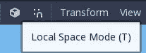

观察小工具箭头发生了什么。现在它们指向的是对象的局部*x*/*y*/*z*轴，而不是世界轴。当你点击并拖动它们时，它们会相对于轴移动对象。在这些两种模式之间切换可以使放置对象精确到想要的位置变得容易得多。

# 变换

查看你的`Spatial`节点的检查器。现在你有了平移、旋转度数以及缩放，而不是位置属性。当你移动对象时，观察这些值如何变化。注意，平移表示对象相对于原点的坐标：

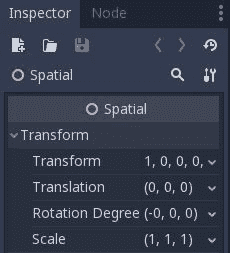

你还会注意到一个变换属性，它也会随着你移动和旋转对象而改变。当你改变平移或旋转时，你会注意到 12 个变换量也会相应改变。

变换背后的数学解释超出了本书的范围，但简单来说，变换是一个*矩阵*，它同时描述了一个对象的平移、旋转和缩放。你之前在本书中的 Space Rocks 游戏中简要使用过 2D 等价物，但这个概念在 3D 中应用得更广泛。

# 代码中的变换

当通过代码定位 3D 节点时，你可以访问其`transform`和`global_transform`属性，它们是`Transform`对象。`Transform`有两个子属性：`origin`和`basis`。`origin`表示物体相对于其父物体的原点或全局原点的偏移。`basis`属性包含三个向量，这些向量定义了一个与物体一起移动的局部坐标系。当你处于局部空间模式时，想想小工具中的三个轴箭头。

你将在本节后面了解更多关于如何使用 3D 变换的信息。

# 网格

就像`Node2D`一样，`Spatial`节点本身没有大小或外观。在 2D 中，你添加了一个 Sprite 来为节点分配纹理。在 3D 中，你需要添加一个*网格*。网格是形状的数学描述。它由一组称为*顶点*的点组成。这些顶点通过称为*边*的线连接起来，多个边（至少三个）共同构成一个*面*：

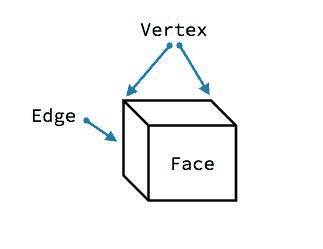

例如，一个立方体由八个顶点、十二条边和六个面组成。

如果你曾经使用过 3D 设计软件，这对你来说将非常熟悉。如果你没有，并且你对学习 3D 建模感兴趣，Blender 是一个非常流行的开源工具，用于设计 3D 对象。你可以在互联网上找到许多教程和课程，帮助你开始使用 Blender。

# 导入网格

无论你使用什么建模软件，你都需要以 Godot 可读的格式导出你的模型。Wavefront (`.obj`) 和 Collada (`.dae`) 是最流行的。不幸的是，如果你使用 Blender，它的 Collada 导出器有一些缺陷，使其无法与 Godot 一起使用。为了解决这个问题，Godot 的开发者创建了一个名为**Better Collada Exporter**的 Blender 插件，你可以从[`godotengine.org/download`](https://godotengine.org/download)下载。

如果你的对象是其他格式，例如 FBX，你需要使用转换工具将它们保存为 OBJ 或 DAE 格式，以便与 Godot 一起使用。

一种名为 GLTF 的新格式越来越受欢迎，并且与 Collada 相比有一些显著的优势。Godot 已经支持它，所以你可以自由地尝试使用任何你找到的这种格式的模型。

# 原语

如果你没有现成的模型，或者你只需要一个简单的模型，Godot 具有直接创建某些 3D 网格的能力。将`MeshInstance`节点作为 Spatial 的子节点添加，然后在检查器中点击网格属性：

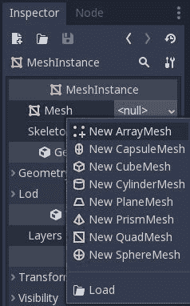

这些预定义的形状被称为*原语*，它们代表了一组方便的常用形状。你可以将这些形状用于各种目的，正如你将在本章后面看到的那样。选择“新建立方体网格”，你会在屏幕上看到一个普通的立方体。立方体本身是白色的，但由于 3D 编辑器窗口中的默认环境光，它可能在你屏幕上呈现蓝色。你将在本章后面学习如何处理光照。

# 多个网格

通常，你会发现一个由许多不同网格组成的对象。一个角色可能有其头部、躯干和四肢的单独网格。如果你有很多这种类型的对象，当引擎尝试渲染这么多网格时，可能会导致性能问题。因此，`MultiMeshInstance`被设计为提供将许多网格组合成一个单一对象的高性能方法。你可能现在还不需要它，因为在这个项目中它不是必需的，但请记住，它可能是一个以后会派上用场的工具。

# 相机

尝试运行带有你的立方体网格的场景。它在哪？在 3D 中，不使用`Camera`你将看不到游戏视口中的任何东西。添加一个相机，并使用相机的操纵杆将其定位并指向立方体，如以下截图所示：

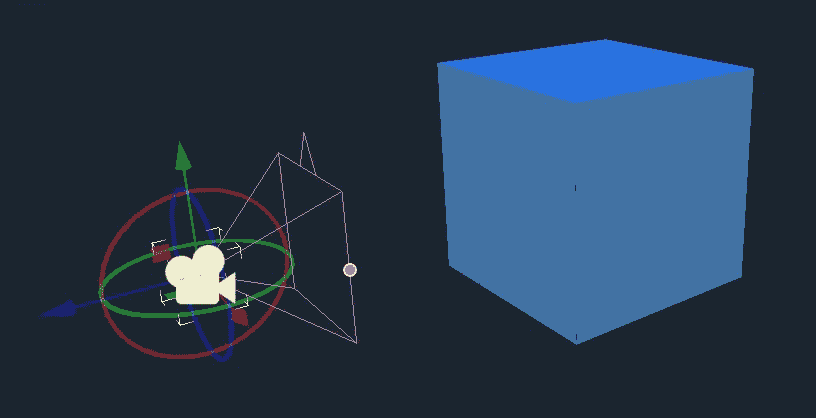

那个粉紫色、金字塔形状的物体被称为相机的 *fustrum*。它代表相机的视图，可以使其变窄或变宽以影响相机的 *视野*。fustrum 顶部的三角形箭头是相机的向上方向。

当你移动相机时，你可以使用右上角的预览按钮来检查你的目标。预览将始终显示所选相机可以看到的内容。

就像之前使用的 `Camera2D` 一样，一个 `Camera` 必须被设置为当前状态才能使其生效。它的其他属性会影响其 *视角*：视野、投影和近/远。这些属性的默认值对于这个项目来说很好，但你可以尝试调整它们，看看它们如何影响立方体的视图。完成操作后，使用撤销将一切恢复到默认值。

# 项目设置

现在你已经学会了如何在 Godot 的 3D 编辑器中导航，你准备好开始 Minigolf 项目了。与其他项目一样，从以下链接下载游戏资源，并将其解压到你的项目文件夹中。解压后的 `assets` 文件夹包含图像、3D 模型以及其他完成项目所需的资源。你可以从这里下载包含游戏艺术和声音（统称为 *assets*）的 Zip 文件，[`github.com/PacktPublishing/Godot-Game-Engine-Projects/releases`](https://github.com/PacktPublishing/Godot-Game-Engine-Projects/releases)。

这款游戏将使用左鼠标按钮作为输入。输入映射没有为这个定义任何默认动作，所以你需要添加一个。打开项目 | 项目设置，然后转到输入映射选项卡。添加一个名为点击的新动作，然后点击加号添加一个鼠标按钮事件。选择左键：

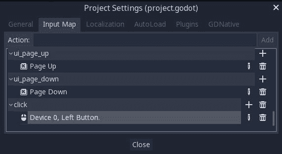

# 创建课程

对于第一个场景，添加一个名为 `Main` 的节点作为场景的根节点。这个场景将包含游戏的主要部分，从课程本身开始。首先添加一个 `GridMap` 节点来布置课程。

# 网格地图

`GridMap` 是 `TileMap` 节点的 3D 等价物，你在之前的项目中使用过。它允许你使用一组网格（包含在 `MeshLibrary` 中）并在网格中布置它们，以更快地设计环境。因为它是一个 3D 对象，你可以以任何方向堆叠网格，尽管在这个项目中，你将坚持在同一平面上。

# 创建网格库

`res://assets` 文件夹包含了一个为项目预生成的 `MeshLibrary`，其中包含所有必要的课程部分以及碰撞形状。然而，如果你需要更改它或创建自己的，你会发现这个过程与在 2D 中创建 `TileSet` 非常相似。

用于创建预生成的 `MeshLibrary` 的场景也可以在 `res://assets` 文件夹中找到。它的名字是 `course_tiles_edit1.tscn`。你可以随意打开它，看看它是如何设置的。

首先创建一个新的场景，以 `Spatial` 作为其根节点。向此节点添加任意数量的 `MeshInstance`。您可以在 `res://assets/dae` 文件夹中找到原始的课程网格，这些网格是从 Blender 导出的。

您给这些节点取的名字将是它们在 `MeshLibrary` 中的名字。

一旦添加了网格，就需要为它们添加静态碰撞体。创建与给定网格匹配的碰撞形状可能很复杂，但 Godot 有一种自动生成它们的方法。

选择一个网格，您将在编辑器窗口的顶部看到一个 `Mesh` 菜单：

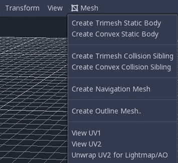

选择创建三角形静态体和 Godot 将创建一个 `StaticBody` 并使用网格数据添加一个 `CollisionShape`：

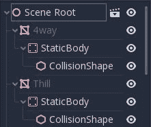

对每个网格对象都这样做，然后选择场景 | 转换到 | 网格库以保存资源。

# 绘制课程

将 `MeshLibrary` (`res://assets/course_tiles.tres` 或您创建的版本) 拖入检查器中 `GridMap` 的主题属性。同时，确保单元格/大小属性设置为 `(2, 2, 2)`：

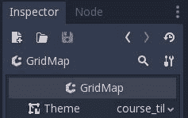

通过从右侧的列表中选择瓦片块并在编辑器窗口中左键单击来绘制。通过按 *S* 可以围绕 y 轴旋转一个块。要删除瓦片，请使用 *Shift* + 右键单击。

目前，坚持使用简单的课程；当一切正常工作时，您可以在以后变得花哨。别忘了洞！

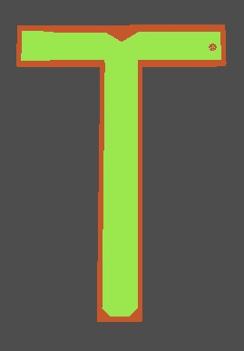

现在，是时候看看当游戏运行时这会是什么样子了。向场景中添加一个 `Camera`。将其向上移动并调整角度，使其向下看课程。记住，您可以使用预览按钮来检查摄像机看到的内容。

运行场景。您会看到一切似乎都非常暗。默认情况下，场景中环境光最少。要更清楚地看到，您需要添加更多光源。

# WorldEnvironment

照明是一个独立的复杂主题。决定灯光的位置以及如何设置它们的颜色和强度可以显著影响场景的外观。

Godot 在 3D 中提供了三个照明节点：

+   `OmniLight`：用于从所有方向发射的光，例如来自灯泡或蜡烛

+   `DirectionalLight`：来自遥远来源的无限光源，例如阳光

+   `SpotLight`：来自单个光源的方向性光源，例如手电筒

除了使用单个灯光外，您还可以使用 `WorldEnvironment` 设置环境光。

在场景中添加一个 `WorldEnvironment` 节点。在检查器中，选择环境属性中的“新建环境”。一切都会变黑，但别担心，您很快就会解决这个问题：

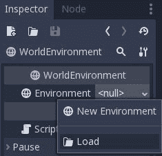

点击新建环境，您将看到一个大型属性列表。您想要的是环境光。将颜色设置为白色，您会看到场景变得更亮。

请记住，环境光来自所有方向均匀。如果您的场景需要阴影或其他光照效果，您将想要使用 `Light` 节点之一。您将在本章后面看到光照节点是如何工作的。

# 完成场景

现在你已经布置好了课程，剩下两项：*tee*，即球体开始的位置，以及检测球体何时进入洞口的方法。

添加一个名为`Tee`的`Position3D`节点。就像`Position2D`一样，此节点用于在空间中标记一个位置。将此节点放置在你想要球体开始的位置。确保将其放置在表面之上，这样球体就不会在地面内部生成。

要检测球体进入洞口，可以使用一个`Area`节点。此节点与 2D 版本直接对应：它可以在一个身体进入其分配的形状时发出信号。添加一个`Area`节点并给它一个`CollisionShape`子节点。

在`CollisionShape`的子节点形状属性中添加一个`SphereShape`：

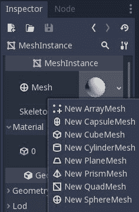

要调整碰撞球体的大小，使用单个半径调整手柄：

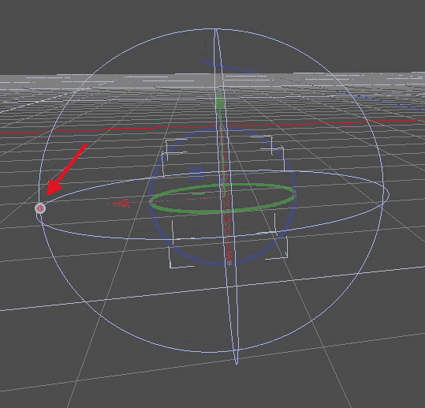

将`Area`放置在洞口下方，并调整碰撞形状的大小，使其与洞底重叠。不要让它延伸到洞口顶部，否则球体在尚未落下时会被计为*在洞内*。


如果你使用透视按钮从不同方向一次查看洞口，可能会更容易定位节点。当你完成定位后，将`Area`的名称更改为`Hole`。

# 球体

现在，你准备好制作球体了。由于球体需要物理属性——重力、摩擦力、与墙壁的碰撞以及其他物理属性——“刚体”将是节点选择的最佳选择。创建一个新的场景，并命名为`Ball`的`RigidBody`。

`RigidBody`是你在第三章，“逃离迷宫”中使用的`RigidBody2D`节点的 3D 等效物。它的行为和属性非常相似，并且你可以使用许多相同的方法与之交互，例如`apply_impulse()`和`_integrate_forces()`。

球的形状需要是一个球体。基本的三维形状，如球体、立方体、圆柱体等，被称为*原语*。Godot 可以使用`MeshInstance`节点自动创建原语，因此添加一个作为身体的子节点。在检查器中，在网格属性中选择“新建球体网格”：


默认大小太大，因此单击新的球体网格并设置其大小属性，半径为`0.15`，高度为`0.3`：

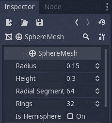

接下来，向`Ball`添加一个`CollisionShape`节点并给它一个`SphereShape`。使用大小手柄（橙色点）调整其大小以适应网格：

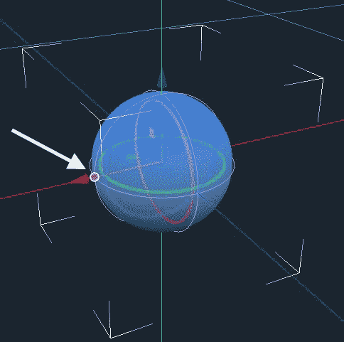

# 测试球体

要测试球体，使用实例按钮将其添加到`Main`场景中。将其放置在课程上方某处并播放。你应该看到球体落下并落在地面上。你可能发现添加另一个位于课程侧面的`Camera`节点以获得不同视角很有帮助。设置你想要使用的相机的当前属性。

你还可以通过设置其线性/速度属性来暂时给球一些运动。尝试设置不同的值并播放场景。记住，*y*轴是向上的，使用过大的值可能会导致球直接穿过墙壁。完成后将其设置回`(0, 0, 0)`。

# 改善碰撞

当调整速度时，你可能注意到球有时会直接穿过墙壁和/或以奇怪的方式反弹，尤其是如果你选择一个高值。你可以对`RigidBody`属性进行一些调整，以改善高速下的碰撞行为。

首先，打开**连续碰撞检测**（**CCD**）。你将在检查器中找到它列出的连续 Cd。使用 CCD 会改变物理引擎计算碰撞的方式。通常，引擎通过首先移动对象，然后测试和解决碰撞来运行。这很快，并且在大多数常见情况下都有效。然而，当使用 CCD 时，引擎将对象沿其路径投影移动，并尝试预测碰撞可能发生的位置。这比默认行为慢，因此效率不高，尤其是在模拟许多对象时，但它要精确得多。由于你游戏中只有一个球，CCD 是一个不错的选择，因为它不会引入任何明显的性能损失，但会大大提高碰撞检测。

球也需要更多的动作，所以将“反弹”设置为`0.2`，将“重力比例”设置为`2`。

最后，你可能也注意到球停止需要很长时间。将`Linear/Damp`属性设置为`0.5`，将`Angular/Damp`设置为`0.1`，这样你就不必等待球停止移动那么长时间。

# 用户界面

现在球已经在轨道上了，你需要一种瞄准和击打球的方法。对于这种类型的游戏，有许多可能的控制方案。对于这个项目，你将使用两步过程：

1.  瞄准：箭头将出现来回摆动。点击鼠标按钮将瞄准方向设置为箭头的方向。

1.  射击：力量条将在屏幕上上下移动。点击鼠标将设置力量并发射球。

# 瞄准箭头

在 3D 中绘制一个物体并不像在 2D 中那么容易。在许多情况下，你将不得不切换到像 Blender 这样的 3D 建模程序来创建你的游戏物体。然而，在这种情况下，Godot 的原生形状已经为你准备好了；要制作一个箭头，你只需要两个网格：一个长而薄的矩形和一个三角棱柱。

通过添加一个带有`MeshInstance`子节点的`Spatial`节点来创建一个新的场景。添加一个新的`CubeMesh`。点击网格属性，并将大小属性设置为`(0.5, 0.2, 2)`。这是箭头的主体，但它仍然有一个问题。如果你旋转父对象，网格将围绕其中心旋转。相反，你需要箭头围绕其末端旋转，所以将`MeshInstance`的变换/平移更改为`(0, 0, -1)`：

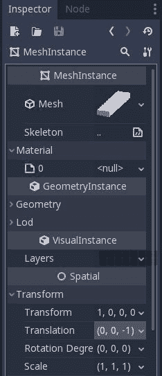

尝试使用 gizmo 旋转`Arrow`（根）节点，以确认形状现在偏移正确。

要创建箭头的尖端，添加另一个`MeshInstance`，这次选择 New PrismMesh。将其大小设置为`(1.5, 2, 0.5)`。现在你有一个平面的三角形形状。为了将其正确放置在矩形的末端，将网格的 Transform/Translation 更改为`(0, 0, -3)`，并将其 Rotation Degrees 更改为`(-90, 0, 0)`。

使用原语是直接在 Godot 中创建占位符对象的一种快速方法，而无需打开你的 3D 建模软件。

最后，通过将根节点的 Transform/Scale 设置为`(0.5, 0.5, 0.5)`来缩小整个箭头：

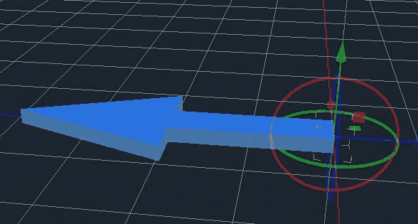

现在你已经完成了一个箭头形状。保存它，然后在`Main`场景中实例化它。

# UI 显示

创建一个新的场景，其中包含一个名为`UI`的 CanvasLayer。在这个场景中，你将显示力量条以及玩家的得分次数。添加一个`MarginContainer`、`VBoxContainer`、两个`Label`属性和一个`TextureProgress`。按照以下名称命名：

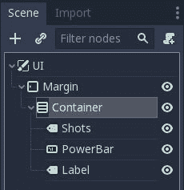

将`MarginContainer`的`Custom Constants`全部设置为`20`。将`Xolonium-Regular.ttf`字体添加到两个`Label`节点中，并将它们的字体大小设置为`30`。将`Shots`标签的文本设置为 Shots: 0，将`Label`的文本设置为 Power。将`res://assets`中的一个彩色条纹理拖放到`PowerBar`的 Texture/Progress 中。默认情况下，`TextureProgress`条从左到右增长，因此对于垂直方向，将填充模式更改为从下到上。

完成的 UI 布局应该看起来像这样：

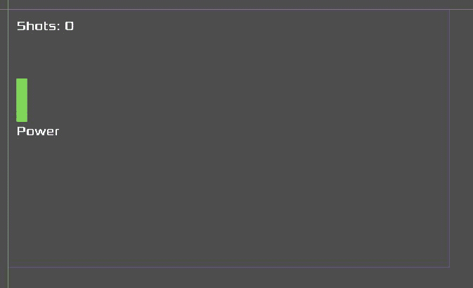

在`Main`场景中实例化此场景。因为它是一个 CanvasLayer，所以它将被绘制在 3D 相机视图之上。

# 脚本

在本节中，你将创建使一切协同工作的脚本。游戏流程如下：

1.  将球放置在起点（Tee）

1.  角度模式：瞄准球

1.  力量模式：设置击球力量

1.  发射球

1.  重复步骤 2，直到球进入洞中

# UI

将以下脚本添加到`UI`以更新 UI 元素：

```cpp
extends CanvasLayer

var bar_red = preload("res://assets/bar_red.png")
var bar_green = preload("res://assets/bar_green.png")
var bar_yellow = preload("res://assets/bar_yellow.png")

func update_shots(value):
    $Margin/Container/Shots.text = 'Shots: %s' % value

func update_powerbar(value):
    $Margin/Container/PowerBar.texture_progress = bar_green
    if value > 70:
        $Margin/Container/PowerBar.texture_progress = bar_red
    elif value > 40:
        $Margin/Container/PowerBar.texture_progress = bar_yellow
    $Margin/Container/PowerBar.value = value
```

这两个函数提供了一种在需要显示新值时更新 UI 元素的方法。正如你在 Space Rocks 游戏中做的那样，根据进度条的大小更改纹理，给力量级别带来很好的高/中/低感觉。

# Main

接下来，向`Main`添加一个脚本，并从以下变量开始：

```cpp
extends Node

var shots = 0
var state
var power = 0
var power_change = 1
var power_speed = 100
var angle_change = 1
var angle_speed = 1.1
enum {SET_ANGLE, SET_POWER, SHOOT, WIN}
```

`enum`列出了游戏可能处于的状态，而`power*`和`angle*`变量将用于设置它们的相应值并在时间上改变它们。看看以下代码片段：

```cpp
func _ready():
    $Arrow.hide()
    $Ball.transform.origin = $Tee.transform.origin
    change_state(SET_ANGLE)
```

开始时，球被放置在`Tee`的位置，使用两个物体的`transform.origin`属性。然后，游戏被置于`SET_ANGLE`状态：

```cpp
func change_state(new_state):
    state = new_state
    match state:
        SET_ANGLE:
            $Arrow.transform.origin = $Ball.transform.origin
            $Arrow.show()
        SET_POWER:
            pass
        SHOOT:
            $Arrow.hide()
            $Ball.shoot($Arrow.rotation.y, power)
            shots += 1
            $UI.update_shots(shots)
        WIN:
            $Ball.hide()
            $Arrow.hide()
```

`SET_ANGLE`状态将箭头放置在球的位置。回想一下，你偏移了箭头，所以它看起来是从球指向外。当旋转箭头时，你围绕*y*轴旋转它，使其保持平坦（*y*轴向上）。

此外，请注意，在进入`SHOOT`状态时，你在`Ball`上调用`shoot()`函数。你将在下一节中添加该函数。

下一步是检查用户输入：

```cpp
func _input(event):
    if event.is_action_pressed('click'):
        match state:
            SET_ANGLE:
                change_state(SET_POWER)
            SET_POWER:
                change_state(SHOOT)
```

游戏的唯一输入是点击左鼠标按钮。根据你处于什么状态，点击它将过渡到下一个状态：

```cpp
func _process(delta):
    match state:
        SET_ANGLE:
            animate_angle(delta)
        SET_POWER:
            animate_power_bar(delta)
        SHOOT:
            pass
```

在`_process()`中，你根据状态确定要动画化什么。现在，它只是调用当前正在设置的属性动画的函数：

```cpp
func animate_power_bar(delta):
    power += power_speed * power_change * delta
    if power >= 100:
        power_change = -1
    if power <= 0:
        power_change = 1
    $UI.update_powerbar(power)

func animate_angle(delta):
    $Arrow.rotation.y += angle_speed * angle_change * delta
    if $Arrow.rotation.y > PI/2:
        angle_change = -1
    if $Arrow.rotation.y < -PI/2:
        angle_change = 1
```

这两个函数都很相似。它们在两个极端之间逐渐改变一个值，当达到极限时反转方向。请注意，箭头在±90 度的弧上动画。

# 球

在球脚本中，需要两个函数。首先，必须对球施加一个脉冲以使其发射。其次，当球停止移动时，需要通知`Main`场景，以便玩家可以再次射击：

```cpp
extends RigidBody

signal stopped

func shoot(angle, power):
    var force = Vector3(0, 0, -1).rotated(Vector3(0, 1, 0), angle)
    apply_impulse(Vector3(), force * power / 5)

func _integrate_forces(state):
    if state.linear_velocity.length() < 0.1:
        emit_signal("stopped")
        state.linear_velocity = Vector3()
```

正如你在《太空岩石》游戏中看到的，你可以在`_integrate_forces()`中使用物理状态安全地停止球，如果速度变得太慢。记住，由于浮点数精度，速度可能不会自行减慢到`0`。球可能看起来已经停止，但它的速度实际上可能是`0.0000001`。而不是等待它达到`0`，你可以使球停止，如果其速度低于`0.1`。

# 洞

要检测球是否掉入洞中，请点击`Main`中的`Area`并连接其`body_entered`信号：

```cpp
func _on_Hole_body_entered(body):
    print("Win!")
    change_state(WIN)
```

切换到`WIN`状态将防止球的`stopped`信号允许再次射击。

# 测试它

尝试运行游戏。你可能想确保这部分有一个非常简单的课程，直线射击到洞口。你应该看到箭头在球的位置旋转。当你点击鼠标按钮时，箭头停止，力量条开始上下移动。当你第二次点击时，球被发射。

如果这些步骤中的任何一个不起作用，不要继续前进，而是停止并返回尝试找出你遗漏了什么。

一切正常后，你会注意到一些需要改进的地方。首先，当球停止移动时，箭头可能不会指向你想要的方向。原因是起始角度始终是`0`，这指向*z*轴，然后箭头从那里挥动±90 度。在下一节中，你将有两个改进瞄准的方法。

# 改善瞄准 – 选项 1

通过使箭头的 180 度挥动始终指向洞口，可以提高目标。

在`Main`脚本中添加一个名为`hole_dir`的变量。在瞄准开始时，这将通过以下函数设置为指向洞口的角：

```cpp
func set_start_angle():
    var hole_pos = Vector2($Hole.transform.origin.z, $Hole.transform.origin.x)
    var ball_pos = Vector2($Ball.transform.origin.z, $Ball.transform.origin.x)
    hole_dir = (ball_pos - hole_pos).angle()
    $Arrow.rotation.y = hole_dir
```

记住，球的位置是其中心，所以它略微高于表面，而洞的中心则稍微低于表面。因此，直接指向它们之间的箭头会指向地面的向下角度。为了防止这种情况并保持箭头水平，你可以只使用`transform.origin`的*x*和*z*值来生成一个`Vector2`。

现在初始箭头方向是指向洞的，因此你可以改变动画，将±90 度添加到该角度：

```cpp
func animate_angle(delta):
    $Arrow.rotation.y += angle_speed * angle_change * delta
    if $Arrow.rotation.y > hole_dir + PI/2:
        angle_change = -1
    if $Arrow.rotation.y < hole_dir - PI/2:
        angle_change = 1
```

最后，将`SET_ANGLE`状态更改为调用函数：

```cpp
SET_ANGLE:
    $Arrow.transform.origin = $Ball.transform.origin
    $Arrow.show()
    set_start_angle()
```

再次尝试游戏。现在球应该总是指向洞的大致方向。这更好，但你仍然不能指向你喜欢的任何方向。为此，你可以尝试瞄准选项 2。

# 改进瞄准 – 选项 2

之前的方法是可以接受的，但还有一种可能性。不是让箭头来回弹跳，你可以通过移动鼠标左右瞄准。这个选项的好处是，你不受 180 度运动的限制。

为了实现这一点，你可以利用特定的输入事件：`InputEventMouseMotion`。当鼠标移动时，此事件发生，并返回一个`relative`属性，表示鼠标在上一帧中移动的距离。你可以使用这个值来旋转箭头一个小量。

首先，通过从`_process()`中移除`SET_ANGLE`部分来禁用箭头动画。接下来，将以下代码添加到`_input()`中：

```cpp
func _input(event):
    if event is InputEventMouseMotion:
        if state == SET_ANGLE:
            $Arrow.rotation.y -= event.relative.x / 150
```

这设置了箭头的旋转，当你将鼠标在屏幕上左右移动时。除以`150`确保移动不会太快，并且如果你将鼠标从屏幕的一侧移动到另一侧，你可以移动完整的 360 度。根据你鼠标的灵敏度，你可以调整这个值以适应你的偏好。

# 摄像头改进

另一个问题，尤其是如果你有一个相对较大的课程，那就是如果你的摄像头放置在展示发球区附近，可能无法很好地显示课程的其他部分，甚至根本无法显示。这可能会在球位于某些位置时使瞄准变得具有挑战性。

在本节中，你将学习两种不同的方法来解决此问题。一种方法涉及创建多个摄像头并激活离球位置最近的那个。另一种解决方案是创建一个*环绕*摄像头，它跟随球并允许玩家控制从任何角度查看课程。

# 多个摄像头

添加第二个`Camera`节点并将其放置在洞附近或课程的对端，例如：

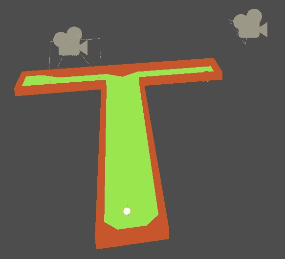

向这个第二个相机添加一个`Area`子节点。命名为`Camera2Area`，然后添加一个`CollisionShape`。你也可以使用球形形状，但在这个例子中，选择一个`BoxShape`。请注意，因为你已经旋转了相机，所以盒子也旋转了。你可以通过将`CollisionShape`的旋转设置为相反的值来反转这一点，或者你可以让它保持旋转。无论如何，调整盒子的大小和位置以覆盖你想要相机负责的赛道部分：

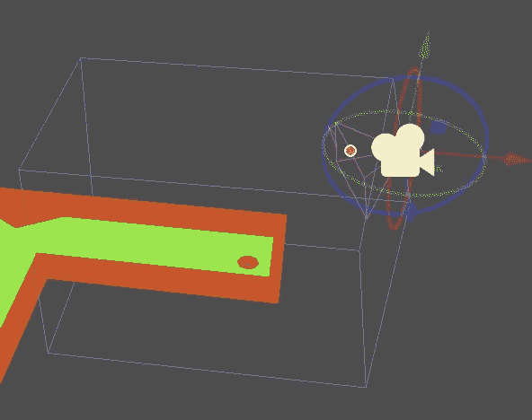

现在，将区域的`body_entered`信号连接到主脚本。当球进入区域时，将发出信号，你可以更改活动相机：

```cpp
func _on_Cam2Area_body_entered(body):
    $Camera2.current = true
```

再次玩游戏并击打球向新的相机区域。确认当球进入区域时相机视图发生变化。对于大型场地，你可以添加尽可能多的相机并将它们设置为激活不同部分的赛道。

这种方法的缺点是相机仍然是静态的。除非你非常小心地将它们放置在正确的位置，否则从赛道上的某些位置瞄准球可能仍然不舒服。

# 旋转相机

在许多 3D 游戏中，玩家可以控制一个可以按需旋转和移动的相机。通常，控制方案使用鼠标和键盘的组合。第一步将是添加一些新的输入动作：

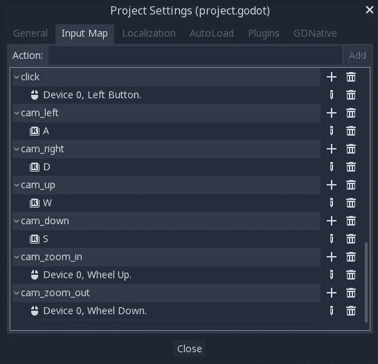

WASD 键将被用来通过左右和上下移动来旋转相机。鼠标滚轮将控制缩放。

# 创建陀螺仪

相机移动需要有一些限制。一方面，它应该始终保持水平，而不是倾斜。尝试这样做：拿一个相机，围绕 x 轴（红色环）旋转一小部分，然后围绕*z*轴（蓝色环）旋转一小部分。现在，反转*x*旋转并点击预览按钮。你是否看到相机现在倾斜了？

解决这个问题的方法是将相机放置在**陀螺仪**上——一种设计用来在运动中保持物体水平状态的装置。你可以使用两个`Spatial`节点来创建一个陀螺仪，它们将分别控制相机的左右和上下移动。

首先，请确保从场景中移除任何其他`Camera`节点。如果你尝试了上一节中的多相机设置并且不想删除它们，你可以将它们的`Current`值设置为`Off`，并断开任何`Area`信号。

添加一个新的名为`GimbalOut`的`Spatial`节点并将其放置在赛道中心附近。确保不要旋转它。给它一个名为`GimbalIn`的`Spatial`子节点，然后向该节点添加一个`Camera`。将相机的变换/平移设置为`(0, 0, 10)`：

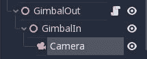

这是陀螺仪的工作原理：外部的空间允许仅在*y*轴上旋转*仅*，而内部的一个*仅*在*x*轴上旋转。你可以亲自尝试，但请确保切换到本地空间模式（参见*3D 简介*部分）。记住，只移动外部陀螺仪节点的*绿色*环和内部节点的*红色*环。不要改变相机设置。实验完成后，将所有旋转重置为`0`。

要在游戏中控制这种运动，请将脚本附加到`GimbalOut`上并添加以下内容：

```cpp

extends Spatial

var cam_speed = PI/2
var zoom_speed = 0.1
var zoom = 0.5

func _input(event):
    if event.is_action_pressed('cam_zoom_in'):
        zoom -= zoom_speed
    if event.is_action_pressed('cam_zoom_out'):
        zoom += zoom_speed

func _process(delta):
    zoom = clamp(zoom, 0.1, 2)
    scale = Vector3(1, 1, 1) * zoom
    if Input.is_action_pressed('cam_left'):
        rotate_y(-cam_speed * delta)
    if Input.is_action_pressed('cam_right'):
        rotate_y(cam_speed * delta)
    if Input.is_action_pressed('cam_up'):
        $GimbalIn.rotate_x(-cam_speed * delta)
    if Input.is_action_pressed('cam_down'):
        $GimbalIn.rotate_x(cam_speed * delta)
    $GimbalIn.rotation.x = clamp($GimbalIn.rotation.x, -PI/2, -0.2)
```

如你所见，左右动作仅在*y*轴上旋转`GimbalOut`，而上下动作在*x*轴上旋转`GimbalIn`。整个陀螺仪系统的`scale`属性用于处理缩放。还需要使用`clamp()`设置一些限制。旋转限制将上下移动保持在`-0.2`（几乎与地面水平）到`-90`度（直视下方）之间，而缩放限制则防止你离得太近或太远。

运行游戏并测试相机控制。你应该能够使用鼠标滚轮在所有四个方向上平移和缩放。然而，陀螺仪的位置仍然是静态的，因此你可能从某些角度难以正确看到球。

# 追踪相机

对相机的一个最终改进是让它跟随球。现在你有一个稳定的、可旋转的相机，如果陀螺仪设置为跟随球的位置，它将工作得很好。将以下行添加到`Main`场景的`_process()`函数中：

```cpp
$GimbalOut.transform.origin = $Ball.transform.origin
```

注意，你不应该将陀螺仪的变换设置为球的变换，否则它也会随着球的滚动而*旋转*！

现在尝试游戏并观察相机如何追踪球的运动，同时仍然能够旋转和缩放。

# 视觉效果

球和其他场景中网格的外观已经被故意设计得非常简单。你可以将这个扁平的白色球想象成一个空白画布，准备好按照你的意愿塑造和塑形。将图形应用到 3D 模型上可能是一个非常复杂的过程，尤其是如果你不熟悉它。首先，一些词汇：

+   **纹理**：纹理是平面的、二维图像，它们被*包裹*在 3D 对象周围，以赋予它们更有趣的外观。想象一下包裹一个礼物：平面的纸张被折叠在包裹周围，以适应其形状。纹理可以是非常简单的，也可以非常复杂，这取决于它们设计要应用到哪种形状上。一个简单的例子可能是一小块可以重复在大型墙面物体上的砖块图案。

+   **着色器**：虽然纹理决定了对象表面绘制的内容，但着色器决定了绘制的方式。想象一下同样的砖墙。如果它湿了会是什么样子？网格和纹理仍然是相同的，但光线从其反射的方式会有很大的不同。这就是着色器的功能：在不实际改变对象的情况下改变其外观。着色器通常用一种专门的编程语言编写，并且可以使用大量的高级数学，这些细节超出了本书的范围。对于许多效果，编写自己的着色器是不可避免的。然而，Godot 提供了一种创建着色器的替代方法，允许在不深入研究着色器代码的情况下对对象进行大量定制：`ShaderMaterial`。

+   **材质**：Godot 使用一种称为**基于物理的渲染**（**PBR**）的计算机图形模型。PBR 的目标是以更准确地模拟现实世界中光线作用的方式渲染物体的表面。这些效果通过`Material`属性应用于网格。材质基本上是纹理和着色器的容器。而不是单独应用它们，它们被包含在材质中，然后添加到对象上。材质的属性决定了纹理和着色器效果如何应用。使用 Godot 内置的材质属性，您可以模拟各种现实世界（或风格化）的物理材质，如石头、布料或金属。如果内置属性不足以满足您的需求，您可以编写自己的着色器代码以添加更多效果。

您可以使用`SpatialMaterial`将 PBR 材质添加到网格中。

# SpatialMaterials

点击球体的`MeshInstance`，然后在材质下选择新建`SpatialMaterial`，然后点击新材质。您将看到大量的参数，远超过本书所能涵盖的范围。本节将重点介绍一些使球体看起来更吸引人的最有用参数。鼓励您访问[`docs.godotengine.org/en/3.0/tutorials/3d/spatial_material.html`](http://docs.godotengine.org/en/3.0/tutorials/3d/spatial_material.html)以获取所有`SpatialMaterial`设置的完整解释。为了改善球体的外观，尝试对这些参数进行实验：

+   **Albedo**：此属性设置材质的基本颜色。更改此属性可以使球体呈现您喜欢的任何颜色。如果您正在处理需要应用纹理的对象，您也可以在此处添加它。

+   **金属和粗糙度**：这些参数控制表面如何反射。两者都可以设置为 `0` 到 `1` 之间的值。金属值控制 *光泽度*；值越高，反射的光越多。粗糙度值对反射应用一定程度的模糊。通过调整这两个属性，你可以模拟各种材料。以下是如何 *粗糙度* 和 *金属* 属性影响物体外观的指南。请记住，照明和其他因素也会改变表面外观。了解光和反射如何与表面属性相互作用是学习设计有效 3D 对象的重要组成部分：

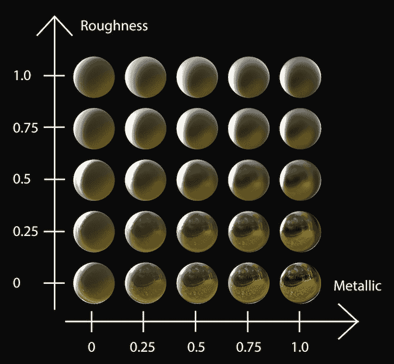

+   **法线图**：法线映射是一种 3D 图形技术，用于 *模拟* 表面上的凹凸。在网格本身中建模这些会导致组成对象的三角形数量或面数大幅增加，从而降低性能。相反，使用一个 2D 纹理来映射这些小表面特征会产生光和影的图案。然后，照明引擎使用这些信息来改变照明，就像那些细节实际上存在一样。一个正确构建的法线图可以为原本看起来平淡无奇的对象添加大量细节。

这个球体是一个很好的法线映射应用的例子，因为真实的高尔夫球在其表面有数百个凹坑，但球体原语是一个光滑的表面。使用常规纹理可以添加斑点，但它们看起来会显得扁平且涂鸦在上面。模拟这些凹坑的法线图看起来像这样：

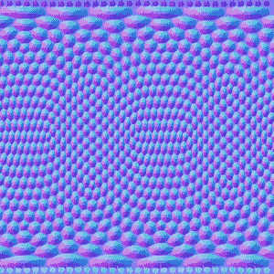

它看起来并不起眼，但红色和蓝色的图案包含了告诉引擎在那个点表面应该朝哪个方向的信息，因此光线应该从哪个方向反射出来。注意顶部和底部的拉伸——这是因为这张图片是为了包裹成球形形状而制作的。

启用法线图属性，并将 `res://assets/ball_normal_map.png` 拖入 *纹理* 字段。最初将 *Albedo* 颜色设置为白色，这样你可以最好地看到效果。调整 `Depth` 参数以增加或减少效果强度。负值会使凹坑看起来是凹进去的；在 `-1.0` 和 `-1.5` 之间的值是一个不错的选择：

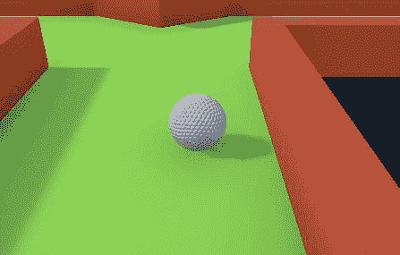

花些时间尝试这些设置，找到你喜欢的组合。别忘了在游戏中也试试，因为 `WorldEnvironment` 的环境光照会影响最终结果。

# 环境选项

当你添加了 WorldEnvironment，你唯一更改的参数是 *环境光照* 颜色。在本节中，你将了解一些你可以调整以改善视觉效果的其他属性：

+   **背景**：此参数允许你指定世界的背景看起来像什么。默认值是 Clear Color，即你目前看到的纯灰色。将模式更改为 Sky，并在 Sky 属性中，选择新的程序化天空。请注意，天空不仅仅是背景外观——物体将反射和吸收其环境光。观察当改变`Energy`参数时球的外观如何变化。此设置可用于营造白天或夜晚天空的印象，甚至外星行星的印象。

+   **屏幕空间环境光遮蔽**（**SSAO**）：当启用时，此参数与任何环境光一起工作，在角落产生阴影。现在你有两个环境光来源：*背景*（天空）和*环境光*设置。启用 SSAO 后，你会立即看到改进，使课程的墙壁看起来不那么虚假和塑料。请随意尝试调整各种 SSAO 属性，但请记住，微小的变化可以产生很大的差异。以小增量调整属性，并在更改它们之前观察效果。

+   **DOF 远模糊**：*景深*为距离相机一定距离以上的物体添加模糊效果。尝试调整距离属性以查看效果。

有关环境效果的高级使用信息，请参阅[`docs.godotengine.org/en/3.0/tutorials/3d/environment_and_post_processing.html`](http://docs.godotengine.org/en/3.0/tutorials/3d/environment_and_post_processing.html)。

# 灯光

将`DirectionalLight`添加到场景中。此类光线模拟无限数量的平行光线，因此常用于表示阳光或另一个照亮整个区域的光源。节点在场景中的位置无关紧要，只有其方向，因此你可以将其放置在任何你喜欢的地方。使用 gizmo 定位它，使其以角度击中课程，然后切换 Shadow/Enabled 为开启，以便你会看到从墙壁和其他物体投射出的阴影：

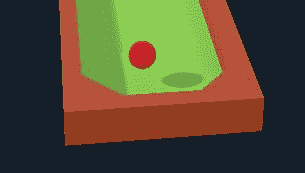

有许多属性可用于调整和改变阴影的外观，无论是在所有`Light`节点都存在的*阴影*部分，还是在特定于`DirectionalLight`的*方向性阴影*部分。默认值将适用于大多数通用情况，但你可能需要调整的一个属性是*最大距离*。降低此值将改善阴影外观，但仅当相机距离小于给定距离时。如果你的相机将主要靠近物体，你可以降低此值。要查看效果，尝试将其设置为`10`并缩放，然后将其设置为`1000`进行相同的操作。

方向性光线甚至可以用来模拟昼夜循环。如果你将脚本附加到光线并围绕一个轴缓慢旋转它，你会看到阴影的变化，就像太阳在升起和落下一样。

# 摘要

本章带你进入了 3D 图形的世界。Godot 的一个巨大优势是，在 2D 和 3D 中使用了相同的工具和工作流程。你关于创建场景、实例化和使用信号的过程中学到的所有内容都以相同的方式工作。例如，你为 2D 游戏构建的带有控制节点的界面可以放入 3D 游戏中，并且会以同样的方式工作。

在本章中，你学习了如何在 3D 编辑器中导航，使用工具箱来查看和放置节点。你了解了网格和如何使用 Godot 的原生形状快速创建自己的对象。你使用了 GridMap 来布置你的迷你高尔夫球场。你学习了如何使用摄像机、照明和世界环境来设计你的游戏在屏幕上的显示效果。最后，你体验了通过 Godot 的 SpatialMaterial 资源使用 PBR 渲染。

恭喜你，你已经走到了终点！但有了这五个项目，你成为游戏开发者的旅程才刚刚开始。随着你对 Godot 功能的熟练掌握，你将能够制作出你所能想象到的任何游戏。
