# 其他主题

恭喜！在这本书中你构建的项目让你开始走上成为 Godot 专家的道路。然而，你只是刚刚触及了 Godot 可能性的表面。随着你技能的提高，以及项目规模的扩大，你需要知道如何找到解决问题的方案，如何分发你的游戏以便他人可以玩，甚至如何扩展引擎本身。

在本章中，你将了解以下主题：

+   如何有效地使用 Godot 内置的文档

+   将项目导出以在其他平台上运行

+   在 Godot 中使用其他编程语言

+   如何使用 Godot 的资产库安装插件

+   成为 Godot 贡献者

+   社区资源

# 使用 Godot 的文档

学习 Godot 的 API 最初可能会感觉令人压倒。你该如何学习所有不同的节点，以及每个节点包含的属性和方法呢？幸运的是，Godot 内置的文档可以帮助你。养成经常使用它的习惯：在学习过程中，它将帮助你找到所需内容；而且，当你熟悉环境后，快速查阅方法或属性也是一个很好的方式。

当你在编辑器的“脚本”选项卡中时，你会在右上角看到以下按钮：


“在线文档”按钮将在你的浏览器中打开文档网站。如果你有多个显示器设置，保持 API 参考在一边以便快速查阅，当你正在 Godot 中工作时，这会非常有用。

另外两个按钮允许你在 Godot 编辑器中直接查看文档。“类”按钮允许你浏览可用的节点和对象类型，而“搜索帮助”按钮则允许你搜索任何方法或属性名称。这两个搜索都是“智能”的，这意味着你可以输入单词的一部分，随着你输入，结果会逐渐缩小。请看以下截图：

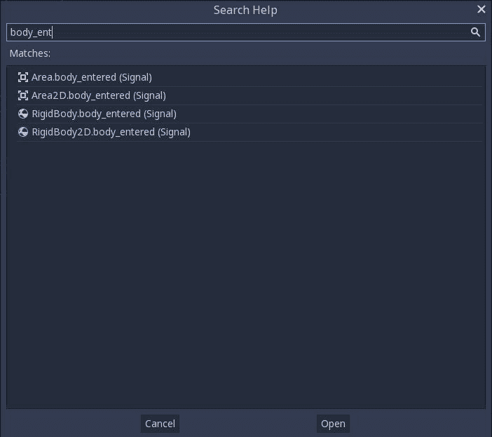

当你找到所需的属性或方法时，点击“打开”，该节点的文档引用将出现。

# 阅读 API 文档

当你找到你想要的节点文档时，你会看到它遵循一个常见的格式，顶部是节点的名称，然后是几个信息子节，如下面的截图所示：

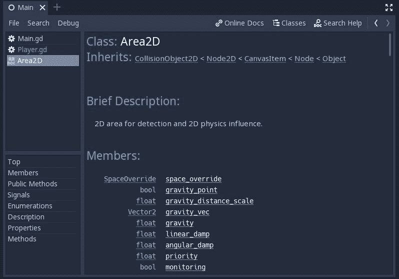

文档顶部有一个名为“Inherits”的列表，它显示了特定节点从`Object`（Godot 的基础对象类）开始的所有类继承链。例如，一个 `Area2D` 节点具有以下继承链：

```cpp
CollisionObject2D < Node2D < CanvasItem < Node < Object
```

这让你可以快速查看此类对象可能具有的其他属性。你可以点击任何节点名称以跳转到该节点的文档。

您还可以查看哪些节点类型（如果有）继承自特定节点，以及节点的一般描述。下面，您可以查看节点的成员变量和方法。大多数方法和类型名称是链接，因此您可以点击任何项目以了解更多信息。

在您工作的过程中，养成定期查阅 API 文档的习惯。您会发现您将很快开始更深入地理解一切是如何协同工作的。

# 导出项目

最终，您的项目将达到您希望与世界分享的阶段。*导出*您的项目意味着将其转换为没有 Godot 编辑器的人可以运行的一个包。您可以为许多流行的平台导出您的项目。

在撰写本文时，Godot 支持以下目标平台：

+   Windows 通用

+   Windows 桌面

+   macOS

+   Linux

+   Android (移动端)

+   iOS (移动端)

+   HTML5 (网页)

导出项目的具体方法取决于您要针对的平台。例如，要导出 iOS，您必须在安装了 Xcode 的 macOS 计算机上运行。

每个平台都是独特的，由于硬件限制、屏幕尺寸或其他因素，您的游戏的一些功能可能在某些平台上无法工作。例如，如果您想将“Coin Dash”游戏（来自第一章，*简介*）导出为 Android 平台，您的玩家将无法移动，因为键盘控制将不起作用！对于该平台，您需要在游戏代码中包含触摸屏控制（关于这一点稍后会有更多介绍）。

您甚至可能发现需要为不同的平台在项目设置中设置不同的值。您可以通过选择设置并点击“为...覆盖”来完成此操作。这将创建一个针对该平台的新设置。

例如，如果您想启用 HiDPI 支持，但不允许 Android 使用，您可以为此设置创建一个覆盖：

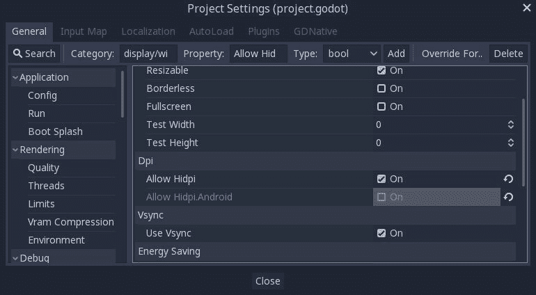

每个平台都是独特的，在配置项目以导出时需要考虑许多因素。请查阅官方文档以获取有关导出到您所需平台的最新说明。

# 获取导出模板

*导出模板*是针对每个目标平台编译的 Godot 版本，但不包括编辑器。您的项目将与目标平台的模板结合以创建一个独立的应用程序。

要开始，您必须下载导出模板。从编辑器菜单中点击“管理导出模板”：

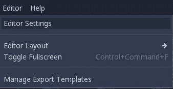

在此窗口中，您可以点击下载以获取导出模板：


您也可以从 Godot 网站[`godotengine.org/download`](http://godotengine.org/download)下载模板。如果您选择这样做，请使用“从文件安装”按钮来完成安装。

模板的版本必须与您使用的 Godot 版本相匹配。如果您升级到 Godot 的新版本，请确保您也下载了相应的模板，否则您的导出项目可能无法正常工作。

# 导出预设

当您准备好导出项目时，点击“项目”|“导出”：


在此窗口中，您可以通过点击“添加...”并从列表中选择平台来为每个平台创建“预设”。您可以为每个平台创建尽可能多的预设。例如，您可能希望为项目创建调试和发布版本。

每个平台都有自己的设置和选项，太多无法在此描述。默认值通常很好，但在分发项目之前，您应该彻底测试它们。

在“资源”标签中，您可以自定义要导出的项目部分。例如，您可以选择仅导出选定的场景或从项目中排除某些源文件：


“补丁”标签允许您为之前导出的项目创建更新。

最后，“功能”标签会显示（在“选项”标签中配置的）平台的功能摘要。这些功能可以确定哪些属性由项目设置中的“覆盖”值自定义：


# 导出

窗口底部有两个导出按钮。第一个按钮“导出 PCK/Zip”将仅创建项目数据的 PCK 或打包版本。这不包括可执行文件，因此游戏不能独立运行。此方法适用于您需要为游戏提供附加组件或 DLC（可下载内容）的情况。

第二个按钮“导出项目”将创建游戏的可执行版本，例如 Windows 的 `.exe` 或 Android 的 `.apk`。

点击“保存”，您将拥有一个可玩的游戏版本。

# 示例 – Android 平台的 Coin Dash

如果您拥有安卓设备，您可以按照此示例将 Coin Dash 游戏导出为移动平台。对于其他平台，请参阅 Godot 的文档，链接为 [`docs.godotengine.org/en/latest/getting_started/workflow/export`](http://docs.godotengine.org/en/latest/getting_started/workflow/export)。

移动设备具有各种各样的功能。始终参考前述链接中的官方文档，以获取有关您平台的信息以及可能适用于您的设备的任何限制。在大多数情况下，Godot 的默认设置将适用，但移动开发有时更像是一门艺术而非科学，您可能需要进行一些实验并寻找帮助，以便让一切正常工作。

# 修改游戏

因为本章编写的游戏使用键盘控制，所以如果不做些修改，你将无法在移动设备上玩游戏。幸运的是，Godot 支持触摸屏输入。首先，打开项目设置，在“显示/窗口”部分，确保“方向”设置为纵向，并开启“模拟触摸屏”。这将允许你通过将鼠标点击视为触摸事件来在计算机上测试程序：

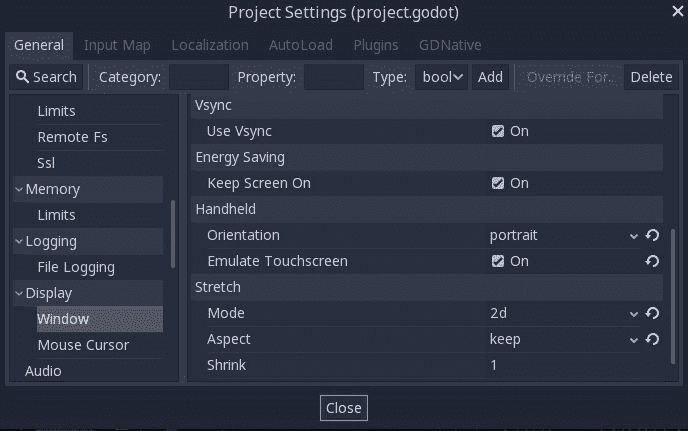

接下来，你需要更改玩家控制。不再使用四个方向输入，玩家将移动到触摸事件的位置。按照以下方式更改玩家脚本：

```cpp
var target = Vector2()

func _input(event):
    if event is InputEventScreenTouch and event.pressed:
        target = event.position

func _process(delta):
    velocity = (target - position).normalized() * speed
    if (target - position).length() > 5:
        position += velocity * delta
    else:
        velocity = Vector2()

    if velocity.length() > 0:
        $AnimatedSprite.animation = "run"
        $AnimatedSprite.flip_h = velocity.x < 0
    else:
        $AnimatedSprite.animation = "idle"
```

尝试一下，确保鼠标点击会导致玩家移动。如果一切正常，你就可以为安卓开发设置你的计算机了。

# 准备你的系统

为了将你的项目导出到安卓，你需要从[`developer.android.com/studio/`](https://developer.android.com/studio/)下载安卓**软件开发工具包**（**SDK**）和从[`www.oracle.com/technetwork/java/javase/downloads/index.html`](http://www.oracle.com/technetwork/java/javase/downloads/index.html)下载**Java 开发工具包**（**JDK）**：

当你第一次运行 Android Studio 时，点击“配置”|“SDK 管理器”，并确保安装 Android SDK Platform-Tools：

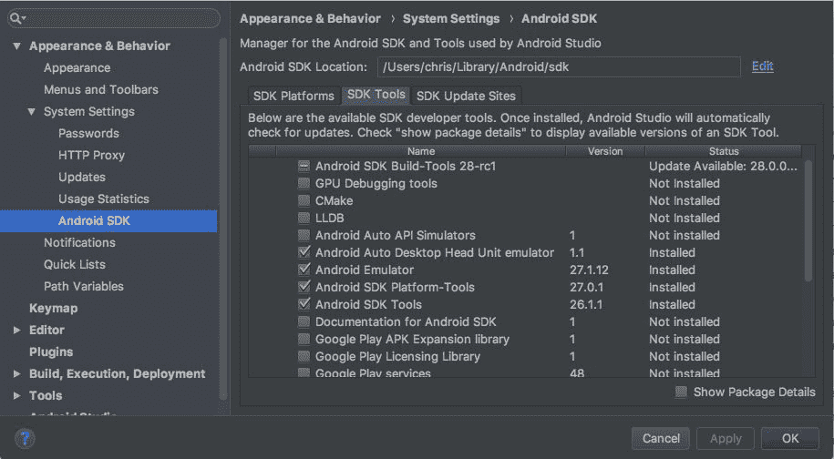

这将安装`adb`命令行工具，Godot 使用它来与你的设备通信。

安装开发工具后，通过运行以下命令创建一个调试密钥库：

```cpp
keytool -keyalg RSA -genkeypair -alias androiddebugkey -keypass android -keystore debug.keystore -storepass android -dname "CN=Android Debug,O=Android,C=US" -validity 9999
```

在 Godot 中，点击“编辑器”|“编辑器设置”，找到“导出/安卓”部分，并设置系统上应用程序的路径。请注意，你只需做一次，因为编辑器设置与项目设置是独立的：

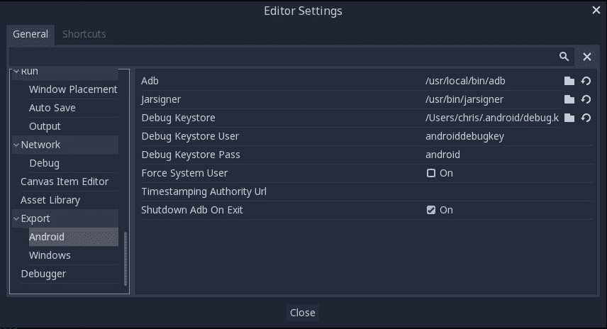

# 导出

你现在可以导出了。点击“项目”|“导出”，并为安卓添加一个预设（参见上一节）。点击“导出项目”按钮，你将得到一个可以安装在你设备上的**安卓包工具包**（**APK**）。你可以使用图形工具或通过命令行使用`adb`来完成此操作：

```cpp
adb install dodge.apk
```

注意，如果你的系统支持，连接一个兼容的安卓设备将导致一键部署按钮在 Godot 编辑器中显示：


点击此按钮将导出项目并在你的设备上一步安装。你的设备可能需要处于开发者模式才能完成此操作：请查阅你的设备文档以获取详细信息。

# 着色器

**着色器**是一个设计在 GPU 上运行的程序，它改变了物体在屏幕上显示的方式。着色器在 2D 和 3D 开发中被广泛使用，以创建各种视觉效果。它们被称为着色器，因为它们最初用于着色和光照效果，但如今它们被用于各种视觉效果。因为它们在 GPU 中**并行**运行，所以它们非常快，但也带来了一些限制。

本节是对着色器概念的简要介绍。要深入了解，请参阅[`thebookofshaders.com/`](https://thebookofshaders.com/)和 Godot 的着色器文档[`docs.godotengine.org/en/latest/tutorials/shading/shading_language.html`](http://docs.godotengine.org/en/latest/tutorials/shading/shading_language.html)。

在 Godot 3.0 中，着色器是用与 GLSL ES 3.0 非常相似的语言编写的。如果你熟悉 C 语言，你会发现语法非常相似。如果你不熟悉，一开始可能会觉得有些奇怪。请参阅本节末尾的链接，以获取更多学习资源。

Godot 中的着色器分为三种类型：**空间**（用于 3D 渲染）、**画布项**（用于 2D）和**粒子**（用于渲染粒子效果）。你的着色器第一行必须声明你正在编写哪种类型。

在确定着色器类型后，你还有三个选择来决定你想要影响的渲染阶段：片段、顶点以及/或光线。片段着色器用于设置每个受影响像素的颜色。顶点着色器用于修改形状或网格的顶点（因此通常在 3D 应用程序中使用得更多）。最后，光线着色器用于改变对象处理光线的方式。

在选择你的着色器类型后，你将编写将在每个受影响的项目上**同时**运行的代码。这就是着色器的真正威力所在。例如，当使用片段着色器时，代码将在对象的每个像素上同时运行。这与使用传统语言时你可能习惯的过程非常不同，在传统语言中，你会逐个遍历每个像素。这种顺序代码的速度不足以处理现代游戏需要的巨大像素数量。

考虑一个以相对较低的分辨率 480 x 720 运行的游戏。屏幕上的像素总数接近 350,000。在代码中对这些像素的任何操作必须在不到 1/60 秒内完成，以避免延迟——当你考虑到还需要为每一帧运行的其他代码：游戏逻辑、动画、网络和所有其他内容时，这个时间会更短。这就是为什么 GPU 如此重要的原因，尤其是对于可能为每一帧处理数百万像素的高端游戏。

# 创建着色器

为了演示一些着色器效果，创建一个带有`Sprite`节点的场景并选择你喜欢的任何纹理。这个演示将使用 Coin Dash 中的仙人掌图像：

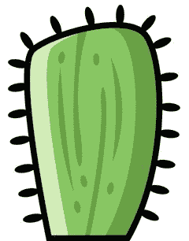

着色器可以添加到任何由`CanvasItem`派生的节点中——在这个例子中，通过其`Material`属性添加到`Sprite`中。在这个属性中，选择“新建着色器材料”并点击新创建的资源。第一个属性是“着色器”，在这里你可以选择“新建着色器”。当你这样做时，编辑器窗口底部会出现一个着色器面板。

这是你将编写着色器代码的地方：

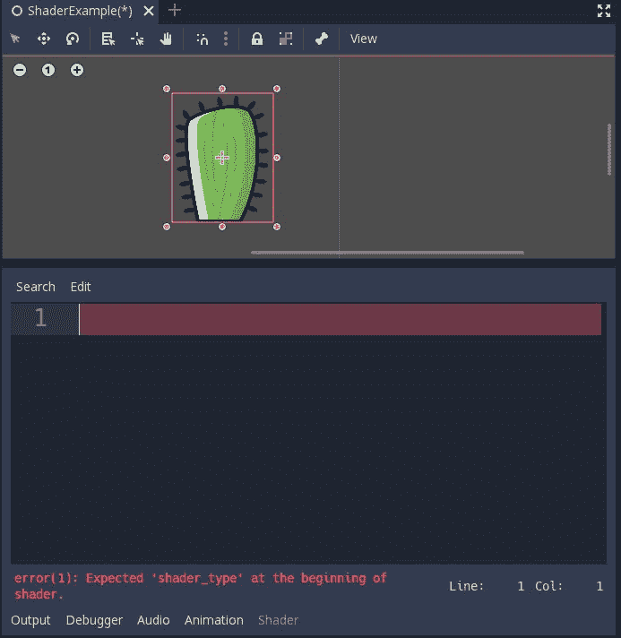

一个空的着色器看起来如下所示：

```cpp
shader_type canvas_item; // choose spatial, canvas_item, or particles

void fragment(){
    // code in this function runs on every pixel
}

void vertex() {
    // code in this function runs on each vertex
}

void light() {
    // code in this function affects light processing
}
```

在本例中，你将编写一个 2D 片段着色器，因此你不需要包含其他两个函数。

着色器函数包含许多**内置函数**，这些函数可以是输入值或输出值。例如，`TEXTURE`输入内置函数包含对象纹理的像素数据，而`COLOR`输出内置函数用于设置计算结果。记住，片段着色器的作用是影响每个处理像素的颜色。

当在`TEXTURE`属性中使用着色器时，例如，坐标是在一个**归一化**（即范围从`0`到`1`）的坐标空间中测量的。这个坐标空间被称为`UV`，以区别于*x*/*y*坐标空间：


因此，坐标向量中的所有值都将介于`0`和`1`之间。

作为一个非常小的例子，这个第一个着色器将把仙人掌图像的像素全部变为单色。为了让你选择颜色，你可以使用一个`uniform`变量。

常量允许你从外部将数据传递到着色器中。声明一个`uniform`变量将使其在检查器中显示（类似于 GDScript 中的`export`工作方式）并允许你通过代码设置它。

将以下代码输入到着色器面板中：

```cpp
shader_type canvas_item;

uniform vec4 fill_color:hint_color;

void fragment(){
    COLOR.rgb = fill_color.rgb;
}
```

你应该会立即看到图像发生变化：整个图像变成了黑色。要选择不同的颜色，点击检查器中的材质，你会在着色器参数下看到你的`uniform`变量。

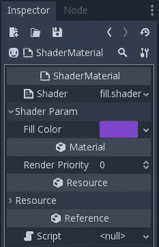

然而，你还没有完成。图像现在变成了一个彩色矩形，但你只想改变仙人掌的颜色，而不是其周围的透明像素。在设置`COLOR.rgb`之后添加一行：

```cpp
COLOR.a = texture(TEXTURE, UV).a;
```

这最后一行使着色器输出每个像素，其 alpha（透明度）值与原始纹理中的像素相同。现在仙人掌周围的空白区域保持透明，alpha 值为`0`。

以下代码显示了一个更进一步的例子。在这个着色器中，你通过将每个像素的颜色设置为周围像素的平均值来创建模糊效果：

```cpp
shader_type canvas_item;

uniform float radius = 10.0;

void fragment(){
    vec4 new_color = texture(TEXTURE, UV);
    vec2 pixel_size = TEXTURE_PIXEL_SIZE; // size of the texture in pixels

    new_color += texture(TEXTURE, UV + vec2(0, -radius) * pixel_size);
    new_color += texture(TEXTURE, UV + vec2(0, radius) * pixel_size);
    new_color += texture(TEXTURE, UV + vec2(-radius, 0) * pixel_size);
    new_color += texture(TEXTURE, UV + vec2(radius, 0) * pixel_size);

    COLOR = new_color / 5.0;
}
```

注意，由于你把五个颜色值加在一起（原始像素的，加上围绕它移动的四个），你需要除以`5.0`来得到平均值。你使`radius`越大，图像看起来就越“模糊”：


# 学习更多

着色器能够实现令人惊叹的范围的效果。在 Godot 的着色器语言中进行实验是学习基础的好方法，但互联网上也有大量资源可以帮助你学习更多。在学习着色器时，你可以使用不特定于 Godot 的资源，并且你不太可能遇到在 Godot 中使用它们的问题。这个概念在所有类型的图形应用程序中都是相同的。

要了解着色器有多强大，请访问[`www.shadertoy.com/`](https://www.shadertoy.com/)。

# 使用其他语言

本书中的项目都是使用 GDScript 编写的。GDScript 具有许多优势，使其成为构建游戏的最佳选择。它与 Godot 的 API 集成非常紧密，其 Python 风格的语法使其适用于快速开发，同时也非常适合初学者。

然而，这并非唯一的选择。Godot 还支持两种其他“官方”脚本语言，并提供使用各种其他语言集成代码的工具。

# C#

在 2018 年初 Godot 3.0 版本发布时，首次添加了对 C# 作为脚本语言的支持。C# 在游戏开发中非常流行，Godot 版本基于 Mono 5.2 .NET 框架。由于其广泛的使用，有许多学习 C# 的资源，以及大量用于实现各种游戏相关功能的现有代码。

在撰写本文时，当前 Godot 版本是 3.0.2。在这个版本中，C# 支持应被视为初步的；它是功能性的，但尚未经过全面测试。一些功能和功能，如导出项目，尚不支持。

如果你想尝试 C# 实现，你首先需要确保已经安装了 Mono，你可以从[`www.mono-project.com/download/`](http://www.mono-project.com/download/)获取。你还必须下载包含 C# 支持的 Godot 版本，你可以在[`godotengine.org/download`](http://godotengine.org/download)找到它，其中标注为“Mono 版本”。

你可能还想使用外部编辑器——例如 Visual Studio Code 或 MonoDevelop——它提供的调试和语言功能比 Godot 内置编辑器更强大。你可以在“编辑器设置”下的“Mono”部分设置此选项。

要将 C# 脚本附加到节点，请从“附加节点脚本”对话框中选择语言：

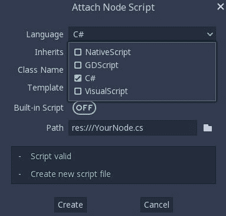

通常情况下，使用 C# 脚本与 GDScript 的使用方式非常相似。主要区别在于 API 函数的命名方式改为遵循 C# 标准，即使用 `PascalCase` 而不是 GDScript 的标准 `snake_case`。

下面是一个使用 C# 的 `KinematicBody2D` 运动的示例：

```cpp
using Godot;
using System;

public class Movement : KinematicBody2D
{
    [Export] public int speed = 200;

    Vector2 velocity = new Vector2();

    public void GetInput()
    {
        velocity = new Vector2();
        if (Input.IsActionPressed("right"))
        {
            velocity.x += 1;
        }
        if (Input.IsActionPressed("left"))
        {
            velocity.x -= 1;
        }
        if (Input.IsActionPressed("down"))
        {
            velocity.y += 1;
        }
        if (Input.IsActionPressed("up"))
        {
            velocity.y -= 1;
        }
        velocity = velocity.Normalized() * speed;
    }

    public override void _PhysicsProcess(float delta)
    {
        GetInput();
        MoveAndSlide(velocity);
    }
}
```

有关使用 C# 的更多详细信息，请参阅[`docs.godotengine.org/en/latest/getting_started/scripting/`](http://docs.godotengine.org/en/latest/getting_started/scripting/)文档中的**脚本**部分。

# VisualScript

Visual scripting 的目的是提供一种使用拖放视觉隐喻作为替代脚本方法，而不是编写代码。要创建脚本，你需要拖动代表函数和数据的节点（不要与 Godot 的节点混淆），并通过绘制线条将它们连接起来。运行你的脚本意味着沿着节点中的线条路径进行。这种展示方式的目标是为非程序员提供更直观的程序流程可视化方式，例如艺术家或动画师，他们需要在项目上进行协作。

实际上，这个目标还没有以实际的方式实现。Godot 的 VisualScript 也是在 3.0 版本中首次添加的，作为一个功能，它目前还不够成熟，不能在实际项目中使用。就像 C#一样，它应该被考虑在测试中，如果你对此感兴趣，你的测试和反馈将对 Godot 团队改进其功能非常有价值。

VisualScript 的一个潜在优势是将其用作脚本的第二层。你可以在 GDScript 中创建一个对象的核心行为，然后游戏设计师可以使用 VisualScript，在视觉节点中调用这些脚本的功能。

以下截图是一个 VisualScript 项目的示例。在这里，你可以看到 Coin Dash 中玩家移动代码的一部分：


Coin Dash 中的玩家移动代码

# 本地代码 – GDNative

有许多编程语言可供选择。每种语言都有其优点和缺点，以及一些更喜欢使用它而不是其他选项的粉丝。虽然直接在 Godot 中支持每种语言都没有意义，但在某些情况下，GDScript 可能不再足以解决特定问题。也许你想使用现有的外部库，或者你正在做一些计算密集型的工作——比如 AI 或程序化世界生成——这些对于 GDScript 来说并不合适。

由于 GDScript 是一种解释型语言，它以灵活性为代价换取性能。这意味着对于一些处理密集型的代码，它可能运行得非常慢，无法接受。在这种情况下，通过运行用编译语言编写的本地代码可以获得最高的性能。在这种情况下，你可以将那段代码移动到 GDNative 库中。

GDNative 是一个 C API，外部库可以使用它来与 Godot 接口。这些外部库可以是你的或任何你可能需要的现有第三方库。

在 GDScript 中，你可以使用`GDNative`和`GDNativeLibrary`类来加载和调用这些库中的函数。以下代码是调用已保存为`GDNativeLibrary`资源文件的库的示例：

```cpp
extends Node

func _ready():
    var lib = GDNative.new()
    lib.library = load("res://somelib.tres")
    lib.initialize()

    // call functions in the library
    var result = lib.call_native("call_type", "some_function", arguments_array)

    lib.terminate()
```

而这个库可能看起来像这样（用 C 编写）：

```cpp
#include <gdnative.h>

void GDN_EXPORT godot_gdnative_init(godot_gdnative_init_options *p_options) {
    // initialization code
}

void GDN_EXPORT godot_gdnative_terminate(godot_gdnative_terminate_options *p_options) {
    // termination code
}

void GDN_EXPORT godot_nativescript_init(void *p_handle) {

}

godot_variant GDN_EXPORT some_function(void *args) {
    // Do something
}
```

请记住，编写这样的代码肯定比坚持使用纯 GDScript 要复杂得多。在本地语言中，你需要处理对象的构造函数和析构函数的调用，并手动管理与 Godot 的`Variant`类的交互。你应该只在性能真正成为问题时才使用 GDNative，即使如此，也只有当功能确实需要使用它时才使用。

如果这个部分对你来说完全不知所云，请不要担心。大多数 Godot 开发者永远不会需要深入研究这一方面的开发。即使你发现自己需要更高性能的代码，你可能只需要查看资产库，以发现有人已经为你创建了一个库。你可以在下一节中了解关于资产库的信息。

# 语言绑定

GDNative 的另一个好处是它允许其他语言的倡导者创建 API 绑定，以实现这些语言的脚本化。

在撰写本文时，有几个项目可以使用 GDNative，允许您使用其他语言进行脚本编写。这些包括 C、C++、Python、Nim、D、Go 以及其他语言。尽管这些额外的语言绑定在撰写本文时仍然相对较新，但每个语言都有专门的开发团队在致力于它们。如果您对使用特定语言与 Godot 一起使用感兴趣，通过谷歌搜索“godot + <语言名称>”将帮助您找到可用的资源。

# 资产库

在编辑器窗口的顶部，在“工作区”部分，您会找到一个标有“AssetLib”的按钮：


点击此按钮将带您进入 Godot 的资产库。这是一个由 Godot 社区贡献的插件、工具和实用程序的集合，您可能会在项目中找到它们很有用。例如，如果您搜索“状态”，您会看到库中有一个名为**有限状态机**（**FSM**）的工具。您可以点击其名称获取更多信息，如果您决定尝试它，可以点击“安装”将其下载到`res://addons/`文件夹中，如果该文件夹不存在，将会创建：


然后，您需要通过打开项目设置并选择插件选项卡来启用插件：


插件现在可以使用了。请务必阅读插件作者的说明，以了解其工作原理。

# 为 Godot 做出贡献

Godot 是一个开源、社区驱动的项目。构建、测试、编写文档以及支持 Godot 的其他所有工作主要由充满热情的个人贡献他们的时间和技能来完成。对于大多数贡献者来说，这是一项充满爱心的劳动，他们为帮助构建人们喜欢使用的优质产品而感到自豪。

为了让 Godot 继续成长和改进，社区总是需要更多成员站出来做出贡献。无论您的技能水平如何或您能投入多少时间，都有很多方式可以帮助。

# 为引擎做出贡献

你可以直接以两种主要方式为 Godot 的开发做出贡献。如果你访问[`github.com/godotengine/godot`](https://github.com/godotengine/godot)，你可以看到 Godot 的源代码，以及了解正在进行的具体工作。点击“克隆”或“下载”按钮，你将获得最新的源代码，并可以测试最新的功能。你需要构建引擎，但不要感到害怕：Godot 是你能找到的最容易编译的开源项目之一。有关说明，请参阅[`docs.godotengine.org/en/latest/development/compiling/`](http://docs.godotengine.org/en/latest/development/compiling/)。

如果你无法实际贡献 C++代码，请转到“问题”标签页，在那里你可以报告或阅读有关错误和改进建议的信息。总是需要有人确认错误报告、测试修复并提供对新功能的意见。

# 编写文档

Godot 的官方文档的质量取决于其社区的贡献。从小到纠正一个错别字，大到编写整个教程，所有级别的帮助都非常受欢迎。官方文档的家园是[`github.com/godotengine/godot-docs`](https://github.com/godotengine/godot-docs)。

希望到现在为止，你已经花了一些时间浏览官方文档，并对可用的内容有所了解。如果你发现有什么错误或遗漏，请在上述 GitHub 链接处提交一个 issue。如果你熟悉使用 GitHub，甚至可以直接提交一个 pull request。但请确保首先阅读所有指南，以确保你的贡献会被接受。指南可以在[`docs.godotengine.org/en/latest/community/contributing/`](http://docs.godotengine.org/en/latest/community/contributing/)找到。

如果你说的不是英语，翻译也非常需要，并且会受到 Godot 的非英语用户的高度赞赏。有关如何在你的语言中做出贡献的信息，请参阅[`hosted.weblate.org/projects/godot-engine/godot-docs/`](https://hosted.weblate.org/projects/godot-engine/godot-docs/)。

# 捐赠

Godot 是一个非营利项目，用户的捐赠在很大程度上有助于支付托管费用和开发资源，例如硬件。财务捐助还允许项目支付核心开发者的工资，使他们能够全职或部分时间致力于引擎的开发工作。

向 Godot 贡献的最简单方式是通过 Patreon 页面，网址为[`www.patreon.com/godotengine`](https://www.patreon.com/godotengine)。

# 获取帮助 - 社区资源

Godot 的在线社区是其优势之一。由于其开源性质，有各种各样的人一起工作，以改进引擎、编写文档并互相帮助解决问题。

你可以在[`godotengine.org/community`](https://godotengine.org/community)找到社区资源的完整列表。

这些链接可能会随时间变化，但以下是你应该了解的主要社区资源。

# GitHub

**[`github.com/godotengine/`](https://github.com/godotengine/)**

Godot 的 GitHub 仓库是开发者工作的地方。如果你需要为个人使用编译引擎的定制版本，你可以在这里找到 Godot 的源代码。

如果你发现引擎本身有任何问题——比如某些功能不工作、文档中的错别字等——这就是你应该报告的地方。

# Godot 问答

[`godotengine.org/qa/`](https://godotengine.org/qa/)

这是 Godot 的官方帮助网站。你可以在这里发布问题供社区回答，以及搜索不断增长的先前回答的问题数据库。如果你恰好看到你知道答案的问题，你也可以提供帮助。

# Discord / 论坛

[`discord.gg/zH7NUgz`](https://discord.gg/zH7NUgz)

[`godotdevelopers.org/`](http://godotdevelopers.org/)

虽然不是官方的，但这些是两个非常活跃的 Godot 用户社区，你可以在这里寻求帮助，找到问题的答案，并与他人讨论你的项目。

# 摘要

在本章中，你了解了一些额外的主题，这些主题将帮助你继续提升你的 Godot 技能。除了本书中探索的功能外，Godot 还拥有许多其他功能。当你开始着手自己的项目时，你需要知道去哪里寻找信息，以及去哪里寻求帮助。

你还了解了一些更高级的主题，例如与其他编程语言一起工作以及使用着色器来增强你的游戏视觉效果。

此外，由于 Godot 是由其社区构建的，你学习了如何参与其中，并成为使其成为其类型中增长最快的项目之一的团队的一部分。
