# 3

# 空间岩石：使用物理构建 2D 街机经典游戏

到现在为止，你应该已经对在 Godot 中工作感到更加舒适：添加节点、创建脚本、在检查器中修改属性等等。如果你发现自己遇到了困难或者感觉不记得如何做某事，你可以回到最初解释该项目的项目。随着你在 Godot 中重复执行更常见的操作，它们将变得越来越熟悉。同时，每一章都会向你介绍更多节点和技术，以扩展你对 Godot 功能的理解。

在这个项目中，你将制作一个类似于街机经典游戏《小行星》的空间射击游戏。玩家将控制一艘可以旋转和向任何方向移动的飞船。目标将是避开漂浮的“太空岩石”并用飞船的激光射击它们。以下是最终游戏的截图：


图 3.1：空间岩石截图

在这个项目中，你将学习以下关键主题：

+   使用自定义输入操作

+   使用`RigidBody2D`进行物理运算

+   使用有限状态机组织游戏逻辑

+   构建动态、可扩展的用户界面

+   音频和音乐

+   粒子效果

# 技术要求

从以下链接下载游戏资源，并将其解压缩到你的新项目文件夹中：[`github.com/PacktPublishing/Godot-4-Game-Development-Projects-Second-Edition/tree/main/Downloads`](https://github.com/PacktPublishing/Godot-4-Game-Development-Projects-Second-Edition/tree/main/Downloads)

你也可以在 GitHub 上找到本章的完整代码：[`github.com/PacktPublishing/Godot-4-Game-Development-Projects-Second-Edition/tree/main/Chapter03%20-%20Space%20Rocks`](https://github.com/PacktPublishing/Godot-4-Game-Development-Projects-Second-Edition/tree/main/Chapter03%20-%20Space%20Rocks)

# 设置项目

创建一个新的项目，并从以下 URL 下载项目资源：[`github.com/PacktPublishing/Godot-4-Game-Development-Projects-Second-Edition/tree/main/Downloads`](https://github.com/PacktPublishing/Godot-4-Game-Development-Projects-Second-Edition/tree/main/Downloads).

对于这个项目，你需要在**输入映射**中设置自定义输入操作。使用这个功能，你可以定义自定义输入事件并将不同的键、鼠标事件或其他输入分配给它们。这使你在设计游戏时具有更大的灵活性，因为你的代码可以编写为响应“跳跃”输入，例如，而不需要确切知道用户按下了哪个键和/或按钮来触发该事件。这允许你在不同设备上使用相同的代码，即使它们具有不同的硬件。此外，由于许多玩家期望能够自定义游戏的输入，这也使你能够为用户提供此选项。

要设置这个游戏的输入，请打开**项目** | **项目设置**并选择**输入** **映射**选项卡。

你需要创建四个新的输入动作：`rotate_left`、`rotate_right`、`thrust`和`shoot`。将每个动作的名称输入到**添加新动作**框中，然后按*Enter*键或点击**添加**按钮。确保你输入的名称与显示的完全一致，因为它们将在后面的代码中使用。

然后，对于每个动作，点击其右侧的**+**按钮。在弹出的窗口中，你可以手动选择特定的输入类型，或者按物理按钮，Godot 将检测它。你可以为每个动作添加多个输入。例如，为了允许玩家使用箭头键和 WASD 键，设置将看起来像这样：

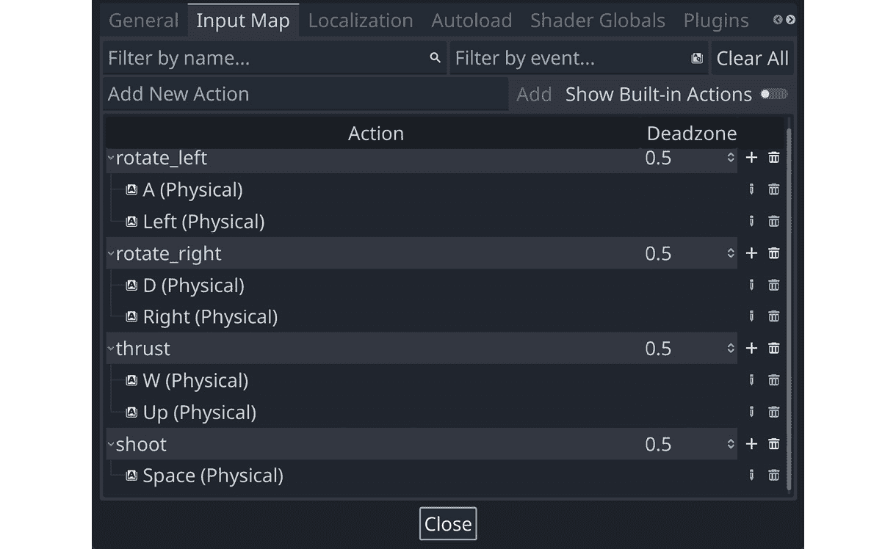

图 3.2：输入动作

如果你将游戏手柄或其他控制器连接到你的电脑，你也可以以相同的方式将其输入添加到动作中。

注意

在这个阶段，我们只考虑按钮式输入，所以虽然你将能够在这个项目中使用 D-pad，但使用模拟摇杆将需要更改项目的代码。

## 刚体物理

在游戏开发中，你经常需要知道游戏空间中的两个物体是否相交或接触。这被称为**碰撞检测**。当检测到碰撞时，你通常希望发生某些事情。这被称为**碰撞响应**。

Godot 提供了三种类型的物理体，它们被归类在`PhysicsBody2D`节点类型下：

+   `StaticBody2D`：静态体是指不会被物理引擎移动的物体。它参与碰撞检测，但不会移动响应。这种类型的物体通常用于环境的一部分或不需要任何动态行为的物体，例如墙壁或地面。

+   `RigidBody2D`：这是提供模拟物理的物理体。这意味着你不会直接控制`RigidBody2D`物理体的位置。相反，你对其施加力（重力、冲量等），然后 Godot 的内置物理引擎计算结果运动，包括碰撞、弹跳、旋转和其他效果。

+   `CharacterBody2D`：这种类型的物体提供碰撞检测，但没有物理属性。所有运动都必须在代码中实现，你必须自己实现任何碰撞响应。运动学体通常用于玩家角色或其他需要*街机风格*物理而不是真实模拟的演员，或者当你需要更精确地控制物体移动时。

了解何时使用特定的物理体类型是构建游戏的重要组成部分。使用正确的类型可以简化你的开发，而试图强制错误的节点执行任务可能会导致挫败感和不良结果。随着你与每种类型的物体一起工作，你会了解它们的优缺点，并学会何时它们可以帮助构建你需要的东西。

在这个项目中，你将使用`RigidBody2D`节点来控制船只以及岩石本身。你将在后面的章节中学习其他类型的物体。

单个 `RigidBody2D` 节点有许多你可以用来自定义其行为的属性，例如 **质量**、**摩擦** 或 **弹跳**。这些属性可以在检查器中设置。

刚体也受到全局属性的影响，这些属性可以在 **项目设置** 下的 **物理** | **2D** 中设置。这些设置适用于世界中的所有物体。

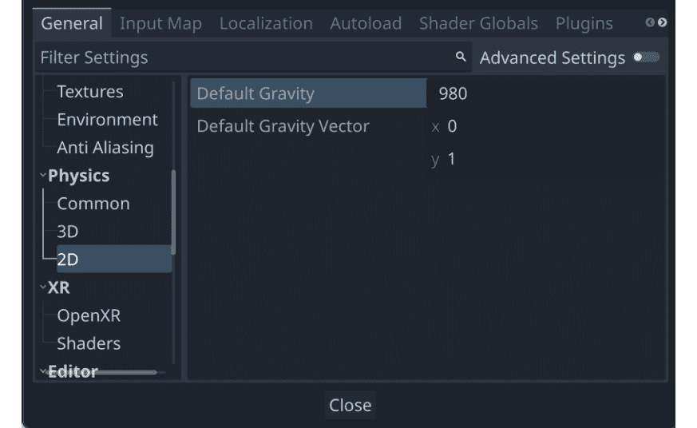

图 3.3：项目物理设置

在大多数情况下，你不需要修改这些设置。但是，请注意，默认情况下，重力值为 `980`，方向为 `(0, 1)`，即向下。如果你想改变世界的重力，你可以在这里进行更改。

如果你点击 **项目设置** 窗口右上角的 **高级设置** 切换按钮，你将看到许多物理引擎的高级配置值。你应该特别注意其中的两个：**默认线性阻尼** 和 **默认角阻尼**。这些属性分别控制物体失去前进速度和旋转速度的快慢。将它们设置为较低的值会使世界感觉没有摩擦，而使用较大的值会使物体移动时感觉像穿过泥浆。这可以是一种很好的方式，将不同的运动风格应用于各种游戏对象和环境。

区域物理覆盖

`Area2D` 节点也可以通过使用它们的 **Space Override** 属性来影响刚体物理。然后，将应用自定义的重力和阻尼值到进入该区域的任何物体上。

由于这款游戏将在外太空进行，因此不需要重力，所以设置为 `0`。你可以保留其他设置不变。

这就完成了项目设置任务。回顾这一节并确保你没有遗漏任何内容是个好主意，因为你在这里所做的更改将影响许多游戏对象的行为。你将在下一节中看到这一点，那时你将制作玩家的飞船。

# 玩家的飞船

玩家的飞船是这款游戏的核心。你将为这个项目编写的绝大部分代码都将关于使飞船工作。它将以经典的“小行星风格”进行控制，包括左右旋转和前进推进。玩家还将能够发射激光并摧毁漂浮的岩石。

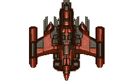

图 3.4：玩家的飞船

## 身体和物理设置

创建一个新的场景，并添加一个名为 `Player` 的 `RigidBody2D` 作为根节点，带有 `Sprite2D` 和 `CollisionShape2D` 子节点。将 `res://assets/player_ship.png` 图像添加到 `Sprite2D`。飞船图像相当大，所以将 `Sprite2D` 设置为 `(0.5, 0.5)` 和 `90`。

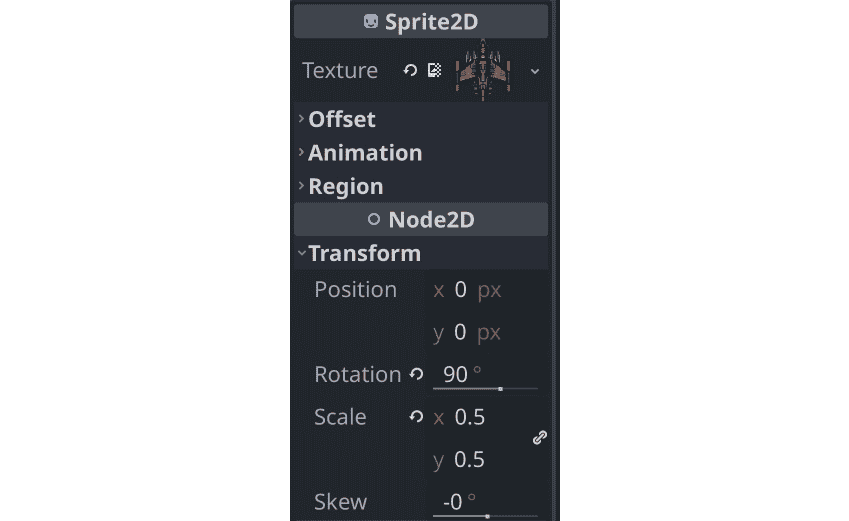

图 3.5：玩家精灵设置

精灵方向

飞船的图像是向上绘制的。在 Godot 中，`0` 度的旋转指向右侧（沿 `x` 轴）。这意味着你需要旋转精灵，使其与身体的朝向相匹配。如果你使用正确方向的绘画艺术，你可以避免这一步。然而，发现向上方向的绘画艺术是非常常见的，所以你应该知道该怎么做。

在 `CollisionShape2D` 中添加一个 `CircleShape2D` 并将其缩放以尽可能紧密地覆盖图像。

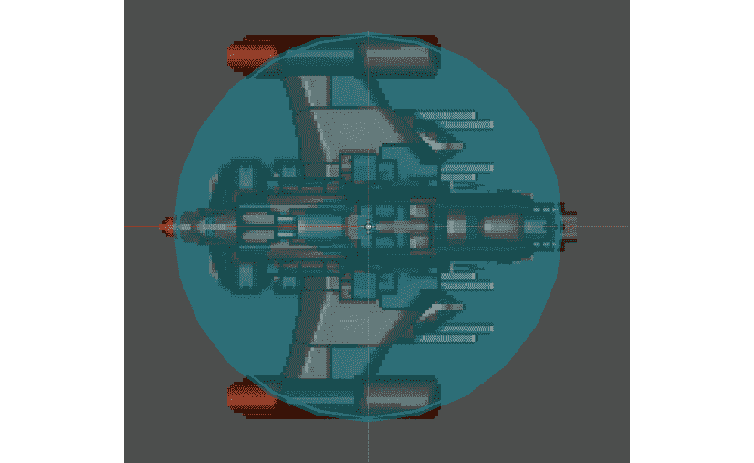

图 3.6：玩家碰撞形状

玩家飞船以像素艺术风格绘制，但如果你放大查看，可能会注意到它看起来非常模糊和“平滑”。Godot 默认的纹理绘制过滤器设置使用这种平滑技术，这对于某些艺术作品来说看起来不错，但对于像素艺术通常是不想要的。你可以在每个精灵（在 **CanvasItem** 部分中）上单独设置过滤器，或者你可以在 **项目设置** 中全局设置。

打开 **项目设置** 并检查 **高级设置** 开关，然后找到 **渲染/纹理** 部分。在底部附近，你会看到两个 **Canvas Textures** 设置。将 **默认纹理过滤器** 设置为 **最近邻**。

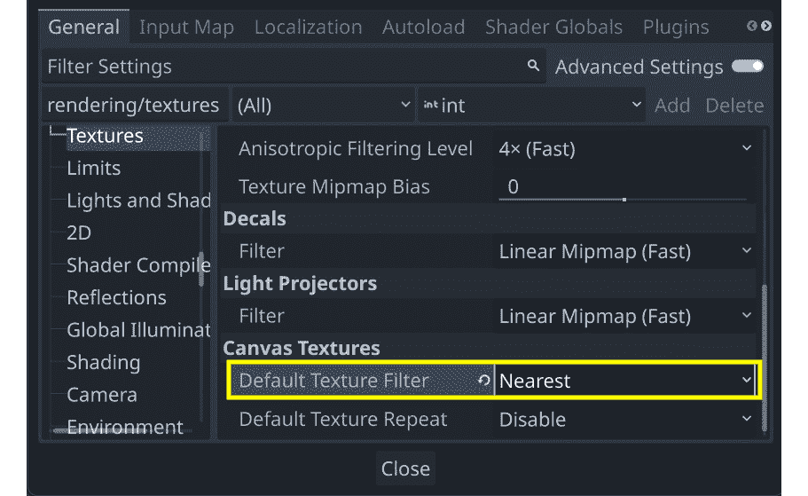

图 3.7：默认纹理过滤器设置

保存场景。在处理更大规模的项目时，建议根据每个游戏对象将场景和脚本组织到文件夹中，而不是将它们全部保存在根项目文件夹中。例如，如果你创建一个“玩家”文件夹，你可以将所有与玩家相关的文件保存在那里。这使得查找和修改你的各种游戏对象变得更加容易。虽然这个项目相对较小——你将只有几个场景——但随着项目规模和复杂性的增加，养成这种习惯是很好的。

## 状态机

玩家飞船在游戏过程中可以处于多种不同的状态。例如，当 *存活* 时，飞船是可见的，并且可以被玩家控制，但它容易受到岩石的撞击。另一方面，当 *无敌* 时，飞船应该看起来半透明，并且对伤害免疫。

程序员处理此类情况的一种常见方式是在代码中添加布尔变量，或 *标志*。例如，当玩家首次生成时，将 `invulnerable` 标志设置为 `true`，或者当玩家死亡时，将 `alive` 设置为 `false`。然而，当由于某种原因同时将 `alive` 和 `invulnerable` 都设置为 `false` 时，这可能会导致错误和奇怪的情况。在这种情况下，如果一块石头撞击玩家会发生什么？如果飞船只能处于一个明确定义的状态，那就更好了。

解决这个问题的方法之一是使用**有限状态机**（**FSM**）。当使用 FSM 时，实体在给定时间只能处于一个状态。为了设计你的 FSM，你定义了多个状态以及什么事件或动作可以导致从一个状态转换到另一个状态。

以下图显示了玩家飞船的 FSM：

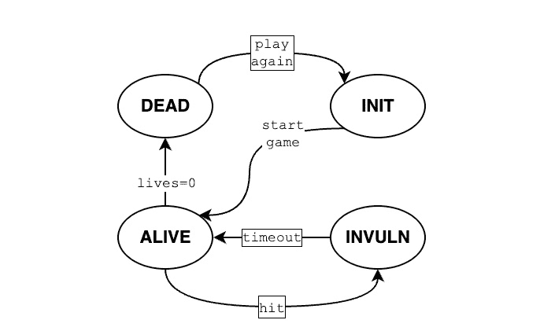

图 3.8：状态机图

有四个状态，由椭圆形表示，箭头指示状态之间可以发生什么转换，以及什么触发转换。通过检查当前状态，你可以决定玩家被允许做什么。例如，在**死亡**状态中，不允许输入，或者在**无敌**状态中，允许移动但不允许射击。

高级 FSM 实现可能相当复杂，细节超出了本书的范围（参见*附录*以获取进一步阅读）。在最纯粹的意义上，你在这里不会创建一个真正的 FSM，但为了这个项目的目的，它将足以说明这个概念并防止你遇到布尔标志问题。

将脚本添加到`Player`节点，并首先创建 FSM 实现的骨架：

```cpp
extends RigidBody2D
enum {INIT, ALIVE, INVULNERABLE, DEAD}
var state = INIT
```

上一段代码中的`enum`语句等同于编写以下代码：

```cpp
const INIT = 0
const ALIVE = 1
const INVULNERABLE = 2
const DEAD = 3
```

接下来，创建`change_state()`函数以处理状态转换：

```cpp
func _ready():
    change_state(ALIVE)
func change_state(new_state):
    match new_state:
        INIT:
            $CollisionShape2D.set_deferred("disabled",
                true)
        ALIVE:
            $CollisionShape2D.set_deferred("disabled",
                false)
        INVULNERABLE:
            $CollisionShape2D.set_deferred("disabled",
                true)
        DEAD:
            $CollisionShape2D.set_deferred("disabled",
                true)
    state = new_state
```

每当你需要更改玩家的状态时，你将调用`change_state()`函数并传递新状态的价值。然后，通过使用`match`语句，你可以执行伴随新状态转换的任何代码，或者如果你不希望发生该转换，则禁止它。为了说明这一点，`CollisionShape2D`节点将由新状态启用/禁用。在`_ready()`中，我们设置`ALIVE`为初始状态——这是为了测试，但稍后我们将将其更改为`INIT`。

## 添加玩家控制

在脚本的顶部添加以下变量：

```cpp
@export var engine_power = 500
@export var spin_power = 8000
var thrust = Vector2.ZERO
var rotation_dir = 0
```

`engine_power`和`spin_power`控制飞船加速和转向的速度。`thrust`代表引擎施加的力：当滑行时为`(0, 0)`，当引擎开启时为一个指向前方的向量。`rotation_dir`表示飞船转向的方向，以便你可以施加一个*扭矩*或旋转力。

如我们之前在`1`和`5`中看到的。你可以稍后调整它们以改变飞船的处理方式。

下一步是检测输入并移动飞船：

```cpp
func _process(delta):
    get_input()
func get_input():
    thrust = Vector2.ZERO
    if state in [DEAD, INIT]:
        return
    if Input.is_action_pressed("thrust"):
        thrust = transform.x * engine_power
    rotation_dir = Input.get_axis("rotate_left",
        "rotate_right")
func _physics_process(delta):
    constant_force = thrust
    constant_torque = rotation_dir * spin_power
```

`get_input()`函数捕获按键动作并设置飞船的推力开启或关闭。请注意，推力的方向基于身体的`transform.x`，它始终代表身体的“前进”方向（参见*附录*以获取变换的概述）。

`Input.get_axis()`根据两个输入返回一个值，代表负值和正值。因此，`rotation_dir`将表示顺时针、逆时针或零，具体取决于两个输入动作的状态。

最后，当使用物理体时，它们的运动和相关函数应该始终在`_physics_process()`中调用。在这里，你可以应用由输入设置的力，以实际移动物体。

播放场景，你应该能够自由地飞来飞去。

## 屏幕环绕

经典 2D 街机游戏的一个特点是*屏幕环绕*。如果玩家离开屏幕的一侧，他们就会出现在另一侧。在实践中，你通过瞬间改变其位置来将飞船传送到另一侧。你需要知道屏幕的大小，所以请将以下变量添加到脚本顶部：

```cpp
var screensize = Vector.ZERO
```

并将其添加到`_ready()`：

```cpp
screensize = get_viewport_rect().size
```

之后，你可以让游戏的主脚本处理设置所有游戏对象的`screensize`，但就目前而言，这将允许你仅通过玩家的场景来测试屏幕环绕效果。

当首次接触这个问题时，你可能认为可以使用物体的`position`属性，如果它超出了屏幕的边界，就将其设置为对面的边。如果你使用任何其他节点类型，那将工作得很好；然而，当使用`RigidBody2D`时，你不能直接设置`position`，因为这会与物理引擎正在计算的运动发生冲突。一个常见的错误是尝试添加如下内容：

```cpp
func _physics_process(delta):
    if position.x > screensize.x:
        position.x = 0
    if position.x < 0:
        position.x = screensize.x
    if position.y > screensize.y:
        position.y = 0
    if position.y < 0:
        position.y = screensize.y
```

如果你想在*Coin Dash*中的`Area2D`尝试这个，它将完美地工作。在这里，它将失败，将玩家困在屏幕边缘，并在角落处出现不可预测的故障。那么，答案是什么？

引用`RigidBody2D`文档：

注意：你不应该在每一帧或非常频繁地更改 RigidBody2D 的`position`或`linear_velocity`。如果你需要直接影响物体的状态，请使用`_integrate_forces`，这允许你直接访问物理状态。

并且在`_integrate_forces()`的描述中：

（它）允许你读取并安全地修改对象的模拟状态。如果你需要直接更改物体的位置或其他物理属性，请使用此方法代替`_physics_process`。

因此，答案是当你想直接影响刚体的位置时使用这个单独的函数。使用`_integrate_forces(`)让你可以访问物体的`PhysicsDirectBodyState2D` – 一个包含大量关于物体当前状态的有用信息的 Godot 对象。由于你想改变物体的位置，这意味着你需要修改它的`Transform2D`。

`Transform2D`的`origin`属性。

使用这些信息，你可以通过添加以下代码来实现环绕效果：

```cpp
func _integrate_forces(physics_state):
    var xform = physics_state.transform
    xform.origin.x = wrapf(xform.origin.x, 0, screensize.x)
    xform.origin.y = wrapf(xform.origin.y, 0, screensize.y)
    physics_state.transform = xform
```

`wrapf()`函数接受一个值（第一个参数）并将其“环绕”在你选择的任何最小/最大值之间。所以，如果值低于`0`，它就变成`screensize.x`，反之亦然。

注意，你使用的是`physics_state`作为参数名，而不是默认的`state`。这是为了避免混淆，因为`state`已经被用来跟踪玩家的状态。

再次运行场景，并检查一切是否按预期工作。确保你尝试在所有四个方向上环绕。

## 射击

现在是给你的船装备一些武器的时候了。当按下 `shoot` 动作时，一个子弹/激光应该出现在船的前端，然后沿直线飞行，直到飞出屏幕。玩家在经过一小段时间后（也称为 **冷却时间**）才能再次射击。

### 子弹场景

这是子弹的节点设置：

+   `Area2D` 命名为 `Bullet`

    +   `Sprite2D`

    +   `CollisionShape2D`

    +   `VisibleOnScreenNotifier2D`

使用从资源文件夹 `res://assets/laser.png` 的 `Sprite2D` 和一个 `CapsuleShape2D` 作为碰撞形状。你需要将 `CollisionShape2D` 设置为 `90` 以确保它正确对齐。你还应该将 `Sprite2D` 缩小到大约一半的大小：`(``0.5, 0.5)`。

将以下脚本添加到 `Bullet` 节点：

```cpp
extends Area2D
@export var speed = 1000
var velocity = Vector2.ZERO
func start(_transform):
    transform = _transform
    velocity = transform.x * speed
func _process(delta):
    position += velocity * delta
```

每当你生成一个新的子弹时，你将调用 `start()` 函数。通过传递一个变换，你可以给它正确的位置和旋转——通常是船的炮口（关于这一点稍后会有更多介绍）。

`VisibleOnScreenNotifier2D` 是一个节点，每当一个节点变为可见或不可见时，它会通过一个信号通知你。你可以使用这个功能来自动删除飞出屏幕的子弹。连接节点的 `screen_exited` 信号并添加以下内容：

```cpp
func _on_visible_on_screen_notifier_2d_screen_exited():
    queue_free()
```

最后，连接子弹的 `body_entered` 信号，以便它可以检测到它击中了一块石头。子弹不需要知道任何关于石头的事情，只需要知道它击中了某个东西。当你创建石头时，你将把它添加到一个名为 `rocks` 的组中，并给它一个 `explode()` 方法：

```cpp
func _on_bullet_body_entered(body):
    if body.is_in_group("rocks"):
        body.explode()
        queue_free()
```

### 发射子弹

下一步是在玩家按下 `shoot` 动作时创建 `Bullet` 场景的实例。然而，如果你把子弹变成玩家的子节点，那么它会随着玩家移动和旋转，而不是独立移动。你可以使用 `get_parent().add_child()` 将子弹添加到主场景中，因为当游戏运行时，`Main` 场景将是玩家的父节点。但是，这意味着你将无法单独运行和测试 `Player` 场景。或者，如果你决定重新排列你的 `Main` 场景，使玩家成为某个其他节点的子节点，子弹就不会出现在你期望的位置。

通常来说，编写假设固定树布局的代码是一个坏主意。特别是尽量避免使用 `get_parent()` 的情况。一开始你可能觉得很难这样思考，但这将导致一个更模块化的设计，并防止一些常见的错误。

在任何情况下，`SceneTree` 总是存在的，对于这个游戏来说，将子弹作为树的根节点（即包含游戏的 `Window`）的子节点是完全可以的。

在玩家上添加一个名为 `Muzzle` 的 `Marker2D` 节点。这将标记枪的枪口——子弹将生成的位置。将 `(50, 0)` 设置为将其直接放置在船的前方。

接下来，添加一个`Timer`节点并将其命名为`GunCooldown`。这将给枪提供冷却时间，防止在经过一定时间后发射新的子弹。勾选**One Shot**和**Autostart**复选框以“开启”。

将以下新变量添加到玩家的脚本中：

```cpp
@export var bullet_scene : PackedScene
@export var fire_rate = 0.25
var can_shoot = true
```

将`bullet.tscn`文件拖放到检查器中新的**Bullet**属性。

将此行添加到`_ready()`中：

```cpp
$GunCooldown.wait_time = fire_rate
```

并将此添加到`get_input()`中：

```cpp
if Input.is_action_pressed("shoot") and can_shoot:
    shoot()
```

现在创建一个`shoot()`函数，该函数将处理创建子弹：

```cpp
func shoot():
    if state == INVULNERABLE:
        return
    can_shoot = false
    $GunCooldown.start()
    var b = bullet_scene.instantiate()
    get_tree().root.add_child(b)
    b.start($Muzzle.global_transform)
```

射击时，首先将`can_shoot`设置为`false`，这样动作就不会再调用`shoot()`。然后，将新子弹作为场景树根节点的子节点添加。最后，调用子弹的`start()`函数，并给它提供枪口节点的*全局*变换。注意，如果你在这里使用`transform`，你会给出相对于玩家的枪口位置（记住是`(50, 0)`），因此子弹会在完全错误的位置生成。这是理解局部和全局坐标之间区别重要性的另一个例子。

为了允许枪再次射击，连接`GunCooldown`的`timeout`信号：

```cpp
func _on_gun_cooldown_timeout():
    can_shoot = true
```

### 测试玩家的飞船

创建一个新的场景，使用名为`Main`的`Node`，并添加一个名为`Background`的`Sprite2D`作为子节点。在`Player`场景中使用`res://assets/space_background.png`。

播放主场景并测试是否可以飞行和射击。

现在玩家的飞船工作正常，是时候暂停并检查你的理解了。与刚体一起工作可能会有点棘手；花几分钟时间实验本节中的一些设置和代码。只是确保在进入下一节之前将它们改回原样，下一节你将添加小行星到游戏中。

# 添加岩石

游戏的目标是摧毁漂浮的太空岩石，所以现在你可以射击了，是时候添加它们了。像飞船一样，岩石将使用`RigidBody2D`，这将使它们以恒定的速度直线运动，除非受到干扰。它们还会以逼真的方式相互弹跳。为了使事情更有趣，岩石将开始时很大，当你射击它们时，会分裂成多个更小的岩石。

## 场景设置

创建一个新的场景，使用名为`Rock`的`RigidBody2D`节点，并添加一个使用`res://assets/rock.png`纹理的`Sprite2D`子节点。添加一个`CollisionShape2D`，但*不要*设置其形状。因为你会生成不同大小的岩石，所以碰撞形状需要在代码中设置并调整到正确的大小。

你不希望岩石滑行到停止，所以它们需要忽略默认的线性和角阻尼。将两个都设置为`0`和`New PhysicsMaterial`，然后点击它以展开。设置显示为`1`。

## 变量大小岩石

将脚本附加到`Rock`上并定义成员变量：

```cpp
extends RigidBody2D
var screensize = Vector2.ZERO
var size
var radius
var scale_factor = 0.2
```

`主`脚本将处理生成新岩石，包括在关卡开始时以及在大岩石爆炸后出现的较小岩石。一个大岩石将有一个大小为`3`，分解成大小为`2`的岩石，依此类推。`scale_factor`乘以`size`来设置`Sprite2D`缩放、碰撞半径等。你可以稍后调整它来改变每个岩石类别的尺寸。

所有这些都将通过`start()`方法设置：

```cpp
func start(_position, _velocity, _size):
    position = _position
    size = _size
    mass = 1.5 * size
    $Sprite2D.scale = Vector2.ONE * scale_factor * size
    radius = int($Sprite2D.texture.get_size().x / 2 *
        $Sprite2D.scale.x)
    var shape = CircleShape2D.new()
    shape.radius = radius
    $CollisionShape2d.shape = shape
    linear_velocity = _velocity
    angular_velocity = randf_range(-PI, PI)
```

这是你根据岩石的`size`计算正确碰撞大小的地方。请注意，由于`position`和`size`已经被用作类变量，你可以使用下划线作为函数的参数以防止冲突。

岩石也需要像玩家一样绕屏幕滚动，所以使用相同的技术与`_integrate_forces()`：

```cpp
func _integrate_forces(physics_state):
    var xform = physics_state.transform
    xform.origin.x = wrapf(xform.origin.x, 0 - radius,
        screensize.x + radius)
    xform.origin.y = wrapf(xform.origin.y, 0 - radius,
        screensize.y + radius)
    physics_state.transform = xform
```

这里的一个区别是，将岩石的`radius`包含在计算中会导致看起来更平滑的传送效果。岩石看起来会完全退出屏幕，然后进入对面。你可能也想用同样的方法处理玩家的飞船。试试看，看看你更喜欢哪一个。

## 实例化岩石

当生成新的岩石时，主场景需要选择一个随机的起始位置。为此，你可以使用一些数学方法来选择屏幕边缘的随机点，但相反，你可以利用另一种 Godot 节点类型。你将在屏幕边缘绘制一个路径，脚本将选择该路径上的一个随机位置。

在`主`场景中，添加一个`Path2D`节点并将其命名为`RockPath`。当你选择该节点时，你将在编辑器窗口的顶部看到一些新的按钮：


图 3.9：路径绘制工具

选择中间的（**添加点**）通过点击以下截图所示的点来绘制路径。为了使点对齐，请确保**使用网格吸附**被勾选。此选项位于编辑器窗口顶部的图标栏中：


图 3.10：启用网格吸附

按照以下截图所示的顺序绘制点。点击第四个点后，点击**关闭曲线**按钮（截图中标为*5*），你的路径将完成：

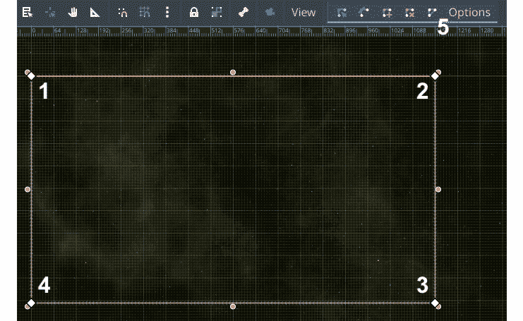

图 3.11：路径绘制顺序

如果你选择了`RockPath`，请不要再次在编辑器窗口中点击！如果你这样做，你会在曲线上添加额外的点，你的岩石可能不会出现在你想要的位置。你可以按*Ctrl* + *Z*来撤销你可能添加的任何额外点。

现在路径已经定义，将 `PathFollow2D` 添加为 `RockPath` 的子节点，并命名为 `RockSpawn`。此节点的目的是使用其 **Progress** 属性自动沿着其父路径移动，该属性表示路径上的偏移量。偏移量越高，它沿着路径移动得越远。由于我们的路径是闭合的，如果偏移量值大于路径长度，它也会循环。

将以下脚本添加到 `Main.gd`：

```cpp
extends Node
@export var rock_scene : PackedScene
var screensize = Vector2.ZERO
func _ready():
    screensize = get_viewport().get_visible_rect().size
    for i in 3:
        spawn_rock(3)
```

你首先获取 `screensize`，以便在石头生成时传递给它。然后，生成三个大小为 `3` 的石头。别忘了将 `rock.tscn` 拖到 **Rock** 属性上。

这里是 `spawn_rock()` 函数：

```cpp
func spawn_rock(size, pos=null, vel=null):
    if pos == null:
        $RockPath/RockSpawn.progress = randi()
        pos = $RockPath/RockSpawn.position
    if vel == null:
        vel = Vector2.RIGHT.rotated(randf_range(0, TAU)) *
            randf_range(50, 125)
    var r = rock_scene.instantiate()
    r.screensize = screensize
    r.start(pos, vel, size)
    call_deferred("add_child", r)
```

此函数有两个作用。当只调用一个 `size` 参数时，它会在 `RockPath` 上选择一个随机位置和一个随机速度。然而，如果提供了这些值，它将使用它们。这将允许你通过指定它们的属性在爆炸位置生成较小的石头。

运行游戏后，你应该看到三块石头在周围漂浮，但你的子弹对它们没有影响。

## 爆炸石头

子弹检查 `rocks` 组中的身体，所以在 `Rock` 场景中，选择 `rocks` 并点击 **Add**：


图 3.12：添加“rocks”组

现在，如果你运行游戏并射击一块石头，你会看到一个错误消息，因为子弹正在尝试调用石头的 `explode()` 方法，但你还没有定义它。此方法需要做三件事：

+   移除石头

+   播放爆炸动画

+   通知 `Main` 生成新的、更小的石头

### 爆炸场景

爆炸将是一个独立的场景，你可以将其添加到 `Rock`，然后添加到 `Player`。它将包含两个节点：

+   `Sprite2D` 命名为 `Explosion`

+   `AnimationPlayer`

对于 `Sprite2D` 节点的 `res://assets/explosion.png`。你会注意到这是一个 `Sprite2D` 节点，它支持使用它们。

在检查器中，找到精灵的 `8`。这将把精灵图集切成 64 个单独的图像。你可以通过更改 `0` 和 `63` 来验证这一点。确保在继续之前将其设置回 `0`。


图 3.13：精灵动画设置

`AnimationPlayer` 节点可以用来动画化任何节点的任何属性。你将使用它来随时间改变 **Frame** 属性。首先选择节点，你会在底部打开 **Animation** 面板：


图 3.14：动画面板

点击 `explosion`。设置 `0.64` 和 `0.01`。选择 `Sprite2D` 节点，你会注意到检查器中现在每个属性旁边都有一个键符号。点击一个键将在当前动画中创建一个 *关键帧*。


图 3.15：动画时间设置

点击 `Explosion` 节点的 `AnimationPlayer` 旁边的键，在时间 `0` 时，你想让精灵的 `0`。

滑动刮擦器到时间`0.64`（如果看不到，可以使用滑块调整缩放）。设置`63`并再次点击键。现在动画知道在动画的最终时间使用最后一张图像。然而，你还需要让`AnimationPlayer`知道你希望在两个点之间的时间使用所有中间值。在动画轨道的右侧有一个**更新模式**下拉菜单。它目前设置为**离散**，你需要将其更改为**连续**：

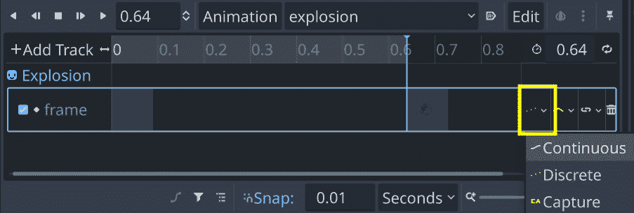

图 3.16：设置更新模式

点击**播放**按钮，在**动画**面板中查看动画。

你现在可以将爆炸添加到岩石上。在`Rock`场景中，添加一个`Explosion`实例，并点击节点旁边的眼睛图标使其隐藏。将此行添加到`start()`中：

```cpp
$Explosion.scale = Vector2.ONE * 0.75 * size
```

这将确保爆炸的缩放与岩石的大小相匹配。

在脚本顶部添加一个名为`exploded`的信号，然后添加`explode()`函数，该函数将在子弹击中岩石时被调用：

```cpp
func explode():
    $CollisionShape2D.set_deferred("disabled", true)
    $Sprite2d.hide()
    $Explosion/AnimationPlayer.play("explosion")
    $Explosion.show()
    exploded.emit(size, radius, position, linear_velocity)
    linear_velocity = Vector2.ZERO
    angular_velocity = 0
    await $Explosion/AnimationPlayer.animation_finished
    queue_free()
```

在这里，你隐藏岩石并播放爆炸，等待爆炸完成后才移除岩石。当你发出`exploded`信号时，你还包括所有岩石的信息，这样`Main`中的`spawn_rock()`就可以在相同的位置生成较小的岩石。

测试游戏并确认在射击岩石时可以看到爆炸效果。

### 生成较小的岩石

`Rock`场景正在发出信号，但`Main`还没有监听它。你无法在`spawn_rock()`中连接信号：

```cpp
r.exploded.connect(self._on_rock_exploded)
```

这将把岩石的信号连接到`Main`中的一个函数，你也需要创建它：

```cpp
func _on_rock_exploded(size, radius, pos, vel):
    if size <= 1:
        return
    for offset in [-1, 1]:
        var dir = $Player.position.direction_to(pos)
            .orthogonal() * offset
        var newpos = pos + dir * radius
        var newvel = dir * vel.length() * 1.1
        spawn_rock(size - 1, newpos, newvel)
```

在这个函数中，除非刚刚被摧毁的岩石大小为`1`（最小尺寸），否则你将创建两个新的岩石。`offset`循环变量确保两个新的岩石向相反方向移动（即，一个的速度将是负值）。`dir`变量找到玩家和岩石之间的向量，然后使用`orthogonal()`得到一个垂直的向量。这确保了新的岩石不会直接飞向玩家。

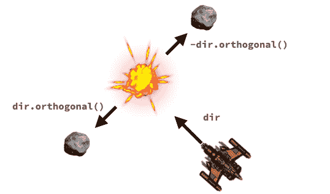

图 3.17：爆炸图

再次播放游戏并检查一切是否按预期工作。

这是一个很好的地方停下来回顾你已经做了什么。你已经完成了游戏的所有基本功能：玩家可以飞行并射击；岩石漂浮、弹跳和爆炸；并且会生成新的岩石。你现在应该对使用刚体感到更加自在。在下一节中，你将开始构建界面，允许玩家开始游戏并在游戏过程中查看重要信息。

# 创建用户界面

为你的游戏创建 UI 可能非常复杂，或者至少很耗时。精确放置单个元素并确保它们在不同尺寸的屏幕和设备上都能正常工作，对于许多程序员来说，这是游戏开发中最不有趣的部分。Godot 提供了各种 `Control` 节点来协助这个过程。学习如何使用各种 `Control` 节点将有助于减轻创建精美 UI 的痛苦。

对于这个游戏，你不需要一个非常复杂的 UI。游戏需要提供以下信息和交互：

+   开始按钮

+   状态信息（例如“准备”或“游戏结束”）

+   得分

+   生命值计数器

这里是你将要制作的内容预览：

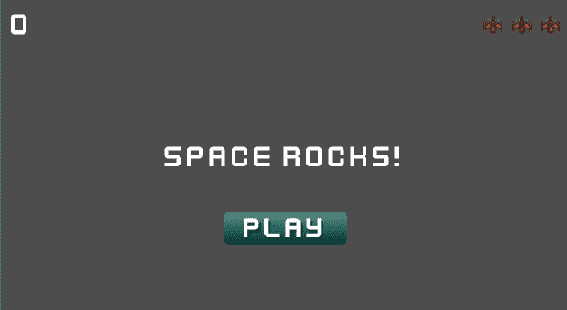

图 3.18：UI 布局

创建一个新的场景，并将名为 `HUD` 的 `CanvasLayer` 节点作为根节点。你将在这个层上使用 `Control` 节点的布局功能来构建 UI。

## 布局

Godot 的 `Control` 节点包括许多专用容器。这些节点可以嵌套在一起以创建所需的精确布局。例如，`MarginContainer` 会自动为其内容添加填充，而 `HBoxContainer` 和 `VBoxContainer` 分别按行或列组织其内容。

按照以下步骤构建布局：

1.  首先添加 `Timer` 和 `MarginContainer` 子节点，它们将包含得分和生命值计数器。在 **布局** 下拉菜单中，选择 **Top Wide**。

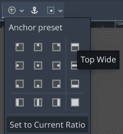

图 3.19：Top Wide 控件对齐

1.  在检查器中，将 **主题覆盖/常量** 中的四个边距设置为 20。

1.  将 `Timer` 设置为开启并设置为 `2`。

1.  作为容器的子节点，添加一个 `HBoxContainer`，它将把得分计数器放在左边，生命值计数器放在右边。在这个容器下，添加一个 `Label`（命名为 `ScoreLabel`）和一个 `HBoxContainer`（命名为 `LivesCounter`）。

将 `ScoreLabel` 的值设置为 `0`，并在 `res://assets/kenvector_future_thin.ttf` 下设置字体大小为 `64`。

1.  选择 `LivesCounter` 并设置 `20`，然后添加一个子节点 `TextureRect` 并命名为 `L1`。将 `res://assets/player_small.png` 拖到选中的 `L1` 节点，并按 *duplicate* (*Ctrl* + *D*) 键两次以创建 `L2` 和 `L3`（它们将被自动命名）。在游戏过程中，`HUD` 将显示或隐藏这三个纹理，以指示玩家剩余的生命值。

1.  在更大、更复杂的 UI 中，你可能将这一部分保存为其自己的场景，并将其嵌入 UI 的其他部分。然而，这个游戏只需要几个更多元素，所以将它们全部组合在一个场景中是完全可以的。

1.  作为 `HUD` 的子节点，添加一个 `VBoxContainer`，并在其中添加一个名为 `Message` 的 `Label` 和一个名为 `StartButton` 的 `TextureButton`。将 `VBoxContainer` 的布局设置为 `100`。

1.  在`res://assets`文件夹中，有两个`StartButton`的纹理，一个是正常的（`play_button.png`），另一个是在鼠标悬停时显示的（`'play_button_h.png'`）。将这些拖到检查器的**Textures/Normal**和**Textures/Hover**中。将按钮的**布局/容器大小/水平**设置为**收缩居中**，这样它就会在水平方向上居中。

1.  将`Message`文本设置为“Space Rocks!”，并使用与`ScoreLabel`相同的设置来设置其字体。将**水平对齐**设置为**居中**。

完成后，你的场景树应该看起来像这样：

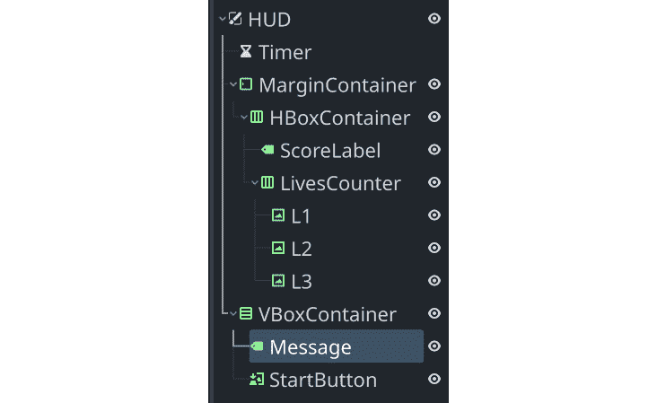

图 3.20：HUD 节点布局

## 编写 UI 脚本

你已经完成了 UI 布局，现在向`HUD`添加一个脚本。由于你将需要引用的节点位于容器下，你可以在开始时将这些节点的引用存储在变量中。由于这需要在节点添加到树之后发生，你可以使用`@onready`装饰器来使变量的值在`_ready()`函数运行时同时设置。

```cpp
extends CanvasLayer
signal start_game
@onready var lives_counter = $MarginContainer/HBoxContainer/LivesCounter.get_children()
@onready var score_label = $MarginContainer/HBoxContainer/ScoreLabel
@onready var message = $VBoxContainer/Message
@onready var start_button = $VBoxContainer/StartButton
```

当玩家点击`StartButton`时，你会发出`start_game`信号。`lives_counter`变量是一个包含三个生命计数器图像引用的数组，这样它们就可以根据需要隐藏/显示。

接下来，你需要函数来处理更新显示信息：

```cpp
func show_message(text):
    message.text = text
    message.show()
    $Timer.start()
func update_score(value):
    score_label.text = str(value)
func update_lives(value):
    for item in 3:
        lives_counter[item].visible = value > item
```

`Main`将在相关值更改时调用这些函数。现在添加一个处理游戏结束的函数：

```cpp
func game_over():
    show_message("Game Over")
    await $Timer.timeout
    start_button.show()
```

将`StartButton`的`pressed`信号和`Timer`的`timeout`信号连接起来：

```cpp
func _on_start_button_pressed():
    start_button.hide()
    start_game.emit()
func _on_timer_timeout():
    message.hide()
    message.text = ""
```

## 主场景的 UI 代码

将`HUD`场景的一个实例添加到`Main`场景中。将这些变量添加到`main.gd`中：

```cpp
var level = 0
var score = 0
var playing = false
```

以及一个处理开始新游戏的函数：

```cpp
func new_game():
    # remove any old rocks from previous game
    get_tree().call_group("rocks", "queue_free")
    level = 0
    score = 0
    $HUD.update_score(score)
    $HUD.show_message("Get Ready!")
    $Player.reset()
    await $HUD/Timer.timeout
    playing = true
```

注意到`$Player.reset()`这一行——别担心，你很快就会添加它。

当玩家摧毁所有岩石时，他们会进入下一级：

```cpp
func new_level():
    level += 1
    $HUD.show_message("Wave %s" % level)
    for i in level:
        spawn_rock(3)
```

你会在每次关卡变化时调用这个函数。它宣布关卡编号，并生成与数量相匹配的岩石。注意，由于你初始化`level`为`0`，这会将它设置为`1`，用于第一个关卡。你还应该删除`_ready()`中生成岩石的代码——你不再需要它了。

为了检测关卡何时结束，你需要检查还剩下多少岩石：

```cpp
func _process(delta):
    if not playing:
        return
    if get_tree().get_nodes_in_group("rocks").size() == 0:
        new_level()
```

接下来，你需要将`HUD`的`start_game`信号连接到`Main`的`new_game()`函数。

在`Main`中选择`HUD`实例，并在`Main`中找到其`start_game`信号，然后你可以选择`new_game()`函数：

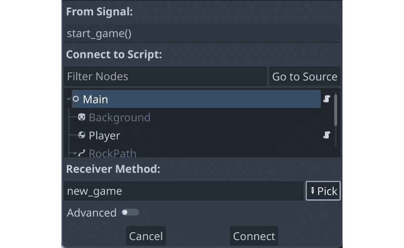

图 3.21：将信号连接到现有函数

添加这个函数来处理游戏结束时会发生什么：

```cpp
func game_over():
    playing = false
    $HUD.game_over()
```

## 玩家代码

向`player.gd`添加新的信号和新的变量：

```cpp
signal lives_changed
signal dead
var reset_pos = false
var lives = 0: set = set_lives
func set_lives(value):
    lives = value
    lives_changed.emit(lives)
    if lives <= 0:
        change_state(DEAD)
    else:
        change_state(INVULNERABLE)
```

对于`lives`变量，你添加了一个名为`lives`的变化，`set_lives()`函数将被调用。这让你可以自动发出信号，同时检查它何时达到`0`。

当新游戏开始时，`Main`会调用`reset()`函数：

```cpp
func reset():
    reset_pos = true
    $Sprite2d.show()
    lives = 3
    change_state(ALIVE)
```

重置玩家意味着将其位置设置回屏幕中心。正如我们之前看到的，这需要在`_integrate_forces()`中完成。将此添加到该函数中：

```cpp
if reset_pos:
    physics_state.transform.origin = screensize / 2
    reset_pos = false
```

返回到`Main`场景，选择`Player`实例，并在`HUD`节点中找到其`lives_changed`信号，然后在**接收方法**中输入`update_lives`。

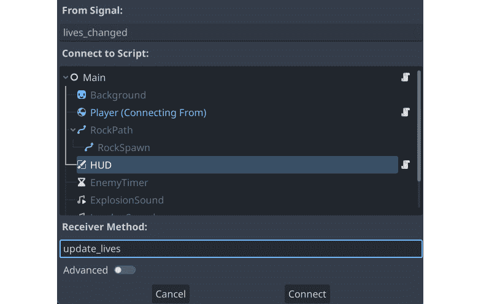

图 3.22：将玩家信号连接到 HUD

在本节中，你创建了一个比以前项目更复杂的 UI，包括一些新的`Control`节点，如`TextureProgressBar`，并使用信号将所有内容连接在一起。在下一节中，你将处理游戏的结束：玩家死亡时应该发生什么。

# 结束游戏

在本节中，你将使玩家检测它被岩石击中，添加无敌功能，并在玩家生命耗尽时结束游戏。

将`Explosion`场景的一个实例添加到`Player`场景中，取消选中其名为`InvulnerabilityTimer`的`Timer`节点，并将`2`和**单次**设置为“开启”。

你将发出`dead`信号来通知`Main`游戏应该结束。在此之前，你需要更新状态机，以便对每个状态进行更多操作：

```cpp
func change_state(new_state):
    match new_state:
        INIT:
            $CollisionShape2D.set_deferred("disabled",
                true)
            $Sprite2D.modulate.a = 0.5
        ALIVE:
            $CollisionShape2d.set_deferred("disabled",
                false)
            $Sprite2d.modulate.a = 1.0
        INVULNERABLE:
            $CollisionShape2d.set_deferred("disabled",
                true)
            $Sprite2d.modulate.a = 0.5
            $InvulnerabilityTimer.start()
        DEAD:
            $CollisionShape2d.set_deferred("disabled",
                true)
            $Sprite2d.hide()
            linear_velocity = Vector2.ZERO
            dead.emit()
    state = new_state
```

一个精灵的`modulate.a`属性设置其 alpha 通道（透明度）。将其设置为`0.5`使其半透明，而`1.0`则是实心的。

进入`INVULNERABLE`状态后，开始计时器。连接其`timeout`信号：

```cpp
func _on_invulnerability_timer_timeout():
    change_state(ALIVE)
```

## 检测刚体之间的碰撞

当你飞来飞去时，飞船会从岩石上弹开，因为两者都是刚体。然而，如果你想当两个刚体碰撞时发生某些事情，你需要启用`Player`场景，选择`Player`节点，然后在检查器中将其设置为`1`。现在玩家在接触到另一个物体时会发出信号。点击`body_entered`信号：

```cpp
func _on_body_entered(body):
    if body.is_in_group("rocks"):
        body.explode()
        lives -= 1
        explode()
func explode():
    $Explosion.show()
    $Explosion/AnimationPlayer.play("explosion")
    await $Explosion/AnimationPlayer.animation_finished
    $Explosion.hide()
```

现在转到`Main`场景，将`Player`实例的`dead`信号连接到`game_over()`方法。玩游戏并尝试撞上岩石。你的飞船应该会爆炸，两秒内无敌，并失去一条生命。还要检查如果你被击中三次，游戏是否会结束。

在本节中，你学习了刚体碰撞，并使用它们来处理船只与岩石碰撞的情况。现在整个游戏周期已经完成：起始屏幕引导到游戏玩法，最后以游戏结束显示结束。在章节的剩余部分，你将添加一些额外的游戏功能，例如暂停功能。

# 暂停游戏

许多游戏需要某种暂停模式，以便玩家可以从动作中休息。在 Godot 中，暂停是`SceneTree`的功能，可以通过其`paused`属性设置。当`SceneTree`暂停时，会发生三件事：

+   物理线程停止运行

+   `_process()`和`_physics_process()`不再在任何节点上调用

+   `_input()`和`_input_event()`方法也不会调用输入

当暂停模式被触发时，运行中的游戏中的每个节点都会根据您的配置做出相应的反应。这种行为是通过节点的**Process/Mode**属性设置的，您可以在检查器列表的底部找到它。

暂停模式可以设置为以下值：

+   `继承` – 节点使用与其父节点相同的模式

+   `可暂停` – 当场景树暂停时，节点会暂停

+   `当暂停时` – 节点仅在树暂停时运行

+   `始终` – 节点始终运行，忽略树的暂停状态

+   `禁用` – 节点永远不会运行，忽略树的暂停状态

打开`pause`。分配一个您想要用于切换暂停模式的键。`P`是一个不错的选择。

将以下函数添加到`Main.gd`：

```cpp
func _input(event):
    if event.is_action_pressed("pause"):
        if not playing:
            return
        get_tree().paused = not get_tree().paused
        var message = $HUD/VBoxContainer/Message
        if get_tree().paused:
            message.text = "Paused"
            message.show()
        else:
            message.text = ""
            message.hide()
```

此代码检测按键按下并切换树的`paused`状态为其当前状态的相反。它还在屏幕上显示**暂停**，这样就不会让人误以为游戏已经冻结。

如果现在运行游戏，您会遇到问题——所有节点都处于暂停状态，包括`Main`。这意味着它不再处理`_input()`，因此无法再次检测输入来暂停游戏！为了解决这个问题，将`Main`节点设置为**始终**。

暂停功能是一个非常有用的功能，您可以在您制作的任何游戏中使用此技术，因此请复习它以确保您理解它是如何工作的。您甚至可以尝试回到并添加到*Coin Dash*。我们下一节通过向游戏中添加敌人来增加动作。

# 敌人

空间中不仅有岩石，还有更多的危险。在本节中，您将创建一个敌人飞船，它将定期出现并向玩家射击。

## 沿着路径行走

当敌人出现时，它应该在屏幕上沿着路径行走。如果它不是一条直线，看起来会更好。为了防止它看起来过于重复，您可以创建多个路径，并在敌人出现时随机选择一个。

创建一个新的场景并添加一个`Node`。将其命名为`EnemyPaths`并保存。要绘制路径，添加一个`Path2D`节点。如您之前所见，此节点允许您绘制一系列连接的点。选择此节点会显示一个新的菜单栏：


图 3.23：路径绘制选项

这些按钮让您可以绘制和修改路径的点。点击带有绿色**+**符号的按钮来添加点。点击游戏窗口稍外的地方开始路径，然后点击几个点来绘制曲线。请注意，箭头指示路径的方向。现在不必担心让它变得平滑：

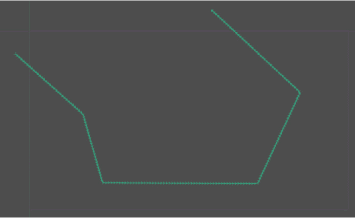

图 3.24：一个示例路径

当敌人沿着路径移动时，当它遇到尖锐的角落时，看起来不会非常平滑。为了平滑曲线，点击路径工具栏中的第二个按钮（其工具提示说 **选择控制点**）。现在，如果您点击并拖动曲线上的任何点，您将添加一个控制点，允许您在该点弯曲线条。平滑上面的线条会产生类似这样的效果：

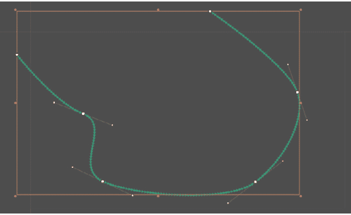

图 3.25：使用控制点

向场景中添加两个或三个更多的 `Path2D` 节点，并按照您喜欢的样式绘制路径。添加环和曲线而不是直线会使敌人看起来更加动态（并且更难被击中）。请记住，您点击的第一个点将是路径的起点，因此请确保在不同的屏幕边缘开始，以增加多样性。以下有三个示例路径：

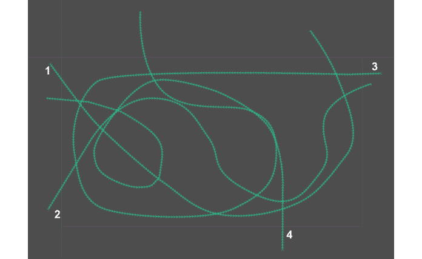

图 3.26：添加多个路径

保存场景。您将将其添加到敌人的场景中，以便它能够跟随这些路径。

## 敌人场景

为敌人创建一个新的场景，使用 `Area2D` 作为其根节点。添加一个 `Sprite2D` 子节点，并使用 `res://assets/enemy_saucer.png` 作为其 `3`，这样您就可以在不同颜色的飞碟之间进行选择：

1.  如您之前所做的那样，添加一个 `CollisionShape2D` 并将其缩放为 `CircleShape2D` 以覆盖图像。添加一个 `EnemyPaths` 场景实例和一个 `AnimationPlayer`。在 `AnimationPlayer` 中，您将添加一个动画，以便在飞碟被击中时产生闪光效果。

1.  添加一个名为 `flash` 的动画。设置为 `0.25` 和 `0.01`。您将动画化的属性是 `Sprite2D` 的 `0.04` 并将颜色从 `0.04` 改变回来，使其变回白色。

1.  重复此过程两次，以便总共有三个闪光效果。

1.  添加一个 `Explosion` 场景实例并将其隐藏。添加一个名为 `GunCooldown` 的 `Timer` 节点来控制敌人射击的频率。设置为 `1.5` 并将 **Autostart** 设置为开启。

1.  向敌人添加一个脚本并连接计时器的 `timeout`。暂时不要向函数中添加任何内容。

1.  在 `enemies` 中。与岩石一样，这将为您提供一种识别对象的方法，即使屏幕上同时有多个敌人。

## 移动敌人

首先，您将编写代码来选择路径并将敌人沿着它移动：

```cpp
extends Area2D
@export var bullet_scene : PackedScene
@export var speed = 150
@export var rotation_speed = 120
@export var health = 3
var follow = PathFollow2D.new()
var target = null
func _ready():
    $Sprite2D.frame = randi() % 3
    var path = $EnemyPaths.get_children()[randi() %
        $EnemyPaths.get_child_count()]
    path.add_child(follow)
    follow.loop = false
```

请记住，`PathFollow2D` 节点会自动沿着父 `Path2D` 移动。默认情况下，当它到达路径的末尾时，它会绕路径循环，因此您需要将其设置为 `false` 以禁用它。

下一步是沿着路径移动并在敌人到达路径末尾时将其移除：

```cpp
func _physics_process(delta):
    rotation += deg_to_rad(rotation_speed) * delta
    follow.progress += speed * delta
    position = follow.global_position
    if follow.progress_ratio >= 1:
        queue_free()
```

当 `progress` 大于路径总长度时，您可以检测路径的末尾。然而，使用 `progress_ratio` 更为直接，它在路径长度上从零变化到一，因此您不需要知道每个路径有多长。

## 敌人生成

在 `Main` 场景中，添加一个新的 `Timer` 节点，称为 `EnemyTimer`。设置其 `main.gd`，添加一个变量来引用敌人场景：

```cpp
@export var enemy_scene : PackedScene
```

将此行添加到 `new_level()` 中：

```cpp
$EnemyTimer.start(randf_range(5, 10))
```

连接 `EnemyTimer` 的 `timeout` 信号：

```cpp
func _on_enemy_timer_timeout():
    var e = enemy_scene.instantiate()
    add_child(e)
    e.target = $Player
    $EnemyTimer.start(randf_range(20, 40))
```

此代码在 `EnemyTimer` 超时时实例化敌人。你一段时间内不想有另一个敌人，所以计时器会以更长的延迟重新启动。

开始游戏，你应该会看到一个飞碟出现并沿着其路径飞行。

## 射击和碰撞

敌人需要向玩家射击，并且当被玩家或玩家的子弹击中时需要做出反应。

敌人的子弹将与玩家的子弹相似，但我们将使用不同的纹理。你可以从头开始创建它，或者使用以下过程来重用节点设置。

打开 `Bullet` 场景，选择 `enemy_bullet.tscn`（之后，别忘了将根节点重命名）。通过点击**分离脚本**按钮移除脚本。通过点击**节点**选项卡并选择**断开连接**来断开信号连接。你可以通过查找节点名称旁边的  图标来查看哪些节点有信号连接。

将精灵的纹理替换为 `laser_green.png` 图像，并在根节点上添加一个新的脚本。

敌人子弹的脚本将与普通子弹非常相似。连接区域的 `body_entered` 信号和 `VisibleOnScreenNotifier2D` 的 `screen_exited` 信号：

```cpp
extends Area2D
@export var speed = 1000
func start(_pos, _dir):
    position = _pos
    rotation = _dir.angle()
func _process(delta):
    position += transform.x * speed * delta
func _on_body_entered(body):
    queue_free()
func _on_visible_on_screen_notifier_2d_screen_exited():
    queue_free()
```

注意，你需要指定子弹的位置和方向。这是因为，与总是向前射击的玩家不同，敌人总是朝向玩家射击。

目前，子弹对玩家不会造成任何伤害。你将在下一节中为玩家添加护盾，所以你可以那时添加它。

保存场景并将其拖入 `Enemy`。

在 `enemy.gd` 中，添加一个变量以对子弹进行一些随机变化，并添加 `shoot()` 函数：

```cpp
@export var bullet_spread = 0.2
func shoot():
    var dir =
       global_position.direction_to(target.global_position)
    dir = dir.rotated(randf_range(-bullet_spread,
       bullet_spread))
    var b = bullet_scene.instantiate()
    get_tree().root.add_child(b)
    b.start(global_position, dir)
```

首先，找到指向玩家位置的向量，然后添加一点随机性，使其可以“错过”。

当 `GunCooldown` 超时时调用 `shoot()` 函数：

```cpp
func _on_gun_cooldown_timeout():
    shoot()
```

为了增加难度，你可以让敌人以脉冲或多次快速射击的方式射击：

```cpp
func shoot_pulse(n, delay):
    for i in n:
        shoot()
        await get_tree().create_timer(delay).timeout
```

这将发射一定数量的子弹，`n`，子弹之间有 `delay` 秒的延迟。当冷却时间触发时，你可以调用此方法：

```cpp
func _on_gun_cooldown_timeout():
    shoot_pulse(3, 0.15)
```

这将发射一串 `3` 发子弹，子弹之间间隔 `0.15` 秒。很难躲避！

接下来，当敌人被玩家射击时，它需要受到伤害。它将使用你制作的动画闪烁，并在其健康值达到 `0` 时爆炸。

将以下函数添加到 `enemy.gd` 中：

```cpp
func take_damage(amount):
    health -= amount
    $AnimationPlayer.play("flash")
    if health <= 0:
        explode()
func explode():
    speed = 0
    $GunCooldown.stop()
    $CollisionShape2D.set_deferred("disabled", true)
    $Sprite2D.hide()
    $Explosion.show()
    $Explosion/AnimationPlayer.play("explosion")
    await $Explosion/AnimationPlayer.animation_finished
    queue_free()
```

此外，连接敌人的 `body_entered` 信号，以便当玩家撞到敌人时，敌人会爆炸：

```cpp
func _on_body_entered(body):
    if body.is_in_group("rocks"):
        return
    explode()
```

同样，你需要在玩家护盾实现之前对玩家造成伤害，所以现在这个碰撞只会摧毁敌人。

目前，玩家的子弹只能检测到岩石，因为它的 `body_entered` 信号不会被敌人触发，而敌人是一个 `Area2D`。为了检测敌人，请转到 `Bullet` 场景并连接 `area_entered` 信号：

```cpp
func _on_area_entered(area):
    if area.is_in_group("enemies"):
        area.take_damage(1)
```

尝试再次玩游戏，你将与一个侵略性的外星对手战斗！验证所有碰撞组合是否被处理（除了敌人射击玩家）。还请注意，敌人的子弹可以被岩石阻挡——也许你可以躲在它们后面作为掩护！

现在游戏有了敌人，它变得更加具有挑战性。如果你仍然觉得太简单，尝试增加敌人的属性：它出现的频率、它造成的伤害以及摧毁它所需的射击次数。如果你让它变得太难是完全可以的，因为在下一节中，你将通过添加一个吸收伤害的护盾来为玩家提供一些帮助。

# 玩家护盾

在本节中，你将为玩家添加一个护盾，并在 `HUD` 中添加一个显示当前护盾级别的显示元素。

首先，将以下内容添加到 `player.gd` 脚本的顶部：

```cpp
signal shield_changed
@export var max_shield = 100.0
@export var shield_regen = 5.0
var shield = 0: set = set_shield
func set_shield(value):
    value = min(value, max_shield)
    shield = value
    shield_changed.emit(shield / max_shield)
    if shield <= 0:
        lives -= 1
        explode()
```

`shield` 变量与 `lives` 类似，每当它发生变化时都会发出信号。由于值将由护盾的再生添加，你需要确保它不会超过 `max_shield` 值。然后，当你发出 `shield_changed` 信号时，你传递 `shield` / `max_shield` 的比率而不是实际值。这样，`HUD` 的显示就不需要知道护盾实际有多大，只需要知道它的百分比。

你还应该从 `_on_body_entered()` 中移除 `explode()` 行，因为你现在不希望仅仅击中岩石就会炸毁飞船——现在这只会发生在护盾耗尽时。

击中岩石会损坏护盾，较大的岩石应该造成更多的伤害：

```cpp
func _on_body_entered(body):
    if body.is_in_group("rocks"):
        shield -= body.size * 25
        body.explode()
```

敌人的子弹也应该造成伤害，所以将此更改应用到 `enemy_bullet.gd`：

```cpp
@export var damage = 15
func _on_body_entered(body):
    if body.name == "Player":
        body.shield -= damage
    queue_free()
```

同样，撞到敌人应该伤害玩家，所以更新 `enemy.gd` 中的此内容：

```cpp
func _on_body_entered(body):
    if body.is_in_group("rocks"):
        return
    explode()
    body.shield -= 50
```

如果玩家的护盾耗尽并且他们失去了一条生命，你应该将护盾重置为其最大值。将此行添加到 `set_lives()`：

```cpp
shield = max_shield
```

玩家脚本中的最后一个添加是每帧再生护盾。将此行添加到 `player.gd` 中的 `_process()`：

```cpp
shield += shield_regen * delta
```

现在代码已经完成，你需要在 `HUD` 场景中添加一个新的显示元素。与其将护盾的值显示为数字，你将创建一个 `TextureProgressBar`，这是一个 `Control` 节点，它将给定的值显示为一个填充的条形。它还允许你为条形分配一个要使用的纹理。

转到 `HUD` 场景，并将两个新节点作为现有 `HBoxContainer` 的子节点添加：`TextureRect` 和 `TextureProgressBar`。将 `TextureProgressBar` 重命名为 `ShieldBar`。将它们放置在 `Score` 标签之后和 `LivesCounter` 之前。你的节点设置应该看起来像这样：


图 3.27：更新后的 HUD 节点布局

将 `res://assets/shield_gold.png` 拖入 `TextureRect`。这将是一个图标，表示这个条形图显示护盾值。将 **拉伸模式** 设置为 **居中**，这样纹理就不会扭曲。

`ShieldBar` 有三个 `res://assets/bar_green_200.png` 放入这个属性。其他两个纹理属性允许你通过设置一个图像来绘制在进度纹理之上或之下来自定义外观。将 `res://assets/bar_glass_200.png` 拖入 **Over** 属性。

在 `0` 和 `1` 中，因为这个条形图将显示护盾与其最大值的比率，而不是其数值。这意味着 `0.01` 到 `.75` 以看到条形图部分填充。此外，在 **布局/容器大小** 部分，勾选 **扩展** 复选框并将 **垂直** 设置为 **收缩居中**。

完成后，`HUD` 应该看起来像这样：

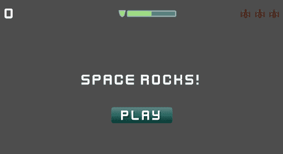

图 3.28：更新后的带有护盾栏的 HUD

你现在可以更新脚本以设置护盾栏的值，以及使其在接近零时改变颜色。将这些变量添加到 `hud.gd` 中：

```cpp
@onready var shield_bar =
    $MarginContainer/HBoxContainer/ShieldBar
var bar_textures = {
    "green": preload("res://assets/bar_green_200.png"),
    "yellow": preload("res://assets/bar_yellow_200.png"),
    "red": preload("res://assets/bar_red_200.png")
}
```

除了绿色条形图，`assets` 文件夹中还有红色和黄色条形图。这允许你在值降低时更改护盾栏的颜色。以这种方式加载纹理使得在脚本中稍后更容易访问，当你想要为条形图分配适当的图像时：

```cpp
func update_shield(value):
    shield_bar.texture_progress = bar_textures["green"]
    if value < 0.4:
        shield_bar.texture_progress = bar_textures["red"]
    elif value < 0.7:
        shield_bar.texture_progress = bar_textures["yellow"]
    shield_bar.value = value
```

最后，点击 `Main` 场景的 `Player` 节点，并将 `shield_changed` 信号连接到 `HUD` 的 `update_shield()` 函数。

运行游戏并验证护盾是否正常工作。你可能想要增加或减少护盾再生速率以获得你满意的速度。当你准备好继续时，在下一节中，你将为游戏添加一些声音。

# 声音和视觉效果

游戏的结构和玩法已经完成。在本节中，你将添加一些额外的效果来提升游戏体验。

## 声音和音乐

在 `res://assets/sounds` 文件夹中包含了一些游戏音频效果。要播放声音，需要通过 `AudioStreamPlayer` 节点加载。将两个这样的节点添加到 `Player` 场景中，分别命名为 `LaserSound` 和 `EngineSound`。将相应的声音文件拖入每个节点的 `player.gd` 中的 `shoot()`：

```cpp
$LaserSound.play()
```

播放游戏并尝试射击。如果你觉得声音太大，可以将 `-10` 调整一下。

引擎声音的工作方式略有不同。它需要在推力开启时播放，但如果你只是尝试在玩家按下键时在 `get_input()` 函数中对声音调用 `play()`，它将每帧重新启动声音。这听起来不太好，所以你只想在声音尚未播放时开始播放声音。以下是 `get_input()` 函数的相关部分：

```cpp
if Input.is_action_pressed("thrust"):
    thrust = transform.x * engine_power
    if not $EngineSound.playing:
        $EngineSound.play()
else:
    $EngineSound.stop()
```

注意，可能会出现一个问题：如果玩家在按下推力键时死亡，由于在 `$EngineSound.stop()` 到 `change_state()` 中，引擎声音将卡在播放状态。

在`Main`场景中，添加三个更多的`AudioStreamPlayer`节点：`ExplosionSound`、`LevelupSound`和`Music`。在它们的`explosion.wav`、`levelup.ogg`和`Funky-Gameplay_Looping.ogg`中。

将`$ExplosionSound.play()`作为`_on_rock_exploded()`的第一行，并将`$LevelupSound.play()`添加到`new_level()`。

要开始和停止背景音乐，将`$Music.play()`添加到`new_game()`，将`$Music.stop()`添加到`game_over()`。

敌人也需要`ExplosionSound`和`ShootSound`节点。你可以使用`enemy_laser.wav`作为它们的射击声音。

## 粒子

玩家飞船的推力是粒子效果的一个完美应用，它从引擎处产生一条流火。

添加一个`CPUParticles2D`节点，并将其命名为`Exhaust`。你可能想在执行这部分操作时放大飞船。

粒子节点类型

Godot 提供了两种类型的粒子节点：一种使用 CPU 进行渲染，另一种使用 GPU 进行渲染。由于并非所有平台，尤其是移动或较旧的桌面，都支持粒子的硬件加速，因此你可以使用 CPU 版本以实现更广泛的兼容性。如果你知道你的游戏将在更强大的系统上运行，你可以使用 GPU 版本。

你会看到从飞船中心流下的一行白色点。你的挑战现在是将这些点变成尾气火焰。

配置粒子时，有非常多的属性可供选择。在设置此效果的过程中，请随意尝试它们，看看它们如何影响结果。

设置`Exhaust`节点的这些属性：

+   `25`

+   **绘图/局部坐标**：开启

+   `(-28, 0)`

+   `180`

+   **可见性/显示在父级之后**：开启

你将要更改的剩余属性将影响粒子的行为。从`(1, 5)`开始。现在粒子是在一个小区域内发射，而不是从单个点发射。

接下来，设置`0`和`(0, 0)`。注意，虽然粒子移动非常缓慢，但它们并没有下落或扩散。

设置`400`，然后向下滚动到`8`。

要使大小随时间变化，你可以设置**缩放量曲线**。选择**新建曲线**然后点击打开它。在小图中，右键点击添加两个点——一个在左侧，一个在右侧。将右侧的点向下拖动，直到曲线看起来像这样：


图 3.29：添加粒子缩放曲线

现在，你应该能看到粒子从飞船后方流出时逐渐缩小。

最后要调整的部分是**颜色**。为了让粒子看起来像火焰，它们应该从明亮的橙黄色开始，随着淡出而变为红色。在**颜色渐变**属性中，点击**新建渐变**，你会看到一个看起来像这样的渐变编辑器：


图 3.30：颜色渐变设置

标有 *1* 和 *2* 的两个矩形滑块设置渐变的起始和结束颜色。点击任何一个都会在标有 *3* 的框中显示其颜色。选择滑块 *1* 然后点击框 *3* 以打开颜色选择器。选择橙色，然后对滑块 *2* 做同样的操作，选择深红色。

现在粒子有了正确的外观，但它们持续的时间太长了。在节点的 `0.1`。

希望您的飞船尾气看起来有点像火焰。如果不像，请随意调整属性，直到您对其外观满意为止。

一旦火焰看起来不错，就需要根据玩家的输入来开启和关闭。转到 `player.gd` 并在 `get_input()` 的开头添加 `$Exhaust.emitting = false`。然后，在检查 `thrust` 输入的 `if` 语句下，添加 `$Exhaust.emitting = true`。

## 敌人轨迹

您还可以使用粒子来为敌人的飞碟添加一条闪耀的轨迹。将一个 `CPUParticles2D` 添加到敌人场景中，并配置以下设置：

+   `20`

+   **可见性/显示背后** **父级**: 开启

+   `Sphere`

+   `25`

+   `(``0, 0)`

您现在应该在整个飞碟半径上看到粒子出现（如果您想更好地看到它们，可以在这一部分隐藏 `Sprite2D`）。粒子的默认形状是正方形，但您也可以使用纹理来获得更多的视觉吸引力。将 `res://assets/corona.png` 添加到 **绘图/纹理**。

这张图片提供了一个很好的发光效果，但与飞碟相比，它相当大，所以设置为 `0.1`。您还会注意到这张图片在黑色背景上是白色的。为了看起来正确，需要更改其 **混合模式**。为此，找到 **材质** 属性并选择 **新建 CanvasItemMaterial**。在那里，您可以将 **混合模式** 从 **混合** 更改为 **添加**。

最后，您可以通过在 **缩放** 部分的 **缩放量曲线** 中使用，使粒子逐渐消失，就像您对玩家粒子所做的那样。

播放您的游戏并欣赏效果。您还能用粒子添加些什么？

# 摘要

在本章中，您学习了如何与 `RigidBody2D` 节点一起工作，并更深入地了解了 Godot 物理的工作原理。您还实现了一个基本的有限状态机——随着您的项目变得更大，您会发现这很有用，您将在未来的章节中再次使用它。您看到了 `Container` 节点如何帮助组织和保持 UI 节点对齐。最后，您添加了音效，并通过使用 `Animation` 和 `CPUParticles2D` 节点，第一次尝到了高级视觉效果的滋味。

您还继续使用标准的 Godot 层次结构创建游戏对象，例如将 `CollisionShapes` 附着到 `CollisionObjects` 上，以及使用信号来处理节点间的通信。到目前为止，这些做法应该开始对您熟悉了。

你准备好尝试独立重做这个项目了吗？尝试在不看书的条件下，重复所有，甚至部分，本章内容。这是一个检查你吸收了哪些信息以及需要再次复习哪些内容的不错方法。你也可以尝试加入自己的变体来重做，而不仅仅是做一个精确的复制。

当你准备好继续前进，在下一章中，你将制作另一种非常流行的游戏风格：一款遵循超级马里奥兄弟传统的平台游戏。
