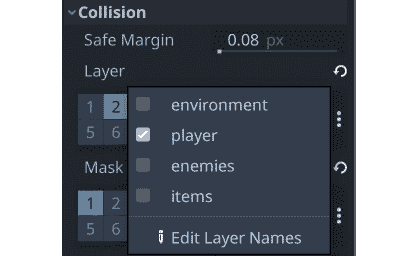
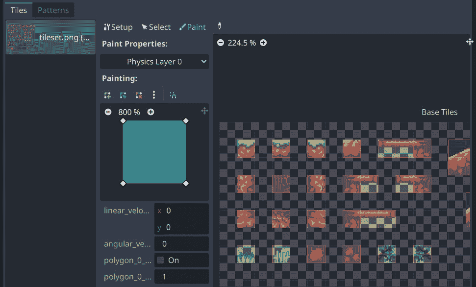

# 热带跳跃 – 在 2D 平台游戏中奔跑和跳跃

在本章中，你将按照经典游戏如**超级马里奥兄弟**的传统构建一个**平台游戏**。平台游戏是一个非常受欢迎的游戏类型，了解它们的工作原理可以帮助你制作各种不同的游戏风格。如果你之前从未尝试过制作这样的游戏，平台游戏中的玩家动作实现可能会出人意料地复杂，你将看到 Godot 的 `CharacterBody2D` 节点如何帮助你完成这个过程。

在这个项目中，你将学习以下内容：

+   使用 `CharacterBody2D` 节点

+   使用 `Camera2D` 节点

+   结合动画和用户输入以产生复杂的角色行为

+   使用 `TileMap` 设计关卡

+   使用 `ParallaxLayer` 创建无限滚动的背景

+   在场景之间切换

+   组织你的项目和规划扩展

这是完成游戏的截图：


图 4.1：完成的游戏截图

# 技术要求

与之前的项目一样，你将首先下载游戏的美术资源，这些资源可以在以下链接找到：[`github.com/PacktPublishing/Godot-Engine-Game-Development-Projects-Second-Edition/tree/main/Downloads`](https://github.com/PacktPublishing/Godot-Engine-Game-Development-Projects-Second-Edition/tree/main/Downloads)

你也可以在 GitHub 上找到本章的完整代码：[`github.com/PacktPublishing/Godot-4-Game-Development-Projects-Second-Edition/tree/main/Chapter04%20-%20Jungle%20Jump`](https://github.com/PacktPublishing/Godot-4-Game-Development-Projects-Second-Edition/tree/main/Chapter04%20-%20Jungle%20Jump)

# 设置项目

要创建一个新项目，首先打开**项目设置**，以便你可以配置所需的默认设置。

本游戏的美术资源采用**像素艺术**风格，这意味着当图像未进行平滑处理时它们看起来最好，这是 Godot 对**纹理过滤**的默认设置：


图 4.2：纹理过滤

虽然可以在每个 `Sprite2D` 上设置此选项，但指定默认设置更为方便。点击右上角的**高级**切换按钮，然后在左侧找到**渲染/纹理**部分。在设置列表中滚动到最底部，找到**画布纹理/默认纹理过滤**设置。将其从**线性**更改为**最近**。

然后，在**显示/窗口**下，将**拉伸/模式**更改为**画布项**，并将**纵横比**更改为**扩展**。这些设置将允许用户在保持图像质量的同时调整游戏窗口的大小。一旦项目完成，你将能够看到此设置的成效。

接下来，你可以设置碰撞层。因为这款游戏将有几种不同类型的碰撞对象，它们需要以不同的方式交互，所以你会使用 Godot 的 **碰撞层** 系统来帮助组织它们。如果它们被分配了名称，那么使用起来会更方便，所以前往 **层名称 | 2D 物理** 部分，并将前四个层命名为如下（直接在层编号旁边的框中键入）：


图 4.3：设置物理层名称

最后，将以下动作添加到 **输入** **映射** 区域的玩家控制中：

| **动作名称** | **按键** |
| --- | --- |
| `right` | *D*, → |
| `left` | *A*, ← |
| `jump` | 空格键 |
| `up` | *S*, ↑ |
| `down` | *W*, ↓ |

确保你使用确切的名称来命名输入动作，因为你稍后会在代码中引用它们。

这是你需要在 **项目设置** 中设置的所有内容。但在你开始制作玩家场景之前，你需要了解不同类型的物理节点。

# 介绍运动学物体

平台游戏需要重力、碰撞、跳跃和其他物理行为，所以你可能认为 `RigidBody2D` 是实现角色移动的完美选择。在实践中，你会发现刚体的更真实物理特性对于平台角色来说并不理想。对于玩家来说，现实感不如响应控制感和动作感重要。因此，作为开发者，你希望对角色的移动和碰撞响应有精确的控制。因此，对于平台角色来说，**运动学**风格的物理通常是更好的选择。

`CharacterBody2D` 节点是为了实现那些需要通过代码直接控制的物理体而设计的。当它们移动时，这些节点会检测与其他物体的碰撞，但不会受到全局物理属性（如重力或摩擦）的影响。这并不意味着它们不能受到重力和其他力的作用——只是你必须计算这些力及其在代码中的效果；物理引擎不会自动移动 `CharacterBody2D` 节点。

当移动 `CharacterBody2D` 节点，就像使用 `RigidBody2D` 一样，你不应该直接设置其 `position` 属性。相反，你必须使用由物体提供的 `move_and_collide()` 或 `move_and_slide()` 方法。这些方法沿着给定的向量移动物体，并在检测到与其他物体的碰撞时立即停止。然后，由你来决定任何 **碰撞响应**。

## 碰撞响应

碰撞发生后，你可能想让物体弹跳、沿着墙壁滑动，或者改变它撞击物体的属性。处理碰撞响应的方式取决于你使用哪种方法来移动物体：

### move_and_collide()

当使用这种方法时，在碰撞发生时函数会返回一个`KinematicCollision2D`对象。这个对象包含有关碰撞和碰撞体的信息。你可以使用这些信息来确定响应。请注意，当没有碰撞且移动成功完成时，函数返回`null`。

例如，如果你想使身体从碰撞对象上弹开，你可以使用以下脚本：

```cpp
extends CharacterBody2D
velocity = Vector2(250, 250)
func _physics_process(delta):
    var collision = move_and_collide(velocity * delta)
    if collision:
        velocity = velocity.bounce(collision.get_normal())
```

### move_and_slide()

滑动是碰撞响应中一个非常常见的选项。想象一下在一个俯视角游戏中，玩家沿着墙壁移动，或者在平台游戏中沿着地面奔跑。在使用`move_and_collide()`之后，你可以自己编写代码来实现响应，但`move_and_slide()`提供了一个方便的方式来实现滑动移动。当使用这种方法时，身体会自动沿着碰撞对象的表面滑动。此外，滑动碰撞将允许你使用`is_on_floor()`等方法检测表面的方向。

由于这个项目需要你允许玩家角色在地面和上下坡道上奔跑，`move_and_slide()`将在你的玩家移动中扮演重要角色。

现在你已经了解了运动学身体是什么，你将使用一个来制作这个游戏的角色。

# 创建玩家场景

实现运动学移动和碰撞的 Godot 节点被称为`CharacterBody` `2D`。

打开一个新的场景，并添加一个名为`Player`的`CharacterBody2D`节点作为根节点，并保存场景。别忘了点击`Player`场景，你还应该创建一个新的文件夹来包含它。这有助于在你添加更多场景和脚本时保持你的项目文件夹组织有序。

查看 Inspector 中`CharacterBody2D`的属性。注意**运动模式**和**向上方向**的默认值。“地面”模式意味着身体将考虑一个碰撞方向作为“地板”，相对的墙壁作为“天花板”，其他任何作为“墙壁”——哪一个由**向上方向**决定。

正如你在之前的项目中做的那样，你将在玩家场景中包含玩家角色需要的功能节点。对于这个游戏，这意味着处理与各种游戏对象的碰撞，包括平台、敌人和可收集物品；显示动作动画，如奔跑或跳跃；并将相机附加到跟随玩家在关卡中移动。

编写各种动画的脚本可能会很快变得难以管理，所以你需要使用一个**有限状态机**（**FSM**）来管理和跟踪玩家的状态。参见*第三章*回顾如何构建简化的 FSM。你将遵循类似的项目模式。

## 碰撞层和掩码

一个身体的`Player`需要分配到“player”层（您在**项目设置**中命名的层）。同样，**碰撞/遮罩**设置身体可以“看到”或与之交互的层。如果一个对象在一个不在玩家**遮罩**中的层上，那么玩家根本不会与之交互。

将玩家的**层**设置为**player**，**遮罩**设置为**环境**、**敌人**和**物品**。点击右侧的三个点以打开一个复选框列表，显示您分配给层的名称：



图 4.4：设置碰撞层

这将确保玩家位于“player”层，以便其他对象可以配置为检测玩家或不检测玩家。将**遮罩**值设置为所有三个层意味着玩家将能够与这些层上的任何对象交互。

## 关于 AnimationPlayer

在本书的早期，您使用了`AnimatedSprite2D`来显示角色的基于帧的动画。这是一个很好的工具，但它仅适用于动画节点的视觉纹理。如果您还想动画化节点上的其他任何属性怎么办？

这就是`AnimationPlayer`发挥作用的地方。这个节点是一个非常强大的工具，可以一次性影响多个节点创建动画；你可以修改它们的任何属性。

## 动画

要设置角色的动画，请按照以下步骤操作：

1.  将一个`Sprite2D`节点添加到`Player`中。从**FileSystem**面板拖动`res://assets/player_sheet.png`文件并将其放入**Texture**属性。玩家动画将以精灵图集的形式保存：


图 4.5：精灵图集

1.  您将使用`AnimationPlayer`来处理动画，因此，在`Sprite2D`中设置`19`。然后，将`7`设置为查看玩家站立。最后，通过将`(0, -16)`设置为向上移动`Sprite2D`，使其脚部站在地面上。这将使您在稍后编码玩家的交互时更容易，因为您将知道玩家的`position`属性代表其脚部的位置。

1.  将一个`AnimationPlayer`节点添加到场景中。您将使用此节点来更改每个动画的`Sprite2D`的适当值。

1.  在开始之前，请回顾一下**动画**面板的不同部分：


图 4.6：动画面板

1.  点击`idle`。

1.  设置其`0.4`秒。点击**循环**图标以使动画循环，并将轨道的**更新模式**设置为**连续**。

将`Sprite2D`更改为`7`，这是空闲动画的第一帧，并点击属性旁边的**关键帧**图标以添加一个带有新关键帧的动画轨道：


图 4.7：添加关键帧

1.  将播放刮擦器滑到`0.3`（您可以在右下角的缩放滑块中调整以使其更容易找到）。为第`10`帧添加一个关键帧，这是`idle`的最后一帧。

1.  按`7`键并结束在第`10`帧。

现在，为其他动画重复此过程。以下表格列出了它们的设置：

| **名称** | **长度** | **帧数** | **循环** |
| --- | --- | --- | --- |
| `idle` | `0.4` | `7` → `10` | 开启 |
| `run` | `0.5` | `13` →`18` | 开启 |
| `hurt` | `0.2` | `5` → `6` | 开启 |
| `jump_up` | `0.1` | `11` | 关闭 |
| `jump_down` | `0.1` | `12` | 关闭 |

精灵图中也有蹲下和攀爬的动画，但可以在基本移动完成后添加这些动画。

## 碰撞形状

与其他身体一样，`CharacterBody2D` 需要一个形状来定义其碰撞边界。添加一个 `CollisionShape2D` 节点并在其中创建一个新的 `RectangleShape2D`。在调整形状大小时，你希望它达到图像的底部（玩家的脚），但比玩家的图像略窄。一般来说，使形状比图像略小会在游戏中产生更好的感觉，避免击中看起来不会导致碰撞的东西的经验。

你还需要稍微偏移形状以使其适合。设置 `CollisionShape2D` 节点的 `(0, -10)` 会很有效。完成时，它应该看起来大约是这样的：


图 4.8：玩家碰撞形状

多个形状

在某些情况下，根据你的角色复杂性和与其他对象的交互，你可能想向同一对象添加多个形状。你可能在玩家的脚下有一个形状来检测地面碰撞，另一个在其身体上检测伤害，还有一个覆盖玩家前部来检测与墙壁的接触。

## 完成玩家场景

将 `Camera2D` 节点添加到 `Player` 场景中。此节点将在玩家在关卡中移动时保持游戏窗口在玩家周围居中。你也可以用它来放大玩家，因为像素艺术相对于游戏窗口的大小来说相对较小。记住，由于你在 **项目设置** 中设置了过滤选项，当放大时，玩家的纹理将保持像素化和块状。

要启用相机，设置 `(2.5, 2.5)`。小于 1 的值会使相机缩小，而较大的值会使相机放大。

你会看到一个围绕玩家的粉紫色矩形。那是相机的 **屏幕矩形**，它显示了相机将看到的内容。你可以调整 **缩放** 属性来增加或减少其大小，以便看到更多或更少的玩家周围的世界。

## 玩家状态

玩家角色有多种行为，例如跳跃、奔跑和蹲下。编码这些行为可能会变得非常复杂且难以管理。一个解决方案是使用布尔变量（例如 `is_jumping` 或 `is_running`），但这可能导致可能令人困惑的状态（如果 `is_crouching` 和 `is_jumping` 都为 `true` 会怎样？）并且很快就会导致 `_spaghetti_ 代码`。

解决这个问题的更好方法是使用状态机来处理玩家的当前状态并控制到其他状态的转换。这个概念在*第三章*中介绍过，您将在本项目中对其进行扩展。

这里是玩家状态及其之间转换的图示：


图 4.9：玩家状态图

如您所见，状态图可能会变得相当复杂，即使是在相对较少的状态下。

其他状态

注意，虽然精灵图包含它们的动画，但`CROUCH`和`CLIMB`状态不包括在内。这是为了在项目开始时保持状态数量可管理。稍后，您将有机会添加它们。

## 玩家脚本

将一个新的脚本附加到`Player`节点上。注意，对话框显示了一个**模板**属性，这是 Godot 为此节点类型提供的默认**基本移动**。取消选择**模板**框——您不需要这个示例代码来完成这个项目。

将以下代码添加到开始设置玩家状态机。与*太空岩石*游戏一样，您可以使用`enum`类型来定义系统的允许状态。当您想要更改玩家的状态时，您可以调用`change_state()`：

```cpp
extends CharacterBody2D
@export var gravity = 750
@export var run_speed = 150
@export var jump_speed = -300
enum {IDLE, RUN, JUMP, HURT, DEAD}
var state = IDLE
func _ready():
    change_state(IDLE)
func change_state(new_state):
    state = new_state
    match state:
        IDLE:
            $AnimationPlayer.play("idle")
        RUN:
            $AnimationPlayer.play("run")
        HURT:
            $AnimationPlayer.play("hurt")
        JUMP:
            $AnimationPlayer.play("jump_up")
        DEAD:
            hide()
```

目前，脚本只更改正在播放的动画，但您将在稍后添加更多状态功能。

## 玩家移动

玩家需要三个控制键：左、右和跳跃。比较当前状态和按下的键，如果状态图规则允许转换，则会触发状态变化。添加`get_input()`函数来处理输入并确定结果。每个`if`条件代表状态图中的一个转换：

```cpp
func get_input():
    var right = Input.is_action_pressed("right")
    var left = Input.is_action_pressed("left")
    var jump = Input.is_action_just_pressed("jump")
    # movement occurs in all states
    velocity.x = 0
    if right:
        velocity.x += run_speed
        $Sprite2D.flip_h = false
    if left:
        velocity.x -= run_speed
        $Sprite2D.flip_h = true
    # only allow jumping when on the ground
    if jump and is_on_floor():
        change_state(JUMP)
        velocity.y = jump_speed
    # IDLE transitions to RUN when moving
    if state == IDLE and velocity.x != 0:
        change_state(RUN)
    # RUN transitions to IDLE when standing still
    if state == RUN and velocity.x == 0:
        change_state(IDLE)
    # transition to JUMP when in the air
    if state in [IDLE, RUN] and !is_on_floor():
        change_state(JUMP)
```

注意，跳跃检查使用的是`is_action_just_pressed()`而不是`is_action_pressed()`。虽然后者只要按键被按下就会返回`true`，但前者只有在按键被按下的那一帧才是`true`。这意味着玩家每次想要跳跃时都必须按下跳跃键。

从`_physics_process()`函数调用此函数，将重力拉力添加到玩家的`velocity`中，并调用`move_and_slide()`方法来移动：

```cpp
func _physics_process(delta):
    velocity.y += gravity * delta
    get_input()
    move_and_slide()
```

记住，由于`(0, -1)`，任何在玩家脚下的碰撞都将被视为“地板”，并且`is_on_floor()`将由`move_and_slide()`设置为`true`。您可以使用这个事实来检测跳跃何时结束，在`move_and_slide()`之后添加以下代码：

```cpp
if state == JUMP and is_on_floor():
    change_state(IDLE)
```

如果动画在掉落时从`jump_up`切换到`jump_down`，跳跃看起来会更好：

```cpp
if state == JUMP and velocity.y > 0:
    $AnimationPlayer.play("jump_down")
```

之后，一旦关卡完成，玩家将获得一个出生位置。为了处理这个问题，将以下函数添加到脚本中：

```cpp
func reset(_position):
    position = _position
    show()
    change_state(IDLE)
```

这样，你已经完成了移动的添加，并且每种情况都应播放正确的动画。这是一个很好的停止点来测试玩家，以确保一切正常工作。但是，你不能只是运行场景，因为玩家会开始无任何立足之地的下落。

### 测试移动

创建一个新的场景，并添加一个名为 `Main` 的 `Node` 对象（稍后，这将成为你的主场景）。添加一个 `Player` 实例，然后添加一个具有矩形碰撞形状的 `StaticBody2D` 节点。将碰撞形状水平拉伸，使其足够宽，可以来回行走，并将其放置在角色下方：


图 4.10：带有平台的测试场景

由于它没有 `Sprite2D` 节点，静态身体在运行游戏时将是不可见的。在菜单中，选择 **调试** > **可见碰撞形状**。这是一个有用的调试设置，可以在游戏运行时绘制碰撞形状。你可以在需要测试或排除故障时随时打开它。

当它撞击静态身体时，按下 `idle` 动画。

在继续之前，请确保所有移动和动画都正常工作。在所有方向上跑和跳，并检查状态改变时是否播放了正确的动画。如果你发现任何问题，请回顾前面的部分，并确保你没有错过任何步骤。

## 玩家健康

最终，玩家会遇到危险，因此你应该添加一个伤害系统。玩家开始时有三个心形生命值，每次受到伤害就会失去一个。

将以下内容添加到脚本顶部（在 `extends` 行之后）：

```cpp
signal life_changed
signal died
var life = 3: set = set_life
func set_life(value):
    life = value
    life_changed.emit(life)
    if life <= 0:
        change_state(DEAD)
```

每当 `life` 的值发生变化时，你将发出 `life_changed` 信号，通知显示更新。当 `life` 达到 `0` 时，将发出 `dead` 信号。

在 `reset()` 函数中添加 `life = 3`。

玩家受伤有两种可能的方式：撞到环境中的尖刺物体或被敌人击中。在任何一种情况下，都可以调用以下函数：

```cpp
func hurt():
    if state != HURT:
        change_state(HURT)
```

这段代码对玩家很友好：如果他们已经受伤，他们就不能再次受伤（至少在 `hurt` 动画停止播放的短时间内不能）。如果没有这个，很容易陷入受伤的循环，导致快速死亡。

当你在之前创建的 `change_state()` 函数中将状态更改为 `HURT` 时，有一些事情要做：

```cpp
HURT:
    $AnimationPlayer.play("hurt")
    velocity.y = -200
    velocity.x = -100 * sign(velocity.x)
    life -= 1
    await get_tree().create_timer(0.5).timeout
    change_state(IDLE)
DEAD:
    died.emit()
    hide()
```

当他们受伤时，不仅会失去一个 `生命值`，而且还会被弹起并远离造成伤害的物体。经过一段时间后，状态会变回 `IDLE`。

此外，在 `HURT` 状态期间应禁用输入。将以下内容添加到 `get_input()` 的开头：

```cpp
if state == HURT:
    return
```

现在，一旦游戏的其他部分设置完成，玩家就可以开始受到伤害。接下来，你将创建玩家在游戏中可以收集的物体。

# 可收集物品

在你开始制作关卡之前，你需要创建一些玩家可以收集的物品，因为那些也将是关卡的一部分。`assets/sprites` 文件夹包含两种类型可收集物品的精灵图集：樱桃和宝石。

而不是为每种类型的物品创建一个单独的场景，你可以使用一个场景并在脚本中交换 `texture` 属性。这两个对象具有相同的行为：在原地动画并在被玩家收集时消失。你还可以为收集添加一个 `tween` 效果（见 *第二章*）。

## 场景设置

使用 `Area2D` 开始新的场景并将其命名为 `Item`。将场景保存在新的 `items` 文件夹中。

这些对象是一个好选择，因为你想要检测玩家何时接触它们，但你不需要从它们那里获得碰撞响应。在检查器中设置 `collectibles`（第 4 层）和 `player`（第 2 层）。这将确保只有 `Player` 节点能够收集它们，而敌人将直接穿过。

添加三个子节点：`Sprite2D`、`CollisionShape2D` 和 `AnimationPlayer`。将 `res://assets/sprites/cherry.png` 拖入 `Sprite2D` 节点的 `5` 位置。然后，在 `CollisionShape2D` 中添加一个圆形形状并适当调整其大小：


图 4.11：具有碰撞的物品

选择碰撞大小

作为一般规则，你应该调整你的碰撞形状的大小，以便它们对玩家有益。这意味着敌人的击中框应该比图像略小，而有益物品的击中框应该略微放大。这减少了玩家的挫败感，并导致更好的游戏体验。

向 `AnimationPlayer` 添加一个新的动画（你只需要一个，所以你可以给它起任何名字）。设置 `1.6` 秒、`0.2` 秒，并将 **Looping** 设置为 **开启**。点击 **加载时自动播放** 按钮，以便动画将自动开始。

设置 `Sprite2D` 节点的 `0` 并点击键按钮以创建轨迹。这个精灵图集只包含动画的一半，因此动画需要按以下顺序播放帧：

*0 -> 1 -> 2 -> 3 -> 4 -> 3 -> 2 -> 1*

将滑块拖到时间 `0.8` 并键入 `4`。然后，在时间 `1.4` 处键入 `1`。将 `res://assets/sprites/coin.png` 图像设置为 **Texture**，它将同样工作，因为它有相同数量的帧。这将使你在游戏中生成樱桃和宝石变得容易。

## 可收集物品脚本

`Item` 脚本需要完成两件事：

+   设置起始条件（哪个 `texture` 和 `position`）

+   检测玩家何时重叠

对于第一部分，将以下代码添加到你的新物品脚本中：

```cpp
extends Area2D
signal picked_up
var textures = {
    "cherry": "res://assets/sprites/cherry.png",
    "gem": "res://assets/sprites/gem.png"
}
func init(type, _position):
    $Sprite2D.texture = load(textures[type])
    position = _position
```

当玩家收集物品时，你会发出 `picked_up` 信号。在 `textures` 字典中，你可以找到一个物品类型及其对应图像文件的列表。注意，你可以通过将文件从 **FileSystem** 拖动并放入脚本编辑器来快速粘贴这些路径。

接下来，`init()`函数设置`texture`和`position`。你的关卡脚本将使用这些信息来生成你在关卡地图中放置的所有物品。

最后，连接`Item`的`body_entered`信号并添加以下代码：

```cpp
func _on_item_body_entered(body):
    picked_up.emit()
    queue_free()
```

这个信号将允许游戏的主脚本对拾取物品做出反应。它可以增加分数，提高玩家的健康值，或者实现你希望物品产生的任何其他效果。

你可能已经注意到，这些可收集物品的设置与*Coin Dash*中的硬币非常相似。区域对于任何需要知道何时被触摸的物品类型都非常有用。在下一节中，你将开始布置关卡场景，以便放置这些可收集物品。

# 设计关卡

对于大多数人来说，这一部分将占用你大部分的时间。一旦你开始设计关卡，你会发现布置所有部件并创建挑战性跳跃、秘密路径和危险遭遇非常有趣。

首先，你将创建一个包含所有节点和代码的通用`Level`场景，这些节点和代码对所有关卡都是通用的。然后你可以创建任意数量的继承自这个主级别的`Level`场景。

## 使用`TileMap`

创建一个新的场景并添加一个名为`LevelBase`的`Node2D`节点。将场景保存在名为`levels`的新文件夹中。这是你将保存所有创建的关卡的地方，它们都将继承自这个`level_base.tscn`场景的功能。它们将具有相同的节点层次结构——只有布局不同。

瓦片地图是使用瓦片网格设计游戏环境的常用工具。它们允许你通过在网格上绘制瓦片来绘制关卡布局，而不是逐个放置许多单独的节点。它们也更有效率，因为它们将所有单个瓦片纹理和碰撞形状批处理到单个游戏对象中。

添加一个`TileMap`节点；在编辑器窗口底部将出现一个新的**TileMap**面板。注意，它说**编辑的 TileMap 没有** **TileSet 资源**。

### 关于`TileSet`

要使用`TileMap`绘制地图，它必须分配了`TileSet`。这个`TileSet`包含所有单个瓦片纹理，以及它们可能具有的任何碰撞形状。

根据你可能拥有的瓦片数量，创建`TileSet`可能很耗时，尤其是第一次。因此，`assets`文件夹中包含了一些预生成的瓦片集。你可以自由使用这些瓦片集，但请阅读以下部分。它包含有用的信息，帮助你理解`TileSet`的工作原理。如果你更愿意使用提供的瓦片集，请跳转到*使用提供的* *TileSets*部分。

#### 创建一个`TileSet`

在 Godot 中，`TileSet`是一种`Resource`类型。其他资源的例子包括`Texture`、`Animation`和`RectangleShape2D`。它们不是节点；相反，它们是包含特定类型数据的容器，通常保存为`.tres`文件。

创建`TileSet`容器的步骤如下：

1.  点击`TileMap`。你会看到现在有一个**TileSet**面板可用，你可以在编辑器窗口底部选择它。你可以点击两个向上的箭头，，使面板填满编辑器屏幕。再次点击它以缩小面板。

1.  `TileSet`面板是你可以放置想要切割成瓦片的纹理的地方。将`res://assets/environment/tileset.png`拖入此框。将出现一个弹出窗口，询问你是否想自动创建瓦片。在图像中选择`16x16`像素的瓦片：


图 4.12：添加 TileSet

1.  尝试选择底部的**TileMap**面板，然后选择瓦片左上角的草地块图像。然后，在编辑器窗口中点击以通过在编辑器窗口中左键点击来绘制一些瓦片。你可以在瓦片上右键点击以清除它：


图 4.13：使用 TileMaps 绘制

如果你只想绘制背景，那么你就完成了。然而，你还需要将这些瓦片添加碰撞，以便玩家可以站在上面。

1.  再次打开**TileSet**面板，在检查器中找到**PhysicsLayers**属性并点击**添加元素**：


图 4.14：向 TileSet 添加物理层

由于这些瓦片将位于`环境`层，你不需要更改图层/掩码设置。

1.  点击`Physics` `Layer 0`：



图 4.15：向瓦片添加碰撞

1.  开始点击瓦片以向它们添加默认的方形碰撞形状。如果你想编辑瓦片的碰撞形状，你可以这样做——再次点击瓦片以应用更改。如果你卡在一个你不喜欢的外形上，点击三个点并选择**重置为默认** **瓦片形状**。

你也可以将`props.png`图像拖入纹理列表，为一些装饰物品增添你的关卡色彩。

### 使用提供的 TileSets

预配置的瓦片集已包含在此项目的`assets`下载中。有三个需要添加到三个不同的`TileMap`节点：

+   `世界` – `tiles_world.tres`：地面和平台瓦片

+   `Items` – `tiles_items.tres`：生成可收集物品的标记

+   `危险` – `tiles_spikes.tres`：碰撞时造成伤害的物品

创建`Items`和`Danger`瓦片地图，并将相关的瓦片集添加到**Tile** **Set**属性。

添加一个`Player`场景实例和一个名为`SpawnPoint`的`Marker2D`节点。你可以使用此节点来标记玩家在关卡中开始的位置。

将脚本附加到`Level`节点：

```cpp
extends Node2D
func _ready():
    $Items.hide()
    $Player.reset($SpawnPoint.position)
```

之后，你将扫描`Items`地图以在指定位置生成可收集物品。这个地图层不应该被看到，所以你可以将其设置为场景中的隐藏。然而，这很容易忘记，所以`_ready()`确保在游戏过程中它不可见。

## 设计第一个关卡

现在，你准备好开始绘制等级了！点击`level_base.tscn`。将根节点命名为`Level01`并保存（在`levels`文件夹中）。注意，子节点被涂成黄色，表示它们是`level_base.tscn`。如果你对原始场景进行了更改，这些更改也会出现在这个场景中。

从`世界`地图开始，发挥创意。你喜欢很多跳跃，还是曲折的隧道去探索？长跑还是小心翼翼的向上攀登？

在深入进行等级设计之前，请确保你尝试了跳跃距离。你可以更改玩家的`jump_speed`、`run_speed`和`gravity`属性来改变他们可以跳多高和多远。设置不同大小的间隙并运行场景来尝试它们。别忘了将`SpawnPoint`节点拖到玩家开始的地方。

你设置玩家移动属性的方式将对你的等级布局产生重大影响。在花费太多时间在完整设计之前，请确保你对你的设置感到满意。

一旦你设置了`世界`地图，使用`物品`地图来标记你想要生成樱桃和宝石的位置。标记生成位置的瓦片以洋红色背景绘制，以便突出显示。记住，它们将在运行时被替换，瓦片本身将不会被看到。

一旦你确定了你的等级布局，你可以限制玩家摄像机的水平滚动以匹配地图的大小（并在两端各添加一个小缓冲区）。将以下代码添加到`level_base.gd`文件中：

```cpp
func _ready():
    $Items.hide()
    $Player.reset($SpawnPoint.position)
    set_camera_limits()
func set_camera_limits():
    var map_size = $World.get_used_rect()
    var cell_size = $World.tile_set.tile_size
    $Player/Camera2D.limit_left = (map_size.position.x - 5)
        * cell_size.x
    $Player/Camera2D.limit_right = (map_size.end.x + 5) *
        cell_size.x
```

脚本还需要扫描`物品`地图并查找物品标记。收集物品将增加玩家的分数，因此你可以添加一个变量来跟踪这一点：

```cpp
signal score_changed
var item_scene = load("res://items/item.tscn")
var score = 0: set = set_score
func spawn_items():
    var item_cells = $Items.get_used_cells(0)
    for cell in item_cells:
        var data = $Items.get_cell_tile_data(0, cell)
        var type = data.get_custom_data("type")
        var item = item_scene.instantiate()
        add_child(item)
        item.init(type, $Items.map_to_local(cell))
        item.picked_up.connect(self._on_item_picked_up)
func _on_item_picked_up():
    score += 1
func set_score(value):
    score = value
    score_changed.emit(score)
```

`spawn_items()`函数使用`get_used_cells()`来获取一个列表，列出`TileMap`中哪些单元格不为空。这些单元格位于`_ 地图坐标 _`，而不是像素坐标，因此，当你生成物品时，你可以使用`map_to_local()`来转换这些值。

标记瓦片有一个`宝石`或`樱桃`。这被用来告诉新实例它应该是什么类型的物品。

`score`变量用于跟踪玩家收集了多少物品。你可以使用这个触发器来完成等级，提供奖励等等。

将`spawn_items()`添加到`_ready()`并尝试运行等级。你应该会看到你在添加的地方出现了宝石和樱桃。同时，检查它们在你收集它们时是否消失。

## 添加危险物体

`危险`地图层被设计用来存放当被触碰时会伤害玩家的尖刺物体。这个`TileMap`上的任何瓦片都会对玩家造成伤害！尝试将几个它们放置在你容易测试撞到它们的地方。

在`危险`瓦地图中将其添加到名为`danger`的组中，这样你就可以在碰撞时轻松识别它。这还将允许你在将它们添加到同一组时创建其他有害物体。

### 关于滑动碰撞

当`CharacterBody2D`节点使用`move_and_slide()`移动时，它可能在同一帧的移动中与多个对象发生碰撞。例如，当撞到角落时，身体可能会同时撞到墙和地板。你可以使用`get_slide_collision_count()`函数来找出发生了多少次碰撞；然后，你可以使用`get_slide_collision()`获取每次碰撞的信息。

对于`Player`，你想要检测当与`Danger`瓦片地图发生碰撞时。你可以在`player.gd`中使用`move_and_slide()`之后这样做：

```cpp
if state == HURT:
    return
for i in get_slide_collision_count():
    var collision = get_slide_collision(i)
    if collision.get_collider().is_in_group("danger"):
        hurt()
```

注意，在检查与`danger`组发生碰撞之前，你可以首先检查玩家是否已经处于`HURT`状态。如果是，你可以跳过检查他们是否与危险物体发生碰撞。

`for`循环遍历由`get_slide_collision_count()`给出的碰撞次数，以检查每个碰撞中的危险组对象。

播放你的场景，并尝试撞到其中一个尖刺。你应该看到玩家在短暂地变为`HURT`状态（播放动画）后返回到`IDLE`状态。经过三次打击后，玩家将进入`DEAD`状态，目前这只会隐藏玩家。

## 滚动背景

在`res://assets/environment/`文件夹中有两个背景图像：`back.png`和`middle.png`，分别用于远背景和近背景。通过将这些图像放置在瓦片地图后面，并以相对于相机的不同速度滚动，你可以在背景中创建一个吸引人的深度错觉：

1.  将`ParallaxBackground`节点添加到`LevelBase`场景中（这样它就会出现在所有继承的级别中）。这个节点与相机一起创建滚动效果。将此节点拖到场景树的最顶部，以便它会在其他节点之后被绘制。接下来，添加一个`ParallaxLayer`节点作为其子节点。`ParallaxBackground`可以有任意数量的`ParallaxLayer`子节点，允许你创建多个独立滚动的层。

1.  将`Sprite2D`节点添加为`ParallaxLayer`的子节点，并将`back.png`图像拖放到其`Sprite2D`节点的`(``1.5, 1.5)`。

1.  在`ParallaxLayer`上设置`(0.2, 1)`（你需要分别点击`x`和`y`值来单独设置）。这个设置控制背景相对于相机移动的速度。通过将其设置为小于`1`的数字，当玩家左右移动时，图像只会移动一小段距离。

1.  如果你水平方向上的关卡宽度大于图像的大小，你需要确保图像重复，所以设置`(576, 0)`。这正好是图像的宽度（`384`乘以`1.5`），所以当图像移动了这么多像素时，它将会重复。

1.  注意，这个背景图像是为宽度较宽而不是高度较高的关卡设计的。如果你跳得太高，你会看到图像的顶部。你可以通过设置摄像机的顶部限制来修复这个问题。如果你没有移动背景的位置，其左上角仍然在 (`0, 0)`，所以你可以设置 `0`。如果你已经移动了 `ParallaxLayer` 或其 `Sprite2D` 节点，你可以通过查看节点 `Position` 的 `y` 值来找到正确的值。

1.  尝试播放关卡并左右移动。你应该会看到背景相对于你跑的距离移动了一小部分。

1.  添加另一个 `ParallaxLayer`（也作为 `ParallaxBackground` 的子节点），并给它一个 `Sprite2D` 子节点。这次，使用 `middle.png` 图像。这个图像比天空图像窄得多，所以你需要调整一些设置来使其正确重复。这是因为 `ParallaxBackground` 需要图像至少与视口区域一样大。

1.  找到 `Sprite2D` 节点的 `Mirror`。然后，扩展 `(880, 368)`。`880` 是图像宽度 (`176`) 乘以 `5`，所以你现在将看到五个图像的重复，每个都是上一个图像的镜像。

1.  将 `Sprite2D` 节点移动，使图像与海洋/天空图像的下半部分重叠：


图 4.16：平行背景设置

1.  设置第二个 `ParallaxLayer` 节点的 `(0.6, 1)` 和 `880, 0)`。使用更高的缩放因子意味着这个层将比它后面的云层滚动得更快。播放场景以测试效果。

你的 `Level` 场景的节点树现在应该看起来像这样：


图 4.17：关卡场景节点

你的关卡场景现在拥有了创建关卡设计所需的所有部件。你希望玩家必须进行非常精确的跳跃（跑酷关卡），穿过一系列蜿蜒的通道试图找到所有物品（迷宫关卡），或者两者的组合？这是你尝试一些创意想法的机会，但请确保为下一个要创建的对象（敌人）留出一些空间。

# 添加敌人

你可以为敌人添加许多不同的行为。对于这个游戏，敌人将沿着一个平台直线行走，并在碰到障碍物时改变方向。

## 场景设置

如前所述，你需要创建一个新的场景来表示敌人：

1.  从一个名为 `Enemy` 的 `CharacterBody2D` 节点开始，并给它三个子节点：`Sprite2D`、`CollisionShape2D` 和 `AnimationPlayer`。

1.  在名为 `enemies` 的文件夹中保存场景。如果你决定为游戏添加更多敌人类型，你都可以在这里保存。

1.  将身体的碰撞 **层** 设置为 **敌人**，其 **遮罩** 设置为 **环境**、**玩家** 和 **敌人**。与玩家一样，这决定了敌人会与哪些类型的对象发生碰撞。

1.  将敌人分组在一起也很有用，所以点击 `enemies`。

1.  将 `res://assets/sprites/opossum.png` 添加到 `6`。

1.  添加一个矩形碰撞形状，覆盖图像的大部分（但不是全部），确保碰撞形状的底部与负鼠的脚底对齐：


图 4.18：敌人碰撞形状

1.  向`AnimationPlayer`添加一个新的动画，命名为`walk`。设置为`0.6`秒，并开启**循环**和**加载时自动播放**。

1.  `walk`动画需要有两个轨道：一个设置`Sprite2D`节点，另一个在时间零时将其`0`设置为`5`。别忘了将**更新模式**改为**连续**。

完成后，你的动画应该看起来像这样：


图 4.19：敌人动画

## 敌人脚本编写

到现在为止，移动`CharacterBody2D`节点应该已经熟悉了。看看这个脚本，在阅读解释之前尝试理解它在做什么：

```cpp
extends CharacterBody2D
@export var speed = 50
@export var gravity = 900
var facing = 1
func _physics_process(delta):
    velocity.y += gravity * delta
    velocity.x = facing * speed
    $Sprite2D.flip_h = velocity.x > 0
    move_and_slide()
    for i in get_slide_collision_count():
        var collision = get_slide_collision(i)
        if collision.get_collider().name == "Player":
            collision.get_collider().hurt()
        if collision.get_normal().x != 0:
            facing = sign(collision.get_normal().x)
            velocity.y = -100
    if position.y > 10000:
        queue_free()
```

在这个脚本中，`facing`变量跟踪`x`方向上的移动，要么是`1`要么是`-1`。与玩家一样，移动后你必须检查滑动碰撞。如果碰撞的对象是玩家，你必须调用它的`hurt()`函数。

接下来，你必须检查碰撞体的`x`分量是否不为`0`。这意味着它指向左边或右边，这意味着它是一堵墙或其他障碍物。然后使用法线方向设置新的朝向。给身体一个小的向上速度，当敌人转身时会有一个小弹跳效果，这会使它看起来更吸引人。

最后，如果由于某种原因敌人从平台上掉下来，你不想让游戏必须跟踪它永远掉落，所以你必须删除任何`y`坐标变得太大的敌人。

将`Enemy`实例添加到你的关卡场景中。确保它两侧有一些障碍物，并播放场景。检查敌人是否在障碍物之间来回走动。尝试将玩家放在它的路径上，并验证玩家的`hurt()`函数是否被调用。

你可能会注意到，如果你跳到敌人身上，什么也不会发生。我们将在下一部分处理这个问题。

## 伤害敌人

如果玩家不能反击，那就太不公平了，所以按照马里奥的传统，跳到敌人上方可以击败它。

首先，向敌人的`AnimationPlayer`节点添加一个新的动画，命名为`death`。设置为`0.3`和`0.05`。不要为这个动画开启循环。

`死亡`动画也会在动画的开始和结束时将`res://assets/sprites/enemy_death.png`图像设置为精灵的`Frame`的`0`和`5`值。请记住将**更新模式**设置为**连续**。

将以下代码添加到`enemy.gd`中，以便你有触发敌人死亡动画的方法：

```cpp
func take_damage():
    $AnimationPlayer.play("death")
    $CollisionShape2D.set_deferred("disabled", true)
    set_physics_process(false)
```

当玩家在正确条件下击中敌人时，它会调用`take_damage()`函数，播放`死亡`动画，禁用碰撞，并停止移动。

当死亡动画播放完毕后，可以移除敌人，因此连接 `AnimationPlayer` 的 `animation_finished` 信号：


图 4.20：AnimationPlayer 的信号

此信号在每次任何动画播放完毕时都会被调用，因此你需要检查它是否是正确的：

```cpp
func _on_animation_player_animation_finished(anim_name):
    if anim_name == "death":
        queue_free()
```

要完成此过程，请转到 `player.gd` 脚本，并在检查碰撞的 `_physics_process()` 部分添加以下代码。此代码将检查玩家是否从上方击中敌人：

```cpp
for i in get_slide_collision_count():
    var collision = get_slide_collision(i)
    if collision.get_collider().is_in_group("danger"):
        hurt()
    if collision.get_collider().is_in_group("enemies"):
        if position.y < collision.get_collider().position.y:
            collision.get_collider().take_damage()
            velocity.y = -200
        else:
            hurt()
```

此代码比较玩家脚跟的 `y` 位置和敌人的 `y` 位置，以查看玩家是否在敌人上方。如果是，敌人应该受伤；否则，玩家应该受伤。

再次运行关卡并尝试跳到敌人身上以检查一切是否按预期工作。

## 玩家脚本

你已经对玩家的脚本做了几个添加。现在完整的脚本应该看起来像这样：

```cpp
extends CharacterBody2D
signal life_changed
signal died
@export var gravity = 750
@export var run_speed = 150
@export var jump_speed = -300
enum {IDLE, RUN, JUMP, HURT, DEAD}
var state = IDLE
var life = 3: set = set_life
func _ready():
    change_state(IDLE)
func change_state(new_state):
    state = new_state
    match state:
        IDLE:
            $AnimationPlayer.play("idle")
        RUN:
            $AnimationPlayer.play("run")
        HURT:
            $AnimationPlayer.play("hurt")
            velocity.y = -200
            velocity.x = -100 * sign(velocity.x)
            life -= 1
            await get_tree().create_timer(0.5).timeout
            change_state(IDLE)
        JUMP:
            $AnimationPlayer.play("jump_up")
        DEAD:
            died.emit()
            hide()
func get_input():
    if state == HURT:
        return
    var right = Input.is_action_pressed("right")
    var left = Input.is_action_pressed("left")
    var jump = Input.is_action_just_pressed("jump")
    # movement occurs in all states
    velocity.x = 0
    if right:
        velocity.x += run_speed
        $Sprite2D.flip_h = false
    if left:
        velocity.x -= run_speed
        $Sprite2D.flip_h = true
    # only allow jumping when on the ground
    if jump and is_on_floor():
        change_state(JUMP)
        velocity.y = jump_speed
    # IDLE transitions to RUN when moving
    if state == IDLE and velocity.x != 0:
        change_state(RUN)
    # RUN transitions to IDLE when standing still
    if state == RUN and velocity.x == 0:
        change_state(IDLE)
    # transition to JUMP when in the air
    if state in [IDLE, RUN] and !is_on_floor():
        change_state(JUMP)
func _physics_process(delta):
    velocity.y += gravity * delta
    get_input()
    move_and_slide()
    if state == HURT:
        return
    for i in get_slide_collision_count():
        var collision = get_slide_collision(i)
        if collision.get_collider().is_in_group("danger"):
            hurt()
        if collision.get_collider().is_in_group("enemies"):
            if position.y <
            collision.get_collider().position.y:
                collision.get_collider().take_damage()
                velocity.y = -200
            else:
                hurt()
    if state == JUMP and is_on_floor():
        change_state(IDLE)
    if state == JUMP and velocity.y > 0:
        $AnimationPlayer.play("jump_down")
func reset(_position):
    position = _position
    show()
    change_state(IDLE)
    life = 3
func set_life(value):
    life = value
    life_changed.emit(life)
    if life <= 0:
        change_state(DEAD)
func hurt():
    if state != HURT:
        change_state(HURT)
```

如果你在玩家代码方面遇到任何问题，试着想想可能出问题的部分。是移动？遇到敌人时的碰撞检测？如果你能缩小问题范围，这将帮助你确定应该关注脚本的哪个部分。

在继续到下一节之前，确保你对玩家的行为满意。

# 游戏用户界面

正如你在之前的项目中所做的那样，你需要一个 HUD 来在游戏过程中显示信息。收集物品会增加玩家的分数，因此应该显示这个数字，以及玩家的剩余生命值，这将以一系列心形图案显示。

## 场景设置

创建一个新的场景，根节点为 `MarginContainer` 并命名为 `HUD`，将其保存在一个新的 `ui` 文件夹中。设置左右边距为 `50`，上下边距为 `20`。

添加一个 `HBoxContainer` 节点以保持对齐并给它两个子节点，分别命名为 `Label` 和 `HBoxContainer`，分别是 `Score` 和 `LifeCounter`。

在 `Score` 标签上设置 `100`，并在检查器中，在 `res://assets/Kenney Thick.ttf` 中将其设置为 `48`。在 `16` 和 `100` 显示为白色，带有黑色轮廓。

对于 `LifeCounter`，添加一个 `TextureRect` 子节点并命名为 `L1`。将 `res://assets/heart.png` 拖入其 `L1` 并复制 (*Ctrl* + *D*) 四次，以便你有一排五个心形图案：


图 4.21：HUD 节点设置

当你完成时，你的 HUD 应该看起来像这样：


图 4.22：HUD 预览

下一步将是添加一个脚本，以便在游戏过程中更新 HUD。

## 编写 HUD 脚本

此脚本需要两个可以调用的函数来更新显示的两个值：

```cpp
extends MarginContainer
@onready var life_counter = $HBoxContainer/LifeCounter.get_children()
func update_life(value):
    for heart in life_counter.size():
        life_counter[heart].visible = value > heart
func update_score(value):
    $HBoxContainer/Score.text = str(value)
```

注意，在 `update_life()` 中，你通过将心形图案的数量设置为 `false` 来计算显示多少心形图案，如果该心形图案的数量小于生命值。

## 连接 HUD

打开`level_base.tscn`（基础场景，不是你的`Level01`场景）并添加`CanvasLayer`。将`HUD`实例作为此`Canvaslayer`的子节点添加。

选择`Player`实例并连接其`life_changed`信号到 HUD 的`update_life()`方法：


图 4.23：连接信号

以相同的方式处理`Level`节点的`score_changed`信号，将其连接到 HUD 的`update_score()`方法。

注意，如果你不想使用场景树来连接信号，或者如果你觉得信号连接窗口令人困惑或难以使用，你可以在`level.gd`的`_ready()`函数中添加这些行来完成相同的事情：

```cpp
$Player.life_changed.connect($CanvasLayer/HUD.update_life)
score_changed.connect($CanvasLayer/HUD.update_score)
```

玩游戏并验证你能否看到 HUD 并且它是否正确更新。确保你收集一些物品并让敌人攻击你。你的分数是否在增加？当你被击中时，你是否失去一颗心？一旦你检查了这些，你就可以继续到下一节并制作标题屏幕。

# 标题屏幕

标题屏幕是玩家首先看到的内容，当玩家死亡和游戏结束时，游戏将返回到这个屏幕。

## 场景设置

从一个`Control`节点开始，并使用`back.png`图像设置`TextureRect`节点。将**布局**设置为**全矩形**，将**拉伸模式**设置为**保持** **纵横比**。

添加另一个`TextureRect`，这次使用`middle.png`并将**拉伸模式**设置为**平铺**。拖动矩形的宽度直到它比屏幕宽，并调整它以覆盖下半部分。

添加两个名为`Title`和`Message`的`Label`节点，分别设置它们的`Jungle Jump`和`Press Space to Play`。像之前一样为每个添加字体，将标题的大小设置为`72`，将消息的大小设置为`48`。将标题的布局设置为**居中**，将消息的布局设置为**居中底部**。

当你完成时，场景应该看起来像这样：


图 4.24：标题屏幕

要使标题屏幕更有趣，向其中添加一个`AnimationPlayer`节点。创建一个名为`intro`的新动画并将其设置为自动播放。在这个动画中，你可以动画化屏幕的元素，使它们移动、出现、淡入或任何你喜欢的效果。

例如，在时间`0.5`处为当前的`Title`设置关键帧。然后，在时间`0`处将`Title`拖离屏幕顶部并添加另一个关键帧。现在，当你播放场景时，标题将掉落到屏幕上。

随意添加可以动画化其他节点属性的轨道。例如，这里有一个动画，将标题向下移动，淡入两个纹理，然后使消息出现：


图 4.25：标题屏幕动画

这个标题屏幕被保持得很简单，但如果你愿意，可以自由地添加内容。你可以展示一些平台示例，添加一个角色在屏幕上奔跑的动画，或者一些其他游戏艺术作品。但是当玩家点击“开始”时会发生什么？为此，你需要加载主场景中的第一个关卡。

# 设置主场景

你已经创建了一些关卡场景，但最终你将想要创建更多。游戏如何知道加载哪一个？你的`Main`场景将负责处理这个问题。

在测试玩家移动时，删除你添加到`main.tscn`中的任何额外节点。现在这个场景将负责加载当前关卡。然而，在它能够这样做之前，你需要一种方法来跟踪当前关卡。你无法在关卡场景中跟踪这个变量，因为当它结束时，它将被新加载的关卡所替换。为了跟踪需要从场景到场景携带的数据，你可以使用**自动加载**。

关于自动加载

在 Godot 中，你可以配置一个脚本或场景作为自动加载。这意味着引擎将始终自动加载它。即使你更改了`SceneTree`中的当前场景，自动加载的节点也将保持。你还可以从游戏中的任何其他节点通过名称引用该自动加载的场景。

在`game_state.gd`中添加以下代码：

```cpp
extends Node
var num_levels = 2
var current_level = 0
var game_scene = "res://main.tscn"
var title_screen = "res://ui/title.tscn"
func restart():
    current_level = 0
    get_tree().change_scene_to_file(title_screen)
func next_level():
    current_level += 1
    if current_level <= num_levels:
        get_tree().change_scene_to_file(game_scene)
```

你应该将`num_levels`设置为你在`levels`文件夹中创建的关卡数量。确保它们被一致地命名为`level_01.tscn`、`level_02.tscn`等等，这样它们就可以很容易地被找到。

要将此脚本作为自动加载添加，打开`game_state.gd`然后点击**添加**按钮。

接下来，将此脚本添加到你的`Main`场景：

```cpp
extends Node
func _ready():
    var level_num = str(GameState.current_level).pad_zeros(2)
    var path = "res://levels/level_%s.tscn" % level_num
    var level = load(path).instantiate()
    add_child(level)
```

现在，每次加载`Main`场景时，它将包括与当前关卡相对应的关卡场景。

标题屏幕需要过渡到游戏场景，所以将此脚本附加到`Title`节点：

```cpp
extends Control
func _input(event):
    if event.is_action_pressed("ui_select"):
        GameState.next_level()
```

最后，当玩家死亡时，通过将其添加到`level.gd`中调用`restart()`函数。在`Level`场景中，连接`Player`实例的`died`信号：

```cpp
func _on_player_died():
    GameState.restart()
```

现在，你应该能够完整地玩过游戏。确保`title.tscn`被设置为游戏的主场景（即首先运行的场景）。如果你之前将不同的场景设置为“主”场景，你可以在**项目设置**下的**应用程序/运行**中更改此设置：


图 4.26：选择主场景

# 在关卡之间过渡

你的关卡现在需要一种从一关过渡到下一关的方法。在`res://assets/environment/props.png`精灵图中，有一个你可以用于关卡出口的门图像。找到并走进门将玩家带到下一关。

## 门场景

创建一个新的场景，并命名为`Door`的`Area2D`节点，并将其保存在`items`文件夹中。添加一个`Sprite2D`节点，并使用`props.png`图像作为`-8`。这将确保当门放置在图块位置时，它将被正确定位。

添加一个`CollisionShape2D`节点，并给它一个覆盖门的矩形形状。将门放在`items`层上，并设置其遮罩，使其只扫描`player`层。

这个场景不需要脚本，因为你只是要在关卡脚本中使用它的`body_entered`信号。

要在关卡中放置门，你可以使用`tiles_items`图块集中的门对象，你正在使用它来放置樱桃和宝石的`Items`图块。在你的关卡中放置一个门并打开`level.gd`。

在`level.gd`顶部定义门场景：

```cpp
var door_scene = load("res://items/door.tscn")
```

然后，更新`spawn_items()`以便它也能实例化门：

```cpp
func spawn_items():
    var item_cells = $Items.get_used_cells(0)
    for cell in item_cells:
        var data = $Items.get_cell_tile_data(0, cell)
        var type = data.get_custom_data("type")
        if type == "door":
            var door = door_scene.instantiate()
            add_child(door)
            door.position = $Items.map_to_local(cell)
            door.body_entered.connect(_on_door_entered)
        else:
            var item = item_scene.instantiate()
            add_child(item)
            item.init(type, $Items.map_to_local(cell))
            item.picked_up.connect(self._on_item_picked_up)
```

添加当玩家触摸门时将被调用的函数：

```cpp
func _on_door_entered(body):
    GameState.next_level()
```

玩游戏并尝试走进门。如果你在`game_state.gd`中将`num_levels`设置为大于 1 的数字，当你触摸门时，游戏将尝试加载`level_02.tscn`。

## 屏幕设置

回想一下，在本章开始时，你分别设置了`canvas_items`和`expand`。运行游戏，然后尝试调整游戏窗口的大小。注意，如果你使窗口变宽，玩家可以看到更多游戏世界在左侧/右侧。这就是`expand`值的作用。

如果你想要防止这种情况发生，你可以将其设置为`keep`，这样就会始终显示与摄像机显示相同数量的游戏世界。然而，这也意味着如果你将窗口形状调整为与游戏不同，你将得到黑色条带来填充额外的空间。

或者，设置`ignore`将不会显示黑色条带，但游戏内容将被拉伸以填充空间，从而扭曲图像。

抽出一些时间来尝试不同的设置，并决定你更喜欢哪一个。

# 最后的修饰

现在你已经完成了游戏的主要结构，并且希望为玩家设计几个关卡来享受，你可以考虑添加一些功能来改善游戏体验。在本节中，你将找到一些额外的建议功能——直接添加或根据你的喜好进行调整。

## 音效

与之前的项目一样，你可以添加音效和音乐来提升体验。在`res://assets/audio/`中，你可以找到用于不同游戏事件（如玩家跳跃、敌人击中和物品拾取）的音频文件。还有两个音乐文件：`Intro Theme`用于标题屏幕，`Grasslands Theme`用于关卡场景。

将这些添加到游戏中将由你来决定，但这里有一些提示：

+   你可能会发现调整单个声音的音量很有帮助。这可以通过**Volume dB**属性来设置。设置负值将降低声音的音量。

+   您可以将音乐附加到主 `level.tscn` 场景；该音乐将用于所有关卡。如果您想设定某种氛围，也可以为单个关卡附加单独的音乐。

+   您的第一个想法可能是将 `AudioStreamPlayer` 放在 `Item` 场景中以播放拾取声音。然而，由于拾取物在玩家触摸时被删除，这不会很好地工作。相反，将音频播放器放在 `Level` 场景中，因为那里处理了拾取物的结果（增加分数）。

## 双重跳跃

双重跳跃是流行的平台游戏功能。如果玩家在空中按下跳跃键第二次，他们将获得第二次，通常是较小的向上提升。要实现此功能，您需要向玩家脚本中添加一些内容。

首先，您需要变量来跟踪跳跃次数并确定第二次提升的大小：

```cpp
@export var max_jumps = 2
@export var double_jump_factor = 1.5
var jump_count = 0
```

当进入 `JUMP` 状态时，重置跳跃次数：

```cpp
JUMP:
    $AnimationPlayer.play("jump_up")
    jump_count = 1
```

在 `get_input()` 中，如果满足条件，允许跳跃。将此放在检查玩家是否在地板上的 `if` 语句之前：

```cpp
if jump and state == JUMP and jump_count < max_jumps and jump_count > 0:
    $JumpSound.play()
    $AnimationPlayer.play("jump_up")
    velocity.y = jump_speed / double_jump_factor
    jump_count += 1
```

在 `_physics_process()` 中，当您落地时，重置跳跃计数：

```cpp
if state == JUMP and is_on_floor():
    change_state(IDLE)
    jump_count = 0
```

玩您的游戏并尝试双跳。请注意，此代码使第二次跳跃的大小为初始跳跃向上速度的 2/3。您可以根据您的喜好进行调整。

## 灰尘颗粒

在角色的脚下生成灰尘颗粒是一种低成本的特效，可以为玩家的动作增添很多特色。在本节中，您将为玩家落地时发出的少量灰尘添加一个轻微的喷溅效果。这为玩家的跳跃增添了重量感和冲击感。

将 `CPUParticles2D` 节点添加到 `Player` 场景，并将其命名为 `Dust`。设置以下属性：

| **属性** | **值** |
| --- | --- |
| 数量 | `20` |
| 寿命 | `0.45` |
| 一次性 | `On` |
| 速度缩放 | `2` |
| 爆炸性 | `0.7` |
| 发射形状 | `Rectangle` |
| 矩形范围 | `1, 6` |
| 初始速度最大 | `10` |
| 最大缩放量 | `3` |
| 位置 | `-``2, 0` |
| 旋转 | `-``90` |

默认的颗粒颜色是白色，但灰尘效果在棕褐色中看起来会更好。它还应该逐渐消失，以便看起来像是在消散。这可以通过 `Gradient` 实现。在 **颜色/颜色渐变** 区域，选择 **新建渐变**。

`Gradient` 有两种颜色：左侧的起始颜色和右侧的结束颜色。这些可以通过渐变两端的矩形选择。点击右侧的大方块允许您为选定的矩形设置颜色：


图 4.27：颜色渐变

将起始颜色设置为棕褐色，并将结束颜色设置为相同的颜色，但将透明度值设置为 `0`。您应该看到一个持续冒烟的效果。在检查器中，将 **一次性** 设置为开启。现在，每次您勾选 **发射** 复选框时，颗粒只会发射一次。

随意更改这里提供的属性。实验粒子效果可以非常有趣，而且通常，你只需稍微调整就能发现一个非常棒的效果。

一旦你对它的外观满意，将以下内容添加到玩家的`_physics_process()`代码中：

```cpp
if state == JUMP and is_on_floor():
    change_state(IDLE)
    $Dust.emitting = true
```

运行游戏并观察每次你的角色落地时都会出现的灰尘。

## 梯子

玩家精灵图包括攀爬动画的帧，而瓦片集包含梯子图像。目前，梯子瓷砖没有任何作用——在`TileSet`中，它们没有分配任何碰撞形状。这是可以的，因为你不希望玩家与梯子碰撞——你希望他们能够在上面上下移动。

### 玩家代码

首先，选择玩家的`AnimationPlayer`节点，并添加一个名为`climb`的新动画。它的`0.4`应该设置为`Sprite2D`，其动画顺序为*0 -> 1 -> 0 ->* *2*。

前往`player.gd`并添加一个新的状态，`CLIMB`，到`state`枚举中。此外，在脚本顶部添加两个新的变量声明：

```cpp
@export var climb_speed = 50
var is_on_ladder = false
```

你将使用`is_on_ladder`来跟踪玩家是否在梯子上。使用这个，你可以决定上下动作是否应该有任何效果。

在`change_state()`中，为新的状态添加一个条件：

```cpp
CLIMB:
    $AnimationPlayer.play("climb")
```

在`get_input()`中，你需要检查输入动作，然后确定它们是否改变状态：

```cpp
var up = Input.is_action_pressed("climb")
var down = Input.is_action_pressed("crouch")
if up and state != CLIMB and is_on_ladder:
    change_state(CLIMB)
if state == CLIMB:
    if up:
        velocity.y = -climb_speed
        $AnimationPlayer.play("climb")
    elif down:
        velocity.y = climb_speed
        $AnimationPlayer.play("climb")
    else:
        velocity.y = 0
        $AnimationPlayer.stop()
if state == CLIMB and not is_on_ladder:
    change_state(IDLE)
```

在这里，你有三个新的条件需要检查。首先，如果玩家不在`CLIMB`状态但站在梯子上，按下向上键应该使玩家开始攀爬。其次，如果玩家正在攀爬，上下输入应该使他们在梯子上上下移动，但如果没有任何动作被按下，则停止动画播放。最后，如果玩家在攀爬时离开梯子，他们将离开`CLIMB`状态。

你还需要确保当玩家站在梯子上时，重力不会将他们向下拉。在`_physics_process()`中的重力代码中添加一个条件：

```cpp
if state != CLIMB:
    velocity.y += gravity * delta
```

现在，玩家已经准备好攀爬，这意味着你可以在关卡中添加一些梯子。

### 关卡设置

将名为`Ladders`的`Area2D`节点添加到`Level`场景中，但暂时不要给它添加碰撞形状。连接其`body_entered`和`body_exited`信号，并设置其碰撞`items`和`player`。这确保了只有玩家可以与梯子交互。这些信号是你让玩家知道他们是否在梯子上的方式：

```cpp
func _on_ladders_body_entered(body):
    body.is_on_ladder = true
func _on_ladders_body_exited(body):
    body.is_on_ladder = false
```

现在，关卡需要查找任何梯子瓷砖，并在找到时将碰撞形状添加到`Ladders`区域。将以下函数添加到`level.gd`中，并在`_ready()`中调用它：

```cpp
func create_ladders():
    var cells = $World.get_used_cells(0)
    for cell in cells:
        var data = $World.get_cell_tile_data(0, cell)
        if data.get_custom_data("special") == "ladder":
            var c = CollisionShape2D.new()
            $Ladders.add_child(c)
            c.position = $World.map_to_local(cell)
            var s = RectangleShape2D.new()
            s.size = Vector2(8, 16)
            c.shape = s
```

注意，你添加的碰撞形状只有`8`像素宽。如果你使形状与梯子瓷砖的整个宽度相同，那么玩家看起来就像是在攀爬，即使他们悬挂在一边，这看起来有点奇怪。

尝试一下 - 前往您的关卡场景之一，并将一些梯子瓦片放置在您想要的 `World` 瓦片地图上的任何位置。播放场景并尝试爬梯子。

注意，如果您在梯子的顶部并踩到它，您会掉到下面而不是爬下来（尽管在掉落时按上键会使您抓住梯子）。如果您希望自动过渡到攀爬状态，您可以在 `_physics_process()` 中添加一个额外的坠落检查。

## 移动平台

移动平台是关卡设计工具包中的一项有趣的功能。在本节中，您将制作一个可以在关卡上的任何位置放置的移动平台，并设置其移动和速度。

使用 `Node2D` 节点创建一个新场景，并将其命名为 `MovingPlatform`。保存场景并将 `TileMap` 添加为子节点。由于您的平台艺术全部在精灵图中，并且它们已经被切割成瓦片并添加了碰撞，这将使您的平台易于绘制。将 `tiles_world.tres` 添加为**瓦片集**。您还需要勾选**可动画碰撞**框，这将确保即使在移动时碰撞也能正常工作。

在 `TileMap` 中绘制一些瓦片，但请确保从原点 `(0, 0)` 开始，以便事物可以整齐排列。这些瓦片非常适合浮动平台：


图 4.28：浮动平台

将脚本添加到根节点，并从以下变量开始：

```cpp
@export var offset = Vector2(320, 0)
@export var duration = 10.0
```

这些将允许您设置移动量和速度。`offset` 是相对于起始点的，由于它是一个 `Vector2` 节点，您可以有水平、垂直或对角线移动的平台。`duration` 以秒为单位，表示完整周期将花费多长时间。

平台将始终在移动，因此您可以在 `_ready()` 中开始动画。它将使用 `tween` 方法通过两步来动画化位置：从起始位置到偏移位置，然后反过来：

```cpp
func _ready():
    var tween = create_tween().set_process_mode(
        Tween.TWEEN_PROCESS_PHYSICS)
    tween.set_loops().set_parallel(false)
    tween.tween_property($TileMap, "position", offset,
        duration / 2.0).from_current()
    tween.tween_property($TileMap, "position",
        Vector2.ZERO, duration / 2.0)
```

这里有一些关于缓动使用的小贴士：

+   您需要设置进程模式，以便移动将与物理同步，玩家将能够正确地与平台碰撞（即站在上面）。

+   `set_loops()` 告诉 `tween` 在完成后重复一次。

+   `set_parallel(false)` 告诉 `tween` 按顺序执行两个属性缓动，而不是同时执行。

+   您还可以尝试其他缓动曲线。例如，添加 `tween.set_trans(Tween.TRANS_SINE)` 将使平台在移动的末端减速，以获得更自然的外观。尝试使用其他过渡类型进行实验。

现在，您可以将 `MovingPlatform` 的实例添加到关卡场景中。为了确保一切排列正确，请确保您已启用网格吸附：


图 4.29：启用网格吸附

默认值是 `(8, 8)`，但您可以通过点击图标旁边的三个点并选择**配置吸附**来更改它。

当你现在运行游戏时，你将有更多可以与之互动的内容。梯子和移动平台给你的关卡设计提供了更多可能性。但你不一定要止步于此！考虑到本章中你所做的一切，还有很多其他功能你可以添加。玩家的动画包括一个“蹲下”动画——如果敌人能向玩家投掷可以被躲过的东西会怎样？许多平台游戏包括额外的移动机制，如沿着斜坡滑动、墙壁跳跃、改变重力等等。选择一个，看看你是否可以添加它。

# 摘要

在本章中，你学习了如何使用 `CharacterBody2D` 节点为玩家移动创建街机风格的物理效果。这是一个功能强大的节点，可以用于各种游戏对象——而不仅仅是平台角色。

你学习了关于用于关卡设计的 `TileMap` 节点的知识——这是一个功能强大的工具，甚至比你在本项目中使用的功能还要多。关于你可以用它做的一切，可以写整整一章。更多信息，请参阅 Godot 文档网站上的 *使用 TileMaps* 页面：https://docs.godotengine.org/en/latest/tutorials/2d/using_tilemaps.html。

`Camera2D` 和 `ParallaxBackground` 也是任何希望在世界中移动的游戏中的关键工具，这个世界比屏幕大小还要大。特别是相机节点，你将在大多数 2D 项目中使用它。

你还广泛地使用了在早期项目中学到的知识来将所有内容串联起来。希望到这一点，你已经很好地掌握了场景系统以及 Godot 项目的结构。

在继续之前，花几分钟时间玩你的游戏，浏览其各种场景和脚本，以回顾你是如何构建它的。回顾任何你觉得特别棘手的章节内容。最重要的是，在继续之前，尝试对项目进行一些修改。

在下一章，你将进入 3D 世界！
