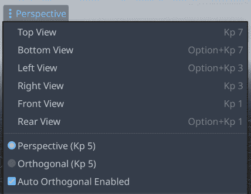
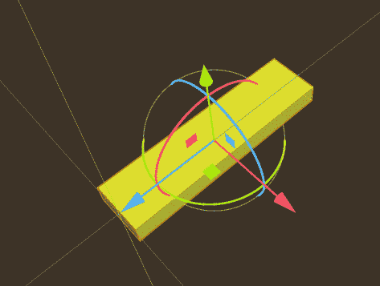

# 5

# 3D 迷你高尔夫：通过构建迷你高尔夫球场深入 3D

本书前面的项目都是设计在 2D 空间中的。这是故意的，为了在保持项目范围有限的同时介绍 Godot 的功能和概念。在这一章中，你将进入游戏开发的 3D 领域。对于一些人来说，3D 开发感觉管理起来要困难得多。对于其他人来说，它可能更直接。无论如何，你确实需要理解一个额外的复杂层。

如果你之前从未使用过任何类型的 3D 软件，你可能会发现自己遇到了许多新概念。这一章将尽可能多地解释它们，但请记住，在需要更深入理解特定主题时，务必参考 Godot 文档。

你在本章中将要制作的游戏叫做*3D 迷你高尔夫*。在其中，你将构建一个小型迷你高尔夫球场、一个球和一个瞄准并射击球向洞的方向的界面。

本章中你将学习到的一些内容如下：

+   导航 Godot 的 3D 编辑器

+   `Node3D`及其属性

+   导入 3D 网格和使用 3D 碰撞形状

+   如何使用 3D 相机

+   设置灯光和环境

+   PBR 和材质简介

在深入之前，简要介绍 Godot 中的 3D。

# 技术要求

从以下链接下载游戏资源，并将其解压到你的新项目文件夹中：

[`github.com/PacktPublishing/Godot-4-Game-Development-Projects-Second-Edition/tree/main/Downloads`](https://github.com/PacktPublishing/Godot-4-Game-Development-Projects-Second-Edition/tree/main/Downloads)

你也可以在 GitHub 上找到本章的完整代码：[`github.com/PacktPublishing/Godot-4-Game-Development-Projects-Second-Edition/tree/main/Chapter05%20-%203D%20Minigolf`](https://github.com/PacktPublishing/Godot-4-Game-Development-Projects-Second-Edition/tree/main/Chapter05%20-%203D%20Minigolf)

# 3D 简介

Godot 的一个优势是它能够处理 2D 和 3D 游戏。你在本书前面学到的许多内容在 3D 中同样适用——节点、场景、信号等。但是，从 2D 转换到 3D 也带来了一整个新的复杂性和功能层。首先，你会发现 3D 编辑器窗口中有一些额外的功能可用，熟悉如何导航是个好主意。

## 在 3D 空间中的定位

打开一个新的项目，然后在编辑器窗口顶部点击**3D**按钮，以查看 3D 项目视图：


图 5.1：3D 工作区

你首先应该注意到的中心的三条彩色线条。这些是`x`（红色）、`y`（绿色）和`z`（蓝色）轴。它们相交的点就是`(0, 0, 0)`。

3D 坐标

正如你使用`Vector2(x, y)`来表示 2D 空间中的位置一样，你将使用`Vector3(x, y, z)`来描述三维空间中的位置。

在 3D 工作时经常出现的一个问题是，不同的应用程序使用不同的方向约定。Godot 使用 `x` 指向左/右，然后 `y` 是上/下，`z` 是前/后。如果您使用其他流行的 3D 软件，您可能会发现其中一些使用 **Z-Up**。了解这一点是好的，因为它可以在在不同程序之间移动时导致混淆。

另一个需要注意的重要事项是度量单位。在 2D 中，Godot 以像素为单位测量一切，这在屏幕上绘制时作为测量的自然基础是有意义的。然而，当在 3D 空间中工作时，像素并不太有用。两个相同大小的对象将根据它们与摄像机的距离不同而占据屏幕上的不同区域（关于摄像机的更多信息即将揭晓）。因此，在 3D 空间中，Godot 中的所有对象都使用通用单位进行测量。虽然通常将它们称为“米”，但您可以根据游戏世界的比例自由命名这些单位：英寸、毫米，甚至光年。

## Godot 的 3D 编辑器

在深入构建游戏之前，回顾如何在 3D 空间中导航将是有用的。视图摄像机使用鼠标和键盘控制：

+   *鼠标滚轮上下滚动*: 在当前目标上放大/缩小

+   *中间按钮* + *拖动*: 围绕当前目标旋转摄像机

+   *Shift* + *中间按钮* + *拖动*: 摄像机向上/下/左/右平移

+   *右键按钮* + *拖动*: 在原地旋转摄像机

注意，其中一些动作是基于摄像机目标或**焦点**的。要聚焦于空间中的某个对象，您可以选中它并按 *F* 键。

Freelook 导航

如果您熟悉流行的 3D 游戏，如 *Minecraft*，您可以按 *Shift* + *F* 切换到 FreeLook 模式。在此模式下，您可以使用 *W*/*A*/*S*/*D* 键在场景中飞行，同时用鼠标瞄准。再次按 *Shift* + *F* 退出 FreeLook 模式。

您还可以通过点击视口左上角的**透视**标签来影响摄像机的视图。在这里，您可以快速将摄像机定位到特定的方向，例如**俯视图**或**前视图**：



图 5.2：透视菜单

这在结合使用多个视口的大屏幕上特别有用。点击 **视图** 菜单，您可以将屏幕分割成多个视图，让您能够同时从各个方向看到对象。

键盘快捷键

注意，这些菜单选项中的每一个都与一个键盘快捷键相关联。您可以通过点击 **编辑器** -> **编辑器设置** -> **3D** 来查看并调整您喜欢的键盘快捷键。

## 添加 3D 对象

是时候添加您的第一个 3D 节点了。就像所有 2D 节点继承自 `Node2D`，它提供了诸如 `Node3D` 这样的属性，它提供了空间属性。将一个添加到场景中，您将看到以下内容：


图 5.3：带有 gizmo 的 Node3D

你看到的那个五彩斑斓的对象不是节点，而是一个 3D**gizmo**。gizmo 是一个工具，允许你在空间中移动和旋转对象。三个环控制旋转，而三个箭头沿着三个轴移动对象。注意，环和箭头是按照轴的颜色进行着色编码的。箭头沿着相应的轴移动对象，而环则围绕特定的轴旋转对象。还有三个小方块可以锁定一个轴，并允许你在对象的平面上移动。

花几分钟时间进行实验，熟悉 gizmo。如果你发现自己迷失方向，可以删除节点并添加另一个。

有时候 gizmo 会碍事。你可以点击模式图标来限制自己只进行一种类型的变换：**移动**、**旋转**或**缩放**：


图 5.4：选择模式图标

*Q*/*W*/*E*/*R*键是这些按钮的快捷键，允许你快速在模式之间切换。

## 全局空间与局部空间

默认情况下，gizmo 控制操作在全局空间中。尝试旋转对象——无论你怎么转动它，gizmo 的移动箭头仍然沿着全局轴指向。现在尝试这样做：将`Node3D`节点放回其原始位置和方向（或者删除它并添加一个新的）。围绕一个轴旋转对象，然后点击**使用局部空间**按钮（注意**T**快捷键）：


图 5.5：切换局部空间模式

观察 gizmo 箭头的指向。现在它们沿着对象的**局部**轴而不是世界轴指向。当你点击并拖动箭头时，它们会相对于对象的自身旋转移动对象。你可以再次点击按钮切换回全局空间。在这些两种模式之间切换可以使放置对象到你想要的位置变得容易得多。

## 变换

查看 Inspector 中的`Node3D`。在**变换**部分，你会看到节点的**位置**、**旋转**和**缩放**属性。当你移动对象时，你会看到这些值发生变化。就像在 2D 中一样，这些值是相对于节点的父节点**相对**的。

这三个量共同构成了节点的`transform`属性，这是一个 Godot 的`Transform3D`对象。`Transform3D`有两个子属性：`origin`和`basis`。`origin`属性表示物体的位置，而`basis`属性包含三个向量，这些向量定义了物体的局部坐标轴。当你处于**局部**空间模式时，想想 gizmo 中的三个轴箭头。

你将在本节后面了解如何使用这些属性。

## 网格

就像`Node2D`一样，`Node3D`节点没有自己的大小或外观。在 2D 中，你添加`Sprite2D`来显示节点上的纹理。在 3D 中，你通常想要添加一个**网格**。网格是三维形状的数学描述。它由称为**顶点**的点集合组成。这些顶点通过称为**边**的线连接，多个边（至少三个）共同构成一个**面**。

例如，一个立方体由八个顶点、十二条边和六个面组成：


图 5.6：顶点、边和面

如果你曾经使用过 3D 设计软件，这对你来说可能已经熟悉了。如果你还没有，并且你对学习 3D 建模感兴趣，*Blender*是一个非常流行的开源工具，用于设计 3D 对象。你可以在互联网上找到许多教程和课程，帮助你开始使用 Blender。

### 原始形状

如果你还没有创建或下载 3D 模型，或者你只需要快速创建一个简单形状，Godot 有直接创建某些 3D 网格的能力。将一个`MeshInstance3D`节点作为你的`Node3D`节点的子节点，然后在检查器中查找**网格**属性：


图 5.7：添加新的网格

这些预定义的形状被称为**原始形状**，它们代表了一组常用的有用形状。选择**新建 BoxMesh**，你将在屏幕上看到一个立方体出现。

### 导入网格

无论你使用什么建模软件，你都需要将你的模型导出为 Godot 可读的格式。Godot 支持多种文件格式用于导入：

+   `glTF` – 支持文本（`.gltf`）和二进制（`.glb`）版本

+   `DAE (COLLADA)` – 尽管是旧格式，但仍然受到支持

+   `OBJ (Wavefront)` – 受支持，但由于格式限制而有限

+   `ESCN` – Blender 可以导出的 Godot 特定文件格式

+   `FBX` – 一个具有有限支持的商业格式

推荐的格式是`.gltf`。它具有最多的功能，并且在 Godot 中得到了非常好的支持。有关从 Blender 导出`.gltf`文件以供 Godot 使用的详细信息，请参阅附录。

你将在本章后面看到如何导入一些预构建的`.gltf`场景。

## 摄像机

尝试运行带有你的立方体网格的场景。它在哪？在 3D 中，除非场景中有`Camera3D`摄像机，否则你不会在游戏视图中看到任何东西。添加一个，你将看到一个看起来像这样的新节点：


图 5.8：摄像机小部件

使用摄像机的辅助工具将其放置在稍微高于位置并指向立方体：


图 5.9：调整摄像机方向

那个粉紫色、金字塔形状的对象被称为摄像机的**视锥体**。它表示摄像机的视角，可以变窄或变宽以影响摄像机的**视野**。视锥体顶部的三角形形状表示摄像机的“向上”方向。

当您在周围移动摄像机时，您可以在视口的右上角按下**预览**按钮来检查摄像机看到的内容。您可以尝试调整摄像机的位置并调整其**FOV**。

### 方向

注意，摄像机的视锥体沿着`transform.basis`方向是物体的局部坐标轴集：

```cpp
position += -transform.basis.z * speed * delta
```

这些新的概念和编辑器功能将帮助您在 3D 空间中导航和工作。如果您需要提醒某个特定 3D 相关术语的含义，请参考本节。在下一节中，您将开始设置您的第一个 3D 项目。

# 项目设置

现在您已经学会了如何在 Godot 的 3D 编辑器中导航，您就可以开始制作迷你高尔夫游戏了。与其他项目一样，从以下链接下载游戏资源，并将其解压到您的项目文件夹中。解压后的`assets`文件夹包含您完成游戏所需的图像、3D 模型和其他项目。

创建一个新的项目，并从[`github.com/PacktPublishing/Godot-Engine-Game-Development-Projects-Second-Edition`](https://github.com/PacktPublishing/Godot-Engine-Game-Development-Projects-Second-Edition)下载项目资源。

您会注意到`assets`中有几个不同的文件夹。`courses`文件夹包含一些预构建的迷你高尔夫洞，您可以尝试并比较您自己制作的洞。现在不要看它们——尝试按照步骤制作您自己的第一个。

这个游戏将使用左键点击作为输入。打开`click`，然后点击加号将**左鼠标按钮**输入添加到其中：


图 5.10：分配鼠标按钮输入

当您在**项目设置**中时，您还可以设置当游戏窗口大小调整时游戏的行为。在游戏过程中，用户可能会选择调整窗口大小，这可能会破坏您的 UI 布局或显示扭曲的游戏视图。为了防止这种情况，导航到**显示/窗口**部分并找到**拉伸/模式**设置。将其更改为**视口**：


图 5.11：设置窗口拉伸模式

这就完成了项目的设置。现在，您可以继续构建游戏的第一个部分：迷你高尔夫球场。

# 创建课程

对于第一个场景，添加一个名为`Hole`的`Node3D`节点并保存场景。就像在*Jungle Jump*中做的那样，您将创建一个通用的场景，包含任何洞所需的节点和代码，然后从这个场景继承以创建游戏中您想要的任意数量的单独洞。

接下来，向场景中添加一个`GridMap`节点。

## 理解网格地图

`GridMap`是您在本书早期使用的`TileMap`节点的 3D 等价物。它允许您使用一个由`MeshLibrary`集合（类似于`TileSet`）包含的网格（网格）并按网格排列。因为它在 3D 中操作，所以您可以按任意方向堆叠网格，尽管在这个项目中您将坚持一个平面。

### 创建网格库集合

在 `res://assets/` 文件夹中，你可以找到一个预先生成的 `MeshLibrary` 功能 `golf_tiles.tres`，其中包含所有必要的课程部分以及它们的碰撞形状。

要创建自己的 `MeshLibrary` 函数，你需要制作一个包含你想要使用的单个网格的 3D 场景，为它们添加碰撞，然后将该场景导出为 `MeshLibrary` 集合。如果你打开 `golf_tiles.tscn`，你会看到用于创建 `golf_tiles.tres` 的原始场景。

在这个场景中，你会看到所有从 Blender 导入的单独高尔夫球场瓦片网格，它们最初是在 Blender 中建模的。为了给每个瓦片添加碰撞形状，Godot 提供了一个方便的快捷方式：选择一个网格，你会在视口顶部的工具栏中看到一个 **网格** 菜单：


图 5.12：网格菜单

使用网格的数据选择 `StaticBody3D` 节点和 `CollisionShape3D` 节点。

一旦所有碰撞都添加完毕，你可以选择 `GridMap` 可以使用。

## 绘制第一个洞

将 `MeshLibrary` 文件拖入 `GridMap` 节点。你会在编辑器视口的右侧看到一个可用的瓦片列表。

为了匹配瓦片的大小，设置 `(1,` `1, 1)`。

为了确保球与碰撞看起来很好，找到 `0.5`：


图 5.13：使用物理材质

尝试通过从列表中选择瓦片块并将其通过左键点击放置在场景中来绘制。你可以通过按 **S** 键在 `y` 轴周围旋转一个块。要删除瓦片，右键点击它。

现在，坚持简单的布局。当一切正常工作时，你可以变得复杂一些：


图 5.14：示例课程布局

你可以查看游戏运行时的样子。将 `Camera3D` 功能添加到场景中，并将其移动到一个可以俯瞰课程的位置。记住，你可以按 **预览** 按钮检查相机看到的画面。

播放场景。你会注意到一切都非常暗，与编辑器窗口中的样子不同。默认情况下，3D 场景没有配置 *环境* 或 *光照*。

## 环境和照明

照明是一个复杂的主题。选择放置光源的位置以及它们的配置可以显著影响场景的外观。

Godot 在 3D 中提供了三个光照节点：

+   `OmniLight3D`：用于从所有方向发射的光，例如来自灯泡

+   `DirectionalLight3D`：来自远处的光源，例如阳光

+   `SpotLight3D`：从一个点投射出的锥形光，类似于手电筒或灯笼

除了放置单个光源外，你还可以使用 `WorldEnvironment` 节点设置 *环境* 光 – 由环境产生的光。

而不是从头开始，Godot 允许你使用工具栏中的按钮从编辑器窗口中看到的默认照明设置开始：


图 5.15：照明和环境设置

前两个按钮允许你切换预览太阳（方向光）和环境。请注意，环境不仅影响照明，还会生成天空纹理。

如果你点击三个点，你可以看到这些的默认设置。点击场景中的 `WorldEnvironment` 节点和 `DirectionalLight3D` 节点。

如果你放大你的网格，你可能会注意到阴影看起来不太好。默认的阴影设置需要调整，所以选择 `DirectionalLight3D` 并将 `100` 改为 `40`。

## 添加球洞

现在你已经布置了球场，你需要一种方法来检测球是否掉入球洞。

添加一个名为 `Hole` 的 `Area3D` 节点。这个节点与其 2D 版本完全一样——它可以在物体进入其定义的形状时发出信号。将一个 `CollisionShape3D` 子节点添加到区域中。在 `0.25` 和 `0.08`。

将 `Hole` 放置在你为球场放置的球洞瓷砖的位置。确保圆柱形状不会投影到球洞顶部以上，否则球在还没有掉入时会被计为“在洞内”。你可能发现使用 **Perspective** 按钮并切换到 **Top View** 来确保它正确居中很有用：


图 5.16：定位球洞

你还需要标记球的起始位置，因此将一个名为 `Tee` 的 `Marker3D` 节点添加到场景中。将其放置在你希望球开始的位置。确保将其放置在表面之上，这样球就不会在地面内部生成。

这样，你就完成了第一轮次的制作。花几分钟时间四处看看，确保你对布局满意。记住，这不应该是一个复杂或具有挑战性的布局。它将向玩家介绍游戏，你也会用它来测试一切是否正常工作。为此，你接下来需要创建高尔夫球。

# 制作球

由于球需要物理特性——重力、摩擦、与墙壁的碰撞等——因此 `RigidBody3D` 将是节点选择的最佳选择。刚体在 3D 中的工作方式与你在 2D 中使用的方式相似，你将使用相同的方法与它们交互，例如 `_integrate_forces()` 和 `apply_impulse()`。

创建一个新的场景，并添加一个名为 `Ball` 的 `RigidBody3D` 节点，然后保存它。

由于你需要一个简单的球体形状，而 Godot 包含原始形状，因此这里不需要复杂的 3D 模型。添加一个 `MeshInstance3D` 子节点，并在检查器中选择 **New SphereMesh** 作为 **Mesh** 属性。

默认大小太大，所以点击 `0.05` 和 `0.1`。

添加一个 `CollisionShape3D` 节点，并给它一个 `SphereShape3D`。将其 `0.05` 设置与网格匹配。

## 测试球

将 `Ball` 场景的一个实例添加到你的课程中。将其放置在某个瓦片上方并播放场景。你应该看到球落下并落在地面上。

你也可以通过设置 `y` 轴向上来暂时给球一些运动。不要忘记在继续之前将其设置回 `(0, 0, 0)`。

## 改善球碰撞

你可能已经注意到，在调整速度时，球有时会穿过墙壁和/或以奇怪的方式弹跳，尤其是如果你选择了一个高速值。你可以做几件事情来改善球的行为。

首先，你可以使用**连续碰撞检测**（**CCD**）。使用 CCD 改变了物理引擎计算碰撞的方式。通常，引擎通过首先移动对象，然后测试和解决碰撞来运行。这很快，并且适用于大多数常见情况。当使用 CCD 时，引擎会沿着对象的路径预测其移动，并尝试预测碰撞可能发生的位置。这比默认行为（在计算上）要慢，尤其是在模拟许多对象时，但它要准确得多。由于你只有一个球，且环境非常小，因此 CCD 是一个好的选择，因为它不会引入任何明显的性能惩罚。你可以在检查器中找到它作为**连续 CD**：


图 5.17：CCD 开关

球也需要一点额外的动作，所以在 `0.25`。这个属性决定了碰撞会有多“弹跳”。值可以从 `0`（完全没有弹跳）到 `1.0`（最弹跳）：


图 5.18：物理材质弹跳设置

你也可能已经注意到球需要很长时间才能完全停下来。设置 `0.5` 和 `1`。这些值可以被认为是与空气阻力相似——使物体减速，无论是否与表面相互作用。增加这些值意味着玩家不需要等待那么长时间球才会停止移动，而且球在停止滚动后不会看起来像是在原地旋转。

你已经完成了球体的设置，但这里是一个好的地方可以暂停一下，确保在继续之前一切如你所愿。球感觉像是在弹跳和滚动吗？当它撞到墙壁时，弹跳是否过多或过少？当你对球的动作调整满意后，继续到下一部分，在那里你将设置如何发射球。

# 添加用户界面

现在球已经在赛道上了，你需要一种方法来瞄准和击打它。对于这类游戏，有许多可能的控制方案。对于这个项目，你将使用两步过程：

1.  **目标**：出现一个箭头，来回摆动。点击鼠标按钮设置目标方向。

1.  **射击**：一个力量条上下移动。点击鼠标设置力量并发射球。

## 对准箭头

在 3D 中绘制对象不像在 2D 中那么容易。在许多情况下，你将不得不切换到 3D 建模程序，如 Blender，来创建你的游戏对象。然而，在这种情况下，Godot 的原语将做得很好。要制作箭头，你需要两个网格：一个长而窄的矩形和一个三角棱柱。

制作自己的模型

如果你熟悉使用单独的 3D 建模程序，如 *Blender*，请随意使用它来创建箭头网格而不是遵循以下步骤。只需将导出的模型放入你的 Godot 项目文件夹中，并用 `MeshInstance3D` 节点加载它。请参阅最后一章中有关直接从 Blender 导入模型的详细信息。

通过添加一个名为 `Arrow` 的 `Node3D` 节点并为其添加一个 `MeshInstance3D` 子节点来开始一个新的场景。给这个网格赋予一个 `BoxMesh` 函数并设置盒子的 `(0.5, 0.2, 2)`。这将成为箭头的主体，但在继续之前，有一个问题。如果你旋转父节点，网格将围绕其中心旋转。你需要它围绕其末端旋转，所以将 `MeshInstance3D` 节点更改为 `(0, 0, -1)`。记住，这个属性是相对于节点的父节点测量的，所以这是将网格从 `Node3D` 节点偏移：



图 5.19：偏移基础

尝试使用 gizmo 旋转根节点（`Arrow`）以确认形状现在已正确偏移。

当它在游戏中查看时，箭头应该是半透明的。你也可以给它一个颜色，使其更加突出。要更改网格的视觉属性，你需要使用 **材质**。

在网格属性（设置大小的地方）下，你会在该框中看到一个 `StandardMaterial3D` 节点：


图 5.20：偏移基础

如果你点击这个新的材质对象以展开它，你会看到一个长长的属性列表。别担心，你只需要更改其中两个。

首先，展开 **透明度** 部分，并将 **透明度** 设置为 **Alpha**。此属性告诉渲染引擎该对象可以允许光线通过。

接下来，对象的颜色在 `128` 中设置。

现在，为了创建箭头的尖端，添加另一个 `MeshInstance3D` 节点，这次选择一个 `PrismMesh` 网格。将其设置为 `(1.5, 1.5, 0.2)` 以获得一个平坦的三角形形状。为了将其放置在矩形的末端，将其更改为 `(0, 0, -2.75)` 和 `(-90, 0, 0)`。

最后，通过设置根节点的 `0.25, 0.25, 0.25)` 将整个箭头缩小。

你还需要像对待其他部分一样设置棱镜的材质。为此，快速选择盒子形状并再次找到其材质属性。在材质下拉菜单中选择 **复制**。然后你可以转到棱镜网格并将相同的材质粘贴到它上面。请注意，由于它们具有相同的材质，对其中一个形状所做的任何更改都将应用于两个形状：


图 5.21：定位箭头

你的瞄准箭头已完成。保存场景并将其实例化到你的 `Hole` 场景中。

## UI 显示

使用名为 `UI` 的 `CanvasLayer` 层创建一个新的场景。在这个场景中，你将显示电力条以及玩家的得分次数。就像在 2D 中一样，这个节点将导致其内容被绘制在主场景之上。

添加一个 `Label` 节点，然后一个 `MarginContainer` 节点。在其中，添加一个 `VboxContainer` 节点，并在其中添加两个 `Label` 节点和一个 `TextureProgressBar` 节点。按所示命名：


图 5.22：UI 节点布局

在 `MarginContainer` 部分，设置 `20`。将 `Xolonium-Regular.ttf` 字体添加到两个 `Label` 节点中，并将它们的字体大小设置为 `30`。将 `Shots` 设置为 `PowerLabel` 的 **Power**。

使用更大的字体大小 `80` 为 `Message` 标签添加字体，并将其文本设置为 `Get Ready!`。从 **锚点预设** 菜单中选择 **居中**，然后点击消息旁边的眼睛符号以隐藏它。

将 `res://assets` 中的一个彩色条纹理拖放到 `PowerBar` 中。默认情况下，`TextureProgressBar` 从左向右增长，因此对于垂直方向，将 **填充模式** 更改为 **从下到上**。将 **值** 设置为几个不同的值以查看结果。

完成的 UI 布局应如下所示：


图 5.23：UI 预览

在 `Hole` 场景中添加 `UI` 的一个实例。因为它是 `CanvasLayer`，它将被绘制在 3D 摄像机视图之上。

现在你已经完成了课程的绘制并添加了 UI，你拥有了玩家在游戏过程中将看到的全部视觉元素。你的下一个任务将通过添加一些代码使这些部分协同工作。

# 游戏脚本编写

在本节中，你将创建使一切协同工作的脚本。游戏流程如下：

1.  将球放置在 `Tee` 上。

1.  切换到 **Aim** 模式并动画化箭头，直到玩家点击。

1.  切换到 **Power** 模式并动画化电力条，直到玩家点击。

1.  发射球。

1.  重复从 *步骤 2* 开始的过程，直到球落入洞中。

## UI 代码

将此脚本添加到 `UI` 实例中，以更新 UI 元素：

```cpp
extends CanvasLayer
@onready var power_bar = $MarginContainer/VBoxContainer/PowerBar
@onready var shots = $MarginContainer/VBoxContainer/Shots
var bar_textures = {
    "green": preload("res://assets/bar_green.png"),
    "yellow": preload("res://assets/bar_yellow.png"),
    "red": preload("res://assets/bar_red.png")
}
func update_shots(value):
    shots.text = "Shots: %s" % value
func update_power_bar(value):
    power_bar.texture_progress = bar_textures["green"]
    if value > 70:
        power_bar.texture_progress = bar_textures["red"]
    elif value > 40:
        power_bar.texture_progress = bar_textures["yellow"]
    power_bar.value = value
func show_message(text):
    $Message.text = text
    $Message.show()
    await get_tree().create_timer(2).timeout
    $Message.hide()
```

这些功能提供了一种在需要显示新值时更新 UI 元素的方法。正如你在 *Space Rocks* 中所做的那样，根据进度条的值更改纹理，为电力水平提供了良好的低/中/高感觉。

## 主脚本

向 `Hole` 场景添加脚本，并从以下变量开始：

```cpp
extends Node3D
enum {AIM, SET_POWER, SHOOT, WIN}
@export var power_speed = 100
@export var angle_speed = 1.1
var angle_change = 1
var power = 0
var power_change = 1
var shots = 0
var state = AIM
```

`enum` 列出了游戏可能处于的状态，而 `power` 和 `angle` 变量将用于设置它们各自的价值并在时间上改变它们。你可以通过调整两个导出变量来控制动画速度（因此难度）。

接下来，在开始游戏之前设置初始值：

```cpp
func _ready():
    $Arrow.hide()
    $Ball.position = $Tee.position
    change_state(AIM)
    $UI.show_message("Get Ready!")
```

球被移动到球座位置，然后你切换到 `AIM` 状态开始。

对于每个游戏状态，需要发生以下情况：

```cpp
func change_state(new_state):
    state = new_state
    match state:
        AIM:
            $Arrow.position = $Ball.position
            $Arrow.show()
        SET_POWER:
            power = 0
        SHOOT:
            $Arrow.hide()
            $Ball.shoot($Arrow.rotation.y, power / 15)
            shots += 1
            $UI.update_shots(shots)
        WIN:
            $Ball.hide()
            $Arrow.hide()
            $UI.show_message("Win!")
```

`AIM` 将瞄准箭头放置在球的位置并使其可见。回想一下，你偏移了箭头，所以它看起来是从球向外指。当你旋转箭头时，你将在 `y` 轴周围旋转它，使其保持与地面平行。

此外，请注意，在进入 `SHOOT` 状态时，你在球上调用 `shoot()` 函数，但你还没有定义它。你将在下一节中添加它。

下一步是检查用户输入：

```cpp
func _input(event):
    if event.is_action_pressed("click"):
        match state:
            AIM:
                change_state(SET_POWER)
            SET_POWER:
                change_state(SHOOT)
```

游戏的唯一输入（到目前为止）是点击左鼠标按钮。根据你当前的状态，点击它将过渡到下一个状态。

在 `_process()` 中，你将根据状态确定要动画化的内容。目前，它只是调用动画化适当属性的函数：

```cpp
func _process(delta):
    match state:
        AIM:
            animate_arrow(delta)
        SET_POWER:
            animate_power(delta)
        SHOOT:
            pass
```

这两个函数都很相似。它们在两个极端值之间逐渐改变一个值，当达到极限时反转方向。注意，箭头在 180° 范围内动画化（+90° 到 -90°）：

```cpp
func animate_arrow(delta):
    $Arrow.rotation.y += angle_speed * angle_change * delta
    if $Arrow.rotation.y > PI / 2:
        angle_change = -1
    if $Arrow.rotation.y < -PI / 2:
        angle_change = 1
func animate_power(delta):
    power += power_speed * power_change * delta
    if power >= 100:
        power_change = -1
    if power <= 0:
        power_change = 1
    $UI.update_power_bar(power)
```

要检测球掉入洞中，选择你放置在洞中的 `Area3D` 节点并连接其 `body_entered` 信号：

```cpp
func _on_hole_body_entered(body):
    if body.name == "Ball":
        print("win!")
        change_state(WIN)
```

最后，当球停止时，玩家将需要能够重新开始整个过程。

## 球脚本

在球的脚本中，需要两个函数。首先，必须对球施加一个*冲量*以启动其运动。其次，当球停止运动时，它需要通知主场景，以便玩家可以进行下一次投篮。

确保将此脚本添加到 `Ball` 场景中，而不是 `Hole` 场景中的球实例：

```cpp
extends RigidBody3D
signal stopped
func shoot(angle, power):
    var force = Vector3.FORWARD.rotated(Vector3.UP, angle)
    apply_central_impulse(force * power)
func _integrate_forces(state):
    if state.linear_velocity.length() < 0.1:
        stopped.emit()
        state.linear_velocity = Vector3.ZERO
    if position.y < -20:
        get_tree().reload_current_scene()
```

正如你在 *Space Rocks* 游戏中看到的，你可以在 `_integrate_forces()` 中使用物理状态安全地停止球，如果速度变得非常低。由于浮点数问题，速度可能不会自行减慢到 `0`。它的 `linear_velocity` 值可能在它看起来停止后的一段时间内仍然是 `0.00000001`。与其等待，你可以在速度低于 `0.1` 时停止球。

还有可能发生球意外地弹过墙壁并掉出赛道的情况。如果发生这种情况，你可以重新加载场景，让玩家重新开始。

返回到 `Hole` 场景并连接 `Ball` 实例的 `stopped` 信号：

```cpp
func _on_ball_stopped():
    if state == SHOOT:
        change_state(AIM)
```

## 测试它

尝试播放场景。你应该看到箭头在球的位置旋转。当你点击鼠标按钮时，箭头停止，力量条开始上下移动。当你再次点击时，球被发射出去。

如果这些步骤中的任何一个不起作用，不要继续前进。返回并尝试在上一个部分中找到你遗漏的内容。

一切正常后，你会注意到一些需要改进的区域。首先，当球停止移动时，箭头可能不会指向你想要的方向。这是因为起始角度始终是 `0`，它沿着 `z` 轴指向，然后箭头从那里摆动 +/-90°。在接下来的两个部分中，你将有两个选项来改进瞄准。

## 提高瞄准的选项 1

瞄准可以通过在开始时直接将 180° 弧指向洞来改进。

在脚本顶部添加一个名为 `hole_dir` 的变量。你可以通过一些向量数学找到这个方向：

```cpp
func set_start_angle():
    var hole_position = Vector2($Hole.position.z,
        $Hole.position.x)
    var ball_position = Vector2($Ball.position.z,
        $Ball.position.x)
    hole_dir = (ball_position - hole_position).angle()
    $Arrow.rotation.y = hole_dir
```

记住，球的位置是其中心，所以它略微高于表面，而洞的中心则略低于它。因此，从球到洞的向量也会指向地面的向下角度。为了防止这种情况并保持箭头水平，你可以只使用 `position` 中的 `x` 和 `z` 值来生成 `Vector2`。

现在，可以在启动 `AIM` 状态时设置初始角度：

```cpp
func change_state(new_state):
    state = new_state
    match state:
        AIM:
            $Arrow.position = $Ball.position
            $Arrow.show()
            set_start_angle()
```

箭头的动画可以使用这个初始方向作为 +/-90° 摆动的基准：

```cpp
func animate_arrow(delta):
    $Arrow.rotation.y += angle_speed * angle_change * delta
    if $Arrow.rotation.y > hole_dir + PI / 2:
        angle_change = -1
    if $Arrow.rotation.y < hole_dir - PI / 2:
        angle_change = 1
```

再次尝试玩游戏。现在箭头应该总是指向洞的大致方向。这更好，但你仍然可能难以瞄准。

## 提高瞄准的选项 2

如果你更喜欢对瞄准有更多控制，那么你可以直接通过移动鼠标左右来控制箭头，而不是通过动画箭头和点击来设置瞄准。

为了实现这一点，你可以使用 Godot 的 `InputEvent` 类型之一：`InputEventMouseMotion`。这个事件在鼠标移动时发生，并包括一个 `relative` 属性，表示鼠标在上一个帧中移动的距离。你可以使用这个值来旋转箭头一个小量。

首先，通过从 `_process()` 中移除 `AIM` 部分来禁用箭头动画。

添加一个变量，以便你可以根据鼠标移动来控制箭头的旋转程度：

```cpp
@export var mouse_sensitivity = 150
```

然后，在 `_input()` 中写入以下代码以检查鼠标移动并旋转箭头：

```cpp
func _input(event):
    if event is InputEventMouseMotion:
        if state == AIM:
            $Arrow.rotation.y -= event.relative.x / mouse_sensitivity
```

### 捕捉鼠标

你可能已经注意到，当你移动鼠标时，它可能会离开游戏窗口，当你点击时，你不再与游戏交互。大多数 3D 游戏通过 *捕捉* 鼠标来解决这个问题——将鼠标锁定在窗口上。当你这样做时，你还需要为玩家提供一个释放鼠标的方法，以便他们可以关闭程序或点击其他窗口，以及一个重新捕捉鼠标的方法来回到游戏。

对于这款游戏，你首先需要捕捉鼠标，然后如果玩家按下 *Esc*，释放鼠标并暂停游戏。在游戏窗口中点击将取消暂停并继续。

所有这些功能都通过 `Input.mouse_mode` 属性控制。然后，`mouse_mode` 可以设置为以下值之一：

+   `MOUSE_MODE_VISIBLE`: 这是默认模式。鼠标可见，可以自由地在窗口内外移动。

+   `MOUSE_MODE_HIDDEN`: 鼠标光标被隐藏。

+   `MOUSE_MODE_CAPTURED`: 鼠标被隐藏，并且其位置被锁定到窗口。

+   `MOUSE_MODE_CONFINED`: 鼠标可见，但被限制在窗口内。

首先在`_ready()`中捕获鼠标：

```cpp
Input.mouse_mode = Input.MOUSE_MODE_CAPTURED
```

在`_process()`中，当鼠标释放时，你不想对事物进行动画处理：

```cpp
func _process(delta):
    if Input.mouse_mode == Input.MOUSE_MODE_VISIBLE:
        return
```

要释放鼠标，在`_input()`中添加以下条件：

```cpp
if event.is_action_pressed("ui_cancel") and Input.mouse_mode == Input.MOUSE_MODE_CAPTURED:
    Input.mouse_mode = Input.MOUSE_MODE_VISIBLE
```

然后，当窗口被点击时，为了重新捕获鼠标，在`match_state`之前添加以下内容：

```cpp
if event.is_action_pressed("click"):
    if Input.mouse_mode == Input.MOUSE_MODE_VISIBLE:
        Input.mouse_mode = Input.MOUSE_MODE_CAPTURED
        return
```

播放场景以尝试它。

## 相机改进

另一个问题，特别是如果你布置了一个相对较大的赛道，那就是如果你将相机放置在发球台附近，它将无法很好地显示赛道上的其他部分，甚至根本不显示。你需要你的相机移动，显示赛道的其他部分，以便玩家可以舒适地瞄准。

解决这个问题的主要有两种方法：

1.  多个相机：在赛道周围的不同位置放置几个相机。将`Area3D`节点附加到它们上，当球进入一个相机的区域时，通过将其`current`属性设置为`true`来激活该相机。

1.  移动相机：坚持使用一个相机，但让它随着球移动，这样玩家的视角总是基于球的位置。

这两种方案都有优点和缺点。选项 1 需要更多的规划，决定确切的位置放置相机，以及使用多少个。因此，本节将重点介绍选项 2。

在许多 3D 游戏中，玩家可以控制一个旋转和移动的相机。通常，这种控制方案使用鼠标和键盘的组合。由于你已经在瞄准时使用了鼠标移动（如果你选择了该选项），*W*/*A*/*S*/*D*键是一个不错的选择。鼠标滚轮可以用来控制相机的缩放。

在**输入** **映射**属性中添加这些新动作：


图 5.24：输入映射

### 创建万向节

相机移动需要有一定的限制。一方面，它应该始终保持水平，不要向两侧倾斜。尝试这样做：拿一个相机，围绕`y`（工具箱的绿色环）旋转一小部分，然后围绕`x`（红色环）旋转一小部分。现在，反转`y`旋转并点击**预览**按钮。看看相机是否已经倾斜了吗？

解决这个问题的方法是将相机放置在`Node3D`节点上，这将分别控制相机的左右和上下移动。

首先，确保从场景中移除任何其他`Camera3D`节点，以免在哪个相机被使用上产生冲突。

创建一个新的场景并添加两个`Node3D`节点和一个`Camera3D`节点，命名如*图 5**.25*所示：


图 5.25：相机万向节节点设置

将`Camera3D`设置为`(0, 0, 10)`，使其偏移并朝向原点。

这是万向节的工作原理：外节点允许仅在`y`轴上旋转，而内节点仅在`x`轴上旋转。您可以亲自尝试，但请确保开启**使用局部空间**（见*3D 空间简介*部分）。记住，只移动外万向节节点的*绿色*环，以及内节点的*红色*环。不要改变相机。一旦您完成实验，将所有旋转重置为零。

要控制游戏中的这种运动，将脚本附加到根节点并添加以下内容：

```cpp
extends Node3D
@export var cam_speed = PI / 2
@export var zoom_speed = 0.1
var zoom = 0.2
func _input(event):
    if event.is_action_pressed("cam_zoom_in"):
        zoom -= zoom_speed
    if event.is_action_pressed("cam_zoom_out"):
        zoom += zoom_speed
func _process(delta):
    zoom = clamp(zoom, 0.1, 2.0)
    scale = Vector3.ONE * zoom
    var y = Input.get_axis("cam_left", "cam_right")
    rotate_y(y * cam_speed * delta)
    var x = Input.get_axis("cam_up", "cam_down")
    $GimbalInner.rotate_x(x * cam_speed * delta)
    $GimbalInner.rotation.x = clamp($GimbalInner.rotation.x,         -PI / 2, -0.2)
```

如您所见，左右动作旋转根`Node3D`节点绕其`y`轴，上下动作旋转`GimbalInner`绕其`x`轴。整个万向节系统的`scale`属性用于处理缩放。最后，通过使用`clamp()`限制旋转和缩放，防止用户将相机翻转过来或缩放得太近或太远。

在`Hole`场景中添加一个`CameraGimbal`实例。

下一步是让相机跟随球。您可以在`_process()`中通过设置相机的位置为球的位置来实现这一点：

```cpp
if state != WIN:
    $CameraGimbal.position = $Ball.position
```

播放场景并测试您是否可以旋转和缩放相机，以及当您射击时球会移动。

## 设计完整课程

一旦球落入洞中，玩家应前进到下一个洞进行游戏。在`hole.gd`顶部添加此变量：

```cpp
@export var next_hole : PackedScene
```

这将让您设置将要加载的下一个洞。在检查器中，选择**下一个洞**属性以选择下一个要加载的场景。

在`WIN`状态中添加加载代码：

```cpp
WIN:
$Ball.hide()
$Arrow.hide()
    await get_tree().create_timer(1).timeout
    if next_hole:
        get_tree().change_scene_to_packed(next_hole)
```

您的`Hole`场景旨在成为构建多个玩家可以玩过的通用脚手架。现在您已经让它工作，您可以使用它通过**场景** -> **新建** **继承场景**来创建多个场景。

使用这种技术，您可以创建尽可能多的洞，并将它们连接成完整的高尔夫球场。以下是在示例项目中的第二个洞：


图 5.26：示例课程布局

# 视觉效果

球和其他网格在场景中的外观被有意地留得很简单。您可以将扁平的白色球视为空白画布，准备上色。首先，一些词汇：

+   **纹理**：纹理是围绕 3D 对象*包裹*的平面、2D 图像。想象一下包裹礼物：扁平的纸张折叠在包裹上，适应其形状。纹理可以是简单的，也可以是复杂的，这取决于它们设计要应用的形状。

+   `StandardMaterial3D`.

+   **材料**: Godot 使用一种名为 **基于物理的渲染**（**PBR**）的图形渲染模型。PBR 的目标是渲染图形，使其能够准确模拟现实世界中光的行为。这些效果通过使用其材料属性应用于网格。材料本质上是一个纹理和着色器的容器。材料的属性决定了纹理和着色器效果的应用方式。使用 Godot 内置的材料属性，你可以模拟各种物理材料，如石头、布料或金属。如果内置属性不足以满足你的需求，你可以编写自己的着色器代码来添加更多效果。

## 添加材料

在“球”场景中，选择`MeshInstance`，并在其`StandardMaterial3D`节点中。

展开材料，你会看到大量的属性，远超过这里所能涵盖的范围。本节将重点介绍一些制作球体更具吸引力的最有用属性。我们鼓励你访问 [`docs.godotengine.org/en/latest/tutorials/3d/standard_material_3d.html`](https://docs.godotengine.org/en/latest/tutorials/3d/standard_material_3d.html) 以获得所有设置的完整解释。

首先，尝试对这些参数进行实验：

+   **反照率**: 这个属性设置了材料的基色。更改它可以使球体呈现你想要的任何颜色。如果你正在处理需要纹理的对象，这里也是添加纹理的地方。

+   `0` 和 `1`。**金属**值控制**光泽度**。更高的值会反射更多光线，就像金属物质一样。**粗糙度**值对反射应用一定程度的模糊。较低的值更具有反射性，例如镜子的抛光表面。通过调整这两个属性，你可以模拟各种材料。*图 5.27* 是一个关于 **粗糙度** 和 **金属** 属性如何影响物体外观的指南。请记住，照明和其他因素也会改变外观。理解光和反射如何与表面属性相互作用是设计有效 3D 对象的重要组成部分：


图 5.27：金属和粗糙度值

+   **法线贴图**: 法线贴图是一种 3D 图形技术，用于模拟表面上的凹凸效果。在网格本身中建模这些效果会导致组成对象的三角形或面数大量增加，从而导致性能降低。相反，使用一个 2D 纹理来映射这些小表面特征会产生光和影的模式。然后，照明引擎使用这些信息来改变反射，就像这些细节实际上存在一样。一个正确构建的法线贴图可以为原本看起来平淡无奇的对象添加大量细节。

球体是一个很好的正常映射用例的例子，因为真实的高尔夫球在其表面有数百个凹坑，但你使用的球体原语是一个光滑的表面。使用常规纹理可能会添加斑点，但它们看起来会像涂在表面上的，显得很平。模拟这些凹坑的正常映射看起来会是这样：


图 5.28：正常映射

红色和蓝色的图案包含信息，告诉引擎在那个点表面应该朝向哪个方向，因此光线应该在那个位置反射的方向。注意顶部和底部的拉伸——这是因为这张图片是为了包裹球形形状而制作的。

将`res://assets/ball_normal_map.png`启用到`-0.5`和`-1.0`，效果最佳：


图 5.29：带有正常映射的球体

花些时间实验这些设置，找到你喜欢的组合。别忘了尝试播放场景，因为`WorldEnvironment`功能的周围照明会影响最终结果。

在下一节中，你将学习如何调整`WorldEnvironment`设置以改变场景的外观。

# 照明和环境

你一直在使用默认的照明设置，这是你在第一部分中添加到场景中的。虽然你可能对这个照明设置感到满意，但你也可以调整它以显著改变游戏的外观。

`WorldEnvironment`节点包含一个`Environment`属性，用于控制场景的背景、天空、环境光和其他外观方面。选择节点并点击属性以展开它：


图 5.30：环境属性

这里有很多设置，其中一些只在特定的高级情况下真正有用。然而，这些是你最常使用的：

+   `Sky`材质。天空材质可以是围绕场景包裹的特殊纹理（参见下一节中的示例）或者由引擎自动生成的材质。你现在使用的默认天空材质是后者：`ProceduralSkyMaterial`。展开它查看属性——你可以配置天空的颜色和太阳的外观。

+   **环境光**：这是一种影响所有网格的全局光，强度相同。你可以设置其颜色以及由天空生成多少。为了看到效果，尝试将颜色设置为白色并稍微减少**天空贡献**。

+   **屏幕空间反射**（**SSR**）、**屏幕空间环境遮挡**（**SSAO**）、**屏幕空间间接照明**（**SSIL**）和**有符号距离场全局照明**（**SDFGI**）。

这些选项提供了更高级的控制，以处理光照和阴影。关于良好光照的艺术可以写一本书，但为了本节的目的，你应该知道每个这些功能都引入了真实渲染和性能之间的权衡。大多数高级光照功能在低端设备上根本不可用，例如移动设备或较旧的 PC 硬件。如果你想了解更多，Godot 文档提供了这些光照功能的广泛介绍。

**Glow** 灯光功能模拟了光线“渗透”到周围环境中的电影效果，使物体看起来像是在发光。请注意，这与材料的**发射**属性不同，后者会使物体实际上发出光线。Glow 默认启用，但设置非常微妙，在明亮的光照下可能不明显。

随意尝试各种环境设置。如果你完全迷失方向并想恢复默认设置，删除`WorldEnvironment`节点，然后你可以从菜单中再次添加默认版本。

# 摘要

本章介绍了 3D 开发。Godot 的一个巨大优势是，2D 和 3D 中使用的工具和工作流程相同。你关于创建场景、实例化和使用信号的过程所学的所有内容在 3D 中同样适用。例如，你为 2D 游戏使用控制节点构建的界面可以放入 3D 游戏中，并且会以相同的方式工作。

在本章中，你学习了如何使用操纵杆在 3D 编辑器中导航以查看和放置节点。你了解了网格以及如何使用 Godot 的原生功能快速创建自己的对象。你使用了`GridMap`来布置你的迷你高尔夫球场。你学习了如何使用相机、光照和世界环境来设计你的游戏在屏幕上的外观。最后，你尝试了通过 Godot 的`SpatialMaterial`资源使用 PBR 渲染。

在下一个项目中，你将继续在 3D 环境中工作，并扩展你对变换和网格的理解。
