# 6

# 无限飞行者

在本章中，你将构建一个 3D 无限跑酷游戏（或者更准确地说，无限*飞行者*），类似于*神庙逃亡*或*地铁跑酷*。玩家的目标是尽可能飞远，穿过漂浮的圆环来收集分数，同时避开障碍物。通过构建这个游戏，你会了解如何使 3D 对象交互，以及如何自动生成 3D 世界，而不是像在早期的*迷你高尔夫*或*丛林跳跃*等游戏中那样逐块构建。

在本章中，你将学习到一些新内容：

+   使用变换在 3D 空间中旋转和移动

+   加载和卸载游戏世界的“块”

+   如何随机生成游戏环境和游戏对象

+   保存和加载文件以进行持久数据存储

+   使用`CharacterBody3D`和检测碰撞

完成后，游戏将看起来像这样：

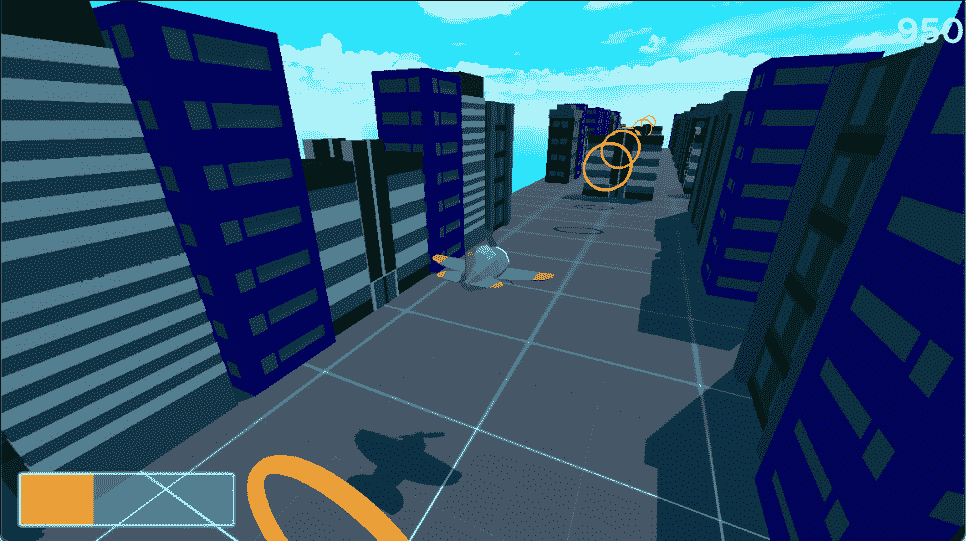

图 6.1：完成的游戏截图

# 技术要求

从以下链接下载游戏资源，并将其解压到你的新项目文件夹中：

[`github.com/PacktPublishing/Godot-4-Game-Development-Projects-Second-Edition/tree/main/Downloads`](https://github.com/PacktPublishing/Godot-4-Game-Development-Projects-Second-Edition/tree/main/Downloads)

你也可以在 GitHub 上找到本章的完整代码：[`github.com/PacktPublishing/Godot-4-Game-Development-Projects-Second-Edition/tree/main/Chapter06%20-%20Infinite%20Flyer`](https://github.com/PacktPublishing/Godot-4-Game-Development-Projects-Second-Edition/tree/main/Chapter06%20-%20Infinite%20Flyer)

# 项目设置

在 Godot 中创建一个新的项目开始。像之前一样，下载项目资源并将其解压到新的项目文件夹中。一旦创建项目，你将开始配置游戏所需的输入和 Godot 设置。

## 输入

你将使用上、下、左、右输入来控制飞机。你可以在`pitch_up`、`pitch_down`、`roll_left`和`roll_right`中添加它们。你可以添加箭头键和/或*W*、*A*、*S*和*D*键，但如果你有游戏控制器，你也可以使用摇杆进行更精确的控制。要添加摇杆输入，你可以在按下**+**按钮后选择**Joypad Axes**。这些值都有标签，例如**Left Stick Up**，这样你可以轻松跟踪它们：

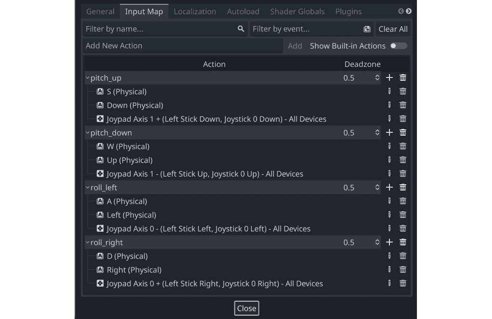

图 6.2：输入配置

这个设置的优点是，你的代码对于不同类型的输入不需要做任何改变。通过使用`Input.get_axis()`并传入四个输入事件，无论玩家是按下了键还是移动了摇杆，你都会得到一个结果。按下键等同于将摇杆推到一端。

现在项目已经设置好了，你可以开始创建你的游戏对象，从玩家控制的飞机开始。

# 飞机场景

在本节中，您将创建玩家将控制的飞机。当玩家可以上下左右移动时，飞机将向前飞行。

使用名为`Plane`的`CharacterBody3D`节点开始您的新飞机场景，并保存它。

您可以在`assets`文件夹中找到飞机的 3D 模型，命名为`cartoon_plane.glb`。这个名字表明该模型以*二进制* `.gltf`文件格式存储（由 Blender 导出）。Godot 将`.gltf`文件导入为包含网格、动画、材质和其他可能已导出在文件中的对象的场景。点击`Node3D`，但它的方向是错误的。选择它，并在检查器功能中设置`180`，使其指向*z*轴，这是 Godot 的“前进”方向。请注意，直接输入值比尝试使用鼠标精确旋转节点要容易。

模型方向

如前一章所述，不同的 3D 设计程序使用不同的轴方向。导入模型时，其前进方向不匹配 Godot 的情况非常常见。如果您自己制作模型，您可以在导出时纠正这一点，但使用他人制作的模型时，通常需要在 Godot 中重新定位它。

如果您在`cartoon_plane`节点上右键单击并选择`AnimationPlayer`：

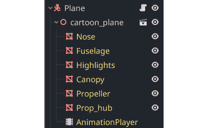

图 6.3：飞机网格

`AnimationPlayer`包含一个使螺旋桨旋转的动画，因此选择它，并将`prop_spin`动画设置为**加载时自动播放**功能：

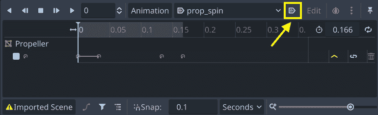

图 6.4：自动播放动画

## 碰撞形状

将`CollisionShape3D`节点添加到`Plane`，并选择`90`以使其与飞机的机身对齐。您可以使用 gizmo（别忘了使用“使用智能吸附”图标打开吸附以使其完美对齐）或直接在检查器中输入值。

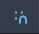

翼也需要被覆盖，因此添加第二个`CollisionShape3D`节点。这次，使用`BoxShape3D`。将其调整到覆盖翼的尺寸：

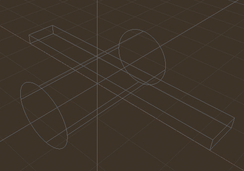

图 6.5：飞机碰撞形状

## 编写飞机脚本

您可以从飞机的控制开始。有两个移动轴：“抬头”和“低头”将抬起或降低飞机的机头（绕其*x*轴旋转），使其向上或向下移动。`roll_left`和`roll_right`函数将飞机绕其*z*轴旋转，使其向左或向右移动。

对于任何输入，您都希望旋转平滑，当玩家松开按钮或将操纵杆返回中心时，飞机应平滑地旋转回其原始位置。您可以通过**插值**旋转而不是直接设置旋转来实现这一点。

关于插值

**线性插值**，通常缩写为 **lerp**，是你在游戏开发中经常会遇到的一个术语。这意味着使用直线函数计算两个给定值之间的中间值。在实践中，它可以用来在一段时间内平滑地从一个值变化到另一个值。

首先，将脚本附加到 `Plane` 节点并定义一些变量：

```cpp
extends CharacterBody3D
@export var pitch_speed = 1.1
@export var roll_speed = 2.5
@export var level_speed = 4.0
var roll_input = 0
var pitch_input = 0
```

导出的变量让你可以设置飞机旋转的速度，无论是哪个方向，以及它自动返回水平飞行的速度。

在你的 `get_input()` 函数中，你将检查来自 **输入映射** 的输入值，以确定旋转的方向：

```cpp
func get_input(delta):
    pitch_input = Input.get_axis("pitch_down", "pitch_up")
    roll_input = Input.get_axis("roll_left", "roll_right")
```

`Input.get_axis()` 函数根据两个输入返回一个介于 `-1` 和 `1` 之间的值。当使用只能按下或未按下的按键时，这意味着当按下其中一个键时，你会得到 `-1`，另一个键为 `1`，当两个键都未按下或都按下时，为 `0`。然而，当使用类似摇杆轴这样的模拟输入时，你可以得到完整的值范围。这允许更精确的控制，例如，将摇杆稍微向右倾斜只会给出小的 `roll_input` 值，例如 `0.25`。

在 `_physics_process()` 中，你可以根据俯仰输入在 *x* 轴上旋转飞机：

```cpp
func _physics_process(delta):
    get_input(delta)
    rotation.x = lerpf(rotation.x, pitch_input,
        pitch_speed * delta)
    rotation.x = clamp(rotation.x, deg_to_rad(-45),
        deg_to_rad(45))
```

使用 `clamp()` 也很重要，以限制旋转，这样飞机就不会完全翻转过来。

你可以通过创建一个新的测试场景并添加飞机和 `Camera3D` 来测试这一点，如下所示：

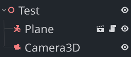

图 6.6：测试场景

将摄像机放置在飞机后面，运行场景以测试按下俯仰向上和俯仰向下输入是否能够正确地使飞机上下倾斜。

对于滚转，你可以在 *z* 轴上旋转机身，但这样两次旋转会相加，你会发现很难将飞机恢复到水平飞行。由于在这个游戏中，你希望飞机继续向前飞行，旋转子网格会更简单。在 `_physics_process()` 中添加此行：

```cpp
$cartoon_plane.rotation.z = lerpf($cartoon_plane.rotation.z, roll_input, roll_speed * delta)
```

再次在测试场景中测试它，并确保所有控制都按预期工作。

为了完成移动，在脚本顶部添加两个更多变量。你的飞机飞行速度将是 `forward_speed`。你将在以后调整它以改变游戏的难度。你可以使用 `max_altitude` 来防止飞机飞出屏幕：

```cpp
@export var forward_speed = 25
var max_altitude = 20
```

在 `get_input()` 中，检查输入后，添加以下内容以使飞机在达到最大高度时水平：

```cpp
if position.y >= max_altitude and pitch_input > 0:
    position.y = max_altitude
    pitch_input = 0
```

然后，将此行添加到 `_physics_process()` 中以处理移动。前进速度将是 `forward_speed` 的量：

```cpp
velocity = -transform.basis.z * forward_speed
```

对于侧向移动（在 *x* 方向上），你可以乘以旋转量以使其更快或更慢，这取决于飞机滚转了多少。然后，根据前进速度（除以二以使其稍微慢一点——在这里进行实验以改变感觉）来调整速度：

```cpp
velocity += transform.basis.x * $cartoon_plane.rotation.z / deg_to_rad(45) * forward_speed / 2.0
move_and_slide()
```

你的飞机现在应该正在向前飞行，并且控制应该按预期工作。在检查飞机行为正确之前，不要进行到下一步。在下一节中，你将为飞机飞行创建环境。

# 构建世界

因为这是一个**无限**风格的游戏，玩家将尽可能长时间地飞越世界。这意味着你需要不断地为他们创建更多的世界，以便他们可以看到——随机建筑物、要收集的项目等等。如果玩家不会看到大部分游戏世界，那么提前创建所有这些将是不切实际的。此外，如果玩家不会看到大部分游戏世界，那么加载一个巨大的游戏世界也将是不高效的。

因此，使用**分块**策略更为合理。你将随机生成世界的较小部分，或者称为块。你可以在需要时创建这些块——当玩家向前移动时。一旦它们被通过，当游戏不再需要跟踪它们时，你也可以移除它们。

## 世界对象

每次生成世界的新块时，它将包含多个不同的世界对象。你可以从两个开始：建筑物，它们将是障碍物，以及玩家通过飞行尝试收集的环。

### 建筑物

对于第一座建筑物，使用一个`StaticBody3D`节点开始一个新的场景，并将其命名为`Building1`。添加一个`MeshInstance3D`节点，并将`res://assets/building_meshes/Build_01.obj`拖入`.glTF`文件中，建筑物的网格存储在*OBJ*格式中。还有一个单独的`.mtl`文件，其中包含网格的材料——Godot 将其隐藏在**文件系统**面板中，但它将被用于网格实例中的纹理。

你会注意到建筑物以原点为中心。由于你的建筑物大小不一，这将使它们难以全部放置在地面上——它们将具有不同的偏移量。如果您的建筑物在事先都保持一致偏移，那么它们可以更容易地放置。

要定位建筑网格，将`MeshInstance3D`节点更改为`(0, 6, -8)`，这将将其向上移动并将其边缘放置在原点上。通过选择网格并选择**网格** -> **创建三角形网格** **碰撞兄弟**来添加碰撞形状。

在名为`res://buildings/`的新文件夹中保存场景，并使用其他建筑物重复此过程，每个场景都从`StaticBody3D`节点开始，添加网格，偏移它，然后创建碰撞形状。由于每座建筑的大小不同，以下是将它们完美定位的偏移量：

| **建筑** | **偏移** |
| --- | --- |
| `1` | `(0,` `6, -8)` |
| `2` | `(0,` `8, -4)` |
| `3` | `(0,` `10, -6)` |
| `4` | `(0,` `10, -6)` |
| `5` | `(0,` `11, -4)` |

现在块可以随机加载和实例化这些建筑物，以创建多样化的城市天际线。

### 环

环将出现在玩家前方，飞机需要飞过它们才能得分。如果飞机非常接近环的中心，玩家将获得加分。随着游戏的进行，环可能会变得难以捕捉 – 改变大小，来回移动等等。

在开始之前，不要提前看，想想哪种类型的节点最适合环对象。

你是否选择了 `Area3D`？由于你想要检测飞机是否飞过环，但又不想与之碰撞，因此区域 `body_entered` 检测将是理想的解决方案。

使用 `Area3D` 开始新的 `Ring` 场景并添加一个 `MeshInstance3D` 子节点。对于 `TorusMesh`，在网格属性中设置 `3.5` 和 `4`，这样你就有了一个窄环。

添加一个 `CollisionShape3D` 节点并选择 `.5` 和 `3`。

之后，你将想要让环上下移动。一个简单的方法是将碰撞形状相对于根节点的位置移动。由于你希望网格也移动，将网格拖动使其成为 `CollisionShape3D` 的子节点。将碰撞形状绕 *x* 轴旋转 90 度使其站立。

一个普通的白色戒指并不十分吸引人，所以你可以添加一些纹理。在 `MeshInstance3D` 中添加 `res://assets/textures/texture_09.png`。你会注意到，这个纹理，由交替的亮暗方格组成的网格，在环面周围看起来非常拉伸。你可以通过改变 `(12, 1, 1)` 的起始值来调整纹理如何包裹网格，并调整到你喜欢的样子。在 **Shading** 下，将 **Shading Mode** 设置为 **Unshaded** – 这样可以确保戒指忽略光照和阴影，始终保持明亮和可见。

接下来，将一个 `Label3D` 节点添加到 `Ring` 节点。你将使用它来显示玩家为戒指获得的分数以及是否获得了中心加分。将 `100` 设置为可以看到一些内容以进行测试。从资产文件夹中的 `Baloo2-Medium.ttf` 设置字体大小为 `720`。为了使文本始终面向相机，将 **Flags/Billboard** 设置为 **Enabled**。

将脚本添加到戒指并连接 `body_entered` 信号。最初，`Label3D` 函数应该是隐藏的，并且当飞机接触戒指时，戒指将被隐藏。但是，有一个问题：如果戒指生成并重叠在建筑物上怎么办？`body_entered` 信号仍然会被触发，但你不想让建筑物收集戒指！

你可以通过设置碰撞层来解决这个问题。在 `Plane` 场景中，将其 `2`（移除 `1`），然后回到 `Ring` 节点并设置其 `2`。现在，你可以确信如果环看到有物体进入，那只能是飞机：

```cpp
extends Area3D
func _ready():
    $Label3D.hide()
```

之后，你需要找到飞机到环中心的距离，以查看玩家是否得分并设置 `text` 属性为正确的值。如果飞机直接在环的中心（小于 2.0 单位）击中，你也可以将文本颜色设置为黄色以表示完美击中：

```cpp
func _on_body_entered(body):
    $CollisionShape3D/MeshInstance3D.hide()
    var d = global_position.distance_to(body.global_position)
    if d < 2.0:
        $Label3D.text = "200"
        $Label3D.modulate = Color(1, 1, 0)
    elif d > 3.5:
        $Label3D.text = "50"
    else:
        $Label3D.text = "100"
    $Label3D.show()
```

继续编写`_on_body_entered()`函数，给标签添加一些动画，使其移动并淡出：

```cpp
var tween = create_tween().set_parallel()
tween.tween_property($Label3D, "position",
    Vector3(0, 10, 0), 1.0)
tween.tween_property($Label3D, "modulate:a", 0.0, 0.5)
```

最后，给环添加一个漂亮的旋转效果：

```cpp
func _process(delta):
    $CollisionShape3D/MeshInstance3D.rotate_y(deg_to_rad(50) * delta)
```

## 块

现在你已经拥有了块的基本构建块，你可以制作块场景本身。这是游戏在需要玩家前方有更多世界时实例化的场景。当你实例化一个新的块时，它将在左右两侧随机放置建筑物，并在其长度上随机生成环。

使用`Node3D`节点和名为`Ground`的`MeshInstance3D`子节点启动`Chunk`场景。将`PlaneMesh`设置为`(50, 200)`。这是单个块的大小：

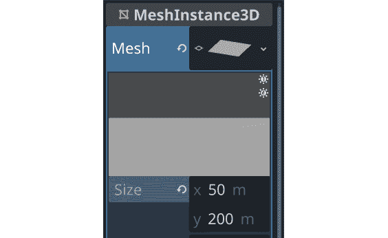

图 6.7：飞机大小设置

通过将其设置为`-100`来定位它以从原点开始：

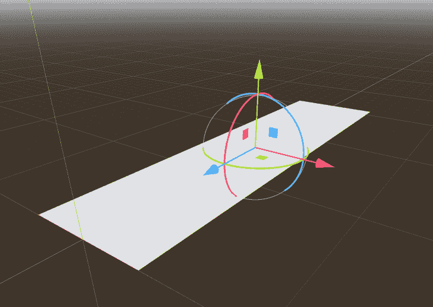

图 6.8：定位飞机

添加材质并使用`texture_01.png`作为`(2, 10, 2)`。默认情况下，Godot 会将三个比例值链接起来以保持它们相同，因此你需要取消选中链接按钮以允许它们不同：

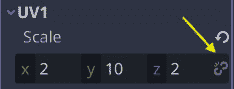

图 6.9：调整 UV 比例

选择`Ground`节点，并选择与地面大小匹配的`StaticBody3D`节点和`CollisionShape3D`节点。

当飞机移动到块末尾时，你会在前方生成一个新的块，并且一旦旧块通过，你也可以移除它们。为了辅助后者，添加一个`VisibleOnScreenNotifier3D`节点并将其设置为`(0, 0, -250)`，这样它就会位于地面平面的末端之外。

你现在可以向`Chunk`节点添加一个脚本，并将通知器的`screen_exited`信号连接起来，以便移除块：

```cpp
func _on_visible_on_screen_notifier_3d_screen_exited():
    queue_free()
```

在脚本顶部，加载需要实例化的场景：

```cpp
extends Node3D
var buildings = [
    preload("res://buildings/building_1.tscn"),
    preload("res://buildings/building_2.tscn"),
    preload("res://buildings/building_3.tscn"),
    preload("res://buildings/building_4.tscn"),
    preload("res://buildings/building_5.tscn"),
]
var ring = preload("res://ring.tscn")
var level = 0
```

加载许多场景

在一个更大的游戏中，如果你有更多的建筑物和其他场景，你不想像这里一样在脚本中逐个写出它们。另一个解决方案是在这里编写代码，以加载特定文件夹中保存的每个场景文件。

`level`变量可以在块加载时由主场景设置，以便通过生成具有不同行为的环来增加难度（关于这一点稍后介绍）。

在`_ready()`中，块需要做三件事：

+   在地面平面的两侧生成建筑物

+   不时在中间生成建筑物作为障碍物

+   生成环

这些步骤中的每一个都会涉及一些代码，因此你可以通过创建三个单独的函数来保持所有内容的组织：

```cpp
func _ready():
    add_buildings()
    add_center_buildings()
    add_rings()
```

第一步是生成侧建筑物。由于它们需要位于块的两侧，你需要重复循环两次——一次用于正*x*方向，一次用于负方向。每次，你都会沿着块的长边生成随机的建筑物：

```cpp
func add_buildings():
    for side in [-1, 1]:
        var zpos = -10
        for i in 18:
            if randf() > 0.75:
                zpos -= randi_range(5, 10)
                continue
            var nb = buildings[randi_range(0,
                buildings.size()-1)].instantiate()
            add_child(nb)
            nb.transform.origin.z = zpos
            nb.transform.origin.x = 20 * side
            zpos -= nb.get_node("MeshInstance3D").mesh.get_aabb().size.z
```

`randf()` 函数是一个常见的随机函数，它返回一个介于 `0` 和 `1` 之间的浮点数，这使得它很容易用于计算百分比。检查随机数是否大于 `0.75`，以有 25% 的几率在特定位置没有建筑物。

通过使用 `get_aabb()` 获取建筑物网格的大小，你可以确保建筑物不会相互重叠。下一个建筑物的位置将正好位于前一个建筑物的边缘。

接下来，中间建筑物的生成不会在游戏开始时发生，但在游戏后期，它们将以 20% 的概率开始出现：

```cpp
func add_center_buildings():
    if level > 0:
        for z in range(0, -200, -20):
            if randf() > 0.8:
                var nb = buildings[0].instantiate()
                add_child(nb)
                nb.position.z = z
                nb.position.x += 8
                nb.rotation.y = PI / 2
```

第三步是生成环形。目前，它只是在随机固定的位置放置了一些环形。随着游戏的进行，你将在这里添加更多变化：

```cpp
func add_rings():
    for z in range(0, -200, -10):
        if randf() > 0.76:
            var nr = ring.instantiate()
            nr.position.z = z
            nr.position.y = randf_range(3, 17)
            add_child(nr)
```

你已经完成了块设置的配置。当它加载时，它会随机填充建筑物和环形，并在稍后它离开屏幕时将其删除。在下一节中，你将在场景中实例化块，当飞机向前移动时。

# 主场景

在本节中，你将创建主场景，在这个游戏中，它将负责加载世界块、显示游戏信息和开始及结束游戏。

使用名为 `Main` 的 `Node3D` 开始一个新的场景。添加一个 `Plane` 实例和一个 `Chunk` 实例以开始。

你还需要一些照明，因此请在工具栏中选择“编辑太阳和环境设置”下拉菜单，并将太阳和环境添加到场景中：

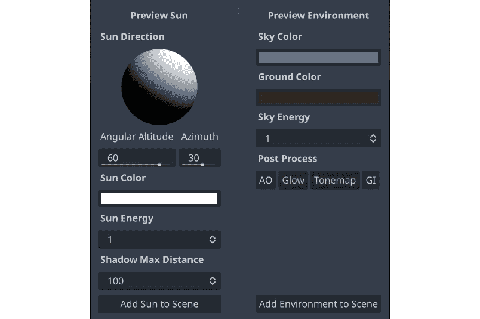

图 6.10：添加环境和太阳

你可以选择不使用生成的天空纹理，而是使用在资产文件夹中找到的 `styled_sky.hdr`。选择 `WorldEnvironment` 并展开其 `ProceduralSkyMaterial`。点击向下箭头并选择 `styled_sky.hdr`：

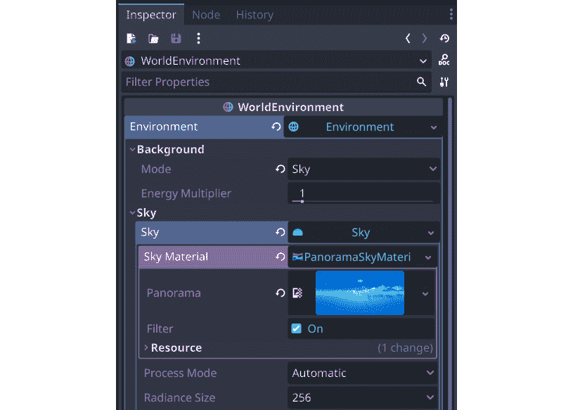

图 6.11：WorldEnvironment 天空设置

在你可以测试之前，你还需要一个相机。添加一个 `Camera3D` 并将其添加到脚本中。由于它是一个没有子节点的独立节点，你不需要将其作为单独保存的场景：

```cpp
extends Camera3D
@export var target_path : NodePath
@export var offset = Vector3.ZERO
var target = null
func _ready():
    if target_path:
        target = get_node(target_path)
        position = target.position + offset
        look_at(target.position)
func _physics_process(_delta):
    if !target:
        return
    position = target.position + offset
```

这个相机脚本是一般的，可以在其他项目中使用，其中你希望相机跟随一个移动的 3D 对象。

选择 `Camera3D` 节点，并在检查器中点击 `Plane` 节点。设置 `(7, 7, 15)`，这将使相机位于平面的后方、上方和右侧。

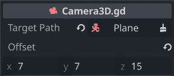

图 6.12：相机跟随设置

播放 `Main` 场景，你应该能够沿着块飞行，收集环形。如果你撞到建筑物，什么也不会发生，当你到达块的尽头时，你将看不到另一个块。

## 生成新的块

每个块的长度是 `200`，所以当飞机行驶了半段距离时，一个新的块应该在之前块的末端位置生成。`max_position` 设置将跟踪下一个块前方的中间位置，这是飞机需要达到以生成新块的位置。

你还将跟踪已生成的块的数量，这样你可以用它来确定何时游戏应该变得更难。

将脚本添加到 `Main` 中并添加以下内容：

```cpp
extends Node3D
var chunk = preload("res://chunk.tscn")
var num_chunks = 1
var chunk_size = 200
var max_position = -100
```

记住，一切都在 *-z* 方向上前进，所以第一个块中心的 *z* 值将是 `-100`。随着它向前移动，平面的 *z* 坐标将继续减小。

在 `_process()` 中，你将检查飞机的位置，如果它超过了 `max_position`，那么就是时候实例化一个新的块并更新 `max_position` 为下一个块的中心：

```cpp
func _process(delta):
    if $Plane.position.z  < max_position:
        num_chunks += 1
        var new_chunk = chunk.instantiate()
        new_chunk.position.z = max_position – chunk_size / 2
        new_chunk.level = num_chunks / 4
        add_child(new_chunk)
        max_position -= chunk_size
```

这里是块生成发生的地方。新的块被放置在之前的块末尾。记住，`max_position` 是块的中心，所以你还需要添加 `chunk_size / 2`。

然后，为了得到等级数，除以 `4` 得到 `5`，`5/4` 只是 `1`。等级将在块编号 `8` 时达到 `2`，在块编号 `12` 时达到 `3`，以此类推。这将逐渐增加难度。

播放场景。现在你应该会看到随着飞机向前移动，新的块出现在飞机前方。

## 增加难度

现在你正在生成块，它们被赋予一个逐渐增加的等级值。你可以使用这个值来开始使环更难以收集。例如，目前，它们正好放置在中心，所以玩家根本不需要左右转向。你可以开始随机化环的 *x* 坐标。你也可以开始使环来回或上下移动。

将以下变量添加到 `ring.gd` 的顶部：

```cpp
var move_x = false
var move_y = false
var move_amount = 2.5
var move_speed = 2.0
```

这两个布尔变量将允许你在 *x* 或 *y* 方向上开启移动，而 `move_amount` 和 `move_speed` 将允许你控制你想要的移动量。

当这些值设置好后，你可以检查 `_ready()`，开始移动，然后使用补间动画：

```cpp
func _ready():
    $Label3D.hide()
    var tween = create_tween().set_loops()
        .set_trans(Tween.TRANS_SINE)
    tween.stop()
    if move_y:
        tween.tween_property($CollisionShape3D,
            "position:y", -move_amount, move_speed)
        tween.tween_property($CollisionShape3D,
            "position:y", move_amount, move_speed)
        tween.play()
    if move_x:
        tween.tween_property($CollisionShape3D,
            "position:x", -move_amount, move_speed)
        tween.tween_property($CollisionShape3D,
            "position:x", move_amount, move_speed)
        tween.play()
```

注意，默认情况下，补间动画会自动播放。由于你可能或可能不在实际动画化一个属性，这取决于玩家所在的等级，你可以使用 `stop()` 来最初停止补间动画，然后使用 `play()` 来启动它，一旦你设置了想要影响的属性。通过使用 `set_loops()`，你是在告诉补间动画无限重复两个移动，来回移动。

现在，环已经准备好移动，你的块可以在生成环时设置这些值。转到 `chunk.gd` 并更新生成环的部分以使用 `level`：

```cpp
func add_rings():
    for z in range(0, -200, -10):
        var n = randf()
        if n > 0.76:
            var nr = ring.instantiate()
            nr.position.z = z
            nr.position.y = randf_range(3, 17)
            match level:
                0: pass
                1:
                    nr.move_y = true
                2:
                    nr.position.x = randf_range(-10, 10)
                    nr.move_y = true
                3:
                    nr.position.x = randf_range(-10, 10)
                    nr.move_x = true
            add_child(nr)
```

如你所见，一旦等级达到 `1`，环将开始上下移动。在等级 `2` 时，它们将开始具有随机的 *x* 位置，而在等级 `3` 时，它们将开始水平移动。

你应该将此视为可能性的一个示例。请随意创建自己的难度递增模式。

## 碰撞

下一步是让飞机在遇到任何东西，如地面或建筑物时爆炸。如果它真的爆炸了，你将播放一个爆炸动画，游戏也就结束了。

### 爆炸

前往你的 `Plane` 场景并添加一个 `AnimatedSprite3D` 子节点。将其命名为 `Explosion`。

`AnimatedSprite3D` 节点的工作方式与你在书中早期使用的 2D 版本非常相似。在 `res://assets/smoke/` 中添加一个新的 `SpriteFrames` 资源到 `10` FPS，并关闭 **Loop**：

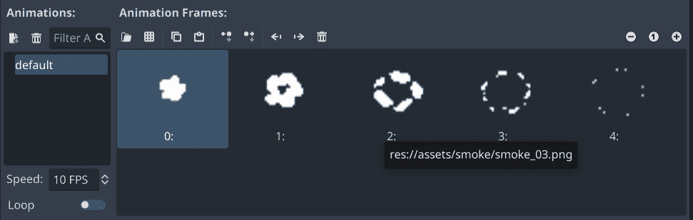

图 6.13：爆炸精灵帧

你可能会注意到你无法在视图中看到精灵。当在 3D 中显示以像素绘制的 2D 图像时，引擎需要知道 3D 空间中像素的大小。为了使爆炸与飞机的大小相匹配，在检查器中将 `0.5` 设置为大小。在 **Flags** 下，将 **Billboard** 设置为启用。这确保了精灵始终面向相机。你现在应该看到一个大云（动画的第一帧）叠加在你的飞机上。

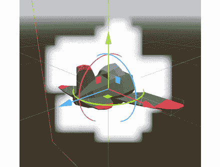

图 6.14：爆炸精灵

你不希望看到爆炸，所以点击眼睛图标来隐藏 `Explosion`。

### 编写碰撞脚本

在 `plane.gd` 的顶部添加一个新的信号，该信号将通知游戏玩家已经坠毁：

```cpp
signal dead
```

在 `_physics_process()` 中，你使用 `move_and_slide()` 来移动飞机。每当使用此方法移动 `CharacterBody3D` 节点时，它可以检查 `move_and_slide()`：

```cpp
if get_slide_collision_count() > 0:
    die()
```

你可以定义 `die()` 函数来处理飞机坠毁时应该发生的事情。首先，它将停止向前移动。然后，你可以隐藏飞机并显示爆炸，播放动画。一旦动画结束，你可以重置游戏。由于你还没有制作标题屏幕，现在你可以简单地重新开始：

```cpp
func die():
    set_physics_process(false)
    $cartoon_plane.hide()
    $Explosion.show()
    $Explosion.play("default")
    await $Explosion.animation_finished
    $Explosion.hide()
    dead.emit()
    get_tree().reload_current_scene()
```

在游戏设置完成后，你将删除最后一行。

现在播放 `Main` 场景并尝试撞到某个东西以验证爆炸是否播放并且场景是否重新启动。

## 燃料和得分

下一步是跟踪收集环时获得的分数。你还将为飞机添加一个燃料组件。这个值将稳步下降，如果燃料耗尽，游戏将结束。玩家通过收集环来获得燃料。

在 `plane.gd` 的顶部添加两个新的信号：

```cpp
signal score_changed
signal fuel_changed
```

这些将通知 UI 显示得分和燃料值。

然后，添加这些新变量：

```cpp
@export var fuel_burn = 1.0
var max_fuel = 10.0
var fuel = 10.0:
    set = set_fuel
var score = 0:
    set = set_score
```

这些变量的设置函数将更新它们并发出信号：

```cpp
func set_fuel(value):
    fuel = min(value, max_fuel)
    fuel_changed.emit(fuel)
    if fuel <= 0:
        die()
func set_score(value):
    score = value
    score_changed.emit(score)
```

为了随着时间的推移减少燃料，将此行添加到 `_physics_process()`：

```cpp
fuel -= fuel_burn * delta
```

尝试播放主场景，你会看到大约 10 秒后燃料耗尽并爆炸。

现在，你可以让环形更新分数，并根据玩家距离环形中心的远近给予一些燃料。你已经在设置环的标签，你可以在`ring.gd`的同一部分做剩下的工作：

```cpp
if d < 2.0:
    $Label3D.text = "200"
    $Label3D.modulate = Color(1, 1, 0)
    body.fuel = 10
    body.score += 200
elif d > 3.5:
    $Label3D.text = "50"
    body.fuel += 1
    body.score += 50
else:
    $Label3D.text = "100"
    body.fuel += 2.5
    body.score += 100
```

如果你再次测试，你应该能够飞得更久，只要你继续收集环形。然而，很难判断你剩下多少燃料，所以你应该添加一个 UI 叠加层来显示燃料和分数。

### UI

创建一个新的场景，包含一个名为“UI”的`CanvasLayer`层。添加两个子元素：`TextureProgressBar`（`FuelBar`）和`Label`（`Score`）。

在`Score`框中设置文本为`0`，并添加字体，就像你之前做的那样，将其设置为`48`。使用工具栏菜单将布局设置为**右上角**。

对于`FuelBar`，在`assets`文件夹中有两个纹理。你可以使用`bar_red.png`用于`bar_glass.png`，对于`10`和`0.01`。

你可以将条形放置在左下角，但如果你想调整大小，你需要更改更多设置。勾选标有`6`的框。你会看到，无论你如何调整条形的大小，边框都不会拉伸：

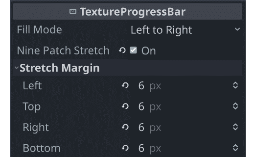

图 6.15：九宫格拉伸设置

将条形设置为舒适的大小，然后向`UI`添加一个脚本：

```cpp
extends CanvasLayer
func update_fuel(value):
    $FuelBar.value = value
func update_score(value):
    $Score.text = str(value)
```

将 UI 场景的一个实例添加到`Main`中。将飞机的`score_changed`信号和`fuel_changed`信号连接到你刚刚在 UI 上制作的函数：

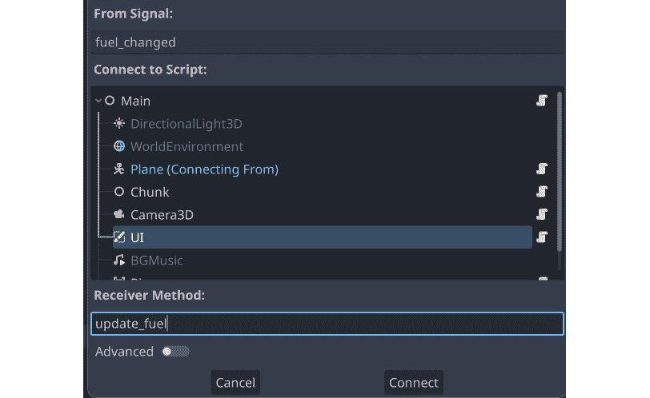

图 6.16：将飞机的信号连接到 UI

再次播放场景，并验证条形是否显示燃料变化，并且在收集环形时分数是否正确更新。

你几乎完成了！到目前为止，你有一个基本可以工作的游戏。花点时间玩几次，确保你没有错过任何交互。随着你飞得更远，块是否在增加难度？你应该看到移动的环形，然后是中心左右生成的环形。如果有任何你不清楚的地方，请确保复习前面的部分。当你准备好了，继续制作标题屏幕。

# 标题屏幕

标题屏幕的目的是介绍游戏，并提供一个按钮来开始游戏。本节不会详细介绍样式 – 你应该尝试不同的设置，并尝试让它看起来令人愉悦。

使用`Control`节点开始`TitleScreen`场景，并添加一个`Label`、一个`TextureButton`以及一个用于背景的`TextureRect`。

你可以使用`styled_sky.hdr`作为`TextureRect`的**纹理**属性。它比屏幕尺寸大得多，所以你可以随意缩放和/或定位它。

对于`TextureButton`，在`res://assets/buttons/`文件夹中有三个图像用于**正常**、**按下**和**悬停**纹理。图像相当大，允许调整大小，所以你可以勾选**忽略纹理大小**，并将**拉伸模式**设置为**保持纵横比**以允许你调整大小。

`Label`节点用于显示游戏标题。设置字体为大号，例如`128`。将`Label`和`TextureButton`放置在屏幕上。将它们的布局都设置为**居中**，然后上下移动以定位它们。

所需的唯一代码是确定按钮按下时应该执行的操作，因此向场景添加一个脚本并将按钮的`pressed`信号连接起来。当按钮被按下时，它应该加载主场景：

```cpp
extends Control
func _on_texture_button_pressed():
    get_tree().change_scene_to_file("res://main.tscn")
```

要在游戏结束时返回到标题屏幕，从飞机的`die()`函数中移除`get_tree().reload_current_scene()`，然后转到`Main`场景并连接飞机实例的`dead`信号：

```cpp
var title_screen = "res://title_screen.tscn"
func _on_plane_dead():
    get_tree(). change_scene_to_file(title_screen)
```

现在当你崩溃时，你应该立即返回到标题屏幕，在那里你可以再次按下**Play**。

# 音频

在`assets`文件夹中有两个声音效果文件：`impact.wav`用于飞机爆炸和`three_tone.wav`用于收集环圈的声音。你可以在`Plane`和`Ring`场景中添加`AudioStreamPlayer`节点，在适当的时间播放它们。

对于背景音乐，应在游戏过程中循环播放，将`AudioStreamPlayer`添加到`Main`场景中，使用`Riverside Ride Short Loop.wav`作为**流**。由于它需要在开始时自动播放，你可以勾选**自动播放**框。

这款游戏的音频故意保持简单和欢快。虽然每个主要游戏事件（如飞过环圈、碰撞）都有声音效果，但你也可以尝试添加额外的声音，如飞机引擎、奖励或燃油低时的警告。尝试看看什么对你有效。

# 保存高分

保存玩家的最高分是许多游戏中的另一个常见功能（并且你可以将其添加到本书中的其他游戏中）。由于分数需要在游戏会话之间保存，因此你需要将其保存到一个外部文件，以便游戏在下次打开时可以读取它。

这里是过程：

1.  当游戏启动时，检查是否有保存文件。

1.  如果存在保存文件，则从其中加载分数，否则使用`0`。

1.  当游戏结束时，检查分数是否高于当前高分。如果是，将其保存到文件中。

1.  在标题屏幕上显示高分。

由于你需要从游戏的不同部分访问最高分变量，因此使用自动加载是有意义的。在`global.gd`中，首先你需要两个变量：

```cpp
extends Node
var high_score = 0
var score_file = "user://hs.dat"
```

## 关于文件位置

您会注意到保存文件的路径不像您一直在使用的其他所有文件一样以`res://`开头。`res://`指定代表您的游戏项目文件夹——所有脚本、场景和资源都位于该位置。但是，当您导出游戏时，该文件夹变为只读。为了存储持久数据，您使用设备上为游戏写入而预留的位置：`user://`。此文件夹的实际位置取决于您使用的操作系统。例如，在 Windows 中，它将是`%APPDATA%\Godot\app_userdata\[project_name]`。您可以在以下位置找到其他支持的操作系统的路径：

https://docs.godotengine.org/en/stable/tutorials/io/data_paths.html

## 访问文件

在 Godot 中，通过`FileAccess`对象访问文件。此对象处理打开、读取和写入文件。将这些函数添加到`global.gd`：

```cpp
func _ready():
    load_score()
func load_score():
    if FileAccess.file_exists(score_file):
        var file = FileAccess.open(score_file,
            FileAccess.READ)
        high_score = file.get_var()
    else:
        high_score = 0
func save_score():
    var file = FileAccess.open(score_file, FileAccess.WRITE)
    file.store_var(high_score)
```

如您所见，脚本在`_ready()`中调用`load_score()`，因此它在游戏启动时立即执行。`load_score()`函数使用`FileAccess`检查保存文件是否存在，如果存在，则打开它并使用`get_var()`检索其中存储的数据。

`save_score()`函数执行相反的操作。请注意，您不需要检查文件是否存在——如果您尝试写入一个不存在的文件，它将被创建。

保存此脚本并将其添加到**项目设置**中的自动加载：

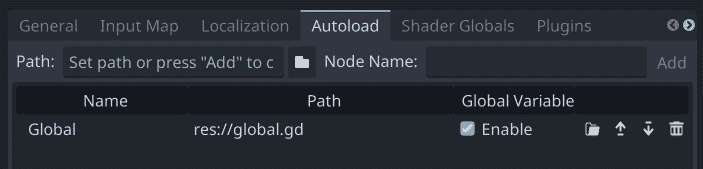

图 6.17：添加全局脚本

前往您的`标题`场景，并添加另一个`标签`节点以显示高分。设置其字体并在屏幕上排列它——底部中间可能是一个不错的选择。将此添加到脚本中，以便在标题屏幕加载时显示分数：

```cpp
func _ready():
    $Label2.text = "High Score: " + str(Global.high_score)
```

最后，在游戏结束时，您需要检查是否有新的高分。`score`变量保存在飞机上，因此打开`plane.gd`并找到在游戏结束时被调用的`die()`函数。添加分数检查并在需要时调用`save_score()`：

```cpp
if score > Global.high_score:
    Global.high_score = score
    Global.save_score()
```

运行游戏以测试高分是否在您下次运行游戏时显示、保存并重新加载。

这种技术可以用于您想要在游戏运行之间保存的任何类型的数据。这是一个有用的技术，所以请确保将来在自己的项目中尝试它。重用代码是加速开发的好方法，所以一旦您对保存系统满意，就坚持使用它！

# 额外功能的建议

为了增加额外的挑战，尝试通过添加更多功能来扩展游戏。以下是一些启动建议：

+   跟踪玩家在每局游戏中飞行的距离，并将最大值保存为高分。

+   随着时间的推移逐步增加速度或包括增加飞机速度的加速物品。

+   需要躲避的飞行障碍物，例如其他飞机或鸟类。

+   （高级）除了直线外，还可以添加曲线块。玩家将需要操控方向，摄像机也需要移动以保持在玩家后面。

这也是一个非常适合你尝试为移动平台构建游戏的绝佳机会。下一章将提供有关导出游戏的信息。

# 摘要

在本章中，你通过学习更多 Godot 的 3D 节点，如`CharacterBody3D`，扩展了你的 3D 技能。你应该对 3D 变换及其在空间中移动和旋转对象的方式有了很好的理解。在这个游戏中随机生成块虽然相对简单，但你可以将其扩展到更大型的游戏和更复杂的环境中。

恭喜你，你已经完成了最后一个项目！但有了这五个游戏，你成为游戏开发者的旅程才刚刚开始。

在下一章中，你可以了解一些不适合示例游戏的其他主题，以及一些关于如何进一步提升你的游戏开发技能的指导。
