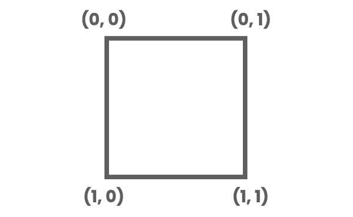

# 下一步和额外资源

恭喜！你在本书中构建的项目已经让你走上了成为 Godot 专家的道路。然而，你只是刚刚触及了 Godot 可能性的表面。随着你技能的提高和项目规模的扩大，你需要知道如何找到解决问题的方法，如何分发你的游戏以便它们可以被玩，甚至如何自己扩展引擎。

在本章中，你将学习以下主题：

+   如何有效地使用 Godot 的内置文档

+   使用**Git**备份和管理你的项目文件

+   概述你在大多数游戏项目中会遇到的一些矢量数学概念

+   使用开源的 3D 建模应用程序**Blender**来制作可以在 Godot 中使用的 3D 对象

+   将项目导出以在其他平台上运行

+   着色器简介

+   在 Godot 中使用其他编程语言

+   你可以在其中获得帮助的社区资源

+   成为 Godot 的贡献者

本章将帮助你从本书的项目中前进，并开始制作你自己的游戏。你可以使用这里的信息来查找额外的资源和指导，以及一些更高级的主题，这些主题不适合之前涵盖的初学者项目。

# 使用 Godot 的文档

最初学习 Godot 的 API 可能会感到令人不知所措。你如何了解所有不同的节点以及每个节点包含的属性和方法？幸运的是，Godot 的内置文档就在那里帮助你。养成经常使用它的习惯：它将帮助你学习时找到东西，但这也是在你熟悉了之后快速查找方法或属性进行参考的好方法。

提升你的技能水平

学习有效地使用 API 文档是你可以做的第一件事，以显著提高你的技能水平。在你工作时，保持网页浏览器中的文档标签页打开，并经常参考它，查找你正在使用的节点和/或函数。

当你在编辑器的**脚本**标签页时，你会在右上角看到以下按钮：


图 7.1：文档按钮

对于`position`，你可以查看`Vector2`文档，看看该数据类型所有可用的函数。

另一个按钮允许你直接在 Godot 编辑器中查看文档。点击**搜索帮助**可以让你搜索任何方法或属性名称。搜索是**智能的**，这意味着你可以输入单词的一部分，随着你输入，结果会缩小。看看下面的截图：


图 7.2：搜索帮助

当你找到你正在寻找的属性或方法时，点击**打开**，该节点的文档引用将出现。

## 阅读 API 文档

当你找到了你想要的节点文档时，你会发现它遵循一个常见的格式，顶部是节点的名称，然后是几个信息子节，如下面的截图所示：


图 7.3：API 文档

页面顶部有一个名为`Object`的列表，这是 Godot 的基本对象类。例如，`Area2D`有以下的继承链：

```cpp
  CollisionObject2D < Node2D < CanvasItem < Node < Object
```

这让你可以快速查看此类对象可能具有的其他属性。例如，`Area2D`节点有一个`position`属性，因为该属性由`Node2D`定义——任何从`Node2D`继承的节点也将具有 2D 空间中的位置。你可以点击任何节点名称来跳转到该节点的文档。

你还可以看到继承自该特定节点的节点类型列表（如果有的话），以及节点的一般描述。下面，你可以看到节点的成员变量和方法。大多数方法和类型名称是链接，因此你可以点击任何项目来了解更多信息。请注意，这些名称和描述与你在检查器上悬停时显示的相同。

在工作过程中养成定期查阅 API 文档的习惯。你会发现你将很快开始更深入地理解所有这些是如何协同工作的。

# 版本控制——使用 Git 与 Godot 一起使用

这对每个人来说都是常态——在某个时刻，你会犯错误。你可能会不小心删除一个文件，或者以某种方式更改代码，导致一切崩溃，但你无法找出如何回到工作版本。

这个问题的解决方案是**版本控制软件**（**VCS**）。全球开发者普遍使用的最流行的 VCS 是 Git。当你使用 Git 与你的项目一起工作时，你做的每一个更改都会被跟踪，这让你可以在任何时间点“倒退”时间并从不受欢迎的更改中恢复。

幸运的是，Godot 非常友好地支持 VCS。你的游戏内容全部保存在项目文件夹中。场景、脚本和资源都以人类可读的文本格式保存，这对于 Git 跟踪来说很容易。

Git 通常通过命令行界面使用，但你也可以使用图形客户端。Godot 的**AssetLib**中也有一个 Git 插件，你可以尝试使用。

无论如何，基本的工作流程可以分解为两个步骤：

1.  **添加**你想要跟踪的文件。

1.  **提交**你所做的更改。

此外，你还可以使用 GitHub 或 GitLab 等网站来存储和分享你的基于 Git 的项目。这是开发者协作项目的常见方式——实际上，Godot 的整个源代码都存储和管理在 GitHub 上。如果你这样做，你将有一个第三步：**推送**你提交的更改到远程仓库。

大多数开发者使用 Git 的命令行版本，你可以从你的操作系统包管理器安装或直接从 [`git-scm.com/downloads`](https://git-scm.com/downloads) 下载。还有许多 GUI 界面，如 Git Kraken 或 GitHub Desktop。

Git 的使用细节超出了本书的范围，但这里有一个最基本使用的例子：创建和更新仓库以保存你的更改。所有这些步骤都将使用你的计算机终端或命令行界面完成：

1.  在你的项目文件夹中创建一个新的 Git 仓库。导航到该文件夹，并输入以下命令：

    ```cpp
    ~/project_folder/$ git init
    ```

1.  在完成你的项目后，通过输入以下命令将新文件或更新后的文件添加到仓库中：

    ```cpp
    ~/project_folder/$ git add *
    ```

1.  提交你的更改，创建一个“时间点”的“检查点”，如果需要，可以回滚到该点：

    ```cpp
    ~/project_folder/$ git commit -m "short description"
    ```

每次添加新功能或对项目进行更改时，都要重复步骤 2 和 3。

确保在提交信息中输入一些描述性的内容。如果你需要回滚到项目历史中的某个特定点，这将帮助你识别你正在寻找的更改。

Git 的内容远不止上述内容。你可以创建分支——游戏代码的多个版本，与他人协作同时进行更改，等等。以下是一些关于如何使用 Git 与你的项目学习的建议：

+   [`docs.github.com/en/get-started/quickstart/git-and-github-learning-resources`](https://docs.github.com/en/get-started/quickstart/git-and-github-learning-resources)

+   *掌握 Git*（书籍）作者：Jakub Narębski

起初可能看起来很难——Git 有一个难以学习的曲线——但它是一项将为你服务的技能，你会在第一次从灾难中幸存时真正感激它！你甚至可能会发现 Git 对你的非游戏项目也有帮助。

在下一节中，你将了解如何使用流行的 Blender 建模工具创建 3D 对象，并在 Godot 中使用它们。

# 使用 Blender 与 Godot

Blender 是一个非常流行的开源 3D 建模和动画程序（它还能做很多其他事情）。如果你计划制作 3D 游戏，并且需要为你的游戏制作物品、角色和环境，Blender 可能是你实现这一目标的最佳选择。

最常见的流程是从 Blender 导出 glTF 文件并将其导入到 Godot 中。这是一个稳定且可靠的流程，在大多数情况下都能很好地工作。

当你导出 glTF 文件时，你有两种选择：glTF 二进制格式（`.glb`）和 glTF 文本格式（`.gltf`）。二进制版本更紧凑，因此是首选格式，但任何一种格式都可以正常工作。

## 导入提示

从 Blender 导入网格并进行修改，如添加碰撞或删除不必要的节点，这是很常见的。为了简化这个过程，你可以在对象的名称后添加后缀，以给 Godot 提供关于导入时如何处理对象的提示。以下是一些示例：

+   `-noimp` – 这些对象将从导入的场景中移除。

+   `-col`、`-convcol`、`-colonly` – 这些选项告诉 Godot 从命名的网格中创建一个碰撞形状。前两个选项分别创建一个子三角形网格或凸多边形形状。`-colonly` 选项将完全删除网格，并用 `StaticBody3D` 碰撞体替换它。

+   `-rigid` – 此对象将以 `RigidBody3D` 的形式导入。

+   `-loop` – 使用此后缀的 Blender 动画将以启用循环选项的方式导入。

请参阅文档以获取有关所有可能导入后缀的更多详细信息。

## 使用 blend 文件

在 Godot 4 中，你还有一个额外的选项：直接将 `.blend` 文件导入到你的 Godot 项目中。为了使用此功能，你需要在同一台安装 Godot 的计算机上安装 Blender。

要设置它，请打开 **编辑器设置** 并在 **文件系统** | **导入** 下查找。在这里，你可以设置 Blender 的安装路径。


图 7.4：设置 Blender 支持

点击文件夹图标浏览到你的 Blender 位置。一旦设置了这个值，你就可以直接将 `.blend` 文件拖放到你的 Godot 项目文件夹中。这可以使原型设计和迭代设计变得更快。你可以打开 Blender，保存对设计的更改，然后当你切换回 Godot 时，你会立即看到它已更新。

如果你计划制作 3D 游戏，学习 Blender 是一个重要的工具。由于其开源性质，它非常适合与 Godot 一起工作。虽然它的学习曲线可能具有挑战性，但投入时间学习它将在设计和构建 3D 游戏时给你带来巨大的好处。

现在你已经了解了如何将外部内容导入到你的游戏项目中，下一节将解释如何将你的游戏导出到其他系统运行，例如移动设备、PC 或网页。

# 导出项目

最终，你的项目将达到你想要与世界分享的阶段。导出你的项目意味着将其转换为没有 Godot 编辑器的用户可以运行的包。你可以将你的项目导出到多个流行的平台。

Godot 支持以下目标平台：

+   Android (移动设备)

+   iOS (移动设备)

+   Linux

+   macOS

+   HTML5 (网页)

+   Windows 桌面

+   UWP (Windows 全平台)

导出项目的需求根据目标平台的不同而有所差异。例如，要导出到 iOS，你必须在一个安装了 Xcode 的 macOS 计算机上运行。

每个平台都是独特的，并且由于硬件限制、屏幕尺寸或其他因素，你的游戏的一些功能可能在某些平台上无法工作。例如，如果你想要将 *Coin Dash* 游戏导出到 Android 手机上，你的玩家将无法移动，因为用户没有键盘！对于该平台，你需要在游戏代码中包含触摸屏控制（关于这一点稍后会有更多介绍）。

每个平台都是独特的，在配置项目以进行导出时需要考虑许多因素。请参阅官方文档，获取有关导出到您希望的平台的最新说明。

导出至游戏机

虽然 Godot 游戏在 Switch 或 Xbox 等游戏机上运行是完全可能的，但这个过程更复杂。任天堂和微软等游戏机公司要求开发者签署包含保密条款的合同。这意味着，虽然你可以让你的游戏在游戏机上运行，但你不能公开分享使它工作的代码。如果你计划在游戏机平台上发布你的游戏，你可能需要自己完成这项工作或与已经签订此类协议的公司合作。

## 获取导出模板

**导出模板**是针对每个目标平台编译的 Godot 版本，但不包括编辑器。你的项目将与目标平台的模板结合，以创建一个独立的应用程序。

首先，你必须下载导出模板。从**编辑器**菜单中选择**管理导出模板**：


图 7.5：管理导出模板

在此窗口中，你可以点击**下载并安装**以获取与您使用的 Godot 版本匹配的导出模板。如果你出于某种原因正在运行多个版本的 Godot，你将在窗口中看到其他版本。

## 导出预设

当你准备好导出你的项目时，点击**项目** | **导出**。


图 7.6：导出设置

在此窗口中，你可以通过点击**添加…**并从列表中选择平台来为每个平台创建**预设**。你可以为每个平台创建尽可能多的预设。例如，你可能想为你的项目创建“调试”和“发布”版本。

每个平台都有自己的设置和选项——太多无法在此描述。默认值通常很好，但在分发项目之前应该彻底测试它们。有关详细信息，请参阅官方文档[`docs.godotengine.org/`](https://docs.godotengine.org/)。

## 导出

在导出窗口的底部有两个导出按钮。第一个按钮，**导出 PCK/ZIP…**，将仅创建你项目数据的 PCK 或打包版本。这不包括可执行文件，因此游戏不能独立运行。如果你需要为你的游戏提供附加组件、更新或**可下载内容（DLC**），这种方法很有用。

第二个按钮，Windows 上的`exe`或 Android 上的`.apk`。


图 7.7：导出对话框

在下一个对话框中，你可以选择保存导出项目的位置。请注意，默认勾选的**导出时包含调试**复选框。当导出游戏的最终发布版本时，你将想要禁用此选项。

## 为特定平台导出

导出的确切步骤和要求取决于你的目标平台。例如，导出到桌面平台（Windows、MacOS、Linux）非常直接，无需任何额外配置。

在移动平台上导出可能更加复杂。例如，为了导出到 Android，你需要安装 Google 的 Android Studio 并正确配置它。由于移动平台会定期更新，详细要求可能会发生变化，因此你应该在此链接查看 Godot 文档以获取最准确的信息：[`docs.godotengine.org/en/latest/tutorials/export/`](https://docs.godotengine.org/en/latest/tutorials/export/)

一旦你配置了你希望导出的平台，窗口将看起来像这样：


图 7.8：准备导出

Godot 的导出系统全面且稳健。你可以管理多个版本，为不同平台导出不同的功能，以及许多其他选项。虽然一开始可能看起来很复杂，但记住，这种复杂性主要来自特定平台的规则。最好先在桌面平台上练习，然后再尝试与移动平台合作。

在下一节中，你将了解如何使用一种称为着色器的特殊程序类型来实现视觉效果。

# 着色器简介

**着色器**是一个设计在 GPU 上运行的程序，它改变了物体在屏幕上的显示方式。着色器在 2D 和 3D 开发中被广泛使用，以创建各种视觉效果。它们被称为着色器，因为它们最初用于着色和光照效果，但今天它们被用于广泛的视觉效果。由于它们在 GPU 上**并行**运行，因此它们非常快，但也带来了一些限制。

学习更多

本节是对着色器概念的简要介绍。要深入了解，请参阅[`thebookofshaders.com/`](https://thebookofshaders.com/)和 Godot 的着色器文档。

在本书的早期，当你向网格添加`StandardMaterial3D`时，你实际上是在添加一个着色器——一个预先配置并内置到 Godot 中的着色器。这对于许多常见情况来说很棒，但有时你需要更具体的东西，为此你需要编写着色器代码。

在 Godot 中，你将使用与 GLSL ES 3.0 非常相似的语言编写着色器。如果你熟悉 C 风格的语言，你会发现语法非常相似。如果不熟悉，一开始可能会觉得有些奇怪。请参阅本节末尾的链接，以获取更多学习资源。

Godot 中的着色器有几种类型：

+   **空间**（用于 3D 渲染）

+   **canvas_item**（用于 2D 渲染）

+   **粒子**（用于渲染粒子效果）

+   **天空**（用于渲染 3D 天空材质）

+   **雾**（用于渲染体积雾效果）

你的着色器第一行必须声明你正在编写哪种类型。通常，当你将着色器添加到特定类型的节点时，这会自动为你填写。

确定着色器类型后，你可以选择你想要影响的渲染过程的哪个阶段：

+   **片段**着色器用于设置所有受影响像素的颜色

+   **顶点**着色器可以修改形状或网格的顶点，改变其外观形状

+   **光照**着色器用于改变对象处理光照的方式

对于这三种着色器类型中的每一种，你将编写将在每个受影响的项上**同时**运行的代码。这就是着色器的真正威力所在。例如，当使用片段着色器时，代码将在对象的每个像素上同时运行。这与使用传统语言时你可能习惯的过程非常不同，在传统语言中，你会逐个像素地循环。这种顺序代码的速度根本不够快，无法处理现代游戏需要处理的庞大像素数量。

GPU 的重要性

考虑一个以相对较低的分辨率 480 x 720 运行的游戏——这是一个典型的手机分辨率。屏幕上的总像素数接近 350,000。任何在代码中对这些像素的操作都必须在不到 1/60 秒内完成，以避免延迟——当你考虑到还需要在每一帧上运行的其余代码：游戏逻辑、动画、网络和所有其他内容时，这一点尤为重要。这就是为什么 GPU 如此重要的原因，尤其是对于可能每帧处理数百万像素的高端游戏。

## 创建 2D 着色器

为了演示一些着色器效果，创建一个包含 `Sprite2D` 节点的场景，并选择你喜欢的任何纹理。这个演示将使用来自 *Coin Dash* 的玩家图像：


图 7.9：玩家精灵

着色器可以添加到任何由 `CanvasItem` 派生的节点——在这个例子中，通过其 **材质** 属性添加到 `Sprite2D`。在这个属性中，选择 **新着色器材质**，然后点击新创建的资源。


图 7.10：添加着色器材质

第一个属性是**着色器**，在这里你可以选择**新着色器**。当你这样做时，会出现一个**创建着色器**面板。


图 7.11：创建着色器选项

注意 `.gdshader`。点击 **创建**，然后你可以点击你新创建的着色器，在底部面板中编辑它。

你的新着色器默认有以下代码：

```cpp
shader_type canvas_item;
void fragment() {
    // Place fragment code here.
}
```

着色器函数有几个内置的 `TEXTURE` 输入，包含对象的纹理像素数据，而 `COLOR` 输出内置用于设置像素颜色。记住，片段着色器中的代码将影响每个处理的像素的颜色。

当在`TEXTURE`属性中处理着色器时，例如，坐标是在一个*归一化*（即，范围从 0 到 1）的坐标空间中测量的。这个坐标空间被称为`UV`，以区别于 x/y 坐标空间。



图 7.12：UV 坐标空间

作为一个非常小的例子，我们的第一个着色器将根据图像中每个像素的`UV`位置改变图像中每个像素的颜色。

在**着色器** **编辑器**面板中输入以下代码：

```cpp
shader_type canvas_item;
void fragment() {
COLOR = vec4(UV.x, UV.y, 0.0, 1.0);
}
```


图 7.13：颜色渐变

一旦这样做，你就会看到整个图像变成红色和绿色的渐变。发生了什么？看看前面的 UV 图像——当我们从左到右移动时，红色值从 0 增加到 1，绿色值从底部到顶部同样增加。

让我们再举一个例子。这次，为了让你可以选择颜色，你可以使用一个`uniform`变量。

常量允许你从外部将数据传递到着色器中。声明一个`uniform`变量将使其在检查器中显示（类似于 GDScript 中的`@export`的工作方式），并且还允许你通过代码设置它：

```cpp
shader_type canvas_item;
uniform vec4 fill_color : source_color;
void fragment() {
    COLOR = fill_color;
}
```

你会看到在检查器的**着色器参数**下出现了**填充颜色**，你可以更改其值。


图 7.14：着色器参数

为什么在这些例子中整个图像的矩形都改变了颜色？因为输出的`COLOR`被应用到每个像素上。我们的玩家图像周围有透明的像素，所以我们可以通过不改变像素的`a`值来忽略它们：

```cpp
COLOR.rgb = fill_color.rgb;
```

现在我们可以改变物体的颜色。让我们将其变成一个“击中”效果，这样我们就可以在物体被击中时使其闪烁：

```cpp
shader_type canvas_item;
uniform vec4 fill_color : source_color;
uniform bool active = false;
void fragment() {
    if (active == true) {
        COLOR.rgb = fill_color.rgb;
    }
}
```

注意现在你可以通过点击在`AnimationPlayer`中出现的`uniform`变量来切换颜色开和关，这些变量为你的视觉效果动画这些值。

这里还有一个例子。这次，我们将围绕图像创建一个轮廓：

```cpp
shader_type canvas_item;
uniform vec4 line_color : source_color;
uniform float line_thickness : hint_range(0, 10) = 0.5;
void fragment() {
    vec2 size = TEXTURE_PIXEL_SIZE * line_thickness;
    float outline = texture(TEXTURE, UV + vec2(-size.x,
        0)).a;
    outline += texture(TEXTURE, UV + vec2(0, size.y)).a;
    outline += texture(TEXTURE, UV + vec2(size.x, 0)).a;
    outline += texture(TEXTURE, UV + vec2(0, -size.y)).a;
    outline = min(outline, 1.0);
    vec4 color = texture(TEXTURE, UV);
    COLOR = mix(color, line_color, outline - color.a);
}
```

在这个着色器中，有很多事情在进行。我们使用内置的`TEXTURE_PIXEL_SIZE`来获取每个像素的归一化大小（其大小与图像大小的比较）。然后，我们得到一个浮点值，它“累加”图像所有四边像素的透明度。最后，我们使用`mix()`函数根据轮廓值将原始像素的颜色与线条颜色混合。


图 7.15：轮廓着色器

需要注意的一个重要事项——你注意到轮廓没有延伸到角色的脚下吗？这是因为一个对象的着色器只能影响该图像的像素。由于这个图像中角色的脚在边缘，下面没有像素可供着色器影响。在处理 2D 着色器效果时，这一点很重要。如果你正在创建 2D 艺术作品，请在图像周围留出几个像素的边框，以防止边缘裁剪。

## 3D 着色器

让我们尝试一个 3D 着色器，这样你就可以看到 `vertex()` 着色器是如何工作的。在一个新的场景中，添加一个具有 `PlaneMesh` 形状的 `MeshInstance3D`。为了更好地看到顶点，从 **Perspective** 菜单中选择 **Display Wireframe**。

点击 **Mesh** 资源以展开它，并在 **Material** 属性中添加一个新的着色器，就像你之前做的那样。


图 7.16：向平面添加着色器

由于我们使用的是平面形状，所以我们有四个顶点：形状的四个角。`vertex()` 函数将对这些顶点中的每一个应用一个效果。例如，向它们的 `y` 值添加将会使它们都向上移动。

让我们从这段代码开始：

```cpp
shader_type spatial;
void vertex() {
    VERTEX.y += sin(10.0 * UV.x) * 0.5;
}
```

注意，我们现在使用的是 `spatial` 类型的着色器，因为我们的节点是 `Node3D`。


图 7.17：移动顶点

看起来似乎没有太多变化——+X 方向的两个顶点稍微向下移动了一点。但是 `UV.x` 只能是 `0` 或 `1`，所以 `sin()` 函数没有太多作用。为了看到更多的变化，我们需要添加更多的顶点。在网格属性中，将两个 `32` 都修改一下。


图 7.18：处理更多顶点

现在，我们可以看到效果中出现了更多的变化，因为沿着 *x* 轴的不同顶点在平滑的正弦波中上下移动。

为了增加一个有趣的特效，让我们使用内置的 `TIME` 来动画化这个效果。将代码修改为如下：

```cpp
VERTEX.y += sin(TIME + 10.0 * UV.x) * 0.5;
```

花些时间来实验一下。不要害怕尝试新事物——实验是了解着色器工作原理的好方法。

## 学习更多

着色器能够实现令人惊叹的范围的效果。在 Godot 的着色器语言中进行实验是学习基础的好方法。开始的最佳地方是 Godot 文档中的着色器部分：

[`docs.godotengine.org/en/latest/tutorials/shaders/`](https://docs.godotengine.org/en/latest/tutorials/shaders/)

互联网上还有大量资源可以帮助你学习更多。在学习着色器时，你可以使用不特定于 Godot 的资源，并且你不太可能遇到在 Godot 中使用它们的问题。这个概念在所有类型的图形应用程序中都是相同的。

此外，Godot 的文档还包括一个页面，介绍如何将其他流行来源的着色器转换为 Godot 版本的 GLSL。

要了解着色器可以多么强大，请访问 [`www.shadertoy.com/`](https://www.shadertoy.com/)。

这一节只是对着色器和着色器效果的深入主题的简要介绍。虽然掌握它可能是一个非常具有挑战性的主题，但它赋予你的力量使得付出努力是值得的。

在下一节中，你将看到如何使用其他编程语言与 Godot 一起使用。

# 在 Godot 中使用其他编程语言

本书中的项目都是使用 GDScript 编写的。GDScript 有许多优点，使其成为构建游戏的最佳选择。它与 Godot 的 API 集成非常紧密，其 Python 风格的语法使其适用于快速开发，同时也非常适合初学者。

然而，这并非唯一的选择。Godot 还支持两种其他“官方”脚本语言，并提供使用各种其他语言集成代码的工具。

## C#

C# 在游戏开发中非常流行，Godot 版本基于 .NET 6.0 框架。由于其广泛的使用，有许多资源可用于学习 C#，以及大量用于实现各种游戏相关功能的现有代码。

在撰写本文时，Godot 版本 4.0 仍然相对较新。功能正在添加，错误正在不断修复，因此请参阅此链接的 C# 文档以获取最新信息：[`docs.godotengine.org/en/stable/tutorials/scripting/c_sharp/index.html`](https://docs.godotengine.org/en/stable/tutorials/scripting/c_sharp/index.html)

如果你想要尝试 C# 实现，首先需要确保你已经安装了 .NET SDK，你可以从 [`dotnet.microsoft.com/download`](https://dotnet.microsoft.com/download) 获取。你还需要下载包含 C# 支持的 Godot 版本，你可以在 [`godotengine.org/download`](http://godotengine.org/download) 找到它，那里标记为 **Godot Engine - .****NET**。

你还需要使用外部编辑器——例如 Visual Studio Code 或 MonoDevelop——它提供的调试和语言功能比 Godot 内置编辑器更丰富。你可以在 **编辑器设置** 下的 **Dotnet** 部分中设置此选项。

要将 C# 脚本附加到节点，请从 **附加节点** **脚本** 对话框中选择语言：


图 7.19：创建脚本对话框

通常，C# 的脚本编写与你在 GDScript 中已经做过的非常相似。主要区别是 API 函数的命名改为 PascalCase 以遵循 C# 标准，而不是 GDScript 标准的 snake_case。

此外，还有一些现有的 C# 库，你可能发现在构建游戏时它们很有用。例如，过程生成、人工智能或其他密集型主题可能更容易通过可用的 C# 库实现。

这里是一个 C# 中 CharacterBody2D 移动的示例。将其与 *Jungle Jump* 中的移动脚本进行比较：

```cpp
using Godot;
public partial class MyCharacterBody2D : CharacterBody2D
{
    private float _speed = 100.0f;
    private float _jumpSpeed = -400.0f;
    // Get the gravity from the project settings so you can
       sync with rigid body nodes.
    public float Gravity = ProjectSettings.GetSetting(
        "physics/2d/default_gravity").AsSingle();
    public override void _PhysicsProcess(double delta)
    {
        Vector2 velocity = Velocity;
        // Add the gravity.
        velocity.Y += Gravity * (float)delta;
        // Handle jump.
        if (Input.IsActionJustPressed("jump") &&
        IsOnFloor())
            velocity.Y = _jumpSpeed;
        // Get the input direction.
        Vector2 direction = Input.GetAxis("ui_left",
            "ui_right");
        velocity.X = direction * _speed;
        Velocity = velocity;
        MoveAndSlide();
    }
}
```

关于设置和使用 C# 的更多详细信息，请参阅上面链接的文档中的 **脚本** 部分。

## 其他语言 - GDExtension

有许多编程语言可供选择。每种语言都有其优势和劣势，以及那些更喜欢使用它的粉丝。虽然直接在 Godot 中支持每种语言都没有意义，但有时 GDScript 并不足以解决特定问题。也许您想使用现有的外部库，或者您正在进行一些计算密集型的工作，例如 AI 或程序化世界生成，这在 GDScript 中编写是不合理的。

由于 GDScript 是一种解释型语言，它以灵活性为代价换取性能。这意味着对于一些处理器密集型代码，它可能运行得非常慢，无法接受。在这种情况下，通过运行用编译语言编写的本地代码可以获得最高的性能。在这种情况下，您可以将该代码移动到 GDExtension。

**GDExtension** 是一种技术，它为 GDScript 和 C# 提供了相同的 API，使得使用其他语言编写与 Godot 通信的代码成为可能。默认情况下，它与 C 和 C++ 直接工作，但通过使用 **第三方绑定**，您可以使用许多其他语言。

在撰写本文时，有几个项目可以使用 GDExtension，允许您使用其他语言进行脚本编写。这些包括 C、C++、Rust、Python、Nim 以及其他语言。尽管这些额外的语言绑定在撰写本文时仍然相对较新，但每个语言都有专门的开发者团队在开发它们。如果您对在 Godot 中使用特定语言感兴趣，使用“godot + <语言名称>”进行 Google 搜索将帮助您找到可用的资源。

与其他编程语言一起工作对于您可能遇到的任何游戏项目来说都不是必需的，所以如果您对它不熟悉，请不要觉得您需要学习它。这里提供它是为了那些可能有用的人，如果您有一个希望与之工作的首选语言，这也是您需要记住的事情。

在下一节中，您可以探索可用的社区资源，以了解更多关于 Godot 如何工作、查找示例以及甚至获得您自己项目的帮助。

# 获得帮助 – 社区资源

Godot 的在线社区是其优势之一。由于其开源特性，有各种各样的人们在共同努力改进引擎、编写文档以及互相帮助解决问题。

您可以在 [`godotengine.org/community`](https://godotengine.org/community) 找到官方社区资源的列表。这些链接可能会随时间变化，但以下是一些您应该了解的主要社区资源：

+   **GitHub** – [`github.com/godotengine/`](https://github.com/godotengine/)

Godot 的 GitHub 仓库是 Godot 开发者工作的地方。如果您需要编译用于您自己使用的自定义版本或只是好奇底层是如何工作的，您可以在那里找到 Godot 的源代码。

如果你发现引擎本身有任何问题——比如某些功能不工作、文档中的错别字等等——这就是你应该报告问题的地点。

+   **Godot 问答** – [`godotengine.org/qa/`](https://godotengine.org/qa/)

这是 Godot 的官方帮助网站。你可以在这里发布问题供社区回答，也可以搜索不断增长的先前回答的问题数据库。如果你恰好看到你知道答案的问题，你也可以提供帮助。

+   **Discord** – [`discord.gg/zH7NUgz`](https://discord.gg/zH7NUgz)

Godot 引擎的 Discord 是一个非常活跃且欢迎的社区，你可以在这里获得帮助，找到问题的答案，并与他人讨论你的项目。你甚至可能会在#beginner 频道遇到本书的作者，他在那里回答问题！

## Godot 菜谱

我还创建了[`godotrecipes.com/`](https://godotrecipes.com/)上的**Godot 菜谱**网站。这是一个收集解决方案和示例的集合，帮助你制作你可能需要的任何游戏系统。你可以看到如何制作 FPS 角色、处理复杂的动画状态，或者为你的敌人添加 AI。

此外，还有额外的教程和已完成游戏的示例，你可以尝试使用。


图 7.20：Godot 菜谱网站

如本节所示，Godot 引擎的一个巨大优势是其社区。这里列出的资源，以及许多其他资源，都是由对 Godot 引擎充满热情并乐于助人的 Godot 用户社区所构建。在下一节中，你可以了解如何为 Godot 做出贡献。

# 为 Godot 贡献力量

Godot 是一个开源、社区驱动的项目。构建、测试、编写文档以及支持 Godot 的所有工作主要是由充满热情的个人贡献他们的时间和技能完成的。对于大多数贡献者来说，这是一项充满爱心的劳动，他们为帮助构建人们喜欢使用的优质产品而感到自豪。

为了让 Godot 持续成长和改进，总需要更多社区成员站出来贡献力量。无论你的技能水平如何，或者你能投入多少时间，都有很多方式你可以提供帮助。

## 为引擎贡献力量

你可以直接以两种主要方式为 Godot 的开发做出贡献。如果你访问[`github.com/godotengine/godot`](https://github.com/godotengine/godot)，你可以看到 Godot 的源代码，以及了解正在进行的具体工作。点击**克隆**或**下载**按钮，你将获得最新的源代码，并可以测试最新的功能。你需要构建引擎，但不要感到害怕：Godot 是你能找到的最容易编译的开源项目之一。有关说明，请参阅[`docs.godotengine.org/en/latest/contributing/development/compiling/index.html`](https://docs.godotengine.org/en/latest/contributing/development/compiling/index.html)。

如果你无法实际贡献 C++代码，请转到**问题**标签页，在那里你可以报告或阅读有关错误和建议改进的内容。总是需要有人确认错误报告、测试修复并就新功能提出意见。

## 编写文档

Godot 的官方文档的质量取决于其社区的贡献。从纠正一个错别字到编写整个教程，所有级别的帮助都非常受欢迎。官方文档的家园是[`github.com/godotengine/godot-docs`](https://github.com/godotengine/godot-docs)。

希望到现在为止，你已经花了一些时间浏览官方文档，并对可用的内容有了大致的了解。如果你发现有什么错误或遗漏，请在上文提到的 GitHub 链接处打开一个问题。如果你熟悉使用 GitHub，甚至可以自己提交一个 pull request。只是确保你首先阅读所有指南，以确保你的贡献会被接受。你可以在[`docs.godotengine.org/en/latest/contributing/ways_to_contribute.html`](https://docs.godotengine.org/en/latest/contributing/ways_to_contribute.html)找到指南。

如果你说的不是英语，翻译也非常需要，并且会受到 Godot 的非英语用户的极大欢迎。有关如何在你的语言中做出贡献的说明，请参阅[`docs.godotengine.org/en/latest/contributing/documentation/editor_and_docs_localization`](https://docs.godotengine.org/en/latest/contributing/documentation/editor_and_docs_localization)。

## 捐赠

Godot 是一个非营利项目，用户的捐赠在很大程度上有助于支付托管费用和开发资源，例如硬件。财务捐助还允许项目支付核心开发者的工资，使他们能够全职或兼职致力于引擎的开发工作。

为 Godot 做出贡献最简单的方式是通过[`godotengine.org/donate`](https://godotengine.org/donate)的捐赠页面。

# 摘要

在本章中，您学习了一些额外的主题，这些主题将帮助您继续提升您的 Godot 技能。除了本书中探索的功能之外，Godot 还拥有许多其他功能。当您开始独立项目时，您需要知道该往哪里寻找信息，以及在哪里寻求帮助。

您还了解了一些更高级的主题，例如与其他编程语言协同工作以及使用着色器来增强您游戏视觉效果。

此外，由于 Godot 是由其社区构建的，您还了解到您如何参与其中，并成为使其成为同类项目中最快速增长的团队之一的一部分。

# 最后一句话

感谢您抽出时间阅读这本书。我希望您觉得它对您使用 Godot 开始游戏开发之旅有所帮助。本书的目标并不是为您提供制作游戏的“复制粘贴”解决方案，而是帮助您培养对游戏开发过程的直觉。正如您在探索其他资源时会看到的那样，解决问题往往有多种方法，可能没有唯一的“正确”答案。作为开发者，您需要评估并确定在您的情况下什么才是最适合您的。我祝愿您在未来的游戏项目中好运，并希望将来能有机会玩到它们！
