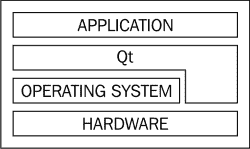
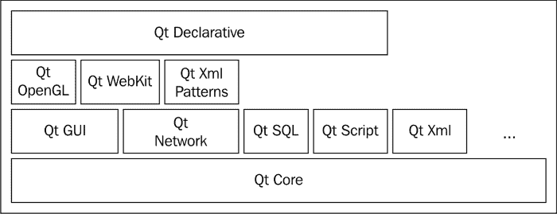

# 第一章。Qt 简介

> *在本章中，您将学习 Qt 是什么以及它是如何演变的。我们将特别关注 Qt 的主要版本 4 和 5 之间的区别。最后，您将学习如何决定为我们的项目选择哪种可用的 Qt 许可方案。*

# 跨平台编程

Qt 是一个用于开发跨平台应用程序的应用程序编程框架。这意味着为某个平台编写的软件可以轻松地移植到另一个平台并执行，几乎不需要做任何工作。这是通过将应用程序源代码限制为所有支持的平台都可用的一组例程和库的调用，并将所有可能在平台之间不同的任务（如屏幕绘制、访问系统数据或硬件）委托给 Qt 来实现的。这实际上创建了一个分层环境（如下图所示），Qt 隐藏了所有平台相关的方面，使其从应用程序代码中不可见：



当然，有时我们需要使用 Qt 不提供的一些功能。在这种情况下，使用条件编译，如以下代码中所示，是很重要的：

```cpp
#ifdef Q_OS_WIN32
// Windows specific code
#elif defined(Q_OS_LINUX) || defined(Q_OS_MAC)
// Mac and Linux specific code
#endif
```

### 小贴士

**下载示例代码**

您可以从您在[`www.packtpub.com`](http://www.packtpub.com)的账户下载示例代码文件，以获取您购买的所有 Packt Publishing 书籍。如果您在其他地方购买了这本书，您可以访问[`www.packtpub.com/support`](http://www.packtpub.com/support)并注册，以便将文件直接通过电子邮件发送给您。

## *刚才发生了什么？*

在代码编译之前，它首先被传递到一个预处理器，该预处理器可能会更改将要发送给编译器的最终文本。当它遇到`#ifdef`指令时，它会检查是否存在一个随后的标签（例如`Q_OS_WIN32`），并且只有在标签被定义的情况下才将代码块包含在编译中。Qt 确保为每个系统和编译器提供适当的定义，以便我们可以在这种情况下使用它们。

### 小贴士

您可以在 Qt 参考手册中找到所有此类宏的列表，在“QtGlobal”这个术语下。

## Qt 平台抽象

Qt 本身分为两层。一层是在标准 C++语言中实现的 Qt 核心功能，它基本上是平台无关的。另一层是一组小型插件，实现了所谓的**Qt 平台抽象**（**QPA**），它包含所有与创建窗口、在表面上绘制、使用字体等相关联的平台特定代码。因此，在实践中将 Qt 移植到新平台实际上归结为为它实现 QPA 插件，前提是这个平台使用支持的标准 C++编译器之一。正因为如此，为新的平台提供基本支持可能是几个小时就能完成的工作。

## 支持的平台

该框架适用于多种平台，从传统的桌面环境到嵌入式系统，再到移动电话。以下表格列出了在撰写本文时 Qt 支持的所有平台和编译器家族。有可能在你阅读本文时，此表可能已增加了几行：

| 平台 | QPA 插件 | 支持的编译器 |
| --- | --- | --- |
| Linux | XCB (X11) 和 Wayland | GCC, LLVM (clang), 和 ICC |
| Windows XP, Vista, 7, 8, and 10 | Windows | MinGW, MSVC, and ICC |
| Mac OS X | Cocoa | LLVM (clang) 和 GCC |
| Linux Embedded | DirectFB, EGLFS, KMS, 和 Wayland | GCC |
| Windows Embedded | Windows | MSVC |
| Android | Android | GCC |
| iOS | iOS | LLVM (clang) 和 GCC |
| Unix | XCB (X11) | GCC |
| RTOS (QNX, VxWorks, 和 INTEGRITY) | qnx | qcc, dcc 和 GCC |
| BlackBerry 10 | qnx | qcc |
| Windows 8 (WinRT) | winrt | MSVC |
| Maemo, MeeGo, 和 Sailfish OS | XCB (X11) | GCC |
| Google Native Client (unsupported) | pepper | GCC |

# 时光之旅

Qt 的发展始于 1991 年，由两位挪威人——Eirik Chambe-Eng 和 Haavard Nord——发起，他们希望创建一个跨平台的 GUI 编程工具包。Trolltech（创建 Qt 工具包的公司）的第一个商业客户是欧洲航天局。Qt 的商业使用帮助 Trolltech 持续发展。当时，Qt 可用于两个平台——Unix/X11 和 Windows；然而，使用 Qt 为 Windows 开发需要购买专有许可证，这在移植现有的 Unix/Qt 应用程序时是一个重大的缺点。

2001 年 Qt 3.0 版本的发布是一个重要的进步，它看到了对 Mac 的初始支持，以及使用自由 GPL 许可证在 Unix 和 Mac 下使用 Qt 的选项。尽管如此，Qt for Windows 仍然仅限于付费许可证。然而，在当时，Qt 已经支持市场上的所有重要参与者——Windows、Mac 和 Unix 桌面，以及 Trolltech 的主流产品和 Qt for 嵌入式 Linux。

2005 年，Qt 4.0 发布，这在多个方面都是一个真正的突破。首先，Qt API 完全重新设计，使其更加简洁和一致。不幸的是，与此同时，它使得现有的基于 Qt 的代码与 4.0 不兼容，许多应用程序需要从头开始重写，或者需要大量努力才能适应新的 API。这是一个艰难的决定，但从时间角度来看，我们可以看到这是值得的。API 变化带来的困难被 Qt for Windows 最终在 GPL 下发布的事实很好地抵消了。引入了许多优化，使 Qt 显著更快。最后，Qt，直到现在都是一个单一库，被分割成多个模块：



这使得程序员只需链接到他们在应用程序中使用的功能，从而减少了软件的内存占用和依赖。

2008 年，Trolltech 被诺基亚收购，当时诺基亚正在寻找一个软件框架来帮助其扩展并未来取代其 Symbian 平台。Qt 社区因此出现了分歧，一些人看到 Qt 的发展转向诺基亚后感到兴奋，而另一些人则感到担忧。无论如何，新的资金被注入到 Qt 中，加速了其发展，并使其对移动平台——Symbian、Maemo 和 MeeGo 开放。

对于诺基亚来说，Qt 并没有被看作是自己的产品，而是一种工具。因此，他们决定通过添加一个非常自由的 LGPL 许可证来向更多开发者介绍 Qt，该许可证允许在开源和闭源开发中使用该框架。

将 Qt 带到新的平台和较弱的硬件上需要一种新的方法来创建用户界面，并使它们更加轻量级、流畅和美观。在 Qt 上工作的诺基亚工程师提出了一种新的声明性语言来开发此类界面——**Qt 模型语言**（**QML**）以及为其提供的 Qt 运行时 Qt Quick。

后者成为了 Qt 进一步发展的主要焦点，实际上阻碍了所有非移动相关的工作，将所有努力集中在使 Qt Quick 更快、更简单和更普及上。Qt 4 已经在市场上存在了 7 年，显然需要发布 Qt 的另一个主要版本。决定通过允许任何人向项目贡献来吸引更多工程师加入 Qt。

诺基亚未能完成 Qt 5.0 的开发工作。由于 2011 年诺基亚对不同技术的意外转向，Qt 部门在 2012 年中旬被出售给了芬兰公司 Digia，该公司完成了这项工作，并在同年 12 月发布了 Qt 5.0。

# Qt 5 的新特性

Qt 5 的 API 与 Qt 4 的 API 差别不大。因此，Qt 5 几乎完全与前辈源代码兼容，这意味着我们只需要最小的努力就可以将现有应用程序移植到 Qt 5。本节简要介绍了 Qt 4 和 5 版本之间主要的更改。如果您已经熟悉 Qt 4，这可以作为一个小型的汇编，如果您想最大限度地使用 Qt 5 的功能，则需要关注的内容。

## 重新构建的代码库

与 Qt 之前的主要版本相比，最大的变化是整个框架被重构为另一组模块。由于它随着时间的推移而扩展，并且对于它所支持的不断增长的平台集合来说，维护和更新变得更加困难，因此决定将框架拆分为包含在两个模块组中的更小的模块——Qt Essentials 和 Qt Add-ons。与拆分相关的一个重大决定是，每个模块现在都可以有自己的独立发布计划。

### Qt Essentials

必需模块组包含每个支持平台都必须实现的模块。这意味着如果您仅使用此组中的模块来实现您的系统，您可以确信它可以轻松地移植到 Qt 支持的任何其他平台。以下是一些模块的说明：

+   QtCore 模块包含所有其他模块所依赖的最基本的 Qt 功能。它提供对事件处理、元对象、数据 I/O、文本处理和线程的支持。它还带来了许多框架，例如动画框架、状态机框架和插件框架。

+   Qt GUI 模块提供了构建用户界面的基本跨平台支持。与 Qt 4 中相同的模块相比，它要小得多，因为对小部件和打印的支持已移至单独的模块。Qt GUI 包含用于操作可以使用光栅引擎（通过指定 `QSurface::RasterSurface` 作为表面类型）或 OpenGL (`QSurface::OpenGLSurface`) 渲染的窗口的类。Qt 支持桌面 OpenGL 以及 OpenGL ES 1.1 和 2.0。

+   Qt 网络模块提供了使用 TCP 和 UDP 以及通过控制设备连接状态来支持 IPv4 和 IPv6 网络的功能。与 Qt 4 相比，此模块增强了 IPv6 支持，增加了对不透明 SSL 密钥（如硬件密钥设备）和 UDP 多播的支持，并将 MIME 多部分消息组装成通过 HTTP 发送的格式。它还扩展了对 DNS 查询的支持。

+   Qt 多媒体允许程序员访问音频和视频硬件（包括摄像头和 FM 收音机）以记录和播放多媒体内容。

+   Qt SQL 提供了一个框架，用于以抽象方式操作 SQL 数据库。

+   Qt WebKit 是 WebKit 2 网络浏览器引擎到 Qt 的移植。它提供了用于显示和操作网页内容的类，并与您的桌面应用程序集成。

+   Qt Widgets 通过使用小部件（如按钮、编辑框、标签、数据视图、对话框、菜单和工具栏）以及使用特殊布局引擎排列的能力扩展了 GUI 模块，以创建用户界面。它还包含一个名为 **Graphics View** 的面向对象的 2D 图形画布的实现。当将 Qt 4 应用程序移植到 Qt 5 时，一个好的做法是首先启用对 widgets 模块的支持（通过在项目文件中添加 *QT += widgets*），然后从这里开始逐步工作。

+   Qt Quick 是 Qt GUI 的扩展，它提供了使用 QML 创建轻量级流畅用户界面的方法。在本章的后续部分以及第九章中，即 *Qt Quick 基础*，有更详细的描述。

### 小贴士

此组中还有其他模块，但在此书中我们将不会关注它们。如果您想了解更多关于它们的信息，可以在 Qt 参考手册中查找。

### Qt 插件

此组包含任何平台都可选的模块。这意味着如果某些平台上的特定功能不可用，或者没有人愿意花时间为此平台工作此功能，它将不会阻止 Qt 支持此平台。

一些最重要的模块包括 QtConcurrent 用于并行处理、Qt Script 允许我们在 C++ 应用程序中使用 JavaScript、Qt3D 提供高级 OpenGL 构建块以及 Qt XML Patterns 帮助我们访问 XML 数据。还有许多其他模块也可用，但在此处我们将不涉及它们。

## Qt Quick 2.0

在功能方面，Qt 的最大升级是 Qt Quick 2.0。在 Qt 4 中，该框架是在 Graphics View 之上实现的。即使启用了 OpenGL ES 加速，当与低端硬件一起使用时，这也证明速度过慢。这是因为 Graphics View 渲染其内容的方式——它按顺序迭代所有项目，计算并设置其变换矩阵，绘制项目，重新计算并重置下一个项目的矩阵，绘制它，依此类推。由于一个项目可以包含任何以任意顺序绘制的通用内容，因此它需要频繁更改 GL 管道，导致严重减速。

Qt Quick 的新版本采用了场景图方法。它将整个场景描述为一个属性和已知操作的图。为了绘制场景，会收集关于当前图状态的详细信息，并以更优化的方式渲染场景。例如，它可以先从所有项目中绘制三角形带，然后从所有项目中渲染字体，依此类推。此外，由于每个项目的状态由一个子图表示，因此可以跟踪每个项目的更改，并决定特定项目的视觉表示是否需要更新。

旧的 `QDeclarativeItem` 类已被 `QQuickItem` 替换，它与图形视图架构没有关联。没有可以直接绘制项的常规方法，但有一个 `QQuickPaintedItem` 类可用，它通过将基于 `QPainter` 的内容渲染到纹理中，然后使用场景图渲染该纹理来帮助移植旧代码。然而，这类项的运行速度比直接使用图形方法慢得多，所以如果性能很重要，应避免使用。

Qt Quick 在 Qt 5 中扮演着重要角色，并且对于创建游戏非常有用。我们将在第九章 Qt Quick Basics 和第十章 Qt Quick 中详细介绍这项技术。

## 元对象

在 Qt 4 中，将信号和槽添加到类需要该类的元对象（即描述另一个类的类的实例）的存在。这是通过从 `QObject` 派生，向其中添加 `Q_OBJECT` 宏，并在类的特殊作用域中声明信号和槽来完成的。在 Qt 5 中，这仍然是可能的，并且在许多情况下是建议的，但我们现在有了一些新的有趣的可能性。

现在将信号连接到类的任何兼容成员函数或任何可调用实体（例如独立函数或函数对象（`functor`））是可以接受的。副作用是信号和槽（与“旧”语法的运行时检查相对）的编译时兼容性检查。

## C++11 支持

2011 年 8 月，ISO 批准了新的 C++ 标准，通常称为 C++11。它提供了一系列优化，并使程序员更容易创建有效的代码。虽然您可以将 C++11 与 Qt 4 一起使用，但它并没有提供任何针对它的专用支持。这种情况在 Qt 5 中发生了变化，Qt 5 现在了解 C++11 并支持语言新版本引入的许多构造。在这本书中，我们有时会在代码中使用 C++11 功能。一些编译器默认启用了 C++11 支持，而在其他编译器中，您需要启用它。如果您的编译器不支持 C++11，请不要担心。每次我们使用这些功能时，我都会让您知道。

# 选择正确的许可证

Qt 可在两种不同的许可方案下使用——您可以选择商业许可或开源许可。我们将在这里讨论两者，以便您更容易选择。如果您对特定许可方案是否适用于您的用例有任何疑问，最好咨询专业律师。

## 开源许可证

开源许可证的优势是，我们不必为使用 Qt 向任何人付费；然而，缺点是它对如何使用 Qt 施加了一些限制。

在选择开源版本时，我们必须在 GPL 3.0 和 LGPL 2.1 或 3 之间做出选择。由于 LGPL 更为自由，在本章中我们将重点关注它。选择 LGPL 允许您使用 Qt 实现开源或闭源的系统——如果您不想，您不必向任何人透露您应用程序的源代码。

然而，您需要了解一些限制：

+   您对 Qt 本身所做的任何修改都需要公开，例如，通过将源代码补丁与您的应用程序二进制文件一起分发。

+   LGPL 要求您的应用程序用户必须能够用具有相同功能的其他库（例如，Qt 的不同版本）替换您提供的 Qt 库。这通常意味着您必须将应用程序动态链接到 Qt，以便用户可以简单地用自己的 Qt 库替换它们。您应该意识到，这种替换可能会降低您系统的安全性，因此，如果您需要非常安全，开源可能不是您的选择。

+   LGPL 与许多许可证不兼容，尤其是专有许可证，因此您可能无法使用 Qt 与某些商业组件一起使用。

Qt 的开源版本可以直接从[`www.qt.io`](http://www.qt.io)下载。

## 商业许可证

如果您决定为 Qt 购买商业许可证，所有这些限制都将被解除。这允许您将整个源代码保密，包括您可能想要合并到 Qt 中的任何更改。您可以自由地将应用程序静态链接到 Qt，这意味着更少的依赖项、更小的部署包大小和更快的启动速度。它还提高了您应用程序的安全性，因为最终用户无法通过用自己的代码替换动态加载的库来向应用程序中注入自己的代码。

### 注意

要购买商业许可证，请访问[`qt.io/buy`](http://qt.io/buy)。

# 摘要

在本章中，您了解了 Qt 的架构。我们看到了它是如何随着时间的推移而演变的，并对现在的样子进行了简要概述。Qt 是一个复杂的框架，我们无法涵盖所有内容，因为其功能的一些部分对于游戏编程来说比其他部分更重要，您可以在需要时自行学习。现在您已经了解了 Qt 是什么，我们可以继续下一章，在那里您将学习如何在您的开发机器上安装 Qt。
