# 第三章. Qt 图形界面编程

> *本章将帮助你学习如何使用 Qt Creator IDE 开发具有图形用户界面的应用程序。我们将熟悉 Qt 的核心功能、属性系统以及我们将用于创建复杂系统（如游戏）的信号和槽机制。我们还将介绍 Qt 的各种操作和资源系统。到本章结束时，你将能够编写自己的程序，通过窗口和控件与用户进行通信。*

# 窗口和对话框

你需要学习的最基本技能是创建窗口，在屏幕上显示它们，并管理它们的内容。

## 创建 Qt 项目

使用 Qt Creator 开发应用程序的第一步是使用编辑器提供的模板之一创建一个项目。

# 行动时间 – 创建一个 Qt 桌面项目

当你第一次启动 Qt Creator 时，你将看到一个欢迎屏幕。从 **文件** 菜单中选择 **新建文件或项目**。有几种项目类型可供选择。按照以下步骤创建 Qt 桌面项目：

1.  对于基于小部件的应用程序，选择 **应用程序** 组和 **Qt Gui 应用程序** 模板：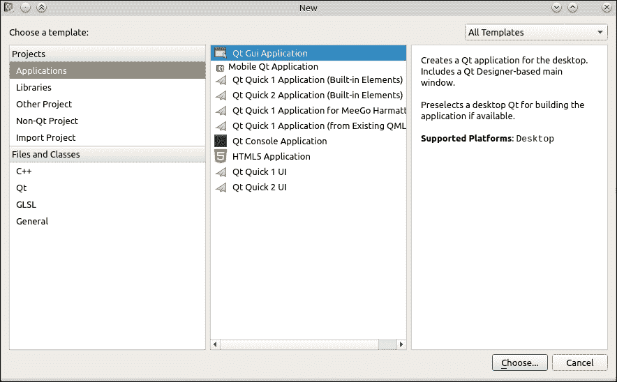

1.  下一步是选择新项目的名称和位置：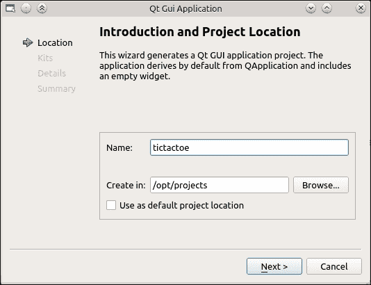

1.  我们将创建一个简单的井字棋游戏，因此我们将我们的项目命名为 `tictactoe` 并为其提供一个合适的位置。

    ### 小贴士

    如果你有一个存放所有项目的公共目录，你可以勾选 **用作默认项目位置** 复选框，以便 Creator 记住位置并在下次启动新项目时建议该位置。

1.  当你点击 **下一步** 时，你将看到一个窗口，允许你选择一个或多个为项目定义的编译工具包。继续下一步，不做任何更改。你将看到创建项目第一个小部件的选项。按照以下截图所示填写数据：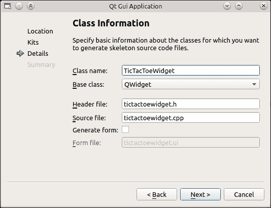

1.  然后，点击 **下一步** 和 **完成**。

## *刚才发生了什么？*

Creator 在你之前选择的项目位置目录中创建了一个新的子目录，并将一些文件放在那里。其中两个文件（`tictactoewidget.h` 和 `tictactoewidget.cpp`）实现了 `TicTacToeWidget` 类，作为 `QWidget` 的子类。第三个文件名为 `main.cpp`，包含应用程序入口点的代码：

```cpp
#include "tictactoewidget.h"
#include <QApplication>

int main(int argc, char *argv[]) {
  QApplication a(argc, argv);
  TicTacToeWidget w;
  w.show();
  return a.exec();
}
```

此文件创建了一个 `QApplication` 类的实例，并将其标准参数传递给 `main()` 函数。然后，它实例化我们的 `TicTacToeWidget` 类，调用其 `show` 方法，并最终返回应用程序对象的 `exec` 方法返回的值。

`QApplication` 是一个单例类，它管理整个应用程序。特别是，它负责处理来自应用程序内部或外部来源的事件。为了处理事件，需要一个事件循环正在运行。循环等待传入的事件并将它们分派到适当的例程。Qt 中的大多数事情都是通过事件完成的——输入处理、重绘、通过网络接收数据、触发计时器等等。这就是我们说 Qt 是一个面向事件框架的原因。如果没有活跃的事件循环，任何东西都无法正常工作。`QApplication` 中的 `exec` 调用（或者更具体地说，在其基类 `QCoreApplication` 中）负责进入应用程序的主事件循环。该函数在应用程序请求事件循环终止之前不会返回。当这最终发生时，`main` 函数返回，你的应用程序结束。

生成的最终文件名为 `tictactoe.pro`，是项目配置文件。它包含了使用 Qt 提供的工具构建项目所需的所有信息。让我们分析这个文件：

```cpp
QT += core gui
greaterThan(QT_MAJOR_VERSION, 4): QT += widgets
TARGET = tictactoe
TEMPLATE = app
SOURCES += main.cpp tictactoewidget.cpp
HEADERS += tictactoewidget.h
```

前两行启用了 Qt 的 `core`、`gui` 和 `widgets` 模块。接下来的两行指定了你的项目文件描述了一个应用程序（而不是，例如，一个库），并声明了可执行的目标名称为 `tictactoe`。最后两行添加了 Creator 为我们生成的文件，用于构建过程。

我们现在有一个完整的最小化 Qt GUI 项目。要构建和运行它，只需从 **构建** 下拉菜单中选择 **运行** 选项，或者在 Qt Creator 窗口的左侧点击绿色的三角形图标。过了一会儿，你应该会看到一个窗口弹出。由于我们没有向窗口添加任何内容，所以它是空的。

## 向窗口添加子控件

在我们成功在屏幕上得到一个空白窗口之后，下一步就是向其中添加一些内容。为此，你需要创建控件并告诉 Qt 将它们定位在窗口中。基本的方法是为控件提供一个父控件。

在 Qt 中，我们将对象（如小部件）组合成父子关系。这种方案在 `QWidget` 的超类 `QObject` 中定义，`QObject` 是 Qt 中最重要的类，我们将在本章后面更详细地介绍它。现在重要的是，每个对象都可以有一个父对象和任意数量的子对象。在部件的情况下，有一个规则，即子对象占据其父对象的一个子区域。如果没有父对象，则它成为一个顶级窗口，通常可以拖动、调整大小和关闭。我们可以通过两种方式为对象设置父对象。一种方式是调用 `QObject` 中定义的 `setParent` 方法，该方法接受一个 `QObject` 指针。由于前面提到的规则，`QWidget` 希望有其他小部件作为父对象，因此该方法在 `QWidget` 中被重载以接受一个 `QWidget` 指针。另一种方式是将父对象指针传递给子对象的 `QWidget` 构造函数。如果您查看 Creator 生成的部件代码，您会注意到构造函数也接受一个指向小部件的指针作为其最后一个（可选）参数：

```cpp
TicTacToeWidget::TicTacToeWidget(QWidget *parent)
    : QWidget(parent)
{
}
```

然后，它将那个指针传递给其基类的构造函数。因此，您始终记得为您的部件创建一个接受指向 `QWidget` 实例的指针并将其传递到继承树上的构造函数是非常重要的。所有标准 Qt 小部件也都以这种方式行为。

### 管理小部件内容

使小部件显示为其父对象的一部分并不足以制作出良好的用户界面。您还需要设置其位置和大小，并对其内容和父小部件内容的变化做出反应。在 Qt 中，我们使用称为布局的机制来完成这项工作。

布局允许我们安排小部件的内容，确保其空间得到有效利用。当我们为小部件设置布局时，我们可以开始添加小部件甚至其他布局，机制将根据我们指定的规则调整大小和重新定位它们。当用户界面中发生影响小部件显示方式的事件时（例如，按钮文本被替换为更长的文本，这使得按钮需要更多空间来显示其内容；如果没有，则某个小部件被隐藏），布局会被触发，重新计算所有位置和大小，并根据需要更新小部件。

Qt 提供了一组预定义的布局，这些布局是从 `QLayout` 类派生出来的，但您也可以创建自己的。我们目前可用的布局有 `QHBoxLayout` 和 `QVBoxLayout`，它们分别水平垂直定位项目；`QGridLayout`，它以网格排列项目，以便项目可以跨越列或行；以及 `QFormLayout`，它创建两列项目，其中一列包含项目描述，另一列包含项目内容。还有一个 `QStackedLayout`，它很少直接使用，并且使分配给它的一个项目拥有所有可用空间。您可以在以下图中看到最常见的布局的实际应用：

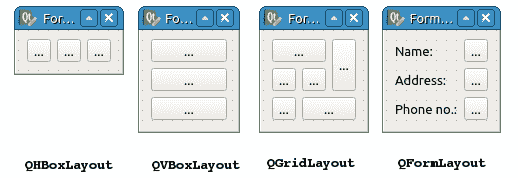

要使用布局，我们需要创建其实例，并将我们想要它管理的小部件的指针传递给它。然后，我们可以开始向布局中添加小部件：

```cpp
QHBoxLayout *layout = new QHBoxLayout(parentWidget);
QPushButton *button1 = new QPushButton;
QPushButton *button2 = new QPushButton;
layout->addWidget(button1);
layout->addWidget(button2);
```

我们甚至可以通过设置布局上的间距和在布局上设置自定义边距来将小部件彼此进一步移动：

```cpp
layout->setSpacing(10);
layout->setMargins(10, 5, 10, 5); // left, top, right, bottom
```

在构建和运行此代码后，您会看到两个均匀分布在父空间中的按钮。请注意，尽管我们没有明确传递父小部件指针，但将小部件添加到布局中会使它重新将新添加的小部件作为布局管理的小部件的子部件。水平调整父小部件的大小也会导致按钮再次调整大小，覆盖所有可用空间。然而，如果您垂直调整 `parentWidget` 的大小，按钮将改变其位置但不会改变其高度。

这是因为每个小部件都有一个名为大小策略的属性，它决定了布局如何调整小部件的大小。您可以为水平和垂直方向设置不同的尺寸策略。按钮的垂直尺寸策略为 `Fixed`，这意味着无论有多少可用空间，小部件的高度都不会从默认高度改变。以下是可以用的尺寸策略：

+   `忽略`: 在此，小部件的默认大小被忽略，小部件可以自由地增长和缩小

+   `固定`: 在此，默认大小是小部件唯一允许的大小

+   `首选`: 在此，默认大小是期望的大小，但较小和较大的尺寸也是可接受的

+   `最小`: 在此，小部件的默认大小是最小可接受的大小，但小部件可以被放大而不会损害其功能

+   `最大`: 在此，默认大小是小部件的最大大小，小部件可以被缩小（甚至缩小到无），而不会损害其功能

+   `扩展`: 在此，默认大小是期望的大小；较小的尺寸（甚至为零）是可接受的，但小部件能够在分配更多空间时增加其有用性

+   `最小扩展`: 这是由 `最小` 和 `扩展` 组合而成的——小部件在空间方面是贪婪的，并且不能缩小到其默认大小以下

我们如何确定默认大小？答案是通过对`sizeHint`虚拟方法返回的大小。对于布局，大小是根据其子小部件和嵌套布局的大小和大小策略计算的。对于基本小部件，`sizeHint`返回的值取决于小部件的内容。在按钮的情况下，如果它包含一行文本和一个图标，`sizeHint`将返回完全包含文本、图标、它们之间的一些空间、按钮框架以及框架和内容本身之间的填充所需的大小。

# 动手时间 - 实现井字棋游戏棋盘

现在，我们将创建一个使用按钮实现井字棋游戏棋盘的小部件。

在 Creator 中打开`tictactoewidget.h`文件，并通过添加以下高亮代码来更新它：

```cpp
#ifndef TICTACTOEWIDGET_H
#define TICTACTOEWIDGET_H
#include <QWidget>
class QPushButton;

class TicTacToeWidget : public QWidget
{
  Q_OBJECT

public:
  TicTacToeWidget(QWidget *parent = 0);
  ~TicTacToeWidget();
private:
 QList<QPushButton*> board;
};
#endif // TICTACTOEWIDGET_H
```

我们的增加创建了一个可以持有`QPushButton`类实例指针的列表，这是 Qt 中最常用的按钮类。它将代表我们的游戏棋盘。我们必须教会编译器理解我们使用的类；因此，我们添加了`QPushButton`类的前置声明。

下一步是创建一个方法，帮助我们创建所有按钮并使用布局来管理它们的几何形状。再次进入头文件，并在类的`private`部分添加一个`void setupBoard();`声明。为了快速实现新声明的方法，我们可以请求 Qt Creator 为我们创建骨架代码，只需将文本光标定位在方法声明（分号之前）之前，然后在键盘上按*Alt* + *Enter*，并从弹出菜单中选择**在 tictactoewidget.cpp 中添加定义**。

### 小贴士

反过来也适用。你可以先编写方法主体，然后将光标定位在方法签名上，按*Alt* + *Enter*，并从快速修复菜单中选择**添加公共声明**。Creator 中还有各种其他上下文相关的修复方案。

因为在头文件中我们只进行了`QPushButton`的前置声明，所以我们现在需要通过包含适当的头文件来提供完整的类定义。在 Qt 中，所有类都在与类本身名称完全相同的头文件中声明。因此，为了包含`QPushButton`的头文件，我们需要在实现文件中添加一行`#include <QPushButton>`。我们还将使用`QGridLayout`类来管理小部件中的空间，因此我们还需要`#include <QGridLayout>`。

### 小贴士

从现在开始，这本书将不再提醒你添加`include`指令到你的源代码中——你必须自己负责这一点。这真的很简单，只需记住，要使用 Qt 类，你需要包含一个以该类命名的文件。

现在，让我们将代码添加到`setupBoard`方法的主体中。首先，让我们创建一个将包含我们的按钮的布局：

```cpp
QGridLayout *gridLayout = new QGridLayout;
```

然后，我们可以开始向布局中添加按钮：

```cpp
for(int row = 0; row < 3; ++row) {
  for(int column = 0; column < 3; ++column) {
    QPushButton *button = new QPushButton;
    button->setSizePolicy(QSizePolicy::Minimum, QSizePolicy::Minimum);
    button->setText(" ");
    gridLayout->addWidget(button, row, column);
    board.append(button);
  }
}
```

代码在棋盘的行和列上创建了一个循环。在每次迭代中，它创建一个`QPushButton`类的实例，并将按钮的大小策略设置为`Minimum`/`Minimum`，这样当我们调整小部件大小时，按钮也会调整大小。按钮被分配一个空格作为其内容，以便它获得正确的初始大小。然后，我们将按钮添加到`row`和`column`中的布局中。最后，我们将按钮的指针存储在之前声明的列表中。这使得我们可以在以后引用任何按钮。它们在列表中的顺序是这样的：首先存储第一行的前三个按钮，然后是第二行的按钮，最后是最后一行的按钮。

最后一件要做的事情是告诉我们的小部件`gridLayout`将管理其大小：

```cpp
setLayout(gridLayout);
```

或者，我们可能将此作为参数传递给布局的构造函数。

现在我们有了准备棋盘的代码，我们需要在某个地方调用它。一个很好的地方是在类构造函数中执行：

```cpp
TicTacToeWidget::TicTacToeWidget(QWidget *parent)
        : QWidget(parent)
{
 setupBoard();
}
```

现在，构建并运行程序。

## *刚才发生了什么？*

你应该会看到一个包含九个按钮的窗口，这些按钮以网格状排列。如果你开始调整窗口大小，按钮也会相应调整大小。这是因为我们设置了一个包含三列和三行的网格布局，它将小部件均匀地分布在管理区域内，如下所示：

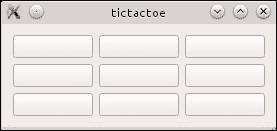

当我们在这里时，给这个类添加另一个`public`方法，并将其命名为`initNewGame`。我们将使用这个方法在开始新游戏时清除棋盘。方法体应该如下所示：

```cpp
void TicTacToeWidget::initNewGame() {
  for(int i=0; i<9; ++i) board.at(i)->setText(" ");
}
```

### 小贴士

你可能已经注意到，尽管我们在`setupBoard`中使用`new`操作符创建了许多对象，但我们并没有在任何地方（例如，在析构函数中）销毁这些对象。这是因为 Qt 管理内存的方式。Qt 不会进行垃圾回收（如 Java 那样），但它有一个与`QObject`父子层次结构相关的良好特性。规则是，每当一个`QObject`实例被销毁时，它也会删除所有子对象。由于布局对象和按钮都是`TicTacToeWidget`实例的子对象，因此当主小部件被销毁时，它们都会被删除。这也是为什么我们要设置我们创建的对象的父对象的原因——如果我们这样做，我们就不必担心显式释放任何内存。

# Qt 元对象

Qt 提供的许多特殊功能都围绕着`QObject`类和我们现在将更详细地探讨的元对象范式。范式表明，对于每个`QObject`子类，都有一个与之关联的特殊对象，它包含有关该类的信息。它允许我们在运行时查询以了解有关类的有用信息——类的名称、超类、构造函数、方法、字段、枚举等。当满足三个条件时，元对象在编译时为类生成：

+   该类是 `QObject` 的子类

+   它在其定义的私有部分包含一个特殊的 `Q_OBJECT` 宏

+   类的代码由一个特殊的 **元对象编译器**（**moc**）工具预处理

我们可以通过为类编写适当的代码来满足前两个条件，就像 Qt Creator 在我们创建一个从 `QObject` 派生的类时所做的那样。最后一个条件在您使用 Qt（和 Qt Creator）附带的工具链构建项目时自动满足。然后，只需确保包含类定义的文件被添加到项目文件的 `HEADERS` 变量中，Qt 就会处理其余部分。实际上发生的是 moc 为我们生成一些代码，这些代码随后在主程序中编译。

本章本节中讨论的所有功能都需要类的元对象。因此，如果您想使类使用这些功能中的任何一个，确保满足我提到的三个条件是至关重要的。

## 信号和槽

为了响应应用程序中发生的事情而触发功能，Qt 使用信号和槽的机制。这是基于将关于某个对象状态变化的通告（我们称之为 **信号**）与一个函数或方法（称为 **槽**）相连接，当这种通告出现时，该函数或方法将被执行。

信号和槽可以与所有继承自 `QObject` 的类一起使用。一个信号可以连接到一个槽、成员函数或函数对象（包括常规的全局函数）。当一个对象发出信号时，任何连接到该信号的这些实体都将被调用。一个信号也可以连接到另一个信号，在这种情况下，发出第一个信号将使另一个信号也被发出。你可以将任意数量的槽连接到单个信号，也可以将任意数量的信号连接到单个槽。

信号槽连接由以下四个属性定义：

+   改变其状态的对象（发送者）

+   发送者的信号

+   包含要调用的函数的对象（接收者）

+   接收者的槽

要声明一个信号，我们将它的声明，即一个常规成员函数声明，放在一个称为 signals 的特殊类作用域中。然而，我们并不实现这样的函数——这将由 moc 自动完成。要声明一个槽，我们将声明放在公共槽、受保护槽或私有槽的类作用域中。槽是常规方法，可以在代码中直接调用，就像任何其他方法一样。与信号相反，我们需要为槽方法提供主体。

实现了一些信号和槽的示例类如下所示：

```cpp
class ObjectWithSignalsAndSlots : public QObject {
  Q_OBJECT
public:
  ObjectWithSignalsAndSlots(QObject *parent = 0) : QObject(parent) {
  }
public slots:
  void setValue(int v) { … }
  void setColor(QColor c) { … }
private slots:
  void doSomethingPrivate();
signals:
  void valueChanged(int);
  void colorChanged(QColor);
};

void ObjectWithSignalsAndSlots::doSomethingPrivate() {
  // …
}
```

可以使用 `connect()` 和 `disconnect()` 语句动态地连接和断开信号和槽。

经典的 `connect` 语句如下所示：

```cpp
connect(spinBox, SIGNAL(valueChanged(int)), dial, SLOT(setValue(int)));
```

此语句在名为`valueChanged`的`spinBox`对象的`SIGNAL`和名为`dial`对象的`setValue`槽之间建立连接，该槽接受一个`int`参数。在`connect`语句中放置变量名或值是禁止的。你只能连接具有匹配签名的信号和槽，这意味着它们接受相同类型的参数（不允许任何类型转换，并且类型名称必须完全匹配），除了槽可以省略任意数量的最后一个参数。因此，以下`connect`语句是有效的：

```cpp
connect(spinBox, SIGNAL(valueChanged(int)), lineEdit, SLOT(clear()));
```

这是因为在调用`clear`之前可以丢弃`valueChanged`信号的参数。然而，以下语句是无效的：

```cpp
connect(button, SIGNAL(clicked()), lineEdit, SLOT(setText(QString)));
```

没有地方可以获取要传递给`setText`的值，因此这种连接将失败。

### 提示

重要的是，你必须将信号和槽签名包装在`SIGNAL`和`SLOT`宏中，并且在指定签名时，你只传递参数类型，而不是值或变量名。否则，连接将失败。

自从 Qt 5 以来，有几种不同的连接语法可用，不需要实现槽的类的元对象。尽管如此，`QObject`的遗留要求仍然存在，并且元对象对于发出信号的类仍然是必需的。

我们可以使用的第一种附加语法是，我们传递信号方法指针和槽方法指针，而不是在`SIGNAL`和`SLOT`宏中包装签名：

```cpp
connect(button, &QPushButton::clicked, lineEdit, &QLineEdit::clear);
```

在这种情况下，槽可以是任何`QObject`子类的任何成员函数，其参数类型与信号匹配，或者可以转换为与信号匹配的类型。这意味着，例如，你可以将携带双值信号的信号与接受整型参数的槽连接起来：

```cpp
class MyClass : public QObject {
  Q_OBJECT
public:
  MyClass(QObject *parent = 0) : QObject(parent) {
 connect(this, &MyClass::somethingHappened, this, &MyClass::setValue);
  }
  void setValue(int v) { … }
signals:
  void somethingHappened(double);
};
```

### 提示

一个重要的方面是，你不能自由地混合基于元对象和基于函数指针的方法。如果你决定在特定的连接中使用成员方法指针，你必须对信号和槽都这样做。

我们甚至可以更进一步，将一个信号连接到一个独立的函数：

```cpp
connect(button, &QPushButton::clicked, &someFunction);
```

如果你使用 C++11，函数也可以是一个 lambda 表达式，在这种情况下，你可以在`connect`语句中直接编写槽的正文：

```cpp
connect(pushButton, SIGNAL(clicked()), []() { std::cout << "clicked!" << std::endl; });
```

如果你想调用一个具有固定参数值的槽，而这个值不能由信号携带，因为它有更少的参数，这特别有用。一种解决方案是从 lambda 函数（或独立函数）中调用槽：

```cpp
connect(pushButton, SIGNAL(clicked()), [label]() { label->setText("button was clicked"); });
```

函数甚至可以被函数对象（functor）所替代。为此，我们创建一个类，为该类重载的调用操作符与我们要连接的信号兼容，如下面的代码片段所示：

```cpp
class Functor {
public:
  Functor(Object *object, const QString &str) : m_object(object), m_str(str) {}
  void operator()(int x, int y) const {
    m_object->set(x, y, m_str);
  }
private:
  Object *m_object;
  QString m_str;
};

connect(obj1, SIGNAL(coordChanged(int, int)), Functor("Some Text"));
```

这通常是一种执行带有额外参数的槽的方法，该参数不是由信号携带的，因为这样做比使用 lambda 表达式要干净得多。

在这里，我们还没有涵盖信号和槽的一些方面。当我们处理多线程时，我们将在稍后回到它们。

## 速问速答 - 建立信号-槽连接

Q1. 对于以下哪个选项，你必须提供自己的实现？

1.  信号

1.  槽

1.  两者

Q2. 以下哪些陈述是有效的？

1.  `connect(sender, SIGNAL(textEdited(QString)), receiver, SLOT(setText("foo")))`

1.  `connect(sender, SIGNAL(toggled(bool)), receiver, SLOT(clear()));`

1.  `connect(sender, SIGNAL(valueChanged(7)), receiver, SLOT(setValue(int)));`

1.  `connect(sender, &QPushButton::clicked, receiver, &QLineEdit::clear);`

# 行动时间 - 跳棋板的功能

我们需要实现一个函数，该函数将在点击板上的任何九个按钮时被调用。它必须根据哪个玩家移动来更改被点击的按钮上的文本——要么是`X`要么是`O`——然后，它必须检查该移动是否使玩家获胜（如果没有更多移动，则为平局），如果游戏结束，它应该发出适当的信号，通知环境有关事件。

当用户点击按钮时，会发出`clicked()`信号。将此信号连接到自定义槽允许我们实现所提到的功能，但由于该信号不携带任何参数，我们如何知道哪个按钮触发了槽？我们可以将每个按钮连接到单独的槽，但这是一种丑陋的解决方案。幸运的是，有两种方法可以解决这个问题。当槽被调用时，可以通过`QObject`中的特殊方法`sender()`访问导致信号发出的对象的指针。我们可以使用该指针来确定哪个存储在板列表中的九个按钮导致了信号的触发：

```cpp
void TicTacToeWidget::someSlot() {
 QObject *btn = sender();
  int idx = board.indexOf(btn);
  QPushButton *button = board.at(idx);
  // ...
}
```

虽然`sender()`是一个有用的调用，但我们应该尽量避免在我们的代码中使用它，因为它破坏了一些面向对象编程的原则。此外，还有一些情况下调用此函数是不安全的。更好的方法是使用一个专门的类，称为`QSignalMapper`，它允许我们在不直接使用`sender()`的情况下达到类似的结果。按照以下方式修改`TicTacToeWidget`中的`setupBoard()`方法：

```cpp
QGridLayout *gridLayout = new QGridLayout;
QSignalMapper *mapper = new QSignalMapper(this);
for(int row = 0; row < 3; ++row) {
  for(int column = 0; column < 3; ++column) {
    QPushButton *button = new QPushButton;
    button->setSizePolicy(QSizePolicy::Minimum, QSizePolicy::Minimum);
    button->setText(" ");
    gridLayout->addWidget(button, row, column);
    board.append(button);
 mapper->setMapping(button, board.count()-1);
 connect(button, SIGNAL(clicked()), mapper, SLOT(map()));
  }
}
connect(mapper, SIGNAL(mapped(int)), this, SLOT(handleButtonClick(int)));
setLayout(gridLayout);
```

在这里，我们首先创建了一个`QSignalMapper`的实例，并将棋盘小部件的指针传递给它作为其父对象，这样当小部件被删除时，映射器也会被删除。然后，当我们创建按钮时，我们“教导”映射器每个按钮都有一个与之关联的数字——第一个按钮将具有数字`0`，第二个按钮将绑定到数字`1`，依此类推。通过将按钮的`clicked()`信号连接到映射器的`map()`槽，我们告诉映射器在接收到该信号时执行其魔法。映射器将执行的操作是找到信号发送者的映射，并发出另一个信号——`mapped()`，其参数为映射的数字。这允许我们连接到该信号，并使用一个槽（`handleButtonClick`）来处理按钮在棋盘列表中的索引。

现在是时候实现槽本身了（记得在头文件中声明它！）然而，在我们这样做之前，让我们向类中添加一个有用的枚举和一些辅助方法：

```cpp
enum Player {
  Invalid, Player1, Player2, Draw
};
```

这个枚举让我们可以指定游戏中玩家的信息。我们可以立即使用它来标记现在是哪个玩家的回合。为此，向类中添加一个私有字段：

```cpp
Player m_currentPlayer;
```

然后，添加两个公共方法来操作这个字段的值：

```cpp
Player currentPlayer() const { return m_currentPlayer; }
void setCurrentPlayer(Player p) {
  if(m_currentPlayer == p) return;
  m_currentPlayer = p;
  emit currentPlayerChanged(p);
}
```

最后一个方法发出一个信号，因此我们必须将信号声明添加到类定义中，以及我们将要使用的另一个信号：

```cpp
signals:
 void currentPlayerChanged(Player);
 void gameOver(TicTacToeWidget::Player);

```

### 小贴士

注意，我们只在当前玩家真正改变时发出`currentPlayerChanged`信号。你总是必须注意，当你将一个字段的值设置为在函数调用之前它所拥有的相同值时，不要发出“已更改”信号。你的类的用户期望如果调用了一个名为“已更改”的信号，那么它是在值真正更改时发出的。否则，如果你有两个对象，它们将它们的值设置器连接到另一个对象的“已更改”信号，这可能导致信号发射中的无限循环。

现在让我们声明`handleButtonClick`槽：

```cpp
public slots:
    void handleButtonClick(int);
```

然后在`.cpp`文件中实现它：

```cpp
void TicTacToeWidget::handleButtonClick(int index) {
  if(index < 0 || index >= board.size()) return; // out of bounds check
  QPushButton *button = board.at(index);
  if(button->text() != " ") return; // invalid move
  button->setText(currentPlayer() == Player1 ? "X" : "O");
  Player winner = checkWinCondition(index / 3, index % 3);
  if(winner == Invalid) {
    setCurrentPlayer(currentPlayer() == Player1 ? Player2 : Player1);
    return;
  } else {
    emit gameOver(winner);
  }
}
```

在这里，我们首先根据索引检索按钮的指针。然后，我们检查按钮是否包含任何文本——如果是这样，这意味着它不再参与游戏，因此我们从方法中返回，以便玩家可以在棋盘上选择另一个字段。接下来，我们在按钮上设置当前玩家的标记。然后，我们检查玩家是否赢得了游戏，传递当前移动的行（`index / 3`）和列（`index % 3`）索引。如果游戏没有结束，我们切换当前玩家并返回。否则，我们发出`gameOver()`信号，告诉我们的环境谁赢得了游戏。`checkWinCondition()`方法在游戏结束时返回`Player1`、`Player2`或`Draw`，否则返回`Invalid`。我们不会在这里展示这个方法的实现，因为它相当复杂。尝试自己实现它，如果遇到问题，你可以在本书附带的代码包中查看解决方案。

## 属性

除了信号和槽，Qt 元对象还让程序员能够使用所谓的属性，这些属性本质上是可以分配特定类型值的命名属性。它们对于表达对象的重要特性非常有用——比如按钮的文本、小部件的大小、游戏中的玩家名字等等。

### 声明属性

要创建一个属性，我们首先需要在继承自`QObject`的类的私有部分使用特殊的`Q_PROPERTY`宏来声明它，这样 Qt 就能知道如何使用这个属性。一个最小的声明包含属性的类型、它的名字以及用于检索属性值的方方法的名称信息。例如，以下代码声明了一个类型为`double`的属性，名为`height`，并使用名为`height`的方法来读取属性值：

```cpp
Q_PROPERTY(double height READ height)
```

获取器方法必须按照常规进行声明和实现。它的原型必须遵守以下规则：它必须是一个返回属性类型值或常量引用的公共方法，它不能接受任何输入参数，并且方法本身必须是常量。通常，属性会操作类的私有成员变量：

```cpp
class Tower : public QObject {
  Q_OBJECT // enable meta-object generation
  Q_PROPERTY(double height READ height) // declare the property
  public:
    Tower(QObject *parent = 0) : QObject(parent) { m_height = 6.28; }
    double height() const { return m_height; } // return property value
  private:
    double m_height; // internal member variable holding the property value
};
```

这样的属性实际上是没有用的，因为没有方法可以改变它的值。幸运的是，我们可以扩展声明以包括如何将值写入属性的信息：

```cpp
Q_PROPERTY(double height READ height WRITE setHeight)
```

同样，我们必须声明和实现`setHeight`，使其作为属性的设置器方法——它需要是一个接受属性类型值或常量引用的公共方法，并返回 void：

```cpp
void setHeight(double newHeight) { m_height = newHeight; }
```

### 小贴士

属性设置器是公共槽的良好候选者，这样你就可以通过信号和槽轻松地操作属性值。

我们将在本书的后续章节中学习关于`Q_PROPERTY`声明的其他扩展。

### 使用属性

你可以通过两种方式访问属性。一种当然是使用我们用`READ`和`WRITE`关键字在`Q_PROPERTY`宏中声明的获取器和设置器方法——这自然会起作用，因为它们是常规的 C++方法。

另一种方法是使用 `QObject` 和元对象系统提供的功能。它们允许我们通过两个接受属性名称作为字符串的方法按名称访问属性。一个通用的属性获取器（返回属性值）是一个名为 `property` 的方法。它的设置器对应物（接受值并返回 void）是 `setProperty`。由于我们可以有不同数据类型的属性，那么这两个方法所使用的数据结构是什么，它们用于存储不同类型属性的值？Qt 有一个专门用于此的类，称为 `QVariant`，它在行为上与 C 联合体非常相似，因为它可以存储不同类型的值。尽管如此，使用联合体有几个优点——其中三个最重要的优点是你可以询问对象它当前持有哪种类型的数据，你可以将一些类型转换为其他类型（例如，将字符串转换为整数），并且你可以教会它操作你自己的自定义类型。

# 行动时间 – 向棋盘类添加属性

在这个练习中，我们将向棋盘类添加一个有用的属性。该属性将保存关于应该进行下一步棋的玩家的信息。属性的类型将是我们在之前创建的 `TicTacToeWidget::Player` 枚举。对于获取器和设置器方法，我们将使用我们之前创建的两个函数：`currentPlayer()` 和 `setCurrentPlayer()`。

打开我们类的头文件，并按照以下代码修改类定义：

```cpp
class TicTacToeWidget : public QWidget {
  Q_OBJECT
 Q_ENUMS(Player)
 Q_PROPERTY(Player currentPlayer READ currentPlayer
 WRITE setCurrentPlayer
 NOTIFY currentPlayerChanged)
public:
  enum Player { Invalid, Player1, Player2, Draw };
```

## *刚才发生了什么？*

由于我们想将枚举用作属性的类型，我们必须通知 Qt 的元对象系统关于枚举的信息。这是通过使用 `Q_ENUMS` 宏来完成的。然后，我们声明一个名为 `currentPlayer` 的属性，并将我们现有的两个方法标记为属性的获取器和设置器。我们还使用 `NOTIFY` 关键字将 `currentPlayerChanged` 标记为发送通知以告知属性值变化的信号。在我们的小游戏中，我们不会使用这些额外的信息，而且我们根本不需要 `currentPlayer` 是一个属性，但始终尝试找到好的属性候选者并公开它们是一个好主意，因为总有一天，有人可能会以我们没有预测到的方式使用我们的类，某个特定的属性可能会变得有用。

# 设计 GUI

到目前为止，我们都是通过手动编写实例化小部件、在布局中排列它们并将信号连接到槽的 C++代码来编码所有用户界面。对于简单的小部件来说，这并不难，但当 UI 变得越来越复杂时，就会变得繁琐且耗时。幸运的是，Qt 提供了工具，可以以更愉快的方式完成所有这些工作。我们不必编写 C++代码，而可以通过在画布上拖放小部件、应用布局以及甚至使用点按技术建立信号-槽连接来创建表单。在编译的后期，这些表单将为我们转换为 C++代码，并准备好应用于小部件。

这个工具被称为 Qt Designer，并且与 Qt Creator 集成。要使用它，从**文件**菜单中选择**新建文件**或**项目**，然后在对话框的**文件和类**部分选择 Qt，之后选择可用的**Qt Designer 表单类**模板。你可以选择表单的模板并配置诸如要创建的文件名称等细节。最后，将创建三个文件——其中两个实现从`QWidget`或其子类派生的 C++类，最后一个包含表单本身的数据。

关闭向导后，我们将进入 Qt Creator 的**设计**模式，其外观如下所示：

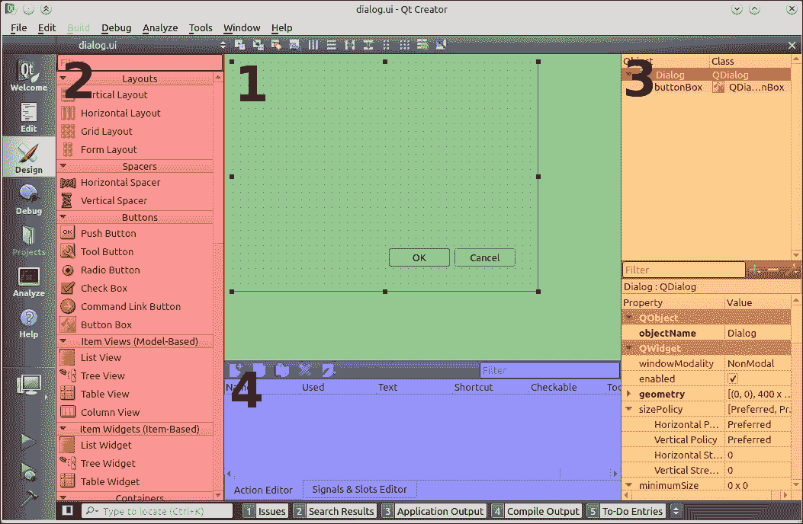

**设计**模式由四个主要部分组成，如图中用数字标记所示。

标记为 **1** 的区域是主要的工作表。它包含正在设计的表单的图形表示，你可以移动小部件，将它们组合成布局，并查看它们的反应。它还允许使用我们稍后将要学习的点按方法进一步操作表单。

第二个区域 **2** 是小部件框。它包含一个可用小部件类型的列表，这些类型被组织成包含具有相关或相似功能的项目的小组。在列表上方，你可以看到一个框，允许你过滤列表中显示的小部件，只显示与输入的表达式匹配的小部件。在列表的起始处，也有一些实际上不是小部件的项目——一个组包含布局，另一个组包含所谓的间隔符，这是一种将其他项目彼此推开的方式。

小部件框的主要目的是在电子表格中向表单添加小部件。你可以通过用鼠标从列表中抓取一个小部件，将其拖动到画布上，然后释放鼠标按钮来实现这一点。小部件将出现在表单中，并且可以使用 Creator 的“设计”模式中的其他工具进一步操作。

我们接下来要讨论的下一个区域 **3** 位于窗口的右侧，由两部分组成。在图象的顶部，你可以看到对象检查器。它展示了当前编辑表单中所有小部件的父子关系。每一行包含对象的名称以及元对象系统所看到的其类名。如果你点击一个条目，表单中相应的部件就会被选中（反之亦然）。

图象的下半部分显示了属性编辑器。你可以用它来更改每个对象的所有属性值。属性根据它们声明的类分组，从 `QObject`（实现属性的基类）开始，它只声明了一个但很重要的属性—`objectName`。在 `QObject` 之后，是 `QWidget` 中声明的属性，它是 `QObject` 的直接后代。它们主要与部件的几何和布局策略相关。在列表的下方，你可以找到来自 `QWidget` 进一步派生的属性。如果你更喜欢纯字母顺序，其中属性不是按其类分组，你可以通过点击属性列表上方的扳手图标后出现的弹出菜单来切换视图；然而，一旦你熟悉了 Qt 类的层次结构，当按类排序时，导航列表将会容易得多。

仔细观察属性编辑器，你会发现其中一些属性下面有箭头，点击后会展开新的行。这些是复合属性，其完整属性值由多个子属性值确定；例如，如果有一个名为 `geometry` 的属性定义了一个矩形，它可以展开以显示四个子属性：`x`、`y`、`width` 和 `height`。还有一点你应该很快就能注意到，一些属性名以粗体显示。这意味着该属性的值已被修改，并且与该属性的默认值不同。这让你可以快速找到你已修改的属性。

我们现在要解释的最后一个功能组 **4** 位于窗口的下半部分。默认情况下，你会看到两个标签页—**动作编辑器**和**信号/槽编辑器**。它们允许我们通过干净的表格界面创建辅助实体，例如菜单和工具栏的动作，或者小部件之间的信号-槽连接。

这里所描述的是基本工具布局。如果你不喜欢它，你可以从主工作表调用上下文菜单，取消选择 **锁定** 条目，并将所有窗口重新排列到你喜欢的样子，甚至关闭你现在不需要的窗口。

# 行动时间 – 设计游戏配置对话框

现在，我们将使用 Qt Designer 表单来构建一个简单的游戏配置对话框，这将允许我们为我们的玩家选择名字。

首先，从菜单中调用新的文件对话框，选择创建一个如以下截图所示的**Qt Designer 表单类**：

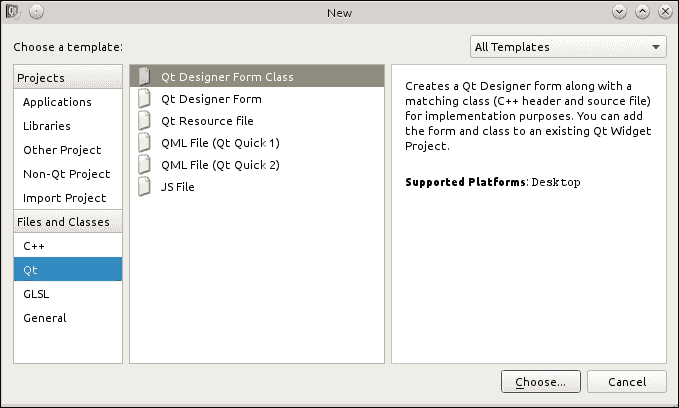

在出现的窗口中，选择**底部有按钮的对话框**：

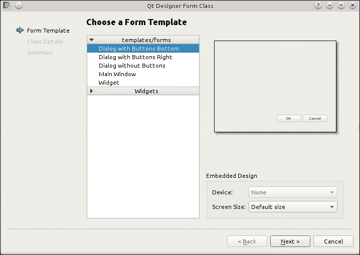

将类名调整为`ConfigurationDialog`，将其他设置保留为默认值，并完成向导。

将两个标签和两个行编辑拖放到表单上，将它们大致放置在一个网格中，双击每个标签，调整它们的标题以获得以下类似的结果：

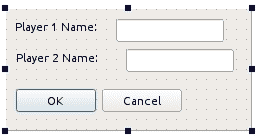

选择要编辑的第一行，查看属性编辑器。找到一个名为`objectName`的属性，将其更改为`player1Name`。对另一行也做同样的操作，并将其命名为`player2Name`。然后，在表单上的某个空白区域单击，在上工具栏中选择**在网格中布局**选项。你应该看到部件自动对齐——这是因为你刚刚将布局应用到表单上。完成操作后，打开**工具**菜单，转到**表单编辑器**子菜单，并选择**预览**选项。

## *刚才发生了什么？*

你可以看到一个新窗口打开，其外观与我们刚刚设计的表单完全一样。你可以调整窗口大小并与之交互，以监控布局和部件的行为。实际上发生的事情是 Qt Creator 根据我们在设计模式的所有区域提供的描述为我们构建了一个真实的窗口。无需任何编译，在一瞬间我们就得到了一个完全工作的窗口，所有布局都正常工作，所有属性都调整到我们喜欢的样子。这是一个非常重要的工具，所以请确保经常使用它来验证你的布局是否按照你的意图控制所有部件——这比编译和运行整个应用程序以检查部件是否正确拉伸或挤压要快得多。这一切都得益于 Qt 的元对象系统。

# 是时候行动起来——润色对话框

现在 GUI 本身已经按照我们的预期工作，我们可以专注于给对话框添加更多润色。

## 加速器和标签伙伴

我们将要做的第一件事是为我们的部件添加加速器。这些是键盘快捷键，当激活时，会导致特定部件获得键盘焦点或执行预定的操作（例如，切换复选框或按下按钮）。加速器通常通过下划线标记，如下面的图所示：

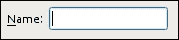

我们将为行编辑设置加速键，以便当用户激活第一个字段的加速键时，它将获得焦点。通过这种方式，我们可以输入第一个玩家的名字，同样，当第二个行编辑的加速键被触发时，我们可以开始输入第二个玩家的名字。

首先，在第一行编辑的左侧选择标签。按*F2*键或双击标签（或者，在属性编辑器中找到标签的文本属性并激活其值字段）。这样我们就可以更改标签的文本。使用光标键导航，使文本光标位于字符`1`之前，并输入`&`字符。这个字符将紧随其后的字符标记为小部件的加速键。对于由文本和实际功能（例如，按钮）组成的控件，这足以使加速键工作。然而，由于`QLineEdit`没有与之关联的任何文本，我们必须使用单独的控件。这就是为什么我们在标签上设置了加速键。现在，我们需要将标签与行编辑关联起来，以便标签加速器的激活可以将其转发到我们选择的控件。这是通过为标签设置所谓的伙伴来完成的。您可以使用`QLabel`类的`setBuddy`方法在代码中这样做，或者使用 Creator 的表单设计器。由于我们已经在设计模式中，我们将使用后一种方法。为此，我们需要在表单设计器中激活一个专用模式。

看看 Creator 窗口的上方；在表单上方，你会找到一个包含几个图标的工具栏。点击标有**编辑伙伴**的图标或直接在键盘上按*F5*键。现在，将鼠标光标移到标签上，按下鼠标按钮，并从标签拖动到行编辑。当你将标签拖动到行编辑上时，你会看到一个标签和行编辑之间正在设置连接的图形可视化。如果你现在释放按钮，这个关联将被永久化。你应该注意到，当这种关联被建立时，`&`字符将从标签中消失，并且它后面的字符会得到一个下划线。对其他标签和相应的行编辑重复此操作。现在，您可以再次预览表单，并检查加速键是否按预期工作。

## 标签顺序

当你在预览表单时，你可以检查 UI 设计的另一个方面。首先，按*Tab*键，看看焦点是如何从一个控件移动到另一个控件的。有很大可能性，焦点将开始在前一个按钮和行编辑之间来回跳跃，而不是从上到下（这是这个特定对话框的直观顺序）。要检查和修改焦点顺序，请离开预览，并切换到标签顺序编辑模式，方法是点击工具栏中称为**编辑标签顺序**的图标。

此模式将一个框与一个数字关联到每个可聚焦的小部件。通过按照您希望小部件获得焦点的顺序单击矩形，您可以重新排序值，从而重新排序焦点。现在，使其顺序如下所示：

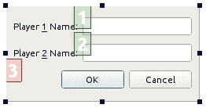

再次进入预览并检查焦点是否根据您设置的进行改变。

### 小贴士

在决定标签顺序时，考虑对话框中哪些字段是必需的，哪些是可选的，是很好的。一个好的习惯是首先允许用户遍历所有必需的字段，然后到对话框确认按钮（例如，一个写着**确定**或**接受**的按钮），然后遍历所有可选字段。这样，用户将能够快速填写所有必需的字段并接受对话框，而无需遍历所有用户希望保留为默认值的可选字段。

## 信号和槽

我们现在要做的最后一件事是确保信号-槽连接设置正确。为此，通过按*F4*或从工具栏中选择**编辑信号/槽**来切换到信号-槽编辑模式。**底部按钮对话框**小部件模板为我们预定义了两个连接，现在应该可以在主画布区域中看到：

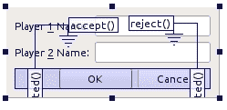

实现 Qt 中对话框的`QDialog`类有两个有用的槽——`accept()`和`reject()`——它们通知调用者对话框所表示的操作是否被接受。为了方便起见，这些槽应该已经连接到相应的`accepted()`和`rejected()`信号，这些信号来自默认包含**确定**和**取消**按钮的按钮组（这是一个`QDialogButtonBox`类的实例）。如果您单击其中的任何一个，将分别发出信号`accepted()`或`rejected()`。

在这个阶段，我们可以添加一些更多连接，使我们的对话框更加实用。让我们设置成只有当两个行编辑中的任何一个都不为空时（即，当两个字段都包含玩家名称时），接受对话框的按钮才可用。虽然我们将在稍后实现逻辑本身，但现在我们可以将连接到一个将执行此任务的槽。

由于默认情况下没有这样的槽，我们需要通知表单编辑器，在应用程序编译时将存在这样的槽。为此，我们需要通过按*F3*或从工具栏中选择**编辑小部件**来切换回表单编辑器的默认模式。然后，您可以调用表单的上下文菜单并选择**更改信号/槽**。将弹出一个窗口，如下所示，列出了可用的信号和槽：

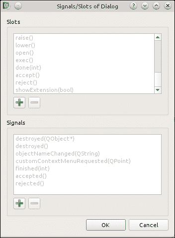

在**槽**组中单击**+**按钮，创建一个名为`updateOKButtonState()`的槽：

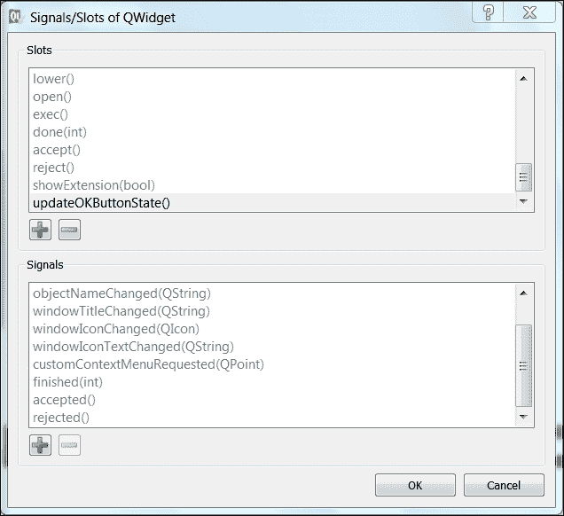

然后，接受对话框并返回到**信号/槽**模式。通过用鼠标拖拽一个行编辑创建一个新的连接。当您将光标移出小部件时，您会注意到一个红色线条跟随您的指针。如果线条遇到一个有效目标，线条将变成箭头，并且目标对象将被突出显示。表单本身也可以是一个目标（或一个源）；在这种情况下，线条将以一个接地标记结束（两条短的水平线）。

当您释放鼠标按钮时，将弹出一个窗口，列出源对象的所有信号和目标对象的所有槽。选择`textChanged(QString)`信号。请注意，当您这样做时，一些可用的槽将消失。这是因为工具只允许我们从与突出显示的信号兼容的槽中进行选择。选择我们新创建的槽并接受对话框。对其他行编辑重复相同的操作。

我们在这里所做的是创建了两个连接，当两个行编辑中的任何一个文本发生变化时，它们将会触发。它们将执行一个尚不存在的槽——通过“创建”槽，我们只声明了在我们的`QDialog`子类中实现它的意图，该子类也是为我们创建的。现在您可以继续保存表单了。

## **发生了什么？**

我们执行了多项任务，使我们的表单遵循来自许多应用程序的标准行为——这使得表单导航变得简单，并显示了用户可以执行哪些操作以及哪些操作目前不可用。

## 使用设计器表单

如果您在文本编辑器中打开表单（例如，通过切换到创建者的**编辑**面板），您会注意到它实际上是一个 XML 文件。那么我们如何使用这个文件呢？

作为构建过程的一部分，Qt 调用一个名为**用户界面编译器**（**uic**）的特殊工具，该工具读取文件并生成一个包含`setupUi()`方法的 C++类。此方法接受一个指向小部件的指针，并包含代码，该代码实例化所有小部件，设置它们的属性，并建立信号-槽连接，而我们负责调用它来准备 GUI。该类本身（以您的表单命名，即表单对象的`objectName`属性的值）前面加上一个`Ui`命名空间（例如，`Ui::MyForm`），并不是从小部件类派生的，而是旨在与一个小部件一起使用。基本上有三种方法可以这样做。

### 直接方法

使用 Qt Designer 表单的最基本方法是实例化一个小部件和一个表单对象，并在小部件上调用`setupUi`，如下所示：

```cpp
QWidget *widget = new QWidget
Ui_form ui * = new Ui_form;
ui->setupUi(widget);
```

这种方法存在一些缺陷。首先，它可能导致 `ui` 对象的潜在内存泄漏（记住，它不是 `QObject`，因此你不能设置其父对象，以便在父对象被删除时删除它）。其次，由于表单中的所有小部件都是未与小部件对象绑定的 `ui` 对象的变量，它破坏了封装性，这是面向对象编程最重要的范式之一。然而，有一种情况下这种结构是可以接受的。那就是当你创建一个简单的短期模态对话框时。你肯定需要记住，为了显示常规小部件，我们一直在使用 `show()` 方法。这对于非模态小部件来说是好的，但对于模态对话框，你应该调用 `QDialog` 类中定义的 `exec()` 方法。这是一个阻塞方法，它不会返回，直到对话框关闭。这允许我们修改代码，使其变为：

```cpp
QDialog dialog;
Ui_form ui;
ui.setupUi(&dialog);
dialog.exec();
```

由于我们是在栈上创建对象，编译器将负责在局部作用域结束时删除它们。

### 多重继承方法

使用 Designer 表单的第二种方式是创建一个从 `QWidget`（或其子类之一）和表单类本身派生的类。然后我们可以从构造函数中调用 `setupUi`：

```cpp
class Widget : public QWidget, private Ui::MyForm {
public:
  Widget(QWidget *parent = 0) : QWidget(parent) {
    setupUi(this);
  }
};
```

这样，我们保持了封装性，因为我们的类从 `Ui` 类继承字段和方法，并且我们可以在类代码内部直接调用它们，同时通过使用私有继承来限制外部世界的访问。这种方法的缺点是它会污染类命名空间，例如，如果我们有 `Ui::MyForm` 中的 `name` 对象，我们就无法在 `Widget` 中创建一个 `name` 方法。

### 单重继承方法

幸运的是，我们可以通过组合而非继承来解决这个问题。我们只从 `QWidget` 派生我们的小部件类，而不是也继承自 `Ui::MyForm`，我们可以将其实例作为新类的一个私有成员：

```cpp
class Widget : public QWidget {
public:
  Widget(QWidget *parent = 0) : QWidget(parent) {
    ui = new Ui::MyForm;
    ui->setupUi(this);
  }
  ~Widget() { delete ui; }
private:
  Ui::MyForm *ui;
};
```

以必须手动创建和销毁 `Ui::MyForm` 实例为代价，我们可以获得额外的好处，即在一个专用对象中包含表单的所有变量和代码，这防止了上述命名空间污染。

这是使用 Designer 表单的推荐方式，也是当你告诉 Qt Creator 为你生成 Designer 表单类时的默认操作模式。

# 行动时间 – 对话框的逻辑

现在，是我们让游戏设置对话框工作的时候了。之前，我们声明了一个信号-槽连接，但现在槽本身需要实现。

打开由 Creator 生成的表单类。如果你仍然处于设计模式，你可以使用 *Shift* + *F4* 键盘快捷键快速跳转到相应的表单类文件。为该类创建一个公共槽段，并声明一个 `void updateOKButtonState()` 槽。打开重构菜单 (*Alt* + *Enter*)，并让 Creator 为你创建该槽的骨架实现。在函数体中填充以下代码：

```cpp
void ConfigurationDialog::updateOKButtonState() {
    bool pl1NameEmpty = ui->player1Name->text().isEmpty();
    bool pl2NameEmpty = ui->player2Name->text().isEmpty();
    QPushButton *okButton = ui->buttonBox->button(QDialogButtonBox::Ok);
    okButton->setDisabled(pl1NameEmpty || pl2NameEmpty);
}
```

此代码检索玩家名称并检查其中任何一个是否为空。然后，它要求包含当前 **OK** 和 **Cancel** 按钮的按钮框提供一个指向接受对话框的按钮的指针。然后，我们根据两个玩家名称是否都包含有效值来设置按钮的禁用状态。当第一次创建对话框时，也需要更新按钮状态，因此将 `updateOKButtonState()` 的调用添加到对话框的构造函数中：

```cpp
ConfigurationDialog::ConfigurationDialog(QWidget *parent) :
  QDialog(parent), ui(new Ui::ConfigurationDialog)
{
  ui->setupUi(this);
  updateOKButtonState();
}
```

下一步是允许从对话框外部存储和读取玩家名称——由于 `ui` 组件是私有的，因此无法从类代码外部访问它。这是一个常见的情况，Qt 也遵循这一原则。几乎每个 Qt 类中的每个数据字段都是私有的，可能包含访问器（一个获取器和可选的设置器），这些是允许读取和存储数据字段值的公共方法。我们的对话框有两个这样的字段——两个玩家的名称。在此阶段，我们应该注意它们是属性的良好候选者，因此最终我们将它们声明为属性。但首先，让我们从实现访问器开始。

在 Qt 中，设置器方法通常使用小写模式命名，例如，`set` 后跟属性名称，首字母转换为大写。在我们的情况下，两个设置器将分别称为 `setPlayer1Name` 和 `setPlayer2Name`，它们都将接受 `QString` 并返回 `void`。在类头文件中声明它们，如下面的代码片段所示：

```cpp
void setPlayer1Name(const QString &p1name);
void setPlayer2Name(const QString &p2name);
```

在 `.cpp` 文件中实现它们的主体：

```cpp
void ConfiguratiosDialog::setPlayer1Name(const QString &p1name) {
  ui->player1Name->setText(p1name);
}
void ConfigurationDialog::setPlayer2Name(const QString &p2name) {
 ui->player2Name->setText(p2name);
}
```

在 Qt 中，获取器方法通常与它们相关的属性同名——`player1Name` 和 `player2Name`。将以下代码放入头文件中：

```cpp
QString player1Name() const;
QString player2Name() const;
```

将以下代码放入实现文件中：

```cpp
QString ConfigurationDialog::player1Name() const { return ui->player1Name->text(); }
QString ConfigurationDialog::player2Name() const { return ui->player2Name->text(); }
```

现在唯一剩下的事情就是声明属性。将以下高亮行添加到类声明中：

```cpp
class ConfigurationDialog : public QDialog {
  Q_OBJECT
 Q_PROPERTY(QString player1Name READ player1Name WRITE setPlayer1Name)
 Q_PROPERTY(QString player2Name READ player2Name WRITE setPlayer2Name)
public:
  ConfigurationDialog(QWidget *parent = 0);
```

我们的对话框现在已准备就绪。您可以通过在 `main()` 中创建其实例并调用 `show()` 或 `exec()` 来测试它。

## 应用程序的主窗口

我们的游戏中已经有了两个主要组件——游戏板和配置对话框。现在，我们需要将它们绑定在一起。为此，我们将使用另一个重要组件——`QMainWindow` 类。一个“主窗口”代表应用程序的控制中心。它可以包含菜单、工具栏、停靠小部件、状态栏以及称为“中央小部件”的实际小部件内容，如下面的图所示：

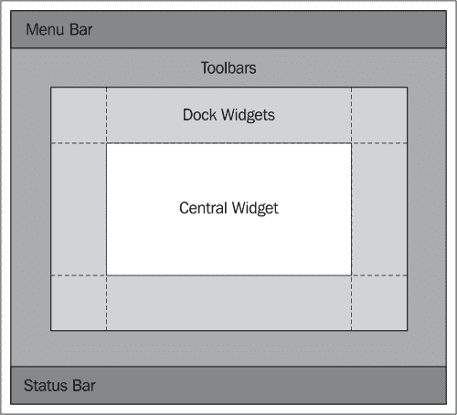

中心小部件部分不需要任何额外的解释——它是一个像任何其他小部件一样的常规小部件。我们也不会在这里关注停靠小部件或状态栏。它们是有用的组件，但它们如此容易掌握，以至于你可以自己学习它们。相反，我们将花一些时间掌握菜单和工具栏。你肯定在许多应用程序中看到并使用过工具栏和菜单，你知道它们对于良好的用户体验是多么重要。

这两个概念共享的主要英雄是一个名为`QAction`的类，它代表用户可以调用的功能。一个单独的动作可以有多个化身——它可以是一个菜单（`QMenu`实例）、工具栏（`QToolBar`）、按钮或键盘快捷键（`QShortcut`）。操作动作（例如，更改其文本）会导致所有化身更新。例如，如果你在菜单中有一个**保存**条目（与键盘快捷键绑定），工具栏中的保存图标，以及可能在你的用户界面中的其他地方的**保存**按钮，并且你想要禁止保存文档（例如，你的地下城与龙游戏关卡编辑器中的地图），因为自上次加载文档以来其内容没有变化。在这种情况下，如果菜单条目、工具栏图标和按钮都链接到同一个`QAction`实例，那么一旦你将动作的`enabled`属性设置为`false`，这三个实体也将被禁用。这是一个保持应用程序不同部分同步的简单方法——如果你禁用动作对象，你可以确信触发动作所代表功能的所有条目也被禁用。动作可以在代码中实例化，也可以使用 Qt Creator 中的**动作编辑器**图形化创建。动作可以与不同的数据相关联——文本、工具提示、状态栏提示、图标以及其他较少使用的。所有这些都被你的动作的化身所使用。

### Qt 资源系统

当谈到图标时，Qt 有一个重要的特性你应该学习。创建图标的一种自然方式是从文件系统中加载图像。这个问题在于你必须与你的应用程序一起安装一堆文件，并且你需要始终知道它们的位置，以便能够提供路径来访问它们。这是困难的，但幸运的是，Qt 有一个解决方案——它允许你将任意文件（如图标图像）直接嵌入到可执行的应用程序中。这是通过准备随后编译到二进制中的资源文件来完成的。幸运的是，Qt Creator 也提供了一个图形化工具来完成这项工作。

# 行动时间——应用程序的主窗口

创建一个新的**Qt** **Designer Form Class**应用程序。作为一个模板，选择**主窗口**。接受向导中其余部分的默认值。

使用动作编辑器创建一个动作，并在对话框中输入以下值：

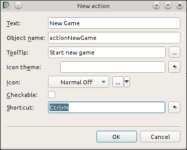

现在，创建另一个动作并填写以下截图中的值：

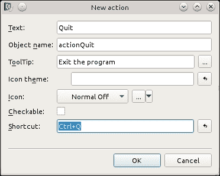

我们希望我们的游戏看起来很漂亮，所以我们将为动作提供图标，并使用资源系统将图像嵌入到我们的应用程序中。创建一个新文件，将其命名为 **Qt Resource File**。命名为 `resources.qrc`。点击 **Add** 按钮，选择 **Add Prefix**。将前缀的值更改为 `/`。然后，再次点击 **Add** 按钮，选择 **Add Files**。找到适合你动作的图像并将它们添加到资源文件中。将出现一个对话框询问你是否希望将文件复制到项目目录。通过选择 **Copy** 来同意。

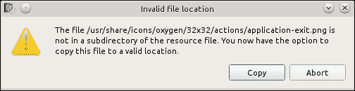

现在，在动作编辑器中再次编辑动作并为它们选择图标。

## *发生了什么？*

我们向项目中添加了一个资源文件。在该资源文件中，我们为许多图像创建了条目。每个图像都被放置在一个 `/` 前缀下，这代表我们创建的人工文件系统的根节点。资源文件中的每个条目都可以通过手动编写的代码直接访问，作为一个具有特殊名称的文件。这个名称由三个部分组成。首先是冒号字符（`:`），它标识资源文件系统。接着是一个前缀（例如，`/`）和资源条目的完整路径（例如，`exit.png`）。这使得名为 `exit.png` 的图像可以通过 `:/exit.png` 路径访问。当我们构建项目时，该文件将被转换成 C 数据数组代码并与应用程序二进制文件集成。在准备完资源文件后，我们使用了其中嵌入的图像作为我们动作的图标。

下一步是将这些动作添加到菜单和工具栏中。

# 现在是时候添加下拉菜单了

要为窗口创建一个菜单，双击表单顶部的 **Type Here** 文本，并将其替换为 `&File`。然后，将动作编辑器中的 **New Game** 动作拖动到新创建的菜单上，但不要放下它。菜单现在应该打开了，你可以拖动动作，直到子菜单中出现一个红色条，在你想菜单条目出现的位置——现在你可以释放鼠标按钮来创建条目。之后，再次通过点击 **File** 来打开菜单，并选择 **Add Separator**。然后，重复拖放操作为 **Quit** 动作插入一个菜单条目，位于 **File** 菜单中的分隔符下方，如图所示：

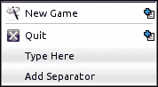

## *发生了什么？*

使用图形工具，我们为我们的程序创建了一个菜单，并向该菜单添加了多个操作（这些操作被自动转换为菜单项）。每个菜单条目都接收了一些文本和一个由放入菜单中的操作指定的图标。

### 小贴士

要创建子菜单，首先通过点击**在此处输入**行创建一个菜单条目，并输入子菜单名称。然后，将一个操作拖动并悬停在这样一个子菜单上。经过一段时间，子菜单将弹出，你将能够将操作放下以在二级菜单中创建一个条目。

# 行动时间 – 创建工具栏

要创建工具栏，请在表单上调用上下文菜单并选择**添加工具栏**。然后，将**新游戏**操作拖动到工具栏上并放下。为工具栏打开上下文菜单并选择**追加分隔符**。然后，从操作编辑器中将**退出**操作拖动到分隔符后面的工具栏中。以下图展示了你现在应该拥有的最终布局：

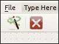

## *发生了什么？*

创建工具栏与创建菜单非常相似。首先创建容器（工具栏），然后从操作编辑器中拖放操作。你甚至可以从菜单栏拖动一个操作并将其放到工具栏上，反之亦然！

# 行动时间 – 填充中心部件

在主窗口区域添加两个标签 – 一个在顶部用于第一个玩家名称，一个在表单底部用于第二个玩家名称 – 然后将它们的`objectName`属性分别更改为`player1`和`player2`。清除它们的文本属性，以便它们不显示任何内容。然后，从部件框中拖动**Widget**，将其放在两个标签之间，并将它的对象名称设置为`gameBoard`。在刚刚放置的部件上调用上下文菜单并选择**提升到**。这允许我们用另一个类替换表单中的部件；在我们的情况下，我们希望用我们的游戏板替换空部件。将刚刚出现的对话框填写如下图的值：

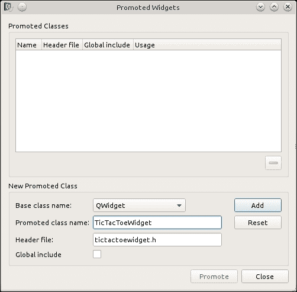

然后，点击标有**添加**的按钮，然后点击**提升**以关闭对话框并确认提升。你不会在表单上注意到任何变化，因为替换仅在编译期间发生。现在，在表单上应用垂直布局，以便标签和空部件能够正确对齐。

## *发生了什么？*

并非所有部件类型都在表单设计器中直接可用。有时，我们需要使用仅在构建的项目中创建的部件类。将自定义部件放在表单上的最简单方法是在生成表单的 C++代码时，要求设计者将类名替换为一些对象。通过将对象提升到不同的类，我们节省了大量将游戏板适应用户界面的工作。

# 行动时间 - 整合所有内容

游戏的视觉部分已经准备好，接下来需要完成主窗口逻辑的编写并将所有组件整合在一起。给类添加一个公共槽位，命名为 `startNewGame`。在类构造函数中，将 **New Game** 动作的触发信号连接到这个槽位，并将应用程序的退出槽位连接到另一个动作：

```cpp
connect(ui->actionNewGame, SIGNAL(triggered()), this, SLOT(startNewGame()));
connect(ui->actionQuit, SIGNAL(triggered()), qApp, SLOT(quit()));
```

`qApp` 特殊宏代表指向应用程序对象实例的指针，因此前面的代码将调用在 `main()` 中创建的 `QApplication` 对象的 `quit()` 槽位，这最终将导致应用程序结束。

让我们按照以下方式实现 `startNewGame` 槽位：

```cpp
void MainWindow::startNewGame() {
  ConfigurationDialog dlg(this);
  if(dlg.exec() == QDialog::Rejected) {
    return; // do nothing if dialog rejected
  }
  ui->player1->setText(dlg.player1Name());
  ui->player2->setText(dlg.player2Name());
  ui->gameBoard->initNewGame();
  ui->gameBoard->setEnabled(true);
}
```

在这个槽位中，我们创建设置对话框并展示给用户，强制用户输入玩家名称。如果对话框被取消，我们放弃创建新游戏。否则，我们从对话框获取玩家名称并将它们设置在适当的标签上。最后，我们初始化棋盘并启用它，以便用户可以与之交互。

在编写回合制棋盘游戏时，始终清楚地标记现在是哪个玩家的回合进行移动是个好主意。我们将通过在粗体中标记移动玩家的名称来实现这一点。棋盘类中已经有一个信号告诉我们已经完成了一次有效移动，我们可以通过它来更新标签。让我们在主窗口类的构造函数中添加适当的代码：

```cpp
connect(ui->gameBoard, SIGNAL(currentPlayerChanged(Player)), this, SLOT(updateNameLabels()));
```

现在让我们来看槽位本身；让我们在类中添加一个私有槽位部分并声明该槽位：

```cpp
private slots:
  void updateNameLabels();
```

现在，我们可以实现它：

```cpp
void MainWindow::updateNameLabels() {
  QFont f = ui->player1->font();
  f.setBold(ui->gameBoard->currentPlayer() == TicTacToeWidget::Player1);
  ui->player1->setFont(f);
  f.setBold(ui->gameBoard->currentPlayer() == TicTacToeWidget::Player2);
  ui->player2->setFont(f);
}
```

除了在信号发出后调用槽位之外，我们还可以在游戏开始时使用它来设置标签的初始数据。由于所有槽位也都是常规方法，我们只需从 `startNewGame()` 中调用 `updateNameLabels()` 即可——在 `startNewGame()` 的末尾调用 `updateNameLabels()`。

最后需要完成的事情是处理游戏结束的情况。将棋盘的 `gameOver()` 信号连接到主窗口类中的新槽位。如下实现该槽位：

```cpp
void MainWindow::handleGameOver(TicTacToeWidget::Player winner) {
  ui->gameBoard->setEnabled(false);
  QString message;
  if(winner == TicTacToeWidget::Draw) {
    message = "Game ended with a draw.";
  } else {
    message = QString("%1 wins").arg(winner == TicTacToeWidget::Player1
    ? ui->player1->text() : ui->player2->text());
  }
  QMessageBox::information(this, "Info", message);
}
```

## *发生了什么？*

我们的代码做了两件事。首先，它禁用了棋盘，这样玩家就不能再与之交互了。其次，它检查谁赢得了游戏，组装消息（我们将在下一章中了解更多关于 `QString` 的内容），并使用静态方法 `QMessageBox::information()` 显示它，该方法显示一个包含消息和允许我们关闭对话框的按钮的模态对话框。最后一件剩下的事情是更新 `main()` 函数，以便创建我们的 `MainWindow` 类的实例：

```cpp
#include "mainwindow.h"
#include <QApplication>
int main(int argc, char *argv[])
{
  QApplication a(argc, argv);
  MainWindow w;
  w.show();
  return a.exec();
}
```

现在，你可以运行你的第一个 Qt 游戏。

## 英雄尝试扩展游戏

作为一项附加练习，你可以尝试修改本章中我们编写的代码，以便在大于 3 x 3 的棋盘上玩游戏。让用户决定棋盘的大小（你可以修改游戏选项对话框来实现这一点，并使用 `QSlider` 和 `QSpinBox` 允许用户选择棋盘的大小），然后你可以指导 `TicTacToeWidget` 根据它得到的大小构建棋盘。记住调整游戏胜利逻辑！如果在任何时刻你遇到了死胡同，不知道该使用哪些类和函数，请查阅参考手册。

### 小贴士

要快速查找类的文档（或文档中的任何其他页面），切换到 **帮助** 面板，从侧边栏顶部的下拉列表中选择 **索引**，并输入搜索词，例如 `QAction`。此外，*F1* 键在浏览手册时非常有用。将鼠标指针或文本光标放在代码编辑器中类的名称、函数或对象上，然后按键盘上的 *F1*。通过这样做，Qt Creator 将乐意向你展示所选主题的可用帮助信息。

## 快速问答——使用小部件

Q1. 返回小部件首选大小的方法被称为：

1.  `preferredSize`

1.  `sizeHint`

1.  `defaultSize`

Q2. 哪个 Qt 类可以携带任何属性的值？

1.  `QVariant`

1.  `QUnion`

1.  `QPropertyValue`

Q3. `QAction` 对象的目的是什么？

1.  它代表用户可以在程序中调用的功能。

1.  它包含一个用于将焦点移动到小部件上的快捷键序列。

1.  它是使用 Qt Designer 生成的所有表单的基类。

# 摘要

在本章中，你学习了如何使用 Qt 创建简单的图形用户界面。我们探讨了两种方法——通过直接编写所有代码来创建用户界面类，以及使用生成大部分代码的图形工具来设计用户界面。无法确定两种方法中哪一种更好；它们各自在某些方面更好，在其他方面则较差。一般来说，你应该优先使用 Qt Designer 表单来直接编写代码，因为它更快，更不容易出错，因为大部分代码都是自动生成的。然而，如果你想要对代码有更多的控制，或者你的 GUI 非常动态，自己编写所有代码会更容易，尤其是在你积累了足够的 Qt 经验，可以避免常见陷阱并学会使用高级编程结构之后。

我们还学习了 Qt 的核心——元对象系统是如何工作的。你现在应该能够通过连接信号到槽（预定义的以及你现在已经知道如何定义并填充代码的自定义槽）来创建简单的用户界面并填充逻辑。

Qt 包含许多小部件类型，但我没有逐一向你介绍它们。Qt 手册中有一个非常好的关于许多小部件类型的解释，称为 *Qt 小部件画廊*，它展示了其中大部分的实际应用。

如果你对这些小部件的任何使用有疑问，你可以查看示例代码，并在 Qt 参考手册中查找相应的类，以了解更多关于它们的信息。

使用 Qt 远不止在表单上拖放小部件并提供一些代码来将这些部件粘合在一起。在下一章中，你将了解 Qt 提供的一些最实用的功能；它们与在屏幕上显示图形无关，而是让你能够操作各种类型的数据。这对于比简单的井字棋更复杂的任何游戏来说都是必不可少的。
