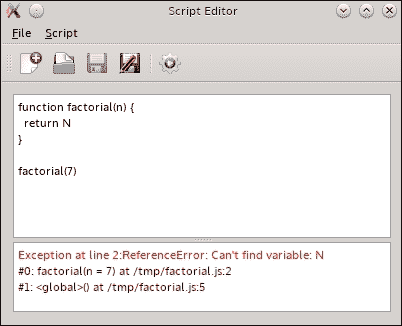

# 第八章：脚本

> *在本章中，你将学习如何将脚本功能引入你的程序。你将了解如何使用基于 JavaScript 的语言来实现游戏逻辑和细节，而无需重建主游戏引擎。虽然我们将关注的这个环境与 Qt 应用程序结合得最好，但如果不喜欢 JavaScript，你将得到关于你可以使用的其他语言的建议，以使你的游戏可脚本化。*

# 为什么使用脚本？

你可能会问自己，既然我可以用 C++实现所有需要的功能，为什么还要使用任何脚本语言呢？为你的游戏提供脚本环境有许多好处。大多数现代游戏实际上由两部分组成。其中一部分是主游戏引擎，它实现了游戏的核心（数据结构、处理算法和渲染层），并向其他组件提供了一个 API，该组件为游戏提供详细信息、行为模式和动作流程。这个其他组件通常是用脚本语言编写的。这样做的主要好处是，故事设计师可以独立于引擎开发者工作，他们不需要重建整个游戏，只需修改一些参数或检查新任务是否与现有故事很好地融合。这使得开发速度比单体方法快得多。另一个好处是，这种开发使游戏开放给模组化——有技能的最终用户可以扩展或修改游戏，为游戏提供一些增值服务。这也是通过在现有的脚本 API 上实现扩展来为游戏赚取额外收入的一种方式，而无需重新部署完整的游戏二进制文件给每个玩家，或者向模组开发者暴露新的脚本端点以进一步增强他们的创造力。最后，你可以重用相同的游戏驱动程序为其他游戏，只需替换脚本即可获得一个完全不同的产品。

Qt 提供了两种基于 JavaScript 的脚本环境实现。在本章中，我们将重点关注 Qt Script。在文档中，你可以看到该模块被标记为“已弃用”；然而，它目前提供的 API（尽管执行速度较慢）比其他实现更丰富。在描述 Qt Script 之后，我们还将简要地看看另一种实现。我们不会讨论 JavaScript 语言本身的细节，因为有许多优秀的书籍和网站可供学习 JavaScript。此外，JavaScript 的语法与 C 非常相似，即使你之前没有见过任何 JavaScript 代码，你也不应该有任何问题理解我们本章中使用的脚本。

# Qt Script 的基础

要在程序中使用 Qt Script，你必须通过在项目文件中添加`QT += script`行来为你的项目启用脚本模块。

## 评估 JavaScript 表达式

C++ 编译器不理解 JavaScript。因此，要执行任何脚本，你需要有一个正在运行的解释器，该解释器将解析脚本并评估它。在 Qt 中，这是通过 `QScriptEngine` 类来完成的。这是一个 Qt 脚本运行时，它处理脚本代码的执行并管理所有与脚本相关的资源。它提供了 `evaluate()` 方法，可以用来执行 JavaScript 表达式。让我们看看 Qt 脚本中的“Hello World”程序：

```cpp
#include <QCoreApplication>
#include <QScriptEngine>

int main(int argc, char **argv) {
  QCoreApplication app(argc, argv);
  QScriptEngine engine;
  engine.evaluate("print('Hello World!')");
  return 0;
}
```

这个程序非常简单。首先，它创建了一个应用程序对象，这是脚本环境正常工作所必需的，然后它只是实例化 `QScriptEngine` 并调用 `evaluate` 来执行作为参数传递给它的脚本源代码。构建并运行程序后，你将在控制台看到熟悉的 `Hello World!`。

如果你没有获得任何输出，那么这很可能意味着脚本没有正确执行，可能是由于脚本源代码中的错误。为了验证这一点，我们可以扩展我们的简单程序来检查脚本执行过程中是否出现了任何问题。为此，我们可以使用 `hasUncaughtExceptions()` 查询引擎状态：

```cpp
#include <QCoreApplication>
#include <QScriptEngine>
#include <QtDebug>

int main(int argc, char **argv) {
  QCoreApplication app(argc, argv);
  QScriptEngine engine;
  engine.evaluate("print('Hello World!')");
 if(engine.hasUncaughtException()) {
 QScriptValue exception = engine.uncaughtException();
 qDebug() << exception.toString();
 }
  return 0;
}
```

突出的代码检查是否存在异常，如果存在，则获取异常对象。你可以看到它的类型是 `QScriptValue`。这是一个特殊类型，用于在脚本引擎和 C++ 世界之间交换数据。它在某种程度上类似于 `QVariant`，因为它实际上是一个用于脚本引擎内部使用的多个原始类型的包装器。其中一种类型是包含错误的类型。我们可以使用其 `isError()` 方法检查脚本值对象是否为错误，但在这个例子中，我们不这样做，因为 `uncaughtException()` 的目的是返回错误对象。相反，我们立即将错误转换为字符串表示形式，并使用 `qDebug()` 将其输出到控制台。例如，如果你在脚本源文本中省略了关闭的单引号并运行程序，将显示以下消息：

```cpp
"SyntaxError: Parse error"
```

`QScriptEngine::evaluate()` 同样返回 `QScriptValue`。此对象代表已评估脚本的输出结果。你可以让脚本为你计算一些值，这些值你可以在之后的 C++ 代码中使用。例如，脚本可以计算当生物被特定武器击中时造成的伤害量。修改我们的代码以使用脚本的结果非常简单。所需做的只是存储 `evaluate()` 返回的值，然后它就可以在代码的其他地方使用：

```cpp
QScriptValue result = engine.evaluate("(7+8)/2");
if(engine.hasUncaughtException()) {
  // ...
} else {
  qDebug() << result.toString();
}
```

# 行动时间 - 创建一个 Qt 脚本编辑器

让我们做一个简单的练习，创建一个图形编辑器来编写和执行脚本。首先创建一个新的 GUI 项目，实现一个由两个纯文本编辑小部件（`ui->codeEditor` 和 `ui->logWindow`）组成的窗口，这两个小部件通过垂直分隔符分开。其中一个编辑框将用作输入代码的编辑器，另一个将用作显示脚本结果的控制台。然后，向窗口添加菜单和工具栏，并创建打开（`ui->actionOpen`）、保存（`ui->actionSave`）、创建新文档（`ui->actionNew`）、执行脚本（`ui->actionExecute`）和退出应用程序（`ui->actionQuit`）的操作。请记住将它们添加到菜单和工具栏中。结果，您应该得到以下截图所示的窗口：


将退出操作连接到 `QApplication::quit()` 插槽。然后，创建一个 `openDocument()` 插槽并将其连接到相应的操作。在插槽中，使用 `QFileDialog::getOpenFileName()` 请求用户输入文档路径，如下所示：

```cpp
void MainWindow::openDocument() {
  QString filePath = QFileDialog::getOpenFileName(this, "Open Document", QDir::homePath(), "JavaScript Documents (*.js)");
  if(filePath.isEmpty()) return;
  open(filePath);
}
```

以类似的方式实现 **保存** 和 **另存为** 操作处理程序。最后，创建 `open(const QString &filePath)` 插槽，使其读取文档并将内容放入代码编辑器：

```cpp
void MainWindow::open(const QString &filePath) {
  QFile file(filePath);
  if(!file.open(QFile::ReadOnly|QFile::Text)) {
      QMessageBox::critical(this, "Error", "Can't open file.");
      return;
  }
  setWindowFilePath(filePath);
  ui->codeEditor->setPlainText(QTextStream(&file).readAll());
  ui->logWindow->clear();
}
```

### 小贴士

`QWidget` 的 `windowFilePath` 属性可以用来将文件与窗口关联。然后，您可以在与文件使用相关的操作中使用它——在保存文档时，您可以检查此属性是否为空，并要求用户提供文件名。然后，在创建新文档或用户为文档提供新路径时，您可以重置此属性。

到目前为止，您应该能够运行程序并使用它来创建脚本，并在编辑器中保存和重新加载它们。

现在，为了执行脚本，向窗口类中添加一个名为 `QScriptEngine m_engine` 的成员变量。创建一个新的插槽，命名为 `run`，并将其连接到执行操作。在插槽的主体中放入以下代码：

```cpp
void Main Window::run() {
   ui->logWindow->clear();
   QScriptValue result
     = m_engine.evaluate(scriptSourceCode, windowFilePath());
   if(m_engine.hasUncaughtException()) {
     QScriptValue exception = m_engine.uncaughtException();
     QTextCursor cursor = ui->logWindow->textCursor();
     QTextCharFormat errFormat;
     errFormat.setForeground(Qt::red);
     cursor.insertText(
       QString("Exception at line %1:")
       .arg(m_engine.uncaughtExceptionLineNumber()),
       errFormat
     );
     cursor.insertText(exception.toString(), errFormat);
     QStringList trace = m_engine.uncaughtExceptionBacktrace();
     errFormat.setForeground(Qt::darkRed);
     for(int i = 0; i < trace.size(); ++i) {
       const QString & traceFrame = trace.at(i);
       cursor.insertBlock();
       cursor.insertText(QString("#%1: %2")
         .arg(i).arg(traceFrame), errFormat);
     }
   } else {
     QTextCursor cursor = ui->logWindow->textCursor();
     QTextCharFormat resultFormat;
     resultFormat.setForeground(Qt::blue);
     cursor.insertText(result.toString(), resultFormat);
   }
}
```

编译并运行程序。为此，在编辑器中输入以下脚本：

```cpp
function factorial(n) {
  if( n < 0 ) return undefined
  if( n == 0 ) return 1
  return n*factorial(n-1)
}

factorial(7)
```

将脚本保存到名为 `factorial.js` 的文件中，然后运行它。你应该得到以下截图所示的输出：


接下来，将脚本替换为以下内容：

```cpp
function factorial(n) {
  return N
}

factorial(7)
```

运行脚本应该得到以下结果：



## *刚才发生了什么？*

`run()` 方法清除日志窗口并使用我们在本章前面学到的方法评估脚本。如果评估成功，它将在日志窗口中打印结果，这就是我们在上一节中看到的第一个截图。

在第二次尝试中，我们在脚本中使用了一个不存在的变量，导致错误。评估此类代码会导致异常。除了报告实际错误外，我们还使用`uncaughtExceptionLineNumber()`来报告导致问题的行号。接下来，我们调用引擎的`uncaughtExceptionBacktrace()`方法，该方法返回一个包含问题回溯（函数调用栈）的字符串列表，我们也将它打印在控制台上。

让我们尝试另一个脚本。以下代码定义了一个局部变量`fun`，它被分配了一个返回数字的匿名函数：

```cpp
var fun = function() { return 42 }
```

然后，你可以像调用常规函数一样调用`fun()`，如下所示：


现在，让我们看看如果我们从脚本中删除`fun`的定义，但仍然保留调用会发生什么。


即使没有定义`fun`的含义，我们仍然得到相同的结果！这是因为`QScriptEngine`对象在`evaluate()`调用之间保持其状态。如果你在脚本中定义了一个变量，它将被保留在引擎的当前上下文中。下次调用`evaluate()`时，它将在与之前相同的上下文中执行脚本；因此，之前定义的所有变量仍然有效。有时，这种行为是期望的；然而，恶意脚本可能会破坏上下文，这可能会给引擎后续的评估造成麻烦。因此，通常在脚本执行完毕后，确保引擎处于干净的状态会更好。

# 行动时间 - 限制环境的脚本评估

我们接下来的任务是修改我们的脚本编辑器，以便在每次脚本执行后进行清理。如前所述，每个脚本都是在引擎的当前上下文中执行的，因此解决问题的任务归结为确保每个脚本都在一个单独的上下文中执行。在`run()`方法中包含以下代码：

```cpp
void MainWindow::run() {
    ui->logWindow->clear();
    QString scriptSourceCode = ui->codeEditor->toPlainText();
 m_engine.pushContext();
 QScriptValue result = m_engine.evaluate
  (scriptSourceCode, windowFilePath());
    if(m_engine.hasUncaughtException()) {
        // …
    }
 m_engine.popContext();
}
```

运行程序并重复最后一个测试，以查看`fun`不再在执行之间持续存在。

## *刚刚发生了什么？*

当一个函数被调用时，一个新的执行上下文会被推送到栈顶。当引擎尝试解析一个对象时，它首先在最高上下文中寻找该对象（即函数调用的上下文）。如果找不到，引擎会检查栈中的下一个上下文，然后是下一个，直到找到对象或到达栈底。当函数返回时，上下文从栈中弹出，并销毁其中定义的所有变量。你可以使用以下脚本查看这是如何工作的：

```cpp
var foo = 7
function bar() { return foo }
bar()
```

当调用`bar`时，会在栈中添加一个新的上下文。脚本请求`foo`对象，但当前上下文中不存在该对象，因此引擎会检查周围上下文并找到`foo`的定义。在我们的代码中，我们通过显式地使用`pushContext()`创建一个新的上下文，然后使用`popContext()`移除它来遵循这种行为。

### 小贴士

你可以使用`currentContext()`检索当前上下文对象。

上下文有两个与其相关的重要对象：`activation`对象和`this`对象。前者定义了一个对象，其中所有局部变量都作为对象的属性存储。如果你在调用脚本之前在对象上设置了任何属性，它们将直接对脚本可用：

```cpp
QScriptContext *context = engine.pushContext();
QScriptValue activationObject = context->activationObject();
activationObject.setProperty("foo", "bar");
engine.evaluate("print(foo)");
```

`this`对象以类似的方式工作——它确定当脚本引用名为`this`的对象时要使用哪个对象。任何在 C++中定义的属性都可以从脚本中访问，反之亦然：

```cpp
QScriptContext *context = engine.pushContext();
QScriptValue thisObject = context->thisObject();
thisObject.setProperty("foo", "bar");
engine.evaluate("print(this.foo)");
```

# 集成 Qt 和 Qt Script

到目前为止，我们只评估了一些可以充分利用 JavaScript 内置功能的独立脚本。现在，是时候学习如何在脚本中使用程序中的数据了。

这是通过将不同类型的实体暴露给脚本来完成的。

## 暴露对象

将数据暴露给 Qt Script 的最简单方法就是利用 Qt 的元对象系统。Qt Script 能够检查`QObject`实例并检测它们的属性和方法。为了在脚本中使用它们，对象必须对脚本执行上下文可见。最简单的方法是将它添加到引擎的全局对象或某个上下文的激活对象中。正如你所记得的，脚本引擎和 C++之间的所有数据交换都使用`QScriptValue`类，所以首先我们必须为 C++对象获取一个脚本值句柄：

```cpp
QScriptEngine engine;
QPushButton *button = new QPushButton("Button");
// …
QScriptValue scriptButton = engine.newQObject(button);
engine.globalObject().setProperty("pushButton", scriptButton);
```

`QScriptEngine::newQObject()`为现有的`QObject`实例创建一个脚本包装器。然后我们将包装器设置为名为`pushButton`的全局对象的属性。这使得按钮在引擎的全局上下文中作为 JavaScript 对象可用。所有使用`Q_PROPERTY`定义的属性都作为对象的属性可用，每个槽都可以作为该对象的方法访问。使用这种方法，你可以在 C++和 JavaScript 世界之间共享现有对象：

```cpp
int main(int argc, char **argv) {
  QApplication app(argc, argv);
  QScriptEngine engine;
  QPushButton button;
  engine.globalObject().setProperty
  ("pushButton", engine.newQObject(&button));
  QString script = "pushButton.text = 'My Scripted Button'\n"+
                   "pushButton.checkable = true\n" +
                   "pushButton.setChecked(true)"
  engine.evaluate(script);
  return app.exec();
}
```

有时候，你希望为类提供一个丰富的接口，以便在 C++中轻松操作它，但同时又想严格控制使用脚本可以执行的操作，因此你想阻止脚本编写者使用类的一些属性或方法。

对于方法，这相当简单——只需不要将它们作为槽位。记住，如果你使用`connect()`变体，它接受一个函数指针作为参数，你仍然可以将它们用作槽位。

对于属性，你可以在`Q_PROPERTY`声明中使用`SCRIPTABLE`关键字将属性标记为从脚本中可访问或不可访问。默认情况下，所有属性都是可脚本化的，但你可以通过将`SCRIPTABLE`设置为`false`来禁止它们对脚本的暴露，如下面的示例所示：

```cpp
Q_PROPERTY(QString internalName READ internalName SCRIPTABLE false)
```

# 行动时间 - 使用脚本为 NPC AI

让我们实现一个脚本，作为简单龙与地下城游戏中非玩家角色的**人工智能**（AI）。该引擎将定期执行脚本，向它暴露两个对象——生物和玩家。脚本将能够查询玩家的属性并在生物上调用函数。

让我们创建一个新的项目。我们将从实现我们游戏世界中生物的 C++类开始。由于 NPC 和玩家都是生物实体，我们可以为它们有一个共同的基类。在第四章中，*Qt 核心基础*，我们已经有一个玩家的数据结构，所以让我们使用它作为基类，通过为我们的实体配备类似的属性来实现。将`LivingEntity`实现为`QObject`的子类，具有以下属性：

```cpp
Q_PROPERTY(QString name     READ name        NOTIFY nameChanged)
Q_PROPERTY(char direction   READ direction   NOTIFY directionChanged)
Q_PROPERTY(QPoint position  READ position    NOTIFY positionChanged)
Q_PROPERTY(int hp           READ hp          NOTIFY hpChanged)
Q_PROPERTY(int maxHp        READ maxHp       NOTIFY maxHpChanged)
Q_PROPERTY(int dex          READ dex         NOTIFY dexChanged)
Q_PROPERTY(int baseAttack   READ baseAttack  NOTIFY baseAttackChanged)
Q_PROPERTY(int armor        READ armor       NOTIFY armorChanged)
```

你可以看到这个接口是只读的——你不能使用`LivingEntity`类修改任何属性。当然，我们仍然需要方法来改变这些值；因此，在类的`public`接口中实现它们：

```cpp
public:
  void setName(const QString &newName);
  void setDirection(char newDirection);
  void setPosition(const QPoint &newPosition);
  void setHp(int newHp);
  void setMaxHp(int newMaxHp);
  void setBaseAttack(int newBaseAttack);
  void setArmor(int newArmor);
  void setDex(int newDex);
```

当你实现这些方法时，确保在修改属性值时发出适当的信号。让我们添加更多与生物可以执行的动作相对应的方法：

```cpp
public:
  void attack(LivingEntity *enemy);
  void dodge();
  void wait();
  bool moveForward();
  bool moveBackward();
  void turnLeft();
  void turnRight();
```

最后四个方法实现起来很简单；对于前三个方法，使用以下代码：

```cpp
void LivingEntity::wait() {  if(hp() < maxHp()) setHp(hp()+1); }
void LivingEntity::dodge() {
    m_armorBonus += dex(); 
    emit armorChanged(armor()); // m_baseArmor + m_armorBonus
}
void LivingEntity::attack(LivingEntity *enemy) {
  if (baseAttack() <=0) return;
  int damage = qrand() % baseAttack();
  int enemyArmor = enemy->armor();
  int inflictedDamage = qMax(0, damage-enemyArmor);
  enemy->setHp(qMax(0, enemy->hp() - inflictedDamage));
}
```

实质上，如果生物选择等待，它将恢复一个生命值。如果它闪避，这增加了它在被攻击时避免伤害的机会。如果它攻击另一个生物，这将根据它自己的攻击力和对手的防御分数造成伤害。

下一步是实现`LivingEntity`的子类，这样我们就可以使用 Qt 脚本操作对象。为此，按照以下方式实现`NPC`类：

```cpp
class NPC : public LivingEntity {
  Q_OBJECT
public:
  NPC(QObject *parent = 0) : LivingEntity(parent) {}
public slots:
  void attack(LivingEntity *enemy) { LivingEntity::attack(enemy); }
  void dodge() { LivingEntity::dodge(); }
  void wait() { LivingEntity::wait(); }
  bool moveForward() { return LivingEntity::moveForward(); }
  bool moveBackward() { return LivingEntity::moveBackward(); }
  void turnLeft() { LivingEntity::turnLeft(); }
  void turnRight() { LivingEntity::turnRight(); }
};
```

剩下的工作就是创建一个简单的游戏引擎来测试我们的工作。为此，首先在`LivingEntity`中添加一个`reset()`方法，在每个回合开始前重置护甲加成。然后，实现`GameEngine`类：

```cpp
class GameEngine : public QScriptEngine {
public:
  GameEngine(QObject *parent = 0) : QScriptEngine(parent) {
    m_timerId = 0;
    m_player = new LivingCreature(this);
    m_creature = new NPC(this);
    QScriptValue go = globalObject();
    go.setProperty("player", newQObject(m_player));
    go.setProperty("self", newQObject(m_creature));
  }
  LivingCreature *player() const {return m_player; }
  LivingCreature *npc() const { return m_creature; }
  void start(const QString &fileName) {
    if(m_timerId) killTimer(m_timerId);
    m_npcProgram = readScriptFromFile(fileName);
    m_timerId = startTimer(1000);
  }
protected:
  QScriptProgram readScriptFromFile(const QString &fileName) const {
    QFile file(fileName);
    if(!file.open(QFile::ReadOnly|QFile::Text)) return QScriptProgram();
    return QScriptProgram(file.readAll(), fileName);
  }
  void timerEvent(QTimerEvent *te) {
    if(te->timerId() != m_timerId) return;
    m_creature->reset();
    m_player->reset();
    evaluate(m_npcProgram);
  }
private:
  LivingEntity *m_player;
  NPC *m_creature;
  QScriptProgram m_npcProgram;
  int m_timerId;
};
```

最后，编写主函数：

```cpp
int main(int argc, char **argv) {
  QCoreApplication app(argc, argv);
  GameEngine engine;

  engine.player()->setMaxHp(50);
  engine.player()->setHp(50);
  engine.player()->setDex(10);
  engine.player()->setBaseAttack(12);
  engine.player()->setArmor(3);

  engine.npc()->setMaxHp(100);
  engine.npc()->setHp(100);
  engine.npc()->setDex(4);
  engine.npc()->setBaseAttack(2);
  engine.npc()->setArmor(1);

  engine.start(argv[1]);
  return app.exec();
}
```

你可以使用以下脚本测试应用程序：

```cpp
print("Player HP:", player.hp)
print("Creature HP:", self.hp)
var val = Math.random() * 100
if(val < 50) {
  print("Attack!")
  self.attack(player) 
} else {
  print("Dodge!");
  self.dodge();
}
```

## *刚才发生了什么？*

我们创建了两种对象类别：`LivingCreature`，这是读取生物数据的基 API，以及 NPC，它提供了一个更丰富的 API。我们通过重新声明现有函数为槽来实现这种效果。即使方法不是虚拟的，这也是可能的，因为当槽使用 Qt 的元对象系统执行时，它们总是被视为虚拟方法——派生类中的声明总是覆盖父类中的声明。有了这两个类，我们将它们的实例暴露给了脚本环境，并使用计时器每秒调用一个用户定义的脚本。当然，这是一种非常简单的脚本方法，如果用户在脚本中调用多个动作函数，例如在一个脚本中多次调用`attack()`，生物可以对对手进行多次攻击。说到`attack()`，请注意它接受一个`LivingCreature`指针作为其参数。在脚本中，我们用对应于 C++中所需类型的玩家对象来填充它。转换由 Qt Script 自动完成。因此，你可以通过使用`QObject`指针并使用它们与暴露给脚本的`QObject`实例来定义方法。以类似的方式，你可以通过使用`QVariant`或`QScriptValue`并使用脚本中的任何值来传递它们来定义函数。如果脚本引擎能够将给定的值转换为请求的类型，它将这样做。

## 尝试成为英雄 - 扩展龙与地下城游戏

这里有一些可以用来扩展我们小型游戏的想法。第一个是为玩家添加脚本执行，以便它试图防御生物。为此，你需要使用`LivingCreature` API 公开生物的数据，使其只读，并使用读写接口公开玩家。有许多方法可以做到这一点；最简单的方法是提供两个公共`QObject`接口，它们在共享指针上操作，如下面的图所示：


API 已经包含了移动生物的方法。你可以扩展战斗规则，考虑对手之间的距离和它们之间的相对方向（例如，从背后攻击通常比面对面攻击造成更多伤害）。你甚至可以引入远程战斗。通过扩展`LivingCreature`接口，添加操作生物存货的属性和方法。允许生物更改其活动武器。

你可以应用的最后一种修改是防止作弊，使用前面描述的机制。不是立即执行动作，而是标记脚本选择的动作（及其参数），然后在脚本执行完毕后执行该动作，例如，如下所示：

```cpp
void timerEvent(QTimerEvent *te) {
  if(te->timerId() != m_timerId) return;
  m_creature.reset();
  m_player.reset();
  evaluate(m_npcProgram);
  evaluate(m_playerProgram);
 m_creature.executeAction();
 m_player.executeAction();
}
```

另一种方法是给每个生物的每一回合分配行动点，并允许生物将它们用于不同的行动。如果没有足够的点来执行行动，脚本会通知这一点，并且行动失败。

## 暴露函数

到目前为止，我们一直是在导出对象到脚本中，并调用它们的属性和方法。然而，也有一种方法可以从脚本中调用独立的 C++函数，以及从 C++代码中调用 JavaScript 编写的函数。让我们看看这是如何工作的。

### 将 C++函数暴露给脚本

您可以使用`QScriptEngine::newFunction()`调用将独立函数暴露给 Qt 脚本。它返回`QScriptValue`，就像 JavaScript 中的任何函数一样，也是一个对象，可以用`QScriptValue`表示。在 C++中，如果一个函数接受三个参数，那么在调用它时必须传递正好三个参数。在 JavaScript 中，这不同——您始终可以向函数传递任意数量的参数，并且这是函数的责任进行适当的参数验证。因此，实际导出的函数应该被包装在另一个函数中，该函数将在调用实际函数之前执行 JavaScript 期望的操作。包装函数需要有一个与`newFunction()`期望兼容的接口。它应该接受两个参数：脚本上下文和脚本引擎，并且应该返回`QScriptValue`。`context`包含有关函数参数的所有信息，包括它们的数量。让我们尝试包装一个接受两个整数并返回它们的和的函数：

```cpp
int sum(int a, int b) { return a+b; }

QScriptValue sum_wrapper(QScriptContext *context, QScriptEngine *engine) {
  if(context->argumentCount() != 2) return engine->undefinedValue();
  QScriptValue arg0 = context->argument(0);
  QScriptValue arg1 = context->argument(1);
  if(!arg0.isNumber() || !arg1.isNumber())
  return engine->undefinedValue();
  return sum(arg0.toNumber()+arg1.toNumber());
}
```

现在我们有了包装器，我们可以为它创建一个函数对象，并以与导出常规对象相同的方式将其导出到脚本环境中——通过将其作为脚本的全局对象的属性：

```cpp
QScriptValue sumFunction = engine.newFunction(sum_wrapper, 2);
engine.globalObject().setProperty("sum", sumFunction);
```

`newFunction()`的第二个参数定义了函数期望的参数数量，并且可以通过函数对象的长度属性来获取。这只是供你了解的信息，因为调用者可以传递尽可能多的参数。尝试在导出求和函数之后评估以下脚本：

```cpp
print("Arguments expected:", sum.length)
print(sum(1,2,3) // sum returns Undefined
```

我们可以利用这种行为，通过使`sum`函数返回所有传递给它的参数的总和来扩展其功能：

```cpp
QScriptValue sum_wrapper(QScriptContext *context, 
  QScriptEngine *engine) {
  int result = 0;
  for(int i=0; i<context->argumentCount();++i) {
    QScriptValue arg = context->argument(i);
    result = sum(result, arg.toNumber());
  }
  return result;
}
```

现在，您可以用任意数量的参数调用求和函数：

```cpp
print(sum());
print(sum(1,2));
print(sum(1,2,3));
```

这引出了一个有趣的问题：函数的功能是否可以根据传递给它的参数数量而有所不同？答案是肯定的；你可以以任何你想要的方式实现函数，利用 C++ 的全部功能。对于 JavaScript，当这种行为特别有意义时，有一个特定的案例。这就是当函数应该作为属性的获取器和设置器工作时。获取器和设置器是在脚本想要检索或设置某个对象的属性值时调用的函数。通过将获取器和设置器附加到对象上，你可以控制值存储的位置（如果有的话）以及如何检索它。这为向导出的 Qt 对象添加未使用 `Q_PROPERTY` 宏声明的属性打开了可能性：

```cpp
class CustomObject : public QObject {
  Q_OBJECT
public:
  CustomObject(QObject *parent = 0) : QObject(parent) { m_value = 0; }
  int value() const { return m_value; }
  void setValue(int v) { m_value = v; }
private:
  int m_value;
};

QScriptValue getSetValue(QScriptContext *, QScriptEngine*); // function prototype

int main(int argc, char **argv) {
  QCoreApplication app(argc, argv);
  QScriptEngine engine;
  CustomObject object;
  QScriptValue object_value = engine.newQObject(&object);
  QScriptValue getSetValue_fun = engine.newFunction(getSetValue);
  object_value.setProperty("value", getSetValue_fun,
    QScriptValue::PropertyGetter|QScriptValue::PropertySetter);
  engine.globalObject().setProperty("customObject", object_value);
  engine.evaluate("customObject.value = 42");
  qDebug() << object.value();
  return 0;
}
```

让我们分析一下这段代码；在这里，我们以标准方式将 `CustomObject` 的一个实例暴露给脚本引擎。我们还设置了对象的值属性为一个函数，通过传递额外的值给 `setProperty()`，其中包含一组标志，告诉脚本环境如何处理该属性。在这种情况下，我们告诉它传递的值应用作属性的获取器和设置器。让我们看看函数本身是如何实现的：

```cpp
QScriptValue getSetValue(QScriptContext *context, QScriptEngine *engine) {
  QScriptValue object = context->thisObject();
  CustomObject *customObject = qobject_cast<CustomObject*>(object.toQObject());
  if(!customObject) return engine->undefinedValue();
  if(context->argumentCount() == 1) {
    // property setter
    customObject->setValue(context->argument(0).toNumber());
    return engine->undefinedValue();
  } else {
    // property getter
    return customObject->value();
  }
}
```

首先，我们要求函数提供表示被调用函数的对象的值的上下文。然后，我们使用 `qobject_cast` 从其中提取一个 `CustomObject` 指针。接下来，我们检查函数调用的参数数量。在设置器的情况下，函数传递一个参数——要设置到属性中的值。在这种情况下，我们使用对象的 C++ 方法来应用该值。否则，（没有传递参数）函数用作获取器，我们使用 C++ 方法获取值后返回。

### 将脚本函数暴露给 C++

与使用 `QScriptValue` 将 C++ 函数导出为 Qt Script 的方式相同，JavaScript 函数也可以导入到 C++ 中。你可以像请求任何其他属性一样请求表示函数的脚本值。以下代码请求引擎的 `Math.pow()` 函数，该函数对其参数执行幂运算：

```cpp
QScriptValue powFunction = engine.globalObject().property("Math").property("pow");
```

让 `QScriptValue` 表示一个函数，你可以使用值的 `call()` 方法来调用它，并将任何参数作为脚本值列表传递：

```cpp
QScriptValueList arguments = { QScriptValue(2), QScriptValue(10) };
QScriptValue result = powFunction.call(QScriptValue(), arguments);
qDebug() << result.toNumber(); // yields 1024
```

`call()` 的第一个参数是要用作函数的 `this` 对象的值。在这个特定的情况下，我们传递一个空对象，因为该函数是独立的——它没有使用其环境。然而，有些情况下，你可能想要在这里设置一个现有的对象，例如，允许函数直接访问现有的属性或定义对象的新的属性。

让我们利用新学的功能来改进我们的《龙与地下城》游戏，以便使用基于 JavaScript 函数和属性的更丰富的脚本功能集。使用的脚本将包含一组用 JavaScript 编写的函数，这些函数将被存储在程序中并在各种情况下调用。在这里，我们只关注脚本部分。你肯定能够自己填补 C++的空白。

# 行动时间 – 存储脚本

第一个任务是阅读脚本，从中提取所需的函数，并将它们存储在安全的地方。然后，加载游戏项目并添加一个包含以下代码的新类：

```cpp
class AIScript {
public:
  QScriptProgram read(const QString &fileName);
  bool evaluate(const QScriptProgram &program, QScriptEngine *engine);
  QScriptValue initFunction;
  QScriptValue heartbeatFunction;
  QScriptValue defendFunction;
};
```

读取方法可以与原始的`readScriptFromFile`方法具有相同的内容。评估方法如下：

```cpp
bool AIScript::evaluate(const QScriptProgram &program, QScriptEngine *engine) {
  QScriptContext *context = engine->pushContext();
  QScriptValue activationObject;
  QScriptValue result = engine->evaluate(program);
  activationObject = context->activationObject();
  if(!result.isError()) {
    initFunction = activationObject.property("init");
    heartbeatFunction = activationObject.property("heartbeat");
    defendFunction = activationObject.property("defend");
  }
  engine->popContext();
  return !result.isError();
}
```

修改`GameEngine`类以使用新代码（记得添加`m_ai`类成员）：

```cpp
  void start(const QString &fileName) {
    m_ai = AIScript();
    QScriptProgram program = m_ai.read(fileName);
    m_ai.evaluate(program, this);
    qDebug() << m_ai.initFunction.toString();
    qDebug() << m_ai.heartbeatFunction.toString();
    qDebug() << m_ai.defendFunction.toString();
  }
```

通过以下脚本运行程序：

```cpp
function init() {
  print("This is init function")
}

function heartbeat() {
  print("This is heartbeat function")
}

function defend() {
  print("This is defend function")
}
```

## *刚才发生了什么？*

`AIScript`对象包含单个实体的 AI 信息。`start()`方法现在从文件中加载脚本并评估它。脚本预计将定义多个函数，然后从激活对象中检索并存储在`AIScript`对象中。

# 行动时间 – 提供初始化函数

本练习的任务是使 AI 能够通过调用`init()`函数来初始化自己。让我们直接进入正题。将另一个字段扩展到`AIScript`结构中：

```cpp
QScriptValue m_thisObject;
```

这个对象将代表 AI 本身。脚本将能够存储数据或在其中定义函数。同时也要在类中添加以下代码：

```cpp
void AIScript::initialize(QScriptEngine *engine) {
  m_thisObject = engine->newObject();
  engine->pushContext();
  initFunction.call(m_thisObject);
  engine->popContext();
}
```

在`start()`的末尾添加对`initialize()`的调用：

```cpp
  void start(const QString &fileName) {
    m_ai = AIScript();
    QScriptProgram program = m_ai.read(fileName);
    evaluate(program, this);
    m_ai.initialize(this);
  }
```

现在，使用以下`init()`函数运行程序：

```cpp
function init() {
  print("This is init function")
  this.distance = function(p1, p2) {
    // Manhattan distance
    return Math.abs(p1.x-p2.x)+Math.abs(p1.y-p2.y)
  }
  this.actionHistory = []
}
```

## *刚才发生了什么？*

在初始化中，我们使用一个空的 JavaScript 对象准备脚本对象，并调用存储在`initFunction`中的函数，将脚本对象作为`this`传递。该函数打印一个调试语句，并在该对象中定义两个属性——一个是计算曼哈顿距离的函数，另一个是空的数组，我们将在这里存储 AI 所采取的行动历史。

### 小贴士

曼哈顿距离是一种计算物体之间距离的度量标准；这比计算实际的欧几里得距离要快得多。它基于这样的假设：当穿越一个由建筑网格组成的大城市时，人们只能沿着那些建筑物的街道行走，并作 90 度转弯。两个位置之间的曼哈顿距离就是一个人必须走过的交叉路口数量，才能从源点到达目的地。在 C++和 Qt 中，你可以使用`QPoint`类中的`manhattanLength()`方法轻松计算这个距离。

# 行动时间 – 实现心跳事件

AI 的核心是心跳函数，它在相等的时间间隔内执行，以允许 AI 决定对象的行为。执行的脚本将能够访问它操作的生物以及其环境。它还可以使用在`this`对象中定义的任何内容。现在，向`AIScript`添加一个心跳函数：

```cpp
void AIScript::heartbeat(QScriptEngine *engine, QObject *personObject, QObject *otherObject) {
  QScriptValueList params;
  params << engine->newQObject(personObject);
  m_thisObject.setProperty("enemy", engine->newQObject(otherObject));
  heartbeatFunction.call(m_thisObject, params);
  m_thisObject.setProperty("enemy", QScriptValue::UndefinedValue);
}
```

将计时器恢复，设置为`start()`，并在计时器事件中启用运行心跳功能：

```cpp
void timerEvent(QTimerEvent *te) {
    if(te->timerId() != m_timerId) return;
    m_creature->reset();
    m_player->reset();
    m_ai.heartbeat(this, m_creature, m_player);
}
```

运行程序，给它以下`heartbeat`函数：

```cpp
function heartbeat(person) {
  person.attack(this.enemy)
  this.actionHistory.push("ATTACK")
}
```

## *刚才发生了什么？*

在`heartbeat`中，我们以与`init`类似的方式进行，但在这里，我们将 AI 工作的生物作为函数的参数传递，并将其他实体设置为`this`对象的敌人属性，使其对函数可访问。调用后，我们从`this`对象中删除敌人属性。该函数本身对敌人进行攻击，并将条目推送到脚本对象历史记录。与在函数调用时直接调用 evaluate 不同，我们不需要推送和弹出执行上下文，因为这是在`QScriptValue::call`期间自动为我们完成的。

## 尝试成为英雄——防御攻击

你可能已经注意到我们省略了防御脚本。尝试通过在主体被对手攻击时调用脚本来扩展游戏。在脚本中，允许生物采取不同的防御姿态，例如躲避、阻挡或格挡攻击。让每个动作对攻击结果产生不同的影响。此外，应用你对原始游戏所做的所有修改。尝试通过提供额外的钩子来扩展已编写的代码，在脚本运行时添加新动作和对象。给游戏添加更多敌人怎么样？组织一场最佳 AI 算法竞赛如何？

## 在脚本中使用信号和槽

Qt 脚本还提供了使用信号和槽的能力。槽可以是 C++方法或 JavaScript 函数。连接可以在 C++或脚本中进行。

首先，让我们看看如何在脚本内部建立连接。当一个`QObject`实例暴露给脚本时，对象信号成为包装对象的属性。这些属性有一个`connect`方法，它接受一个函数对象，当信号被发射时将被调用。接收者可以是常规槽或 JavaScript 函数。要将名为`button`的对象的`clicked()`信号连接到名为`lineEdit`的另一个对象的`clear()`槽，可以使用以下语句：

```cpp
button.clicked.connect(lineEdit.clear)
```

如果接收者是名为`clearLineEdit`的独立函数，调用变为：

```cpp
button.clicked.connect(clearLineEdit)
```

你还可以将信号连接到一个直接在连接语句中定义的匿名函数：

```cpp
button.clicked.connect(function() { lineEdit.clear() })
```

有额外的语法可用，其中可以定义函数的`this`对象：

```cpp
var obj = { "name": "FooBar" }
button.clicked.connect(obj, function() { print(this.name) })
```

如果需要在脚本内部断开信号，只需将`connect`替换为`disconnect`：

```cpp
button.clicked.disconnect(clearLineEdit)
```

在脚本中发出信号也很简单——只需将信号作为函数调用，并传递任何必要的参数：

```cpp
spinBox.valueChanged(7)
```

要在 C++ 端创建一个接收器为脚本函数的信号-槽连接，而不是使用常规的 `connect()` 语句，请使用 `qScriptConnect()`。它的前两个参数与常规调用相同，另外两个参数对应于表示将作为 `this` 对象的对象的脚本值和表示要调用的函数的脚本值：

```cpp
QScriptValue function = engine.evaluate("(function() { })");
qScriptConnect(button, SIGNAL(clicked()), QScriptValue(), function);
```

在这个特定的例子中，我们将一个无效的对象作为第三个参数传递。在这种情况下，`this` 对象将指向引擎的全局对象。

至于断开信号，当然，有 `qScriptDisconnect()` 可用。

## 尝试一下英雄——使用信号和槽触发防御

作为一项任务，尝试修改《龙与地下城》游戏，使得防御脚本函数不是由脚本引擎手动调用，而是通过信号-槽连接来调用。当生物被攻击时，让生物发出 `attacked()` 信号，并让脚本连接一个处理程序到该信号。使用定义了连接 `this` 对象的连接变体。

## 在脚本中创建 Qt 对象

从脚本中有时使用现有的对象并不足以获得丰富的脚本体验。同时能够从脚本中创建新的 Qt 对象，甚至将它们返回到 C++ 中以便游戏引擎使用，也是非常有用的。解决这个问题有两种方法。在我们描述它们之前，了解 JavaScript 如何实例化对象是很重要的。

JavaScript 没有类这个概念。它使用原型来构建对象——原型是一个其属性被克隆到新对象中的对象。对象通过调用构造函数来构建，构造函数可以是任何函数。当你使用关键字 new 调用一个函数时，引擎会创建一个新的空对象，将其构造函数属性设置为作为构造函数的函数，将对象原型设置为该函数的原型，并最终在新的对象上下文中调用该函数，使该函数作为具有特定属性集的对象的工厂函数。因此，要构建 `QLineEdit` 类型的对象，需要有一个可以作为类似 Qt 小部件对象行为的构造函数的函数。

我们已经知道函数可以存储在 `QScriptValue` 对象中。有两种方法可以获得可以作为 Qt 对象构造函数的函数。首先，我们可以自己实现它：

```cpp
QScriptValue pushbutton_ctor(QScriptContext *context, QScriptEngine *engine) {
    QScriptValue parentValue = context->argument(0);
    QWidget *parent = qscriptvalue_cast<QWidget*>(parentValue);
    QPushButton *button = new QPushButton(parent);
    QScriptValue buttonValue = engine->newQObject(button, QScriptEngine::AutoOwnership);
    return buttonValue;
}
QScriptValue buttonConstructor = engine.newFunction(pushbutton_ctor);
engine.globalObject().setProperty("QPushButton", buttonConstructor);
```

在这里我们做了三件事。首先，我们定义了一个函数，该函数使用作为函数第一个参数传递的父对象实例化 `QPushButton`，将对象包装在 `QScriptValue` 中（带有一个额外的参数，指出负责删除对象的环境应由父对象确定），并将 `QScriptValue` 返回给调用者。其次，我们将该函数本身包装在 `QScriptValue` 中，就像我们之前对其他函数所做的那样。最后，我们将该函数设置为引擎的全局对象的一个属性，以便始终可以访问。

获取构造函数的第二种方式是利用 Qt 的元对象系统。你可以使用以下宏来定义一个与手动编写的非常相似的构造函数：

```cpp
Q_SCRIPT_DECLARE_QMETAOBJECT(QPushButton, QWidget*)
```

接下来，你可以使用 `QScriptEngine::scriptValueFromQMetaObject()` 模板方法来获取包装该函数的脚本值：

```cpp
QScriptValue pushButtonClass = engine.scriptValueFromQMetaObject<QPushButton>();
```

最后，你可以像之前一样将获得的脚本值设置为脚本引擎中的构造函数。以下是一个完整的代码示例，用于在脚本中创建可创建的按钮：

```cpp
#include <QtWidgets>
#include <QScriptEngine>

Q_SCRIPT_DECLARE_QMETAOBJECT(QPushButton, QWidget*)

int main(int argc, char **argv) {
  QApplication app(argc, argv);
  QScriptEngine engine;
  QScriptValue pushButtonClass 
  = engine.scriptValueFromQMetaObject<QPushButton>();
  engine.globalObject().setProperty("QPushButton", pushButtonClass);
  QString script = "pushButton = new QPushButton\n"
                   "pushButton.text = 'Script Button'\n"
                   "pushButton.show()";
  engine.evaluate(script);
  return app.exec();
}
```

## 错误恢复和调试

我们之前讨论的唯一错误恢复是检查脚本是否最终出现错误，并在专用上下文中执行脚本以防止将不再使用的局部变量污染命名空间。这已经很多了；然而，我们还可以做更多。首先，我们可以注意防止全局命名空间的污染。推送和弹出执行上下文并不能阻止脚本修改引擎的全局对象，我们应该防止脚本，例如，替换 `Math` 对象或打印函数的情况。解决方案是提供自己的全局对象来替代原始的一个。有两种简单的方法可以做到这一点。首先，你可以使用名为 `QScriptValueIterator` 的类来复制全局对象的所有属性到一个新对象：

```cpp
QScriptValue globalObject = engine.globalObject();
QScriptValue newGO = engine.newObject();
QScriptValueIterator iter(globalObject);
while(iter.hasNext()) {
  iter.next(); newGO.setProperty(iter.key(), iter.value());
}
```

或者，你可以将原始的全局对象设置为新对象的内部原型：

```cpp
QScriptValue globalObject = engine.globalObject();
QScriptValue newGO = engine.newObject();
newGO.setPrototype(globalObject);
```

无论哪种方式，你都需要用临时对象替换原始的全局对象：

```cpp
engine.setGlobalObject(newGO);
```

在讨论错误恢复时，另一件要做的大事是为脚本提供调试功能。幸运的是，Qt 包含一个内置的脚本调试组件。如果你使用 `QT+=scripttools` 选项构建项目，你将能够访问 `QScriptEngineDebugger` 类。要开始使用脚本引擎的调试器，你需要将它们附加并绑定：

```cpp
QScriptEngine engine;
QScriptEngineDebugger debugger;
debugger.attachTo(&engine);
```

每当发生未捕获的异常时，调试器将启动并显示其窗口：


你可以在脚本中设置断点，检查变量或调用栈，并继续或中断执行。一个好的想法是将调试器集成到你的游戏中，以便脚本设计者在开发脚本时可以使用它。当然，调试器不应该在游戏的发布版本中运行。

## 扩展

`QScriptEngine` 具有使用 `importExtension()` 方法导入扩展的能力，这些扩展为脚本环境提供附加功能（例如，可以在游戏的不同部分使用而无需在这里和那里重新定义的实用函数库）。扩展可以通过提供包含脚本的文件集以 JavaScript 实现或通过从 `QScriptExtensionPlugin` 派生以 C++ 实现。现在，我们将关注第二种方法。以下是一个简单的 C++ 扩展的示例：

```cpp
class SimpleExtension : public QScriptExtensionPlugin {
  Q_OBJECT
  Q_PLUGIN_METADATA(IID "org.qt- project.Qt.QScriptExtensionInterface")
public:
  SimpleExtension(QObject *parent = 0) : QScriptExtensionPlugin(parent) {}
  QStringList keys() const Q_DECL_OVERRIDE { return QStringList() << "simple"; }
  void initialize(const QString &key, QScriptEngine *engine) {
    QScriptValue simple = engine->newObject();
    simple.setProperty("name", "This is text from Simple extension");
    engine->globalObject().setProperty("Simple", simple);
  }
};
```

在此处定义的扩展很简单——它只向引擎的全局对象附加一个属性，该属性返回一个文本字符串的名称属性。你应该将生成的库放在一个名为 `Simple` 的子目录中，该子目录位于应用程序查找插件的脚本子目录中的目录（例如，放置应用程序二进制文件的应用程序）。然后，你可以使用 `importExtension()` 导入插件：

```cpp
QScriptEngine engine;
engine.importExtension("Simple");
engine.evaluate("print(Simple.name)")
```

### 提示

有关插件放置位置以及如何告诉 Qt 在何处查找它们的信息，请参阅 Qt 参考手册中的 *部署插件* 部分。

## 其他 Qt JavaScript 环境

如本章开头所述，Qt 提供了两个环境来使用 JavaScript。我们已经讨论了 Qt Script；现在是时候告诉我们它的对应物：`QJSEngine`。Qt 中较新的 JavaScript 引擎，它也用于 QML（你将在下一章中学习），它具有与 Qt Script 不同的内部架构，但我们所教授的大部分内容也适用于 `QJSEngine`。主要区别在于根类的命名不同。请查看以下表格，其中显示了两个引擎的等效类：

| QtScript | QJSEngine |
| --- | --- |
| `QScriptEngine` | `QJSEngine` |
| `QScriptValue` | `QJSValue` |
| `QScriptContext` | `–` |

`QJSEngine` 类相当于 `QScriptEngine`。它还有一个 `evaluate()` 方法，用于评估脚本。此方法可以创建对象，包装 `QObject` 实例，并使用 `QJSValue`（相当于 `QScriptValue`）以这种方式存储脚本中使用的值，以便可以从 C++ 访问它们。你还可以看到没有 `QScriptContext` 的等效项，因此其功能在基于 `QJSEngine` 的实现中不可用。另一个缺失的组件是集成引擎调试器。此外，在撰写本文时，没有简单的方法可以将自己的类导出到基于 `QJSEngine` 的 JavaScript 环境中，以允许创建这些类的实例。

# JavaScript 的替代方案

Qt 脚本是一个设计成 Qt 世界一部分的环境。由于不是每个人都了解或喜欢 JavaScript，我们将介绍另一种可以轻松用于为使用 Qt 创建的游戏提供脚本环境的语言。只是请注意，这不会是对环境的深入描述——我们只会展示一些基础知识，这些知识可以为你的研究提供基础。

## Python

用于脚本的一种流行语言是 Python。Python 有两种可用于 Python 的 Qt 绑定：PySide 和 PyQt。PySide 是官方绑定，可在 LGPL 下使用，但目前仅适用于 Qt 4。PyQt 是一个第三方库，可在 GPL v3 和商业许可证下使用，有适用于 Qt 4 和 Qt 5 的变体。请注意，PyQt 不在 LGPL 下可用，因此对于商业闭源产品，你需要从 Riverbank Computing 获得商业许可证！

这些绑定允许你在 Python 中使用 Qt API——你可以仅使用 Python 编写一个完整的 Qt 应用程序。然而，要从 C++ 中调用 Python 代码，你需要一个标准的 Python 解释器。幸运的是，在 C++ 应用程序中嵌入这样的解释器非常简单。

首先，你需要安装 Python 以及其开发包。例如，对于基于 Debian 的系统，最简单的方法是简单地安装 `libpythonX.Y-dev`（或更新的版本）包，其中 `X` 和 `Y` 代表 Python 的版本：

```cpp
sudo apt-get install libpython3.3-dev

```

然后，你需要告诉你的程序链接到这个库：

```cpp
LIBS += -lpython3.3m
INCLUDEPATH += /usr/include/python3.3m/
```

要从 Qt 应用程序中调用 Python 代码，最简单的方法是使用以下代码：

```cpp
#include <Python.h>
#include <QtCore>

int main(int argc, char **argv) {
  QApplication app(argc, argv);
  Py_SetProgramName(argv[0]);
  Py_Initialize();
  const char *script = "print(\"Hello from Python\")"
  PyRun_SimpleString(script);
  Py_Finalize();
  return app.exec();
}
```

此代码初始化一个 Python 解释器，然后通过直接传递字符串来调用脚本，最后在调用 Qt 的事件循环之前关闭解释器。这样的代码只适用于简单的脚本。在现实生活中，你可能会想向脚本传递一些数据或获取结果。为此，我们必须编写更多的代码。由于库仅公开 C API，让我们为它编写一个漂亮的 Qt 封装器。

# 是时候编写一个用于嵌入 Python 的 Qt 封装器了

作为第一个任务，我们将使用面向对象的 API 实现最后一个程序。创建一个新的控制台项目，并向其中添加以下类：

```cpp
#include <Python.h>
#include <QObject>
#include <QString>
class QtPython : public QObject {
  Q_OBJECT
public:
  QtPython(const char *progName, QObject *parent = 0) : QObject(parent) { 
    if(progName != 0) {
        wchar_t buf[strlen(progName+1)];
        mbstowcs(buf, progName, strlen(progName));
        Py_SetProgramName(buf);
    }
    Py_InitializeEx(0);
  }
  ~QtPython() { Py_Finalize(); }
  void run(const QString &program) {
    PyRun_SimpleString(qPrintable(program));
  }
};
```

然后，添加一个 `main()` 函数，如下面的代码片段所示：

```cpp
#include "qtpython.h"

int main(int argc, char **argv) {
  QtPython python(argv[0]);
  python.run("print('Hello from Python')");
  return 0;
}
```

最后打开 `.pro` 文件，并告诉 Qt 链接到 Python 库。在 Linux 的情况下，你可以通过向文件中添加两行来使用 `pkg-config`：

```cpp
CONFIG += link_pkgconfig
PKGCONFIG += python-3.3m # adjust the version number to suit your needs
```

你可能需要使用类似于 `apt-get install libpython3.4-dev` 的调用安装 Python 库。对于 Windows，你需要手动将信息传递给编译器：

```cpp
INCLUDEPATH += C:\Python33\include
LIBS += -LC:\Python33\include -lpython33
```

## *发生了什么？*

我们创建了一个名为 `QtPython` 的类，它为我们封装了 Python C API。

### 小贴士

永远不要使用 `Q` 前缀来调用你的自定义类，因为这个前缀是为官方 Qt 类保留的。这是为了确保你的代码永远不会与 Qt 中将来添加的代码发生名称冲突。另一方面，Qt 前缀是用来与 Qt 的扩展类一起使用的。你可能仍然不应该使用它，但名称冲突的概率要小得多，影响也较小。最好想出一个自己的前缀（例如 `Qxy`，其中 `x` 和 `y` 是你的首字母）。

类构造函数创建一个 Python 解释器，类析构函数销毁它。我们使用 `Py_InitializeEx(0)`，它具有与 `Py_Initialize()` 相同的功能，但它不会应用 C 信号处理器，因为在嵌入 Python 时我们不会想要这样做。在此之前，我们使用 `Py_SetProgramName()` 通知解释器我们的上下文。我们还定义了一个 `run()` 方法，它接受 `QString` 并返回 `void`。它使用 `qPrintable()`，这是一个便利函数，它从 `QString` 对象中提取一个 C 字符串指针，然后将其输入到 `PyRun_SimpleString()`。

### 小贴士

永远不要存储 `qPrintable()` 的输出，因为它返回一个指向临时字节数组的内部指针（这相当于在字符串上调用 `toLocal8Bit().constData()`）。它可以安全地直接使用，但字节数组随后立即被销毁；因此，如果你将指针存储在变量中，当你在稍后尝试使用该指针时，数据可能不再有效。

使用嵌入式解释器时最困难的工作是将值在 C++ 和解释器期望的类型之间进行转换。在 Qt Script 中，使用了 `QScriptValue` 类型来完成这项工作。我们可以为我们的 Python 脚本环境实现类似的功能。

# 行动时间 - 在 C++ 和 Python 之间转换数据

创建一个新的类，并将其命名为 `QtPythonValue`。然后，向其中添加以下代码：

```cpp
#include <Python.h>

class QtPythonValue {
public:
  QtPythonValue() { incRef(Py_None);}
  QtPythonValue(const QtPythonValue &other) { incRef(other.m_value); }
  QtPythonValue& operator=(const QtPythonValue &other) {
    if(m_value == other.m_value) return *this;
    decRef();
    incRef(other.m_value);
    return *this;
  }

  QtPythonValue(int val) {  m_value = PyLong_FromLong(val); }
  QtPythonValue(const QString &str) {
    m_value = PyUnicode_FromString(qPrintable(str));
  }
  ~QtPythonValue() { decRef(); }
  int toInt() const { return PyLong_Check(m_value) ? PyLong_AsLong(m_value) : 0; }
  QString toString() const {
    return PyUnicode_Check(m_value) ? QString::fromUtf8(PyUnicode_AsUTF8(m_value)) : QString(); 
  }
  bool isNone() const { return m_value == Py_None; }

private:
  QtPythonValue(PyObject *ptr) { m_value = ptr; }
  void incRef() { if(m_value) Py_INCREF(m_value); }
  void incRef(PyObject *val) { m_value = val; incRef(); }
  void decRef() { if(m_value) Py_DECREF(m_value); }
  PyObject *m_value;
  friend class QtPython;
};
```

接下来，让我们修改 `main()` 函数以测试我们的新代码：

```cpp
#include "qtpython.h"
#include "qtpythonvalue.h"
#include <QtDebug>

int main(int argc, char *argv[]) {
    QtPython python(argv[0]);
    QtPythonValue integer = 7, string = QStringLiteral("foobar"), none;
    qDebug() << integer.toInt() << string.toString() << none.isNone();
    return 0;
}
```

当你运行程序时，你会看到 C++ 和 Python 之间的转换在两个方向上都是正确的。

## *刚才发生了什么？*

`QtPythonValue` 类封装了一个 `PyObject` 指针（通过 `m_value` 成员），提供了一个良好的接口，用于在解释器期望的类型和我们的 Qt 类型之间进行转换。让我们看看这是如何实现的。首先，看一下三个私有方法：两个版本的 `incRef()` 和一个 `decRef()`。`PyObject` 包含一个内部引用计数器，它计算包含值的句柄数量。当计数器降至 `0` 时，对象可以被销毁。我们的三个方法使用适当的 Python C API 调用来增加或减少计数器，以防止内存泄漏并使 Python 的垃圾回收器保持满意。

第二个重要方面是，该类定义了一个私有构造函数，它接受一个`PyObject`指针，实际上是在给定值上创建了一个包装器。构造函数是私有的；然而，`QtPython`类被声明为`QtPythonValue`的朋友，这意味着只有`QtPython`和`QtPythonValue`可以通过传递`PyObject`指针来实例化值。现在，让我们看看公共构造函数。

默认构造函数创建了一个指向`None`值的对象，这是 Python 中 C++空值的等价物。复制构造函数和赋值运算符相当标准，负责管理引用计数。然后，我们有两个构造函数——一个接受`int`类型，另一个接受`QString`值。它们使用适当的 Python C API 调用来获取值的`PyObject`表示形式。请注意，这些调用已经为我们增加了引用计数，所以我们不需要自己操作。

代码以一个析构函数结束，该析构函数减少引用计数，以及三个提供从`QtPythonValue`到适当 Qt/C++类型安全转换的方法。

## 大胆尝试英雄——实现剩余的转换

现在，您应该能够实现`QtPythonValue`的其他构造函数和转换，它操作的是`float`、`bool`类型，甚至是`QDate`和`QTime`类型。尝试自己实现它们。如果需要，查看[`docs.python.org/3/`](https://docs.python.org/3/)以找到您应该使用的适当调用。我们将通过提供一个如何将`QVariant`转换为`QtPythonValue`的骨架实现来给您一个先手。这尤其重要，因为 Python 使用了两种在 C++中不可用的类型，即元组和字典。我们稍后会需要它们，所以有一个合适的实现是至关重要的。以下是代码：

```cpp
QtPythonValue::QtPythonValue(const QVariant &variant)
{
  switch(variant.type()) {
    case QVariant::Invalid: incRef(Py_None);
    return;
    case QVariant::String: m_value 
      = PyUnicode_FromString(qPrintable(variant.toString()));
    return;
    case QVariant::Int: m_value = PyLong_FromLong(variant.toInt());
    return;
    case QVariant::LongLong: m_value 
      = PyLong_FromLongLong(variant.toLongLong());
    return;
 case QVariant::List: {
 QVariantList list = variant.toList();
 const int listSize = list.size();
 PyObject *tuple = PyTuple_New(listSize);
 for(int i=0;i<listSize;++i) {
 PyTuple_SetItem(tuple, i, QtPythonValue(list.at(i)).m_value);
 }
 m_value = tuple;
 return;
 }
 case QVariant::Map: {
 QVariantMap map = variant.toMap();
 PyObject *dict = PyDict_New();
 for(QVariantMap::const_iterator iter = map.begin();
 iter != map.end(); ++iter) {
 PyDict_SetItemString(dict, 
 qPrintable(iter.key()), 
 QtPythonValue(iter.value()).m_value
 );
 }
 m_value = dict;
 return;
 }
  default: incRef(Py_None); return;
  }
}
```

突出的代码显示了如何从`QVariantList`创建一个元组（这是一个任意元素的列表），以及如何从`QVariantMap`创建一个字典（这是一个关联数组）。尝试通过直接接受`QStringList`、`QVariantList`和`QVariantMap`并分别返回元组和字典来添加构造函数。

我们现在已经编写了相当多的代码，但到目前为止，还没有方法将我们的程序中的任何数据绑定到 Python 脚本。让我们改变这一点。

# 是时候采取行动——调用函数和返回值

下一个任务是提供调用 Python 函数和从脚本中返回值的方法。让我们首先提供一个更丰富的`run()` API。在`QtPython`类中实现以下方法：

```cpp
QtPythonValue QtPython::run(const QString &program, const QtPythonValue &globals, const QtPythonValue &locals)
{
  PyObject *retVal = PyRun_String(qPrintable(program), 
    Py_file_input, globals.m_value, locals.m_value);
  return QtPythonValue(retVal);
}
```

我们还需要一个导入 Python 模块的功能。向类中添加以下方法：

```cpp
QtPythonValue QtPython::import(const QString &name) const {
  return QtPythonValue(PyImport_ImportModule(qPrintable(name)));
}

QtPythonValue QtPython::addModule(const QString &name) const {
  PyObject *retVal = PyImport_AddModule(qPrintable(name));
  Py_INCREF(retVal);
  return QtPythonValue(retVal);
}

QtPythonValue QtPython::dictionary(const QtPythonValue &module) const {
  PyObject *retVal = PyModule_GetDict(module.m_value);
  Py_INCREF(retVal);
  return QtPythonValue(retVal);
}
```

代码的最后部分是扩展`QtPythonValue`的以下代码：

```cpp
bool QtPythonValue::isCallable() const {
  return PyCallable_Check(m_value);
}

QtPythonValue QtPythonValue::attribute(const QString &name) const {
  return QtPythonValue(PyObject_GetAttrString(m_value, qPrintable(name)));
}

bool QtPythonValue::setAttribute(const QString &name, const QtPythonValue &value) {
  int retVal = PyObject_SetAttrString(m_value, qPrintable(name), value.m_value);
  return retVal != -1;
}

QtPythonValue QtPythonValue::call(const QVariantList &arguments) const {
  return QtPythonValue(PyObject_CallObject(m_value, QtPythonValue(arguments).m_value));
}

QtPythonValue QtPythonValue::call(const QStringList &arguments) const {
  return QtPythonValue(PyObject_CallObject(m_value, QtPythonValue(arguments).m_value));
}
```

最后，您可以将`main()`修改为测试新功能：

```cpp
int main(int argc, char *argv[]) {
  QtPython python(argv[0]);

  QtPythonValue mainModule = python.addModule("__main__");
  QtPythonValue dict = python.dictionary(mainModule);
  python.run("foo = (1, 2, 3)", dict, dict);
  python.run("print(foo)", dict, dict);

  QtPythonValue module = python.import("os");
  QtPythonValue chdir = module.attribute("chdir");
  chdir.call(QStringList() << "/home");
  QtPythonValue func = module.attribute("getcwd");
  qDebug() << func.call(QVariantList()).toString();

  return 0;
}
```

您可以将`/home`替换为您选择的目录。然后，您就可以运行程序了。

## *刚才发生了什么？*

在上一个程序中，我们进行了两次测试。首先，我们使用了新的 `run()` 方法，向它传递要执行的代码和两个定义当前执行上下文的字典——第一个字典包含全局符号，第二个包含局部符号。这些字典来自 Python 的 `__main__` 模块（它定义了 `print` 函数等）。`run()` 方法可能会修改这两个字典的内容——第一次调用定义了一个名为 `foo` 的元组，第二次调用将其打印到标准输出。

第二次测试调用了一个导入模块中的函数；在这种情况下，我们调用 `os` 模块中的两个函数——第一个函数 `chdir` 改变当前工作目录，另一个函数 `getcwd` 返回当前工作目录。惯例是我们应该向 `call()` 函数传递一个元组，其中我们传递所需的参数。第一个函数接受一个字符串作为参数，因此我们传递一个 `QStringList` 对象，假设存在一个 `QtPythonValue` 构造函数，它将 `QStringList` 转换为元组（如果你还没有实现它，你需要实现它）。由于第二个函数不接受任何参数，我们向调用传递一个空元组。同样，你也可以提供自己的模块并从中调用函数，查询结果，检查字典等。这对于一个嵌入式 Python 解释器来说是一个很好的开始。记住，一个合适的组件应该有一些错误检查代码来避免整个应用程序崩溃。

你可以通过许多方式扩展解释器的功能。你甚至可以使用 PyQt5 在脚本中使用 Qt 绑定，将 Qt/C++ 代码与 Qt/Python 代码结合在一起。

## 尝试将 Qt 对象包装成 Python 对象——英雄出马

到目前为止，你应该已经足够有经验去尝试实现一个 `QObject` 实例的包装器，以便将信号和槽暴露给 Python 脚本。如果你决定追求这个目标，[`docs.python.org/3/`](https://docs.python.org/3/) 将是你的最佳朋友，特别是关于使用 C++ 扩展 Python 的部分。记住，`QMetaObject` 提供了有关 Qt 对象属性和方法的信息，`QMetaObject::invokeMethod()` 允许你通过名称执行方法。这不是一个容易的任务，所以如果你没有能够完成它，不要对自己太苛刻。一旦你获得了更多使用 Qt 和 Python 的经验，你总是可以回过头来做这件事。

在你进入下一章之前，试着测试一下你对 Qt 脚本知识的掌握。

## 快速问答——脚本

Q1. 你可以使用哪个方法来执行 JavaScript 语句？

1.  `QScriptEngine::run()`

1.  `QScriptEngine::evaluate()`

1.  `QScriptProgram::execute()`

Q2. 哪个类的名称用作在 Qt 脚本和 C++ 之间交换数据的桥梁？

1.  `QScriptContext`

1.  `QScriptValue`

1.  `QVariant`

Q3. 哪个类的名称用作在 Python 和 C++ 之间交换数据的桥梁？

1.  `PyValue`

1.  `PyObject`

1.  `QVariant`

Q4. 执行上下文是如何工作的？

1.  它们将一些变量标记为“可执行”，以防止恶意代码被执行。

1.  它们允许并行执行脚本，从而提高它们的速度。

1.  它们包含函数调用中定义的所有变量，这样一组在脚本内部可见的变量就可以被修改，而不会影响全局环境（称为沙盒）。

# 摘要

在本章中，你了解到为你的游戏提供脚本环境可以开启新的可能性。使用脚本语言实现功能通常比使用 C++ 的完整编写-编译-测试周期要快，你甚至可以使用那些不了解你游戏引擎内部结构的用户的技能和创造力来使你的游戏更好、功能更丰富。你已经看到了如何使用 Qt Script，它通过将 Qt 对象暴露给 JavaScript 并实现跨语言信号-槽连接，将 C++ 和 JavaScript 世界融合在一起。如果你不是 JavaScript 的粉丝，你也学习了使用 Python 的脚本基础知识。还有其他脚本语言可供选择（例如 Lua），许多语言都可以与 Qt 一起使用。利用本章获得的经验，你应该甚至能够将其他脚本环境带到你的程序中，因为大多数可嵌入的解释器都提供了与 Python 类似的方法。

在下一章中，你将了解到一个非常类似于 Qt Script 的环境，因为它在 JavaScript 上有很重的依赖。然而，使用它的目的完全不同——我们将用它来实现前沿的复杂图形。欢迎来到 Qt Quick 的世界。
