# 第九章。Qt Quick 基础

> *在本章中，你将了解到一种名为 Qt Quick 的技术，它允许我们实现具有许多视觉效果的分辨率无关的用户界面，这些效果可以与实现应用程序逻辑的常规 Qt 代码结合使用。你将学习 QML 表达性语言的基础，它是 Qt Quick 的基础。使用这种语言，你可以定义复杂的图形和动画，利用粒子引擎，并使用有限状态机来结构化你的代码。纯 QML 代码可以通过与 JavaScript 或 C++逻辑类似的方式补充，正如你在上一章中学到的。到本章结束时，你应该具备足够的知识，可以快速实现具有自定义图形、移动元素和大量视觉特效的出色 2D 游戏。*

# 流体用户界面

到目前为止，我们一直将图形用户界面视为一组嵌套在一起的面板。这在由窗口和子窗口组成的桌面实用程序世界中得到了很好的体现，这些窗口和子窗口主要包含静态内容，散布在广阔的桌面区域中，用户可以使用鼠标指针移动窗口或调整它们的大小。然而，这种设计与现代用户界面不太相符，现代用户界面通常试图最小化它们所占用的区域（因为嵌入式和移动设备的小屏幕尺寸，或者为了避免在游戏中遮挡主显示面板），同时提供丰富的内容，包含许多移动或动态调整大小的项目。这类用户界面通常被称为“流体”，以表明它们不是由多个不同的屏幕组成，而是包含动态内容和布局，其中一屏可以流畅地转换成另一屏。Qt 5 的一部分是 Qt Quick（Qt 用户界面创建工具包）模块，它提供了一个运行时来创建具有流体用户界面的丰富应用程序。它建立在包含层次结构中相互连接项的二维硬件加速画布之上。

# 表达性 UI 编程

虽然技术上可以使用 C++代码编写 Qt Quick，但该模块附带了一种称为**QML**（**Qt 建模语言**）的专用编程语言。QML 是一种易于阅读和理解的表达性语言，它将世界描述为由相互交互和关联的组件组成的层次结构。它使用类似 JSON 的语法，并允许我们使用命令式 JavaScript 表达式以及动态属性绑定。那么，什么是表达性语言呢？

声明式编程是一种编程范式，它规定程序描述计算的逻辑，而不指定如何获得这种结果。与命令式编程相反，在命令式编程中，逻辑以一系列显式步骤的形式表达为一个算法，该算法直接修改中间程序状态，声明式方法侧重于操作最终结果应该是什么。

我们通过创建一个或多个 QML 文档来使用 QML，在这些文档中我们定义对象的层次结构。每个文档由两个部分组成。

你可以通过创建一个新的 Qt Quick UI 项目，并将展示的代码放入为你创建的 QML 文件中，来在 Qt Creator 中跟随我们解释的每个示例。关于使用此项目类型的详细信息将在本章的后续部分描述。

### 小贴士

如果你无法在 Creator 的向导中看到 **Qt Quick UI** 项目，你必须通过从 Creator 的 **帮助** 菜单中选择 **关于插件** 项来启用名为 `QmlProjectManager` 的插件，然后滚动到 **QtQuick** 部分，并确保 **QmlProjectManager** 项被选中。如果没有选中，请选中它并重新启动 Creator：

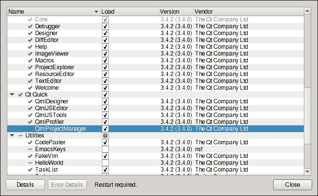

第一个部分包含一系列 `import` 语句，这些语句定义了可以在特定文档中使用的组件范围。在其最简单的形式中，每个语句由 `import` 关键字后跟要导入的模块 URI（名称）和模块版本组成。以下语句导入了版本 2.1 的 `QtQuick` 模块：

```cpp
import QtQuick 2.1
```

第二个部分包含一个对象层次结构的定义。每个对象声明由两部分组成。首先，你必须指定对象类型，然后跟随着用大括号括起来的详细定义。由于详细定义可以是空的，因此最简单的对象声明类似于以下内容：

```cpp
Item { }
```

这声明了一个 `Item` 元素的实例，这是最基础的 Qt Quick 元素，它代表用户界面中的一个抽象项，没有任何视觉外观。

## 元素属性

QML 中的每个元素类型都定义了一组属性。这些属性的值可以作为对象详细定义的一部分来设置。`Item` 类型提供了一些属性来指定项的几何形状：

```cpp
Item {
  x: 10
  y: 20
  width: 400
  height: 300
}
```

`Item` 是一个非常有趣和有用的元素，但由于它是完全透明的，我们将现在关注其子类型，该子类型绘制一个填充矩形。这种类型被称为 `Rectangle`。它有许多额外的属性，其中之一是用于指定矩形填充颜色的 `color` 属性。为了定义一个红色方块，我们可以编写以下代码：

```cpp
Rectangle {
  color: "red"
  width: 400
  height: 400
}
```

这段代码的问题在于，如果我们决定更改方块的大小，我们必须分别更新两个属性的值。然而，我们可以利用声明式方法的力量，将其中一个属性指定为与其他属性的关系：

```cpp
Rectangle {
  color: "red"
  width: 400
 height: width
}
```

这被称为**属性绑定**。它与常规的值赋值不同，将高度值绑定到宽度值。每当宽度发生变化时，高度值会反映这种变化。

注意，在定义中语句的顺序并不重要，因为你在声明属性之间的关系。以下声明与上一个声明在语义上是相同的：

```cpp
Rectangle {
  height: width
  color: "red"
  width: 400
}
```

你不仅可以绑定一个属性到另一个属性的值，还可以绑定到任何返回值的 JavaScript 语句。例如，我们可以通过使用三元条件表达式运算符来声明矩形颜色取决于元素的宽度和高度的比例：

```cpp
Rectangle {
  width: 600
  height: 400
 color: width > height ? "red" : "blue"
}
```

当对象的`width`或`height`发生变化时，绑定到`color`属性的语句将被重新评估，如果矩形的`width`大于其`height`，则矩形将变为红色；否则，它将是蓝色。

属性绑定语句也可以包含函数调用。我们可以扩展`color`声明，如果矩形是正方形，则使用自定义函数来使用不同的颜色：

```cpp
Rectangle {
  width: 600
  height: 400
 color: colorFromSize()

 function colorFromSize() {
 if(width == height) return "green"
 if(width > height) return "red"
 return "blue"
 }
}
```

QML 尽力确定函数值何时可能发生变化，但它并非万能。对于我们的最后一个函数，它可以很容易地确定函数结果依赖于`width`和`height`属性的值，因此如果这两个值中的任何一个发生变化，它将重新评估绑定。然而，在某些情况下，它无法知道函数在下一次调用时可能会返回不同的值，在这种情况下，该语句将不会被重新评估。考虑以下函数：

```cpp
function colorByTime() {
  var d = new Date()
  var minutes = d.getMinutes()
  if(minutes < 15) return "red"
  if(minutes < 30) return "green"
  if(minutes < 45) return "blue"
  return "purple"
}
```

将`color`属性绑定到该函数的结果将不会正常工作。QML 仅在对象初始化时调用此函数一次，并且它永远不会再次调用。这是因为它无法知道该函数的值依赖于当前时间。稍后，我们将看到如何通过一点命令式代码和一个计时器来克服这个问题。

## 组属性

`Rectangle`元素不仅允许我们定义填充颜色，还可以定义轮廓大小和颜色。这是通过使用`border.width`和`border.color`属性来完成的。你可以看到它们有一个共同的前缀，后面跟着一个点。这意味着这些属性是属性组`border`的子属性。有两种方法可以将值绑定到这些属性。第一种方法是使用点表示法：

```cpp
Rectangle {
  color: "red"
  width: 400
  height: 300
 border.width: 4
 border.color: "black"
}
```

另一种方法，如果你想在单个组中设置大量子属性，特别有用，是使用括号来包围组中的定义：

```cpp
Rectangle {
  color: "red"
  width: 400
  height: 300
 border {
 width: 4
 color: "black"
 }
}
```

## 对象层次结构

我们说过，QML 是关于定义对象层次结构的。你可以以最简单的方式做到这一点——通过将一个对象声明放入另一个对象的声明中。为了创建一个包含圆角框架和一些文本的按钮样式的对象，我们将结合一个`Rectangle`元素和一个`Text`元素：

```cpp
Rectangle {
  border { width: 2; color: "black" }
  radius: 5
  color: "transparent"
  width: 50; height: 30

  Text {
    text: "Button Text"
  }
}
```

### 注意

你可以使用分号而不是换行符来在 QML 中分隔语句，以获得更紧凑的对象定义，但会牺牲可读性。

运行此代码会产生与以下图示类似的结果：

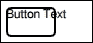

如我们所见，这看起来并不好——框架不够大，无法容纳文本，因此文本流出了框架之外。此外，文本的位置也不正确。

与子小部件被剪裁到其父几何形状的 widgets 不同，Qt Quick 项目可以定位在其父元素之外。

由于我们没有指定文本的 *x* 和 *y* 坐标，它们被设置为默认值，即 `0`。因此，文本被固定在框架的左上角，并流出了框架的右边缘。

为了纠正这种行为，我们可以将框架的宽度绑定到文本的宽度。为此，在矩形宽度的属性绑定中，我们必须指定我们想要使用文本对象的宽度。QML 提供了一个名为 `id` 的伪属性，允许程序员命名对象。让我们为 `Text` 元素提供一个 ID，并将外部对象的宽度绑定到文本的宽度，同时也要对高度做同样的绑定。同时，让我们稍微重新定位文本，为框架和文本本身之间的四个像素提供填充：

```cpp
Rectangle {
  border { width: 2; color: "black" }
  radius: 5
  color: "transparent"
 width: buttonText.width+8; height: buttonText.height+8

  Text {
 id: buttonText
    text: "Button Text"
 x:4; y: 4
  }
}
```

如以下图像所示，这样的代码可以工作，但仍然存在问题：

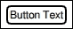

如果你将空文本设置到内部元素中，矩形宽度和高度将降至 `8`，这看起来并不好。如果文本非常长，看起来也会很糟糕：

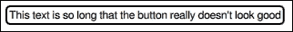

让我们进一步复杂化问题，通过向矩形添加另一个子元素来给按钮添加一个图标。Qt Quick 提供了一个 `Image` 类型来显示图像，所以让我们用它来将图标定位在文本的左侧：

```cpp
Rectangle {
 id: button
  border { width: 2; color: "black" }
  radius: 5
  color: "transparent"
 width: 4 + buttonIcon.width + 4 + buttonText.width + 4
 height: Math.max(buttonIcon.height, buttonText.height) + 8

 Image {
 id: buttonIcon
 source: "edit-undo.png"
 x: 4; y: button.height/2-height/2
 }
  Text { 
    id: buttonText
    text: "Button Text"
 x: 4+buttonIcon.width+4
 y: button.height/2-height/2
  }
}
```

在此代码中，我们使用了 JavaScript 中可用的 `Math.max` 函数来计算按钮的高度，并修改了内部对象的 *y* 属性的定义，以在按钮中垂直居中。`Image` 的源属性包含要显示在项目中的图像的文件 URL。

### 注意

URL 可以指向本地文件，也可以指向远程 HTTP 资源。在这种情况下，如果远程机器可访问，文件将自动从远程服务器获取。

代码的结果可以在以下图像中看到：

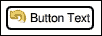

计算每个内部元素的位置以及按钮框架的大小变得越来越复杂。幸运的是，我们不必这样做，因为 Qt Quick 通过将某些对象的某些点附着到另一个对象的点上，提供了一种更好的管理项目几何形状的方法。这些点被称为锚线。以下锚线对每个 Qt Quick 项目都是可用的：

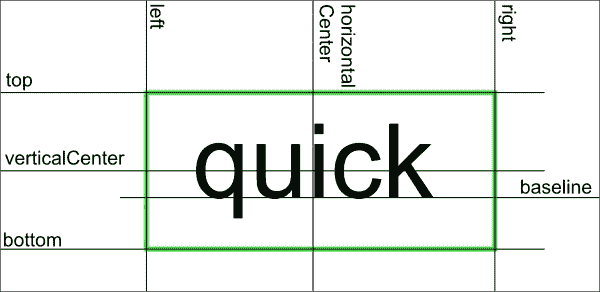

你可以建立锚点线之间的绑定来管理项目的相对位置。每个锚点线由两个属性表示——一个可以绑定到某物，另一个可以绑定从某物绑定。要绑定的锚点是对象的常规属性。它们可以作为在锚点属性组中定义的属性的绑定参数。因此，要将当前对象的 "left" 锚点绑定到 `otherObject` 对象的 "right" 锚点，可以编写如下代码：

```cpp
anchors.left: otherObject.right
```

除了指定任意数量的锚点绑定之外，我们还可以为每个锚点（或所有锚点）设置边距，以偏移两个绑定的锚点线。使用锚点，我们可以简化之前的按钮定义：

```cpp
Rectangle {
  border { width: 2; color: "black" }
  radius: 5
  color: "transparent"
  width: 4 + buttonIcon.width + 4 + buttonText.width + 4
  height: Math.max(buttonIcon.height, buttonText.height) + 8

  Image {
    id: buttonIcon
    source: "edit-undo.png"
 anchors {
 left: parent.left;
 leftMargin: 4;
 verticalCenter: parent.verticalCenter
 }
  }
  Text {
    id: butonText
    text: "Button Text"
 anchors {
 left: buttonIcon.right;
 leftMargin: 4;
 verticalCenter: parent.verticalCenter
 }
  }
}
```

你可以看到 `button` ID 已经不再使用了。取而代之的是，我们使用 `parent`，这是一个始终指向项目父项的属性。

# 行动时间 – 创建按钮组件

作为练习，让我们尝试使用到目前为止所学的内容来创建一个更完整且更好的按钮组件。按钮应具有圆角形状和漂亮的背景，并应包含可定义的文本和图标。按钮应适用于不同的文本和图标。

首先，在 Qt Creator 中创建一个新的项目。选择 **Qt Quick UI** 作为项目类型。当被问及组件集时，选择 Qt Quick 的最低可用版本：

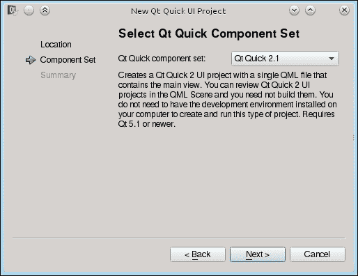

到目前为止，你应该有一个包含两个文件的项目——一个带有 QML 项目扩展名的文件，这是你的项目管理文件，另一个带有 QML 扩展名的文件，这是你的主要用户界面文件。你可以看到这两个文件都包含 QML 定义。这是因为 Qt Creator 使用 QML 本身来管理 Qt Quick 项目（你会注意到它导入了 `QmlProject` 模块）。

为我们创建的 QML 文档包含一个 "Hello World" 示例代码，我们可以将其作为 Qt Quick 实验的起点。如果你转到 **项目** 面板并查看项目的 **运行配置**，你会注意到它使用了一个名为 QML Scene 的东西来运行你的项目。此配置调用一个名为 `qmlscene` 的外部应用程序，该程序能够加载并显示任意 QML 文档。如果你运行示例代码，你应该看到一个带有一些居中文本的白色窗口。如果你在窗口的任何地方点击，应用程序将关闭。

首先，让我们创建按钮框架。将`Text`项目替换为`Rectangle`项目。你可以看到，通过使用我们之前未提及的`centerIn`锚点绑定，文本被居中显示在窗口中。这是两个特殊锚点之一，提供便利以避免编写过多的代码。使用`centerIn`相当于设置`horizontalCenter`和`verticalCenter`。另一个便利绑定是`fill`，它使一个项目占据另一个项目的整个区域（类似于将左、右、上、下锚点设置为目的地项目中的相应锚点线）。

让我们通过设置一些基本属性来给按钮面板一个基本的样式。这次，我们不会为按钮设置纯色，而是声明背景为线性渐变。将`Text`定义替换为以下代码：

```cpp
Rectangle {
  id: button
  anchors.centerIn: parent
  border { width: 1; color: "black" }
  radius: 5
  width: 100; height: 30
  gradient: Gradient {
    GradientStop { position: 0; color: "#eeeeee" }
    GradientStop { position: 1; color: "#777777" }
  }
}
```

运行项目后，你应该看到以下类似的结果图像：

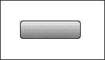

## *刚才发生了什么？*

我们将一个`Gradient`元素绑定到渐变属性，并定义了两个`GradientStop`元素作为其子元素，其中我们指定了两种颜色进行混合。`Gradient`不继承自`Item`，因此不是一个视觉 Qt Quick 元素。相反，它只是一个作为渐变定义数据持有者的对象。

`Item`类型有一个名为`children`的属性，包含一个项目视觉子项（`Item`实例）的列表，还有一个名为`resources`的属性，包含一个项目非视觉对象（如`Gradient`或`GradientStop`）的列表。通常，在向项目添加视觉或非视觉对象时，你不需要使用这些属性，因为项目会自动将子对象分配到适当的属性中。请注意，在我们的代码中，`Gradient`对象不是`Rectangle`的子对象；它只是被分配到其`gradient`属性。

# 执行动作 – 添加按钮内容

下一步是向按钮添加文本和图标。我们将通过使用另一种项目类型`Row`来完成此操作，如下所示：

```cpp
Rectangle {
  id: button
  // …
  gradient: Gradient {
    GradientStop { position: 0; color: "#eeeeee" }
    GradientStop { position: 1; color: "#777777" }
  }
  width: buttonContent.width+8
  height: buttonContent.height+8

  Row {
    id: buttonContent
    anchors.centerIn: parent
    spacing: 4

    Image {
        id: buttonIcon
        source: "edit-undo.png"
    }
    Text {
        id: buttonText
        text: "ButtonText"
    }
  }
}
```

你将得到以下输出：

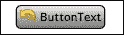

## *刚才发生了什么？*

`Row`是四种位置器类型之一（其他为`Column`、`Grid`和`Flow`），它将子项水平展开。这使得在不使用锚点的情况下定位一系列项目成为可能。`Row`有一个间距属性，用于指定项目之间应留多少空间。

# 执行动作 – 正确设置按钮大小

我们当前的面板定义在调整按钮大小时仍然表现不佳。如果按钮内容非常小（例如，图标不存在或文本非常短），按钮看起来将不会很好。通常，按钮强制执行最小尺寸–如果内容小于指定的尺寸，按钮将扩展到允许的最小尺寸。另一个问题是用户可能想要覆盖项的宽度和高度。在这种情况下，按钮的内容不应超出按钮的边界。让我们通过用以下代码替换`width`和`height`属性绑定来修复这两个问题：

```cpp
clip: true
implicitWidth: Math.max(buttonContent.implicitWidth+8, 80)
implicitHeight: buttonContent.implicitHeight+8
```

## *刚才发生了什么？*

`implicitWidth`和`implicitHeight`属性可以包含项目希望拥有的所需大小。它是从小部件世界中的`sizeHint()`的直接等价物。通过使用这两个属性而不是`width`和`height`（默认情况下它们绑定到`implicitWidth`和`implicitHeight`），我们允许组件的使用者覆盖这些隐式值。当这种情况发生且用户没有设置足够宽或高以包含图标和按钮文本时，我们通过将`clip`属性设置为`true`来防止内容超出父项的边界。

# 行动时间 – 将按钮制作成可重用组件

到目前为止，我们一直在处理单个按钮。通过复制代码、更改所有组件的标识符以及将不同的绑定设置到属性上，添加另一个按钮是非常繁琐的任务。相反，我们可以将我们的按钮项制作成一个真正的组件，即一个新的 QML 类型，可以根据需要实例化，所需次数不限。

首先，将文本光标定位在按钮定义的大括号开括号之前，然后在键盘上按*Alt* + *Enter*以打开重构菜单，如下截图所示：

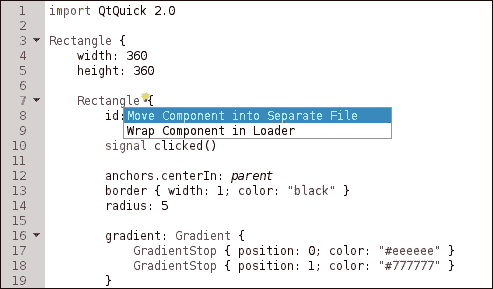

从菜单中选择**将组件移动到单独的文件**。在弹出的对话框中，输入新类型的名称（例如，`按钮`）并通过点击**确定**按钮接受对话框：

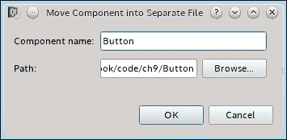

## *刚才发生了什么？*

您可以看到项目中有一个名为`Button.qml`的新文件，它包含按钮项曾经拥有的所有内容。主文件被简化为以下类似的内容：

```cpp
import QtQuick 2.0

Rectangle {
  width: 360
  height: 360
  Button {
    id: button
  }
}
```

`Button` 已经成为一个组件——一个新类型元素的定义，它可以像导入 QML 的元素类型一样使用。记住，QML 组件名称以及代表它们的文件名称需要以大写字母开头！如果你将文件命名为 "button.qml" 而不是 "Button.qml"，那么你将无法使用 "Button" 作为组件名称，尝试使用 "button" 代替将会导致错误信息。这同样适用于两种情况——每个以大写字母开头的 QML 文件都可以被视为组件定义。我们稍后会更多地讨论组件。

# 事件处理器

Qt Quick 旨在用于创建高度交互的用户界面。它提供了一些元素，用于从用户那里获取输入事件。

## 鼠标输入

在所有这些中，最简单的是 `MouseArea`。它定义了一个透明的矩形，暴露了与鼠标输入相关的多个属性和信号。常用的信号包括 clicked、pressed 和 released。让我们做一些练习，看看这个元素如何使用。

# 开始行动——使按钮可点击

到目前为止，我们的组件看起来就像一个按钮。接下来的任务是让它能够响应鼠标输入。正如你可能猜到的，这是通过使用 `MouseArea` 元素来实现的。

将一个 `MouseArea` 子项添加到按钮中，并使用锚点使其填充按钮的整个区域。将此元素命名为 `buttonMouseArea`。将以下代码放入项的主体中：

```cpp
Rectangle {
  id: button
  // ... 
  Row { ... }
 MouseArea {
 id: buttonMouseArea

 anchors.fill:parent
 onClicked: button.clicked()
 }
}
```

除了这个之外，在按钮对象的 ID 声明之后设置以下声明：

```cpp
Rectangle {
  id: button

 signal clicked()
  // ...
}
```

为了测试修改，在按钮对象定义的末尾添加以下代码，就在闭合括号之前：

```cpp
onClicked: console.log("Clicked!")
```

然后，运行程序并点击按钮。你会在 Creator 的控制台中看到你的消息被打印出来。恭喜你！

## *发生了什么？*

使用 `clicked()` 信号语句，我们声明按钮对象会发出一个名为 clicked 的信号。通过 `MouseArea` 元素，我们定义了一个矩形区域（覆盖整个按钮），该区域会响应鼠标事件。然后，我们定义了 `onClicked`，这是一个信号处理器。对于对象拥有的每个信号，都可以将一个脚本绑定到以信号名命名并以 "on" 为前缀的处理程序；因此，对于 clicked 信号，处理程序被命名为 `onClicked`，而对于 `valueChanged`，它被命名为 `onValueChanged`。在这种情况下，我们定义了两个处理程序——一个用于按钮，我们在控制台写入一个简单的语句，另一个用于 `MouseArea` 元素，我们调用按钮的信号函数，从而有效地发出该信号。

`MouseArea` 有更多功能，所以现在让我们尝试正确使用它们，使我们的按钮功能更丰富。

# 开始行动——可视化按钮状态

目前，点击按钮没有视觉反应。在现实世界中，按钮有一定的深度，当你按下它并从上方看时，其内容似乎会稍微向右和向下移动。让我们通过利用`MouseArea`具有的按下属性来模拟这种行为，该属性表示鼠标按钮是否当前被按下（注意，按下属性与前面提到的按下信号不同）。按钮的内容由`Row`元素表示，因此在其定义内添加以下语句：

```cpp
Row {
  id: buttonContent
  // …
  anchors.verticalCenterOffset: buttonMouseArea.pressed ? 1 : 0
  anchors.horizontalCenterOffset: buttonMouseArea.pressed ? 1 : 0
  // …
}
```

我们还可以使文本在鼠标光标悬停在按钮上时改变颜色。为此，我们必须做两件事。首先，让我们通过设置`hoverEnabled`属性来启用`MouseArea`接收悬停事件：

```cpp
hoverEnabled: true
```

当此属性被设置时，`MouseArea`将在检测到鼠标光标在其自身区域上方时，将它的`containsMouse`属性设置为`true`。我们可以使用这个值来设置文本颜色：

```cpp
Text {
  id: buttonText
  text: "ButtonText"
 color: buttonMouseArea.containsMouse ? "white" : "black"
}
```

## *发生了什么？*

在上一个练习中，我们学习了如何使用`MouseArea`的一些属性和信号来使按钮组件更加交互式。然而，这个元素的功能要丰富得多。特别是，如果启用了悬停事件，你可以通过返回值的`mouseX`和`mouseY`属性在项目的局部坐标系中获取当前鼠标位置。通过处理`positionChanged`信号也可以报告光标位置。说到信号，大多数`MouseArea`信号都携带一个`MouseEvent`对象作为它们的参数。这个参数被称为`mouse`，并包含有关鼠标当前状态的有用信息，包括其位置和当前按下的按钮：

```cpp
MouseArea {
  anchors.fill: parent
  hoverEnabled: true

  onClicked: {
    switch(mouse.button) {
      case Qt.LeftButton:   console.log("Left button clicked"); break;
      case Qt.MiddleButton: console.log("Middle button clicked"); break;
      case Qt.RightButton:  console.log("Right button clicked"); break;
    }
  }
  onPositionChanged: {
    console.log("Position: ["+mouse.x+"; "+mouse.y+"]")
  }
}
```

# 行动时间 - 通知环境按钮状态

我们添加了一些代码，通过改变其视觉外观使按钮看起来更自然。现在，让我们扩展按钮编程接口，以便开发者可以使用更多按钮功能。

我们可以做的第一件事是为按钮引入一些新的属性，使其颜色可定义。让我们将高亮代码放在按钮组件定义的开始部分：

```cpp
Rectangle {
  id: button
 property color topColor: "#eeeeee"
 property color bottomColor: "#777777"
 property color textColor: "black"
 property color textPressedColor: "white"
  signal clicked()
```

然后，我们将使用新的背景渐变定义：

```cpp
gradient: Gradient {
  GradientStop { position: 0; color: button.topColor }
  GradientStop { position: 1; color: button.bottomColor }
}
```

现在对于文本颜色：

```cpp
Text {
  id: buttonText
  text: "ButtonText"
 color: buttonMouseArea.containsMouse ?
 button.textPressedColor : button.textColor
}
```

此外，请注意，我们使用了`MouseArea`的`pressed`属性来检测当前是否在区域上按下鼠标按钮。我们可以给我们的按钮配备一个类似的属性。将以下代码添加到`Button`组件中：

```cpp
property alias pressed: buttonMouseArea.pressed
```

## *发生了什么？*

第一组更改引入了四个新属性，定义了四种颜色，我们后来在定义按钮渐变和文本颜色时使用了这些颜色。在 QML 中，你可以使用`property`关键字为对象定义新属性。关键字后面应跟属性类型和属性名称。QML 理解许多属性类型，最常见的是 int、real、string、font 和 color。属性定义可以包含一个可选的默认值，该值以冒号开头。对于`pressed`属性定义，情况则不同。对于属性类型，定义中包含单词 alias。它不是一个属性类型，而是一个指示符，表示该属性实际上是另一个属性的别名——每次访问按钮的`pressed`属性时，都会返回`buttonMouseArea.pressed`属性的值，每次属性值改变时，实际上是鼠标区域的属性被真正改变。使用常规属性声明时，你可以提供任何有效的表达式作为默认值，因为表达式绑定到属性上。使用属性别名时，情况则不同——值是强制性的，并且必须指向相同或另一个对象的现有属性。你可以将属性别名视为 C++中的引用。

考虑以下两个定义：

```cpp
property int foo: someobject.prop
property alias bar: someobject.prop
```

初看之下，它们很相似，因为它们指向相同的属性，因此返回的属性值是相同的。然而，这些属性实际上非常不同，如果你尝试修改它们的值，这一点就会变得明显：

```cpp
  foo = 7
  bar = 7
```

第一个属性实际上有一个表达式绑定到它，所以将`7`赋值给`foo`只是释放了绑定，并将值`7`赋给`foo`属性，而`someobject.prop`保持其原始值。然而，第二个语句却像 C++引用一样操作；因此，赋值新值将修改别名真正指向的`someobject.prop`属性。

说到属性，当属性值被修改时，有一个简单的方法可以做出反应。对于每个现有属性，都有一个处理程序可用，每当属性值被修改时都会执行该处理程序。处理程序名称是`on`后跟属性名称，然后是单词`Changed`，全部使用驼峰式命名法——因此，对于 foo 属性，它变为`onFooChanged`，对于`topColor`，它变为`onTopColorChanged`。要将按钮当前的按下状态记录到控制台，我们只需要实现此属性的属性更改处理程序：

```cpp
Button {
  // …

  onPressedChanged: {
  console.log("The button is currently "
  +(pressed ? "" : "not ")+"pressed")
}
```

## 触摸输入

如前所述，`MouseArea`是输入事件元素中最简单的。如今，越来越多的设备具有触摸功能，Qt Quick 也能处理它们。目前，我们有三种处理触摸输入的方法。

首先，我们可以继续使用 `MouseArea`，因为简单的触摸事件也被报告为鼠标事件；因此，点击和滑动手指在屏幕上是支持的。以下练习在触摸设备上使用鼠标作为输入时也有效。

# 操作时间 - 拖动项目

创建一个新的 `Qt Quick UI` 项目。通过丢弃现有的子项目并添加一个圆形来修改默认代码：

```cpp
Rectangle {
  id: circle
  width: 60; height: width
  radius: width/2
  color: "red"
}
```

接下来，使用 `MouseArea` 的 `drag` 属性来通过触摸（或鼠标）启用移动圆形：

```cpp
MouseArea {
  anchors.fill: parent
  drag.target: circle
}
```

然后，你可以启动应用程序并开始移动圆形。

## *发生了什么？*

通过定义一个高度等于宽度的矩形来创建一个圆形，使其成为正方形，并将边框圆滑到边长的一半。`drag` 属性可以用来告诉 `MouseArea` 使用输入事件管理给定项目在区域元素中的位置。我们使用目标子属性来表示要拖动的项目。你可以使用其他子属性来控制项目允许移动的轴或限制移动到给定区域。要记住的一个重要事情是，正在拖动的项目不能在请求拖动的轴上锚定；否则，项目将尊重锚点而不是拖动。我们没有将我们的圆形项目锚定，因为我们希望它可以在两个轴上拖动。

处理 Qt Quick 应用程序中触摸输入的第二种方法是使用 `PinchArea`，它是一个类似于 `MouseArea` 的项目，但它不是拖动项目，而是允许你使用两个手指（所谓的“捏合”手势）旋转或缩放它，如图所示。请注意，`PinchArea` 只对触摸输入做出反应，因此要测试示例，你需要一个真正的触摸设备。

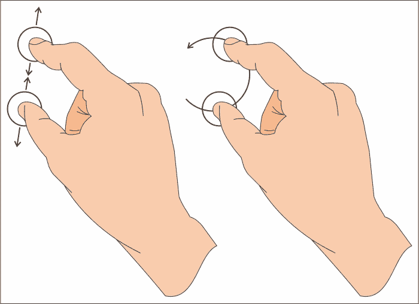

# 操作时间 - 通过捏合旋转和缩放图片

开始一个新的 `Qt Quick UI` 项目。在 QML 文件中，删除除外部项目之外的所有内容。然后，向 UI 添加一个图像并将其居中在其父元素中：

```cpp
Image {
  id: image
  anchors.centerIn: parent
  source: "wilanow.jpg"
}
```

现在，我们将添加一个 `PinchArea` 元素。这类项目可以用两种方式使用——要么通过手动实现信号处理程序 `onPinchStarted`、`onPinchUpdated` 和 `onPinchFinished` 以完全控制手势的功能，要么通过使用类似于 `MouseArea` 拖动属性的简化界面。由于简化界面正好符合我们的需求，因此无需手动处理捏合事件。让我们将以下声明添加到文件中：

```cpp
PinchArea {
  anchors.fill: parent
  pinch {
    target: image
    minimumScale: 0.2; maximumScale: 2.0
    minimumRotation: -90; maximumRotation: 90
  }
}
```

你将得到一个类似于以下截图的输出：

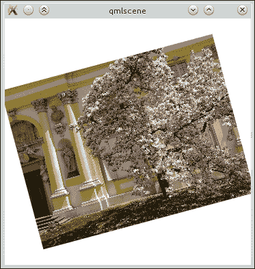

## *发生了什么？*

我们简单的应用程序加载一张图片并将其在视图中居中。然后，有一个`PinchArea`项目填充视图区域，它被指示对图像对象进行操作。我们定义了项目缩放和旋转的范围。其余的由`PinchArea`项目本身处理。如果你开始与应用程序交互，你会看到项目旋转和缩放。实际上幕后发生的事情是`PinchArea`修改了每个 Qt Quick 项目所拥有的两个属性值——`rotation`和`scale`。

### 注意

`PinchArea`也可以通过`pinch.dragAxis`控制项目的拖动，就像`MouseArea`通过拖动一样，但为了简单起见，我们没有使用这个 API 的部分。请随意在自己的代码中实验它。

## 尝试一下英雄般的旋转和缩放——使用鼠标

当然，你不必使用`PinchArea`来旋转或缩放项目。控制这些方面的属性是常规属性，你可以在任何时候读取和写入它们。尝试用`MouseArea`替换`PinchArea`，通过修改缩放和旋转属性作为接收鼠标事件的结果来获得类似的效果——当用户按住左键拖动鼠标时，图像被缩放；当用户按住右键做同样的事情时，图像被旋转。你可以通过操作`acceptedButtons`属性来控制哪些按钮触发鼠标事件（将`acceptedButtons`设置为`Qt.LeftButton|Qt.RightButton`将导致两个按钮都触发事件）。触发事件的按钮通过事件对象的`button`属性报告（称为`mouse`），所有当前按下的按钮列表都可在`button`属性中找到：

```cpp
MouseArea {
  acceptedButtons: Qt.LeftButton|Qt.RightButton
  onPositionChanged: console.log(mouse.button)
}
```

如果你完成了这个任务，尝试再次用`PinchArea`替换`MouseArea`，但这次不是使用`pinch`属性，而是手动处理事件以获得相同的效果（事件对象称为`pinch`，并且有许多你可以操作的属性）。

处理触摸输入的第三种方法是使用`MultiPointTouchArea`项目。它通过分别报告每个触摸点提供对手势的低级接口。它可以用来创建类似于`PinchArea`的自定义高级手势处理器。

## 键盘输入

到目前为止，我们一直在处理指针输入，但用户输入不仅仅是那样——我们还可以处理键盘输入。这相当简单，基本上归结为两个简单的步骤。

首先，你必须通过声明特定项目具有键盘焦点来启用接收键盘事件：

```cpp
focus: true
```

然后，你可以通过以类似处理鼠标事件的方式编写处理程序来开始处理事件。然而，`Item`没有提供自己的处理程序来操作键，这是`QWidget`的`keyPressEvent`和`keyReleaseEvent`的对应物。相反，`Keys`附加属性提供了适当的处理程序。

附加属性是由不作为独立元素使用的元素提供的，而是通过附加到其他对象来为它们提供属性。这是在不修改原始元素 API 的情况下添加对新属性支持的一种方式（它不是通过**is-a**关系添加新属性，而是通过**has-a**关系）。每个引用附加属性的对象都会获得一个附加对象的副本，然后处理额外的属性。我们将在本章的后面部分回到附加属性。现在，你只需要记住，在某些情况下，一个元素可以获取不属于其 API 的附加属性。

让我们回到实现键盘输入的事件处理器。正如我们之前所说的，每个 Item 都有一个名为`Keys`的附加属性，它允许我们安装自己的键盘处理器。`Keys`为`Item`添加的基本两个信号是按下和释放；因此，我们可以实现具有`KeyEvent`参数的`onPressed`和`onReleased`处理器，这些参数提供的信息与在控件世界中`QKeyEvent`类似。作为一个例子，我们可以看到一个检测空格键被按下的项目：

```cpp
Rectangle {
  focus: true
  Keys.onPressed:  { if(event.key == Qt.Key_Space) color = "red"  }
  Keys.onReleased: { if(event.key == Qt.Key_Space) color = "blue" }
}
```

如果你想在同一个项目中处理许多不同的键，可能会出现问题，因为`onPressed`处理器可能包含一个巨大的 switch 部分，其中包含每个可能键的分支。幸运的是，`Keys`提供了更多的属性。大多数常用的键（但不是字母）都有自己的处理器，当特定键被按下时会被调用。因此，我们可以轻松实现一个项目，根据最后按下的键来改变不同的颜色：

```cpp
Rectangle {
  focus: true
  Keys.onSpacePressed:      color = "purple"
  Keys.onReturnPressed:     color = "navy"
  Keys.onVolumeUpPressed:   color = "blue"
  Keys.onRightPressed:      color = "green"
  Keys.onEscapePressed:     color = "yellow"
  Keys.onTabPressed:        color = "orange"
  Keys.onDigit0Pressed:     color = "red"
}
```

请注意，即使某个键有自己的按下信号，仍然只有一个释放信号。

现在，考虑另一个例子：

```cpp
import QtQuick 2.1
Item {
  property int number: 0
  width: 200; height: width
  focus: true
  Keys.onSpacePressed: number++

  Text { text: number; anchors.centerIn: parent }
}
```

我们预计，当我们按下并保持空格键时，我们会看到文本从`0`变为`1`并保持在该值，直到我们释放键。如果你运行示例，你会看到相反的情况，数字会一直增加，只要你按住键。这是因为默认情况下，键会自动重复——当你按住键时，操作系统会持续发送一系列针对该键的按下-释放事件（你可以通过在`Keys.onPressed`和`Keys.onReleased`处理器中添加`console.log()`语句来验证这一点）。为了抵消这种效果，你可以禁用系统中的键重复（当然，如果有人在自己的计算机上安装了你的程序，这将不起作用）或者你可以区分自动重复和常规事件。在 Qt Quick 中，你可以轻松地做到这一点，因为每个键事件都携带适当的信息。只需用以下处理器替换最后一个示例中的处理器即可：

```cpp
Keys.onSpacePressed: if(!event.isAutoRepeat) number++
```

我们在这里使用的事件变量是`spacePressed`信号的参数名称。由于我们无法像在 C++中那样为参数声明自己的名称，对于每个信号处理器，你将不得不在文档中查找参数的名称，如下所示：


在标准的 C++ 应用程序中，我们通常使用 *Tab* 键在可聚焦项之间导航。在游戏（以及通用的流畅用户界面）中，更常见的是使用箭头键进行项目导航。当然，我们可以通过使用 `Keys` 附加属性并为每个我们想要修改所需项目焦点属性的项添加 `Keys.onRightPressed`、`Keys.onTabPressed` 和其他信号处理程序来处理这种情况，但这会使我们的代码很快变得杂乱。Qt Quick 再次伸出援手，通过提供 `KeyNavigation` 附加属性来处理这种情况，该属性旨在处理这种特定情况，并允许我们极大地简化所需的代码。现在，我们只需指定在触发特定键时哪个项目应该获得焦点：

```cpp
Row {
  spacing: 5

  Rectangle {
    id: first
    width: 50; height: width
    color: focus ? "blue" : "lightgray"
    focus: true

    KeyNavigation.right: second
  }
  Rectangle {
    id: second
    width: 50; height: width
    color: focus ? "blue" : "lightgray"

    KeyNavigation.right: third
    KeyNavigation.left: first
  }
  Rectangle {
    id: third
    width: 50; height: width
    color: focus ? "blue" : "lightgray"

    KeyNavigation.left: second
  }
}
```

注意到我们通过显式设置焦点属性，使第一个项目在开始时获得焦点。

`Keys` 和 `KeyNavigation` 附加属性都有一种定义每个机制接收事件顺序的方法。这是通过优先级属性来处理的，它可以设置为 `BeforeItem` 或 `AfterItem`。默认情况下，`Keys` 将首先接收到事件（`BeforeItem`），然后进行内部事件处理，最后 `KeyNavigation` 将有机会处理该事件（`AfterItem`）。请注意，如果事件被其中一个机制处理，则事件被接受，其余的机制将无法处理该事件。

## 尝试一下英雄 - 练习关键事件传播

作为练习，您可以通过构建一个更大的项目数组（您可以使用 `Grid` 元素来定位它们）并定义一个利用 `KeyNavigation` 附加属性的导航系统来扩展我们的最后一个示例。让一些项目使用 `Keys` 附加属性自行处理事件。看看当同一个键被两个机制处理时会发生什么。尝试使用优先级属性来影响行为。

除了我们描述的附加属性外，Qt Quick 还提供了处理键盘输入的内置元素。最基本的两类是 `TextInput` 和 `TextEdit`，它们是 `QLineEdit` 和 `QTextEdit` 的 QML 等价物。前者用于单行文本输入，而后者作为其多行对应物。它们都提供光标处理、撤销-重做功能和文本选择。您可以通过将验证器分配给 `validator` 属性来验证 `TextInput` 中输入的文本。例如，为了获得一个用户可以输入点分隔 IP 地址的项目，我们可以使用以下声明：

```cpp
TextInput {
  id: ipAddress
  width: 100
  validator: RegExpValidator {
    regExp: /\d+\.\d+\.\d+\.\d+/ 
    /* four numbers separated by dots*/
  }
  focus: true
}
```

正则表达式仅验证地址的格式。用户仍然可以插入无效的数字。您应该在使用地址之前进行适当的检查，或者提供一个更复杂的正则表达式，以限制用户可以输入的数字范围。

有一个需要注意的事情是，`TextInput` 和 `TextEdit` 都没有任何视觉外观（除了它们包含的文本和光标之外），所以如果你想给用户一些视觉提示，说明项目在哪里定位，最简单的解决方案是将它包裹在一个样式矩形中：

```cpp
Rectangle {
  id: textInputFrame
  width: 200
  height: 40
  border { color: "black"; width: 2 }
  radius: 10
  antialiasing: true
  color: "darkGray"
}
TextInput {
  id: textInput
  anchors.fill: textInputFrame
  anchors.margins: 5
  font.pixelSize: height-2
  verticalAlignment: TextInput.AlignVCenter
  clip: true
}
```

注意高亮显示的代码——`textInput` 的 `clip` 属性被启用，这样默认情况下，如果输入框中的文本不适合项目，它将溢出到项目外并保持可见。通过启用裁剪，我们明确表示任何不适合项目的内容不应被绘制。

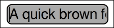

# 在 Qt Quick 中使用组件

到现在为止，你应该已经熟悉了 QML 和 Qt Quick 的基础知识。现在，我们可以开始结合你所知道的知识，并用更多信息来填补空白，构建一个功能性的 Qt Quick 应用程序。我们的目标是显示一个模拟时钟。

# 动手实践时间 – 一个简单的模拟时钟应用程序

创建一个新的 `Qt Quick UI` 项目。为了创建一个时钟，我们将实现一个代表时钟指针的组件，并在实际时钟元素中使用该组件的实例。除此之外，我们还将使时钟成为一个可重用的组件；因此，我们将它创建在一个单独的文件中，并在 `main.qml` 内部实例化它：

```cpp
import QtQuick 2.0

Clock {
  id: clock
  width:  400
  height: 400
}
```

然后，将新的 QML 文件添加到项目中，并将其命名为 `Clock.qml`。让我们首先声明一个圆形时钟盘面：

```cpp
import QtQuick 2.0

Item {
  id: clock

  property color color: "lightgray"

  Rectangle {
    id: plate

    anchors.centerIn: parent
    width: Math.min(clock.width, clock.height)
    height: width
    radius: width/2
    color: clock.color
    border.color: Qt.darker(color)
    border.width: 2
  }
}
```

如果你现在运行程序，你会看到一个朴素的灰色圆圈，几乎不像是时钟盘面：

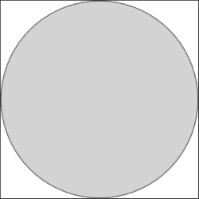

下一步是添加将盘面分成 12 个部分的标记。我们可以通过在 `plate` 对象内部放置以下声明来完成此操作：

```cpp
Repeater {
  model: 12

  Item {
    id: hourContainer

    property int hour: index
    height: plate.height/2
    transformOrigin: Item.Bottom
    rotation: index * 30
    x: plate.width/2
    y: 0

    Rectangle {
      width: 2
      height: (hour % 3 == 0) ? plate.height*0.1 
                              : plate.height*0.05
      color: plate.border.color
      antialiasing: true
      anchors.horizontalCenter: parent.horizontalCenter
      anchors.top: parent.top
      anchors.topMargin: 4
    }
  }
}
```

现在运行程序应该给出以下结果，看起来更像是一个时钟盘面：

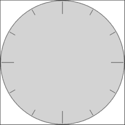

## *发生了什么？*

我们刚刚创建的代码引入了一些新功能。让我们逐一介绍它们。

首先，我们使用了一个名为 `Repeater` 的新元素。它确实如其名所示——使用给定的模型重复其内部声明的项目。对于模型中的每个条目，它都会为名为 `delegate` 的属性分配的组件创建一个实例（该属性名意味着它包含一个实体，调用者将一些责任委托给该实体，例如描述一个调用者用作模板的组件）。在 `Repeater` 中声明的 `Item` 描述了委托，尽管我们无法明确看到它被分配给任何属性。这是因为 `delegate` 是 `Repeater` 类型的默认属性，这意味着任何未明确分配给任何属性的任何内容都将隐式地分配给类型的默认属性。

`Item` 类型还有一个默认属性，称为 `data`。它包含一个元素列表，该列表会自动拆分为两个“子列表”——一个是项的子项列表（这创建了 Qt Quick 中 `Item` 实例的层次结构）和另一个名为资源的列表，它包含所有不继承自 `Item` 的“子”元素。你可以直接访问这三个列表，这意味着调用 `children[2]` 将返回在项中声明的第三个 `Item` 元素，而 `data[5]` 将返回在 `Item` 中声明的第六个元素，无论该元素是否为视觉项（继承自 `Item`）。

模型可以是许多事物，但就我们而言，它只是一个表示代理应该重复多少次的数字。要重复的组件是一个包含矩形的透明项。该项有一个名为 `hour` 的属性，它与 `index` 绑定。后者是 `Repeater` 分配给代理组件每个实例的属性。它包含的值是实例在 `Repeater` 对象中的索引——由于我们有一个包含十二个元素的模型，`index` 将在 `0` 到 `11` 的范围内持有值。项可以使用 `index` 属性来定制 `Repeater` 创建的实例。在这种情况下，我们使用 `index` 为 `rotation` 属性提供值，并通过将索引乘以 `30`，我们得到从第一个实例的 `0` 开始，到最后一个实例的 `330` 结束的值。

`rotation` 属性引出了第二个最重要的主题——项的转换。每个项都可以以多种方式转换，包括旋转项和在二维空间中缩放，正如我们之前提到的。另一个名为 `transformOrigin` 的属性表示应用缩放和旋转的原点。默认情况下，它指向 `Item.Center`，这使得项围绕其中心进行缩放和旋转，但我们可以将其更改为其他八个值，例如 `Item.TopLeft` 用于顶左角或 `Item.Right` 用于项右侧边缘的中间。在我们的代码中，我们围绕每个项的底部边缘顺时针旋转。每个项使用 `plate.width/2` 表达式在盘子的中间水平定位，并且垂直于盘子的顶部，默认宽度为 `0`，高度为盘子高度的一半；因此，每个项是贯穿顶部到盘子中心的细长垂直线。然后，每个项围绕盘子的中心（每个项的底部边缘）旋转，比前一个项多 30 度，从而有效地将项均匀地放置在盘子上。

最后，每个项目都有一个灰色的 `Rectangle` 附着在其顶部边缘（偏移量为 `4`），并在透明父元素中水平居中。应用于项目的变换会影响项目的子元素，类似于我们在 Graphics View 中看到的；因此，矩形的实际旋转遵循其父元素的旋转。矩形的高度取决于 `hour` 的值，它映射到 `Repeater` 中项目的索引。在这里，你不能直接使用 `index`，因为它仅在委托的最顶层项中可见。这就是为什么我们创建了一个真正的属性 `hour`，它可以从整个委托项层次结构中引用。

### 注意

如果你想要对项目变换有更多的控制，那么我们很高兴地告诉你，除了旋转和缩放属性之外，每个项目还可以将 `Rotation`、`Scale` 和 `Translate` 等元素数组分配给名为 `transform` 的属性，这些元素按顺序逐个应用。这些类型具有对变换进行精细控制的属性。例如，使用 `Rotation`，你可以实现沿任意三个轴的旋转以及围绕自定义原点的旋转（而不是像使用 `Item` 的 `rotation` 属性那样限制在九个预定义的原点）。

# 实践时间 – 向时钟添加指针

下一步是将小时、分钟和秒指针添加到时钟中。让我们首先在名为 `Needle.qml` 的文件中创建一个新的组件 `Needle`（记住，组件名称和表示它们的文件名需要以大写字母开头）：

```cpp
import QtQuick 2.0

Rectangle {
  id: root

  property int value: 0
  property int granularity: 60
  property alias length: root.height
  width: 2
  height: parent.height/2
  radius: width/2
  antialiasing: true
  anchors.bottom: parent.verticalCenter
  anchors.horizontalCenter: parent.horizontalCenter
  transformOrigin: Item.Bottom
  rotation: 360/granularity * (value % granularity)
}
```

`Needle` 基本上是一个矩形，通过其底部边缘锚定到父元素的中心，这也是项目的旋转中心。它还具有 `value` 和 `granularity` 属性，驱动项目的旋转，其中 `value` 是指针显示的当前值，而 `granularity` 是它可以显示的不同值的数量。此外，我们启用了指针的抗锯齿，因为我们希望指针的尖端圆润。有了这样的定义，我们可以使用该组件在时钟盘对象内部声明三个指针：

```cpp
Needle {
  length: plate.height*0.3
  color: "blue"
  value: clock.hours; granularity: 12
}
Needle {
  length: plate.height*0.4
  color: "darkgreen"
  value: clock.minutes; granularity: 60
}
Needle {
  width: 1
  length: plate.height*0.45
  color: "red"
  value: clock.seconds; granularity: 60
}
```

三个指针使用了时钟的 `hours`、`minutes` 和 `seconds` 属性，因此这些属性也需要声明：

```cpp
property int hours: 0
property int minutes: 0
property int seconds: 0
```

通过在 `main.qml` 中为 `Clock` 的属性分配不同的值，你可以使时钟显示不同的时间：

```cpp
import QtQuick 2.0

Clock {
  id: clock
  width:  400
  hours: 7
  minutes: 42
  seconds: 17
}
```

你将得到如下所示的输出：

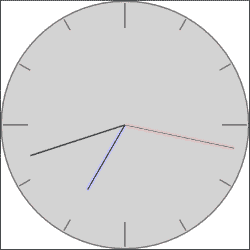

## *刚才发生了什么？*

大多数 `Needle` 功能都在组件本身中声明，包括几何形状和变换。然后，无论何时我们想要使用该组件，我们都会声明一个 `Needle` 的实例，并可选择自定义 `length` 和 `color` 属性，以及设置其 `value` 和 `granularity` 以获得我们需要的确切功能。

# 实践时间 – 使时钟功能化

创建时钟的最终步骤是让它实际显示当前时间。在 JavaScript 中，我们可以使用`Date`对象查询当前时间：

```cpp
var currentDate = new Date()
var hours   = currentDate.getHours()
var minutes = currentDate.getMinutes()
var seconds = currentDate.getSeconds()
```

因此，首先想到的是使用前面的代码来显示时钟上的当前时间：

```cpp
Item {
  id: clock
  property int hours:   currentDate.getHours()
  property int minutes: currentDate.getMinutes()
  property int seconds: currentDate.getSeconds()
  property var currentDate: new Date()
  // ...
}
```

这确实会在你启动应用程序时显示当前时间，但时钟不会随着时间流逝而更新自己。这是因为`new Date()`返回一个表示特定时刻的对象（对象实例化的那一刻的日期和时间）。我们需要的相反，是让`currentDate`属性随着当前时间的改变而更新为新对象。为了获得这种效果，我们可以使用一个`Timer`元素，它是 C++中`QTimer`的等价物，并允许我们定期执行一些代码。让我们修改代码以使用定时器：

```cpp
Item {
  id: clock
  property int hours: currentDate.getHours()
  property int minutes: currentDate.getMinutes()
  property int seconds: currentDate.getSeconds()
  readonly property var currentDate: new Date()
  property alias running: timer.running
  Timer {
    id: timer
    repeat: true
    interval: 500
    running: true
    onTriggered: clock.currentDate = new Date()
  }
}
```

## *刚才发生了什么？*

根据间隔属性，我们可以确定定时器每 500 毫秒发出一个`triggered`信号，导致`currentDate`使用一个代表当前时间的新的`Date`对象更新。时钟还得到了一个`running`属性（指向定时器中的等效属性），可以控制是否启用更新。定时器被设置为`repeat`；否则，它只会触发一次。

## 动态对象

简要总结到目前为止你所学的，我们可以这样说：你知道如何通过声明实例来创建对象层次结构，你也知道如何在单独的文件中编程新类型，使定义作为组件在其他 QML 文件中实例化可用。你甚至可以使用`Repeater`元素根据一个共同的模板声明一系列对象。

## 详细使用组件

我们承诺要给你更多关于组件的信息，现在是时候这样做。你已经知道如何在单独的文件中创建组件的基础知识。每个以大写字母开头的 QML 文件都被视为组件定义。这个定义可以直接由位于组件定义同一目录中的其他 QML 文件使用。如果你需要从位于其他位置的文件中访问组件定义，你将不得不首先在你想使用它的文件中导入包含该组件的模块。模块的定义非常简单——它只是包含 QML 文件的目录的相对路径。路径使用点作为分隔符。这意味着如果你有一个名为`Baz.qml`的文件位于名为`Base/Foo/Bar`的目录中，并且你想要在`Base/Foo/Ham.qml`文件中使用`Baz`组件，你必须在`Ham.qml`中放置以下导入语句：

```cpp
import "Bar"
```

如果你想在`Base/Spam.qml`文件中使用相同的组件，你必须将导入语句替换为：

```cpp
import "Foo.Bar"
```

导入一个模块会使所有其组件可用。然后，你可以声明从某个模块导入的类型对象。

## 按需创建对象

在 QML 文件中直接预声明对象的问题在于，你需要事先知道你需要多少个对象。更常见的情况是，你将想要动态地向你的场景添加和删除对象，例如，在一个外星人入侵游戏中，随着玩家的进步，新的外星飞碟将进入游戏屏幕，其他飞碟将被击落并摧毁。此外，玩家的飞船将“生产”新的子弹，在飞船前方划过，最终耗尽燃料或以其他方式从游戏场景中消失。通过在解决这个问题上投入大量精力，你将能够使用 `Repeater` 来获得这种效果，但手头还有更好的工具。

QML 为我们提供了另一种元素类型，称为 `Component`，这是通过在 QML 中声明其内容来向引擎介绍新元素类型的另一种方法。基本上有两种方法来做这件事。

第一种方法是，在 QML 文件中声明一个 `Component` 元素实例，并将新类型的定义直接内联在元素内部：

```cpp
Component {
  id: circleComponent
  Item {
    property int diameter: 20
    property alias color: rect.color
    property alias border: rect.border

    implicitWidth: diameter
    implicitHeight: diameter

    Rectangle {
      id: rect  
      width: radius; height: radius; radius: diameter/2
      anchors.centerIn: parent
    }
  }
}
```

这样的代码声明了一个名为 `circleComponent` 的组件，它定义了一个圆并公开了其 `diameter`、`color` 和 `border` 属性。

另一种方法是，从现有的 QML 文件中加载组件定义。QML 提供了一个特殊的全局对象 `Qt`，它提供了一套有趣的方法。其中一种方法允许调用者通过传递现有 QML 文档的 URL 来创建组件：

```cpp
var circleComponent = Qt.createComponent("circle.qml")
```

一个有趣的注意点是 `createComponent` 不仅接受本地文件路径，还可以接受远程 URL，如果它理解网络方案（例如，`http`），它将自动下载文档。在这种情况下，你必须记住这需要时间，因此组件可能在调用 `createComponent` 后不会立即就绪。由于当前加载状态保存在 `status` 属性中，你可以连接到 `statusChanged` 信号以在发生这种情况时得到通知。一个典型的代码路径看起来类似于以下：

```cpp
var circleComponent = Qt.createComponent("http://example.com/circle.qml")
if(circleComponent.status === Component.Ready) {
  // use the component
} else {
  circleComponent.statusChanged.connect(function() {
    if(circleComponent.status === Component.Ready) {
       // use the component
    }
  })
}
```

如果组件定义不正确或无法检索文档，对象的状态将变为 `Error`。在这种情况下，你可以使用 `errorString()` 方法来查看实际的问题是什么：

```cpp
if(circleComponent.status === Component.Error) {
  console.warn(circleComponent.errorString())
}
```

一旦你确认组件已准备就绪，你就可以开始从它创建对象了。为此，组件提供了一个名为 `createObject` 的方法。在其最简单的形式中，它接受一个将成为新生实例父对象的对象（类似于接受父小部件指针的控件构造函数）并返回新对象本身，以便你可以将其分配给某个变量：

```cpp
var circle = circleComponent.createObject(someItem)
```

然后，你可以开始设置对象的属性：

```cpp
circle.diameter = 20
circle.color = 'red'
```

更复杂的调用允许我们在单个调用中执行这两个操作（创建对象并设置其属性），通过将第二个参数传递给 `createObject`：

```cpp
var circle = circleComponent.createObject(someItem, {diameter: 20, color: 'red'})
```

第二个参数是一个对象（在此使用 JSON 语法创建），其属性将被应用到正在创建的对象上。这种语法的优点是，所有属性值都作为一个原子操作应用到对象上（就像在 QML 文档中声明项目时那样），而不是一系列单独的操作，每个操作都为单个属性设置值，这可能会在对象中引发一系列更改处理程序的调用。

创建后，该对象成为场景的一等公民，以与在 QML 文档中直接声明的项目相同的方式行事。唯一的区别是，动态创建的对象也可以通过调用其 `destroy()` 方法来动态销毁，这在 C++ 对象中相当于调用 `delete`。当谈到销毁动态项目时，我们必须指出，当你将 `createObject` 的结果分配给一个变量（如我们示例中的 `circle`）并且该变量超出作用域时，项目将不会被释放和垃圾回收，因为其父对象仍然持有对该对象的引用，从而阻止其被回收。

我们之前没有明确提到这一点，但我们已经在本章介绍 `Repeater` 元素时使用过内联组件定义。在重复器内定义的重复项实际上不是一个真实的项目，而是一个组件定义，该定义会根据重复器的需要被实例化多次。

## 延迟项目创建

另一个常见的场景是你知道你需要多少个元素，但问题是你不能提前确定它们的类型。在应用程序的生命周期中的某个时刻，你将了解到这些信息，并将能够实例化一个对象。在你获得有关给定组件的知识之前，你需要某种类型的项目占位符，你将在其中放置真实的项目。当然，你可以编写一些代码来使用组件的 `createObject()` 功能，但这很麻烦。幸运的是，Qt Quick 提供了一个更好的解决方案，即 `Loader` 项目。这种项目类型正是我们描述的那样——一个临时占位符，用于按需从现有组件加载真实项目。你可以将 `Loader` 放在另一个项目位置，当你需要创建此项目时，一种方法是将组件的 URL 设置为 `source` 属性：

```cpp
Loader {
  id: ldr
}
ldr.source = "MightySword.qml"You could also directly attach a real component to sourceComponent of a Loader:
Component {
  id: swordComponent
  // ...
}
Loader {
  id: ldr
  sourceComponent: shouldBeLoaded ? swordComponent : undefined
}
```

紧接着，魔法开始发挥作用，组件的一个实例出现在加载器中。如果 `Loader` 对象的大小被明确设置（例如，通过锚点或设置宽度和高度），则项目将被调整到加载器的大小。如果没有设置显式大小，那么一旦组件被实例化，`Loader` 将会调整到加载元素的大小：

```cpp
Loader {
  anchors {
    left: parent.left; leftMargin: 0.2*parent.width
    right: parent.right;
    verticalCenter: parent.verticalCenter
  }
  height: 250

  source: "Armor.qml"
}
```

在前一种情况下，加载器的大小被明确设置，因此当其项目被创建时，它将尊重此处声明的锚点和大小。

## 访问项目组件功能

Qt Quick 中的每个项目都是某种组件的实例化。每个对象都有一个附加的`Component`属性，它提供了两个信号，用于通知对象生命周期的关键时刻。第一个信号——`completed()`——在对象实例化后被触发。如果您为该信号提供处理程序，您可以在对象完全实例化后执行一些后期初始化。这个信号有很多用例，首先是向控制台记录消息：

```cpp
Rectangle {
  Component.onCompleted: console.log("Rectangle created")
}
```

该信号的更高级用法是通过对延迟昂贵的操作直到组件完全构建来优化性能：

```cpp
Item {
  id: root

  QtObject {
    id: priv
    property bool complete: false

    function layoutItems() {
      if(!complete) return
      // ...
    }
  }
  onChildrenChanged: priv.layoutItems()
  Component.onCompleted: { priv.complete = true; priv.layoutItems(); }
}
```

当项目被创建时，它们会被添加到其父级的`children`属性中。因此，随着项目的创建和销毁，该属性的值会发生变化，从而触发`childrenChanged`信号。当这种情况发生时，我们希望根据某种算法重新定位项目的子项。为此，我们有一个内部的`QtObject`实例（代表`QObject`），称为`priv`，在其中我们可以声明不会在组件定义外部可见的函数和属性。在那里，我们有一个`layoutItems()`函数，每当子项列表更新时都会被调用。如果项目是动态创建或销毁的（例如，使用`Component.createObject()`函数），这是可以的。然而，当根对象正在构建时，它可能直接在文档中声明了多个子项。在声明实例化时反复重新定位它们是没有意义的。只有当对象列表完整时，定位项目才有意义。因此，我们在私有对象中声明了一个布尔属性，表示根项是否已完全构建。在它完成之前，每次调用`layoutItems()`时，它将立即退出而不进行任何计算。当`Component.onCompleted`被调用时，我们设置标志并调用`layoutItems()`，该函数计算文档中声明的所有静态子项的几何形状。

附加的`Component`属性中的另一个信号是`destruction`。当组件仍然完全构建时，在对象销毁过程开始后立即触发。通过处理该信号，您可以执行诸如在持久存储中保存对象状态或以其他方式清理对象等操作。

## 强制性绘制

声明图形项既简单又容易，但作为程序员，我们更习惯于编写命令式代码，有些事情用算法表达比用达到最终结果的描述更容易。使用 QML 以紧凑的方式编码原始形状的定义，如矩形，很容易——我们只需要标记矩形的原点、宽度、高度，以及可选的颜色。在给定的绝对坐标中声明由许多控制点组成的复杂形状的定义，可能在其某些部分有轮廓，可能还伴随一些图像，在 QML 这样的语言中仍然是可能的；然而，这将导致一个更加冗长且可读性更差的定义。这是一个使用命令式方法可能更有效的情况。HTML（作为一种声明性语言）已经暴露了一个用于绘制不同原语（称为 `Canvas`）的经过验证的命令式接口，该接口已在许多 Web 应用程序中使用。幸运的是，Qt Quick 通过允许我们实例化 `Canvas` 元素为我们提供了类似 Web 的 `Canvas` 接口的实现。这些项目可以用来绘制直线和曲线、简单和复杂的形状、图表和图形图像。它还可以添加文本、颜色、阴影、渐变和图案。它甚至可以执行低级像素操作。最后，输出可以保存为图像文件或序列化为可由 `Image` 项目使用的 URL。关于使用 HTML 画布的许多教程和论文都可用，并且它们通常可以很容易地应用于 Qt Quick 画布（参考手册甚至包括在将 HTML 画布应用程序移植到 Qt Quick 画布时需要注意的方面列表），因此在这里我们只给出 Qt Quick 中命令式绘图的非常基础的内容。

考虑一个游戏，玩家的健康状态由他的心脏状况来衡量——心跳越慢，玩家就越健康。我们将使用这种可视化作为我们练习使用 `Canvas` 元素绘画的练习。

# 行动时间 – 准备画布以进行心跳可视化

让我们从简单的事情开始，创建一个基于最新版 Qt Quick 的快速 UI 项目。将 Creator 为我们创建的 QML 文件重命名为 `HeartBeat.qml`。打开与项目一起创建的 `qmlproject` 文件，并将 `Project` 对象的 `mainFile` 属性更改为 `HeartBeat.qml`。然后，你可以关闭 `qmlproject` 文档，返回到 `HeartBeat.qml`。在那里，你可以用以下内容替换原始内容：

```cpp
import QtQuick 2.2

Canvas {
  id: canvas

  implicitWidth: 600
  implicitHeight: 300

  onPaint: {
    var ctx = canvas.getContext("2d")
    ctx.clearRect(0, 0, canvas.width, canvas.height)
  }
}
```

当你运行项目时，你会看到一个空白窗口。

## *刚才发生了什么？*

在前面的代码中，我们创建了一个基本的模板代码，用于使用 canvas。首先，我们将现有的文件重命名为我们希望组件使用的名称，然后我们通知 Creator，当使用 `qmlscene` 运行项目时，将执行此文档。

然后，我们创建了一个具有隐式宽度和高度的 `Canvas` 实例。在那里，我们创建了一个处理 `paint` 信号的处理器，该信号在画布需要重绘时发出。放置在那里的代码检索画布的上下文，这可以被视为我们在 Qt 小部件上绘图时使用的 `QPainter` 实例的等效物。我们通知画布我们想要其 2D 上下文，这为我们提供了在二维中绘制的方式。2D 上下文是当前 `Canvas` 元素唯一存在的上下文，但你仍然必须明确地识别它——类似于 HTML。有了上下文准备就绪，我们告诉它清除画布的整个区域。这与小部件世界不同，在 `paintEvent` 处理器被调用时，小部件已经为我们清除，并且必须从头开始重绘一切。在 `Canvas` 中，情况不同；默认情况下保留以前的内容，以便你可以覆盖它。由于我们希望从一张干净的画布开始，我们在上下文中调用 `clearRect()`。

# 动手实践 – 绘制心电图

现在我们将扩展我们的组件并实现其主要功能——绘制一个类似心电图的图形。

将以下属性声明添加到 `canvas` 中：

```cpp
property int lineWidth: 2
property var points: []
property real arg: -Math.PI
```

下面，添加一个定时器的声明，该定时器将驱动整个组件：

```cpp
Timer {
  interval: 10
  repeat: true
  running: true
  onTriggered: {
    arg += Math.PI/180
    while(arg >= Math.PI) arg -= 2*Math.PI
  }
}
```

然后，定义当 `arg` 的值被修改时的处理程序：

```cpp
onArgChanged: {
  points.push(func(arg))
  points = points.slice(-canvas.width)
  canvas.requestPaint()
}
```

然后，实现 `func`：

```cpp
function func(argument) {
  var a=(2*Math.PI/10); var b=4*Math.PI/5
  return Math.sin(20*argument) * (
      Math.exp(-Math.pow(argument/a, 2)) +
      Math.exp(-Math.pow((argument-b)/a,2)) +
      Math.exp(-Math.pow((argument+b)/a,2))
  )
}
```

最后，修改 `onPaint`：

```cpp
onPaint: {
  var ctx = canvas.getContext("2d")
  ctx.reset()
  ctx.clearRect(0, 0, canvas.width, canvas.height)
  var pointsToDraw = points.slice(-canvas.width)
  ctx.translate(0, canvas.height/2)
  ctx.beginPath()
  ctx.moveTo(0, -pointsToDraw[0]*canvas.height/2)
  for(var i=1; i<pointsToDraw.length; i++)
    ctx.lineTo(i, -pointsToDraw[i]*canvas.height/2)
  ctx.lineWidth = canvas.lineWidth
  ctx.stroke()
}
```

然后，你可以运行代码，并看到类似心电图的图形出现在画布上：

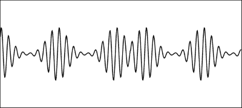

## *发生了什么？*

我们向元素添加了两种类型的属性。通过引入 `lineWidth`，我们可以操纵可视化心电图的线条宽度。`points` 和 `arg` 变量是两个辅助变量，它们存储已计算的点数数组和最后一次评估的函数参数。我们将要使用的函数是一个从 `-Π` 到 `+Π` 的周期函数；因此，我们将 `arg` 初始化为 `-Math.PI`，并在 `points` 中存储一个空数组。

然后，我们添加了一个定时器，以固定的时间间隔滴答作响，将 `arg` 增加 1°，直到它达到 `+Π`，在这种情况下，它将重置到初始值。

在我们实现的下一个处理程序中，拦截对`arg`的更改。在那里，我们将一个新的项目推送到点的数组中。这个值是通过函数`func`计算的，该函数相当复杂，但可以简单地说它返回一个在`-1`到`+1`范围内的值。然后使用`Array.slice()`对点的数组进行压缩，这样数组中最多只保留`canvas.width`个最后一个元素。这样做是为了我们可以为画布宽度的每个像素绘制一个点，并且不需要存储比所需更多的数据。在函数的末尾，我们调用`requestPaint()`，它等同于`QWidget::update()`，并安排一个调用`paint`。

这反过来又调用了我们的`onPaint`。在那里，在检索上下文后，我们将画布重置为其初始状态，然后使用`slice()`计算一个要再次绘制的点的数组。然后，我们通过在垂直轴上平移和缩放画布来准备画布，以便将原点移动到画布高度的一半（这就是为什么在程序开始时调用`reset()`的原因——为了撤销这种转换）。之后，调用`beginPath()`来通知上下文我们开始构建一个新的路径。然后，通过逐段添加线条来构建路径。每个值都乘以`canvas.height/2`，以便将点数组的值缩放到项目的大小。由于画布的垂直轴增长到底部，我们希望正值在原点线上方，因此该值被取反。之后，我们设置笔的宽度并通过调用`stroke()`来绘制路径。

# 行动时间 – 使图表更加多彩

该图表完成了它的任务，但它看起来有点单调。通过在画布对象中定义三个新的颜色属性——`color`、`topColor`和`bottomColor`——并将它们的默认值分别设置为`black`、`red`和`blue`，来给它添加一些光泽。

由于`points`和`arg`实际上不应该成为任何人都可以随意更改的公共属性，我们现在就来修正这个问题。将`QtObject`画布的子元素声明为`priv`，并设置其 ID 为`priv`。将`points`和`arg`的声明移入该对象内部。同时，将`onArgChanged`处理程序也移入那里：

```cpp
QtObject {
  id: priv
  property var points: []
  property real arg: -Math.PI

  onArgChanged: {
    points.push(func(arg))
    points = points.slice(-canvas.width)
    canvas.requestPaint()
  }
}
```

然后，在整个代码中搜索，并将所有新声明对象外部出现的`arg`和`points`的实例前缀为`priv`，这样每次调用都会指向`priv`对象。

然后，让我们利用我们通过扩展`onPaint`定义的三个颜色：

```cpp
onPaint: {
    ...
 // fill:
 ctx.beginPath()
 ctx.moveTo(0, 0)
 var i
 for(i=0; i<pointsToDraw.length; i++)
 ctx.lineTo(i, -pointsToDraw[i]*canvas.height/2)
 ctx.lineTo(i, 0)
 var gradient = ctx.createLinearGradient(0, -canvas.height/2, 0, canvas.height/2)
 gradient.addColorStop(0.1, canvas.topColor)
 gradient.addColorStop(0.5, Qt.rgba(1, 1, 1, 0))
    gradient.addColorStop(0.9, canvas.bottomColor)
    ctx.fillStyle = gradient
    ctx.fill()

    // stroke:
    ctx.beginPath()
    ctx.moveTo(0, -pointsToDraw[0]*canvas.height/2)
    for(var i=1; i<pointsToDraw.length; i++)
        ctx.lineTo(i, -pointsToDraw[i]*canvas.height/2)
    ctx.lineWidth = canvas.lineWidth
    ctx.strokeStyle = canvas.color
    ctx.stroke()
}
```

运行前面的代码片段后，你会得到以下输出：

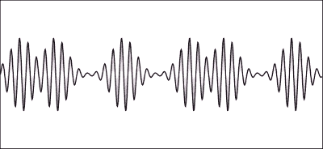

## *发生了什么？*

通过将两个属性移动到`priv`对象内部，我们实际上已经将它们作为对象的子对象（例如`priv`是`canvas`的子对象）隐藏在外部世界，因为子对象在外部定义对象的 QML 文档中是不可访问的。这确保了`points`和`arg`都不能从`HeartBeat.qml`文档外部修改。

我们对`onPaint`进行的修改是创建另一条路径，并使用该路径通过渐变填充一个区域。这条路径与原始路径非常相似，但它包含两个额外的点，即第一个和最后一个绘制到水平轴上的点。这确保了渐变能够正确填充区域。请注意，画布使用命令式代码进行绘制；因此，填充和描边的绘制顺序很重要——填充必须先绘制，以免遮挡描边。

# Qt Quick 和 C++

到目前为止，我们一直在使用标准的 Qt Quick 元素或通过在 QML 中组合现有元素类型来创建新的元素。但如果你使用 Qt 提供的技术将 QML 和 C++接口，你还能做更多的事情。本质上，QML 运行时在设计上与 Qt Script 没有太大区别，你可以在本书的前一章中了解到 Qt Script。在接下来的段落中，你将学习如何从另一个环境中访问存在于一个环境中的对象，以及如何通过新的模块和元素扩展 QML。

到目前为止，我们在本章中进行的所有示例项目都是用 QML 编写的，因此我们选择的项目类型是 Qt Quick UI，这让我们能够通过`qmlscene`工具解释它来快速查看我们建模的 Qt Quick 场景。现在，我们希望将 C++添加到等式中，因为 C++是一种编译型语言，我们需要进行一些适当的编译才能使一切正常工作。因此，我们将使用**Qt Quick 应用程序**模板。

## 从 C++创建 QML 对象

当你在 Qt Creator 中启动此类新项目时，在你回答关于你希望使用的组件集的问题（为常规 Qt Quick 应用程序选择任何 Qt Quick 2.*x*选项）之后，你将收到一些样板代码——一个包含 C++部分的`main.cpp`文件和包含场景定义的`main.qml`。让我们先看看后者：

```cpp
import QtQuick 2.3
import QtQuick.Window 2.2

Window {
  visible: true
  width: 360
  height: 360

  MouseArea {
    anchors.fill: parent
    onClicked: {
      Qt.quit();
    }
  }

  Text {
    text: qsTr("Hello World")
    anchors.centerIn: parent
  }
}
```

代码与之前略有不同；只需看看高亮部分。现在我们不再使用`Item`根对象，而是有一个窗口以及一个`QtQuick.Window`模块的`import`语句。要理解为什么会这样，我们需要了解调用此 QML 文档的 C++代码：

```cpp
#include <QGuiApplication>
#include <QQmlApplicationEngine>

int main(int argc, char *argv[])
{
  QGuiApplication app(argc, argv);

  QQmlApplicationEngine engine;
  engine.load(QUrl(QStringLiteral("qrc:/main.qml")));

  return app.exec();
}
```

源代码相当简单。首先，我们实例化一个应用程序对象，就像任何其他类型的应用程序一样。由于我们不使用 Qt 小部件，因此使用 `QGuiApplication` 而不是 `QApplication`。主函数的最后一行也很明显——启动应用程序的事件循环。在这两行之间，我们可以看到一个 `QQmlApplicationEngine` 的实例被创建，并提供了我们 QML 文档的 URL。

QML 由 `QQmlEngine` 中实现的引擎驱动，这与 `QScriptEngine` 有一定的相似性。`QQmlApplicationEngine` 是 `QQmlEngine` 的一个子类，它提供了一种简单的方法来从单个 QML 文件加载应用程序。这个类不会创建一个根窗口来显示我们的 Qt Quick 场景（QML 应用程序不一定是 Qt Quick 应用程序；它们根本不需要处理用户界面），因此如果应用程序想要在其中显示 Qt Quick 场景，创建窗口的责任就由应用程序承担。

加载基于 Qt Quick 的用户界面的另一种选择是使用 `QQuickView` 或其不太方便的超类 `QQuickWindow`，它们继承自 `QWindow` 并能够渲染 Qt Quick 场景。

你可以将 `main.cpp` 的内容替换为以下代码：

```cpp
#include <QGuiApplication>
#include <QQuickView>

int main(int argc, char *argv[])
{
  QGuiApplication app(argc, argv);

  QQuickView view;
  view.setSource(QUrl::fromLocalFile(QStringLiteral("main.qml")));
  view.show();

  return app.exec();
}
```

由于 `QQuickView` 继承自 `QWindow`，我们可以看到将创建一个窗口来包含在 `main.qml` 中定义的 Qt Quick 场景。在这种情况下，你可以用类似我们在早期示例中看到的 `Item` 替换窗口声明。

### 提示

如果你想将 Qt Quick 场景与基于 Qt 小部件的用户界面结合使用，可以使用 `QtQuickWidgets` 模块中提供的 `QQuickWidget`（将 `QT += quickwidgets` 添加到项目文件以激活该模块），它与 `QQuickView` 类似，并且具有类似的 API，但它不是将场景渲染到单独的窗口中，而是渲染到你可以将其放置在其他小部件旁边的窗口中。

创建 QML 对象的最后一种方式是使用 `QQmlComponent`。与之前的方法不同，那些方法在创建 QML 对象的对象中嵌入了一个 `QQmlEngine` 实例，我们必须使用一个单独的引擎和组件方法。

`QQmlComponent` 是围绕 QML 组件定义的一个包装器，类似于 QML 侧的 `Component` 元素。它可以使用给定的 `QQmlEngine` 实例通过 `create()` 方法创建该组件的实例：

```cpp
QQmlEngine *engine = new QQmlEngine;
QQmlComponent component(engine, QUrl::fromLocalFile(QStringLiteral("main.qml")));
QObject *object = component.create();
```

创建的对象是 `QObject`，因为它是 QML 中所有对象的基类。如果该对象代表一个 Qt Quick 用户界面，你可以将其转换为 `QQuickItem` 并使用其方法来访问项的功能：

```cpp
QQuickItem *item = qobject_cast<QQuickItem*>(object);
Q_CHECK_PTR(item); // assert to check if qobject_cast returned a valid pointer
item->setOpacity(0.5);
```

`QQmlComponent` 是实例化 QML 对象最“经典”的方式。你甚至可以使用它来在现有视图中创建额外的对象：

```cpp
QQuickView *view;
// …
QQmlComponent component(view->engine(), QUrl::fromLocalFile("foobar.qml"));
component.create();
```

使用 `QQmlComponent` 的一个变体是使用 `QQmlIncubator` 对象异步地在 QML 引擎中创建一个对象。在创建复杂对象时，它们实例化需要时间，有时，为了避免等待操作完成而长时间阻塞控制流，我们希望使用孵化器对象来安排实例化并继续程序的流程。我们可以查询孵化器的状态，当对象构建完成后，我们将能够访问它。以下代码演示了如何使用孵化器实例化一个对象并在等待操作完成时处理挂起的事件：

```cpp
QQmlComponent component(engine, QUrl::fromLocalFile("ComplexObject.qml"));
QQmlIncubator incubator;
component.create(incubator);
while(!incubator.isError() && !incubator.isReady())
  QCoreApplication::processEvents();
QObject *object = incubator.isReady() ? incubator.object() : 0;
```

## 将 QML 对象拉到 C++

在我们的术语中，将 QML 对象拉到 C++ 意味着通过使用 C++ 代码，我们希望访问存在于 QML 引擎中的对象（例如，在某个 QML 文件中声明的那些）。在我们这样做之前，重要的是强调，通常尝试从 QML 引擎中拉取对象是不良的做法。这有几个原因，但我们只想强调其中两个。

首先，如果我们假设最常见的情况，即我们的应用程序的 QML 部分处理用 C++ 编写的逻辑的 Qt Quick 用户界面，那么从 C++ 访问 QtQuick 对象会打破逻辑和表示层之间的分离，这是 GUI 编程中的一个主要原则。第二个原因是，QML 文档（尤其是 Qt Quick 的文档）通常是由不同于实现应用程序逻辑的人（设计师）制作的。用户界面容易受到动态变化的影响，重排甚至彻底翻新。对 QML 文档的重度修改，如添加或删除设计中的项，随后需要调整应用程序逻辑以应对这些变化。这反过来又需要整个应用程序的重新编译，这是繁琐的。此外，如果我们允许一个应用程序有多个用户界面（皮肤），可能会发生这样的情况，因为它们如此不同，以至于不可能决定一个单一的具有硬编码名称的通用实体集合，可以从 C++ 中检索并操作。即使你设法做到了，这样的应用程序也可能会因为设计师没有严格遵守规则而轻易崩溃。

话虽如此，我们必须承认，在某些情况下，从 QML 拉取对象到 C++ 是有意义的，这就是我们决定让你熟悉这样做的方法的原因。这种方法被期望的一种情况是，当 QML 作为一种快速定义具有不同对象属性并通过更多或更少的复杂表达式链接的对象层次结构的方式时，允许它们对层次结构中发生的变化做出响应。

例如，如果你创建一个 `Qt Quick UI` 项目，在生成的文件中，你会找到一个包含项目定义的 `qmlproject` 文件，这个定义是用 QML 本身表达的，例如这个：

```cpp
import QmlProject 1.1

Project {
  mainFile: "main.qml"

  importPaths: [ "plugins" ]

  QmlFiles {
    files: [ "Clock.qml", "Needle.qml" ]
  }
  JavaScriptFiles {
    directory: "."
  }
  ImageFiles {
    directory: "."
  	}
}
```

它包含项目内容，指定为一系列文件选择器和附加属性，如主项目文件或查找 QML 模块的目录列表。在 QML 中指定此类项目描述非常简单，在这样做并从 C++ 中获取 `Project` 实例的句柄后，可以直接从对象及其属性中读取所需的信息。

`Project` 被认为是该文档的根对象。根据文档实际加载到引擎中的方式，有五种方法可以获取对根对象的访问权限：

+   如果使用 `QQmlApplicationEngine`，则使用 `QQmlApplicationEngine::rootObjects()`

+   如果使用 `QQuickView`，则使用 `QQuickView::rootObject()`

+   如果使用 `QQuickWidget`，则使用 `QQuickWidget::rootObject()`

+   如果使用 `QQmlComponent`，则使用 `QQmlComponent::create()`

+   如果使用带有 `QQmlIncubator` 的 `QQmlComponent`，则使用 `QQmlIncubator::object()`

如前所述，在检索到对象后，可以使用 `qobject_cast` 将其向下转换为适当的类型。或者，您可以通过通用的 `QObject` 接口开始使用该对象——使用 `property()` 和 `setProperty()` 访问属性，通过 `QMetaObject::invokeMethod()` 运行函数，并像往常一样连接到信号。

提供的使用场景是在您希望从 QML 世界中拉取视图根对象或手动创建的对象到 C++ 中的有效且公平的情况。现在，我们将向您展示如何对对象树任意深度的对象执行相同的操作。

QML 文档定义对象树。我们可以要求 Qt 遍历一个 `QObject` 树，并返回匹配指定标准的单个对象或对象列表。相同的策略也可以用于 QML 对象树。在搜索时可以使用两个标准。首先，我们可以搜索继承自给定类的对象。然后，我们可以搜索匹配 `QObject` 中定义的 `objectName` 属性给定值的对象。要搜索树中的对象，可以使用 `findChild` 模板方法。

考虑一个定义了多个项目的 Qt Quick 文档：

```cpp
import QtQuick 2.0

Item {
  width: 400; height: 400
  Rectangle {
    id: rect
    objectName: "redRectangle"
    color: "red"
    anchors.centerIn: parent
    width: height; height: parent.height*2/3
  }
  Rectangle {
    id: circle
    objectName: "blueCircle"
    color: "blue"
    anchors.centerIn: parent
    radius: width/2; width: height; height: parent.height*1/3
  }
}
```

在使用前面描述的任何一种方法获取对根对象的访问权限后，我们可以使用 `objectName` 值查询对象树中的任何彩色形状项目：

```cpp
QObject *root = view->rootObject();
QObject *rect = root->findChild<QObject*>("redRectangle");
QObject *circle = root->findChild<QObject*>("blueCircle");
if(circle && rect)
    circle->setProperty("width", rect->property("width").toInt());
```

`findChild()` 方法要求我们传递一个类指针作为模板参数。在不了解实际实现给定类型的类的情况下，最安全的方法是简单地传递 `QObject*`，因为我们知道所有 QML 对象都继承自它。更重要的是传递给函数参数的值——它是我们想要返回的对象的名称。注意，它不是对象的 `id`，而是 `objectName` 属性的值。当结果被分配给变量时，我们验证是否成功找到了项目，如果是这样，就使用通用的 `QObject` API 将圆的宽度设置为矩形的宽度。

让我们再次强调：如果你必须使用这种方法，请将其限制在最小范围内。并且始终验证返回的项目是否存在（不是空指针）；QML 文档可能在程序后续编译之间发生变化，文档中存在的一个版本中的项目和它们的名称可能在下一个版本中不再存在。

## 将 C++ 对象推送到 QML

一个更好的方法是反向跨越边界——通过从 C++ 导出对象到 QML。这允许 C++ 开发者决定脚本可用的 API。选择使用哪个 API 的决定留给 QML 开发者。应用程序逻辑和用户界面之间的分离得到保持。

在上一章中，你学习了如何使用 Qt Script。我们告诉你如何通过使用脚本引擎的全局对象将现有的 `QObject` 实例暴露给脚本。我们还讨论了执行上下文，它们在调用函数时提供对象可见性的层级。如前所述，QML 与该框架有许多相似之处，在 QML 中，使用非常类似的方法将对象暴露给引擎。

QML 引擎也使用上下文为语言提供数据作用域。你可以在上下文中设置属性，使某些名称解析为给定的对象：

```cpp
QQmlContext *context = new QQmlContext(engine);
QObject *object = new MyObject(...);
context->setContextProperty("foo", object);
```

从这个时刻起，`object` 在 `context` 中以 `foo` 的名称可见。

上下文可以形成层次结构。在层次结构的顶部是引擎的根上下文。上下文属性是从下往上解析的，这意味着在子上下文中重新定义一个名称会覆盖父上下文中定义的名称。让我们看一个例子：

```cpp
QQmlContext *parentContext = new QQmlContext(engine);
QQmlContext *childContext1 = new QQmlContext(parentContext);
QQmlContext *childContext2 = new QQmlContext(parentContext);
QQmlContext *childContext3 = new QQmlContext(parentContext);
QObject *objectA = new A, *objectB = new B, *object C = new C;
parentContext->setContextProperty("foo", objectA);
childContext1->setContextProperty("foo", objectB);
childContext2->setContextProperty("foo", objectC);
```

我们创建了类 `A`、`B` 和 `C` 的实例，并将它们分配给不同上下文的 `foo` 属性，形成五个上下文的层次结构。为什么是五个？当将 `QQmlEngine` 传递给 `QQmlContext` 构造函数时，创建的上下文成为引擎根上下文的子上下文。因此，我们有四个我们自己创建的上下文和一个始终存在于引擎中的附加上下文：

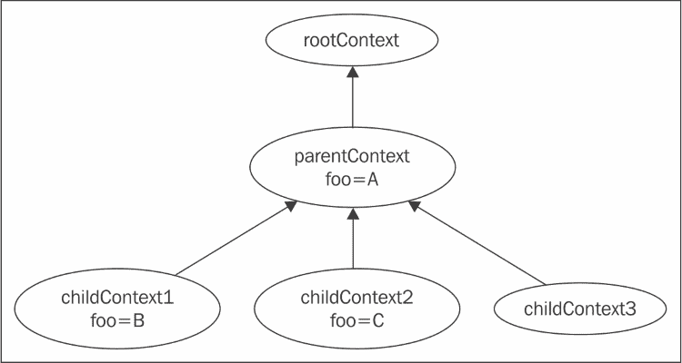

现在，如果我们从 `childContext1` 内部调用 `foo`，我们将访问对象 `B`，当我们从 `childContext2` 调用 `foo` 时，我们将访问 `C`。如果我们从 `childContext3` 调用它，那么，由于 `foo` 在那里没有定义，调用将传播到 `parentContext`，因此将访问 `A`。在 `rootContext` 中，上下文 `foo` 完全不可用。

在大多数情况下，我们不会自己创建上下文，因此最常见的情况是我们将只控制根上下文，因为它始终存在且易于访问。因此，这个上下文通常用于注册 C++ 对象。由于根引擎上下文是所有其他上下文的祖先，在那里注册的对象将可以从任何 QML 文档中看到。

那么，我们使用 QML 导出的对象能做什么呢？对象本身可以通过使用 `setContextProperty()` 给定的标识符来访问。标识符可以被视为 QML 文档中对象上声明的 ID 伪属性。可以从 QML 访问的功能取决于导出对象的类型。

您可以导出两种类型的对象。首先，您可以导出一个 `QVariant` 值，然后将其转换为等效的 QML 实体。以下表格列出了最常用的基本类型：

| Qt 类型 | QML 基本类型 |
| --- | --- |
| `bool` | `bool` |
| `unsigned int, int` | `int` |
| `double` | `double` |
| `float, qreal` | `real` |
| `QString` | `string` |
| `QUrl` | `url` |
| `QColor` | `color` |
| `QFont` | `font` |
| `QDate` | `date` |
| `QPoint, QPointF` | `point` |
| `QSize, QSizeF` | `size` |
| `QRect, QRectF` | `rect` |

这允许我们导出广泛的对象：

```cpp
int temperature = 17;
double humidity = 0.648;
QDate today = QDate::currentDate();
engine->rootContext()->setContextProperty("temperature", temperature);
engine->rootContext()->setContextProperty("humidity", humidity);
engine->rootContext()->setContextProperty("today", Qt.formatDate(today, ""));
```

并且可以轻松地在 QtQuick 中使用：

```cpp
import QtQuick 2.0

Rectangle {
  id: root
  width: 400; height: width; radius: width/10
  color: "navy"
  border { width: 2; color: Qt.darker(root.color) }

  Grid {
    id: grid
    anchors.centerIn: parent
    columns: 2; spacing: 5
    Text { color: "white"; font.pixelSize: 20; text: "Temperature:" }
    Text { color: "white"; font.pixelSize: 20; text: temperature+"°C"}
    Text { color: "white"; font.pixelSize: 20; text: "Humidity:" }
    Text { color: "white"; font.pixelSize: 20; text: humidity*100+"%"}
  }
  Text {
    anchors {
      horizontalCenter: grid.horizontalCenter;
      bottom: grid.top; bottomMargin: 5
    }
    font.pixelSize: 24; color: "white"
    text: "Weather for "+Qt.formatDate(today)
  }
}
```

这将给我们以下输出：

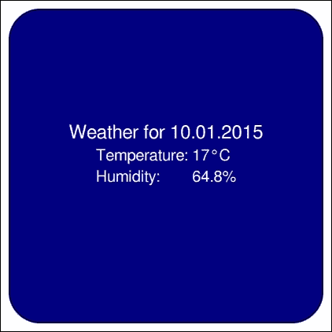

除了基本类型外，QML 引擎还提供了在特殊 `QVariant` 情况和 JavaScript 类型之间的自动类型转换 – `QVariantList` 转换为 JavaScript 数组，`QVariantMap` 转换为 JavaScript 对象。这允许我们采取更加灵活的方法。我们可以通过利用 `QVariantMap` 转换来将所有天气信息组合在一个单一的 JavaScript 对象中：

```cpp
QVariantMap weather;
weather["temperature"] = 17;
weather["humidity"] = 0.648;
weather["today"] = QDate::currentDate();
engine->rootContext()->setContextProperty("weather", weather);
```

因此，我们在 QML 端获得了更好的封装：

```cpp
Grid {
  // ...
  Text { color: "white"; font.pixelSize: 20; text: "Temperature:" }
  Text { color: "white"; font.pixelSize: 20; text: weather.temperature+"°C" }
  Text { color: "white"; font.pixelSize: 20; text: "Humidity:" }
  Text { color: "white"; font.pixelSize: 20; text: weather.humidity*100+"%"}
}
Text {
  // ...
  text: "Weather for "+Qt.formatDate(weather.today)
}
```

在一个天气条件永远不会改变的世界上，这一切都很好，很顺利。然而，在现实生活中，人们需要一种处理数据变化情况的方法。当然，我们可以在任何值发生变化时重新导出地图，但这会很繁琐。

幸运的是，可以导出到 QML 的第二种类型的对象也帮了我们一个大忙。除了 `QVariant` 之外，引擎还可以接受 `QObject` 实例作为上下文属性值。当将此类实例导出到 QML 时，所有对象属性都会公开，并且所有槽都成为声明性环境中的可调用函数。所有对象信号都提供了处理程序。

# 行动时间 – 自更新汽车仪表盘

在下一个练习中，我们将实现一个赛车游戏可用的汽车仪表盘，并显示当前速度和每分钟发动机转速等参数。最终结果将类似于以下图片：

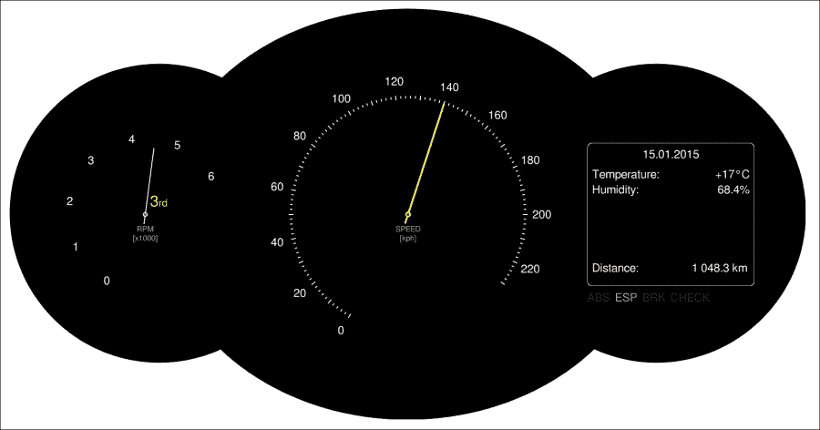

我们将从 C++ 部分开始。设置一个新的 Qt Quick 应用程序。为 Qt Quick 组件集选择最新的 Qt Quick 版本。这将为您生成一个主函数，该函数实例化 `QGuiApplication` 和 `QQmlApplicationEngine` 并将它们设置为加载 QML 文档。

使用 **文件** 菜单创建 **新文件或项目** 并创建一个新的 C++ 类。将其命名为 `CarInfo` 并选择 `QWidget` 作为其基类。你可能会问为什么不选择 `QObject`？这是因为我们的类也将是一个小部件，它将被用来修改不同参数的值，以便我们可以观察它们如何影响 Qt Quick 场景的显示。在类头文件中，声明以下属性：

```cpp
  Q_PROPERTY(int rpm READ rpm NOTIFY rpmChanged)
  Q_PROPERTY(int gear READ gear NOTIFY gearChanged)
  Q_PROPERTY(int speed READ speed NOTIFY speedChanged)
  Q_PROPERTY(QDate today READ today NOTIFY todayChanged)
  Q_PROPERTY(double distance READ distance NOTIFY distanceChanged)
```

属性是只读的，而 `NOTIFY` 子句定义了当相应属性值更改时发出的信号。继续为每个属性实现适当的函数。除了获取器之外，还实现一个公共槽作为设置器。以下是一个控制汽车速度的属性的示例：

```cpp
int CarInfo::speed() const { return m_speed; }
void CarInfo::setSpeed(int newSpeed) {
  if(m_speed == newSpeed) return;
  m_speed = newSpeed;
  emit speedChanged(m_speed);
}
```

你应该能够自己完成剩余属性的示例。

由于我们想使用小部件来调整属性值，请使用 Qt Designer 表单设计用户界面。它可以看起来像这样：


在小部件中建立适当的信号-槽连接，以便修改给定参数的任何小部件或直接使用设置器槽更新该参数的所有小部件。

### 小贴士

而不是在 `CarInfo` 类中添加成员变量来表示 `speed`、`rpm`、`distance` 或 `gear` 等属性，你可以直接操作放置在 `ui` 表单上的小部件，例如，`distance` 属性的获取器将看起来如下：

```cpp
qreal CarInfo::distance() const { return ui->distanceBox->value(); }
```

设置器将修改为：

```cpp
void CarInfo::setDistance(qreal newDistance) 
{ ui->distanceBox->setValue(newDistance); }
```

然后，你需要向构造函数中添加 `connect()` 语句，以确保信号从 ui 表单传播：

```cpp
connect(ui->distanceBox, SIGNAL(valueChanged(double)), this, SIGNAL(distanceChanged(double)));
```

接下来，你可以通过运行小部件来测试你的工作。为此，你必须修改主函数，使其看起来如下：

```cpp
int main(int argc, char **argv) {
  QApplication app(argc, argv);
  CarInfo cinfo;
  cinfo.show();
  return app.exec();
};
```

由于我们正在使用小部件，我们必须将 `QGuiApplication` 替换为 `QApplication`，并通过在项目文件中放置 `QT += widgets` 来启用小部件模块（记得在项目上下文菜单中运行 `qmake`）。在继续下一步之前，请确保一切按预期工作（即，移动滑块和更改微调框值会反映到小部件属性上）。

现在，我们将把 `QtQuick` 加入到等式中，所以让我们先更新我们的主函数以显示场景。引入代码中的高亮更改：

```cpp
int main(int argc, char **argv) {
  QApplication app(argc, argv);
  CarInfo cinfo;
  QQuickView view;
 view.engine()->rootContext()->setContextProperty("carData", &cinfo);
 view.setSource("qrc:/main.qml");
  view.show();
  cinfo.show();
  return app.exec();
};
```

这些修改为我们的场景创建了一个视图，将 `CarInfo` 实例导出到 QML 引擎的全局上下文中，并从资源中的文件加载并显示场景。

首先导出所有对象，然后再加载场景是很重要的。这是因为我们希望在场景初始化时所有名称都已可解析，以便它们可以立即使用。如果我们颠倒调用顺序，我们将在控制台得到许多关于身份未定义的警告。

最后，我们可以专注于 QML 部分。看看练习开始时我们想要显示的结果的图片。对于黑色背景，我们使用了一个在图形编辑器中创建的位图图像（你可以在本书的材料中找到该文件），但你也可以通过在`QtQuick`中直接组合三个黑色圆角矩形来获得类似的效果——两个外侧部分是完美的圆形，而内部模块是一个水平拉伸的椭圆。

如果你决定使用我们的背景文件（或制作你自己的更漂亮的图像），你可以将以下代码放入`main.qml`：

```cpp
import QtQuick 2.3

Image {
  source: "dashboard.png"
  Item {
    id: leftContainer
    anchors.centerIn: parent
    anchors.horizontalCenterOffset: -550
    width: 400; height: width
  }
  Item {
    id: middleContainer
    anchors.centerIn: parent
    width: 700; height: width
  }
  Item {
    id: rightContainer
    anchors.centerIn: parent
    anchors.horizontalCenterOffset: 525
    width: 400; height: width
  }
}
```

我们在这里做的是将图像作为根项目，并创建三个项目作为仪表盘不同元素的容器。这些容器都居中在父元素中，我们使用`horizontalCenterOffset`属性将两个外侧项目向侧面移动。偏移量以及宽度的值是通过试错来计算的，以看起来更好（注意，所有三个容器都是完美的正方形）。如果你不使用我们的文件，而是决定自己使用 Qt Quick 项目创建三个部分，容器将简单地锚定到三个黑色项目的中心。

仪表盘看起来很复杂，但实际上，它们非常容易实现，你已经学到了设计它们所需的一切。

让我们从针开始。创建一个新的 QML 文档，并将其命名为`Needle.qml`。打开文件，并将以下内容放入其中：

```cpp
import QtQuick 2.0

Item {
  id: root
  property int length: parent.width*0.4
  property color color: "white"
  property color middleColor: "red"
  property int size: 2

  Rectangle {    // needle
    width: root.size
    height: length+20
    color: root.color
    anchors.horizontalCenter: parent.horizontalCenter
    anchors.bottom: parent.bottom
    anchors.bottomMargin: -20
    antialiasing: true
  }
  Rectangle {    // fixing
    anchors.centerIn: parent
    width: 8+root.size; height: width; radius: width/2
    color: root.color
    Rectangle {  // middle dot
      anchors { fill: parent; margins: parent.width*0.25 }
      color: root.middleColor
    }
  }
}
```

该文档定义了一个具有四个属性的项目——针的长度（默认为刻度盘半径的 80%），针的颜色，`middleColor`，代表针固定处的颜色，以及大小，它定义了针的宽度。代码是自我解释的。该项目本身没有尺寸，仅作为视觉元素的锚点——针本身是一个垂直方向的细长矩形，从末端起固定 20 个单位。固定是一个与针颜色相同的圆圈，中间有一个使用不同填充颜色的较小圆圈。内圆的较小半径是通过从每侧填充 25%的边距来获得的。

至于仪表盘，由于我们只有两个，而且它们略有不同，所以创建一个具有精心设计的属性集的单独组件的开销将超过拥有良好封装对象的益处。

如果你考虑一下要完成仪表盘显示和工作的操作，似乎最难的事情是将数字整齐地布局在圆周上，所以让我们从这里开始。以下是一个基于圆的半径和角度（以度为单位）计算圆周上位置的功能实现：

```cpp
function calculatePosition(angle, radius) {
  if( radius === undefined) radius = width/2*0.8
  var a = angle * Math.PI/180 // convert degrees to radians
  var px = width/2 + radius * Math.cos(a)
  var py = width/2 + radius * Math.sin(a)
  return Qt.point(px, py)
}
```

该函数将度数转换为弧度，并返回所需点。该函数期望有一个宽度属性可用，这有助于计算圆的中心，如果没有给出半径，则作为计算其可行值的手段。

有这样的函数可用，我们可以使用已经熟悉的`Repeater`元素来定位我们想要的位置。让我们将这个函数放入`middleContainer`中，并声明汽车速度的旋钮：

```cpp
Item {
  id: middleContainer
  // ...
  function calculatePosition(angle, radius) { /* ... */ }
  Repeater {
    model: 24/2
    Item {
      property point pt:
      middleContainer.calculatePosition(120+index*12*2)
      x: pt.x; y: pt.y
      Label {
        anchors.centerIn: parent
        text: index*20
      }
    }
  }
  Needle {
    anchors.centerIn: parent
    length: parent.width*0.35
    size: 4
    rotation: 210+(carData.speed*12/10)
    color: "yellow"
  }
}
```

你可能已经注意到我们使用了一个名为`Label`的元素。我们创建它是为了避免在用户界面中为所有使用的文本设置相同的属性值：

```cpp
import QtQuick 2.0

Text {
  color: "white"
  font.pixelSize: 24
}
```

旋钮由一个重复器组成，将创建 12 个元素。每个元素都是使用前面描述的函数定位的项目。项目有一个标签与之锚定，显示给定的速度。我们使用`120+index*12*2`作为角度表达式，因为我们希望“0”位于 120 度，每个后续项目再额外 24 度。

指针的旋转是基于从`carData`对象读取的值。由于连续 20 公里每小时标签之间的角度距离是 24 度，因此每公里每小时的距离是 1.2，所以我们把`carData.speed`乘以这个系数。项目旋转是以 0 度“指向右”为基准计算的；因此，我们将第一个标签的初始 120 度偏移量加上 90 度，以获得与标签系统匹配的起始坐标。

如图中所示，速度旋钮每 2 公里每小时包含一条小线，那些可以被 10 公里每小时整除的线比其他线更长。我们可以使用另一个`Repeater`来声明这样的刻度：

```cpp
Repeater {
  model: 120-4

  Item {
    property point pt: middleContainer.calculatePosition(
      120+index*1.2*2, middleContainer.width*0.35
    )
    x: pt.x; y: pt.y
    Rectangle {
      width: 2
      height: index % 5 ? 5 : 10
        color: "white"
        rotation: 210+index*1.2*2
        anchors.centerIn: parent
        antialiasing: true
    }
  }
}
```

最后，我们可以为旋钮添加一个标签：

```cpp
Text {
    anchors.centerIn: parent
    anchors.verticalCenterOffset: 40
    text: "SPEED\n[kph]"
    horizontalAlignment: Text.AlignHCenter
    color: "#aaa"
    font.pixelSize: 16
}
```

确保在旋钮指针之前声明标签，或者给指针一个更高的*z*值，这样标签就不会覆盖指针。

接下来，通过创建一个读取自`carData.rpm`的 RPM 旋钮，在自己的左侧容器中重复这个过程。旋钮也显示汽车发动机的当前档位。将以下代码放在`leftContainer`对象定义内部：

```cpp
Item {
  id: gearContainer
  anchors.centerIn: parent
  anchors.horizontalCenterOffset: 10
  anchors.verticalCenterOffset: -10

  Text {
    id: gear
    property int value: carData.gear
    property var gears: [
 "R", "N",
      "1<sup>st</sup>", "2<sup>nd</sup>", "3<sup>rd</sup>",
 "4<sup>th</sup>", "5<sup>th</sup>"
    ]
    text: gears[value+1]
    anchors.left: parent.left
    anchors.bottom: parent.bottom
    color: "yellow"
    font.pixelSize: 32
    textFormat: Text.RichText
  }
}
```

需要解释的唯一部分已经突出显示。它定义了一个从倒档开始，经过空档，然后是五个前进档位的档位标签数组。然后，该数组以当前档位进行索引，并将该值的文本应用于标签。请注意，值增加了 1，这意味着当`carData.gear`设置为`1`时，将使用数组的 0 索引。

我们将不会展示如何实现右侧容器。现在，你可以使用`Grid`定位器轻松地自己实现它，以布局标签及其值。要显示右侧容器底部的一系列控件（文本为`ABS`、`ESP`、`BRK`和`CHECK`），可以使用`Label`实例的`Row`。

现在，启动程序并开始移动小部件上的滑块。看看 Qt Quick 场景是如何跟随变化的。

## *发生了什么？*

我们创建了一个非常简单的 `QObject` 实例，并将其作为我们的“数据模型”暴露给 QML。该对象具有多个可以接收不同值的属性。更改值会导致发出信号，这反过来又会通知 QML 引擎，并导致包含这些属性的绑定被重新评估？因此，我们的用户界面得到更新。

我们创建的 QML 和 C++ 世界之间的数据接口非常简单，并且属性数量很少。但随着我们想要公开的数据量的增加，对象可能会变得杂乱。当然，我们可以通过将其分成多个具有单独职责的小对象来抵消这种效果，然后将所有这些对象导出到 QML 中，但这并不总是理想的。在我们的情况下，我们可以看到 rpm 和 gear 是发动机子系统的属性，因此我们可以将它们移动到单独的对象中；然而，在现实中，它们的值与汽车的速度紧密相关，为了计算速度，我们需要知道这两个参数的值。但速度还取决于其他因素，例如道路的坡度，所以将速度放入发动机子系统对象中似乎并不合适。幸运的是，有一个很好的解决方案。

# 动作时间 - 对发动机属性进行分组

QML 有一个称为分组属性的概念。这些是一个对象的属性，包含了一组“子属性”。你已经知道其中的一些，例如 `Rectangle` 元素的边框属性或 `Item` 元素的锚点属性。让我们看看如何为我们的公开对象定义这样的属性。

创建一个新的由 `QObject` 派生的类，并将其命名为 `CarInfoEngine`。将 rpm 和 gear 的属性定义移动到那个新类中，并在 `CarInfo` 中添加以下属性声明：

```cpp
Q_PROPERTY(Object* engine READ engine NOTIFY engineChanged)
```

实现获取器和私有字段：

```cpp
    QObject* engine() const { return m_engine; }
private:
    CarInfoEngine *m_engine;
```

我们现在不会使用这个信号；然而，我们必须声明它，否则 QML 会抱怨我们正在绑定依赖于非可通知属性的表达示：

```cpp
signals:
    void engineChanged();
```

在 `CarInfo` 的构造函数中初始化 `m_engine`：

```cpp
m_engine = new CarInfoEngine(this);
```

接下来，更新 `CarInfo` 的代码，以便在部件上的相应滑块移动时修改 `m_engine` 的属性。也要提供反向链接，即如果属性值发生变化，相应地更新用户界面。

更新 QML 文档，将 `carData.gear` 替换为 `carData.engine.gear`。对 `carData.rpm` 和 `carData.engine.rpm` 也做同样的处理。最终的结果应该是这样的：

```cpp
Item {
  id: leftContainer
  // ...

  Item {
    id: gearContainer
    Text {
      id: gear
      property int value: carData.engine.gear
      // ...
    }
  }
  Needle {
    anchors.centerIn: parent
    length: parent.width*0.35
    rotation: 210+(carInfo.engine.rpm*35)
  }
}
```

## *发生了什么？*

实质上，我们所做的是在 `CarInfo` 中公开了一个属性，该属性本身就是一个公开了一组属性的属性。这个类型为 `CarInfoEngine` 的对象绑定到了它所引用的 `CarInfo` 实例上。

# 扩展 QML

到目前为止，我们所做的是将创建和初始化在 C++中的单个对象公开给 QML。但我们可以做更多的事情 - 框架允许我们定义新的 QML 类型。这些可以是通用的`QObject`派生的 QML 元素或针对 Qt Quick 专门化的项目。在本节中，您将学习如何做到这两点。

## 将类注册为 QML 元素

我们将从简单的事情开始 - 将`CarInfo`类型公开给 QML，这样我们就可以直接在 QML 中声明元素，而不是在 C++中实例化并在 QML 中公开它，同时仍然允许小部件的变化反映在场景中。

要使某个类（从`QObject`派生）在 QML 中可实例化，所需的所有操作只是使用`qmlRegisterType`模板函数将该类注册到声明性引擎中。此函数接受类作为其模板参数以及一系列函数参数：模块`uri`、主版本号和次版本号，以及我们正在注册的 QML 类型的名称。以下调用将类`FooClass`注册为 QML 类型`Foo`，在导入`foo.bar.baz`后，在版本 1.0 中可用：

```cpp
qmlRegisterType<FooClass>("foo.bar.baz", 1, 0, "Foo");
```

您可以在 C++代码的任何地方放置这个调用；只需确保在尝试加载可能包含`Foo`对象声明的 QML 文档之前这样做。函数调用的典型位置是在程序的主函数中：

```cpp
#include <QGuiApplication>
#include <QQuickView>
#include <QtQml>

int main(int argc, char **argv) {
  QGuiApplication app(argc, argv);
  QQuickView view;
  qmlRegisterType<FooClass>("foo.bar.baz", 1, 0, "Foo");
  view.setSource(QUrl("main.qml"));
  view.show();
  return app.exec();
}
```

之后，您可以在文档中开始声明`Foo`类型的对象。只需记住，您必须首先导入相应的模块：

```cpp
import QtQuick 2.0
import foo.bar.baz 1.0

Item {
 Foo {
 id: foo
  }
}
```

# 行动时间 - 使`CarInfo`可从 QML 实例化

首先，我们将更新 QML 文档以创建 CarInfo 1.0 模块中存在的`CarInfo`实例：

```cpp
import QtQuick 2.0
import CarInfo 1.0

Image {
  source: "dashboard.png"

 CarInfo {
 id: carData
 visible: true // make the widget visible
  }
  // ...
}
```

至于注册`CarInfo`，可能会让人想简单地调用`qmlRegisterType`在`CarInfo`上，并为自己做得很好而庆祝：

```cpp
int main(int argc, char **argv) {
  QGuiApplication app(argc, argv);
  QQuickView view;
  qmlRegisterType<CarInfo>("CarInfo", 1, 0, "CarInfo");
  view.setSource(QUrl("qrc://main.qml"));
  view.show();
  return app.exec();
}
```

通常这会起作用（是的，就这么简单）。然而，在撰写本文时，尝试将任何小部件作为`QtQuick`项的子项实例化到 QML 文档中会导致崩溃（也许在您阅读此文本时，问题已经得到解决）。为了避免这种情况，我们需要确保我们实例化的不是小部件。为此，我们将使用一个代理对象，该对象将转发我们的调用到实际的小部件。因此，创建一个新的类`CarInfoProxy`，它从`QObject`派生，并使其具有与`CarInfo`相同的属性，例如：

```cpp
class CarInfoProxy : public QObject {
  Q_OBJECT
  Q_PROPERTY(QObject *engine READ engine NOTIFY engineChanged)
  Q_PROPERTY(int speed READ speed WRITE setSpeed NOTIFY speedChanged)
  // ...
```

声明一个额外的属性，这样我们就可以根据需要显示和隐藏小部件：

```cpp
  Q_PROPERTY(bool visible READ visible WRITE setVisible NOTIFY visibleChanged)
```

然后，我们可以将小部件作为代理的成员变量放置，这样它就会与其代理一起创建和销毁：

```cpp
private:
  CarInfo m_car;
```

接下来，实现缺失的接口。为了简单起见，我们向您展示了部分属性的代码。其他属性类似，您可以自行填写空白：

```cpp
public:
  CarInfoProxy(QObject *parent = 0) : QObject(parent) {
    connect(&m_car, SIGNAL(engineChanged()), this, SIGNAL(engineChanged()));
    connect(&m_car, SIGNAL(speedChanged(int)), this, SIGNAL(speedChanged(int)));
  }
  QObject *engine() const { return m_car.engine(); }
  bool visible() const { return m_car.isVisible(); }
  void setVisible(bool v) {
    if(v == visible()) return;
    m_car.setVisible(v);
    emit visibleChanged(v);
  }
  int speed() const { return m_car.speed(); }
  void setSpeed(int v) { m_car.setSpeed(v); }
signals:
  void engineChanged();
  void visibleChanged(bool);
  void speedChanged(int);
};
```

您可以看到，我们是从小部件中复用`CarInfoEngine`实例，而不是在代理类中重复它。最后，我们可以将`CarInfoProxy`注册为`CarInfo`：

```cpp
  qmlRegisterType<CarInfoProxy>("CarInfo", 1, 0, "CarInfo");
```

如果你现在运行代码，你会看到它工作得很好——`CarInfo` 已经成为了一个常规的 QML 元素。正因为如此，它的属性可以直接在文档中设置和修改，对吧？如果你尝试设置速度或距离，它将正常工作。然而，一旦你尝试设置任何在引擎属性中分组的属性，QML 运行时将开始抱怨，显示类似于以下的消息：

```cpp
Cannot assign to non-existent property "gear"
 engine.gear: 3
 ^

```

这是因为运行时不理解引擎属性——我们将其声明为 `QObject`，但我们使用了一个这个类没有的属性。为了避免这个问题，我们必须教运行时关于 `CarInfoEngine` 的知识。

首先，让我们更新属性声明宏，使用 `CarInfoEngine` 而不是 `QObject`：

```cpp
Q_PROPERTY(CarInfoEngine* engine READ engine NOTIFY engineChanged)
```

以及获取函数本身：

```cpp
CarInfoEngine* engine() const { return m_engine; }
```

然后，我们应该教运行时关于类型的知识：

```cpp
QString msg = QStringLiteral("Objects of type CarInfoEngine cannot be created");
qmlRegisterUncreatableType<CarInfoEngine>("CarInfo", 1, 0, "CarInfoEngine", msg);
```

## *发生了什么？*

在这个练习中，我们让 QML 运行时了解两个新元素。其中一个是 `CarInfo`，它是我们小部件类的代理。我们告诉引擎这是一个具有完整功能的类，可以从 QML 中实例化。另一个类 `CarInfoEngine` 也被 QML 所知；然而，区别在于在 QML 中声明此类对象的每个尝试都会以给定的警告消息失败。QML 中有其他用于注册类型的函数，但它们很少使用，所以我们不会在这里描述它们。如果你对此好奇，可以在 Creator 的 **帮助** 面板的索引选项卡中输入 `qmlRegister`。

## 自定义 Qt Quick 项目

能够创建新的 QML 元素类型，这些类型可以用来提供动态数据引擎或其他类型的非视觉对象，这很好；然而，这一章是关于 Qt Quick 的，现在是时候学习如何向 Qt Quick 提供新的项目类型了。

你应该问自己的第一个问题是你是否真的需要一个新类型的元素。也许你可以用已经存在的元素达到同样的目标？非常常见的是，你可以在应用程序中使用矢量或位图图像来使用自定义形状，或者你可以使用 Canvas 在 QML 中直接快速绘制所需的图形。

如果你决定你需要自定义项目，你将通过实现 `QQuickItem` 的子类来完成，这是 Qt Quick 中所有项目的基类。创建新类型后，你将始终需要使用 `qmlRegisterType` 将其注册到 QML 中。

### OpenGL 项目

为了提供非常快速的场景渲染，Qt Quick 使用了一种称为场景图的机制。该图由多个已知类型的节点组成，每个节点描述一个要绘制的原始形状。框架利用对每个允许的原始形状及其参数的知识，找到渲染项目时性能最优的顺序。渲染本身使用 OpenGL 进行，所有形状都使用 OpenGL 调用来定义。

为 Qt Quick 提供新项归结为提供一组节点，这些节点使用图形理解的术语定义形状。这是通过子类化`QQuickItem`并实现纯虚函数`updatePaintNode()`来完成的，该函数应该返回一个节点，告诉场景图如何渲染项。该节点很可能是描述一个应用了材质（颜色、纹理）的几何形状（形状）。

# 行动时间 – 创建正多边形项

让我们通过提供一个用于渲染凸正多边形的项类来了解场景图。我们将使用称为“三角形扇”的 OpenGL 绘图模式来绘制多边形。它绘制了一组所有三角形都具有公共顶点的三角形。后续的三角形由共享顶点、前一个三角形的顶点和指定的下一个顶点定义。看看图解，了解如何使用 8 个控制点将六边形作为三角形扇绘制：

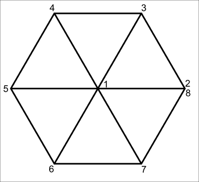

同样的方法适用于任何正多边形。定义的第一个顶点始终是占据形状中心的共享顶点。其余的点均匀地位于形状边界圆的圆周上。角度可以通过将完整角度除以边的数量来轻松计算。对于六边形，这会产生 60 度。

让我们开始处理子类`QQuickItem`。我们将给它一个非常简单的接口：

```cpp
class RegularPolygon : public QQuickItem {
  Q_OBJECT
  Q_PROPERTY(int sides READ sides WRITE setSides NOTIFY sidesChanged)
  Q_PROPERTY(QColor color READ color WRITE setColor NOTIFY colorChanged)
public:
  RegularPolygon(QQuickItem *parent = 0);

  int sides() const { return m_sideCount; }
  void setSides (int s);

  QColor color() const { return m_color; }
  void setColor(const QColor &c);

  QSGNode *updatePaintNode(QSGNode *, UpdatePaintNodeData *);

signals:
  void sidesChanged(int);
  void colorChanged(QColor);
private:
  int m_sideCount;
  QColor m_color;
};
```

我们的正多边形由边的数量和填充颜色定义。我们还继承了从`QQuickItem`继承的所有内容，包括项的宽度和高度。除了明显的属性获取器和设置器之外，我们只定义了一个方法–`updatePaintNode()`，它负责构建场景图。

在我们处理更新图形节点之前，让我们先处理容易的部分。构造函数实现如下：

```cpp
RegularPolygon::RegularPolygon(QQuickItem *parent) : QQuickItem(parent) {
  setFlag(ItemHasContents, true);
  m_sideCount = 6;
}
```

我们默认将我们的多边形设置为六边形。我们还设置了一个标志`ItemHasContents`，它告诉场景图项不是完全透明的，并且应该通过调用`updatePaintNode()`来询问我们项应该如何绘制。这是一个早期优化，以避免在项根本不会绘制任何内容的情况下准备整个基础设施。

设置器也很容易理解：

```cpp
void RegularPolygon::setSides(int s) {
  s = qMax(3, s);
  if(s == sides()) return;
  m_sideCount = v;
  emit sidesChanged(v);
  update();
}

void RegularPolygon::setColor(const QColor &c) {
  if(color() == c) return;
  m_color = c;
  emit colorChanged(c);
  update();
}
```

多边形至少需要有三条边；因此，我们通过`qMax`强制执行这个最小值，对输入值进行清理。在我们更改可能影响项外观的任何属性之后，我们调用`update()`让 Qt Quick 知道项需要重新渲染。现在让我们处理`updatePaintNode()`。我们将将其分解成更小的部分，这样你更容易理解函数的工作方式：

```cpp
QSGNode *RegularPolygon::updatePaintNode(QSGNode *oldNode, 
                         QQuickItem::UpdatePaintNodeData *) {
```

当函数被调用时，它可能会收到在之前的调用中返回的节点。请注意，图可以自由删除所有节点，因此即使在函数的前一次运行中返回了一个有效的节点，您也不应该依赖于节点存在：

```cpp
  QSGGeometryNode *node = 0;
  QSGGeometry *geometry = 0;
  QSGFlatColorMaterial *material = 0;
```

我们将要返回的节点是一个包含要绘制的形状的几何和材质信息的几何节点。我们将随着方法的进行填充这些变量：

```cpp
  if (!oldNode) {
    node = new QSGGeometryNode;
    geometry = new QSGGeometry(QSGGeometry::defaultAttributes_Point2D(), m_sideCount+2);
    geometry->setDrawingMode(GL_TRIANGLE_FAN);
    node->setGeometry(geometry);
    node->setFlag(QSGNode::OwnsGeometry);
```

如我们之前提到的，函数使用之前返回的节点作为参数调用，但我们应该准备好节点可能不存在的情况，并且应该创建它。因此，如果这种情况发生，我们将创建一个新的`QSGGeometryNode`以及为其创建一个新的`QSGGeometry`。几何构造函数接受一个所谓的属性集作为其参数，该参数定义了几何中数据的布局。大多数常见的布局已经被预定义：

| 属性集 | 用途 | 第一个属性 | 第二个属性 |
| --- | --- | --- | --- |
| `Point2D` | `Solid colored shape` | `float x, y` | `-` |
| `ColoredPoint2D` | `Per-vertex color` | `float x, y` | `uchar red, green, blue, alpha` |
| `TexturedPoint2D` | `Per-vertex texture coordinate` | `float x, y` | `float tx, float ty` |

我们将使用 2D 点来定义几何，每个点不附加任何额外信息；因此，我们传递`QSGGeometry::defaultAttributes_Point2D()`来构建我们需要的布局。正如您在前面的表中可以看到，该布局的每个属性由两个浮点值组成，表示一个点的*x*和*y*坐标。

`QSGGeometry`构造函数的第二个参数告诉我们我们将使用多少个顶点。构造函数将根据给定的属性布局分配足够的内存来存储所需数量的顶点。在几何容器准备好后，我们将它的所有权传递给几何节点，以便当几何节点被销毁时，几何的内存也会被释放。在这个时候，我们还标记我们将以`GL_TRIANGLE_FAN`模式进行渲染：

```cpp
        material = new QSGFlatColorMaterial;
        material->setColor(m_color);
        node->setMaterial(material);
        node->setFlag(QSGNode::OwnsMaterial);
```

该过程对材质重复进行。我们使用`QSGFlatColorMaterial`作为整个形状将有一个从`m_color`设置的单一颜色。Qt 提供了一些预定义的材质类型。例如，如果我们想要给每个顶点一个单独的颜色，我们会使用`QSGVertexColorMaterial`与`ColoredPoint2D`属性布局一起：

```cpp
    } else {
      node = static_cast<QSGGeometryNode *>(oldNode);
      geometry = node->geometry();
      geometry->allocate(m_sideCount+2);
```

这段代码处理了`oldNode`确实包含了一个指向已经初始化的节点的有效指针的情况。在这种情况下，我们只需要确保几何可以容纳我们需要的顶点数量，以防自上次函数执行以来边的数量发生了变化：

```cpp
material = static_cast<QSGFlatColorMaterial*>(node->material());
if(material->color() != m_color) {
  material->setColor(m_color);
  node->markDirty(QSGNode::DirtyMaterial);
}
}
```

这对于材质也是重复的。如果颜色不同，我们将重置它，并通过标记`DirtyMaterial`标志来告诉几何节点材质需要更新：

```cpp
  QRectF bounds = boundingRect();
  QSGGeometry::Point2D *vertices = geometry->vertexDataAsPoint2D();

  // first vertex is the shared one (middle)
  QPointF center = bounds.center();

  vertices[0].set(center.x(), center.y());

  // vertices are distributed along circumference of a circle

  const qreal angleStep = 360.0/m_sideCount;
  const qreal radius = qMin(width(), height())/2;

  for (int i = 0; i < m_sideCount; ++i) {
    qreal rads = angleStep*i*M_PI/180;
    qreal x = center.x()+radius*std::cos(rads);
    qreal y = center.y()+radius*std::sin(rads);
    vertices[1+i].set(x, y);
  }
  vertices[1+m_sideCount] = vertices[1];
```

最后，我们可以设置顶点数据。首先，我们要求几何对象为我们准备一个从分配的内存到`QSGGeometry::Point2D`结构的映射，这样我们可以方便地为每个顶点设置数据。然后，使用计算圆上点的方程进行实际计算。圆的半径取为项目宽度和高度的较小部分，以便形状在项目中居中。正如你在练习开始时的图中可以看到的，数组中的最后一个点与数组中的第二个点具有相同的坐标，以便将扇形闭合成一个正多边形：

```cpp
  node->markDirty(QSGNode::DirtyGeometry);
  return node;
}
```

最后，我们将几何标记为已更改，并将节点返回给调用者。

## *发生了什么？*

在 Qt Quick 中的渲染可以发生在主线程之外的线程。通过实现`updatePaintNode()`，我们在 GUI 线程和渲染线程之间进行了同步。执行主线程的函数被阻塞。由于这个原因，它必须尽可能快地执行，并且不要进行任何不必要的计算，因为这会直接影响性能。这也是你可以在代码中安全调用你的项目函数（如读取属性）以及与场景图（创建和更新节点）交互的唯一地方。尽量不要在这个方法中发出任何信号或创建任何对象，因为它们将具有与渲染线程而不是 GUI 线程的亲和力。

话虽如此，你现在可以将你的类注册到 QML 中，并使用以下 QML 文档进行测试：

```cpp
RegularPolygon {
  id: poly
  vertices: 5
  color: "blue"
}
```

这应该给你一个漂亮的蓝色五边形。如果形状看起来是锯齿状的，你可以在窗口上强制抗锯齿：

```cpp
int main(int argc, char **argv) {
  QGuiApplication app(argc, argv);
  QQuickView view;
  QSurfaceFormat format = view.format();
 format.setSamples(16); // enable multisampling
  view.setFormat(format);
  qmlRegisterType<RegularPolygon>("RegularPolygon", 1, 0, 
                              "RegularPolygon");
  view.setSource(QUrl("qrc://main.qml"));
  view.setResizeMode(QQuickView::SizeRootObjectToView);
  view.show();
  return app.exec();
}
```

## 尝试英雄 – 创建 RegularPolygon 的支持边框

`updatePaintNode()`返回的可能是单个`QSGGeometryNode`，也可能是一个更大的`QSGNode`项树。每个节点可以有任意数量的子节点。通过返回一个有两个几何节点作为子节点的节点，你可以在项目中绘制两个不同的形状：


作为挑战，扩展`RegularPolygon`以绘制多边形的内部填充部分以及不同颜色的边。你可以使用`GL_QUAD_STRIP`绘制模式来绘制边。点的坐标很容易计算——靠近形状中间的点就是形成形状本身的点。其余的点也位于一个略微更大的圆的圆周上（边框的宽度）。因此，你可以使用相同的方程来计算它们。`GL_QUAD_STRIP`模式通过指定在第一个四个顶点之后的每两个顶点来渲染四边形，组成一个连接的四边形。以下图表应该能清楚地说明我们想要达到的效果：

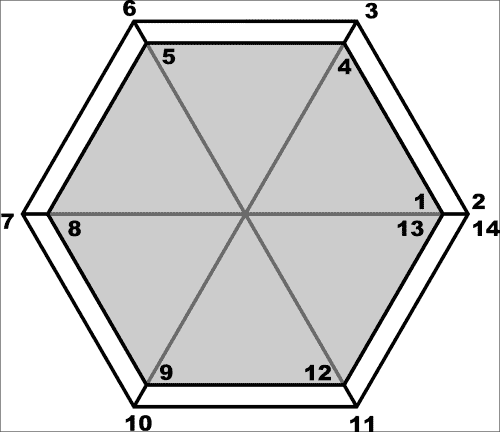

## 绘制的项目

在 OpenGL 中实现项目相当困难 – 你需要想出一个算法，使用 OpenGL 原语来绘制你想要的形状，然后你还需要足够熟练地使用 OpenGL 来为你的项目构建一个合适的场景图节点树。但还有另一种方法 – 你可以通过使用`QPainter`来绘制项目。这会带来性能上的损失，因为幕后，画家在一个间接的表面（一个帧缓冲对象或一个图像）上绘制，然后场景图将其转换为 OpenGL 纹理并在四边形上渲染。即使考虑到这种性能损失，使用丰富且方便的绘图 API 来绘制项目通常比在 OpenGL 或使用 Canvas 上花费数小时做同样的事情要简单得多。

要使用这种方法，我们不会直接子类化`QQuickItem`，而是`QQuickPaintedItem`，这为我们提供了使用画家绘制项目所需的基础设施。

因此，我们基本上需要做的就是实现纯虚`paint()`方法，该方法使用接收到的画家渲染项目。让我们看看这个实践，并将其与我们之前获得的技术结合起来。

# 行动时间 – 创建用于绘制轮廓文本的项目

当前练习的目标是能够使以下 QML 代码工作：

```cpp
import QtQuick 2.3
import OutlineTextItem 1.0

Rectangle {
  width: 800; height: 400
  OutlineTextItem {
    anchors.centerIn: parent
    text: "This is outlined text"
    fontFamily: "Arial"
    fontPixelSize: 64
    color: "#33ff0000"
    antialiasing: true
    border {
      color: "blue"
      width: 2
      style: Qt.DotLine
    }
  }
}
```

以下是一个结果：

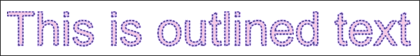

从一个激活了`core`、`gui`和`quick`模块的空 Qt 项目开始。创建一个新的类，并将其命名为`OutlineTextItemBorder`。删除实现文件，因为我们将要把所有代码放入头文件中。将以下代码放入类定义中：

```cpp
class OutlineTextItemBorder : public QObject {
  Q_OBJECT
  Q_PROPERTY(int width MEMBER m_width NOTIFY widthChanged)
  Q_PROPERTY(QColor color MEMBER m_color NOTIFY colorChanged)
  Q_PROPERTY(int style MEMBER m_style NOTIFY styleChanged)
public:
  OutlineTextItemBorder(QObject *parent) : QObject(parent),
    m_width(0), m_color(Qt::transparent), m_style(Qt::SolidLine) {}

  int width() const { return m_width; }
  QColor color() const { return m_color; }
  Qt::PenStyle style() const { return (Qt::PenStyle)m_style; }
  QPen pen() const {
   QPen p;
   p.setColor(m_color);
   p.setWidth(m_width);
   p.setStyle((Qt::PenStyle)m_style);
   return p;
  }
signals:
  void widthChanged(int);
  void colorChanged(QColor);
  void styleChanged(int);
private:
  int m_width;
  QColor m_color;
  int m_style;
};
```

你可以看到`Q_PROPERTY`宏没有我们迄今为止使用的`READ`和`WRITE`关键字。这是因为我们现在正在走捷径，我们让`moc`生成代码，该代码将通过直接访问给定的类成员来操作属性。通常，我们不会推荐这种做法，因为没有 getter，访问属性的唯一方法是通过通用的`property()`和`setProperty()`调用。然而，在这种情况下，我们不会将这个类公开在 C++中，所以我们不需要设置器，我们仍然会实现 getter。关于`MEMBER`关键字的好处是，如果我们还提供了`NOTIFY`信号，生成的代码将在属性值变化时发出该信号，这将使 QML 中的属性绑定按预期工作。类的其余部分相当简单 – 实际上，我们正在提供一个用于定义将要用于描边文本的笔的类。实现一个返回实际笔的方法似乎是个好主意。

该类将为我们的主要项目类提供一个分组属性。创建一个名为`OutlineTextItem`的类，并从`QQuickPaintedItem`派生，如下所示：

```cpp
class OutlineTextItem : public QQuickPaintedItem {
  Q_OBJECT
  Q_PROPERTY(OutlineTextItemBorder* border READ border NOTIFY borderChanged)
  Q_PROPERTY(QString text MEMBER m_text NOTIFY textChanged)
  Q_PROPERTY(QColor color MEMBER m_color NOTIFY colorChanged)
  Q_PROPERTY(QString fontFamily MEMBER m_ffamily NOTIFY fontFamilyChanged)
  Q_PROPERTY(int fontPixelSize MEMBER m_fsize NOTIFY fontPixelSizeChanged)
public:
  OutlineTextItem(QQuickItem *parent = 0);
  void paint(QPainter *painter);
  OutlineTextItemBorder* border() const { return m_border; }
  QPainterPath shape(const QPainterPath &path) const;
private slots:
  void updateItem();
signals:
  void textChanged(QString);
  void colorChanged(QColor);
  void borderChanged();
  void fontFamilyChanged(QString);
  void fontPixelSizeChanged(int);
private:
  OutlineTextItemBorder* m_border;
  QPainterPath m_path;
  QRectF m_br;
  QString m_text;
  QColor m_color;
  QString m_ffamily;
  int m_fsize;
};
```

接口定义了要绘制的文本的属性，包括其颜色、字体以及轮廓数据的分组属性。同样，我们使用 `MEMBER` 以避免手动实现获取器和设置器。不幸的是，这使得我们的构造函数代码更加复杂，因为我们仍然需要一种方法在任何属性被修改时运行一些代码。使用以下代码实现构造函数：

```cpp
OutlineTextItem::OutlineTextItem(QQuickItem *parent) : QQuickPaintedItem(parent) {
    m_border = new OutlineTextItemBorder(this);
    connect(this, SIGNAL(textChanged(QString)), SLOT(updateItem()));
connect(this, SIGNAL(colorChanged(QColor)), SLOT(updateItem()));
connect(this, SIGNAL(fontFamilyChanged(QString)), SLOT(updateItem()));
connect(this, SIGNAL(fontPixelSizeChanged(int)), SLOT(updateItem()));
connect(m_border, SIGNAL(widthChanged(int)), SLOT(updateItem()));
connect(m_border, SIGNAL(colorChanged(QColor)), SLOT(updateItem()));
connect(m_border, SIGNAL(styleChanged(int)), SLOT(updateItem()));
updateItem();
}
```

我们基本上将对象及其分组属性对象的所有属性更改信号连接到同一个槽，该槽将更新项目的数据，如果其任何组件被修改。我们还直接调用相同的槽来准备项目的初始状态。槽可以像这样实现：

```cpp
void OutlineTextItem::updateItem() {
  QFont font(m_ffamily, m_fsize);
  m_path = QPainterPath();
  m_path.addText(0, 0 , font, m_text);
  m_br = shape(m_path).controlPointRect();
  setImplicitWidth(m_br.width());
  setImplicitHeight(m_br.height());
  update();
}
```

在开始时，该函数重置了一个画家路径对象，该对象作为绘制带轮廓文本的后端，并使用设置的字体初始化它。然后，槽函数使用我们很快就会看到的 `shape()` 函数计算路径的边界矩形。最后，它将计算出的尺寸设置为项目的尺寸提示，并通过 `update()` 调用请求项目重新绘制：

```cpp
QPainterPath OutlineTextItem::shape(const QPainterPath &path) const
{
  QPainterPathStroker ps;
  if(m_border->width() > 0 && m_border->style() != Qt::NoPen) {
    ps.setWidth(m_border->width());
  } else {
    ps.setWidth(0.0000001); // workaround a bug in Qt
  }
  QPainterPath p = ps.createStroke(path);
  p.addPath(path);
  return p;
}
```

`shape()` 函数返回一个新的画家路径，它包括原始路径以及使用 `QPainterPathStroker` 对象创建的轮廓。这样做是为了在计算边界矩形时正确考虑笔触的宽度。我们使用 `controlPointRect()` 来计算边界矩形，因为它比 `boundingRect()` 快得多，并且返回的面积大于或等于 `boundingRect()` 会返回的面积，这对我们来说是可以接受的。

剩下的工作是实现 `paint()` 例程本身：

```cpp
void OutlineTextItem::paint(QPainter *painter) {
  if(m_text.isEmpty()) return;
  painter->setPen(m_border->pen());
  painter->setBrush(m_color);
  painter->setRenderHint(QPainter::Antialiasing, true);
  painter->translate(-m_br.topLeft());
  painter->drawPath(m_path);
}
```

代码非常简单——如果没有东西要绘制，我们就会提前退出。否则，我们使用从项目属性中获得的笔和颜色设置画家。我们启用抗锯齿并使用项目的边界矩形校准画家坐标。最后，我们在画布上绘制路径。

## *刚才发生了什么？*

在这次练习中，我们利用了 Qt 图形引擎强大的 API，通过简单的功能来补充现有的 Qt Quick 元素集。否则，使用预定义的 Qt Quick 元素来实现这一点非常困难，而使用 OpenGL 实现则更加困难。我们同意为了只需编写大约一百行代码就能得到一个完全工作的解决方案，而牺牲一点性能。如果你想在代码中使用它，请记住将类注册到 QML 中：

```cpp
qmlRegisterUncreatableType<OutlineTextItemBorder>(
  "OutlineTextItem", 1, 0, "OutlineTextItemBorder", 
  "Can't create items of OutlineTetItemBorder type"
);
qmlRegisterType<OutlineTextItem>(
  "OutlineTextItem", 1, 0, "OutlineTextItem"
);
```

# 摘要

在本章中，你已经熟悉了一种名为 QML 的声明性语言。这种语言用于驱动 Qt Quick——一个用于高度动态和交互式内容的框架。你学习了 Qt Quick 的基础知识——如何使用多种元素类型创建文档，以及如何在 QML 或 C++中创建自己的元素。你还学习了如何将表达式绑定到属性上，以便自动重新评估它们。但到目前为止，尽管我们谈论了“流畅”和“动态”的界面，你还没有看到很多这样的内容。不要担心；在下一章中，我们将专注于 Qt Quick 中的动画，以及一些花哨的图形，并将本章所学应用于创建看起来不错且有趣的游戏。所以，继续阅读吧！
