# 第十章：Qt Quick

> *在前一章中，我们向您介绍了 Qt Quick 和 QML 的基础知识。到现在，你应该已经足够熟练，能够掌握语法并理解 Qt Quick 的工作基本概念。在本章中，我们将向您展示如何通过引入不同类型的动画，使您的游戏脱颖而出，让您的应用程序感觉更像现实世界。您还将学习如何将 Qt Quick 对象视为可使用状态机编程的独立实体。本章的大部分内容将致力于通过使用 OpenGL 效果和粒子系统使您的游戏更加美观。本章的另一重要部分将介绍如何使用 Qt Quick 实现许多重要的游戏概念。所有这些将通过构建一个简单的 2D 动作游戏来展示，该游戏将使用所介绍的概念。*

# 为静态用户界面注入活力

到目前为止我们所描述的，根本不能称之为“流畅”。现在，让我们通过学习如何将一些动态效果添加到我们创建的用户界面中来改变这一点。到目前为止，书籍无法包含动态图片，因此，这里描述的大多数内容，你都需要通过运行提供的 Qt Quick 代码自行测试。

## 动画元素

Qt Quick 提供了一个非常广泛的框架来创建动画。我们这里所说的“动画”，并不仅仅是指移动项目。我们定义动画为“随时间改变任意值”。那么，我们可以动画化什么？当然，我们可以动画化项目几何形状。但我们也可以动画化旋转、缩放、其他数值，甚至是颜色。但不要止步于此。Qt Quick 还允许你动画化项目的父子层次结构或锚点分配。几乎任何可以用项目属性表示的东西都可以进行动画化。

此外，变化很少是线性的——如果你把球踢向空中，它首先会迅速上升，因为它的初始速度很大。然而，球是一个受到地球重力作用的物理对象，这会减缓上升速度，直到球停止并开始下落，加速直到它触地。根据地面和球体的属性，物体可以弹起再次进入空中，动量减小，重复类似弹簧的运动，直到最终消失，球体落在地面上。Qt Quick 允许你使用可以分配给动画的缓动曲线来模拟所有这些。

### 通用动画

Qt Quick 提供了从通用的 `Animation` 元素派生出的多种动画类型，你永远不会直接使用它们。这种类型的存在只是为了提供不同动画类型共有的 API。

让我们通过查看从最常见的动画类型`PropertyAnimation`派生的一系列动画类型来更仔细地查看动画框架。正如其名所示，它们提供了动画对象属性值的方法。尽管您可以直接使用`PropertyAnimation`元素，但通常更方便使用其专门处理不同数据类型特性的子类。

最基本的属性动画类型是`NumberAnimation`，它允许您动画化整数和实数的所有数值。使用它的最简单方法是声明一个动画，告诉它在一个特定对象中动画化一个特定的属性，然后设置动画的长度以及属性的起始和结束值：

```cpp
import QtQuick 2.0

Item {
  id: root
  width: 600; height: width
  Rectangle {
    id: rect
    color: "red"; width: 50; height: width
  }
 NumberAnimation {
 target: rect
 property: "x"
 from: 0; to: 550
 duration: 3000
 running: true
 }
}
```

# 行动时间 – 动作游戏的场景

创建一个新的 Qt Quick UI 项目。在项目目录中，创建一个名为 `images` 的子目录，并从使用 Graphics View 创建的游戏项目中复制 `grass.png`、`sky.png` 和 `trees.png`。然后，将以下代码放入 QML 文档中：

```cpp
import QtQuick 2.1

Image {
  id: root
  property int dayLength: 60000 // 1 minute
  source: "images/sky.png"

  Item {
    id: sun
    x: 140
    y: root.height-170
    Rectangle {
      id: sunVisual
      width: 40
      height: width
      radius: width/2
      color: "yellow"
      anchors.centerIn: parent
    }
  }
  Image {
    source: "images/trees.png"
    x: -200
    anchors.bottom: parent.bottom
  }
  Image {
    source: "images/grass.png"
    anchors.bottom: parent.bottom
  }
}
```

当你现在运行项目时，你会看到一个类似于这个屏幕的界面：

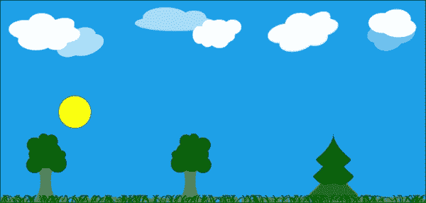

## *发生了什么？*

我们设置了一个非常简单的场景，由三个图像堆叠形成一幅风景画。在背景层（天空）和前景（树木）之间，我们放置了一个代表太阳的黄色圆圈。由于我们很快就要移动太阳，我们将对象的中心锚定到一个没有物理尺寸的空项目上，这样我们就可以设置太阳相对于其中心的位置。我们还为场景配备了一个`dayLength`属性，它将保存有关游戏时间一天长度的信息。默认情况下，我们将其设置为 60 秒，这样事情就会发生得非常快，我们可以看到动画的进度而无需等待。在所有事情都设置正确之后，我们可以调整一天的长度以适应我们的需求。

图形设计使我们能够轻松地操作太阳，同时保持它在树线之后。注意堆叠顺序是如何隐式地由文档中元素的顺序决定的。

# 行动时间 – 动画太阳的水平运动

太阳在天空中的日常巡航从东方开始，继续向西，直到傍晚时分隐藏在地平线下。让我们通过向我们的`sun`对象添加动画来尝试复制这种水平运动。

打开我们上一个项目的 QML 文档。在`root`项目内部添加以下声明：

```cpp
NumberAnimation {
  target: sun
  property: "x"
  from: 0
  to: root.width
  duration: dayLength
  running: true
}
```

对程序进行这样的修改后，将产生一个太阳水平移动的运行效果。以下图像是运行过程中多个帧的组合：

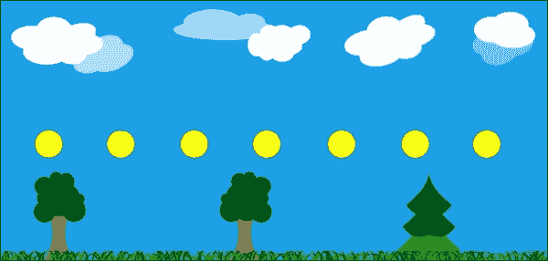

## *发生了什么？*

我们引入了一个 `NumberAnimation` 元素，该元素被设置为动画化 `sun` 对象的 `x` 属性。动画从 `0` 开始，直到 `x` 达到 `root` 项的宽度（这是场景的右边缘）。运动持续 `dayLength` 毫秒。动画的 `running` 属性被设置为 `true` 以启用动画。由于我们没有指定其他方式，运动是线性的。

你可能认为动画运行的方向是错误的——“西”在左边，“东”在右边，对吧？是的，然而，这只在观察者面向北方时才成立。如果我们的场景是这样的，我们就根本看不到太阳——在中午时分，它会穿过南方方向。

## 组合动画

我们在上一个部分中制作的动画看起来不错，但并不非常逼真。太阳应该在早上升起，在中午之前达到顶峰，然后稍后开始向傍晚方向落下，此时它应该穿过地平线并隐藏在地形之下。

为了实现这样的效果，我们可以为太阳的 `y` 属性添加两个额外的动画。第一个动画将从一开始就降低太阳的垂直位置（记住，垂直几何轴指向下方，所以降低垂直位置意味着对象向上移动）。动画将在一天长度的三分之一时完成。然后我们需要一种方法来等待一段时间，然后启动第二个动画，该动画将把对象向下拉向地面。启动和停止动画很容易——我们可以在动画项上调用 `start()` 和 `stop()` 函数，或者直接更改 `running` 属性的值。每个 `Animation` 对象都会发出 `started()` 和 `stopped()` 信号。延迟可以通过使用计时器来实现。我们可以为第一个动画的停止信号提供一个信号处理器来触发计时器以启动另一个，如下所示：

```cpp
NumberAnimation {
  id: sunGoesUpAnim
  // …
  onStopped: sunGoesDownAnimTimer.start()
}
Timer {
  id: sunGoesDownAnimTimer
  interval: dayLength/3
  onTriggered: sunGoesDownAnim.start()
}
```

即使忽略这可能会带来的任何副作用（例如，如何在启动第二个动画之前停止动画），这样的方法也不能被称为“声明式”，对吧？

幸运的是，类似于我们在 C++ 中所拥有的，Qt Quick 允许我们形成动画组，这些动画组可以相互并行运行或按顺序运行。这里有 `SequentialAnimation` 和 `ParallelAnimation` 类型，您可以在其中声明任意数量的子动画元素来形成组。要并行运行两个动画，我们可以声明以下元素层次结构：

```cpp
ParallelAnimation {
  id: parallelAnimationGroup

  NumberAnimation {
    target: obj1; property: "prop1"
    from: 0; to: 100
    duration: 1500
  }
  NumberAnimation {
    target: obj2; property: "prop2"
    from: 150; to: 0
    duration: 1500
  }
  running: true
}
```

同样的技术可以用来同步更大的动画组，即使每个组件的持续时间不同：

```cpp
SequentialAnimation {
  id: sequentialAnimationGroup

  ParallelAnimation {
    id: parallelAnimationGroup

    NumberAnimation {
      id: A1
      target: obj2; property: "prop2"
      from: 150; to: 0
      duration: 1000
    }
    NumberAnimation {
      id: A2
      target: obj1; property: "prop1"
      from: 0; to: 100
      duration: 2000
    }
  }
  PropertyAnimation {
    id: A3
    target: obj1; property: "prop1"
    from: 100; to: 300
    duration: 1500
  }
  running: true
}
```

段落中展示的组由三个动画组成。前两个动画一起执行，因为它们形成一个并行子组。组中的一个成员运行时间是另一个的两倍。只有当整个子组完成之后，第三个动画才开始。这可以通过一个 UML 活动图来可视化，其中每个活动的尺寸与该活动的持续时间成比例：

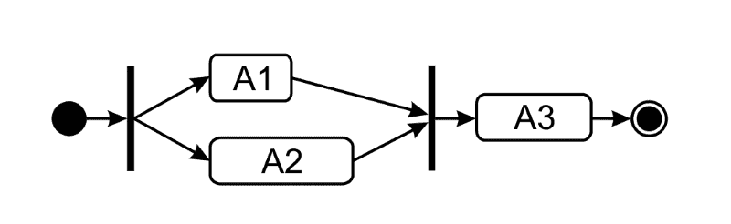

# 动作时间 – 制作日出日落

让我们在 QML 文档中添加垂直移动（`y`属性的动画）到我们的太阳，通过添加一系列动画来实现。由于我们的新动画将与水平动画并行运行，我们可以将两个方向的动画都包含在一个`ParallelAnimation`组中。这会起作用，但据我们看来，这会不必要地使文档变得杂乱。指定并行动画的另一种方式是将它们声明为独立的元素层次结构，使每个动画独立于其他动画，这正是我们要在这里做的。

从上一个练习的文档中打开，在之前的动画下方放置以下代码：

```cpp
SequentialAnimation {
  NumberAnimation {
    target: sun
    property: "y"
    from: root.height+sunVisual.height
    to: root.height-270
    duration: dayLength/3
  }
  PauseAnimation { duration: dayLength/3 }
  NumberAnimation {
    target: sun
    property: "y"
    from: root.height-270
    to: root.height+sunVisual.height
    duration: dayLength/3
  }
running: true
}
```

运行程序将导致光源在早晨升起，在傍晚落下。然而，移动的轨迹似乎有些笨拙。

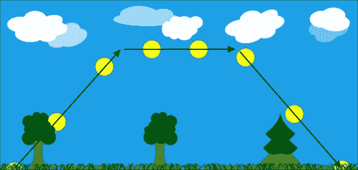

## *发生了什么？*

我们声明了一个由三个动画组成的顺序动画组，每个动画持续时间为一天长度的 1/3。组中的第一个成员使太阳升起。第二个成员，它是一个新元素类型`PauseAnimation`的实例，引入了一个等于其持续时间的延迟。这反过来又让第三个组件在下午开始工作，将太阳拉向地平线。

这样声明的问题在于太阳以极其角度化的方式移动，如图像所示。

## 非线性动画

描述的问题的原因是我们的动画是线性的。正如我们在本章开头所指出的，线性动画在自然界中很少发生，这通常使得它们的使用产生非常不真实的结果。

我们之前也说过，Qt Quick 允许我们使用缓动曲线来执行沿非线性路径的动画。提供了大量的曲线。以下是一个列出可用非线性缓动曲线的图表：

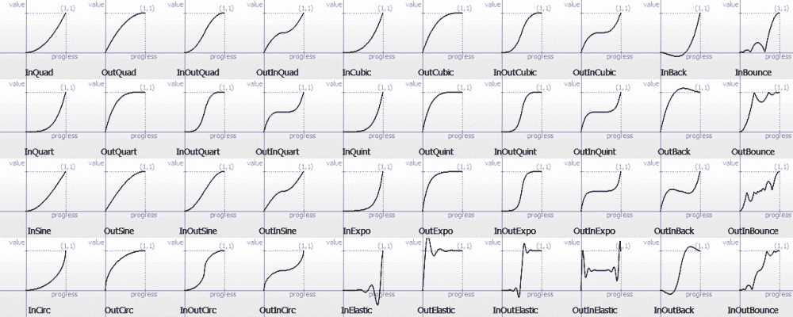

您可以在`PropertyAnimation`类型或其派生类型（例如`NumberAnimation`）的元素上使用任何曲线。这是通过使用`easing`属性组来完成的，您可以在其中设置曲线的`type`。不同的曲线类型可以通过在`easing`属性组中设置多个属性进一步调整，例如`amplitude`（用于弹跳和弹性曲线）、`overshoot`（用于回弹曲线）或`period`（用于弹性曲线）。

声明沿`InOutBounce`路径的动画非常简单：

```cpp
NumberAnimation {
  target: obj; property: prop;
  from: startValue; to: endValue;
 easing.type: Easing.InOutBounce
}
```

# 行动时间 – 改善太阳的路径

当前任务是要改进太阳的动画，使其表现得更加逼真。我们将通过调整动画，使对象沿着曲线路径移动。

在我们的 QML 文档中，将之前的垂直动画替换为以下动画：

```cpp
SequentialAnimation {
  NumberAnimation {
    target: sun
    property: "y"
    from: root.height+sunVisual.height
    to: root.height-270
    duration: dayLength/2
    easing.type: Easing.OutCubic
  }
  NumberAnimation {
    target: sun
    property: "y"
    to: root.height+sunVisual.height
    duration: dayLength/2
    easing.type: Easing.InCubic
  }

  running: true
}
```

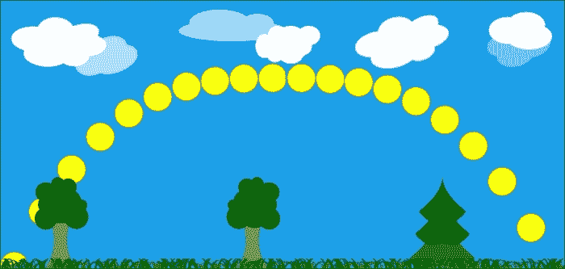

## *刚才发生了什么？*

三个动画序列（两个线性动画和一个暂停）被另一个由三次函数确定的路径的动画序列所取代。这使得我们的太阳升起很快，然后减速到几乎在太阳接近中午时几乎察觉不到的程度。当第一个动画完成后，第二个动画会反转运动，使太阳缓慢下降，然后在黄昏临近时增加速度。因此，太阳离地面越远，它看起来移动得越慢。同时，水平动画保持线性，因为地球在围绕太阳运动的速度实际上是恒定的。当我们结合水平和垂直动画时，我们得到一条看起来非常类似于我们在现实世界中观察到的路径。

## 属性值来源

从 QML 的角度来看，动画及其衍生元素类型被称为 *属性值来源*。这意味着它们可以附加到属性上并为它生成值。重要的是，它允许我们使用更简单的语法来使用动画。不需要显式声明动画的目标和属性，可以将动画附加到父对象的命名属性上。

要这样做，对于 `Animation`，不要指定 `target` 和 `property`，而是使用 `on` 关键字后跟属性名，该属性名是动画的值来源。例如，要使用 `NumberAnimation` 对象动画化对象的 `rotation` 属性，可以使用以下代码：

```cpp
NumberAnimation on rotation {
  from: 0
  to: 360
  duration: 500
}
```

对于同一个对象的同一属性，指定多个属性值来源是有效的。

# 行动时间 – 调整太阳的颜色

如果你黄昏或黎明时分看太阳，你会发现它不是黄色的，而是越接近地平线就越变成红色。让我们通过为表示太阳的对象提供一个属性值来源来教会它做同样的事情。

打开 QML 文档，找到 `sunVisual` 对象的声明，并用下面的高亮部分扩展它：

```cpp
Rectangle {
  id: sunVisual
  // ...
 SequentialAnimation on color {
 ColorAnimation {
 from: "red"
 to: "yellow"
 duration: 0.2*dayLength/2
 }
 PauseAnimation { duration: 2*0.8*dayLength/2 }
 ColorAnimation {
 to: "red"
 duration: 0.2*dayLength/2
 }
 running: true
 }
}
```

## *刚才发生了什么？*

我们将一个动画附加到了矩形的`color`属性上，以模拟太阳的视觉方面。这个动画由三个部分组成。首先，我们使用`ColorAnimation`对象从红色过渡到黄色。这是一个专门用于修改颜色的`Animation`子类型。由于矩形的颜色不是数字，使用`NumberAnimation`对象将不起作用，因为该类型无法插值颜色值。因此，我们只能使用`PropertyAnimation`或`ColorAnimation`对象。动画的持续时间设置为半日长度的 20%，以便黄色能够非常快地获得。第二个组件是一个`PauseAnimation`对象，在执行第三个组件之前提供延迟，该组件逐渐将颜色变回红色。对于最后一个组件，我们没有为`from`属性提供值。这导致动画以动画执行时的属性当前值启动（在这种情况下，太阳应该是黄色的）。

注意，我们只需要指定顶级动画的属性名称。这个特定的元素充当属性值源，所有下级动画对象“继承”了目标属性。

# 行动时间 – 装饰太阳动画

目前太阳的动画看起来几乎完美。尽管如此，我们仍然可以改进它。如果你在清晨和中午时分观察天空，你会注意到，与太阳在顶点的大小相比，太阳在日出或日落时看起来要大得多。我们可以通过缩放对象来模拟这种效果。

在我们的场景文档中，添加另一个操作太阳`scale`属性的顺序动画：

```cpp
SequentialAnimation on scale {
  NumberAnimation {
    from: 1.6; to: 0.8
    duration: dayLength/2
    easing.type: Easing.OutCubic
  }
  NumberAnimation {
    from: 0.8; to: 1.6
    duration: dayLength/2
    easing.type: Easing.InCubic
  }
}
```

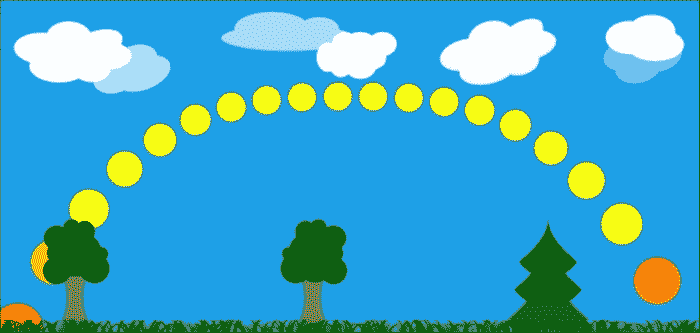

## *发生了什么？*

在本节中，我们只是遵循了早期声明的路径——恒星体的垂直运动影响其感知的大小；因此，将两个动画绑定在一起似乎是一个好决定。注意，我们可能修改了原始动画，并使缩放动画与操作`y`属性的动画并行，而不是为缩放指定一个新的属性值源：

```cpp
SequentialAnimation {
  ParallelAnimation {
    NumberAnimation {
      target: sun
      property: "y"
      from: root.height+sunVisual.height
      to: root.height-270
      duration: dayLength/2
      easing.type: Easing.OutCubic
    }
    NumberAnimation {
      target: sun
      property: "scale"
      from: 1.6; to: 0.8
      duration: dayLength/2
      easing.type: Easing.OutCubic
    }
  // …
```

## 尝试一下英雄 – 动画太阳光线

到目前为止，你应该已经成为一个动画专家。如果你想尝试你的技能，这里有一个任务给你。以下代码可以应用于`sun`对象，并将显示从太阳发出的非常简单的红色光线：

```cpp
Item {
  id: sunRays
  property int count: 10
  width: sunVisual.width
  height: width
  anchors.centerIn: parent
  z: -1
  Repeater {
    model: sunRays.count
    Rectangle {
      color: "red"
      rotation: index*360/sunRays.count
      anchors.fill: parent
    }
  }
}
```

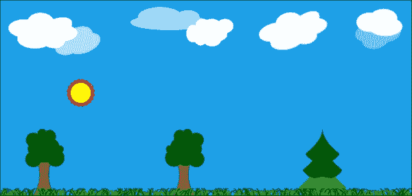

目标是使光线动画看起来整体效果良好，并符合场景的调子风格。尝试不同的动画——旋转、大小变化和颜色。将它们应用于不同的元素——一次所有光线（例如，使用`sunRays`标识符）或仅由重复器生成的特定矩形。

## 行为

在上一章中，我们实现了一个赛车游戏的仪表盘，其中包含了一些带有指针的时钟。我们可以为每个时钟设置值（例如，汽车速度），相应的指针会立即调整到给定的值。但这种方法在现实中是不现实的——在现实世界中，值的改变是随着时间的推移发生的。在我们的例子中，汽车通过 10 英里/小时加速到 50 英里/小时，经过 11 英里/小时、12 英里/小时等等，直到经过一段时间后达到期望的值。我们称这种值为*行为*——它本质上是一个模型，描述了参数如何达到其目标值。定义这样的模型是声明式编程的完美用例。幸运的是，QML 公开了一个`行为`元素，它允许我们模拟 Qt Quick 中属性变化的动态行为。

`行为`元素允许我们将一个动画与一个特定的属性关联起来，这样每次需要改变属性值时，就会通过运行指定的动画来代替直接改变属性值：

```cpp
import QtQuick 2.0

Item {
  width: 600; height: width
  Item {
    id: empty
    x: parent.width/2; y: parent.height/2
    Rectangle {
      id: rect
      width: 100; height: width; color: "red"
      anchors.centerIn: parent
    }
  }
  MouseArea {
    anchors.fill: parent
    onClicked: { empty.x = mouse.x; empty.y = mouse.y }
  }
}
```

上述代码实现了一个简单的场景，其中有一个红色矩形被锚定到一个空的项目上。每当用户在场景内点击时，空项目就会移动到那里，并拖动矩形。让我们看看如何使用`行为`元素来平滑地改变空项目的位置。`行为`元素就像`动画`元素本身一样，是一个属性值源；因此，它最容易在属性语法中使用：

```cpp
Item {
  id: rect
  x: parent.width/2; y: parent.height/2
  Rectangle {
    width: 100; height: width; color: "red"
    anchors.centerIn: parent
  }
 Behavior on x { NumberAnimation { } }
 Behavior on y { NumberAnimation { } }
}
```

通过添加两个标记的声明，我们为属性`x`和`y`定义了遵循`NumberAnimation`定义的动画的行为。我们不包括动画的起始或结束值，因为这些将取决于属性的初始和最终值。我们也没有在动画中设置属性名称，因为默认情况下，定义行为所用的属性将被使用。因此，我们得到一个从原始值到目标值的线性数值属性动画，持续时间为默认值。

### 小贴士

对于现实世界中的对象，使用线性动画通常看起来并不好。通常，如果你为动画设置一个缓动曲线，那么动画会从慢速开始，然后加速，并在完成前减速，这样你会得到更好的结果。

设置在行为上的动画可以像你想要的那样复杂：

```cpp
Behavior on x {
  SequentialAnimation {
    PropertyAction {
  target: rect; property: "color"; value: "yellow"
}
ParallelAnimation {
  NumberAnimation { easing.type: Easing.InOutQuad; duration: 1000
}

      SequentialAnimation {
        NumberAnimation {
          target: rect; property: "scale"
          from: 1.0; to: 1.5; duration: 500
        }
        NumberAnimation {
          target: rect; property: "scale"
          from: 1.5; to: 1.0; duration: 500
        }
      }
    }
    PropertyAction { target: rect; property: "color"; value: "red" }
  }
}
```

最后一段代码中声明的行为模型执行了一个顺序动画。它首先使用 `PropertyAction` 元素将矩形的颜色更改为黄色，该元素执行属性值的即时更新（我们稍后会详细讨论这一点）。然后，在模型的最后一步，颜色将恢复为红色。同时，执行一个并行动画。其中一个组件是 `NumberAnimation` 类，它执行 `empty` 的 `x` 属性的实际动画（因为动画的目标和属性没有明确设置）。第二个组件是矩形的 `scale` 属性的顺序动画，它在动画的前半部分将项目放大 50%，然后在动画的后半部分将其缩小回原始大小。

# 行动时间 - 动画汽车仪表盘

让我们运用刚刚学到的知识来改进我们的汽车仪表盘，使其在时钟更新值的方式上显示一些逼真性。

打开仪表盘项目并导航到 `dashboard.qml` 文件。找到负责可视化车辆速度的 `Needle` 对象的声明。向该对象添加以下声明：

```cpp
Behavior on rotation {
  SmoothedAnimation { velocity: 50 }
}
```

对左侧的时钟重复此过程。将动画的速度设置为 `100`。构建并运行项目。观察当你在微调框中修改参数值时，指针的行为。调整每个动画的 `velocity`，直到得到逼真的结果。

## *发生了什么？*

我们已经在需要请求属性新值的针旋转上设置了属性值源。而不是立即接受新值，`Behavior` 元素拦截请求并启动 `SmoothedAnimation` 类，以逐渐达到请求的值。`SmoothedAnimation` 类是一种动画类型，它动画化数值属性。动画的速度不由其持续时间决定，而是通过设置一个 `velocity` 属性。该属性决定了值改变的速度。然而，动画使用的是非线性路径——它首先缓慢开始，然后加速到给定的速度，并在动画接近结束时以平滑的方式减速。这产生了一个既吸引人又逼真的动画，同时，根据起始值和结束值之间的距离，动画的持续时间可以是较短或较长的。

### 小贴士

您可以通过继承 `QQmlPropertyValueSource` 并在 QML 引擎中注册该类来实现自定义属性值源。

## 状态和转换

当你观察现实世界中的对象时，通常很容易通过提取对象可能采取的几个状态并分别描述每个状态来定义其行为。灯可以开启或关闭。当它“开启”时，它会发出特定颜色的光，但在“关闭”状态下则不会这样做。对象的行为可以通过描述如果对象离开一个状态并进入另一个状态时会发生什么来定义。以我们的灯为例，如果你打开灯，它不会瞬间以全功率发出光，而是亮度逐渐增加，在很短的时间内达到最终功率。

Qt Quick 通过允许我们声明状态及其之间转换来支持*状态驱动*开发。这种模型非常适合 Qt Quick 的声明性特性。

默认情况下，每个项目只有一个匿名状态，你定义的所有属性都取绑定或基于不同条件强制分配给它们的表达式的值。相反，可以为对象定义一组状态，以及对象本身的每个状态属性；此外，在其中定义的对象可以用不同的值或表达式进行编程。我们的示例灯定义可能类似于：

```cpp
Item {
  id: lamp
  property bool lampOn: false
  Rectangle {
    id: lightsource
    anchors.fill: parent
    color: transparent
  }
}
```

当然，我们可以将`lightsource`的`color`属性绑定到`lamp.lampOn ? "yellow" : "transparent"`，但相反，我们可以为灯定义一个“开启”状态，并使用`PropertyChanges`元素来修改矩形颜色：

```cpp
Item {
  id: lamp
  property bool lampOn: false
  // …
  states: State {
    name: "on"
    PropertyChanges {
      target: lightsource
      color: "yellow"
    }
  }
}
```

每个项目都有一个`state`属性，你可以读取它来获取当前状态，但也可以写入它来触发转换到给定状态。默认情况下，`state`属性被设置为空字符串，表示匿名状态。请注意，根据前面的定义，项目有两个状态——“开启”状态和匿名状态（在这种情况下，当灯关闭时使用）。记住，状态名称必须是唯一的，因为`name`参数是用来在 Qt Quick 中标识状态的。

要进入一个状态，我们当然可以使用一个事件处理器，当`lampOn`参数的值被修改时触发：

```cpp
onLampOnChanged: state = lampOn ? "on" : ""
```

这样的命令式代码可以工作，但可以在状态本身中用声明性定义替换：

```cpp
State {
  name: "on"
 when: lamp.lampOn
  PropertyChanges {
    target: lightsource
    color: "yellow"
  }
}
```

当绑定到`when`属性的表达式评估为`true`时，状态变为活动状态。如果表达式变为`false`，对象将返回默认状态或进入其`when`属性评估为`true`的状态。

要定义多个自定义状态，只需将状态定义列表分配给`states`属性即可：

```cpp
states: [
  State {
    name: "on"
    when: lamp.lampOn
  },
  State {
    name: "off"
    when: !lamp.lampOn
  }
]
```

`PropertyChanges`元素是在状态定义中最常用的更改，但它不是唯一的。与`ParentChange`元素可以为项目分配不同的父元素以及`AnchorChange`元素可以更新锚定义的方式完全相同，使用`StateChangeScript`元素也可以在状态进入时运行脚本。所有这些元素类型都是通过在`State`对象中将它们的实例作为子元素声明来使用的。

状态机框架的第二部分是定义一个对象如何从一个状态转换到另一个状态。类似于`states`属性，所有项目都有一个`transitions`属性，它接受一个由`Transition`对象表示的定义列表，并提供有关在特定转换发生时应播放的动画的信息。

转换通过三个属性来识别——源状态、目标状态和一组动画。源状态名称（设置为`from`属性）和目标状态名称（设置为`to`属性）都可以为空，在这种情况下，它们应被解释为“任何”。如果存在一个与当前状态更改匹配的`Transition`，则其动画将被执行。一个更具体的转换定义（其中`from`和/或`to`被显式设置）比一个更通用的定义具有优先级。

假设我们想在灯开启时将灯矩形的透明度从`0`动画到`1`。我们可以作为操作颜色的替代方案来完成它。让我们更新灯的定义：

```cpp
Item {
  id: lamp
  property bool lampOn: false
  Rectangle {
    id: lightsource
    anchors.fill: parent
 color: "yellow"
 opacity: 0
  }
  states: State {
    name: "on"
    when: lamp.lampOn
    PropertyChanges {
      target: lightsource
      opacity: 1
    }
  }
  transitions: Transition {
 NumberAnimation { duration: 100 }
 }
}
```

转换对任何源状态和任何目标状态都会触发——当灯从匿名状态切换到“开启”状态时，它将处于活动状态，以及相反的方向。它定义了一个持续 100 毫秒的单一`NumberAnimation`元素。动画没有定义目标对象或它所操作的属性；因此，它将为任何属性和任何需要作为转换一部分进行更新的对象执行——在灯的情况下，它将仅是`lightsource`对象的`opacity`属性。

如果在转换中定义了多个动画，所有动画将并行运行。如果您需要一个顺序动画，您需要显式使用`SequentialAnimation`元素：

```cpp
Transition {
  SequentialAnimation {
    NumberAnimation { target: lightsource; property: "opacity"; duration: 200 }
    ScriptAction { script: console.log("Transition has ended") }
  }
}
```

### 小贴士

状态是所有`Item`类型及其派生类型的一个特性。然而，通过使用`StateGroup`元素，可以与未从`Item`对象派生的元素一起使用状态，这是一个包含状态和转换的自包含功能，具有与这里描述的`Item`对象完全相同的接口。

### 更多动画类型

我们之前讨论的动画类型用于修改可以使用物理度量（位置、大小、颜色、角度）描述的类型值。但还有更多类型可供选择。

第一组特殊动画包括`AnchorAnimation`和`ParentAnimation`元素。

`AnchorAnimation` 元素在需要状态改变导致项目定义锚点发生变化时非常有用。没有它，项目会立即跳到其位置。通过使用 `AnchorAnimation` 元素，我们可以触发所有锚点变化逐渐动画化。

另一方面，`ParentAnimation` 元素使得在项目获得新的父元素时定义动画成为可能。这通常会导致项目在场景中移动到不同的位置。通过在状态转换中使用 `ParentAnimation` 元素，我们可以定义项目如何进入其目标位置。该元素可以包含任意数量的子动画元素，这些元素将在 `ParentChange` 元素执行期间并行运行。

第二组特殊的动画是动作动画——`PropertyAction` 和 `ScriptAction`。这些动画类型不会在时间上拉伸，而是执行一次性的给定动作。

`PropertyAction` 元素是一种特殊的动画，它将属性立即更新到给定的值。它通常用作更复杂动画的一部分，以修改未动画化的属性。如果属性需要在动画期间具有某个特定值，则使用它是有意义的。

`ScriptAction` 是一个元素，允许在动画期间（通常在开始或结束时）执行命令式代码片段。

# 快速游戏编程

在这里，我们将通过使用 Qt Quick 创建一个平台游戏的过程。它将是一款类似于第六章图形视图中的本杰明大象的游戏。玩家将控制一个角色，该角色将在景观中行走并收集金币。金币将随机出现在世界中。角色可以通过跳跃来获取放置在高处的金币。角色跳得越多，就越累，开始移动得越慢，并且需要休息以恢复速度。为了使游戏更具挑战性，有时会生成移动障碍。当角色撞到任何障碍时，他会变得越来越累。当疲劳超过一定水平时，角色就会死亡，游戏结束。

在本章以及上一章中，我们为这个游戏准备了一些将重新使用的组件。当你学习动画时安排的分层场景将作为我们的游戏场景。动画太阳将代表时间的流逝。当太阳落山时，时间耗尽，游戏结束。心跳图将用来表示角色的疲劳程度——角色越累，心跳越快。

游戏可以以多种方式实现，我们希望给你一定的自由度，所以这不会是一个逐步指导如何实现完整游戏的指南。在某些时候，我们会告诉你使用你已经学到的技能来完成某些任务，而不会告诉你如何做。在其他时候，我们会提供广泛的描述和完整的解决方案。

## 游戏循环

大多数游戏都围绕某种游戏循环展开。这通常是一种在固定间隔重复调用的函数，其任务是推进游戏——处理输入事件，移动对象，计算和执行动作，检查胜利条件等等。这种方法非常命令式，通常会导致一个非常复杂的函数，需要了解每个人的所有信息（这种反模式有时被称为*神对象*模式）。在 QML（为 Qt Quick 框架提供动力）中，我们旨在分离责任并为特定对象声明定义良好的行为。因此，尽管可以设置一个计时器，定期调用游戏循环函数，但这在声明式世界中并不是最佳方法。

相反，我们建议使用 Qt Quick 中已经存在的自然时间流动机制——该机制控制动画的一致性。还记得我们在本章开头定义太阳在天空中移动的方式吗？我们不是通过设置计时器和移动对象一定数量的像素来设置，而是创建了一个动画，为它定义了总运行时间，并让 Qt 负责更新对象。这有一个很大的好处，就是忽略了函数执行中的延迟。如果你使用计时器，而某些外部事件在超时函数运行之前引入了显著的延迟，动画就会开始落后。当使用 Qt Quick 动画时，框架会补偿这些延迟，跳过一些帧更新，以确保尊重请求的动画持续时间。因此，你不必自己处理这一切。

为了克服游戏循环的第二个难题——神反模式，我们建议将每个项目的逻辑直接封装在项目本身中，使用我们之前介绍的状态和转换框架。如果你定义一个对象，使用自然的时间流动描述它在生命周期中可以进入的所有状态以及导致状态转换的动作，你将能够将包含行为的对象随意放置在任何需要的地方，从而在不同的游戏中轻松重用这些定义，减少使对象适应游戏所需的工作量。

至于输入事件处理，在游戏中常用的方法是从输入事件中读取事件并调用与特定事件相关的动作负责的函数：

```cpp
void Scene::keyEvent(QKeyEvent *ke) {
  switch(ke->key()) {
  case Qt::Key_Right: player->goRight(); break;
  case Qt::Key_Left:  player->goLeft();  break;
  case Qt::Key_Space: player->jump();    break;
  // ...
  }
}
```

然而，这种方法有其缺点，其中之一是需要检查事件在均匀的时间间隔。这可能很困难，肯定不是一种声明式方法。

我们已经知道 Qt Quick 通过`Keys`附加属性来处理键盘输入。可以编写类似于刚才展示的 QML 代码，但这种方法的问题在于，玩家在键盘上按得越快，角色移动、跳跃或射击的频率就越高。如果做得恰当，这并不困难。

# 行动时间 - 角色导航

创建一个新的 QML 文档，并将其命名为`Player.qml`。在文档中，放置以下声明：

```cpp
Item {
  id: player
  y: parent.height
  focus: true

  Keys.onRightPressed: x = Math.min(x+20, parent.width)
  Keys.onLeftPressed: x = Math.max(0, x-20)
  Keys.onUpPressed: jump()

  function jump() { jumpAnim.start() }

  Image {
    source: "elephant.png"
    anchors.bottom: parent.bottom
    anchors.horizontalCenter: parent.horizontalCenter
  }
  Behavior on x { NumberAnimation { duration: 100 } }
  SequentialAnimation on y {
    id: jumpAnim
    running: false
    NumberAnimation { to: player.parent.height-50; easing.type: Easing.OutQuad }
    NumberAnimation { to: player.parent.height; easing.type: Easing.InQuad }
  }
}
```

接下来，打开包含主场景定义的文档，并在所有背景层定义之后，在文档末尾声明玩家角色：

```cpp
Player {
  id: player
  x:40
}
```

## *刚才发生了什么？*

玩家本身是一个带有键盘焦点的空项目，它处理右箭头、左箭头和上箭头的按键，使它们能够操纵玩家的`x`和`y`坐标。`x`属性设置了一个`Behavior`元素，以便玩家在场景内平滑移动。最后，与玩家项目锚定的是玩家实际的可视化——我们的象朋友。

当按下右箭头或左箭头键时，将计算并应用角色的新位置。多亏了`Behavior`元素，项目将逐渐（在一秒内）移动到新位置。保持按键将触发自动重复，处理程序将被再次调用。以类似的方式，当按下空格键时，它将激活一个准备好的顺序动画，将角色向上提升 50 像素，然后再次将其移回到初始位置。

这种方法可行，但我们能做得更好。让我们尝试不同的方法。

# 行动时间 - 另一种角色导航方法

用以下代码替换先前的键处理程序：

```cpp
QtObject {
  id: flags
  readonly property int speed: 20
  property int horizontal: 0 
}
Keys.onRightPressed: { recalculateDurations(); flags.horizontal = 1 }
Keys.onLeftPressed: {
  if(flags.horizontal != 0) return 
  recalculateDurations()
  flags.horizontal = -1 
}
Keys.onUpPressed: jump()
Keys.onReleased: {
  if(event.key == Qt.Key_Right) flags.horizontal = 0
  if(event.key == Qt.Key_Left && flags.horizontal < 0) flags.horizontal = 0
}

function recalculateDurations() {
  xAnimRight.duration = (xAnimRight.to-x)*1000/flags.speed
  xAnimLeft.duration  = (x-xAnimLeft.to)*1000/flags.speed
}
NumberAnimation on x {
  id: xAnimRight
  running: flags.horizontal > 0
  to: parent.width
}
NumberAnimation on x {
  id: xAnimLeft
  running: flags.horizontal < 0
  to: 0
}
```

## *刚才发生了什么？*

现在我们在按下键时不是立即执行动作，而是设置（在私有对象中）表示角色应移动方向的标志。在我们的情况下，右方向优先于左方向。设置标志会触发一个尝试将角色移动到场景边缘的动画。释放按钮将清除标志并停止动画。在动画开始之前，我们调用`recalculateDurations()`函数，该函数检查动画应该持续多长时间，以便角色以期望的速度移动。

### 小贴士

如果你想用其他方式替换基于键盘的输入，例如加速度计或自定义按钮，可以应用相同的原则。当使用加速度计时，你甚至可以通过测量设备倾斜的程度来控制玩家的速度。你还可以将倾斜存储在`flags.horizontal`参数中，并在`recalculateDurations()`函数中使用该变量。

## 英雄尝试 - 完善动画

我们所做的是许多应用所必需的。然而，你可以尝试控制移动得更加精细。作为一个挑战，尝试修改系统，使得在跳跃过程中，惯性保持角色的当前水平方向和移动速度直到跳跃结束。如果玩家在跳跃过程中释放左右键，角色将只在跳跃完成后停止。

尽管我们试图以声明性方式完成所有事情，但仍然需要一些命令式代码。如果某些操作需要定期执行，你可以使用 `Timer` 参数按需执行函数。让我们一起来完成这样的模式实现过程。

# 行动时间——生成硬币

我们试图实现的游戏的目的是收集硬币。我们现在将在场景的随机位置生成硬币。

创建一个新的 QML 文档，并将其命名为 `Coin.qml`。在编辑器中，输入以下代码：

```cpp
Item {
  id: coin

  Rectangle {
    id: coinVisual
    color: "yellow"
    border.color: Qt.darker(color)
    border.width: 2
    width: 30; height: width
    radius: width/2
    anchors.centerIn: parent

    transform: Rotation {
      axis.y: 1

      NumberAnimation on angle {
        from: 0; to: 360
        loops: Animation.Infinite
        running: true
      }
    }
    Text {
      color: coinVisual.border.color
      anchors.centerIn: parent
      text: "1"
    }
  }
}
```

接下来，打开定义场景的文档，并在场景定义的某个地方输入以下代码：

```cpp
Component {
  id: coinGenerator
  Coin {}
}

Timer {
  id: coinTimer
  interval: 1000
  repeat: true

  onTriggered: {
    var cx = Math.floor(Math.random() * scene.width)
    var cy = Math.floor(Math.random() * scene.height/3) 
             + scene.height/2
    coinGenerator.createObject(scene, { x: cx, y: cy});
  }
}
```

## *发生了什么事？*

首先，我们定义了一个新的元素类型，`Coin`，它由一个黄色圆圈组成，圆圈中心有一个数字覆盖在一个空的项目上。矩形应用了一个动画，使项目围绕垂直轴旋转，从而产生一个伪三维效果。

接下来，将能够创建 `Coin` 元素实例的组件放置在场景中。然后，声明一个每秒触发一次的 `Timer` 元素，在场景的随机位置生成一个新的硬币。

## 精灵动画

玩家角色以及游戏的任何其他组件都应该被动画化。如果组件使用简单的 Qt Quick 形状实现，通过流畅地更改项目的属性，使用属性动画（就像我们在 `Coin` 对象中所做的那样）来做这件事相当容易。如果组件足够复杂，以至于在图形程序中绘制它并使用游戏中的图像比尝试使用 Qt Quick 项目重新创建对象更容易，那么就需要一系列图像——每帧动画一个。为了制作令人信服的动画，图像必须不断相互替换。

# 行动时间——实现简单的角色动画

让我们尝试以简单的方式使玩家角色动画化。在本书附带的材料中，你会找到一些不同行走阶段的 Benjamin 大象的图像。你可以使用它们，或者你可以绘制或下载一些其他图像来替换我们提供的图像。

将所有图像放在一个目录中（例如，`images`），并将它们重命名，使它们遵循包含基本动画名称后跟帧编号的图案，例如，`walking_01`、`walking_02`、`walking_03`，依此类推。

接下来，打开 `Player.qml` 文档，将显示 "`elephant.png`" 的图像元素替换为以下代码：

```cpp
Image {
  property int currentFrame: 1
  property int frameCount: 10
  source: "images/walking_"+currentFrame+".png"
  mirror: player.facingLeft

  anchors.bottom: parent.bottom
  anchors.horizontalCenter: parent.horizontalCenter
  Animation on currentFrame {
    from: 1
    to: frameCount
    loops: Animation.Infinite
    duration: frameCount*40
    running: player.walking
  }
}
```

在 `Player.qml` 的根元素中添加以下属性：

```cpp
property bool walking: flags.horizontal != 0
property bool facingLeft: flags.horizontal < 0
```

启动程序并使用箭头键查看本杰明移动。

## *发生了什么？*

准备了一系列图像，遵循一个包含数字的通用命名模式。所有图像都具有相同的大小。这使得我们只需通过更改`source`属性的值来指向不同的图像，就可以用另一个图像替换一个图像。为了简化操作，我们引入了一个名为`currentFrame`的属性，它包含要显示的图像的索引。我们使用`currentFrame`元素在一个字符串表达式中绑定到图像的`source`元素。为了使帧替换更容易，我们声明了一个`NumberAnimation`元素，在循环中从`1`到可用的动画帧数（由`frameCount`属性表示）修改`currentFrame`元素的值，这样每帧就会显示 40 毫秒。如果`walking`属性评估为`true`（基于玩家对象中的`flags.horizontal`元素的值），则动画正在播放。最后，我们使用`Image`参数的`mirror`属性在角色向左行走时翻转图像。

前面的方法可行，但并不完美。当我们想要使运动动画更复杂（例如，如果我们想要引入跳跃）时，遵循此模式的声明复杂性增长速度远快于所需。但这并不是唯一的问题。加载图像并不立即发生。第一次使用某个特定图像时，动画可能会因为图形加载而暂停片刻，这可能会破坏用户体验。最后，对于每个图像动画，这里那里放一堆图片实在太过杂乱。

解决这个问题的方法是使用**精灵**——由小图像组合成的一个大图像的几何动画对象，这样可以提高性能。Qt Quick 通过其精灵引擎支持精灵，该引擎负责从精灵字段中加载图像序列，对它们进行动画处理，并在不同的精灵之间进行转换。

在 Qt Quick 中，精灵是 Qt 支持的任何类型的图像，它包含包含动画所有帧的图像条。后续帧应形成一个从左到右、从上到下连续的线条。然而，它们不必从包含图像的左上角开始，也不必在右下角结束——一个文件可以包含多个精灵。精灵通过提供单个帧的大小（以像素为单位）和帧数来定义。可选地，可以指定一个偏移量，从该偏移量读取精灵的第一个帧，该偏移量从左上角开始。以下图表可以帮助可视化该方案：

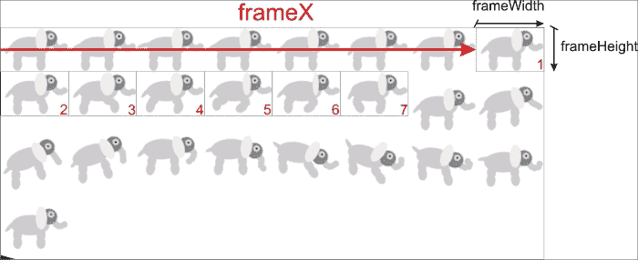

QML 提供了一个 `Sprite` 元素类型，它有一个 `source` 属性，指向容器图像的 URL，一个 `frameWidth` 和 `frameHeight` 元素确定每帧的大小，以及一个 `frameCount` 元素定义精灵中的帧数。通过设置 `frameX` 和 `frameY` 属性的值可以偏移图像。除此之外，还有一些额外的属性；其中最重要的三个是 `frameRate`、`frameDuration` 和 `duration`。所有这些属性都用于确定动画的速度。如果定义了 `frameRate` 元素，它被解释为每秒循环的帧数。如果没有定义此属性，则 `frameDuration` 元素生效，它被视为显示单帧的时间段（因此，它是 `frameRate` 元素的倒数）。如果没有定义此属性，则使用 `duration` 元素，它包含整个动画的持续时间。你可以设置这三个属性中的任何一个，优先级规则（`frameRate`、`frameDuration`、`duration`）将决定哪些属性将被应用。

# 行动时间 - 使用精灵来动画化角色

我们不再等待。当前的任务是将之前练习中的手动动画替换为基于精灵的动画。

打开 `Player.qml` 文档，移除负责显示玩家角色的整个图像元素：

```cpp
AnimatedSprite {
  id: sprite
  source: "images/walking.png"
  frameX: 560
  frameY: 0
  frameWidth: 80
  frameHeight: 52
  frameCount: 7
  frameRate: 10
  interpolate: true
  width: frameWidth
  height: frameHeight

  running: player.walking
  anchors.bottom: parent.bottom
  anchors.horizontalCenter: parent.horizontalCenter

  transform: Scale {
    origin.x: sprite.width/2
    xScale: player.facingLeft ? -1 : 1
  }
}
```

## *刚才发生了什么？*

我们已经将之前的静态图像替换为不断变化的源，使用不同的项目。由于 `Sprite` 参数不是一个 `Item` 元素，而是一个精灵的数据定义，我们无法将其用作 `Image` 元素的替代。相反，我们将使用 `AnimatedSprite` 元素，这是一个可以显示单个内联定义的动画精灵的项目。它甚至具有与 `Sprite` 参数相同的属性集。我们定义了一个嵌入在 `images/walking.png` 中的精灵，宽度为 `80` 像素，高度为 `52` 像素。该精灵由七个帧组成，应以每秒 10 帧的速度显示。`running` 属性的设置类似于原始的 `Animation` 元素。由于 `AnimatedSprite` 元素没有 `mirror` 属性，我们通过应用一个水平翻转项目的缩放变换来模拟它，如果 `player.facingLeft` 元素评估为 `true`。此外，我们设置 `interpolate` 属性为 `true`，这使得精灵引擎计算帧之间的更平滑的过渡。

我们留下的结果是类似于早期尝试的结果，所以如果这两个相似，为什么还要使用精灵呢？在许多情况下，你想要的动画比单个帧序列更复杂。如果我们想动画化 Benjamin 跳跃的方式，除了他走路之外呢？虽然可能嵌入更多的手动动画，但这会爆炸性地增加保持对象状态所需的内部变量数量。幸运的是，Qt Quick 精灵引擎可以处理这种情况。我们使用的 `AnimatedSprite` 元素只提供了整个框架功能的一个子集。通过用 `SpriteSequence` 元素替换项目，我们获得了精灵的全部功能。在谈论 `Sprite` 时，我们没有告诉你对象的一个附加属性，即名为 `to` 的属性，它包含从当前精灵到另一个精灵的转换概率映射。通过声明当前精灵迁移到的精灵，我们创建了一个具有加权转换到其他精灵的状态机，以及循环回当前状态。

通过在 `SpriteSequence` 对象上设置 `goalSprite` 属性来触发过渡到另一个精灵。这将导致精灵引擎遍历图直到达到请求的状态。这是一种通过经过多个中间状态来流畅地从一个动画切换到另一个动画的绝佳方式。

而不是要求精灵机优雅地过渡到某个给定状态，可以通过调用 `SpriteSequence` 类的 `jumpTo()` 方法并传入应开始播放的精灵名称来强制立即更改。

需要澄清的最后一件事是如何将精灵状态机实际附加到 `SpriteSequence` 类。这非常简单；只需将 `Sprite` 对象数组分配给 `sprites` 属性。

# 行动时间 – 添加带有精灵转换的跳跃

让我们在 Benjamin the Elephant 动画中将 `AnimatedSprite` 类替换为 `SpriteSequence` 类，添加一个在跳跃阶段要播放的精灵。

打开 `Player.qml` 文件，并用以下代码替换 `AnimatedSprite` 对象：

```cpp
SpriteSequence {
  id: sprite
  width: 80
  height: 52
  anchors.bottom: parent.bottom
  anchors.horizontalCenter: parent.horizontalCenter
  currentSprite: "still"
  running: true

  Sprite {
    name: "still"
    source: "images/walking.png"
    frameCount: 1
    frameWidth: 80
    frameHeight: 52
    frameDuration: 100
    to: {"still": 1, "walking": 0, "jumping": 0}
  }
  Sprite {
    name: "walking"
    source: "images/walking.png"
    frameCount: 7
    frameWidth: 80
    frameHeight: 52
    frameRate: 10
    to: {"walking": 1, "still": 0, "jumping": 0}
  }
  Sprite {
    name: "jumping"
    source: "images/jumping.png"
    frameCount: 11
    frameWidth: 80
    frameHeight: 70
    frameRate: 4
    to: { "still" : 1 }
  }

  transform: Scale {
    origin.x: sprite.width/2
    xScale: player.facingLeft ? -1 : 1
  }
}
```

接下来，通过添加以下高亮更改来扩展 `jumpAnim` 对象：

```cpp
SequentialAnimation {
  id: jumpAnim
  running: false
 ScriptAction { script: sprite.goalSprite = "jumping" }
  NumberAnimation {
    target: player; property: "y"
    to: player.parent.height-50; easing.type: Easing.OutQuad 
  }
  NumberAnimation {
    target: player; property: "y"
    to: player.parent.height; easing.type: Easing.InQuad 
  }
 ScriptAction {
 script: { sprite.goalSprite = ""; sprite.jumpTo("still"); } 
 }
}
```

## *发生了什么？*

我们所介绍的 `The SpriteSequence` 元素，其 `Item` 元素相关的属性设置方式与使用 `AnimatedSprite` 元素时相同。除此之外，一个名为 "still" 的精灵被明确设置为当前精灵。我们定义了一系列 `Sprite` 对象作为 `SpriteSequence` 元素的子元素。这相当于将这些精灵分配给对象的 `sprites` 属性。所声明的完整状态机在以下图中展示：

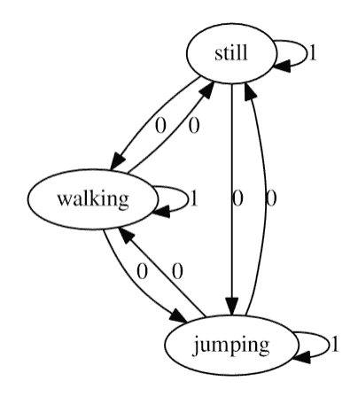

一个名为 "still" 的精灵仅有一个帧，代表本杰明不动的情景。由于加权转换回 "still" 状态，该精灵保持旋转在相同的状态。从该状态剩余的两个转换的权重被设置为 `0`，这意味着它们永远不会自发触发，但可以通过将 `goalSprite` 属性设置为可以通过激活这些转换之一到达的精灵来调用。

连续动画被扩展到当大象升空时触发精灵变化。

## 尝试一下英雄 – 让本杰明在期待中摇尾巴

为了练习精灵转换，你的目标是扩展本杰明 `SpriteSequence` 元素的状态机，使他在大象站立时摇尾巴。你可以在本书附带的材料中找到适当的精灵。精灵字段称为 `wiggling.png`。通过使其可能从 "still" 状态自发地转换到 "wiggling" 来实现此功能。注意确保动物在玩家激活左右箭头键的瞬间停止摇尾巴并开始行走。

## 透视滚动

我们已经在 第六章 *图形视图* 中讨论了有用的透视滚动技术。为了回顾，它通过以不同的速度移动背景的多个层，根据假设的层与观察者的距离，给 2D 游戏带来深度感。现在我们将看到在 Qt Quick 中应用相同技术是多么容易。

# 行动时间 – 回顾透视滚动

我们将使用一组与玩家移动方向相反移动的层来实现透视滚动。因此，我们需要定义场景和移动层。

创建一个新的 QML 文档（Qt Quick 2）。命名为 `ParallaxScene.qml`。场景将涵盖整个游戏 "级别" 并将玩家的位置暴露给移动层。在文件中放入以下代码：

```cpp
import QtQuick 2.2

Item {
  id: root
  property int currentPos
  x: -currentPos*(root.width-root.parent.width)/width
}
```

然后，创建另一个 QML 文档（Qt Quick 2），命名为 `ParallaxLayer.qml`。使其包含以下定义：

```cpp
import QtQuick 2.2

Item {
  property real factor: 0
  x: factor > 0 ? -parent.currentPos/factor - parent.x : 0
}
```

现在，让我们在主 QML 文档中使用两种新的元素类型。我们将从早期的场景定义中提取元素，并将它们制作成不同的透视层——天空、树木和草地：

```cpp
Rectangle {
  id: view

  width: 600
  height: 380

  ParallaxScene {
    id: scene
    width: 1500; height: 380
    anchors.bottom: parent.bottom
    currentPos: player.x

    ParallaxLayer {
      factor: 7.5
      width: sky.width; height: sky.height
      anchors.bottom: parent.bottom
      Image { id: sky; source: "sky.png" }
    }
    ParallaxLayer {
      factor: 2.5
      width: trees.width; height: trees.height
      anchors.bottom: parent.bottom
      Image { id: trees; source: "trees.png" }
    }
    ParallaxLayer {
      factor: 0
      width: grass.width; height: grass.height
      anchors.bottom: parent.bottom
      Image { id: grass; source: "grass.png" }
    }

    Item {
      id: player
      // ...
    }
  }
}
```

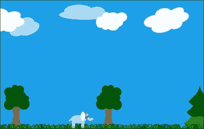

## *发生了什么？*

我们实现的`ParallaxScene`元素是一个移动平面。其水平偏移量取决于角色的当前位置和视图的大小。场景滚动的范围由场景大小和视图大小的差值决定——它说明了当角色从场景的左侧移动到右侧时，我们需要滚动多少，以便它始终在视图中。如果我们用场景宽度作为分数乘以角色与场景左侧的距离，我们将得到视图中的所需场景偏移量（或者说，场景的投影偏移量）。

第二种类型——`ParallaxLayer`也是一个移动平面。它定义了一个距离因子，表示背景层相对于前景层的相对距离（深度），这影响了平面相对于前景（场景）应该滚动多快。`0`的值意味着该层应该以与前景层完全相同的速度移动。值越大，层相对于角色的移动速度越慢。偏移值是通过将角色在场景中的位置除以因子来计算的。由于前景层也在移动，我们必须在计算每个视差层的偏移时考虑它。因此，我们减去场景的水平位置以获得实际的层偏移。

当层逻辑上定义后，我们可以将它们添加到场景中。每一层都有一个物理表示，在我们的例子中，是包含天空、树木和草地纹理的静态图像。每一层都是单独定义的，可以独立存在，包含静态和动画元素，这些元素对其他层没有影响。如果我们想要渲染一个从东向西移动的太阳，我们会将它放在天空层上，并从层的一边动画到另一边，持续时间较长。

## 尝试一下英雄 - 垂直视差滑动

作为额外的练习，你可能还想在水平视差滑动的基础上实现垂直视差滑动。只需使你的场景更大，并使其除了报告由`currentPos`元素报告的水平滚动位置外，还暴露垂直滚动位置。然后，只需重复对每一层的`y`属性的所有计算，你很快就能完成。记住，`x`和`y`的距离因子可能不同。

## 碰撞检测

Qt Quick 中没有内置的碰撞检测支持，但有三种提供此类支持的方法。首先，你可以使用在许多 2D 物理引擎中可用的现成碰撞系统，如 Box2D。其次，你可以自己用 C++实现一个简单的碰撞系统。最后，你可以通过比较对象坐标和边界框直接在 JavaScript 中执行碰撞检查。

我们的游戏非常简单；因此，我们将使用最后一种方法。如果我们游戏中涉及更多的移动对象，那么我们可能会选择第二种方法。如果你有一个可以旋转并与其他对象碰撞反弹的非矩形形状的对象，第一种方法是最好的。在这种情况下，有一个物理引擎在手变得非常有用。

# 行动时间 – 收集硬币

从 Qt Creator 的菜单中，访问 **文件** | **新建文件或项目**。从 **Qt 文件和类**，选择 JS 文件模板。将文件命名为 "`collisions.js`"。将以下内容放入文档中：

```cpp
pragma library

function boundingBox(object1) {
  var cR = object1.childrenRect
  var mapped = object1.mapToItem(object1.parent, cR.x, cR.y, cR.width, cR.height)
  return Qt.rect(mapped.x, mapped.y, mapped.width, mapped.height)
}

function intersect(object1, object2) {
  var r1 = boundingBox(object1)
  var r2 = boundingBox(object2)
  return (r1.x <= r2.x+r2.width  && // r1.left <= r2.right
  r2.x <= r1.x+r1.width  && // r2.left <= r1.right
  r1.y <= r2.y+r2.height && // r1.top <= r2.bottom
  r2.y <= r1.y+r1.height)   // r2.top <= r1.bottom
}
```

创建另一个 JS 文件并命名为 "`coins.js`"。输入以下内容：

```cpp
import "collisions.js"

var coins = []

coins.collisionsWith = function(player) {
  var collisions = []
  for(var index = 0; index < length; ++index) {
    var obj = this[index]
    if(intersect(player, obj)) collisions.push(obj)
  }
  return collisions
}
coins.remove = function(obj) {
  var arr = isArray(obj) ? obj : [ obj ]
  var L = arr.length
  var idx, needle
  while(L && this.length) {
    var needle = arr[--L]
    idx = this.indexOf(needle)
    if(idx != -1) { this.splice(idx, 1) }
  }
  return this
}
```

最后，打开主文档并添加以下 `import` 语句：

```cpp
import "coins.js"
```

在玩家对象中，定义 `checkCollisions()` 函数：

```cpp
function checkCollisions() {
  var result = coins.collisionsWith(player)
  if(result.length == 0) return
  result.forEach(function(coin) { coin.hit() })
  coins.remove(result) // prevent the coin from being hit again
}
```

最后，在同一个玩家对象中，通过处理玩家位置的变化来触发碰撞检测：

```cpp
onXChanged: { checkCollisions() }
onYChanged: { checkCollisions() }
```

在 `Coin.qml` 文件中，定义一个动画和一个 `hit()` 函数：

```cpp
SequentialAnimation {
  id: hitAnim
  running: false
  NumberAnimation {
    target: coin
    property: "opacity"
    from: 1; to: 0
    duration: 250
  }
  ScriptAction {
    script: coin.destroy()  
  }
}

function hit() {
  hitAnim.start()
}
```

## *发生了什么？*

文件 `collisions.js` 包含用于执行碰撞检查的函数。文件的第一行是一个 pragma 语句，指出该文档只包含函数，不包含任何可变对象。这样我们就可以添加一个 `.pragma library` 语句，将文档标记为可以由导入它的文档共享的库。这有助于减少内存消耗并提高速度，因为引擎不需要每次导入时都重新解析和执行文档。

库中定义的函数非常简单。第一个函数根据对象的坐标和子元素的大小返回对象的边界矩形。它假设顶级项为空，并包含代表对象视觉方面的子元素。子元素坐标使用 `mapToItem` 元素映射，以便返回的矩形以父项坐标表示。第二个函数对两个边界矩形之间的交集进行简单检查，如果它们相交则返回 `true`，否则返回 `false`。

第二个文档保持了一个硬币数组的定义。它向数组对象添加了两个方法。第一个方法——`collisionsWith`——使用在 `collisions.js` 中定义的函数在数组中的任何项和给定的对象之间执行碰撞检查。这就是为什么我们在文档开头导入库的原因。该方法返回另一个包含与 `player` 参数相交的对象的数组。另一个方法，称为 `remove`，接受一个对象或对象数组，并将它们从 `coins` 中移除。

该文档不是一个库；因此，每个导入 `coins.js` 的文档都会得到该对象的一个单独副本。因此，我们需要确保在游戏中只导入一次 `coins.js`，以便该文档中定义的对象的所有引用都与程序内存中对象的同一实例相关联。

我们的主要文档导入了`coins.js`，它创建了一个用于存储硬币对象的数组，并使其辅助函数可用。这使得定义的`checkCollisions()`函数能够检索与玩家碰撞的硬币列表。对于每个与玩家碰撞的硬币，我们执行一个`hit()`方法；作为最后一步，所有碰撞的硬币都会从数组中移除。由于硬币是静止的，碰撞只能在玩家角色进入硬币占据的区域时发生。因此，当玩家角色的位置改变时触发碰撞检测就足够了——我们使用`onXChanged`和`onYChanged`处理程序。

由于击中硬币会导致其从数组中移除，我们失去了对该对象的引用。`hit()`方法必须启动从场景中移除对象的过程。这个函数的最简实现可能只是调用对象的`destroy()`函数，但我们做得更多——通过在硬币上运行淡出动画可以使移除过程更加平滑。作为最后一步，动画可以销毁对象。

## 碰撞检测的注意事项

我们在场景中追踪的对象数量非常少，并且我们将每个对象的形状简化为矩形。这使得我们可以通过 JavaScript 来检查碰撞。对于大量移动对象、自定义形状和旋转处理，拥有一个基于 C++的碰撞系统会更好。这样一个系统的复杂程度取决于你的需求。

## 眼睛的甜点

一款游戏不应该仅仅基于一个有趣的想法；它不仅应该在各种设备上流畅运行，为玩家提供娱乐，还应该看起来很漂亮，表现得很优雅。无论是从同一游戏的多个类似实现中选择，还是愿意为另一个价格相似且有趣的类似游戏花钱，有很大可能性，玩家选择的游戏将是看起来最好的那款——拥有大量的动画、图形和闪亮的元素。我们已经学习了许多使游戏更吸引眼球的技巧，例如使用动画或 GLSL 着色器。在这里，我们将向您展示一些其他可以使您的 Qt Quick 应用程序更具吸引力的技巧。

### 自动缩放的用户界面

你可能首先实现的功能是让你的游戏自动调整到它正在运行的设备分辨率。基本上有两种方法可以实现这一点。第一种是在窗口（或屏幕）中居中放置用户界面，如果它不合适，则启用滚动。另一种方法是缩放界面，使其始终适合窗口（或屏幕）。选择哪种方法取决于许多因素，其中最重要的是你的 UI 在放大时是否足够好。如果界面由文本和非图像原语（基本上是矩形）组成，或者如果它包括图像但只有矢量图像或非常高分辨率的图像，那么尝试缩放用户界面可能是可以的。否则，如果你使用了大量低分辨率的位图图像，你将不得不为 UI 选择一个特定的尺寸（可选地允许它降级，因为如果你启用抗锯齿，质量下降应该在这个方向上不那么明显）。

无论你选择缩放还是居中并滚动，基本方法都是相同的——你将你的 UI 元素放入另一个元素中，这样无论顶级窗口发生什么变化，你都可以精细控制 UI 几何形状。采用居中方法相当简单——只需将 UI 锚定到父元素的中央。要启用滚动，将 UI 包装在 `Flickable` 元素中，并如果窗口的大小不足以容纳整个用户界面，则约束其大小：

```cpp
Item {
  id: window

  Flickable {
    id: uiFlickable
    anchors.centerIn: parent
    contentWidth: ui.width; contentHeight: ui.height

    width: parent.width >= contentWidth ? contentWidth : parent.width
    height: parent.height >= contentHeight ? contentHeight : parent.height

    UI { id: ui }
  }
}
```

如果 UI 元素没有占据其父元素的全部区域，你可能需要用漂亮的背景装饰顶级元素。

缩放看起来可能更复杂，但使用 Qt Quick 真的非常简单。再次强调，你有两个选择——要么拉伸，要么缩放。拉伸就像执行 `anchors.fill: parent` 命令一样简单，这个命令有效地迫使 UI 重新计算所有项的几何形状，但可能使我们能够更有效地使用空间。通常，对于开发者来说，在视图大小变化时为用户界面中的每个元素提供计算几何形状的表达式是非常耗时的。这通常不值得付出努力。一个更简单的方法是将 UI 元素缩放到适合窗口，这将隐式地缩放包含的元素。在这种情况下，它们的大小可以相对于用户界面主视图的基本大小来计算。为了使这可行，你需要计算应用于用户界面的缩放比例，使其填满整个可用空间。当元素的有效宽度等于其隐式宽度，以及其有效高度等于其隐式高度时，该元素的缩放比例为 1。如果窗口更大，我们希望将元素缩放到达到窗口大小。因此，窗口宽度除以元素的隐式宽度将是元素在水平方向上的缩放比例。这将在以下图中展示：

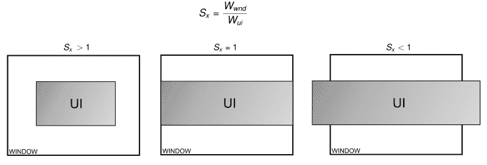

同样的方法也适用于垂直方向，但如果 UI 的宽高比与窗口不同，其水平和垂直缩放因子也会不同。为了使 UI 看起来更美观，我们必须取两个值中较小的一个——只将方向扩展到较少空间允许的程度，在另一个方向上留下空白：

```cpp
Item {
  id: window

  UI {
    id: ui

    anchors.centerIn: parent
    scale: Math.min(parent.width/width, parent.height/height)
  }
}
```

再次，给窗口项添加一些背景以填补空白可能是个好主意。

如果你想在用户界面和窗口之间保留一些边距怎么办？当然，你可以在计算缩放时考虑这一点（例如`(window.width-2*margin)/width`等），但有一个更简单的方法——只需在窗口内放置一个额外的项，留下适当的边距，并将用户界面项放在该额外项中，并将其缩放到额外项的大小：

```cpp
Item {
  id: window
  Item {
 anchors { fill: parent; margins: 10 }
    UI {
      id: ui

      anchors.centerIn: parent
      scale: Math.min(parent.width/width, parent.height/height)
    }
 }
}
```

当你大量缩放元素时，你应该考虑为那些在渲染为不同于其原始大小的尺寸时可能会失去质量的项启用抗锯齿（例如，图像）。在 Qt Quick 中，这非常容易，因为每个`Item`实例都有一个名为`antialiasing`的属性，当启用时，将导致渲染后端尝试减少由抗锯齿效果引起的失真。记住，这会带来渲染复杂性的增加，因此请尝试在质量和效率之间找到平衡，尤其是在低端硬件上。你可能可以为用户提供一个选项，全局启用或禁用所有游戏对象的抗锯齿，或者为不同类型的对象逐渐调整质量设置。

### 图形效果

Qt Quick 中的基本两个预定义项是矩形和图像。人们可以用各种创造性的方式使用它们，并通过应用 GLSL 着色器使它们看起来更愉快。然而，从头开始实现着色器程序是繁琐的，并且需要深入了解着色器语言。幸运的是，许多常见效果已经实现，并以`QtGraphicalEffects`模块的形式准备好使用。

要给在`HeartBeat.qml`文件中定义的基于画布的心跳元素添加微妙的黑色阴影，可以使用类似于以下代码的代码，该代码利用了`DropShadow`效果：

```cpp
import QtQuick 2.0
import QtGraphicalEffects 1.0

Item {
  width: 1000; height: 600
  HeartBeat { id: hb; anchors.centerIn: parent; visible: false }
  DropShadow {
    source: hb
    anchors.fill: hb
    horizontalOffset: 3
    verticalOffset: 3
    radius: 8
    samples: 16
    color: "black"
  }
}
```

要应用阴影效果，你需要一个现有的项作为效果源。在我们的例子中，我们使用了一个`HeartBeat`类的实例，它位于顶级项的中心。然后，定义阴影效果，并使用`anchors.fill`元素使其几何形状跟随其源。就像`DropShadow`类渲染原始项及其阴影一样，可以通过将原始项的`visible`属性设置为`false`来隐藏原始项。

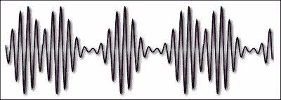

大多数 `DropShadow` 类的属性都是不言自明的，但有两个属性——`radius` 和 `samples`——需要一些额外的解释。阴影是以给定位置偏移的原始项目的模糊单色副本的形式绘制的。这两个提到的属性控制模糊的程度和质量——用于模糊的样本越多，效果越好，但同时也需要执行的计算量也越大。

说到模糊，纯模糊效果在图形效果模块中也是通过 `GaussianBlur` 元素类型提供的。要将模糊效果应用于上一个示例而不是阴影，只需将 `DropShadow` 类的实例替换为以下代码：

```cpp
GaussianBlur {
  source: hb
  anchors.fill: hb
  radius: 12
  samples: 20
  transparentBorder: true
}
```

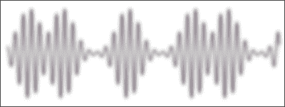

在这里，你可以看到前面提到的两个属性以及一个名称模糊的 `transparentBorder` 属性。启用此属性可以修复模糊边缘的一些伪影，并且通常你希望保持这种方式。

## 尝试一下英雄——模糊视差滚动游戏视图

`blur` 属性是一个非常棒的效果，可以在许多情况下使用。例如，你可以在我们的象形游戏中尝试实现一个功能，当用户暂停游戏时（例如，通过按键盘上的 *P* 键），视图会变得模糊。通过应用动画到效果属性的 `radius` 上，使效果平滑。

另一个有趣的效果是 `Glow`。它渲染源元素的彩色和模糊副本。对于游戏的一个用例是突出显示用户界面的某些部分——你可以通过使元素周期性地闪烁来引导用户的注意力（例如，按钮或徽章）：

```cpp
Badge {
  id: importantBadge
}
Glow {
  source: importantBadge
  anchors.fill: source
  samples: 16
  color: "red"

  SequentialAnimation on radius {
    loops: Animation.Infinite
    running: true

    NumberAnimation { from: 0; to: 10; duration: 2000 }
    PauseAnimation  { duration: 1000 }
    NumberAnimation { from: 10; to: 0; duration: 2000 }
    PauseAnimation  { duration: 1000 }
  }
}
```

完整模块包含 20 种不同的效果。我们无法在这里详细描述每种效果。不过，你可以自己了解它们。如果你在克隆的模块源 git 仓库（位于克隆仓库的 `tests/manual/testbed` 子目录下）中克隆了模块，你将找到一个用于测试现有效果的不错应用程序。要运行此工具，请使用 `qmlscene` 打开 `testBed.qml` 文件。

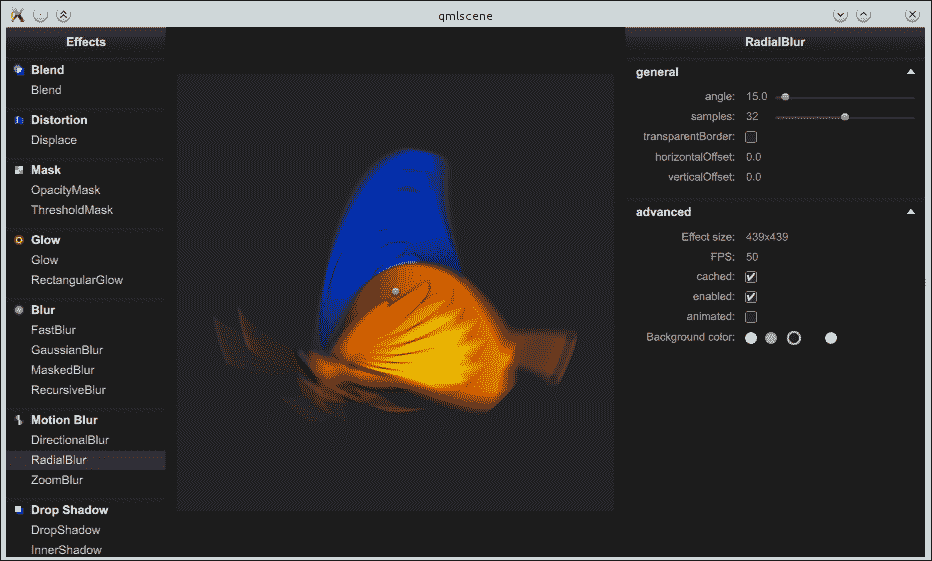

### 小贴士

你也可以通过导航到文档中的 **GraphicalEffects** 帮助页面来访问完整的效应列表及其简短描述。

### 粒子系统

在游戏等系统中，常用的视觉效果是生成大量小型、通常短暂、通常快速移动、模糊的对象，如星星、火花、烟雾、灰尘、雪、碎片、落叶等。将这些对象作为场景中的常规项目放置会大大降低性能。相反，使用一个特殊的引擎来维护此类对象的注册表，并跟踪（模拟）它们的逻辑属性，而不在场景中具有物理实体。这些称为粒子的对象，在请求时使用非常高效的算法在场景中进行渲染。这允许我们使用大量粒子，而不会对场景的其他部分产生负面影响。

Qt Quick 在 `QtQuick.Particles` 导入中提供了一个粒子系统。`ParticleSystem` 元素提供了模拟的核心，它使用 `Emitter` 元素来生成粒子。然后根据 `ParticlePainter` 元素中的定义进行渲染。可以使用 `Affector` 对象来操纵模拟实体，这些对象可以修改粒子的轨迹或生命周期。

让我们从简单的例子开始。以下代码片段声明了最简单的粒子系统：

```cpp
import QtQuick 2.0
import QtQuick.Particles 2.0

ParticleSystem {
  id: particleSystem
  width: 360; height: 360

  Emitter { anchors.fill: parent }
  ImageParticle { source: "star.png" }
}
```

结果可以在以下图像中观察到：

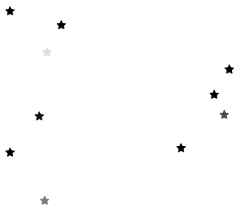

让我们分析一下代码。在导入 `QtQuick.Particles 2.0` 之后，实例化了一个 `ParticleSystem` 项目，它定义了粒子系统的域。我们在该系统中定义了两个对象。第一个对象是 `Emitter`，它定义了粒子生成的区域。该区域设置为包含整个域。第二个对象是 `ImageParticle` 类型的对象，它是 `ParticlePainter` 子类的实例。它确定粒子应以给定图像的实例进行渲染。默认情况下，`Emitter` 对象每秒生成 10 个粒子，每个粒子存活一秒后死亡并被从场景中移除。在所提供的代码中，`Emitter` 和 `ImageParticle` 对象是 `ParticleSystem` 类的直接子代；然而，这不必是这种情况。可以通过设置 `system` 属性显式指定粒子系统。

### 调整发射器

您可以通过设置发射器的 `emitRate` 属性来控制发射的粒子数量。另一个名为 `lifeSpan` 的属性决定了粒子死亡前需要多少毫秒。为了引入一些随机行为，您可以使用 `lifeSpanVariation` 属性来设置系统可以改变生命周期（在两个方向上）的最大时间（以毫秒为单位）。增加粒子的发射率和生命周期可能导致需要管理（和可能渲染）的粒子数量非常大。这可能会降低性能；因此，可以通过 `maximumEmitted` 属性设置可以同时存在的粒子的上限：

```cpp
ParticleSystem {
  id: particleSystem
  width: 360; height: 360

  Emitter {
    anchors.fill: parent
    emitRate: 350
    lifeSpan: 1500
    lifeSpanVariation: 400 // effective: 1100-1900 ms
  }
  ImageParticle { source: "star.png" }
}
```

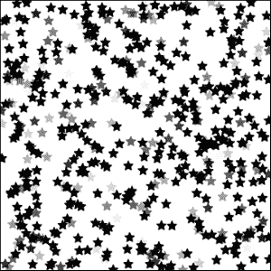

调整粒子的生命周期可以使系统更加多样化。为了增强效果，您还可以通过 `size` 和 `sizeVariation` 属性来操作每个粒子的尺寸：

```cpp
ParticleSystem {
  id: particleSystem
  width: 360; height: 360

  Emitter {
    anchors.fill: parent
    emitRate: 50
    size: 12
    sizeVariation: 6
    endSize: 2
  }
  ImageParticle { source: "star.png" }
}
```

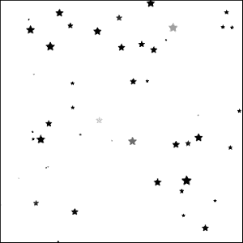

到目前为止展示的功能范围应该足够创建许多看起来不错且实用的粒子系统。到目前为止的限制是粒子从发射器的整个区域发射出来，这是一个常规的 `QQuickItem`，因此是矩形的。但这不必是这种情况。`Emitter` 元素包含一个 `shape` 属性，这是一种声明要产生粒子的区域的方式。`QtQuick.Particles` 参数定义了三种可用的自定义形状类型——`EllipseShape`、`LineShape` 和 `MaskShape`。前两种非常简单，定义了在项目内绘制的空椭圆或填充椭圆，或者穿过项目两条对角线之一的线。`MaskShape` 元素更有趣，因为它使得可以使用图像作为 `Emitter` 元素的形状。

```cpp
ParticleSystem {
  id: particleSystem
  width: 360; height: 360

  Emitter {
    anchors.fill: parent
    emitRate: 1600
    shape: MaskShape { source: "star.png" }
  }
  ImageParticle { source: "star.png" }
}
```

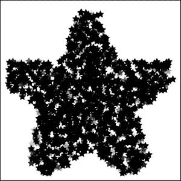

### 渲染粒子

到目前为止，我们使用裸露的 `ImageParticle` 元素来渲染粒子。它只是三种 `ParticlePainters` 之一，其他两种是 `ItemParticle` 和 `CustomParticle`。但在我们继续探讨其他渲染器之前，让我们专注于调整 `ImageParticle` 元素以获得一些有趣的效果。

`ImageParticle` 元素将每个逻辑粒子渲染为图像。可以通过改变颜色和旋转、变形形状或将其用作精灵动画来分别对每个粒子进行操作。

要影响粒子的颜色，您可以使用大量专用属性中的任何一个——`alpha`、`color`、`alphaVariation`、`colorVariation`、`redVariation`、`greenVariation` 和 `blueVariation`。前两个属性定义了相应属性的基值，其余属性设置相应参数从基值出发的最大偏差。在透明度的情况下，您只能使用一种类型的偏差，但在定义颜色时，您可以为红色、绿色和蓝色通道设置不同的值，或者您可以使用全局的 `colorVariation` 属性，这类似于为所有三个通道设置相同的值。允许的值在 0（不允许偏差）到 1.0（任一方向 100%）之间。

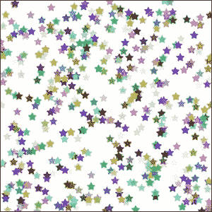

提到的属性是静态的——粒子在其整个生命周期中遵循恒定值。`ImageParticle` 元素还公开了两个属性，让您可以控制粒子相对于其年龄的颜色。首先，有一个名为 `entryEffect` 的属性，它定义了粒子在其诞生和死亡时会发生什么。默认值是 `Fade`，这使得粒子在其生命开始时从 0 不透明度淡入，并在它们死亡前恢复到 0 不透明度。您已经在所有之前展示的粒子动画中体验过这种效果。该属性的其它值是 `None` 和 `Scale`。第一个值很明显——与粒子无关的进入效果。第二个值在粒子诞生时从 0 开始缩放，并在生命结束时缩放回 0。

另一个与时间相关的属性是 `colorTable`。您可以向其中提供用作确定粒子在其生命周期中颜色的单维纹理的图像的 URL。一开始，粒子由图像的左侧边缘定义颜色，然后以线性方式向右移动。在这里设置包含颜色渐变的图像以实现颜色之间的平滑过渡是最常见的做法。

可以改变的第二个参数是粒子的旋转。在这里，我们既可以使用定义旋转常量值（`rotation` 和 `rotationVariation`）的属性，这些属性以度为单位指定，也可以使用 `rotationVelocity` 和 `rotationVelocityVariation` 在时间上修改粒子的旋转。速度定义了每秒旋转的度数。

粒子还可以变形。`xVector` 和 `yVector` 属性允许绑定向量，这些向量定义了水平和垂直轴上的扭曲。我们将在下一节中描述如何设置向量。最后但同样重要的是，使用 `sprites` 属性，您可以定义一个将用于渲染粒子的精灵列表。这与本章早期部分中描述的 `SpriteAnimation` 的工作方式类似。

### 使粒子移动

除了淡入淡出和旋转之外，我们迄今为止看到的粒子系统都非常静态。虽然这对于制作星系很有用，但对于爆炸、火花甚至下雪来说却毫无用处。这是因为粒子主要关于运动。在这里，我们将向您展示使您的粒子飞行的两个方面。

第一个方面是模拟粒子的诞生方式。这意味着创建粒子的物体的物理条件。在爆炸过程中，物质以非常大的力量从震中推开，导致空气和小物体以极高的速度向外冲出。火箭发动机的烟雾以与推进器相反的方向以高速喷射。移动的彗星会拖着一缕尘埃和气体，这些尘埃和气体是由惯性引起的。

所有这些条件都可以通过设置粒子的速度或加速度来建模。这两个指标由确定给定数量方向和数量（大小或长度）的向量的向量来描述。在 Qt Quick 中，这样的向量由一个称为`StochasticDirection`的元素类型表示，其中向量的尾部连接到对象，而头部位置由`StochasticDirection`实例计算。由于我们没有设置粒子属性的方法，因为我们没有代表它们的对象，所以这两个属性——`velocity`和`acceleration`——应用于产生粒子的发射器。因为你可以在一个粒子系统中有很多发射器，所以你可以为不同来源的粒子设置不同的速度和加速度。

有四种不同类型的方向元素，代表关于方向的不同信息来源。首先，有`CumulativeDirection`，它作为其他方向类型的容器，并像包含在内的方向的总和一样工作。

然后，有`PointDirection`，在这里你可以指定向量头部应该连接的点的`x`和`y`坐标。为了避免所有粒子朝同一方向的不现实效果，你可以指定`xVariation`和`yVariation`来引入从给定点的允许偏差。

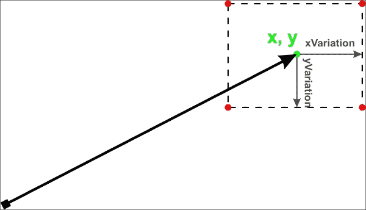

第三种类型是最受欢迎的随机方向类型——`AngleDirection`，它直接指定向量的角度（从正右方向顺时针计算）和大小（每秒像素数）。角度可以从基础值通过`angleVariation`变化，同样，`magnitudeVariation`可以用来引入向量大小的变化：

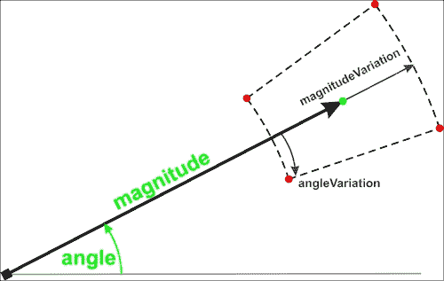

最后一种类型与前面的一种类似。`TargetDirection`向量可以用来将向量指向给定 Qt Quick 项的中心（通过`targetItem`属性设置）。向量的长度通过给出`magnitude`和`magnitudeVariation`来计算，两者都可以解释为每秒像素数或源点和目标点之间距离的倍数（取决于`proportionalMagnitude`属性的值）：

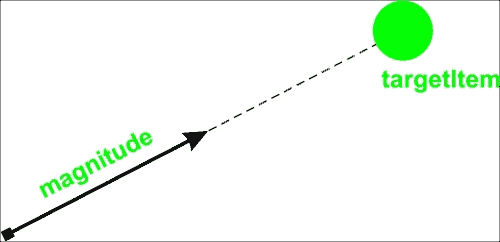

让我们回到设置粒子速度。我们可以使用`AngleDirection`向量来指定粒子应该向左移动，以最大 45 度的角度扩散：

```cpp
Emitter {
  anchors.centerIn: parent
  width: 50; height: 50
  emitRate: 50

  velocity: AngleDirection {
    angleVariation: 45
    angle: 180
    magnitude: 200
  }
}
```

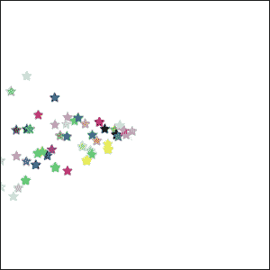

设置加速度的工作方式相同。你甚至可以设置每个粒子应该具有的初始速度和加速度。向左发射粒子并开始向下拉是非常容易的：

```cpp
Emitter {
  anchors.right: parent.right
  anchors.verticalCenter: parent.verticalCenter
  emitRate: 15
  lifeSpan: 5000

  velocity: AngleDirection {
    angle: 180
    magnitude: 200
  }
  acceleration: AngleDirection {
    angle: 90 // local left = global down
    magnitude: 100
  }
}
```

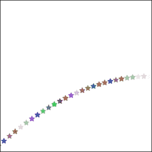

`Emitter`元素有一个在移动粒子上下文中很有用的额外属性。将`velocityFromMovement`参数设置为不同于`0`的值，会使`Emitter`元素的任何移动都应用于粒子的速度。附加向量的方向与发射器的移动方向相匹配，其大小设置为发射器速度乘以设置为`velocityFromMovement`的值。这是一种生成火箭发动机喷出的烟雾的绝佳方式：

```cpp
Item {
  Image {
    id: image
    source: "rocket.png"
  }
  Emitter {
    anchors.right: image.right
    anchors.verticalCenter: image.verticalCenter
    emitRate: 500
    lifeSpan: 3000
    lifeSpanVariation: 1000
    velocityFromMovement: -20

    velocity: AngleDirection {
      magnitude: 100
      angleVariation: 40
    }
  }
  NumberAnimation on x {
    ...
  }
}
```

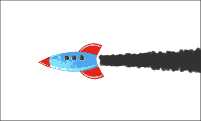

处理粒子行为的第二种方式是在粒子出生后影响它们的属性——在任何特定的生活时刻。这可以通过使用影响者来实现。这些是继承影响者的项目，可以修改正在通过影响者区域的粒子的某些属性。最简单的影响者之一是`Age`。它可以将粒子推进到它们生命中的某个点，此时它们只剩下`lifeLeft`毫秒的生命。

```cpp
Age {
  once: true
  lifeLeft: 500
  shape: EllipseShape { fill: true }
  anchors.fill: parent
}
```

将`once`设置为`true`使得每个影响者只对给定的粒子产生一次影响。否则，每个粒子可以多次修改其属性。

另一种影响类型是重力，它可以在给定角度加速粒子。摩擦可以减慢粒子的速度，而吸引物将影响粒子的位置、速度或加速度，使其开始向一个特定点移动。漫游非常适合模拟雪花或蝴蝶以伪随机方向飞行的场景。

还有其他类型的影响者可用，但在这里我们不会详细介绍。然而，我们想提醒您，不要过度使用影响者——它们可能会严重降低性能。

# 行动时间——消失的硬币产生粒子

现在是时候练习我们新获得的本领了。任务是当玩家收集硬币时，向游戏中添加粒子效果。当收集到硬币时，硬币会爆炸成一片五彩缤纷的星星。

首先，声明一个粒子系统，使其填充游戏场景，以及粒子画家定义：

```cpp
ParticleSystem {
  id: coinParticles
  anchors.fill: parent // scene is the parent

  ImageParticle {
    source: "particle.png"
    colorVariation: 1
    rotationVariation: 180
    rotationVelocityVariation: 10
  }
}
```

接下来，修改硬币的定义以包括一个发射器：

```cpp
Emitter {
  id: emitter
  system: coinParticles
  emitRate: 0
  lifeSpan: 500
  lifeSpanVariation: 100
  velocity: AngleDirection { angleVariation: 180; magnitude: 10 }
  acceleration: AngleDirection { angle: 270; magnitude: 2 }
}
```

最后，必须更新击中函数：

```cpp
function hit() {
  emitter.burst(50)
  hitAnim.start()
}
```

## *刚才发生了什么？*

在这个练习中，我们定义了一个简单的粒子系统，它填充了整个场景。我们为粒子定义了一个简单的图像画家，其中我们允许粒子采用所有颜色并在所有可能的旋转中开始。我们使用星形像素图作为粒子模板。

然后，将`Emitter`对象附加到每个硬币上。其`emitRate`设置为`0`，这意味着它不会自行发射任何粒子。我们为粒子设置了不同的生存期，并通过设置它们的初始速度，在两个方向上设置角度变化为 180 度（总共 360 度），使它们向所有方向飞行。通过设置加速度，我们给粒子一个向场景底部边缘移动的倾向。

在击中函数中，我们在发射器上调用一个 `burst()` 函数，这使得它能够立即产生一定数量的粒子。

# 摘要

在本章中，我们向您展示了如何扩展您的 QML 技能，使您的应用程序动态且吸引人。我们回顾并改进了之前用 C++ 创建的游戏，让您熟悉碰撞检测、状态驱动对象和时间驱动的游戏循环等概念。我们还向您介绍了一种名为 `ShaderEffect` 的工具，它可以作为创建令人惊叹的图形而不牺牲性能的手段，并教会您使用粒子系统。

当然，Qt Quick 比所有这些都要丰富得多，但我们不得不在某处停下来。我们希望传授给您的技能集应该足够开发许多优秀的游戏。然而，许多元素具有比我们在这里描述的更多的属性。每当您想要扩展您的技能时，您都可以查看参考手册，看看元素类型是否有更多有趣的属性。

这就结束了我们关于使用 Qt 进行游戏编程的书籍。我们向您介绍了 Qt 的一般基础知识，描述了其小部件领域，并引入了 Qt Quick 的迷人世界。小部件（包括图形视图）和 Qt Quick 是您在用 Qt 框架创建游戏时可以采取的两种路径。我们还向您展示了如何通过利用您可能拥有的任何 OpenGL 技能来合并这两种方法，超越 Qt 当前的提供。此时，您应该开始尝试和实验，如果在任何时刻您感到迷茫或只是缺乏如何做某事的信息，那么非常有帮助的 Qt 参考手册应该是您首先指向的资源。

祝您好运，玩得开心！
