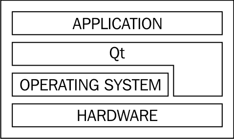
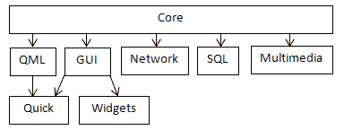

# Qt 简介

在本章中，你将了解 Qt 是什么以及它是如何演变的。我们将描述 Qt 框架的结构及其版本之间的差异。最后，你将学习如何决定哪种 Qt 许可方案适合你的项目。

本章涵盖的主要主题包括：

+   Qt 历史

+   支持的平台

+   Qt 框架结构

+   Qt 版本

+   Qt 许可

# 时光之旅

Qt 的发展始于 1991 年，由两位挪威人——Eirik Chambe-Eng 和 Haavard Nord——发起，他们希望创建一个跨平台的 GUI 编程工具包。Trolltech（创建 Qt 工具包的公司）的第一个商业客户是欧洲航天局。Qt 的商业使用帮助 Trolltech 维持了进一步的发展。当时，Qt 适用于两个平台——Unix/X11 和 Windows——然而，使用 Qt 为 Windows 进行开发需要购买专有许可，这在移植现有的 Unix/Qt 应用程序时是一个重大的缺点。

2001 年 Qt 3.0 版本的发布是一个重要的进步，它最初支持 Mac，并提供了一个在自由 GPL 许可下使用 Qt 为 Unix 和 Mac 的选项。然而，Qt for Windows 仍然仅限于付费许可。尽管如此，在当时，Qt 已经支持市场上的所有重要玩家——Windows、Mac 和 Unix 桌面，包括 Trolltech 的主流产品和 Qt for 嵌入式 Linux。

2005 年，Qt 4.0 发布，这在多个方面都是一个真正的突破。首先，Qt API 被完全重新设计，使其更加清晰和一致。不幸的是，与此同时，它使得现有的基于 Qt 的代码与 4.0 版本不兼容，许多应用程序需要从头开始重写或需要大量努力才能适应新的 API。这是一个艰难的决定，但从时间角度来看，我们可以看到这是值得的。API 变化带来的困难被 Qt for Windows 最终在 GPL 下发布的事实很好地抵消了。引入了许多优化，使 Qt 显著更快。最后，Qt，直到现在都是一个单一库，被分割成多个模块。这允许程序员仅链接到他们在应用程序中使用的功能，减少了内存占用和软件的依赖性。

2008 年，Trolltech 被诺基亚收购，当时诺基亚正在寻找一个软件框架来帮助其扩展并未来取代其 Symbian 平台。Qt 社区出现了分歧；看到 Qt 的开发转移到诺基亚后，一些人感到兴奋，而另一些人则感到担忧。无论如何，新的资金被注入 Qt，加速了其发展，并使其对移动平台开放——首先是 Symbian，然后是 Maemo 和 MeeGo。

对于诺基亚来说，Qt 并不是其自己的产品，而是一种工具。因此，诺基亚决定通过添加一个非常自由的**较轻量级通用公共许可证**（**LGPL**）来向更多开发者介绍 Qt，该许可证允许框架用于开源和闭源开发。

将 Qt 引入新的平台和较弱的硬件需要一种新的方法来创建用户界面，并使它们更轻量、流畅和吸引人。在 Qt 上工作的诺基亚工程师提出了一种新的声明性语言来开发此类界面——**Qt 建模语言**（**QML**）以及为其提供的 Qt 运行时**Qt Quick**。

后者成为了 Qt 进一步发展的主要焦点，实际上阻碍了所有非移动相关的工作，将所有努力都集中在使 Qt Quick 更快、更简单、更广泛地使用。Qt 4 已经在市场上存在了七年，显然必须发布 Qt 的另一个主要版本。决定通过允许任何人向项目贡献来吸引更多工程师。诺基亚于 2011 年成立的 Qt 项目为代码审查提供了基础设施，并引入了开放治理模式，允许外部开发者参与决策。

诺基亚未能完成 Qt 5.0 的开发工作。由于 2011 年诺基亚意外转向不同技术的转变，Qt 部门在 2012 年中被出售给了芬兰公司 Digia，该公司成功完成了这项工作，并在同年 12 月发布了 Qt 5.0，这是一个完全重构的框架。虽然 Qt 5.0 引入了许多新功能，但它与 Qt 4 大部分兼容，允许开发者无缝迁移到新的大版本。

2014 年，Digia 成立了 Qt 公司，现在负责 Qt 的开发、商业化和许可。所有散布在 Qt 项目和 Digia 网站上的 Qt 相关网络资源最终都统一到了[`www.qt.io/`](https://www.qt.io/)。Qt 继续接收错误修复、新功能和新的平台支持。本书基于 2017 年发布的 Qt 5.9。

# 跨平台编程

Qt 是一个用于开发跨平台应用程序的应用程序编程框架。这意味着为某个平台编写的软件可以轻松地移植到另一个平台执行，几乎不需要任何努力。这是通过限制应用程序源代码为所有支持的平台提供的例程和库的调用集来实现的，并通过将所有可能在平台之间不同的任务（如屏幕绘制、访问系统数据或硬件）委托给 Qt 来实现的。这实际上创建了一个分层环境（如下面的图所示），其中 Qt 隐藏了所有平台相关的方面，使其从应用程序代码中不可见：

当然，有时我们需要使用 Qt 不提供的一些功能。在这种情况下，使用条件编译来编写特定平台的代码非常重要。Qt 提供了一组广泛的宏，用于指定当前平台。我们将在 第六章，*Qt 核心基础*中回到这个话题。

# 支持的平台

该框架适用于多种平台，从传统的桌面环境到嵌入式系统再到移动设备。Qt 5.9 支持以下平台：

+   桌面平台：Windows、Linux 和 macOS

+   移动平台：UWP、Android 和 iOS

+   嵌入式平台：VxWorks、INTEGRITY、QNX 和嵌入式 Linux

很可能，在未来的 Qt 版本中，支持的平台列表将发生变化。你应该参考你 Qt 版本的“支持的平台”文档页面，以获取有关支持的操作系统和编译器版本的详细信息。

# GUI 可伸缩性

在桌面应用程序开发的绝大部分历史中，以像素为单位指定 GUI 元素的大小是常见的做法。虽然大多数操作系统长期以来都有 **每英寸点数**（**DPI**）设置和相应的 API 来考虑它，但大多数现有的显示器具有大约相同的 DPI，因此没有高 DPI 支持的应用程序很常见。

当高 DPI 显示器在市场上变得更加普遍时，情况发生了变化——最显著的是在手机和平板电脑上，但笔记本电脑和台式机上也是如此。现在，即使你只针对桌面平台，你也应该考虑支持不同的 DPI 设置。当你针对移动设备时，这变得强制性的。

如果你正在使用 Qt Widgets 或 Qt Quick，你通常根本不需要指定像素大小。标准小部件和控制将使用由样式定义的字体、边距和偏移量。如果使用布局，Qt 将自动确定所有 GUI 元素的位置和大小。尽可能避免为 GUI 元素指定固定大小。你可以使用与其它 GUI 元素大小、窗口或屏幕大小相关的尺寸。Qt 还提供了一组 API 用于查询屏幕 DPI、GUI 样式指标和字体指标，这有助于确定当前设备的最佳尺寸。

在 macOS 和 iOS 上，Qt Widgets 和 Qt Quick 应用程序使用虚拟坐标系自动缩放。应用程序中的像素值保持不变，但 GUI 将根据当前显示的 DPI 进行缩放。例如，如果像素比设置为 2（这是视网膜显示的常见值），则创建宽度为 100 "像素"的小部件将生成具有 200 个物理像素的小部件。这意味着应用程序不必高度关注 DPI 变化。然而，这种缩放不适用于 OpenGL，它始终使用物理像素。

# Qt 版本

每个 Qt 版本号（例如，5.9.2）由主版本、次版本和补丁版本组成。Qt 特别关注不同版本之间的向前和向后兼容性。只有当变更既向前又向后兼容（通常是无需更改任何 API 的 bug 修复）时，才会通过仅更改补丁版本来表示这些小变更。新的次版本通常引入新的 API 和功能，因此它们不是向前兼容的。然而，所有次版本都是向后二进制和源兼容的。这意味着如果您正在过渡到新的次版本（例如，从 5.8 到 5.9），您应该始终能够不进行任何更改就重新构建您的项目。您甚至可以通过仅更新共享的 Qt 库（或让操作系统的包管理器执行此操作）来过渡到新的次版本，而无需重新构建。主要版本表示重大变更，可能会破坏向后兼容性。然而，最新的主要版本（5.0）与上一个版本在源代码级别上主要兼容。

Qt 为某些版本声明**长期支持**（**LTS**）。LTS 版本在三年内接收补丁级别的发布，包括 bug 修复和安全修复。商业支持可提供更长时间。截至撰写本文时，当前的 LTS 发布版本是 5.6 和 5.9。

# Qt 框架的结构

随着 Qt 随着时间的推移而扩展，其结构也发生了演变。最初，它只是一个单独的库，然后是一组库。当它难以维护和更新它所支持的不断增长的平台时，决定将框架拆分为包含在两个模块组中的更小的模块——Qt Essentials 和 Qt Add-ons。与拆分相关的一个主要决定是，每个模块现在都可以有自己的独立发布计划。

# Qt Essentials

Essentials 组包含必须为每个支持的平台实现的模块。这意味着如果您仅使用此组中的模块来实现您的系统，您可以确信它可以轻松地移植到 Qt 支持的任何其他平台。Qt Essentials 模块之间最重要的关系如下所示：

以下是对一些模块的解释：

+   **Qt Core**模块包含所有其他模块所依赖的最基本的 Qt 功能。它提供对事件处理、元对象、数据 I/O、文本处理和线程的支持。它还带来了一些框架，例如动画框架、状态机框架和插件框架。

+   **Qt GUI**模块提供了构建用户界面的基本跨平台支持。它包含更多高级 GUI 模块（Qt Widgets 和 Qt Quick）所需的功能。Qt GUI 包含用于操作可以使用光栅引擎或 OpenGL 渲染的窗口的类。Qt 支持桌面 OpenGL 以及 OpenGL ES 1.1 和 2.0。

+   **Qt Widgets** 通过使用小部件（如按钮、编辑框、标签、数据视图、对话框、菜单和工具栏）以及使用特殊布局引擎来创建用户界面，扩展了 GUI 模块。Qt Widgets 利用 Qt 的事件系统以跨平台的方式处理输入事件。此模块还包含一个面向对象的 2D 图形画布的实现，称为 Graphics View。

+   **Qt Quick** 是 Qt GUI 的扩展，它提供了使用 QML 创建轻量级流畅用户界面的方法。它将在本章后面以及 第十一章*，Qt Quick 简介* 中更详细地描述。

+   **Qt QML** 是 Qt Quick 中使用的 QML 语言的实现。它还提供了 API，用于将自定义 C++ 类型集成到 QML 的 JavaScript 引擎中，以及将 QML 代码与 C++ 集成。

+   **Qt Network** 提供了对 IPv4 和 IPv6 网络的支持，使用 TCP 和 UDP。它还包含 HTTP、HTTPS、FTP 客户端，并扩展了对 DNS 查询的支持。

+   **Qt Multimedia** 允许程序员访问音频和视频硬件（包括摄像头和 FM 收音机）以录制和播放多媒体内容。它还提供了 3D 位置音频支持。

+   **Qt SQL** 提供了一个用于以抽象方式操作 SQL 数据库的框架。

此组中还有其他模块，但在此书中我们将不关注它们。如果您想了解更多关于它们的信息，可以在 Qt 参考手册中查找。

# Qt Add-ons

此组包含任何平台都可选的模块。这意味着如果某些平台上的特定功能不可用，或者没有人愿意花时间为此平台上的此功能工作，这不会阻止 Qt 支持该平台。我们将在下面提到一些最重要的模块：

+   **Qt Concurrent**：这处理多线程处理

+   **Qt 3D**：这提供了高级 OpenGL 构建块

+   **Qt Gamepad**：这使应用程序能够支持游戏手柄硬件

+   **Qt D-Bus**：这允许您的应用程序通过 D-Bus 机制与其他应用程序进行通信

+   **Qt XML Patterns**：这帮助我们访问 XML 数据

许多其他模块也可用，但在此处我们将不涉及它们。

# qmake

一些 Qt 功能在项目的编译和链接过程中需要额外的构建步骤。例如，**元对象编译器**（**moc**）、**用户界面编译器**（**uic**）和**资源编译器**（**rcc**）可能需要执行以处理 Qt 的 C++ 扩展和功能。为了方便，Qt 提供了 **qmake** 可执行文件，该文件管理您的 Qt 项目并生成在当前平台上构建它所需的文件（例如，make 工具的 Makefile）。qmake 从具有 `.pro` 扩展名的项目文件中读取项目的配置。Qt Creator（Qt 伴随的 IDE）自动创建和更新该文件，但可以手动编辑以更改构建过程。

或者，可以使用 CMake 来组织和构建项目。Qt 提供了用于执行所有必要构建操作的 CMake 插件。Qt Creator 也对 CMake 项目有相当好的支持。CMake 比 qmake 更高级、更强大，但对于具有简单构建过程的项目来说，可能并不需要。

# 现代 C++标准

您可以在您的 Qt 项目中使用现代 C++。Qt 的构建工具（qmake）允许您指定要针对的 C++ 标准版本。Qt 本身通过尽可能使用新的 C++ 特性引入了改进和扩展的 API。例如，它使用 ref-qualified 成员函数，并引入了接受初始化列表和右值引用的方法。它还引入了新的宏，帮助您处理可能或可能不支持新标准的编译器。

如果您使用的是最新的 C++ 版本，您必须注意您在目标平台上的编译器版本，因为较旧的编译器可能不支持新的标准。在本书中，我们将假设支持 C++11，因为它已经广泛可用。因此，我们将使用 C++11 的特性，例如基于范围的 `for` 循环、作用域枚举和 lambda 表达式。

# 选择合适的许可证

Qt 在两种不同的许可方案下可用——您可以选择商业许可或开源许可。我们将在这里讨论两者，以便您更容易选择。如果您对特定许可方案是否适用于您的用例有疑问，您最好咨询专业律师。

# 开源许可证

开源许可证的优势是我们不必为使用 Qt 向任何人付费；然而，缺点是它对如何使用 Qt 施加了一些限制。

当选择开源版本时，我们必须在 GPL 3.0 和 LGPL 3.0 之间进行选择。由于 LGPL 更为宽松，在本章中我们将重点关注它。选择 LGPL 允许您使用 Qt 来实现开源或闭源的系统——如果您不想的话，不需要向任何人透露您应用程序的源代码。

然而，有一些限制您需要了解：

+   对 Qt 本身进行的任何修改都需要公开，例如，通过将源代码补丁与您的应用程序二进制文件一起分发。

+   LGPL 要求您的应用程序用户能够用具有相同功能的其他库（例如，Qt 的不同版本）替换您提供的 Qt 库。这通常意味着您必须将您的应用程序动态链接到 Qt，以便用户可以简单地用自己的 Qt 库替换它们。您应该意识到这种替换可能会降低您系统的安全性；因此，如果您需要非常安全，开源可能不是您的选择。

+   LGPL 与许多许可证不兼容，特别是专有许可证，因此您可能无法使用 Qt 与某些商业组件一起使用。

一些 Qt 模块可能有不同的许可限制。例如，Qt Charts、Qt 数据可视化和 Qt 虚拟键盘模块在 LGPL 下不可用，只能使用 GPL 或商业许可证。

Qt 的开源版本可以直接从[`www.qt.io`](https://www.qt.io)下载。

# 商业许可证

如果你决定购买 Qt 的商业许可证，大多数限制都会被解除。这允许你将整个源代码保密，包括你可能想要整合到 Qt 中的任何更改。你可以自由地将你的应用程序静态链接到 Qt，这意味着更少的依赖项、更小的部署包大小和更快的启动速度。这也有助于提高你应用程序的安全性，因为最终用户不能通过用自己的库替换动态加载的库来向应用程序中注入自己的代码。

# 摘要

在本章中，你了解了 Qt 的架构。我们看到了它是如何随着时间的推移而演变的，并对它现在的样子有一个简要的了解。Qt 是一个复杂的框架，我们不可能涵盖所有内容，因为其功能的一些部分对于游戏编程来说比其他部分更重要，这些部分你可能需要时可以自己学习。现在你已经知道了 Qt 是什么，我们可以继续到下一章，在那里你将学习如何在你的开发机器上安装 Qt。
