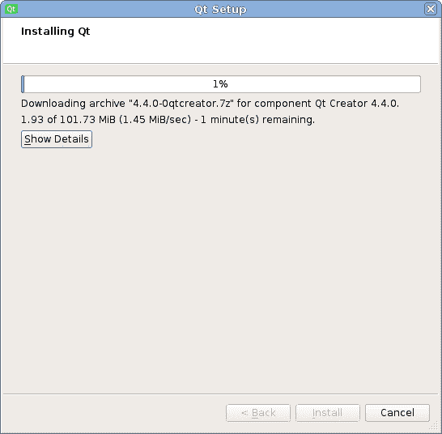

# 第二章：安装

在本章中，您将学习如何在您的开发机器上安装 Qt，包括 Qt Creator，这是一个针对 Qt 使用的 IDE。您将了解如何根据您的需求配置 IDE，并学习使用该环境的基本技能。到本章结束时，您将能够使用 Qt 发布中包含的工具为桌面和嵌入式平台准备您的开发环境。

本章涵盖的主要主题如下：

+   安装 Qt 及其开发工具

+   Qt Creator 的主要控件

+   Qt 文档

# 安装 Qt SDK

在您可以在您的机器上开始使用 Qt 之前，它需要被下载和安装。Qt 可以使用专门的安装程序进行安装，分为两种类型：在线安装程序，它会即时下载所有需要的组件，以及一个更大的离线安装程序，它已经包含了所有需要的组件。使用在线安装程序对于常规桌面安装来说更容易，所以我们更倾向于这种方法。

# 操作时间 – 使用在线安装程序安装 Qt

所有 Qt 资源，包括安装程序，都可以在 [`qt.io`](https://www.qt.io/) 找到。要获取 Qt 的开源版本，请访问 [`www.qt.io/download-open-source/`](https://www.qt.io/download-open-source/)。页面默认建议您下载适用于当前操作系统的在线安装程序，如下面的截图所示。点击“立即下载”按钮下载在线安装程序，或点击“查看所有下载”选择不同的下载选项：

下载完成后，运行安装程序，如下所示：

点击“下一步”开始安装过程。如果您正在使用代理服务器，请点击“设置”并调整您的代理配置。然后，要么登录您的 Qt 账户，要么如果您没有账户，请点击“跳过”。

再次点击“下一步”，在下载程序检查远程存储库一段时间后，您将被要求输入安装路径。请确保您选择一个您有写入权限并且有足够空间的位置。最好将 Qt 放入您的个人目录中，除非您以系统管理员用户身份运行安装程序。再次点击“下一步”将显示您希望安装的组件的选择，如下面的截图所示。您将根据您的平台获得不同的选择：

在我们继续之前，您需要选择您想要安装的 Qt 版本。我们建议您使用最新的稳定版本，即在 Qt 部分下的第一个项目。忽略“预览”部分，因为它包含可能不稳定的预发布包。如果您想与本书完全一致，可以选择 Qt 5.9.0，但这不是必需的。安装程序还允许您一次性安装多个 Qt 版本。

扩展你想要安装的 Qt 版本对应的章节，并选择你需要的平台。至少选择一个桌面平台，以便能够构建和运行桌面应用程序。在 Windows 上，你必须为桌面构建进行额外的选择。选择 32 位或 64 位版本，并选择你想要使用的编译器。如果你有 Microsoft C++ 编译器（由 Visual Studio 或 Visual C++ Build Tools 提供），你可以选择与已安装的 MSVC 版本对应的构建版本。如果你没有 Microsoft 编译器或者你只是不想使用它，请选择 MinGW 构建，并在包树工具部分选择相应的 MinGW 版本。

如果你想要构建 Android 应用程序，请选择对应所需 Android 平台的选项。在 Windows 上，你可以选择 UWP 构建，以创建通用 Windows 平台应用程序。

安装程序将始终安装 Qt Creator——一个针对创建 Qt 应用程序进行优化的 IDE（集成开发环境）。你也可以选择你想要使用的 Qt 扩展。

在选择所需的组件并再次点击“下一步”后，你必须通过标记适当的选项来接受 Qt 的许可条款，如下面的截图所示：

在点击“安装”后，安装程序将开始下载和安装所需的包。一旦完成，你的 Qt 安装将准备就绪。在过程结束时，你将有一个选项来启动 Qt Creator：

# 发生了什么？

我们所经历的过程会在你的磁盘上生成整个 Qt 基础设施。你可以检查安装程序指向的目录，以查看它在这个目录中创建了许多子目录，每个子目录对应安装程序选择的 Qt 版本，还有一个名为 `Tools` 的子目录，其中包含 Qt Creator。Qt 目录还包含一个 `MaintenanceTool` 可执行文件，它允许你添加、删除和更新已安装的组件。目录结构确保如果你决定安装另一个版本的 Qt，它不会与你的现有安装冲突。此外，对于每个版本，你可以有多个平台子目录，它们包含特定平台的实际 Qt 安装。

# Qt Creator

现在 Qt 已经安装，我们将熟悉 Qt Creator 并使用它来验证安装。

# Qt Creator 的模式

在 Qt Creator 启动后，你应该会看到以下屏幕：

左侧的面板允许你在 IDE 的不同 **模式** 之间切换：

+   欢迎模式：允许你快速打开上次会话、项目、加载示例和教程。

+   编辑模式：这是主要用于编辑应用程序源代码的主要模式。

+   设计模式：包含一个可视化表单编辑器。当您创建或打开 Qt Widgets 表单文件（`.ui`）或 QML 表单文件（`.ui.qml`）时，设计模式会自动激活。

+   调试模式：在您在调试器下启动应用程序时自动激活。它包含用于显示调用堆栈、断点列表和局部变量值的额外视图。在需要时可以启用更多视图（如线程列表或寄存器值）。

+   项目模式：允许您配置 Qt Creator 如何构建和运行您的应用程序。例如，您可以选择它将使用哪个 Qt 版本，或者在此处添加命令行参数。

+   帮助模式：提供对 Qt 文档的访问。我们将在本章的后面部分关注这个主题。

# 设置编译器、Qt 版本和工具包

在 Qt Creator 能够构建和运行项目之前，它需要知道哪些 Qt 构建、编译器、调试器和其他工具可用。幸运的是，Qt 安装程序通常会自动完成这项工作，Qt Creator 能够自动检测系统范围内可用的工具。但是，让我们验证我们的环境是否已正确配置。从“工具”菜单中选择“选项”。一旦弹出对话框，从侧边列表中选择“构建和运行”。这是我们可以配置 Qt Creator 构建项目方式的地方。一个完整的构建配置称为 **工具包**。它由一个 Qt 安装和一个用于执行构建的编译器组成。您可以在“选项”对话框的“构建和运行”部分看到这三个实体的选项卡。

让我们从“编译器”选项卡开始。如果您的编译器没有正确自动检测并且不在列表中，请点击“添加”按钮，从列表中选择您的编译器类型，并填写编译器的名称和路径。如果设置正确输入，Creator 将自动填写所有其他详细信息。然后，您可以点击“应用”以保存更改。

接下来，您可以切换到 Qt 版本选项卡。同样，如果您的 Qt 安装没有自动检测到，您可以点击“添加”。这将打开一个文件对话框，您需要找到您的 Qt 安装目录，其中存储了所有二进制可执行文件（通常在 `bin` 目录中），并选择一个名为 `qmake` 的二进制文件。如果选择错误文件，Qt Creator 将会警告您。否则，您的 Qt 安装和版本应该能够正确检测。如果您愿意，可以在相应的框中调整版本名称。

最后要查看的选项卡是“工具包”选项卡。它允许您将编译器与用于编译的 Qt 版本配对。此外，对于嵌入式和移动平台，您可以指定要部署到的设备以及包含构建指定嵌入式平台所需所有文件的 `sysroot` 目录。请确保每个工具包的名称足够描述性，以便您可以为每个应用程序选择正确的工具包（或工具包）。如果需要，可以调整工具包的名称。

# 动手时间 - 加载示例项目

示例是探索 Qt 功能和查找典型任务所需代码的绝佳方式。每个 Qt 版本都包含一组始终更新的示例。Qt Creator 提供了一种简单的方法来加载和编译任何示例项目。

让我们尝试加载一个示例，以便熟悉 Qt Creator 的项目编辑界面。然后，我们将构建项目以检查安装和配置是否正确完成。

在 Qt Creator 中，点击窗口左上角的欢迎按钮以切换到欢迎模式。点击示例按钮（参考上一张截图）以打开带有搜索框的示例列表。确保在搜索框旁边的下拉列表中选择你想要使用的工具包。在框中输入 `aff` 以过滤示例列表，然后点击仿射变换以打开项目。如果你被问及是否要将项目复制到新文件夹，请同意。

选择一个示例后，将出现一个包含加载示例文档页面的附加窗口。当你不需要它时，可以关闭该窗口。切换回主 Qt Creator 窗口。

Qt Creator 将显示带有可用工具包列表的“配置项目”对话框：

确保你想要使用的工具包被勾选，然后点击“配置项目”按钮。Qt Creator 将随后显示以下窗口：

这是 Qt Creator 的编辑模式。让我们浏览一下这个界面的最重要的部分：

+   **项目树**位于窗口的左上角。它显示所有打开的项目以及它们内部文件的层次结构。你可以双击一个文件来打开它进行编辑。项目树中项目、目录和文件的下拉菜单包含许多有用的功能。

+   在窗口的左下角，有一个打开文档的列表。在此列表中选中的文件将出现在窗口中央的代码编辑器中。如果选中的文件是 Qt Designer 表单，Qt Creator 将自动切换到设计模式。列表中的每个文件都有一个关闭按钮。

+   “定位到类型”字段位于底部面板的左侧。如果你想快速导航到项目中的另一个文件，在该字段中输入其名称的开头，并在弹出列表中选择它。可以使用特殊前缀来启用其他搜索模式。例如，`c` 前缀允许你搜索 C++ 类。你可以按 *Ctrl* + *K* 来激活此字段。

+   左侧面板底部的按钮允许你在调试器下构建和运行当前项目，或者正常运行。上面的按钮显示当前项目和当前构建配置（例如，调试或发布）的名称，并允许你更改它们。

+   当您在底部面板中选择它们时，输出面板会出现在代码编辑器下方。问题面板包含编译错误和其他相关消息。搜索结果面板允许您在整个项目中运行文本搜索并查看其结果。应用程序输出面板显示您的应用程序打印到其标准输出（`stderr` 或 `stdout`）的文本。

Qt Creator 非常可配置，因此您可以调整布局以符合您的喜好。例如，您可以更改面板的位置、添加更多面板，以及更改每个操作的快捷键。

# Qt 文档

Qt 项目具有非常详尽的文档。对于每个 API 项目（类、方法等），文档中都有一个部分描述该项目并提及您需要知道的事情。还有许多概述页面描述模块及其部分。当您想知道某个 Qt 类或模块是做什么的或如何使用它时，Qt 文档始终是获取信息的好来源。

Qt Creator 集成了文档查看器。最常用的文档功能是上下文帮助。要尝试它，请打开 `main.cpp` 文件，将文本光标置于 `QApplication` 文本内部，然后按 *F1* 键。帮助部分应该出现在代码编辑器的右侧。它显示 `QApplication` 类的文档页面。对于任何其他 Qt 类、方法、宏等，效果都应相同。您可以在帮助页面顶部的“在帮助模式下打开”按钮上点击，切换到帮助模式，在那里您有更多空间查看页面。

另一个重要功能是文档索引中的搜索。为此，请通过点击左侧面板上的“帮助”按钮进入帮助模式。在帮助模式下，在窗口的左上角，有一个下拉列表，允许您选择左侧部分的模式：书签、目录、索引或搜索。选择索引模式，在“查找：”文本字段中输入您的请求，并查看文本字段下方是否有任何搜索结果。例如，尝试键入 `qt core` 以搜索 Qt 核心模块概述。如果有结果，您可以按 *Enter* 键快速打开第一个结果，或者双击列表中的任何结果以打开它。如果安装了多个 Qt 版本，可能会出现一个对话框，您需要从中选择您感兴趣的 Qt 版本。

在本书的后面部分，我们有时会通过它们的名称来引用 Qt 文档页面。您可以使用之前描述的方法在 Qt Creator 中打开这些页面。

# 行动时间 - 运行仿射变换项目

让我们尝试构建和运行项目以检查构建环境是否配置正确。要构建项目，请点击左侧面板底部的锤子图标（构建）。在底部面板的右侧，将出现一个灰色进度条以指示构建进度。构建完成后，如果构建成功，进度条将变为绿色，否则为红色。应用程序构建完成后，请点击绿色三角形图标以运行项目。

Qt Creator 可以在运行项目之前自动保存所有文件并构建项目，因此你只需在更改项目后点击运行（*Ctrl* + *R*）或开始调试（*F5*）按钮。要验证此功能是否启用，请点击主菜单中的“工具”和“选项”，进入“构建和运行”部分，进入“常规”选项卡，并检查“构建前保存所有文件”、“部署前始终构建项目”和“运行前始终部署项目”选项是否被选中。

如果一切正常，经过一段时间后，应用程序应该会启动，如图以下截图所示：

# 刚才发生了什么？

项目究竟是如何构建的？要查看使用了哪个套件以及哪个构建配置，请直接点击位于绿色三角形图标正上方的操作栏中的图标以打开构建配置弹出窗口，如图以下截图所示：

你获得的确切内容取决于你的安装，但通常，在左侧，你会看到为项目配置的套件列表，在右侧，你会看到为该套件定义的构建配置列表。你可以点击这些列表以快速切换到不同的套件或不同的构建配置。如果你的项目仅配置了一个套件，套件列表将不会出现在这里。

如果你想使用另一个套件或更改项目的构建方式？如前所述，这可以在项目模式下完成。如果你通过点击左侧面板上的“项目”按钮进入此模式，Qt Creator 将显示当前的构建配置，如图以下截图所示：

此窗口的左侧包含所有套件的列表。未配置为与该项目一起使用的套件以灰色显示。你可以点击它们以启用当前项目的套件。要禁用套件，请在其上下文菜单中选择“禁用套件”选项。

在每个启用的套件下，有两个配置部分。构建部分包含与构建项目相关的设置：

+   阴影构建是一种将所有临时构建文件放置在单独的构建目录中的构建模式。这可以使你的源目录保持清洁，并使你的源文件更容易跟踪（特别是如果你使用版本控制系统）。此模式默认启用。

+   构建目录是临时构建文件的位置（仅当启用阴影构建时）。项目的每个构建配置都需要一个单独的构建目录。

+   构建步骤部分显示了执行实际项目构建的命令。你可以编辑现有步骤的命令行参数，并添加自定义构建步骤。默认情况下，构建过程包括两个步骤：`qmake`（在上一章中描述的 Qt 项目管理工具）读取项目的`.pro`文件并生成 makefile，然后某些`make`工具的变体（取决于平台）读取 makefile 并执行 Qt 的特殊编译器、C++编译器和链接器。有关`qmake`的更多信息，请在文档索引中查找`qmake 手册`。

+   构建环境部分允许你查看和更改构建工具可用的环境变量。

大多数`make`工具的变体（包括`mingw32-make`）接受`-j num_cores`命令行参数，这允许`make`同时生成多个编译器进程。强烈建议你设置此参数，因为它可以显著减少大型项目的编译时间。为此，请点击构建步骤右侧的详细信息，并将`-j num_cores`输入到 Make 参数字段中（将`num_cores`替换为系统上的实际处理器核心数）。然而，MSVC `nmake`不支持此功能。为了解决这个问题，Qt 提供了一个名为`jom`的替代工具，它支持此功能。

对于每个工具包，可以有多个构建配置。默认情况下，生成三个配置：调试（调试器正常工作所必需的）、性能（用于性能分析）和发布（具有更多优化且无调试信息的构建）。

运行部分决定了你的项目生成的可执行文件如何启动。在这里，你可以更改程序的命令行参数、工作目录和环境变量。你可以添加多个运行配置，并使用与选择当前工具包和构建配置相同的按钮在它们之间切换。

对于桌面和移动平台，大多数情况下，从网页上下载的 Qt 二进制发布版就足够满足所有需求。然而，对于嵌入式系统，特别是基于 ARM 的系统，没有可用的二进制发布版，或者对于这样一个轻量级系统来说，它太重了。幸运的是，Qt 是一个开源项目，因此你可以始终从源代码构建它。Qt 允许你选择想要使用的模块，并且有更多的配置选项。有关更多信息，请在文档索引中查找“构建 Qt 源代码”。

# 摘要

到现在为止，你应该能够在你的开发机器上安装 Qt。现在你可以使用 Qt Creator 浏览现有的示例并从中学习，或者阅读 Qt 参考手册以获取更多知识。你应该对 Qt Creator 的主要控件有一个基本的了解。在下一章中，我们终于将开始使用这个框架，你将学习如何通过实现我们非常第一个简单的游戏来创建图形用户界面。
