# 第三章：Qt 图形界面编程

本章将帮助你学习如何使用 Qt Creator IDE 使用 Qt 开发具有图形用户界面的应用程序。我们将熟悉 Qt 的核心功能、小部件、布局以及我们将用于创建复杂系统（如游戏）的信号和槽机制。我们还将介绍 Qt 的各种操作和资源系统。到本章结束时，你将能够编写自己的程序，通过窗口和小部件与用户进行通信。

本章涵盖的主要主题如下：

+   窗口和小部件

+   创建 Qt Widgets 项目并实现井字棋游戏

+   使用或不用可视化表单编辑器创建小部件

+   使用布局自动定位小部件

+   创建和使用信号和槽

+   使用 Qt 资源系统

# 在 Qt 中创建 GUI

如 第一章 所述，*Qt 简介*，Qt 由多个模块组成。在本章中，你将学习如何使用 Qt Widgets 模块。它允许你创建经典桌面应用程序。这些应用程序的 **用户界面**（**UI**）由 *小部件* 组成。

小部件是具有特定外观和行为的 UI 片段。Qt 提供了许多内置的小部件，这些小部件在应用程序中广泛使用：标签、文本框、复选框、按钮等等。这些小部件中的每一个都表示为从 `QWidget` 派生的 C++ 类的实例，并提供读取和写入小部件内容的方法。你也可以创建具有自定义内容和行为的小部件。

`QWidget` 的基类是 `QObject` —— 这是 Qt 中最重要的类，它包含多个有用的功能。特别是，它实现了对象之间的父子关系，允许你在程序中组织对象集合。每个对象都可以有一个父对象和任意数量的子对象。在两个对象之间建立父子关系有多个后果。当一个对象被删除时，所有其子对象也将自动删除。对于小部件，还有一个规则，即子对象占据其父对象边界内的区域。例如，典型的表单包括多个标签、输入字段和按钮。表单的每个元素都是一个小部件，表单是它们的父小部件。

每个小部件都有一个独立的坐标系，用于小部件内的绘制和事件处理。默认情况下，该坐标系的起点位于其左上角。子坐标系统相对于其父坐标系统。

任何未包含在其他小部件中（即任何 *顶级小部件*）的小部件都将成为一个窗口，桌面操作系统将为其提供一个窗口框架，通常允许用户拖动、调整大小和关闭窗口（尽管可以配置窗口框架的存在和内容）。

# 行动时间 - 创建 Qt Widgets 项目

使用 Qt Creator 开发应用程序的第一步是使用 IDE 提供的模板之一创建项目。

从 Qt Creator 的“文件”菜单中选择“新建文件”或“项目”。有多个项目类型可供选择。按照以下步骤创建 Qt 桌面项目：

1.  对于基于小部件的应用程序，请选择应用程序组以及 Qt 小部件应用程序模板，如下面的截图所示：

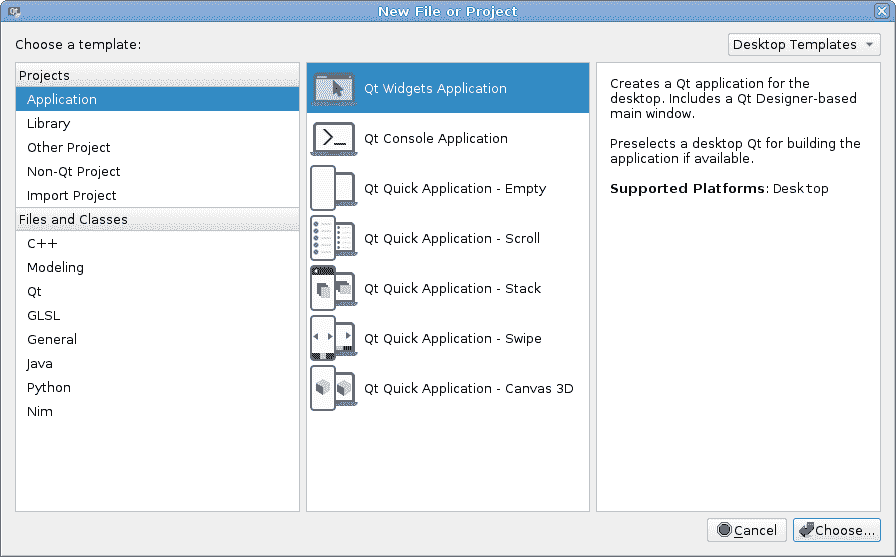

1.  下一步是选择您新项目的名称和位置：

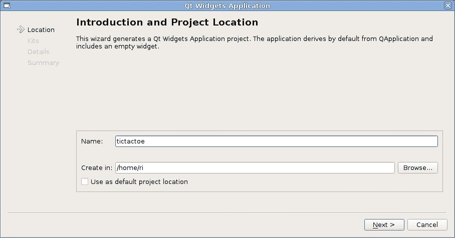

1.  我们将创建一个简单的井字棋游戏，因此我们将我们的项目命名为 `tictactoe` 并为其提供一个合适的位置。

如果您有一个存放所有项目的公共目录，您可以为 Qt Creator 选择“使用默认项目位置”复选框，以便它记住位置并在您下次启动新项目时建议该位置。

1.  接下来，您需要选择与项目一起使用的工具包（或多个工具包）。选择与您想要使用的 Qt 版本相对应的桌面 Qt 工具包：

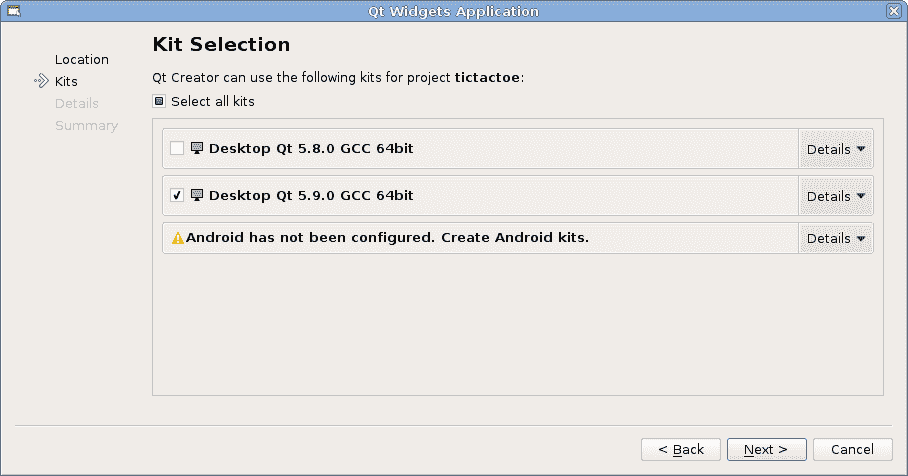

1.  现在，您将看到创建项目第一个小部件的选项。我们想要创建一个代表应用程序主窗口的小部件，因此我们可以保持类名和基类字段不变。我们还想要使用可视化表单编辑器来编辑主窗口的内容，因此“生成表单”也应该保持选中状态：


1.  然后，点击“下一步”和“完成”。

# 刚才发生了什么？

Creator 在您之前选择的用于项目位置的目录中创建了一个新的子目录。这个新目录（**项目目录**）现在包含了一些文件。您可以使用 Qt Creator 的“项目”窗格列出和打开这些文件（有关 Qt Creator 基本控件的解释，请参阅第二章，*安装*）。让我们来看看这些文件。

`main.cpp` 文件包含 `main()` 函数的实现，这是应用程序的入口点，如下面的代码所示：

```cpp
#include "mainwindow.h"
#include <QApplication>
int main(int argc, char *argv[])
{
    QApplication a(argc, argv);
    MainWindow w;
    w.show();
    return a.exec();
}
```

`main()` 函数创建 `QApplication` 类的实例，并给它提供包含命令行参数的变量。然后，它实例化我们的 `MainWindow` 类，调用其 `show` 方法，并最终返回应用程序对象 `exec` 方法的返回值。

`QApplication` 是一个单例类，负责管理整个应用程序。特别是，它负责处理来自应用程序内部或外部来源的事件。为了处理事件，需要一个事件循环正在运行。循环等待传入的事件并将它们调度到适当的例程。在 Qt 中，大多数事情都是通过事件完成的：输入处理、重绘、通过网络接收数据、触发计时器等等。这就是我们说 Qt 是一个面向事件框架的原因。如果没有活跃的事件循环，事件处理将无法正常工作。`QApplication` 中的 `exec()` 调用（或者更具体地说，在其基类 `QCoreApplication` 中）负责进入应用程序的主事件循环。该函数在应用程序请求事件循环终止之前不会返回。当最终发生这种情况时，`main` 函数返回，你的应用程序结束。

`mainwindow.h` 和 `mainwindow.cpp` 文件实现了 `MainWindow` 类。目前，其中几乎没有代码。这个类是从 `QMainWindow`（它反过来是从 `QWidget` 派生的）派生的，因此它从其基类继承了大量的方法和行为。它还包含一个 `Ui::MainWindow *ui` 字段，它在构造函数中初始化并在析构函数中删除。构造函数还调用 `ui->setupUi(this);` 函数。

`Ui::MainWindow` 是一个**自动生成**的类，因此在源代码中没有它的声明。当项目构建时，它将在构建目录中创建。这个类的作用是根据表单编辑器的变化来设置我们的小部件并填充内容。自动生成的类不是 `QWidget`。实际上，它只包含两个方法：`setupUi`，它执行初始设置，以及`retranslateUi`，它在 UI 语言更改时更新可见文本。在表单编辑器中添加的所有小部件和其他对象都作为 `Ui::MainWindow` 类的公共字段可用，因此我们可以从 `MainWindow` 方法中通过 `ui->objectName` 访问它们。

`mainwindow.ui` 是一个可以在可视化表单编辑器中编辑的表单文件。如果你通过在项目面板中双击它来在 Qt Creator 中打开它，Qt Creator 将切换到设计模式。如果你切换回编辑模式，你会看到这个文件实际上是一个包含在设计模式中编辑的所有对象的层次结构和属性的 XML 文件。在项目的构建过程中，一个名为用户界面编译器的特殊工具将这个 XML 文件转换为 `MainWindow` 类中使用的 `Ui::MainWindow` 类的实现。

注意，你不需要手动编辑 XML 文件或编辑 `Ui::MainWindow` 类中的任何代码。在可视化编辑器中做出更改就足以将它们应用到你的 `MainWindow` 类中，并使其表单对象可供它使用。

生成的最终文件名为 `tictactoe.pro`，是项目配置文件。它包含构建项目所需的所有信息，使用 Qt 提供的工具。让我们分析这个文件（省略了不太重要的指令）：

```cpp
QT += core gui
greaterThan(QT_MAJOR_VERSION, 4): QT += widgets
TARGET = tictactoe
TEMPLATE = app
SOURCES += main.cpp mainwindow.cpp
HEADERS += mainwindow.h
FORMS   += mainwindow.ui
```

前两行启用了 Qt 的 `core`、`gui` 和 `widgets` 模块。`TEMPLATE` 变量用于指定项目文件描述的是一个应用程序（而不是，例如，一个库）。`TARGET` 变量包含生成的可执行文件（`tictactoe`）的名称。最后三行列出了构建项目时应使用的所有文件。

事实上，`qmake` 默认启用 Qt Core 和 Qt GUI 模块，即使您在项目文件中没有明确指定它们。如果您想不使用默认模块，可以选择退出。例如，您可以通过在项目文件中添加 `QT -= gui` 来禁用 Qt GUI。

在我们继续之前，让我们通过在 `tictactoe.pro` 中添加以下行来告诉构建系统我们想在项目中使用 C++11 功能（如 lambda 表达式、作用域枚举和基于范围的 `for` 循环）：

```cpp
CONFIG += c++11
```

如果我们这样做，C++ 编译器将收到一个标志，指示应启用 C++11 支持。如果您的编译器默认启用了 C++11 支持，可能不需要这样做。如果您想使用 C++14，请使用 `CONFIG += c++14`。

我们现在有一个完整的 Qt Widgets 项目。要构建和运行它，只需从构建下拉菜单中选择运行条目，或者在 Qt Creator 窗口的左侧点击绿色三角形图标。过了一会儿，你应该会看到一个窗口弹出。由于我们没有向窗口添加任何内容，所以它是空的：

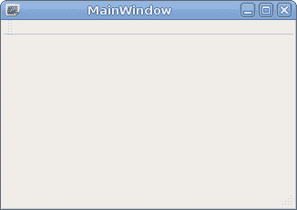

# 设计模式界面

打开 `mainwindow.ui` 文件，检查 Qt Creator 的设计模式：

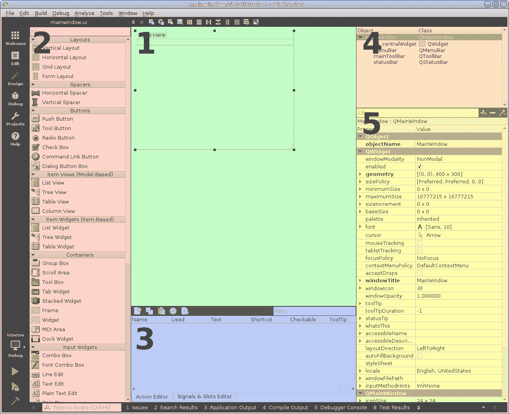

设计模式由五个主要部分组成（它们在这张截图上已标记）：

+   核心区域 **(1**) 是主要的工作表。它包含正在设计的表单的图形表示，您可以在其中移动小部件，将它们组合成布局，并查看它们的反应。它还允许使用我们稍后将要学习的点选方法进一步操作表单。

+   工具箱 **(2**) 位于窗口的左侧部分。它包含一组可用的小部件类型，这些类型按具有相关或相似功能的项目分组。在列表上方，您可以看到一个框，允许您过滤列表中显示的小部件，以仅显示与输入的表达式匹配的小部件。列表开头也有一些实际上不是小部件的项目——一个组包含布局，另一个组包含所谓的间隔符，这是一种将其他项彼此推开或创建布局中的空白区域的方法。工具箱的主要目的是将项添加到工作表中的表单。您可以通过用鼠标从列表中拖取小部件，将其拖动到中央区域的小部件上，然后释放鼠标按钮来实现这一点。

+   窗口下方的两个标签 **(3**)——动作编辑器和信号/槽编辑器——允许我们创建辅助实体，例如菜单和工具栏的动作或小部件之间的信号/槽连接。

+   对象树 **(4**) 位于窗口的右上角，包含表单项的层次结构树。在树中显示每个添加到表单的对象名称和类名称。最顶部的项对应于表单本身。您可以使用中央区域和对象树来选择现有项并访问它们的上下文菜单（例如，如果您想删除一个项，您可以在上下文菜单中选择“移除...”选项）。

+   属性编辑器 **(5**) 位于窗口的右下角。它允许您查看和更改中央区域和对象树中当前选定的项的所有属性值。属性按它们声明的类分组，从 `QObject`（实现属性的基类）开始，它只声明了一个但非常重要的属性——`objectName`。在 `QObject` 之后，是 `QWidget` 中声明的属性，它是 `QObject` 的直接后代。它们主要与小部件的几何和布局策略相关。在列表的下方，您可以找到来自 `QWidget` 进一步派生的属性，直到所选小部件的具体系列。属性上方的过滤器可以帮助您快速找到所需的属性。

仔细查看属性编辑器，您可以看到其中一些具有箭头，点击时可以显示新行。这些是由多个子属性值确定的复合属性，例如，如果有一个名为`geometry`的属性定义了一个矩形，它可以展开以显示四个子属性：`x`、`y`、`width`和`height`。您可能还会很快注意到，一些属性名以粗体显示。这意味着该属性值已被修改，并且与该属性的默认值不同。这使您可以快速找到您已修改的属性。

如果您更改了属性值，但后来决定坚持使用默认值，您应该点击相应的输入字段，然后点击右侧带有箭头的小按钮：。这不同于手动设置原始值。例如，如果您检查

对于某些布局的`spacing`属性，它可能看起来有一个固定的默认值（例如，6）。然而，实际的默认值取决于应用程序使用的样式，并且可能在不同的操作系统上有所不同，因此设置默认值的唯一方法是使用专用按钮，并确保该属性不再以粗体显示。

如果您更喜欢纯字母顺序，其中属性不是按其类别分组，您可以通过点击位于属性列表上方的扳手图标后出现的弹出菜单来切换视图；然而，一旦您熟悉了 Qt 类的层次结构，当按类亲和度排序时，导航列表将更容易。

这里所描述的是基本工具布局。如果您不喜欢它，您可以从主工作表中的上下文菜单调用，取消选中“自动隐藏视图标题栏”的选项，并使用出现的标题栏来重新排列所有窗格，或者甚至关闭您当前不需要的窗格。

现在您已经熟悉了视觉表单编辑器的结构，您终于可以向我们的小部件添加一些内容了。我们正在制作一个具有本地多人游戏的井字棋游戏，因此我们需要一种方式来显示哪两位玩家当前在移动。让我们将游戏板放在窗口的中心，并在游戏板上方和下方显示玩家的名字。当一个玩家需要移动时，我们将使相应名字的字体加粗。我们还需要一个按钮来开始新游戏。

# 动手实践 - 向表单添加小部件

在工具箱中找到 `Label` 项（它在 `Display Widgets` 类别中），并将其拖动到我们的表单中。使用属性编辑器将标签的 `objectName` 属性设置为 `player1Name`。`objectName` 是表单项的唯一标识符。对象名称用作 `Ui::MainWindow` 类中的公共字段名称，因此标签将在 `MainWindow` 类中作为 `ui->player1Name` 可用（并将具有 `QLabel *` 类型）。然后，在属性编辑器中找到 `text` 属性（它将在 `QLabel` 组中，因为它引入了该属性）并将其设置为 `Player 1`。你会看到中央区域中的文本将相应更新。添加另一个标签，将其 `objectName` 设置为 `player2Name` 并将其 `text` 设置为 `Player 2`。

你可以在中央区域选择一个小部件并按 `F2` 键来就地编辑文本。另一种方法是双击表单中的小部件。这适用于任何可以显示文本的小部件。

将一个按钮（来自 `Buttons` 组）拖动到表单中，并使用 `F2` 键将其重命名为 `Start new game`。如果按钮中放不下这个名称，你可以使用其边缘的蓝色矩形来调整其大小。将按钮的 `objectName` 设置为 `startNewGame`。

对于我们的游戏板，没有内置的小部件，因此我们稍后需要为它创建一个自定义小部件。现在，我们将使用一个空的小部件。在工具箱的 `Containers` 组中找到 `Widget`，并将其拖动到表单中。将其 `objectName` 设置为 `gameBoard`：

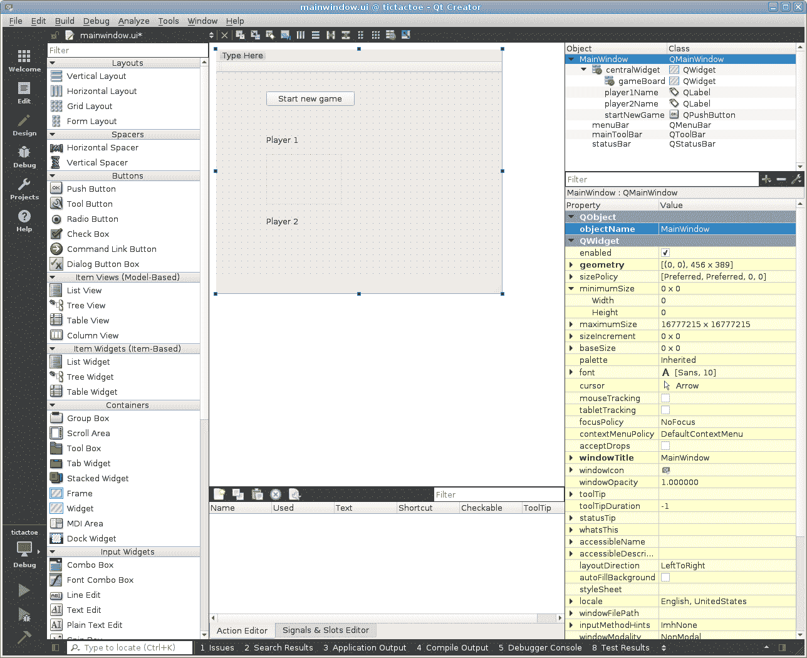

# 布局

如果你现在构建并运行项目，你会看到带有两个标签和一个按钮的窗口，但它们将保持你离开时的确切位置。这几乎是你不想要的。通常，人们希望小部件能够根据其内容和相邻小部件的大小自动调整大小。它们需要适应窗口大小的变化（或者相反，窗口的大小可能需要根据其中小部件的可能大小进行限制）。这对于跨平台应用程序来说是一个非常重要的特性，因为你不能假设任何特定的屏幕分辨率或控件大小。在 Qt 中，所有这些都需要我们使用一种称为**布局**的特殊机制。

布局允许我们安排小部件的内容，确保其空间得到有效利用。当我们对一个小部件设置布局时，我们可以开始添加小部件，甚至其他布局，该机制将根据我们指定的规则调整大小和重新定位它们。当用户界面中发生影响小部件显示方式的事件（例如，标签文本被替换为更长的文本，这使得标签需要更多空间来显示其内容）时，布局会被再次触发，这会重新计算所有位置和大小，并根据需要更新小部件。

Qt 提供了一组预定义的布局，这些布局是从 `QLayout` 类派生出来的，但你也可以创建自己的布局。我们目前可用的布局有 `QHBoxLayout` 和 `QVBoxLayout`，它们分别用于水平排列和垂直排列项目；`QGridLayout` 用于在网格中排列项目，以便项目可以跨越列或行；还有 `QFormLayout`，它创建两列项目，其中一列包含项目描述，另一列包含项目内容。还有 `QStackedLayout`，它很少直接使用，并且使分配给它的一个项目拥有所有可用空间。你可以在以下图中看到最常见的布局示例：

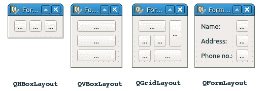

# 行动时间 – 为表单添加布局

在对象树中选择 MainWindow 顶级项目，然后点击上工具栏中的  图标，即垂直布局图标。按钮、标签和空白的部件将自动调整大小以占用表单中央区域的所有可用空间：

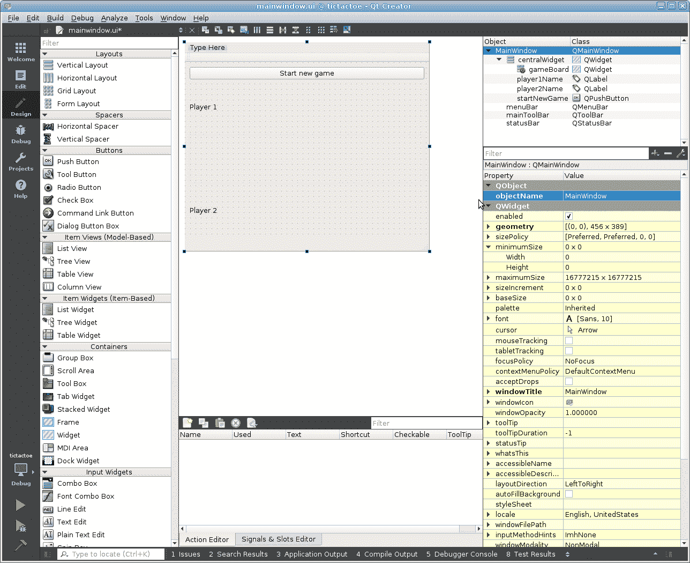

如果项目以不同的顺序排列，你可以拖放它们来改变顺序。

运行应用程序并检查窗口内容在窗口大小调整时是否自动定位和调整大小以使用所有可用空间。不幸的是，标签占用的垂直空间比实际需要的多，导致应用程序窗口中出现空白空间。我们将在本章后面学习尺寸策略时修复这个问题。

你可以在不构建和运行整个应用程序的情况下测试表单的布局。打开工具菜单，转到表单编辑器子菜单，并选择预览条目。你将看到一个新窗口打开，其外观与我们刚刚设计的表单完全一样。你可以调整窗口大小并与内部对象交互，以监控布局和部件的行为。实际上，Qt Creator 根据我们在设计模式的所有区域提供的描述为我们构建了一个真正的窗口。无需任何编译，瞬间我们就得到了一个完全工作的窗口，其中所有布局都正常工作，所有属性都调整到我们喜欢的样子。这是一个非常重要的工具，所以请确保你经常使用它来验证你的布局是否按照你的意图控制所有部件——这比编译和运行整个应用程序来检查部件是否正确拉伸或挤压要快得多。你还可以通过拖动表单编辑器中央区域的右下角来调整表单的大小，如果布局设置正确，内容应该会调整大小并重新定位。

现在你已经可以创建和显示表单了，需要实现两个重要的操作。首先，你需要接收用户与你的表单交互（例如，按下按钮）时的通知，以便在代码中执行一些操作。其次，你需要以编程方式更改表单内容的属性，并用真实数据填充它（例如，从代码中设置玩家名称）。

# 信号和槽

为了响应应用程序中发生的事情而触发功能，Qt 使用信号和槽机制。这是`QObject`类的重要特性之一。它基于将关于某个对象状态变化的通告（Qt 称为**信号**）与一个函数或方法（称为**槽**）连接起来，当这种通告出现时执行该函数或方法。例如，如果按下按钮，它将**发出**（发送）一个`clicked()`信号。如果某个方法连接到这个信号，那么每次按钮被按下时，该方法都会被调用。

信号可以有作为有效负载的参数。例如，一个输入框小部件（`QLineEdit`）有一个`textEdited(const QString &text)`信号，当用户编辑输入框中的文本时发出。连接到这个信号的槽将接收输入框中的新文本作为其参数（如果它有参数的话）。

信号和槽可以与所有继承自`QObject`（包括所有小部件）的类一起使用。一个信号可以被连接到一个槽、成员函数或函数对象（这包括一个常规的全局函数）。当一个对象发出一个信号时，连接到该信号的任何这些实体都将被调用。一个信号也可以连接到另一个信号，在这种情况下，发出第一个信号将使另一个信号也被发出。你可以将任意数量的槽连接到单个信号，也可以将任意数量的信号连接到单个槽。

# 创建信号和槽

如果你创建了一个`QObject`子类（或者一个`QWidget`子类，因为 QWidget 继承自 QObject），你可以将这个类的某个方法标记为信号或槽。如果父类有任何信号或非私有槽，你的类也将继承它们。

为了使信号和槽正常工作，类声明必须在定义的私有部分包含`Q_OBJECT`宏（Qt Creator 已经为我们生成了它）。当项目构建时，一个称为**元对象编译器**（**moc**）的特殊工具将检查类的头文件，并生成一些必要的额外代码，以便信号和槽能够正常工作。

请记住，**moc**和所有其他 Qt 构建工具都不会编辑项目文件。你的 C++文件在没有任何更改的情况下传递给编译器。所有特殊效果都是通过生成单独的 C++文件并将它们添加到编译过程中来实现的。

可以通过在类声明的`signals`部分声明一个类方法来创建一个信号：

```cpp
signals:
    void valueChanged(int newValue);
```

然而，我们不会实现这样的方法；这将由**moc**自动完成。我们可以通过调用方法来发送（发出）信号。有一个约定，信号调用应该由`emit`宏 precede。这个宏没有效果（它实际上是一个空宏），但它帮助我们阐明我们发出信号的意图：

```cpp
void MyClass::setValue(int newValue) {
    m_value = newValue;
    emit valueChanged(newValue);
}
```

您应该只从类方法中发出信号，就像它是一个受保护的函数一样。

槽是声明在类声明中的`private slots`、`protected slots`或`public slots`部分的类方法。与信号相反，槽需要实现。Qt 将在连接到它的信号发出时调用槽。槽的可见性（私有、保护或公共）应使用与正常方法相同的原理来选择。

C++标准只描述了类定义中的三种类型部分（`private`、`protected`和`public`），因此您可能会想知道这些特殊部分是如何工作的。实际上，它们是简单的宏：`signals`

宏展开为`public`，而`slots`是一个空宏。因此，编译器将它们视为普通方法。然而，这些关键字由**moc**用于确定如何生成额外的代码。

# 连接信号和槽

信号和槽可以使用`QObject::connect()`和`QObject::disconnect()`函数动态地连接和断开。常规的信号-槽连接由以下四个属性定义：

+   改变其状态的对象（发送者）

+   发送者对象中的信号

+   包含要调用的函数的对象（接收者）

+   接收者中的槽

如果您想建立连接，您需要调用`QObject::connect`函数并将这四个参数传递给它。例如，以下代码可以在按钮被点击时清除输入框：

```cpp
connect(button,   &QPushButton::clicked,
        lineEdit, &QLineEdit::clear);
```

在此代码中，信号和槽是通过称为成员函数指针的标准 C++特性来指定的。这样的指针包含类的名称和该类中的方法名称（在我们的情况下，是信号或槽）。Qt Creator 的代码自动补全将帮助您编写连接语句。特别是，如果您在按下*Ctrl* + *Space*之后

`connect(button, &`，它将插入类的名称，如果您在`connect(button, &QPushButton::`之后这样做，它将建议一个可用的信号（在另一个上下文中，它将建议类中所有现有的方法）。

注意，在建立连接时，您不能设置信号或槽的参数。源信号的参数始终由发出信号的函数确定。接收槽（或信号）的参数始终与源信号的参数相同，有两个例外：

+   如果接收槽或信号的参数比源信号少，则忽略剩余的参数。例如，如果你想使用`valueChanged(int)`信号，但不在乎传递的值，你可以将此信号连接到一个不带参数的槽。

+   如果对应参数的类型不同，但存在它们之间的隐式转换，则执行该转换。这意味着你可以，例如，将携带`double`值的信号连接到一个接受`int`参数的槽。

如果信号和槽没有兼容的签名，你将得到一个编译时错误。

在发送者或接收者对象被删除后，现有的连接将自动销毁。手动断开连接很少需要。`connect()`函数返回一个连接句柄，可以传递给`disconnect()`。或者，你可以使用与`connect()`相同的参数调用`disconnect()`来撤销连接。

你不总是需要声明一个槽来执行连接。可以将信号连接到一个独立的函数：

```cpp
connect(button, &QPushButton::clicked, someFunction); 
```

函数也可以是 lambda 表达式，在这种情况下，可以在`connect`语句中直接编写代码：

```cpp
connect(pushButton, &QPushButton::clicked, []()
{
    qDebug() << "clicked!";
});
```

如果你想调用一个具有固定参数值且无法由信号携带的槽，这可能很有用，因为它的参数较少。一种解决方案是从 lambda 函数（或独立函数）中调用该槽：

```cpp
connect(pushButton, &QPushButton::clicked, [label]()
{
    label->setText("button was clicked");
});
```

函数甚至可以被函数对象（functor）替代。为此，我们创建一个类，为它重载与我们要连接的信号兼容的调用操作符，如下面的代码片段所示：

```cpp
class Functor {
public:
    Functor(const QString &name) : m_name(name) {}
 void operator()(bool toggled) const {
 qDebug() << m_name << ": button state changed to" << toggled;
 }
private:
    QString m_name;
};

int main(int argc, char *argv[])
{
    QApplication a(argc, argv);
    QPushButton *button = new QPushButton();
    button->setCheckable(true);
 QObject::connect(button, &QPushButton::toggled,
 Functor("my functor"));
    button->show();
    return a.exec();
}
```

这通常是一种执行带有信号未携带的额外参数的槽的好方法，因为这比使用 lambda 表达式要干净得多。然而，请注意，当 lambda 表达式或 functor 中引用的对象被删除时，不会发生自动断开连接。这可能导致使用后释放的漏洞。

虽然实际上可以将信号连接到一个不是槽的`QObject`类的方法，但这样做并不推荐。将方法声明为槽可以更好地表达你的意图。此外，非槽方法在运行时对 Qt 不可用，这在某些情况下是必需的。

# 旧连接语法

在 Qt 5 之前，旧连接语法是唯一的选择。它看起来如下：

```cpp
connect(spinBox, SIGNAL(valueChanged(int)),
        dial,    SLOT(setValue(int)));
```

该语句在`spinBox`对象的`valueChanged`信号与`dial`对象的`setValue`槽之间建立连接，该槽接受一个`int`参数。不允许在

`connect`语句。如果你在`SIGNAL(`或`SLOT(`之后按*Ctrl* + *Space*，Qt Creator 通常会能够在此上下文中建议所有可能的输入。

虽然此语法仍然可用，但我们不建议广泛使用，因为它有以下缺点：

+   如果信号或槽引用不正确（例如，其名称或参数类型不正确）或如果信号和槽的参数类型不兼容，则不会在编译时出现错误，而只会出现运行时警告。新的语法方法在编译时执行所有必要的检查。

+   旧语法不支持将参数值强制转换为另一种类型（例如，将携带`double`值的信号连接到接受`int`参数的槽）。

+   旧语法不支持将信号连接到独立函数、lambda 表达式或仿函数。

旧语法还使用宏，可能对不熟悉 Qt 的开发者来说不清楚。很难说哪种语法更容易阅读（旧语法显示参数类型，而新语法显示类名）。然而，当使用重载信号或槽时，新语法有一个很大的缺点。解决重载函数类型的唯一方法是通过显式转换：

```cpp
connect(spinBox,
        static_cast<void (QSpinBox::*)(int)>(&QSpinBox::valueChanged), 
        ...);
```

旧连接语法包括参数类型，因此没有这个问题。在这种情况下，旧语法可能看起来更可接受，但编译时检查可能仍然被认为比更短的代码更有价值。在这本书中，我们更喜欢新语法，但在处理重载方法时使用旧语法以提高清晰度。

# 信号和槽访问指定符

如前所述，您应该只从拥有该信号或其子类发出信号。然而，如果信号确实是受保护的或私有的，您将无法使用成员指针函数语法连接到它们。为了使这种连接成为可能，信号被定义为公共函数。这意味着编译器不会阻止您从外部调用信号。如果您想防止此类调用，可以将`QPrivateSignal`声明为信号的最后一个参数：

```cpp
signals:
    void valueChanged(int value, QPrivateSignal);
```

`QPrivateSignal`是由`Q_OBJECT`宏在每个`QObject`子类中创建的私有结构，因此您只能在当前类中创建`QPrivateSignal`对象。

槽可以是公共的、受保护的或私有的，具体取决于您想如何限制对它们的访问。当使用成员函数指针语法进行连接时，您只能创建对您有访问权限的槽的指针。只要您有访问权限，也可以从任何其他位置直接调用槽。

话虽如此，Qt 实际上并不支持限制对信号和槽的访问。无论信号或槽如何声明，您都可以始终使用旧连接语法访问它。您还可以使用`QMetaObject::invokeMethod`方法调用任何信号或槽。虽然您可以限制直接 C++调用以减少错误的可能性，但请记住，如果您的 API 用户真的想访问任何信号或槽，他们仍然可以这样做。

这里有一些关于信号和槽的方面我们没有涉及。当我们处理多线程时，我们将在稍后讨论它们（[在线章节，*[`www.packtpub.com/sites/default/files/downloads/MiscellaneousandAdvancedConcepts.pdf`](https://www.packtpub.com/sites/default/files/downloads/MiscellaneousandAdvancedConcepts.pdf)））。

# 行动时间 - 接收表单的按钮点击信号

打开 `mainwindow.h` 文件，在类声明中创建一个 `private slots` 部分，然后声明 `startNewGame()` 私有槽，如下面的代码所示：

```cpp
class MainWindow : public QMainWindow
{
    Q_OBJECT
public:
    explicit MainWindow(QWidget *parent = nullptr);
    ~MainWindow();
private slots:
 void startNewGame();
}
```

为了快速实现一个新声明的方法，我们可以让 Qt Creator 为我们创建代码框架，方法是在方法声明处放置文本光标，在键盘上按 `Alt` + `Enter`，然后从弹出菜单中选择在 `tictactoewidget.cpp` 中添加定义。

反过来也适用。您可以先编写方法体，然后将光标放在方法签名上，按 `Alt` + `Enter`，并从快速修复菜单中选择添加 (...) 声明。在 Creator 中还有各种其他上下文相关的修复可用。

在此方法的实现中写下高亮显示的代码：

```cpp
void MainWindow::startNewGame()
{
 qDebug() << "button clicked!";
}
```

将 `#include <QDebug>` 添加到 `mainwindow.cpp` 文件的最顶部，以便使 `qDebug()` 宏可用。

最后，在 `setupUi()` 调用之后，在构造函数中添加一个连接语句：

```cpp
ui->setupUi(this);
connect(ui->startNewGame, &QPushButton::clicked,
 this, &MainWindow::startNewGame);
```

运行应用程序并尝试点击按钮。在 Qt Creator 窗口的底部部分的应用程序输出面板中应该会显示 `button clicked!` 文本（如果面板未激活，请使用底部面板中的应用程序输出按钮打开它）：

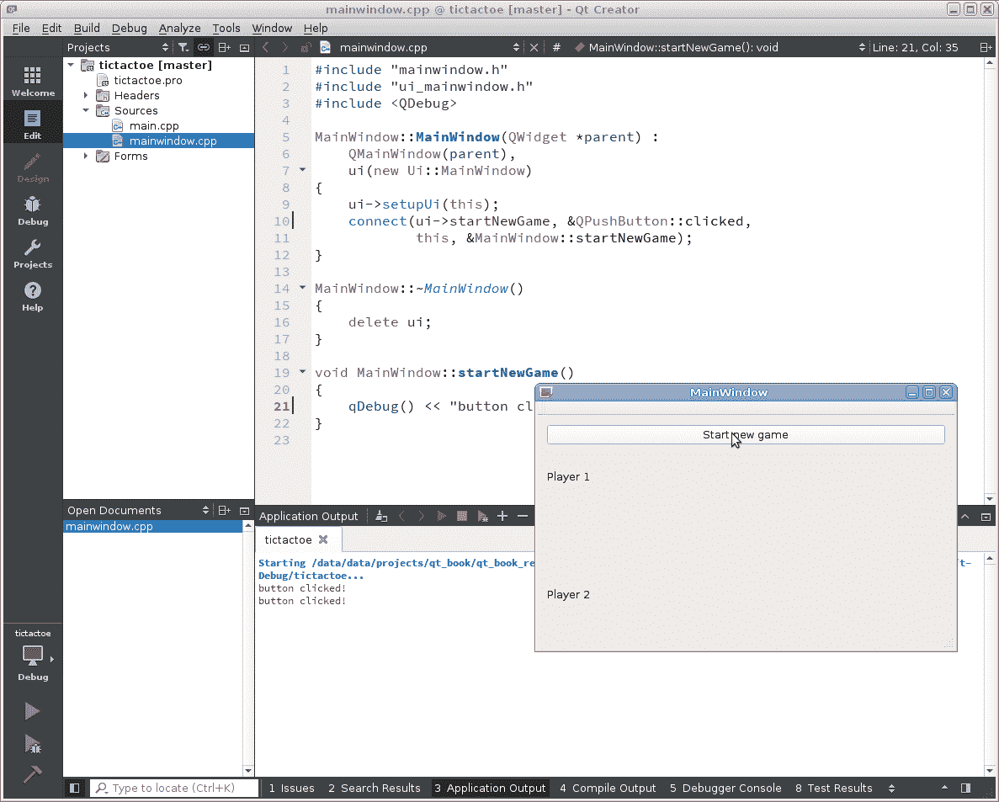

# 刚才发生了什么？

我们在 `MainWindow` 类中创建了一个新的私有槽，并将启动新游戏按钮的 `clicked()` 信号连接到该槽。当用户点击按钮时，Qt 将调用我们的槽，并执行我们编写在其中的代码。

确保将任何与表单元素相关的操作放在 `setupUi()` 调用之后。这个函数创建了元素，所以

在调用 `setupUi()` 之前，`ui->startNewGame` 将会被初始化，尝试使用它将导致未定义行为。

`qDebug() << ...` 是将调试信息打印到应用程序进程的 `stderr`（标准错误输出）的便捷方式。它与标准库中可用的 `std::cerr << ...` 方法非常相似，但它使用空格分隔提供的值，并在末尾添加一个新行。

将调试输出放在任何地方很快就会变得不方便。幸运的是，Qt Creator 与 C++ 调试器有强大的集成，因此您可以使用调试模式来检查是否执行了某些特定的行，查看该位置的局部变量的当前值等。例如，尝试通过单击行号左侧的空间（一个表示断点的红色圆圈应该出现）来设置包含`qDebug()`的行的断点。单击“开始调试”按钮（Qt Creator 左下角带有虫子的绿色三角形），等待应用程序启动，然后按“开始新游戏”按钮。当应用程序进入断点位置时，它将暂停，Qt Creator 的窗口将置于最前。断点圆圈上的黄色箭头将指示当前执行的步骤。您可以使用代码编辑器下方的按钮继续执行、停止或逐步执行过程。当开发大型应用程序时，学习使用调试器变得非常重要。我们将在稍后更多地讨论使用调试器（*在线* *章节，*[`www.packtpub.com/sites/default/files/downloads/MiscellaneousandAdvancedConcepts.pdf`](https://www.packtpub.com/sites/default/files/downloads/MiscellaneousandAdvancedConcepts.pdf)）。

# 自动槽连接及其缺点

Qt 还提供了一种更简单的方法来连接表单元素的信号和类的槽。您可以在表单编辑器的中央区域右键单击按钮，并选择“转到槽...”选项。您将被提示选择按钮类（`QPushButton`）中可用的信号之一。在选择`clicked()`信号后，Qt Creator 将自动为我们的`MainWindow`类添加一个新的`on_startNewGame_clicked`槽。

难以理解的部分是没有任何`connect()`调用强制连接。按钮的信号是如何连接到这个槽的呢？答案是 Qt 的自动槽连接功能。当构造函数调用`ui->setupUi(this)`函数时，它创建了表单中的小部件和其他对象，然后调用`QMetaObject::connectSlotsByName`方法。此方法查看小部件类（在我们的情况下，`MainWindow`）中存在的槽列表，并搜索名称为`on_<object name>_<signal name>`的槽。

模式，其中`<object name>`是现有子小部件的`objectName`，`<signal name>`是此小部件的信号之一。在我们的例子中，一个名为`startNewGame`的按钮是我们小部件的子小部件，并且它有一个`clicked`信号，因此此信号自动连接到`on_startNewGame_clicked`槽。

虽然这是一个非常方便的功能，但它有很多缺点：

+   这使得你的应用程序更难维护。如果你重命名或删除表单元素，你必须手动更新或删除槽。如果你忘记这样做，当自动连接失败时，应用程序将在运行时仅产生警告。在一个大型应用程序中，尤其是在应用程序启动时并非所有表单都实例化的情况下，你可能会错过警告，并且应用程序将无法按预期工作。

+   你必须为槽指定一个特定的名称（例如，`on_startNewGame_clicked()`而不是看起来干净的`startNewGame()`）。

+   有时你希望将多个对象的信号连接到同一个槽。自动槽连接不提供这样做的方法，仅为了调用单个函数而创建多个槽会导致不必要的代码膨胀。

+   自动槽连接有运行时成本，因为它需要检查可用的子元素和槽位并找到匹配项，但由于它仅在表单对象创建时运行，因此通常不显著。

上一个部分中展示的基本方法更具可维护性。通过使用指向成员函数的指针显式调用`connect()`，将确保信号和槽都正确指定。如果你重命名或删除按钮，它将立即导致无法忽略的编译错误。你也可以自由地为槽选择一个有意义的名称，这样你就可以根据需要将其作为你的公共 API 的一部分。

考虑到所有这些，我们建议不要使用自动槽连接功能，因为便利性并不超过其缺点。

# 行动时间 – 从代码中更改标签上的文本

将文本打印到控制台不如更改表单中的文本那么令人印象深刻。我们还没有 GUI 让用户输入他们的名字，所以现在我们将硬编码一些名字。让我们将我们的槽的实现更改为以下内容：

```cpp
void MainWindow::startNewGame()
{
    ui->player1Name->setText(tr("Alice"));
    ui->player2Name->setText(tr("Bob"));
}
```

现在，当你运行应用程序并点击按钮时，表单中的标签将发生变化。让我们将此代码分解成几个部分：

+   如前所述，第一个标签的对象在我们的类中可通过`ui->player1Name`访问，其类型为`QLabel *`。

+   我们正在调用`QLabel`类的`setText`方法。这是`QLabel`的`text`属性的 setter（与我们在设计模式属性编辑器中编辑的相同属性）。根据 Qt 的命名约定，获取器应该与属性本身具有相同的名称，而设置器应该有一个`set`前缀，后跟属性名称。你可以在`setText`上设置文本光标并按*F1*键了解更多关于属性及其访问函数的信息。

+   `tr()`函数（其简称为“翻译”）用于将文本翻译为应用程序当前的用户界面语言。我们将在第六章中描述 Qt 的翻译基础设施，*Qt 核心基础*。默认情况下，此函数返回未更改的传递字符串，但将任何显示给用户的字符串字面量包装在此函数中是一个好习惯。在表单编辑器中输入的任何可见文本也受翻译影响，并自动通过类似函数传递。只有那些不应受翻译影响的字符串（例如，用作标识符的对象名称）才应不使用`tr()`函数创建。

# 创建井字棋游戏板小部件

让我们继续实现游戏板。它应该包含九个可以显示“X”或“O”并允许玩家进行移动的按钮。我们可以直接将按钮添加到表单的空小部件中。然而，游戏板的操作与其他表单的其余部分相对独立，并且其中将包含相当多的逻辑。遵循封装原则，我们更倾向于将游戏板实现为一个独立的小部件类。然后，我们将用我们创建的游戏板小部件替换主窗口中的空小部件。

# 在设计表单和纯 C++类之间进行选择

创建自定义小部件的一种方法是将设计表单类添加到项目中。设计表单类是 Qt Creator 提供的一个模板。它由一个继承自`QWidget`（直接或间接）的 C++类和一个设计表单（`.ui`文件）组成，通过一些自动生成的代码连接在一起。我们的`MainWindow`类也遵循这个模板。

然而，如果您尝试使用可视化表单编辑器来创建我们的井字棋游戏板，您可能会发现这个任务非常不方便。一个问题是需要手动将九个相同的按钮添加到表单中。另一个问题是，当您需要建立信号连接或更改按钮文本时，从代码中访问这些按钮。使用`ui->objectName`的方法不适用，因为您只能通过这种方式访问一个具体的控件，因此您将不得不求助于其他方法，例如允许您通过名称搜索子对象的`findChild()`方法。

在这个例子中，我们更倾向于在代码中添加按钮，这样我们可以创建一个循环，设置每个按钮，并将它们放入数组中以方便引用。这个过程与设计表单的操作非常相似，但我们将通过手动方式完成。当然，任何表单编辑器能做的，都可以通过 API 访问。

在构建项目后，您可以在`mainwindow.cpp`的开头按住*Ctrl*并单击`ui_mainwindow.h`，以查看实际设置我们的主窗口的代码。您不应编辑此文件，因为您的更改将不会持久保存。

# 行动时间 – 创建游戏板小部件

在项目树中定位`tictactoe`文件夹（它是对应于我们整个项目的顶层条目），打开其上下文菜单，并选择添加新... 在左侧列表中选择 C++，在中央列表中选择 C++类。点击选择按钮，在类名字段中输入`TicTacToeWidget`，并在基类下拉列表中选择 QWidget。点击下一步和完成。Qt Creator 将为我们的新类创建头文件和源文件，并将它们添加到项目中。

在 Creator 中打开`tictactoewidget.h`文件，并通过添加高亮代码来更新它：

```cpp
#ifndef TICTACTOEWIDGET_H
#define TICTACTOEWIDGET_H
#include <QWidget>
class TicTacToeWidget : public QWidget
{
    Q_OBJECT
public:
    TicTacToeWidget(QWidget *parent = nullptr);
    ~TicTacToeWidget();
private:
    QVector<QPushButton*> m_board;
};
#endif // TICTACTOEWIDGET_H 
```

我们的增加创建了一个`QVector`对象（一个类似于`std::vector`的容器），它可以存储指向`QPushButton`类实例的指针，这是 Qt 中最常用的按钮类。我们必须包含包含`QPushButton`声明的 Qt 头文件。Qt Creator 可以帮助我们快速完成此操作。将文本光标放在`QPushButton`上，按*Alt* + *Enter*，并选择添加#include <QPushButton>。包含指令将出现在文件的开头。如您所注意到的，每个 Qt 类都在与该类名称完全相同的头文件中声明。

从现在起，这本书将不再提醒您添加包含指令到您的源代码中——您必须自己负责这一点。这真的很简单；只需记住，要使用 Qt 类，您需要包含一个以该类命名的文件。

下一步是创建所有按钮并使用布局来管理它们的几何形状。切换到`tictactoewidget.cpp`文件并定位构造函数。

您可以使用*F4*键在相应的头文件和源文件之间切换。您还可以使用*F2*键从方法定义导航到其实施，然后返回。

首先，让我们创建一个将包含我们的按钮的布局：

```cpp
QGridLayout *gridLayout = new QGridLayout(this);
```

通过将`this`指针传递给布局的构造函数，我们将布局附加到我们的小部件上。然后，我们可以开始向布局中添加按钮：

```cpp
for(int row = 0; row < 3; ++row) {
    for(int column = 0; column < 3; ++column) {
        QPushButton *button = new QPushButton(" ");
        gridLayout->addWidget(button, row, column);
        m_board.append(button);
    }
} 
```

代码创建了一个遍历棋盘行和列的循环。在每次迭代中，它创建一个`QPushButton`类的实例。每个按钮的内容被设置为单个空格，以便它获得正确的初始大小。然后，我们将按钮添加到`row`和`column`中的布局。最后，我们将按钮的指针存储在之前声明的向量中。这使得我们可以在以后引用任何按钮。它们在向量中的存储顺序是，首先存储第一行的前三个按钮，然后是第二行的按钮，最后是最后一行的按钮。

这对于测试小部件应该是足够的。让我们将其添加到主窗口中。打开`mainwindow.ui`文件。调用名为`gameBoard`的空小部件的上下文菜单，并选择提升到。这允许我们将小部件提升到另一个类，即在表单中用另一个类的实例替换小部件。

在我们的案例中，我们希望用我们的游戏板替换空的小部件。在基类名称列表中选择 QWidget，因为我们的`TicTacToeWidget`是从`QWidget`继承的。在提升的类名称字段中输入`TicTacToeWidget`，并验证头文件字段是否包含类头文件的正确名称，如图所示：

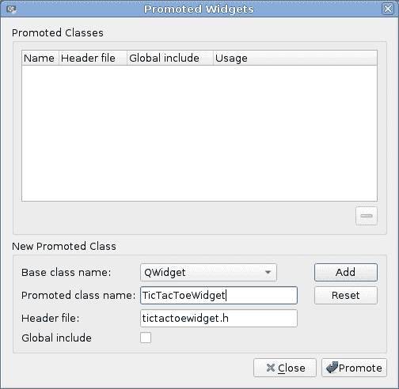

然后，点击标有“添加”和“提升”的按钮，以关闭对话框并确认提升。你将不会在表单中注意到任何变化，因为替换仅在运行时发生（然而，你将在对象树中看到`gameBoard`旁边的`TicTacToeWidget`类名）。

运行应用程序并检查游戏板是否出现在主窗口中：

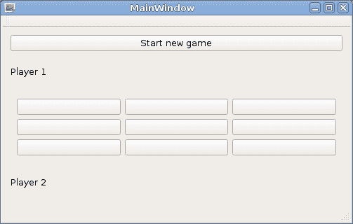

# 刚才发生了什么？

并非所有的小部件类型都在表单设计器中直接可用。有时，我们需要使用仅在构建的项目中创建的小部件类。将自定义小部件放置在表单上的最简单方法就是要求设计者将标准小部件的类名替换为自定义名称。通过将对象提升到不同的类，我们节省了大量尝试将游戏板适配到用户界面的工作。

你现在熟悉了创建自定义小部件的两种方式：你可以使用表单编辑器或从代码中添加小部件。两种方法都很重要。在项目中创建新的小部件类时，根据当前任务选择最方便的方法。

# 对象的自动删除

你可能已经注意到，尽管我们在构造函数中使用`new`运算符创建了许多对象，但我们没有在任何地方（例如，在析构函数中）销毁这些对象。这是因为 Qt 管理内存的方式。Qt 不执行垃圾回收（如 C#或 Java 所做的那样），但它有一个与`QObject`父子层次结构相关的良好特性。规则是，每当一个`QObject`实例被销毁时，它也会删除其所有子项。这也是为什么我们要将创建的对象设置为父对象的原因之一——如果我们这样做，我们就不必担心显式释放任何内存。

由于我们顶级小部件（`MainWindow`类的实例）内部的所有布局和小部件都是其直接或间接的子项，因此当主窗口被销毁时，它们都将被删除。`MainWindow`对象在`main()`函数中创建，没有使用`new`关键字，因此将在`a.exec()`返回后，在应用程序结束时被删除。

当与小部件一起工作时，很容易验证每个对象都有一个合适的父对象。你可以假设显示在窗口内的任何内容都是该窗口的直接或间接子对象。然而，当与不可见对象一起工作时，父子关系变得不那么明显，因此你应该始终检查每个对象是否有一个合适的父对象，并且因此将在某个时候被删除。例如，在我们的`TicTacToeWidget`类中，`gridLayout`对象通过构造函数参数（`this`）接收其父对象。按钮对象最初创建时没有父对象，但`addWidget()`函数将父小部件分配给它们。

# 行动时间 – 费用板的功能

我们需要实现一个函数，该函数将在点击板上的任意一个九个按钮时被调用。它必须根据哪个玩家移动来更改被点击按钮的文本——要么是“X”要么是“O”。然后它必须检查这个移动是否导致玩家获胜（如果没有更多移动，则为平局），如果游戏结束，它应该发出适当的信号，通知环境有关事件。

当用户点击按钮时，会发出`clicked()`信号。将此信号连接到自定义槽位使我们能够实现所提到的功能，但由于信号不携带任何参数，我们如何知道哪个按钮触发了槽位？我们可以将每个按钮连接到单独的槽位，但这是一种丑陋的解决方案。幸运的是，有两种方法可以解决这个问题。当槽位被调用时，可以通过`QObject`中的特殊方法`sender()`访问导致信号发出的对象的指针。我们可以使用该指针来确定存储在板列表中的九个按钮中哪一个导致了信号的触发：

```cpp
void TicTacToeWidget::someSlot() {
    QPushButton *button = static_cast<QPushButton*>(sender());
    int buttonIndex = m_board.indexOf(button);
    // ...
} 
```

虽然`sender()`是一个有用的调用，但我们应该尽量避免在我们的代码中使用它，因为它破坏了一些面向对象编程的原则。此外，有些情况下调用此函数是不安全的。更好的方法是使用一个专门的类`QSignalMapper`，它允许我们在不直接使用`sender()`的情况下实现类似的结果。按照以下方式修改`TicTacToeWidget`的构造函数：

```cpp
QGridLayout *gridLayout = new QGridLayout(this);
QSignalMapper *mapper = new QSignalMapper(this);
for(int row = 0; row < 3; ++row) {
    for(int column = 0; column < 3; ++column) {
        QPushButton *button = new QPushButton(" ");
        gridLayout->addWidget(button, row, column);
        m_board.append(button);
        mapper->setMapping(button, m_board.count() - 1);
        connect(button, SIGNAL(clicked()), mapper, SLOT(map()));
    }
}
connect(mapper, SIGNAL(mapped(int)),
        this,   SLOT(handleButtonClick(int)));
```

在这里，我们首先创建了一个`QSignalMapper`的实例，并将指向板小部件的指针作为其父对象传递，这样当小部件被删除时，映射器也会被删除。

几乎所有`QObject`的子类都可以在构造函数中接收父对象的指针。实际上，我们的`MainWindow`和`TicTacToeWidget`类也可以这样做，这要归功于 Qt Creator 在它们的构造函数中生成的代码。在自定义基于`QObject`的类中遵循此规则是推荐的。虽然父参数通常是可选的，但在可能的情况下传递它是好主意，因为当父对象被删除时，对象将被自动删除。然而，有一些情况下这是多余的，例如，当你将小部件添加到布局中时，布局将自动设置父小部件。

然后，当我们创建按钮时，我们“教”映射器每个按钮都有一个与之关联的数字——第一个按钮将具有数字`0`，第二个按钮将绑定到数字`1`，依此类推。通过将按钮的`clicked()`信号连接到映射器的`map()`槽，我们告诉映射器处理该信号。当映射器从任何按钮接收到信号时，它将找到信号发送者的映射，并发出另一个信号——`mapped()`——其参数为映射的数字。这允许我们通过一个新的槽（`handleButtonClick()`）连接到该信号，该槽接受按钮在板列表中的索引。

在创建和实现槽之前，我们需要创建一个有用的枚举类型和一些辅助方法。首先，将以下代码添加到`tictactoewidget.h`文件中的类声明的公共部分：

```cpp
enum class Player {
    Invalid, Player1, Player2, Draw
};
Q_ENUM(Player)
```

这个枚举让我们可以指定有关游戏中玩家的信息。`Q_ENUM`宏将使 Qt 识别枚举（例如，它将允许你将此类型的值传递给`qDebug()`，并使序列化更容易）。通常，在基于`QObject`的类中使用`Q_ENUM`是一个好主意。

我们可以立即使用`Player`枚举来标记现在是哪个玩家的回合。为此，向类中添加一个私有字段：

```cpp
Player m_currentPlayer; 
```

不要忘记在构造函数中为新字段提供一个初始值：

```cpp
m_currentPlayer = Player::Invalid;
```

然后，添加两个公共方法来操作该字段的值：

```cpp
Player currentPlayer() const 
{ 
    return m_currentPlayer; 
}
void setCurrentPlayer(Player p)
{
    if(m_currentPlayer == p) {
        return;
    }
    m_currentPlayer = p;
    emit currentPlayerChanged(p);
} 
```

最后一个方法发出一个信号，因此我们必须将信号声明添加到类定义中，以及我们将使用的另一个信号：

```cpp
signals:
    void currentPlayerChanged(Player);
    void gameOver(Player); 
```

我们只在当前玩家确实改变时发出`currentPlayerChanged`信号。你总是要注意，当你将值设置为一个字段，并且该值与函数调用之前该字段的值相同时，不要发出“已更改”信号。你的类的用户期望如果调用“已更改”信号，则只有在值真正更改时才发出。否则，如果你有两个对象，它们将它们的值设置器连接到另一个对象的更改信号，这可能导致信号发射中的无限循环。

现在是时候实现槽本身了。首先，在头文件中声明它：

```cpp
private slots:
    void handleButtonClick(int index);
```

使用*Alt*+*Enter*快速生成新方法的定义，就像我们之前做的那样。

当按下任意按钮时，将调用`handleButtonClick()`槽函数。点击的按钮索引将作为参数接收。现在我们可以在`.cpp`文件中实现这个槽函数：

```cpp
void TicTacToeWidget::handleButtonClick(int index)
{
    if (m_currentPlayer == Player::Invalid) {
        return; // game is not started
    }
    if(index < 0 || index >= m_board.size()) {
        return; // out of bounds check
    }
    QPushButton *button = m_board[index];
    if(button->text() != " ") return; // invalid move
    button->setText(currentPlayer() == Player::Player1 ? "X" : "O");
    Player winner = checkWinCondition();
    if(winner == Player::Invalid) {
        setCurrentPlayer(currentPlayer() == Player::Player1 ?
                         Player::Player2 : Player::Player1);
        return;
    } else {
        emit gameOver(winner);
    }
}
```

在这里，我们首先根据索引检索按钮的指针。然后，我们检查按钮是否包含空格——如果没有，那么它已经被占用，所以我们从方法中返回，让玩家可以在棋盘上选择另一个字段。接下来，我们在按钮上设置当前玩家的标记。然后，我们检查玩家是否赢得了游戏。如果游戏没有结束，我们切换当前玩家并返回；否则，我们发出一个`gameOver()`信号，告诉我们的环境谁赢得了游戏。`checkWinCondition()`方法在游戏结束时返回`Player1`、`Player2`或`Draw`，否则返回`Invalid`。我们不会在这里展示这个方法的实现，因为它相当长。尝试自己实现它，如果遇到问题，你可以在本书附带的代码包中查看解决方案。

在这个类中，我们最后需要做的是添加另一个公共方法来启动新游戏。这个方法将清除棋盘并设置当前玩家：

```cpp
void TicTacToeWidget::initNewGame() {
    for(QPushButton *button: m_board) {
        button->setText(" ");
    }
    setCurrentPlayer(Player::Player1);
}
```

现在我们只需要在`MainWindow::startNewGame`方法中调用这个方法：

```cpp
void MainWindow::startNewGame()
{
    ui->player1Name->setText(tr("Alice"));
    ui->player2Name->setText(tr("Bob"));
    ui->gameBoard->initNewGame();
}
```

注意，`ui->gameBoard`实际上有一个`TicTacToeWidget *`类型，我们可以调用它的方法，即使表单编辑器对我们的自定义类没有任何具体了解。这是我们在之前所做的*提升*的结果。

是时候看看这一切是如何协同工作的了！运行应用程序，点击“开始新游戏”按钮，你应该能够玩一些井字棋。

# 行动时间 – 对游戏板信号的响应

在编写回合制棋盘游戏时，始终清楚地标记现在是哪个玩家的回合进行移动是一个好主意。我们将通过在粗体中标记移动玩家的名字来实现这一点。棋盘类中已经有一个信号告诉我们当前玩家已经改变，我们可以对此做出反应来更新标签。

我们需要将棋盘的`currentPlayerChanged`信号连接到`MainWindow`类中的一个新的槽函数。让我们在`MainWindow`构造函数中添加适当的代码：

```cpp
ui->setupUi(this);
connect(ui->gameBoard, &TicTacToeWidget::currentPlayerChanged,
        this, &MainWindow::updateNameLabels);
```

现在，对于槽函数本身，在`MainWindow`类中声明以下方法：

```cpp
private:
    void setLabelBold(QLabel *label, bool isBold);
private slots:
    void updateNameLabels();
```

现在按照以下代码实现它们：

```cpp
void MainWindow::setLabelBold(QLabel *label, bool isBold)
{
    QFont f = label->font();
    f.setBold(isBold);
    label->setFont(f);
}

void MainWindow::updateNameLabels()
{
    setLabelBold(ui->player1Name,
        ui->gameBoard->currentPlayer() == 
            TicTacToeWidget::Player::Player1);
    setLabelBold(ui->player2Name,
        ui->gameBoard->currentPlayer() == 
            TicTacToeWidget::Player::Player2);
}
```

# 刚才发生了什么？

`QWidget`（以及通过扩展，任何小部件类）有一个`font`属性，它决定了这个小部件使用的字体属性。这个属性具有`QFont`类型。我们不能简单地写`label->font()->setBold(isBold);`，因为`font()`返回一个 const 引用，所以我们必须复制`QFont`对象。这个副本与标签没有连接，因此我们需要调用`label->setFont(f)`来应用我们的更改。为了避免重复这个程序，我们创建了一个辅助函数，称为`setLabelBold`。

需要完成最后一件事情是处理游戏结束的情况。将来自棋盘的`gameOver()`信号连接到主窗口类中的一个新槽。如下所示实现该槽：

```cpp
void MainWindow::handleGameOver(TicTacToeWidget::Player winner) {
    QString message;
    if(winner == TicTacToeWidget::Player::Draw) {
        message = tr("Game ended with a draw.");
    } else {
        QString winnerName = winner == TicTacToeWidget::Player::Player1 ?
                    ui->player1Name->text() : ui->player2Name->text();
        message = tr("%1 wins").arg(winnerName);
    }
    QMessageBox::information(this, tr("Info"), message);
}
```

此代码检查谁赢得了游戏，组装消息（我们将在第六章，*Qt 核心基础*)，并使用静态方法`QMessageBox::information()`显示包含消息和允许我们关闭对话框的按钮的模态对话框。

运行游戏并检查它现在是否突出显示了当前玩家，并在游戏结束时显示消息。

# 高级表单编辑器使用

现在是时候给玩家提供一个输入他们名字的方法了。我们将通过添加一个在开始新游戏时出现的游戏配置对话框来实现这一点。

# 行动时间 - 设计游戏配置对话框

首先，在`tictactoe`项目的上下文菜单中选择“添加新...”，然后选择创建一个新的 Qt Designer 表单类，如图所示：

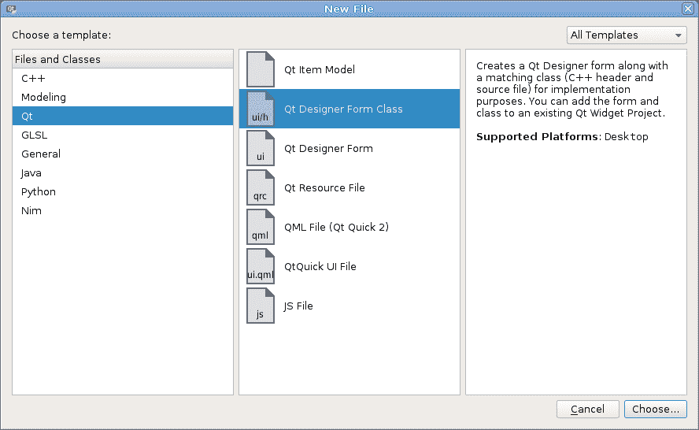

在出现的窗口中，选择“底部按钮对话框”：

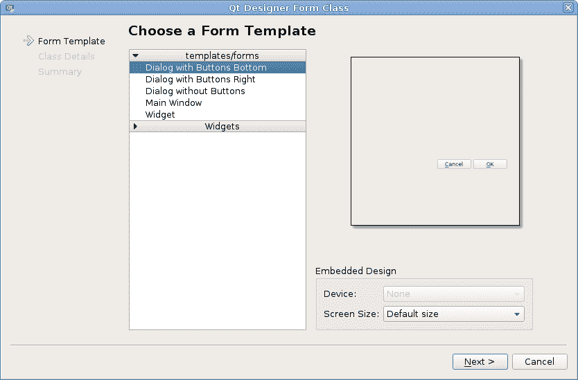

将类名调整为`ConfigurationDialog`，将其他设置保留为默认值，并完成向导。项目中出现的文件（`.cpp`、`.h`和`.ui`）与我们创建项目时为`MainWindow`类生成的文件非常相似。唯一的区别是`MainWindow`使用`QMainWindow`作为其基类，而`ConfigurationDialog`使用`QDialog`。此外，在`main`函数中创建了一个`MainWindow`实例，因此当应用程序启动时它就会显示，而我们需要在代码的其他地方创建一个`ConfigurationDialog`实例。`QDialog`实现了对话框的常见行为；除了主要内容外，它还显示一个或多个按钮。当对话框被选中时，用户可以与对话框交互，然后按下其中一个按钮。之后，对话框通常会被销毁。`QDialog`有一个方便的`exec()`方法，它不会返回直到用户做出选择，然后它返回有关按下的按钮的信息。我们将在创建对话框后看到这一点。

将两个标签和两个行编辑拖放到表单上，将它们大致放置在一个网格中，双击每个标签，并调整它们的标题以获得以下类似的结果：

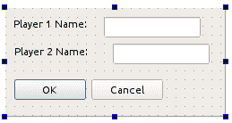

将行编辑的`objectName`属性更改为`player1Name`和`player2Name`。然后，在表单中点击一些空白区域，并在上工具栏中选择布局中的网格选项。你应该会看到小部件自动对齐——这是因为你刚刚为表单应用了一个布局。打开工具菜单，转到表单编辑器子菜单，并选择预览选项来预览表单。

# 加速器和标签伙伴

现在，我们将专注于给对话框添加更多润色。我们首先将要做的是为我们的小部件添加加速器。这些是键盘快捷键，当激活时，会导致特定的小部件获得键盘焦点或执行预定的动作（例如，切换复选框或按下按钮）。加速器通常通过以下方式标记：下划线。

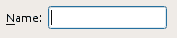

我们将为我们的行编辑设置加速器，这样当用户激活第一个字段的加速器时，它将获得焦点。通过这种方式，我们可以输入第一个玩家的名字，同样地，当第二个行编辑的加速器被触发时，我们可以开始输入第二个玩家的名字。

首先，选择第一个行编辑左侧的第一行标签。按下 *F2* 并将文本更改为 `Player &A Name:`。和号字符（`&`）标记了其后的字符作为小部件的加速器。在某些平台上，加速器可能无法与数字一起工作，所以我们决定使用字母。同样，将第二个标签重命名为 `Player &B Name:`。

对于由文本和实际功能（例如，按钮）组成的小部件，这足以使加速器工作。然而，由于 `QLineEdit` 没有任何与之关联的文本，我们必须使用一个单独的小部件。这就是为什么我们在标签上设置了加速器。现在我们需要将标签与行编辑关联起来，以便标签加速器的激活可以将其转发到我们选择的小部件。这是通过为标签设置所谓的 **伙伴** 来实现的。你可以使用 `QLabel` 类的 `setBuddy` 方法在代码中这样做，或者使用创建者的表单设计器。由于我们已经在设计模式中，我们将使用后一种方法。为此，我们需要在表单设计器中激活一个专用模式。

查看创建者窗口的上部；在表单上方，你会找到一个包含几个图标的工具栏。点击标有“编辑好友”的图标！[](img/bd8d678d-e636-412f-9615-94b0a118a51f.png)。现在，将鼠标光标移至标签上，按下鼠标按钮，并从标签拖动到行编辑。当你将标签拖动到行编辑上时，你会看到一个图形化的连接设置过程，连接标签和行编辑。如果你现在释放按钮，这个关联将会被永久建立。你应该注意，当这种关联建立后，和号字符（`&`）将从标签中消失，并且它后面的字符会得到一个下划线。重复此过程为其他标签和相应的行编辑设置。点击表单上方的“编辑小部件”按钮！[](img/20601812-6569-4f11-bf91-8da1075bde0f.png)，以将表单编辑器返回到默认模式。现在，你可以再次预览表单，并检查加速器是否按预期工作；按下 *Alt* + *A* 和 *Alt* + *B* 应该分别将文本光标设置到第一个和第二个文本字段。

# 标签顺序

当你在预览表单时，可以检查 UI 设计的另一个方面。注意当表单打开时，哪一行编辑框会获得焦点。有可能第二行编辑框会首先被激活。要检查和修改焦点顺序，请关闭预览，并通过点击工具栏中的图标“编辑标签顺序”切换到标签顺序编辑模式！。

此模式将一个带有数字的框与每个可聚焦的小部件关联起来。通过按照你希望小部件获得焦点的顺序点击矩形，你可以重新排序值，从而重新排序焦点。现在将其设置为如下所示：

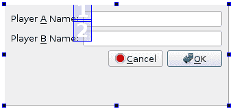

我们的形式只有两个可以接收焦点的小部件（除了对话框的按钮，但它们的标签顺序是自动管理的）。如果你创建了一个包含多个控件的形式，那么当你反复按*Tab*键时，焦点可能会在按钮和行编辑之间来回跳跃，而不是从上到下的线性进度（这对于这个特定的对话框来说是一个直观的顺序）。你可以使用此模式来纠正标签顺序。

再次进入预览并检查焦点是否根据你的设置发生变化。

在决定标签顺序时，考虑对话框中哪些字段是必填的，哪些是可选的，是个好主意。允许用户首先遍历所有必填字段，然后到对话框确认按钮（例如，一个写着 OK 或 Accept 的按钮），然后遍历所有可选字段是个好主意。这样，用户就可以快速填写所有必填字段并接受对话框，而无需遍历所有用户希望保留为默认值的可选字段。

# 行动时间 – 对话框的公共接口

下一步是允许从对话框外部存储和读取玩家名称——由于`ui`组件是私有的，因此无法从类代码外部访问它。这是一个常见的情况，Qt 也符合这种情况。几乎每个 Qt 类中的每个数据字段都是私有的，可能包含访问器（一个获取器和可选的设置器），这些是公共方法，允许我们读取和存储数据字段的值。我们的对话框有两个这样的字段——两个玩家的名称。

Qt 中设置器方法的名称通常以`set`开头，后跟属性名称，首字母转换为大写。在我们的情况下，两个设置器将被称为`setPlayer1Name`和`setPlayer2Name`，它们都将接受`QString`并返回`void`。在类头文件中声明它们，如下面的代码片段所示：

```cpp
void setPlayer1Name(const QString &p1name);
void setPlayer2Name(const QString &p2name); 
```

在`.cpp`文件中实现它们的主体：

```cpp
void ConfigurationDialog::setPlayer1Name(const QString &p1name)
{
    ui->player1Name->setText(p1name);
}
void ConfigurationDialog::setPlayer2Name(const QString &p2name)
{
    ui->player2Name->setText(p2name);
} 
```

Qt 中的获取器方法通常与它们相关的属性同名——`player1Name`和`player2Name`。将以下代码放入头文件中：

```cpp
QString player1Name() const;
QString player2Name() const;
```

将以下代码放入实现文件：

```cpp
QString ConfigurationDialog::player1Name() const
{
    return ui->player1Name->text();
}
QString ConfigurationDialog::player2Name() const
{
    return ui->player2Name->text();
}
```

我们的对话框现在已准备就绪。让我们在 `MainWindow::startNewGame` 函数中使用它，在开始游戏之前请求玩家名称：

```cpp
ConfigurationDialog dialog(this);
if(dialog.exec() == QDialog::Rejected) {
    return; // do nothing if dialog rejected
}
ui->player1Name->setText(dialog.player1Name());
ui->player2Name->setText(dialog.player2Name());
ui->gameBoard->initNewGame();
```

在这个槽中，我们创建设置对话框并展示给用户，强迫他们输入玩家名称。`exec()` 函数只有在对话框被接受或取消时才会返回。如果对话框被取消，我们将放弃创建新游戏。否则，我们向对话框请求玩家名称并将它们设置在适当的标签上。最后，我们初始化棋盘，以便用户可以玩游戏。对话框对象是在没有使用 `new` 关键字的情况下创建的，所以它将在之后立即被删除。

现在，你可以运行应用程序并查看配置对话框是如何工作的。

# 应用程序抛光

我们已经实现了我们游戏的所有重要功能，现在我们将通过探索其他 Qt 功能来开始改进它。

# 尺寸策略

如果你改变我们游戏主窗口的高度，你会注意到不同的部件以不同的方式调整大小。特别是，按钮保持其原始高度，而标签在文本的顶部和底部获得空白区域：

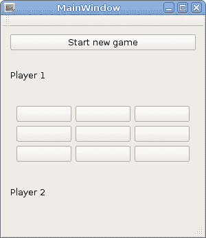

这是因为每个小部件都有一个名为 `sizePolicy` 的属性，它决定了布局如何调整小部件的大小。您可以分别为水平和垂直方向设置不同的尺寸策略。按钮默认的垂直尺寸策略为 `Fixed`，这意味着无论有多少可用空间，小部件的高度都不会从默认高度改变。标签默认的尺寸策略为 `Preferred`。以下是可以用的尺寸策略：

+   `Ignored`：在这种情况下，小部件的默认大小被忽略，小部件可以自由地增长和缩小

+   `Fixed`：在这种情况下，默认大小是小部件唯一允许的大小

+   `Preferred`：在这种情况下，默认大小是期望的大小，但较小和较大的尺寸都是可接受的

+   `Minimum`：在这种情况下，默认大小是小部件可以接受的最小大小，但小部件可以被放大而不会损害其功能

+   `Maximum`：在这种情况下，默认大小是小部件的最大大小，小部件可以被缩小（甚至缩小到无），而不会损害其功能

+   `Expanding`：在这种情况下，默认大小是期望的大小；较小的尺寸（甚至为零）是可接受的，但小部件能够在其分配更多空间时增加其有用性

+   `MinimumExpanding`：这是 `Minimum` 和 `Expanding` 的组合——小部件在空间方面是贪婪的，并且不能被缩小到小于其默认大小

我们如何确定默认大小？答案是`sizeHint`虚拟方法返回的大小。对于布局，大小是根据其子小部件和嵌套布局的大小和大小策略计算的。对于基本小部件，`sizeHint`返回的值取决于小部件的内容。在按钮的情况下，如果它包含一行文本和一个图标，`sizeHint`将返回包含文本、图标、它们之间的一些空间、按钮框架以及框架和内容本身之间的填充所需的大小。

在我们的表单中，我们希望当主窗口大小改变时，标签的高度保持不变，而游戏板按钮则增长。为此，在表单编辑器中打开`mainwindow.ui`，选择第一个标签，然后按住*Ctrl*并点击第二个标签。现在两个标签都被选中，因此我们可以同时编辑它们的属性。在属性编辑器中找到`sizePolicy`（如果你在查找属性时遇到困难，请使用属性编辑器上方的过滤器字段）。通过点击左侧的三角形来展开它。将垂直策略设置为固定。你将立即在表单布局中看到变化。

游戏板上的按钮是在代码中创建的，因此导航到`TicTacToeWidget`类的构造函数，并使用以下代码设置大小策略：

```cpp
QPushButton *button = new QPushButton(" ");
button->setSizePolicy(QSizePolicy::Preferred,
                      QSizePolicy::Preferred);
```

这将改变按钮的水平垂直策略为`Preferred`。运行游戏并观察变化：

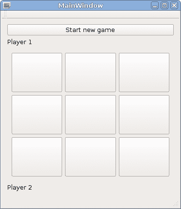

# 防止无效输入

配置对话框之前没有进行任何验证。让我们使其按钮仅在两个行编辑器都不为空（即两个字段都包含玩家名称）时启用。为此，我们需要将每个行编辑的`textChanged`信号连接到一个将执行此任务的槽。

首先，转到`configurationdialog.h`文件，并在`ConfigurationDialog`类中创建一个私有槽`void updateOKButtonState();`（你需要手动添加`private slots`部分）。使用以下代码来实现此槽：

```cpp
void ConfigurationDialog::updateOKButtonState()
{
    QPushButton *okButton = ui->buttonBox->button(QDialogButtonBox::Ok);
    okButton->setEnabled(!ui->player1Name->text().isEmpty() &&
                         !ui->player2Name->text().isEmpty());
}
```

此代码要求包含 OK 和 Cancel 按钮的按钮框提供接受对话框的指针（我们必须这样做，因为按钮不是直接包含在表单中，所以在`ui`中没有它们的字段）。然后，我们根据两个玩家名称是否包含有效值来设置按钮的`enabled`属性。

接下来，编辑对话框的构造函数以将两个信号连接到我们新的槽。当第一次创建对话框时，按钮状态也需要更新，因此将`updateOKButtonState()`的调用添加到构造函数中：

```cpp
ui->setupUi(this);
connect(ui->player1Name, &QLineEdit::textChanged,
 this, &ConfigurationDialog::updateOKButtonState);
connect(ui->player2Name, &QLineEdit::textChanged,
 this, &ConfigurationDialog::updateOKButtonState);
updateOKButtonState();
```

# 主菜单和工具栏

如您所记，任何没有父级的小部件都会显示为一个窗口。然而，当我们创建主窗口时，我们选择了 `QMainWindow` 作为基类。如果我们选择了 `QWidget`，我们仍然能够做到这一点。然而，`QMainWindow` 类提供了一些独特的功能，我们现在将使用这些功能。

主窗口代表应用程序的控制中心。它可以包含菜单、工具栏、停靠小部件、状态栏以及包含窗口主要内容的*中心小部件*，如下面的图示所示：

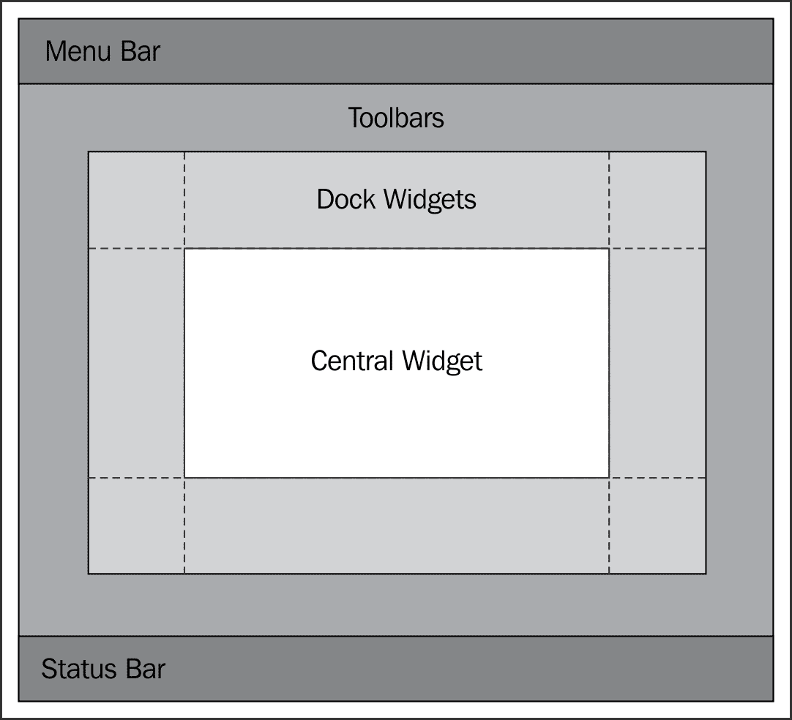

如果您打开 `mainwindow.ui` 文件并查看对象树，您将看到包含我们的表单的强制性的 `centralWidget`。还有可选的 `menuBar`、`mainToolBar` 和 `statusBar`，它们是在 Qt Creator 生成表单时自动添加的。

中心小部件部分不需要额外的解释；它就像任何其他常规小部件一样。我们也不会在这里关注停靠小部件或状态栏。它们是有用的组件，但您可以自己学习它们。相反，我们将花一些时间掌握菜单和工具栏。您肯定在许多应用程序中看到并使用过工具栏和菜单，您知道它们对于良好的用户体验是多么重要。

主菜单有一些不寻常的行为。它通常位于窗口的顶部，但在 macOS 和一些 Linux 环境中，主菜单与窗口分离，显示在屏幕的顶部区域。另一方面，工具栏可以被用户自由移动，并水平或垂直停靠在主窗口的两侧。

这两个概念共享的主要类是`QAction`，它代表用户可以调用的功能。单个动作可以在多个地方使用——它可以是一个菜单（`QMenu`实例）或工具栏（`QToolBar`）、按钮或键盘快捷键（`QShortcut`）的条目。操作动作（例如，更改其文本）会导致所有其化身更新。例如，如果你在菜单中有一个带有键盘快捷键的“保存”条目（与工具栏中的保存图标和可能还位于用户界面其他位置的保存按钮相关联），并且你想要禁止保存文档（例如，你的地下城与龙游戏关卡编辑器中的地图）因为自上次加载文档以来其内容没有变化。在这种情况下，如果菜单条目、工具栏图标和按钮都链接到同一个`QAction`实例，那么一旦你将动作的`enabled`属性设置为`false`，这三个实体都将被禁用。这是一个保持应用程序不同部分同步的简单方法——如果你禁用动作对象，你可以确信触发动作所代表的功能的所有条目也都已被禁用。动作可以在代码中实例化或使用 Qt Creator 中的动作编辑器图形化创建。动作可以与不同的数据相关联——文本、工具提示、状态栏提示、图标以及其他较少使用的其他内容。所有这些都被你的动作的化身所使用。

# 动作时间 – 创建菜单和工具栏

让我们把无聊的“开始新游戏”按钮替换成一个菜单项和一个工具栏图标。首先，选择按钮并按*Delete*键删除它。然后，在表单编辑器的底部中央找到动作编辑器，并点击其工具栏上的“新建”按钮。在对话框中输入以下值（你可以通过按下你想要使用的快捷键组合来填充“快捷键”字段）：

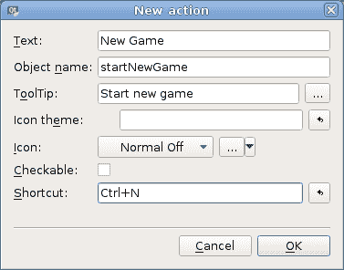

在中央区域（在“在此输入文本”和第一个标签之间）找到工具栏，并将包含“新游戏”动作的行从动作编辑器拖到工具栏上，这将导致工具栏中出现一个按钮。

要为窗口创建一个菜单，双击表单顶部的“在此输入文本”并替换文本为`&File`（尽管我们的应用程序不处理文件，但我们将遵循这一传统）。然后，将“新游戏”动作从动作编辑器拖到新创建的菜单上，但不要将其放下。现在菜单应该打开了，你可以拖动动作，直到在子菜单中你想要菜单项出现的位置出现一个红色条，现在你可以释放鼠标按钮来创建该条目。

现在我们应该恢复在删除按钮时被破坏的功能。导航到`MainWindow`类的构造函数并调整`connect()`调用：

```cpp
connect(ui->startNewGame, &QAction::triggered,
        this, &MainWindow::startNewGame);
```

操作，就像小部件一样，可以通过`ui`对象访问。`ui->startNewGame`对象现在是一个`QAction`而不是`QPushButton`，我们使用它的`triggered()`信号来检测操作是否以某种方式被选中。

现在，如果你运行应用程序，你可以选择菜单项，点击工具栏上的按钮，或者按`*Ctrl* + *N*键。这些操作中的任何一个都会导致操作发出`triggered()`信号，游戏配置对话框应该会出现。

与小部件一样，`QAction`对象有一些有用的方法，可以在我们的表单类中访问。例如，执行`ui->startNewGame->setEnabled(false)`将禁用触发新游戏操作的所有方式。

让我们再添加一个退出应用程序的操作（尽管用户可以通过关闭主窗口来做到这一点）。使用操作编辑器添加一个带有文本`Quit`、对象名`quit`和快捷键*Ctrl* + *Q*的新操作。将其添加到菜单和工具栏中，就像第一个操作一样。

我们可以添加一个新的槽来停止应用程序，但这样的槽已经在`QApplication`中存在，所以让我们重用它。在`mainwindow.cpp`中找到我们表单的构造函数，并附加以下代码：

```cpp
connect(ui->quit, &QAction::triggered,
        qApp,     &QApplication::quit);
```

# 刚才发生了什么？

`qApp`宏是一个指向应用程序单例对象的函数的快捷方式，因此当操作被触发时，Qt 将调用在`main()`中创建的`QApplication`对象的`quit()`槽，这将反过来导致应用程序结束。

# Qt 资源系统

工具栏中的按钮通常显示图标而不是文本。为了实现这一点，我们需要将图标文件添加到我们的项目中，并将它们分配给创建的操作。

创建图标的一种方法是从文件系统中加载图像。问题是你必须安装与应用程序一起的一堆文件，并且你需要始终知道它们的位置，以便能够提供路径来访问它们。幸运的是，Qt 提供了一种方便且可移植的方法，可以将任意文件（如图标图像）直接嵌入到可执行文件中。这是通过准备随后编译到二进制中的资源文件来完成的。Qt Creator 也为此提供了一个图形工具。

# 行动时间 – 向项目中添加图标

我们将向“开始新游戏”和“退出”操作添加图标。首先，使用你的文件管理器在项目目录中创建一个名为`icons`的新子目录。在该目录中放置两个图标文件。你可以使用书中提供的图标文件。

在`tictactoe`项目的上下文菜单中点击“添加新...”，然后在 Qt 类别中选择 Qt 资源文件。将其命名为`resources`，完成向导。Qt Creator 将为项目添加一个新的`resources.qrc`文件（它将在项目树中的“资源”类别下显示）。

在 Qt Creator 的项目树中定位新的 `resources.qrc` 文件，并在其上下文菜单中选择“添加现有文件...”。选择两个图标，并确认将它们添加到资源中。

打开 `mainwindow.ui` 表单，并在动作编辑器中双击一个动作。点击图标字段旁边的“...”按钮，在窗口的左侧选择图标，并在窗口的右侧选择合适的图标。一旦你在对话框中确认更改，工具栏上的相应按钮将切换为显示图标而不是文本。菜单项也将获得所选的图标。为第二个动作重复此操作。我们的游戏现在应该看起来像这样：

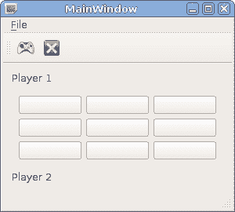

# 尝试一下英雄扩展游戏

你可以在项目中做出很多细微的改进。例如，你可以更改主窗口的标题（通过编辑其 `windowTitle` 属性），为动作添加快捷键，禁用点击时无操作的棋盘按钮，移除状态栏，或用它来显示游戏状态。

作为一项附加练习，你可以尝试修改本章中我们编写的代码，以便在大于 3 × 3 的棋盘上玩游戏。让用户决定棋盘的大小（你可以修改游戏选项对话框来实现这一点，并使用 `QSlider` 和 `QSpinBox` 允许用户选择棋盘的大小），然后你可以指导 `TicTacToeWidget` 根据它得到的大小构建棋盘。记住调整游戏胜利逻辑！如果在任何时刻你遇到了死胡同，不知道要使用哪些类和函数，请查阅参考手册。

# 快速问答

Q1. 哪些类可以有信号？

1.  所有从 `QWidget` 派生的类。

1.  所有从 `QObject` 派生的类。

1.  所有类。

Q2. 对于以下哪个，你必须提供自己的实现？

1.  一个信号。

1.  一个槽。

1.  两者都。

Q3. 返回小部件首选大小的方法被称为以下哪个？

1.  `preferredSize`。

1.  `sizeHint`。

1.  `defaultSize`。

Q4. `QAction` 对象的目的是什么？

1.  它代表用户可以在程序中调用的功能。

1.  它包含一个键序列，用于将焦点移动到小部件上。

1.  它是使用表单编辑器生成的所有表单的基类。

# 概述

在本章中，你学习了如何使用 Qt 创建简单的图形用户界面。我们介绍了两种方法：使用图形工具设计用户界面，该工具为我们生成大部分代码，以及通过直接编写所有代码来创建用户界面类。它们没有哪一个比另一个更好。表单设计器允许你避免样板代码，并帮助你处理带有大量控件的大型表单。另一方面，编写代码的方法让你对过程有更多的控制，并允许你创建自动填充和动态的界面。

我们还学习了如何在 Qt 中使用信号和槽。现在您应该能够通过将信号连接到槽（预定义的以及您现在知道如何定义并填充代码的自定义槽）来创建简单的用户界面并填充逻辑。

Qt 包含许多小部件类型，但我们并没有逐一向您介绍它们。Qt 手册中有一个名为 Qt 小部件画廊的非常棒的说明，其中展示了大多数小部件的实际应用。如果您对使用这些小部件中的任何一个有任何疑问，您可以查看示例代码，并在 Qt 参考手册中查找相应的类以了解更多信息。

正如您已经看到的，Qt 允许您创建自定义小部件类，但在这个章节中，我们的自定义类主要重用了默认的小部件。您也可以修改小部件对事件的响应方式，并实现自定义绘制。我们将在第八章自定义小部件中深入探讨这个高级主题。然而，如果您想实现一个带有自定义 2D 图形的游戏，有一个更简单的替代方案——我们将在下一章中使用的图形视图框架。
