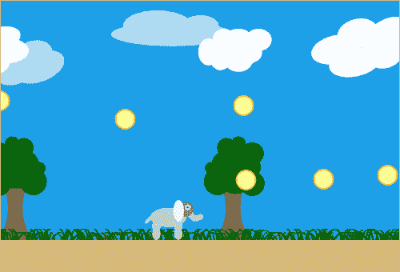
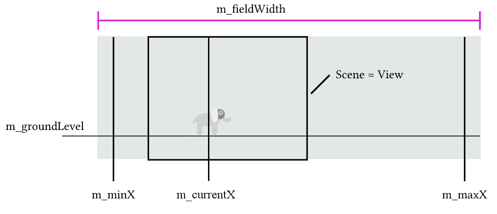
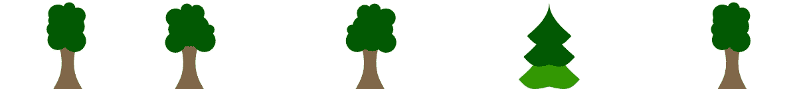
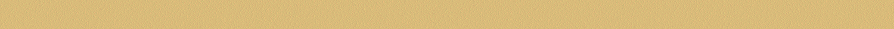

# 图形视图中的动画

上一章为你提供了大量关于 Graphics View 框架功能的信息。有了这些知识，我们现在可以继续实现我们的第一个 2D 游戏。将来，我们将学习更多关于 Qt 的属性系统，探索执行动画的多种方式，并将游戏手柄支持添加到我们的应用程序中。到本章结束时，你将了解 Graphics View 的所有最有用的功能。

本章涵盖的主要主题如下：

+   使用计时器

+   摄像机控制

+   垂直滚动

+   Qt 的属性系统

+   动画框架

+   使用 Qt 游戏手柄模块

# 跳跃的大象或如何动画化场景

到目前为止，你应该对物品、场景和视图有了很好的理解。凭借你创建物品（标准或自定义）、在场景中定位它们以及设置视图以显示场景的知识，你可以制作出相当酷的东西。你甚至可以用鼠标缩放和移动场景。这当然很好，但对于一个游戏来说，还有一个关键点仍然缺失——你必须动画化物品。

我们不通过所有可能的场景动画方式，而是开发一个简单的跳跃跑酷游戏，在这个游戏中我们会回顾之前的一些主题，并学习如何在屏幕上动画化物品。那么，让我们来认识一下本杰明，这只大象：


# 游戏玩法

游戏的目标是让本杰明收集游戏场地上所有放置的硬币。除了左右移动，本杰明当然也可以跳跃。在下面的截图中，你可以看到这个简约游戏最终应该是什么样子：



# 行动时间 - 为本杰明创建一个物品

让我们创建一个新的 Qt Widgets 项目，并开始制作我们的游戏。由于这个项目将比我们之前的项目更复杂，我们不会给出精确的代码编辑指令。如果你在任何时候对所做的更改不确定，可以查看书中提供的参考实现。它还包含了你可以用来实现游戏的图像文件。

现在，让我们看看如何让本杰明动起来。首先，我们需要为他创建一个自定义的物品类。我们调用 `Player` 类，并选择 `QGraphicsPixmapItem` 作为基类，因为本杰明是一个 PNG 图像。在 `Player` 物品类中，我们进一步创建一个整型私有字段，并称其为 `m_direction`。它的值表示本杰明走向哪个方向——左或右——或者如果他静止不动。接下来，我们实现构造函数：

```cpp
Player::Player(QGraphicsItem *parent)
    : QGraphicsPixmapItem(parent)
    , m_direction(0)
{
    QPixmap pixmap(":/elephant");
    setPixmap(pixmap);
    setOffset(-pixmap.width() / 2, -pixmap.height() / 2);
}
```

在构造函数中，我们将 `m_direction` 设置为 `0`，这意味着本杰明根本不会移动。如果 `m_direction` 是 `1`，本杰明会向右移动，如果值是 `-1`，他会向左移动。在构造函数的主体中，我们通过调用 `setPixmap()` 来设置物品的图像。本杰明的图像存储在 Qt 资源系统中；因此，我们通过 `QPixmap(":/elephant")` 来访问它，其中 elephant 是本杰明实际图像的给定别名。最后，我们使用 `setOffset()` 函数来改变图像在物品坐标系中的位置。默认情况下，原点对应于图像的左上角，但我们更喜欢将其放在图像的中心，这样应用变换会更加容易。

当你不确定如何指定资源路径时，你可以询问 Qt Creator。为此，展开项目树中的资源分支，定位资源，并在其上下文菜单中选择复制路径...条目。

接下来，我们为 `m_direction` 字段创建一个获取器和设置器函数：

```cpp
int Player::direction() const {
    return m_direction;
}

void Player::setDirection(int direction)
{
    m_direction = direction;
    if (m_direction != 0) {
        QTransform transform;
        if (m_direction < 0) {
            transform.scale(-1, 1);
        }
        setTransform(transform);
    }
}
```

`direction()` 函数是 `m_direction` 的标准获取器函数，返回其值。`setDirection()` 设置器函数还检查本杰明正在向哪个方向移动。如果他正在向左移动，我们需要翻转他的图像，使本杰明看起来向左，这是他移动的方向。如果他正在向右移动，我们通过分配一个空的 `QTransform` 对象来恢复正常状态，这是一个单位矩阵。

我们不能在这里使用 `QGraphicsItem::setScale`，因为它只支持 *x* 和 *y* 轴相同的缩放因子。幸运的是，`setTransform()` 允许我们设置任何仿射或透视变换。

因此，我们现在有了游戏角色的 `Player` 类的物品，它显示了本杰明的图像。该物品还存储当前的移动方向，并根据该信息，如果需要，图像会垂直翻转。

# 比赛场地

由于我们将在场景上做一些工作，我们派生 `QGraphicsScene` 并将新类命名为 `MyScene`。在那里，我们实现游戏逻辑的一部分。这是方便的，因为 `QGraphicsScene` 继承自 `QObject`，因此我们可以使用 Qt 的信号和槽机制。

场景创建了一个环境，我们的象将在其中行走和跳跃。总的来说，我们有一个固定大小的视图，其中包含一个场景，其大小正好与视图相同。我们不考虑视图的大小变化，因为它们会使示例过于复杂。

比赛场地内的所有动画都是通过移动物品而不是场景来完成的。因此，我们必须区分视图的宽度（或者更确切地说，场景的宽度）和象虚拟“世界”的宽度，在这个虚拟世界中象可以移动。为了正确处理移动，我们需要在 `MyScene` 类中创建一些私有字段。

这个虚拟世界的宽度由 `int m_fieldWidth` 字段定义，并且与场景没有（直接）关联。在 `m_fieldWidth` 的范围内，例如示例中的 500 像素，本杰明或图形项可以从由 `qreal m_minX` 定义的最低 *x* 坐标移动到由 `qreal m_maxX` 定义的最高 x 坐标。我们使用 `qreal m_currentX` 变量跟踪其实际 *x* 位置。接下来，允许项目拥有的最低 *y* 坐标由 `qreal m_groundLevel` 定义。我们还需要考虑项目的大小。

最后，剩下的就是视图，其大小由场景的边界矩形大小固定定义，它不如 `m_fieldWidth` 宽。因此，场景（和视图）在象走过其 `m_fieldWidth` 长度的虚拟世界时跟随。请看下面的图解以了解变量的图形表示：



# 行动时间 - 让本杰明移动

下一步，我们想要做的是让我们的象可以移动。为了实现这一点，我们在 `MyScene` 中添加了一个私有成员 `QTimer m_timer`。`QTimer` 是一个可以定期以给定间隔发出 `timeout()` 信号的类。在 `MyScene` 构造函数中，我们使用以下代码设置定时器：

```cpp
m_timer.setInterval(30);
connect(&m_timer, &QTimer::timeout, 
        this, &MyScene::movePlayer); 
```

首先，我们定义定时器每 30 毫秒发出一次超时信号。然后，我们将该信号连接到场景的 `movePlayer()` 插槽，但我们还没有启动定时器。定时器将在玩家按下键移动时启动。

接下来，我们需要正确处理输入事件并更新玩家的方向。我们引入 `Player * m_player` 字段，它将包含指向玩家对象的指针，以及 `int m_horizontalInput` 字段，它将累积移动命令，正如我们将在下一部分代码中看到的那样。最后，我们重新实现了 `keyPressEvent` 虚拟函数：

```cpp
void MyScene::keyPressEvent(QKeyEvent *event)
{
    if (event->isAutoRepeat()) {
        return;
    }
    switch (event->key()) {
    case Qt::Key_Right:
        addHorizontalInput(1);
        break;
    case Qt::Key_Left:
        addHorizontalInput(-1);
        break;
    //...
    }
}
void MyScene::addHorizontalInput(int input)
{
    m_horizontalInput += input;
    m_player->setDirection(qBound(-1, m_horizontalInput, 1));
    checkTimer();
}
```

作为一个小插曲，当以下代码段中的代码片段对于实际细节不重要时，我们将跳过代码，但会用 `//...` 指示缺失的代码，这样您就知道这不是完整的代码。我们将在更合适的时候覆盖跳过的部分。

# 刚才发生了什么？

在按键事件处理程序中，我们首先检查按键事件是否是由于自动重复触发的。如果是这种情况，我们退出函数，因为我们只想对第一个实际按键事件做出反应。此外，我们不会调用该事件处理程序的基类实现，因为场景上的任何项目都不需要获得按键事件。如果您确实有可以并且应该接收事件的项目，在重新实现场景的事件处理程序时，不要忘记转发它们。

如果你按下并保持一个键，Qt 将持续传递按键事件。为了确定这是否是第一次真正的按键还是自动生成的事件，请使用 `QKeyEvent::isAutoRepeat()`。如果事件是自动生成的，则返回 `true`。

一旦我们知道事件不是由自动重复产生的，我们就对不同的按键做出反应。我们不是直接调用 `Player *m_player` 字段的 `setDirection()` 方法，而是使用 `m_horizontalInput` 类字段来累积输入值。每当它发生变化时，我们确保在将其传递给 `setDirection()` 之前值的正确性。为此，我们使用 `qBound()`，它返回一个由第一个和最后一个参数限制的值。中间的参数是我们想要获取限制的实际值，因此在我们的情况下，可能的值被限制为 -1、0 和 1。

你可能会想，为什么当按下右键时，不直接调用 `m_player->setDirection(1)` 呢？为什么要在 `m_horizontalInput` 变量中累积输入？嗯，本杰明是由左右箭头键控制的。如果按下右键，则加 1；如果释放，则减 1。左键的情况相同，但方向相反。现在，由于用户按下并保持右键，`m_direction` 的值因此为 1。现在，如果没有释放右键，他们也会按下并保持左键。因此，`m_direction` 的值会减少 1；现在值为 0，本杰明停止。然而，记住两个键仍然被按下。当左键释放时会发生什么？在这种情况下，你如何知道本杰明应该朝哪个方向移动？为了实现这一点，你需要找到额外的信息——即右键是否仍然被按下，这似乎太麻烦且开销太大。在我们的实现中，当左键释放时，加 1，使 `m_direction` 的值变为 1，使本杰明向右移动。哇！没有任何关于其他按钮状态的担忧。

在调用 `setDirection()` 之后，我们调用 `checkTimer()` 函数：

```cpp
void MyScene::checkTimer()
{
    if (m_player->direction() == 0) {
        m_timer.stop();
    } else if (!m_timer.isActive()) {
        m_timer.start();
    }
}
```

这个函数首先检查玩家是否移动。如果没有移动，则停止计时器，因为当我们的象静止时，不需要更新任何内容。否则，如果计时器尚未运行，则启动计时器。我们通过在计时器上调用 `isActive()` 来检查这一点。

当用户在游戏开始时按下右键，例如，`checkTimer()` 将启动 `m_timer`。由于它的 `timeout` 信号连接到了 `movePlayer()`，槽将在按键释放之前每 30 毫秒被调用一次。

由于 `movePlayer()` 函数有点长，让我们一步一步地过一遍：

```cpp
const int direction = m_player->direction();
if (0 == direction) {
    return;
}
```

首先，我们将玩家的当前方向缓存在一个局部变量中，以避免多次调用 `direction()`。然后，我们检查玩家是否在移动。如果没有，我们退出函数，因为没有东西可以动画化：

```cpp
const int dx = direction * m_velocity;
qreal newX = qBound(m_minX, m_currentX + dx, m_maxX);
if (newX == m_currentX) {
    return;
}
m_currentX = newX;
```

接下来，我们计算玩家项应该获得的移动量并将其存储在 `dx` 中。玩家每 30 毫秒应该移动的距离由 `int m_velocity` 成员变量定义，以像素为单位。如果你喜欢，可以为该变量创建设置器和获取器函数。对我们来说，默认的 4 像素值将足够用。乘以方向（此时只能是 1 或 -1），我们得到玩家向右或向左移动 4 像素的移动。基于这个移动，我们计算玩家的新 *x* 位置。接下来，我们检查这个新位置是否在 `m_minX` 和 `m_maxX` 的范围内，这两个成员变量已经计算并正确设置。然后，如果新位置不等于存储在 `m_currentX` 中的实际位置，我们就将新位置赋值为当前位置。否则，我们退出函数，因为没有东西要移动。

接下来要解决的问题是在大象移动时视图是否应该始终移动，这意味着大象将始终保持在视图的中间，比如说。不，他不应该停留在视图内部的某个特定点上。相反，当大象移动时，视图应该是固定的。只有当它达到边界时，视图才应该跟随。比如说，当大象中心与窗口边界的距离小于 150 像素时，我们将尝试移动视图：

```cpp
const int shiftBorder = 150;
const int rightShiftBorder = width() - shiftBorder;

const int visiblePlayerPos = m_currentX - m_worldShift;
const int newWorldShiftRight = visiblePlayerPos - rightShiftBorder;
if (newWorldShiftRight > 0) {
    m_worldShift += newWorldShiftRight;
}
const int newWorldShiftLeft = shiftBorder - visiblePlayerPos;
if (newWorldShiftLeft > 0) {
    m_worldShift -= newWorldShiftLeft;
}
const int maxWorldShift = m_fieldWidth - qRound(width());
m_worldShift = qBound(0, m_worldShift, maxWorldShift);
m_player->setX(m_currentX - m_worldShift);
```

`int m_worldShift` 类字段显示了我们已经将世界向右移动了多少。首先，我们计算大象在视图中的实际坐标并将其保存到 `visiblePlayerPos` 变量中。然后，我们计算其相对于由 `shiftBorder` 和 `rightShiftBorder` 变量定义的允许区域的相对位置。如果 `visiblePlayerPos` 超出了允许区域的右边界，`newWorldShiftRight` 将为正值，我们需要将世界向右移动 `newWorldShiftRight`。同样，当我们需要将其向左移动时，`newWorldShiftLeft` 将为正值，它将包含所需的移动量。最后，我们使用一个类似于 `setPos()` 但不改变 *y* 坐标的 `setX()` 辅助方法来更新 `m_player` 的位置。

注意，`shiftBorder` 的值是随机选择的。你可以按需更改它。当然，你也可以为这个参数创建设置器和获取器。

在这里要做的最后一个重要部分是应用新的 `m_worldShift` 值，通过设置其他世界项的位置来实现。在这个过程中，我们将实现垂直滚动。

# 垂直滚动

垂直滚动是一种技巧，用于为游戏背景添加深度错觉。这种错觉发生在背景有不同层，并且以不同速度移动时。最近的背景必须比远离的背景移动得更快。在我们的例子中，我们有这些四个背景，从最远到最近排序：

天空：


树木：



草地：


地面：



# 行动时间 - 移动背景

场景将为背景的每一部分创建一个图形项，并将它们的指针存储在`m_sky`、`m_grass`和`m_trees`私有字段中。现在的问题是，如何以不同的速度移动它们。解决方案相当简单——最慢的一个，天空，是最小的图像。最快的背景，地面和草地，是最大的图像。现在当我们查看`movePlayer()`函数槽的末尾时，我们看到这个：

```cpp
qreal ratio = qreal(m_worldShift) / maxWorldShift;
applyParallax(ratio, m_sky);
applyParallax(ratio, m_grass);
applyParallax(ratio, m_trees);
```

`applyParallax()` 辅助方法包含以下代码：

```cpp
void MyScene::applyParallax(qreal ratio, QGraphicsItem* item) {
    item->setX(-ratio * (item->boundingRect().width() - width()));
}
```

# 刚才发生了什么？

我们在这里做什么？一开始，天空的左边界与视图的左边界相同，都在点(0, 0)。在 Benjamin 走到最右边的时候，天空的右边界应该与视图的右边界相同。所以，在这个位置，天空的移动量将等于天空的宽度（`m_sky->boundingRect().width()`）减去视图的宽度（`width()`）。天空的移动量取决于摄像机的位置，从而决定了`m_worldShift`变量的值；如果它远离左边，天空不会移动；如果摄像机远离右边，天空会最大程度地移动。因此，我们必须将天空的最大移动值乘以一个基于当前摄像机位置的系数。与摄像机位置的关系是为什么这个处理在`movePlayer()`函数中完成的原因。我们必须计算的系数必须在 0 到 1 之间。所以我们得到最小移动量（`0 * shift`，等于 0）和最大移动量（`1 * shift`，等于`shift`）。我们将这个系数命名为`ratio`。

世界移动的距离被保存在`m_worldShift`中，所以通过将`m_worldShift`除以`maxWorldShift`，我们得到所需的系数。当玩家在最左边时，它是 0；如果他们在最右边，则是 1。然后，我们必须简单地用`ratio`乘以天空的最大移动量。

对于其他背景项也使用相同的计算，所以它被移动到单独的函数中。这个计算也解释了为什么较小的图像移动较慢。这是因为较小图像的重叠小于较大图像的重叠，并且由于背景在同一时间段内移动，较大的图像必须移动得更快。

# 尝试添加新的背景层

尝试根据前面的示例添加额外的背景层到游戏中。作为一个想法，你可以在树后面添加一个谷仓或者让飞机在天空中飞行。

# 动画框架

目前，我们手动计算并应用了我们的图形项的新位置。然而，Qt 提供了一种自动执行此操作的方法，称为动画框架。

该框架是动画的抽象实现，因此它可以应用于任何`QObject`，例如小部件，甚至是普通变量。图形项也可以进行动画处理，我们很快就会讨论这个话题。动画不仅限于对象的坐标。你可以对颜色、不透明度或完全不可见的属性进行动画处理。

要创建一个动画，通常需要执行以下步骤：

1.  创建一个动画对象（例如`QPropertyAnimation`）

1.  设置应进行动画的对象

1.  设置要动画化的属性名称

1.  定义值应该如何精确地改变（例如，设置起始和结束值）

1.  开始动画

如你所知，在 C++中通过名称调用任意方法是不可能的，而动画对象却能随意更改任意属性。这是因为“属性”不仅是一个花哨的名称，也是`QObject`类和 Qt 元对象编译器的一个强大功能。

# 属性

在第三章，“Qt GUI 编程”，我们在表单编辑器中编辑了小部件的预定义属性，并在代码中使用它们的获取器和设置器方法。然而，直到现在，我们还没有真正的原因去声明一个新的属性。在动画框架中这将很有用，所以让我们更加关注属性。

只有继承自`QObject`的类可以声明属性。要创建一个属性，我们首先需要在类的私有部分（通常在`Q_OBJECT`强制宏之后）使用特殊的`Q_PROPERTY`宏声明它。该宏允许你指定关于新属性的信息：

+   属性名称——一个字符串，用于在 Qt 元系统中标识属性。

+   属性类型——任何有效的 C++类型都可以用于属性，但动画仅与有限的一组类型一起工作。

+   该属性的获取器和设置器方法的名称。如果在`Q_PROPERTY`中声明，你必须将它们添加到你的类中并正确实现它们。

+   当属性改变时发出的信号名称。如果在`Q_PROPERTY`中声明，你必须添加该信号并确保它被正确发出。

还有更多的配置选项，但它们不太常用。你可以从《属性系统文档页面》了解更多关于它们的信息。

动画框架支持以下属性类型：`int`、`unsigned int`、`double`、`float`、`QLine`、`QLineF`、`QPoint`、`QPointF`、`QSize`、`QSizeF`、`QRect`、`QRectF` 和 `QColor`。其他类型不受支持，因为 Qt 不知道如何插值它们，也就是说，不知道如何根据起始值和结束值计算中间值。然而，如果你真的需要为它们添加动画支持，是有可能添加对自定义类型的支持的。

与信号和槽类似，属性由 **moc** 驱动，它读取你的类的头文件并生成额外的代码，使 Qt（以及你）能够在运行时访问属性。例如，你可以使用 `QObject::property()` 和 `QObject::setProperty()` 方法通过名称获取和设置属性。

# 行动时间 - 添加跳跃动画

打开 `myscene.h` 文件并添加一个私有 `qreal m_jumpFactor` 字段。接下来，声明这个字段的获取器、设置器和更改信号：

```cpp
public:
    //...
    qreal jumpFactor() const;
    void setJumpFactor(const qreal &jumpFactor);
signals:
    void jumpFactorChanged(qreal);
```

在头文件中，我们在 `Q_OBJECT` 宏之后添加以下代码来声明 `jumpFactor` 属性：

```cpp
Q_PROPERTY(qreal jumpFactor
           READ jumpFactor
           WRITE setjumpFactor
           NOTIFY jumpFactorChanged)
```

在这里，`qreal` 是属性的类型，`jumpFactor` 是注册的名称，接下来的三行注册了属性系统中 `MyScene` 类的相应成员函数。我们稍后会看到，我们需要这个属性来让本杰明跳跃。

`jumpFactor()` 获取函数简单地返回 `m_jumpFactor` 私有成员，它用于存储实际位置。设置器的实现如下：

```cpp
void MyScene::setjumpFactor(const qreal &pos) {
    if (pos == m_jumpFactor) {
        return;
    }
    m_jumpFactor = pos;
    emit jumpFactorChanged(m_jumpFactor);
} 
```

检查 `pos` 是否会改变 `m_jumpFactor` 的当前值非常重要。如果不是这样，退出函数，因为我们不希望即使没有任何变化也发出更改信号。否则，我们将 `m_jumpFactor` 设置为 `pos` 并发出关于更改的信号。

# 属性动画

我们使用 `QTimer` 实现了水平移动。现在，让我们尝试第二种动画项目的方法——动画框架。

# 行动时间 - 使用动画平滑移动项目

让我们在 `MyScene` 的构造函数中添加一个新的私有成员 `m_jumpAnimation`，类型为 `QPropertyAnimation *` 并进行初始化：

```cpp
m_jumpAnimation = new QPropertyAnimation(this);
m_jumpAnimation->setTargetObject(this);
m_jumpAnimation->setPropertyName("jumpFactor");
m_jumpAnimation->setStartValue(0);
m_jumpAnimation->setKeyValueAt(0.5, 1);
m_jumpAnimation->setEndValue(0);
m_jumpAnimation->setDuration(800);
m_jumpAnimation->setEasingCurve(QEasingCurve::OutInQuad); 
```

# 刚才发生了什么？

对于在这里创建的 `QPropertyAnimation` 实例，我们将项目定义为父项；因此，当场景删除项目时，动画将被删除，我们不必担心释放使用的内存。然后，我们定义动画的目标——我们的 `MyScene` 类——以及应该动画化的属性，在这种情况下是 `jumpFactor`。然后，我们定义该属性的起始和结束值；除此之外，我们还通过设置 `setKeyValueAt()` 定义一个中间值。`qreal` 类型的第一个参数定义动画中的时间，其中 0 是开始，1 是结束，第二个参数定义动画在该时间应具有的值。因此，你的 `jumpFactor` 元素将在 800 毫秒内从 0 动画到 1，然后再回到 0。这是由 `setDuration()` 定义的。最后，我们定义起始值和结束值之间的插值方式，并调用 `setEasingCurve()`，将 `QEasingCurve::OutInQuad` 作为参数。

Qt 定义了多达 41 种不同的缓动曲线，用于线性、二次、三次、四次、五次、正弦、指数、圆形、弹性、回弹和弹跳函数。这些在这里难以一一描述。相反，请查看文档；只需简单地搜索 `QEasingCurve::Type`。

在我们的情况下，`QEasingCurve::OutInQuad` 确保本杰明的跳跃速度看起来像真正的跳跃：开始时快，顶部时慢，然后再次变快。我们使用 `jump` 函数开始这个动画：

```cpp
void MyScene::jump()
{
    if (QAbstractAnimation::Stopped == m_jumpAnimation->state()) {
        m_jumpAnimation->start();
    }
}
```

我们只有在动画未运行时才通过调用 `start()` 来启动动画。因此，我们检查动画的状态，看它是否已被停止。其他状态可能是 `Paused` 或 `Running`。我们希望这个跳跃动作在玩家按下键盘上的空格键时被激活。因此，我们使用此代码扩展按键事件处理程序内的 `switch` 语句：

```cpp
case Qt::Key_Space:
    jump();
    break; 
```

现在属性开始动画，但本杰明仍然不会跳跃。因此，我们在 `setJumpFactor` 函数的末尾处理 `jumpFactor` 值的变化：

```cpp
void MyScene::setJumpFactor(const qreal &jumpFactor)
{
    //...
    qreal groundY = (m_groundLevel - m_player->boundingRect().height()  
                                                                 / 2);
    qreal y = groundY - m_jumpAnimation->currentValue().toReal() * 
                                                      m_jumpHeight;
    m_player->setY(y);
    //...
}
```

当我们的 `QPropertyAnimation` 正在运行时，它将调用我们的 `setJumpFactor()` 函数来更新属性的值。在该函数内部，我们计算玩家项目的 *y* 坐标，以尊重由 `m_groundLevel` 定义的地面水平。这是通过从地面水平值中减去项目高度的一半来完成的，因为项目原点在其中心。然后，我们减去由 `m_jumpHeight` 定义的最大的跳跃高度，该高度乘以实际的跳跃因子。由于因子在 0 和 1 的范围内，新的 *y* 坐标保持在允许的跳跃高度内。然后，我们通过调用 `setY()` 改变玩家项目的 *y* 位置，同时保持 *x* 坐标不变。Et voilà，本杰明正在跳跃！

# 尝试一下英雄 - 让项目处理本杰明的跳跃

由于场景已经是`QObject`，向其中添加属性很容易。然而，想象一下，你想为两个玩家创建一个游戏，每个玩家控制一个单独的`Player`项。在这种情况下，两个大象的跳跃因子需要独立动画，所以你希望在`Player`类中创建一个动画属性，而不是将其放入场景中。

到目前为止引入的所有`QGraphicsItem`项和标准项都不继承`QObject`，因此不能有槽或发出信号；它们也不受益于`QObject`属性系统。然而，我们可以使它们使用`QObject`！你只需要将`QObject`作为基类，并添加`Q_OBJECT`宏：

```cpp
class Player : public QObject, public QGraphicsPixmapItem {
    Q_OBJECT
//...
};
```

现在，你可以使用属性、信号和槽与项一起使用。请注意，`QObject`必须是项的第一个基类。

一个警告

只有在真正需要其功能时才使用`QObject`与项一起使用。`QObject`

为项添加了很多开销，当你有许多项时，这将对性能产生明显影响，所以请明智地使用它，而不仅仅是因为你可以。

如果你进行这个更改，你可以将`jumpFactor`属性从`MyScene`移动到`Player`，以及大量相关代码。你还可以通过在`Player`中处理水平移动来使代码更加一致。让`MyScene`处理输入事件，并将移动命令转发给`Player`。

# 行动时间 - 保持多个动画同步

现在，我们将开始实现硬币类。我们可以使用一个简单的`QGraphicsEllipseItem`对象，但我们需要对其属性进行动画处理，所以让我们创建一个新的`Coin`类，并从`QObject`和`QGraphicsEllipseItem`派生。定义两个属性：`opacity`为`qreal`类型和`rect`为`QRect`类型。这只需以下代码即可完成：

```cpp
class Coin : public QObject, public QGraphicsEllipseItem
{
    Q_OBJECT
    Q_PROPERTY(qreal opacity READ opacity WRITE setOpacity)
    Q_PROPERTY(QRectF rect READ rect WRITE setRect)
//...
};
```

没有添加任何函数或槽，因为我们只是使用了`QGraphicsItem`的内置函数，并将它们与属性相关联。

如果你想要一个继承自`QObject`和`QGraphicsItem`的项，你可以直接继承`QGraphicsObject`。此外，它已经将所有通用的`QGraphicsItem`属性注册到元系统中，包括`pos`、`scale`、`rotation`和`opacity`。所有属性都带有相应的通知信号，例如`opacityChanged()`。然而，当你继承`QGraphicsObject`时，你不能同时继承`QGraphicsEllipseItem`或任何其他项类。因此，在这种情况下，我们需要手动实现椭圆的绘制，或者添加一个可以为我们执行绘制的子`QGraphicsEllipseItem`。

接下来，我们将创建一个`explode()`函数，当玩家收集到硬币时，该函数将启动一些动画。在类中创建一个布尔私有字段，并使用它来确保每个硬币只能爆炸一次：

```cpp
void Coin::explode()
{
    if (m_explosion) {
        return;
    }
    m_explosion = true;
    //...
}
```

我们想通过两个`QPropertyAnimation`对象来动画化我们的两个属性。一个使硬币淡出，另一个使硬币放大。为了确保两个动画同时开始，我们使用`QParallelAnimationGroup`，如下所示：

```cpp
QPropertyAnimation *fadeAnimation = 
    new QPropertyAnimation(this, "opacity");
//...
QPropertyAnimation *scaleAnimation = new QPropertyAnimation(this, "rect");
//...
QParallelAnimationGroup *group = new QParallelAnimationGroup(this);
group->addAnimation(scaleAnimation);
group->addAnimation(fadeAnimation);
connect(group, &QParallelAnimationGroup::finished,
        this,  &Coin::deleteLater);
group->start(); 
```

# 刚才发生了什么？

你已经知道如何设置单个属性动画，所以我们省略了它的代码。在设置好两个动画后，我们通过在组动画上调用`addAnimation()`并将我们想要添加的动画的指针传递给它，将它们添加到组动画中。然后，当我们启动组时，`QParallelAnimationGroup`确保所有分配的动画同时开始。

当两个动画都完成时，`group`将发出`finished()`信号。我们将该信号连接到我们类的`deleteLater()`槽，这样当硬币对象不再可见时，它就会被删除。这个实用的槽在`QObject`类中声明，并在许多情况下很有用。

在某些情况下，你可能想停止一个动画。你可以通过调用`stop()`方法来实现。你也可以使用`pause()`和`resume()`方法暂停和恢复动画。在`QParallelAnimationGroup`上使用这些方法将影响该组添加的所有变换。

# 连接多个动画

如果我们想在另一个动画的末尾执行一个动画，我们可以将第一个动画的`finished()`信号连接到第二个动画的`start()`槽。然而，一个更方便的解决方案是使用`QSequentialAnimationGroup`。例如，如果我们想让硬币先放大然后淡出，以下代码就能实现这个效果：

```cpp
QSequentialAnimationGroup *group = new QSequentialAnimationGroup(this);
group->addAnimation(scaleAnimation);
group->addAnimation(fadeAnimation);
group->start();
```

# 添加游戏手柄支持

玩家可以使用键盘来玩我们的游戏，但允许使用游戏手柄来玩会更好。幸运的是，Qt 提供了 Qt Gamepad 插件，使我们能够轻松实现这一点。与 Qt Essentials（例如 Qt Widgets）不同，插件可能只在有限数量的平台上受支持。截至 Qt 5.9，Qt Gamepad 支持 Windows、Linux、Android、macOS、iOS 和 tvOS（包括 tvOS 遥控器）。

# 在 Qt 中使用游戏手柄

游戏手柄 API 的起点是`QGamepadManager`类。可以使用`QGamepadManager::instance()`函数获取该类的单例对象。它允许你使用`connectedGamepads()`函数请求可用游戏手柄的标识符列表。可以使用`gamepadConnected()`信号实时检测新的游戏手柄。`QGamepadManager`还提供了配置游戏手柄按钮和轴的 API，并且能够将配置保存到指定的设置文件中。

在检测到系统中有可用的一个或多个游戏手柄后，你应该创建一个新的`QGamepad`对象，并将获得的设备标识符作为构造函数的参数传递。你可以使用第一个可用的游戏手柄，或者允许用户选择要使用哪个游戏手柄。在这种情况下，你可以利用游戏手柄的`name`属性，它返回设备的可读名称。

`Gamepad` 对象包含每个轴和按钮的专用属性。这为你提供了两种接收控制状态信息的方式。首先，你可以使用属性的获取器来检查按钮或轴的当前状态。例如，`buttonL1()` 函数将在 L1 按钮当前被按下时返回 `true`，而 `axisLeftX()` 将返回左摇杆当前水平位置的 `double` 值，该值在 -1 到 1 的范围内。对于触发按钮（例如，`buttonL2()`），属性包含一个从 0（未按下）到 1（完全按下）的范围内的 `double` 值。

第二种方式是使用对应每个属性的信号。例如，你可以连接到游戏手柄的 `buttonL1Changed(bool value)` 和 `axisLeftXChanged(double value)` 信号来监控相应属性的变化。

最后，`QGamepadKeyNavigation` 类可以用来快速为以键盘为导向的应用程序添加游戏手柄支持。当你创建这个类的对象时，你的应用程序将开始接收由游戏手柄引起的关键事件。默认情况下，`GamepadKeyNavigation` 将在相应的游戏手柄按钮被按下时模拟上、下、左、右、后退、前进和回车键。然而，你可以覆盖默认映射或为其他游戏手柄按钮添加自己的映射。

# 行动时间 - 处理游戏手柄事件

让我们从通过编辑 `jrgame.pro` 文件将 Qt 游戏手柄插件添加到我们的项目中开始：

```cpp
QT += core gui widgets gamepad
```

这将使库的标题对我们项目可用，并告诉 `qmake` 将项目链接到这个库。现在将以下代码添加到 `MyScene` 类的构造函数中：

```cpp
QList<int> gamepadIds = QGamepadManager::instance()->connectedGamepads();
if (!gamepadIds.isEmpty()) {
    QGamepad *gamepad = new QGamepad(gamepadIds[0], this);
    connect(gamepad, &QGamepad::axisLeftXChanged,
            this, &MyScene::axisLeftXChanged);
    connect(gamepad, &QGamepad::axisLeftYChanged,
            this, &MyScene::axisLeftYChanged);
}
```

代码相当直接。首先，我们使用

使用 `QGamepadManager::connectedGamepads` 获取可用游戏手柄的 ID 列表。如果找到了一些游戏手柄，我们为第一个找到的游戏手柄创建一个 `QGamepad` 对象。我们将 `this` 传递给其构造函数，使其成为我们的 `MyScene` 对象的子对象，因此我们不需要担心删除它。最后，我们将游戏手柄的 `axisLeftXChanged()` 和 `axisLeftYChanged()` 信号连接到 `MyScene` 类中的新槽位。现在，让我们实现这些槽位：

```cpp
void MyScene::axisLeftXChanged(double value)
{
    int direction;
    if (value > 0) {
        direction = 1;
    } else if (value < 0) {
        direction = -1;
    } else {
        direction = 0;
    }
    m_player->setDirection(direction);
    checkTimer();
}

void MyScene::axisLeftYChanged(double value)
{
    if (value < -0.25) {
        jump();
    }
}
```

信号的 `value` 参数包含一个从 -1 到 1 的数字。这允许我们

不仅要检测是否有摇杆被按下，还要获取更精确的信息

关于其位置。然而，在我们的简单游戏中，我们不需要这种精度。在 `axisLeftXChanged()` 槽位中，我们根据接收到的值的符号计算并设置大象的 `direction`。在 `axisLeftYChanged()` 槽位中，如果我们收到足够大的负值，我们将其解释为 `jump` 命令。这将帮助我们避免意外跳跃。就这样！我们的游戏现在支持键盘和游戏手柄。

如果需要响应游戏手柄上的其他按钮和摇杆，请使用`QGamepad`类的其他信号。同时读取多个游戏手柄也是可能的，通过创建具有不同 ID 的多个`QGamepad`对象来实现。

# 项目碰撞检测

检查玩家项目是否与硬币碰撞是通过场景的`checkColliding()`函数来完成的，该函数在玩家项目水平或垂直移动后调用。

# 行动时间 - 使硬币爆炸

`checkColliding()`函数的实现如下：

```cpp
void MyScene::checkColliding()
{
    for(QGraphicsItem* item: collidingItems(m_player)) {
        if (Coin *c = qgraphicsitem_cast<Coin*>(item)) {
            c->explode();
        }
    }
}
```

# 刚才发生了什么？

首先，我们调用场景的`QGraphicsScene::collidingItems()`函数，它接受一个参数，即要检测碰撞项目的项。通过第二个可选参数，你可以定义如何检测碰撞。该参数的类型是`Qt::ItemSelectionMode`，这在前面已经解释过了。默认情况下，如果一个项目的形状与`m_player`相交，则认为该项目与`m_player`发生碰撞。

接下来，我们遍历找到的项目列表，检查当前项目是否是`Coin`对象。这是通过尝试将指针转换为`Coin`来完成的。如果成功，我们通过调用`explode()`来使硬币爆炸。多次调用`explode()`函数没有问题，因为它不会允许发生多次爆炸。这很重要，因为`checkColliding()`将在玩家的每次移动之后被调用。所以当玩家第一次击中硬币时，硬币会爆炸，但这需要时间。在这场爆炸期间，玩家很可能会再次移动，因此会再次与硬币碰撞。在这种情况下，`explode()`可能会被多次调用。

`qgraphicsitem_cast<>()`是`dynamic_cast<>()`的一个更快的替代品。然而，只有当自定义类型正确实现了`type()`时，它才会正确地工作。这个虚拟函数必须为应用程序中的每个自定义项目类返回不同的值。

`collidingItems()`函数总是会返回背景项目，因为玩家项目通常位于所有这些项目之上。为了避免持续检查它们是否实际上是硬币，我们使用了一个技巧。我们不是直接使用`QGraphicsPixmapItem`，而是从它派生出一个子类并重新实现其虚拟`shape()`函数，如下所示：

```cpp
QPainterPath BackgroundItem::shape() const {
  return QPainterPath();
} 
```

我们已经在上一章中使用了`QPainterPath`类。这个函数只是返回一个空的`QPainterPath`。由于碰撞检测是通过项目的形状来完成的，背景项目不能与其他任何项目发生碰撞，因为它们的形状始终是空的。不过，不要尝试使用`boundingRect()`来玩这个技巧，因为它必须始终有效。

如果我们在`Player`内部实现跳跃逻辑，我们就可以从项目本身内部实现项目碰撞检测。`QGraphicsItem`还提供了一个`collidingItems()`函数，用于检查与自身碰撞的项目。所以`scene->collidingItems(item)`等同于`item->collidingItems()`。

如果你只关心一个物品是否与另一个物品发生碰撞，你可以在该物品上调用`collidesWithItem()`方法，并将另一个物品作为参数传递。

# 完成游戏

我们必须讨论的最后一部分是场景的初始化。为所有字段和构造函数设置初始值，创建一个`initPlayField()`函数来设置所有物品，并在构造函数中调用该函数。首先，我们初始化天空、树木、地面和玩家物品：

```cpp
void MyScene::initPlayField()
{
    setSceneRect(0, 0, 500, 340);
    m_sky = new BackgroundItem(QPixmap(":/sky"));
    addItem(m_sky);
    BackgroundItem *ground = new BackgroundItem(QPixmap(":/ground"));
    addItem(ground);
    ground->setPos(0, m_groundLevel);
    m_trees = new BackgroundItem(QPixmap(":/trees"));
    m_trees->setPos(0, m_groundLevel - m_trees->boundingRect().height());
    addItem(m_trees);
    m_grass = new BackgroundItem(QPixmap(":/grass"));
    m_grass->setPos(0,m_groundLevel - m_grass->boundingRect().height());
    addItem(m_grass);
    m_player = new Player();
    m_minX = m_player->boundingRect().width() * 0.5;
    m_maxX = m_fieldWidth - m_player->boundingRect().width() * 0.5;
    m_player->setPos(m_minX, m_groundLevel - m_player->boundingRect().height() / 2);
    m_currentX = m_minX;
    addItem(m_player);
    //...
}
```

接下来，我们创建金币对象：

```cpp
m_coins = new QGraphicsRectItem(0, 0, m_fieldWidth, m_jumpHeight);
m_coins->setPen(Qt::NoPen);
m_coins->setPos(0, m_groundLevel - m_jumpHeight);
const int xRange = (m_maxX - m_minX) * 0.94;
for (int i = 0; i < 25; ++i) {
    Coin *c = new Coin(m_coins);
    c->setPos(m_minX + qrand() % xRange, qrand() % m_jumpHeight);
}
addItem(m_coins);
```

总共我们添加了 25 个金币。首先，我们设置一个大小与虚拟世界相同、不可见的物品，称为`m_coins`。这个物品应该是所有金币的父级。然后，我们计算`m_minX`和`m_maxX`之间的宽度。这是本杰明可以移动的空间。为了使其稍微小一点，我们只取 94%的宽度。然后，在`for`循环中，我们创建一个金币并随机设置其*x*和*y*位置，确保本杰明可以通过计算可用宽度和最大跳跃高度的模数来到达它们。添加完所有 25 个金币后，我们将持有所有金币的父级物品放置在场景中。由于大多数金币都在实际视图矩形之外，我们还需要在移动本杰明时移动金币。因此，`m_coins`必须像任何其他背景一样表现。为此，我们只需将以下代码添加到`movePlayer()`函数中，我们在其中也以相同的模式移动背景：

```cpp
applyParallax(ratio, m_coins);
```

# 尝试一下英雄 - 扩展游戏

就这样。这是我们的小游戏。当然，还有很多改进和扩展的空间。例如，你可以添加一些本杰明需要跳过的障碍物。然后，你将不得不检查玩家物品在向前移动时是否与这样的障碍物发生碰撞，如果是，则拒绝移动。你已经学会了完成这项任务所需的所有必要技术，所以尝试实现一些额外的功能来加深你的知识。

# 动画的第三种方式

除了`QTimer`和`QPropertyAnimation`之外，还有第三种方法可以动画化场景。场景提供了一个名为`advance()`的槽。如果你调用该槽，场景将通过在每一个物品上调用`advance()`方法将调用传递给它所持有的所有物品。场景这样做两次。首先，所有物品的`advance()`函数都使用`0`作为参数被调用。这意味着物品即将前进。然后，在第二轮中，所有物品都被调用，并将`1`传递给物品的`advance()`函数。在这个阶段，每个物品都应该前进，无论这意味着什么——可能是移动，可能是颜色变化，等等。场景的`advance`槽通常由一个`QTimeLine`元素调用；通过这个，你可以定义在特定时间段内时间轴应该被触发多少次。

```cpp
QTimeLine *timeLine = new QTimeLine(5000, this);
timeLine->setFrameRange(0, 10); 
```

此时间表将在 10 次内每 5 秒发出一次 `frameChanged()` 信号。你所要做的就是将此信号连接到场景的 `advance()` 槽，场景将在 50 秒内前进 10 次。然而，由于每个前进都会对每个项目进行两次调用，这可能不是场景中有许多项目而只有少数应该前进的最佳动画解决方案。

# 快速问答

Q1\. 以下哪项是动画属性的要求？

1.  属性的名称必须以 "`m_`" 开头。

1.  属性的获取器和设置器必须是槽。

1.  属性必须使用 `Q_PROPERTY` 宏声明。

Q2\. 哪个类在游戏手柄按钮被按下或释放时发送信号？

1.  `QGamepad`

1.  `QWidget`

1.  `QGraphicsScene`

Q3\. `QGraphicsItem` 的 `shape()` 和 `boundingRect()` 函数之间的区别是什么？

1.  `shape()` 返回一个 `QPainterPath` 作为边界矩形，而不是 `QRectF`

1.  `shape()` 导致项目被重新绘制。

1.  `share()` 可以返回比 `boundingRect()` 更精确的项目边界描述

# 摘要

在本章中，你加深了对项目、场景和视图的知识。在开发游戏的过程中，你熟悉了不同的动画项目的方法，并学习了如何检测碰撞。作为一个高级话题，你被引入了视差滚动的概念。

在完成描述图形视图的两个章节之后，你现在应该几乎了解关于图形视图的所有内容。你能够创建完整的自定义项目，你可以修改或扩展标准项目，并且根据细节级别，你甚至有权根据缩放级别改变项目的外观。你可以变换项目和场景，并且你可以动画化项目以及整个场景。

此外，正如你在开发游戏时所看到的，你的技能足够开发一个具有视差滚动的跳跃和跑酷游戏，正如它在高度专业的游戏中所使用的那样。我们还学习了如何将游戏手柄支持添加到我们的游戏中。为了保持流畅和高度响应，最后我们看到了如何充分利用图形视图的一些技巧。

当我们与小部件和图形视图框架一起工作时，我们必须使用一些通用目的的 Qt 类型，例如 `QString` 或 `QVector`。在简单的情况下，它们的 API 很明显。然而，Qt 核心模块提供的这些和其他许多类都非常强大，你将极大地从对它们的深入了解中受益。当你开发一个严肃的项目时，了解这些基本类型的工作原理以及它们在使用不当时可能带来的危险非常重要。在下一章中，我们将关注这个话题。你将学习如何在 Qt 中处理文本，在不同情况下应该使用哪些容器，以及如何操作各种类型的数据和实现持久化存储。这对于任何比我们的简单示例更复杂的游戏都是必不可少的。
