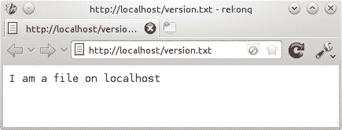
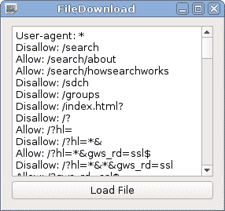
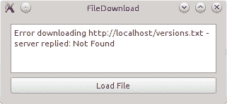
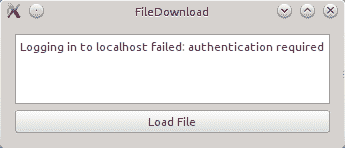
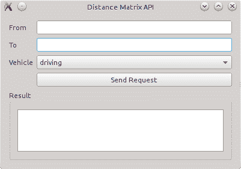
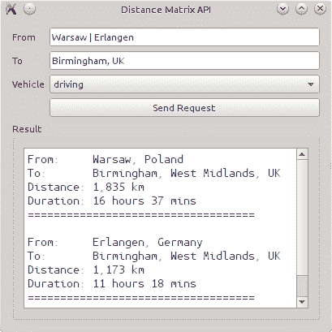
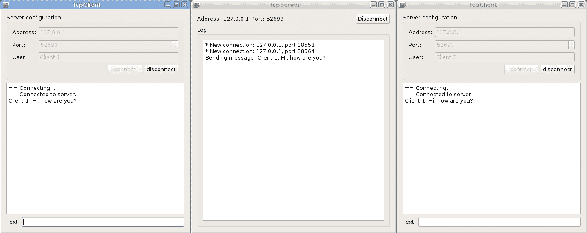

# 网络

在本章中，您将学习如何与互联网服务器以及一般套接字进行通信。首先，我们将查看 `QNetworkAccessManager`，它使得发送网络请求和接收回复变得非常简单。基于这些基本知识，我们将使用 Google 的距离 API 来获取两个位置之间的距离以及从一个位置到另一个位置需要多长时间的信息。这种技术和相应的知识也可以用来通过它们的相应 API 将 Facebook 或 Twitter 包含到您的应用程序中。然后，我们将查看 Qt 的 Bearer API，它提供有关设备连接状态的信息。在最后一节中，您将学习如何使用套接字创建自己的服务器和客户端，使用 TCP 或 UDP 作为网络协议。

本章涵盖的主要主题如下：

+   使用 `QNetworkAccessManager` 下载文件

+   使用 Google 的距离矩阵 API

+   实现 TCP 聊天服务器和客户端

+   使用 UDP 套接字

# QNetworkAccessManager

Qt 中所有与网络相关的功能都在 Qt 网络模块中实现。访问互联网上的文件最简单的方法是使用 `QNetworkAccessManager` 类，该类处理您游戏与互联网之间的完整通信。

# 设置本地 HTTP 服务器

在我们的下一个示例中，我们将通过 HTTP 下载文件。如果您没有本地 HTTP 服务器，您可以使用任何公开可用的 HTTP 或 HTTPS 资源来测试您的代码。然而，当您开发和测试一个网络启用应用程序时，如果可能的话，建议您使用私有、本地网络。这样，您可以调试连接的两端，并且错误不会暴露敏感数据。

如果您不熟悉在您的机器上本地设置 Web 服务器，幸运的是，有许多免费的全能安装程序可供使用。这些程序将自动配置 Apache2、MySQL（或 MariaDB）、PHP 以及许多其他服务器。例如，在 Windows 上，您可以使用 XAMPP ([`www.apachefriends.org`](https://www.apachefriends.org)) 或 Uniform Server ([`www.uniformserver.com`](http://www.uniformserver.com))；在苹果电脑上，有 MAMP ([`www.mamp.info`](https://www.mamp.info))；在 Linux 上，您可以打开您首选的包管理器，搜索名为 `Apache2` 或类似名称的包，并安装它。或者，查看您发行版的文档。

在您在机器上安装 Apache 之前，考虑使用虚拟机，例如 VirtualBox ([`www.virtualbox.org`](http://www.virtualbox.org)) 来完成这项任务。这样，您可以保持机器的整洁，并且可以轻松尝试为您的测试服务器设置不同的配置。使用多个虚拟机，您甚至可以测试您游戏的不同实例之间的交互。如果您使用 Unix 系统，Docker ([`www.docker.com`](http://www.docker.com)) 可能值得一看。

# 准备测试的 URL

如果你已经设置了一个本地 HTTP 服务器，请在已安装服务器的根目录下创建一个名为`version.txt`的文件。此文件应包含一小段文本，例如“我是一个本地的文件”或类似的内容。正如你可能已经猜到的，现实生活中的场景可能是检查服务器上是否有你游戏或应用的更新版本。为了测试服务器和文件是否正确设置，启动一个网页浏览器并打开`http://localhost/version.txt`。你应该会看到文件的内容：

.

如果这失败了，可能是因为你的服务器不允许你显示文本文件。不要在服务器的配置中迷失方向，只需将文件重命名为`version.html`。这应该会解决问题！

如果你没有 HTTP 服务器，你可以使用你最喜欢的网站的 URL，但要做好准备接收 HTML 代码而不是纯文本，因为大多数网站都使用 HTML。你也可以使用`https://www.google.com/robots.txt` URL，因为它会以纯文本响应。

# 行动时间 – 下载文件

创建一个 Qt Widgets 项目，并添加一个名为`FileDownload`的小部件类。添加一个按钮来启动下载，并添加一个纯文本编辑来显示结果。如往常一样，如果你需要任何帮助，可以查看书中提供的代码文件。

接下来，通过在项目文件中添加`QT += network`来启用 Qt 网络模块。然后，在构造函数中创建`QNetworkAccessManager`的一个实例并将其放入私有字段中：

```cpp
m_network_manager = new QNetworkAccessManager(this); 
```

由于`QNetworkAccessManager`继承自`QObject`，它需要一个指向`QObject`的指针，这被用作父对象。因此，你不需要在之后删除管理器。

第二，我们将管理器的`finished()`信号连接到我们选择的槽；例如，在我们的类中，我们有一个名为`downloadFinished()`的槽：

```cpp
connect(m_network_manager, &QNetworkAccessManager::finished,
        this, &FileDownload::downloadFinished);
```

我们必须这样做，因为`QNetworkAccessManager`的 API 是**异步**的。这意味着网络请求、读取或写入操作都不会阻塞当前线程。相反，当数据可用或发生其他网络事件时，Qt 会发送一个相应的信号，以便你可以处理数据。

第三，当按钮被点击时，我们实际上从本地主机请求`version.txt`文件：

```cpp
QUrl url("http://localhost/version.txt");
m_network_manager->get(QNetworkRequest(url));
```

使用`get()`，我们向指定的 URL 发送请求以获取文件内容。该函数期望一个`QNetworkRequest`对象，它定义了通过网络发送请求所需的所有信息。此类请求的主要信息自然是文件 URL。这就是为什么`QNetworkRequest`在构造函数中将`QUrl`作为参数。你也可以使用`setUrl()`将 URL 设置到请求中。如果你希望定义一个请求头（例如，自定义用户代理），可以使用`setHeader()`：

```cpp
QNetworkRequest request;
request.setUrl(QUrl("http://localhost/version.txt"));
request.setHeader(QNetworkRequest::UserAgentHeader, "MyGame");
m_network_manager->get(request); 
```

`setHeader()`函数接受两个参数：第一个是`QNetworkRequest::KnownHeaders`枚举的值，它包含最常见的（自解释）头部，例如`LastModifiedHeader`或`ContentTypeHeader`，第二个是实际值。你也可以使用`setRawHeader()`来编写头部：

```cpp
request.setRawHeader("User-Agent", "MyGame"); 
```

当你使用`setRawHeader()`时，你必须自己编写头部字段名称。除此之外，它表现得像`setHeader()`。所有 HTTP 协议版本 1.1 中可用的头部列表可以在 RFC 2616 的第十四部分中找到（[`www.w3.org/Protocols/rfc2616/rfc2616-sec14.html#sec14`](https://www.w3.org/Protocols/rfc2616/rfc2616-sec14.html#sec14)）。

回到我们的例子，使用`get()`函数，我们从本地主机请求了`version.txt`文件。从现在开始，我们只需要等待服务器回复。一旦服务器的回复完成，之前连接语句中定义的`downloadFinished()`槽函数将被调用。一个指向`QNetworkReply`对象的指针将被作为参数传递给槽函数，我们可以使用以下方式读取回复的数据并在`m_edit`中显示，`m_edit`是`QPlainTextEdit`的一个实例：

```cpp
void FileDownload::downloadFinished(QNetworkReply *reply) {
    const QByteArray content = reply->readAll();
    m_edit->setPlainText(QString::fromUtf8(content));
    reply->deleteLater();
} 
```

由于`QNetworkReply`继承了`QIODevice`，因此还有其他方法可以读取回复的内容。例如，你可以使用`QDataStream`或`QTextStream`分别读取和解释二进制或文本数据。在这里，作为第四个命令，使用`QIODevice::readAll()`在`QByteArray`对象中获取请求文件的完整内容。这与上一章中展示的从文件中读取非常相似。转移给相应`QNetworkReply`的指针的责任在我们这里，因此我们需要在槽函数的末尾删除它。然而，要小心，不要直接调用`delete`。始终使用`deleteLater()`，如文档中建议的那样！

在上一章中，我们警告你不要使用`readAll()`来读取大文件，因为它们无法适应单个`QByteArray`。对于`QNetworkReply`也是如此。如果服务器决定发送一个大的响应（例如，如果你尝试下载一个大文件），响应的第一部分将被保存到`QNetworkReply`对象内部的缓冲区中，然后下载将减慢速度，直到你从缓冲区中读取一些数据。然而，如果你只使用`finished()`信号，你无法做到这一点。相反，你需要使用`QNetworkReply::readyRead()`信号并按顺序读取数据的每一部分，以便释放缓冲区并允许接收更多数据。我们将在本章后面展示如何做到这一点。

完整的源代码可以在本书附带的书签下载示例中找到。如果你启动这个小型的演示应用程序并点击加载文件按钮，你应该能看到加载文件的正文内容：



# 尝试一下英雄——扩展基本文件下载器

当然，为了下载另一个文件而不得不修改源代码，这远非理想的方法，因此尝试通过添加一行编辑框来扩展对话框，以便您可以指定要下载的 URL。此外，您还可以提供一个文件对话框来选择下载文件将保存的位置。实现这一点的最简单方法是使用 `QFileDialog::getSaveFileName()` 静态函数。

# 每个应用程序一个网络管理器

对于整个应用程序来说，只需要一个 `QNetworkAccessManager` 的单例实例。例如，您可以在主窗口类中创建一个 `QNetworkAccessManager` 实例，并将其指针传递到所有需要它的其他地方。为了方便使用，您还可以创建一个 **单例** 并通过它来访问管理器。

单例模式确保一个类只被实例化一次。该模式对于访问应用程序范围内的配置或——在我们的案例中——`QNetworkAccessManager` 的实例很有用。

基于模板的简单单例创建方法如下（作为一个头文件）：

```cpp
template <class T>
class Singleton
{
public:
    static T& instance()
    {
        static T static_instance;
        return static_instance;
    }
private:
    Singleton();
    ~Singleton();
    Singleton(const Singleton &);
    Singleton& operator=(const Singleton &);
};
```

在源代码中，您将包含该头文件，并使用以下方式获取名为 `MyClass` 的类的单例：

```cpp
MyClass &singleton = Singleton<MyClass>::instance();   
```

这种单例实现不是 **线程安全** 的，这意味着尝试从多个线程同时访问实例将导致未定义的行为。线程安全单例模式的实现示例可以在 [`wiki.qt.io/Qt_thread-safe_singleton`](https://wiki.qt.io/Qt_thread-safe_singleton) 找到。

如果您使用 Qt Quick——它将在第十一章中解释，*Qt Quick 简介*——与 `QQmlApplicationEngine` 一起，您可以直接使用引擎的 `QNetworkAccessManager` 实例：

```cpp
QQmlApplicationEngine engine;
QNetworkAccessManager *network_manager = engine.networkAccessManager();   
```

# 行动时间 - 显示适当的错误消息

如果您看不到文件的内容，说明出了问题。就像现实生活中一样，这种情况经常发生。因此，我们需要确保在这种情况下有一个良好的错误处理机制来通知用户发生了什么。幸运的是，`QNetworkReply` 提供了几个这样做的方法。

在名为 `downloadFinished()` 的槽函数中，我们首先想要检查是否发生了错误：

```cpp
if (reply->error() != QNetworkReply::NoError) {
    // error occurred
} 
```

`QNetworkReply::error()` 函数返回处理请求时发生的错误。错误被编码为 `QNetworkReply::NetworkError` 类型的值。最常见的问题可能是这些：

| **错误代码** | **含义** |
| --- | --- |
| `QNetworkReply::ConnectionRefusedError` | 程序根本无法连接到服务器（例如，如果没有服务器运行） |
| `QNetworkReply::ContentNotFoundError` | 服务器响应了 HTTP 错误代码 404，表示无法找到请求的 URL 对应的页面 |
| `QNetworkReply::ContentAccessDenied` | 服务器响应了 HTTP 错误代码 403，表示您没有权限访问请求的文件 |

有超过 30 种可能的错误类型，你可以在`QNetworkReply::NetworkError`枚举的文档中查找它们。然而，通常你不需要确切知道出了什么问题。你只需要知道是否一切顺利——在这种情况下，`QNetworkReply::NoError`将是返回值——或者是否出了问题。为了向用户提供有意义的错误描述，你可以使用`QIODevice::errorString()`。文本已经设置了相应的错误消息，我们只需要显示它：

```cpp
if (reply->error()) {
    const QString error = reply->errorString();
    m_edit->setPlainText(error);
    return;
} 
```

在我们的示例中，假设我们在 URL 中犯了一个错误，错误地写成了`versions.txt`，应用程序将看起来像这样：



如果请求是 HTTP 请求并且状态码是有兴趣的，可以通过`QNetworkReply::attribute()`检索：

```cpp
int statusCode =
     reply->attribute(QNetworkRequest::HttpStatusCodeAttribute).toInt();
```

由于它返回`QVariant`，你需要使用`QVariant::toInt()`来将代码作为整数获取。除了 HTTP 状态码之外，你还可以通过`attribute()`查询很多其他信息。查看文档中`QNetworkRequest::Attribute`枚举的描述。在那里，你也会找到`QNetworkRequest::HttpReasonPhraseAttribute`，它包含 HTTP 状态码的可读原因短语，例如，如果发生 HTTP 错误 404，则为“未找到”。此属性的值用于设置`QIODevice::errorString()`的错误文本。因此，你可以使用`errorString()`提供的默认错误描述，或者通过解释回复的属性来创建自己的描述。

如果下载失败并且你想恢复它，或者如果你只想下载文件的一部分，你可以使用`Range`头。但是，服务器必须支持这一点。

在以下示例中，只有从`300`到`500`的字节将被下载：

```cpp
QNetworkRequest request(url);
request.setRawHeader("Range", "bytes=300-500");
QNetworkReply *reply = m_network_manager->get(request);   
```

如果你想要模拟在网站上发送表单，你通常需要发送 POST 请求而不是 GET 请求。这是通过使用`QNetworkAccessManager::post()`函数而不是我们使用的`get()`函数来完成的。你还需要指定有效载荷，例如，使用`QHttpMultiPart`类。

# 通过 FTP 下载文件

通过 FTP 下载文件与通过 HTTP 下载文件一样简单。如果是一个不需要认证的匿名 FTP 服务器，只需像我们之前做的那样使用 URL。假设在本地主机的 FTP 服务器上再次有一个名为`version.txt`的文件，输入以下内容：

```cpp
m_network_manager->get(QNetworkRequest(
    QUrl("ftp://localhost/version.txt"))); 
```

这就是全部；其他所有内容保持不变。如果 FTP 服务器需要认证，你会收到一个错误；考虑以下示例：



同样，设置用户名和密码以访问 FTP 服务器也很简单——要么将其写入 URL，要么使用`QUrl`的`setUserName()`和`setPassword()`函数。如果服务器不使用标准端口，你可以使用`QUrl::setPort()`显式设置端口。

要将文件上传到 FTP 服务器，使用`QNetworkAccessManager::put()`，它将`QNetworkRequest`作为其第一个参数，调用一个 URL 来定义服务器上新文件的名字，并将实际数据作为其第二个参数，该数据应该被上传。对于小文件上传，你可以传递内容作为`QByteArray`。对于更大的内容，最好使用指向`QIODevice`的指针。确保设备在上传完成前保持打开和可用状态。

# 并行下载文件

关于`QNetworkAccessManager`的一个非常重要的注意事项是它以异步方式工作。这意味着你可以发送网络请求而不阻塞主事件循环，这正是保持 GUI 响应的原因。如果你发送多个请求，它们将被放入管理器的队列中。根据使用的协议，它们可能会并行处理。如果你发送 HTTP 请求，通常一次最多处理六个请求。如果有更多请求排队，它们将自动稍后处理。这不会阻塞应用程序，因为`QNetworkAccessManager`内部使用线程。

实际上没有必要在线程中封装`QNetworkAccessManager`；然而，遗憾的是，这种不必要的做法在互联网上被频繁推荐。实际上，除非你确切知道你在做什么，否则不要将`QNetworkAccessManager`移动到线程中。

如果你发送多个请求，连接到管理器`finished()`信号的槽位将以任意顺序被调用，这取决于请求从服务器获得回复的速度。这就是为什么你需要知道回复属于哪个请求。这也是为什么每个`QNetworkReply`都携带其相关的`QNetworkRequest`的原因。它可以通过`QNetworkReply::request()`访问。

即使确定回复及其目的可能适用于小型应用程序的单个槽位，如果你发送大量具有不同目的的请求，它将很快变得庞大且混乱。将请求连接到针对特定任务专门化的多个槽位会更好。幸运的是，这可以非常容易地实现。

任何向`QNetworkAccessManager`添加请求的方法（如`get()`）都返回一个指向`QNetworkReply`的指针。使用这个指针，你可以将回复的信号连接到你的特定槽位。例如，如果你有多个 URL，并且你想将这些网站的所有链接图片保存到你的硬盘上，你可以通过`QNetworkAccessManager::get()`请求所有网页，并将它们的回复连接到一个专门用于解析接收到的 HTML 的槽位。如果找到图片链接，这个槽位将再次使用`get()`请求它们。然而，这次，这些请求的回复将连接到第二个槽位，该槽位是为将图片保存到磁盘而设计的。因此，你可以分离这两个任务：解析 HTML 和将数据保存到本地驱动器。

下一个将讨论`QNetworkReply`最重要的信号。

# 完成后的信号

`finished()`信号相当于我们之前使用的`QNetworkAccessManager::finished()`信号。一旦回复返回——无论成功与否——就会触发。在此信号发出后，回复的数据及其元数据将不再被更改。通过此信号，你现在可以将一个回复连接到特定的槽。这样，你可以实现上一节中概述的保存图像的场景。

然而，一个问题仍然存在：如果你发布同时请求，你不知道

哪一个已经完成，因此调用了连接的槽。与`QNetworkAccessManager::finished()`不同，`QNetworkReply::finished()`不传递`QNetworkReply`的指针；在这种情况下，这实际上是指向自身的指针。我们已经在第三章，*Qt GUI 编程*中遇到了类似的问题，所以让我们记住我们如何处理它。

解决这个问题的快速方法是使用`sender()`。它返回调用槽的`QObject`实例的指针。由于我们知道它是`QNetworkReply`，我们可以编写以下代码：

```cpp
QNetworkReply *reply = qobject_cast<QNetworkReply*>(sender());
if (!reply) {
    return;
}
```

在此代码中，我们需要将`sender()`返回的`QObject`指针转换为`QNetworkReply`类型的指针。

当你正在将继承自`QObject`的类进行类型转换时，使用`qobject_cast`。与`dynamic_cast`不同，它不使用 RTTI，并且可以在动态库边界之间工作。

虽然我们可以相当有信心类型转换会成功，但不要忘记检查指针是否有效。如果是空指针，则退出槽。

# 行动时间 - 使用 QSignalMapper 编写符合 OOP 的代码

一种更优雅的方法，不依赖于`sender()`，是使用`QSignalMapper`接收槽的参数中的回复对象。首先，你需要将`QSignalMapper *m_imageFinishedMapper`私有字段添加到你的类中。当你调用`QNetworkAccessManager::get()`请求每个图像时，设置映射器如下：

```cpp
for(const QString& url: urls) {
    QNetworkRequest request(url);
    QNetworkReply *reply = m_network_manager->get(request);
    connect(reply, SIGNAL(finished()),
            m_imageFinishedMapper, SLOT(map()));
    m_imageFinishedMapper->setMapping(reply, reply);
}
```

在一个显眼的位置，很可能是类的构造函数中，将映射器的`map()`信号连接到一个自定义槽。考虑以下示例：

```cpp
connect(m_imageFinishedMapper, SIGNAL(mapped(QObject*)),
        this, SLOT(imageFinished(QObject*)));
```

现在，你的槽接收回复对象作为参数：

```cpp
void Object::imageFinished(QObject *replyObject)
{
    QNetworkReply *reply = qobject_cast<QNetworkReply *>(replyObject);
    //...
}
```

# 发生了什么？

首先，我们发布了请求并获取了`QNetworkReply`对象的指针。

然后，我们将回复完成的信号连接到了映射器的槽`map()`。接下来，我们调用映射器的`setMapping()`方法来指示发送者本身应该

作为槽的参数发送。效果与直接使用`QNetworkAccessManager::finished(QNetworkReply *reply)`信号非常相似，但这种方式，我们可以使用多个针对不同目的的槽（每个槽对应一个单独的映射器），所有这些槽都由一个`QNetworkAccessManager`实例提供服务。

`QSignalMapper`还允许您使用`int`或`QString`作为标识符，而不是像前面代码中使用`QObject *`。因此，您可以重写示例并使用 URL 来识别相应的请求。

# 错误信号

您可以在连接到`finished()`信号的槽中处理错误，也可以使用回复的`error()`信号，它将`QNetworkReply::NetworkError`类型的错误传递到槽中。在发出`error()`信号后，`finished()`信号很可能会很快发出。

# readyRead 信号

到目前为止，我们一直使用连接到`finished()`信号的槽来获取回复的内容。如果您处理的是小文件，这种方法工作得很好。然而，当处理大文件时，这种方法不适用，因为它们会不必要地绑定太多资源。对于大文件，最好在数据可用时立即读取并保存传输的数据。每当有新数据可供读取时，我们都会通过`QIODevice::readyRead()`得到通知。因此，对于大文件，您应该使用以下代码：

```cpp
QNetworkReply *reply = m_network_manager->get(request);
connect(reply, &QIODevice::readyRead,
        this, &SomeClass::readContent);
m_file.open(QIODevice::WriteOnly); 
```

这将帮助您连接回复的`readyRead()`信号到槽，设置`QFile`并打开它。在连接的槽中，输入以下代码片段：

```cpp
QNetworkReply *reply = /* ... */;
const QByteArray byteArray = reply->readAll();
m_file.write(byteArray);
m_file.flush(); 
```

现在，您可以获取到目前为止已传输的内容，并将其保存到（已打开的）文件中。这样，所需资源最小化。别忘了在发出`finished()`信号后关闭文件。

在这种情况下，如果您事先知道要下载的文件大小，将会很有帮助。有了这些信息，我们可以提前检查磁盘上是否有足够的空间。我们可以使用`QNetworkAccessManager::head()`来完成这个目的。它就像`get()`函数一样，但它不会请求文件的内容。只传输头部信息，如果幸运的话，服务器会发送`Content-Length`头部信息，其中包含文件大小（以字节为单位）。为了获取这些信息，我们输入以下内容：

```cpp
int length = reply->header(QNetworkRequest::ContentLengthHeader).toInt(); 
```

# 操作时间 - 显示下载进度

尤其是在下载大文件时，用户通常想知道已经下载了多少数据，以及下载完成大约需要多长时间。

为了实现这一点，我们可以使用回复的`downloadProgress()`信号。作为第一个参数，它传递已接收的字节数信息，作为第二个参数，传递总字节数。这使我们能够使用`QProgressBar`来指示下载进度。由于传递的参数是`qint64`类型，我们不能直接使用它们与`QProgressBar`一起，因为它只接受`int`。因此，在连接的槽中，我们可以执行以下操作：

```cpp
void SomeClass::downloadProgress(qint64 bytesReceived, qint64 bytesTotal) {
    qreal progress = (bytesTotal < 1) ? 1.0
                   : static_cast<qreal>(bytesReceived) / bytesTotal;
    progressBar->setValue(qRound(progress * progressBar->maximum()));
} 
```

# 刚才发生了什么？

首先，我们计算下载进度的百分比。计算出的`progress`值将在 0（0%）到 1（100%）之间。然后，我们为进度条设置新的值，其中`progressBar`是指向此进度条的指针。然而，`progressBar->maximum()`将有什么值，我们在哪里设置进度条的取值范围？令人高兴的是，你不必为每次新的下载设置它。它只需要设置一次，例如，在包含进度条的类的构造函数中。作为取值范围，我们建议使用以下值：

```cpp
progressBar->setRange(0, 2048); 
```

原因在于，如果你以 0 到 100 的范围为例，并且进度条宽度为 500 像素，每次值的变化都会使进度条前进 5 像素。这看起来会很丑。为了得到平滑的进度，每次进度条只增加 1 像素，范围应该是 0 到 99.999.999，这肯定可以工作，但效率会非常高。这是因为进度条当前值的变化会很大，而没有任何图形表示。因此，最佳的范围值应该是 0 到实际进度条宽度的像素数。不幸的是，进度条的宽度可能会根据实际小部件的宽度而变化，并且每次值变化时频繁查询实际大小也不是一个好的解决方案。那么，为什么是 2048 呢？它只是一个比我们可能得到的任何屏幕分辨率都要大的漂亮的整数。这确保了进度条即使在完全展开的情况下也能平滑运行。如果你针对的是较小的设备，请选择一个更小、更合适的数字。

为了能够计算下载完成剩余时间，你必须开始一个计时器。在这种情况下，使用`QElapsedTimer`。在通过`QNetworkAccessManager::get()`发布请求后，通过调用`QElapsedTimer::start()`来启动计时器。假设计时器被命名为`m_timer`，计算方法如下：

```cpp
qreal remaining = m_timer.elapsed() *
                  (1.0 - progress) / progress;
int remainingSeconds = qRound(remaining / 1000);
```

`QElapsedTimer::elapsed()`返回从计时器开始时计数的毫秒数。假设下载进度是线性的，剩余时间与经过时间的比率等于`(1.0 - progress) / progress`。例如，如果`progress`是 0.25（25%），预期的剩余时间将是经过时间的三倍：`(1.0 - 0.25) / 0.25) = 3`。如果你将结果除以 1,000 并四舍五入到最接近的整数，你将得到剩余时间（以秒为单位）。

`QElapsedTimer`不要与`QTimer`混淆。`QTimer`用于在经过一定时间后调用槽。`QElapsedTimer`仅仅是一个方便的类，能够记住开始时间并通过从当前时间减去开始时间来计算经过的时间。

# 使用代理

如果你想使用代理，首先你需要设置`QNetworkProxy`。你可以使用`setType()`方法来定义代理的类型。作为参数，你很可能会传递`QNetworkProxy::Socks5Proxy`或`QNetworkProxy::HttpProxy`。然后，使用`setHostName()`设置主机名，使用`setUserName()`设置用户名，使用`setPassword()`设置密码。当然，后两个属性只有在代理需要认证时才需要。一旦设置了代理，你可以通过`QNetworkAccessManager::setProxy()`将其设置到访问管理器中。现在，所有新的请求都将使用这个代理。

# 连接到 Google、Facebook、Twitter 等。

由于我们讨论了`QNetworkAccessManager`，你现在有了将 Facebook、Twitter 或类似网站集成到你的应用程序所需的知识。它们都使用 HTTPS 协议和简单的请求来从它们那里检索数据。对于 Facebook，你必须使用所谓的 Graph API。它描述了哪些接口可用以及它们提供了哪些选项。如果你想搜索名为**Helena**的用户，你必须请求`https://graph.facebook.com/search?q=helena&type=user`。当然，你可以使用`QNetworkManager`来做这件事。你可以在[`developers.facebook.com/docs/graph-api`](https://developers.facebook.com/docs/graph-api)找到有关 Facebook 可能请求的更多信息。

如果你希望在游戏中显示推文，你必须使用 Twitter 的 REST 或搜索 API。假设你知道你想显示的推文的 ID，你可以通过`https://api.twitter.com/1.1/statuses/show.json?id=12345`来获取它，其中`12345`是推文的实际 ID。如果你想找到提到`#Helena`的推文，你可以写`https://api.twitter.com/1.1/search/tweets.json?q=%23Helena`。你可以在[`developer.twitter.com/en/docs`](https://developer.twitter.com/en/docs)找到有关参数和其他 Twitter API 可能性的更多信息。

由于 Facebook 和 Twitter 都需要认证才能使用它们的 API，我们将看看 Google。让我们使用 Google 的距离矩阵 API 来获取从一个城市到另一个城市所需时间的信息。我们将使用的 API 的技术文档可以在[`developers.google.com/maps/documentation/distancematrix`](https://developers.google.com/maps/documentation/distancematrix)找到。

# 行动时间——使用 Google 的距离矩阵 API

这个示例的 GUI 保持简单——源代码附在书中。它由两个行编辑器（`ui->from`和`ui->to`）组成，允许你输入旅程的起点和终点。它还提供了一个组合框（`ui->vehicle`），允许你选择一种交通方式——无论是开车、骑自行车还是步行——一个按钮（`ui->search`）来启动请求，以及一个文本编辑器（或`ui->result`）来显示结果。

它看起来是这样的：



`MainWindow` 是 `QMainWindow` 的一个子类，是应用程序的主要类，包含两个私有成员：`m_network_manager`，它是一个指向 `QNetworkAccessManager` 的指针，以及 `m_reply`，它是一个指向 `QNetworkReply` 的指针。

# 行动时间 - 构建查询

每当按钮被按下时，就会调用 `sendRequest()` 槽：

```cpp
void MainWindow::sendRequest()
{
    if (m_reply != nullptr && m_reply->isRunning()) {
        m_reply->abort();
    }
    ui->result->clear();
    //...
}
```

在这个槽中，我们首先检查是否有旧请求，该请求存储在 `m_reply` 中，并且它是否仍在运行。如果是 `true`，我们将终止旧请求，因为我们即将安排一个新的请求。然后，我们通过在文本编辑上调用 `QPlainTextEdit::clear()` 来清除上一次请求的结果。

接下来，我们将构建请求的 URL。我们可以通过手动组合字符串来完成此操作，将查询参数添加到基本 URL 中，如下所示：

```cpp
// don't do this!
QString url = baseUrl + "?origin=" + ui->from->text() + "&..."; 
```

除了当我们包含多个参数时这很快变得难以阅读的问题之外，它还相当容易出错。行编辑的值必须编码以符合有效 URL 的标准。因此，对于每个用户值，我们都必须显式调用 `QUrl::toPercentEncoding()`。一个更好的方法，它更容易阅读且错误更少，是使用 `QUrlQuery`。它避免了忘记编码数据时可能产生的问题。因此，我们这样做：

```cpp
QUrlQuery query;
query.addQueryItem(QStringLiteral("sensor"),   QStringLiteral("false"));
query.addQueryItem(QStringLiteral("language"), QStringLiteral("en"));
query.addQueryItem(QStringLiteral("units"),    QStringLiteral("metric"));
query.addQueryItem(QStringLiteral("mode"),     ui->vehicle->currentText());
query.addQueryItem(QStringLiteral("origins"),  ui->from->text());
query.addQueryItem(QStringLiteral("destinations"), ui->to->text());
```

使用方法相当清晰：我们创建一个实例，然后使用 `addQueryItem()` 添加查询参数。第一个参数被视为键，第二个参数被视为值，结果是一个如 "key=value" 的字符串。当我们将 `QUrlQuery` 与 `QUrl` 一起使用时，值将自动编码。使用 `QUrlQuery` 的其他好处是，我们可以使用 `hasQueryItem()` 检查是否已经设置了键，将键作为参数传递，或者通过调用 `removeQueryItem()` 删除之前设置的键。

让我们回顾一下我们设置了哪些参数。`sensor` 键设置为 `false`，因为我们没有使用 GPS 设备来确定我们的位置。`language` 键设置为 `English`，对于单位，我们更倾向于公制而不是英制。然后，我们设置了与搜索相关的参数。`origins` 键包含我们想要开始的地点。其值是 `ui->from` 行编辑的文本。如果你想要查询多个起始位置，你只需使用 `|` 将它们组合起来。与起点等效，我们为目的地设置了值。最后，我们将组合框的值传递给模式，这定义了我们是想开车、骑自行车还是步行。接下来，我们执行请求：

```cpp
QUrl url(QStringLiteral(
     "https://maps.googleapis.com/maps/api/distancematrix/json"));
url.setQuery(query);
m_reply = m_network_manager->get(QNetworkRequest(url));
```

我们创建一个包含查询应发送到的地址的 `QUrl`。通过在末尾包含 `json`，我们定义服务器应使用 JSON 格式传输其响应。Google 还为我们提供了将结果作为 XML 获取的选项。要实现这一点，只需将 `json` 替换为 `xml`。然而，由于 Facebook 和 Twitter 的 API 返回 JSON，我们将使用此格式。

然后，我们通过调用 `QUrl::setQuery()` 将之前构建的 `query` 设置到 URL 中。这会自动编码值，所以我们不需要担心这一点。最后，我们通过调用 `get()` 函数发布请求，并将返回的 `QNetworkReply` 存储在 `m_reply` 中。

# 行动时间 - 解析服务器的响应

在构造函数中，我们将管理器的 `finished()` 信号连接到了 `MainWindow` 类的 `finished()` 插槽。因此，它将在请求发布后被调用：

```cpp
void MainWindow::finished(QNetworkReply *reply)
{
    if (m_reply != reply) {
        reply->deleteLater();
        return;
    }
    //...
}
```

首先，我们检查传入的响应是否是通过 `m_network_manager` 请求的。如果不是这种情况，我们删除 `reply` 并退出函数。这可能发生在 `sendRequest()` 插槽取消响应的情况下。由于我们现在确定这是我们请求的，我们将 `m_reply` 设置为 `nullptr`，因为我们已经处理了它，不再需要这个信息：

```cpp
m_reply = nullptr;
if (reply->error() != QNetworkReply::NoError) {
    ui->result->setPlainText(reply->errorString());
    reply->deleteLater();
    return;
}
```

接下来，我们检查是否发生了错误，如果发生了，我们将响应的错误字符串放入文本编辑中，删除响应，并退出函数。之后，我们最终可以开始解码服务器的响应：

```cpp
const QByteArray content = reply->readAll();
const QJsonDocument doc = QJsonDocument::fromJson(content);
if (!doc.isObject()) {
    ui->result->setPlainText(tr("Error while reading the JSON file."));
    reply->deleteLater();
    return;
}
```

使用 `readAll()`，我们可以获取服务器的响应内容。由于传输的数据量不大，我们不需要使用 `readyRead()` 进行部分读取。然后，我们使用 `QJsonDocument::fromJson()` 静态函数将内容转换为 `QJsonDocument`，该函数接受 `QByteArray` 作为参数并解析其数据。如果文档不是一个对象，那么服务器的响应是不有效的，因为 API 调用应该响应一个单一的对象。在这种情况下，我们在文本编辑中显示错误消息，删除响应，并退出函数。让我们看看代码的下一部分：

```cpp
const QJsonObject obj = doc.object();
const QJsonArray origins = obj.value("origin_addresses").toArray();
const QJsonArray destinations = obj.value("destination_addresses").toArray();
```

由于我们现在已经确保存在一个对象，我们将其存储在 `obj` 中。此外，由于 API，我们还知道该对象包含 `origin_addresses` 和 `destination_addresses` 键。这两个值都是包含请求的来源和目的地的数组。从这一点开始，如果值存在且有效，我们将跳过任何测试，因为我们信任 API。该对象还包含一个名为 `status` 的键，其值可以用来检查查询是否可能失败，如果是，原因是什么。源代码的最后两行将来源和目的地存储在两个变量中。使用 `obj.value("origin_addresses")`，我们得到一个 `QJsonValue`，它包含由 `origin_addresses` 键指定的值的对，而 `QJsonValue::toArray()` 将此值转换为 `QJsonArray`。对于请求从华沙或埃尔兰根到伯明翰的距离的搜索，返回的 JSON 文件将看起来像这样：

```cpp
{
    "destination_addresses" : [ "Birmingham, West Midlands, UK" ],
    "origin_addresses" : [ "Warsaw, Poland", "Erlangen, Germany" ],
    "rows" : [ ... ],
    "status" : "OK"
} 
```

`rows` 键持有实际结果作为数组。这个数组中的第一个对象属于第一个来源，第二个对象属于第二个来源，依此类推。每个对象都包含一个名为 `elements` 的键，其值也是一个对象数组，这些对象属于相应的目的地：

```cpp
"rows" : [
    {
        "elements" : [{...}, {...}]
    },
    {
        "elements" : [{...}, {...}]
    }
  ], 
```

对于每个源-目的地对，前一个示例中的每个 JSON 对象 (`{...}`) 包含两个键值对，分别对应距离和持续时间。这两个键的值都是数组，包含 `text` 和 `value` 键，其中 `text` 是 `value` 的人类可读短语。Warsaw-Birmingham 搜索的对象如下所示：

```cpp
{
    "distance" : {
        "text" : "1,835 km",
        "value" : 1834751
    },
    "duration" : {
        "text" : "16 hours 37 mins",
        "value" : 59848
    },
    "status" : "OK"
} 
```

如您所见，距离的 `value` 是以米为单位表示的距离——因为我们已经在请求中使用了 `units=metric`——而 `text` 的值是将值转换为带有 "km" 后缀的公里。同样适用于持续时间。在这里，值以秒为单位表示，而 `text` 是将值转换为小时和分钟的转换。

现在我们知道了返回的 JSON 的结构，我们在文本编辑器中显示每个源-目的地对的值。因此，我们使用两个 `QJsonArray` 遍历每个可能的配对。我们需要索引以及值，所以我们使用经典的 `for` 循环而不是基于范围的循环：

```cpp
QString output;
for (int i = 0; i < origins.count(); ++i) {
    const QString origin = origins.at(i).toString();
    const QJsonArray row = obj.value("rows").toArray().at(i).toObject()
            .value("elements").toArray();
    for (int j = 0; j < destinations.count(); ++j) {
```

首先，我们创建一个 `output` 字符串变量来缓存构建的文本。在开始第二个循环之前，我们计算两个变量，这两个变量对于所有目的地都是相同的。`origin` 变量包含当前源的文字表示，而 `row` 变量包含表格的相应行。每次我们尝试从一个 `QJsonArray` 或 `QJsonObject` 中获取项时，返回的值将具有 `QJsonValue` 类型，因此每次我们这样做时，我们需要根据 API 的预期结果将其转换为数组、对象或字符串。当我们计算 `row` 变量时，从回复的根对象开始，我们获取 `rows` 键的值并将其转换为数组 (`obj.value("rows").toArray()`)。然后，我们获取当前行的值 (`.at(i)`)，将其转换为对象，并获取其 `elements` 键 (`.toObject().value("elements")`)。由于此值也是一个数组——行的列，我们将其转换为数组。

两个循环内的作用域将遍历每个组合。想象一下传递的结果就像一个表格，其中源是行，目的地是列：

```cpp
output += tr("From: %1\n").arg(origin);
output += tr("To: %1\n").arg(destinations.at(j).toString());
```

首先，我们在输出中添加 `"From:"` 字符串和当前源地址。对于目的地也执行相同的操作，这导致输出值为以下内容：

```cpp
From: Warsaw, Poland
To: Birmingham, West Midlands, UK
```

接下来，我们将从调用 `data` 的相应 `QJsonObject` 中读取持续时间和距离：

```cpp
const QJsonObject data = row.at(j).toObject();
const QString status = data.value("status").toString();
```

在此代码中，我们从行中获取当前列 (`at(j)`) 并将其转换为对象。这是包含 `(i; j)` 单元中起点-终点对的距离和持续时间的对象。除了 `distance` 和 `duration`，该对象还包含一个名为 `status` 的键。其值表示搜索是否成功（`OK`），起点或目的地是否无法找到（`NOT_FOUND`），或者搜索是否无法在起点和目的地之间找到路线（`ZERO_RESULTS`）。我们将 `status` 的值存储在一个同名的局部变量中。

接下来，我们检查状态并将距离和持续时间追加到输出中：

```cpp
if (status == "OK") {
    output += tr("Distance: %1\n").arg(
        data.value("distance").toObject().value("text").toString());
    output += tr("Duration: %1\n").arg(
        data.value("duration").toObject().value("text").toString());
} else { /*...*/ }
```

对于距离，我们希望显示短语结果。因此，我们首先获取距离键的 JSON 值 (`data.value("distance")`)，将其转换为对象，并请求文本键的值 (`toObject().value("text")`)。最后，我们使用 `toString()` 将 `QJsonValue` 转换为 `QString`。对于持续时间也是如此。最后，我们需要处理 API 可能返回的错误：

```cpp
} else if (status == "NOT_FOUND") {
    output += tr("Origin and/or destination of this "
                 "pairing could not be geocoded.\n");
} else if (status == "ZERO_RESULTS") {
    output += tr("No route could be found.\n");
} else {
    output += tr("Unknown error.\n");
}
output += QStringLiteral("=").repeated(35) + QStringLiteral("\n");
```

在每个单元的输出末尾，我们添加由 `35` 个等号组成的行 (`QStringLiteral("=").repeated(35)`) 以将结果与其他单元分开。最后，在所有循环完成后，我们将文本放入文本编辑器中并删除回复对象：

```cpp
ui->result->setPlainText(output);
reply->deleteLater();
```

实际结果如下所示：



# 尝试一下英雄 - 选择 XML 作为回复的格式

要磨练您的 XML 技能，您可以使用 [`maps.googleapis.com/maps/api/distancematrix/xml`](https://maps.googleapis.com/maps/api/distancematrix/xml) 作为发送请求的 URL。然后，您可以像处理 JSON 一样解析 XML 文件，并同样显示检索到的数据。

# 控制连接状态

在尝试访问网络资源之前，检查您是否已建立到互联网的活跃连接是有用的。Qt 允许您检查计算机、移动设备或平板电脑是否在线。如果操作系统支持，您甚至可以启动新的连接。

相关 API 主要由四个类组成。`QNetworkConfigurationManager` 是基础和起点。它包含系统上可用的所有网络配置。此外，它提供有关网络功能的信息，例如，您是否可以启动和停止接口。它找到的网络配置存储为 `QNetworkConfiguration` 类。

`QNetworkConfiguration` 包含有关接入点的所有信息，但不包含网络接口的信息，因为一个接口可以提供多个接入点。此类还仅提供有关网络配置的信息。您无法通过 `QNetworkConfiguration` 配置接入点或网络接口。网络配置由操作系统负责，因此 `QNetworkConfiguration` 是一个只读类。然而，使用 `QNetworkConfiguration`，您可以确定连接类型是以太网、WLAN 还是 4G 连接。这可能会影响您将下载的数据类型，更重要的是，影响您将下载的数据大小。

使用 `QNetworkSession`，您可以启动或停止由配置定义的系统网络接口。这样，您就可以控制接入点。`QNetworkSession` 还提供了当系统接入点被多个应用程序使用时的会话管理功能。会话确保在最后一个会话关闭后，底层接口才会终止。最后，`QNetworkInterface` 提供了经典信息，例如硬件地址或接口名称。

# QNetworkConfigurationManager

`QNetworkConfigurationManager` 管理系统上所有可用的网络配置。您可以通过调用 `allConfigurations()` 来访问这些配置。当然，您必须首先创建管理器的实例：

```cpp
QNetworkConfigurationManager manager;
QList<QNetworkConfiguration> cfgs = manager.allConfigurations(); 
```

配置以列表的形式返回。`allConfigurations()` 的默认行为是返回所有可能的配置。但是，您也可以获取一个过滤后的列表。如果您将 `QNetworkConfiguration::Active` 作为参数传递，列表中只包含至少有一个活动会话的配置。如果您基于此类配置创建一个新会话，它将是活动的并已连接。通过传递 `QNetworkConfiguration::Discovered` 作为参数，您将获得一个可以立即启动会话的配置列表。请注意，然而，在此阶段，您不能确定底层接口是否可以启动。最后一个重要的参数是 `QNetworkConfiguration::Defined`。使用此参数，`allConfigurations()` 返回一个列表，其中包含系统已知但当前不可用的配置。这可能是一个之前使用的、目前超出范围的 WLAN 热点。

当配置更改时，您将收到通知。如果出现新的配置，则管理器会发出`configurationAdded()`信号。例如，如果移动数据传输变得可用或用户打开其设备的 WLAN 适配器，这可能会发生。如果移除配置，例如，如果关闭 WLAN 适配器，则发出`configurationRemoved()`。最后，当配置更改时，您将通过`configurationChanged()`信号得到通知。所有三个信号都传递一个关于添加、移除或更改的配置的常量引用。通过`configurationRemoved()`信号传递的配置当然无效。它仍然包含已移除配置的名称和标识符。

要确定系统中的任何网络接口是否处于活动状态，请调用`isOnline()`。如果您想收到模式更改的通知，请跟踪`onlineStateChanged()`信号。

由于 WLAN 扫描需要一定的时间，`allConfigurations()`可能不会返回所有可用的配置。为确保配置完全填充，请先调用`updateConfigurations()`。由于收集系统网络配置的所有信息可能需要很长时间，此调用是异步的。等待`updateCompleted()`信号，然后才能调用`allConfigurations()`。

`QNetworkConfigurationManager`还会通知您 Bearer API 的功能。`capabilities()`函数返回一个`QNetworkConfigurationManager::Capabilities`类型的标志，并描述了特定平台的可用可能性。您可能最感兴趣的值如下：

| **值** | **含义** |
| --- | --- |
| `CanStartAndStopInterfaces` | 这意味着您可以启动和停止接入点。 |
| `ApplicationLevelRoaming` | 这表示系统会通知您是否有更合适的接入点可用，并且如果您认为有更好的接入点，您可以主动更改接入点。 |
| `DataStatistics` | 使用此功能，`QNetworkSession`包含有关传输和接收的数据信息。 |

# QNetworkConfiguration

如前所述，`QNetworkConfiguration`包含有关接入点的信息。使用`name()`，您可以得到配置的用户可见名称，而使用`identifier()`，您可以得到一个唯一、系统特定的标识符。如果您为移动设备开发游戏，了解正在使用的连接类型可能对您有利。这可能影响您请求的数据；例如，视频的质量以及因此其大小。使用`bearerType()`，返回配置使用的承载类型。返回的枚举值相当直观：`BearerEthernet`、`BearerWLAN`、`Bearer2G`、`BearerCDMA2000`、`BearerWCDMA`、`BearerHSPA`、`BearerBluetooth`、`BearerWiMAX`等。您可以在`QNetworkConfiguration::BearerType`的文档中查找完整的值列表。

使用 `purpose()`，你可以获取配置的目的，例如，它是否适合访问私有网络（`QNetworkConfiguration::PrivatePurpose`）或访问公共网络（`QNetworkConfiguration::PublicPurpose`）。如果已定义、发现或激活，配置的状态可以通过 `state()` 访问，如前所述。

# QNetworkSession

要启动网络接口或告诉系统保持接口连接直到你需要它，你必须启动一个会话：

```cpp
QNetworkConfigurationManager manager;
QNetworkConfiguration cfg = manager.defaultConfiguration();
QNetworkSession *session = new QNetworkSession(cfg, this);
session->open(); 
```

会话基于配置。当存在多个会话且你不确定使用哪一个时，请使用 `QNetworkConfigurationManager::defaultConfiguration()`。它返回系统的默认配置。基于此，你可以创建 `QNetworkSession` 的实例。第一个参数，配置，是必需的。第二个参数是可选的，但建议使用，因为它设置了一个父对象，我们不需要处理删除。你可能首先想检查配置是否有效（`QNetworkConfiguration::isValid()`）。

调用 `open()` 将启动会话并在需要且支持的情况下连接接口。由于 `open()` 可能需要一些时间，因此该调用是异步的。所以，你可以监听 `opened()` 信号，该信号在会话打开后立即发出，或者监听 `error()` 信号，如果发生错误。错误信息使用 `QNetworkSession::SessionError` 类型表示。或者，你也可以不检查 `opened()` 信号，而是监听 `stateChanged()` 信号。会话的可能状态有 `Invalid`（无效）、`NotAvailable`（不可用）、`Connecting`（连接中）、`Connected`（已连接）、`Closing`（关闭中）、`Disconnected`（已断开）和 `Roaming`（漫游）。

如果你想要以同步方式打开会话，请在调用 `open()` 后立即调用 `waitForOpened()`。这将阻塞事件循环直到会话打开。如果成功，此函数将返回 `true`，否则返回 `false`。为了限制等待时间，你可以定义一个超时。只需将你愿意等待的毫秒数作为参数传递给 `waitForOpened()`。要检查会话是否打开，请使用 `isOpen()`。

要关闭会话，请调用 `close()`。如果接口上没有剩余的会话，它将被关闭。要强制断开接口，请调用 `stop()`。此调用将使基于该接口的所有会话无效。

你可能会收到 `preferredConfigurationChanged()` 信号，这表示首选配置，例如首选接入点已更改。这可能是在一个 WLAN 网络现在在范围内，你不再需要使用 2G 的情况下。新的配置作为第一个参数传递，第二个参数指示更改新的接入点是否会同时更改 IP 地址。除了检查信号外，你还可以通过调用 `QNetworkConfiguration::isRoamingAvailable()` 来查询配置是否支持漫游。如果漫游可用，你必须决定是调用 `ignore()` 拒绝提议，还是调用 `migrate()` 接受它。如果你接受漫游，当会话漫游时，它将发出 `newConfigurationActivated()` 信号。在你检查了新的连接之后，你可以接受新的接入点或拒绝它。后者意味着你将返回到以前的接入点。如果你接受新的接入点，以前的接入点将被终止。

# QNetworkInterface

要获取会话使用的接口，请调用 `QNetworkSession::interface()`。它将返回 `QNetworkInterface` 对象，该对象描述了接口。通过 `hardwareAddress()`，你可以获取接口的低级硬件地址，通常是 MAC 地址。接口的名称可以通过 `name()` 获取，它是一个如 "eth0" 或 "wlan0" 的字符串。`addressEntries()` 返回与接口注册的 IP 地址列表以及它们的子网掩码和广播地址。此外，可以通过 `flags()` 查询接口是否为回环接口或是否支持多播。返回的位掩码是这些值的组合：`IsUp`、`IsRunning`、`CanBroadcast`、`IsLoopBack`、`IsPointToPoint` 和 `CanMulticast`。

# 游戏间的通信

在讨论了 Qt 的高级网络类，如 `QNetworkAccessManager` 和 `QNetworkConfigurationManager` 之后，我们现在将查看较低级别的网络类，并了解 Qt 在实现 TCP 或 UDP 服务器和客户端时如何支持你。当你计划通过包括多人模式来扩展你的游戏时，这变得相关。为此任务，Qt 提供 `QTcpSocket`、`QUdpSocket` 和 `QTcpServer`。

# 行动时间 – 实现一个简单的聊天程序

为了熟悉 `QTcpServer` 和 `QTcpSocket`，让我们开发一个简单的聊天程序。这个例子将教会你 Qt 中网络处理的基本知识，以便你可以使用这项技能在以后连接两个或更多游戏副本。在这个练习结束时，我们希望看到如下内容：



在前面的截图的左侧和右侧，你可以看到一个客户端，而服务器位于中间。我们将首先仔细看看服务器。

# 服务器 – QTcpServer

作为通信协议，我们将使用**传输控制协议**（**TCP**）。您可能从最流行的两个互联网协议 HTTP 和 FTP 中了解到这个网络协议。它们都使用 TCP 进行通信，全球通用的电子邮件流量协议也是如此：SMTP、POP3 和 IMAP。TCP 的主要优势是其可靠性和基于连接的架构。通过 TCP 传输的数据保证是完整、有序且无重复的。此外，该协议是面向流的，这使得我们可以使用`QDataStream`或`QTextStream`。TCP 的一个缺点是它的速度较慢。这是因为丢失的数据必须重新传输，直到接收方完全接收为止。默认情况下，这会导致丢失部分之后传输的所有数据重新传输。因此，只有当速度不是您最优先考虑的因素，而是数据的完整性和正确性时，您才应该选择 TCP 作为协议。如果您发送的是独特且非重复的数据，这也适用。

# 行动时间 - 设置服务器

查看服务器的 GUI 显示，我们可以看到它主要由`QPlainTextEdit`（`ui->log`）组成，用于显示系统消息，还有一个按钮（`ui->disconnectClients`），允许我们断开所有当前连接的客户端。在按钮旁边，显示服务器的地址和端口（`ui->address`和`ui->port`）。在服务器类的构造函数中设置用户界面后，我们初始化内部使用的`QTcpServer`，它存储在`m_server`私有成员变量中：

```cpp
if (!m_server->listen(QHostAddress::LocalHost, 52693)) {
    ui->log->setPlainText(tr("Failure while starting server: %1")
                          .arg(m_server->errorString()));
    return;
}
connect(m_server, &QTcpServer::newConnection,
        this, &TcpServer::newConnection);
```

# 刚才发生了什么？

使用`QTcpServer::listen()`，我们定义了服务器应该监听本地的端口`52693`以接收新的连接。这里使用的值，`QHostAddress::LocalHost`属于`QHostAddress::SpecialAddress`枚举，将解析为`127.0.0.1`。相反，如果您传递`QHostAddress::Any`，服务器将监听所有 IPv4 接口以及 IPv6 接口。如果您只想监听特定的地址，只需将此地址作为`QHostAddress`传递：

```cpp
m_server->listen(QHostAddress("127.0.0.1"), 0); 
```

这将表现得像前面的代码一样，只是服务器现在将监听一个自动选择的端口。如果成功，`listen()`将返回`true`。因此，如果示例中出现问题，它将在文本编辑器上显示错误消息并退出函数。为了组成错误消息，我们使用`QTcpServer::errorString()`，它包含一个可读的错误短语。

要处理你游戏代码中的错误，错误字符串是不合适的。在任何需要知道确切错误的情况下，使用`QTcpServer::serverError()`，它返回`QAbstractSocket::SocketError`的枚举值。基于此，你可以确切地知道出了什么问题，例如`QAbstractSocket::HostNotFoundError`。如果`listen()`调用成功，我们将服务器的`newConnection()`信号连接到类的`newConnection()`槽。每当有新的连接可用时，都会发出此信号。最后，我们显示可以通过`serverAddress()`和`serverPort()`访问的服务器的地址和端口号：

```cpp
ui->address->setText(m_server->serverAddress().toString());
ui->port->setText(QString::number(m_server->serverPort())); 
```

客户端需要这些信息以便能够连接到服务器。

# 行动时间 - 对新的挂起连接做出反应

当客户端尝试连接到服务器时，`newConnection()`槽会被调用：

```cpp
void TcpServer::newConnection()
{
    while (m_server->hasPendingConnections()) {
        QTcpSocket *socket = m_server->nextPendingConnection();
        m_clients << socket;
        ui->disconnectClients->setEnabled(true);
        connect(socket, &QTcpSocket::disconnected,
                this, &TcpServer::removeConnection);
        connect(socket, &QTcpSocket::readyRead,
                this, &TcpServer::readyRead);
        ui->log->appendPlainText(tr("* New connection: %1, port %2\n")
                                 .arg(socket->peerAddress().toString())
                                 .arg(socket->peerPort()));
    }
}
```

# 刚才发生了什么？

由于可能存在多个挂起的连接，我们使用`hasPendingConnections()`来确定是否至少还有一个挂起的连接。然后，在`while`循环的迭代中处理每一个连接。为了获取`QTcpSocket`类型的挂起连接，我们调用`nextPendingConnection()`并将此连接添加到一个名为`m_clients`的私有向量中，该向量包含所有活动连接。在下一行，由于现在至少有一个连接，我们启用了允许关闭所有连接的按钮。连接到按钮`click()`信号的槽将调用每个单独连接的`QTcpSocket::close()`。当一个连接关闭时，其套接字会发出`disconnected()`信号。我们将此信号连接到我们的`removeConnection()`槽。在最后一个连接时，我们响应套接字的`readyRead()`信号，这表示有新数据可用。在这种情况下，我们的`readyRead()`槽会被调用。最后，我们打印一条系统消息，表明已建立新的连接。连接客户端和对方的地址和端口号可以通过套接字的`peerAddress()`和`peerPort()`函数获取。

如果无法接受新的连接，将发出`acceptError()`信号而不是`newConnection()`。它将`QAbstractSocket::SocketError`类型失败原因作为参数传递。如果你想要暂时拒绝新的连接，请在`QTcpServer`上调用`pauseAccepting()`。要恢复接受新的连接，请调用`resumeAccepting()`。

# 行动时间 - 前向转发新消息

当连接的客户端发送新的聊天消息时，由于它继承了`QIODevice`，底层的套接字会发出`readyRead()`，因此我们的`readyRead()`槽会被调用。

在我们查看这个槽之前，有一些重要的事情需要你记住。尽管 TCP 是有序且无重复的，但这并不意味着所有数据都作为一个大块传输。因此，在处理接收到的数据之前，我们需要确保我们得到了整个消息。不幸的是，没有简单的方法来检测是否所有数据都已传输，也没有一个全局通用的方法来完成这项任务。因此，这个问题取决于你，因为它取决于用例。然而，两种常见的解决方案是发送魔法令牌来指示消息的开始和结束，例如单个字符或 XML 标签，或者你可以提前发送消息的大小。

第二种解决方案在 Qt 文档中有所展示，其中消息长度被放在消息前的`quint16`中。另一方面，我们将探讨一种使用简单魔法令牌正确处理消息的方法。作为分隔符，我们使用“传输结束块”字符——ASCII 码 23——来指示消息的结束。我们还选择 UTF-8 作为传输消息的编码，以确保具有不同地域的客户之间可以相互通信。

由于接收数据的处理相当复杂，这次我们将逐步分析代码：

```cpp
void TcpServer::readyRead()
{
    QTcpSocket *socket = qobject_cast<QTcpSocket*>(sender());
    if (!socket) {
        return;
    }
    //...
}
```

要确定哪个套接字调用了槽，我们使用`sender()`。如果将`QTcpSocket`进行类型转换失败，我们将退出槽。

注意，`sender()`的使用是为了简单起见。如果你编写实际的代码，最好使用`QSignalMapper`。

接下来，我们使用`readAll()`读取传输的——可能是片段化的——消息：

```cpp
QByteArray &buffer = m_receivedData[socket];
buffer.append(socket->readAll());
```

在这里，`QHash<QTcpSocket*, QByteArray> m_receivedData`是一个私有类成员，其中我们存储每个连接之前接收到的数据。当从客户端接收到第一块数据时，`m_receivedData[socket]`将自动将一个空的`QByteArray`插入到哈希中，并返回对其的引用。在后续调用中，它将返回对同一数组的引用。我们使用`append()`将新接收到的数据追加到数组的末尾。最后，我们需要确定现在是否已经完全接收了消息，如果有这样的消息：

```cpp
while(true) {
    int endIndex = buffer.indexOf(23);
    if (endIndex < 0) {
        break;
    }
    QString message = QString::fromUtf8(buffer.left(endIndex));
    buffer.remove(0, endIndex + 1);
    newMessage(socket, message);
}
```

在循环的每次迭代中，我们尝试找到第一个分隔符字符。如果我们没有找到（`endIndex < 0`），我们将退出循环，并将剩余的局部消息留在`m_receivedData`中。如果我们找到了分隔符，我们使用`left(endIndex)`函数获取第一个消息的数据，该函数返回从数组中左侧的`endIndex`个字节。为了从`buffer`中移除第一个消息，我们使用`remove()`函数，该函数将移除指定数量的字节，并将剩余的字节向左移动。我们希望移除`endIndex + 1`个字节（消息本身及其后的分隔符）。根据我们的传输协议，我们将数据解释为 UTF-8，并调用我们的`newMessage()`函数来处理接收到的消息。

在 `newMessage()` 函数中，我们将新消息追加到服务器日志并发送给所有客户端：

```cpp
void TcpServer::newMessage(QTcpSocket *sender, const QString &message)
{
    ui->log->appendPlainText(tr("Sending message: %1\n").arg(message));
    QByteArray messageArray = message.toUtf8();
    messageArray.append(23);
    for(QTcpSocket *socket: m_clients) {
        if (socket->state() == QAbstractSocket::ConnectedState) {
            socket->write(messageArray);
        }
    }
    Q_UNUSED(sender)
}
```

在这个函数中，我们根据我们的传输协议对消息进行编码。首先，我们使用 `toUtf8()` 将 `QString` 转换为 UTF-8 编码的 `QByteArray`。然后，我们添加分隔符字符。最后，我们遍历客户端列表，检查它们是否仍然连接，并将编码后的消息发送给它们。由于套接字继承了 `QIODevice`，你可以使用你从 `QFile` 知道的几乎所有函数。我们的服务器当前行为非常简单，所以我们没有使用 `sender` 参数的必要，因此我们添加了 `Q_UNUSED` 宏来抑制未使用参数的警告。

# 来试试英雄吧——使用 QSignalMapper

如前所述，使用 `sender()` 是一种方便的方法，但不是面向对象的方法。因此，尝试使用 `QSignalMapper` 来确定哪个套接字调用了槽。为了实现这一点，你必须将套接字的 `readyRead()` 信号连接到一个映射器，并将槽直接连接。所有与信号-映射器相关的代码都将放入 `newConnection()` 槽中。

这同样适用于连接到 `removeConnection()` 槽。让我们接下来看看它。

# 是时候行动了——检测断开连接

当客户端终止连接时，我们必须从本地的 `m_clients` 列表中删除套接字。套接字的 `disconnected()` 信号已经连接到 `removeConnection()` 插槽，所以我们只需按以下方式实现它：

```cpp
void TcpServer::removeConnection()
{
    QTcpSocket *socket = qobject_cast<QTcpSocket*>(sender());
    if (!socket) {
        return;
    }
    ui->log->appendPlainText(tr("* Connection removed: %1, port %2\n")
                             .arg(socket->peerAddress().toString())
                             .arg(socket->peerPort()));
    m_clients.removeOne(socket);
    m_receivedData.remove(socket);
    socket->deleteLater();
    ui->disconnectClients->setEnabled(!m_clients.isEmpty());
}
```

# 刚才发生了什么？

在通过 `sender()` 获取发出调用的套接字后，我们发布一个套接字正在被移除的信息。然后，我们从 `m_clients` 中删除套接字，从 `m_receivedData` 中删除相关的缓冲区，并对其调用 `deleteLater()`。不要使用 `delete`。最后，如果没有剩余的客户端，断开连接按钮将被禁用。

服务器已准备就绪。现在让我们看看客户端。

# 客户端

客户端的 GUI (`TcpClient`) 非常简单。它有三个输入字段来定义服务器的地址 (`ui->address`)、服务器的端口 (`ui->port`) 和用户名 (`ui->user`)。当然，还有一个按钮用于连接到 (`ui->connect`) 和断开与 (`ui->disconnect`) 服务器的连接。最后，GUI 有一个文本编辑器，用于保存接收到的消息 (`ui->chat`)，以及一个行编辑器 (`ui->text`) 用于发送消息。

# 是时候行动了——设置客户端

在提供服务器地址和端口并选择用户名后，用户可以连接到服务器：

```cpp
void TcpClient::on_connect_clicked()
{
    //...
    if (m_socket->state() != QAbstractSocket::ConnectedState) {
        ui->chat->appendPlainText(tr("== Connecting..."));
        m_socket->connectToHost(ui->address->text(), ui->port->value());
        //...
    }
}
```

# 刚才发生了什么？

`m_socket` 私有成员变量持有 `QTcpSocket` 的实例。如果这个套接字已经连接，则不会发生任何事情。否则，通过调用 `connectToHost()` 将套接字连接到指定的地址和端口。除了必需的服务器地址和端口号之外，你还可以传递第三个参数来定义套接字将打开的模式。对于可能的值，你可以使用 `OpenMode`，就像我们为 `QIODevice` 所做的那样。

由于这个调用是异步的，我们在聊天中打印一个通知，让用户知道应用程序目前正在尝试连接到服务器。当连接建立时，套接字发送 `connected()` 信号，在聊天中打印 "Connected to server"，以指示我们已经连接到一个槽。除了聊天中的消息外，我们还通过例如禁用连接按钮等方式更新了 GUI，但这都是基本操作。如果你看过源代码，你不会遇到任何麻烦。所以，这些细节在这里被省略了。

当然，在尝试连接到服务器时可能会出错，但幸运的是，我们也可以通过 `error()` 信号得知失败，该信号传递一个错误描述，形式为 `QAbstractSocket::SocketError`。最频繁的错误可能是 `QAbstractSocket::ConnectionRefusedError`，如果对等方拒绝连接，或者 `QAbstractSocket::HostNotFoundError`，如果找不到主机地址。然而，如果连接成功建立，它应该在稍后关闭。你可以调用 `abort()` 立即关闭套接字，而 `disconnectFromHost()` 将等待所有挂起的数据被写入。

# 行动时间——接收文本消息

在构造函数中，我们将套接字的 `readyRead()` 信号连接到了一个本地槽。因此，每当服务器通过 `QTcpSocket::write()` 发送消息时，我们读取数据并解码它：

```cpp
m_receivedData.append(m_socket->readAll());
while(true) {
    int endIndex = m_receivedData.indexOf(23);
    if (endIndex < 0) {
        break;
    }
    QString message = QString::fromUtf8(m_receivedData.left(endIndex));
    m_receivedData.remove(0, endIndex + 1);
    newMessage(message);
}
```

这段代码与服务器中的 `readyRead()` 槽位非常相似。它甚至更简单，因为我们只有一个套接字和一个数据缓冲区，所以 `m_receivedData` 是一个单一的 `QByteArray`。客户端中 `newMessage()` 的实现也比服务器简单得多：

```cpp
void TcpClient::newMessage(const QString &message)
{
    ui->chat->appendPlainText(message);
}
```

在这里，我们只需要将接收到的消息显示给用户。

# 行动时间——发送文本消息

现在剩下的就是描述如何发送聊天消息。在行编辑器中按回车键时，会调用一个本地槽，该槽检查是否有实际要发送的文本以及 `m_socket` 是否仍然连接。如果一切准备就绪，我们构建一个包含自给用户名、冒号和行编辑器文本的消息：

```cpp
QString message = QStringLiteral("%1: %2")
                  .arg(m_user).arg(ui->text->text());
```

然后，我们编码并发送消息，就像我们在服务器端做的那样：

```cpp
QByteArray messageArray = message.toUtf8();
messageArray.append(23);
m_socket->write(messageArray);
```

就这么多了。就像从文件中写入和读取一样。对于完整的示例，请查看本书附带源代码，并运行服务器和几个客户端。

你可以看到服务器和客户端共享大量的代码。在实际项目中，你肯定希望避免这种重复。你可以将所有重复的代码移动到一个由服务器和客户端共同使用的公共库中。或者，你可以在一个项目中实现服务器和客户端，并使用命令行参数或条件编译启用所需的功能。

# 来试试吧——扩展聊天服务器和客户端

这个例子向我们展示了如何发送简单的文本。如果你现在继续定义一个通信应该如何工作的模式，你可以将其作为更复杂通信的基础。例如，如果你想使客户端能够接收所有其他客户端（及其用户名）的列表，你需要定义服务器在接收到客户端的特殊消息时将返回这样一个列表。你可以使用特殊的文本命令，如`/allClients`，或者你可以使用`QDataStream`或 JSON 序列化实现更复杂的信息结构。因此，在将消息转发给所有已连接的客户端之前，你必须解析服务器接收到的所有消息。现在就尝试自己实现这样的要求吧。

到目前为止，可能有多位用户选择了相同的用户名。通过获取用户列表的新功能，你可以防止这种情况发生。因此，你必须将用户名发送到跟踪它们的服务器。在当前实现中，没有阻止客户端每次使用不同的用户名发送消息。你可以让服务器处理用户名，而不是信任客户端的每条消息。

# 同步网络操作

我们解释的例子使用的是非阻塞、异步的方法。例如，在异步调用如`connectToHost()`之后，我们不会阻塞线程直到我们得到结果，而是连接到套接字的信号以继续。另一方面，在互联网以及 Qt 的文档中，你会找到许多解释阻塞和同步方法的例子。你将很容易通过它们使用`waitFor...()`函数来识别。这些函数会阻塞当前线程，直到`connectToHost()`等函数有结果——即`connected()`或`error()`信号被发射。`connectToHost()`的对应阻塞函数是`waitForConnected()`。其他可以使用的阻塞函数包括`waitForReadyRead()`，它等待直到套接字上有可读的新数据；`waitForBytesWritten()`，它等待直到数据已写入套接字；以及`waitForDisconnected()`，它等待直到连接被关闭。

注意！即使 Qt 提供了这些`waitFor...()`函数，也不要使用它们！同步方法并不是最聪明的选择，因为它会冻结你的游戏 GUI。冻结的 GUI 是游戏中可能发生的最糟糕的事情，并且会令每个用户感到烦恼。所以，当在 GUI 线程中工作时，你最好是对`QIODevice::readyRead()`、`QIODevice::bytesWritten()`、`QAbstractSocket::connected()`和`QAbstractSocket::disconnected()`信号做出反应。

`QAbstractSocket`是`QTcpSocket`和`QUdpSocket`的基类。

按照展示的异步方法，应用程序只有在你的槽函数正在执行时才会变得无响应。如果你的槽函数包含更重的计算，你需要将它们移动到额外的线程。然后，GUI 线程将只接收信号，传递新消息，发送时，它只需将所需数据传递给工作线程。这样，你将得到一个超级流畅的绒毛 GUI。

# 使用 UDP

与 TCP 相比，UDP 是不可靠的且无连接的。既不能保证数据包的顺序，也不能保证它们的交付。然而，这些限制使得 UDP 非常快。所以，如果你有频繁的数据，这些数据不一定需要被对等方接收，可以使用 UDP。这些数据可以是玩家实时位置，频繁更新，或者实时视频/音频流。由于 `QUdpSocket` 主要与 `QTcpSocket` 相同——两者都继承自 `QAbstractSocket`——因此没有太多可解释的。它们之间的主要区别是，TCP 是面向流的，而 UDP 是面向数据报的。这意味着数据以小包的形式发送，其中包含实际内容，以及发送者和接收者的 IP 地址和端口号。

与 `QTcpSocket` 和 `QTcpServer` 不同，UDP 不需要一个单独的服务器类，因为它是无连接的。单个 `QUdpSocket` 可以用作服务器。在这种情况下，你必须使用 `QAbstractSocket::bind()` 而不是 `QTcpServer::listen()`。与 `listen()` 类似，`bind()` 接受允许发送数据报的地址和端口作为参数。请注意，TCP 端口和 UDP 端口之间完全无关。

每当一个新的数据包到达时，`QIODevice::readyRead()` 信号会被触发。要读取数据，请使用 `receiveDatagram()` 或 `readDatagram()` 函数。`receiveDatagram()` 函数接受一个可选的 `maxSize` 参数，允许你限制接收数据的尺寸。这个函数返回一个包含数据报的 `QNetworkDatagram` 对象，并具有许多获取数据的方法。其中最有用的是 `data()`，它返回作为 `QByteArray` 的有效载荷，以及 `senderAddress()` 和 `senderPort()`，允许你识别发送者。

`readDatagram()` 函数是一个更底层的函数，它接受四个参数。第一个参数是 `char*` 类型，用于写入数据，第二个参数指定要写入的字节数，最后两个参数是 `QHostAddress*` 和 `quint16*` 类型，用于存储发送者的 IP 地址和端口号。这个函数不太方便，但你可以比 `receiveDatagram()` 更高效地使用它，因为你可以为所有数据报使用相同的数据缓冲区，而不是为每个数据报分配一个新的缓冲区。

`QUdpSocket` 还提供了重载的 `writeDatagram()` 函数用于发送数据。其中一个重载简单地接受一个 `QNetworkDatagram` 对象。你也可以以 `QByteArray` 或 `char*` 缓冲区形式提供数据，但在这两种情况下，你还需要指定接收者的地址和端口号作为单独的参数。

# 是时候通过 UDP 发送文本了

例如，让我们假设我们有两个 `QUdpSocket` 类型的套接字。我们将第一个称为 `socketA`，另一个称为 `socketB`。它们都绑定到本机，`socketA` 绑定到 `52000` 端口，`socketB` 绑定到 `52001` 端口。因此，如果我们想从 `socketA` 向 `socketB` 发送字符串 `Hello!`，我们必须在持有 `socketA` 的应用程序中编写：

```cpp
socketA->writeDatagram(QByteArray("Hello!"),
                       QHostAddress("127.0.0.1"), 52001);
```

包含 `socketB` 的类必须将套接字的 `readyRead()` 信号连接到一个槽。然后，由于我们的 `writeDatagram()` 调用，该槽将被调用，假设数据报没有丢失！在槽中，我们读取数据报和发送者的地址和端口号，使用：

```cpp
while (socketB->hasPendingDatagrams()) {
    QNetworkDatagram datagram = socketB->receiveDatagram();
    qDebug() << "received data:" << datagram.data();
    qDebug() << "from:" << datagram.senderAddress()
             << datagram.senderPort();
}
```

只要存在挂起的数据报——这是通过 `hasPendingDatagrams()` 检查的——我们就使用高级 `QNetworkDatagram` API 读取它们。在接收到数据报后，我们使用获取函数来读取数据和识别发送者。

# 勇敢的尝试者——连接本杰明游戏玩家

在掌握了这些基础知识后，你可以尝试自己做一些事情。例如，你可以玩本杰明大象游戏，并将本杰明的当前位置从一个客户端发送到另一个客户端。这样，你可以从客户端克隆屏幕到另一个客户端，或者两个客户端都可以玩游戏，并且还可以看到其他玩家的大象当前的位置。对于这样的任务，你会使用 UDP，因为位置更新非常快很重要，而丢失一个位置并不是灾难。

请记住，由于网络的复杂性，我们只是触及了网络的一角。全面覆盖将超出这本入门指南的范围。对于使用网络的真正游戏，你应该了解 Qt 通过 SSL 或其他机制建立安全连接的可能性。

# 快速问答

Q1. 你可以使用哪个类来读取通过网络接收到的数据？

1.  `QNetworkReply`

1.  `QNetworkRequest`

1.  `QNetworkAccessManager`

Q2. 在 `finished()` 信号处理程序中，你通常应该对 `QNetworkReply *reply` 对象做什么？

1.  使用 `delete reply` 删除它

1.  使用 `reply->deleteLater()` 删除它

1.  不要删除它

Q3. 如何确保你的应用程序不会因为处理 HTTP 请求而冻结？

1.  使用 `waitForConnected()` 或 `waitForReadyRead()` 函数

1.  使用 `readyRead()` 或 `finished()` 信号

1.  将 `QNetworkAccessManager` 移动到单独的线程

Q4. 你可以使用哪个类来创建 UDP 服务器？

1.  `QTcpServer`

1.  `QUdpServer`

1.  `QUdpSocket`

# 摘要

在本章的第一部分，你熟悉了`QNetworkAccessManager`。每当你要在互联网上下载或上传文件时，这个类就是你的代码核心。在了解了你可以用来获取错误、接收新数据通知或显示进度的不同信号之后，你现在应该对该主题所需的一切都了如指掌。

关于距离矩阵 API 的示例依赖于你对`QNetworkAccessManager`的了解，并且展示了它的实际应用案例。处理作为服务器响应格式的 JSON 是第四章，“Qt 核心基础”的总结，但这是非常必要的，因为 Facebook 和 Twitter 只使用 JSON 来格式化它们的网络响应。

在最后一节，你学习了如何设置自己的 TCP 服务器和客户端。这使得你能够连接游戏的不同实例以提供多人游戏功能。或者，你被教导如何使用 UDP。

你现在熟悉了 Qt 小部件、图形视图框架、核心 Qt 类和网络 API。这些知识已经允许你实现具有丰富和高级功能的游戏。我们将探索 Qt 的最后一个大型和重要部分是 Qt Quick。然而，在我们到达那里之前，让我们巩固我们已经知道的知识，并研究一些高级主题。

现在，我们回到了小部件的世界。在第三章，“Qt GUI 编程”中，我们只使用了 Qt 提供的小部件类。在下一章，你将学习如何创建自己的小部件并将它们集成到你的表单中。
