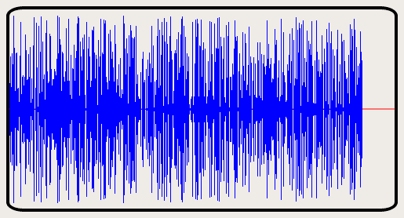
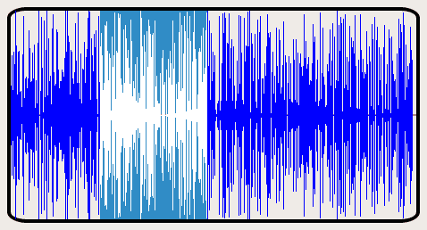
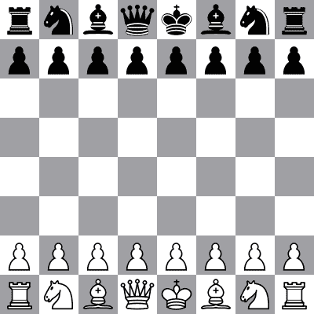
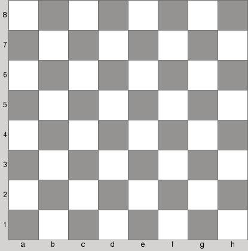
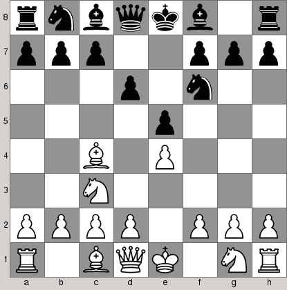
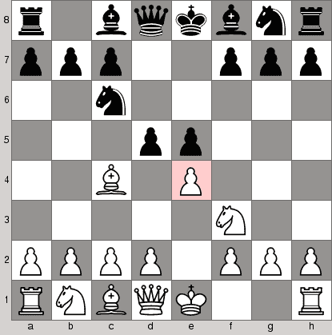
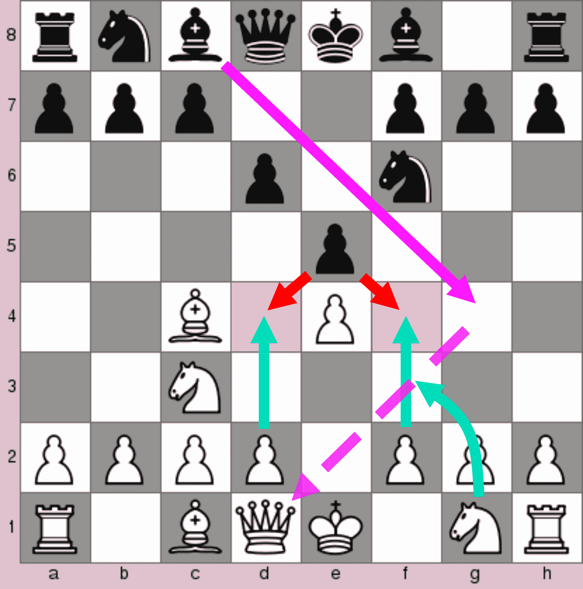
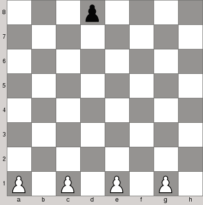
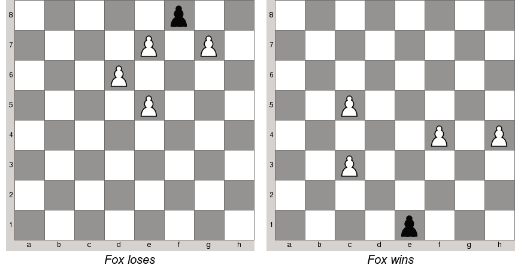

# 自定义小部件

我们到目前为止一直在使用现成的用户界面小部件，这导致了使用按钮进行井字棋游戏的粗糙方法。在本章中，你将了解 Qt 在自定义小部件方面提供的许多功能。这将使你能够实现自己的绘制和事件处理，并融入完全定制的内容。

本章涵盖的主要主题如下：

+   使用`QPainter`

+   创建自定义小部件

+   图像处理

+   实现一个棋盘游戏

# 光栅和矢量图形

当谈到图形时，Qt 将这个领域分为两个独立的部分。其中之一是光栅图形（例如，由小部件和图形视图使用）。这部分侧重于使用高级操作（如绘制线条或填充矩形）来操纵可以可视化在不同设备上的点的颜色网格，例如图像、打印机或你的计算机设备的显示。另一个是矢量图形，它涉及操纵顶点、三角形和纹理。这是针对处理和显示的最大速度，使用现代显卡提供的硬件加速。

Qt 使用表面（由`QSurface`类表示）的概念来抽象图形，它在表面上绘制。表面的类型决定了可以在表面上执行哪些绘图操作：支持软件渲染和光栅图形的表面具有`RasterSurface`类型，而支持 OpenGL 接口的表面具有`OpenGLSurface`类型。在本章中，你将深化你对 Qt 光栅绘制系统的了解。我们将在下一章回到 OpenGL 的话题。

`QSurface`对象可以有其他类型，但它们需要的频率较低。`RasterGLSurface`旨在供 Qt 内部使用。`OpenVGSurface`支持 OpenVG（一个硬件加速的 2D 矢量图形 API），在支持 OpenVG 但缺乏 OpenGL 支持的嵌入式设备上很有用。Qt 5.10 引入了`VulkanSurface`，它支持 Vulkan 图形 API。

# 光栅绘制

当我们谈论 GUI 框架时，光栅绘制通常与在控件上绘制相关联。然而，由于 Qt 不仅仅是 GUI 工具包，它提供的光栅绘制的范围要广泛得多。

通常情况下，Qt 的绘图架构由三个部分组成。其中最重要的部分是绘图发生的设备，由`QPaintDevice`类表示。Qt 提供了一系列的绘图设备子类，例如`QWidget`或`QImage`和`QPrinter`或`QPdfWriter`。你可以看到，在部件上绘制和在打印机上打印的方法是非常相似的。区别在于架构的第二部分——绘图引擎（`QPaintEngine`）。引擎负责在特定的绘图设备上执行实际的绘图操作。不同的绘图引擎用于在图像上绘制和在打印机上打印。这对于你作为开发者来说是完全隐藏的，所以你实际上不需要担心这一点。

对于你来说，最重要的部分是第三个组件——`QPainter`——它是整个绘图框架的适配器。它包含了一组可以在绘图设备上调用的高级操作。在幕后，所有的工作都委托给适当的绘图引擎。在讨论绘图时，我们将专注于绘图器对象，因为任何绘图代码都只能通过在不同的绘图设备上初始化的绘图器来调用。这有效地使得 Qt 的绘图与设备无关，如下面的例子所示：

```cpp
void doSomePainting(QPainter *painter) {
    painter->drawLine(QPoint(0,0), QPoint(100, 40));
} 
```

同一段代码可以在任何可能的`QPaintDevice`类上的绘图器上执行，无论是部件、图像还是 OpenGL 上下文（通过使用`QOpenGLPaintDevice`）。我们已经在第四章，*使用 Graphics View 的定制 2D 图形*中看到了`QPainter`的实际应用，当时我们创建了一个自定义的图形项。现在，让我们更深入地了解这个重要的类。

`QPainter`类有一个丰富的 API。这个类中最重要的方法可以分为三个组：

+   绘图器属性的设置器和获取器

+   以`draw`和`fill`开头名称的方法，在设备上执行绘图操作

+   允许操作绘图器坐标系的方法

# 绘图器属性

让我们从属性开始。最重要的三个属性是画笔、刷子和字体。画笔持有绘图器绘制轮廓的属性，而刷子决定了如何填充形状。我们已经在第四章，*使用 Graphics View 的定制 2D 图形*中描述了画笔和刷子，所以你应该已经理解了如何使用它们。

`font`属性是`QFont`类的实例。它包含大量用于控制字体参数的方法，例如字体家族、样式（斜体或倾斜）、字体粗细和字体大小（以点或设备相关像素为单位）。所有参数都是不言自明的，所以我们在这里不会详细讨论它们。重要的是要注意`QFont`可以使用系统上安装的任何字体。如果需要更多对字体的控制或需要使用系统上未安装的字体，可以利用`QFontDatabase`类。它提供了有关可用字体的信息（例如，特定字体是否可缩放或位图，以及它支持哪些书写系统），并允许通过直接从文件中加载它们的定义来将新字体添加到注册表中。

在字体方面，一个重要的类是`QFontMetrics`类。它允许计算使用字体绘制特定文本所需的空间量，或者计算文本的省略。最常见的用例是检查为特定用户可见字符串分配多少空间；考虑以下示例：

```cpp
QFontMetrics fm = painter.fontMetrics();
QRect rect = fm.boundingRect("Game Programming using Qt"); 
```

这在尝试确定小部件的`sizeHint`时特别有用。

# 坐标系

绘图器的下一个重要方面是其坐标系。实际上，绘图器有两个坐标系。一个是它自己的逻辑坐标系，它使用实数操作，另一个是绘图器操作的设备的物理坐标系。逻辑坐标系上的每个操作都映射到设备中的物理坐标，并在那里应用。让我们首先解释逻辑坐标系，然后我们将看到这与物理坐标有什么关系。

绘图器代表一个无限大的笛卡尔画布，默认情况下水平轴指向右，垂直轴指向下。可以通过对该系统应用仿射变换来修改它——平移、旋转、缩放和剪切。这样，你可以通过执行一个循环来绘制一个模拟时钟面，每个小时用一个线标记，每次循环将坐标系旋转 30 度，并在新获得的坐标系中绘制一条垂直线。另一个例子是当你希望绘制一个简单的图表，其中*x*轴向右延伸，而*y*轴向上延伸。为了获得正确的坐标系，你需要在垂直方向上将坐标系缩放为-1，从而有效地反转垂直轴的方向。

我们在这里描述的修改了由`QTransform`类实例表示的画家的世界变换矩阵。您可以通过在画家上调用`transform()`来始终查询矩阵的当前状态，并且可以通过调用`setTransform()`来设置新矩阵。`QTransform`有`scale()`、`rotate()`和`translate()`等方法来修改矩阵，但`QPainter`有直接操作世界矩阵的等效方法。在大多数情况下，使用这些方法会更可取。

每个绘图操作都使用逻辑坐标表示，经过世界变换矩阵，并达到坐标操作的第二个阶段，即视图矩阵。画家有`viewport()`和`window()`矩形的观念。`viewport`矩形表示任意矩形的物理坐标，而`window`矩形表示相同的矩形，但在逻辑坐标中。将一个映射到另一个给出一个需要应用于每个绘制的原语以计算要绘制的物理设备区域的变换。

默认情况下，这两个矩形与底层设备的矩形相同（因此，不会进行`window`-`viewport`映射）。这种转换在您希望使用除目标设备像素以外的测量单位执行绘图操作时很有用。例如，如果您想使用目标设备宽度和高度的百分比来表示坐标，您应将窗口宽度和高度都设置为`100`。然后，为了绘制从宽度 20%和高度 10%开始的线，并结束于宽度 70%和高度 30%，您将告诉画家绘制从`(20, 10)`到`(70, 30)`的线。如果您希望这些百分比只应用于图像的左半部分，您只需将视口矩形设置为图像的左半部分。

仅设置`window`和`viewport`矩形定义了坐标映射；它不会阻止绘图操作在`viewport`矩形外进行绘制。如果您希望这种行为，您必须在画家中启用**裁剪**并定义裁剪区域或路径。

# 绘图操作

一旦正确设置了画家，您就可以开始发出绘图操作。`QPainter`提供了一套丰富的操作来绘制不同类型的原语。所有这些操作在其名称中都包含`draw`前缀，后跟要绘制的原语名称。因此，`drawLine`、`drawRoundedRect`和`drawText`等操作都提供了一些重载，通常允许我们使用不同的数据类型来表示坐标。这些可能是纯值（整数或实数），Qt 的类，如`QPoint`和`QRect`，或它们的浮点等效类——`QPointF`和`QRectF`。每个操作都是使用当前画家设置（字体、笔和画刷）执行的。

请参阅`QPainter`类的文档，以获取所有绘图操作的列表。

在开始绘图之前，你必须告诉画家你希望在哪个设备上绘图。这是通过使用`begin()`和`end()`方法来完成的。前者接受一个指向`QPaintDevice`实例的指针并初始化绘图基础设施，后者标记绘图已完成。通常，我们不需要直接使用这些方法，因为`QPainter`的构造函数会为我们调用`begin()`，而析构函数会调用`end()`。

因此，典型的流程是实例化一个画家对象，将其传递给设备，然后通过调用`set`和`draw`方法进行绘图，最后通过超出作用域让画家被销毁，如下所示：

```cpp
{
    QPainter painter(this); // paint on the current object
    QPen pen(Qt::red);
    pen.setWidth(2);
    painter.setPen(pen);
    painter.setBrush(Qt::yellow);
    painter.drawRect(0, 0, 100, 50);
} 
```

我们将在本章的后续部分介绍`draw`家族的更多方法。

# 创建一个自定义小部件

是时候通过在部件上绘图将一些内容真正显示到屏幕上了。部件由于收到绘图事件而被重新绘制，该事件通过重新实现`paintEvent()`虚方法来处理。该方法接受一个指向`QPaintEvent`类型的事件对象的指针，该对象包含有关重新绘制请求的各种信息。记住，你只能在部件的`paintEvent()`调用内进行绘图。

# 行动时间 - 定制绘制的小部件

让我们立即将新技能付诸实践！在 Qt Creator 中创建一个新的 Qt Widgets 应用程序，选择`QWidget`作为基类，并确保不勾选生成表单框。我们的部件类名称将是`Widget`。

切换到新创建的类的头文件，在类中添加一个受保护的节，并在该节中键入`void paintEvent`。然后，按键盘上的*Ctrl* + *Space*，Creator 将建议方法的参数。你应该得到以下代码：

```cpp
protected:
    void paintEvent(QPaintEvent *); 
```

Creator 会将光标定位在分号之前。按下*Alt* + *Enter*将打开重构菜单，让你在实现文件中添加定义。处理绘图事件的标准化代码是在小部件上实例化一个画家，如下所示：

```cpp
void Widget::paintEvent(QPaintEvent *)
{
    QPainter painter(this);
} 
```

如果你运行此代码，部件将保持空白。现在我们可以开始添加实际的绘图代码：

```cpp
void Widget::paintEvent(QPaintEvent *)
{
    QPainter painter(this);
    QPen pen(Qt::black);
    pen.setWidth(4);
    painter.setPen(pen);
    QRect r = rect().adjusted(10, 10, -10, -10);
    painter.drawRoundedRect(r, 20, 10);
} 
```

编译并运行代码，你将得到以下输出：


# 刚才发生了什么？

首先，我们为画家设置了一个宽度为四像素的黑色笔。然后，我们调用`rect()`来获取小部件的几何矩形。通过调用`adjusted()`，我们接收一个新的矩形，其坐标（按照左、上、右、下的顺序）被给定的参数修改，从而有效地给我们一个每边有 10 像素边距的矩形。

Qt 通常提供两种方法，允许我们处理修改后的数据。调用`adjusted()`返回一个具有修改后属性的新对象，而如果我们调用`adjust()`，修改将就地完成。请特别注意你使用的方法，以避免意外结果。最好始终检查方法的返回值——它是否返回一个副本或空值。

最后，我们调用`drawRoundedRect()`，它使用第二个和第三个参数（在*x*，*y*顺序中）给出的像素数来绘制一个圆角矩形。如果你仔细看，你会注意到矩形有讨厌的锯齿状圆角部分。这是由抗锯齿效应引起的，其中逻辑线使用屏幕有限的分辨率进行近似；由于这个原因，一个像素要么完全绘制，要么完全不绘制。正如我们在第四章，“使用 Graphics View 的 2D 自定义图形”，Qt 提供了一个称为抗锯齿的机制，通过在适当的位置使用中间像素颜色来对抗这种效果。你可以在绘制圆角矩形之前，在画家上设置适当的渲染提示来启用此机制，如下所示：

```cpp
void Widget::paintEvent(QPaintEvent *)
{
    QPainter painter(this);
    painter.setRenderHint(QPainter::Antialiasing, true);
    // ...
} 
```

现在你将得到以下输出：


当然，这会对性能产生负面影响，所以只在抗锯齿效果明显的地方使用抗锯齿。

# 行动时间 - 变换视口

让我们扩展我们的代码，以便所有未来的操作都只关注在绘制边界之后在边界内进行绘制。使用`window`和`viewport`变换，如下所示：

```cpp
void Widget::paintEvent(QPaintEvent *) {
    QPainter painter(this);
    painter.setRenderHint(QPainter::Antialiasing, true);
    QPen pen(Qt::black);
    pen.setWidth(4);
    painter.setPen(pen);
    QRect r = rect().adjusted(10, 10, -10, -10);
    painter.drawRoundedRect(r, 20, 10);
    painter.save();
    r.adjust(2, 2, -2, -2);
    painter.setViewport(r);
    r.moveTo(0, -r.height() / 2);
    painter.setWindow(r);
    drawChart(&painter, r);
    painter.restore();
} 
```

此外，创建一个名为`drawChart()`的保护方法：

```cpp
void Widget::drawChart(QPainter *painter, const QRect &rect) {
    painter->setPen(Qt::red);
    painter->drawLine(0, 0, rect.width(), 0);
} 
```

让我们看看我们的输出：


# 发生了什么？

在新添加的代码中，我们首先调用了`painter.save()`。这个调用将画家的所有参数存储在一个内部栈中。然后我们可以修改画家的状态（通过更改其属性、应用变换等），然后，如果我们任何时候想要回到保存的状态，只需要调用`painter.restore()`就可以一次性撤销所有修改。

`save()`和`restore()`方法可以按需多次调用。状态存储在栈中，因此你可以连续保存多次，然后恢复以撤销每个更改。只需记住，始终将`save()`的调用与类似的`restore()`调用配对，否则内部画家状态将损坏。每次调用`restore()`都会将画家恢复到最后保存的状态。

状态保存后，我们再次调整矩形以适应边框的宽度。然后，我们将新的矩形设置为视口，通知绘图器操作的坐标物理范围。然后，我们将矩形向上移动其高度的一半，并将其设置为绘图器窗口。这有效地将绘图器的原点放置在小部件高度的一半处。然后，调用`drawChart()`方法，在新的坐标系中绘制一条红色线条。

# 动手时间——绘制示波器

让我们进一步扩展我们的小部件，使其成为一个简单的示波器渲染器。为此，我们必须让小部件记住一组值，并将它们绘制成一系列线条。

让我们从添加一个`QVector<quint16>`成员变量开始，该变量包含一个无符号 16 位整数值的列表。我们还将添加用于向列表添加值和清除列表的槽，如下所示：

```cpp
class Widget : public QWidget
{
    // ...
public slots:
    void addPoint(unsigned yVal) {
        m_points << qMax(0u, yVal);
        update();
    }
    void clear() {
        m_points.clear();
        update();
    }
protected:
    // ...
    QVector<quint16> m_points;
}; 
```

注意，每次修改列表都会调用一个名为`update()`的方法。这安排了一个绘制事件，以便我们的小部件可以用新值重新绘制。

绘图代码也很简单；我们只需遍历列表，并根据列表中的值绘制对称的蓝色线条。由于线条是垂直的，它们不会受到混叠的影响，因此我们可以禁用此渲染提示，如下所示：

```cpp
void Widget::drawChart(QPainter *painter, const QRect &rect) {
    painter->setPen(Qt::red);
    painter->drawLine(0, 0, rect.width(), 0);
    painter->save();
    painter->setRenderHint(QPainter::Antialiasing, false);
    painter->setPen(Qt::blue);
    for(int i = 0; i < m_points.size(); ++i) {
        painter->drawLine(i, -m_points.at(i), i, m_points.at(i));
    }
    painter->restore();
} 
```

要查看结果，让我们在`main()`函数中用数据填充小部件：

```cpp
for(int i = 0; i < 450; ++i) {
    w.addPoint(qrand() % 120);
}
```

此循环生成一个介于`0`和`119`之间的随机数，并将其作为点添加到小部件中。运行此类代码的示例结果如下截图所示：



如果缩小窗口，你会注意到示波器延伸到了圆角矩形的边界之外。还记得剪裁吗？现在你可以使用它来通过在调用`drawChart()`之前添加一个简单的`painter.setClipRect(r)`调用来约束绘图。

到目前为止，自定义小部件根本不具备交互性。尽管可以在源代码内部操作小部件内容（例如，通过向图表添加新点），但小部件对任何用户操作（除了调整小部件大小，这会导致重绘）都充耳不闻。在 Qt 中，用户与小部件之间的任何交互都是通过向小部件传递事件来完成的。这类事件通常被称为输入事件，包括键盘事件和不同形式的指向设备事件——鼠标、平板和触摸事件。

在典型的鼠标事件流程中，小部件首先接收到鼠标按下事件，然后是一系列鼠标移动事件（当用户在鼠标按钮按下时移动鼠标时），最后是一个鼠标释放事件。小部件还可以接收到除了这些事件之外的额外鼠标双击事件。重要的是要记住，默认情况下，只有在鼠标移动时按下鼠标按钮时，才会传递鼠标移动事件。要接收没有按钮按下时的鼠标移动事件，小部件需要激活一个称为**鼠标跟踪**的功能。

# 行动时间 - 使示波图可选择

是时候使我们的示波器小部件交互式了。我们将教会它添加几行代码，使用户能够选择绘图的一部分。让我们从存储选择开始。我们需要两个可以通过只读属性访问的整数变量；因此，向类中添加以下两个属性：

```cpp
Q_PROPERTY(int selectionStart READ selectionStart
                              NOTIFY selectionChanged)
Q_PROPERTY(int selectionEnd   READ selectionEnd
                              NOTIFY selectionChanged)
```

接下来，您需要创建相应的私有字段（您可以初始化它们都为-1）、获取器和信号。

用户可以通过将鼠标光标拖动到绘图上来更改选择。当用户在绘图上的某个位置按下鼠标按钮时，我们将该位置标记为选择的开始。拖动鼠标将确定选择的结束。事件命名的方案类似于绘图事件；因此，我们需要声明和实现以下两个受保护的方法：

```cpp
void Widget::mousePressEvent(QMouseEvent *mouseEvent) {
    m_selectionStart = m_selectionEnd = mouseEvent->pos().x() - 12;
    emit selectionChanged();
    update();
}
void Widget::mouseMoveEvent(QMouseEvent *mouseEvent) {
    m_selectionEnd = mouseEvent->pos().x() - 12;
    emit selectionChanged();
    update();
} 
```

两个事件处理器的结构类似。我们更新所需值，考虑到绘图时的左填充（12 像素），类似于我们在绘图时所做的。然后，发出一个信号并调用`update()`来安排小部件的重绘。

剩下的工作是对绘图代码进行更改。我们建议您添加一个类似于`drawChart()`的`drawSelection()`方法，但它从绘图事件处理程序立即在`drawChart()`之前调用，如下所示：

```cpp
void Widget::drawSelection(QPainter *painter, const QRect &rect) {
    if(m_selectionStart < 0) {
        return;
    }
    painter->save();
    painter->setPen(Qt::NoPen);
    painter->setBrush(palette().highlight());
    QRect selectionRect = rect;
    selectionRect.setLeft(m_selectionStart);
    selectionRect.setRight(m_selectionEnd);
    painter->drawRect(selectionRect);
    painter->restore();
} 
```

首先，我们检查是否需要绘制任何选择。然后，我们保存绘图器的状态并调整绘图器的笔和刷。笔设置为`Qt::NoPen`，这意味着绘图器不应绘制任何轮廓。为了确定刷，我们使用`palette()`；这返回一个包含小部件基本颜色的`QPalette`类型的对象。对象中包含的颜色之一是常用于标记选择的突出显示颜色。如果您使用调色板中的条目而不是手动指定颜色，您将获得优势，因为当类的用户修改调色板时，这种修改会被我们的小部件代码考虑在内。

您可以使用小部件中的调色板中的其他颜色来绘制小部件中的其他内容。您甚至可以在小部件的构造函数中定义自己的`QPalette`对象，以提供默认颜色。

最后，我们调整要绘制的矩形并发出绘图调用。

当你运行此程序时，你会注意到选择颜色与图表本身的对比度不是很好。为了克服这一点，一个常见的做法是用不同的（通常是相反的）颜色绘制“选中”内容。在这种情况下，可以通过稍微修改`drawChart()`代码轻松实现这一点：

```cpp
for(int i = 0; i < m_points.size(); ++i) {
    if(m_selectionStart <= i && m_selectionEnd >=i) {
        painter->setPen(Qt::white);
    } else {
        painter->setPen(Qt::blue);
    }
    painter->drawLine(i, -m_points.at(i), i, m_points.at(i));
} 
```

现在你看到以下输出：



# 勇敢尝试者——仅对左鼠标按钮做出反应

作为练习，你可以修改事件处理代码，使其仅在鼠标事件由左鼠标按钮触发时更改选择。要查看哪个按钮触发了鼠标按下事件，你可以使用`QMouseEvent::button()`方法，它返回`Qt::LeftButton`表示左按钮，`Qt::RightButton`表示右按钮，依此类推。

# 触摸事件

处理触摸事件是不同的。对于任何此类事件，你都会收到对`touchEvent()`虚拟方法的调用。此类调用的参数是一个对象，可以检索用户当前触摸的点列表，以及有关用户交互历史（触摸是否刚刚开始或点是否之前被按下并移动）以及用户施加到点的力的附加信息。请注意，这是一个低级框架，允许你精确地跟踪触摸交互的历史。如果你对高级手势识别（平移、捏合和滑动）更感兴趣，有针对它的一个单独的事件家族。

处理手势是一个两步的过程。首先，你需要通过调用`grabGesture()`并传入你想要处理的手势类型来在你的小部件上激活手势识别。这样的代码放在小部件构造函数中是个好地方。

然后，你的小部件将开始接收手势事件。没有专门的手势事件处理器，但幸运的是，一个对象的所有事件都通过其`event()`方法流动，我们可以重新实现它。以下是一些处理平移手势的示例代码：

```cpp
bool Widget::event(QEvent *e) {
  if(e->type() == QEvent::Gesture) {
    QGestureEvent *gestureEvent = static_cast<QGestureEvent*>(e);
    QGesture *pan  = gestureEvent->gesture(Qt::PanGesture);
    if(pan) {
      handlePanGesture(static_cast<QPanGesture*>(pan));
    }
  }
  return QWidget::event(e);
} 
```

首先，进行事件类型的检查；如果它与预期值匹配，则将事件对象转换为`QGestureEvent`。然后，询问是否识别出`Qt::PanGesture`。最后，调用`handlePanGesture`方法。你可以实现这样一个方法来处理你的平移手势。

# 与图像一起工作

Qt 有两个用于处理图像的类。第一个是 `QImage`，更倾向于直接像素操作。你可以检查图像的大小或检查和修改每个像素的颜色。你可以将图像转换为不同的内部表示（例如从 8 位调色板到带有预乘 alpha 通道的完整 32 位颜色）。然而，这种类型并不适合渲染。为此，我们有一个不同的类，称为 `QPixmap`。这两个类之间的区别在于 `QImage` 总是保存在应用程序内存中，而 `QPixmap` 只能是一个指向可能位于图形卡内存或远程 *X* 服务器上的资源的句柄。它相对于 `QImage` 的主要优势是它可以非常快速地渲染，但代价是无法访问像素数据。你可以在两种类型之间自由转换，但请注意，在某些平台上，这可能是一个昂贵的操作。始终考虑哪个类更适合你的特定情况。如果你打算裁剪图像、用某种颜色着色或在其上绘画，`QImage` 是更好的选择，但如果你只是想渲染一些图标，最好将它们保持为 `QPixmap` 实例。

# 加载

加载图像非常简单。`QPixmap` 和 `QImage` 都有构造函数，只需接受包含图像的文件路径即可。Qt 通过实现不同图像格式读取和写入操作的插件来访问图像数据。不深入插件细节，只需说默认的 Qt 安装支持读取以下图像类型：

| **类型** | 描述 |
| --- | --- |
| BMP | Windows 位图 |
| GIF | 图像交换格式 |
| JPG/JPEG | 联合摄影专家组 |
| PNG | 可移植网络图形 |
| PPM/PBM/PGM | 可移植任意图 |
| XBM | X 位图 |
| XPM | X Pixmap |

如你所见，最流行的图像格式都可用。通过安装额外的插件，该列表可以进一步扩展。

你可以通过调用静态方法 `QImageReader::supportedImageFormats()` 来请求 Qt 支持的图像类型列表，它返回 Qt 可以读取的格式列表。对于可写入的格式列表，请调用 `QImageWriter::supportedImageFormats()`。

图像也可以直接从现有的内存缓冲区加载。这可以通过两种方式完成。第一种是使用`loadFromData()`方法（它存在于`QPixmap`和`QImage`中），其行为与从文件加载图像时相同——您传递一个数据缓冲区和缓冲区的大小，根据这些信息，加载器通过检查头数据来确定图像类型，并将图片加载到`QImage`或`QPixmap`中。第二种情况是您没有存储在“文件类型”如 JPEG 或 PNG 中的图像；相反，您有原始像素数据本身。在这种情况下，`QImage`提供了一个构造函数，它接受指向数据块的指针以及图像的大小和数据格式。格式不是如前面列出的文件格式，而是表示单个像素数据的内存布局。

最流行的格式是`QImage::Format_ARGB32`，这意味着每个像素由 32 位（4 字节）数据表示，这些数据在 alpha、红色、绿色和蓝色通道之间平均分配——每个通道 8 位。另一种流行的格式是`QImage::Format_ARGB32_Premultiplied`，其中红色、绿色和蓝色通道的值在乘以 alpha 通道的值之后存储，这通常会导致渲染速度更快。您可以使用`convertToFormat()`调用更改内部数据表示。例如，以下代码将真彩色图像转换为 256 种颜色，其中每个像素的颜色由颜色表中索引表示：

```cpp
QImage trueColor("image.png");
QImage indexed = trueColor.convertToFormat(QImage::Format_Indexed8); 
```

颜色表本身是一个颜色定义的向量，可以使用`colorTable()`获取，并使用`setColorTable()`替换。例如，您可以通过调整颜色表将索引图像转换为灰度图，如下所示：

```cpp
QImage indexed = ...;
QVector<QRgb> colorTable = indexed.colorTable();
for(QRgb &item: colorTable) {
    int gray = qGray(item);
    item = qRgb(gray, gray, gray);
}
indexed.setColorTable(colorTable); 
```

然而，对于这个任务有一个更简洁的解决方案。您可以将任何图像转换为`Format_Grayscale8`格式：

```cpp
QImage grayImage = coloredImage.convertToFormat(QImage::Format_Grayscale8);
```

此格式使用每个像素 8 位，没有颜色表，因此只能存储灰度图像。

# 修改

修改图像像素数据有两种方法。第一种仅适用于`QImage`，涉及使用`setPixel()`调用直接操作像素，该调用接受像素坐标和要设置的像素颜色。第二种方法适用于`QImage`和`QPixmap`，利用这两个类都是`QPaintDevice`的子类这一事实。因此，您可以在这些对象上打开`QPainter`并使用其绘图 API。以下是一个获取带有蓝色矩形和红色圆圈的位图的示例：

```cpp
QPixmap px(256, 256);
px.fill(Qt::transparent);
QPainter painter(&px);
painter.setPen(Qt::NoPen);
painter.setBrush(Qt::blue);
QRect r = px.rect().adjusted(10, 10, -10, -10);
painter.drawRect(r);
painter.setBrush(Qt::red);
painter.drawEllipse(r); 
```

首先，我们创建一个 256 x 256 的位图，并用透明色填充它。然后，我们在其上打开一个画家，并调用一系列绘制蓝色矩形和红色圆圈的调用。

`QImage`还提供了一些用于转换图像的方法，包括`scaled()`、`mirrored()`、`transformed()`和`copy()`。它们的 API 直观，因此我们在此不进行讨论。

# 绘图

在其基本形式中，绘制图像与从 `QPainter` API 调用 `drawImage()` 或 `drawPixmap()` 一样简单。这两个方法有不同的变体，但基本上，它们都允许指定要绘制的给定图像或位图的哪一部分以及绘制位置。值得注意的是，与绘制图像相比，绘制位图更受欢迎，因为图像必须首先转换为位图才能进行绘制。

如果你有很多位图要绘制，一个名为 `QPixmapCache` 的类可能会很有用。它为位图提供了一个应用程序范围内的缓存。使用它，你可以加快位图加载速度，同时限制内存使用量。

最后，如果你只想将位图作为一个单独的小部件显示，你可以使用 `QLabel`。这个小部件通常用于显示文本，但你可以通过 `setPixmap()` 函数配置它以显示位图。默认情况下，位图以不缩放的方式显示。当标签比位图大时，它的位置由标签的对齐方式决定，你可以通过 `setAlignment()` 函数更改它。你还可以调用 `setScaledContents(true)` 将位图拉伸到标签的全尺寸。

# 绘制文本

使用 `QPainter` 绘制文本值得单独解释，不是因为它复杂，而是因为 Qt 在这方面提供了很多灵活性。一般来说，绘制文本是通过调用 `QPainter::drawText()` 或 `QPainter::drawStaticText()` 来实现的。让我们首先关注前者，它允许绘制通用文本。

调用绘制文本的最基本的方法是这个方法的变体，它需要 *x* 和 *y* 坐标以及要绘制的文本：

```cpp
painter.drawText(10, 20, "Drawing some text at (10, 20)"); 
```

上述调用将给定文本水平绘制在位置 10，并将文本的基线垂直放置在位置 20。文本使用画家的当前字体和笔进行绘制。坐标也可以作为 `QPoint` 实例传递，而不是分别给出 *x* 和 *y* 值。这种方法的问题在于它对文本的绘制方式控制很少。一个更灵活的变体是允许我们给出一系列标志，并将文本的位置表示为一个矩形而不是一个点。标志可以指定文本在给定矩形内的对齐方式，或者指导渲染引擎关于文本的换行和剪切。你可以在以下图中看到向调用传递不同组合的标志的结果：


为了获得上述结果中的每一个，运行类似于以下代码：

```cpp
painter.drawText(rect, Qt::AlignLeft | Qt::TextShowMnemonic, "&ABC"); 
```

你可以看到，除非你设置了 `Qt::TextDontClip` 标志，否则文本会被剪切到给定的矩形内；设置 `Qt::TextWordWrap` 启用换行，而 `Qt::TextSingleLine` 使得引擎忽略遇到的任何换行符。

# 静态文本

Qt 在布局文本时必须执行一系列计算，并且每次渲染文本时都必须这样做。如果自上次渲染文本以来文本及其属性没有变化，这将是一种时间浪费。为了避免需要重新计算布局，引入了静态文本的概念。

要使用它，实例化 `QStaticText` 并用你想要渲染的文本以及你可能希望它具有的任何选项（保持为 `QTextOption` 实例）进行初始化。然后，将对象存储在某个地方，每当你想渲染文本时，只需调用 `QPainter::drawStaticText()`，并将静态文本对象传递给它。如果自上次绘制文本以来文本的布局没有变化，则不会重新计算，从而提高性能。以下是一个使用静态文本方法简单地绘制文本的自定义小部件示例：

```cpp
class TextWidget : public QWidget {
public:
    TextWidget(QWidget *parent = nullptr) : QWidget(parent) {}
    void setText(const QString &txt) {
        m_staticText.setText(txt);
        update();
    }
protected:
    void paintEvent(QPaintEvent *) {
        QPainter painter(this);
        painter.drawStaticText(0, 0, m_staticText);
    }
private:
    QStaticText m_staticText;
}; 
```

# 优化小部件绘制

作为一项练习，我们将修改我们的示波器小部件，使其只重绘所需的数据部分。

# 行动时间 – 优化示波器绘制

第一步是修改绘制事件处理代码，以获取需要更新的区域信息并将其传递给绘制图表的方法。代码中的改动部分已在此处突出显示：

```cpp
void Widget::paintEvent(QPaintEvent *event)
{
    QRect exposedRect = event->rect();
    ...
    drawSelection(&painter, r, exposedRect);
    drawChart(&painter, r, exposedRect);
    painter.restore();
} 
```

下一步是修改 `drawSelection()` 函数，使其只绘制与暴露矩形相交的选中部分。幸运的是，`QRect` 提供了一个方法来计算交集：

```cpp
void Widget::drawSelection(QPainter *painter, const QRect &rect,
                           const QRect &exposedRect)
{
    // ...
    QRect selectionRect = rect;
    selectionRect.setLeft(m_selectionStart);
    selectionRect.setRight(m_selectionEnd);
    painter->drawRect(selectionRect.intersected(exposedRect));
    painter->restore();
} 
```

最后，需要调整 `drawChart` 以省略暴露矩形外的值：

```cpp
void Widget::drawChart(QPainter *painter, const QRect &rect,
                       const QRect &exposedRect)
{
    painter->setPen(Qt::red);
    painter->drawLine(exposedRect.left(), 0, exposedRect.width(), 0);
    painter->save();
    painter->setRenderHint(QPainter::Antialiasing, false);
    const int lastPoint = qMin(m_points.size(),
                               exposedRect.right() + 1);
    for(int i = exposedRect.left(); i < lastPoint; ++i) {
      if(m_selectionStart <= i && m_selectionEnd >=i) {
        painter->setPen(Qt::white);
      } else
      painter->setPen(Qt::blue);
      painter->drawLine(i, -m_points.at(i), i, m_points.at(i));
    }
    painter->restore();
    Q_UNUSED(rect)
} 
```

# 刚才发生了什么？

通过实施这些更改，我们已经有效地将绘制的区域减少到事件接收到的矩形。在这种情况下，我们不会节省太多时间，因为绘制图表并不那么耗时；然而，在许多情况下，你将能够使用这种方法节省大量时间。例如，如果我们绘制一个游戏世界的非常详细的空中地图，如果只有一小部分被修改，重新绘制整个地图将非常昂贵。我们可以通过利用暴露区域的信息轻松减少计算和绘制调用的数量。

利用暴露矩形已经是提高效率的良好一步，但我们还可以更进一步。当前方法要求我们在暴露矩形内重绘图表的每一行，这仍然需要一些时间。相反，我们可以将这些线条只绘制一次到 pixmap 中，然后每当小部件需要重绘时，告诉 Qt 将 pixmap 的一部分渲染到小部件上。

# 尝试一下英雄 – 在 pixmap 中缓存示波器

现在，你应该很容易为我们的示例小部件实现这种方法。主要区别在于，对绘图内容的每次更改不应导致调用 `update()`，而应导致调用将重绘 pixmap 并随后调用 `update()` 的调用。`paintEvent` 方法因此变得非常简单：

```cpp
void Widget::paintEvent(QPaintEvent *event)
{
    QRect exposedRect = event->rect();
    QPainter painter(this);
    painter.drawPixmap(exposedRect, m_pixmap, exposedRect);
} 
```

你还需要在部件大小调整时重新绘制位图。这可以在 `resizeEvent()` 虚拟函数内部完成。

虽然掌握可用的优化方法很有用，但始终重要的是要检查它们是否实际上使你的应用程序更快。通常情况下，直接的方法比巧妙的优化更优。在先前的例子中，调整部件大小（以及随后调整位图大小）可能会触发潜在的昂贵内存分配。只有当直接在部件上绘制更加昂贵时，才使用此优化。

# 实现象棋游戏

到目前为止，你已经准备好运用你新获得的使用 Qt 绘制图形的技能来创建一个使用具有自定义图形的部件的游戏。今天的英雄将是象棋和其他类似象棋的游戏。

# 是时候采取行动了——开发游戏架构

创建一个新的 Qt Widgets 应用程序项目。在项目基础设施准备就绪后，从文件菜单中选择新建文件或项目，然后选择创建一个 C++ 类。将新类命名为 `ChessBoard`，并将 `QObject` 设置为其基类。重复此过程以创建一个从 `QObject` 派生的 `ChessAlgorithm` 类，另一个名为 `ChessView`，但这次选择 `QWidget` 作为基类。你应该会得到一个名为 `main.cpp` 的文件和四个类：

+   `MainWindow` 将是我们的主窗口类，其中包含一个 `ChessView`

+   `ChessView` 将是显示我们的棋盘的部件

+   `ChessAlgorithm` 将包含游戏逻辑

+   `ChessBoard` 将保存棋盘的状态，并将其提供给 `ChessView` 和 `ChessAlgorithm`

现在，导航到 `ChessAlgorithm` 的头文件，并向该类添加以下方法：

```cpp
public:
    ChessBoard* board() const;
public slots:
    virtual void newGame();
signals:
    void boardChanged(ChessBoard*);
protected:
    virtual void setupBoard();
    void setBoard(ChessBoard *board); 
```

此外，添加一个私有的 `m_board` 字段，类型为 `ChessBoard*`。记住要么包含 `chessboard.h`，要么提前声明 `ChessBoard` 类。实现 `board()` 作为 `m_board` 的简单获取器方法。`setBoard()` 方法将是 `m_board` 的受保护设置器：

```cpp
void ChessAlgorithm::setBoard(ChessBoard *board)
{
    if(board == m_board) {
        return;
    }
    delete m_board;
    m_board = board;
    emit boardChanged(m_board);
} 
```

接下来，让我们为 `setupBoard()` 提供一个基本实现，以创建一个默认的棋盘，具有八行和八列：

```cpp
void ChessAlgorithm::setupBoard()
{
    setBoard(new ChessBoard(8, 8, this));
} 
```

准备棋盘的自然地方是在新游戏开始时执行的一个函数中：

```cpp
void ChessAlgorithm::newGame()
{
    setupBoard();
} 
```

目前，这个类最后的添加是将提供的构造函数扩展以初始化 `m_board` 为一个空指针。

在最后显示的方法中，我们实例化了一个 `ChessBoard` 对象，所以现在让我们关注这个类。首先，扩展构造函数以接受两个额外的整数参数，除了常规的父参数。将它们的值存储在私有的 `m_ranks` 和 `m_columns` 字段中（记住在类头文件中声明这些字段本身）。

在头文件中，在 `Q_OBJECT` 宏下方，添加以下两行作为属性定义：

```cpp
  Q_PROPERTY(int ranks READ ranks NOTIFY ranksChanged)
  Q_PROPERTY(int columns READ columns NOTIFY columnsChanged) 
```

声明信号并实现获取器方法以与这些定义协同工作。此外，添加两个受保护的方法：

```cpp
protected:
    void setRanks(int newRanks);
    void setColumns(int newColumns); 
```

这些将是等级和列属性的设置器，但我们不希望将它们暴露给外部世界，因此我们将给它们 `protected` 访问范围。

将以下代码放入 `setRanks()` 方法体中：

```cpp
void ChessBoard::setRanks(int newRanks)
{
    if(ranks() == newRanks) {
        return;
    }
    m_ranks = newRanks;
    emit ranksChanged(m_ranks);
} 
```

接下来，以类似的方式，你可以实现 `setColumns()`。

我们现在要处理的最后一个类是我们的自定义小部件，`ChessView`。目前，我们只为一个方法提供一个基本的实现，但随着我们的实现逐渐完善，我们将在以后扩展它。添加一个公共的 `setBoard(ChessBoard *)` 方法，其内容如下：

```cpp
void ChessView::setBoard(ChessBoard *board)
{
    if(m_board == board) {
        return;
    }
    if(m_board) {
        // disconnect all signal-slot connections between m_board and this
        m_board->disconnect(this);
    }
    m_board = board;
    // connect signals (to be done later)
    updateGeometry();
} 
```

现在，让我们声明 `m_board` 成员。由于我们不是棋盘对象的所有者（算法类负责管理它），我们将使用 `QPointer` 类，该类跟踪 `QObject` 的生命周期，并在对象被销毁后将其自身设置为 null：

```cpp
private:
    QPointer<ChessBoard> m_board; 
```

`QPointer` 将其值初始化为 null，所以我们不需要在构造函数中自己初始化它。为了完整性，让我们提供一个获取棋盘的方法：

```cpp
ChessBoard *ChessView::board() const {
    return m_board;
} 
```

# 刚才发生了什么？

在最后一个练习中，我们定义了我们解决方案的基架构。我们可以看到有三个类参与：`ChessView` 作为用户界面，`ChessAlgorithm` 用于驱动实际游戏，`ChessBoard` 作为视图和引擎之间共享的数据结构。算法将负责设置棋盘（通过 `setupBoard()`），进行移动，检查胜利条件等。视图将渲染棋盘的当前状态，并将用户交互信号传递给底层逻辑。

大部分代码都是自解释的。你可以在 `ChessView::setBoard()` 方法中看到，我们正在断开旧棋盘对象的所有信号，连接新的对象（我们将在稍后定义信号时再回来连接信号），最后告诉小部件更新其大小并使用新的棋盘重新绘制自己。

# 行动时间 - 实现游戏棋盘类

现在我们将关注我们的数据结构。向 `ChessBoard` 添加一个新的私有成员，一个包含棋盘上棋子信息的字符向量：

```cpp
QVector<char> m_boardData; 
```

考虑以下表格，它显示了棋子类型和用于它的字母：

| 飞行类型 |  | 白色 | 黑色 |
| --- | --- | --- | --- |
|  | 国王 | K | k |
|   | 女王 | Q | q |
|   | 车辆 | R | r |
|   | 象 | B | b |
|   | 骑士 | N | n |
|   | 兵 | P | P |

你可以看到，白棋使用大写字母，黑棋使用相同字母的小写变体。此外，我们将使用空格字符（ASCII 值为 0x20）来表示空位。我们将添加一个受保护的设置空棋盘的方法，基于棋盘上的行数和列数，以及一个`boardReset()`信号来通知棋盘上的位置已更改：

```cpp
void ChessBoard::initBoard()
{
    m_boardData.fill(' ', ranks() * columns());
    emit boardReset();
} 
```

我们可以更新设置行和列计数的现有方法，以便利用该方法：

```cpp
void ChessBoard::setRanks(int newRanks)
{
    if(ranks() == newRanks) {
        return;
    }
    m_ranks = newRanks;
    initBoard();
    emit ranksChanged(m_ranks);
}

void ChessBoard::setColumns(int newColumns)
{
    if(columns() == newColumns) {
        return;
    }
    m_columns = newColumns;
    initBoard();
    emit columnsChanged(m_columns);
} 
```

`initBoard()`方法也应该在构造函数内部调用，所以也要在那里放置调用。

接下来，我们需要一个方法来读取棋盘特定位置上的棋子：

```cpp
char ChessBoard::data(int column, int rank) const
{
    return m_boardData.at((rank-1) * columns() + (column - 1));
} 
```

行和列的索引从 1 开始，但数据结构从 0 开始索引；因此，我们必须从行和列索引中减去 1。还需要有一个方法来修改棋盘的数据。实现以下公共方法：

```cpp
void ChessBoard::setData(int column, int rank, char value)
{
    if(setDataInternal(column, rank, value)) {
        emit dataChanged(column, rank);
    }
} 
```

该方法使用了另一个实际执行工作的方法。然而，这个方法应该声明为`protected`访问范围。再次，我们调整索引差异：

```cpp
bool ChessBoard::setDataInternal(int column, int rank, char value)
{
    int index = (rank-1) * columns() + (column - 1);
    if(m_boardData.at(index) == value) {
        return false;
    }
    m_boardData[index] = value;
    return true;
} 
```

由于`setData()`使用了信号，我们必须声明它：

```cpp
signals:
    void ranksChanged(int);
    void columnsChanged(int);
    void dataChanged(int c, int r);
    void boardReset(); 
```

每当棋盘上的情况成功更改时，将发出信号。我们将实际工作委托给受保护的方方法，以便在不发出信号的情况下修改棋盘。

定义了`setData()`之后，我们可以添加另一个方便的方法：

```cpp
void ChessBoard::movePiece(int fromColumn, int fromRank, 
                           int toColumn, int toRank)
{
    setData(toColumn, toRank, data(fromColumn, fromRank));
    setData(fromColumn, fromRank, ' ');
} 
```

你能猜到它做什么吗？没错！它将一个棋子从一个位置移动到另一个位置，并在后面留下一个空位。

还有一个方法值得实现。标准的国际象棋游戏包含 32 个棋子，而游戏变体中棋子的起始位置可能不同。通过单独调用`setData()`来设置每个棋子的位置将会非常繁琐。幸运的是，存在一种整洁的棋盘表示法，称为**福赛斯-爱德华斯记法**（**FEN**），它可以将整个游戏状态存储为单行文本。如果你想要了解记法的完整定义，你可以自己查阅。简而言之，我们可以这样说，文本字符串按行排列棋子的位置，从最后一行开始，每一行由一个字符描述，该字符按照我们内部的数据结构进行解释（例如，`K`代表白王，`q`代表黑后，等等）。每一行的描述由一个`/`字符分隔。如果棋盘上有空位，它们不会存储为空格，而是用一个数字指定连续空位的数量。因此，标准游戏的起始位置可以写成如下：

```cpp
"rnbqkbnr/pppppppp/8/8/8/8/PPPPPPPP/RNBQKBNR" 
```

这可以直观地解释如下：



让我们编写一个名为`setFen()`的方法，根据 FEN 字符串设置棋盘：

```cpp
void ChessBoard::setFen(const QString &fen)
{
    int index = 0;
    int skip = 0;
    const int columnCount = columns();
    QChar ch;
    for(int rank = ranks(); rank > 0; --rank) {
        for(int column = 1; column <= columnCount; ++column) {
            if(skip > 0) {
                ch = ' ';
                skip--;
            } else {
                ch = fen.at(index++);
                if(ch.isDigit()) {
                    skip = ch.toLatin1() - '0';
                    ch = ' ';
                    skip--;
                }
            }
            setDataInternal(column, rank, ch.toLatin1());
        }
        QChar next = fen.at(index++);
        if(next != '/' && next != ' ') {
            initBoard();
            return; // fail on error
        }
    }
    emit boardReset();
} 
```

该方法遍历棋盘上的所有字段，并确定它是否正在中间插入空字段，或者应该从字符串中读取下一个字符。如果遇到数字，它将通过减去字符 '0' 的 ASCII 值（即 `'7' - '0'` = 7）将其转换为整数。在设置每一行后，我们要求从字符串中读取一个斜杠或空格。否则，我们将棋盘重置为空棋盘，并退出该方法。

# 刚才发生了什么？

我们教会了 `ChessBoard` 类使用字符的单维数组存储关于棋子的简单信息。我们还为其配备了允许查询和修改游戏数据的方法。我们通过采用 FEN 标准，实现了一种快速设置游戏当前状态的方法。游戏数据本身并不局限于经典象棋。尽管我们遵守了用于描述棋子的标准记法，但仍然可以使用其他字母和字符，这些字母和字符超出了定义良好的棋子集。这为存储类似象棋的游戏信息提供了一种灵活的解决方案，例如跳棋，以及可能在任何大小和行列的二维棋盘上玩的其他自定义游戏。我们提出的数据结构并非愚蠢——它通过在游戏状态被修改时发出信号与环境进行通信。

# 行动时间 - 理解 ChessView 类

这是一个关于图形处理的章节，所以现在是时候关注显示我们的棋盘游戏了。我们的部件目前什么都没有显示，我们的第一个任务将是显示带有行列符号并适当着色的棋盘。

默认情况下，部件没有定义任何合适的尺寸，我们必须通过实现 `sizeHint()` 来解决这个问题。然而，为了能够计算尺寸，我们必须决定棋盘上单个字段的大小。因此，在 `ChessView` 中，你应该声明一个包含字段大小的属性，如下所示：

```cpp
Q_PROPERTY(QSize fieldSize
           READ fieldSize WRITE setFieldSize
           NOTIFY fieldSizeChanged) 
```

为了加快编码速度，你可以将光标置于属性声明上，按下 *Alt* + *Enter* 组合键，并从弹出菜单中选择“生成缺失的 Q_PROPERTY 成员修复”。Creator 将为你提供 getter 和 setter 的简单实现。你可以通过将光标置于每个方法上，按下 *Alt* + *Enter*，并选择“将定义移动到 chessview.cpp 文件修复”来将生成的代码移动到实现文件。虽然生成的 getter 方法很好，但 setter 需要一些调整。通过添加以下高亮代码来修改它：

```cpp
void ChessView::setFieldSize(QSize arg)
{
    if (m_fieldSize == arg) {
        return;
    }
    m_fieldSize = arg;
    emit fieldSizeChanged(arg);
    updateGeometry();
} 
```

这条指令告诉我们的部件，每当字段大小被修改时，都要重新计算其大小。现在我们可以实现 `sizeHint()`：

```cpp
QSize ChessView::sizeHint() const
{
    if(!m_board) {
        return QSize(100,100);
    }
    QSize boardSize = QSize(fieldSize().width()
        * m_board->columns() + 1,
    m_fieldSize.height() * m_board->ranks() + 1);
    // 'M' is the widest letter
    int rankSize = fontMetrics().width('M') + 4;
    int columnSize = fontMetrics().height() + 4;
    return boardSize + QSize(rankSize, columnSize);
} 
```

首先，我们检查是否有有效的棋盘定义，如果没有，则返回一个合理的 100 × 100 像素大小。否则，该方法通过将每个字段的大小乘以列数或等级数来计算所有字段的大小。我们在每个维度上添加一个像素以容纳右侧和底部边框。棋盘不仅由字段本身组成，还在棋盘的左侧边缘显示等级符号，在棋盘的底部边缘显示列号。

由于我们使用字母来枚举等级，我们使用`QFontMetrics`类检查最宽字母的宽度。我们使用相同的类来检查使用当前字体渲染一行文本所需的空间，以便我们有足够的空间放置列号。在这两种情况下，我们将结果增加 4，以便在文本和棋盘边缘之间以及文本和部件边缘之间留出 2 像素的边距。

实际上，在最常见的字体中，最宽的字母是 W，但它在我们的游戏中不会出现。

定义一个辅助方法来返回包含特定字段的矩形非常有用，如下所示：

```cpp
QRect ChessView::fieldRect(int column, int rank) const
{
    if(!m_board) {
        return QRect();
    }
    const QSize fs = fieldSize();
    QPoint topLeft((column - 1) * fs.width(),
                   (m_board->ranks()-rank) * fs.height());
    QRect fRect = QRect(topLeft, fs);
    // offset rect by rank symbols
    int offset = fontMetrics().width('M');    
    return fRect.translated(offset+4, 0);
} 
```

由于等级数字从棋盘顶部到底部递减，我们在计算`fRect`时从最大等级中减去所需的等级。然后，我们像在`sizeHint()`中做的那样计算等级符号的水平偏移量，并在返回结果之前将矩形平移该偏移量。

最后，我们可以继续实现绘制事件的处理器。声明`paintEvent()`方法（在*Alt* + *Enter*键盘快捷键下可用的修复菜单将允许您生成方法的存根实现）并填充以下代码：

```cpp
void ChessView::paintEvent(QPaintEvent *)
{
    if(!m_board) {
        return;
    }
    QPainter painter(this);
    for(int r = m_board->ranks(); r > 0; --r) {
        painter.save();
        drawRank(&painter, r);
        painter.restore();
    }
    for(int c = 1; c <= m_board->columns(); ++c) {
        painter.save();
        drawColumn(&painter, c);
        painter.restore();
    }
    for(int r = 1; r <= m_board->ranks(); ++r) {
        for(int c = 1; c <= m_board->columns(); ++c) {
            painter.save();
            drawField(&painter, c, r);
            painter.restore();
        }
    }
} 
```

处理程序相当简单。首先，我们实例化操作小部件的 `QPainter` 对象。然后，我们有三个循环：第一个遍历等级，第二个遍历列，第三个遍历所有字段。每个循环的体非常相似；都有一个调用自定义绘制方法的调用，该方法接受指向画家的指针和等级、列或两者的索引。每个调用都围绕在我们的 `QPainter` 实例上执行 `save()` 和 `restore()`。这里的调用有什么用？三个绘制方法——`drawRank()`、`drawColumn()` 和 `drawField()`——将是负责渲染等级符号、列号和字段背景的虚拟方法。将能够子类化 `ChessView` 并为这些渲染器提供自定义实现，以便能够提供不同的棋盘外观。由于这些方法都接受画家实例作为其参数，因此这些方法的覆盖可以改变画家背后的属性值。在将画家传递给此类覆盖之前调用 `save()` 会将状态存储在内部堆栈上，并在覆盖返回后调用 `restore()` 会将画家重置为 `save()` 存储的状态。请注意，如果覆盖调用 `save()` 和 `restore()` 的次数不同，画家仍然可能处于无效状态。

频繁调用 `save()` 和 `restore()` 会引入性能损失，因此在时间敏感的情况下应避免频繁保存和恢复画家状态。由于我们的绘制非常简单，所以在绘制棋盘时我们不必担心这一点。

介绍了我们的三种方法后，我们可以开始实施它们。让我们从 `drawRank` 和 `drawColumn` 开始。请记住将它们声明为虚拟的，并将它们放在受保护的访问范围内（通常 Qt 类将此类方法放在那里），如下所示：

```cpp
void ChessView::drawRank(QPainter *painter, int rank)
{
    QRect r = fieldRect(1, rank);
    QRect rankRect = QRect(0, r.top(), r.left(), r.height())
        .adjusted(2, 0, -2, 0);
    QString rankText = QString::number(rank);
    painter->drawText(rankRect,
       Qt::AlignVCenter | Qt::AlignRight, rankText);
}

void ChessView::drawColumn(QPainter *painter, int column)
{
    QRect r = fieldRect(column, 1);
    QRect columnRect =
        QRect(r.left(), r.bottom(), r.width(), height() - r.bottom())
        .adjusted(0, 2, 0, -2);
    painter->drawText(columnRect,
        Qt::AlignHCenter | Qt::AlignTop, QChar('a' + column - 1));
} 
```

这两种方法非常相似。我们使用 `fieldRect()` 查询最左列和最底等级，然后根据这个计算等级符号和列号应该放置的位置。调用 `QRect::adjusted()` 是为了适应要绘制的文本周围的 2 像素边距。最后，我们使用 `drawText()` 来渲染适当的文本。对于等级，我们要求画家将文本对齐到矩形的右边缘并垂直居中文本。以类似的方式，在绘制列时，我们将文本对齐到顶部边缘并水平居中文本。

现在我们可以实现第三个绘制方法。它也应该声明为受保护和虚拟的。将以下代码放在方法体中：

```cpp
void ChessView::drawField(QPainter *painter, int column, int rank)
{
    QRect rect = fieldRect(column, rank);
    QColor fillColor = (column + rank) % 2 ?
        palette().color(QPalette::Light) :
        palette().color(QPalette::Mid);
    painter->setPen(palette().color(QPalette::Dark));
    painter->setBrush(fillColor);
    painter->drawRect(rect);
} 
```

在这个方法中，我们使用与每个部件耦合的`QPalette`对象来查询`Light`（通常是白色）和`Mid`（较暗）颜色，这取决于我们在棋盘上绘制的字段是否被认为是白色或黑色。我们这样做而不是硬编码颜色，以便可以通过调整调色板对象来修改瓷砖的颜色，而无需子类化。然后，我们再次使用调色板来请求`Dark`颜色，并将其用作画家的笔。当我们用这样的设置绘制矩形时，笔将勾勒出矩形的边缘，使其看起来更优雅。注意我们如何在方法中修改画家的属性，并在之后不将其设置回原位。我们可以这样做是因为`save()`和`restore()`调用包围了`drawField()`的执行。

我们现在可以查看我们工作的结果了。让我们切换到`MainWindow`类，并为其配备以下两个私有变量：

```cpp
ChessView *m_view;
ChessAlgorithm *m_algorithm; 
```

然后，通过添加以下突出显示的代码来修改构造函数，设置视图和游戏引擎：

```cpp
MainWindow::MainWindow(QWidget *parent) :
  QMainWindow(parent),
  ui(new Ui::MainWindow)
{
    ui->setupUi(this);
    m_view = new ChessView;
    m_algorithm = new ChessAlgorithm(this);
    m_algorithm->newGame();
    m_view->setBoard(m_algorithm->board());
    setCentralWidget(m_view);
    m_view->setSizePolicy(QSizePolicy::Fixed, QSizePolicy::Fixed);
    m_view->setFieldSize(QSize(50,50));
    layout()->setSizeConstraint(QLayout::SetFixedSize);
} 
```

之后，你应该能够构建项目。当你运行它时，你应该看到以下截图中的类似结果：



# 刚才发生了什么？

在这个练习中，我们做了两件事。首先，我们提供了一些方法来计算棋盘重要部分的几何形状和部件的大小。其次，我们定义了三个用于渲染棋盘视觉原语的方法。通过使方法虚拟，我们提供了一个基础设施，允许通过子类化和覆盖基本实现来自定义外观。此外，通过从`QPalette`读取颜色，我们允许在不进行子类化的情况下自定义原语的颜色。

主窗口构造函数的最后一行告诉布局将窗口的大小强制设置为内部部件的大小提示。

# 行动时间 - 渲染棋子

现在我们能看到棋盘了，是时候在上面放置棋子了。我们将使用图像来完成这个任务。在我的情况下，我们找到了一些包含棋子的 SVG 文件，并决定使用它们。SVG 是一种矢量图形格式，其中所有曲线都是定义为数学曲线，而不是固定点集。它们的主要好处是它们可以很好地缩放，而不会产生锯齿效应。

让我们为我们的视图配备一个用于“打印”特定棋子类型的图像注册表。由于每个棋子类型都与字符相关联，我们可以使用它来生成图像映射的键。让我们将以下 API 放入`ChessView`：

```cpp
public:
    void setPiece(char type, const QIcon &icon);
    QIcon piece(char type) const;
private:
    QMap<char, QIcon> m_pieces; 
```

对于图像类型，我们不使用`QImage`或`QPixmap`，而是使用`QIcon`。这是因为`QIcon`可以存储不同大小的多个位图，并在请求绘制给定大小的图标时使用最合适的一个。如果我们使用矢量图像，这无关紧要，但如果选择使用 PNG 或其他类型的图像，则很重要。在这种情况下，可以使用`addFile()`向单个图标添加多个图像。

回到我们的注册表中，实现非常简单。我们只需将图标存储在映射中，并要求小部件重新绘制自己：

```cpp
void ChessView::setPiece(char type, const QIcon &icon)
{
    m_pieces.insert(type, icon);
    update();
}

QIcon ChessView::piece(char type) const
{
    return m_pieces.value(type, QIcon());
} 
```

现在我们可以创建`MainWindow`构造函数中的视图后立即用实际图像填充注册表。请注意，我们已将所有图像存储在资源文件中，如下所示：

```cpp
m_view->setPiece('P', QIcon(":/pieces/Chess_plt45.svg")); // pawn
m_view->setPiece('K', QIcon(":/pieces/Chess_klt45.svg")); // king
m_view->setPiece('Q', QIcon(":/pieces/Chess_qlt45.svg")); // queen
m_view->setPiece('R', QIcon(":/pieces/Chess_rlt45.svg")); // rook
m_view->setPiece('N', QIcon(":/pieces/Chess_nlt45.svg")); // knight
m_view->setPiece('B', QIcon(":/pieces/Chess_blt45.svg")); // bishop

m_view->setPiece('p', QIcon(":/pieces/Chess_pdt45.svg")); // pawn
m_view->setPiece('k', QIcon(":/pieces/Chess_kdt45.svg")); // king
m_view->setPiece('q', QIcon(":/pieces/Chess_qdt45.svg")); // queen
m_view->setPiece('r', QIcon(":/pieces/Chess_rdt45.svg")); // rook
m_view->setPiece('n', QIcon(":/pieces/Chess_ndt45.svg")); // knight
m_view->setPiece('b', QIcon(":/pieces/Chess_bdt45.svg")); // bishop 
```

下一步是扩展视图的`paintEvent()`方法，以实际渲染我们的棋子。为此，我们将引入另一个受保护的虚拟方法，称为`drawPiece()`。我们将在遍历棋盘的所有等级和列时调用它，如下所示：

```cpp
void ChessView::paintEvent(QPaintEvent *)
{
    // ...
    for(int r = m_board->ranks(); r > 0; --r) {
        for(int c = 1; c <= m_board->columns(); ++c) {
            drawPiece(&painter, c, r);
        }
    }
} 
```

从最高（顶部）等级到最低（底部）等级开始绘制并非巧合。通过这样做，我们允许产生伪 3D 效果；如果一个绘制的棋子超出了棋盘区域，它将从下一个等级（可能被另一个棋子占据）与棋盘相交。通过首先绘制较高等级的棋子，我们使它们被较低等级的棋子部分覆盖，从而模仿深度效果。通过提前思考，我们允许`drawPiece()`的重实现有更多的自由度。

最后一步是为该方法提供一个基本实现，如下所示：

```cpp
void ChessView::drawPiece(QPainter *painter, int column, int rank)
{
    QRect rect = fieldRect(column, rank);
    char value = m_board->data(column, rank);
    if(value != ' ') {
        QIcon icon = piece(value);
        if(!icon.isNull()) {
            icon.paint(painter, rect, Qt::AlignCenter);
        }
    }
} 
```

该方法非常简单；它查询给定列和等级的矩形，然后询问`ChessBoard`实例关于给定场地上占据的棋子。如果那里有棋子，我们要求注册表提供适当的图标；如果得到一个有效的图标，我们调用其`paint()`例程在场地矩形中绘制棋子。绘制的图像将被缩放到矩形的大小。重要的是，你只能使用具有透明背景的图像（如 PNG 或 SVG 文件，而不是 JPEG 文件），以便可以看到场地的颜色。

# 刚才发生了什么？

为了测试实现，你可以修改算法，通过向`ChessAlgorithm`类引入以下更改来填充棋盘上的默认棋子设置：

```cpp
void ChessAlgorithm::newGame()
{
  setupBoard();
  board()->setFen(
      "rnbqkbnr/pppppppp/8/8/8/8/PPPPPPPP/RNBQKBNR w KQkq - 0 1"
  );
} 
```

运行程序应显示以下结果：


在这一步中我们做的修改非常简单。首先，我们提供了一种方法来告诉棋盘每种棋子类型的外观。这包括标准棋子以及任何可以设置在`ChessBoard`类内部数据数组中的、适合 char 类型的东西。其次，我们为用最简单的基类实现绘制棋子进行了抽象：从一个注册表中获取图标并将其渲染到字段上。通过使用`QIcon`，我们可以添加几个不同大小的位图，用于不同大小的单个字段。或者，图标可以包含一个单矢量图像，它可以自行很好地缩放。

# 行动时间——使棋盘游戏交互化

我们已经成功显示了棋盘，但要实际玩游戏，我们必须告诉程序我们想要进行的移动。我们可以通过添加`QLineEdit`小部件来实现，我们将在这里以代数形式输入移动（例如，`Nf3`将马移动到`f3`），但更自然的方式是使用鼠标光标（或用手指轻触）点击一个棋子，然后再次点击目标字段。为了获得这种功能，首先要做的是教会`ChessView`检测鼠标点击。因此，添加以下方法：

```cpp
QPoint ChessView::fieldAt(const QPoint &pt) const
{
    if(!m_board) {
        return QPoint();
    }
    const QSize fs = fieldSize();
    int offset = fontMetrics().width('M') + 4;
    // 'M' is the widest letter
    if(pt.x() < offset) {
        return QPoint();
    }
    int c = (pt.x() - offset) / fs.width();
    int r = pt.y() / fs.height();
    if(c < 0 || c >= m_board->columns() ||
       r < 0 || r >= m_board->ranks()) {
        return QPoint();
    }
    return QPoint(c + 1, m_board->ranks() - r);
    // max rank - r
} 
```

代码看起来与`fieldRect()`的实现非常相似。这是因为`fieldAt()`实现了其逆操作——它将小部件坐标空间中的一个点转换为包含该点的字段的列和行索引。索引是通过将点坐标除以字段大小来计算的。你肯定记得，在列的情况下，字段通过最宽字母的大小和 4 个边距进行偏移，我们在这里的计算中也要考虑这一点。我们进行两个检查：首先，我们将水平点坐标与偏移量进行比较，以检测用户是否点击了显示列符号的部分，然后我们检查计算出的行和列是否适合在棋盘上表示的范围。最后，我们将结果作为`QPoint`值返回，因为这是在 Qt 中表示二维值最简单的方式。

现在我们需要找到一种方法让小部件通知其环境某个特定字段已被点击。我们可以通过信号-槽机制来实现。切换到`ChessView`的头文件（如果你目前在 Qt Creator 中打开了`chessview.cpp`，你可以简单地按*F4*键跳转到相应的头文件）并声明一个`clicked(const QPoint &)`信号：

```cpp
signals:
  void clicked(const QPoint &); 
```

为了检测鼠标输入，我们必须重写小部件具有的一个鼠标事件处理程序：要么是`mousePressEvent`，要么是`mouseReleaseEvent`。显然，我们应该选择前者事件；这会起作用，但这并不是最佳选择。让我们思考一下鼠标点击的语义：它是由按下和释放鼠标按钮组成的复杂事件。实际的“点击”发生在鼠标释放之后。因此，让我们使用`mouseReleaseEvent`作为我们的事件处理程序：

```cpp
void ChessView::mouseReleaseEvent(QMouseEvent *event)
{
    QPoint pt = fieldAt(event->pos());
    if(pt.isNull()) {
        return;
    }
    emit clicked(pt);
} 
```

代码很简单；我们使用刚刚实现的方法，并传递从`QMouseEvent`对象中读取的位置。如果返回的点无效，我们默默地从方法中返回。否则，将发出带有获取到的列和行值的`clicked()`。

我们现在可以利用这个信号了。转到`MainWindow`的构造函数，并添加以下行以将小部件的点击信号连接到自定义槽位：

```cpp
connect(m_view, &ChessView::clicked,
        this,   &MainWindow::viewClicked);
```

声明槽位并实现它，如下所示：

```cpp
void MainWindow::viewClicked(const QPoint &field)
{
    if(m_clickPoint.isNull()) {
        m_clickPoint = field;
    } else {
      if(field != m_clickPoint) {
        m_view->board()->movePiece(
          m_clickPoint.x(), m_clickPoint.y(),
          field.x(), field.y()
        );
      }
      m_clickPoint = QPoint();
    }
} 
```

该函数使用一个类成员变量—`m_clickPoint`—来存储点击的棋盘区域。在移动之后，该变量的值会被设置为无效。因此，我们可以检测我们当前正在处理的点击是具有“选择”还是“移动”语义。在前一种情况下，我们将选择存储在`m_clickPoint`中；在另一种情况下，我们使用我们之前实现的一些辅助方法请求棋盘进行移动。请记住将`m_clickPoint`声明为`MainWindow`的私有成员变量。

现在一切应该都正常工作了。然而，如果你构建应用程序，运行它，并在棋盘上开始点击，你会发现没有任何反应。这是因为我们忘记告诉视图在棋盘上的游戏位置改变时刷新自己。我们必须将棋盘发出的信号连接到视图的`update()`槽位。打开小部件类的`setBoard()`方法并修复它，如下所示：

```cpp
void ChessView::setBoard(ChessBoard *board)
{
    // ...
    m_board = board;
    // connect signals
    if(board) {
      connect(board, SIGNAL(dataChanged(int,int)),
              this,  SLOT(update()));
      connect(board, SIGNAL(boardReset()),
              this,  SLOT(update()));
    }
    updateGeometry();
} 
```

如果你现在运行程序，你做出的移动将在小部件中反映出来，如下所示：



到目前为止，我们可能会认为游戏的视觉部分已经完成，但在测试我们最新的添加时，你可能已经注意到了一个问题。当你点击棋盘时，没有任何视觉提示表明任何棋子实际上已被选中。现在让我们通过引入在棋盘上高亮任何区域的能力来解决这个问题。

为了做到这一点，我们将开发一个用于不同高亮的通用系统。首先，在`ChessView`中添加一个`Highlight`类作为内部类：

```cpp
class ChessView : public QWidget
    // ...
public:
    class Highlight {
    public:
        Highlight() {}
        virtual ~Highlight() {}
        virtual int type() const { return 0; }
    };
    // ...
}; 
```

这是一个用于高亮的最小化接口，它仅通过一个返回高亮类型的方法暴露一个虚拟方法。在我们的练习中，我们将专注于仅标记单个区域的基本类型，该类型使用给定的颜色。这种情况将由`FieldHighlight`类表示：

```cpp
class FieldHighlight : public Highlight {
public:
    enum { Type = 1 };
    FieldHighlight(int column, int rank, QColor color)
      : m_field(column, rank), m_color(color) {}
    inline int column() const { return m_field.x(); }
    inline int rank() const { return m_field.y(); }
    inline QColor color() const { return m_color; }
    int type() const { return Type; }
private:
    QPoint m_field;
    QColor m_color;
}; 
```

你可以看到我们提供了一个构造函数，它接受列索引和行索引以及突出显示的颜色，并将它们存储在私有成员变量中。此外，`type()` 被重新定义为返回 `FieldHighlight::Type`，我们可以用它来轻松地识别突出显示的类型。下一步是扩展 `ChessView` 以添加和删除突出显示的能力。由于容器声明了一个私有的 `QList<Highlight*> m_highlights` 成员变量，添加方法声明：

```cpp
public:
    void addHighlight(Highlight *hl);
    void removeHighlight(Highlight *hl);
    inline Highlight *highlight(int index) const {
        return m_highlights.at(index);
    }
    inline int highlightCount() const {
        return m_highlights.size();
    } 
```

接下来，提供非内联方法的实现：

```cpp
void ChessView::addHighlight(ChessView::Highlight *hl) {
    m_highlights.append(hl); 
    update(); 
}

void ChessView::removeHighlight(ChessView::Highlight *hl) { 
    m_highlights.removeOne(hl); 
    update(); 
} 
```

绘制突出显示非常简单；我们将使用另一个虚拟的 `draw` 方法。在 `paintEvent()` 实现中，在负责渲染棋子的循环之前放置以下调用：

```cpp
drawHighlights(&painter); 
```

实现简单地遍历所有突出显示并渲染它理解的那些：

```cpp
void ChessView::drawHighlights(QPainter *painter)
{
    for(int idx = 0; idx < highlightCount(); ++idx) {
        Highlight *hl = highlight(idx);
        if(hl->type() == FieldHighlight::Type) {
            FieldHighlight *fhl = static_cast<FieldHighlight*>(hl);
            QRect rect = fieldRect(fhl->column(), fhl->rank());
            painter->fillRect(rect, fhl->color());
        }
    }
} 
```

通过检查突出显示的类型，我们知道要将哪个类转换为通用的

然后我们可以查询该对象以获取所需的数据。最后，我们使用 `QPainter::fillRect()` 用给定的颜色填充方格。由于 `drawHighlights()` 在棋子绘制循环之前和方格绘制循环之后被调用，突出显示将覆盖背景但不会覆盖棋子。

这就是基本的突出显示系统。让我们让我们的 `viewClicked()` 插槽使用它：

```cpp
void MainWindow::viewClicked(const QPoint &field)
{
    if(m_clickPoint.isNull()) {
        if(m_view->board()->data(field.x(), field.y()) != ' ') {
            m_clickPoint = field;
            m_selectedField = new ChessView::FieldHighlight(
              field.x(), field.y(), QColor(255, 0, 0, 50)
            );
            m_view->addHighlight(m_selectedField);
        }
    } else {
        if(field != m_clickPoint) {
            m_view->board()->movePiece(
                m_clickPoint.x(), m_clickPoint.y(), field.x(), field.y()
            );
        };
        m_clickPoint = QPoint();
        m_view->removeHighlight(m_selectedField);
        delete m_selectedField;
        m_selectedField = nullptr;
    }
} 
```

注意我们是如何检查一个方格只有在它不为空（也就是说，有一个现有的棋子占据该方格）的情况下才能被选中的。

你还应该添加一个 `ChessView::FieldHighlight *m_selectedField` 私有成员变量，并在构造函数中将其初始化为空指针。现在你可以构建游戏，执行它，并开始移动棋子：



# 刚才发生了什么？

通过添加几行代码，我们成功使棋盘可点击。我们连接了一个自定义槽，该槽读取被点击的方格，并可以用半透明的红色突出显示它。点击另一个方格将移动突出显示的棋子到那里。我们开发的突出显示系统非常通用。我们用它用纯色突出显示单个方格，但你可以用多种不同的颜色标记尽可能多的方格，例如，在选中一个棋子后显示有效移动。该系统可以很容易地通过新的突出显示类型进行扩展；例如，你可以使用 `QPainterPath` 在棋盘上绘制箭头，以拥有一个复杂的提示系统（比如，向玩家显示建议的移动）。



# 行动时间 – 连接游戏算法

在这里实现完整的国际象棋游戏算法会花费我们太多时间，所以我们将满足于一个更简单的游戏，称为狐狸与猎犬。其中一名玩家有四个兵（猎犬），它们只能移动到黑色方格上，兵只能向前移动（向更高的排数移动）。另一名玩家只有一个兵（狐狸），它从棋盘的另一侧开始：



它只能移动到黑色区域；然而，它可以向前（向更高的等级）和向后（向更低的等级）移动。玩家轮流移动他们的棋子。狐狸的目标是到达棋盘的另一端；猎犬的目标是捕捉狐狸，使其无法移动：



是时候开始工作了！首先，我们将使用所需的接口扩展`ChessAlgorithm`类：

```cpp
class ChessAlgorithm : public QObject
{
    Q_OBJECT
    Q_PROPERTY(Result result READ result)
    Q_PROPERTY(Player currentPlayer
               READ currentPlayer
               NOTIFY currentPlayerChanged)
public:
    enum Result { NoResult, Player1Wins, Draw, Player2Wins };
    Q_ENUM(Result)
    enum Player { NoPlayer, Player1, Player2 };
    Q_ENUM(Player)

    explicit ChessAlgorithm(QObject *parent = 0);
    ChessBoard* board() const;
    inline Result result() const {
        return m_result;
    }
    inline Player currentPlayer() const {
        return m_currentPlayer;
    }

signals:
    void boardChanged(ChessBoard*);
    void gameOver(Result);
    void currentPlayerChanged(Player);

public slots:
    virtual void newGame();
    virtual bool move(int colFrom, int rankFrom, int colTo, int rankTo);
    bool move(const QPoint &from, const QPoint &to);

protected:
    virtual void setupBoard();
    void setBoard(ChessBoard *board);
    void setResult(Result);
    void setCurrentPlayer(Player);
private:
    ChessBoard *m_board;
    Result m_result;
    Player m_currentPlayer;
}; 
```

这里有两组成员。首先，我们有一些与游戏状态相关的枚举、变量、信号和方法：哪个玩家现在应该移动，以及当前游戏的结果。`Q_ENUM`宏用于在 Qt 的元类型系统中注册枚举，以便它们可以用作属性或信号中的参数值。属性声明和它们的 getter 不需要额外解释。我们还在子类中声明了用于设置变量的受保护方法。以下是它们的建议实现：

```cpp
void ChessAlgorithm::setResult(Result value)
{
    if(result() == value) {
        return;
    }
    if(result() == NoResult) {
        m_result = value;
        emit gameOver(m_result);
    } else {
        m_result = value;
    }
}

void ChessAlgorithm::setCurrentPlayer(Player value)
{
    if(currentPlayer() == value) {
        return;
    }
    m_currentPlayer = value;
    emit currentPlayerChanged(m_currentPlayer);
} 
```

记得在`ChessAlgorithm`类的构造函数中将`m_currentPlayer`和`m_result`初始化为`NoPlayer`和`NoResult`。

第二组函数是修改游戏状态的函数：`move()`的两个变体。虚拟变体意味着由实际算法重新实现，以检查给定移动在当前游戏状态中是否有效，如果是这样，则执行实际的棋盘修改。在基类中，我们可以简单地拒绝所有可能的移动：

```cpp
bool ChessAlgorithm::move(int colFrom, int rankFrom,
   int colTo, int rankTo)
{
    Q_UNUSED(colFrom)
    Q_UNUSED(rankFrom)
    Q_UNUSED(colTo)
    Q_UNUSED(rankTo)
    return false;
} 
```

重载只是一个方便的方法，它接受两个`QPoint`对象而不是四个整数：

```cpp
bool ChessAlgorithm::move(const QPoint &from, const QPoint &to)
{
    return move(from.x(), from.y(), to.x(), to.y());
} 
```

算法的接口现在已经准备好了，我们可以为狐狸与猎犬游戏实现它。从`ChessAlgorithm`派生出一个`FoxAndHounds`类：

```cpp
class FoxAndHounds : public ChessAlgorithm
{
public:
    FoxAndHounds(QObject *parent = 0);
    void newGame();
    bool move(int colFrom, int rankFrom, int colTo, int rankTo);
}; 
```

`newGame()`的实现相当简单：我们设置棋盘，放置棋子，并发出信号，表示现在是第一位玩家的移动时间：

```cpp
void FoxAndHounds::newGame()
{
    setupBoard();
    board()->setFen("3p4/8/8/8/8/8/8/P1P1P1P1 w");
     // 'w' - white to move
    m_fox = QPoint(5,8);
    setResult(NoResult);
    setCurrentPlayer(Player1);
} 
```

游戏的算法相当简单。将`move()`实现如下：

```cpp
bool FoxAndHounds::move(int colFrom, int rankFrom,
   int colTo, int rankTo)
{
    if(currentPlayer() == NoPlayer) {
        return false;
    }

    // is there a piece of the right color?
    char source = board()->data(colFrom, rankFrom);
    if(currentPlayer() == Player1 && source != 'P') return false;
    if(currentPlayer() == Player2 && source != 'p') return false;

    // both can only move one column right or left
    if(colTo != colFrom + 1 && colTo != colFrom - 1) return false;

    // do we move within the board?
    if(colTo < 1  || colTo  > board()->columns()) return false;
    if(rankTo < 1 || rankTo > board()->ranks())   return false;

    // is the destination field black?
    if((colTo + rankTo) % 2) return false;

    // is the destination field empty?
    char destination = board()->data(colTo, rankTo);
    if(destination != ' ') return false;

    // is white advancing?
    if(currentPlayer() == Player1 && rankTo <= rankFrom) return false;

    board()->movePiece(colFrom, rankFrom, colTo, rankTo);
    // make the move
    if(currentPlayer() == Player2) {
      m_fox = QPoint(colTo, rankTo); // cache fox position
    }
    // check win condition
    if(currentPlayer() == Player2 && rankTo == 1) {
        setResult(Player2Wins); // fox has escaped
    } else if(currentPlayer() == Player1 && !foxCanMove()) {
        setResult(Player1Wins); // fox can't move
    } else {
        // the other player makes the move now
        setCurrentPlayer(currentPlayer() == Player1 ? Player2 : Player1);
    }
    return true;
} 
```

声明一个受保护的`foxCanMove()`方法，并使用以下代码实现它：

```cpp
bool FoxAndHounds::foxCanMove() const
{
    if(emptyByOffset(-1, -1) || emptyByOffset(-1, 1) ||
       emptyByOffset( 1, -1) || emptyByOffset( 1, 1)) {
        return true;
    }
    return false;
} 
```

然后，对`emptyByOffset()`做同样的操作：

```cpp
bool FoxAndHounds::emptyByOffset(int x, int y) const
{
    const int destCol = m_fox.x() + x;
    const int destRank = m_fox.y() + y;
    if(destCol < 1 || destRank < 1 ||
       destCol >  board()->columns() ||
       destRank > board()->ranks()) {
        return false;
    }
    return (board()->data(destCol, destRank) == ' ');
} 
```

最后，声明一个私有的`QPoint m_fox`成员变量。

测试游戏的最简单方法是修改代码中的两个地方。首先，在主窗口类的构造函数中，将`m_algorithm = new ChessAlgorithm(this)`替换为`m_algorithm = new FoxAndHounds(this)`。其次，修改`viewClicked()`槽，如下所示：

```cpp
void MainWindow::viewClicked(const QPoint &field)
{
    if(m_clickPoint.isNull()) {
        // ...
    } else {
        if(field != m_clickPoint) {
            m_algorithm->move(m_clickPoint, field);
        }
        // ...
    }
} 
```

您还可以将算法类的信号连接到视图或窗口的自定义槽，以通知游戏结束，并提供一个视觉提示，说明现在哪个玩家应该移动。

# 刚才发生了什么？

我们通过向算法类引入`newGame()`和`move()`虚拟方法来创建了一个非常简单的 API，用于实现类似棋类的游戏。前者方法简单地设置一切。后者使用简单的检查来确定某个移动是否有效以及游戏是否结束。我们使用`m_fox`成员变量来跟踪狐狸的当前位置，以便能够快速确定它是否有任何有效的移动。当游戏结束时，会发出`gameOver()`信号，并可以从算法中获取游戏结果。你可以使用完全相同的框架来实现所有棋类规则。

# 英雄试炼 - 实现围绕棋盘的 UI

在练习过程中，我们专注于开发游戏板视图和使游戏实际运行的必要类。然而，我们完全忽略了游戏可能拥有的常规用户界面，例如工具栏和菜单。你可以尝试为游戏设计一套菜单和工具栏。使其能够开始新游戏、保存进行中的游戏（例如通过实现 FEN 序列化器），加载已保存的游戏（例如通过利用现有的 FEN 字符串解析器），或选择不同的游戏类型，这将生成不同的`ChessAlgorithm`子类。你还可以提供一个设置对话框来调整游戏板的外观。如果你愿意，你可以添加棋钟或实现一个简单的教程系统，该系统将通过文本和视觉提示（通过我们实现的突出显示系统）引导玩家了解国际象棋的基础。

# 英雄试炼 - 连接 UCI 兼容的棋引擎

如果你真的想测试你的技能，你可以实现一个连接到**通用棋类接口**（**UCI**）棋引擎的`ChessAlgorithm`子类，例如 StockFish（[`stockfishchess.org`](http://stockfishchess.org)），并为人类玩家提供一个具有挑战性的人工智能对手。UCI 是棋引擎和棋类前端之间通信的事实标准。其规范是免费提供的，因此你可以自行研究。要与 UCI 兼容的引擎通信，你可以使用`QProcess`，它将引擎作为外部进程启动，并将其附加到其标准输入和标准输出。然后，你可以通过写入标准输入向引擎发送命令，通过读取标准输出从引擎读取消息。为了帮助你开始，这里有一个简短的代码片段，用于启动引擎并连接到其通信通道：

```cpp
class UciEngine : public QObject {
    Q_OBJECT
public:
    UciEngine(QObject *parent = 0) : QObject(parent) {
        m_uciEngine = new QProcess(this);
        m_uciEngine->setReadChannel(QProcess::StandardOutput);
        connect(m_uciEngine, SIGNAL(readyRead()), SLOT(readFromEngine()));
    }
public slots:
    void startEngine(const QString &enginePath) {
        m_uciEngine->start(enginePath);
    }
    void sendCommand(const QString &command) {
        m_uciEngine->write(command.toLatin1());
    }
private slots:
    void readFromEngine() {
        while(m_uciEngine->canReadLine()) {
            QString line = QString::fromLatin1(m_uciEngine->readLine());
            emit messageReceived(line);
        }
    }
signals:
    void messageReceived(QString);
private:
    QProcess *m_uciEngine;
}; 
```

# 快速问答

Q1. 你应该使用哪个类来从文件中加载 JPEG 图像并更改其中的一些像素？

1.  `QImage`

1.  `QPixmap`

1.  `QIcon`

Q2. 哪个函数可以用来安排小部件的重绘？

1.  `paintEvent()`

1.  `update()`

1.  `show()`

Q3. 哪个函数可以用来改变`QPainter`绘制的轮廓颜色？

1.  `setColor()`

1.  `setBrush()`

1.  `setPen()`

# 概述

在本章中，我们学习了如何使用 Qt Widgets 进行光栅图形。本章所介绍的内容将使您能够实现具有绘图和事件处理的自定义小部件。我们还描述了如何处理图像文件以及在图像上进行一些基本的绘图。本章总结了 Qt 中 CPU 渲染的概述。

在下一章中，我们将从光栅绘图切换到加速矢量图形，并探索与 OpenGL 和 Vulkan 相关的 Qt 功能。
