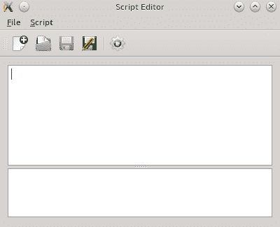
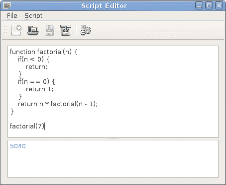
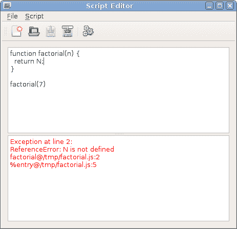
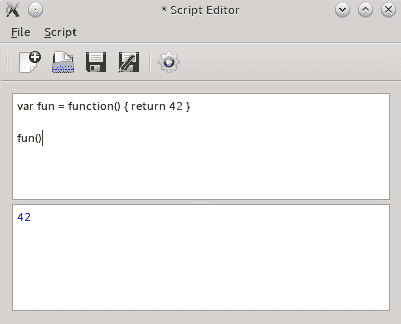
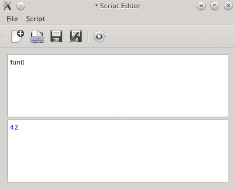
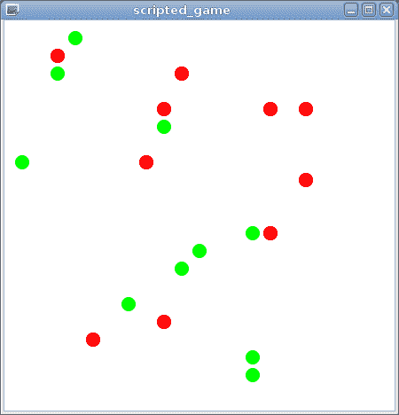
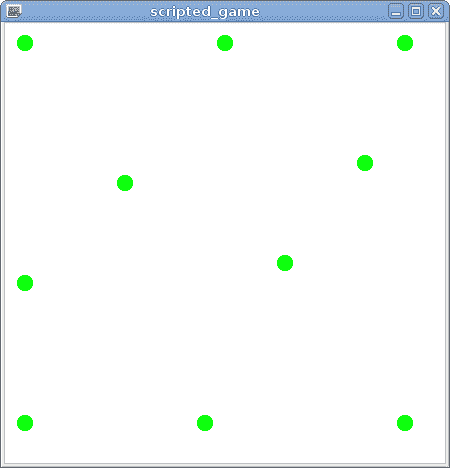

# 第十章：脚本

在本章中，你将学习如何将脚本功能引入你的程序。你将了解如何使用 JavaScript 来实现游戏逻辑和细节，而无需重新构建主游戏引擎。这些技能在本书的最后一部分也将非常有用，当我们与 Qt Quick 一起工作时。尽管我们将关注的最佳环境与 Qt 应用程序相融合，但如果你不喜欢 JavaScript，还有其他选择。我们还将展示如何使用 Python 使你的游戏可脚本化。

本章涵盖的主要主题如下：

+   执行 JavaScript 代码

+   C++与 JavaScript 之间的交互

+   实现脚本游戏

+   集成 Python 解释器

# 为什么使用脚本？

你可能会问自己，“如果我可以使用 C++实现所有需要的功能，为什么还要使用任何脚本语言”？为你的游戏提供脚本环境有许多好处。大多数现代游戏实际上由两部分组成。一部分是主游戏引擎，它实现了游戏的核心（数据结构、处理算法和渲染层），并向其他组件提供了一个 API，该组件提供游戏的具体细节、行为模式和动作流程。这个其他组件有时是用脚本语言编写的。这种做法的主要好处是，故事设计师可以独立于引擎开发者工作，他们不需要重建整个游戏，只需修改一些参数或检查新的任务是否与现有故事很好地融合。这使得开发速度比单一方法快得多。

另一个好处是，这为游戏开启了模组化——熟练的最终用户可以扩展或修改游戏，为游戏提供一些附加价值。这也是在不重新部署整个游戏二进制文件到每个玩家的情况下，在现有的脚本 API 之上实现游戏扩展的一种方式。最后，你可以重用相同的游戏驱动程序为其他游戏服务，只需替换脚本即可获得一个完全不同的产品。

在本章中，我们将使用 Qt QML 模块来实现脚本。此模块实现了 Qt Quick 中使用的 QML 语言。由于 QML 是基于 JavaScript 的，Qt QML 包含一个 JavaScript 引擎，并提供运行 JavaScript 代码的 API。它还允许你将 C++对象暴露给 JavaScript，反之亦然。

我们将不会讨论 JavaScript 语言本身的细节，因为有许多优秀的书籍和网站可供学习 JavaScript。此外，JavaScript 的语法与 C 语言非常相似，即使你之前没有见过任何 JavaScript 代码，也应该没有问题理解我们在这章中使用的脚本。

# 评估 JavaScript 表达式

要在程序中使用 Qt QML，你必须通过在项目文件中添加`QT += qml`行来为你的项目启用脚本模块。

C++编译器不理解 JavaScript。因此，要执行任何脚本，你需要有一个正在运行的解释器，该解释器将解析脚本并评估它。在 Qt 中，这是通过`QJSEngine`类完成的。这是一个 JavaScript 运行时，负责执行脚本代码并管理所有与脚本相关的资源。它提供了`evaluate()`方法，可以用来执行 JavaScript 表达式。让我们看看使用`QJSEngine`的“Hello World”程序：

```cpp
#include <QCoreApplication>
#include <QJSEngine>

int main(int argc, char **argv) {
    QCoreApplication app(argc, argv);
    QJSEngine engine;
    engine.installExtensions(QJSEngine::ConsoleExtension);
    engine.evaluate("console.log('Hello World!');");
    return 0;
} 
```

此程序非常简单。首先，它创建一个应用程序对象，这对于脚本环境正常工作来说是必需的，并实例化一个`QJSEngine`对象。接下来，我们要求`QJSEngine`安装控制台扩展——一个全局的`console`对象，可以用来向控制台打印消息。它不是 ECMAScript 标准的一部分，因此默认情况下不可用，但我们可以通过使用`installExtensions()`函数轻松启用它。最后，我们调用`evaluate()`函数来执行作为参数传递给它的脚本源代码。构建并运行程序后，你将在控制台看到带有`js:`前缀的熟悉的`Hello World!`。

默认情况下，`QJSEngine`提供了由 ECMA-262 标准定义的内置对象，包括`Math`、`Date`和`String`。例如，一个脚本可以使用`Math.abs(x)`来获取一个数字的绝对值。

如果你没有获得任何输出，这可能意味着脚本没有正确执行，可能是由于脚本源代码中的错误。为了验证这一点，我们可以检查`evaluate()`函数返回的值：

```cpp
QJSValue result = engine.evaluate("console.log('Hello World!')");
if (result.isError()) {
    qDebug() << "JS error:" << result.toString();
}
```

此代码检查是否存在异常或语法错误，如果有，则显示相应的错误消息。例如，如果你在脚本源文本中省略了关闭的单引号并运行程序，将显示以下消息：

```cpp
JS error: "SyntaxError: Expected token `)'"
```

你可以看到`evaluate()`返回一个`QJSValue`。这是一种特殊类型，用于在 JavaScript 引擎和 C++世界之间交换数据。像`QVariant`一样，它可以持有多种原始类型（`boolean`、`integer`、`string`等）。然而，实际上它更强大，因为它可以持有指向 JavaScript 引擎中存在的 JavaScript 对象或函数的引用。复制一个`QJSValue`将产生另一个引用相同 JavaScript 对象的另一个对象。你可以使用`QJSValue`的成员函数与 C++中的对象交互。例如，你可以使用`property()`和`setProperty()`来操作对象的属性，使用`call()`来调用函数并获取作为另一个`QJSValue`返回的值。

在前面的例子中，`QJSEngine::evaluate()` 返回了一个 `Error` 对象。当 JavaScript 代码成功运行时，您可以在 C++ 代码中稍后使用返回的值。例如，脚本可以计算当生物被特定武器击中时造成的伤害量。修改我们的代码以使用脚本的输出非常简单。所需的所有操作只是存储 `evaluate()` 返回的值，然后它可以在代码的其他部分使用：

```cpp
QJSValue result = engine.evaluate("(7 + 8) / 2");
if (result.isError()) {
    //...
} else {
    qDebug() << result.toNumber();
}
```

# 行动时间 – 创建 JavaScript 编辑器

让我们做一个简单的练习，创建一个图形编辑器来编写和执行脚本。首先创建一个新的 Qt Widgets 项目，并实现一个由两个纯文本编辑小部件（`ui->codeEditor` 和 `ui->logWindow`）组成的窗口，这两个小部件通过垂直分隔符分开。其中一个编辑框将用作输入代码的编辑器，另一个将用作显示脚本结果的控制台。然后，向窗口添加菜单和工具栏，并创建打开（`ui->actionOpenDocument`）、保存（`ui->actionSaveDocument` 和 `ui->actionSaveDocumentAs`）、创建新文档（`ui->actionNewDocument`）、执行脚本（`ui->actionExecuteScript`）和退出应用程序（`ui->actionQuit`）的操作。请记住将它们添加到菜单和工具栏中。

因此，你应该会收到一个类似于以下截图的窗口：



将退出操作连接到 `QApplication::quit()` 插槽。然后，创建一个 `openDocument()` 插槽并将其连接到适当操作的 `triggered` 信号。在插槽中，使用 `QFileDialog::getOpenFileName()` 询问用户文档路径，如下所示：

```cpp
void MainWindow::openDocument()
{
    QString filePath = QFileDialog::getOpenFileName(
        this, tr("Open Document"),
        QDir::homePath(), tr("JavaScript Documents (*.js)"));
    if(filePath.isEmpty()) {
        return;
    }
    open(filePath);
}
```

以类似的方式实现新建、保存和另存为操作处理程序。最后，创建一个 `open(const QString &filePath)` 插槽，该插槽应读取文档并将其内容放入代码编辑器：

```cpp
void MainWindow::open(const QString &filePath)
{
    QFile file(filePath);
    if(!file.open(QFile::ReadOnly | QFile::Text)) {
        QMessageBox::critical(this, tr("Error"), tr("Can't open file."));
        return;
    }
    setWindowFilePath(filePath);
    ui->codeEditor->setPlainText(QString::fromUtf8(file.readAll()));
    ui->logWindow->clear();
}
```

`QWidget` 的 `windowFilePath` 属性可以用来将文件与窗口关联。当此属性被设置时，Qt 会自动调整窗口标题，甚至在 macOS 上添加代理图标，以便方便地访问文件。然后，您可以在与文件使用相关的操作中使用此属性——在保存文档时，您可以检查此属性是否为空，并要求用户提供文件名。然后，在创建新文档或用户为文档提供新路径时，您可以重置此属性。

在这个阶段，你应该能够运行程序，并使用它来创建脚本，在编辑器中保存和重新加载它们。

现在，为了执行脚本，向窗口类中添加一个 `QJSEngine m_engine` 成员变量。创建一个新的插槽，命名为 `run`，并将其连接到执行操作。在插槽的主体中放入以下代码：

```cpp
void MainWindow::run()
{
    ui->logWindow->clear();
    QTextCursor logCursor = ui->logWindow->textCursor();
    QString scriptSourceCode = ui->codeEditor->toPlainText();
    QJSValue result = m_engine.evaluate(scriptSourceCode, 
                                        windowFilePath());
    if(result.isError()) {
        QTextCharFormat errFormat;
        errFormat.setForeground(Qt::red);
        logCursor.insertText(tr("Exception at line %1:\n")
            .arg(result.property("lineNumber").toInt()), errFormat);
        logCursor.insertText(result.toString(), errFormat);
        logCursor.insertBlock();
        logCursor.insertText(result.property("stack").toString(), 
                             errFormat);
    } else {
        QTextCharFormat resultFormat;
        resultFormat.setForeground(Qt::blue);
        logCursor.insertText(result.toString(), resultFormat);
    }
}
```

编译并运行程序。为此，在编辑器中输入以下脚本：

```cpp
function factorial(n) {
    if(n < 0) {
        return;
    }
    if(n == 0) {
        return 1;
    }
    return n * factorial(n - 1);
}

factorial(7)
```

将脚本保存到名为 `factorial.js` 的文件中，然后运行它。你应该得到如下输出：



接下来，将脚本替换为以下内容：

```cpp
function factorial(n) {
    return N;
}

factorial(7) 
```

运行脚本应产生以下结果：



# 刚才发生了什么？

`run()`方法清除日志窗口并使用我们在本章前面学到的方法评估脚本。如果评估成功，它将在日志窗口中打印结果，这就是我们在上一节中看到的第一个截图所示的内容。

在第二次尝试中，我们在脚本中使用了一个不存在的变量，导致错误。评估此类代码会导致异常。除了报告实际错误外，我们还使用返回的`Error`对象的`lineNumber`属性来报告导致问题的行。接下来，我们显示错误对象的`stack`属性，它返回问题的回溯（函数调用堆栈），我们也在日志中打印出来。

# 全局对象状态

让我们尝试另一个脚本。以下代码定义了`fun`局部变量，它被分配了一个返回数字的匿名函数：

```cpp
var fun = function() {
    return 42;
}
```

然后，您可以像调用常规函数一样调用`fun()`，如下所示：



现在，让我们看看如果我们从脚本中删除`fun`的定义，但仍然保留调用会发生什么：



即使没有定义`fun`的含义，我们仍然得到相同的结果！这是因为任何在顶层作用域中的变量都成为全局对象的属性。全局对象的状态在`QJSEngine`存在期间被保留，所以`fun`变量将保持可用，直到它被覆盖或引擎被销毁。

为了防止用户意外地使用局部变量更改全局对象，我们可以将提供的代码包裹在一个匿名函数中：

```cpp
QString wrappedCode =
    QStringLiteral("(function() { %1\n})()").arg(scriptSourceCode);
QJSValue result = m_engine.evaluate(wrappedCode, windowFilePath());
```

在这种情况下，JavaScript 代码必须使用`return`语句实际上将值返回到编辑器：

```cpp
var fun = function() {
    return 42;
}
return fun();
```

移除`fun`变量初始化现在将导致错误：

```cpp
ReferenceError: fun is not defined
```

然而，移除`var`关键字将使变量成为全局并保留。恶意用户还可以破坏现有全局对象的属性。例如，评估`Math.floor = null;`将使内置的`Math.floor`函数在所有后续调用中不可用。

实际上并没有很好的方法来保护或重置全局对象。如果您担心恶意脚本，销毁并创建一个新的`QJSEngine`对象是最佳选择。如果您需要运行多个不允许相互干扰的脚本，您必须为每个脚本创建一个单独的`QJSEngine`。然而，在大多数应用程序中，这种沙箱化似乎是一种过度行为。

# 将 C++对象和函数暴露给 JavaScript 代码

到目前为止，我们只评估了一些可以充分利用内置 JavaScript 功能的独立脚本。现在，是时候学习如何在脚本中使用程序中的数据了。这是通过将不同类型的实体暴露给脚本和从脚本中实现的。

# 访问 C++ 对象的属性和方法

将 C++ 对象暴露给 JavaScript 代码的最简单方法就是利用 Qt 的元对象系统。`QJSEngine` 能够检查 `QObject` 实例并检测它们的属性和方法。要在脚本中使用它们，对象必须对脚本可见。使这一行为发生的最简单方法是将它添加到引擎的全局对象中。正如你所记得的，脚本引擎和 C++ 之间的所有数据交换都使用 `QJSValue` 类进行，因此我们首先需要为 C++ 对象获取一个 JS 值句柄：

```cpp
QJSEngine engine;
QPushButton *button = new QPushButton("Button");
// ...
QJSValue scriptButton = engine.newQObject(button);
engine.globalObject().setProperty("pushButton", scriptButton); 
```

`QJSEngine::newQObject()` 创建一个 JavaScript 对象，它封装了一个现有的 `QObject` 实例。然后我们将包装器设置为全局对象的属性，称为 `pushButton`。这使得按钮作为 JavaScript 对象在引擎的全局上下文中可用。所有使用 `Q_PROPERTY` 定义的属性都作为对象的属性可用，每个槽都可以作为该对象的方法访问。在 JavaScript 中，你将能够像这样使用 `pushButton` 对象：

```cpp
pushButton.text = 'My Scripted Button';
pushButton.checkable = true;
pushButton.setChecked(true);
pushButton.show();
```

Qt 槽传统上返回 `void`。技术上它们可以有任何返回类型，但 Qt 不会使用返回值，所以在大多数情况下，返回任何值都没有意义。相反，当你将 C++ 方法暴露给 JavaScript 引擎时，你通常希望返回一个值并在 JavaScript 中接收它。在这些情况下，你不应该创建槽，因为这会破坏约定。你应该使方法可调用。为此，将方法声明放在常规 `public` 范围内，并在其前面添加 `Q_INVOKABLE`：

```cpp
public:
    Q_INVOKABLE int myMethod();
```

此宏指示 **moc** 使此方法在元对象系统中可调用，以便 Qt 能够在运行时调用它。所有可调用的方法都会自动暴露给脚本。

# C++ 和 JavaScript 之间的数据类型转换

Qt 会自动将方法的参数和返回类型转换为它的 JavaScript 对应类型。支持的转换包括以下内容：

+   基本类型（`bool`、`int`、`double` 等）未经更改地暴露

+   Qt 数据类型（`QString`、`QUrl`、`QColor`、`QFont`、`QDate`、`QPoint`、`QSize`、`QRect`、`QMatrix4x4`、`QQuaternion`、`QVector2D` 等）转换为具有可用属性的对象

+   `QDateTime` 和 `QTime` 值自动转换为 JavaScript `Date` 对象

+   使用 `Q_ENUM` 宏声明的枚举可以在 JavaScript 中使用

+   使用 `Q_FLAG` 宏声明的标志可以用作 JavaScript 中的标志

+   `QObject*` 指针将自动转换为 JavaScript 包装对象

+   包含任何支持类型的 `QVariant` 对象被识别

+   `QVariantList` 是一个具有任意项的 JavaScript 数组的等价物

+   `QVariantMap` 是具有任意属性的 JavaScript 对象的等效物

+   一些 C++ 列表类型（`QList<int>`, `QList<qreal>`, `QList<bool>`, `QList<QString>`, `QStringList`, `QList<QUrl>`, `QVector<int>`, `QVector<qreal>`, 和 `QVector<bool>`）在 JavaScript 中暴露，无需执行额外的数据转换

如果你需要更精细地控制数据类型转换，你可以简单地使用 `QJSValue` 作为参数类型或返回类型。例如，这将允许你返回现有 JavaScript 对象的引用，而不是每次都创建一个新的对象。这种方法对于创建或访问具有复杂结构的二维数组或其他对象也非常有用。虽然你可以使用嵌套的 `QVariantList` 或 `QVariantMap` 对象，但直接创建 `QJSValue` 对象可能更有效。

Qt 无法识别并自动转换自定义类型。尝试从 JavaScript 访问此类方法或属性将导致错误。你可以使用 `Q_GADGET` 宏使 C++ 数据类型对 JavaScript 可用，并使用 `Q_PROPERTY` 声明应公开的属性。

有关此主题的更多信息，请参阅 QML 和 C++ 之间数据类型转换文档页面。

# 在脚本中访问信号和槽

`QJSEngine` 还提供了使用信号和槽的能力。槽可以是 C++ 方法或 JavaScript 函数。连接可以在 C++ 或脚本中创建。

首先，让我们看看如何在脚本内部建立连接。当一个 `QObject` 实例暴露给脚本时，对象信号成为包装对象的属性。这些属性有一个 `connect` 方法，它接受一个函数对象，当信号被发射时将调用该对象。接收者可以是常规槽或 JavaScript 函数。最常见的情况是将信号连接到一个匿名函数：

```cpp
pushButton.toggled.connect(function() {
    console.log('button toggled!');
});
```

如果你需要撤销连接，你需要将函数存储在一个变量中：

```cpp
function buttonToggled() {
    //...
}
pushButton.toggled.connect(buttonToggled);
//...
pushButton.toggled.disconnect(buttonToggled);
```

你可以通过向 `connect()` 提供一个额外的参数来为函数定义 `this` 对象：

```cpp
var obj = { 'name': 'FooBar' };
pushButton.clicked.connect(obj, function() {
    console.log(this.name);
});
```

你还可以将信号连接到另一个暴露对象的信号或槽。要将名为 `pushButton` 的对象的 `clicked()` 信号连接到名为 `lineEdit` 的另一个对象的 `clear()` 槽，可以使用以下语句：

```cpp
pushButton.clicked.connect(lineEdit.clear);
```

在脚本内部发射信号也很简单——只需将信号作为函数调用，并传递任何必要的参数：

```cpp
pushButton.clicked();
spinBox.valueChanged(7);
```

要在 C++ 端创建接收器为 JavaScript 函数的信号-槽连接，你可以利用 C++ lambda 函数和 `QJSValue::call()` 函数：

```cpp
QJSValue func = engine.evaluate(
    "function(checked) { console.log('func', checked); }");
QObject::connect(&button, &QPushButton::clicked, func {
    QJSValue(func).call({ checked });
});
```

# 行动时间 – 使用 JavaScript 中的按钮

让我们把所有这些放在一起，构建一个可脚本化的按钮的完整示例：

```cpp
int main(int argc, char *argv[]) {
    QApplication app(argc, argv);
    QJSEngine engine;
    engine.installExtensions(QJSEngine::ConsoleExtension);
    QPushButton button;
    engine.globalObject().setProperty("pushButton", engine.newQObject(&button));
    QString script =
        "pushButton.text = 'My Scripted Button';\n"
        "pushButton.checkable = true;\n"
        "pushButton.setChecked(true);\n"
        "pushButton.toggled.connect(function(checked) {\n"
        "  console.log('button toggled!', checked);\n"
        "});\n"
        "pushButton.show();";
    engine.evaluate(script);

    QJSValue func = engine.evaluate(
          "function(checked) { console.log('button toggled 2!', checked); }");
    QObject::connect(&button, &QPushButton::clicked, func {
        QJSValue(func).call({ checked });
    });
    return app.exec();
}
```

在此代码中，我们将函数暴露给 JavaScript 并执行设置按钮某些属性和访问其`toggled`信号的代码。接下来，我们创建一个 JavaScript 函数，将其引用存储在`func`变量中，并从 C++侧将按钮的`toggled`信号连接到这个函数。

# 限制从 JavaScript 访问 C++类

有时候，你可能想为类提供一个丰富的接口，以便从 C++内部轻松地操作它，但同时又想严格控制使用脚本可以执行的操作，因此你想阻止脚本编写者使用类的一些属性或方法。

最安全的做法是创建一个只暴露允许的方法和信号的包装器类。这将允许你自由地设计你的原始类。例如，如果你想隐藏某些方法，这相当简单——只需不要将它们作为槽函数，也不要用`Q_INVOKABLE`声明它们。然而，你可能希望在内部实现中将它们作为槽函数。通过创建包装器类，你可以轻松地将内部类的槽函数隐藏起来，使其无法被 JavaScript 代码访问。我们将在本章后面展示如何应用这种方法。

如果你的内部对象使用的数据类型不能直接暴露给 JavaScript，可能会出现另一个问题。例如，如果你的某个方法返回一个`QVector<QVector<int>>`，你将无法直接从 JavaScript 调用此方法。包装器类是放置所需数据转换操作的好地方。

你还应该意识到，JavaScript 代码可以发出暴露的 C++对象的任何信号。在某些情况下，这可能会破坏你应用程序的逻辑。如果你使用包装器，你只需将内部类的信号连接到暴露的包装器的信号。脚本将能够连接到包装器的信号，但无法发出原始信号。然而，脚本将能够发出包装器的信号，这可能会影响引擎中所有其他 JavaScript 代码。

如果类的所有或几乎所有 API 都安全地暴露给 JavaScript，那么直接使对象本身可用，而不是创建包装器，会更容易。如果你想限制对某些方法的访问，请记住，JavaScript 代码只能访问用`Q_INVOKABLE`声明的公共和受保护方法以及槽函数。记住，如果你使用接受函数指针作为参数的`connect()`变体，你仍然可以将信号连接到非槽方法。JavaScript 代码也无法访问任何私有方法。

对于属性，你可以在`Q_PROPERTY`声明中使用`SCRIPTABLE`关键字来标记它们不被脚本访问。默认情况下，所有属性都是可脚本化的，但你可以通过将`SCRIPTABLE`设置为`false`来禁止它们被脚本暴露，如下面的示例所示：

```cpp
Q_PROPERTY(QString internalName READ internalName SCRIPTABLE false) 
```

# 从 JavaScript 创建 C++对象

我们到目前为止只暴露了现有的 C++对象给 JavaScript，但如果你想在 JavaScript 中创建一个新的 C++对象怎么办？你可以使用你已知的知识来做这件事。一个已暴露对象的 C++方法可以为你创建一个新的对象：

```cpp
public:
    Q_INVOKABLE QObject* createMyObject(int argument) {
        return new MyObject(argument);
    }
```

在函数签名中，我们使用`QObject*`而不是`MyObject*`。这允许我们自动将对象导入 JS 引擎。当 JavaScript 中没有更多引用时，引擎将接管对象并删除它。

使用这种方法从 JavaScript 中调用也是相当直接的：

```cpp
var newObject = originalObject.createMyObject(42);
newObject.slot1();
```

如果你有合适的`createMyObject`函数位置，这种方法是可行的。然而，有时你想要独立于现有对象创建新对象，或者你还没有创建任何对象。对于这些情况，有一种巧妙的方法可以将类的构造函数暴露给 JavaScript 引擎。首先，你需要使类声明中的构造函数可调用：

```cpp
public:
    Q_INVOKABLE explicit MyObject(int argument, QObject *parent = nullptr);
```

然后，你应该使用`newQMetaObject()`函数将类的*元对象*导入到引擎中。你可以立即将导入的元对象分配给全局对象的属性：

```cpp
engine.globalObject().setProperty("MyObject",
     engine.newQMetaObject(&MyObject::staticMetaObject));
```

现在，你可以通过使用`new`关键字调用暴露的对象来调用构造函数：

```cpp
var newObject = new MyObject(42);
newObject.slot1();
```

# 将 C++函数暴露给 JavaScript

有时候你只想提供一个函数而不是一个对象。不幸的是，`QJSEngine`只支持属于`QObject`派生类的函数。然而，我们可以从 JavaScript 方面隐藏这个实现细节。首先，创建`QObject`的一个子类并添加一个可调用的成员函数，该函数代理原始独立函数：

```cpp
Q_INVOKABLE double factorial(int x) {
    return superFastFactorial(x);
}
```

接下来，使用`newQObject()`函数像往常一样暴露包装对象。然而，不要将此对象分配给全局对象的属性，而是从对象中提取`factorial`属性：

```cpp
QJSValue myObjectJS = engine.newQObject(new MyObject());
engine.globalObject().setProperty("factorial",
                                  myObjectJS.property("factorial"));
```

现在，JavaScript 代码可以像访问全局函数一样访问方法，例如`factorial(4)`。

# 创建一个 JavaScript 脚本游戏

让我们通过实现一个允许玩家使用 JavaScript 的游戏来完善我们的技能。规则很简单。每个玩家在棋盘上都有一些实体移动。所有实体轮流移动；在每一轮中，实体可以静止不动或移动到相邻的方格（直线或对角线）。如果一个实体移动到另一个实体占据的方格，那个实体就会被杀死并从棋盘上移除。

游戏开始时，所有实体都随机放置在棋盘上。以下图像显示了起始位置的示例：



每个玩家必须提供一个 JavaScript 函数，该函数接收一个实体对象并返回其新位置。当玩家的某个实体应该移动时，将调用此函数。此外，玩家还可以提供一个初始化函数，该函数将在游戏开始时被调用。棋盘的状态和其上的实体将通过全局 JavaScript 对象的一个属性公开。

在我们的游戏中，玩家将竞争创建最佳的生存策略。一旦游戏开始，玩家就无法控制实体，提供的 JavaScript 函数必须考虑到任何可能的游戏情况。当棋盘上只剩下一个玩家的实体时，该玩家获胜。规则允许任何数量的玩家参与，尽管在我们的示例中我们只有两个玩家。

# 行动时间 – 实现游戏引擎

我们将使用图形视图框架来实现棋盘可视化。由于本章重点在于脚本编写，我们将不对实现细节进行过多介绍。你在第四章，*使用图形视图的定制 2D 图形*中学到的基本技能应该足够你实现这个游戏。本书提供了这个示例的完整代码。然而，我们将突出展示项目的架构，并简要描述其工作原理。

游戏引擎的实现包括两个类：

+   `Scene`类（由`QGraphicsScene`派生）管理图形场景，创建项目，并实现通用游戏逻辑

+   `Entity`类（由`QGraphicsEllipseItem`派生）代表棋盘上的单个游戏实体

每个`Entity`对象是一个半径为 0.4 且中心为(0, 0)的圆。它是在构造函数中初始化的，使用以下代码：

```cpp
setRect(-0.4, -0.4, 0.8, 0.8);
setPen(Qt::NoPen);
```

我们将使用`pos`属性（从`QGraphicsItem`继承）来移动棋盘上的圆。棋盘的瓦片将具有单位大小，因此我们可以将`pos`视为整数`QPoint`，而不是具有`double`坐标的`QPointF`。我们将放大图形视图以实现实体所需的可见大小。

`Entity`类有两个具有获取器和设置器的特殊属性。`team`属性是该实体所属玩家的编号。此属性还定义了圆的颜色：

```cpp
void Entity::setTeam(int team) {
    m_team = team;
    QColor color;
    switch(team) {
    case 0:
        color = Qt::green;
        break;
    case 1:
        color = Qt::red;
        break;
    }
    setBrush(color);
}
```

`alive`标志指示实体是否仍在游戏中。为了简单起见，我们不会立即删除被杀死的实体对象，而是将其隐藏：

```cpp
void Entity::setAlive(bool alive)
{
    m_alive = alive;
    setVisible(alive);
    //...
}
```

让我们把注意力转向`Scene`类。首先，它定义了一些游戏配置选项：

+   `fieldSize`属性确定棋盘的二维大小

+   `teamSize`属性确定每个玩家在游戏开始时拥有的实体数量

+   `stepDuration`属性确定执行下一轮回合之间经过的毫秒数

`fieldSize` 属性的设置器调整场景矩形，以便在游戏开始时正确调整图形视图的大小：

```cpp
void Scene::setFieldSize(const QSize &fieldSize)
{
    m_fieldSize = fieldSize;
    setSceneRect(-1, -1,
                 m_fieldSize.width() + 2,
                 m_fieldSize.height() + 2);
}
```

每一轮游戏的执行将在 `step()` 函数中完成。在构造函数中，我们初始化一个负责调用此函数的 `QTimer` 对象：

```cpp
m_stepTimer = new QTimer(this);
connect(m_stepTimer, &QTimer::timeout,
        this, &Scene::step);
m_stepTimer->setInterval(1000);
```

在 `setStepDuration()` 函数中，我们简单地改变这个计时器的间隔。

`Scene` 类的 `QVector<Entity*> m_entities` 私有字段将包含所有在游戏中运行的实体。游戏通过调用 `start()` 函数开始。让我们看看它：

```cpp
void Scene::start() {
    const int TEAM_COUNT = 2;
    for(int i = 0; i < m_teamSize; i++) {
        for(int team = 0; team < TEAM_COUNT; team++) {
            Entity* entity = new Entity(this);
            entity->setTeam(team);
            QPoint pos;
            do {
                pos.setX(qrand() % m_fieldSize.width());
                pos.setY(qrand() % m_fieldSize.height());
            } while(itemAt(pos, QTransform()));
            entity->setPos(pos);
            addItem(entity);
            m_entities << entity;
        }
    }
    //...
    m_stepTimer->start();
}
```

我们为每个团队创建所需数量的实体，并将它们随机放置在棋盘上的位置。如果我们恰好选择了一个已被占用的位置，我们将进入 `do`-`while` 循环的下一个迭代并选择另一个位置。接下来，我们将新项目添加到场景和 `m_entities` 向量中。最后，我们开始计时器，以便 `step()` 函数能定期被调用。

在 `main()` 函数中，我们初始化随机数生成器，因为我们希望每次都能得到新的随机数：

```cpp
qsrand(QDateTime::currentMSecsSinceEpoch());
```

然后，我们创建并初始化 `Scene` 对象，并创建一个 `QGraphicsView` 来显示我们的场景。

游戏引擎几乎准备好了。我们只需要实现脚本。

# 行动时间 - 将游戏状态暴露给 JS 引擎

在执行玩家的脚本之前，我们需要创建一个 `QJSEngine` 并向其全局对象中插入一些信息。脚本将使用这些信息来决定最佳移动。

首先，我们将 `QJSEngine m_jsEngine` 私有字段添加到 `Scene` 类中。接下来，我们创建一个新的 `SceneProxy` 类，并从 `QObject` 派生它。这个类将向脚本暴露 `Scene` 的允许 API。我们将 `Scene` 对象的指针传递给 `SceneProxy` 对象的构造函数，并将其存储在一个私有变量中：

```cpp
SceneProxy::SceneProxy(Scene *scene) :
    QObject(scene), m_scene(scene)
{
}
```

向类声明中添加两个可调用方法：

```cpp
Q_INVOKABLE QSize size() const;
Q_INVOKABLE QJSValue entities() const;
```

`size()` 函数的实现相当简单：

```cpp
QSize SceneProxy::size() const {
    return m_scene->fieldSize();
}
```

然而，`entities()` 函数有点复杂。我们不能将 `Entity` 对象添加到 JS 引擎中，因为它们不是基于 `QObject` 的。即使我们可以，我们也更喜欢为实体创建一个代理类。

让我们立即这样做。创建 `EntityProxy` 类，从 `QObject` 派生它，并将底层 `Entity` 对象的指针传递给构造函数，就像我们在 `SceneProxy` 中做的那样。在新的类中声明两个可调用函数和一个信号：

```cpp
class EntityProxy : public QObject
{
    Q_OBJECT
public:
    explicit EntityProxy(Entity *entity, QObject *parent = nullptr);
    Q_INVOKABLE int team() const;
    Q_INVOKABLE QPoint pos() const;
    //...
signals:
    void killed();
private:
    Entity *m_entity;
};
```

方法的实现只是将调用转发到底层的 `Entity` 对象：

```cpp
int EntityProxy::team() const
{
    return m_entity->team();
}

QPoint EntityProxy::pos() const
{
    return m_entity->pos().toPoint();
}
```

`Entity` 类将负责创建自己的代理对象。向 `Entity` 类添加以下私有字段：

```cpp
EntityProxy *m_proxy;
QJSValue m_proxyValue;
```

`m_proxy` 字段将保存代理对象。`m_proxyValue` 字段将包含添加到 JS 引擎的同一对象的引用。在构造函数中初始化这些字段：

```cpp
m_proxy = new EntityProxy(this, scene);
m_proxyValue = scene->jsEngine()->newQObject(m_proxy);
```

我们修改 `Entity::setAlive()` 函数，当实体被杀死时发出 `killed()` 信号：

```cpp
void Entity::setAlive(bool alive)
{
    m_alive = alive;
    setVisible(alive);
    if (!alive) {
        emit m_proxy->killed();
    }
}
```

通常认为，从拥有该信号类的外部发出信号是不良实践。如果信号的来源是另一个基于 `QObject` 的类，你应该在那个类中创建一个单独的信号并将其连接到目标信号。在我们的情况下，我们无法这样做，因为 `Entity` 不是一个 `QObject`，所以我们选择直接发出信号以避免进一步的复杂化。

为这些字段创建 `proxy()` 和 `proxyValue()` 获取器。我们现在可以回到 `SceneProxy` 的实现并使用实体代理：

```cpp
QJSValue SceneProxy::entities() const
{
    QJSValue list = m_scene->jsEngine()->newArray();
    int arrayIndex = 0;
    for(Entity *entity: m_scene->entities()) {
        if (entity->isAlive()) {
            list.setProperty(arrayIndex, entity->proxyValue());
            arrayIndex++;
        }
    }
    return list;
}
```

# 刚才发生了什么？

首先，我们要求 JS 引擎创建一个新的 JavaScript 数组对象。然后，我们遍历所有实体并跳过已死亡的实体。我们使用 `QJSValue::setProperty` 将每个实体的代理对象添加到数组中。我们需要指定新数组项的索引，因此我们创建 `arrayIndex` 计数器并在每次插入后递增。最后，我们返回数组。

此函数完成了 `SceneProxy` 类的实现。我们只需要在 `Scene` 类的构造函数中创建一个代理对象并将其添加到 JS 引擎中：

```cpp
SceneProxy *sceneProxy = new SceneProxy(this);
m_sceneProxyValue = m_jsEngine.newQObject(sceneProxy);
```

# 行动时间 – 加载用户提供的脚本

每个玩家将提供他们自己的策略脚本，因此 `Scene` 类应该有一个字段来存储所有提供的脚本：

```cpp
QHash<int, QJSValue> m_teamScripts;
```

让我们提供 `setScript()` 函数，该函数接受玩家的脚本并将其加载到 JS 引擎中：

```cpp
void Scene::setScript(int team, const QString &script) {
    QJSValue value = m_jsEngine.evaluate(script);
    if (value.isError()) {
        qDebug() << "js error: " << value.toString();
        return;
    }
    if(!value.isObject()) {
        qDebug() << "script must return an object";
        return;
    }
    m_teamScripts[team] = value;
}
```

在此函数中，我们尝试评估提供的代码。如果代码返回了一个 JavaScript 对象，我们将它放入 `m_teamScripts` 哈希表中。我们期望提供的对象包含一个 `step` 属性，该属性包含决定实体移动的函数。该对象可能还包含一个 `init` 属性，该属性将在游戏开始时执行。

在 `main()` 函数中，我们从项目的资源中加载脚本：

```cpp
scene.setScript(0, loadFile(":/scripts/1.js"));
scene.setScript(1, loadFile(":/scripts/2.js"));
```

`loadFile()` 辅助函数简单地加载文件内容到 `QString`：

```cpp
QString loadFile(const QString& path) {
    QFile file(path);
    if (!file.open(QFile::ReadOnly)) {
        qDebug() << "failed to open " << path;
        return QString();
    }
    return QString::fromUtf8(file.readAll());
}
```

如果你想允许用户提供他们的脚本而无需重新编译项目，你可以从命令行参数接受脚本文件：

```cpp
QStringList arguments = app.arguments();
if (arguments.count() < 3) {
    qDebug() << "usage: " << argv[0] << " path/to/script1.js path/to/script2.js";
    return 1;
}
scene.setScript(0, loadFile(arguments[1]));
scene.setScript(1, loadFile(arguments[2]));
```

要设置项目的命令行参数，切换到项目面板，在左侧列中选择运行，并定位命令行参数输入框。提供的项目在 `scripts` 子目录中包含两个示例脚本。

# 行动时间 – 执行策略脚本

首先，我们需要检查玩家是否提供了一个 `init` 函数并执行它。我们将在 `Scene::start()` 函数中这样做：

```cpp
for(int team = 0; team < TEAM_COUNT; team++) {
    QJSValue script = m_teamScripts.value(team);
    if (script.isUndefined()) {
        continue;
    }
    if (!script.hasProperty("init")) {
        continue;
    }
    m_jsEngine.globalObject().setProperty("field", m_sceneProxyValue);
    QJSValue scriptOutput = script.property("init").call();
    if (scriptOutput.isError()) {
        qDebug() << "script error: " << scriptOutput.toString();
        continue;
    }
}
```

在此代码中，我们使用 `isUndefined()` 来检查代码是否已提供并成功解析。接下来，我们使用 `hasProperty()` 来检查返回的对象是否包含可选的 `init` 函数。如果我们找到了它，我们将使用 `QJSValue::call()` 来执行它。我们通过将我们的 `SceneProxy` 实例分配给全局对象的 `field` 属性来提供有关板的信息。

最激动人心的部分是`step()`函数，它实现了实际的游戏执行。让我们看看它：

```cpp
void Scene::step() {
    for(Entity* entity: m_entities) {
        if (!entity->isAlive()) {
            continue;
        }
        QJSValue script = m_teamScripts.value(entity->team());
        if (script.isUndefined()) {
            continue;
        }
        m_jsEngine.globalObject().setProperty("field", m_sceneProxyValue);

        QJSValue scriptOutput =
            script.property("step").call({ entity->proxyValue() });
        //...
    }
}
```

首先，我们遍历所有实体并跳过已死亡的实体。接下来，我们使用`Entity::team()`来确定这个实体属于哪个玩家。我们从`m_teamScripts`字段中提取相应的策略脚本，并从中提取`step`属性。然后，我们尝试将其作为函数调用，并将当前实体的代理对象作为参数传递。让我们看看我们对脚本输出的处理：

```cpp
if (scriptOutput.isError()) {
    qDebug() << "script error: " << scriptOutput.toString();
    continue;
}
QJSValue scriptOutputX = scriptOutput.property("x");
QJSValue scriptOutputY = scriptOutput.property("y");
if (!scriptOutputX.isNumber() || !scriptOutputY.isNumber()) {
    qDebug() << "invalid script output: " << scriptOutput.toVariant();
    continue;
}
QPoint pos(scriptOutputX.toInt(), scriptOutputY.toInt());
if (!moveEntity(entity, pos)) {
    qDebug() << "invalid move";
}
```

我们尝试将函数的返回值解释为一个具有`x`和`y`属性的对象。如果这两个属性都包含数字，我们就从它们中构建一个`QPoint`，并调用我们的`moveEntity()`函数，该函数尝试执行策略选择的移动。

我们不会盲目地相信用户脚本返回的值。相反，我们仔细检查移动是否有效：

```cpp
bool Scene::moveEntity(Entity *entity, QPoint pos) {
    if (pos.x() < 0 || pos.y() < 0 ||
        pos.x() >= m_fieldSize.width() ||
        pos.y() >= m_fieldSize.height())
    {
        return false; // out of field bounds
    }
    QPoint posChange = entity->pos().toPoint() - pos;
    if (posChange.isNull()) {
        return true; // no change
    }
    if (qAbs(posChange.x()) > 1 || qAbs(posChange.y()) > 1) {
        return false; // invalid move
    }
    QGraphicsItem* item = itemAt(pos, QTransform());
    Entity* otherEntity = qgraphicsitem_cast<Entity*>(item);
    if (otherEntity) {
        otherEntity->setAlive(false);
    }
    entity->setPos(pos);
    return true;
}
```

我们检查新位置是否在范围内，并且是否离实体的当前位置不远。如果一切正常，我们执行移动。如果目的地格子上已经有另一个实体，我们将其标记为已死亡。如果移动成功，函数返回`true`。

那就结束了！我们的游戏已经准备好运行。让我们创建一些策略脚本来进行游戏。

# 行动时间 - 编写策略脚本

我们的第一脚本将简单地选择一个随机移动：

```cpp
{
    "step": function(current) {
        function getRandomInt(min, max) {
          return Math.floor(Math.random() * (max - min)) + min;
        }
        return {
            x: current.pos().x + getRandomInt(-1, 2),
            y: current.pos().y + getRandomInt(-1, 2),
        }
    }
}
```

当然，一个更智能的策略可以击败这个脚本。你可以在代码包中找到一个更高级的脚本。首先，当它看到附近的敌人实体时，它总是试图杀死它。如果没有这样的敌人，它试图远离最近的盟友，试图填满整个棋盘。这个脚本将轻易地消灭随机移动的敌人：



当然，总有改进的空间。试着想出一个更好的策略，并编写一个可以赢得游戏的脚本。

# 尝试一下英雄 - 扩展游戏

有几种方法可以改进游戏实现。例如，你可以检测玩家何时获胜并显示一个弹出消息。你也可以允许任意数量的玩家。你只需要将`TEAM_COUNT`常量替换为`Scene`类中的一个新属性，并定义更多的团队颜色。你甚至可以为用户提供一个 GUI，让他们提供脚本而不是作为命令行参数传递。

脚本环境也可以得到改进。你可以提供更多的辅助函数（例如，计算两个格子之间距离的函数）来使创建脚本更容易。另一方面，你可以修改规则并减少可用的信息量，例如，每个实体只能看到一定距离内的其他实体。

如前所述，每个脚本都有方法来破坏全局对象或发出暴露的 C++对象信号，从而影响其他玩家。为了防止这种情况，你可以为每个玩家创建一个单独的`QJSEngine`和一组单独的代理对象，从而有效地隔离它们。

# Python 脚本

Qt QML 是一个设计为 Qt 世界一部分的环境。由于并非每个人都了解或喜欢 JavaScript，我们将介绍另一种可以轻松用于为使用 Qt 创建的游戏提供脚本环境的语言。只需注意，这不会是环境的深入描述——我们只会展示可以为您自己的研究提供基础的基本知识。

用于脚本的一种流行语言是 Python。Python 有两种针对 Python 的 Qt 绑定可用：PySide2 和 PyQt。PySide2 是在 LGPL 下可用的官方绑定。PyQt 是一个在 GPL v3 和商业许可证下可用的第三方库。

PyQt 不在 LGPL 许可下可用，因此对于商业闭源产品，您需要从 Riverbank computing 获得商业许可证！

这些绑定允许您在 Python 中使用 Qt API——您可以使用 Python 编写完整的 Qt 应用程序。然而，要从 C++ 中调用 Python 代码，您将需要一个常规的 Python 解释器。幸运的是，在 C++ 应用程序中嵌入这样的解释器非常简单。

首先，您需要安装 Python，以及其开发包。例如，对于基于 Debian 的系统，最简单的方法是简单地安装 `libpythonX.Y-dev` 包，其中 `X.Y` 代表存储库中可用的 Python 版本：

```cpp
sudo apt-get install libpython3.5-dev
```

在我们的示例中，我们将使用 Python 3.5，但稍后的较小版本也应与我们的代码兼容。

然后，您需要告诉 qmake 将您的程序链接到库。对于 Linux，您可以使用 `pkgconfig` 自动完成此操作：

```cpp
CONFIG += link_pkgconfig no_keywords
# adjust the version number to suit your needs
PKGCONFIG += python-3.5m
```

`no_keywords` 配置选项告诉构建系统禁用 Qt 特定的关键字（`signals`、`slots` 和 `emit`）。我们必须这样做，因为 Python 头文件使用 `slots` 标识符，这会与相同的 Qt 关键字冲突。如果您将它们写成 `Q_SIGNALS`、`Q_SLOTS` 和 `Q_EMIT`，您仍然可以访问 Qt 关键字。

对于 Windows，您需要手动将信息传递给编译器：

```cpp
CONFIG += no_keywords
INCLUDEPATH += C:\Python35\include
LIBS += -LC:\Python35\include -lpython35
```

要从 Qt 应用程序中调用 Python 代码，最简单的方法是使用以下代码：

```cpp
#include <Python.h>
#include <QtCore>

int main(int argc, char **argv) {
    QCoreApplication app(argc, argv);
    Py_Initialize();
    const char *script = "print(\"Hello from Python\")";
    PyRun_SimpleString(script);
    Py_Finalize();
    return app.exec();
} 
```

此代码初始化一个 Python 解释器，然后通过直接传递字符串来调用脚本，最后在调用 Qt 的事件循环之前关闭解释器。这样的代码只适用于简单的脚本。在现实生活中，您可能希望将一些数据传递给脚本或获取结果。为此，我们需要编写更多的代码。由于库仅公开 C API，让我们为它编写一个漂亮的 Qt 包装器。

# 行动时间 – 为嵌入 Python 编写 Qt 包装器

作为第一个任务，我们将使用面向对象的 API 实现最后一个程序。创建一个新的控制台项目，并向其中添加以下类：

```cpp
class QtPython : public QObject {
    Q_OBJECT
public:
    QtPython(QObject *parent = 0);
    ~QtPython();
    void run(const QString &program);

private:
    QVector<wchar_t> programNameBuffer;
};
```

实现文件应如下所示：

```cpp
#include <Python.h>
//...
QtPython::QtPython(QObject *parent) : QObject(parent) {
    QStringList args = qApp->arguments();
    if (args.count() > 0) {
        programNameBuffer.resize(args[0].count());
        args[0].toWCharArray(programNameBuffer.data());
        Py_SetProgramName(programNameBuffer.data());
    }
    Py_InitializeEx(0);
}

QtPython::~QtPython() {
    Py_Finalize();
}

void QtPython::run(const QString &program) {
    PyRun_SimpleString(qPrintable(program));
}
```

然后，添加一个 `main()` 函数，如下面的代码片段所示：

```cpp
int main(int argc, char *argv[])
{
    QCoreApplication app(argc, argv);
    QtPython python;
    python.run("print('Hello from Python')");
    return 0;
}
```

最后，打开 `.pro` 文件，并告诉 Qt 将其链接到 Python 库，如之前所示。

# 刚才发生了什么？

我们创建了一个名为 `QtPython` 的类，它为我们封装了 Python C API。

永远不要使用 `Q` 前缀来调用你的自定义类，因为这个前缀是为官方 Qt 类保留的。这是为了确保你的代码永远不会与 Qt 中添加的未来代码发生名称冲突。另一方面，Qt 前缀是用来与 Qt 的扩展类一起使用的。你可能仍然不应该使用它，但名称冲突的概率要小得多，并且影响也小于与官方类的冲突。最好想出一个特定于应用程序的前缀或使用命名空间。

类构造函数创建了一个 Python 解释器，而类析构函数则销毁它。我们使用 `Py_InitializeEx(0)`，它具有与 `Py_Initialize()` 相同的功能，但它不会应用 C 信号处理器，因为在嵌入 Python 时我们并不希望这样做。在此之前，我们使用 `Py_SetProgramName()` 通知解释器我们的上下文。我们还定义了一个 `run()` 方法，它接受 `QString` 并返回 `void`。它使用 `qPrintable()`，这是一个便利函数，可以从 `QString` 对象中提取一个 C 字符串指针，然后将其输入到 `PyRun_SimpleString()`。

永远不要存储 `qPrintable()` 的输出，因为它返回一个指向临时字节数组的内部指针（这相当于在字符串上调用 `toLocal8Bit().constData()`）。它可以安全地直接使用，但字节数组随后立即被销毁；因此，如果你将指针存储在变量中，当你在稍后尝试使用该指针时，数据可能不再有效。

使用嵌入式解释器时最困难的工作是将值在 C++ 和解释器期望的类型之间进行转换。在 Qt Script 中，使用了 `QScriptValue` 类型来完成这项工作。我们可以为我们自己的 Python 脚本环境实现类似的功能。

# 是时候进行数据在 C++ 和 Python 之间的转换操作了

创建一个新的类并命名为 `QtPythonValue`：

```cpp
class QtPythonValue {
public:
    QtPythonValue();
    QtPythonValue(const QtPythonValue &other);
    QtPythonValue& operator=(const QtPythonValue &other);

    QtPythonValue(int val);
    QtPythonValue(const QString &str);
    ~QtPythonValue();

    int toInt() const;
    QString toString() const;
    bool isNone() const;

private:
    QtPythonValue(PyObject *ptr);
    void incRef();
    void incRef(PyObject *val);
    void decRef();

    PyObject *m_value;
    friend class QtPython;
};
```

接下来，实现构造函数、赋值运算符和析构函数，如下所示：

```cpp
QtPythonValue::QtPythonValue() {
    incRef(Py_None);
}
QtPythonValue::QtPythonValue(const QtPythonValue &other) {
    incRef(other.m_value);
}
QtPythonValue::QtPythonValue(PyObject *ptr) {
    m_value = ptr;
}
QtPythonValue::QtPythonValue(const QString &str) {
    m_value = PyUnicode_FromString(qPrintable(str));
}
QtPythonValue::QtPythonValue(int val) {
    m_value = PyLong_FromLong(val);
}
QtPythonValue &QtPythonValue::operator=(const QtPythonValue &other) {
    if(m_value == other.m_value) {
        return *this;
    }
    decRef();
    incRef(other.m_value);
    return *this;
}
QtPythonValue::~QtPythonValue()
{
    decRef();
}
```

然后，实现 `incRef()` 和 `decRef()` 函数：

```cpp
void QtPythonValue::incRef(PyObject *val) {
    m_value = val;
    incRef();
}
void QtPythonValue::incRef() {
    if(m_value) {
        Py_INCREF(m_value);
    }
}
void QtPythonValue::decRef() {
    if(m_value) {
        Py_DECREF(m_value);
    }
}
```

接下来，实现从 `QtPythonValue` 到 C++ 类型的转换：

```cpp
int QtPythonValue::toInt() const {
    return PyLong_Check(m_value) ? PyLong_AsLong(m_value) : 0;
}

QString QtPythonValue::toString() const {
    return PyUnicode_Check(m_value) ?
        QString::fromUtf8(PyUnicode_AsUTF8(m_value)) : QString();
}

bool QtPythonValue::isNone() const {
    return m_value == Py_None;
}
```

最后，让我们修改 `main()` 函数以测试我们的新代码：

```cpp
int main(int argc, char *argv[]) {
    QCoreApplication app(argc, argv);
    QtPython python;
    QtPythonValue integer = 7, string = QStringLiteral("foobar"), none;
    qDebug() << integer.toInt() << string.toString() << none.isNone();
    return 0;
} 
```

当你运行程序时，你会看到 C++ 和 Python 之间的转换在两个方向上都是正确的。

# 刚才发生了什么？

`QtPythonValue` 类封装了一个 `PyObject` 指针（通过 `m_value` 成员），提供了一个很好的接口，用于在解释器期望的类型和我们的 Qt 类型之间进行转换。让我们看看这是如何实现的。首先，看一下三个私有方法：两个版本的 `incRef()` 和一个 `decRef()`。`PyObject` 包含一个内部引用计数器，它计算包含值的句柄数量。当计数器降到 0 时，对象可以被销毁。我们的三个方法使用适当的 Python C API 调用来增加或减少计数器，以防止内存泄漏并使 Python 的垃圾回收器保持满意。

第二个重要方面是，该类定义了一个私有构造函数，它接受一个 `PyObject` 指针，实际上是在给定的值上创建了一个包装器。构造函数是私有的；然而，`QtPython` 类被声明为 `QtPythonValue` 的友元，这意味着只有 `QtPython` 和 `QtPythonValue` 可以通过传递 `PyObject` 指针来实例化值。现在，让我们看看公共构造函数。

默认构造函数创建了一个指向 `None` 值的对象，它表示值的缺失。复制构造函数和赋值运算符相当标准，负责管理引用计数。然后，我们有两个构造函数——一个接受 `int` 值，另一个接受 `QString` 值。它们使用适当的 Python C API 调用来获取值的 `PyObject` 表示形式。请注意，这些调用已经为我们增加了引用计数，所以我们不需要自己操作。

代码以一个析构函数结束，该函数减少引用计数，并提供了三个将 `QtPythonValue` 安全转换为适当的 Qt/C++ 类型的方法。

# 英雄尝试 - 实现剩余的转换

现在，您应该能够实现其他构造函数和 `QtPythonValue` 的转换，这些转换操作 `float`、`bool`，甚至是 `QDate` 和 `QTime` 类型。尝试自己实现它们。如果需要，查看 Python 文档以找到您应该使用的适当调用。

Python 3.5 的文档可在网上找到，链接为 [`docs.python.org/3.5/`](https://docs.python.org/3.5/)。如果您安装了不同的 Python 版本，您可以在同一网站上找到您版本的相关文档。

我们将提供一个如何将 `QVariant` 转换为 `QtPythonValue` 的框架实现，这尤为重要，因为 Python 使用了两种在 C++ 中没有等效类型的数据类型，即元组和字典。我们稍后会需要它们，因此拥有一个合适的实现至关重要。以下是代码：

```cpp
QtPythonValue::QtPythonValue(const QVariant &variant)
{
    switch(variant.type()) {
    case QVariant::Invalid:
        incRef(Py_None);
        return;
    case QVariant::String:
        m_value = PyUnicode_FromString(qPrintable(variant.toString()));
        return;
    case QVariant::Int:
        m_value = PyLong_FromLong(variant.toInt());
        return;
    case QVariant::LongLong:
        m_value = PyLong_FromLongLong(variant.toLongLong());
        return;
    case QVariant::List: {
        QVariantList list = variant.toList();
        const int listSize = list.size();
        PyObject *tuple = PyTuple_New(listSize);
        for(int i = 0; i < listSize; ++i) {
            PyTuple_SetItem(tuple, i, QtPythonValue(list.at(i)).m_value);
        }
        m_value = tuple;
        return;
    }
    case QVariant::Map: {
        QVariantMap map = variant.toMap();
        PyObject *dict = PyDict_New();
        for(auto iter = map.begin(); iter != map.end(); ++iter) {
            PyDict_SetItemString(dict, qPrintable(iter.key()),
                                 QtPythonValue(iter.value()).m_value);
        }
        m_value = dict;
        return;
    }
    default:
        incRef(Py_None);
        return;
    }
}
```

突出的代码展示了如何从 `QVariantList` 创建一个元组（它是一个任意元素的列表），以及如何从 `QVariantMap` 创建一个字典（它是一个关联数组）。您还应该添加一个接受 `QStringList` 并生成元组的 `QtPythonValue` 构造函数。

我们已经编写了相当多的代码，但到目前为止，我们还没有办法将程序中的任何数据绑定到 Python 脚本。让我们改变这一点。

# 行动时间 - 调用函数和返回值

下一个任务是提供从脚本中调用 Python 函数和返回值的方法。让我们首先提供一个更丰富的 `run()` API。在 `QtPython` 类中实现以下方法：

```cpp
QtPythonValue QtPython::run(const QString &program,
    const QtPythonValue &globals, const QtPythonValue &locals)
{
    PyObject *retVal = PyRun_String(qPrintable(program),
        Py_file_input, globals.m_value, locals.m_value);
    return QtPythonValue(retVal);
} 
```

我们还需要一个导入 Python 模块的功能。向该类添加以下方法：

```cpp
QtPythonValue QtPython::import(const QString &name) const
{
    return QtPythonValue(PyImport_ImportModule(qPrintable(name)));
}

QtPythonValue QtPython::addModule(const QString &name) const
{
    PyObject *retVal = PyImport_AddModule(qPrintable(name));
    Py_INCREF(retVal);
    return QtPythonValue(retVal);
}

QtPythonValue QtPython::dictionary(const QtPythonValue &module) const
{
    PyObject *retVal = PyModule_GetDict(module.m_value);
    Py_INCREF(retVal);
    return QtPythonValue(retVal);
}
```

代码的最后部分是扩展 `QtPythonValue` 的代码：

```cpp
bool QtPythonValue::isCallable() const {
    return PyCallable_Check(m_value);
}

QtPythonValue QtPythonValue::attribute(const QString &name) const {
    return QtPythonValue(PyObject_GetAttrString(m_value, qPrintable(name)));
}

bool QtPythonValue::setAttribute(const QString &name, const QtPythonValue &value) {
    int retVal = PyObject_SetAttrString(m_value, qPrintable(name), value.m_value);
    return retVal != -1;
}

QtPythonValue QtPythonValue::call(const QVariantList &arguments) const {
    return QtPythonValue(
        PyObject_CallObject(m_value, QtPythonValue(arguments).m_value));
}

QtPythonValue QtPythonValue::call(const QStringList &arguments) const {
    return QtPythonValue(
        PyObject_CallObject(m_value, QtPythonValue(arguments).m_value));
}
```

最后，您可以修改 `main()` 函数来测试新的功能：

```cpp
int main(int argc, char *argv[])
{
    QCoreApplication app(argc, argv);
    QtPython python;

    QtPythonValue mainModule = python.addModule("__main__");
    QtPythonValue dict = python.dictionary(mainModule);
    python.run("foo = (1, 2, 3)", dict, dict);
    python.run("print(foo)", dict, dict);

    QtPythonValue module = python.import("os");
    QtPythonValue chdir = module.attribute("chdir");
    chdir.call(QStringList() << "/home");
    QtPythonValue func = module.attribute("getcwd");
    qDebug() << func.call(QVariantList()).toString();

    return 0;
}
```

您可以将 `/home` 替换为您选择的目录。然后，您可以运行程序。

# 刚才发生了什么？

在上一个程序中，我们进行了两次测试。首先，我们使用了新的 `run()` 方法，将其传递要执行的代码和两个定义当前执行上下文的字典——第一个字典包含全局符号，第二个包含局部符号。这些字典来自 Python 的 `__main__` 模块（它定义了 `print` 函数等）。`run()` 方法可能会修改这两个字典的内容——第一次调用定义了一个名为 `foo` 的元组，第二次调用将其打印到标准输出。

第二次测试调用了一个导入模块中的函数；在这种情况下，我们调用 `os` 模块中的两个函数——第一个函数 `chdir` 改变当前工作目录，另一个函数 `getcwd` 返回当前工作目录。惯例是我们应该将一个元组传递给 `call()`，其中我们传递所需的参数。第一个函数接受一个字符串作为参数；因此，我们传递一个 `QStringList` 对象，假设存在一个 `QtPythonValue` 构造函数，它将 `QStringList` 转换为元组（如果您还没有实现它，则需要实现它）。由于第二个函数不接受任何参数，我们传递一个空元组到调用中。以同样的方式，您可以提供自己的模块并从中调用函数，查询结果，检查字典等。这对于嵌入式 Python 解释器来说是一个很好的开始。请记住，一个合适的组件应该有一些错误检查代码来避免整个应用程序崩溃。

您可以通过多种方式扩展解释器的功能。您甚至可以使用 PyQt5 在脚本中使用 Qt 绑定，将 Qt/C++ 代码与 Qt/Python 代码结合。

# 勇敢尝试者——将 Qt 对象包装成 Python 对象

到目前为止，您应该已经足够熟练，可以尝试实现一个包装器来暴露 `QObject` 实例的信号和槽到 Python 脚本。如果您决定追求这个目标，[`docs.python.org/3/`](https://docs.python.org/3/) 将是您的最佳朋友，特别是关于使用 C++ 扩展 Python 的部分。请记住，`QMetaObject` 提供了 Qt 对象的属性和方法信息，`QMetaObject::invokeMethod()` 允许您通过名称执行方法。这不是一项容易的任务，所以如果您无法完成它，请不要对自己太苛刻。您可以在使用 Qt 和 Python 获得更多经验后随时返回。 

在您进入下一章之前，尝试测试您关于 Qt 脚本的知识。

# 突击测验

Q1. 您可以使用哪个方法来执行 JavaScript 代码？

1.  `QJSValue::call()`

1.  `QJSEngine::evaluate()`

1.  `QJSEngine::fromScriptValue()`

Q2. 什么类作为 JS 引擎和 C++ 之间交换数据的桥梁？

1.  `QObject`

1.  `QJSValue`

1.  `QVariant`

Q3. 如果你想将一个 C++ 对象暴露给脚本，这个对象必须从哪个类派生？

1.  `QObject`

1.  `QJSValue`

1.  `QGraphicsItem`

Q4. 以下哪种类型的函数对 JavaScript 代码不可用？

1.  信号

1.  `Q_INVOKABLE` 方法

1.  槽

1.  全局函数

Q5. `PyObject` 实例何时被销毁？

1.  当其值设置为 `Py_None` 时

1.  当其内部引用计数器降至 0 时

1.  当相应的 `QtPythonValue` 被销毁时

# 摘要

在本章中，你了解到为你的游戏提供脚本环境可以开启新的可能性。使用脚本语言实现功能通常比使用 C++ 的完整编写-编译-测试周期要快，你甚至可以利用那些不了解你游戏引擎内部结构的用户的技能和创造力，使你的游戏变得更好、功能更丰富。你学习了如何使用 `QJSEngine`，它通过将 Qt 对象暴露给 JavaScript 并实现跨语言信号-槽连接，将 C++ 和 JavaScript 世界融合在一起。你还学习了使用 Python 的脚本基础。还有其他脚本语言可用（例如 Lua），并且许多脚本语言都可以与 Qt 一起使用。利用本章获得的经验，你应该甚至能够将其他脚本环境带到你的程序中，因为大多数可嵌入的解释器都提供了类似于 Python 的方法。

在下一章中，你将介绍 Qt Quick——一个用于创建流畅和动态用户界面的库。它可能听起来与本章无关，但 Qt Quick 基于 Qt QML。实际上，任何 Qt Quick 应用都包含一个 `QJSEngine` 对象，该对象执行应用程序的 JavaScript 代码。熟悉这个系统将帮助你理解这类应用程序是如何工作的。你还将能够在需要从 Qt Quick 访问 C++ 对象以及反之亦然时应用你在这里学到的技能。欢迎来到 Qt Quick 的世界。
