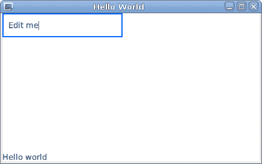
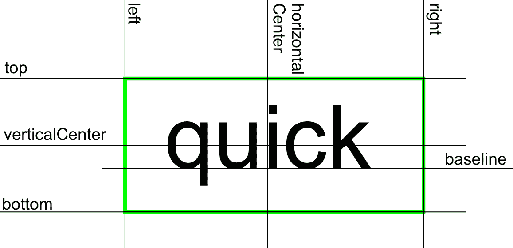
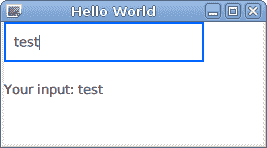
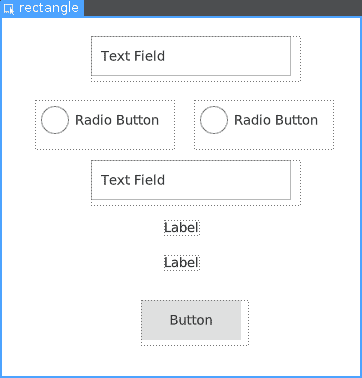
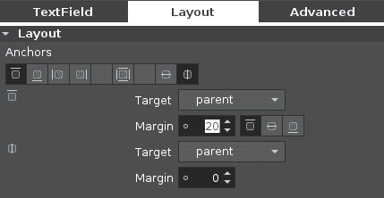
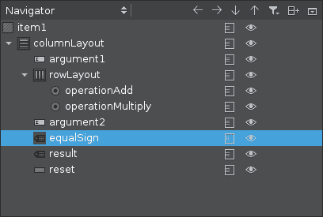
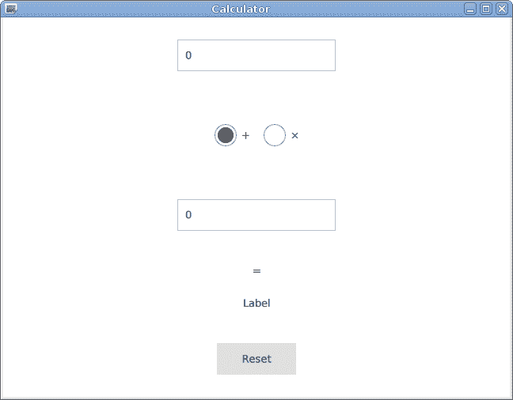

# Qt Quick 简介

在本章中，您将了解到一种名为 **Qt Quick** 的技术，它允许我们实现具有众多视觉效果的分辨率无关的用户界面，包括动画和效果，这些都可以与实现应用程序逻辑的常规 Qt 代码相结合。您将学习构成 Qt Quick 基础的 QML 声明性语言的基础知识。您将创建一个简单的 Qt Quick 应用程序，并看到声明性方法提供的优势。

本章涵盖的主要主题包括这些：

+   QML 基础

+   Qt 模块概述

+   使用 Qt Quick 设计器

+   利用 Qt Quick 模块

+   属性绑定和信号处理

+   Qt Quick 和 C++

+   状态和转换

# 声明性 UI 编程

虽然技术上可以使用 C++ 代码使用 Qt Quick，但此模块附带一种称为 **QML**（**Qt 模型语言**）的专用编程语言。QML 是一种易于阅读和理解的表达性语言，它将世界描述为组件的层次结构，这些组件相互交互并关联。它使用类似 JSON 的语法，并允许我们使用命令式 JavaScript 表达式以及动态属性绑定。那么，声明性语言到底是什么呢？

声明性编程是编程范式之一，它规定程序描述计算的逻辑，而不指定如何获得此结果。与将逻辑表达为形成算法的显式步骤列表、直接修改中间程序状态的命令式编程相反，声明性方法侧重于操作最终结果应该是什么。

# 动手时间 – 创建第一个项目

让我们创建一个项目，以便更好地理解 QML 是什么。在 Qt Creator 中，选择文件，然后在主菜单中选择新建文件或项目。在左侧列中选择应用程序，并选择 Qt Quick 应用程序 - 空模板。将项目命名为 `calculator` 并完成向导的其余部分。

Qt Creator 创建了一个示例应用程序，显示一个空窗口。让我们检查项目文件。第一个文件是常规的 `main.cpp`：

```cpp
#include <QGuiApplication>
#include <QQmlApplicationEngine>

int main(int argc, char *argv[])
{
    QGuiApplication app(argc, argv);
    QQmlApplicationEngine engine;
    engine.load(QUrl(QStringLiteral("qrc:/main.qml")));
    if (engine.rootObjects().isEmpty())
        return -1;
    return app.exec();
}
```

此代码仅创建应用程序对象，实例化 QML 引擎，并请求它从资源中加载 `main.qml` 文件。如果发生错误，`rootObjects()` 将返回一个空列表，应用程序将终止。如果 QML 文件成功加载，应用程序将进入主事件循环。

`*.qrc`文件是一个资源文件。从第三章，*Qt GUI 编程*中你应该熟悉资源文件的概念。基本上，它包含项目执行所需的任意项目文件列表。在编译期间，这些文件的内容被嵌入到可执行文件中。然后你可以通过指定一个虚拟文件名来在运行时检索内容，例如前述代码中的`qrc:/main.qml`。你可以进一步展开项目树的`Resources`部分，以查看添加到资源文件中的所有文件。

在示例项目中，`qml.qrc`引用了一个名为`main.qml`的 QML 文件。如果你在项目树中看不到它，请展开`Resources`、`qml.qrc`，然后是`/`部分。`main.qml`文件是加载到引擎中的顶级 QML 文件。让我们看看它：

```cpp
import QtQuick 2.9
import QtQuick.Window 2.2

Window {
    visible: true
    width: 640
    height: 480
    title: qsTr("Hello World")
}
```

此文件*声明*了在应用程序开始时应创建哪些对象。因为它使用了 Qt 提供的某些 QML 类型，所以在文件的顶部包含两个`import`指令。每个`import`指令包含导入模块的名称和版本。在这个例子中，`import QtQuick.Window 2.2`使我们能够使用此模块提供的`Window` QML 类型。

文件的其余部分是引擎应创建的对象的声明。`Window { ... }`构造告诉 QML 创建一个新的`Window`类型的对象。此部分内的代码为此对象的属性赋值。我们显式地为窗口对象的`visible`、`width`和`height`属性分配了一个常量。`qsTr()`函数是翻译函数，就像 C++代码中的`tr()`一样。它默认返回传递的字符串而不做任何更改。`title`属性将包含评估传递的表达式的结果。

# 行动时间 - 编辑 QML

让我们在窗口中添加一些内容。使用以下代码编辑`main.qml`文件：

```cpp
import QtQuick 2.9
import QtQuick.Window 2.2
import QtQuick.Controls 2.2
Window {
    visible: true
    width: 640
    height: 480
    title: qsTr("Hello World")
 TextField {
 text: "Edit me"
 anchors {
 top: parent.top
 left: parent.left
 }
 }
 Label {
 text: "Hello world"
 anchors {
 bottom: parent.bottom
 left: parent.left
 }
 }
}
```

当你运行项目时，你将在窗口中看到一个文本字段和一个标签：



# 刚才发生了什么？

首先，我们添加了一个导入语句，使`QtQuick.Controls`模块在当前作用域中可用。如果你不确定使用哪个版本，请调用 Qt Creator 的代码补全并使用最新版本。由于新的导入，我们现在可以在我们的 QML 文件中使用`TextField`和`Label` QML 类型。

接下来，我们声明了顶级`Window`对象的两个**子元素**。QML 对象形成一个父子关系，类似于 C++中的`QObject`。然而，你不需要显式地为项目分配父元素。相反，你可以在其父元素的声明中声明对象，QML 将自动确保这种关系。在我们的例子中，`TextField { ... }`部分告诉 QML 创建一个新的`TextField`类型的 QML 对象。

由于这个声明位于`Window { ... }`声明内，`TextField`对象将以`Window`对象为其父对象。对`Label`对象也是如此。如果需要，您可以在单个文件中创建多个嵌套级别。您可以使用`parent`属性来访问当前项目的父项目。

在声明新对象后，我们将在其声明内为其属性分配值。`text`属性是自解释的——它包含在 UI 中显示的文本。请注意，`TextField`对象允许用户编辑文本。当在 UI 中编辑文本时，对象的`text`属性将反映新值。

最后，我们为`anchors` **属性组**分配值以按我们的喜好定位项目。我们将文本字段放在窗口的左上角，并将标签放在左下角。这一步需要更详细的解释。

# 属性组

在我们讨论锚点之前，让我们先谈谈属性组的一般概念。这是在 QML 中引入的新概念。当存在多个具有相似目的的属性时，会使用属性组。例如，`Label`类型有几个与字体相关的属性。它们可以实施为单独的属性；考虑以下示例：

```cpp
Label {
    // this code does not work
    fontFamily: "Helvetica"
    fontSize: 12
    fontItalic: true 
}
```

然而，这样的重复代码难以阅读。幸运的是，字体属性被实现为一个属性组，因此您可以使用**分组符号**语法来设置它们：

```cpp
Label {
    font {
        family: "Helvetica"
        pointSize: 12
        italic: true 
    }
}
```

这段代码更简洁！请注意，在`font`之后没有冒号字符，因此您可以知道这是一个属性组赋值。

此外，如果您只需要设置组中的一个子属性，您可以使用**点符号**语法：

```cpp
Label {
    font.pointSize: 12
}
```

点符号也用于在文档中引用子属性。请注意，如果您需要设置多个子属性，应首选分组符号。

关于属性组，你需要了解的就是这些。除了`font`之外，你还可以在 QML 的一些类型中找到许多其他属性组，例如`border`、`easing`和`anchors`。

# 锚点

锚点允许您通过将某些对象的某些点附着到另一个对象的点上来管理项目几何形状。这些点被称为锚线。以下图显示了每个 Qt Quick 项目可用的锚线：



你可以建立锚线之间的绑定来管理项目的相对位置。对于每个锚线，都有一个属性返回该锚线的当前坐标。例如，`left`属性返回项目左侧边框的`x`坐标，而`top`属性返回其顶部边框的`y`坐标。接下来，每个对象都包含`anchors`属性组，允许你设置该项目的锚线坐标。例如，`anchors.left`属性可以用来请求对象的左侧边框位置。你可以使用这两种类型的属性一起指定对象的相对位置：

```cpp
anchors.top: otherObject.bottom
```

此代码声明对象的顶部锚线必须绑定到另一个对象的底部锚线。也可以通过属性（如`anchors.topMargin`）指定此类绑定的边距。

`anchors.fill`属性是将`top`、`bottom`、`left`和`right`锚点绑定到指定对象的相应锚线上的快捷方式。因此，项目将具有与其他对象相同的几何形状。以下代码片段通常用于将项目扩展到其父对象的整个区域：

```cpp
anchors.fill: parent
```

# 行动时间 - 相对定位项目

在我们之前的例子中，我们使用了以下代码来定位标签：

```cpp
anchors {
    bottom: parent.bottom
    left: parent.left
}
```

现在你应该能够理解这段代码。`parent`属性返回父 QML 对象的引用。在我们的例子中，它是窗口。`parent.bottom`表达式返回父对象的底部锚线的`y`坐标。通过将此表达式分配给`anchors.bottom`属性，我们确保标签的底部锚线与窗口的底部锚线保持在同一位置。`x`坐标以类似的方式受到限制。

现在，让我们看看我们是否可以将标签定位在文本框下方。为了做到这一点，我们需要将标签的`anchors.top`属性绑定到文本框的底部锚线。然而，我们目前无法从标签内部访问文本框。我们可以通过定义文本框的`id`属性来解决这个问题：

```cpp
TextField {
    id: textField
    text: "Edit me"
    anchors {
        top: parent.top
        left: parent.left
    }
}
Label {
    text: "Hello world"
    anchors {
        top: textField.bottom
 topMargin: 20
        left: parent.left
    }
}
```

设置一个 ID 类似于将对象分配给一个变量。现在我们可以使用`textField`变量来引用我们的`TextField`对象。标签现在位于文本框下方 20 像素处。

# QML 类型、组件和文档

QML 引入了一些新的概念，你应该熟悉。**QML 类型**是一个类似于 C++类的概念。QML 中的任何值或对象都应该有某种类型，并且应以某种方式暴露给 JavaScript 代码。QML 类型主要有两种：

+   **基本类型**是包含具体值且不引用任何其他对象的类型，例如`string`或`point`

+   **对象类型**是可以用来创建具有特定功能一致接口的对象的类型

基本的 QML 类型类似于 C++ 原始类型和数据结构，例如 `QPoint`。对象类型更接近于小部件类，例如 `QLineEdit`，但它们不一定与 GUI 相关。

Qt 提供了大量的 QML 类型。我们已经在之前的示例中使用了 `Window`、`TextField` 和 `Label` 类型。你还可以创建具有独特功能和行为的自定义 QML 类型。创建 QML 类型最简单的方法是将一个新 `.qml` 文件（以大写字母命名）添加到项目中。基本文件名定义了创建的 QML 类型的名称。例如，`MyTextField.qml` 文件将声明一个新的 `MyTextField` QML 类型。

任何完整且有效的 QML 代码都称为 **文档**。任何有效的 QML 文件都包含一个文档。从任何来源（例如，通过网络）加载文档也是可能的。**组件**是加载到 QML 引擎中的文档。

# 它是如何工作的？

Qt Quick 基础设施隐藏了大部分实现细节，让开发者能够保持应用程序代码的整洁。然而，始终了解正在发生的事情是很重要的。

**QML 引擎**是一个理解 QML 代码并执行使其工作的必要操作的 C++ 类。特别是，QML 引擎负责根据请求的层次结构创建对象，为属性分配值，并在事件发生时执行事件处理器。

虽然 QML 语言本身与 JavaScript 相去甚远，但它允许你使用任何 JavaScript 表达式和代码块来计算值和处理事件。这意味着 QML 引擎必须能够执行 JavaScript。在底层，实现使用了一个非常快速的 JavaScript 引擎，所以你通常不需要担心 JavaScript 代码的性能。

JavaScript 代码应该能够与 QML 对象交互，因此每个 QML 对象都作为具有相应属性和方法的 JavaScript 对象公开。这种集成使用了我们在第十章“脚本”中学到的相同机制。在 C++ 代码中，你可以对嵌入到 QML 引擎中的对象进行一些控制，甚至可以创建新的对象。我们将在本章的后面回到这个话题。

虽然 QML 是一种通用语言，但 Qt Quick 是一个基于 QML 的模块，专注于用户界面。它提供了一个二维的硬件加速画布，其中包含一系列相互连接的项目。与 Qt Widgets 不同，Qt Quick 被设计成能够高效地支持视觉效果和动画，因此你可以使用其功能而不会显著降低性能。

Qt Quick 视图不是基于网页浏览器引擎的。浏览器通常比较重，尤其是对于移动设备。但是，当你需要时，可以通过在 QML 文件中添加 `WebView` 或 `WebEngine` 对象来显式使用网页引擎。

# 行动时间 - 属性绑定

QML 比简单的 JSON 强大得多。你不需要为属性指定一个显式的值，你可以使用任意 JavaScript 表达式，该表达式将被自动评估并分配给属性。例如，以下代码将在标签中显示 "ab"：

```cpp
Label {
    text: "a" + "b"
    //...
}
```

你还可以引用文件中其他对象的属性。正如我们之前看到的，你可以使用 `textEdit` 变量来设置标签的相对位置。这是属性绑定的一个例子。如果 `textField.bottom` 表达式的值因某种原因而改变，标签的 `anchors.top` 属性将自动更新为新值。QML 允许你为每个属性使用相同的机制。为了使效果更明显，让我们将一个表达式分配给标签的文本属性：

```cpp
Label {
    text: "Your input: " + textField.text
    //...
}
```

现在，标签的文本将根据这个表达式进行更改。当你更改输入字段中的文本时，标签的文本将自动更新！：



属性绑定与常规值赋值不同，它将属性的值绑定到提供的 JavaScript 表达式的值。每当表达式的值发生变化时，属性将反映这种变化在其自己的值中。请注意，QML 文档中语句的顺序并不重要，因为你在声明属性之间的关系。

这个例子展示了声明式方法的一个优点。我们不必连接信号或明确确定何时应该更改文本。我们只需 *声明* 文本应该受输入字段的影响，QML 引擎将自动强制执行这种关系。

如果表达式复杂，你可以用多行文本块替换它，该文本块作为一个函数工作：

```cpp
text: {
    var x = textField.text;
    return "(" + x + ")";
}
```

你也可以在任何 QML 对象声明中声明和使用一个命名 JavaScript 函数：

```cpp
Label {
    function calculateText() {
        var x = textField.text;
        return "(" + x + ")";
    }
    text: calculateText()
    //...
}
```

# 自动属性更新的限制

QML 尽力确定函数值何时可能发生变化，但它并非万能。对于我们的最后一个函数，它可以很容易地确定函数结果取决于 `textField.text` 属性的值，因此如果该值发生变化，它将重新评估绑定。然而，在某些情况下，它无法知道函数在下一次调用时可能返回不同的值，在这种情况下，该语句将不会被重新评估。考虑以下属性绑定：

```cpp
Label {
    function colorByTime() {
        var d = new Date();
        var seconds = d.getSeconds();
        if(seconds < 15) return "red";
        if(seconds < 30) return "green";
        if(seconds < 45) return "blue";
        return "purple";
    }
    color: colorByTime()
    //...
}
```

颜色将在应用程序开始时设置，但将无法正常工作。QML 只会在对象初始化时调用 `colorByTime()` 函数一次，并且它将永远不会再次调用它。这是因为它不知道这个函数必须调用多少次。我们将在第十二章 自定义 Qt Quick 中看到如何克服这个问题。

# Qt 提供的 QML 类型概述

在我们继续开发我们的 QML 应用程序之前，让我们看看内置库的功能。这将使我们能够选择适合任务的正确模块。Qt 提供了许多有用的 QML 类型。在本节中，我们将概述 Qt 5.9 中可用的最有用的模块。

以下模块对于构建用户界面非常重要：

+   `QtQuick` 基础模块提供了与绘图、事件处理、元素定位、转换以及许多其他有用类型相关的功能

+   `QtQuick.Controls` 提供了用户界面的基本控件，例如按钮和输入字段

+   `QtQuick.Dialogs` 包含文件对话框、颜色对话框和消息框

+   `QtQuick.Extras` 提供了额外的控件，例如旋钮、开关和仪表

+   `QtQuick.Window` 启用窗口管理

+   `QtQuick.Layouts` 提供了在屏幕上自动定位对象的布局

+   `UIComponents` 提供了标签控件、进度条和开关类型

+   `QtWebView` 允许您将网页内容添加到应用程序中

+   `QtWebEngine` 提供了更复杂的网页浏览器功能

如果您想实现丰富的图形，以下模块可能会有所帮助：

+   `QtCanvas3D` 提供了一个用于 3D 渲染的画布

+   `Qt3D` 模块提供了访问支持 2D 和 3D 渲染的实时仿真系统的权限

+   `QtCharts` 允许您创建复杂的图表

+   `QtDataVisualization` 可以用于构建数据集的 3D 可视化

+   `QtQuick.Particles` 允许您添加粒子效果

+   `QtGraphicalEffects` 可以将图形效果（如模糊或阴影）应用于其他 Qt Quick 对象

Qt 提供了在移动设备上通常所需的大量功能：

+   `QtBluetooth` 支持通过蓝牙与其他设备的基本通信

+   `QtLocation` 允许您显示地图和查找路线

+   `QtPositioning` 提供了当前位置信息

+   `QtNfc` 允许您利用 NFC 硬件

+   `QtPurchasing` 实现了应用内购买

+   `QtSensors` 提供了对板载传感器（如加速度计或陀螺仪）的访问

+   `QtQuick.VirtualKeyboard` 提供了一个屏幕键盘的实现

最后，有两个模块提供了多媒体功能：

+   `QtMultimedia` 提供了对音频和视频播放、音频录制、摄像头和收音机的访问

+   `QtAudioEngine` 实现了 3D 定位音频播放

还有许多我们没有提到的 QML 模块。您可以在所有 QML 模块文档页面上找到完整的列表。请注意，某些模块不在 LGPL 许可下提供。

# Qt Quick 设计器

我们可以使用 QML 轻松创建对象层次结构。如果我们需要几个输入框或按钮，我们只需在代码中添加一些块，就像我们在前面的例子中添加`TextField`和`Label`组件一样，我们的更改将出现在窗口中。然而，在处理复杂表单时，有时很难正确定位对象。与其尝试不同的`anchors`并重新启动应用程序，不如使用可视表单编辑器在制作更改时查看更改。

# 动手实践 - 向项目中添加表单

在 Qt Creator 的项目树中找到`qml.qrc`文件，并在其上下文菜单中调用“添加新...”选项。从 Qt 部分，选择“QtQuick UI 文件模板”。在组件名称字段中输入`Calculator`。组件表单名称字段将自动设置为`CalculatorForm`。完成向导。

在我们的项目中将出现两个新文件。`CalculatorForm.ui.qml`文件是可以在表单编辑器中编辑的表单文件。`Calculator.qml`文件是一个常规的 QML 文件，可以手动编辑以实现表单的行为。这些文件中的每一个都引入了一个新的 QML 类型。`CalculatorForm` QML 类型立即在生成的`Calculator.qml`文件中使用：

```cpp
import QtQuick 2.4
CalculatorForm {
}
```

接下来，我们需要编辑`main.qml`文件，向窗口添加一个`Calculator`对象：

```cpp
import QtQuick 2.9
import QtQuick.Window 2.2
import QtQuick.Controls 2.2
Window {
    visible: true
    width: 640
    height: 480
    title: qsTr("Calculator")

 Calculator {
 anchors.fill: parent
 }
}
```

QML 组件在某些方面类似于 C++类。一个 QML 组件封装了一个对象树，这样你就可以在不了解组件确切内容的情况下使用它。当应用程序启动时，`main.qml`文件将被加载到引擎中，因此将创建`Window`和`Calculator`对象。`Calculator`对象反过来将包含一个`CalculatorForm`对象。`CalculatorForm`对象将包含我们在表单编辑器中稍后添加的项目。

# 表单编辑器文件

当我们使用 Qt Widgets 表单编辑器工作时，你可能已经注意到，小部件表单是一个在编译期间转换为 C++类的 XML 文件。这并不适用于 Qt Quick Designer。事实上，此表单编辑器生成的文件是完全有效的 QML 文件，它们直接包含在项目中。然而，表单编辑器文件有一个特殊的扩展名（`.ui.qml`），并且有一些人工限制来保护你免于做错事。

`ui.qml`文件应只包含在表单编辑器中可见的内容。你不需要手动编辑这些文件。无法从这些文件中调用函数或执行 JavaScript 代码。相反，你应该在单独的 QML 文件中实现任何逻辑，该文件将表单作为组件使用。

如果你好奇`ui.qml`文件的内容，可以点击位于表单编辑器中央区域右侧的文本编辑器标签。

# 表单编辑器界面

当你打开`.ui.qml`文件时，Qt Creator 将进入设计模式并打开 Qt Quick Designer 界面：


我们已经突出显示了界面的以下重要部分：

+   主区域（**1**）包含文档内容的可视化。您可以通过点击主区域右侧边界的文本编辑器标签来查看和编辑表单的 QML 代码，而无需退出表单编辑器。主区域底部显示组件的状态列表。

+   库面板（**2**）显示可用的 QML 对象类型，并允许您通过将它们拖动到导航器或主区域来创建新对象。导入标签包含可用 QML 模块的列表，并允许您导出模块并访问更多 QML 类型。

+   导航器面板（**3**）显示现有对象及其名称的层次结构。名称右侧的按钮允许您将对象作为公共属性导出并在表单编辑器中切换其可见性。

+   连接面板（**4**）提供了连接信号、更改属性绑定和管理表单公共属性的能力。

+   属性面板（**5**）允许您查看和编辑所选对象的属性。

我们现在将使用表单编辑器创建一个简单的计算器应用程序。我们的表单将包含两个用于操作数的输入框，两个用于选择操作的单选按钮，一个用于显示结果的标签，以及一个用于重置一切到原始状态的按钮。

# 操作时间 – 添加导入

默认对象调色板包含由`QtQuick`模块提供的非常少的类型集。要访问更丰富的控件集，我们需要在我们的文档中添加一个`import`指令。为此，请定位窗口左上角的库面板并转到其导入标签。接下来，点击添加导入，并在下拉列表中选择 QtQuick.Controls 2.2。选定的导入将出现在标签中。您可以通过点击导入左侧的×按钮来删除它。请注意，您不能删除默认导入。

使用表单编辑器添加导入将会在`.ui.qml`文件中添加`import QtQuick.Controls 2.2`指令。您可以将主区域切换到文本编辑器模式以查看此更改。

现在，您可以切换回库面板的 QML 类型标签。调色板将包含导入模块提供的控件。

# 操作时间 – 向表单添加项目

在库面板的 Qt Quick - Controls 2 部分中找到文本字段类型，并将其拖动到主区域。将创建一个新的文本字段。我们还需要从同一部分获取单选按钮、标签和按钮类型。将它们拖动到表单中，并按所示排列：



接下来，您需要选择每个元素并编辑其属性。在主区域或导航器中单击第一个文本字段。主区域中对象周围的蓝色框架将指示该对象已被选中。现在您可以使用属性编辑器查看和编辑选中元素的属性。首先，我们想要设置一个`id`属性，该属性将用于在代码中引用对象。将文本编辑的`id`属性设置为`argument1`和`argument2`。在属性编辑器中的`TextField`选项卡下找到`Text`属性。将两个文本字段的`Text`属性都设置为`0`。更改后的文本将立即在主区域中显示。

将单选按钮的`id`设置为`operationAdd`和`operationMultiply`。将它们的文本设置为`+`和`×`。通过在属性编辑器中切换相应的复选框，将`operationAdd`按钮的`checked`属性设置为`true`。

第一个标签将用于静态显示`=`符号。将其`id`设置为`equalSign`，`text`设置为`=`。第二个标签实际上将显示结果。将其`id`设置为`result`。我们稍后会处理`text`属性。

该按钮将重置计算器到原始状态。将其`id`设置为`reset`，`text`设置为`Reset`。

您现在可以运行应用程序。您会看到控件在窗口中显示，但它们相对于窗口大小没有重新定位。它们始终保持在相同的位置。如果您检查`CalculatorForm.ui.qml`的文本内容，您会看到表编辑器为每个元素设置了`x`和`y`属性。为了创建一个更响应式的表单，我们需要利用`anchors`属性。

# 动作时间 - 编辑锚点

让我们看看如何在表编辑器中编辑锚点，并实时查看结果。选择`argument1`文本字段，切换到属性面板中间部分的布局选项卡。该选项卡包含“锚点”文本，后面是一组按钮，用于此项目的所有锚线。您可以将鼠标悬停在按钮上以查看其工具提示。单击第一个按钮，

将锚点项锚定到顶部。按钮下方将出现一组新的控件，允许您配置此锚点。

首先，您可以选择目标对象，即包含用作参考的锚线的对象。接下来，您可以选择参考锚线和当前对象的锚线之间的边距。边距右侧有按钮，允许您选择要作为参考的目标的哪个锚线。例如，如果您选择底部线，我们的文本字段将保持相对于表底部的位置。

将文本字段的顶部行锚定到父元素的顶部行，并将边距设置为 20。接下来，将水平中心线锚定到父元素，边距为 0。属性编辑器应如下所示：



您还可以验证这些设置的 QML 表示：

```cpp
TextField {
    id: a
    text: qsTr("0")
    anchors.horizontalCenter: parent.horizontalCenter
    anchors.top: parent.top
    anchors.topMargin: 20
}
```

如果您使用鼠标拖动文本字段而不是设置锚点，表单编辑器将设置 `x` 和 `y` 属性以根据您的操作定位元素。如果您之后编辑项目的锚点，`x` 和 `y` 属性可能仍然被设置，但它们的效果将被锚点效果覆盖。

让我们重复这个过程，针对 `operationAdd` 单选按钮。首先，我们需要调整其相对于表单横向中心的水平位置。选择单选按钮，点击右侧的  锚点项目，将目标设置为 `parent`，然后点击

 将锚点设置为目标按钮右侧的横向中心。设置边距为 `10`。这将使我们能够将第二个单选按钮定位在横向中心的右侧 10 点处，并且单选按钮之间的空间将是 20 点。

现在，关于顶部锚点？我们可以将其附加到父元素上，并设置看起来很漂亮的边距。然而，我们最终想要的是第一个文本字段和第一个单选按钮之间的特定垂直边距。我们可以轻松地做到这一点。

为 `operationAdd` 单选按钮启用顶部锚点，在目标下拉列表中选择 `argument1`，点击  锚点至目标按钮右侧的边距字段底部，并在边距字段中输入 20。现在单选按钮已锚定到其上方的文本字段。即使我们更改文本字段的高度，元素之间的垂直边距也将保持不变。您可以运行应用程序并验证 `argument1` 和 `operationAdd` 元素现在对窗口大小变化做出响应。

现在，我们只需要对剩余的对象重复此过程。然而，这相当繁琐。在更大的表单中会更不方便。对这样的表单进行更改也会很麻烦。例如，要更改字段的顺序，您需要仔细编辑相关对象的锚点。虽然锚点在简单情况下很好，但对于大型表单，使用更自动化的方法会更好。幸运的是，Qt Quick 提供了布局来实现这个目的。

# 行动时间 - 将布局应用于项目

在我们将布局应用于对象之前，删除我们创建的锚点。为此，选择每个元素，然后点击“锚点”文本下的按钮取消选中它们。按钮下面的锚点属性将消失。布局现在可以定位对象。

首先，将 `QtQuick.Layouts 1.3` 模块导入表单，就像我们之前导入 `QtQuick.Controls` 一样。在调色板中找到 Qt Quick - 布局部分，并检查可用的布局：

+   列布局将垂直排列其子元素。

+   行布局将水平排列其子元素。

+   网格布局将垂直和水平排列其子元素。

+   栈布局将只显示其子项中的一个，并隐藏其余的。

布局对对象的层次结构很敏感。让我们使用导航器而不是主区域来管理我们的项目。这将使我们能够更清楚地看到项目之间的父子关系。首先，将行布局拖动到导航器中的根项目上。将一个新的`rowLayout`对象添加为根对象的子项。接下来，将导航器中的`operationAdd`和`operationMultiply`对象拖动到`rowLayout`上。单选按钮现在是行布局的子项，并且它们自动并排定位。

现在，将列布局拖动到根对象。在导航器中选择根对象的其余子项，包括`rowLayout`，并将它们拖动到`columnLayout`对象。如果项目最终顺序错误，请使用导航器顶部的向上移动和向下移动按钮来正确排列项目。您应该得到以下层次结构：



`columnLayout`对象将自动定位其子项，但如何定位对象本身呢？我们应该使用锚点来做到这一点。选择`columnLayout`，在属性编辑器中切换到布局选项卡并点击填充父项按钮。这将自动创建 4 个锚点绑定并将`columnLayout`扩展以填充表单。

项目现在已自动定位，但它们被绑定到窗口的左侧边界。让我们将它们对齐到中间。选择第一个文本字段并切换到布局选项卡。由于对象现在处于布局中，锚点设置被布局理解的设置所取代。对齐属性定义了项目如何在可用空间内定位。在第一个下拉列表中选择`AlignHCenter`。为`columnLayout`的每个直接子项重复此过程。

您现在可以运行应用程序并查看它如何对窗口大小的变化做出反应：



表单已准备好。现在让我们进行计算。

# 行动时间 - 将表达式分配给属性

正如您已经看到的，将常量文本分配给标签很容易。然而，您也可以在表单编辑器中为任何属性分配动态表达式。为此，选择`result`标签并将鼠标悬停在文本属性输入字段左侧的部分圆圈上。当圆圈变成箭头时，点击它并在菜单中选择设置绑定。在绑定编辑器中输入`argument1.text + argument2.text`并确认更改。

如果现在运行应用程序，您将看到`result`标签将始终显示用户在字段中输入的字符串的连接。这是因为`argument1.text`和`argument2.text`属性具有`string`类型，所以`+`操作执行连接。

如果您需要应用简单的绑定，此功能非常有用。然而，在我们的情况下，这并不足够，因为我们需要将字符串转换为数字并选择用户请求的算术运算。在表单编辑器中使用函数是不允许的，因此我们无法在这里实现这种复杂的逻辑。我们需要在`Calculator.qml`文件中完成它。这种限制将帮助我们分离视图及其背后的逻辑。

# 动手时间 - 将项目公开为属性

组件的子组件默认情况下不可从外部访问。这意味着`Calculator.qml`无法访问表单的输入字段或单选按钮。为了实现计算器的逻辑，我们需要访问这些对象，因此让我们将它们作为公共属性公开。在导航器中选择`argument1`文本字段，然后点击切换是否将此项目作为根项按钮右侧对象 ID 的别名属性导出。点击按钮后，其图标将改变以指示项目已导出。现在我们可以在`Calculator.qml`中使用`argument1`公共属性来访问输入字段对象。

为`argument1`、`argument2`、`operationAdd`、`operationMultiply`和`result`对象启用公共属性。其余对象将保持隐藏，作为表单的实现细节。

现在转到`Calculator.qml`文件，并使用公开属性来实现计算器逻辑：

```cpp
CalculatorForm {
    result.text: {
        var value1 = parseFloat(argument1.text);
        var value2 = parseFloat(argument2.text);
        if(operationMultiply.checked) {
            return value1 * value2;
        } else {
            return value1 + value2;
        }
    }
}
```

# 刚才发生了什么？

由于我们已将对象作为属性导出，我们可以从表单外部通过 ID 访问它们。在这段代码中，我们将`result`对象的`text`属性绑定到括号内代码块的返回值。我们使用`argument1.text`和`argument2.text`来访问输入字段的当前文本。我们还使用`operationMultiply.checked`来查看用户是否选中了`operationMultiply`单选按钮。其余部分只是简单的 JavaScript 代码。

运行应用程序并观察当用户与表单交互时，结果标签如何自动显示结果。

# 动手时间 - 创建事件处理器

让我们实现最后一点功能。当用户点击重置按钮时，我们应该更改表单的值。回到表单编辑器，在导航器或主区域中右键单击`reset`按钮。选择添加新信号处理器。Qt Creator 将导航到相应的实现文件（`Calculator.qml`）并显示“实现信号处理器”对话框。在下拉列表中选择`clicked`信号，然后点击“确定”按钮以确认操作。此操作将执行以下两项操作：

+   `reset`按钮将自动导出为公共属性，就像我们手动为其他控件做的那样。

+   Qt Creator 将在`Calculator.qml`文件中为新的信号处理器创建模板。

让我们将我们的实现添加到自动生成的块中：

```cpp
reset.onClicked: {
    argument1.text = "0";
    argument2.text = "0";
    operationAdd.checked = true;
}
```

当按钮被点击时，这段代码将被执行。文本字段将被设置为 0，并且 `operationAdd` 单选按钮将被选中。`operationMultiply` 单选按钮将自动取消选中。

我们的计算器现在完全工作！我们使用了声明式方法来实现一个看起来很好看且响应迅速的应用程序。

# Qt 快速开发与 C++

虽然 QML 有很多内置的功能可用，但它几乎永远不够用。当你开发一个真实的应用程序时，它总是需要一些独特的功能，而这些功能在 Qt 提供的 QML 模块中是不可用的。C++ Qt 类功能更强大，第三方 C++ 库也是一个选项。然而，C++ 世界被 QML 引擎的限制与我们的 QML 应用程序隔离开来。让我们立即打破这个界限。

# 从 QML 访问 C++ 对象

假设我们想在 C++ 中执行一个复杂的计算，并从我们的 QML 计算器中访问它。我们将选择阶乘作为这个项目的功能。

QML 引擎非常快，所以你很可能会直接在 JavaScript 中计算阶乘而不会出现性能问题。我们在这里只是用它作为一个简单的例子。

我们的目标是将我们的 C++ 类注入到 QML 引擎中，作为一个 JavaScript 对象，这样我们就可以在我们的 QML 文件中使用它。我们将按照我们在 第十章，*脚本* 中所做的那样来做。`main` 函数创建了一个继承自 `QJSEngine` 的 `QQmlApplicationEngine` 对象，因此我们可以访问从那一章中已经熟悉的 API。在这里，我们将仅展示如何将此知识应用到我们的应用程序中，而不会深入细节。

进入编辑模式，在项目树中右键单击项目，并选择“添加新项”。选择 C++ 类模板，输入 `AdvancedCalculator` 作为类名，并在基类下拉列表中选择 QObject。

在生成的 `advancedcalculator.h` 文件中声明可调用的 `factorial` 函数：

```cpp
Q_INVOKABLE double factorial(int argument);
```

我们可以使用以下代码来实现这个函数：

```cpp
double AdvancedCalculator::factorial(int argument) {
    if (argument < 0) {
        return std::numeric_limits<double>::quiet_NaN();
    }
    if (argument > 180) {
      return std::numeric_limits<double>::infinity();
    }
    double r = 1.0;
    for(int i = 2; i <= argument; ++i) {
        r *= i;
    }
    return r;
}
```

我们保护实现以防止输入过大，因为 `double` 无法容纳结果值。我们还在无效输入时返回 `NaN`。

接下来，我们需要创建这个类的实例并将其导入 QML 引擎。我们在 `main()` 中这样做：

```cpp
engine.globalObject().setProperty("advancedCalculator",
    engine.newQObject(new AdvancedCalculator));
return app.exec();
```

我们的对象现在作为 `advancedCalculator` 全局变量可用。现在我们需要在 QML 文件中使用这个变量。打开表单编辑器，并将第三个单选按钮添加到 `rowLayout` 项目中。将单选按钮的 `id` 设置为 `operationFactorial` 并将文本设置为 `!`。将这个单选按钮导出为一个公共属性，这样我们就可以从外部访问它。接下来，让我们调整 `Calculator.qml` 文件中的 `result.text` 属性绑定：

```cpp
result.text: {
    var value1 = parseFloat(argument1.text);
    var value2 = parseFloat(argument2.text);
    if(operationMultiply.checked) {
        return value1 * value2;
 } else if (operationFactorial.checked) {
 return advancedCalculator.factorial(value1);
    } else {
        return value1 + value2;
    }
}
```

如果勾选了`operationFactorial`单选按钮，此代码将调用`advancedCalculator`变量的`factorial()`方法，并将其作为结果返回。用户将看到它作为`result`标签的文本。当选择阶乘操作时，第二个文本字段将不被使用。我们将在本章后面对此进行处理。

关于将 C++ API 暴露给 JavaScript 的更多信息，请参阅第十章，*脚本*。其中描述的大部分技术也适用于 QML 引擎。

我们将一个 C++对象暴露为 JavaScript 对象，该对象可以从 QML 引擎中访问。然而，它不是一个 QML 对象，因此您不能将其包含在 QML 对象层次结构中，也不能将属性绑定应用于以这种方式创建的对象的属性。可以创建一个 C++类，使其作为一个完全功能的 QML 类型工作，从而实现更强大的 C++和 QML 集成。我们将在第十二章，*Qt Quick 中的自定义*中展示这种方法。

另一种将我们的`AdvancedCalculator`类暴露给 JavaScript 的方法是，而不是将其添加到全局对象中，我们可以使用`qmlRegisterSingletonType()`函数将其注册为 QML 模块系统中的单例对象：

```cpp
qmlRegisterSingletonType("CalculatorApp", 1, 0, "AdvancedCalculator",
        [](QQmlEngine *engine, QJSEngine *scriptEngine) -> QJSValue {
    Q_UNUSED(scriptEngine);
    return engine->newQObject(new AdvancedCalculator);
});
QQmlApplicationEngine engine;
```

我们将 QML 模块名称、主版本号和次版本号以及单例名称传递给此函数。您可以选择这些值。最后一个参数是一个回调函数，当此单例对象在 JS 引擎中首次被访问时将被调用。

QML 代码也需要稍作调整。首先，将我们的新 QML 模块导入作用域中：

```cpp
import CalculatorApp 1.0
```

现在，您只需通过名称访问单例即可：

```cpp
return AdvancedCalculator.factorial(value1);
```

当此行首次执行时，Qt 将调用我们的 C++回调并创建单例对象。对于后续调用，将使用相同的对象。

# 从 C++访问 QML 对象

同样，也可以从 C++ 创建 QML 对象并访问存在于 QML 引擎中的现有对象（例如，在某个 QML 文件中声明的那些）。然而，总的来说，这样做通常是不良实践。如果我们假设最常见的情况，即我们的应用程序的 QML 部分处理 Qt Quick 的用户界面，而逻辑是用 C++ 编写的，那么从 C++ 访问 Qt Quick 对象会打破逻辑和表示层之间的分离，这是 GUI 编程中的一个主要原则。用户界面容易受到动态变化的影响，包括重新布局甚至彻底的改造。对 QML 文档的重度修改，如添加或删除设计中的项目，随后将需要调整应用程序逻辑以应对这些变化。此外，如果我们允许单个应用程序拥有多个用户界面（皮肤），可能会发生这样的情况，即由于它们差异很大，很难决定一组具有硬编码名称的通用实体，这些实体可以从 C++ 中检索并操作。即使你设法做到了，如果 QML 部分没有严格遵守规则，这样的应用程序也可能会轻易崩溃。

话虽如此，我们不得不承认，确实存在一些情况下从 C++ 访问 QML 对象是有意义的，这就是我们决定向您介绍如何实现这一方法的原因。其中一种希望采用这种方法的情形是，当 QML 作为一种快速定义具有不同对象属性的对象层次结构的方式时，通过更多或更少的复杂表达式将这些对象链接起来，使它们能够响应层次结构中发生的变化。

`QQmlApplicationEngine` 类通过 `rootObjects()` 函数提供对其顶级 QML 对象的访问。所有嵌套的 QML 对象形成一个从 C++ 可见的父子层次结构，因此您可以使用 `QObject::findChild` 或 `QObject::findChildren` 来访问嵌套对象。找到特定对象最方便的方法是设置其 `objectName` 属性。例如，如果我们想从 C++ 访问重置按钮，我们需要设置其对象名。

表单编辑器不提供为项目设置 `objectName` 的方法，因此我们需要使用文本编辑器来做出这个更改：

```cpp
Button {
    id: reset
    objectName: "buttonReset"
    //...
}
```

现在，我们可以从 `main` 函数中访问这个按钮：

```cpp
if (engine.rootObjects().count() == 1) {
    QObject *window = engine.rootObjects()[0];
    QObject *resetButton = window->findChild<QObject*>("buttonReset");
    if (resetButton) {
        resetButton->setProperty("highlighted", true);
    }
}
```

在此代码中，我们首先访问顶级的 `Window` QML 对象。然后，我们使用 `findChild` 方法找到与我们的重置按钮相对应的对象。`findChild()` 方法要求我们传递一个类指针作为模板参数。由于不知道实际实现给定类型的类是什么，最安全的方法是简单地传递 `QObject*`，因为我们知道所有 QML 对象都继承自它。更重要的是传递给函数参数的值——它是我们想要返回的对象的名称。请注意，这并不是对象的 `id`，而是 `objectName` 属性的值。当结果被分配给变量时，我们验证是否成功找到了项目，如果是这样，就使用通用的 `QObject` API 将其 `highlighted` 属性设置为 `true`。这个属性将改变按钮的外观。

`QObject::findChild` 和 `QObject::findChildren` 函数执行无限深度的递归搜索。虽然它们使用起来很方便，但如果对象有很多子对象，这些函数可能会很慢。为了提高性能，你可以通过将这些函数的 `Qt::FindDirectChildrenOnly` 标志传递给这些函数来关闭递归搜索。如果目标对象不是直接子对象，考虑多次调用 `QObject::findChild` 来找到每个中间父对象。

如果你需要创建一个新的 QML 对象，你可以使用 `QQmlComponent` 类来完成。它接受一个 QML 文档，并允许你从中创建一个 QML 对象。文档通常是从文件中加载的，但你甚至可以直接在 C++ 代码中提供它：

```cpp
QQmlComponent component(&engine);
component.setData(
    "import QtQuick 2.6\n"
    "import QtQuick.Controls 2.2\n"
    "import QtQuick.Window 2.2\n"
    "Window { Button { text: \"C++ button\" } }", QUrl());
QObject* object = component.create();
object->setProperty("visible", true);
```

`component.create()` 函数实例化我们的新组件，并返回一个指向它的 `QObject` 指针。实际上，任何 QML 对象都源自 `QObject`。你可以使用 Qt 元系统来操作对象，而无需将其转换为具体类型。你可以使用 `property()` 和 `setProperty()` 函数访问对象的属性。在这个例子中，我们将 `Window` QML 对象的 `visible` 属性设置为 `true`。当我们的代码执行时，一个带有按钮的新窗口将出现在屏幕上。

你也可以使用 `QMetaObject::invokeMethod()` 函数调用对象的方法：

```cpp
QMetaObject::invokeMethod(object, "showMaximized");
```

如果你想将新对象嵌入到现有的 QML 表单中，你需要设置新对象的 *视觉父级*。假设我们想要将一个按钮添加到计算器的表单中。首先，你需要在 `main.qml` 中给它分配 `objectName`：

```cpp
Calculator {
    anchors.fill: parent
    objectName: "calculator"
}
```

现在，你可以从 C++ 中向这个表单添加一个按钮：

```cpp
QQmlComponent component(&engine);
component.setData(
    "import QtQuick 2.6\n"
    "import QtQuick.Controls 2.2\n"
    "Button { text: \"C++ button2\" }", QUrl());
QObject *object = component.create();
QObject *calculator = window->findChild<QObject*>("calculator");
object->setProperty("parent", QVariant::fromValue(calculator));
```

在此代码中，我们创建了一个组件，并将其主表单作为其 `parent` 属性。这将使对象出现在表单的左上角。像任何其他 QML 对象一样，你可以使用 `anchors` 属性组来改变对象的位置。

当创建复杂对象时，它们需要时间来实例化，有时，人们希望不要因为等待操作完成而长时间阻塞控制流。在这种情况下，你可以使用`QQmlIncubator`对象在 QML 引擎中异步创建对象。这个对象可以用来安排实例化并继续程序的流程。我们可以查询孵化器的状态，当对象构建完成时，我们将能够访问它。以下代码演示了如何使用孵化器来实例化对象，并在等待操作完成的同时保持应用程序响应：

```cpp
QQmlComponent component(&engine,
    QUrl::fromLocalFile("ComplexObject.qml"));
QQmlIncubator incubator;
component.create(incubator);
while(!incubator.isError() && !incubator.isReady()) {
    QCoreApplication::processEvents();
}
QObject *object = incubator.isReady() ? incubator.object() : 0;
```

# 为静态用户界面注入活力

我们的用户界面到目前为止一直相当静态。在本节中，我们将向我们的计算器添加一个简单的动画。当用户选择阶乘操作时，第二个（未使用）文本字段将淡出。当选择另一个操作时，它将淡入。让我们看看 QML 如何允许我们实现这一点。

# 流体用户界面

到目前为止，我们一直将图形用户界面视为一组嵌入彼此中的面板。这在桌面实用程序的世界中得到了很好的体现，这些实用程序由窗口和子窗口组成，其中包含大量静态内容，散布在整个大桌面区域，用户可以使用鼠标指针在窗口之间移动或调整它们的大小。

然而，这种设计与现代用户界面不太相符，现代用户界面通常试图最小化它们占据的面积（因为嵌入式和移动设备等显示尺寸较小，或者为了避免遮挡主显示面板，如游戏中的情况），同时提供大量动态移动或动态调整大小的丰富内容。这样的用户界面通常被称为“流体”，以表明它们不是由多个不同的屏幕组成，而是包含动态内容和布局，其中一屏可以流畅地转换到另一屏。`QtQuick`模块提供了一个运行时，用于创建具有流体用户界面的丰富应用程序。

# 状态和转换

Qt Quick 引入了**状态**的概念。任何 Qt Quick 对象都可以有一个预定义的状态集。每个状态对应于应用程序逻辑中的某种情况。例如，我们可以说我们的计算器应用程序有两个状态：

+   当选择加法或乘法操作时，用户必须输入两个操作数

+   当选择阶乘操作时，用户只需要输入一个操作数

状态通过`字符串`名称来标识。隐式地，任何对象都有一个空名称的基本状态。要声明一个新的状态，你需要指定状态名称和一组与基本状态不同的属性值。

每个 Qt Quick 对象也都有一个`state`属性。当你将状态名称分配给此属性时，对象将进入指定的状态。默认情况下，这会立即发生，但可以定义对象的**转换**并执行一些状态更改时的视觉效果。

让我们看看我们如何在项目中利用状态和转换。

# 动手时间 - 向表单添加状态

在表单编辑器中打开`CalculatorForm.ui.qml`文件。主区域的底部包含状态编辑器。基本状态项始终位于左侧。点击状态编辑器右侧的“添加新状态”按钮。编辑器中会出现一个新的状态。它包含一个文本字段，你可以用它来设置状态的名称。将名称设置为`single_argument`。

一次只能选择一个状态。当选择自定义状态时，任何在表单编辑器中的更改都只会影响所选状态。当选择基本状态时，你可以编辑基本状态，并且所有更改都将影响所有其他状态，除非某些状态中覆盖了更改的属性。

通过在状态编辑器中点击它来选择`single_argument`状态。创建时它也会自动被选中。接下来，选择`argument2`文本字段并将其`opacity`属性设置为 0。该字段将变得完全透明，除了表单编辑器提供的蓝色轮廓。然而，这种变化仅影响`single_argument`状态。当你切换到基本状态时，文本字段将变得可见。当你切换回第二个状态时，文本字段将再次变得不可见。

你可以切换到文本编辑器来查看这个状态在代码中的表示：

```cpp
states: [
    State {
        name: "single_argument"
        PropertyChanges {
            target: b
            opacity: 0
        }
    }
]
```

如你所见，状态不包含表单的完整副本。相反，它只记录此状态与基本状态之间的差异。

现在我们需要确保表单的状态得到适当的更新。你只需要将表单的`state`属性绑定到一个返回当前状态的函数。切换到`Calculator.qml`文件并添加以下代码：

```cpp
CalculatorForm {
 state: {
 if (operationFactorial.checked) {
 return "single_argument";
 } else {
 return "";
 }
 }
    //...
}
```

就像任何其他属性绑定一样，当需要时，QML 引擎会自动更新`state`属性的值。当用户选择阶乘操作时，代码块将返回`"single_argument"`，第二个文本字段将被隐藏。在其他情况下，函数将返回一个空字符串，对应于基本状态。当你运行应用程序时，你应该能够看到这种行为。

# 动手时间 - 添加平滑转换效果

Qt Quick 允许我们轻松实现状态之间的平滑转换。它将自动检测何时需要更改某些属性，并且如果对象附加了匹配的动画，该动画将接管应用更改的过程。你甚至不需要指定动画属性的起始和结束值；这一切都是自动完成的。

要为我们的表单添加平滑的过渡，请将以下代码添加到 `Calculator.qml` 文件中：

```cpp
CalculatorForm {
    //...
    transitions: Transition {
        PropertyAnimation {
            property: "opacity"
            duration: 300
        }
    }
}
```

运行应用程序，您将看到当表单转换到另一个状态时，文本字段的透明度会逐渐变化。

# 刚才发生了什么？

`transitions` 属性包含此对象的 `Transition` 对象列表。如果您想在不同情况下执行不同的动画，可以为每一对状态指定不同的 `Transition` 对象。然而，您也可以使用单个 `Transition` 对象，这将影响所有转换。为了方便起见，QML 允许我们将单个对象分配给期望列表的属性。

一个 `Transition` 对象必须包含一个或多个动画，这些动画将在转换过程中应用。在这个例子中，我们添加了 `PropertyAnimation`，它允许我们动画化主表单的任何子对象的任何属性。`PropertyAnimation` QML 类型具有允许您配置它将执行什么操作的属性。我们指示它动画化 `opacity` 属性，并花费 300 毫秒来完成动画。默认情况下，不透明度变化将是线性的，但您可以使用 `easing` 属性来选择另一个缓动函数。

如往常一样，Qt 文档是关于可用类型和属性的详细信息的绝佳来源。请参阅 `Transition` QML 类型文档和 `Animation` QML 类型文档页面以获取更多信息。我们还将更多讨论第十三章*Qt Quick 游戏中的动画*中的状态和转换。

# 尝试一下英雄 – 添加项目位置的动画

如果您在文本字段淡出时将其飞出屏幕，可以使计算器的转换看起来更加吸引人。只需使用表单编辑器更改 `single_argument` 状态下文本字段的定位，然后将其附加到 `Transition` 对象上。您可以尝试不同的缓动类型，看看哪种更适合这个目的。

# 快速问答

Q1\. 哪个属性允许您将 QML 对象相对于另一个对象定位？

1.  `border`

1.  `anchors`

1.  `id`

Q2\. 哪个文件扩展名表示该文件无法加载到 QML 引擎中？

1.  `.qml`

1.  `.ui`

1.  `.ui.qml`

1.  所有上述都是有效的 QML 文件

Q3\. Qt Quick 转换是什么？

1.  现有 Qt Quick 对象之间父-子关系的改变

1.  当事件发生时改变的一组属性

1.  当对象状态改变时播放的一组动画

# 摘要

在本章中，你被介绍了一种名为 QML 的声明性语言。这种语言用于驱动 Qt Quick——一个用于高度动态和交互式内容的框架。你学习了 Qt Quick 的基础知识——如何使用多种元素类型创建文档，以及如何在 QML 或 C++中创建自己的元素。你还学习了如何将表达式绑定到属性上，以便自动重新评估它们。你看到了如何将应用程序的 C++核心暴露给基于 QML 的用户界面。你学习了如何使用可视化表单编辑器以及如何在界面中创建动画过渡。

你还学习了哪些 QML 模块可用。你被展示了如何使用`QtQuick.Controls`和`QtQuick.Layouts`模块使用标准组件构建应用程序的用户界面。在下一章中，我们将看到如何创建具有独特外观和感觉的完全自定义 QML 组件。我们将展示如何在 QML 应用程序中实现自定义图形和事件处理。
