# 第十二章：Qt Quick 中的自定义

在上一章中，你学习了如何使用 Qt Quick 提供的控件和布局来构建应用程序的用户界面。Qt 包含许多 QML 类型，可以作为你游戏的构建块，提供丰富的功能和高雅的外观。然而，有时你需要创建一个满足你游戏需求的自定义组件。在本章中，我们将展示一些方便的方法来通过自定义组件扩展你的 QML 项目。到本章结束时，你将知道如何在画布上执行自定义绘图，处理各种输入事件，并为你的组件实现延迟加载。我们还将看到如何将 C++ 对象集成到 QML 的对象树中。

本章涵盖的主要主题如下：

+   创建自定义组件

+   处理鼠标、触摸、键盘和游戏手柄事件

+   动态和延迟加载

+   使用 JavaScript 在画布上绘图

# 创建自定义 QML 组件

在上一章中，当使用表单编辑器时，我们已经接触到了自定义组件的话题。我们的 QML 文件实现了具有干净界面的可重用组件，可以在应用程序的其余部分中使用。现在，我们将采用更底层的策略，直接从 QML 代码中使用基本的 Qt Quick 构建块创建一个新的 QML 组件。我们的组件将是一个具有圆角和良好背景的按钮。按钮将包含可定义的文本和图标。我们的组件应该对不同文本和图标都具有良好的外观。

# 动手实践 - 创建按钮组件

首先在 Qt Creator 中创建一个新的项目。选择 Qt Quick Application - Empty 作为项目模板。将项目命名为 `custom_button` 并保持其余选项不变。

到目前为止，你应该已经拥有一个包含空窗口的 QML 文档。让我们先创建按钮框架。编辑 `main.qml` 文件，向窗口添加一个新的 `Rectangle` 项目：

```cpp
import QtQuick 2.9
import QtQuick.Window 2.2

Window {
    visible: true
    width: 640
    height: 480
    title: qsTr("Hello World")

    Rectangle {
        id: button
        anchors.centerIn: parent
        border { width: 1; color: "black" }
        radius: 5
        width: 100; height: 30
        gradient: Gradient {
            GradientStop { position: 0; color: "#eeeeee" }
            GradientStop { position: 1; color: "#777777" }
        }
    }
}
```

运行项目后，你应该看到以下类似的结果：

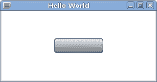

# 刚才发生了什么？

你可以看到，使用我们之前未提及的 `centerIn` 锚点绑定，矩形在窗口中居中。这是两个特殊锚点之一，提供便利，以避免编写过多的代码。使用 `centerIn` 等同于设置 `horizontalCenter` 和 `verticalCenter`。另一个便利绑定是 `fill`，它使一个项目占据另一个项目的整个区域（类似于在目标项目中将左、右、上、下锚点设置为相应的锚线）。

与为按钮设置纯色背景不同，我们声明背景为线性渐变。我们将一个`Gradient`元素绑定到`gradient`属性，并定义了两个`GradientStop`元素作为其子元素，其中我们指定了两种颜色进行混合。`Gradient`不继承自`Item`，因此不是一个可视的 Qt Quick 元素。相反，它只是一个作为渐变定义数据持有者的 QML 对象。

`Item`类型有一个名为`children`的属性，它包含一个项目可视子项（`Item`实例）的列表，还有一个名为`resources`的属性，它包含一个项目非可视对象（如`Gradient`或`GradientStop`）的列表。通常，在向项目添加可视或非可视对象时，你不需要使用这些属性，因为项目会自动将子对象分配到适当的属性中。请注意，在我们的代码中，`Gradient`对象不是`Rectangle`的子对象；它只是被分配到其`gradient`属性。

# 行动时间 - 添加按钮内容

下一步是向按钮添加文本和图标。首先，将图标文件复制到项目目录中。在 Qt Creator 中，在项目树中定位`qml.qrc`资源文件。在资源文件的上下文菜单中选择“添加现有文件”，并选择你的图标文件。文件将被添加到资源中，并出现在项目树中。我们的示例文件名为`edit-undo.png`，相应的资源 URL 为`qrc:/edit-undo.png`。

你可以通过在项目树中定位该文件并使用其上下文菜单中的“复制路径”或“复制 URL”选项来获取文件的资源路径或 URL。

接下来，我们将使用另一个名为`Row`的项目类型将图标和文本添加到我们的按钮中，如下所示：

```cpp
Rectangle {
    id: button
    anchors.centerIn: parent
    border { width: 1; color: "black" }
    radius: 5
    gradient: Gradient {
        GradientStop { position: 0; color: "#eeeeee" }
        GradientStop { position: 1; color: "#777777" }
    }
    width: buttonContent.width + 8
    height: buttonContent.height + 8

    Row {
        id: buttonContent
        anchors.centerIn: parent
        spacing: 4

        Image {
            id: buttonIcon
            source: "qrc:/edit-undo.png"
        }
        Text {
            id: buttonText
            text: "ButtonText"
        }
    }
}
```

你将得到以下输出：

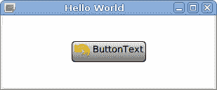

# 刚才发生了什么？

`Row`是`QtQuick`模块提供的**定位器**QML 类型。其目的是与`QtQuick.Layouts`模块中的`RowLayout`类型类似。`Row`项目将其子项在水平行中展开。它使得在不使用锚点的情况下定位一系列项目成为可能。`Row`具有`spacing`属性，它决定了项目之间应留多少空间。

`QtQuick`模块还包含`Column`类型，它将子项排列成一列，`Grid`类型创建一个项目网格，以及`Flow`类型，它将子项并排放置，并在必要时进行换行。

# 行动时间 - 正确设置按钮大小

当涉及到按钮的大小调整时，我们当前的面板定义仍然表现不佳。如果按钮内容非常小（例如，图标不存在或文本非常短），按钮看起来就不会很好。通常，按钮强制执行最小尺寸——如果内容小于指定的大小，按钮将扩展到允许的最小尺寸。另一个问题是，用户可能想要覆盖项的宽度和高度。在这种情况下，按钮的内容不应超出按钮的边界。让我们通过用以下代码替换 `width` 和 `height` 属性绑定来解决这两个问题：

```cpp
clip: true
implicitWidth: Math.max(buttonContent.implicitWidth + 8, 80)
implicitHeight: buttonContent.implicitHeight + 8 
```

# 刚才发生了什么？

`implicitWidth` 和 `implicitHeight` 属性可以包含项想要具有的期望大小。它是 Qt Widgets 中的 `sizeHint()` 的直接等效。通过使用这两个属性而不是 `width` 和 `height`（它们绑定到 `implicitWidth` 和

默认情况下，`implicitHeight`），我们允许我们的组件用户覆盖这些隐式值。当这种情况发生且用户没有设置足够宽或高的宽度或高度以包含按钮的图标和文本时，我们通过将 `clip` 属性设置为 `true` 来防止内容超出父项的边界。

剪裁可能会降低游戏性能，因此仅在必要时使用。

# 行动时间 - 将按钮制作成可重用组件

到目前为止，我们一直在处理单个按钮。通过复制代码、更改所有组件的标识符以及设置不同的属性绑定来添加另一个按钮是一项非常繁琐的任务。相反，我们可以将我们的按钮项变成一个真正的组件，即一个可以在需要时实例化多次的新 QML 类型。

首先，将文本光标定位在我们的 `Rectangle` 项的开头，然后在键盘上按 `Alt` + `Enter` 打开重构菜单，就像以下截图所示：

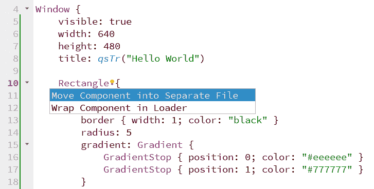

从菜单中选择 `将组件移动到单独的文件`。在弹出窗口中，为新的类型输入一个名称（例如，`Button`），并在 `main.qml` 的属性分配列表中勾选 `anchors.centerIn`：

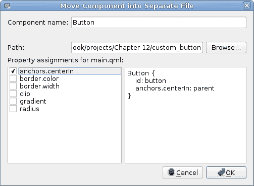

通过点击 `OK` 按钮接受对话框。

# 刚才发生了什么？

你可以看到，在项目中有一个名为 `Button.qml` 的新文件，它包含按钮项曾经拥有的所有内容，除了 `id` 和 `anchors.centerIn` 属性。主文件被简化为以下内容：

```cpp
Window {
    visible: true
    width: 640
    height: 480
    title: qsTr("Hello World")

    Button {
        id: button
        anchors.centerIn: parent
    }
}
```

`Button` 已经成为一个组件——一个新类型元素的定义，可以像标准 QML 元素类型一样使用。记住，QML 组件名称，以及代表它们的文件名称，需要以大写字母开头！如果你将文件命名为 `button.qml` 而不是 `Button.qml`，那么你将无法将 `Button` 作为组件名称使用，尝试使用 "button" 将会导致错误信息。这同样适用于两种情况——每个以大写字母开头的 QML 文件都可以被视为组件定义。

由于我们在对话框中检查了 `anchors.centerIn`，因此这个属性没有被移动到 `Button.qml`。选择这个方案的原因是我们的按钮可以放在任何地方，所以它不可能知道它应该如何定位。相反，按钮的定位应该在组件使用的地方完成。现在我们可以编辑 `main.qml`，将按钮放入布局或使用其他定位属性，而无需更改组件的代码。

# 导入组件

组件定义可以直接由位于组件定义同一目录中的其他 QML 文件使用。在我们的例子中，`main.qml` 和 `Button.qml` 文件位于同一目录中，因此你可以在 `main.qml` 中使用 `Button` QML 类型，而无需进行任何导入。

如果你需要访问一个位于其他文件中的组件定义，你将不得不首先导入包含该组件的模块，在你想使用它的文件中。模块的定义非常简单——它只是一个指向包含 QML 文件的 *目录* 的相对路径。这意味着如果你有一个名为 `Baz.qml` 的文件位于名为 `Base/Foo/Bar` 的目录中，并且你想要在 `Base/Foo/Ham.qml` 文件中使用 `Baz` 组件，你将不得不在 `Ham.qml` 中放置以下导入语句：

```cpp
import "Bar" 
```

如果你想要在 `Base/Spam.qml` 文件中使用相同的组件，你必须将导入语句替换为以下内容：

```cpp
import "Foo/Bar" 
```

导入一个模块会使它的所有组件都可用于使用。然后你可以声明从某个模块导入的类型对象。

# QML 和虚拟资源路径

我们的项目使用 Qt 资源文件将我们的 QML 文件嵌入到二进制文件中，并确保它们始终可用于应用程序，即使源目录在计算机上不存在。在启动期间，我们使用 `qrc:/main.qml` URL 引用主 QML 文件。这意味着运行时只看到资源文件中的文件层次结构，而不会考虑项目的实际源目录。

另一个 QML 文件具有 `qrc:/Button.qml` URL，因此 Qt 将它们视为同一虚拟目录，一切仍然正常。然而，如果你创建了一个 QML 文件但忘记将其添加到项目的资源中，Qt 将无法加载该文件。即使该文件与 `main.qml` 位于同一真实目录中，Qt 也只会搜索虚拟的 `qrc:/` 目录。

有可能将带有前缀的文件添加到资源中，在这种情况下，它可以有一个类似于`qrc:/some/prefix/Button.qml`的 URL，并且运行时将其视为另一个虚拟目录。话虽如此，除非你明确创建一个新的前缀，否则你应该没问题。如果你的 QML 文件组织在子目录中，当你将它们添加到资源文件时，它们的层次结构将被保留。

# 事件处理器

Qt Quick 旨在用于创建高度交互的用户界面。它提供了一些元素来从用户那里获取输入事件。在本节中，我们将介绍它们，并了解如何有效地使用它们。

# 行动时间 - 使按钮可点击

到目前为止，我们的组件看起来就像一个按钮。下一个任务是让它对鼠标输入做出响应。

`MouseArea` QML 类型定义了一个透明的矩形，它公开了与鼠标输入相关的多个属性和信号。常用的信号包括`clicked`、`pressed`和`released`。让我们做一些练习，看看这个元素如何使用。

打开`Button.qml`文件，并将一个`MouseArea`子项添加到按钮中，使用锚点使其填充按钮的整个区域。将此元素命名为`buttonMouseArea`。在项的主体中放入以下代码：

```cpp
Rectangle {
    id: button
    // ...
    Row { ... }
    MouseArea {
        id: buttonMouseArea
        anchors.fill: parent
        onClicked: button.clicked()
    }
} 
```

此外，在按钮对象中 ID 声明之后设置以下声明：

```cpp
Rectangle {
    id: button
    signal clicked()
    // ...
} 
```

要测试修改，请转到`main.qml`文件并为按钮添加一个信号处理器：

```cpp
Button {
    id: button
    anchors.centerIn: parent
    onClicked: console.log("Clicked!")
}
```

然后，运行程序并点击按钮。你会在 Qt Creator 的控制台中看到你的消息被打印出来。

# 刚才发生了什么？

使用`signal clicked()`语句，我们声明按钮对象可以发出一个名为`clicked`的信号。使用`MouseArea`项，我们定义了一个矩形区域（覆盖整个按钮），它对鼠标事件做出反应。然后，我们定义了`onClicked`，这是一个信号处理器。对于对象拥有的每个信号，都可以将一个脚本绑定到以信号名称命名并以前缀“on”开头的处理器；因此，对于`clicked`信号，处理器被调用为`onClicked`，对于`valueChanged`，它被调用为`onValueChanged`。

在这个特定的情况下，我们定义了两个处理器——一个用于按钮，我们在控制台中写入一个简单的语句；另一个用于`MouseArea`元素，我们调用按钮的信号函数，实际上发出了该信号。

`MouseArea`具有更多功能，因此现在让我们尝试正确使用它们，使我们的按钮功能更丰富。

# 行动时间 - 可视化按钮状态

目前，点击按钮时没有视觉反应。在现实世界中，按钮有一定的深度，当你按下它并从上方看时，其内容似乎会稍微向右和向下移动。让我们通过利用 `MouseArea` 具有的表示鼠标按钮是否当前被按下的 `pressed` 属性来模拟这种行为（注意，`pressed` 属性与之前提到的 `pressed` 信号不同）。按钮的内容由 `Row` 元素表示，因此在其定义内添加以下语句：

```cpp
Row {
    id: buttonContent
    // ...
    anchors.verticalCenterOffset: buttonMouseArea.pressed ? 1 : 0
    anchors.horizontalCenterOffset: buttonMouseArea.pressed ? 1 : 0
    // ...
} 
```

我们还可以在鼠标光标悬停在按钮上时改变文本颜色。为此，我们必须做两件事。首先，让我们通过设置 `MouseArea` 的 `hoverEnabled` 属性来启用接收悬停事件：

```cpp
hoverEnabled: true 
```

当此属性被设置时，`MouseArea` 将在检测到鼠标光标在其自身区域上方时，将其 `containsMouse` 属性设置为 `true`。我们可以使用这个值来设置文本颜色：

```cpp
Text {
  id: buttonText
  text: "ButtonText"
  color: buttonMouseArea.containsMouse ? "white" : "black"
} 
```

# 刚才发生了什么？

在最后一个练习中，我们学习了如何使用 `MouseArea` 的一些属性和信号来使按钮组件更具交互性。然而，该元素具有更多功能。特别是，如果启用了悬停事件，你可以通过返回值的 `mouseX` 和 `mouseY` 属性在项目的局部坐标系中获取当前鼠标位置。也可以通过处理 `positionChanged` 信号来报告光标位置。说到信号，大多数 `MouseArea` 信号都携带一个 `MouseEvent` 对象作为其参数。这个参数被称为 `mouse`，并包含有关鼠标当前状态的有用信息，包括其位置和当前按下的按钮。默认情况下，`MouseArea` 只对左键鼠标按钮做出反应，但你可以使用 `acceptedButtons` 属性来选择它应该处理哪些按钮。以下示例展示了这些功能：

```cpp
MouseArea {
    id: buttonMouseArea
    anchors.fill: parent
    hoverEnabled: true
    acceptedButtons: Qt.LeftButton | Qt.MiddleButton | Qt.RightButton
    onClicked: {
        switch(mouse.button) {
            case Qt.LeftButton:
                console.log("Left button clicked"); break;
            case Qt.MiddleButton:
                console.log("Middle button clicked"); break;
            case Qt.RightButton:
                console.log("Right button clicked"); break;
        }
    }
    onPositionChanged: {
        console.log("Position: [" + mouse.x + "; " + mouse.y + "]");
    }
} 
```

# 动作时间 - 通知环境按钮状态

我们添加了一些代码，通过改变其视觉特性使按钮看起来更自然。现在，让我们扩展按钮编程接口，以便开发者可以使用更多按钮功能。

我们可以做的第一件事是通过引入一些新的属性来使按钮颜色可定义。让我们将高亮代码放在按钮组件定义的开始部分：

```cpp
Rectangle {
    id: button
    property color topColor: "#eeeeee"
    property color bottomColor: "#777777"
    property color textColor: "black"
    property color textPressedColor: "white"
    signal clicked() 
```

然后，我们将使用新的背景渐变定义：

```cpp
gradient: Gradient {
    GradientStop { position: 0; color: button.topColor }
    GradientStop { position: 1; color: button.bottomColor }
} 
```

现在是文本颜色：

```cpp
Text {
    id: buttonText
    text: "ButtonText"
    color: buttonMouseArea.pressed ?
        button.textPressedColor : button.textColor
} 
```

正如你所注意到的，我们使用了 `MouseArea` 的 `pressed` 属性来检测当前是否在区域上按下鼠标按钮。我们可以给我们的按钮配备一个类似的属性。将以下代码添加到 `Button` 组件的顶级 `Rectangle` 中：

```cpp
property alias pressed: buttonMouseArea.pressed 
```

# 刚才发生了什么？

第一组更改引入了四个新属性，定义了四种颜色，我们在稍后用于定义按钮的渐变和文本颜色的语句中使用了这些颜色。在 QML 中，您可以使用`property`关键字为对象定义新属性。关键字后面应跟属性类型和属性名。QML 理解许多属性类型，最常见的是`int`、`real`、`string`、`font`和`color`。属性定义可以包含一个可选的默认值，用冒号开头。对于按下属性的定义，情况则不同。

您可以看到，对于属性类型，定义中包含单词`alias`。它不是一个属性类型，而是一个指示符，表示该属性实际上是另一个属性的别名——每次访问按钮的`pressed`属性时，都会返回`buttonMouseArea.pressed`属性的值，并且每次属性值改变时，实际上是鼠标区域的属性发生了变化。使用常规属性声明时，您可以提供任何有效的表达式作为默认值，因为表达式绑定到属性上。而对于属性别名，情况则不同——值是强制性的，并且必须指向相同或另一个对象中存在的属性。

考虑以下两个定义：

```cpp
property int foo: someobject.prop
property alias bar: someobject.prop 
```

初看之下，它们似乎很相似，因为它们指向相同的属性，因此返回的属性值也相同。然而，实际上这两个属性非常不同，如果您尝试修改它们的值，这一点就会变得明显：

```cpp
  foo = 7
  bar = 7 
```

第一个属性实际上绑定了一个表达式，因此将`7`赋值给`foo`只是释放了绑定，并将值`7`赋给`foo`属性，而`someobject.prop`保持其原始值。然而，第二个语句是一个别名；因此，赋值新值将修改应用到别名实际指向的`someobject.prop`属性。

谈到属性，当属性值被修改时，有一个简单的方法可以做出反应。对于每个现有的属性，都有一个处理程序可用，每当属性值被修改时就会执行。处理程序名称是`on`后跟属性名，然后是单词`Changed`，全部使用驼峰式命名法——因此，对于`foo`属性，它变为`onFooChanged`，对于`topColor`，它变为`onTopColorChanged`。要将按钮的当前按下状态记录到控制台，我们只需要为这个属性实现属性更改处理程序：

```cpp
Button {
    // ...

    onPressedChanged: {
        console.log("The button is currently " +
                    (pressed ? "" : "not ") + "pressed")
    }
}
```

在这个例子中，我们创建了一个功能齐全的自定义 QML 组件。我们的按钮能够响应鼠标输入，并向用户公开一些有用的属性和信号。这使得它成为一个可重用和可定制的对象。在实际项目中，始终考虑 UI 中的重复部分，并考虑将它们移动到单个组件中，以减少代码重复。

# 触摸输入

`MouseArea` 是输入事件元素中最简单的。如今，越来越多的设备具有触摸功能，Qt Quick 也能处理它们。目前，我们有三种处理触摸输入的方法。

首先，简单的触摸事件也被报告为鼠标事件。在屏幕上轻触和滑动手指可以使用 `MouseArea` 处理，就像鼠标输入一样。

# 动作时间 - 在周围拖动项

创建一个新的 Qt Quick 应用程序 - 空项目。编辑 `main.qml` 文件，向窗口添加一个圆圈：

```cpp
Rectangle {
    id: circle
    width: 60; height: width
    radius: width / 2
    color: "red"
} 
```

接下来，向圆圈添加一个 `MouseArea` 并使用其 `drag` 属性通过触摸（或鼠标）启用圆圈的移动：

```cpp
Rectangle {
    //...
    MouseArea {
        anchors.fill: parent
        drag.target: circle
    }
}
```

然后，您可以启动应用程序并开始移动圆圈。

# 发生了什么？

通过定义一个高度等于宽度的矩形来创建一个圆圈，使其成为正方形，并将边框圆滑到边长的一半。可以使用 `drag` 属性来告诉 `MouseArea` 使用输入事件来管理给定项的位置，这些事件流入此 `MouseArea` 元素。我们使用 `target` 子属性来表示要拖动的项。您可以使用其他子属性来控制项可以移动的轴或限制移动到给定区域。需要记住的一个重要事情是，正在拖动的项不能在请求拖动的轴上锚定；否则，项将尊重锚点而不是拖动。我们没有将圆圈项锚定，因为我们希望它可以在两个轴上拖动。

处理 Qt Quick 应用程序中触摸输入的第二种方法是使用 `PinchArea`，它是一个类似于 `MouseArea` 的项，但不是拖动项，而是允许您使用两个手指（所谓的“捏合”手势）旋转或缩放它，如图所示：

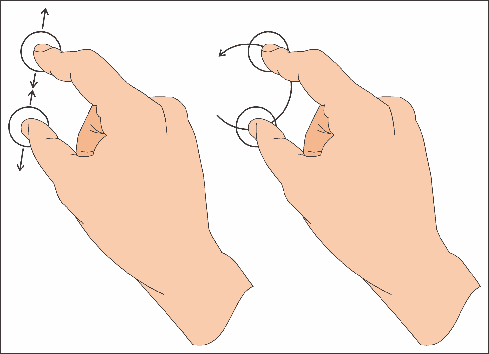

请注意，`PinchArea` 只对触摸输入做出反应，因此要测试示例，您需要一个真正的多点触控设备。

# 动作时间 - 通过捏合旋转和缩放图片

启动一个新的 Qt Quick 应用程序 - 空项目。向资源中添加一个图像文件，就像我们在之前的按钮项目中做的那样。在 `main.qml` 文件中，向窗口添加一个图像并将其居中在其父元素中：

```cpp
Image {
    id: image
    anchors.centerIn: parent
    source: "qrc:/wilanow.jpg"
}
```

现在，我们将添加一个 `PinchArea` 元素。这种类型的项可以用两种方式使用——要么通过手动实现信号处理程序 `onPinchStarted`、`onPinchUpdated` 和 `onPinchFinished` 来完全控制手势的功能，要么使用类似于 `MouseArea` 的 `drag` 属性的简化接口。由于简化接口正好符合我们的需求，因此不需要手动处理捏合事件。让我们将以下声明添加到文件中：

```cpp
PinchArea {
    anchors.fill: parent
    pinch {
        target: image
        minimumScale: 0.2
        maximumScale: 2.0
        minimumRotation: -90
        maximumRotation: 90
    }
}
```

您将得到以下截图类似的输出：

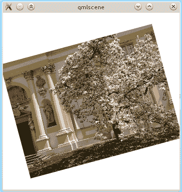

# 发生了什么？

我们简单的应用程序加载一张图片并将其在视图中居中。然后，有一个`PinchArea`项目填充视图区域，它被指示对图像对象进行操作。我们定义了项目缩放和旋转的范围。其余的由`PinchArea`项目本身处理。如果你开始与该应用程序交互，你会看到项目旋转和缩放。实际上幕后的操作是`PinchArea`修改了每个 Qt Quick 项目所拥有的两个属性值——`rotation`和`scale`。

`PinchArea`也可以通过`pinch.dragAxis`控制项目的拖动，就像`MouseArea`通过拖动一样，但为了简单起见，我们没有使用这个 API 的部分。请随意在你的代码中实验它。

# 挑战英雄——使用鼠标旋转和缩放

当然，你不必使用`PinchArea`来旋转或缩放项目。控制这些方面的属性是常规属性，你可以在任何时候读取和写入它们。尝试将`PinchArea`替换为`MouseArea`，以获得类似我们刚刚通过修改缩放和旋转属性来修改的结果——当用户在按下左键的同时拖动鼠标时，图像被缩放；当用户在按下右键的同时做同样的事情时，图像被旋转。

如果你完成了这个任务，尝试再次将`MouseArea`替换为`PinchArea`，但这次，不是使用`pinch`属性，而是手动处理事件以获得相同的效果（事件对象称为`pinch`，它具有许多你可以操作的属性）。

处理触摸输入的第三种方法是使用`MultiPointTouchArea`项目。它通过分别报告每个触摸点提供对手势的低级接口。它可以用来创建类似于`PinchArea`的自定义高级手势处理器。

# 键盘输入

到目前为止，我们一直在处理指针输入，但用户输入不仅仅是那样——我们还可以处理键盘输入。这相当简单，基本上可以归结为两个简单的步骤。

首先，你必须通过声明特定项目具有键盘焦点来启用接收键盘事件：

```cpp
focus: true 
```

然后，你可以通过以类似鼠标事件的方式编写处理程序来开始处理事件。然而，`Item`没有提供自己的处理程序来操作键，这是`QWidget`的`keyPressEvent`和`keyReleaseEvent`的对应物。相反，`Keys`附加属性提供了适当的处理程序。

附加属性是由不作为独立元素使用但通过附加到其他对象来提供属性的元素提供的。这是在不修改原始元素 API 的情况下添加对新属性支持的一种方式（它不是通过一个**is-a**关系添加新属性，而是通过一个**has-a**关系）。每个引用附加属性的对象都会获得一个附加对象的副本，然后处理额外的属性。我们将在本章的后面回到附加属性。现在，你只需要记住，在某些情况下，一个元素可以获取不属于其 API 的附加属性。

让我们回到实现键盘输入的事件处理器。正如我们之前所说的，每个 Item 都有一个名为`Keys`的附加属性，它允许我们安装自己的键盘处理器。`Keys`为`Item`添加的基本两个信号是`pressed`和`released`；因此，我们可以实现带有`KeyEvent`参数的`onPressed`和`onReleased`处理器，这些参数提供的信息与在控件世界中`QKeyEvent`类似。作为一个例子，我们可以看到一个检测空格键被按下的项目：

```cpp
Rectangle {
    focus: true
    color: "black"
    width: 100
    height: 100
    Keys.onPressed: {
        if(event.key === Qt.Key_Space) {
             color = "red";
        }
    }
    Keys.onReleased: {
        if(event.key === Qt.Key_Space) {
            color = "blue";
        }
    }
}
```

如果你想在同一个项目中处理许多不同的键，这可能会变得有问题，因为`onPressed`处理器可能包含一个巨大的 switch 部分，为每个可能的键提供分支。幸运的是，`Keys`提供了更多的属性。大多数常用的键（但不是字母）都有它们自己的处理器，当特定键被按下时会被调用。因此，我们可以轻松实现一个项目，根据最后按下的键来改变不同的颜色：

```cpp
Rectangle {
    //...
    focus: true
    Keys.onSpacePressed:      color = "purple"
    Keys.onReturnPressed:     color = "navy"
    Keys.onVolumeUpPressed:   color = "blue"
    Keys.onRightPressed:      color = "green"
    Keys.onEscapePressed:     color = "yellow"
    Keys.onTabPressed:        color = "orange"
    Keys.onDigit0Pressed:     color = "red"
} 
```

注意，即使键有自己的按下信号，`released`信号也会为每个释放的键发出。

现在，考虑另一个例子：

```cpp
Item {
    id: item
    property int number: 0
    width: 200; height: width
    focus: true
 Keys.onSpacePressed: {
 number++;
 }
    Text {
        text: item.number
        anchors.centerIn: parent
    }
}
```

我们预期当我们按下并保持空格键时，我们会看到文本从`0`变为`1`并保持在那个值，直到我们释放键。如果你运行示例，你会看到相反的情况，数字会一直增加，只要你按住键。这是因为默认情况下，键会自动重复——当你按住键时，操作系统会持续发送一系列的按键-释放事件（你可以通过在`Keys.onPressed`和`Keys.onReleased`处理器中添加`console.log()`语句来验证这一点）。为了抵消这种效果，你可以区分自动重复和常规事件。在 Qt Quick 中，你可以轻松地做到这一点，因为每个按键事件都携带适当的信息。只需用以下处理器替换上一个示例中的处理器：

```cpp
Keys.onSpacePressed: {
    if(!event.isAutoRepeat) {
        number++;
    }
}
```

我们在这里使用的事件变量是 `spacePressed` 信号的参数名称。由于我们无法像在 C++ 中那样为参数声明自己的名称，对于每个信号处理程序，您将不得不在文档中查找参数的名称。您可以在文档索引中搜索 `Keys` 以打开 `Keys QML 类型` 页面。信号列表将包含信号参数的类型和名称，例如，`spacePressed(KeyEvent event)`。

在处理事件时，您应该将其标记为已接受，以防止其传播到其他元素并由它们处理：

```cpp
Keys.onPressed: {
    if(event.key === Qt.Key_Space) {
        color = "blue";
        event.accepted = true;
    }
}
```

然而，如果您使用针对单个按钮的专用处理程序（如 `onSpacePressed`），则不需要接受事件，因为 Qt 会自动为您处理。

在标准的 C++ 应用程序中，我们通常使用 *Tab* 键在可聚焦项之间导航。在游戏（以及通用的流体用户界面）中，更常见的是使用箭头键进行项目导航。当然，我们可以通过使用 `Keys` 附加属性，并为每个我们想要修改所需项目焦点属性的项添加 `Keys.onRightPressed`、`Keys.onTabPressed` 和其他信号处理程序来处理这种情况，但这会使我们的代码很快变得杂乱。Qt Quick 再次伸出援手，通过提供 `KeyNavigation` 附加属性，旨在处理这种特定情况，并允许我们极大地简化所需的代码。现在，我们只需指定在触发特定键时哪个项目应该获得焦点：

```cpp
Row {
    spacing: 5
    Rectangle {
        id: first
        width: 50; height: width
        color: focus ? "blue" : "lightgray"
        focus: true
        KeyNavigation.right: second
    }
    Rectangle {
        id: second
        width: 50; height: width
        color: focus ? "blue" : "lightgray"
        KeyNavigation.right: third
    }
    Rectangle {
        id: third
        width: 50; height: width
        color: focus ? "blue" : "lightgray"
    }
} 
```

注意，我们通过显式设置 `focus` 属性，使第一个项目在开始时获得焦点。通过设置 `KeyNavigation.right` 属性，我们指示 Qt 在此项目接收到右键按下事件时关注指定的项目。反向转换会自动添加——当在第二个项目上按下左键时，第一个项目将获得焦点。除了 `right`，`KeyNavigation` 还包含 `left`、`down`、`up`、`tab` 和 `backtab` (*Shift* + *Tab*) 属性。

`Keys` 和 `KeyNavigation` 附加属性都有一种定义的方式

每个机制接收事件顺序。这由 `priority` 属性处理，可以设置为 `BeforeItem` 或 `AfterItem`。默认情况下，`Keys` 将首先获取事件（`BeforeItem`），然后进行内部事件处理，最后 `KeyNavigation` 将有机会处理该事件（`AfterItem`）。请注意，如果事件被其中一个机制处理，则事件被接受，其余机制将不会收到该事件。

# 尝试一下英雄——练习键事件传播

作为练习，你可以通过构建一个更大的项目数组（你可以使用`Grid`元素来定位它们）并定义一个使用`KeyNavigation`附加属性的导航系统来扩展我们最后的例子。让一些项目使用`Keys`附加属性自行处理事件。看看当相同的键由两种机制处理时会发生什么。尝试使用`priority`属性来影响行为。

当你将项目的`focus`属性设置为`true`时，任何之前使用的项目都会失去焦点。当你尝试编写一个需要将其子项设置为焦点的可重用组件时，这会成为一个问题。如果你将此类组件的多个实例添加到单个窗口中，它们的焦点请求将相互冲突。只有最后一个创建的项目将具有焦点，因为它是最先创建的。为了克服这个问题，Qt Quick 引入了**焦点域**的概念。通过将你的组件包裹在一个`FocusScope`项目中，你将获得在组件内部设置焦点而不直接影响全局焦点的能力。当你的组件实例收到焦点时，内部聚焦的项目也将收到焦点，并将能够处理键盘事件。关于此功能的良好解释可以在 Qt Quick 中的键盘焦点文档页面上找到。

# 文本输入字段

除了我们描述的附加属性之外，Qt Quick 还提供了处理键盘输入的内置元素。其中两种最基本类型是`TextInput`和`TextEdit`，它们是`QLineEdit`和`QTextEdit`的 QML 等价物。前者用于单行文本输入，而后者作为其多行对应物。它们都提供光标处理、撤销-重做功能和文本选择。你可以通过将验证器分配给`validator`属性来验证`TextInput`中输入的文本。例如，为了获取一个用户可以输入点分隔 IP 地址的项目，我们可以使用以下声明：

```cpp
TextInput {
    id: ipAddress
    width: 100
    validator: RegExpValidator {
        // four numbers separated by dots
        regExp: /\d+\.\d+\.\d+\.\d+/
    }
    focus: true
} 
```

正则表达式仅验证地址的格式。用户仍然可以插入无效的数字。你应该在使用地址之前进行适当的检查，或者提供一个更复杂的正则表达式，以限制用户可以输入的数字范围。

需要记住的一点是，无论是`TextInput`还是`TextEdit`都没有任何视觉外观（除了它们包含的文本和光标），因此如果你想要给用户一些视觉提示以表明项目所在的位置，最简单的解决方案是将它包裹在一个样式化的矩形中：

```cpp
Rectangle {
  id: textInputFrame
  width: 200
  height: 40
  border { color: "black"; width: 2 }
  radius: 10
  antialiasing: true
  color: "darkGray"
}
TextInput {
  id: textInput
  anchors.fill: textInputFrame
  anchors.margins: 5
  font.pixelSize: height-2
  verticalAlignment: TextInput.AlignVCenter
  clip: true
} 
```

注意，高亮显示的代码——`textInput`的`clip`属性——被启用，这样默认情况下，如果框中输入的文本不适合项目，它将溢出并保持可见，超出实际项目之外。通过启用裁剪，我们明确表示任何不适合项目的任何内容都不应该被绘制。

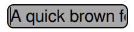

`QtQuick.Controls` 模块提供了更高级的文本输入控件，例如 `TextField` 和 `TextArea`。我们已经在 第十一章，*Qt Quick 简介* 中使用了它们。

# 游戏手柄输入

处理游戏手柄事件是在开发游戏时一个非常常见的任务。幸运的是，Qt 提供了 Qt Gamepad 模块来实现这一目的。我们已经在 C++ 中学习了如何使用它。现在让我们看看如何在 QML 应用程序中实现这一点。

要启用 Qt Gamepad 模块，请在项目文件中添加 `QT += gamepad`。接下来，在您的 QML 文件开头添加以下行以导入 QML 模块：

```cpp
import QtGamepad 1.0
```

此导入允许您声明 `Gamepad` 类型的对象。在您的顶级 QML 对象内部添加以下对象：

```cpp
 Gamepad {
     id: gamepad
     deviceId: GamepadManager.connectedGamepads.length > 0 ? 
         GamepadManager.connectedGamepads[0] : -1
 }
```

`GamepadManager` 对象允许我们列出系统中可用的游戏手柄标识符。如果系统中存在任何游戏手柄，我们将使用第一个可用的游戏手柄。如果您希望游戏动态地拾取连接的游戏手柄，请使用以下代码片段：

```cpp
    Connections {
        target: GamepadManager
        onGamepadConnected: gamepad.deviceId = deviceId
    }
```

# 刚才发生了什么？

上述代码仅为 `GamepadManager` 对象的 `gamepadConnected` 信号添加了一个信号处理器。通常，添加信号处理器的做法是直接在发送者的部分声明它。然而，在这种情况下我们无法这样做，因为 `GamepadManager` 是一个现有的全局对象，它不属于我们的 QML 对象树。因此，我们使用 `Connections` QML 类型，它允许我们指定一个任意的发送者（使用 `target` 属性）并将其信号处理器附加到它。您可以将 `Connections` 视为 `QObject::connect` 调用的声明性版本。

初始化已完成，因此我们现在可以使用 `gamepad` 对象来请求有关游戏手柄输入的信息。有两种方法可以实现这一点。

首先，我们可以使用属性绑定来根据游戏手柄上按下的按钮设置其他对象的属性：

```cpp
Text {
    text: gamepad.buttonStart ? "Start!" : ""
}
```

每当在游戏手柄上按下或释放开始按钮时，`gamepad.buttonStart` 属性的值将被设置为 `true` 或 `false`，并且 QML 引擎将自动更新显示的文本。

第二种方法是添加一个信号处理器来检测属性何时发生变化：

```cpp
Gamepad {
    //...
    onButtonStartChanged: {
        if (value) {
            console.log("start pressed");
        } else {
            console.log("start released");
        }
    }
}
```

`Gamepad` QML 类型为每个游戏手柄按钮都提供了一个单独的属性和信号，就像 `QGamepad` C++ 类一样。

您还可以使用 `GamepadKeyNavigation` QML 类型将游戏手柄支持引入支持键盘输入的游戏：

```cpp
GamepadKeyNavigation {
    gamepad: gamepad
    active: true
    buttonStartKey: Qt.Key_S
}
```

当在您的 QML 文件中声明此对象时，`gamepad` 对象提供的游戏手柄事件将自动转换为按键事件。默认情况下，`GamepadKeyNavigation` 能够在按下相应的游戏手柄按钮时模拟上、下、左、右、后退、前进和回车键。但是，您可以覆盖默认映射或为其他游戏手柄按钮添加自己的映射。在上面的示例中，我们告诉 `GamepadKeyNavigation`，游戏手柄上的开始键应像按下键盘上的 *S* 键一样工作。现在您可以像处理任何常规键盘事件一样处理这些事件。

# 传感器输入

Qt 正在扩展到更多现在使用的平台。这包括许多流行的移动平台。移动设备通常配备有额外的硬件，这些硬件在桌面系统中较少见。让我们看看如何在 Qt 中处理传感器输入，以便您可以在游戏中使用它。

本节中讨论的大多数功能通常在桌面上不可用。如果您想尝试它们，您需要在移动设备上设置运行 Qt 应用程序。这需要一些配置步骤，这些步骤取决于您的目标平台。请参阅 Qt 文档以获取确切说明，因为它们将提供完整且最新的信息，这在书中是无法提供的。良好的起点是“Qt for Android 入门”和“Qt for iOS”文档页面。

通过 Qt Sensors 模块提供对移动设备上传感器的访问，在使用之前必须导入：

```cpp
import QtSensors 5.0
```

有许多 QML 类型可以用来与传感器交互。看看这个令人印象深刻的列表：

| **QML 类型** | **描述** |
| --- | --- |
| `Accelerometer` | 报告设备沿 *x*、*y* 和 *z* 轴的线性加速度。 |
| `Altimeter` | 报告相对于平均海平面的高度，单位为米。 |
| `AmbientLightSensor` | 报告环境光的强度。 |
| `AmbientTemperatureSensor` | 报告当前设备环境的温度，单位为摄氏度。 |
| `Compass` | 报告设备顶部的方位角，单位为从磁北方向起的度数。 |
| `DistanceSensor` | 报告从对象到设备的距离，单位为厘米。 |
| `Gyroscope` | 报告设备在其轴上的运动，单位为每秒度数。 |
| `HolsterSensor` | 报告设备是否被放置在特定的口袋中。 |
| `HumiditySensor` | 报告湿度。 |
| `IRProximitySensor` | 报告发出的红外光的反射率。范围从 0（无反射）到 1（完全反射）。 |
| `LidSensor` | 报告设备是否关闭。 |
| `LightSensor` | 报告光的强度，单位为勒克斯。 |
| `Magnetometer` | 报告设备沿其轴线的磁通密度。 |
| `OrientationSensor` | 报告设备的方向。 |
| `PressureSensor` | 报告大气压力，单位为帕斯卡。 |
| `ProximitySensor` | 报告对象是否靠近设备。被认为是“靠近”的距离取决于设备。 |
| `RotationSensor` | 报告定义设备在三维空间中方向的三个角度。 |
| `TapSensor` | 报告设备是否被轻触。 |
| `TiltSensor` | 报告设备轴上的倾斜角度（以度为单位）。 |

不幸的是，并非所有平台都支持所有传感器。在尝试使用它们之前，请查看兼容性映射文档页面，以了解您的目标平台支持哪些传感器。

所有这些类型都继承自 `Sensor` 类型，并提供类似的 API。首先，创建一个传感器对象，并通过将其 `active` 属性设置为 `true` 来激活它。当硬件报告新值时，它们将被分配给传感器的 `reading` 属性。与 QML 中的任何属性一样，您可以选择直接使用属性、在属性绑定中使用它或使用 `onReadingChanged` 处理器来对属性的每个新值做出反应。

`reading` 对象的类型对应于传感器的类型。例如，如果您使用倾斜传感器，您将收到一个 `TiltReading` 对象，该对象提供适当的属性来访问围绕 `x`（`xRotation`）和 `y`（`yRotation`）轴的倾斜角度。对于每种传感器类型，Qt 都提供相应的读取类型，其中包含传感器数据。

所有读取都还有一个 `timestamp` 属性，它包含自某个固定点以来的微秒数。这个点对于不同的传感器对象可能不同，因此您只能用它来计算同一传感器两次读取之间的时间间隔。

以下 QML 代码包含使用倾斜传感器的完整示例：

```cpp
import QtQuick 2.9
import QtQuick.Window 2.2
import QtSensors 5.0
Window {
    visible: true
    width: 640
    height: 480
    title: qsTr("Hello World")
    Text {
        anchors.centerIn: parent
        text: {
            if (!tiltSensor.reading) {
                return "No data";
            }
            var x = tiltSensor.reading.xRotation;
            var y = tiltSensor.reading.yRotation;
            return "X: " + Math.round(x) +
                   " Y: " + Math.round(y)
        }
    }
    TiltSensor {
        id: tiltSensor
        active: true
        onReadingChanged: {
            // process new reading
        }
    }
}
```

当此应用程序接收到新的读数时，屏幕上的文本将自动更新。您还可以使用 `onReadingChanged` 处理器以其他方式处理新数据。

# 检测设备位置

一些现代游戏需要关于玩家地理位置和其他相关数据的信息，例如移动速度。Qt 定位模块允许您访问这些信息。让我们看看一个基本的 QML 示例，用于确定位置：

```cpp
import QtQuick 2.9
import QtQuick.Window 2.2
import QtPositioning 5.0
Window {
    visible: true
    width: 640
    height: 480
    title: qsTr("Hello World")
    Text {
        anchors.centerIn: parent
        text: {
            var pos = positionSource.position;
            var coordinate = pos.coordinate;
            return "latitude: " + coordinate.latitude +
              "\nlongitude: " + coordinate.longitude;
        }
    }
    PositionSource {
        id: positionSource
        active: true
        onPositionChanged: {
            console.log("pos changed",
                        position.coordinate.latitude,
                        position.coordinate.longitude);
        }
    }
}
```

首先，我们将 `QtPositioning` 模块导入作用域。接下来，我们创建一个 `PositionSource` 对象并将其 `active` 属性设置为 `true`。当有新信息可用时，`PositionSource` 对象的 `position` 属性将自动更新。除了纬度和经度外，此属性还包含有关海拔、方向、速度和位置准确性的信息。由于某些值可能不可用，每个值都附带一个布尔属性，指示数据是否存在。例如，如果 `directionValid` 为 `true`，则 `direction` 值已设置。

有多种方法可以确定玩家的位置。`PositionSource`类型有几个属性，允许你指定数据的来源。首先，`preferredPositioningMethods`属性允许你在卫星数据、非卫星数据或同时使用两者之间进行选择。`supportedPositioningMethods`属性包含有关当前可用方法的信息。你还可以使用`nmeaSource`属性提供一个 NMEA 位置指定数据文件，该文件覆盖任何其他数据源，并可用于模拟设备的位置和移动，这在游戏开发和测试期间非常有用。

# 创建高级 QML 组件

到现在为止，你应该已经熟悉了 QML 和 Qt Quick 的非常基础的知识。现在，我们可以开始结合你所知道的知识，并用更多信息来填补空白，以构建更高级的 QML 组件。我们的目标是显示一个模拟时钟。

# 是时候动手做一个简单的模拟时钟应用程序了

创建一个新的 Qt Quick 应用程序 - 空项目。为了创建一个时钟，我们将实现一个代表时钟指针的组件，并且我们将在实际的时钟元素中使用该组件的实例。除此之外，我们还将使时钟成为一个可重用的组件；因此，我们将它创建在一个单独的文件中，并在`main.qml`内部实例化它：

```cpp
Window {
    visible: true
    width: 640
    height: 480
    title: qsTr("Hello World")

    Clock {
        id: clock
        anchors {
            fill: parent
            margins: 20
        }
    }
}
```

我们使用`anchors`属性组来扩展项目，使其适应整个窗口，除了四周各 20 像素的边距。

然而，在这段代码工作之前，我们需要为`Clock`组件添加一个新的 QML 文件。在项目树中定位`qml.qrc`资源文件，并在其上下文菜单中选择“添加新...”。从“Qt”类别中选择“QML 文件（Qt Quick 2）”，输入`Clock`作为名称，并确认操作。将创建一个名为`Clock.qml`的新文件，并将其添加到资源列表中。

让我们从声明一个圆形钟表盘开始：

```cpp
import QtQuick 2.9

Item {
    id: clock

    property color color: "lightgray"

    Rectangle {
        id: plate

        anchors.centerIn: parent
        width: Math.min(clock.width, clock.height)
        height: width
        radius: width / 2
        color: clock.color
        border.color: Qt.darker(color)
        border.width: 2
    }
} 
```

如果你现在运行程序，你会看到一个朴素的灰色圆圈，几乎无法与钟表盘相提并论：

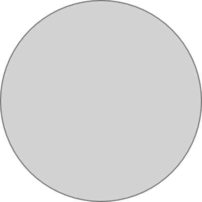

下一步是添加将盘面分成 12 个部分的标记。我们可以通过在`plate`对象内部放置以下声明来实现：

```cpp
Repeater {
    model: 12

    Item {
        id: hourContainer

        property int hour: index
        height: plate.height / 2
        transformOrigin: Item.Bottom
        rotation: index * 30
        x: plate.width/2
        y: 0

        Rectangle {
            width: 2
            height: (hour % 3 == 0) ? plate.height * 0.1
                                    : plate.height * 0.05
            color: plate.border.color
            antialiasing: true
            anchors.horizontalCenter: parent.horizontalCenter
            anchors.top: parent.top
            anchors.topMargin: 4
        }
    }
} 
```

运行程序现在应该给出以下结果，看起来更像是一个钟表盘：


# 刚才发生了什么？

我们刚才创建的代码引入了一些新功能。让我们逐一介绍它们。

首先，我们使用了一个名为 `Repeater` 的新元素。它确实如其名所示—使用给定的模型重复其内部声明的项。对于模型中的每个条目，它都会为名为 `delegate` 的属性分配的组件创建一个实例（属性名意味着它包含一个实体，调用者将一些责任委托给它，例如描述一个调用者用作模板的组件）。在 `Repeater` 中声明的 `Item` 描述了代理，尽管我们无法明确看到它被分配给任何属性。这是因为 `delegate` 是 `Repeater` 类型的默认属性，这意味着任何未明确分配给任何属性的任何内容都会隐式地分配给类型的默认属性。

`Item` 类型还有一个默认属性称为 `data`。它包含一个元素列表，该列表会自动拆分为两个 "子列表"—一个是项的子元素列表（这创建了 Qt Quick 中 `Item` 实例的层次结构）和另一个名为资源的列表，其中包含所有不继承自 `Item` 的 "子" 元素。你可以直接访问这三个列表，这意味着调用 `children[2]` 将返回在项中声明的第三个 `Item` 元素，而 `data[5]` 将返回在 `Item` 中声明的第六个元素，无论给定的元素是否是一个视觉项（继承自 `Item`）。

模型可以是一系列事物，但就我们而言，它仅仅是一个数字，表示代理应该重复的次数。要重复的组件是一个包含矩形的透明项。该项有一个名为 `hour` 的属性，它与 `index` 变量绑定。后者是由 `Repeater` 分配给每个代理组件实例的属性。它包含的值是实例在 `Repeater` 对象中的索引—由于我们有一个包含十二个元素的模型，`index` 将在 `0` 到 `11` 的范围内持有值。项可以利用 `index` 属性来定制由 `Repeater` 创建的实例。在这种情况下，我们使用 `index` 为 `rotation` 属性提供值，并通过将索引乘以 `30`，我们得到从第一个实例的 `0` 开始到最后的 `330` 结束的值。

`rotation`属性引出了第二个最重要的主题——项目变换。每个项目都可以以多种方式变换，包括旋转项目和在二维空间中缩放项目，正如我们之前提到的。另一个名为`transformOrigin`的属性表示应用缩放和旋转的原点。默认情况下，它指向`Item.Center`，这使得项目围绕其中心缩放和旋转，但我们可以将其更改为其他八个值，例如`Item.TopLeft`用于左上角或`Item.Right`用于项目右侧边缘的中间。在我们的代码中，我们围绕每个项目的底部边缘顺时针旋转每个项目。每个项目使用`plate.width / 2`表达式水平居中在盘子的中间，并垂直位于盘子的顶部，默认宽度为`0`和高度为盘子高度的一半；因此，每个项目是从顶部到盘子中心的细长垂直线。然后，每个项目围绕盘子的中心（每个项目的底部边缘）旋转比前一个项目多 30 度，从而有效地将项目均匀地放置在盘子上。

最后，每个项目都附有一个灰色的`矩形`，位于顶部边缘（偏移`4`个单位）并在透明父元素中水平居中。应用于项目的变换会影响项目的子元素，类似于我们在图形视图中看到的情况；因此，矩形的实际旋转跟随其父元素的旋转。矩形的高度取决于`hour`的值，它映射到`Repeater`中项目的索引。在这里，你不能直接使用`index`，因为它只在委托的最顶层项目内可见。这就是为什么我们创建了一个真正的属性`hour`，它可以从整个委托项目层次结构中引用。

如果你想要对项目变换有更多的控制，那么我们很高兴地告诉你，除了旋转和缩放属性之外，每个项目都可以分配一个元素数组，如`Rotation`、`Scale`和`Translate`到名为`transform`的属性中，这些变换按顺序逐个应用。这些类型具有用于精细控制变换的属性。例如，使用`Rotation`，你可以实现沿任意三个轴的旋转以及围绕自定义原点（而不是像使用`Item`的`rotation`属性时那样限制在九个预定义的原点）。

# 行动时间 - 向时钟添加针

下一步是将小时、分钟和秒针添加到时钟中。让我们首先在名为`Needle.qml`的文件中创建一个新的组件，名为`Needle`（记住，组件名称和表示它们的文件名需要以大写字母开头）：

```cpp
import QtQuick 2.9

Rectangle {
    id: root

    property int value: 0
    property int granularity: 60
    property alias length: root.height

    width: 2
    height: parent.height / 2
    radius: width / 2
    antialiasing: true
    anchors.bottom: parent.verticalCenter
    anchors.horizontalCenter: parent.horizontalCenter
    transformOrigin: Item.Bottom
    rotation: 360 / granularity * (value % granularity)
} 
```

`Needle`基本上是一个矩形，通过其底部边缘锚定到父元素的中心，这也是项目的支点。它还具有驱动项目旋转的`value`和`granularity`属性，其中`value`是当前针显示的值，而`granularity`是它可以显示的不同值的数量。此外，针的抗锯齿功能已启用，因为我们希望针尖圆润。有了这样的定义，我们可以使用该组件在时钟盘对象内部声明三个针：

```cpp
Needle {
    length: plate.height * 0.3
    color: "blue"
    value: clock.hours
    granularity: 12
}
Needle {
    length: plate.height * 0.4
    color: "darkgreen"
    value: clock.minutes
    granularity: 60
}
Needle {
    width: 1
    length: plate.height * 0.45
    color: "red"
    value: clock.seconds
    granularity: 60
} 
```

三个针使用了时钟的`hours`、`minutes`和`seconds`属性，因此这些也需要声明：

```cpp
property int hours: 0
property int minutes: 0
property int seconds: 0 
```

通过为`main.qml`中`Clock`的属性分配不同的值，你可以使时钟显示不同的时间：

```cpp
import QtQuick 2.9

Clock {
    //...
    hours: 7
    minutes: 42
    seconds: 17
} 
```

你将得到如下所示的输出：

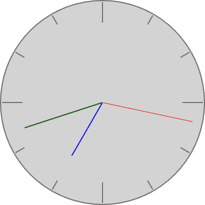

# 刚才发生了什么？

大多数`Needle`功能都在组件本身中声明，包括几何形状和变换。然后，无论何时我们想要使用该组件，我们都会声明一个`Needle`实例，并可选择自定义`length`和`color`属性，以及设置其`value`和`granularity`以获得所需的确切功能。

# 行动时间 - 使时钟功能化

创建时钟的最终步骤是让它实际显示当前时间。在 JavaScript 中，我们可以使用`Date`对象查询当前时间：

```cpp
var currentDate = new Date();
var hours   = currentDate.getHours();
var minutes = currentDate.getMinutes();
var seconds = currentDate.getSeconds();
```

因此，首先想到的是使用前面的代码在时钟上显示当前时间：

```cpp
Item {
    id: clock
    property int hours:   currentDate.getHours()
    property int minutes: currentDate.getMinutes()
    property int seconds: currentDate.getSeconds()
    property date currentDate: new Date()
    // ...
} 
```

这确实会在你启动应用程序时显示当前时间，但时钟不会随着时间流逝而更新自己。这是因为`new Date()`返回一个表示特定时刻的对象（对象实例化的那一刻的日期和时间）。虽然 QML 通常能够在绑定的表达式值变化时自动更新属性，但它无法在此情况下做到。即使 QML 足够聪明，能够看到`new Date()`属性总是返回不同的日期，它也不知道我们希望多久更新一次值，而尽可能频繁地更新通常是一个坏主意。因此，我们需要一种手动安排定期执行操作的方法。

要在 QML 中获得这种效果，我们可以使用一个`Timer`元素，它是 C++中`QTimer`的等效物，并允许我们定期执行一些代码。让我们修改代码以使用计时器：

```cpp
Item {
    id: clock
    //...
    property alias running: timer.running
    Timer {
        id: timer
        repeat: true
        interval: 500
        running: true
        onTriggered: clock.currentDate = new Date()
    }
    //...
} 
```

# 刚才发生了什么？

通过设置`interval`属性，我们要求计时器每 500 毫秒发出`triggered`信号，从而使我们的`currentDate`属性更新为一个新的`Date`对象，表示当前时间。时钟还获得了`running`属性（指向计时器中的等效属性），可以控制是否启用更新。计时器的`repeat`

属性设置为`true`；否则，它将只触发一次。

简要总结到目前为止你所学的，我们可以这样说：你知道如何通过声明实例来创建对象层次结构，你也知道如何在单独的文件中编程新类型，使定义作为组件在其他 QML 文件中实例化。你甚至可以使用 `Repeater` 元素根据一个共同的模板声明一系列对象。

# QML 对象的动态和延迟加载

我们之前所有的 QML 项目都包含一个显式的对象树声明。我们通常创建一个窗口，并将多个特定元素按照特定顺序放入其中。QML 引擎在启动时创建这些对象，并在应用程序终止前保持它们的活动状态。这是一个非常方便的方法，可以节省你大量的时间，正如你可以在我们之前的示例中看到的那样。然而，有时你需要一个更灵活的对象树——例如，如果你事先不知道应该创建哪些元素。QML 提供了几种动态创建对象和延迟创建对象直到真正需要的方法。利用这些功能可以使你的 QML 应用程序更高效和灵活。

# 按需创建对象

在 QML 文件中直接预先声明对象的问题在于，你需要事先知道你需要多少个对象。更常见的情况是，你将想要动态地向场景中添加和删除对象，例如，在一个外星人入侵游戏中，随着玩家的进步，新的外星飞碟将进入游戏屏幕，而其他飞碟将被击落并摧毁。此外，玩家的飞船将“生产”新的子弹，在飞船前方划过，最终耗尽燃料或以其他方式从游戏场景中消失。通过在解决这个问题上投入大量精力，你将能够使用 `Repeater` 来获得这种效果，但手头还有更好的工具。

QML 给我们提供了另一种元素类型，称为 `Component`，这是通过在 QML 中声明其内容来向引擎介绍新元素类型的一种方法。基本上有两种实现这种方法的途径。

第一种方法是在 QML 文件中声明一个 `Component` 元素实例，并将新类型的定义直接内联在元素中：

```cpp
Component {
    id: circleComponent
    Item {
        //...
    }
} 
```

另一种方法是加载组件定义自现有的 QML 文件。假设我们有一个 `Circle.qml` 文件，其内容如下：

```cpp
import QtQuick 2.9
Item {
    property int diameter: 20
    property alias color: rect.color
    property alias border: rect.border

    implicitWidth: diameter
    implicitHeight: diameter

    Rectangle {
        id: rect
        width: radius
        height: radius
        radius: diameter / 2
        anchors.centerIn: parent
    }
}
```

这样的代码声明了一个组件，它定义了一个圆，并公开了其 `diameter`（直径）、`color`（颜色）和 `border`（边框）属性。让我们看看我们如何可以动态地创建这个组件的实例。

QML 提供了一个特殊的全局对象 `Qt`，它提供了一套有趣的方法。其中一种方法允许调用者通过传递现有 QML 文档的 URL 来创建一个组件：

```cpp
var circleComponent = Qt.createComponent("Circle.qml"); 
```

一个有趣的注意事项是`createComponent`不仅可以接受本地文件路径，还可以接受远程 URL，并且如果它理解网络方案（例如，`http`），它将自动下载文档。在这种情况下，您必须记住这需要时间，因此组件在调用`createComponent`后可能不会立即准备好。由于当前的加载状态保存在`status`属性中，您可以通过连接到`statusChanged`信号来通知这种情况。一个典型的代码路径看起来类似于以下：

```cpp
Window {
    //...
    Component.onCompleted: {
        var circleComponent = Qt.createComponent("Circle.qml");
 if(circleComponent.status === Component.Ready) {
 addCircles(circleComponent);
 } else {
 circleComponent.statusChanged.connect(function() {
 if(circleComponent.status === Component.Ready) {
 addCircles(circleComponent);
 }
 });
 }
    }
}
```

在这个例子中，我们使用`Component.onCompleted`处理程序在窗口对象创建后立即运行代码。这个处理程序在所有 Qt Quick 项中都是可用的，通常用于执行初始化。您也可以在这里使用任何其他信号处理程序。例如，您可以在按钮按下或计时器到期时开始加载组件。

`Component`的`completed()`信号的对应物是`destruction()`。您可以使用`Component.onDestruction`处理程序执行诸如将对象的状态保存到持久存储或以其他方式清理对象等操作。

如果组件定义不正确或无法检索文档，对象的状态将变为`错误`。在这种情况下，您可以使用`errorString()`方法查看实际的问题是什么：

```cpp
if(circleComponent.status === Component.Error) {
    console.warn(circleComponent.errorString());
} 
```

一旦您确定组件已准备好，您就可以开始从它创建对象。为此，组件公开了一个名为`createObject`的方法。在其最简单形式中，它接受一个将成为新创建实例的父对象的对象（类似于小部件构造函数接受父小部件的指针）并返回新对象本身，以便您可以将其分配给某个变量。然后，您可以开始设置对象的属性：

```cpp
Window {
    //...
    ColumnLayout {
        id: layout
        anchors.fill: parent
    }
    function addCircles(circleComponent) {
        ["red", "yellow", "green"].forEach(function(color) {
 var circle = circleComponent.createObject(layout);
 circle.color = color;
 circle.Layout.alignment = Qt.AlignCenter;
        });
    }
    //...
}
```

更复杂的调用允许我们在一个调用中执行这两个操作（创建对象并设置其属性）通过向`createObject`传递第二个参数：

```cpp
var circle = circleComponent.createObject(layout,
    { diameter: 20, color: 'red' });
```

第二个参数是一个 JavaScript 对象，其属性将被应用到正在创建的对象上。这种语法的好处是所有属性值都作为一个原子操作应用到对象上，并且它们不会触发属性更改处理程序（就像在 QML 文档中声明项时一样），而不是一系列单独的操作，每个操作都设置单个属性的值，这可能会在对象中引发一系列更改处理程序的调用。

创建后，对象成为场景的一等公民，以与在 QML 文档中直接声明的项目相同的方式行事。唯一的区别是，动态创建的对象也可以通过调用其`destroy()`方法动态销毁，这与在 C++ 对象上调用`delete`类似。当谈到销毁动态项目时，我们必须指出，当您将`createObject`的结果分配给一个变量（如我们的例子中的`circle`）并且该变量超出作用域时，项目将不会被释放和垃圾回收，因为其父对象仍然持有对该项目的引用，从而阻止其被回收。

我们之前没有明确提到这一点，但我们已经在本章介绍`Repeater`元素时使用过内联组件定义。实际上，在`Repeater`中定义的重复项不是一个真实的项目，而是一个组件定义，该定义由`Repeater`根据需要实例化多次。

# 延迟项目创建

另一个常见的场景是，您确实知道需要多少个元素，但问题是您无法提前确定它们的类型。在应用程序的生命周期中的某个时刻，您将了解到这些信息，并将能够实例化一个对象。在您获得有关给定组件的知识之前，您将需要一个某种类型的项目占位符，您将在其中放置真实的项目。当然，您可以编写一些代码来使用组件的`createObject()`功能，但这很麻烦。

幸运的是，Qt Quick 提供了一个更好的解决方案，即一个`Loader`项目。这种项目类型正是我们所描述的——一个临时占位符，用于在需要时从现有组件中加载真实项目。您可以将`Loader`放在另一个项目的位置，当您需要创建此项目时，一种方法是将组件的 URL 设置为`source`属性：

```cpp
Loader {
    id: loader
}
//...
onSomeSignal: loader.source = "Circle.qml"
```

您也可以直接将一个真实组件附加到`Loader`的`sourceComponent`上：

```cpp
Loader {
    id: loader
    sourceComponent: shouldBeLoaded ? circleComponent : undefined
} 
```

紧接着，魔法开始发挥作用，组件的实例在加载器中显示出来。如果`Loader`对象的大小被明确设置（例如，通过锚定或设置宽度和高度），则项目的大小将调整为加载器的大小。如果没有设置明确的大小，则一旦组件实例化，`Loader`将调整为加载元素的大小。在下面的代码中，加载器的大小被明确设置，因此当其项目创建时，它将尊重这里声明的锚点和大小：

```cpp
Loader {
    anchors {
        left: parent.left
        leftMargin: 0.2 * parent.width
        right: parent.right
        verticalCenter: parent.verticalCenter
    }
    height: 250
    source: "Circle.qml"
} 
```

# 使用 JavaScript 在 Canvas 上进行命令式绘制

声明图形项既方便又简单，但作为程序员，我们更习惯于编写命令式代码，有些事情用算法表达比用达到最终结果的描述更容易。使用 QML 以紧凑的方式编码原始形状的定义，如矩形，很容易——我们只需要标记矩形的原点、宽度、高度，以及可选的颜色。在 QML 这样的语言中，写下由许多控制点在给定绝对坐标中定位的复杂形状的声明性定义，可能在其某些部分有轮廓，可能还伴随一些图像，仍然是可能的；然而，这将导致一个更加冗长且可读性更差的定义。在这种情况下，使用命令式方法可能更有效。HTML（作为一种声明性语言）已经暴露了一个用于绘制不同原始形状的经过验证的命令式接口，称为 `Canvas`，它在网络应用中被广泛使用。幸运的是，Qt Quick 通过允许我们实例化 `Canvas` 项为我们提供了自己的 `Canvas` 接口实现，类似于网络中的实现。这些项可以用来绘制直线和曲线、简单和复杂的形状、图表和图形图像。它还可以添加文本、颜色、阴影、渐变和图案。它甚至可以执行低级像素操作。最后，输出可以保存为图像文件或序列化为一个可用的 URL，用作 `Image` 项的源。关于使用 HTML canvas 的许多教程和论文都可以找到，并且它们通常可以很容易地应用于 Qt Quick canvas（参考手册甚至包括在将 HTML canvas 应用程序移植到 Qt Quick Canvas 时需要关注的一些方面），因此在这里我们只给出 Qt Quick 中命令式绘图的基础知识。

考虑一个游戏，玩家的健康状态通过心脏的状况来衡量——心跳越慢，玩家就越健康。我们将使用这种可视化作为我们练习使用 `Canvas` 元素进行绘画的练习。

# 行动时间 - 准备 Canvas 用于心跳可视化

让我们从创建一个空的 Qt Quick 项目开始，做一些简单的事情。将以下代码添加到 `main.qml` 文件中：

```cpp
Window {
    //...
    Canvas {
        id: canvas

        implicitWidth: 600
        implicitHeight: 300

        onPaint: {
            var ctx = canvas.getContext("2d");
            ctx.clearRect(0, 0, canvas.width, canvas.height);
            ctx.strokeRect(50, 50, 100, 100);
        }
    }
}
```

当你运行项目时，你会看到一个包含矩形的窗口：

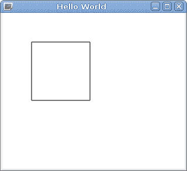

# 刚才发生了什么？

在前面的代码中，我们创建了一个基本的模板代码，用于使用 canvas。首先，我们创建了一个具有隐式宽度和高度的`Canvas`实例。在那里，我们创建了一个处理程序，用于处理每当画布需要重绘时发出的`paint`信号。放置在那里的代码检索画布的上下文，这可以被视为我们在 Qt 小部件上绘图时使用的`QPainter`实例的等价物。我们通知画布我们想要其 2D 上下文，这为我们提供了在二维中绘制的方式。2D 上下文是目前`Canvas`元素唯一存在的上下文，但你仍然需要明确地识别它——类似于 HTML。有了上下文准备就绪，我们告诉它清除画布的整个区域。这与小部件世界不同，在`paintEvent`处理程序被调用时，小部件已经为我们清除了，并且必须从头开始重绘一切。使用`Canvas`时，情况不同；默认情况下保留先前内容，以便您可以覆盖它。由于我们想要从一张干净的画布开始，我们在上下文中调用`clearRect()`。最后，我们使用`strokeRect()`便利方法在画布上绘制矩形。

# 行动时间 - 绘制心电图

现在我们将扩展我们的组件并实现其主要功能——绘制类似心电图的图形。

将以下属性声明添加到`canvas`对象中：

```cpp
property int lineWidth: 2
property var points: []
property real arg: -Math.PI 
```

在`Canvas`部分中，添加一个定时器的声明，该定时器将触发图片的更新：

```cpp
Timer {
    interval: 10
    repeat: true
    running: true
    onTriggered: {
        canvas.arg += Math.PI / 180;
        while(canvas.arg >= Math.PI) {
            canvas.arg -= 2 * Math.PI;
        }
    }
}
```

然后，再次在`Canvas`部分中，定义当`arg`的值被修改时的处理程序：

```cpp
onArgChanged: {
    points.push(func(arg));
    points = points.slice(-canvas.width);
    canvas.requestPaint();
}
```

此处理程序使用自定义 JavaScript 函数——`func()`。将函数的实现放置在处理程序之上：

```cpp
function func(argument) {
    var a = (2 * Math.PI / 10);
    var b = 4 * Math.PI / 5;
    return Math.sin(20 * argument) * (
        Math.exp(-Math.pow(argument / a, 2)) +
        Math.exp(-Math.pow((argument - b) / a, 2)) +
        Math.exp(-Math.pow((argument + b) / a, 2))
    );
}
```

最后，修改`onPaint`信号处理程序：

```cpp
onPaint: {
    var ctx = canvas.getContext("2d");
    ctx.reset();
    ctx.clearRect(0, 0, canvas.width, canvas.height);
    var pointsToDraw = points.slice(-canvas.width);
    ctx.translate(0, canvas.height / 2);
    ctx.beginPath();
    ctx.moveTo(0, -pointsToDraw[0] * canvas.height / 2);
    for(var i = 1; i < pointsToDraw.length; i++) {
        ctx.lineTo(i, -pointsToDraw[i] * canvas.height / 2);
    }
    ctx.lineWidth = canvas.lineWidth;
    ctx.stroke();
}
```

然后，你可以运行代码，并看到类似心电图的图形出现在画布上：

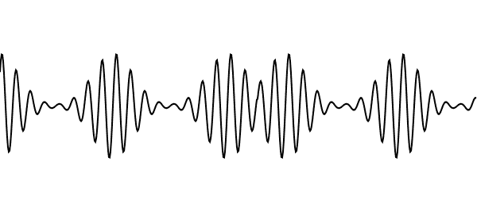

# 刚才发生了什么？

我们向元素添加了两种属性。通过引入`lineWidth`，我们可以操纵可视化心电的线条宽度。`points`变量存储已计算出的函数值数组。我们将其初始化为空数组。`arg`变量存储最后评估的函数参数。函数的参数应在从-π到+π的范围内；因此，我们将`arg`初始化为`-Math.PI`。然后，我们添加一个定时器，以固定间隔进行滴答，将`arg`增加 1°，直到它达到+π，在这种情况下，它将重置为初始值。

在我们实现的处理器中，对`arg`的更改会被拦截。在那里，我们将一个新项目推送到点的数组中。这个值是通过`func`函数计算的，该函数相当复杂，但可以简单地说它返回一个在-1 到+1 范围内的值。使用`Array.slice()`从点的数组中删除最旧的记录，这样数组中最多只保留`canvas.width`个最后的项目。这样做是为了我们可以为画布宽度的每个像素绘制一个点，而且我们不需要存储比所需更多的数据。在函数的末尾，我们调用`requestPaint()`，这相当于`QWidget::update()`，并安排画布的重绘。

然后，这会调用我们的`onPaint`信号处理器。在那里，在检索上下文后，我们将画布重置到其初始状态，然后使用`slice()`计算要再次绘制的点的数组。然后，我们通过在垂直轴上平移和缩放画布来准备画布，以便将原点移动到画布高度的一半（这就是为什么在程序开始时调用`reset()`的原因——为了撤销这种转换）。之后，调用`beginPath()`来通知上下文我们开始构建一个新的路径。然后，通过附加线条分段构建路径。每个值都乘以`canvas.height / 2`，以便将点数组的值缩放到项目的大小。由于画布的垂直轴增长到底部，我们想要正值在原点线上方，因此该值被取反。之后，我们设置笔的宽度并通过调用`stroke()`来绘制路径。

# 行动时间 - 隐藏属性

如果我们将心跳画布转换为 QML 组件，`points`和`arg`属性将是组件用户可见的公共属性。然而，它们实际上是我们要隐藏的实现细节。我们应该只公开对组件用户有意义的属性，例如`lineWidth`或`color`。

由于`Canvas`内部的`Timer`对象没有作为公共属性导出，因此该定时器对象将无法从外部访问，因此我们可以将属性附加到定时器而不是顶级`Canvas`对象。然而，从逻辑上讲，这些属性不属于定时器，因此这种解决方案可能会令人困惑。对于这种情况，有一个约定，你应该在顶级对象中创建一个空的`QtObject`子对象并将属性移动到其中：

```cpp
Canvas {
    id: canvas
    property int lineWidth: 2
    //...
    QtObject {
        id: d
        property var points: []
        property real arg: -Math.PI

        function func(argument) { /* ... */ }
        onArgChanged: { /* ... */ }
    }
    //...
}
```

`QtObject`是`QObject`类的 QML 表示。它是一个没有特定功能但可以持有属性的 QML 类型。作为约定的一部分，我们将此对象的`id`设置为`d`。`onArgChanged`处理器也被移动到私有对象。在`onTriggered`和`onPaint`处理器中，我们现在应该引用内部属性为`d.points`和`d.arg`。考虑以下示例：

```cpp
onTriggered: {
    d.arg += Math.PI / 180;
    while(d.arg >= Math.PI) {
        d.arg -= 2 * Math.PI;
    }
}
```

`points` 和 `arg` 属性现在从外部不可用，这导致我们的心跳对象具有干净的外部接口。

# 行动时间 – 使图表更加多彩

该图表完成了其目的，但看起来有点单调。通过在画布对象中定义三个新的颜色属性——`color`、`topColor` 和 `bottomColor`——并分别将它们的默认值设置为 `black`、`red` 和 `blue` 来给它添加一些光泽：

```cpp
property color color: "black"
property color topColor: "red"
property color bottomColor: "blue"
```

然后，让我们通过扩展 `onPaint` 实现来利用这些属性：

```cpp
onPaint: {
    //...
    // fill:
    ctx.beginPath();
    ctx.moveTo(0, 0);
    var i;
    for(i = 0; i < pointsToDraw.length; i++) {
        ctx.lineTo(i, -pointsToDraw[i] * canvas.height/2);
    }
    ctx.lineTo(i, 0);
    var gradient = ctx.createLinearGradient(
            0, -canvas.height / 2, 0, canvas.height / 2);
    gradient.addColorStop(0.1, canvas.topColor);
    gradient.addColorStop(0.5, Qt.rgba(1, 1, 1, 0));
    gradient.addColorStop(0.9, canvas.bottomColor);
    ctx.fillStyle = gradient;
    ctx.fill();

    // stroke:
    ctx.beginPath();
    ctx.moveTo(0, -pointsToDraw[0] * canvas.height / 2);
    for(i = 1; i < pointsToDraw.length; i++) {
        ctx.lineTo(i, -pointsToDraw[i] * canvas.height / 2);
    }
    ctx.lineWidth = canvas.lineWidth;
    ctx.strokeStyle = canvas.color;
    ctx.stroke();
}
```

运行前面的代码片段后，你将得到以下输出：

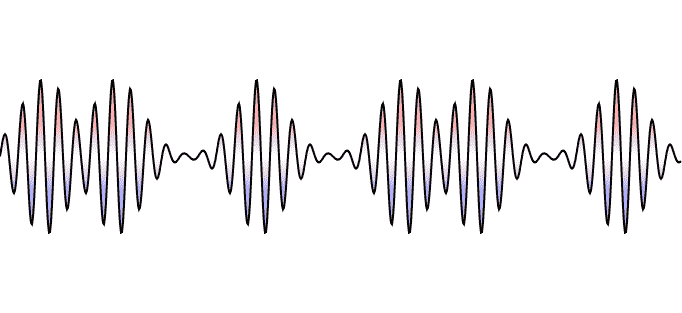

# 刚才发生了什么？

我们对 `onPaint` 实现所做的修改是创建另一个路径，并使用该路径通过渐变填充一个区域。该路径与原始路径非常相似，但它包含两个额外的点，即第一个和最后一个绘制到水平轴上的点。这确保了渐变能够正确填充区域。请注意，画布使用命令式代码进行绘图；因此，填充和描边的绘制顺序很重要——填充必须先绘制，以免遮挡描边。

# 使用 C++类作为 QML 组件

在下一个练习中，我们将实现一个可用于赛车游戏的汽车仪表盘，并显示当前速度和每分钟发动机转速等参数。输入数据将由一个 C++对象提供。我们将看到如何将此对象包含到 QML 对象树中，并使用属性绑定来实现仪表盘。

最终结果将类似于以下内容：

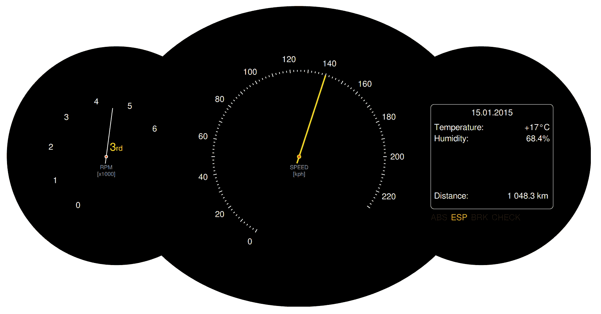

# 行动时间 – 自更新汽车仪表盘

我们将从 C++部分开始。设置一个新的 Qt Quick 应用程序。这将为你生成主函数，该函数实例化 `QGuiApplication` 和 `QQmlApplicationEngine` 并将它们设置为加载 QML 文档。

使用 `文件` 菜单创建 `新建文件或项目` 并创建一个新的 Qt Designer 表单类。将其命名为 `CarInfo` 并选择 `Widget` 模板。我们将使用此类来修改不同参数的值，以便我们可以观察它们如何影响 Qt Quick 场景的显示。在类声明中，添加以下属性：

```cpp
class CarInfo : public QWidget {
    Q_OBJECT
    Q_PROPERTY(int rpm READ rpm NOTIFY rpmChanged)
    Q_PROPERTY(int gear READ gear NOTIFY gearChanged)
    Q_PROPERTY(int speed READ speed NOTIFY speedChanged)
    Q_PROPERTY(double distance READ distance NOTIFY distanceChanged)
    //...
};
```

属性是只读的，`NOTIFY` 子句定义了在相应属性值更改时发出的信号。继续为每个属性实现相应的函数。除了获取器之外，还实现一个公共槽作为设置器。以下是一个控制汽车速度的属性的示例：

```cpp
int CarInfo::speed() const {
    return m_speed;
}
void CarInfo::setSpeed(int newSpeed) {
    if(m_speed == newSpeed) {
        return;
    }
    m_speed = newSpeed;
    emit speedChanged(m_speed);
} 
```

你应该能够自己跟随示例来处理剩余的属性。

由于我们希望使用小部件来调整属性值，因此使用表单编辑器设计其用户界面。它可以看起来像这样：


在小部件中建立适当的信号-槽连接，以便修改给定参数的任何小部件或直接使用设置器槽更新该参数的所有小部件。

而不是在 `CarInfo` 类中为 `speed`、`rpm`、`distance` 或 `gear` 等属性添加成员变量，你可以直接在 `ui` 表单上放置的小部件上操作，如进一步所示。

例如，`distance` 属性的获取器将看起来像这样：

```cpp
qreal CarInfo::distance() const
{
    return ui->distanceBox->value();
}
```

然后将设置器修改为以下内容：

```cpp
void CarInfo::setDistance(qreal newDistance)
{
    ui->distanceBox->setValue(newDistance);
}
```

然后，你需要向构造函数中添加 `connect()` 语句，以确保信号从 ui 表单传播：

```cpp
connect(ui->distanceBox, SIGNAL(valueChanged(double)),
        this,            SIGNAL(distanceChanged(double)));   
```

接下来，你可以通过运行小部件来测试你的工作。为此，你必须修改主函数，使其看起来如下：

```cpp
int main(int argc, char **argv) {
    QApplication app(argc, argv);
    CarInfo cinfo;
    cinfo.show();
    return app.exec();
}; 
```

由于我们正在使用小部件，我们必须将 `QGuiApplication` 替换为 `QApplication`，并通过在项目文件中放置 `QT += widgets` 启用小部件模块（记得在项目上下文菜单中运行 `qmake`）。在继续下一步之前，确保一切按预期工作（即，移动滑块和更改微调框值反映小部件属性的变化）。

我们现在将 Qt Quick 加入到等式中，所以让我们首先更新我们的主函数以显示我们的场景。向代码中引入以下高亮显示的更改：

```cpp
int main(int argc, char **argv) {
    QApplication app(argc, argv);
    CarInfo cinfo;
    QQmlApplicationEngine engine;
    engine.rootContext()->setContextProperty("carData", &cinfo);
    engine.load(QUrl(QStringLiteral("qrc:/main.qml")));
    if (engine.rootObjects().isEmpty())
        return -1;
    cinfo.show();
    return app.exec();
}
```

这些修改创建了一个用于场景的 QML 引擎，将 `CarInfo` 实例导出到 QML 引擎的全局上下文中，并从资源中的文件加载并显示场景。

首先导出所有对象，然后才加载场景，这是非常重要的。这是因为我们希望在场景初始化时所有名称都已可解析，以便它们可以立即使用。如果我们颠倒调用顺序，我们会在控制台得到许多关于身份未定义的警告。

最后，我们可以专注于 QML 部分。看看练习开始时我们想要显示的结果的图片。对于黑色背景，我们使用了一个在图形编辑器中创建的位图图像（你可以在本书的材料中找到该文件），但你也可以通过在 Qt Quick 中直接组合三个黑色圆角矩形来获得类似的效果——两个外部分是完美的圆形，而内部模块是一个水平拉伸的椭圆。

如果你决定使用我们的背景文件（或制作你自己的更漂亮的图片），你应该将其添加到项目的资源中，并将以下代码放入 `main.qml`：

```cpp
import QtQuick 2.9
import QtQuick.Window 2.3

Window {
    visible: true
    width: backgroundImage.width
    height: backgroundImage.height

    Image {
        id: backgroundImage
        source: "qrc:/dashboard.png"
        Item {
            id: leftContainer
            anchors.centerIn: parent
            anchors.horizontalCenterOffset: -550
            width: 400; height: width
        }
        Item {
            id: middleContainer
            anchors.centerIn: parent
            width: 700; height: width
        }
        Item {
            id: rightContainer
            anchors.centerIn: parent
            anchors.horizontalCenterOffset: 525
            width: 400; height: width
        }
    }
}
```

我们在这里所做的就是在窗口中添加图像并创建三个项目作为仪表盘不同元素的容器。这些容器都居中于父容器中，我们使用 `horizontalCenterOffset` 属性将两个外部的项目向侧面移动。偏移量和宽度的值都基于背景图像的几何形状（注意，所有三个容器都是完美的正方形）。如果你不使用我们的文件，而是决定自己使用 Qt Quick 项目创建这三个部分，容器将简单地锚定到三个黑色项目的中心。

表盘看起来很复杂，但实际上，它们非常容易实现，你已经学到了设计它们所需的一切。

让我们从指针开始。使用资源文件的上下文菜单创建一个新的 QML 文件，并将其命名为 `Needle.qml`。打开文件并放置以下内容：

```cpp
import QtQuick 2.9

Item {
    id: root
    property int length: parent.width * 0.4
    property color color: "white"
    property color middleColor: "red"
    property int size: 2

    Rectangle { //needle
        width: root.size
        height: length + 20
        color: root.color
        anchors.horizontalCenter: parent.horizontalCenter
        anchors.bottom: parent.bottom
        anchors.bottomMargin: -20
        antialiasing: true
    }

    Rectangle { //fixing
        anchors.centerIn: parent
        width: 8 + root.size
        height: width
        radius: width / 2
        color: root.color
        Rectangle { //middle dot
            anchors {
                fill: parent
                margins: parent.width * 0.25
            }
            color: root.middleColor
        }
    }
}
```

文档定义了一个具有四个属性的项目——指针的长度（默认为表盘半径的 80%）、指针的颜色、`middleColor`，它代表指针固定的颜色，以及大小，它定义了指针有多宽。代码是自我解释的。项目本身没有尺寸，仅作为视觉元素的锚点——指针本身是一个垂直方向的细长矩形，从末端固定 20 个单位。固定是一个与指针颜色相同的圆圈，中间有一个使用不同填充颜色的较小圆圈。内圆的较小半径是通过从每侧填充 25% 的外圆来获得的。

至于表盘，由于我们只有两个，它们略有不同，所以创建一个具有精心设计的属性集的单独组件的开销将超过拥有良好封装对象的优点。

如果你考虑一下要完成哪些工作才能使表盘显示并正常工作，似乎最困难的事情是将数字整齐地排列在圆周上，所以让我们从这里开始。这是一个基于圆的半径和角度（以度为单位）计算圆周上位置的函数实现：

```cpp
function calculatePosition(angle, radius) {
    if(radius === undefined) {
        radius = width / 2 * 0.8;
    }
    var a = angle * Math.PI / 180;
    var px = width / 2 + radius * Math.cos(a);
    var py = width / 2 + radius * Math.sin(a);
    return Qt.point(px, py);
}
```

函数将度数转换为弧度，并返回所需点。该函数期望 `width` 属性可用，这有助于计算圆的中心，如果没有给出半径，则作为计算其可行值的手段。

有这样的函数可用后，我们可以使用已经熟悉的 `Repeater` 元素将项目放置在我们想要的位置。让我们将函数放在 `middleContainer` 中，并声明汽车速度表：

```cpp
Item {
    id: middleContainer
    // ...
    function calculatePosition(angle, radius) { /* ... */ }
    Repeater {
        model: 24 / 2
        Item {
            property point pt:
            middleContainer.calculatePosition(120 + index * 12 * 2)
            x: pt.x
            y: pt.y
            Label {
                anchors.centerIn: parent
                text: index * 20
            }
        }
    }
    Needle {
        anchors.centerIn: parent
        length: parent.width * 0.35
        size: 4
        rotation: 210 + (carData.speed * 12 / 10)
        color: "yellow"
    }
} 
```

你可能已经注意到我们使用了一个名为 `Label` 的元素。我们创建它是为了避免在用户界面中使用的所有文本都需要设置相同的属性值：

```cpp
import QtQuick 2.9

Text {
    color: "white"
    font.pixelSize: 24
} 
```

旋钮由一个重复器组成，将创建 12 个元素。每个元素都是使用之前描述的函数定位的项目。项目有一个标签与之锚定，显示给定的速度。我们使用`120 + index * 12 * 2`作为角度表达式，因为我们希望“0”位于 120 度，每个后续项目再额外 24 度。

指针的旋转是基于从`carData`对象读取的值。由于连续 20 公里每小时标签之间的角度距离是 24 度，因此每 1 公里每小时的距离是 1.2，所以我们把`carData.speed`乘以这个系数。项目旋转是以 0 度“指向右”为基准计算的；因此，我们将第一个标签的初始 120 度偏移量加上 90 度，以获得与标签系统匹配的起始坐标。

如您在本文节开头的结果图像中看到的那样，速度旋钮每 2 公里每小时有细线，那些可以被 10 公里每小时整除的比其他的长。我们可以使用另一个`Repeater`来声明这样的刻度：

```cpp
Repeater {
    model: 120 - 4

    Item {
        property point pt: middleContainer.calculatePosition(
            120 + index * 1.2 * 2, middleContainer.width * 0.35
        )
        x: pt.x
        y: pt.y
        Rectangle {
            width: 2
            height: index % 5 ? 5 : 10
            color: "white"
            rotation: 210 + index * 1.2 * 2
            anchors.centerIn: parent
            antialiasing: true
        }
    }
} 
```

最后，我们可以为旋钮添加一个标签：

```cpp
Text {
    anchors.centerIn: parent
    anchors.verticalCenterOffset: 40
    text: "SPEED\n[kph]"
    horizontalAlignment: Text.AlignHCenter
    color: "#aaa"
    font.pixelSize: 16
} 
```

确保在旋钮指针之前声明标签，或者给指针一个更高的`z`值，这样标签就不会覆盖指针。

接下来，通过创建一个读取自`carData.rpm`属性的 RPM 旋钮，在自己的左侧容器上重复此过程。旋钮还显示汽车发动机的当前档位。将以下代码放在`leftContainer`对象定义内：

```cpp
Item {
    id: gearContainer
    anchors.centerIn: parent
    anchors.horizontalCenterOffset: 10
    anchors.verticalCenterOffset: -10

    Text {
        id: gear
        property int value: carData.gear
        property var gears: [
 "R", "N",
 "1<sup>st</sup>", "2<sup>nd</sup>", "3<sup>rd</sup>",
 "4<sup>th</sup>", "5<sup>th</sup>"
 ]
 text: gears[value + 1]
        anchors.left: parent.left
        anchors.bottom: parent.bottom
        color: "yellow"
        font.pixelSize: 32
        textFormat: Text.RichText
    }
} 
```

需要解释的唯一部分已突出显示。它定义了一个从倒档开始，经过空档，然后通过五个前进档的档位标签数组。然后，该数组以当前档位进行索引，并将该值的文本应用于标签。请注意，值增加了 1，这意味着当`carData.gear`设置为`1`时，将使用数组的 0 索引。

我们不会展示如何实现正确的容器。现在，您可以使用`Grid`定位器轻松地自己布局标签及其值。要显示右侧容器底部（带有文本`ABS`、`ESP`、`BRK`和`CHECK`）的控制系列，您可以使用`Label`实例的`Row`。

现在，启动程序并开始移动小部件上的滑块。看看 Qt Quick 场景是如何跟随变化的。

# 刚才发生了什么？

我们创建了一个非常简单的`QObject`实例，并将其作为我们的“数据模型”暴露给 QML。该对象有多个属性可以接收不同的值。更改一个值会导致发出一个信号，该信号反过来通知 QML 引擎，并导致包含这些属性的绑定被重新评估。因此，我们的用户界面得到更新。

# 行动时间 – 对发动机属性进行分组

我们创建的 QML 和 C++ 世界之间的数据接口非常简单，并且属性数量很少。然而，随着我们想要公开的数据量增加，对象可能会变得杂乱。当然，我们可以通过将其分成多个更小的对象来抵消这种效果，每个对象都有各自的责任，然后将所有这些对象导出到 QML 中，但这种方法并不总是可取的。在我们的例子中，我们可以看到 `rpm` 和 `gear` 是发动机子系统的属性，因此我们可以将它们移动到单独的对象中；然而，在现实中，它们的值与汽车的速度紧密相关，要计算速度，我们需要知道这两个参数的值。然而，速度还取决于其他因素，如道路的坡度，所以将速度放入发动机子系统对象中似乎并不合适。幸运的是，有一个很好的解决方案来解决这个问题。

QML 有一个称为分组属性的概念。你已经知道其中的一些——例如 `Rectangle` 元素的 `border` 属性或 `Item` 元素的 `anchors` 属性。让我们看看如何为我们的公开对象定义这样的属性。

创建一个新的 `QObject` 派生类，并将其命名为 `CarInfoEngine`。将 `rpm` 和 `gear` 的属性定义及其获取器、设置器和更改信号移动到这个新类中。向 `CarInfo` 添加以下属性声明：

```cpp
Q_PROPERTY(QObject* engine READ engine NOTIFY engineChanged) 
```

实现获取器和私有字段：

```cpp
    QObject* engine() const { return m_engine; }
private:
    CarInfoEngine *m_engine; 
```

我们现在不会使用这个信号。但是，我们必须声明它；否则，QML 会抱怨我们正在绑定依赖于非可通知属性的表达示：

```cpp
signals:
    void engineChanged(); 
```

在 `CarInfo` 的构造函数中初始化 `m_engine`：

```cpp
m_engine = new CarInfoEngine(this); 
```

接下来，更新 `CarInfo` 的代码，以便在部件上的相应滑块移动时修改 `m_engine` 的属性。也要提供反向链接——如果属性值发生变化，相应地更新用户界面。

更新 QML 文档，将 `carData.gear` 替换为 `carData.engine.gear`。对 `carData.rpm` 和 `carData.engine.rpm` 也做同样的处理。你应该得到以下类似的内容：

```cpp
Item {
    id: leftContainer
    // ...

    Item {
        id: gearContainer
        Text {
            id: gear
            property int value: carData.engine.gear
            // ...
        }
    }
    Needle {
        anchors.centerIn: parent
        length: parent.width * 0.35
        rotation: 210 + (carData.engine.rpm * 35)
    }
} 
```

# 刚才发生了什么？

实际上，我们所做的是在 `CarInfo` 中公开了一个属性，该属性本身是一个对象，它公开了一组属性。这个 `CarInfoEngine` 类型的对象绑定到它所引用的 `CarInfo` 实例。

# 行动时间 - 将 C++ 类注册为 QML 类型

到目前为止，我们所做的是公开了在 C++ 中创建和初始化的单个 QML 对象。然而，我们可以做更多——框架允许我们定义新的 QML 类型。这些类型可以是通用的 `QObject` 派生 QML 元素，或者针对 Qt Quick 专门化的项目。

我们将从简单的事情开始——将 `CarInfo` 类型公开给 QML，这样我们就可以直接在 QML 中声明元素，而不是在 C++ 中实例化它并在 QML 中公开，同时仍然允许对部件所做的更改反映在场景中。

要使某个类（从`QObject`派生）在 QML 中可实例化，所需的所有操作就是使用`qmlRegisterType`模板函数将该类注册到声明性引擎中。这个函数接受类作为其模板参数以及一系列函数参数：模块`uri`、主版本号和次版本号，以及我们正在注册的 QML 类型名称。以下调用将`FooClass`类注册为 QML 类型`Foo`，在导入`foo.bar.baz`后，在版本 1.0 中可用：

```cpp
qmlRegisterType<FooClass>("foo.bar.baz", 1, 0, "Foo"); 
```

你可以在你的 C++代码中的任何地方放置这个调用；只需确保这在你尝试加载可能包含`Foo`对象声明的 QML 文档之前。一个典型的放置函数调用的地方是程序的主函数。之后，你可以在你的文档中开始声明`Foo`类型的对象。只需记住，你必须首先导入相应的模块：

```cpp
import QtQuick 2.9
import foo.bar.baz 1.0

Item {
    Foo {
        id: foo
    }
} 
```

# 是时候行动了——使`CarInfo`可从 QML 实例化

首先，我们将更新 QML 文档以创建`CarInfo 1.0`模块中存在的`CarInfo`实例：

```cpp
import QtQuick 2.9
import CarInfo 1.0

Image {
    source: "dashboard.png"

    CarInfo {
        id: carData
        visible: true // make the widget visible
    }
  // ...
} 
```

至于注册`CarInfo`，可能会让人想简单地调用`qmlRegisterType`在`CarInfo`上，并为自己做得很好而庆祝：

```cpp
int main(int argc, char **argv) {
    QGuiApplication app(argc, argv);
    QQmlApplicationEngine engine;
    // this code does not work
    qmlRegisterType<CarInfo>("CarInfo", 1, 0, "CarInfo");
    //...
} 
```

通常情况下，这会起作用（是的，就这么简单）。然而，它不适用于小部件。无法将基于`QWidget`的对象包含到 QML 对象树中，因为`QWidget`对象只能将另一个`QWidget`对象作为其父对象，而 QML 需要将外部 QML 对象设置为父对象。为了解决这个冲突，我们需要确保我们实例化的不是小部件。为此，我们将使用一个代理对象，该对象将转发我们的调用到实际的小部件。因此，创建一个新的类`CarInfoProxy`，它从`QObject`派生，并使其具有与`CarInfo`相同的属性。考虑以下示例：

```cpp
class CarInfoProxy : public QObject {
    Q_OBJECT
    Q_PROPERTY(QObject *engine READ engine NOTIFY engineChanged)
    Q_PROPERTY(int speed READ speed WRITE setSpeed NOTIFY speedChanged)
    // ... 
```

声明一个额外的属性，它将允许我们根据需要显示和隐藏小部件：

```cpp
  Q_PROPERTY(bool visible READ visible WRITE setVisible 
                          NOTIFY visibleChanged)
```

然后，我们可以将小部件作为代理的一个成员变量放置，这样它就会与代理一起创建和销毁：

```cpp
private:
    CarInfo m_car; 
```

这样，`CarInfo`小部件将没有父对象`nullptr`，因此它将作为一个顶级窗口显示。QML 引擎将创建一个`CarInfoProxy`类的对象，并将其父对象设置为另一个 QML 对象，但这不会影响小部件的父对象。

接下来，实现缺失的接口。为了简单起见，我们展示了部分属性的代码。其他属性类似，所以你可以自己填补空白：

```cpp
public:
    CarInfoProxy(QObject *parent = nullptr) : QObject(parent) {
        connect(&m_car, &CarInfo::engineChanged,
                this, &CarInfoProxy::engineChanged);
        connect(&m_car, &CarInfo::speedChanged,
                this, &CarInfoProxy::speedChanged);
    }
    QObject *engine() const { 
        return m_car.engine(); 
    }
    bool visible() const { 
        return m_car.isVisible(); 
    }
    void setVisible(bool v) {
        if(v == visible()) return;
        m_car.setVisible(v);
        emit visibleChanged(v);
    }
    int speed() const { 
        return m_car.speed(); 
    }
    void setSpeed(int v) { 
        m_car.setSpeed(v); 
    }
signals:
    void engineChanged();
    void visibleChanged(bool);
    void speedChanged(int);
}; 
```

你可以看到，我们重用了小部件中的`CarInfoEngine`实例，而不是在代理类中复制它。最后，我们可以将`CarInfoProxy`注册为`CarInfo`：

```cpp
  qmlRegisterType<CarInfoProxy>("CarInfo", 1, 0, "CarInfo"); 
```

如果你现在运行代码，你会看到它起作用——`CarInfo`已经成为了一个常规的 QML 元素。因此，它的属性可以直接在文档中设置和修改，对吧？如果你尝试设置速度或距离，它将正常工作。然而，尝试设置分组在`engine`属性中的属性：

```cpp
CarInfo {
    id: carData
    visible: true
 engine.gear: 3
}
```

QML 运行时会发出类似于以下的消息：

```cpp
Cannot assign to non-existent property "gear"
             engine.gear: 3
                    ^ 
```

这是因为运行时不理解 `engine` 属性——我们将其声明为 `QObject`，但我们使用了一个这个类没有的属性。为了避免这个问题，我们必须让运行时了解 `CarInfoEngine`。

首先，让我们更新属性声明宏，使用 `CarInfoEngine` 而不是 `QObject`：

```cpp
Q_PROPERTY(CarInfoEngine* engine READ engine NOTIFY engineChanged) 
```

此外，获取函数本身：

```cpp
CarInfoEngine* engine() const { 
    return m_engine; 
}
```

你应该在 `CarInfo` 和 `CarInfoProxy` 类中做出这些更改。然后，我们应该让运行时了解这个类型：

```cpp
QString msg = QStringLiteral("Objects of type CarInfoEngine cannot be created");
qmlRegisterUncreatableType<CarInfoEngine>("CarInfo", 1, 0, "CarInfoEngine", msg);
```

# 刚才发生了什么？

在这个练习中，我们让 QML 运行时了解两个新元素。其中一个是 `CarInfo`，它是我们小部件类的代理。我们告诉引擎这是一个功能齐全的类，可以从 QML 中实例化。另一个类 `CarInfoEngine` 也被 QML 所知；然而，区别在于在 QML 中尝试声明此类对象的每个尝试都会以一个给定的警告消息失败。QML 中还有其他用于注册类型的函数，但它们很少使用，所以我们不会在这里描述它们。如果你对此感兴趣，可以在 Creator 的“帮助”面板的索引标签中输入 `qmlRegister`。

# 快速问答

Q1. 哪种 QML 类型允许你为稍后实例化的对象创建一个占位符？

1.  `Repeater`

1.  `Loader`

1.  `Component`

Q2. 哪种 QML 类型提供了对单个触摸事件的低级访问？

1.  `PinchArea`

1.  `MouseArea`

1.  `MultiPointTouchArea`

Q3. 在什么情况下，你可以访问另一个 QML 文件中定义的组件而不需要导入语句？

1.  如果你使用 `qmlRegisterType` 函数注册了组件，你可以这样做

1.  如果你将组件文件添加到项目资源中，你可以这样做

1.  如果你将组件文件放在与当前文件相同的目录中，你可以这样做

# 概述

你现在已经熟悉了多种可以用来扩展 Qt Quick 以添加自定义项目类型的方法。你学习了如何使用 JavaScript 创建自定义视觉项目。你还知道如何使用 C++ 类作为完全集成到你的 UI 中的非视觉 QML 元素。我们还讨论了如何在 Qt Quick 应用程序中处理鼠标、触摸、键盘和游戏手柄事件。然而，到目前为止，尽管我们谈论了“流畅”和“动态”的界面，但你还没有看到很多这样的界面。不要担心；在下一章中，我们将专注于 Qt Quick 中的动画以及华丽的图形，并将本章所学应用于创建看起来漂亮且有趣的游戏。所以，继续阅读吧！
