# Qt Quick 中的高级视觉效果

精灵动画和流畅的过渡并不总是足以使游戏在视觉上吸引人。在本章中，我们将探讨许多方法来为您的游戏添加一些视觉亮点。Qt Quick 提供了相当数量的内置视觉效果，这些效果将非常有用。然而，有时您可能想要做一些标准组件无法完成的事情——一些独特且特定于您游戏的事情。在这些情况下，您不需要限制您的想象力。我们将教您深入 Qt Quick 的 C++ API 以实现真正独特的图形效果。

本章涵盖的主要主题包括：

+   自动缩放用户界面

+   将图形效果应用于现有项目

+   粒子系统

+   Qt Quick 中的 OpenGL 绘图

+   在 Qt Quick 中使用 `QPainter`

# 使游戏更具吸引力

一款游戏不应仅仅基于一个有趣的想法，它不仅应该在各种设备上流畅运行并给玩家带来娱乐，还应该看起来很漂亮，表现得很优雅。无论是人们从同一游戏的多个类似实现中选择，还是想要花钱购买价格相似且有趣的另一款游戏，有很大可能性他们会选择看起来最好的游戏——拥有大量的动画、图形和闪亮的元素。我们已经学习了许多使游戏更吸引眼球的技巧，例如使用动画或实现视差效果。在这里，我们将向您展示一些其他技巧，可以使您的 Qt Quick 应用程序更具吸引力。

# 自动缩放用户界面

您可能首先实现的扩展是使您的游戏自动调整其运行的设备分辨率。基本上有两种方法可以实现这一点。第一种是在窗口（或屏幕）中居中用户界面，如果它不合适，则启用滚动。另一种方法是缩放界面以始终适合窗口（或屏幕）。选择哪一种取决于许多因素，其中最重要的是当界面放大时，UI 是否足够好。如果界面由文本和非图像原语（基本上是矩形）组成，或者如果它包含图像但只有矢量图像或分辨率非常高的图像，那么尝试缩放用户界面可能是可以的。否则，如果您使用了大量的低分辨率位图图像，您将不得不为 UI 选择一个特定的尺寸（可选地允许它降级，因为如果启用抗锯齿，这种方向上的质量下降应该不那么明显）。

无论你选择缩放还是居中滚动，基本方法都是一样的——你将 UI 项放入另一个项中，这样你就可以对 UI 几何形状进行精细控制，无论顶级窗口发生什么变化。采用居中方法非常简单——只需将 UI 锚定到父项的中心。要启用滚动，将 UI 包裹在`Flickable`项中，并约束其大小，如果窗口的大小不足以容纳整个用户界面：

```cpp
Window {
    //...
    Flickable {
        id: uiFlickable
        anchors.centerIn: parent
        contentWidth: ui.width
        contentHeight: ui.height

        width: parent.width >= contentWidth ?
               contentWidth : parent.width
        height: parent.height >= contentHeight ?
                contentHeight : parent.height

        UI {
            id: ui
        }
    }
}
```

你可以将以下简单的代码放入`UI.qml`文件中，以查看`Flickable`如何定位 UI 项：

```cpp
import QtQuick 2.0
Rectangle {
    width: 300
    height: 300
    gradient: Gradient {
        GradientStop { position: 0.0; color: "lightsteelblue" }
        GradientStop { position: 1.0; color: "blue" }
    }
}
```

如果 UI 项没有占据其父项的全部区域，你可能需要给顶级项装饰一个漂亮的背景。

缩放看起来可能更复杂，但使用 Qt Quick 实际上非常简单。再次强调，你有两个选择——拉伸或缩放。拉伸就像执行`anchors.fill: parent`命令一样简单，这实际上迫使 UI 重新计算所有其项的几何形状，但可能允许我们更有效地使用空间。通常，对于开发者来说，在视图大小变化时为每个界面元素提供表达式来计算几何形状是非常耗时的。这通常不值得努力。一个更简单的方法是将 UI 项缩放到适合窗口的大小，这将隐式地缩放包含的项。在这种情况下，它们的大小可以相对于用户界面主视图的基本大小来计算。为了使这起作用，你需要计算应用于用户界面的缩放比例，使其填充整个可用空间。当项的有效宽度等于其隐式宽度，其有效高度等于其隐式高度时，项的缩放比例为 1。如果窗口更大，我们希望缩放项，直到它达到窗口的大小。

因此，窗口宽度除以项的隐式宽度将是项在水平方向上的缩放比例。这在上面的图中有所展示：


同样的方法也适用于垂直方向，但如果 UI 的宽高比与窗口不同，其水平和垂直缩放因子也会不同。为了让 UI 看起来更美观，我们必须取两个值中较小的一个——只允许在空间较小的方向上进行缩放，在另一个方向上留下空白：

```cpp
Window {
    //...
    UI {
        id: ui
        anchors.centerIn: parent
        scale: Math.min(parent.width / width,
                        parent.height / height)
    }
}
```

再次强调，给窗口项添加一些背景信息以填补空白可能是个不错的主意。

如果你想在用户界面和窗口之间保留一些边距呢？当然，你可以在计算缩放时考虑这一点（例如`(window.width - 2 * margin) / width`等），但有一个更简单的方法——只需在窗口内放置一个额外的项，留下适当的边距，并将用户界面项放入该额外项中，并将其缩放到额外项的大小：

```cpp
Window {
    //...
    Item {
 anchors {
 fill: parent
 margins: 10
 }
        UI {
            id: ui
            anchors.centerIn: parent
            scale: Math.min(parent.width / width,
                            parent.height / height)
        }
 }
}
```

当你大量缩放元素时，你应该考虑为那些在渲染为不同于其原始大小的大小时会失去质量的项启用抗锯齿（例如，图像）。在 Qt Quick 中，这非常容易实现，因为每个`Item`实例都有一个名为`antialiasing`的属性，当启用时，将导致渲染后端尝试减少由锯齿效应引起的失真。记住，这会以增加渲染复杂性的代价，因此尝试在质量和效率之间找到平衡，尤其是在低端硬件上。你可以为用户提供一个选项，全局启用或禁用所有游戏对象的抗锯齿，或者为不同类型的对象逐渐调整质量设置。

# 图形效果

Qt Quick 中的基本两个预定义项目是矩形和图像。你可以用各种创造性的方式使用它们，并通过应用 GLSL 着色器使它们看起来更愉快。然而，从头开始实现着色器程序是繁琐的，并且需要深入了解着色器语言。幸运的是，许多常见效果已经以`QtGraphicalEffects`模块的形式实现并准备好使用。

要为在`HeartBeat.qml`文件中定义的基于画布的心跳元素添加微妙的黑色阴影，请使用类似于以下代码的代码，该代码利用了`DropShadow`效果：

```cpp
import QtQuick 2.9
import QtQuick.Window 2.2
import QtGraphicalEffects 1.0

Window {
    //...
    HeartBeat {
        id: heartBeat
        anchors.centerIn: parent
        visible: false
    }
    DropShadow {
        source: heartBeat
        anchors.fill: heartBeat
        horizontalOffset: 3
        verticalOffset: 3
        radius: 8
        samples: 16
        color: "black"
    }
}
```

要应用阴影效果，你需要一个现有项目作为效果来源。在我们的例子中，我们使用了一个位于顶级项目中心的`HeartBeat`类实例。然后，定义阴影效果，并使用`anchors.fill`元素使其几何形状遵循其来源。正如`DropShadow`类渲染原始项目及其阴影一样，可以通过将`visible`属性设置为`false`来隐藏原始项目：

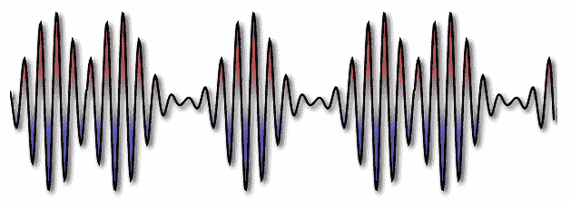

`DropShadow`类的大部分属性都是不言自明的，但有两个属性——`radius`和`samples`——需要一些额外的解释。阴影被绘制为原始项目的模糊单色副本，并偏移给定位置。这两个提到的属性控制模糊的量和质量——用于模糊的样本越多，效果越好，但需要执行的计算也越复杂。

说到模糊，纯模糊效果也通过`GaussianBlur`元素类型在图形效果模块中提供。要将模糊效果而不是阴影应用于上一个示例，只需将`DropShadow`类的出现替换为以下代码：

```cpp
GaussianBlur {
    source: heartBeat
    anchors.fill: heartBeat
    radius: 12
    samples: 20
    transparentBorder: true
}
```

此更改将产生以下结果：


在这里，你可以看到前面提到的两个属性以及一个模糊命名的`transparentBorder`属性。启用此属性可以修复模糊边缘的一些伪影，并且通常你希望保持这种方式。

# 尝试一下英雄效果 - 模糊视差滚动游戏视图

`blur` 属性是一个非常棒的效果，可以在许多情况下使用。例如，您可以在我们的象形游戏中尝试实现一个功能，当用户暂停游戏时（例如，通过按键盘上的 *P* 键），视图会变得模糊。通过应用动画到效果的 `radius` 属性，使效果平滑。

另一个有趣的效果是 `Glow`。它渲染源元素的彩色和模糊副本。在游戏中的一个示例用法是突出显示用户界面的某些部分——您可以通过使元素周期性地闪烁来引导用户的注意力到该元素（例如，按钮或徽章）：

```cpp
Window {
    //...
    Badge {
        id: importantBadge
        anchors.centerIn: parent
    }
    Glow {
        source: importantBadge
        anchors.fill: source
        samples: 64
        color: "red"

        SequentialAnimation on radius {
            loops: Animation.Infinite
            running: true

            NumberAnimation { from: 0; to: 30; duration: 500 }
            PauseAnimation { duration: 100 }
            NumberAnimation { from: 30; to: 0; duration: 500 }
            PauseAnimation { duration: 1000 }
        }
    }
}
```

完整模块包含 20 种不同的效果。我们无法在这里详细描述每种效果。不过，您可以自己了解它们。如果您克隆模块的源 git 仓库（位于 [`code.qt.io/cgit/qt/qtgraphicaleffects.git/`](https://code.qt.io/cgit/qt/qtgraphicaleffects.git/)），在克隆仓库的 `tests/manual/testbed` 子目录中，您将找到一个用于测试现有效果的不错应用程序。要运行此工具，请使用 `qmlscene` 打开 `testBed.qml` 文件：

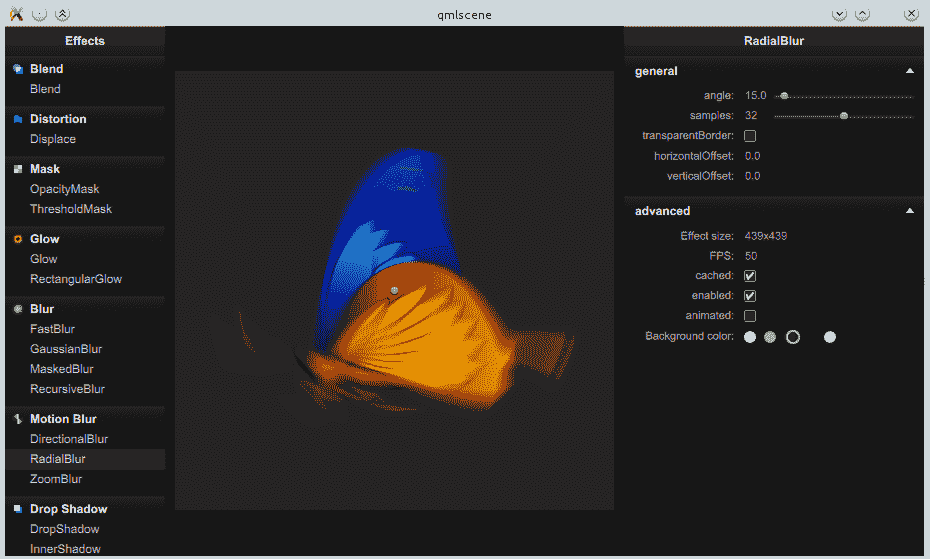

您也可以通过在文档索引中搜索 `QtGraphicalEffects` 来访问效果和它们的简短描述的完整列表。

# 粒子系统

游戏中常用的一种视觉效果是生成大量小、通常寿命短、通常快速移动、模糊的对象，如星星、火花、烟雾、灰尘、雪、碎片、落叶等。将这些作为场景中的常规项目放置会大大降低性能。相反，使用一个特殊的引擎，该引擎维护此类对象的注册表并跟踪（模拟）它们的逻辑属性，而不在场景中具有物理实体。这些称为 **粒子** 的对象，在请求时使用非常高效的算法在场景中进行渲染。这允许我们使用大量粒子，而不会对场景的其他部分产生负面影响。

Qt Quick 在 `QtQuick.Particles` 导入中提供了一个粒子系统。`ParticleSystem` 元素提供了模拟的核心，它使用 `Emitter` 元素来生成粒子。然后根据 `ParticlePainter` 元素中的定义进行渲染。可以使用 `Affector` 对象来操作模拟实体，这些对象可以修改粒子的轨迹或生命周期。

让我们从简单的例子开始。以下代码片段声明了最简单的粒子系统：

```cpp
import QtQuick 2.0
import QtQuick.Window 2.2
import QtQuick.Particles 2.0

Window {
    visible: true
    width: 360
    height: 360
    title: qsTr("Particle system")

    ParticleSystem {
        id: particleSystem
        anchors.fill: parent

        Emitter { anchors.fill: parent }
        ImageParticle { source: "star.png" }
    }
}
```

结果可以在以下图像中观察到：

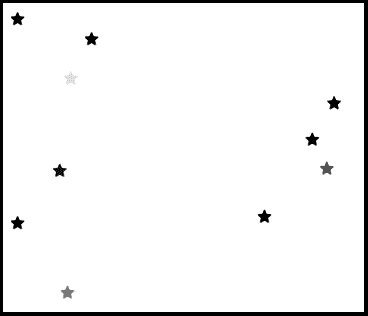

让我们分析一下代码。在导入`QtQuick.Particles 2.0`之后，会实例化一个`ParticleSystem`项目，它定义了粒子系统的域。我们在该系统中定义了两个对象。第一个对象是`Emitter`，它定义了粒子生成的区域。该区域被设置为包含整个域。第二个对象是`ImageParticle`类型的对象，它是`ParticlePainter`子类。它确定粒子应以给定图像的实例进行渲染。默认情况下，`Emitter`对象每秒生成 10 个粒子，每个粒子存活一秒后死亡并被从场景中移除。在所展示的代码中，`Emitter`和`ImageParticle`对象是`ParticleSystem`类的直接子类；然而，这并不一定必须如此。可以通过设置`system`属性来显式指定粒子系统。

# 调整发射器

您可以通过设置发射器的`emitRate`属性来控制正在发射的粒子数量。另一个属性，称为`lifeSpan`，决定了粒子死亡前需要多少毫秒。为了引入一些随机行为，您可以使用`lifeSpanVariation`属性来设置系统可以改变生命周期（在两个方向上）的最大时间（以毫秒为单位）：

```cpp
Emitter {
    anchors.fill: parent
    emitRate: 350
    lifeSpan: 1500
    lifeSpanVariation: 400 // effective: 1100-1900 ms
} 
```

这种变化的可能结果如下所示：

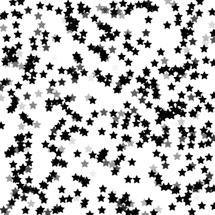

增加粒子的发射率和生命周期可能会导致需要管理（以及可能渲染）的粒子数量非常大。这可能会降低性能；因此，可以通过`maximumEmitted`属性设置可以同时存活的粒子的上限。

调整粒子的生命周期可以使系统更加多样化。为了增强效果，您还可以通过`size`和`sizeVariation`属性来调整每个粒子的尺寸：

```cpp
Emitter {
    anchors.fill: parent
    emitRate: 50
    size: 12
    sizeVariation: 6
    endSize: 2
}
```

这将为您提供不同大小的粒子：

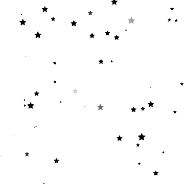

到目前为止所展示的功能范围应该足够创建许多看起来很好看且实用的粒子系统。然而，粒子是从发射器的整个区域发射出来的，这是一个常规的`QQuickItem`，因此是矩形的。但这并不一定必须如此。`Emitter`元素包含一个`shape`属性，这是一种声明粒子生成区域的途径。`QtQuick.Particles`模块定义了三种可用的自定义形状类型——`EllipseShape`、`LineShape`和`MaskShape`。前两种非常简单，定义了在项目内绘制的空或填充的椭圆或穿过项目对角线的线。`MaskShape`元素更有趣，因为它使得可以使用图像作为`Emitter`元素的形状：

```cpp
Emitter {
    anchors.fill: parent
    emitRate: 1600
    shape: MaskShape { source: "star.png" }
}
```

粒子现在只能在指定的区域内生成：

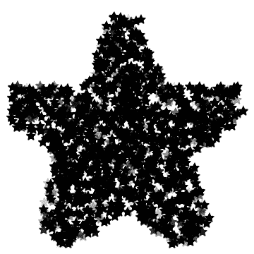

# 渲染粒子

到目前为止，我们使用裸`ImageParticle`元素来渲染粒子。它只是三种`ParticlePainters`中的一种，其他两种是`ItemParticle`和`CustomParticle`。然而，在我们继续到其他渲染器之前，让我们专注于调整`ImageParticle`元素以获得一些有趣的效果。

`ImageParticle` 元素将每个逻辑粒子渲染为一个图像。可以通过改变每个粒子的颜色和旋转、变形其形状或将其用作精灵动画来分别操作每个图像。

要影响粒子的颜色，你可以使用大量专用属性中的任何一个——`alpha`、`color`、`alphaVariation`、`colorVariation`、`redVariation`、`greenVariation` 和 `blueVariation`。前两个属性定义了相应属性的基值，其余属性设置相应参数从基值的最大偏差。在透明度的情况下，你只能使用一种类型的偏差，但在定义颜色时，你可以为红色、绿色和蓝色通道设置不同的值，或者你可以使用全局的`colorVariation`属性，这类似于为所有三个通道设置相同的值。允许的值是 0（不允许偏差）和 1.0（任一方向的 100%）之间的任何值。

注意，当将颜色应用于图像时，相应颜色的成分（红色、绿色、蓝色和 alpha）会被相乘。黑色（0, 0, 0, 1）的所有成分都设置为 0，除了 alpha，因此将纯色应用于黑色图像将不会产生任何效果。相反，如果你的图像包含白色像素（1, 1, 1, 1），它们将以指定的颜色精确显示。透明像素将保持透明，因为它们的 alpha 成分将保持设置为 0。

在我们的例子中，我们可以使用以下代码创建不同颜色的粒子：

```cpp
ImageParticle {
    source: "star_white.png"
    colorVariation: 1
}
```

结果应该看起来像这样：


提到的属性是静态的——粒子在其整个生命周期中遵循恒定值。`ImageParticle` 元素还公开了两个属性，允许你根据粒子的年龄控制其颜色。首先，有一个名为`entryEffect`的属性，它定义了粒子在其出生和死亡时会发生什么。默认值是`Fade`，这使得粒子在其生命开始时从 0 不透明度淡入，并在死亡前将其淡回 0。你已经在所有之前演示的粒子动画中体验过这种效果。该属性的其它值是`None`和`Scale`。第一个值很明显——与粒子无关的进入效果。第二个值将粒子从出生时的 0 缩放到生命结束时的 0。

另一个与时间相关的属性是`colorTable`。您可以提供用作确定粒子在其生命周期中颜色的单维纹理的图像的 URL。一开始，粒子由图像的左侧定义颜色，然后以线性方式向右移动。最常见的是在这里设置包含颜色渐变的图像，以实现颜色之间的平滑过渡。

可以改变的第二个参数是粒子的旋转。在这里，我们也可以使用定义旋转的常量值（以度为单位）的属性（`rotation`和`rotationVariation`）或使用`rotationVelocity`和`rotationVelocityVariation`在时间上修改粒子的旋转。速度定义了每秒旋转的度数或速度。

粒子还可以变形。`xVector`和`yVector`属性允许绑定向量，这些向量定义了水平和垂直轴上的扭曲。我们将在下一节中描述如何设置这些向量。最后但同样重要的是，使用`sprites`属性，您可以定义用于渲染粒子的精灵列表。这与前一章中描述的`SpriteSequence`类型的工作方式类似。

# 使粒子移动

除了淡入淡出和旋转之外，我们迄今为止所看到的粒子系统都非常静态。虽然这对于制作星系很有用，但对于爆炸、火花甚至下雪来说却毫无用处。这是因为粒子主要关于运动。在这里，我们将向您展示使粒子飞行的两个方面。

第一个方面是模拟粒子的生成方式。这意味着创建粒子的物体的物理条件。在爆炸过程中，物质以非常大的力量从震中推开，导致空气和小物体以极高的速度向外冲。火箭发动机的烟雾以与推进器相反的方向以高速喷射。移动的彗星会拖着一缕尘埃和气体，这些尘埃和气体是由惯性引起的。

所有这些条件都可以通过设置粒子的速度或加速度来模拟。这两个指标由向量描述，这些向量确定了给定量的方向和数量（大小或长度）。在 Qt Quick 中，这些向量由一个称为“方向”的元素类型表示，其中向量的尾部附着在对象上，而头部位置由“方向”实例计算得出。由于我们没有设置粒子属性的方法，因为我们没有代表它们的对象，所以这两个属性——`速度`和`加速度`——应用于产生粒子的发射器。由于您可以在单个粒子系统中拥有许多发射器，因此可以为不同来源的粒子设置不同的速度和加速度。

有四种类型的方向元素，代表关于方向的不同信息来源。首先，有`CumulativeDirection`，它作为其他方向类型的容器，并像包含在其内的方向的总和一样工作。

然后，有`PointDirection`，在这里你可以指定向量头部应该连接的点的*x*和*y*坐标。为了避免所有粒子都朝同一方向移动的不现实效果，你可以指定`xVariation`和`yVariation`来引入从给定点允许的偏差：

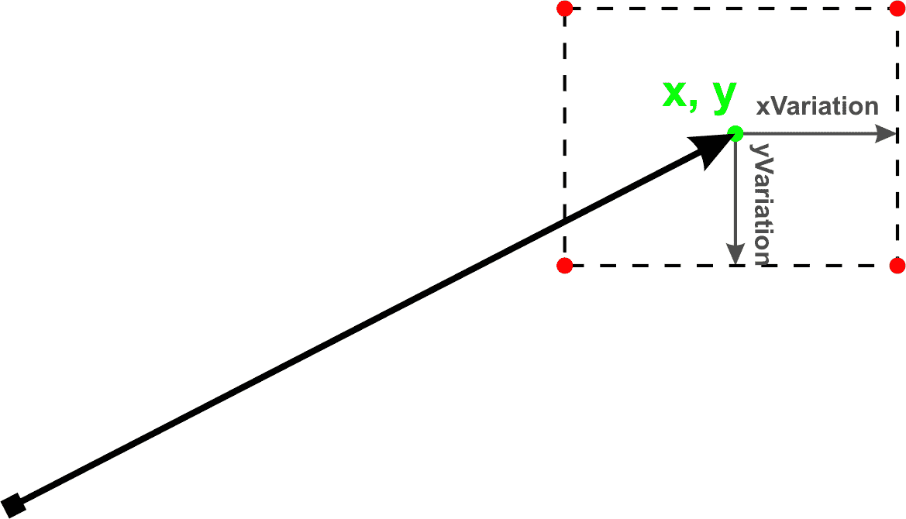

第三种是最受欢迎的方向类型——`AngleDirection`，它直接指定了向量的角度（从正右方向顺时针计算）和大小（以每秒像素计）。角度可以从基准值变化`angleVariation`，同样，`magnitudeVariation`可以用来引入向量大小的变化：


最后一种类型与前面的一种类似。`TargetDirection`向量可以用来将向量指向给定 Qt Quick 项（通过`targetItem`属性设置）的中心。向量的长度通过给出`magnitude`和`magnitudeVariation`来计算，两者都可以解释为每秒像素数或源点和目标点之间距离的倍数（取决于`proportionalMagnitude`属性的值）：

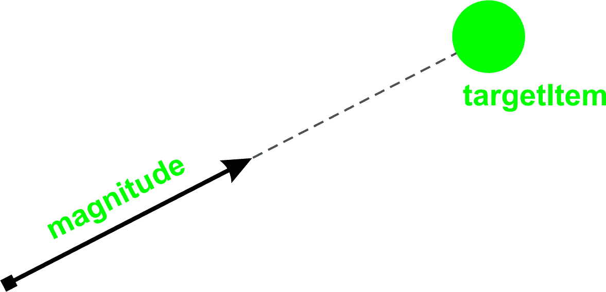

让我们回到设置粒子速度。我们可以使用`AngleDirection`向量来指定粒子应该向左移动，最大扩散角度为 45 度：

```cpp
Emitter {
    anchors.centerIn: parent
    width: 50; height: 50
    emitRate: 50

    velocity: AngleDirection {
        angleVariation: 45
        angle: 180
        magnitude: 200
    }
}
```

这段代码将产生以下图片中所示的效果：

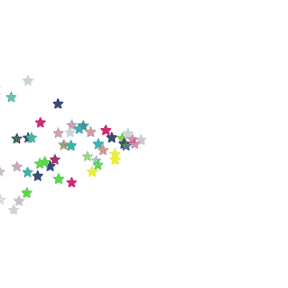

设置加速度的工作方式相同。你甚至可以设置每个粒子应该具有的初始速度和加速度。很容易将粒子射向左侧并开始向下拉：

```cpp
Emitter {
    anchors.right: parent.right
    anchors.verticalCenter: parent.verticalCenter
    emitRate: 15
    lifeSpan: 5000

    velocity: AngleDirection {
        angle: 180
        magnitude: 200
    }
    acceleration: AngleDirection {
        angle: 90 // local left = global down
        magnitude: 100
    }
}
```

这段代码将产生沿单一路径移动的粒子：

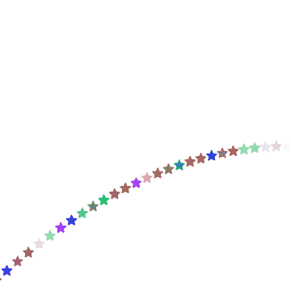

`Emitter`元素还有一个在移动粒子上下文中很有用的属性。将`velocityFromMovement`参数设置为不同于`0`的值，会使`Emitter`元素的任何移动都应用于粒子的速度。附加向量的方向与发射器的移动方向一致，其大小设置为发射器速度乘以`velocityFromMovement`设置的值。这是一种生成火箭发动机喷射烟雾的绝佳方式：

```cpp
Item {
    Image {
        id: image
        source: "rocket.png"
    }
    Emitter {
        anchors.right: image.right
        anchors.verticalCenter: image.verticalCenter
        emitRate: 500
        lifeSpan: 3000
        lifeSpanVariation: 1000
        velocityFromMovement: -20

        velocity: AngleDirection {
            magnitude: 100
            angleVariation: 40
        }
    }
    NumberAnimation on x {
        ...
    }
}
```

这就是结果可能看起来像什么：


处理粒子行为的第二种方式是在粒子出生后影响它们的属性——在任何特定的生命时刻。这可以通过影响者来实现。这些是继承自影响者的项目，可以修改正在通过影响者区域的粒子的某些属性。最简单的影响者之一是`Age`。它可以推进粒子到它们生命周期的某个点，在那里它们只剩下`lifeLeft`毫秒的生命：

```cpp
Age { 
    once: true 
    lifeLeft: 500 
    shape: EllipseShape { fill: true }
    anchors.fill: parent 
}
```

将`once`设置为`true`使得每个影响者只对给定的粒子产生一次影响。否则，每个粒子可以多次修改其属性。

另一种影响类型是`Gravity`，它可以在给定的角度加速粒子。`Friction`可以减慢粒子的速度，而`Attractor`将影响粒子的位置、速度或加速度，使其开始向给定点移动。`Wander`非常适合模拟雪花或蝴蝶以伪随机方向飞行的效果。

还有其他类型的影响者可用，但在这里我们不会深入其细节。然而，我们想提醒您，不要过度使用影响者——它们可能会严重降低性能。

# 行动时间 - 生成消失的硬币粒子

现在是时候练习我们新获得的知识了。任务是向我们在上一章中创建的游戏添加粒子效果。当玩家收集到硬币时，它将爆炸成一片五彩缤纷的星星。

首先，声明一个粒子系统作为游戏场景的填充，以及粒子绘制器的定义：

```cpp
ParticleSystem {
    id: coinParticles
    anchors.fill: parent // scene is the parent

    ImageParticle {
        source: "images/particle.png"
        colorVariation: 1
        rotationVariation: 180
        rotationVelocityVariation: 10
    }
} 
```

接下来，修改`Coin`的定义以包括发射器：

```cpp
Emitter {
    id: emitter
    system: coinParticles
    emitRate: 0
    lifeSpan: 1500
    lifeSpanVariation: 100
    velocity: AngleDirection {
        angleVariation: 180
        magnitude: 10
    }
    acceleration: AngleDirection {
        angle: 270
        magnitude: 30
    }
}
```

最后，必须更新`hit()`函数：

```cpp
function hit() {
    emitter.burst(50);
    hitAnim.start();
} 
```

运行游戏并看看当本杰明收集硬币时会发生什么：


# 刚才发生了什么？

在这个练习中，我们定义了一个简单的粒子系统，它填充了整个场景。我们为粒子定义了一个简单的图像绘制器，允许粒子呈现所有颜色并在所有可能的旋转中开始。我们使用星形位图作为我们的粒子模板。

然后，一个`Emitter`对象被附加到每个硬币上。它的`emitRate`被设置为`0`，这意味着它不会自行发射任何粒子。我们为粒子设置了不同的生命周期，并通过设置它们的初始速度，在两个方向上以 180 度的角度变化（总共 360 度）使它们向所有方向飞行。通过设置加速度，我们使粒子倾向于向场景的顶部边缘移动。

在`hit`函数中，我们调用发射器的`burst()`函数，这使得它立即产生一定数量的粒子。

# 基于 OpenGL 的 Qt Quick 自定义项目

在第十二章，“Qt Quick 中的自定义”，我们学习了如何创建新的 QML 元素类型，这些类型可以被用来提供动态数据引擎或其他类型的非视觉对象。现在我们将看到如何为 Qt Quick 提供新的视觉项目类型。

你应该首先问自己一个问题：你是否真的需要一种新的项目类型。也许你可以用现有的元素达到同样的目标？非常常见的是，你可以使用矢量图或位图图像来为你的应用程序添加自定义形状，或者你可以使用 Canvas 在 QML 中直接快速绘制所需的图形。

如果你决定你需要自定义项目，你将通过实现`QQuickItem` C++类的子类来完成，这是 Qt Quick 中所有项目的基类。创建新类型后，你将始终需要使用`qmlRegisterType`将其注册到 QML 中。

# 场景图

为了提供非常快速的场景渲染，Qt Quick 使用一种称为**场景图**的机制。该图由许多已知类型的节点组成，每个节点描述要绘制的原始形状。框架利用对允许的每个原始形状及其参数的知识，找到渲染项目时性能最优的顺序。渲染本身使用 OpenGL 完成，所有形状都使用 OpenGL 调用来定义。

为 Qt Quick 提供新项目归结为提供一组节点，这些节点使用图表理解的术语来定义形状。这是通过子类化`QQuickItem`并实现纯虚`updatePaintNode()`方法来完成的，该方法应该返回一个节点，告诉场景图如何渲染项目。该节点很可能会描述一个应用了材质（颜色、纹理）的几何形状（形状）。

# 行动时间 - 创建正多边形项

让我们通过提供一个用于渲染凸多边形的项类来了解场景图。我们将使用称为“三角形扇”的 OpenGL 绘图模式来绘制多边形。它绘制一组具有公共顶点的三角形。后续的三角形由共享顶点、前一个三角形的顶点和指定的下一个顶点定义。看看图解，了解如何使用八个顶点作为控制点将六边形作为三角形扇绘制：

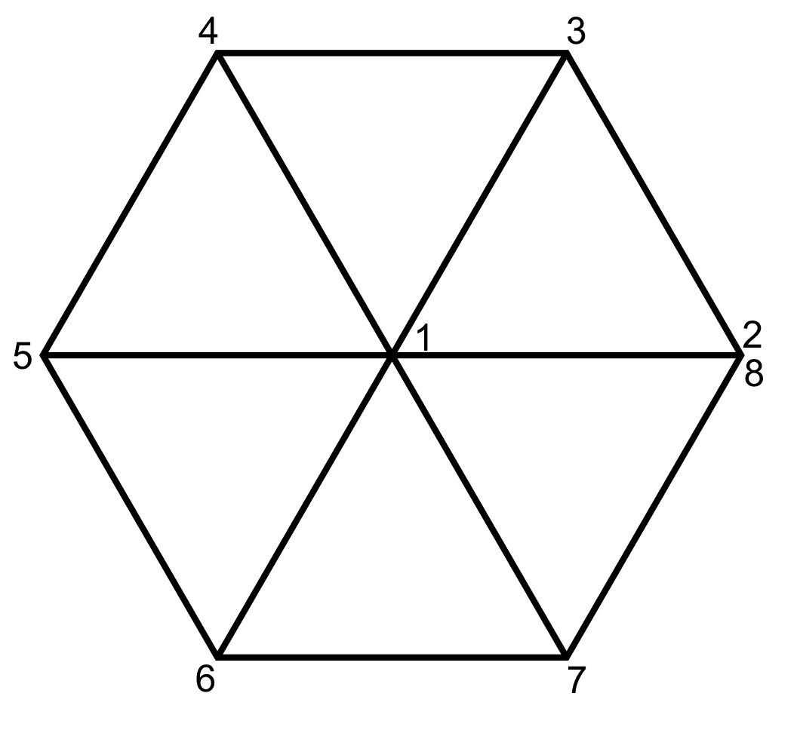

同样的方法适用于任何正多边形。定义的第一个顶点始终是占据形状中心的共享顶点。其余的点位于形状边界圆的圆周上，角度相等。角度可以通过将完整角度除以边的数量来轻松计算。对于六边形，这会产生 60 度。

让我们开始处理业务和`QQuickItem`子类。我们将给它一个非常简单的接口：

```cpp
class RegularPolygon : public QQuickItem
{
    Q_OBJECT
    Q_PROPERTY(int vertices READ vertices WRITE setVertices 
               NOTIFY verticesChanged)
    Q_PROPERTY(QColor color READ color WRITE setColor NOTIFY colorChanged)
public:
    RegularPolygon();
    ~RegularPolygon();
    int vertices() const;
    void setVertices(int v);

    QColor color() const;
    void setColor(const QColor &c);

    QSGNode *updatePaintNode(QSGNode *, UpdatePaintNodeData *);

signals:
    void verticesChanged(int);
    void colorChanged(QColor);

private:
     int m_vertexCount;
     QColor m_color;
};
```

我们的多边形由顶点数和填充颜色定义。我们还继承了`QQuickItem`的所有内容，包括项目的宽度和高度。除了添加明显的属性获取器和设置器外，我们还重写了虚拟`updatePaintNode()`方法，该方法负责构建场景图。

在我们处理更新图节点之前，让我们先处理简单的部分。构造函数的实现如下：

```cpp
RegularPolygon::RegularPolygon()
{
    setFlag(ItemHasContents, true);
    m_vertexCount = 6;
}
```

我们默认将多边形设置为六边形。我们还设置了一个标志`ItemHasContents`，它告诉场景图该项目不是完全透明的，并且应该通过调用`updatePaintNode()`来询问我们如何绘制项目。这个标志的存在允许 Qt 在项目根本不会绘制任何内容的情况下避免准备整个基础设施。

设置器也很容易理解：

```cpp
void RegularPolygon::setVertices(int v) {
    v = qMax(3, v);
    if(v == vertices()) return;
    m_vertexCount = v;
    emit verticesChanged(v);
    update();
}

void RegularPolygon::setColor(const QColor &c) {
    if(color() == c) return;
    m_color = c;
    emit colorChanged(c);
    update();
}
```

一个多边形至少需要有三条边；因此，我们通过`qMax`对输入值进行清理，强制执行这个最小值。在我们更改任何可能影响项目外观的属性后，我们调用`update()`让 Qt Quick 知道项目需要重新渲染。现在让我们处理`updatePaintNode()`。我们将将其分解成更小的部分，这样你更容易理解函数的工作方式：

```cpp
QSGNode *RegularPolygon::updatePaintNode(
    QSGNode *oldNode, QQuickItem::UpdatePaintNodeData *) { 
```

当函数被调用时，它可能会接收到在之前调用中返回的节点。请注意，图在觉得合适的时候可以自由地删除所有节点，因此你绝对不应该依赖于节点存在，即使你在函数的前一次运行中返回了一个有效的节点。让我们继续函数的下一部分：

```cpp
  QSGGeometryNode *node = nullptr;
  QSGGeometry *geometry = nullptr;
```

我们将返回的节点是一个包含绘制形状的几何和材质信息的几何节点。我们将随着方法的执行填充这些变量。接下来，我们检查是否提供了`oldNode`：

```cpp
    if (!oldNode) {
        node = new QSGGeometryNode;
        geometry = new QSGGeometry(
            QSGGeometry::defaultAttributes_Point2D(), m_vertexCount + 2);
        geometry->setDrawingMode(GL_TRIANGLE_FAN);
        node->setGeometry(geometry);
        node->setFlag(QSGNode::OwnsGeometry);
```

正如我们已经提到的，函数是用之前返回的节点作为参数调用的，但我们应该准备好节点可能不存在的情况，并且我们应该创建它。因此，如果是这种情况，我们将创建一个新的`QSGGeometryNode`和一个新的`QSGGeometry`。几何构造函数接受一个所谓的属性集作为其参数，该属性集定义了几何中数据的布局。

大多数常见的布局已经被预定义：

| **属性集** | **用途** | **第一个属性** | **第二个属性** |
| --- | --- | --- | --- |
| `Point2D` | 单色形状 | `float x, y` | - |
| `ColoredPoint2D` | 每个顶点的颜色 | `float x, y` | `uchar red, green, blue, alpha` |
| `TexturedPoint2D` | 每个顶点的纹理坐标 | `float x, y` | `float tx, float ty` |

我们将使用 2D 点来定义几何形状，每个点不附加任何额外信息；因此，我们传递`QSGGeometry::defaultAttributes_Point2D()`来构建我们需要的布局。正如你在前表中看到的，该布局的每个属性都由两个浮点值组成，表示点的*x*和*y*坐标。

`QSGGeometry`构造函数的第二个参数告诉我们我们将使用多少个顶点。构造函数将根据给定的属性布局分配足够的内存来存储所需数量的顶点。在几何容器准备好后，我们将它的所有权传递给几何节点，以便当几何节点被销毁时，几何形状的内存也会被释放。在此时刻，我们还标记我们将以`GL_TRIANGLE_FAN`模式进行渲染。这个过程会为材料重复进行。

```cpp
        QSGFlatColorMaterial *material = new QSGFlatColorMaterial;
        material->setColor(m_color);
        node->setMaterial(material);
        node->setFlag(QSGNode::OwnsMaterial);
```

我们使用`QSGFlatColorMaterial`作为整个形状将有一个从`m_color`设置的单一颜色。Qt 提供了一系列预定义的材料类型。例如，如果我们想给每个顶点分配不同的颜色，我们会使用`QSGVertexColorMaterial`以及`ColoredPoint2D`属性布局。

下一段代码处理的是`oldNode`确实包含了一个指向已经初始化的节点的有效指针的情况：

```cpp
    } else {
        node = static_cast<QSGGeometryNode *>(oldNode);
        geometry = node->geometry();
        geometry->allocate(m_vertexCount + 2);
    }
```

在这种情况下，我们只需要确保几何形状能够容纳我们需要的尽可能多的顶点，以防自上次函数执行以来边的数量发生了变化。接下来，我们检查材料：

```cpp
    QSGMaterial *material = node->material();
    QSGFlatColorMaterial *flatMaterial =
            static_cast<QSGFlatColorMaterial*>(material);
    if(flatMaterial->color() != m_color) {
        flatMaterial->setColor(m_color);
        node->markDirty(QSGNode::DirtyMaterial);
    }
```

如果颜色不同，我们将其重置，并告诉几何节点材料需要更新，通过标记`DirtyMaterial`标志。

最后，我们可以设置顶点数据：

```cpp
    QRectF bounds = boundingRect();
    QSGGeometry::Point2D *vertices = geometry->vertexDataAsPoint2D();

    // first vertex is the shared one (middle)
    QPointF center = bounds.center();

    vertices[0].set(center.x(), center.y());

    // vertices are distributed along circumference of a circle

    qreal angleStep = 360.0 / m_vertexCount;

    qreal radius = qMin(width(), height()) / 2;

    for (int i = 0; i < m_vertexCount; ++i) {
        qreal rads = angleStep * i * M_PI / 180;
        qreal x = center.x() + radius * std::cos(rads);
        qreal y = center.y() + radius * std::sin(rads);
        vertices[1 + i].set(x, y);
    }
    vertices[1 + m_vertexCount] = vertices[1];
```

首先，我们要求几何对象为我们准备一个从分配的内存到`QSGGeometry::Point2D`结构的映射，这可以方便地为每个顶点设置数据。然后，使用计算圆上点的方程进行实际计算。圆的半径取为项目宽度和高度的较小部分，以便形状在项目中居中。正如你在练习开始时的图中可以看到的，数组中的最后一个点与数组中的第二个点具有相同的坐标，以便将扇形封闭成规则多边形。

最后，我们标记几何形状已更改，并将节点返回给调用者：

```cpp
  node->markDirty(QSGNode::DirtyGeometry);
  return node;
} 
```

# 刚才发生了什么？

在 Qt Quick 中的渲染可以在与主线程不同的线程中发生。在调用`updatePaintNode()`函数之前，Qt 会在 GUI 线程和渲染线程之间执行同步，以便我们安全地访问项目数据和其他存在于主线程中的对象。在执行此函数时，执行主线程的函数将被阻塞，因此它必须尽可能快地执行，并且不要进行任何不必要的计算，因为这会直接影响性能。这也是你可以在代码中同时安全调用项目中的函数（如读取属性）并与场景图（创建和更新节点）交互的唯一地方。尽量在此方法中不要发出任何信号或创建任何对象，因为它们将具有渲染线程的亲和力，而不是 GUI 线程。

话虽如此，你现在可以使用 `qmlRegisterType` 将你的类注册到 QML 中，并使用以下 QML 文档进行测试：

```cpp
Window {
    width: 600
    height: 600
    visible: true
    RegularPolygon {
        id: poly
        anchors {
            fill: parent
            bottomMargin: 20
        }
        vertices: 5
        color: "blue"
    }
}
```

这应该会给你一个漂亮的蓝色五边形。如果形状看起来有锯齿，你可以通过设置应用程序的表面格式来强制抗锯齿：

```cpp
int main(int argc, char **argv) {
    QGuiApplication app(argc, argv);
    QSurfaceFormat format = QSurfaceFormat::defaultFormat();
 format.setSamples(16); // enable multisampling
 QSurfaceFormat::setDefaultFormat(format);

    qmlRegisterType<RegularPolygon>("RegularPolygon", 1, 0, "RegularPolygon");

    QQmlApplicationEngine engine;
    engine.load(QUrl(QStringLiteral("qrc:/main.qml")));
    if (engine.rootObjects().isEmpty())
      return -1;
    return app.exec();
}
```

如果在启用抗锯齿后应用程序产生黑色屏幕，尝试减少样本数量或禁用它。

# 尝试一下英雄 – 创建 RegularPolygon 的支持边框

`updatePaintNode()` 返回的不仅可能是一个单一的 `QSGGeometryNode`，也可能是一个更大的 `QSGNode` 项的树。每个节点可以有任意数量的子节点。通过返回一个有两个几何节点作为子节点的节点，你可以在项中绘制两个独立的形状：


作为挑战，扩展 `RegularPolygon` 以绘制多边形的内部填充部分以及可以不同颜色的边。你可以使用 `GL_QUAD_STRIP` 绘图模式来绘制边。点的坐标很容易计算——靠近形状中间的点就是构成形状本身的点。其余的点也位于一个略微更大的圆的圆周上（边框的宽度）。因此，你可以使用相同的方程来计算它们。

`GL_QUAD_STRIP` 模式通过指定在第一个四个顶点之后的每两个顶点来渲染四边形，组成一个连接的四边形。以下图表应该能清楚地说明我们想要达到的效果：

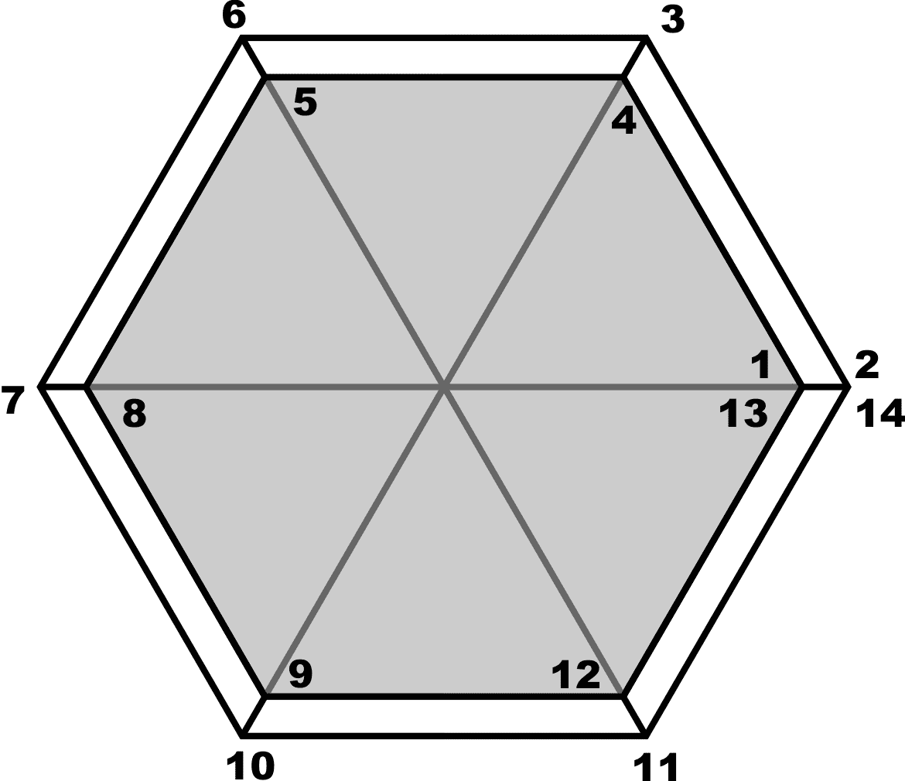

# 在 Qt Quick 中使用 QPainter 接口

在 OpenGL 中实现项相当困难——你需要想出一个使用 OpenGL 原语绘制你想要的形状的算法，然后你还需要足够熟练地使用 OpenGL 来为你的项构建一个合适的场景图节点树。然而，还有另一种方法——你可以通过 `QPainter` 绘制项。这会带来性能上的损失，因为幕后画家在一个间接的表面（帧缓冲对象或图像）上绘制，然后由场景图通过一个四边形将其转换为 OpenGL 纹理并渲染。即使考虑到性能损失，使用丰富且方便的绘图 API 绘制项通常比在 OpenGL 或 Canvas 中花费数小时做同样的事情要简单得多。

要使用这种方法，我们不会直接子类化 `QQuickItem`，而是 `QQuickPaintedItem`，这为我们提供了使用画家绘制项所需的基础设施。

基本上，我们接下来要做的就是实现纯虚的 `paint()` 方法，使用接收到的画家渲染项。让我们看看这是如何付诸实践，并将其与我们之前获得的技术结合起来。

# 动手实践 – 创建用于绘制轮廓文本的项

当前练习的目标是能够使以下 QML 代码工作：

```cpp
import QtQuick 2.9
import QtQuick.Window 2.3
import OutlineTextItem 1.0

Window {
    visible: true
    width: 800
    height: 400
    title: qsTr("Hello World")

    Rectangle {
        anchors.fill: parent
        OutlineTextItem {
            anchors.centerIn: parent
            text: "This is outlined text"
            fontFamily: "Arial"
            fontPixelSize: 64
            color: "#33ff0000"
            antialiasing: true
            border {
                color: "blue"
                width: 2
                style: Qt.DotLine
            }
        }
    }
}
```

然后，它会产生以下结果：


从一个空的 Qt Quick 应用程序项目开始。创建一个新的 C++类，并将其命名为`OutlineTextItemBorder`。将以下代码放入类定义中：

```cpp
class OutlineTextItemBorder : public QObject {
    Q_OBJECT
    Q_PROPERTY(int width MEMBER m_width NOTIFY widthChanged)
    Q_PROPERTY(QColor color MEMBER m_color NOTIFY colorChanged)
    Q_PROPERTY(Qt::PenStyle style MEMBER m_style NOTIFY styleChanged)
public:
    OutlineTextItemBorder(QObject *parent = 0);

    int width() const;
    QColor color() const;
    Qt::PenStyle style() const;
    QPen pen() const;
signals:
    void widthChanged(int);
    void colorChanged(QColor);
    void styleChanged(int);
private:
    int m_width;
    QColor m_color;
    Qt::PenStyle m_style;
};
```

这是一个基于`QObject`的简单类，包含多个属性。你可以看到，`Q_PROPERTY`宏没有我们迄今为止使用的`READ`和`WRITE`关键字。这是因为我们现在正在走捷径，我们让`moc`生成直接访问给定类成员以操作属性的代码。通常，我们不建议采取这种方法，因为没有 getter；访问属性的唯一方式是通过通用的`property()`和`setProperty()`调用。然而，在这种情况下，我们不会将这个类公开在 C++中，所以我们不需要 setter，我们仍然会自己实现 getter。`MEMBER`关键字的好处是，如果我们还提供了`NOTIFY`信号，生成的代码将在属性值变化时发出该信号，这将使 QML 中的属性绑定按预期工作。我们还需要实现一个根据属性值返回实际画笔的方法：

```cpp
QPen OutlineTextItemBorder::pen() const {
    QPen p;
    p.setColor(m_color);
    p.setWidth(m_width);
    p.setStyle(m_style);
    return p;
}
```

该类将为我们的主要项目类提供一个分组属性。创建一个名为`OutlineTextItem`的类，并从`QQuickPaintedItem`派生，如下所示：

```cpp
class OutlineTextItem : public QQuickPaintedItem
{
    Q_OBJECT
    Q_PROPERTY(QString text MEMBER m_text
                            NOTIFY textChanged)
    Q_PROPERTY(QColor color MEMBER m_color
                            NOTIFY colorChanged)
    Q_PROPERTY(OutlineTextItemBorder* border READ border
                            NOTIFY borderChanged)
    Q_PROPERTY(QString fontFamily MEMBER m_fontFamily
                            NOTIFY fontFamilyChanged)
    Q_PROPERTY(int fontPixelSize MEMBER m_fontPixelSize
                            NOTIFY fontPixelSizeChanged)
public:
    OutlineTextItem(QQuickItem *parent = 0);
    void paint(QPainter *painter);
    OutlineTextItemBorder* border() const;
    QPainterPath shape(const QPainterPath &path) const;
private slots:
    void updateItem();
signals:
    void textChanged(QString);
    void colorChanged(QColor);
    void borderChanged();
    void fontFamilyChanged(QString);
    void fontPixelSizeChanged(int);
private:
    OutlineTextItemBorder* m_border;
    QPainterPath m_path;
    QRectF m_boundingRect;
    QString m_text;
    QColor m_color;
    QString m_fontFamily;
    int m_fontPixelSize;
};
```

接口定义了要绘制的文本属性，以及它的颜色、字体和轮廓数据的分组属性。同样，我们使用`MEMBER`来避免手动实现 getter 和 setter。不幸的是，这使得我们的构造函数代码更加复杂，因为我们仍然需要一种方法在任何属性被修改时运行一些代码。使用以下代码实现构造函数：

```cpp
OutlineTextItem::OutlineTextItem(QQuickItem *parent) : 
    QQuickPaintedItem(parent) 
{
    m_border = new OutlineTextItemBorder(this);
    connect(this, &OutlineTextItem::textChanged,
            this, &OutlineTextItem::updateItem);
    connect(this, &OutlineTextItem::colorChanged,
            this, &OutlineTextItem::updateItem);
    connect(this, &OutlineTextItem::fontFamilyChanged,
            this, &OutlineTextItem::updateItem);
    connect(this, &OutlineTextItem::fontPixelSizeChanged,
            this, &OutlineTextItem::updateItem);
    connect(m_border, &OutlineTextItemBorder::widthChanged,
            this, &OutlineTextItem::updateItem);
    connect(m_border, &OutlineTextItemBorder::colorChanged,
            this, &OutlineTextItem::updateItem);
    connect(m_border, &OutlineTextItemBorder::styleChanged,
            this, &OutlineTextItem::updateItem);
    updateItem();
}
```

我们基本上将对象及其分组属性对象的所有属性更改信号连接到同一个槽，该槽将在任何组件被修改时更新项目的数据。我们还将直接调用同一个槽来准备项目的初始状态。该槽可以像这样实现：

```cpp
void OutlineTextItem::updateItem() {
    QFont font(m_fontFamily, m_fontPixelSize);
    m_path = QPainterPath();
    m_path.addText(0, 0, font, m_text);
    m_boundingRect = borderShape(m_path).controlPointRect();
    setImplicitWidth(m_boundingRect.width());
    setImplicitHeight(m_boundingRect.height());
    update();
}
```

在开始时，该函数重置一个画家路径对象，该对象作为绘制轮廓文本的后端，并使用设置的字体初始化它。然后，槽函数使用我们很快就会看到的`borderShape()`函数计算路径的边界矩形。我们使用`controlPointRect()`来计算边界矩形，因为它比`boundingRect()`快得多，并且返回一个大于或等于`boundingRect()`的面积，这对我们来说是可以接受的。最后，它将计算出的尺寸设置为项目的尺寸提示，并使用`update()`调用请求项目重新绘制。使用以下代码实现`borderShape()`函数：

```cpp
QPainterPath OutlineTextItem::borderShape(const QPainterPath &path) const
{
    QPainterPathStroker pathStroker;
    pathStroker.setWidth(m_border->width());
    QPainterPath p = pathStroker.createStroke(path);
    p.addPath(path);
    return p;
}
```

`borderShape()`函数返回一个新的绘图路径，该路径包括原始路径及其使用`QPainterPathStroker`对象创建的轮廓。这样做是为了在计算边界矩形时正确考虑笔触的宽度。

剩下的就是实现`paint()`例程本身：

```cpp
void OutlineTextItem::paint(QPainter *painter) {
    if(m_text.isEmpty()) return;
    painter->setPen(m_border->pen());
    painter->setBrush(m_color);
    painter->setRenderHint(QPainter::Antialiasing, true);
    painter->translate(-m_boundingRect.topLeft());
    painter->drawPath(m_path);
}
```

代码非常简单——如果没有东西要绘制，我们就会提前退出。否则，我们使用从项的属性中获得的笔和颜色设置绘图器。我们启用抗锯齿并使用项的边界矩形校准绘图器坐标。最后，我们在绘图器上绘制路径。

# 刚才发生了什么？

在这次练习中，我们利用 Qt 的矢量图形引擎的强大 API，通过简单的功能来补充现有的 Qt Quick 项集。否则，使用预定义的 Qt Quick 元素来实现这一点非常困难，而使用 OpenGL 实现则更加困难。我们同意为了只写大约一百行代码就能得到一个完全工作的解决方案，我们愿意承受一点性能损失。如果你想在代码中使用它，请记住将类注册到 QML 中：

```cpp
qmlRegisterUncreatableType<OutlineTextItemBorder>(
     "OutlineTextItem", 1, 0, "OutlineTextItemBorder", "");
qmlRegisterType<OutlineTextItem>(
     "OutlineTextItem", 1, 0, "OutlineTextItem");
```

# 快速问答

Q1. 哪种 QML 类型可以用来在较小的视口中启用大项的滚动？

1.  `Rectangle`

1.  `Flickable`

1.  `Window`

Q2. `Affector` QML 类型的目的何在？

1.  `Affector`允许你在动画过程中更改 QML 项的属性

1.  `Affector`影响由粒子系统产生的粒子的属性

1.  `Affector`允许你控制由粒子系统产生的粒子的初始属性

Q3. 当你使用`QPainter`在 Qt Quick 项上绘图时会发生什么？

1.  每次调用`QPainter` API 都会转换为等效的 OpenGL 调用

1.  `QPainter`在不可见的缓冲区上绘图，然后将其作为 OpenGL 纹理加载

1.  由`QPainter`绘制的项在没有硬件加速的情况下显示

# 摘要

现在，你已经熟悉了 Qt Quick 的功能，这些功能允许你在游戏中添加令人惊叹的图形效果。你可以配置粒子系统并在 Qt Quick 的场景图中实现 OpenGL 绘图。你也能够利用本书第一部分学到的技能来实现绘制的 Qt Quick 项。

当然，Qt Quick 的功能比这还要丰富，但我们不得不在某处停下来。我们希望传授给你的技能应该足够开发出许多优秀的游戏。然而，许多元素具有比我们这里描述的更多的属性。无论何时你想扩展你的技能，你都可以查看参考手册，看看元素类型是否有更多有趣的属性。Qt Quick 仍在积极开发中，因此查看最近 Qt 版本的变更日志，看看这本书中未能涵盖的新功能是个好主意。

在下一章中，我们将关注 Qt 3D 模块，这是 Qt 框架中相对较新的一个模块。Qt 3D 提供了一个丰富的 QML API，这将使我们能够使用我们在与 Qt Quick 一起工作时学到的许多技能。然而，与用户界面和 2D 图形不同，你现在将创建显示硬件加速 3D 图形的游戏。当你学会使用 Qt 3D 时，你将能够将你的游戏提升到一个全新的水平！
