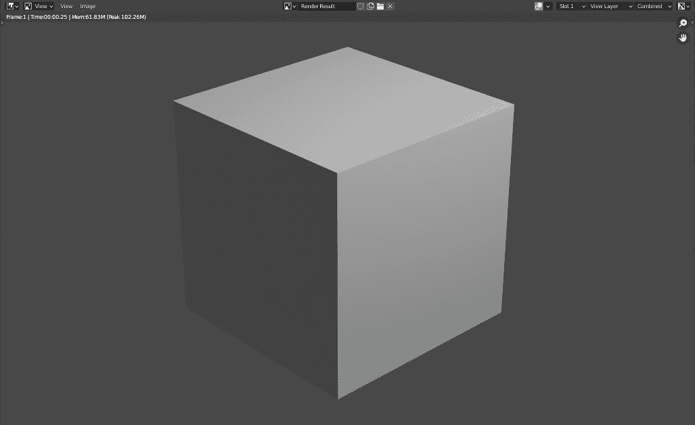
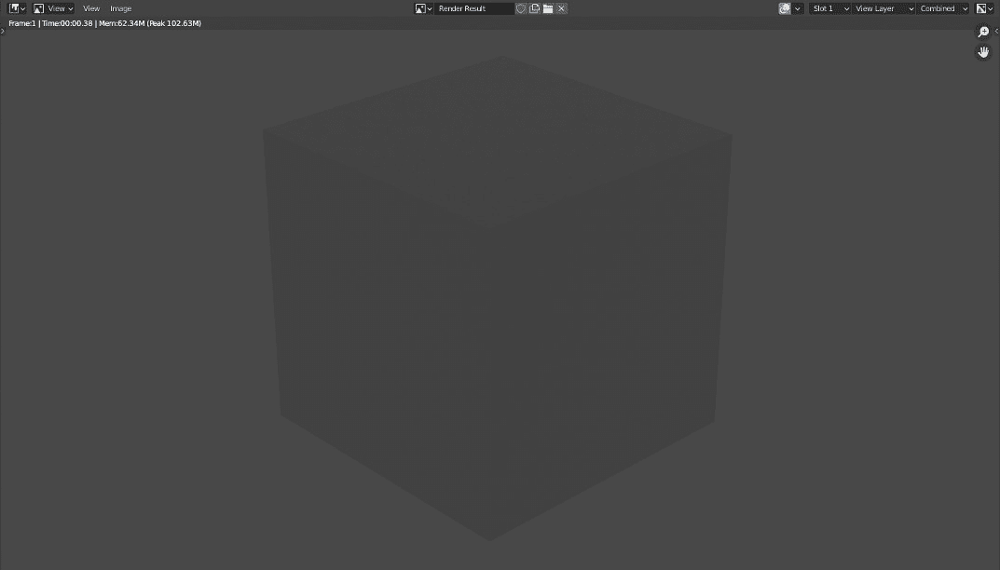
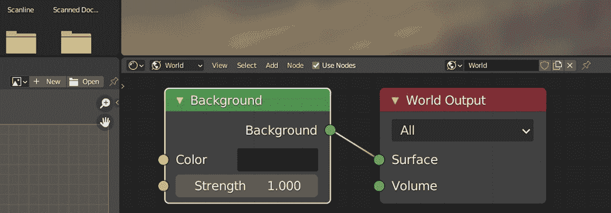
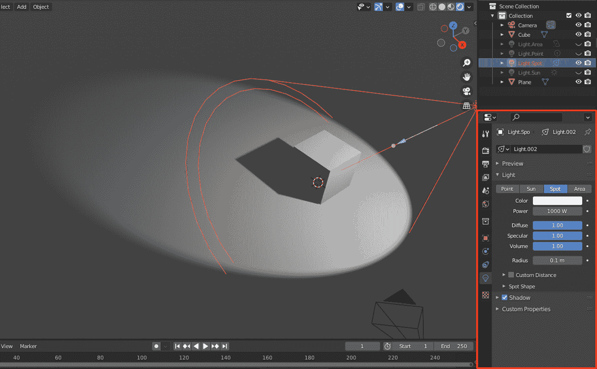
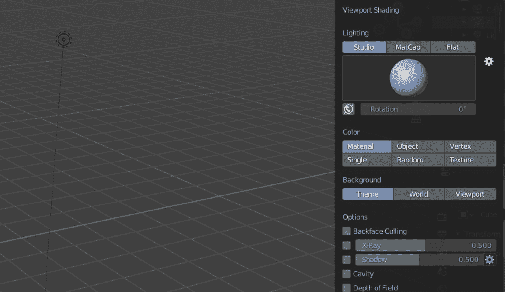
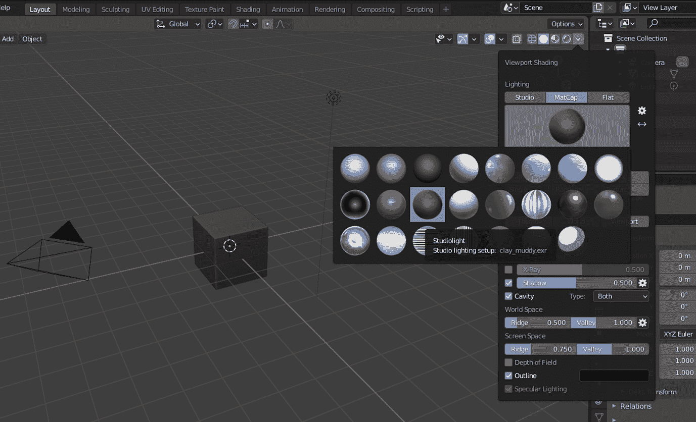
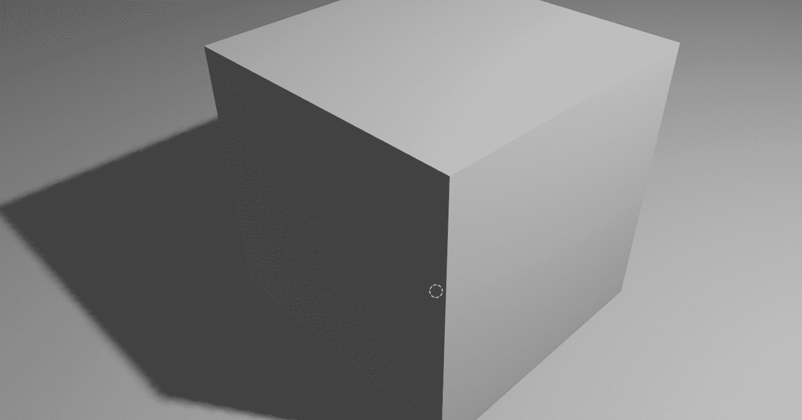

# 第五章：调整摄像机和灯光

当你开始一个新的场景时，在**大纲**中会有默认的**摄像机**和**灯光**对象。尽管它们是场景的一部分，但当你正在建模一个新对象，围绕它旋转，查看其材质预览时，你仍在使用 Blender 的内部摄像机和照明系统。这种默认行为适合快速工作，但不会产生艺术和准确的结果。

在本章中，你将了解摄像机的作用以及如何使用灯光来达到你想要的效果。前提很简单：没有灯光你什么也看不见，如果没有设备来记录或捕捉，你什么也记录不了。

虽然听起来我们正在介绍两个不同的主题，但本章我们将讨论摄像机和灯光。在这两者之间，我们将优先考虑灯光；你将得到一个解释为什么的原因。

因此，就像在现实生活中一样，摄像机和灯光条件是相互协作的，它们对于获得你想要的最佳镜头至关重要。为此，我们将涵盖以下主题：

+   渲染场景

+   理解灯光类型

+   介绍 MatCap 和环境遮挡

在阅读本章后，你将知道如何选择正确的灯光类型并捕捉场景的镜头。你还将知道为什么你可能想要推迟设置摄像机和灯光。然而，我们将为你提供一种达到一定视觉真实感的方法。

# 技术要求

在本章中，我们将进入新的领域，因此，你可以更安全地依赖本书 GitHub 仓库中的文件：[`github.com/PacktPublishing/Game-Development-with-Blender-and-Godot`](https://github.com/PacktPublishing/Game-Development-with-Blender-and-Godot)。

当相关时，将提到适当的文件名。这些文件已经为你设置好了，这样你就可以专注于本章的内容。

# 渲染场景

在计算机领域，“渲染”这个词与词典中的其他含义相似。在 Blender 中的渲染过程将原始场景转换为精细的结果。在更高级的情况下，如果你的场景可能包含**物理**或**粒子**对象，这个过程还将负责计算这些动态对象的状态。然而，为了简洁起见，我们只关注摄像机和灯光对象在渲染中扮演的角色。

让我们通过以下步骤创建我们的第一个渲染：

1.  开始一个新的 Blender 场景。

1.  按 *F12*。

或者，你可以使用应用顶部附近的**渲染**菜单。这应该会给你以下输出：

图 4.1 – 使用 Blender 默认摄像机和灯光选项渲染默认立方体的第一个渲染效果

这可能并不令人兴奋，因为当你使用 Blender 工作时，你通常都会看到这样的外观。渲染显示在一个单独的窗口中，该窗口覆盖了你刚刚工作的 Blender 窗口。因此，你可以通过按操作系统的关闭按钮或按*Esc*返回 Blender 来关闭此窗口。

如果你拍摄更多的渲染并来回切换，你会注意到立方体和其他对象（如相机和灯光）下面的网格不再包含在渲染中。这是预期的。这些被称为**辅助工具**的对象将为你提供便利，但最终不会与你在一起。它们就像建筑建造过程中的脚手架。虽然它们在工作时很有帮助，但在工作完成后就会被移走。

让我们通过改变一个东西来重复之前的练习。如果场景中没有相机会发生什么？是时候进行实验了：

1.  在**大纲视图**中右键单击**相机**。

1.  删除这个**相机**对象。

1.  按*F12*。

你预期会看到一个全黑的渲染吗？相反，你得到了一个错误信息，表明场景中没有找到相机。没有相机意味着没有工具来渲染你的场景，所以 Blender 显示了一个错误信息。

让我们通过删除**灯光**对象进行一个类似的实验。在启动一个新的 Blender 场景后，按照以下步骤操作：

1.  在**大纲视图**中右键单击**灯光**。

1.  删除这个**灯光**对象。

1.  按*F12*。

让我们推测一下我们期望看到的内容。我们有一个相机来渲染场景，但没有灯光。尽管立方体对象是场景的一部分，但我们不应该能看到它。然而，如果你查看下面的渲染，你会看到一个立方体的轮廓：

图 4.2 – 场景中没有灯光时的意外渲染

大多数软件应用程序都带有默认设置，以便帮助用户。在这种情况下，Blender 自带了一个背景色，不幸的是，这个背景色对之前的渲染结果有影响。如果你将这个设置的色调改为黑色，例如，那么你将得到一个完全黑色的渲染。要实现这一点，请按照以下步骤操作：

1.  切换到**着色**工作区，就像你在*第三章*中做的那样，*添加和创建纹理*。

1.  在**着色器编辑器**中通过使用四个视图交汇处的下拉菜单从**对象**模式切换到**世界**模式。

1.  将`000000`更改。

以下截图显示了更改背景色的设置：

图 4.3 – 我们也可以使用着色器编辑器来更改场景的背景色

如果你现在再次进行渲染，你会注意到整个画面都是黑色的。没有直接或间接的光或颜色对结果产生影响。所以，尽管东西看起来相当暗，但这正是我们期望看到的结果。这什么时候会有用？如果你希望没有惊喜，这意味着你宁愿控制每一个光源及其贡献的程度，那么选择黑色作为背景颜色可能是个好主意。

然而，大多数 Blender 用户是艺术家，而不是科学家。因此，他们通常会使用多个光源，并调整这些对象的设置以实现视觉真实感，而不是科学准确性。因此，保留背景颜色可能也是你可能会做的事情。

说到光源及其设置，这正是学习 Blender 使用不同类型光的正确时机。我们将在下一节中点亮事物。

# 理解光类型

到目前为止，我们已经看到了一个有光源的渲染和一个没有光源的渲染。我们还没有发现这个光源是什么。在本节中，我们将了解不同类型的灯光。到本节结束时，你将对每种类型及其重要性有一个很好的了解。

我们将在**Eevee**渲染引擎的背景下进行这一发现，因为它很好地模拟了游戏引擎将如何处理你的场景。由于它默认启用，你在这个阶段不需要做出任何更改。因此，你首先需要了解如何使用基本类型的光来照亮场景。这正是我们接下来要做的。

## 光的类型

让我们来看看可用的不同类型的光：

+   **点光源**：这是当你开始一个新的 Blender 场景时默认获得的光源类型。有时也称为全向光，简称 omni light，因为它向所有方向发射光线。灯泡是这种光的一个不错的现实生活例子。当然，在现实中，灯泡并不是从底部发射光线，但这是一个很好的近似。

+   **太阳光**：当你需要恒定强度的光时，使用这种类型。换句话说，光线如此强大，在传播过程中不会失去任何强度。与其他光类型不同，**太阳光**，就像真正的太阳一样，也只向一个方向发射光线。因此，光线是从无限远的地方发射而来，没有失去其强度。

+   **聚光灯**：当你需要一个类似手电筒的光源时，你应该使用这种光类型。它会在你指向的方向发射锥形的光束。大多数购物中心和商店都有这种类型的光，通常隐藏在天花板中。

+   **面积**：如果你想有一个具有大表面（如窗户、电视屏幕或办公室灯光，如传统的荧光灯管）的光源，那么 **面积** 灯就是你的选择。你还可以定义面积形状。由于与 **点光源** 相比，它是一个相当大的光源，因此包括阴影在内的结果感觉更柔和。

为了更好地了解每种灯光类型的作用，你将打开一个为你准备好的文件，这样你可以快速切换到不同类型的灯光。按照以下步骤操作：

1.  在 `Chapter 4` 文件夹内打开 `Start` 文件夹。这可以在本书提到的 *技术要求* 部分的 GitHub 仓库中找到。

1.  打开 `Lights.blend` 文件。

1.  按 *Z* 键，然后按 *8* 键切换到 **渲染** 模式。

场景包含一个立方体和一个大平面作为基础，以支撑这个立方体。四种不同的基本灯光类型都处于相同的位置，所有都使用默认设置。只有 **聚光灯** 在 **大纲视图中** 被启用，你可以在下面的屏幕截图中看到其效果。通过在 **大纲视图** 中点击每个灯光类型旁边的眼睛图标，相应地来回切换，你可以看到每种灯光的作用。注意每种灯光通过照亮某个特定区域或改变阴影的呈现方式所创造的总体感觉：

图 4.4 – 一个光源的，特别是聚光灯的属性

现在我们已经看到了每种灯光的作用，让我们来了解一下它们的一些属性。

## 光的基本属性

样本文件被设置成当你打开它时，**属性** 面板应该已经切换到适当的 **灯光** 选项卡；这将显示所有基本灯光共有的五个常见属性：

+   **颜色**：这是发出的光的色调。如果你在设计壁炉，你可能想选择橙色或红色色调，例如。

+   **功率/强度**：这定义了你的光源有多强大，以 **瓦特** 为单位。因此，值越高，光源就越强大。在 **日光** 的情况下，**功率** 属性被标记为 **强度**，但概念仍然是相同的。如果你正在设计一个对准确性至关重要的场景，并且希望你的灯光尽可能真实，那么你很幸运。以下 URL 的 *灯光功率* 部分列出了某些已知光源的值：[`docs.blender.org/manual/en/2.93/render/lights/light_object.xhtml`](https://docs.blender.org/manual/en/2.93/render/lights/light_object.xhtml)。

+   `1.0`，这是默认值，不会改变材料的感知颜色。减小它将减少颜色对材料的影响。本质上，这个值决定了光源对材料颜色的影响。

+   **镜面反射**：这与 **漫反射** 属性类似，但它影响 **镜面反射** 质量。

+   **体积**：这是一个相对高级的话题，当设置材料时涉及更复杂的设置。在这本书中，我们不会涵盖高级材料设置。然而，就像灯光的**漫反射**和**镜面反射**属性作为乘数一样，这个属性决定了光在体积中的贡献。

在这五个属性中，你很可能永远不会接触到**漫反射**、**镜面反射**和**体积**。这是因为，大多数情况下，改变材料的漫反射和镜面反射值是有意义的。此外，体积光是一个高级案例，可以通过其他方式处理，类似于通过调整材料的属性来调整它。

更神秘的灯光

如果你是一个好奇的人，并且阅读了有关照明的资料，通常在 3D 应用程序的上下文中，你会听到诸如**环境光**、**全局照明**等术语。尽管这些术语在生成渲染时相关且重要，但我们不会在这本书中涵盖它们，有两个原因。首先，基本灯光类型通常就足够了，因为这会给你一个更直接的结果和场景的感觉。其次，高级照明系统依赖于并影响基本灯光，通过调整来发挥作用。因此，作为初学者，理解基本类型会是一个更好的投资。

## 每种灯光类型的特定属性

虽然你现在已经了解了每种灯光的作用，但我们还没有研究什么类型的设置有助于这些灯光的独特性。现在，让我们看看每种灯光的设置，这些设置赋予了灯光其特有的外观和感觉。

### 点

**半径**是一个也用于**聚光灯**的设置，但我们将在这个部分介绍它，因为**点光源**没有其他相关内容。我们已经将灯泡作为**点光源**的类比。实际上，灯泡有不同的尺寸。因此，你可以想象半径值，以米为单位，作为一个确定灯泡大小的机制。

这个值产生的影响在于阴影的计算方式。默认值`0.1`将产生一个相当锐利的阴影。尝试将此值增加到`1.0`。你会注意到，会有多个阴影相互重叠，沿着远离光源的方向延伸。

如果你将半径增加到`10.0`，会发生一些有趣的事情。灯泡足够大，以至于它将包围立方体。它如此之大，以至于它与平面相交。立方体的阴影不再严格沿着远离光源的方向延伸。光源如此之大，以至于它似乎在半径值所对应的球体内部散布着多个微小的点光源。

### 太阳

在某些 3D 建模软件和游戏引擎中，**太阳光**通常被标记为**方向光**。这有一个很好的原因。在现实生活中，太阳离我们很远，但非常强大，以至于所有光线似乎都是平行的。因此，**角度**属性定义了光线的方向。

那么**太阳光**的位置如何呢？您可以尝试移动其位置，但由于光线被认为具有恒定的能量，无论它们来自何方，因此场景的整体效果不会改变。因此，角度是此类灯光类型的唯一有意义的因素。

### **点**

**点**灯具有与**点**灯相同的**半径**属性。因此，最初它们是相同的东西，然后**点**灯在跟随圆锥形状的同时散发光线。

在此灯光类型的**属性**面板中有一个标记为**Spot Shape**的折叠部分。该部分包含两个属性：

+   **大小**：以度为单位测量，此值是圆锥原点的角度。值越高，光线击中表面后面积就越宽或越大。类似地，较低的值将使光线集中在更小的区域内。

+   `0.0`和`1.0`，就像百分比一样，用于调整这两个对比区域的融合程度。较低的值将产生更尖锐的过渡。因此，将其设置为`0`意味着非常尖锐的分离。

### **区域**

为了使此灯光类型更有效，决定其**形状**设置非常重要。存在四种形状：

+   **矩形**

+   **正方形**

+   **圆盘**

+   **椭圆**

对于所有这些，您都可以自定义形状的大小。例如，**矩形**形状将接受两个值，但**正方形**形状只需要一个维度。如果您在测试场景中调整不同的值，您可能不会看到太大的差异。然而，请放心，它们在分布不同形状的**区域**灯光的更复杂场景中确实会产生实际差异。

## 总结

调整灯光设置只是开始。大多数 3D 专业人士致力于某些学科。灯光是这些学科之一，您将在此领域研究诸如全局照明、光晕、体积效果以及许多其他我们在这本书中不会涉及的高级主题。话虽如此，在 Blender 中使用相机和灯光仍然可能对了解您所采取的艺术方向有所帮助。例如，如果您正在设计一辆车，前大灯可能包含一个**点**灯。如果模型是火炬，则可能适合使用**点**灯。

现在，你可能认为我们并没有详细讲解关于灯光的内容，但我们对于相机的讲解也更为简略。这是因为本书主要讲述游戏开发。在 *第三部分*，*克拉拉的财富 - 一款冒险游戏* 中，我们提到大部分工作将在 Godot 中完成，所以你会看到我们将在 Godot 中设置和微调许多内容。其中一些努力将用于相机和不同的灯光对象。由于我们一直在构建单个模型或为模型构建材质，这些最终都将导入游戏引擎中，因此没有必要在 Blender 中对相机和灯光进行细致的工作。换句话说，在 Godot 中设置相机和灯光是实用的，因为 Blender 中的设置无法迁移。

现在你已经知道为什么通常应该忽略 Blender 的相机和灯光，让我们看看两种有助于你在 Blender 中工作更愉快的方法。

# 介绍材质捕获和环境遮蔽

由于在 Blender 中对高保真灯光设置进行更多投资已经不再有意义，我们或许应该调查不同的方法来使我们的场景看起来更好。我们接下来要做的事情仍然意味着你所看到的内容不会被导出。然而，这意味着你可以查看那些不再有默认且单调的灰色外观的模型。为什么不呢？与看起来不错的事物一起工作有时会感觉更愉快，并提高生产力。我们将探讨两种有助于你区分模型细节的技术。

## 材质捕获

**材质捕获** 代表 **材质捕获**。我们不会深入讲解 **材质捕获** 的构建技术细节，但简单来说，它是一种 Blender 内部使用的着色器，用于给模型带来不同的外观。通常，你需要切换到 **材质预览** 模式来查看你的材质在模型上的外观。

然而，在建模过程中，你通常使用 **实体** 模式，因为对于 Blender 来说，以这种方式显示你对模型所做的更改性能更佳。因此，当你仍然在 **实体** 模式下工作时，如果你想获得类似于 **材质预览** 的更好视觉效果，你可以指示 **视口着色** 使用 **材质捕获**。所以，这是两者的最佳结合。

要确保你正在使用 **实体** 模式，请执行以下操作：

1.  按下 *Z* 键。

1.  然后按下 *6*。

这将切换 **视口着色** 到 **实体** 模式。它也在 **3D 视口** 右上角的第二个图标中以一个圆盘的形式表示。我们将对 **视口着色** 进行一些修改，以便你的模型可以拥有更明显的细节。如果你点击那些图标右侧的向下箭头，你会展开一个面板。这个面板在下面的屏幕截图中显示：

图 4.5 – 默认视口着色选项

那个面板中的设置允许你在编辑模型时更改模型显示的方式。你已经在上方部分看到了当前设置的预览，作为一个球体。让我们点击**光照**标题下的第二个按钮**MatCap**。这应该会改变该面板中预览的外观，以及场景中模型的外观。

我们不会发现**颜色**部分，但尝试从*第一章*，*创建低多边形模型*中的桶体使用**随机**选项。你会看到桶体的不同部分采用随机颜色。这有助于区分场景中的不同部分。同样，我们将**背景**设置保留为**主题**。

让我们调查**选项**部分，并关注将给我们带来良好结果的部件：

1.  启用**阴影**选项。

1.  将其值设置为`0.5`。

在**实体**模式下，你通常不会看到光源的效果，但最后一步将创建阴影效果。这是一个便宜的效果，可以有效地创建深度。

有时，你的模型可能会有远离质量中心的部件。这些外部部件也可能创建出从你的角度看会更深的区域。因此，你会有一些凹槽。为了更清楚地标记这些区域，请执行以下操作：

1.  启用**凹槽**。

1.  将其**类型**值设置为**两者**。

1.  设置`0.5`

1.  `1.0`

+   设置`0.75` `1.0`

这应该会改变你的模型外观。**凹槽**选项，将**类型**设置为**两者**，将寻找你的模型中处于不同高度水平的部分并突出显示它们。从某种意义上说，如果你的模型布局像景观一样，山脊和山谷将被强调，以便它们更引人注目。我们选择的价值有些任意，所以请根据你的品味或模型的复杂性自由调整它们。

最后但同样重要的是，在**MatCap**的设置中，如果你愿意，你可以选择不同的材质。毕竟，我们仍然在观察一个灰色立方体，尽管我们已经改善了它的感知。例如，你可以做以下操作：

1.  点击**视口着色**下的**MatCap**按钮下的球体预览。

1.  选择第二行的第三个球体。

如果你的 Blender 版本中选择的界面组织方式不同，我们正在寻找一个看起来像棕色粘土的球体。这将改变你的立方体的外观，变成泥泞的粘土。以下截图显示了到目前为止我们所做的工作：

图 4.6 – 视口着色为你的模型提供多种不同的外观

如果泥泞的颜色太暗，那么第一行第二个球体是一个不错的选择。然而，请记住，这只是为了你在**实体**模式下与模型工作时的舒适感。这些更改对你在渲染或导出模型到其他软件时的结果没有任何影响。从某种意义上说，这些都是可丢弃的材质，可以使你在 Blender 中的体验更加愉快。

到目前为止，我们一直将**实体**视图视为**材质预览**。当你想要获得更多视觉清晰度而不预览模型分配的材质时，这很有用，因为那会进行额外的计算，考虑到灯光。接下来，我们将探讨在**渲染**模式下如何做类似的事情。

## 环境光遮蔽

在本节中，我们将发现另一个实用的视觉工具，它可以帮助你获得更高的视觉保真度。这个工具被称为**环境光遮蔽**（**AO**），它也是一种在大多数游戏中用来创建更逼真外观的方法。让我们来探讨它是如何工作的以及为什么它能起作用。

首先，让我们弄清楚定义。我们有两个名称：环境光和遮蔽。在 Blender 的上下文中，正如你可能猜到的，环境光是一个用来描述整体光照条件的术语。我们在本章的*渲染场景*部分接近结尾时将背景颜色切换为黑色来修改环境光。因此，我们已经熟悉了这个概念。

遮蔽意味着阻挡或遮挡某物。在我们的上下文中，这意味着阻挡光线。因此，我们希望有一些光线被阻挡或遮蔽。但具体在哪里呢？

无论是哪里，四处看看。你会发现，由于表面较平坦，一些区域会暴露在来自天花板或窗户的自然光或人工光下。光——更具体地说，组成光的光子——会从这些表面上弹跳。当这些平坦的表面相遇并形成一些更尖锐和更缓和的角度时，它们会迫使光子以之字形散射。结果，光线到达某些地方会更困难，因此你的模型几何形状将遮挡一些光线。

要看到 AO 的效果，请从本章的`Start`文件夹中打开以下任何文件：

+   `Lights.Area.AO.blend`

+   `Lights.Point.AO.blend`

+   `Lights.Spot.AO.blend`

+   `Lights.Sun.AO.blend`

此外，记得通过按*Z*然后按*8*切换到**渲染**模式。否则，效果将不可见。你注意到立方体接触平面处的较暗部分了吗？那就是 AO，如下所示：

图 4.7 – 环境光遮蔽在立方体接触平面的地方可见

示例文件已经准备就绪，以便在**属性**面板的右侧应该已经可以看到**环境遮蔽**选项。通过开关它，你可以观察其行为。AO 影响边缘，就像有一个额外的阴影体积，在阴影自然发生的地方。这使得它看起来更加逼真。我们将在本书的后面部分单独探讨如何在 Godot 引擎中利用 AO。

此外，在 AO 设置中，如果你选择一个更高的**距离**值，它将从对象的接触区域采样更大的区域。这可能会帮助你获得更平滑或更锐利的 AO。

我们在本章中涵盖了大量主题。现在，是时候总结一下我们学到了什么。

# 摘要

我们在本章的开头通过有和无相机及灯光的场景渲染来开始这一章。在这个过程中，我们使用了上一章中介绍的**着色器编辑器**来改变背景颜色，也称为环境颜色。

然后，我们探讨了不同类型的灯光以及每种类型如何用于模拟现实生活中的案例。我们使用 Eevee 渲染引擎来完成这项工作。如果你切换到 Cycles 渲染引擎，灯光将具有更多和更高级的特性，但你在这章中学到的概念将保持不变。

我们还讨论了当我们在 Godot 中处理事情时，你的渲染关注点将被留到以后。然而，如果我们能够使用更好看的东西，这将是一个更加愉快的体验。为此，你被介绍了两种不同的方法。

第一种方法是**MatCap**，你可以用它来改变模型的外观，即使没有开启材质预览。第二种方法，**环境遮蔽**，涉及到感受物体相遇的位置以及它们在现有光照条件下的行为。如果你愿意，可以同时使用这两种方法。

在下一章中，我们将做一些改变。你将学习并准备一个用于动画的模型。为此，你将利用一个称为**绑定**的过程，并在你的模型内部模拟一个类似骨骼的结构，以便你可以对其进行动画处理。

# 进一步阅读

尽管本章涵盖了相机和灯光，但这类话题通常在许多出版物中被归类在**渲染**标题下。这是因为存在不同的渲染引擎，每个引擎对灯光和相机的处理方式都不同。此外，如果你想要进行更高级的渲染，**后期处理**和**色彩管理**可能会成为你的关注点。因此，相机和灯光只是渲染过程中的一个小部分。要了解更多信息，Blender 的官方文档页面可能是一个好的起点：[`docs.blender.org/manual/en/2.93/render/index.xhtml`](https://docs.blender.org/manual/en/2.93/render/index.xhtml)。

此外，这里有一些在线资源可能有助于你更深入地了解：

+   [Blender 数字光照基础课程](https://cgcookie.com/courses/fundamentals-of-digital-lighting-in-blender).

+   [使用 Blender 2.8 和 Eevee 进行制作设计的课程](https://cgcookie.com/courses/production-design-with-blender-2-8-and-eevee).

+   [Blender 渲染基础课程](https://cgcookie.com/courses/fundamentals-of-rendering).
