# 5

# 设置动画和绑定

在*第四章*，*调整摄像机和灯光*中，你看到了为什么你应该忽略 Blender 中的一些概念，特别是摄像机和灯光，因为它们不容易转移到 Godot 上。本章是一种相反的情况。你可能想知道游戏引擎不能为我们移动对象，对吧？毕竟，我们使用游戏引擎来促进诸如显示模型、创建具有视觉丰富效果的环境等事情。期望游戏引擎为我们动画模型是正常的。

虽然在 Godot 中动画简单对象是完全可能的，但对于复杂模型，如人类角色（或任何双足动物，如机器人）或狮子（或任何四足动物，如牛）来说，需要付出很多努力。因此，在 Blender 中做大多数动画更有意义，因为它提供了一个更加流畅的工作流程。我们将详细解释为什么是这样，以便你可以在自己的项目中应用类似的推理过程。

有时候，你可能会遇到一个看起来很完整、很漂亮的模型，但它可能不适合或尚未准备好进行动画。在*第一章*，*创建低多边形模型*中，我们讨论了顶点、面和边。我们将回顾一些这些概念，以便为我们的模型准备动画。

然后，当我们认为模型准备就绪时，我们将探讨 Blender 的动画功能。我们将通过发现两件新事物来完成这项工作。首先，我们将利用一种称为**绑定**的新方法，构建一个在动画模型中普遍使用的绑定。其次，我们将切换到一个专门用于动画的新工作区。在这个过程中，你将了解 Blender 的另一个不同方面。

在你看到绑定是如何进行以及模型如何被动画化之后，我们将探讨在 Blender 中准备和存储更多动画的方法，以便它们可以轻松地在 Godot 中使用。因此，一旦你事先知道后续需要什么，这些知识可能会帮助你根据需要在 Blender 中设置好一切，以免稍后更改变得过于繁琐。

尽管以下章节标题看起来欺骗性地简短，但我们将在本章中有很多内容要介绍：

+   建立动画的位置

+   理解模型的准备就绪状态

+   创建动画

+   为 Godot 准备动画

最后，你将知道 Blender 或 Godot 是处理动画的正确环境，以及如何为动画准备模型，以便你可以进行绑定。

# 技术要求

本章将包含许多移动部件，从字面意义上和比喻意义上来说。对于大多数刚开始练习 3D 的人来说，动画和绑定都是具有挑战性的话题。虽然我们将一步步进行，以在过程中提供额外的帮助，但你可能希望使用一些中间阶段的文件，而不是一次性完成所有工作。

如往常一样，本书的仓库将在以下链接中提供本章所需的文件：[`github.com/PacktPublishing/Game-Development-with-Blender-and-Godot`](https://github.com/PacktPublishing/Game-Development-with-Blender-and-Godot)。

# 建立动画的位置

Blender 和 Godot 引擎都具备动画制作功能。因此，你可能想知道哪种软件更适合创建动画。为了回答这个关键问题，我们应该讨论我们要动画化什么。当涉及到动画制作时，尤其是在游戏开发中，我们将探讨以下两个主要概念：

+   **全身对象**：例如弹跳球、船只或从源头抛出的投射物，这些都是像没有单独移动部件的固体系统一样行动的对象。系统可以作为一个整体移动，而不依赖于其各个部件。

+   **连接系统**：一些系统依赖于各个部件的运动。这些系统有相互连接的部件，各个部件协同工作以移动它们所属的系统。例如，猫用它们的脚，鸟用它们的翅膀，而人体通过两个与表面接触或与它们所在介质交互的肢体以某个方向移动。

有时，现实生活中的某些工具和设备可以完成类似的工作，并且可以使用其中一个代替另一个以快速解决问题。然而，我们有时会希望为特定的工作选择最佳工具。我们将根据我们刚才提到的概念来讨论 Blender 和 Godot，看看哪个选项可能是一个更好的选择。

## 在 Godot 引擎中动画制作

Godot 有一个组件，**AnimationPlayer**，它可以帮助你构建动画。我们将在后续章节中更详细地探讨它，当我们导入模型以创建点对点冒险游戏时。与其他应用程序的动画组件类似，它依赖于设置**关键帧**来标记动画对象的改变点。例如，要创建弹跳球动画，你会在动画的早期帧中标记球静止在平面上，并在动画的后期帧中标记世界中的更高位置。

使用 Godot 做这件事相当简单。你只需将重要事件标记为关键帧，这个操作被称为**键控**或**插入关键帧**。因此，引擎会计算出物体在两个关键帧之间的运动方式。然而，当系统比一个简单的球更复杂，并且有移动部件时，你可能会期望选择这些单独的部件来**键控**它们。在 Godot 中这样做并不容易，因为工作流程并不是以易于执行此类复杂操作的方式构建的。因此，当系统相对简单时，最好使用 Godot 引擎。

## 在 Blender 中动画制作

正如刚才提到的，当你正在动画一个由负责创建整体运动的部件组成的对象时，例如通过移动脚和手等个别部分来动画人体，那么在 Blender 中做这种工作将是正确的选择，多亏了称为**绑定**的方法。稍后，在*创建动画*部分，我们将解释什么是绑定，并了解如何为我们的模型构建一个绑定。

目前，你应该知道，为动画身体中的各个独立部件移动将需要绑定来加速动画过程。这正是 Blender 发光的地方，因为它提供了工具和自定义界面来帮助你完成这个过程。

除了创建动画的便利性之外，让我们指出另一个为什么 Blender 是动画复杂系统的更好选择的原因。如果你在 Godot 中构建动画，你只能在 Godot 中使用它们。相反，一个 Blender 动画将作为真理的来源，你可以与其他应用程序共享它。

## 总结

我们再谈一点为什么 Blender 可能是一个更好的选择，无论创建动画的复杂程度如何。如果你想要为你的游戏制作预告片，并且已经费尽心思创建了足够准确的相机和光照条件，类似于你将在游戏中使用的那些，那么你可以渲染你的场景，由许多帧组成，这将利用 Blender 的动画系统。

因此，对于可以移动的简单对象，利用 Godot 引擎的动画系统。对于具有独立移动部件的系统，最好在 Blender 中完成。毕竟，Blender 有专门的工具来促进高级动画的创建。现在，让我们讨论何时你的模型可以动画。

# 理解模型的准备程度

在*第一章*，*创建低多边形模型*中，我们从一个原始对象开始，并改变了它的顶点、面和边。在这个过程中，我们关心模型的外观。虽然听起来可能有些俗气，但外观有时可能会误导。为了正确动画，模型必须遵守某些除了外观之外的传统。换句话说，你必须确保你的模型是否已经准备好。

## 拓扑和绑定

模型的准备程度可以通过术语**拓扑**来定义，这听起来有点技术性。用通俗易懂的话来说，它是指模型顶点、边和面的分布和排列，总体上标志着模型对动画的优化程度。

并非所有拓扑都是相同的。有好的和坏的拓扑。让我们看看*图 5.1*，以更好地理解我们所说的拓扑或分布，特别是作为好坏的例子。

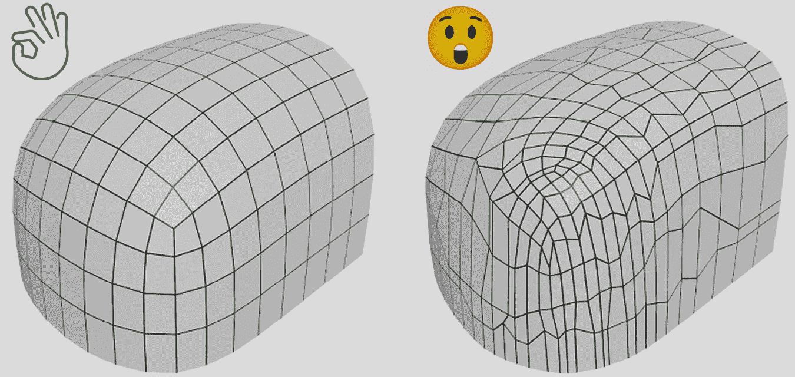

图 5.1 – 具有两种不同顶点分布的相同模型

前面的图显示了具有相同形状的模型，但拓扑结构不同。简单来说，左边的案例适合动画，而右边的案例需要一些工作来整理这些顶点，以形成一个良好的流动。然后，你必须通过均匀分布许多聚集的面来修复一些不规则性。所以，不仅右边的案例令人不快，而且在动画过程中也有害。

让我们简要地谈谈绑定的作用，以了解良好拓扑的重要性。如果你要建模一只人手，你将设计手指、指关节和手腕。模型，或者更准确地说，它的体积将是中空的。换句话说，你只会在给手形状的顶点。然而，在我们的心中，我们知道这只手应该内部有骨头。当你摆弄手指或弯曲手指的指关节和关节时，骨骼的不同部分开始移动，以便与骨骼系统相连的外部结构可以相应地移动。

为了模拟这一点，你利用一种称为绑定的实践，它涉及引入一个骨骼系统和一系列约束，这些约束管理骨骼系统的行为。我们将在本章后面讨论一个绑定示例。现在，我们仍然关注我们的模型是否为绑定做好准备。为了更好地强调拓扑和绑定之间的关系，让我们将注意力转向*图 5.2*。

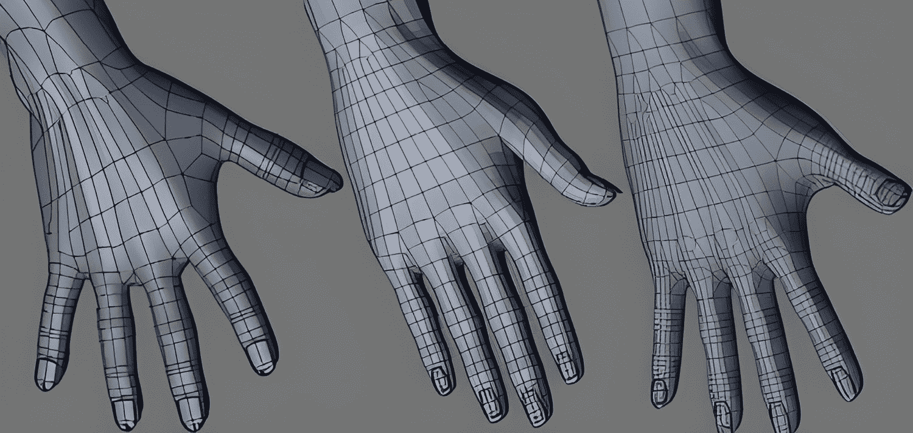

图 5.2 – 手模型的不同拓扑

观察中间案例中面的排列更加自然，这显然比左边的案例有所改进。然后，对于中间案例，看看大拇指与手的主要部分相接的地方；该区域需要更多细节，以便当拇指像右边的案例那样伸展时，会有足够的几何形状来适应骨骼的行为。比较第一只手和第三只手，看看哪一只在你看来在手指之间的肉和皮肤上看起来更自然。

当模型在特定点弯曲或拉伸时，它将创建一些皱褶和凸起区域，类似于前图中手指与手相接的地方。如果顶点，因此面，没有平滑的流动，模型在这些薄弱部位将看起来撕裂或压碎。拥有正确的拓扑结构是一个难以掌握的主题，当初学者想要进入动画和绑定时，这会让很多人感到困惑。你可以在*进一步阅读*部分找到一些链接，帮助你理解良好和不良拓扑之间的区别。

为了满足良好的拓扑结构，由于在动作发生的地方需要正确对齐边和面，我们需要一种机制来移动有问题的边和面，使它们处于正确的位置。为此，我们将发现一种新的方法，或者更确切地说，是一个快捷方式。

## 抓取

在 *第一章* *创建低多边形模型* 中，你了解到两个在 Blender 粉丝中非常常用的方法。它们是 **旋转** (*R* 作为快捷键) 和 **缩放** (*S* 作为快捷键)。还有一个我们故意在那个练习中省略的常见方法。我们依赖于修改器来移动顶点，所以我们没有使用它；然而，现在是时候使用它了。

如果你能够旋转和缩放物体，那么为什么不能移动物体呢？实际上，你可以，这个新方法将帮助你将顶点、边和面移动到任何你想要的位置。只有一个注意事项。尽管大多数人将这个操作称为 **移动**，但它的快捷键有点奇怪；它是 *G*。所以，在移动的上下文中，这个快捷键的一个更简单的思考方式可能是抓取。你抓取一个顶点并把它放在某个地方，从某种意义上说。

在大多数 Blender 教程中，你可能会发现人们将抓取和移动互换使用。它们是同一个意思。所以，在这本书中，当你看到“移动”这个词时，我们指的是抓取操作和 *G* 快捷键。

让我们通过一系列简单的步骤来练习这个新知识。在你开始一个新的文件后，执行以下步骤：

1.  按下 *Tab* 键进入**编辑模式**。

1.  仅选择默认立方体的一个顶点。

1.  按下 *G* 键并移动鼠标。

当你移动鼠标时，所选的顶点现在正在被拉动。要终止抓取，你可以点击任何地方，这将使所选顶点回到其最后的位置。*图 5.3* 是我们想要达到的示例。

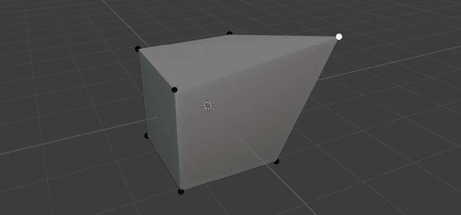

图 5.3 – 将顶点从原始位置抓取出来并移动到其他地方

你可能已经推测出顶点可以在三个轴上自由移动，这是正确的。如果你想限制移动到某个轴，并且希望精确移动顶点，你也可以做到。在**编辑模式**下，执行以下步骤：

1.  选择另一个顶点。

1.  按下 *G*，然后 *X*。

1.  输入 `0.5`。

如果你想要选择其他两个轴中的任意一个，也可以。无论如何，你为任何给定轴输入的值定义了移动量。因此，负值仍然会将所选部分移动到你所选择的轴上，只是方向相反。

此外，有时你可能只想将选择移动到除某个方向以外的任何方向。当你开始一个抓取快捷键时，如果你在选取轴之前按下 *Shift* 键，它将选择移动到剩下的两个轴。所以，*Shift+X* 将将物体移动到除了 X 轴以外的任何地方。

如果你愿意，可以通过选择边缘或面来进一步练习抓取操作。很快，我们将探索动画的构建块。在这个过程中，你很可能会使用抓取操作。所以，当你准备好了，让我们看看我们如何使事物动起来。

# 创建动画

正如我们在“在哪里构建动画”部分中提到的，我们在 Blender 中将要做的动画类型涉及系统各个部分独立移动或有时协同移动。我们也说过，我们需要一种称为绑定的方法，所以让我们举一个例子来理解为什么绑定是有用的。

当你说话时，无论你是坐着还是走路，负责说话的肌肉和骨骼通常不会受到或影响你身体的其他部分。然而，当你走路时，你的腿围绕着髋骨旋转，整个系统触发其他自然动作，例如摆动手臂，轻微前后移动肩膀，等等。

在这两种情况下，无论是局部还是系统级的依赖，我们最终都会移动构成模型的一些顶点。由于移动这么多顶点是一项大量工作，我们使用放置在模型内部的结构来告诉必要的顶点移动到何处。创建这种结构的流程称为绑定。从某种意义上说，绑定模仿了现实生活中骨骼和肌肉的作用。

在本节中，我们将进行一个简单的绑定过程，并绑定一个低多边形蛇。通过这个过程，你将为动画准备模型，但首先，我们将了解一些基本组件，如下所示：

+   **骨架**（Armature）：简单来说，骨架是一组骨骼，但更好的定义可能是一个作为控制结构的框架——材料对应纹理，骨架对应骨骼。因此，同一个骨架可以有多个骨骼。此外，如果动画的系统需要的话，绑定过程可能涉及多个骨架。

+   **骨骼**（Bone）：这是绑定系统中最基本的部分。没有骨骼，就没有骨架，因此就没有可以动画化的东西。在现实生活中，当你的骨骼超出其自由区域时，你会感到疼痛，所以你的身体保持完整。可以说，有类似的方法来限制骨骼的自由，以便与其他骨骼协同工作。

我们首先将看看如何绑定一个模型。为此，我们将使用一个骨架和许多骨骼。在将约束添加到一些骨骼之后，绑定过程将完成。因此，最终，我们将使用我们的绑定来动画化蛇。

## **绑定点**（Rigging）

现在理论部分已经讲完，我们可以专注于实际方面，主要是如何设置骨架和骨骼。为了专注于绑定过程，我们将使用一个低多边形蛇模型。`Chapter 5`的`Start`文件夹中的`Snake.blend`文件是一个很好的起点，到本节*绑定*的结尾，你将看到`Snake.Rigged.blend`文件中的内容。

除了这两个文件，我们还会提到其他一些补充文件，这些文件展示了中间阶段。和以往一样，你可以在*技术要求*部分提到的网址找到所有这些文件。

打开`Snake.blend`文件后，让我们按照以下步骤添加一个骨架：

1.  在你的数字键盘上按*3*以切换到**右正交**视图。

1.  按*Shift+A*。

1.  选择**骨架**。

你也可以在`Snake.First Bone.blend`文件中找到前面操作的结果。如果你的键盘没有数字键盘，那么你可以点击**3D 视图**右上角的工具栏中的**X**轴，直到你在左上角看到**右正交**。以下图应该能帮助你看到我们到目前为止所做的工作：

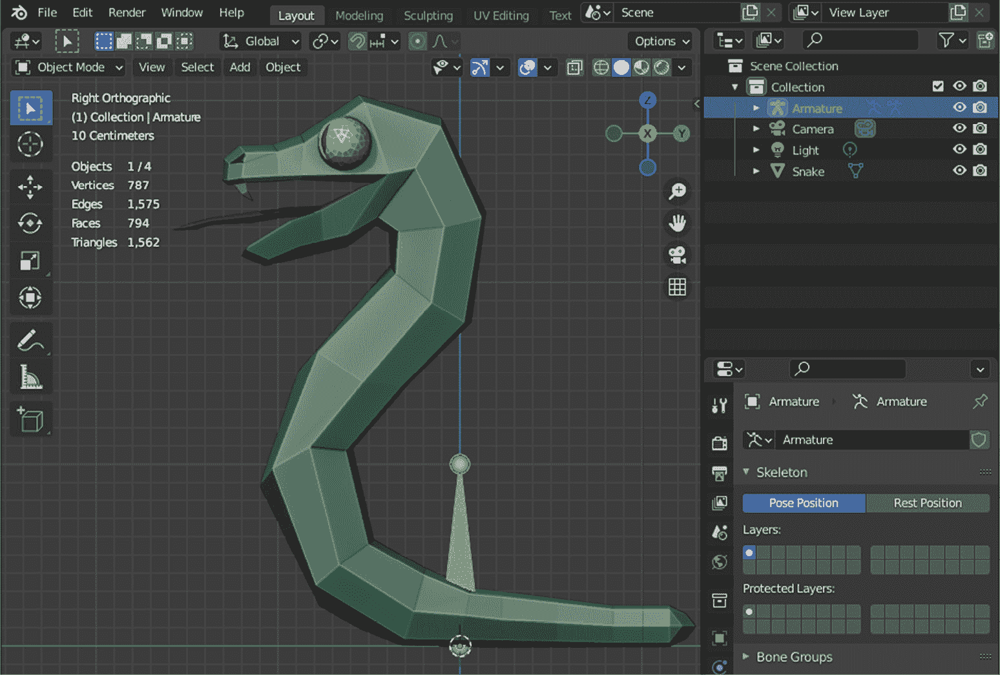

图 5.4 – 警惕蛇！再想想，它似乎身体里没有恶意的骨骼

我们现在场景中有一个新的对象类型：一个骨架。你也可以在**大纲**中看到它，其标题旁边有两个绿色的棍状人物。目前，我们的骨架中有一个骨骼。所以，在这个阶段，骨骼和骨架几乎意味着同一件事。我们的目标，在绑定中，将是创建和分配蛇网格内部的一组骨骼。所以，让我们添加更多。

虽然我们似乎遇到了问题。我们之前添加的那个骨骼看起来被蛇的尾巴遮挡了。所以，如果我们继续添加更多的骨骼并将它们排列得与蛇的身体对齐，我们就无法看到我们在做什么。幸运的是，解决方案只需几步即可。当骨架仍然被选中时，你可以在**属性**面板中的**骨架**设置中展开**视图显示**，并打开**前景**选项。这将确保骨架始终可见。

没有数字键盘

数字键盘快捷键很有帮助，它们会让你的生活变得更轻松，尤其是在建模和绑定时，你需要经常从特定角度查看你的工作。以下网站提供了八种模拟数字键盘的方法：[`essentialpicks.com/using-blender-with-no-numpad/`](https://essentialpicks.com/using-blender-with-no-numpad/)。

网格由顶点、面和边组成。同样，骨骼由三个部分组成：**根**、**身体**和**尖端**。尖端可以是另一个骨骼的根，反之亦然。就像我们可以进入**编辑模式**来改变网格的内部部分一样，我们也可以对骨架这样做。所以，选择骨架并按*Tab*。

你应该能够分别点击并选择根和尖部。当你选择关节之间的结构时，由于它们全部相连，它将自动选择根和尖部。*图 5.5* 仅显示了选中的尖部。

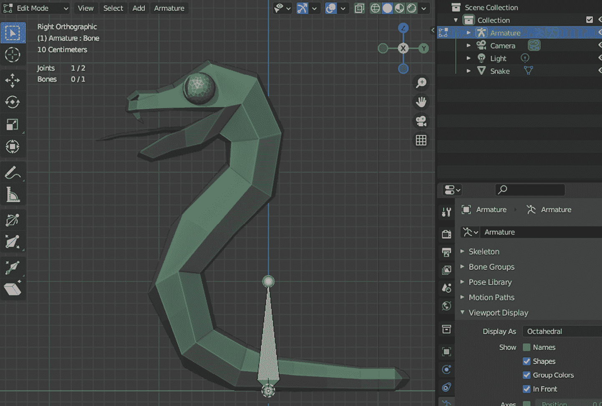

图 5.5 – 在编辑模式下选择了骨骼的尖部

知识的归属

在本节中，我们正在为蛇模型进行绑定，这是一个由艺术家 Quaternius 创作的资产。你可以在[`quaternius.com`](https://quaternius.com)上关注他的作品。我们将在后面的章节中也使用他的其他资产。所以，感谢你的慷慨。

现在，我们准备向骨架添加更多骨骼。我们将首先定位初始骨骼，然后添加从尖部延伸出来的新骨骼。在仍然处于 **编辑模式** 的情况下，执行以下步骤：

1.  选择根关节。

1.  按下 *G* 键并移动鼠标，使关节位于蛇胸部的中间位置。

1.  点击完成抓取。

1.  选择尖关节。

1.  按下 *G* 键并移动鼠标，使关节位于 Y 轴附近但位于尾巴内部。

1.  再次点击完成抓取。

一张图可能非常有帮助，因为所有这些移动和定位听起来有点任意。*图 5.6* 是我们在最后几个步骤中取得的成果的示例。

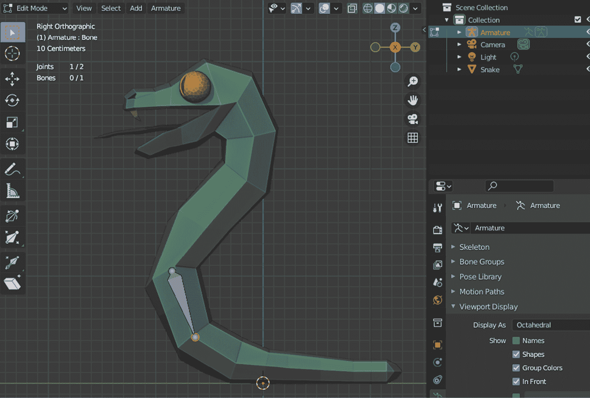

图 5.6 – 为我们的蛇放置的合适骨骼

由于向上、向下或向右的概念在三维空间中失去了意义，因此有一个简单而有效的方式来表示骨骼的自然流动是很重要的。如果你比较 *图 5.5* 和 *图 5.6*，它们分别对应于 `Snake.First Bone.Editing.blend` 和 `Snake.First Bone.Position.blend` 文件，你会注意到关节之间的结构正在朝不同的方向延伸。骨骼较宽的部分靠近根部，而骨骼较窄的末端正接近其尖部。例如，想象你的髌骨作为一根骨骼的根部，而你的脚踝作为这根骨骼的尖部。此外，髋骨到髌骨，肘部到腕部，等等。

我们必须向我们的系统中添加几根更多的骨骼。我们将通过拉伸原始骨骼来完成这项工作。在仍然选择骨骼尖部的情况下，执行以下步骤：

1.  按 *E* 键开始拉伸。

1.  将鼠标向右和向下移动，使其跟随尾巴的形状。

1.  点击完成拉伸。

1.  重复 *步骤 1 到 3*，直到你拥有四根长度大致相同的骨骼。

结果在 *图 5.7* 中显示，你也可以打开 `Snake.Tail Bones.blend` 文件来比较你的结果。

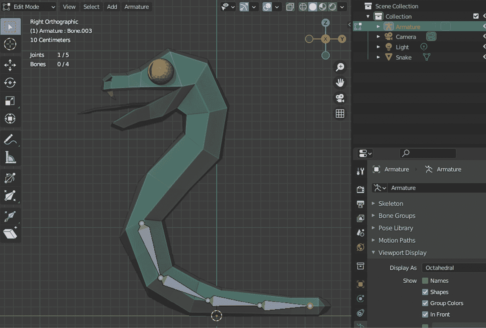

图 5.7 – 组成尾巴的四根骨骼

点击的重要性

类似于完成抓取操作，挤出需要点击一下以固化挤出物体的位置。因此，在本章的剩余部分，当你看到单词 *挤出* 时，你被期望在满意物体的位置时点击并最终完成挤出。如果你提前终止挤出，你可以始终按 *G* 键并抓取这个新物体将其移动到其他地方，如果你愿意的话，继续挤出。因此，点击以最终完成抓取和挤出，并在需要时经常使用这两种方便的方法。此外，如果你在挤出过程中改变主意，右键单击将取消此操作。

挤出帮助我们一次完成几件事情。我们创建了一个新的骨骼，将其正确放置，使其根与前一骨骼的尖端对齐，将这个新骨骼设置为前一骨骼的父级，并最终将其尖端移动到我们开始下一骨骼的位置。

我们已经完成了一半的蛇骨骼添加工作。因此，现在进行一些整理工作是个好时机。我们将在稍后引用这些骨骼，因此我们现在重命名它们是明智的。如果你在挤出后注意到了新骨骼的名称，你必须已经看到它们被标记为类似于 **Bone.00X** 的格式，其中 X 是后续骨骼的编号。要重命名你迄今为止添加的所有骨骼，请执行以下步骤：

1.  选择原始骨骼。

1.  按 *F2* 并将其重命名为 `Tail.1`。

1.  重复前两个步骤，直到所有骨骼的名称看起来像 **Tail.X**。

让我们继续添加躯干的骨骼。为此，我们将利用现在已重命名为 **Tail.1** 的原始骨骼。你在设置模型骨架时所做的某些决定将取决于你打算为骨架做什么。从头部开始并一直延伸到尾巴末端的操作是完全可能的。然而，我们知道这条蛇将有一个倾向点，主要是躯干和尾巴骨骼相交的地方。因此，你需要执行以下步骤：

1.  选择 **Tail.1** 的根。

1.  按 *E* 键以在右侧和顶部方向挤出一个新的骨骼，沿着躯干进行。

1.  再重复 *步骤 2* 两次，以便最终有三个骨骼。

1.  选择每根新骨骼并将它们重命名为 **Torso.X**，其中 X 是从 1 开始的连续数字。

结果就是你在 *图 5.8* 和 `Snake.Torso Bones.blend` 文件中看到的结果。

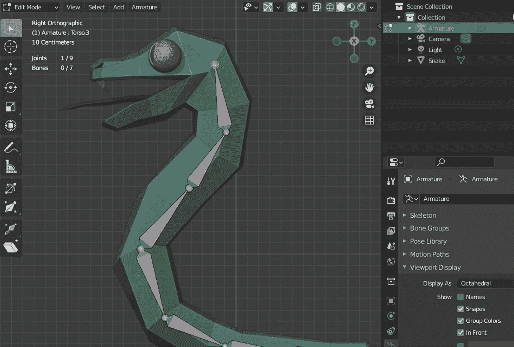

图 5.8 – 新骨骼已经按照躯干顺序添加到头部

我们现在可以规划剩余的骨骼。为了简洁起见，我们只关注两根骨骼：头部和嘴巴骨骼。如果你一直跟着做，**Torso.3** 的尖端应该仍然被选中。如果没有，请选中它，然后执行以下步骤：

1.  按 *E* 键以在蛇鼻的末端挤出一个新的骨骼。

1.  再次选择**Torso.3**的尖端。

1.  按*E*键拉伸一个新的骨骼到蛇嘴的末端。

最后，完全构建的骨骼，您可以在`Snake.Full Skeleton.blend`文件中找到，看起来就像你在*图 5.9*中看到的那样。

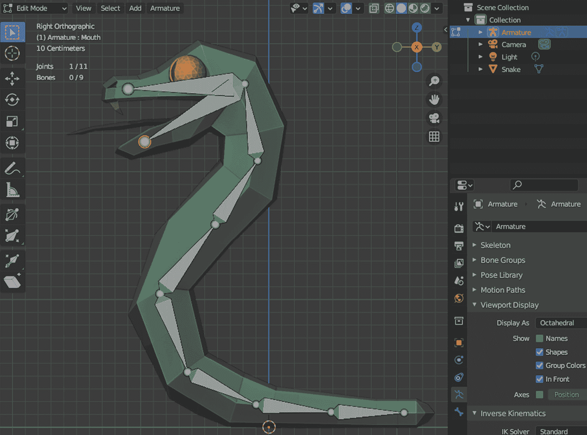

图 5.9 – 我们蛇的骨骼已完成

我们已经完成了骨骼的构建。为了完成绑定，我们需要添加两个额外的骨骼，这些骨骼通常被称为控制骨骼。以下是对为什么一个简单的骨骼，尽管是必要的，但仍被认为不够理想的解释。这与以下两个相互冲突的概念有关：

+   **正向运动学（FK**）：当你有一系列骨骼，并且你想移动末端骨骼时，例如，人的手上的大拇指，运动必须在考虑从肩关节开始的所有中间骨骼的位置和方向值的同时进行计算。因此，运动从根部开始，向前进行。

+   **逆运动学（IK**）: 这是一个更有效的方法，在先前的例子中，通过移动大拇指，所有连接的骨骼将依次确定它们的状态，而不是计算整个系统的行为。因此，移动的骨骼决定了后面的骨骼应该如何表现，后面的骨骼也以同样的方式一直到达根部。

在我们的练习中，我们更喜欢逆运动学（IK），因为它使用起来更加方便，并且在行业中得到了广泛接受。如果您想获取更深入的信息，特别是关于正向运动学（FK）和逆运动学（IK）的数学方面，请参考以下两页：

+   [`www.sciencedirect.com/topics/engineering/forward-kinematics`](https://www.sciencedirect.com/topics/engineering/forward-kinematics)

+   [`www.sciencedirect.com/topics/engineering/inverse-kinematics`](https://www.sciencedirect.com/topics/engineering/inverse-kinematics)

要将逆运动学（IK）引入我们的一些骨骼，我们需要创建控制骨骼，这些骨骼将运动传递到其他骨骼。虽然这些控制骨骼在视觉上看起来像是骨骼的一部分，但它们将与骨骼解耦。目前，所有已经拉伸的骨骼都已经自动设置为父级。因此，当我们从末端骨骼拉伸它们时，我们需要将我们的两个控制骨骼从父级中移除。

看起来这些骨骼中有一个可能是从**头部**骨骼上来的，而另一个控制骨骼，由于对称性，可能是从**Tail.4**骨骼上来的。假设您仍然处于**右正交**视图，为了创建这些骨骼，您需要执行以下步骤：

1.  从**头部**骨骼的尖端向左拉伸一个骨骼。

1.  将这个新骨骼重命名为`Head.IK`。

1.  从**Tail.4**骨骼的尖端向右拉伸一个骨骼。

1.  将这个新骨骼重命名为`Tail.IK`。

我们已经创建了两个新的骨骼，但它们仍然附着在骨架上。因此，我们需要将它们分开。*ALT+P*是一个可以用来清除父级关系的快捷键，但我们将要在别处进行解耦，因为我们还需要关闭另一个设置。所以，让我们同时进行这两步，如下所示：

1.  选择**Head.IK**骨骼。

1.  在**属性**面板中打开**骨骼属性**选项卡（绿色骨骼图标）。

1.  在该选项卡中展开**关系**部分。

1.  通过在名称字段中点击**X**来清除父级。

1.  关闭**变形**选项。

1.  对**Tail.IK**骨骼重复*步骤 3 到 5*。

`Snake.Full Skeleton.IK.blend`文件包含了您迄今为止所做的一切进展，但让我们解释一下最后几个步骤我们所做的工作。我们曾经看到**骨架**属性，所以我们要求**属性**面板显示另一个视图来显示骨骼属性。我们断开了我们的控制骨骼与其父级之间的连接。由于没有父级，**连接**复选框自动关闭。最后，我们关闭了一个至关重要的设置：**变形**。

如果您还记得拓扑结构是什么以及为什么我们使用绑定系统来动画弯曲和拉伸的系统，那么您就会知道变形是关键。我们希望蛇的骨架变形其所在的网格。然而，我们不会希望控制骨骼也这样做，因为我们将使用这些骨骼来指导整体运动。因此，它们不应该变形任何东西。

话虽如此，它们将负责 IK，这是绑定中最后缺失的一块拼图。为了完成绑定，我们需要添加**IK**成分，我们将在**姿态模式**中这样做。

在*第一章*《创建低多边形模型》中，我们在**对象模式**和**编辑模式**之间来回切换。在本章中，我们一直处于**编辑模式**，以移动骨骼的各个部分并挤出新的部分。骨骼可以处于另一种模式，**姿态模式**，通过引入约束来定义骨骼之间的关系。将这种新模式视为编辑骨架的行为，从而确定模型的*姿态*。

假设您已经在**编辑模式**中，按*CTRL+Tab*然后按*2*来切换。或者，如果您在**对象模式**中，则*CTRL+Tab*将直接带您进入**姿态模式**。请记住，如果您已经选择了骨骼或骨架，则此方法有效。或者，左上角的下拉菜单可以帮助您进入正确的模式。我们现在可以按照以下方式添加**IK**约束：

1.  选择**Tail.4**骨骼。

1.  在**属性**面板中打开**骨骼约束属性**选项卡（带绑带的蓝色骨骼图标）。

1.  在**添加骨骼约束**下拉菜单中选择**逆运动学**选项。

1.  对**头部**骨骼重复*步骤 3*。

我们已经为两根骨骼添加了缺失的**IK**组件。也许你注意到了，约束不是添加到控制骨骼上，而是添加到它们之前的骨骼上。现在，我们将映射一些**IK**约束的值，以便使用控制骨骼。要做到这一点，当**头部**骨骼被选中时，执行以下步骤：

1.  在**目标**字段的**IK**约束中点击正方形图标。

1.  在选项中选择**骨架**。

1.  在**骨骼**字段的**骨骼**图标上点击。

1.  在选项中选择**Head.IK**。

这将指定**Head.IK**作为**头部**骨骼的控制骨骼。所以，从现在开始，无论何时你与**Head.IK**交互，它都将控制连接到其他骨骼的**头部**骨骼。这就是为什么你看到一条从**Torso.1**和**Tail.1**骨骼之间的关节到尖端的虚线黄色线。 

让我们按照前面的方法将**Tail.4**和**Tail.IK**关联起来，这样与**Tail.IK**的交互就可以控制尾巴骨骼的行为。选择**Tail.4**然后执行以下步骤：

1.  在**目标**字段的正方形图标上点击后，在选项中选择**骨架**。

1.  在**骨骼**字段点击骨骼图标后，在选项中选择**Tail.IK**。

1.  将**链长度**值更改为**3**。

前面的指令集中的前两步几乎完全相同，只是我们选择了适当的骨骼。最后一步引入了一个新概念，告诉控制骨骼根骨骼在骨骼链中的位置。虚线相应地移动。最终结果就是你在*图 5.10*中看到的结果。

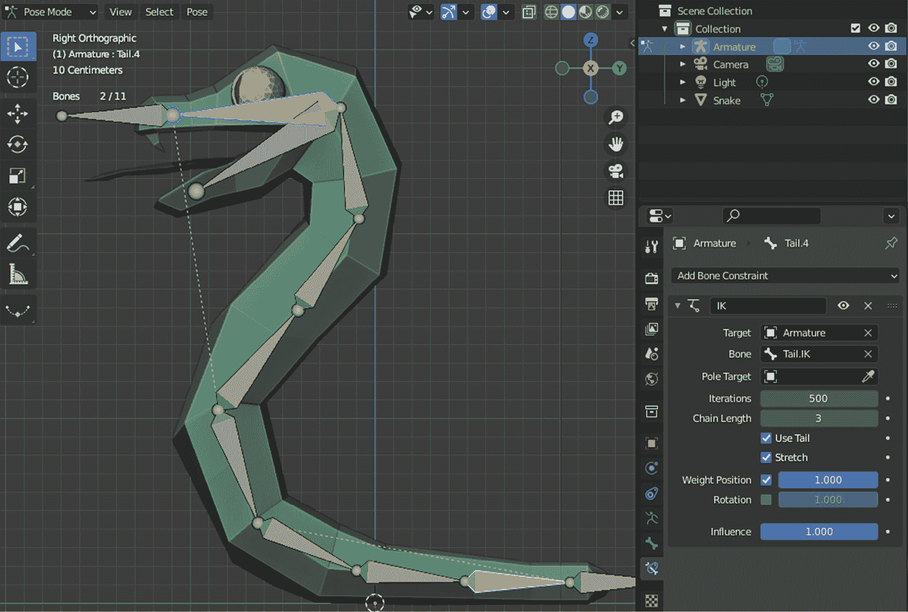

图 5.10 – 一个完全装备的蛇

我们一直做这些工作，以便骨架成为蛇的一部分。然而，如果你查看**大纲**，你仍然可以看到这两个对象是分开的。现在是真正将骨架连接到蛇的网格上的时间：

1.  切换到**对象模式**。

1.  首先选择**蛇**网格，然后按住*Shift*键选择**骨架**。

1.  按*CTRL+P*调出**设置父对象**菜单。

1.  选择**带自动权重**。

当你将骨架设置为网格的父对象时，会发生两件事。首先，**Outliner**中的**Snake**将移动到**骨架**项下的子项。其次，**Snake**将分配一个**骨架**修改器，这将在这两个对象之间建立连接。

最后，骨架将指定其骨骼到附近的顶点，这样当骨骼移动时，它就会带动相关的顶点。就好像一些靠近特定骨骼的顶点在优先级方面“重量”更重。因此，你不会看到尾巴骨骼将远离顶点那么远。

呼，装置终于完成了。正如你可能已经注意到的，所有这些创建和分离骨骼、添加约束、调整设置等等有时可能变得有些棘手。你会有视觉线索来了解哪个骨骼在做什么以及它们是如何连接的，但场景可能会很快因为小工具而变得杂乱。然而，就像任何其他事情一样，通过练习你会习惯于这样做。关于这一点，你将在**进一步阅读**部分找到更多高级装置材料的链接。

我们在**开始**和**结束**文件夹中提供了`Snake.Rigged.blend`文件，供你比较结果。你也可以将此文件作为下一节中的起点。由于我们认为装置对于动画是必要的，并且我们的装置已经完成，我们现在可以转向一个新的部分，在那里我们将了解 Blender 的**动画**工作区。

## 动画制作

我们即将为我们的蛇进行动画制作。我们已经准备了一个骨架并引入了两个控制骨骼来构建一个装置。在本节中，我们将使用这个设置来创建攻击动画。使用本节中介绍的方法，你可以为你的模型创建不同的动画，并将这些动画与模型存储在同一文件中。

让我们切换到**动画**工作区，以利用一组更合适的界面。布局将主要变为两个并排的**3D 视图**面板，以及下面看起来像时间轴的东西。实际上，底部有两个面板，如下所示：

+   **曲线图**：我们将很快使用关键帧来标记模型随时间移动时的定义点。例如，一只青蛙可以有一个关键帧表示它的休息位置，然后在时间稍后定义另一个关键帧，表示它跳得最高的水平。

+   **时间轴**：这是**曲线图**的一个简化版本。它用一个时钟图标表示，并允许你从更高层次看到事物。我们不会过多地使用这个界面，但设置动画的**开始**和**结束**关键帧很有用。

除了这两个编辑器之外，还有一个**图形编辑器**，你可以通过点击任何面板左上角的下拉菜单中的图标来访问。实际上，让我们通过将左边的**3D 视图**转换为**图形编辑器**来做这件事。当你完成时，你应该会看到以下类似的内容：

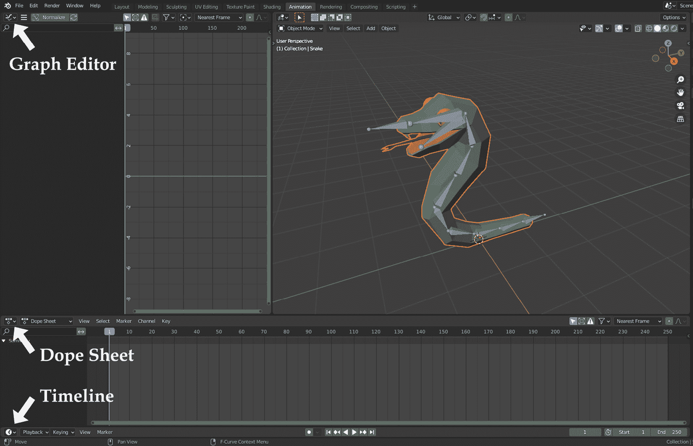

图 5.11 – 我们已经进一步自定义了动画工作区

我们已经拥有了动画蛇所需的一切。我们将从攻击动画开始。为此，我们将把头部向前移动，并将尾巴抬起以描绘一个威胁性的姿态。首先，通过按数字键盘上的 *3* 键切换到**右正交**3D 视角，并执行以下步骤：

1.  进入**姿态模式**。

1.  选择**头部.IK**骨骼。

1.  按 *I* 键插入关键帧，并在选项中选择**位置**。

此操作将在**dope sheet**的第一帧中添加一个关键帧，并在**dope sheet**和**图形编辑器**中填充一些元素。到目前为止，一切顺利。看看动画编辑器中添加了什么，并在两个编辑器中展开**Head.IK**标题，以了解底层发生了什么。我们正在标记**Head.IK**骨骼的位置。

对于蛇攻击动画的下一个事件，我们需要将蛇头向前移动并标记（标记）其新位置。为此，我们需要在时间轴中选择一个新的帧，如下所示：

1.  将帧值从**1**更改为**10**（在**时间轴**的**开始**部分稍左）。

1.  按*G*并将头部稍微向左和向上移动。

1.  按*I*插入关键帧并再次选择**位置**。

这应该在**图形编辑器**中添加更多元素——更具体地说，是曲线——这是好的，因为您可以使用这些曲线来微调动作的开始和结束方式——更突然或更平滑，这可以用于更戏剧性的效果。我们将其留给您的艺术诠释。目前我们能做的就是完成头部的运动，使其回到原始位置，如下所示：

1.  将帧值从**10**更改为**25**。

1.  按*Alt+G*将其位置重置为原始值。

1.  按*I*插入关键帧并再次选择**位置**。

*图 5.12*显示了我们的进展情况。

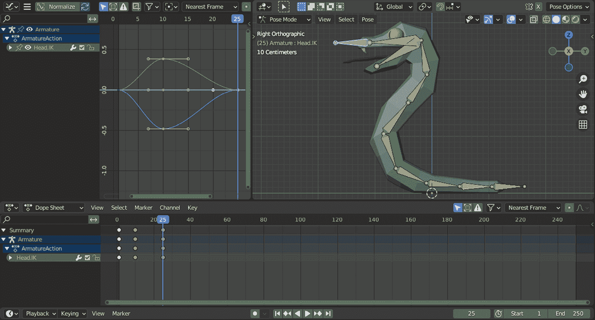

图 5.12 – 我们通过控制骨骼对头部骨骼进行了动画处理

最后，我们通过动画**Head.IK**骨骼来移动躯干骨骼。这就是为什么我们实施了控制骨骼而不是移动单个躯干骨骼。此外，我们没有对**Mouth**骨骼做任何特殊处理，但这也随着头部移动以保持同步。

让我们对尾巴做类似的事情，如下所示：

1.  将帧设置为**1**。

1.  选择**Tail.IK**骨骼。

1.  按*I*插入关键帧并选择**位置**。

1.  将帧设置为**10**。

1.  按*G*并将尾部稍微向上和向左移动。

1.  按*I*插入关键帧并再次选择**位置**。

1.  将帧设置为**25**。

1.  按*Alt+G*重置位置。

1.  按*I*插入关键帧并再次选择**位置**。

在这个姿势下，尾巴自然看起来很生气，这突出了头部的运动。顺便问一下，你的头在哪里？如果你在** dope sheet**中看，头部动画的关键帧已经消失了。Blender 只显示所选对象的关键帧，以保持界面简洁。您可以通过切换**仅显示所选**按钮来显示所有内容，该按钮看起来像**dope sheet**标题中的选择图标。**图形编辑器**中也有类似的按钮；如果您禁用两个，您应该看到类似于*图 5.13*中的内容。

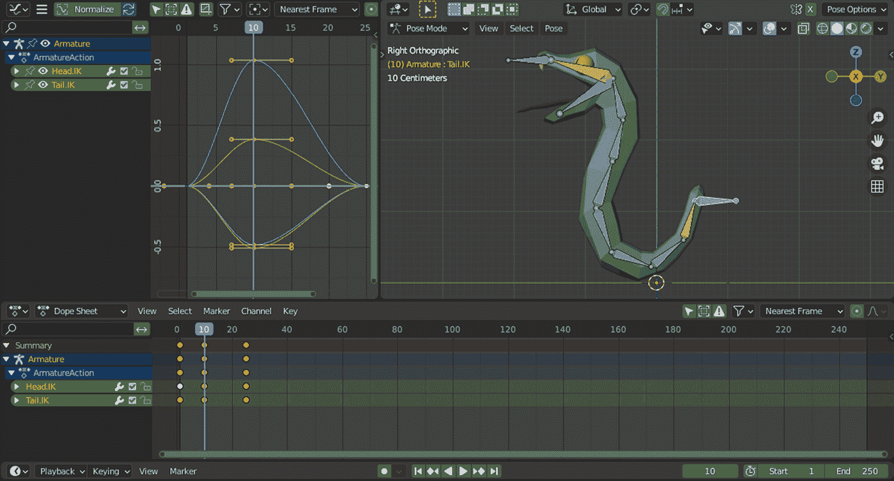

图 5.13 – 编辑器中可见头和尾的关键帧

你也可以参考`Finish`文件夹中的`Snake.Animated.blend`文件。

我们已经完成了第一个动画。如果你想创建另一个动画，你会在哪里做？看起来我们可以在时间轴上继续添加更多关键帧。然而，我们如何知道哪些关键帧负责特定的动画？

我们可以在 Blender 和 Godot 的上下文中回答这个问题。实际上，一旦我们了解了如何在 Blender 中为同一模型创建独立的动画，我们实际上就已经为动画发送到 Godot 做好了准备。为了做到这一点，我们将在下一节中探索**动作编辑器**。

# 为 Godot 准备动画

为不同的动画创建单独的 Blender 文件会非常难以管理。如果我们有一种方法可以在同一个文件中存储多个动画，那就太好了。幸运的是，确实有。我们需要使用一个新的界面，称为**动作编辑器**来做到这一点。让我们看看我们如何使用它为蛇创建另一个动作。

**Dope Sheet**面板的左上角有一个下拉菜单。尽管整个面板都可以被认为是**Dope Sheet**面板，但我们一直使用其默认视图。这与**3D 视口**的工作方式类似。当我们切换**对象模式**和**编辑模式**时，我们仍然在同一个**3D 视口**面板中工作，但处于其专业视图之一。换句话说，这些下拉菜单自定义了你所在的面板。要将**Dope Sheet**面板切换到其**动作编辑器**视图，请执行以下步骤：

1.  展开显示**Dope Sheet**的下拉菜单。

1.  在选项中选择**动作编辑器**。

这将揭示我们第一个动画的标题，“攻击”。现在，你已经将默认名称更改为一个你可以轻松跟踪的名称。此外，当我们将此模型导入 Godot 并想要触发正确的动画序列时，我们将使用此动作名称。让我们按照以下步骤创建更多动作：

1.  点击动作标题旁边的第二个图标（堆叠纸张的图标）。

1.  将这个新动作的标题更改为`Idle`。

这实际上会创建第一个动画的副本。除了标题之外，一切都是相同的，但现在我们可以更改与标题匹配的动画功能。在大多数游戏中，角色的空闲状态通常看起来很平静，但他们会有轻微的上下摆动动作，这表明角色是活着的，但其他方面处于中性状态。我们的空闲动作包括以下步骤：

1.  将帧设置为**10**。

1.  选择**Head.IK**骨骼，并通过按*Alt+G*重置其位置。

1.  按*G*并将骨骼略微向下移动。

1.  按*I*并选择**位置**。

1.  重复*步骤 2 到 5*，但将**Tail.IK**骨骼稍微向上移动。

让我们再做一些事情并测试我们的新动作。将**时间轴**中的**结束**值改为**25**，然后点击播放按钮。这将让您以循环的方式查看动作，以便您能够判断动画中的位置是否足够好。如果您想调整头部和尾部控制骨骼的位置，请记住通过按*I*来设置它们的值。

我们的蛇正在闲置，上下摆动，可能是在等待攻击目标。通过使用动作标题左侧的下拉菜单，您可以在不同的动作之间切换。

恭喜！您已经正式创建了两个动画。如果有时难以遵循说明，您可以在`Snake.blend`文件中的`Finish`文件夹中找到一个完整的示例，以供进一步学习。

我们在本章中做了很多工作。现在是时候总结我们的努力了。

# 摘要

本章一开始就讨论了哪种软件（Blender 与 Godot）适合动画。我们举例说明了不同的动画案例，并确定 Blender 是动画具有独立运动部件的系统的正确选择。

我们接着讨论了良好几何形状的重要性，也称为拓扑，因为从动画的角度来看，并不是所有看起来好的东西都足够好。一旦系统开始运动，顶点、面和边将像骨架的包装一样行动。如果您知道您将要对模型进行动画处理，您可能需要提前更加小心地创建几何形状。

尽管如此，如果这样的早期选项并不总是可行，为了防止模型某些区域可能出现的撕裂和折痕，我们引入了抓取选项。它可以帮助您通过将它们移动到不同的位置来解决有问题的部分。

一旦顶点的分布处于有利的位置，就可以开始骨架设置。实际上，这是大多数学习任何 3D 建模软件的艺术家面临的最先进的话题之一。有时将骨架想象成控制木偶的一堆绳子是有帮助的。就像一个木偶师一样，你需要知道哪根绳子控制哪个部分。为此，我们引入了 IK，它比更直接的 FK（正向运动学）方法具有优势。

在我们为蛇创建了一个骨架之后，我们发现了动画工作区。由于骨架依赖于通过 IK（逆向运动学）的控制骨骼，我们的动画制作变得轻松自如。在这个过程中，我们学习了如何移动骨架的各个部分并关键帧它们的属性。在我们的简单案例中，这仅限于位置，并且我们保持运动在一个轴上。

最后，我们了解了如何为同一模型存储两个动画，而不是动作。一旦您正确标记了动作，不仅您在将来在 Blender 中找到它们会更容易，而且您在 Godot 章节中也会看到这种做法的好处。

你已经完成了五个章节，从创建模型到为模型添加动画。在这个过程中，你还学习了如何构建和应用材质和纹理。在接下来的章节中，我们将探讨如何从 Blender 导出我们的作品。

# 进一步阅读

我们提到了拓扑的重要性，了解什么构成好的或坏的拓扑可能具有挑战性。因此，为了查看更多示例并从他人的专业知识中受益，请参考以下链接：

+   [`blender.stackexchange.com/questions/140963/do-i-have-bad-topology`](https://blender.stackexchange.com/questions/140963/do-i-have-bad-topology)

+   [`www.reddit.com/r/blenderhelp/comments/speyjs/is_this_bad_topology/`](https://www.reddit.com/r/blenderhelp/comments/speyjs/is_this_bad_topology/)

+   [`www.pluralsight.com/blog/film-games/ngons-triangles-bad`](https://www.pluralsight.com/blog/film-games/ngons-triangles-bad)

一些 3D 实践者只专注于动画。虽然可以在不绑定 Blender 对象的情况下对某些 Blender 对象进行动画处理，例如移动摄像机和灯光以在场景中移动它们，但大多数在线课程通常一起涵盖绑定和动画主题。以下是一份在线课程和材料的列表，供你进一步了解这两个领域：

+   CG Cookie: [`cgcookie.com/courses?sort_category=140,179`](https://cgcookie.com/courses?sort_category=140,179)

+   Udemy:

    +   [`www.udemy.com/course/rigging-fundamentals-blender/`](https://www.udemy.com/course/rigging-fundamentals-blender/)

    +   [`www.udemy.com/course/rigging-and-animating-low-poly-fps-arms-in-blender/`](https://www.udemy.com/course/rigging-and-animating-low-poly-fps-arms-in-blender/)

    +   [`www.udemy.com/course/learn-3d-modelling-rigging/`](https://www.udemy.com/course/learn-3d-modelling-rigging/)

    +   [`www.udemy.com/course/blendercharacters/`](https://www.udemy.com/course/blendercharacters/)

此外，当你浏览更多培训内容时，你可能会遇到一个名为 **权重绘制** 的主题，这有助于确定绑定如何优先处理附近的顶点。我们为了简洁起见省略了它，但如果你想要更全面地了解，这是一个你很可能想要涵盖的主题。

在接下来的章节中，我们将逐步从 Blender 过渡到 Godot。因此，这一章实际上是 Blender 的最后一章实践操作。如果你想了解更多关于 Blender 能做什么的信息，有一些非常有用的资源，包括书面和视频格式，由 Packt Publishing 提供，如下所示：

+   *《Blender 3D 案例教程》* by Oscar Baechler 和 Xury Greer

+   *《Blender 3D 建模与动画：在 Blender 中构建 20+ 个 3D 项目》* by Raja Biswas

+   *《实现真实感：PBR/Blender 2.8 工作流程》* by Daniel Krafft

# 第二部分：资产管理

在这个过渡部分，你将学习如何从 Blender 迁移到 Godot。这个工作流程的一个关键部分是了解哪些设置是重要的。通过了解潜在的问题和如何应用解决方案，你可以为必须使用第三方资产的情况做好准备。

在本部分，我们将涵盖以下章节：

+   *第六章**，导出 Blender 资产*

+   *第七章**，将 Blender 资产导入 Godot*

+   *第八章**，添加声音资产*
