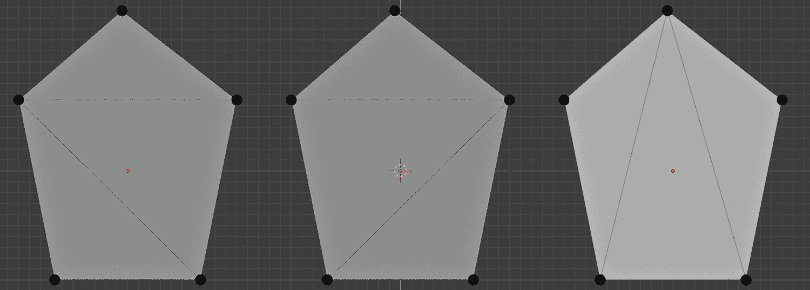
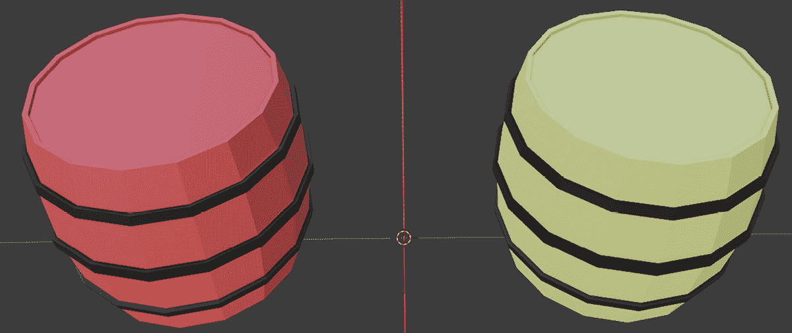
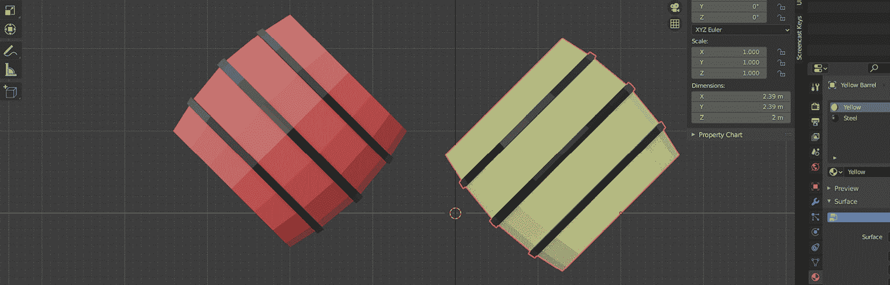
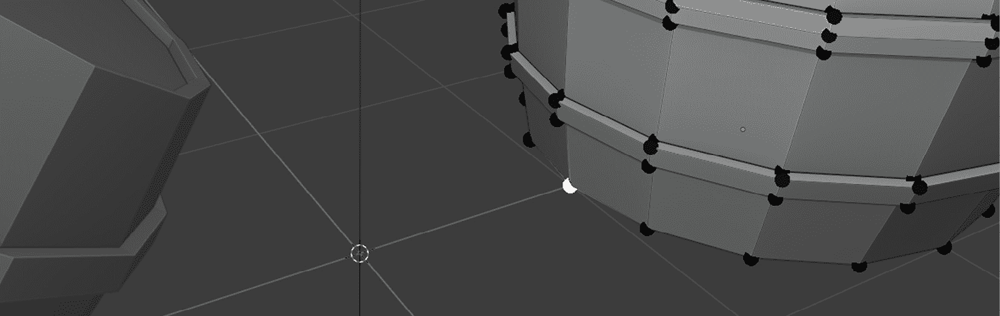
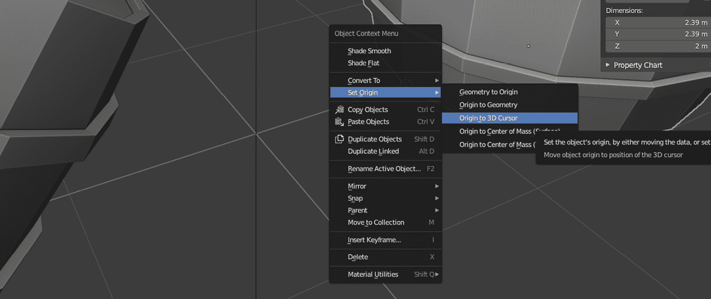
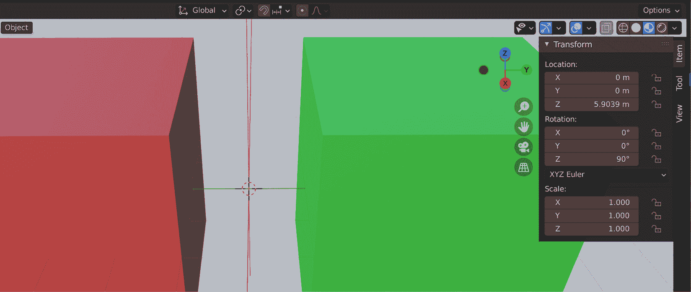
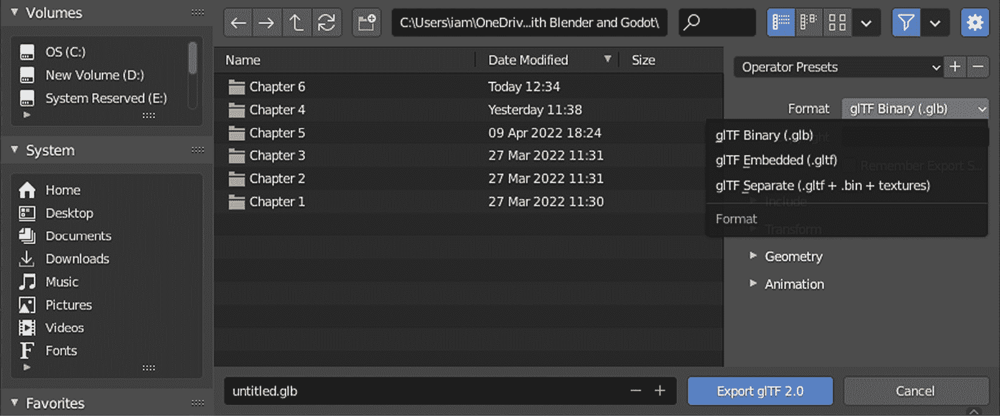

# 导出 Blender 资产

你的 Blender 之旅已经带你到了这个阶段，你想要将 Blender 中的创作部署到 Godot 引擎中。我们将在下一章中介绍如何将这些资产导入 Godot，但首先，我们必须确保我们在 Blender 中的所有内容都符合 Godot 的标准。因此，在导出之前，我们必须解决一些小问题。

首先，我们要确保我们模型的几何形状是正确的。我们已经讨论了多边形；我们将更深入地了解它们，以实现具有更好几何形状的模型。原点在 Blender 和 Godot 中都是一个重要的概念。我们将讨论为什么它们很重要，并学习如何更改原点。

到目前为止，我们还没有讨论过我们模型的维度。然而，比你的模型维度更重要的是，我们将研究一个称为**尺度**或**尺度因子**的概念，这在将你的资产发送到 Godot 引擎以及其他游戏引擎时至关重要。准备你的模型的最后部分是一个组织实践：给你的资产命名。

在我们完成准备工作后，我们需要将我们的资产转换为 Godot 能理解的格式。为此，我们将探索**glTF**并比较这种格式与其他几种格式。一旦 Godot 导入这种文件类型，它将理解如何理解存储在 Blender 文件中的顶点、材质和动画。我们将在下一章中探讨导入。

最后，仅仅因为我们可以从 Blender 文件中传输资产，并不意味着我们应该无所不包。我们将讨论从游戏开发角度来看，Blender 场景中哪些对象是有用的。在这个练习中，我们还将学习如何将我们想要导出的对象的偏好存储在**预设**中，这样我们就不必每次都记住导出条件。

在本章中，我们将涵盖以下主题：

+   准备导出

+   探索 glTF 和其他导出格式

+   决定导出什么

到本章结束时，你将知道如何为导出准备你的模型，选择合适的导出格式并配置它，以及如何仅导出你想要的材料。

# 技术要求

这是一章关于理解一些概念而不是实践的内容，所以你将做最少的作业，比如查看某些值，偶尔旋转一些对象。你可能会稍后再次查阅本章，以记住如何导出你的工作样本。因此，先进行初步阅读，然后再回来重读是完全可以的。

在本章的相关部分，将提到`Start`和`Finish`文件夹中适当的文件名。包含必要资产的文件已提供在本书的 GitHub 仓库中：[`github.com/PacktPublishing/Game-Development-with-Blender-and-Godot`](https://github.com/PacktPublishing/Game-Development-with-Blender-and-Godot)。

# 准备导出

计划在未来的版本中使 Blender 和 Godot 引擎之间的转换更加无缝。例如，你将能够直接在 Godot 项目中部署你的 Blender 文件，并直接在 Godot 中访问你的 Blender 场景中的元素。然而，我们还没有达到那个阶段，所以在我们将内容发送到 Godot 之前，我们需要做一些整理工作。

以下列表并不完整，但它涵盖了艺术家在从 Blender 到 Godot 转换时遇到的最常见问题：

+   决定如何处理 n 边形

+   设置原点

+   应用旋转和缩放

+   正确命名事物

现在，让我们讨论这些主题（问题）及其解决方案。我们将从劳动密集型主题开始，并在点击导出按钮之前完成更容易处理的事情。

## 决定如何处理 n 边形

让我们给**n 边形**一个正式的定义，并继续讨论它在我们的工作中的相关性。从数学上讲，有*n*条边的封闭平面是一个 n 边形，但我们为其中一些 n 边形使用了更友好的名称。例如，三角形是 3 边形的另一个名称。此外，对于等于或超过五条边的任何数量的边，我们通常使用希腊前缀来描述它们——这包括五边形、六边形、七边形以及其他。最后，一个问题供你思考：你如何称呼四边形，是正方形还是矩形？

虽然没有阻止你创建由可以组成任何类型 n 边形的面构成的三维对象，但在某些情况下你应该避免这样做。这不是一条硬性规则，但这是你需要记住的事情。那么，这对我们为什么很重要呢？

我们在*第一章*中简要讨论了**图形处理单元**（**GPU**）在*创建低多边形模型*中的作用。作为一个提醒，GPU 会将多边形分解成最小的 n 边形，即三角形。所以，当你向 GPU 扔出一堆复杂的多边形，如五边形或更复杂的形状时，它会尽其所能将这些复杂形状处理成三角形。这个过程称为**三角化**。以下图显示了三角化的几个示例：

图 6.1 – 同一多边形的三角化结果可能不同

因此，当你将三角化任务留给 GPU 时，它会假设哪些顶点应该连接。记住，我们不想所有顶点都连接，只希望连接最少的顶点，而不创建任何重叠的边。所以，对于一个五边形，我们可以有五种不同的三角化情况。这对 GPU 来说是一个很大的猜测工作，以确定你更喜欢哪一种。

在 *第五章* *设置动画和绑定* 中，我们讨论了 **拓扑** 的作用，这主要涉及分布边和面。如果你通过该章节提供的 URL 仔细研究了内容，你一定已经遇到了边流的概念。如果你有一个应该弯曲模型的绑定，你希望边尽可能直地进入弯曲部分。因此，自己进行三角剖分以创建平滑的边流或完全避免任何 n-边形都是有益的。

n-边形通常在你进行环切时出现，但你也可以在编辑模型的其他部分时意外地创建它们，而没注意到。如果你无法避免创建它们，一个快速去除它们的方法是手动连接一些顶点。你会在 `Start` 文件夹中的 `Ngons.blend` 文件内找到一个具有五个顶点的对象，因此有五个边共享一个面。那是一个五边形或五角形。让我们看看我们如何修复它：

1.  选择顶部的顶点和一个底部的顶点，通过按住 *Shift* 键。

1.  按 *J* 键触发 **连接顶点路径** 操作。

这可能看起来没有太大区别，但你通过连接这两个顶点已经增加了一个面。你现在必须有两个面了。让我们做类似的事情，但要注意状态栏右侧显示的面数。在你完成以下操作后，它应该显示 **面数：0/3**：

1.  选择顶部的顶点，然后通过按住 *Shift* 键选择其他底部的顶点。

1.  按 *J* 键连接这两个顶点。

在你之前的编辑之后，你的五边形将看起来像 *图 6.1* 中的第三种情况。如果你喜欢，你可以撤销你的步骤并连接另一组顶点。你应该连接哪些顶点取决于你的情况，所以没有硬性规则。

尽管顶点的数量保持不变，但你现在比初始状态多了两个面和两个边。说到初始条件，看一下未保存的 `Ngons.blend`；你会看到状态栏中的 **三角面** 仍然显示 **3**。这是因为 GPU 隐式地三角剖分了五边形。你现在明确地定义了哪些顶点应该连接，因此边和面应该在何处。

现在我们已经讨论了为什么和什么时候固定 n-边形很重要，这里有一个你可能根本不需要担心 n-边形的情况。如果你有一个模型，你确信你不会对其进行动画处理（因此没有需要干净拓扑的绑定），那么你可以不固定你的 n-边形。专业人士坚持固定 n-边形，因为模型很可能会被动画化，所以他们只是以防万一。然而，你现在知道你也有选择。

## 设置原点

原点是一个所有变换开始的位置。这听起来可能有点技术性，所以有时，把它想象成重心可能更容易理解。然而，这个定义可能有些误导，因为你可以为你的模型改变原点，而在现实生活中，重心通常不会改变。

我们必须打开 `Origins.blend` 文件在 `Start` 文件夹中，以深入了解原点。现在，让我们先看看以下截图：

图 6.2 – 这两个桶看起来非常相似，但它们真的相似吗？

`Origins.blend` 文件将包含两个桶，一个涂成红色，另一个涂成黄色。如果你交替选择红色和黄色桶，你会注意到轮廓内的橙色点在每个桶中都在不同的位置。为了更好地观察正在发生的事情，你可以通过按 *3* 切换到**右侧正交**视图，并在选择任意一个桶后观察那个橙色点。那个点就是原点。

按照以下步骤了解原点的作用：

1.  选择红色桶。

1.  按 *R* 旋转，然后按 *X* 限制旋转轴。然后，输入 `-45`。

1.  选择黄色桶。

1.  按 *R* 旋转，然后按 *X* 限制旋转轴。然后，输入 `45`。

旋转的值被仔细选择，以便这两个桶向彼此倾斜，这样你就可以比较它们的最终条件。尽管两个桶旋转了相同的角度，但黄色桶似乎更靠近地面。要比较你的结果，你可以参考 `Finish` 文件夹中的 `Origins-1.blend`，或者看看以下截图：

图 6.3 – 桶围绕其原点以相同量旋转

你意识到两个桶都是围绕原点旋转的吗？我们可以更进一步，将原点放在桶身体的一块板的底部。

要使桶看起来像是在一个更准确的支点周围倾斜，请按照以下步骤操作：

1.  选择黄色桶，然后按 *Alt* + *R* 重置旋转。

1.  进入 **编辑模式** 并选择最左边的顶点。或者，按住鼠标中键以获得更好的视图，观察沿着绿色 **Y** 轴的顶点。

我们还需要完成几个步骤来设置新的原点，但以下截图应该能帮助你找到这个神秘的顶点：

图 6.4 – 这个顶点很快将成为新的原点

在*第一章*，*创建低多边形模型*中，我们简要提到了 3D 光标。你可能习惯于使用其他类型的光标，例如你经常在文字处理器或代码编辑器中看到的那些。它们通常在键盘输入时定期闪烁，并将字符放置在那里。

嗯，这是一个 3D 光标，它不会闪烁，但它的作用是相似的。你可以在前面的屏幕截图中看到它位于**X**和**Y**轴的交汇处。要将 3D 光标移动到所选顶点并设置新的原点，请执行以下操作：

1.  按*Shift* + *S*。将出现一个径向菜单，提供许多吸附选项。

1.  选择**光标到所选**或按*2*。

我们选择的选项将 3D 光标吸附到所选的顶点上。我们还没有完成移动原点的操作，因为我们还没有告诉*桶对象*新的原点在哪里。为此，我们需要执行以下操作：

1.  返回到**对象模式**。

1.  右键单击，然后在**设置原点**下选择**原点到 3D 光标**。

这将移动桶的原点至 3D 光标。这就是为什么我们必须将 3D 光标移动到特定的顶点，以便我们可以将其指定为新的原点。以下屏幕截图显示了上下文菜单和找到原点选项的位置：

图 6.5 – 设置原点是常见操作，因此它是上下文菜单的一部分

你可以在`Finish`文件夹中打开`Origins-2.blend`来查看应用了之前相同旋转的黄色桶，但这次旋转是围绕不同的原点发生的。

最后，在大多数情况下，设置新的原点需要进入**编辑模式**选择你将移动原点的位置，然后将 3D 光标临时移到这个点，以便你可以在**对象模式**中设置原点。当然，你也可以指定一个完全随意的点作为你对象的原点。

在 Godot 中稍后将会使用一个原点，类似于 Blender。如果你在 Blender 中为门设置一个铰链作为原点，那么在 Godot 中绕**Y**轴旋转该门时，将使用铰链使门旋转，以确保一切看起来都正确计算和调整。

## 应用旋转和缩放

这无疑是你在导出 Blender 资产之前需要关注的最重要的话题之一。在这本书中已经多次提到，外观可能会欺骗人。应用旋转和缩放属于虚假外观类别。让我们通过在`Start`文件夹中打开`Scale.blend`来更好地理解这个问题。

你应该能看到两个立方体，如图所示，它们位于**X**轴的两侧。此外，**变换**面板已经展开，以便你可以查看这些立方体的变换，并且你可以使用*N*快捷键在将来切换它开和关。一个对象的变换由其位置、旋转、缩放和尺寸定义，但我们只对旋转和缩放感兴趣。

这两个立方体看起来确实很相似，除了一个是绿色，另一个是红色，但它们在另一个方面也有所不同。首先选择红色立方体，然后选择绿色立方体。重复多次这个操作，同时注意**变换**面板中发生了什么变化。

以下截图也显示了你可以找到这个面板的位置：

图 6.6 – 变换面板位于 3D 视图区域的右上角

两个立方体的尺寸都是 4 x 4 x 4 米。它们的位置分别指示它们应该在哪里。到目前为止，一切顺利。然而，缩放和旋转的值告诉我们一个不同的故事。那么，这是怎么发生的呢？简单来说，这个文件的作者做了即使是高级用户有时也会做的事情：他们在**对象模式**中开始修改红色立方体的属性，而绿色立方体的变化是在**编辑模式**中接收的。

这样简单的错误相当常见，实际上，它甚至可能不被认为是错误，因为有时你只是想选择一些东西并开始编辑，而不太关心对象处于哪种模式。然而，一旦你完成编辑，你需要将旋转和缩放重置回`1`，以便游戏引擎能够正常工作。这是人们在将模型部署到任何游戏引擎之前最常见的问题之一，所以这种情况与导出格式无关。因此，如果你想将文件导出为 FBX 格式以便将其导入 Unity，你仍然需要这样做。

幸运的是，修复方法很简单。你可以选择你想要修复变换的对象，然后按*Ctrl* + *A*。一个弹出菜单会询问你想要应用哪些属性，这将重置对象所选属性的变换。第五个选项**旋转 & 缩放**就是我们想要的。当你触发这个选项时，你会看到红色立方体的旋转和缩放值将重置为默认值。

在你将模型导入 Godot 引擎或任何其他游戏引擎之后，当你的模型行为异常，例如某些面缺失或动画出现问题，通常，旋转和缩放是罪魁祸首。所以，在导出之前，请确保它们被归零。

## 正确命名事物

Phil Karlton，曾在 Netscape 工作，现在是一家解散的公司，他们通过他们的网络浏览器*Netscape Navigator*为浏览互联网铺平了道路，曾著名地说过以下的话：

“在计算机科学中，只有两件难事：缓存失效和命名事物。”

这句话经常被当作玩笑来传，但就像大多数玩笑一样，其中有一丝真理。如果不是在缓存失效方面，那么在命名事物方面肯定有。看到有意义的名称将使未来的你或同事更容易记住和理解之前所做的工作。

当你从原始对象开始时，Blender 会根据它们的类型来标记它们：立方体、平面、灯光等等。你的模型在某个时候最终会变得更加复杂，它们很可能会有不再看起来像立方体的部分。因此，保留原始名称将在某个时候使你在 Blender 和 Godot 中工作，甚至在其他应用程序中使用你导出的资产时，生活变得更加困难。

所以，给你的对象命名吧！

## 总结

你可能会比其他一些修复更频繁地做这些修复。忘记应用变换很容易，但这是一个简单的修复。在建模过程中改变原点是让你智能地缩放和旋转事物的一个有用方法。最后，你很可能会将其留在最后的位置，所以回到 Blender 将其设置为永久位置以供游戏应用正确的变换是完全可以的。经常浏览本节中提出的主题列表，随着时间的推移，你将养成习惯。

如果你想要练习到目前为止所提出的概念，我们在“开始”文件夹中准备了一个`Fix-Me.blend`文件。我们想要设计一个简单而快速的重型对象，所以这个努力让对象保留了默认名称。此外，它的旋转和缩放值看起来有些过早。当你这样做的时候，你还可以修复 n-边形并将原点移动到不同的角落。

在某个时候，你最终会想要将你的文件转移到 Godot 中。为此，当这两个应用程序不共享一个共同的文件格式时，我们通常会使用交换格式。对我们来说，情况就是这样，因为我们不能直接在 Godot 中打开和处理 Blender 文件。因此，我们将发现一个近年来越来越受欢迎的文件格式，即 glTF，这将帮助我们把我们 Blender 中的工作转移到 Godot 引擎中。

# 探索 glTF 和其他导出格式

不同软件之间的兼容性一直是一个微妙的问题。实际上，在现代社会，大多数物理事物仍然是一个常见问题。例如，许多国家的电源插座和插头形状和尺寸各不相同。在撰写本文时，根据[`www.worldstandards.eu/electricity/plugs-and-sockets/`](https://www.worldstandards.eu/electricity/plugs-and-sockets/)，全球有 15 种插头类型在使用。在你离家长途旅行之前，你可能想要确保你的设备是兼容的。

似乎没有关于哪种插件最好的共识。同样，当涉及到不同软件之间的数据交换时，有大量的选项可以选择。因此，在接下来的几节中，我们将讨论不同类型的导出格式，以了解为什么我们应该选择 glTF 而不是其他格式，以及为什么 glTF 是更好的选择。然后，我们将详细讨论 glTF。

## 将 glTF 与其他格式进行比较

在 Blender 提供的众多导出选项中，我们将重点关注 glTF 格式，因为它与 Godot 引擎配合得很好。话虽如此，在我们深入探讨之前，让我们先介绍一些常用的格式，如**Collada**、**FBX**和**OBJ**：

+   **Collada**：这种格式，其文件扩展名为 DAE，最初是为了在 3D 应用程序之间作为数据交换格式而设计的。一开始听起来很有前途，但尽管游戏引擎可以被视为 3D 应用程序，但它并不是——至少就这种格式预期使用的方式而言。Collada 更多地是为了在更经典的 3D 创作程序之间交换信息而设计的，如 Blender、Studio Max、Maya 等，而不是为了游戏引擎。

它基于 XML，因此你可以用文本编辑器打开 Collada 文件。随着时间的推移，这种格式不再受欢迎，因为规范模糊，并且被错误地解释和实现。对于 Godot 的早期版本，特别是在 glTF 出现之前，Collada 曾经是首选的文件类型。现在，我们有 glTF 作为更好的选择。

+   **FBX**：这是 Autodesk 提供的一种专有文件格式。由于没有官方的格式规范可供公众获取，并且 FBX 的许可证不允许开源项目使用 FBX，即使私下获取了规范，也已有尝试逆向工程此格式以编写导出器的行为。这就是 Blender 根据他们的猜测实现了 FBX 导出器的方式。

此外，Godot 工程师们尽力实现了 FBX 导入器。尽管如此，由于规范不公开，所有这些都只是一些猜测。为了防止隐藏的惊喜，以及更平滑地过渡到 Godot，我们不会使用这种格式。

+   **OBJ**：这是由 Wavefront Technologies 创建的一种简单的纯文本数据格式。所以，是的，这也可以用文本编辑器打开。纯文本数据格式提供了编辑的便利性，但由于它们不是压缩文件，解析和导入它们通常很慢。尽管 OBJ 存在不同的问题，它不能存储动画和光源，但它是一个简单且良好的格式，主要用于存储网格信息。

这也意味着它不存储材质和纹理信息。为了实现这一点，你需要创建一个 MTL 文件，与你要创建的 OBJ 文件一起。OBJ 是一种古老且可靠的格式，被认为是行业标准，但它不适合现代游戏引擎。

既然我们已经看到了我们不会使用的格式，让我们关注一下 glTF 为什么是我们更好的选择。我们将通过提供 glTF 的简要历史，然后展示在 Blender 的导出设置中我们必须选择哪些设置来做到这一点。

## 介绍 glTF

简称**图形语言传输格式**的 glTF，首次由 Khronos Group 于 2015 年发布，这是一个由许多大型企业成立和授权的成员驱动型非营利性联盟。并非每个成员企业都从事数字内容创作业务，但他们因为 Khronos 维护其他标准，如 OpenGL 和 WebGL，这两种广为人知的图形 API 服务于许多行业，所以他们对联盟有所投资。

在这个阶段讨论文件格式的可靠性可能很重要，特别是如果你计划减少长期维护问题和成本。例如，我们中有多少人还记得早期互联网时代的视频文件格式？仅举几个例子，有 RealMedia、QuickTime、DivX 等等，我们不得不安装编解码器、插件等等，只是为了看几个猫视频。幸运的是，我们观看我们毛茸茸的伴侣的愿望从未改变。

尽管如此，事物最终会汇聚在一起，并为更好的、更易于维护的文件格式让路。因此，来自像 Khronos 这样的标准组织的指导是一个好事情，因为他们确保文件格式得到适当的关注，并随着行业不断变化的需求保持更新。glTF 就是这样一种健康的情况，而且它是开源的，许多公司都愿意支持它，这是一个好兆头。如果你有一天发现你的游戏引擎中有一堆资产，而你又得知你不能再导出这种文件类型，那将是一个糟糕的日子。你会如何处理现有的资产——扔掉它们并将它们转换成新格式？

既然我们已经简要回顾了历史，让我们了解对我们相关的部分。我们将利用 Blender 的 glTF 实现，它支持以下功能：

+   网格

+   材质（原理 BSDF）和无阴影（未照亮）

+   纹理

+   相机

+   准时灯光（点、聚光灯和方向光）

+   扩展

+   自定义属性

+   动画（关键帧、形状关键和蒙皮）

我们不会使用这个功能集的一半。我们在*第四章*中讨论了为什么我们不会对相机和灯光过于纠结，*调整相机和灯光*，因为当我们使用 Godot 构建游戏时，我们会设置它们。

关于 Blender 的 glTF 导出器如何处理网格的快速说明：n-边形将被自动三角化。因此，不会留给 GPU 的仁慈。本章的*决定如何处理 n-边形*部分介绍了如果需要手动三角化的提醒。

让我们通过展示三种不同的 glTF 变体来结束本节。要访问变体列表，您需要在 **文件** 菜单中展开 **导出** 菜单项后选择 **glTF 2.0 (.glb/.gltf)** 选项。在出现的弹出窗口中，您将在右侧看到一个 **格式** 下拉菜单，它将显示以下截图中的变体：

图 6.7 – 您可以为 glTF 导出使用的三种可能变体

这些格式变体将根据您选择的设置工作相同。我们将在下一节中介绍这些内容，因此首先，让我们了解每个变体做什么：

+   `.glb` 文件扩展名。我们将在本书中使用这种变体，您也可能会在您的流程中使用它，因为它将所有需要的文件存储在一个文件中，并且进行了压缩。这使得与他人分享和在互联网上传输变得容易。

+   `.gltf` 文件扩展名会使文件大小增大，但如果您希望使用文本编辑器进行修改，则非常方便。我们没有实际的理由选择这种变体而不是二进制选项。

+   `.gltf` 文件扩展名，类似于您选择包含数据的 `.bin` 文件时得到的扩展名，以及可选的您使用 `.jpg` 或 `.png` 扩展名使用的所有纹理。因此，它倾向于将事物分开。由于数据存储在 `.bin` 文件中，它使 `.gltf` 部分保持较小，与 **嵌入式** 变体不同。尽管如此，我们仍然没有实际的理由偏好这种格式。另外，如果您必须发送您的模型，您还需要记得发送所有单独的部分。

无论选择哪种变体，导入软件都将遵循 Khronos 标准组制定的 glTF 指令来创建您的模型、材质、动画等。因此，选择一种变体可能只有在必要时和更复杂的情况下才是必要的。对于本书中的工作，二进制变体将满足我们的需求。

现在我们知道了哪种变体最适合我们，我们必须反思我们的自身需求，以便在导出器的界面中勾选正确的选项。这就是我们将在下一节中讨论的内容。

# 决定要导出什么

您场景中的不是所有内容都应该导出。例如，如前所述，我们将在 Godot 引擎内部为游戏世界创建相机和灯光条件。因此，一旦完成，就没有必要在 Blender 场景中保留相机和灯光对象。然而，它们可能对您进行测试渲染以更好地感受场景很有用，而无需不断将模型导出到 Godot。在本节中，我们将确定更好的导出候选对象以及如何使用导出设置来促进这一点。

导出选项被分类，我们将在适当的时候讨论一些选项。我们将通过讨论这些选项如何与场景中的对象相关来做到这一点。请注意，导出窗口是独立的，所以在你选择场景中的对象之前，你不需要关闭它。你可以在这两个窗口之间来回切换。

## 包含

尽管这个类别的标题很直接，但包含内容的含义可能非常重要。默认情况下，这个类别中的所有选项都没有被选中。因此，这取决于你的工作流程。当你展开这个部分时，你会看到两个组：

+   **限制到**：这是你选择具体想要作为网格包含的内容的地方。我们将在接下来的段落中更详细地讨论这个问题。

+   **数据**：任何不是网格的内容都可以被认为是数据。例如，相机和灯光不是具有网格信息的物理对象，而是帮助你渲染场景的辅助工具。我们将保留这里所有内容不勾选。

默认情况下，两个组的所有选项都没有勾选。我们已经说过要保留数据不变，但在**限制到**部分下你可以选择的四个选项中，最重要的是**选中的对象**。

如果你没有勾选这个选项，那么 Blender 将会包含场景中的所有内容。这意味着在我们“设置原点”部分练习的结尾，当我们有两个桶时，Blender 会尝试导出这两个桶。这并不是你很可能想要的结果。你可能会想要设计一个桶，并将其导出到 Godot 中。因此，我们首先需要勾选**选中的对象**导出选项。然后，我们需要进入场景并选择我们想要导出的对象。尽管这样做很方便，但可能会有些不便。

我们一直在设计相对较小的模型，包含几个不同的部分。我们设计的独立部分最多是桶的三个不同部分。在未来，在你的工作中，如果你在 Blender 场景中恰好有十几个或更多的部分，在你点击导出按钮之前，再次选择所有这些部分会变得非常繁琐。如果只有一个选项，它不会导出相机和灯光，但导出我们认为重要的内容，这样我们就可以兼得两者之长了……

这个选项是**可见对象**。首先，取消选择**选中的对象**，并保持**可见对象**选项选中。为了使这个选项对我们有效，我们需要隐藏相机和灯光对象，这样它们就不再被视为导出器的候选对象。你可以通过点击**大纲**区域中任何你不想导出的对象的眼睛图标来实现这一点。

最后，在决定导出内容时，你将面临各种解决方案。这里没有正确或错误的选择，但你必须选择对你来说最有效的方法。

## 变换

我们为了完整性会涵盖这个类别。你很少会触及这个类别，因为它只有一个选项，默认是开启的。不过，让我们解释一下原因，并了解**+Y Up**的含义。

在 Blender 中，三个轴或坐标系，**XYZ**，已经设置好，所以**Z**轴定义了一个对象有多高或有多高。在一些其他的应用程序中，例如 Godot 引擎，**Y**轴被用作上升轴。因此，在 Godot 引擎中，一个对象的**Y**位置越高，它在游戏世界中的位置就越高。因此，这个 Blender 导出选项将 Blender 的**Z**轴转换为 Godot 的**Y**轴。这是一个方便的事情，所以你不需要任意旋转你的模型以匹配正确的方向。

## 几何

我们将在这个类别下保留大多数选项不变，只讨论对我们来说重要的事项。这些选项如下：

+   **应用修改器**：我们首次在*第一章*中发现了修改器，*创建低多边形模型*。我们使用了一些帮助我们快速建模桶的修改器。你可以堆叠修改器并改变操作顺序的事实很棒。然而，它们是核心对象上的临时添加。所以，除非你在导出设置中开启这个选项，否则基础对象将不会应用任何修改器导出。这将使你的对象在 Godot 中看起来非常不自然和原始。

+   **材质**：这个选项的默认状态是导出所有材质。这可能对初学者或快速结果来说是个好事。当我们再次讨论材质时，当我们涵盖 Godot 时，如果你决定在 Godot 中创建自己的材质，你可能想选择**不导出**选项，这样它们就不会包含在生成的文件中。

在更高级的导出场景中，你可能还想启用**松散边缘**和**松散点**选项，这样你就可以将松散几何形状作为导出文件的一部分保留。

## 动画

我们不会更改这个类别中的任何默认选项。我们在*第五章*的*为 Godot 准备动画*部分讨论了如何创建多个动画。默认设置将负责转换动画——更具体地说，是动作。

## 创建预设

如果你发现自己需要在某些场景下打开和关闭某些选项，并且记住正确的组合变得越来越困难或单调，你可以创建一个导出选项预设。导出选项的上半部分有一个下拉菜单，旁边有两个按钮。使用这个区域，你可以创建自己的预设——也许一个用于选定的对象情况，另一个用于可见对象情况。

选择正确的导出选项取决于你的项目所需的不同条件。因此，你必须进行实验，找到最适合你的方法。在某个时候，你将把结果导入 Godot 引擎以可视化 glTF 文件。然而，如果你想要快速了解你的创作，在两个应用程序之间进行大量工作可能是一项繁重的工作。以下是你可以使用来预览 glTF 文件的两种选项：](https://gltf-viewer.donmccurdy.com/)

+   [glTF 查看器](https://gltf-viewer.donmccurdy.com/) 在 [`gltf-viewer.donmccurdy.com/`](https://gltf-viewer.donmccurdy.com/)

+   Microsoft 3D 查看器

这项针对我们案例相关的出口选项的调查就此结束。让我们看看到目前为止你发现了哪些其他发现。

# 摘要

本章主要介绍了如何使你的工作与 Godot 引擎兼容。为此，我们需要探讨几个不同的主题。

首先，我们想要确保我们的模型已经得到了正确的最终修饰。这涉及到去除 n-边形并将这些多边形转换为更易于管理和理想的三角形面。之后，你学习了如何为你的模型设置原点，这在建模阶段也可能很有帮助。使变换永久化是至关重要的，所以如果你的模型，尤其是在动画中，表现得笨拙，这是你需要记住的事情。然后，我们探讨了给事物赋予有意义的名称的想法。当你有更多经验时，你会发现这最终是你越来越需要的。

然后，在 Blender 提供的许多用于导出资产的格式中，我们评估了几种，例如 Collada、FBX 和 OBJ。在这个过程中，我们提出 glTF 已经成为 Blender 和 Godot 之间通信的事实上的格式。最后，我们发现了一些 glTF 导出器的选项，并介绍了一些你可能希望采用的几种可能场景。最后，你学习了如何存储最适合你的导出选项。

现在，我们准备开始将 Blender 资产导入 Godot。这正是我们在下一章将要做的。在实际场景中，你可能会在游戏开发的几乎每个阶段经常执行本章和下一章中展示的操作。在我们继续之前，让我们给你提供一些更多有用的资源。

# 进一步阅读

Khronos Group 是我们日常使用的许多标准的维护者。这得益于他们令人印象深刻的成员名单，你可以在 [`www.khronos.org/members/list`](https://www.khronos.org/members/list) 上查看。

我们主要使用了他们的 glTF 标准。以下链接提供了更多关于它的技术信息：

+   [`docs.fileformat.com/3d/gltf/`](https://docs.fileformat.com/3d/gltf/)

+   [`docs.fileformat.com/3d/glb/`](https://docs.fileformat.com/3d/glb/)

+   [`www.marxentlabs.com/gltf-files/`](https://www.marxentlabs.com/gltf-files/)

+   [`www.marxentlabs.com/glb-files/`](https://www.marxentlabs.com/glb-files/)

由于其巧妙的规格，glTF 交换格式不仅在游戏行业，而且在其他行业也日益受到欢迎。这里展示的是 NASA 著名的**旅行者**号航天器，其全貌如下：[`solarsystem.nasa.gov/resources/2340/voyager-3d-model/`](https://solarsystem.nasa.gov/resources/2340/voyager-3d-model/).

你可能遇到过仍在使用 Collada 格式进行 Godot 项目的网站。也许你已经拥有了一个包含大量 Collada 文件的庞大仓库。如果你想尝试一下，但希望做得更加精细，这里有一个 GitHub 仓库可以帮助你：[`github.com/godotengine/collada-exporter`](https://github.com/godotengine/collada-exporter).

最后但同样重要的是，清理你的模型并保持它们随时可导出将是持续的任务。Blender 的用户手册中有一页介绍了许多工具和方法，可以帮助你在这一过程中：[`docs.blender.org/manual/en/2.93/modeling/meshes/editing/mesh/cleanup.xhtml`](https://docs.blender.org/manual/en/2.93/modeling/meshes/editing/mesh/cleanup.xhtml).
