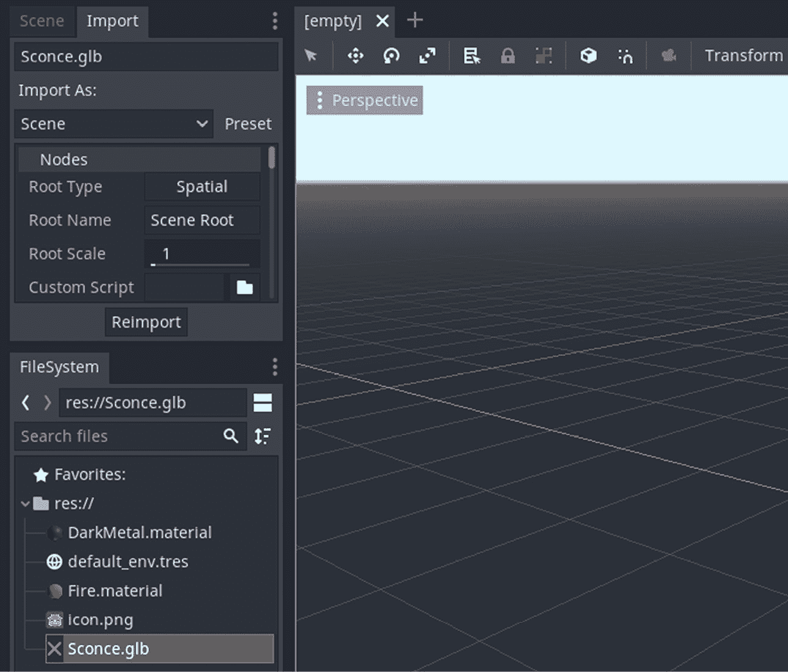
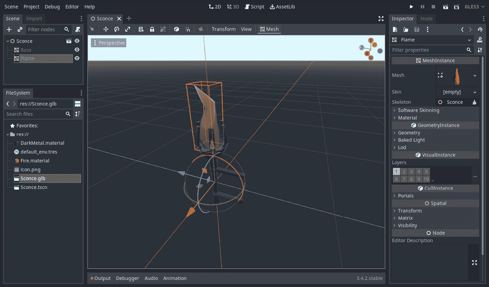
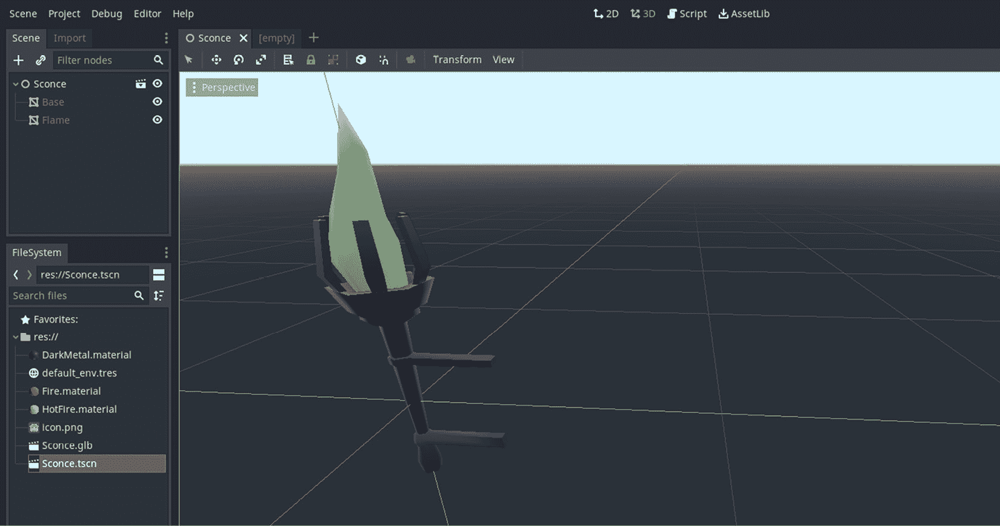
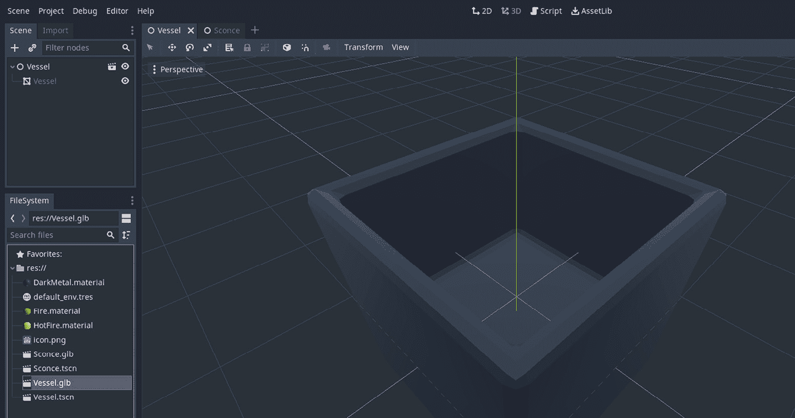
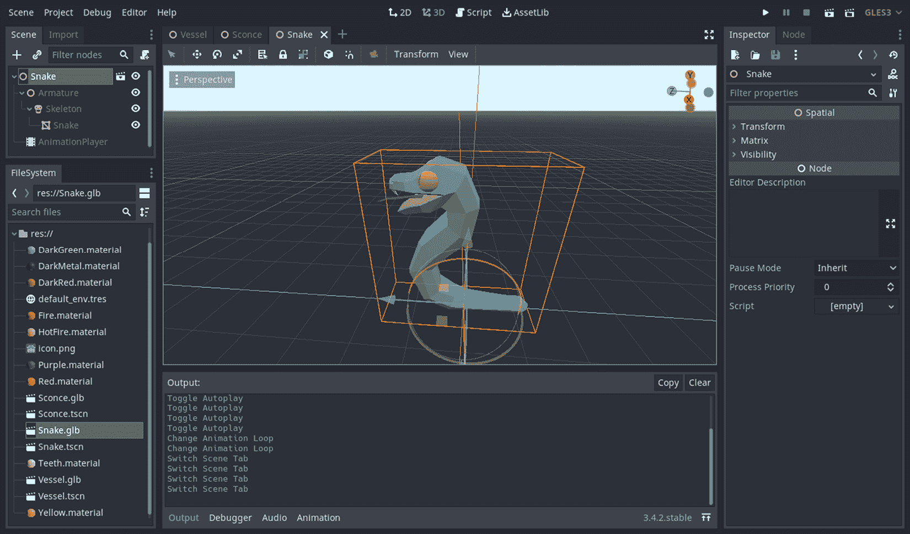
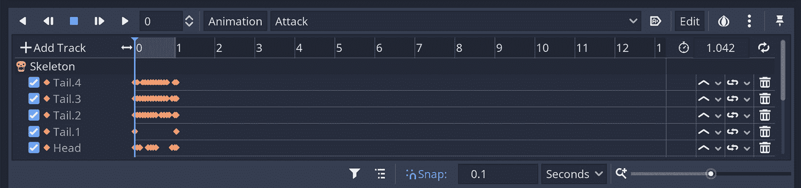
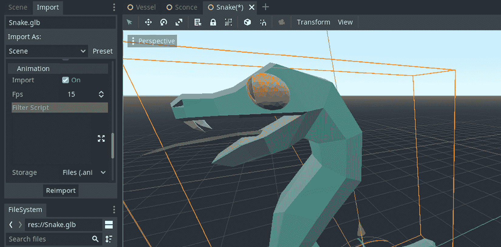
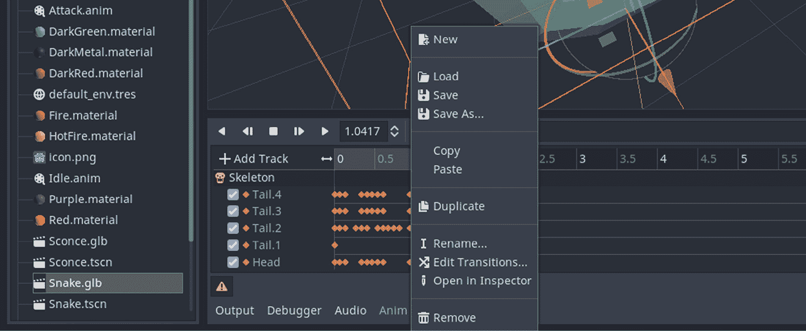

# 第八章：将 Blender 资源导入 Godot

你已经走了很长的路。你的模型准备好了。它们的缩放和旋转值已经固定。接下来要做什么？当然是将它们导入 Godot！希望你会觉得导入过程更加直接。这是一个过渡章节，主要涵盖 Godot 主题，而 Blender 的参与度最小。

我们将首先通过点击按钮使用你导入的模型创建游戏对象，这个过程将 glTF 文件转换为游戏对象——更具体地说，在 Godot 术语中是场景。

如果你必须修复你的模型或添加细节，你可以在哪里做这件事？由于你现在在 Godot 中，修复模型可能很有诱惑力，但这是不利的。在本章中，我们将向你展示如何更新你的 Blender 文件，并在 Godot 中反映这些更改。

在*第二章* *构建材质和着色器*中，我们学习了如何在 Blender 中处理材质。我们将在 Godot 的上下文中重新探讨这个主题，以便我们能够理解两种应用程序中材质的工作方式。我们将介绍处理材质在任一应用程序中的优缺点，以便你可以决定哪个最适合你。无论你是单独工作还是团队合作，都有一些决定可能会节省大量时间，或者当你意识到你需要进行基本更改时，可能会感到沮丧。一个合理的材质管道是这些主题之一。

在*第五章* *设置动画和绑定*中，我们在我们的蛇模型中存储了两个动作。我们将导入这个模型来查看 Godot 如何处理存储在 glTF 文件中的动画。本章将仅涵盖如何导入动画；如何使用导入的动画将在本书稍后当我们构建我们的点击冒险游戏时进行介绍。

因此，你将了解到一些至关重要的构建块和实践，这些将在后面的章节和你的游戏项目中为你服务。

在本章中，我们将涵盖以下主题：

+   制作场景！

+   在 Blender 和 Godot 之间切换

+   决定如何处理材质

+   导入动画

到本章结束时，你将能够将你的 glTF 文件转换为可用的 Godot 资源，从项目管道的角度决定如何处理材质，并确保你可以访问模型文件中包含的动画。

# 技术要求

如*前言*部分所述，我们假设你已经熟悉 Godot 的基本操作，例如创建和组合场景，向**节点**添加脚本，使用**检查器**面板更改游戏对象的条件，等等。

然而，如果你是 Godot 引擎的新手，那么你可能首先想从以下地址的官方学习材料开始：[`docs.godotengine.org/en/3.4/getting_started/introduction/`](https://docs.godotengine.org/en/3.4/getting_started/introduction/)。

在整本书中，我们将使用 Godot 3.4.4。即使在较小的版本之间，也可能会有新功能或缺失的功能。如果您在阅读本书时使用的是不同版本，您可以切换到本书使用的版本，或者阅读[`godotengine.org/news`](https://godotengine.org/news)上列出的不同版本的相关详细变更日志。

这仍然是一个过渡章节；前一章和下一章也是如此。我们将在第九章“设计关卡”中创建一个新的 Godot 项目，并在后续章节中在该 Godot 项目中工作以制作一个点对点冒险游戏。在此之前，我们可以使用临时的 Godot 项目。这意味着在本章和下一章中，我们根本不会关心我们文件和文件夹的结构。然而，本章中的部分已经按照我们假设您仍在同一个 Godot 项目中工作的方式安排。

如往常一样，本书的 GitHub 仓库[`github.com/PacktPublishing/Game-Development-with-Blender-and-Godot`](https://github.com/PacktPublishing/Game-Development-with-Blender-and-Godot)包含一些与本章节相关的文件。

# 制作场景！

在 Godot 中构建的典型 2D 游戏中，使用**精灵**节点是必不可少的。然后您将在 Godot 的**检查器**面板中将纹理分配给您的精灵节点。3D 版本基本上是相同的，但它涉及使用**MeshInstance**节点并将其分配给一个**网格**。所以，纹理对于精灵节点来说就像网格对于网格实例节点一样。虽然创建一个只包含精灵节点并在更大场景中实例化此场景的 Godot 场景是可能的，但这是一种过度设计，因为您可以直接将精灵节点本身附加到大型场景中。

这就是为什么需要将网格实例区别对待并存储在它们自己的场景中，与精灵不同，因为 3D 模型不仅仅是一个纹理的分配，还有很多其他的事情要做。此外，由于 3D 模型有很多可移动的部分，将单个网格分配给网格实例也可能很繁琐，所以让我们做得更好。本节的目标将是从 3D 模型中创建一个场景，并自动化如何将网格分配给网格实例。

Adobe Animate

Godot 的场景概念包含了您如果以前使用过*Adobe Flash*或现在的*Adobe Animate*（它使用**电影剪辑**，类似于 Godot 对场景的处理）可能会熟悉的一些概念。创建嵌套电影剪辑和绑定脚本非常方便，这正是 Godot 项目进行的方式。尽管有这种相似性，但在 Godot 中，有时将 3D 模型视为自己的场景是有意义的，这正是本节将要涵盖的内容。

我们建议您为这一部分开始一个新的 Godot 项目。一旦您这样做，您需要找到本章的`Start`文件夹中的`Sconce.glb`文件。此时您有两个选择。首先，您可以使用操作系统的文件系统将此文件复制并粘贴到您的 Godot 项目文件夹中。或者，您可以将 sconce 文件拖到 Godot 的**文件系统**面板中。当您将 glTF 文件作为项目的一部分时，您将得到以下类似的内容：

图 7.1 – Sconce 模型现在是你的 Godot 项目的一部分

你在`Sconce.glb`条目中也有一个红色的十字图标作为图标吗？这种情况并不总是发生，但这个图标表示存在配置问题；幸运的是，修复起来很容易。重启 Godot 通常可以解决这个问题。如果这还不行，那么我们就需要按一个按钮来重新导入文件，以便 Godot 为我们配置它。前面的截图也显示了**导入**面板的焦点。您可以在该面板底部点击**重新导入**按钮，使文件与 Godot 兼容。

当我们讨论图标问题时，还发生了其他事情。在我们的项目中有两个材质文件：

+   `DarkMetal.material`

+   `Fire.material`

这些材质包含在从 Blender 导出的 glTF 文件中，因为我们选择保留材质。如果您需要复习这一点，您可以阅读*第六章*中的*决定导出什么*部分，*导出 Blender 资源*。默认情况下，Godot 会将材质放置在模型文件旁边。出于组织原因，您可能希望将模型和材质放在不同的文件夹中。我们将在本章后面的*决定如何处理材质*部分讨论与此相关的内容。

现在我们已经准备好使用 Sconce 模型创建场景。这项工作将创建显示 Blender 模型在 Godot 中的所有必要绑定。为了实现这一点，您必须执行以下操作：

1.  双击**文件系统**面板中的`Sconce.glb`条目。

1.  在弹出窗口中点击**新建继承**按钮。

弹出窗口将在您刚刚点击的按钮旁边显示另一个按钮。还有关于每个按钮功能的说明，但它可能有些令人困惑，所以让我们来解释一下。用通俗易懂的话说，**打开任何方式**按钮将允许您查看 glTF 文件的内容，但这是只读的。由于您可能想要进行修改，例如附加脚本，您通常会点击**新建继承**按钮。

如果你打开**场景**面板，你会看到你的最后努力在**空间**节点下创建了两個**网格实例**节点。当你点击**Sconce**或**Flame**网格实例节点时，你会在**检查器**面板中看到它们的网格绑定。我们不必手动创建所有这些结构和绑定；从 glTF 文件创建场景为我们完成了这一切。

当你检查完到目前为止的变化后，你可以将你的文件保存为`Sconce.tscn`，因为就 Godot 而言，它仍然是一个临时构造。以下截图显示了我们的进度：

图 7.2 – 你只需点击一下按钮就创建了一个场景

你现在可以通过创建更多`Sconce.tscn`的实例在其他场景中使用它。例如，在大多数 2D 平台游戏（其中包含敌人）中，你必须创建存储敌人角色精灵的场景实例。这很相似。因此，每次你需要 sconce 时，你都可以使用**Sconce**场景而不是模型文件。在我们这本书的后续部分工作游戏时，我们将创建更多此类场景的实例。

从模型文件创建场景很容易，但改变它有多容易呢？无论是 sconce 还是火焰，都可以稍微调整一下。接下来，我们将探讨如何在场景中更新我们的模型。

# 在 Blender 和 Godot 之间切换

在 Godot 的后续版本中，特别是从 Godot 4.x 版本开始，你将能够直接将 Blender 文件导入 Godot 并与它们交互。在 Blender 中保存内容将自动更新 Godot 中的情况。我们还没有达到那个阶段。在撰写本文时，我们必须坚持已经尝试并验证过的方法：重新导出我们的资产。让我们看看我们如何轻松地完成这项任务。

在你开发游戏的过程中，你可能会想要更改你的模型。也许你一直在使用你的 3D 艺术家朋友或承包商之前提供的一个原型。现在，他们准备给你一个更精细的作品。所以，让我们通过修改我们一直在使用的 sconce 模型来模拟一个类似的场景。如果你想要跳过 Blender 部分，你可以在`Finish`文件夹中的`Sconce.blend`文件中找到完成后的更改。如果你想锻炼一下 Blender 技能，我们建议你在`Start`文件夹中的`Sconce.blend`文件中进行两个更改。这些更改如下：

+   将火焰的尖端移动一下，让它看起来不要太尖锐。（提示：进入**编辑模式**。）

+   将火焰材质替换为明亮的黄色。你可以为它选择一个名字，比如**HotFire**。（提示：删除旧材质并添加一个新的。）

我们对我们的模型进行了两项重要的更改。首先，我们改变了模型的几何形状，尽管这可能微不足道。其次，我们引入了一种新材料，而不是更改现有材料的颜色。剩下的唯一事情就是重新导出我们的模型，并覆盖 Godot 项目中现有的 `Sconce.glb` 文件。如果你一直在跟随，项目中的 `Sconce.glb` 文件看起来似乎没有任何变化。

如果你重新启动 Godot，切换到不同的场景标签，或执行任何其他会刷新视图的操作，那么你就会看到你的更新。否则，你可能仍然保持原来的外观。似乎存在一个普遍的刷新问题。希望像这样的小问题将在 Godot 的未来版本中得到修复。

以下截图显示了您将看到的更新：

图 7.3 – 我们的最新更改使火焰更热、更直

虽然我们成功更新了 **Sconce** 场景，但我们还向项目中引入了一种新材料。导入过程足够智能，知道即将导入新材料，但它足够谨慎，保留了旧材料，以防将来在项目中可能需要使用它们。

这可能会导致随着时间的推移积累大量未使用的文件。但这还不是你遇到的最糟糕的问题。当你导入越来越多的模型，最终因为文件数量庞大而失去对项目状况的跟踪时，有一个更加隐蔽的问题在等待着你。

在下一节中，我们将展示一个场景，其中直接导入 glTF 文件，就像我们迄今为止所做的那样，可能会引起一些问题。

# 决定如何处理材料

一个重要的决定等待着你。当你导出 Blender 资产时，在 *第六章*，*导出 Blender 资产*，我们简要讨论了导出器 UI 中的导出选项的含义。然而，我们从未真正讨论过保留材料或不保留材料的含义。在本节中，我们将介绍在 Blender 与 Godot 中处理材料的优缺点。

假设你现在已经准备好导入另一个模型。例如，`Start` 文件夹中的 `Vessel.glb` 文件是你想要添加到游戏中的东西。如果你查看相关的 `Vessel.blend` 文件，你会注意到我们使用了一种标记为 **DarkMetal** 的材料。讽刺的是，也许是无意的，有人决定选择一种浅色，但不管意图如何，名称与我们在 sconce 模型文件中使用的是相同的材料名称。

那么，当我们将此文件导入 Godot 时会发生什么？为了找出答案，请按照以下步骤操作：

1.  将 `Vessel.glb` 添加到您的 Godot 项目中。

1.  将这个船体模型转换成一个场景。为了方便起见，将其保存为 `Vessel.tscn`。

以下截图显示了新的场景，以及 **FileSystem** 面板的状态：

图 7.4 – 东西看起来都还好，但这个容器不应该有一个更浅的颜色吗？

尽管在 Blender 中的标记有误，但我们知道我们想要的容器颜色。它应该是浅色，但在 Godot 中我们看到的情况并非如此。在导入容器模型时，由于项目中已经存在同名材质，Godot 选择不复制资源。这可能很高效，但并不准确。这种事情很容易发生，尤其是如果你正在使用他人的文件。幸运的是，只有新导入的内容看起来不正确。换句话说，新导入的资源并没有覆盖和破坏现有的资源。

那么，我们该如何让容器显示我们想要的颜色呢？我们可以提供一些更组织性的建议。因此，这不仅仅是一个技术解决方案，而是一种工作流程或管道类型的解决方案，这在行业中通常是这样标记的。因此，解决方案在于你如何在项目中处理你的文件，以及你是单独工作还是团队合作。以下是一些建议：

+   通过用途标记 Blender 材质

+   通过颜色标记 Blender 材质

+   将你的模型导入到单独的文件夹中

+   在 Godot 中使用预演区域

这些建议都不是灵丹妙药。你必须尝试并决定它们对你是否有益。此外，不同规模的项目可能会使某些解决方案容易或困难。在你了解每个建议包含的内容之后，决定权在你手中。

## 通过用途标记 Blender 材质

在 Blender 中通过其色调命名材质，例如 **DarkMetal**，只能走这么远。我们说的是多暗？迟早我们会发现自己陷入一个形容词的游戏：暗、更暗、最暗，以此类推。当我们想要选择比我们已选择的暗色调更浅的版本时，情况会更糟。

通常，壁灯的底座是铸铁制成的。由于它是一种金属，所以在名称中使用“金属”这个词是有意义的，但它可能会很容易造成混淆。相反，你可以使用物体的名称作为其材质标题。所以，一旦你将其导入到 Godot 中，你将会有 `Sconce.material`。

## 通过颜色标记 Blender 材质

如果你想要使用类似颜色的标签，那么你可以以一种明显且独特的方式做到这一点，而不会给 Godot 留下任何以它自己的方式解释的空间。`393646.material`。

请记住，在创作模型时，你可能会变得忙碌和分心，发现自己正在对模型中的许多事物进行微调，无论是几何形状、材质、动画等等。所以，如果你已经选择了一个十六进制颜色作为名称，并且后来改变了材质的颜色，那么你必须记得更新名称。

## 将你的模型导入到单独的文件夹中

有些人组织他们的 Godot 项目，以便他们有单独的文件夹来存放更大的概念。这包括材质、模型、场景和脚本。如果你想确保你的材质只属于你正在导入的模型，一个更安全、更简单的方法是在特定文件夹内创建自定义文件夹。例如，如果你的项目根目录下有一个`Models`文件夹，你不需要将所有 glTF 文件都放入这个文件夹，你可以创建以你正在导入的模型命名的子文件夹。在我们的例子中，你会看到以下结构：

+   `Models` > `Sconce` > `Sconce.glb`

+   `Models` > `Vessel` > `Vessel.glb`

然后，每个 glTF 文件的相关材质都将包含在其自己的文件夹中。这乍一看可能似乎适得其反，因为相同的材质文件将在不同的文件夹中重复，尤其是如果材质的名称是彩色编码的话。然而，你至少会知道你导入的正是你最初想要的。

这种方法在某些情况下可能具有优势。也许你正在为你的游戏设计不止一种烛台样式。在这个新样式中，尽管铸铁部分有不同的形状，但它很可能会使用相同的材质。然后，你可以轻松地将文件夹重命名为`Sconces`来存储多个烛台文件。这样，你是有意同意 Godot 不会创建重复的材质，而是使用第一个导入的模型的材质。

最后但同样重要的是，让我们来谈谈这个技术的注意事项。如果你是通过将文件拖放到**文件系统**面板来导入文件，你必须小心，因为这个面板是上下文相关的。这意味着你需要选择条目列表中的适当文件夹。否则，被选中的任何条目都将成为接收者。为了确保你知道你的文件发送到了哪里，你可以通过使用操作系统的文件系统来完成所有这些操作。当你切换到 Godot 时，你的文件将被处理，并且根据你系统的速度，你可能会看到一个进度条显示导入的进度。

## 在 Godot 中使用预演区域

在我们确保模型和材质正确导入的可能解决方案列表中，最后一个是使用预演区域。这意味着，类似于为模型使用唯一文件夹，你可以指定一个文件夹来监控模型的情况。也许这是一个位于`Models`文件夹内的标记为`Staging`的文件夹。

使用**文件系统**面板中的搜索功能，你甚至可以检查其他文件夹中是否有重复的材质。这是一种安全比较材质的方法，因为你可以通过**检查器**面板观察它们的属性。如果没有明显差异，并且你认为这是安全的，你只需将相关的 glTF 文件移动到其最终位置，同时忽略这个预演区域中的重复材质文件。

这需要一点工作，但在大型团队中这可能是一项必要的实践，以便你可以决定甚至通知艺术家是否存在明显的标签错误。例如，如果有多个类似模型应该使用的相同材质存在拼写错误，你不会得到两个不同的材质。

## 总结

在所有这些选项中，也许还有你在网上找到的几个选项，你必须决定哪一个最适合你。这是一个常见的情况，你可能会开始一种方式，但随着项目需求的变化而切换到另一种方法。虽然你的选择可能具有技术影响，但它更多的是一个商业决策；因此，在做出决定时权衡利弊。

关于你的材料和模型，你还可以做一件事，但由于本章是关于导入的，所以我们有意将其留到后面。那就是当你决定在 Godot 中创建你的材料并将其手动绑定到模型的网格上时，因为有时你会发现只有网格但没有材质信息的模型。我们将在 *第九章* 的 *设计关卡* 部分的 *构建缺失的材质* 中向你展示如何在 Godot 中创建材质。

现在我们似乎已经完成了关于材质的事情，在下一节中，我们将学习如何导入我们在 *第五章* 的 *设置动画和绑定* 中为蛇创建的动画。

# 导入动画

我们将介绍的关于导入 Blender 资产的最后一件事情是动画。到目前为止，我们已经处理了导入模型的网格和材质。我们甚至讨论了与默认导入流程相关的材质工作流程问题。希望导入动画不会有隐藏的惊喜，但我们如何做呢？你将在本节中找到答案。

你可以从将本章的 `Snake.glb` 文件移动到你的项目的 `Start` 文件夹开始。然后，如 *制作场景!* 部分所示，你可以从这个模型创建并保存一个场景。蛇模型将带来很多它的材质，你的 **FileSystem** 面板看起来会有些拥挤，但这是我们目前所拥有的：

图 7.5 – 蛇跟随你进入 Godot 引擎

这是个好时机来介绍一些 Godot 使用的 3D 节点。我们将利用蛇场景来完成这项工作，因为它有你在项目中最可能使用的不同节点的良好样本。

根节点是 **spatial** 类型。Godot 为所有 3D 节点选择的红颜色。如果你一直在使用 Godot 的 **Node2D** 节点，它们有一个蓝色圆形图标，**Spatial** 节点就是那个节点的 3D 版本，颜色是红色。而一个 **Node2D** 节点只有 *XY* 平面的坐标，一个 **Spatial** 节点则会在 *XYZ* 平面有坐标。你通常使用这种类型的节点作为其他节点的根容器。例如，**Armature** 和 **AnimationPlayer** 节点是根 **Spatial** 节点的直接子节点，该节点被标记为 **Snake**。

节点类型与标签

在蛇场景中，**MeshInstance** 节点已被重命名为 **Snake**，这在你有大量网格实例时很有用。Godot 中没有内置的 *Snake* 节点类型，但说 **Snake** 节点是可以的，即使它属于 **MeshInstance** 类型。**Inspector** 面板会确定类型并只列出相关属性。因此，在这本书的其余部分，我们将使用场景的节点名称或节点类型进行引用。

我们很快将分析 **AnimationPlayer** 的作用，但让我们先完成对 **MeshInstance** 和 **Skeleton** 子节点的查看。

## MeshInstance 和 Skeleton

我们在 *制作场景* 部分的 **MeshInstance** 和 **Sprite** 节点之间做了一个类比，指出它们分别负责在 3D 和 2D 空间中持有视觉元素。因此，这就留下了 **Skeleton** 节点。

在 *第五章* *设置动画和绑定* 中，我们使用了骨骼并将它们绑定起来，以便我们可以对蛇进行动画处理。当 `Snake.glb` 文件被导入时，骨骼作为一个整体被导入。换句话说，Godot 将你所有的骨骼组合成一个 **Skeleton** 类型的节点。然而，如果你愿意，你仍然可以访问每个骨骼：

1.  选择 **Skeleton** 节点。

1.  在 **Inspector** 面板中展开 **Bones** 部分。

1.  展开一些条目，特别是 **9** 和 **10**。

你能认出这些名字吗？这些是你为 Blender 中的骨骼所取的名字。看看我们构建骨骼需要做多少准备工作。创建所有这些的绑定过程，尽管一开始看起来可能很复杂，但在 Blender 中做起来仍然比在 Godot 中要简单得多。

现在，让我们将注意力转向场景中的最后一个节点类型，以进一步理解为什么在 Blender 中进行动画也是一个更优越和更受欢迎的选择。进入 **AnimationPlayer**。

## AnimationPlayer

**Snake.tscn** 场景中的最后一个节点是 **AnimationPlayer**。这个节点的颜色既不是蓝色也不是红色。这意味着你可以在 2D 和 3D 环境中都使用它。如果你已经构建过 2D 游戏，你可能已经熟悉这个节点了。如果是这样，那么你知道你需要在你玩家的时间轴上放置关键帧来标记变化点，就像我们在 Blender 中做的那样。无论你是否熟悉 **AnimationPlayer**，或者这是你第一次处理它，你都会注意到，像下面的截图所示，创建这么多关键帧是一项大量工作：

图 7.6：你聪明地而不是辛苦地创建了 AnimationPlayer 中的所有这些关键帧

在前面的截图中的每个橙色菱形都是一个关键帧，标志着动画生命周期中的重要转折点。这是我们在 Blender 中创建的 **Attack** 动作的时间轴。你可以在顶部的下拉菜单中看到它。这是我们选择 Blender 为我们做所有这些的主要原因——我们只关心主要事件，而不是主要事件之间具体发生了什么。Godot 和 Blender 一起填补了细节。此外，在 Blender 中更新你的动画仍然比摆弄那些菱形要好得多。

如你所见，动画和动作会自动导入、识别和组织到 **AnimationPlayer** 中。尽管这很简单，但 Godot 在动画导入方面目前存在一个 bug。因此，我们需要做一些可能在未来不再必要的事情。我们将在下面讨论这个问题并提出解决方案。然而，要跟进这个问题的讨论和更新，你可以访问 [`github.com/godotengine/godot/issues/34394`](https://github.com/godotengine/godot/issues/34394)。

在 **Animation** 面板的右侧，有一个看起来像回收符号的图标。在撰写本文时，那个循环按钮，本应无限期地播放动作，只有在编辑场景时才起作用。所以，即使你可以切换循环按钮，当你在游戏中启动时，动作也只会播放一次。希望不久，更新的 Godot 版本将修复这个循环问题。不过，目前提出一个临时解决方案是有意义的。

## 分离动作

幸运的是，我们刚刚提出的问题有解决方案。我们将指导 Godot 将动作分离到单独的文件中，类似于模型材料在文件系统中保持的方式。

对于保持模型动画的默认行为是将它们存储在其文件内部。在这种情况下，`Snake.glb` 实体包含了它所有的动画。要提取这些动画，请按照以下步骤操作：

1.  在 **FileSystem** 面板中选择 `Snake.glb`。

1.  打开 **Import** 面板并向下滚动到 **Animation** 部分。

1.  在**存储**下拉选项中选择**文件 (.anim)**。

1.  点击**重新导入**按钮。

以下截图显示了我们已经采取的步骤：

图 7.7 – Snake.glb 文件的导入设置

这将把动作提取到文件系统中。最终，您项目中将多出两个文件：

+   `Attack.anim`

+   `Idle.anim`

这些是您之前在 Blender 中定义的动作。同样命名的动作也列在 Godot 的**AnimationPlayer**下拉菜单中。例如，*图 7.6*显示了选中的**Attack**动作。我们还需要一个步骤来解决循环问题——那就是将这些我们刚刚分离的动作重新引入到**AnimationPlayer**中，即使它已经列出了这些动作。为了实现这一点，请按照以下步骤操作：

1.  打开**场景**面板。

1.  在场景结构中选择**AnimationPlayer**节点。

1.  在**动画**面板中点击**动画**按钮（位于**动作**下拉菜单左侧的按钮）。

1.  从**打开文件**弹出菜单中选择`Attack.anim`。

1.  重复**步骤 4**以加载`Idle.anim`。

这将用来自文件系统的动作替换现有的动作。以下截图显示了您可以在哪里找到所有这些名称，因为有很多类似的单词。在这里，**动画**按钮已经被按下，并显示了可用的命令：

图 7.8 – 动画面板的加载、保存和其他操作菜单

在未来，希望您不需要使用 Godot 的新版本分离和重新导入动作。目前，这将会工作，但我们不会看到效果，直到我们到达这本书的后期章节，在那里我们将触发这些动作。

# 摘要

由于我们在上一章中处理了 Blender 资产的导出，现在是时候学习如何将这些导入到 Godot 中。这就是本章所涵盖的内容。

首先，我们了解到一旦 glTF 文件成为 Godot 项目的一部分，Godot 会自动处理诸如分离材质等问题。换句话说，由于我们很可能会继续创建更多 3D 资产实例，我们研究了如何从 glTF 文件中创建专用场景。此外，我们还学习了如何在 Blender 中对我们的模型进行修改，并使用这些模型在 Godot 中更新场景。

然后，我们讨论了材质，这是模型工作流程中的一个复杂话题，并讨论了不同的材质标记方法，甚至将模型保存在不同的文件夹中以防止任何材质文件重叠。您决定哪种方法最适合您，因为这类事情可能是团队规模或项目特定的。

最后，我们探讨了动画导入的简便性。从模型创建场景已经处理了所有框架。尽管我们将在后面的章节中学习如何触发动画，特别是循环动画，但我们提出了一个可能发生的问题。我们提供了一个解决方案，并希望你在未来不需要使用它。

这是你关于 Godot 的第一章节，你现在正式开始使用 Godot 引擎。将 3D 资源导入到 Godot 是一个基本操作，我们希望你在 Blender 和 Godot 之间进行游戏开发时能够实现无缝的交互。

在下一章中，我们仍将专注于一个独立主题，*添加音效资源*，以保持内容简单。到下一章结束时，我们将涵盖设置项目结构的基础知识，这意味着我们可以在之后专注于构建游戏。

# 进一步阅读

你已经与 Godot 的**导入**面板进行了交互。该区域有许多设置，如果我们要调查所有可能的组合，可能需要写一个章节。默认设置在大多数情况下都适用，但在右上角有一个**预设**按钮，列出了最常用的组合。

由于项目的需求以及因此模型导入的要求在事先可能并不明确，我们将发现这些选项包含的任务留给你来完成。话虽如此，这里有一个官方资源，如果你想要获取更多信息，可以参考：[`docs.godotengine.org/en/3.4/tutorials/assets_pipeline/importing_scenes.xhtml`](https://docs.godotengine.org/en/3.4/tutorials/assets_pipeline/importing_scenes.xhtml)。

同样，你可能想要导入图像而不是 3D 资源。当你正在为游戏构建 UI 元素时，这是必要的。我们在这本书中主要涵盖 3D 工作流程，因此我们不会强调 2D 资源的导入设置。尽管如此，如果你想在处理 UI 主题之前了解相关信息，这里有一个官方网址：[`docs.godotengine.org/en/3.4/tutorials/assets_pipeline/importing_images.xhtml`](https://docs.godotengine.org/en/3.4/tutorials/assets_pipeline/importing_images.xhtml)。
