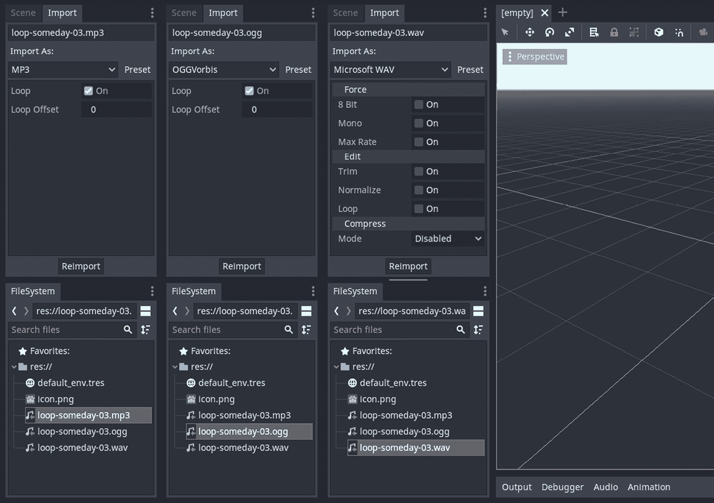

# 添加声音资产

声音往往是游戏项目中最被忽视的部分。虽然创建视觉资产可能看起来很难，但很多人仍然会尝试，因为我们能快速可靠地获得反馈，然而，当涉及到制作声音资产时，大多数人甚至不知道从何开始。幸运的是，有一些免费的声音资产可以使用。

本章不会介绍如何制作声音资产，而是介绍如何将它们导入到你的游戏中。我们将关注 Godot 中声音管理的某些技术方面。这涉及到了解引擎支持的不同声音格式。选择合适的声音格式与为动画拓扑整理 3D 模型并无不同。明智地选择，并且最好了解每种格式的优缺点。

接下来，你将学习何时以及如何循环某些声音资产。我们将探讨不同声音类型的导入选项，并提及格式特定的差异。我们还将讨论在哪些情况下循环声音资产是有意义的。

最后，我们将了解在场景中播放声音资产的不同类型的 Godot 节点。这样，你可以为你的项目选择合适的音频播放节点。最后，我们将播放一些示例声音资产，以展示这些不同节点之间的差异。

不言而喻，为了充分利用本章内容，你可能需要在安静的地方练习一些主题，尤其是在本章的后期部分。

在本章中，我们将涵盖以下主题：

+   了解不同的声音格式

+   决定是否循环

+   在 Godot 中播放音频

到本章结束时，你将知道如何导入声音资产，选择正确的文件类型，配置它们的设置，并在你的项目中自动或需要时播放它们。

# 技术要求

与其他章节不同，我们不会提供一个包含单个资产的`Finish`文件夹，而是会提供一个包含所有场景和脚本设置的完成后的 Godot 项目。尽管如此，我们仍然希望你们练习，但仅关注本章中提出的话题。因此，我们建议你们从一张白纸开始，从`Start`文件夹中导入声音文件，并跟随操作。按照惯例，必要的资源可以在本书的 GitHub 仓库中找到：[`github.com/PacktPublishing/Game-Development-with-Blender-and-Godot`](https://github.com/PacktPublishing/Game-Development-with-Blender-and-Godot)。

# 了解不同的声音格式

音频文件有不同的格式，就像图形文件可以有不同的格式，包括 JPG、GIF、PNG 等等。行业，有时甚至是消费者，决定了这些格式的命运。让我们在这里将消费者放在正确的背景下。偶尔，文件格式创造者提出的规范并不被使用该格式制作作品的用户所欢迎。然后，作品虽然被创作出来，但由于技术原因，无法被用于分发此类内容的平台所接受。这几乎就像一场拔河比赛，维护文件类型的麻烦或成本超过了其带来的好处和易用性。在这些时候，我们往往会听到关于新格式的消息，这就是为什么存在众多文件格式的原因。

大多数时候，这种技术层对最终用户来说是不可见的，尤其是如果他们只是浏览内容，比如在 Spotify 或 YouTube 上听音乐。然而，既然我们正在制作一款游戏，尽管我们不太关心这些资产的生产，但我们仍然应该对这个主题有所了解，因为我们想为特定场景选择最合适的文件格式。

区分“声音”的含义

这是一个关于我们所说的“声音”的说明。在本章和本书的其余部分，我们将使用“声音”或“音频”这个词来涵盖所有可能的场景，比如与 UI 元素交互时获得的反馈，当玩家角色被游戏内事件通知时，或者环境音乐。

目前这本书所涵盖的 Godot 版本 3.4.4 支持三种不同的音频文件格式。每种格式都有不同的优点和局限性。尽管可以将这些文件相互转换，但我们在介绍它们的正式定义后，你可能决定不这么做。

## 介绍 WAV

发音为 *wave* 的 WAV 文件自 90 年代初以来一直存在。它是 Wavefront Audio File Format 的简称，这是一种由 IBM 和微软创建的文件规范。这是音乐和音频专业人士中流行的格式，尽管它是不压缩的，因为它保留了声音记录的质量。多亏了文件存储容量和互联网速度的改进，高文件大小似乎不再是太大的问题。

在局限性方面，从技术角度来看，WAV 文件不能超过 4 GB。然而，这不应该成为问题，因为这个数字相当于近 7 小时的音频。在任何一个视频游戏中，几乎不可能有一个这么大的音频文件。

那么，为什么你应该选择这种格式呢？由于它是一种不压缩的文件类型，负责处理音频文件的 CPU 将更容易播放它。使用这种文件类型的一个可能场景是音效。通常，这些效果是短暂的，比如门的吱嘎声，剑的挥舞声等等。文件大小不会太重要，因为持续时间会很短。

相反，这也不是背景音乐的最佳格式。当然，你不需要解压缩文件就能播放它，但文件大小将显著更大。

总结来说，如果你想快速反应，并且希望音效文件尽可能快地播放，比如效果，那么这是适合你的格式。毕竟，你不想在游戏角色忙于处理下一连串事件的同时，CPU 还在处理效果文件的解压缩。

如果你愿意牺牲几百毫秒来等待解压缩，比如当背景音乐不能立即播放是一个大问题时，那么你可以选择压缩文件类型。这些文件类型有两种不同的风味。

## 介绍 OGG

我们应该首先澄清这个格式，因为如果你在网上遇到一些资源，名称可能会令人困惑。技术上讲，OGG 是一种容器文件格式，可以容纳音频、视频、文本和元数据等文件类型。其开发者和维护者 *Xiph* 还负责另一种名为 **Free Lossless Audio Codec** （**FLAC**）的音频文件格式。因此，根据 OGG 规范，FLAC 可以是 OGG 文件的一部分。从历史的角度来看，大多数 OGG 文件都包含另一种名为 Vorbis 的不同音频文件格式。因此，你可能会发现一些提供 Vorbis 内容的网站实际上是在遵守 OGG 格式规范。

这里有一个示例来简化所有这些名称以及它们之间的关系。将 OGG 视为一个知道如何处理其内容的 ZIP 文件。一个携带视频和字幕文件的 OGG 文件将触发视频播放器中的必要设置，以便播放器知道在哪里找到字幕，因为它们将嵌入在一个文件中。同样，另一个携带音频和元数据文件的 OGG 文件将指示音频播放器显示专辑和曲目、记录和播放音频。

由于格式不仅仅是一件事，而是一组文件，因此将特定需求与一个文件扩展名关联起来常常令人困惑。例如，`.ogg` 扩展名在 2007 年之前被用作多媒体容器，因为这是它的原始意图。从那时起，Xiph 建议我们使用 `.ogg` 扩展名来表示 Vorbis 音频文件。此外，该公司创建了一套新的文件扩展名以简化事物：

+   `.oga` 用于仅音频文件

+   `.ogv` 用于视频

+   `.ogx` 用于复用情况

尽管存在命名难题，但你需要知道的是，OGG 音频格式是压缩的，因此它是一个有损文件格式。在我们的语境中，“有损”意味着我们可以通过要求更少的硬盘空间来获得几乎相同的声音质量。所以，这是一件好事，因为这个文件格式非常适合播放背景音乐。记住，由于 CPU 必须解压缩这种文件类型，因此这不是播放快速音效的首选格式。

说到有损文件格式，我们的下一个候选者是有损文件格式，它在 2000 年代初获得了一些恶名。

## 介绍 MP3

在 20 世纪 90 年代末，互联网速度和磁盘存储非常昂贵的时候，MP3 在转移音频内容方面填补了一个重要的空白，正好在千禧年之交，大量受众需要它。消费者纷纷涌向网站下载他们最喜欢的乐队的曲目副本。遗憾的是，许多这些网站没有麻烦去获得分发此类内容的合法许可，这导致了版权侵权，在 Napster 的情况下，甚至引发了诉讼。

从技术角度来看，MP3 文件在 WAV 和 OGG 之间，在压缩方面处于中间位置。因此，对于相同音质，OGG 文件的大小会更小。话虽如此，解压缩 MP3 文件比解压缩 OGG 文件要快。因此，这使得 MP3 格式仍然有用，尤其是在 CPU 承受最大压力的地方，比如在移动设备上。

尽管磁盘空间越来越便宜，但从商业角度来看，仍然有优先考虑 WAV 而不是 MP3 的合理性。例如，一些提供免版税音效文件的网站提供 MP3 版本，但将 WAV 版本的音效放在付费墙后面。由于 MP3 文件已经因为其压缩算法而丢失了一些原始数据，因此反复编辑此文件会产生更多有损的结果。所以，如果你想要对其做出修改，能够访问原始 WAV 文件总是更好的。然而，如果你不需要这样做，那么 MP3 版本可能就足够了。

## 结束语

总结来说，WAV 文件更适合短音效，而较长的音效，尤其是主题曲，用 MP3 文件处理会更好。在撰写本文时，大多数音效库仍然不常用 OGG，尽管它是一个很好的候选者。尽管如此，如果你有很多 WAV 文件并且想要在文件大小上更有效率，那么你可以使用在线转换器将它们转换为 OGG。以下有两个例子：

+   [`audio.online-convert.com/convert-to-ogg`](https://audio.online-convert.com/convert-to-ogg)

+   [`online-audio-converter.com/`](https://online-audio-converter.com/)

在音乐文件的情况下，这些文件通常只有几分钟长，如果你的原始文件是 WAV 格式，那么在线上传和处理这些文件可能会花费很长时间，因为文件大小很容易超过 50 MB。此外，一些在线转换器有文件大小限制。为了绕过这些限制，这里有一个链接到网站，比较了一些你可以用于你的努力的离线转换器：[`www.lifewire.com/free-audio-converter-software-programs-2622863`](https://www.lifewire.com/free-audio-converter-software-programs-2622863)。

无论你选择什么类型的文件，以及它是声音效果还是音乐，在你的游戏开发旅程中，你都会到达一个决定你的声音资产是否应该循环的时刻。在下一节中，我们将讨论为什么开启或关闭循环功能是有用的。

# 决定是否循环

在字面上，循环是一个连续的运动或结构，如果你随机选择一个点，你可以通过完全穿越它回到那里。在听觉上，这很相似，但我们不是从任何地方开始；我们通常开始播放一个声音文件，但玩家会在它到达末尾时重新启动曲目。

这个定义是经典的，但并不那么有洞察力，所以让我们通过在 Godot 或任何游戏项目中讨论它在各种情境下的应用来做得更好。这样，你可以在项目中做出明智的决定，因为它是特定情境的。我们将通过展示不同的用例来完成这项工作：

+   **背景音乐**: 这是最常见的案例，在游戏运行时，背景音乐持续播放。作曲家创作这种作品的目的就是一旦连续播放，就不会有突然的结尾。文件末尾的声音会无缝地与开头匹配。当然，如果你注意节奏的起伏，你会知道你在文件中的位置，但只要循环设置开启，一切听起来都会很顺畅，融合在一起，这样你就可以专注于游戏体验。

+   **机关枪**: 想象一下，在游戏中玩家或敌人角色正在与机关枪互动。虽然可以发射短点射，但由于机关枪的特性，枪可能会连续发射。因此，与其检测声音文件是否到达了结尾并指示玩家重新启动文件，不如如果该文件启用了循环功能，就播放一次文件。这样，机关枪效果将持续播放，直到接收到停止命令。

+   **门**: 这是一个有点边缘的情况。假设我们在游戏中有一些视觉和其他声音效果，表明我们正在一个风大的户外场景中。也许这扇门状况不佳，铰链生锈，甚至有一个铰链稍微向外倾斜。艺术家可能决定让这扇门动画化以匹配风对门的影响，使其在关闭和打开状态之间摆动。在这种情况下，有一个循环的声音文件是有意义的，其中很可能包含与门动画同步的吱吱声和嘎吱声。

然而，如果一扇门将响应玩家的动作，比如打开或关闭，那么将声音文件设置为循环就没有意义了。这将是一个一次性的事件。

+   **用户界面**：当您与用户界面交互时听到的声音属于此类。这些通常不会循环，因为它们基于事件，类似于之前用例中的一次性开门动作。然而，让我们提出一个可能认为循环是个好主意的情况。尽管如此，我们仍会出于一个很好的理由将其排除。

想象一下有一个 UI 组件帮助玩家设置一个数值。界面有两个按钮，将增加和减少玩家看到的数值。在任一按钮上放置 UI 音效是可以的，只要玩家继续点击，声音就会播放一次。如果我们想给玩家一个按住按钮的机会呢？毕竟，不断地点击按钮以获得非常高或非常低的数值可能会很快变得乏味。那么，在这种情况下我们应该如何处理循环条件呢？

在这种事件中，人类的感知非常敏感。玩家在游戏过程中通常很忙，所以当 CPU 忙于解压缩音乐文件时，他们不会察觉到延迟。然而，我们通常非常敏感地检测到 UI 按钮保持事件结束时的差异。因此，即使它们可能感觉相似，设计师也会选择单独触发音效，而不是循环播放。

在本节中，我们介绍了不同用例，在这些用例中，循环的使用或未使用是常见的。然而，您还没有看到如何打开和关闭循环功能。我们将通过重新访问我们的老朋友，即**导入**面板，来展示这一点。

## 打开和关闭循环

到目前为止，我们已经讨论了循环是什么以及何时打开或关闭循环可能是有意义的，但我们还没有看到如何翻转其状态。在本节中，我们将把每种类型的音文件放入我们的项目中，并研究**导入**面板中的设置。

我们将使用来自*Freesound*网站的`Loop_Someday_03.wav`文件，该文件由用户*LittleRobotSoundFactory*创建。声音最初是 WAV 格式，但我们已经将其转换为 OGG 和 MP3 版本。您可以在`Start`文件夹中找到所有版本，并比较它们的文件大小。

一旦您已将文件添加到您的项目中，让我们学习 Godot 如何识别这些文件。因此，打开**导入**面板，并选择 OGG 或 MP3 版本。然后，选择 WAV 版本。界面差异在以下屏幕截图中显示：



图 8.1 – MP3 和 OGG 版本比 WAV 版本有更少的导入设置

如您所见，默认情况下，MP3 和 OGG 版本都带有循环设置。此外，这些版本似乎没有太多设置。另一方面，WAV 版本的循环默认是关闭的。这是为什么？

如果你记得我们在“了解不同的音频格式”部分介绍的不同音频格式，Godot 自由地循环了压缩版本，因为这些很可能会用于背景音乐。相反，如果我们的示例文件是声音效果，我们很可能会使用没有循环的 WAV 文件，因为它将是一个快速的一次性事件，对 CPU 的要求最小。

其他 WAV 设置

由于我们目前正在使用 **导入** 界面，让我们也指出，你可以在 **强制** 部分打开一些选项来减小 WAV 文件的大小。*图 8.1* 展示了这一点以及一些其他设置，例如修剪和归一化你的文件。前者将在文件的开始和结束处修剪静音部分，这在导出 WAV 文件时有时会自动添加。如果你希望声音效果立即开始而不延迟，这一点尤为重要。

因此，对于任何给定的声音文件，打开或关闭循环功能就像点击一下那么简单，而且你知道如何操作。也许更重要的是决定一个文件是否应该循环。这是你在过程中必须回答的问题。

不论如何，你最终都需要一个 Godot 节点来播放你的声音。在下一节中，我们将了解 Godot 使用的不同音频播放器，并将我们的声音文件附加到适当的播放器上。

# 在 Godot 中播放音频

由于 Godot 几乎使用节点来处理所有事情，播放声音也不例外。要播放音频文件，你可以将节点附加到你的场景中，并根据是 2D 还是 3D 游戏来配置它们。在本节中，我们将重点关注 Godot 使用的不同音频播放器。

无论你选择什么音频文件类型，你都将能够使用本节中将要介绍的节点来播放它。当然，根据节点类型，你的体验会有所不同，但这取决于你正在制作的游戏类型，你必须做出决定。因此，让我们看看 Godot 使用的音频流节点，以便你可以选择合适的节点。你的三个选择如下：

+   **AudioStreamPlayer**：这个节点的官方定义有些枯燥；它以非位置方式播放音频。这意味着你不需要关心音频来自哪个方向。对于第一人称射击游戏，知道敌人从哪个方向向你开火是至关重要的。这涉及到位置数据。在这个音频节点中，你没有任何位置信息。然而，这是播放背景音乐的合适候选者。更多关于它的信息可以在 [`docs.godotengine.org/en/3.4/classes/class_audiostreamplayer.xhtml`](https://docs.godotengine.org/en/3.4/classes/class_audiostreamplayer.xhtml) 找到。

+   **AudioStreamPlayer2D**：正如你所猜到的——这个节点包括位置信息。因此，摄像机从这个节点越远，声音就越小。这个节点对于 2D 平台游戏很有用，例如。所以，一旦游戏对象进入视野，流就会被摄像机拾取。此外，位于摄像机右侧的对象将优先考虑右侧扬声器，反之亦然。更多详细信息请参阅[`docs.godotengine.org/en/3.4/classes/class_audiostreamplayer2d.xhtml`](https://docs.godotengine.org/en/3.4/classes/class_audiostreamplayer2d.xhtml)。

+   **AudioStreamPlayer3D**：最后但同样重要的是音频流的三维版本。它将三维位置信息传递给听众。因此，这是你在三维设置中会使用的音频流节点。自然地，这种流器采用了更高级的功能，例如衰减，它控制声音在距离上的衰减方式，以及多普勒效应。因此，通过访问[`docs.godotengine.org/en/3.4/classes/class_audiostreamplayer3d.xhtml`](https://docs.godotengine.org/en/3.4/classes/class_audiostreamplayer3d.xhtml)来检查其属性可能是个好主意。

我们可以逐一介绍每种流播放器的每个属性，但我们将这项任务留给你，因为选择正确的流器和配置其设置是一种艺术形式。在本书的后面部分，我们将使用适当的流器构建游戏，并关注该上下文中的重要设置。与此同时，你可以通过访问官方文档中提到的上述 URL 来了解每个流器能做什么。

话虽如此，我们不会立刻离开这一章。让我们播放一些声音来模拟我们之前列举的一些例子。

## 播放背景音乐

让我们练习一下本章中介绍的一些内容。我们将从播放一个适合作为背景音乐的声音开始。我们将使用在*决定是否循环*部分导入的`loop-someday-03`文件的 MP3 版本。要将此声音作为背景音乐播放，请按照以下步骤操作：

1.  创建一个新的场景并将其保存为`Background-Music.tscn`。

1.  在你的场景中添加一个**AudioStreamPlayer**节点，并在**Inspector**面板中打开其**Autoplay**属性。

1.  将`loop-someday-03.mp3`从**FileSystem**面板拖放到**Inspector**面板中的**Stream**属性。

1.  按下 *F6*。

这将启动你的当前场景并自动播放 MP3 文件。由于文件的循环设置被设置为 true，9 秒长的音乐将无限循环播放。你现在可以将这个场景添加到其他你想有背景音乐的场景中。

## 按需播放声音效果

为了这个努力，我们将回到*决定是否循环*部分中的机枪示例。机枪的声音也被设置为循环，但我们不希望当场景启动时自动*播放*。很可能是你的玩家角色会进入或接近一个敌人用机枪火力猛攻的区域。让我们编写一些代码来模拟这种触发行为：

1.  创建一个新的场景并将其保存为 `Machine-Gun.tscn`。

1.  在你的场景中添加一个**音频流播放器**节点，并将其与以下代码行的脚本相关联：

    ```cpp
    extends AudioStreamPlayer
    func _unhandled_key_input(event: InputEventKey) -> void:
        if event.is_pressed() and event.scancode == 
          KEY_SPACE:
            play()
        else:
            stop()
    ```

1.  将 `machine-gun.ogg` 从**文件系统**面板拖放到**检查器**面板中的**流**属性。

1.  按下 *F6*。

由于我们希望流按需播放，我们将它连接到一个条件，使其为真——即按下空格键。继续按下一次或两次；甚至可以短暂地按住。你会听到机枪声音的开和关，这是由于**音频流播放器**节点的播放和停止命令。

我们实现的脚本看起来足够好，但也有些问题。你可能已经注意到了。尝试长时间按住空格键，比如 3 或 4 秒，你会听到卡顿的声音。这是因为脚本发出了太多的播放命令。所以，过了一会儿，CPU 将指示播放相同的资产太多次。我们可以通过用以下内容替换脚本的内容来做得更好：

```cpp
extends AudioStreamPlayer
func _unhandled_key_input(event: InputEventKey) -> void:
    if event.is_pressed() and event.scancode == KEY_SPACE:
        stream_paused = false
    else:
        stream_paused = true
```

在这里，我们用不同类型的命令替换了原来包含播放和停止命令的行。新版本将控制流是否应该暂停。为了让这个脚本工作，我们需要在**检查器**面板中开启两件事：

+   **自动播放**

+   **流已暂停**

这个新的设置将自动播放流，类似于在*播放背景音乐*部分发生的情况，但随后立即暂停。一开始这似乎有些不合直觉，但让我们分析一下新脚本正在做什么。当按下空格键时，我们恢复流，由于`else`情况，流将被再次暂停。因此，新脚本不会发送连续的播放和停止命令，从而不会占用 CPU。

我们将通过对本章所展示的内容进行讨论，来总结机枪发射的两种更多风味。

## 提高游戏体验

你有没有注意到我们为背景音乐和机枪都使用了相同类型的音频流节点？从某种意义上说，我们将机枪视为背景音乐。换句话说，我们并不太关心声音是从哪里传来的。

为了提供更愉悦的游戏体验，你可以在 2D 游戏中使用**AudioStreamPlayer2D**节点，在 3D 游戏中使用**AudioStreamPlayer3D**节点。通过调整这些节点上的衰减值，这些值定义了声音随距离传播的方式，当你的角色靠近声音源时，玩家可以听到越来越大的机枪声。这将提升危险感，而且这是一种既经济又好的沉浸式体验方式。

# 摘要

我们在本章开始时介绍了 Godot 用于播放声音的不同文件类型。了解这些格式之间的差异，当你与作曲家合作时，你可以强调你希望你的声音文件以哪种格式交付。可能性很大，他们可能会询问这个问题，他们甚至可能会以所有三种可能的格式交付。 

接下来，我们讨论了几种可能适合循环声音文件的情况。为了便于操作，我们研究了**导入**面板中提供的选项。然而，是否循环的决定仍然需要你自己来做出。

最后，为了将我们的理论知识付诸实践，我们创建了两个可以播放样本文件的场景。在第一种情况下，我们将声音文件附加到音频流器上，并让它自动播放。在第二种情况下，我们编写了一个非常简单的脚本，允许你开始和停止声音，以模拟敌人角色的行为，因此可能产生的声音效果。

到目前为止，我们一直在探索构建游戏所需的某些成分，例如导入资产——无论是上一章中的模型还是这一章中的声音资产。在下一章中，我们将通过设计关卡来直接构建我们的点击冒险游戏。

# 进一步阅读

如果你喜欢创作音乐和声音效果，以下是一些你可以开始使用的软件列表：

+   LMMS: [`lmms.io`](https://lmms.io)

+   Waveform Free: [`www.tracktion.com/products/waveform-free`](https://www.tracktion.com/products/waveform-free)

+   Cakewalk: [`www.bandlab.com/products/cakewalk`](https://www.bandlab.com/products/cakewalk)

上述链接仅涵盖音乐制作中工具的使用方面，因此你可能还需要学习其艺术方面，这可以通过多个在线培训平台上的课程来实现，例如 Udemy。

顺便说一句，如果你看到某个声音文件看起来可以免费下载，并不意味着你有权在你的作品中使用这个片段。如果你不想有一天接到律师的电话，你可能需要仔细阅读条款。尽管如此，以下是一些提供付费和免费声音内容的网站：

+   [`gamesounds.xyz`](https://gamesounds.xyz)

+   [`freesound.org`](https://freesound.org)

+   [`www.zapsplat.com`](https://www.zapsplat.com)

+   [`opengameart.org`](https://opengameart.org)

# 第三部分：克拉拉的财富——一个冒险游戏

在本书的最后一部分，你将创建一个点击冒险游戏。由于准备所有游戏资源会非常耗时，因此你将获得必要的文件。

在本部分，我们将涵盖以下章节：

+   *第九章**，设计关卡*

+   *第十章**，利用光线和阴影使事物看起来更好*

+   *第十一章**，创建用户界面*

+   *第十二章**，通过摄像头和角色控制器与世界交互*

+   *第十三章**，以声音和动画结束*

+   *第十四章**，结论*
