# 第十章：设计关卡

从本章开始到本书的结尾，你将积极投入到创建一个点击冒险游戏的过程中。我们将向你展示创建游戏的必要步骤，在这个游戏中，你将放置并指挥一个名叫克拉拉的角色。玩家将控制她在洞穴内的行动，起初洞穴是黑暗的，但你将能够给玩家控制权来改变灯光的条件。一旦你弄清楚如何在世界中移动她，你也将在这个洞穴中放置触发点，让世界对克拉拉的行动做出反应，使游戏既有趣又具有挑战性。本书的这一部分将涵盖足够的基本构建模块，让你开始练习构建小型冒险游戏。

通过所有这些努力，你将学会如何利用 Godot 引擎的不同部分，特别是与 3D 工作流程相关的部分。每当需要时，我们会提醒你回顾前面的章节，在那里你可以回顾一些基本原理。这是因为本书的这一部分将大量依赖于我们迄今为止所展示的实践应用。

话虽如此，每个游戏都有一个故事；这是我们的故事：

“*不过两周前，克拉拉的叔叔派人叫她。克拉拉正驾船前往叔叔给她的坐标，这时她注意到远处有微光。在她小心翼翼地接近注意到闪光的地方后，她看到这是海中一块岩石形成的悬崖下的洞穴入口。她小心翼翼地操纵船帆，顺利地进入了洞穴。幸运的是，阳光足够她看到码头，她把船锚泊在那里。她兴奋地要去看望她的叔叔。*”

虽然有很多事情要做，从调整洞穴环境中的灯光到触发声音和动画，但我们应该首先构建世界。这正是本章的内容。

我们将首先通过从项目文件夹中放置模型来组成一个场景。这种场景结构，玩家在其中体验游戏世界的特定部分，通常被称为**关卡**，通常表示不同的难度级别或独特的环境。

当我们在安排资源以构建关卡时，我们将探讨在 Godot 中创建和修复材料，因为有时，一些事物在应用程序之间并不能完美地传递。*第六章*，*导出 Blender 资产*，和 *第七章*，*将 Blender 资产导入 Godot*，介绍了如果需要复习，Godot 和 Blender 之间交换信息的工作原理。

虽然手动布局创建关卡是可以的，但我们总是可以从使用使这类工作更容易的工具中受益。Godot 的**GridMap**是放置对象在网格结构上的正确工具。为了**GridMap**能够工作，它需要一个名为**MeshLibrary**的另一个 Godot 机制。我们将向你展示如何构建一个并使用它作为构建关卡的一种替代方式。

在本章中，我们将涵盖以下主题：

+   创建洞穴

+   构建缺失的材料

+   在网格上放置模型

+   利用 MeshLibrary

最后，我们将通过排列场景/模型、完成缺失的材料，并利用**GridMap**和**MeshLibrary**来加快工作流程来构建一个关卡。通过这样做，你将拥有设计关卡所需的正确工具。

# 技术要求

从本章开始，接下来的章节将继续，你将创建一个点击冒险游戏。由于准备所有游戏资源会花费你太多时间，所以我们提供了它们。我们已经从 Blender 导出了 glTF 文件。如果你需要访问原始文件进行任何修改，或者当提到特定文件时，这些文件可以在本书 GitHub 仓库中的`Blender Models.zip`文件中找到。

与之前的章节不同，它们通常包含简单的资源文件夹`Start`和`Finish`，我们将做一些改变。本章也会有常规的文件夹，但它们将包含 Godot 项目的资源。`Start`文件夹中的 Godot 项目将包含用于开始构建游戏关卡的基本资源。到本章结束时，你的游戏将达到一个阶段，你可以使用`Finish`文件夹中的内容来比较你所创建的内容。

此外，从下一章开始，你将只有`Finish`文件夹，因为你可以使用每个章节中完成的阶段作为下一章的起始条件，依此类推。

我们建议你访问本书的 GitHub 仓库[`github.com/PacktPublishing/Game-Development-with-Blender-and-Godot`](https://github.com/PacktPublishing/Game-Development-with-Blender-and-Godot)，查看我们为你准备的内容，并帮助克拉拉在她的冒险中。

# 创建洞穴

对于克拉拉冒险的第一级，我们想到了一个小地方，这样你就不至于在构建大型布局时感到不知所措。*图 9.1*将帮助你可视化我们所构建的内容。这是我们将在 Godot 中尝试复制的 Blender 渲染：

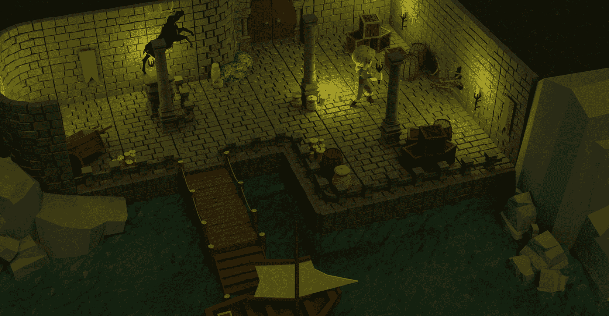

图 9.1 – 我们将为克拉拉构建这个小型关卡

我们的世界将包括一个位于洞穴内部且通往海洋的码头。当克拉拉锚定她的船时，她可以看到洞穴内部。一开始并没有多少光线，但她能看到的最少，码头通向一个铺有石头的码头。她还可以看到到处分布着一些箱子、桶和罐子。尽管墙壁上的壁灯在游戏运行时将开始未点亮，如图 9.1 所示，但你可以看到墙壁上的所有壁灯都是点亮的。这是因为我们想向你展示游戏的后期阶段，以便你能看到我们追求的目标。否则，它将是一个黑暗的轮廓。

在*第十章*《利用光线和阴影使事物看起来更好》中，我们将探讨如何通过使用适当的灯光类型并启用阴影来创建一个更具戏剧性的级别。我们已经在*第四章*《调整相机和灯光》的 Blender 环境中讨论了一些内容，但我们也将在 Godot 环境中进行操作。

级别设计、游戏设计和视觉设计之间的比较

如果你是对游戏开发新手，那么你可能会遇到一些令人困惑的名称。单词*设计*就是这样的一个例子，因为它通常意味着人们看到的东西。然而，实际上，它意味着一种时尚，或者是一种做或构思某事的方法。让我们在正确的上下文中讨论它。

我们本可以设计一个不同的级别，以便在码头尽头的门处提供挑战性的通道。也许光线条件如此之差，以至于克拉拉需要一些帮助才能看到重要的线索。为了在游戏中取得进展，游戏设计规则将定义玩家如何与世界互动。也许玩家只需点击世界中的游戏对象就足够了，而有时，拥有一个库存和制作系统会更好。

最后，视觉设计与前两个设计概念无关。洞穴墙壁仍然是洞穴墙壁，但它们可能看起来超现实主义，你可以感觉到石头是潮湿的，覆盖着苔藓。这会给游戏增添什么，并使其变得有趣？因此，所有这些设计原则同等重要，但又各不相同。

该级别，`Level-01.blend`，位于本书 GitHub 仓库根目录下的`Blender Models.zip`文件中。你很可能需要将其打开，以便在 Godot 中构建级别时将其作为参考。

我们将开始构建级别，通过布置它的不同部分。说到这一点，我们必须遵循以下步骤来构建我们的第一个级别：

1.  在`Scenes`文件夹中创建一个新的场景，并将其保存为`Level-01.tscn`。

1.  将一个**Spatial**节点作为根节点，并将其重命名为**Level-01**。

1.  在根节点内部创建更多具有以下节点名称的**Spatial**节点：

    +   **地板**

    +   **柱子**

    +   **墙壁**

    +   **轨道**

    +   **沉没的墙壁**

    +   **道具**

    +   **岩石**

    +   **壁灯**

    +   **码头**

我们将使用这些子**空间**节点来存储级别的不同部分，因为在这个非常小的级别中，我们最终会有很多部分。以下截图显示了我们的最后努力后的节点结构：

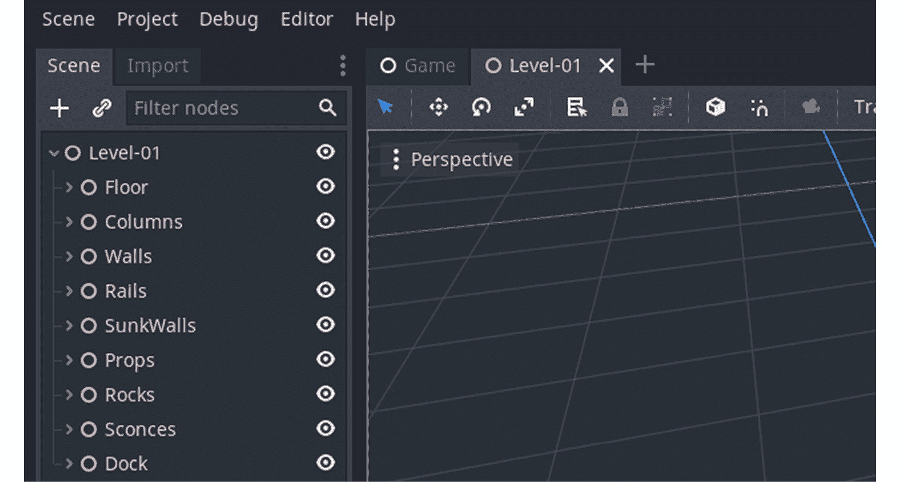

图 9.2 – 不同级别的结构被分组在许多空间节点下

在这些**空间**节点内部，我们将放置级别的相关部分。例如，地板块将放入**地板**节点。我们可以通过以下方式轻松放置我们的第一个资产：

1.  在**场景**树中高亮显示**地板**节点。

1.  点击顶部的链形图标以在您的高亮节点内实例化另一个场景。或者，您可以按*Ctrl* + *Shift* + *A*。

1.  在弹出窗口的**搜索**部分中输入`Floor_Standard`。

1.  从**匹配**部分选择`Floor_Standard.glb`，如图下所示。

这将在**地板**节点内创建`Floor_Standard.glb`的实例：

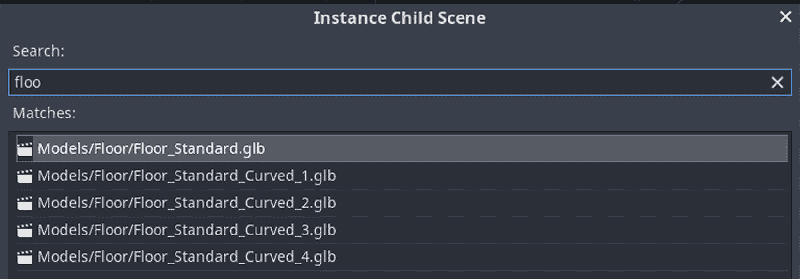

图 9.3 – 您需要使用搜索区域来过滤掉不需要的匹配项

你可能已经注意到，尽管我们原本希望继承一个应该具有`.tscn`文件扩展名的场景，但相反，我们实例化了 glTF 文件。在*第七章*，“将 Blender 资源导入 Godot”，我们学习了如何从 glTF 文件创建场景。因此，我们可以那样做，创建一个`Floor_Standard.tscn`场景，然后在该场景内部实例化**地板**节点。我们采取了捷径。创建场景在你打算添加除了模型结构本身以外的其他元素时很有用。对于地板，我们不需要额外的元素，所以只实例化其 glTF 版本是可以的。

另一方面，当我们创建我们的级别时，直接实例化 glTF 文件将不再适用。例如，在下一章处理灯光和阴影时，从烛台模型创建场景并添加一个灯光对象到同一场景中会更有意义。因此，烛台场景将负责显示 glTF 模型以及包含一个灯光对象，以便它可以后来编程地打开或关闭。如果您只想显示模型，而不需要更多东西，实例化 glTF 文件通常就足够了。

添加第一块后，它将自动选中。如果不是，您可以在 3D 视图中单击地板块或在高亮节点中高亮显示**场景**树中的节点。一旦选中，您将看到一个位于模型中心的操纵杆，让您可以移动和旋转该部件。如果您的视图已经旋转，您的操纵杆方向可能看起来不同。以下截图显示了我们所期望看到的一个示例：

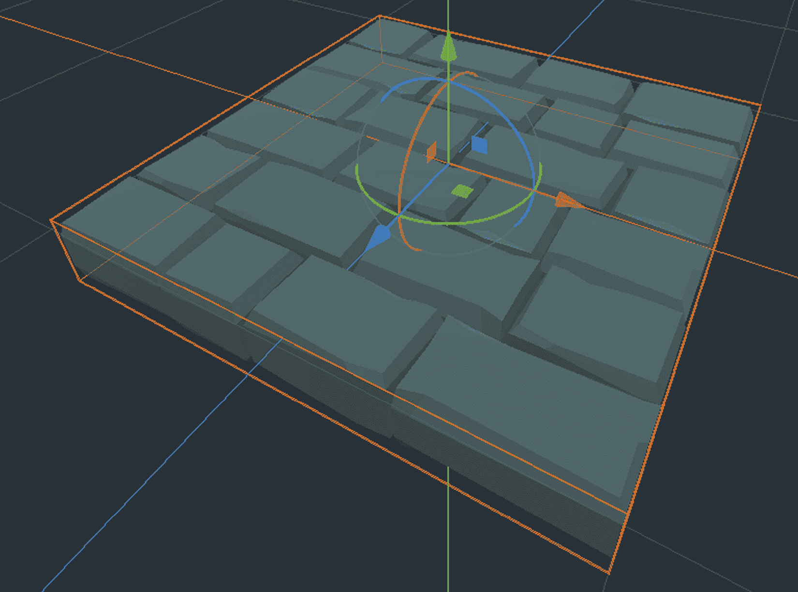

图 9.4 – 移动和旋转对象的工具

我们试图布置的平面图由更多标准的地面块组成。因此，获取额外块的一个简单方法就是复制现有的块并将它们移开，如下所示：

1.  在**场景**树中选择**Floor_Standard**节点。

1.  通过按*Ctrl* + *D*来复制它。

1.  通过在工具中拖动蓝色或红色轴来移动新的地板块。

这将在场景中添加一个新的地板块并将其移动。我们故意忽略绿色(*Y*)轴，因为我们不希望地板在这个时候有任何高度。然而，对于你的游戏，你可以设计具有不同高度区域的水准，并通过楼梯连接它们。

由于我们的平面图看起来像是一个网格，所以地板块能够相互对齐会很好。我们可以通过在*XZ*平面上移动块并在精确增量上限制它们的移动来实现这一点。为了模拟这一点，删除你最近创建的最新的地板块，然后执行以下操作：

1.  复制一个新的**Floor_Standard**节点。

1.  按住*Ctrl*键，并使用 X 或 Z 工具箭头移动块两个单位。

为什么我们移动了两个单位？因为模型设计成适合一个 2 x 2 米大小的网格。你可以打开相关的 Blender 文件来观察尺寸。我们在 Godot 中不进行测量，但它仍然尊重 Blender 中设置的缩放和单位方面。这就是为什么我们确保模型的缩放设置为`1`。如果你需要提醒，我们建议你阅读*第六章*的*应用旋转和缩放*部分，*导出 Blender 资产*。

在实施最新的带有对齐功能的移动块指令后，你将得到以下输出：

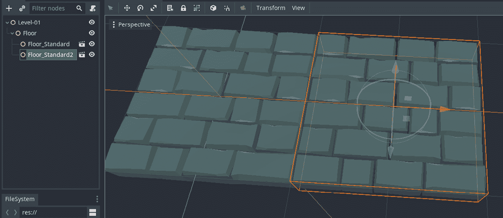

图 9.5 – 新地板块紧挨着旧的一个

目前要做的只剩下复制足够的地板块，并使用对齐功能移动它们。此外，你还需要在**地板**节点内实例化和放置两个新的模型：

+   `Floor_Standard_Curved_1.glb`

+   `Floor_Standard_Curved_4.glb`

这些弯曲的地板块可以适应弯曲的墙壁，这意味着我们可以保持建筑的一致性。通过复制足够的地板块和添加新的弯曲块，并在移动块之后，我们将实现以下输出：

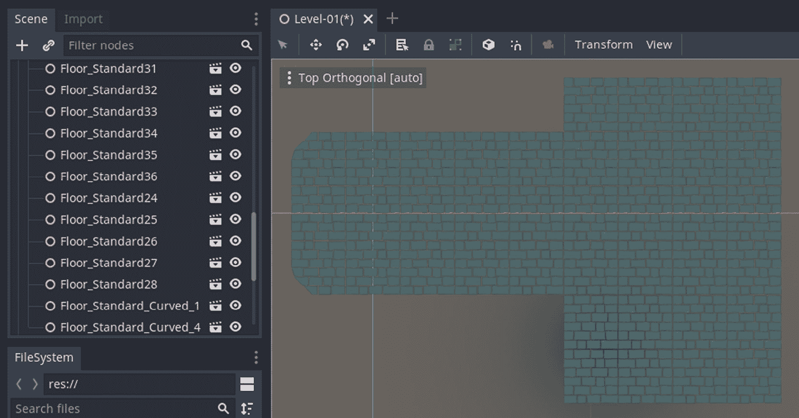

图 9.6 – 添加了两种新类型后，地板已准备就绪

所有地板块现在都位于场景中的**地板**节点下，这项工作完成了我们构建地板的任务。我们将采用类似的方法在单独的**Spatial**节点下布置洞穴的其他部分。

## 建立墙壁

在构建水平面时，下一步的工作是搭建墙面部分。你可以通过在 **墙面** 节点下实例化墙面部件来完成，这与放置地板部件的方式类似。为了不重复提供非常相似的说明，我们将使用本节来突出你可能会遇到的一些特殊情况。

例如，你最终可能想要放置一些在角落处连接的墙面部件。因此，你需要将其中一个部件绕其 *Y* 轴旋转 90 度。你可以通过使用工具或通过在 **变换** 部分的 **检查器** 面板下输入确切的值来完成这个操作。

另一种情况是，墙面上有一个洞，让许多树枝爬进了码头区域。这是你在 *图 9.1* 右侧可以看到的细节。我们建议使用 `Wall_Hole.glb` 来处理该区域的水平面。同样，`Curve.glb` 应该放置在我们已经建立的弯曲地板部件上方。

虽然从技术上讲门不是墙面，但我们可以说拱门和门可以与其他墙面部件相协调。毕竟，它们在概念上属于同一个结构。因此，对于那个部分，你可以使用以下部件：

+   `Wall_ArchRound_Overgrown.glb`

+   `Arch_Round.glb`

+   `Doors_RoundArch.glb`

最后，当你把所有的墙面部件摆放好之后，你可以复制它们并将它们在 *Y* 轴上向上移动两个单位。这样，墙面就会和拱门和门的高度一致。完成这一步后，你的地板应该看起来就像下面截图所示：

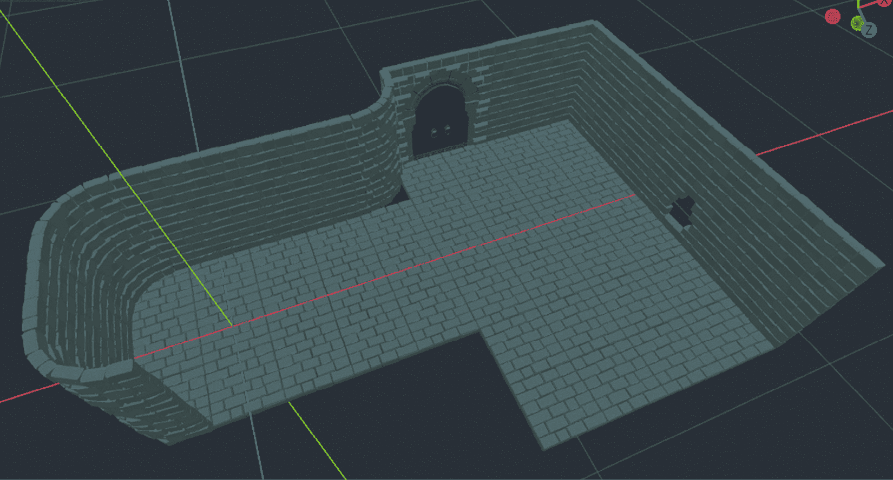

图 9.7 – 水平面开始看起来更像我们的参考图片

如你所注意到的，在门附近的弯曲墙面部件旁边地板上有一个缝隙。我们将通过巧妙地放置两株绿色植物来填补这个缝隙。否则，你可能需要为这种边缘情况准备一个地板部件。无论如何，都是可以的，并且来回在 Blender 和 Godot 之间完成缺失的部分也是这个过程的一部分。

由于我们一直在处理墙面，我们可以通过使用额外的墙面部件来模拟水平面与洞穴中的海水相遇的部分。

## 沉入墙面

看起来这个地方的建筑师费尽心思，用石砖铺就，以防止自然侵蚀地板下面的东西。真聪明！

为了实现建筑师的想法，你可以利用标准墙面部件在地板与水连接的地方创建一个帘幕状的结构。最终，当你将这些部件放置在 **场景** 树中的 **沉入墙面** 下时，你会看到下面截图所示的内容：


图 9.8 – 使用相同的墙面部件防止水从下面渗漏

现在将海浪的起伏控制在一定范围内。请注意，我们不想让沉没的墙壁部分完全围绕地面。这是因为你可以始终限制摄像机角度，不显示结构的背面。这是一种保持资产数量低廉的方法。然而，如果你想给玩家充分的自由，让他们可以围绕整个结构旋转，你可能需要改变你的关卡设计以适应这一点。我们将在*第十二章*中调查摄像机设置，*通过摄像机和角色控制器与世界交互*。目前，我们仍然需要完成我们的关卡。

## 放置岩石

由于我们目前关注的是靠近水的地方，让我们在场景中添加一些岩石。在这个级别的 Blender 文件（`Level-01.blend`）中，你会看到单个的岩石。它们已经被组织起来，以产生岩石群落的错觉。在 Godot 中采用类似的方法，将特定的岩石放置到场景中也是完全可以的，更具体地说是在**岩石**节点下。

然而，有一个更简单的方法。如果你从 Blender 中导出左右岩石群落作为一个单一物体，这是完全可能的，这就是为什么我们为你准备了两个文件：

+   `RocksLeft.glb`

+   `RocksRight.glb`

你可以实例化这两个文件，并使用变换工具自由移动实例。这意味着你不需要使用快速移动功能。将岩石的位置调整到你认为最好的地方。

谈到在不使用快速移动功能的情况下移动资产，或许我们可以多练习一下。由于地面看起来很空旷，现在是时候讨论一些补充设计元素，比如道具。

## 道具分布

道具是一种作为支撑元素的物体。道具也常被称为必要的杂乱，因为它们完成了装饰。否则，当东西看起来太干净时，对眼睛来说就不那么愉快了，我们开始注意到重复的图案或不必要的细节。

相反，我们希望体验场景的人感到舒适。这也是设计师们将重要元素隐藏在明显之处的一个好方法。为此，我们将使用以下道具列表，并将这些资产分布在整个场景中：

+   `Barrel.glb`

+   `Backpack.glb`

+   `Bush_Round.glb`

+   `Candles_1.glb`和`Candles_2.glb`

+   `Cart.glb`

+   `Crate.glb`

+   `DeadTree_3.glb`

+   `Flag_Wall.glb`

+   `Pot1.glb`, `Pot2.glb`, `Pot3.glb`及其破损版本

+   `Statue_Stag.glb`

一旦你完成了道具的移动，你的场景将看起来如下：

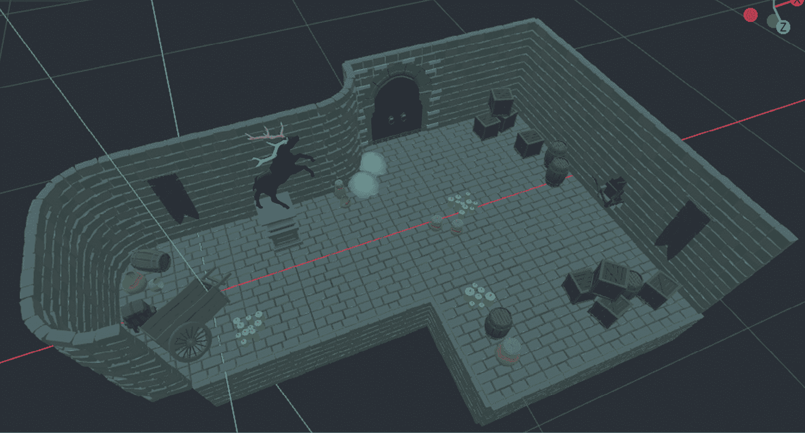

图 9.9 – 道具已经分布在整个码头周围

当你忙于这件事时，你不妨实例化 `Column_Round.glb`，再复制两个，并将它们放在 `Rail_Corner.glb` 和 `Rail_Straight.glb` 下方，这些可以沿着边缘和靠近鹿雕像放置。你不必对这些对象做到像素级精确，但如果你想更精确，可以使用 `Level-01.blend` 作为参考。

## 完成关卡的其他部分

为了完成关卡，我们需要放置壁灯并建造一个码头。这些资产与您在其他地方实例化和移动的资产没有不同。

然而，放置码头部件可能会在定位方面让你有些困惑。你可能发现楼梯部件在尺寸上看起来有些不合适。有时，资产被设计成通用的，而有时，资产会被设计成可以无缝地与其他模型配合或连接。无论如何，由于在 Godot 中可以调整最终位置，我们可以从这些小问题中恢复过来。

为了模拟我们如何处理这个问题，我们将向您提供我们用于两个部件位置的**平移**值：

+   `4`, `-1`, `5.5`

+   `4`, `-1.5`, `8.9`

由于你无疑是在以对你来说自然的方式移动关卡部件，你的值可能会有所不同。如果你的数字与我们的示例不匹配，请不要担心。我们想指出两个结构之间的相对差异。你也可能有一个数字在一个轴上相同，无论是**X**还是**Z**轴。此外，我们根据经验推测，你的楼梯的**Y**值可能比我们的低 0.5。这将导致一个看起来像是一个整体设计的码头结构。如果你想有一个更高的码头，你可以复制楼梯并相应地移动它。这就是有单独部件的好处。

我们建议您在此处将船模型添加到**场景**树中的**码头**节点下，因为它可以被认为是码头区域的一部分。这标志着我们关卡的建设完成。它应该看起来如下：

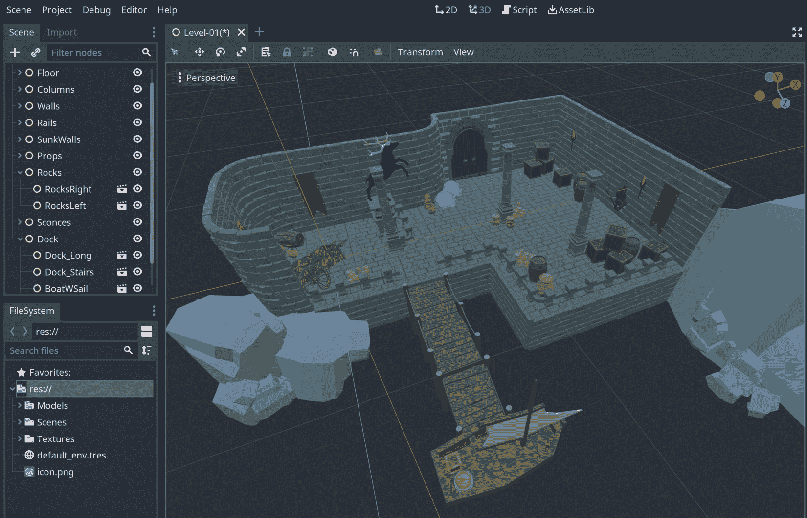

图 9.10 – 该关卡已在 Godot 中重建

尽管我们声称关卡的建设已经完成，但你可能已经注意到有一些看起来很奇怪的东西。我们有一个没有水的码头区域——门旁边那些丑陋的圆形东西是什么？我们将在下一节中找出如何解决这个问题。

# 构建缺失的材料

当我们放置道具时，我们通过放置灌木道具来覆盖门附近的缝隙（这可以在*图 9.10*中看到）。然而，那些灌木有点尴尬。同样，门上的拱门在石头砖块上挂着一些看起来很奇怪的东西。它们应该显示绿色植物和叶子，但我们只有一片平淡的灰色表面。我们将在本节中修复这些问题。

此外，虽然从 Blender 导出单个模型并将其放置在 Godot 场景中是有意义的，但导出水体就没有意义了。即使在 Blender 中，那个对象也是一个应用了模拟水效果的着色器的平面。我们将在 Godot 中重新创建那个效果。

## 修复叶子

首先，让我们描述一下灰色叶子的问题。其他所有模型似乎都正确显示了它们的材料。尽管有所有的意图和努力，某些事情在应用程序之间永远无法完全传递。叶子就是这样。不过，为了得到更详细的答案，我们需要稍微技术化一些。

你会如何设计一个 3D 叶子？由于叶子边缘有很多细节，如果不使用足够的顶点，很难显示那么多细节。为了保守起见，你可以使用顶点最少的对象，并将透明的叶子纹理应用到这个基本对象上。以下截图显示了这种方法的应用：

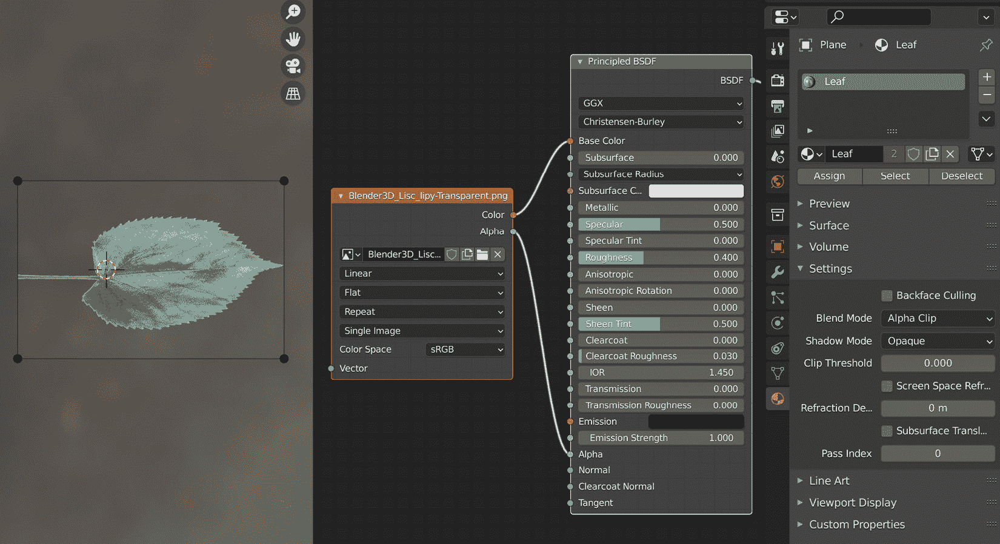

图 9.11 – 一个透明的文件被用作矩形形状的纹理

上述截图显示了一个非常简单的着色器。纹理的 alpha 值连接到了着色器的**Alpha**插槽。此外，在材料的**设置**下的**混合模式**被设置为**Alpha 剪辑**。这意味着纹理的 alpha 部分将被从结果中裁剪出来。我们需要在 Godot 中做类似的事情。

不幸的是，Godot 不会自动理解并开启导入材料的透明度。我们将不得不做一些手动工作来正确显示叶子。幸运的是，这也会让你熟悉**检查器**面板中的材料和它们的设置。

让我们从寻找灌木的材料开始。`模型`文件夹以保持不同模型分别放在单独文件夹中的方式组织。因此，在`Texture_Leaves.material`项目下扩展`灌木`文件夹。这将使**检查器**面板中出现该材料的属性。有很多东西可以查看，但我们只需要调整几个地方：

1.  扩展**旗帜**部分。

1.  打开**透明**设置。

1.  扩展**反照率**部分。

1.  将`Leaf_Texture.png`从`纹理`文件夹拖放到**纹理**字段。作为替代，你也可以点击**纹理**字段并**加载**必要的文件。

如你所注意到的，材料的纹理缺失，因此灌木无法显示任何内容。其次，通过在标志中开启透明度，我们是在要求 Godot 尊重纹理文件的透明部分。如果你喜欢，可以打开和关闭它来查看差异。最终，我们的场景将如下所示：

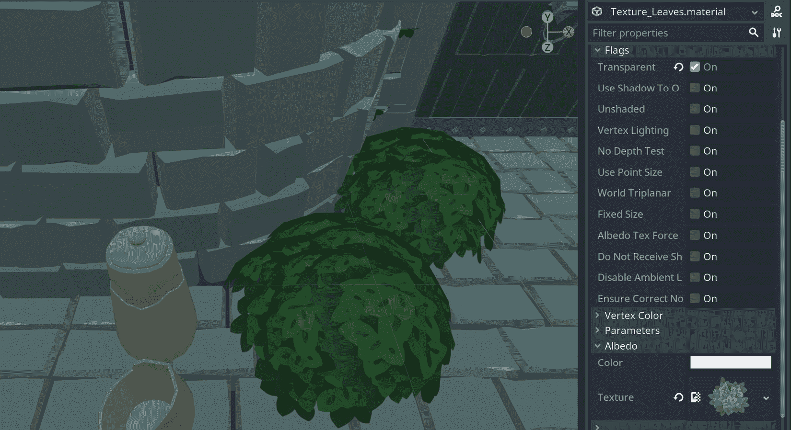

图 9.12 – 我们的灌木看起来又健康起来了

你可以为拱形模型做同样的事情，该模型位于`Models`文件夹内的`Architecture`文件夹中。这看起来可能像是你在重复自己，你是对的。由于我们正在保留使用相同 Blender 材质的独立模型，并将它们放在相关的文件夹中，因此材质也被复制了。关于这一点，在*第七章*的*决定如何处理材质*部分中提供了详细讨论，*将 Blender 资产导入 Godot*。由于这是一个组织问题，我们把这个决定留给你，但现在你知道如何启用材质的透明度。

我们材质拼图中缺失的另一块是水对象。我们故意省略了该区域的导出。对于大多数游戏开发者来说，编写着色器代码是进入危险水域。然而，这正是我们将要做的。希望你能看到没有什么可怕之处。

## 创建水

你如何建模水体？答案并不简单，甚至有点哲学。以下是对李小龙关于武术的著名哲学引言的致敬，其中用水作为类比：

“… 要像水一样无形无状。”

你把水倒入一个杯子，它就变成了杯子。

你把水倒入瓶子，它就变成了瓶子。…”

在 Blender 或 Godot 中想象我们应该创建和组织哪些顶点来表示水是很困难的。相反，我们给简单的对象，如平面或立方体，赋予水的特性，如反射、折射、波动和混浊。

因此，对于这项工作，我们通常依赖于着色器而不是 3D 模型。在本节中，我们将编写一个非常简单的水面着色器。最后，你可以使用我们示例中的着色器，或者在网上找到另一个示例。毕竟，那里有很多示例，因为创建一个合适的水面着色器通常取决于你的使用情况，有时一个解决方案并不适合所有人。

让我们从创建一个水对象开始：

1.  在**Dock**节点下放置一个**MeshInstance**节点，并将其重命名为**Water**。

1.  对于这个新对象，在**Inspector**面板中将**Mesh**属性分配给**PlaneMesh**。

1.  在**Size**中点击此处的`20`以设置**x**和**y**。

1.  `20`用于**Subdivide Width**和**Subdivide Height**。

我们很快就会解释这些数字的含义，但这里是你**Inspector**面板应该看起来像的：

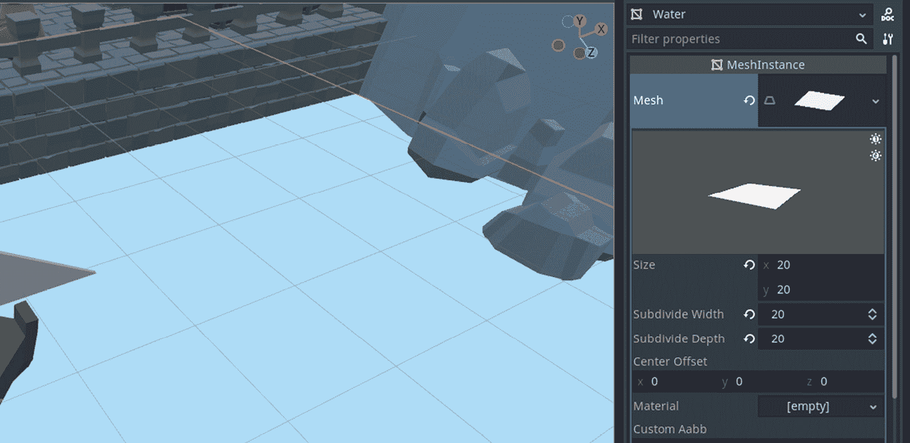

图 9.13 – 目前看起来相当灰暗的水体

上一张截图显示了**Inspector**面板中**PlaneMesh**的属性。我们就水平面尺寸选择了合理的尺寸。使用与移动其他对象时相同的 gizmo，将水对象放置在码头区域和整个场景中合理的位置。一旦我们编写了使这个灰色对象看起来像水的着色器，你可能还想调整它的**Y**位置。

此外，也许巧合的是，我们选择了**20**作为细分值。如果你想将平面分成更细小的部分，也可以，但像 20 这样的值将引入足够的顶点。所以，是的，你已经在 Godot 中有效地创建了顶点，而不是在 Blender 中这样做。

现在，我们可以改变这个灰色平面的外观了。为此，我们将为它创建一个材质：

1.  右键点击**FileSystem**中的`res://`项，选择**新建文件夹**。

1.  输入`Materials`并确认。

1.  右键点击**FileSystem**中的`Materials`文件夹，选择**新建资源**。

1.  搜索**ShaderMaterial**并确认。

1.  在即将出现的**另存为资源**屏幕中将其保存为`Water.tres`。

通常，新创建的项目将在**FileSystem**中的`Water.tres`中显示，并双击它。你会在**检查器**面板中看到一个带有白色球体预览的裸骨材质。它需要一个着色器来获得更类似水的视觉效果。以下是创建它的方法：

1.  右键点击**FileSystem**中的`Materials`文件夹，选择**新建资源**。

1.  搜索**Shader**并确认。

1.  在即将出现的**另存为资源**屏幕中将其保存为`cave-water.tres`。

在*第二章*中，*建筑材料和着色器*，我们讨论了着色器和材料之间的关系，以及它们是如何相辅相成的。这是在 Blender 中完成的，但这个概念是通用的。因此，我们在 Godot 中创建了一个材料和着色器。现在，我们必须将这两个关联起来：

1.  将`Water.tres`文件的属性拖放到**检查器**面板中的**着色器**属性。

1.  将`cave-water.tres`拖放到**检查器**面板中的**着色器**属性。

水材质现在已被分配了一个空着色器。在您完成以下步骤之后，我们将解释着色器代码：

1.  双击**FileSystem**中的`cave-water.tres`。

1.  在新展开的**着色器**面板中输入以下代码：

    ```cpp
    shader_type spatial;
    uniform sampler2D wave_pattern;
    uniform vec4 color:hint_color = vec4(0.19, 0.71, 0.82, 0.44);
    uniform float height_factor:hint_range(0,1.0) = 0.1;
    void vertex(){
        vec4 wave = texture(wave_pattern, UV);
        float displacement = sin(VERTEX.x * wave.x * TIME) 
          + cos(VERTEX.z * wave.z *  TIME);
        VERTEX.y += displacement * height_factor;
    }
    void fragment(){
        ALBEDO = color.rgb;
        ALPHA = color.a;
    }
    ```

我们编写的着色器代码向`uniform`语句公开了一些选项。这样，您可以修改材质的属性，就像您在*修复叶子*部分之前能够更改叶子材质的设置一样。那一个是带有许多选项的非常复杂的着色器。我们的着色器非常简单，只有三个参数：

+   用于创建随机性的波浪模式

+   水的颜色（默认为浅蓝色）

+   控制波浪运动的高度因子（默认为`0.1`）

其中两个属性具有默认值。我们将在本节稍后向您展示您可以选择的波浪模式，但首先，让我们解释一下所有这些背后的基本思想，因为这可能是有你第一次编写着色器代码的时候。

内置的 Godot 着色器函数

这两个函数，`vertex`和`fragment`，是内置的着色器函数。前者控制每个顶点将执行什么操作，而后者负责整体对象的外观。Godot 提供了更多默认函数；我们在**进一步阅读**部分提供了一个链接，供您探索。

由于`fragment`函数看起来足够简单，我们将首先介绍它。我们公开的一个属性，`color`，将在这个函数中使用，这样我们就可以用我们想要的颜色来绘制对象。因此，我们将输入颜色的红色、绿色和蓝色通道应用到着色器的`ALBEDO`属性。Albedo 是一个科学术语，表示颜色。在某些应用中，它也被称为**漫反射**或**基础颜色**，例如在 Blender 中。

自然地，我们希望我们的水对象具有一些半透明特性。为此，我们使用输入颜色的 alpha 通道并将其绑定到着色器的`ALPHA`属性。这是一个简单但有效的方法来创建透明度。说到这一点，如果您注释掉`vertex`函数，您仍然应该能够看到透明度，因为每个函数都负责一个主要方面。然而，当它们一起使用时，它们会相互补充。所以，现在是`vertex`函数的轮到了。

如果水体的身体能够上下移动一点，那将很棒。这就是为什么我们通过细分平面网格引入了更多的顶点。`vertex`函数将取每个顶点并改变其`y`值以创建上下运动。函数中的最后一行负责这一点。每个顶点应该改变多少呢？嗯，这取决于您的用例。然而，我们找到了一个似乎合适且足够吸引人的`displacement`值，以模拟这个洞穴中某种平静的水景。

在计算`displacement`时，我们使用一个纹理并采样其一些值。这将给顶点的移动方式带来随机性。为此，我们将每个顶点的`x`和`z`值与传入纹理的`x`和`z`值（`wave`）相结合。您可以改变这些属性的一些组合，并仍然得到类似的结果。也许更重要的是使用内置的`TIME`属性，它告诉 GPU 随着每一毫秒的过去而改变结果。从方程中移除`TIME`，一切都将一次性位移并静止不动。

最后，我们通过在材质设置中可调整的高度因子来调节`displacement`的强度。这就完成了我们的水着色器。着色器和材质已经连接，但我们还没有告诉**水**节点它应该使用哪种材质。要这样做，请按照以下步骤操作：

1.  在**场景**树中选择**水**节点。

1.  在**检查器**面板中展开**材质**部分。您会看到一个标签为**0**的槽位。

1.  将`Water.tres`从**文件系统**拖动到**0**槽位。

哇！现在码头应该有一个随时间调节的水对象。移动并缩放你的视口相机靠近下沉的墙壁，以注意到 alpha 效果。这看起来已经很不错了，但我们可以通过应用噪声纹理来进一步改进，这将增加顶点波动的方式的更多变化：

1.  在**检查器**面板中展开材质设置中的**着色器参数**部分。

1.  为**波浪模式**属性附加一个**新噪声纹理**。

1.  展开这个新纹理，并将其**新 OpenSimplexNoise**附加到其**噪声**属性。

这将增加顶点偏移的随机性。当你完成所有代码片段和调整后，你的**检查器**面板应该看起来如下：

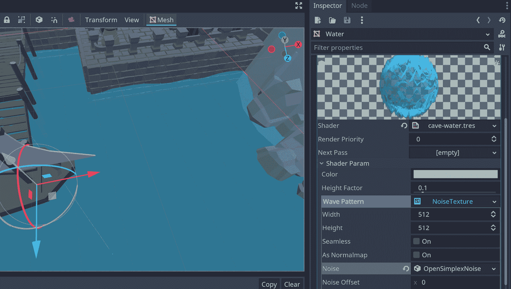

图 9.14 – 注意水在下沉墙壁上的透明度和波浪状

可以调整噪声的值以创建更剧烈的效果，但我们留给你自己去尝试。通过控制高度因子和颜色，你可以模拟更平静或暴风雨的水条件。有了这个，你就创建了一个重要的缺失功能。

关于保持着色器独立

在创建水材质时，你可以在**检查器**面板的下拉菜单中使用内存着色器为材质设置。大多数 Godot 功能通常是这样开始并保持的，但我们采取了不同的方法，首先创建资源，然后稍后分配它。多亏了这种方法，你可以创建不同的水着色器，并在需要时进行交换。

这样，我们就处理了放置所有必要的元素，甚至完成了缺失的部分，例如修复和/或创建新材料。然而，在创建布局时，你是否感觉像是在重复和移动许多相同的资产，尤其是墙壁和地板部件？我们打赌你确实是这样！所以，让我们介绍一个非常有用的 Godot 工具，如果你是网格布局，你可以轻松地布置东西。

# 在网格上放置模型

放置诸如蜡烛、罐子、桶等物体，短道具，以及地板和墙壁部件之间的主要区别在于，你可以随意分布前者的物体。它们不需要遵循模式，而地板和墙壁部件必须相互对齐。这种结构也被称为网格。

为了加快速度，我们甚至选择复制一个现有的部件而不是实例化一个新的，因为当你创建一个新的实例时，它将从场景原点开始，你需要将这个新部件移动到你的当前区域附近。你甚至可以一行选择多个瓦片，复制它们，并将这些瓦片紧挨着旧的一批。尽管有所有这些快捷方式，但由于这一切听起来都很公式化，可能需要一个更好的工具。**网格图**来拯救！

如果你已经使用过 Godot 进行 2D 开发，你可能已经熟悉了**TileMap**节点。**GridMap**与它相同，只是它在 3D 中工作。因此，**TileMap**将允许你在场景中添加精灵，而**GridMap**将使用网格。对于那些从未使用过**TileMap**节点的人来说，Godot 中的这两种机制都负责使用一组瓦片或网格。

手动放置的优点

我们提供的**GridMap**解决方案不仅是为了让你加快创建关卡的速度。由于这些部件是重复的，GPU 将优化这些部件的渲染，你将获得更高的帧率。这对于游戏开发者来说通常是一个非常受欢迎的结果，尤其是当你的关卡变大，场景中使用的对象数量开始变得重要时。

在本节中，我们将介绍**GridMap**节点的通用设置。尽管这个节点依赖于**MeshLibrary**来完成其工作，但在这一点上理解个别设置比混合两者更有意义。我们将在*利用网格库的优势*部分学习如何创建和利用**MeshLibrary**。

为了保存和比较我们到目前为止所做的工作，我们将放慢一些：

1.  将`Level-01.tscn`保存为`Level-01-Gridmap.tscn`。根节点仍然可以是**Level-01**。

1.  添加一个**GridMap**节点，并将其重命名为**FloorGridMap**。如果你愿意，你可以拖动这个新节点，使其成为**Floor**节点之上的第一个子节点。

1.  通过按眼睛图标关闭**Floor**节点。

最后的几个动作将向场景中引入一个**GridMap**节点。目前它是空的，但当我们了解网格库时，我们会用地板块填充它。你的场景将如下所示：

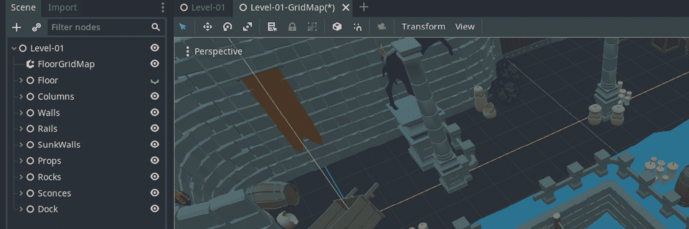

图 9.15 – 将很快通过 GridMap 引入缺失的地板块

尽管我们缺少网格库，但我们有一个**GridMap**节点，我们可以查看**检查器**面板中的属性。我们建议你现在选择**FloorGridMap**并继续阅读。我们将在这里提供的信息将为你在未来选择网格设置奠定基础。

对于一个单元，全部为`2`。幸运的是，我们的地板块是 2 x 2 x 2 米。所以，在我们的情况下，我们不需要更改这些值。在你的未来项目中，你可能需要将这些值与你的模型尺寸相匹配。

我们将忽略**八分位大小**设置，因为它是为更高级的情况而设，在那里你可以进一步增加优化。也许更重要的是，三个用于在任意轴上对齐单元内网格的中心的开/关开关。我们很快就会使用这个功能，但下面的截图应该能帮助你看到我们到目前为止所讨论的内容：

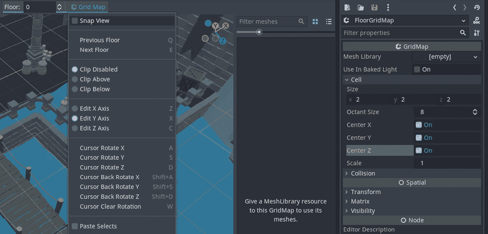

图 9.16 – 每个网格地图都可以有设置来定义它将使用的块尺寸

前面的截图还显示了当你点击视口顶部的**网格地图**按钮时展开的菜单及其选项。在这些选项中，带有*S*快捷键的**光标旋转 Y**可能是你使用最多的一个。我们在*创建洞穴*部分之前放置的地板块都遵循相同的方向。我们试图用道具覆盖地板以打破单调，但将地板块绕**Y**轴旋转 180 度将是一个另一种解决方案。

现在理论知识已经建立，让我们继续探讨使用**网格地图**的实际应用。在下一节中，我们将创建一个网格库，我们将与我们的**地板网格地图**一起使用，以填补缺失的地板块。

# 利用 MeshLibrary

当你点击**地板网格地图**以调查其属性时，Godot 界面略有变化，并通知你应该分配一个**网格库**，因为没有它，**网格地图**将无效。在本节中，我们将向您展示创建**网格库**的过程。我们还将讨论你可能会面临的挑战，不是技术上的，而是工作流程上的。

创建**网格库**有两种方式。我们将向您展示最常见的方法，因为另一种方法涉及在文件系统中单独保存网格，而我们的项目尚未设置以适应这种情况。无需多言，这就是创建网格库的方法：

1.  开始一个新的场景，并将其保存为`Floor-MeshLibrary.tscn`在`Miscellaneous`中。

1.  选择一个**空间**节点作为其根节点。

1.  在**场景**面板下**空间**节点下实例化**Floor_Standard**。

1.  点击 Godot 顶部菜单中的**场景**按钮。

1.  展开**转换为**并选择**网格库**。

1.  将你的网格库保存为`Floor-MeshLibrary.tres`在`Miscellaneous`中。

如果你直接将地板块拖放到视口中，它会根据你的鼠标光标位置在场景中的某个地方放置。例如，地板可能看起来很小，因为它离你很远。将位置归零应该将对象放置在世界的中心，并使其更靠近。如果你将块拖放到**场景**树中，就不会有这个问题。

以下截图显示了 Godot 将你的场景转换为网格库之前的那个状态：

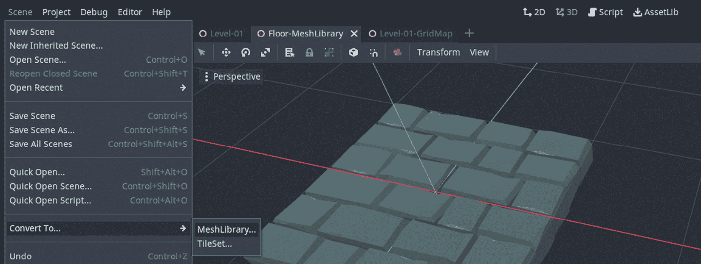

图 9.17 – 我们正在将场景转换为网格库

现在我们已经在库中有一个地板块了，我们可以再添加一个模型。这里的目的是堆放具有相似尺寸的物品。这可能听起来有些令人困惑，但让我们添加弯曲的墙壁。为什么？因为尽管墙壁通常更薄更高，但如果你考虑弯曲墙壁占据的体积，它与地板块并无不同。它的底部尺寸相似。

假设`Floor-MeshLibrary.tscn`仍然打开，以下是您如何向同一库中引入另一个模型的方法：

1.  在**文件系统**中找到`Curve.glb`墙壁块。

1.  将它拖放到**Spatial**上。

1.  将你的场景转换为`Miscellaneous`。

这个操作将在新引入的块和旧的地面块旁边添加，并更新网格库。因此，创建网格库的一个简单方法是从一个新的场景开始，添加尽可能多的模型，然后将这个充满模型的场景变成一个网格库。

我们还没有关心这些块将去哪里。我们只是选择单独的块作为装饰网格的候选者。现在，让我们将网格库与**FloorGridMap**关联起来，并开始摆放一些模型。

## 使用网格地图的网格库

到目前为止，我们一直在准备一个用于**FloorGridMap**的网格库。这个库里面有两大块。我们将首先使用地板块，然后看看是否使用曲线块也合理。

要使**网格地图**工作，您需要在**检查器**面板中填写其**网格库**属性。让我们先处理这个问题：

1.  在**场景**树中选择**FloorGridMap**。

1.  将`Floor-MeshLibrary.tres`从`Miscellaneous`拖放到**检查器**面板中的相关字段。

这将显示所有可用的模型作为缩略图在预留的**网格地图**界面中，如图所示：


图 9.18 – 网格库现在可以被 FloorGridMap 使用

剩下的只是点击其中一个缩略图——例如，**Floor_Standard**——并将鼠标移到视图中。你应该会在光标下看到所选模型的预览。如果你点击可以看到预览的地方，它就会变成永久。试几次。

这难道不是比你自己摆放所有地板瓷砖要容易得多吗？但是等等——你很可能会注意到有些地方看起来有点奇怪。好像地板块并没有放在它们应该放的位置。它们相互吸附，但似乎并不完全尊重旧的坐标。它们要么升高，穿透墙壁块，要么位于墙壁之外。

这是在你使用网格地图时经常会遇到的事情。解决方案很简单，但请记住，这实际上也不是一个问题。这取决于你为你的模型设置的起点。所以，是的，起点是你可能即使导出模型后也要处理的事情。因此，你可以通过回到 Blender 内部重新导出你的模型来修复你的起点，或者使用**检查器**面板中提供的选项之一。

目前，让我们尝试切换以下**单元格**设置：

+   **中心 X**

+   **中心 Y**

+   **中心 Z**

没有固定的公式来确定这些属性是否应该开启或关闭。这取决于在网格库中使用的模型。例如，网格库中的**曲线**部件其原点位于一个角落，而地板部件从几何学上讲位于中间。由于整个网格地图只有一个**单元格**设置，你必须有一种标准的方式来处理网格库中的所有模型。因此，这不仅仅是随意堆放一堆模型——这是关于以尊重单元格的方式存储它们，从而形成一个网格结构。

为了可视化我们正在讨论的内容，你可以尝试将网格库中的**曲线**部件放置到场景中。你会注意到你需要重置中心设置，但这也会将地板部件重置到有争议的位置。因此，这是你必须计划并确保你的对象具有相似的原点以及相似尺寸的事情。

清除单元格

你已经知道点击鼠标左键会将网格库中预览的物品放置到场景中。如果你需要从场景中移除现有的单元格，你可以右键单击它并移动鼠标。如果你恰好有相同的模型处于预览模式，从场景中移除单元格但不在其他地方移动光标可能会给人一种你没有移除任何东西的印象。所以，记得在清除单元格后晃动鼠标。

## 使用多个网格地图的必要性

要么是因为你的模型尺寸不同，要么是因为原点不一定对齐，你最终会注意到你需要在场景中使用不同的网格地图。由于每个网格地图都可以有独立的**单元格**设置，完全有可能在这些网格地图之间使用相同的网格库。

在这种情况下，你将方便地创建一个网格库来存储所有类似的项目——例如，所有建筑元素——但只为正确的网格地图使用一些模型。这比创建单独的网格库要省力得多。

## 总结

使用网格地图是将遵循模式的对象进行分布的一种便捷方式。决定使用它有时是一个自然的过程。大多数人通常从单独放置物品开始构建他们的关卡。这通常是在他们没有使用现成的关卡设计软件时。因此，创建关卡的过程是在你以自然的方式移动物品的同时发生的，类似于移动家具而不是使用平面规划器。

因此，无论是您早期决定还是感到需要切换到它，使用网格图将使您的生活更轻松。话虽如此，当前版本的 Godot 中网格图和网格库充满了错误。例如，将新模型添加到您的网格库场景中，然后将其导出为库，并不总是更新现有库中的新模型。有时，库中的早期项目会被较新的模型所替换。因此，它相当不一致。希望 Godot 的第四版将消除所有这些问题。

我们希望全面介绍创建关卡的不同方法。因此，介绍**GridMap**节点似乎是必要的，尽管它可能存在缺陷。这样，当社区在未来实现这个工具且无错误时，您就会知道这样一个方便的工具将会可用且有用。

# 摘要

本章是众多帮助您构建游戏章节中的第一章。为了开始，我们处理了游戏的设计层面。

这个努力包括放置构成克拉拉将体验的环境的许多元素。对于相邻的结构，您学习了如何利用吸附功能，但您也可以在分配道具的情况下无忧地装饰场景。最终，您拥有了一个干净的场景结构，对象被分组在**场景**树下的相关节点下。

在这个过程中，您注意到一些材质要么配置不当，要么根本缺失。为了修复这些问题，您不得不深入到**检查器**设置中的材质，以解决透明度问题。此外，您在 Godot 中编写了一个着色器来模拟水体。

考虑到您迄今为止所学的内容以及您可能设计更多具有网格图案的关卡的可能性，我们介绍了 Godot 的**GridMap**节点。为了能够使用这个方便的工具，您还学习了如何创建**MeshLibrary**。尽管这种方法有其好处，但目前它是损坏的，但这是您可以在 Godot 的未来版本中使用的。

因此，关卡已经完成到您可以开始添加一些元素的程度，随着您的需要逐步添加。尽管如此，一切看起来有点单调。在下一章中，我们将学习如何通过灯光、阴影和环境效果使关卡看起来更华丽。

# 进一步阅读

游戏关卡设计并不总是涉及在游戏世界中放置物理元素。有时，它意味着吸引人的音效设计，隐藏与世界观和故事相关的可爱或有意思的背景元素，以及添加玩家可以与之建立联系或简单地讨厌的非玩家角色。设计良好的关卡有一个完整的心理因素层面，以便你可以唤起你希望玩家感受到的情感。如果你想在这个领域提升你的知识，你将不得不检查那些不一定与游戏引擎相关的资源。所以，拓宽你的视野！以下是一些可以帮助你开始的资源：

+   [`www.worldofleveldesign.com`](https://www.worldofleveldesign.com)

+   [`www.pluralsight.com/courses/fundamentals-professional-level-design`](https://www.pluralsight.com/courses/fundamentals-professional-level-design)

+   [`www.cgmasteracademy.com/courses/46-level-design-for-games/`](https://www.cgmasteracademy.com/courses/46-level-design-for-games/)

+   [`www.edx.org/course/introduction-to-level-design-2`](https://www.edx.org/course/introduction-to-level-design-2)

在本章中，你需要编写一个水面着色器。与着色器一起工作通常被描述为游戏开发者中最不有趣或最令人困惑的经历之一。我们将提供两个链接，以便你熟悉这个主题。前者是官方 Godot 文档，它应该有助于你在项目中产生更直接的结果，而后者应该对长期需求更有用：

+   [`docs.godotengine.org/zh/stable/tutorials/shaders/`](https://docs.godotengine.org/zh/stable/tutorials/shaders/)

+   [`thebookofshaders.com/`](https://thebookofshaders.com/)
