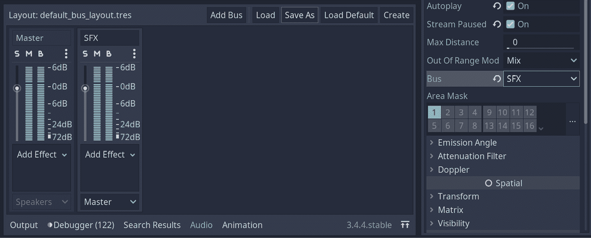
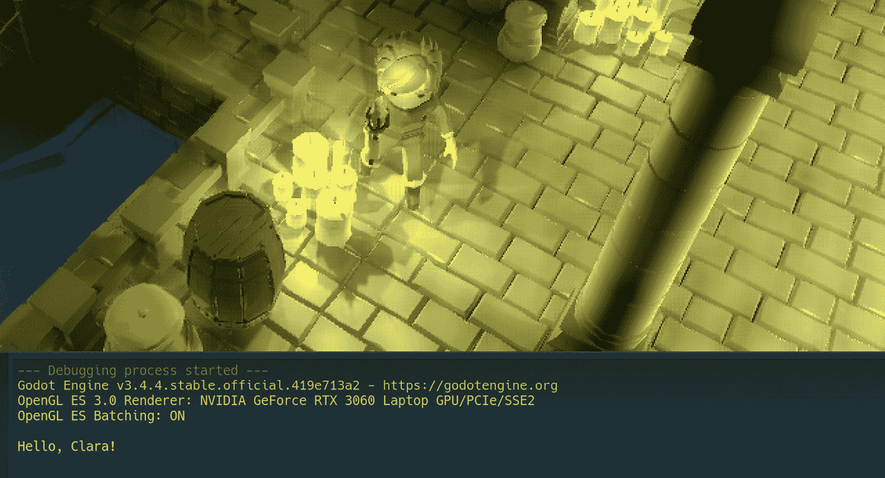
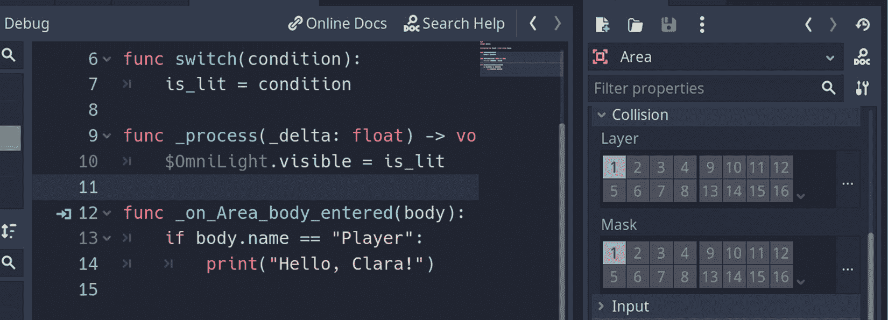
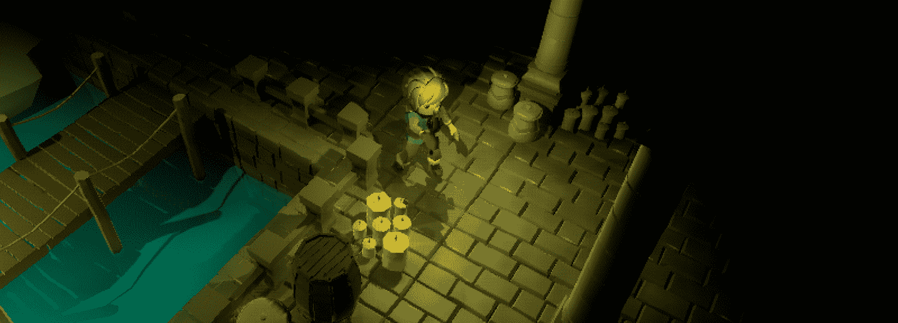
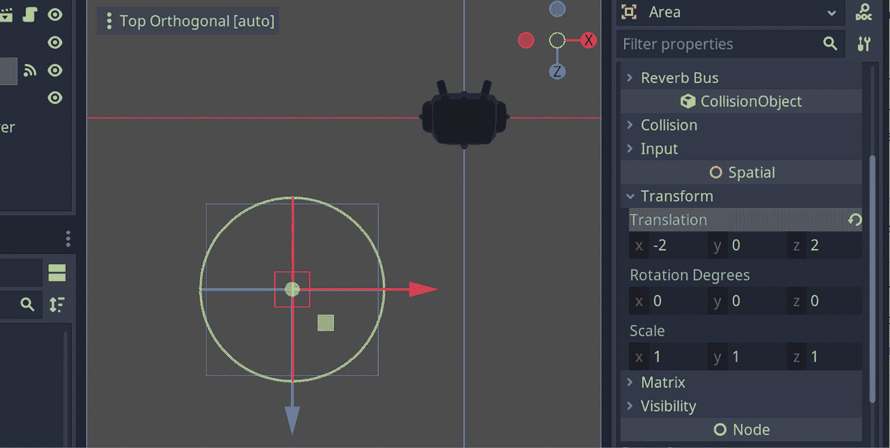
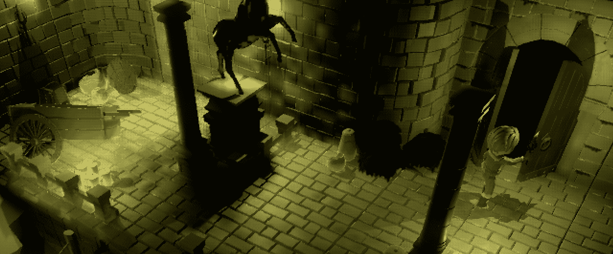
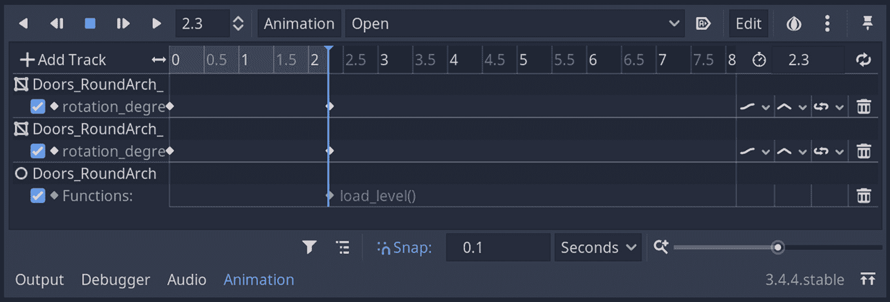
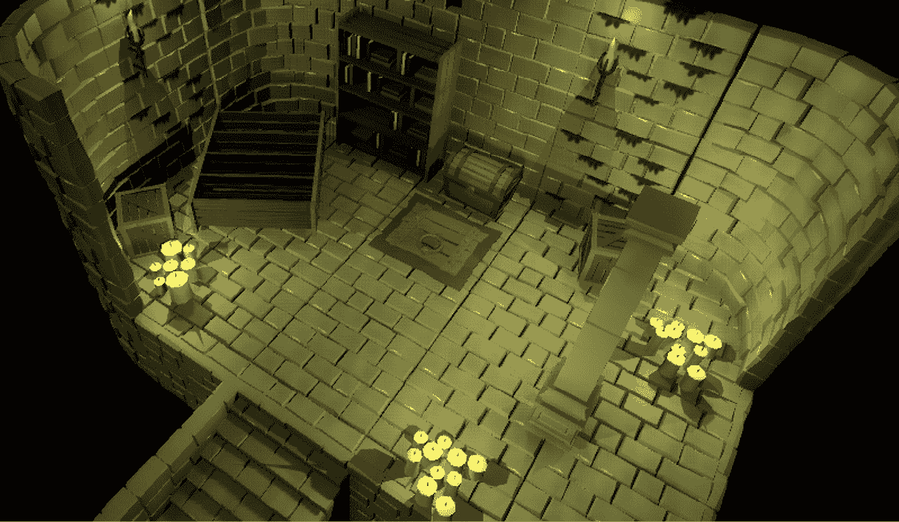

# 以声音和动画结束

我们已经进入冲刺阶段。我们最初在*第九章*，*设计关卡*中开始的努力，通过使关卡在*第十章*，*使用光影使事物看起来更好*中看起来更有趣，这使我们能够在*第十一章*，*创建用户界面*中实现基本用户界面。我们在*第十二章*，*通过摄像头和角色控制器与世界交互*中构建了新的机制，这样我们就可以与我们创建的世界进行交互。因此，克拉拉现在能够按下她叔叔留下的羊皮纸，她也可以四处走动。这一切都很不错，我们可以通过细化一些粗糙的边缘来更进一步。

这里很安静！当她走动时，我们应该触发一个音频文件，以模拟她的脚步声。在此同时，我们还将添加背景音乐和效果，以更好地反映克拉拉所在环境的特性。

你一定注意到了，当克拉拉四处走动时，周围级别的壁炉和蜡烛会照亮她。她能否用她手中持有的火炬做到同样的效果？当然可以！这可能会帮助她看到推车后面的背包。事实上，她将不得不使用火炬来更好地看清楚，因为我们将在本章中关闭所有的光源。

我们将在 Godot 中发现一个新的节点，以了解玩家角色是否进入了一个区域。通过这种方法，游戏设计师通常会触发游戏中的事件，如陷阱、与任务提供者的对话等。我们的事件选择将是克拉拉在靠近壁炉和蜡烛时点亮它们。

最终，她将到达背包那里，她会拿起钥匙。我们在这个游戏中不关心库存系统，但我们将考虑这个钥匙对象作为打开门的必要条件。因此，一旦条件满足，我们需要那扇门为我们打开。然而，这扇门并没有在 Blender 中设置好动画就进入了 Godot。这是我们看看如何在 Godot 内部创建基本动画的机会。

当所有条件都满足时，包括打开门以模拟清晰的楼梯路径，我们将用另一个关卡替换当前关卡。那个特定的时刻将标志着我们小游戏结束的标志，但你可以将它带到你想去的地方。

这将又是一个包含许多不同主题的章节。说到这一点，以下是我们执行到目前为止所提出的计划的标题：

+   播放音乐和音效

+   创建反应点

+   在 Godot 中构建简单的动画

+   加载另一个关卡

到本章结束时，你将完成我们点按式冒险游戏的核心理念。你不仅将构建并使用新的系统，而且还将使这些系统根据世界或角色事件进行条件化。

祝你好运，享受吧！

# 技术要求

如果你愿意继续在上一章结束的地方继续，那完全没问题。然而，你需要一些额外的资源来完成本章的工作。你可以将这些资源与你的项目文件合并。它们位于本书仓库中的`Finish`文件夹旁边的`Resources`文件夹中，该仓库可在[`github.com/PacktPublishing/Game-Development-with-Blender-and-Godot`](https://github.com/PacktPublishing/Game-Development-with-Blender-and-Godot)找到。

# 播放音乐和音效

音乐和音效有时可以决定人们从电影、戏剧和当然，电子游戏中获得的乐趣。当做得正确时，它们肯定会增加沉浸感。在本节中，我们将从技术角度探讨音乐和音效的使用。在你的空闲时间，我们建议你调查多媒体中声音设计的艺术方面，我们将在*进一步阅读*部分提到一些资源。

在*第八章* *添加声音资源*中，我们讨论了 Godot 用于在不同维度播放声音的不同节点，如下所示：

+   **AudioStreamPlayer3D** 用于向玩家传达 3D 位置信息。它最常用于 FPS 游戏中，不仅前后方向很重要，而且来自高处音频流也很重要。

+   **AudioStreamPlayer2D** 用于那些不需要声音来源方向具有深度信息的游戏。大多数平台游戏是这种类型的良好例子。

+   **AudioStreamPlayer** 用于背景音乐，因为它可能被认为是一维的。

在这三种类型中，两种似乎是我们目的的正确候选人。我们想要播放背景音乐，所以我们将使用**AudioStreamPlayer**。然后，当克拉拉四处走动时，使用**AudioStreamPlayer3D**是有意义的。

后一种情况可能不太明显，我们当然也可以使用常规的**AudioStreamPlayer**来播放脚步声，但当我们到达那里时再解决它。我们最紧迫的任务是设置环境音乐。

## 设置背景音乐

在*第十二章* *通过摄像头和角色控制器与世界交互*的*理解摄像头系统*部分，我们展示了如何使用外部场景结构，如`Game.tscn`，来保存我们在*第九章* *设计关卡*中构建的水平。像我们这样的包装结构也是放置更多全局规模结构的好地方，例如音频流。然而，在我们继续我们的初步计划之前，我们想讨论一个替代方案。

虽然玩家角色是游戏世界的一部分，但我们决定通过`Level-01.tscn`场景将其放置在关卡内。如果你将其放置在`Game.tscn`中，为了保持事物的分离和清洁，你将不得不想出一种方法来连接两个`Game.tscn`。这并非不可能，但会使事情变得不那么方便。

同样，你应该将播放背景音乐的节点放在哪里？虽然我们可能希望每个关卡都播放其主题音乐，这会引导我们使用`Game.tscn`。当我们讨论*加载另一个关卡*部分中的加载不同关卡的话题时，我们希望我们提出的方案会更有意义。

让我们看看如何执行原始计划。打开`Game.tscn`场景并执行以下步骤：

1.  在根节点处添加一个**AudioStreamPlayer**节点，并将其重命名为**BackgroundMusic**。

1.  将`Native Dream.mp3`从**FileSystem**拖动到新节点的**Stream**属性。

1.  在**检查器**面板中打开**自动播放**选项。

1.  按*F5*键并放松。

我们使用的音乐片段大约 2 分钟长，并且将由 Godot 自动循环。因此，当克拉拉或玩家探索关卡时，不会感觉过于重复。

说到在更高层次放置背景音乐结构，你还可以使用另一种方法：**单例**，也称为**AutoLoad**。对于绝对初学者来说，这些是在你的项目中可以使用的最高级别的结构。当你启动游戏时，它们总是存在，并且按照你在**项目设置**的**AutoLoad**选项卡中定义的顺序加载。通过这种方法，你可以使用一个专门的场景作为音乐的单个来源。你可以在[`docs.godotengine.org/en/3.4/tutorials/scripting/singletons_autoload.xhtml`](https://docs.godotengine.org/en/3.4/tutorials/scripting/singletons_autoload.xhtml)了解更多信息。

一些玩家关闭游戏音乐是为了专注于音效。在接下来的部分，我们将介绍我们的第一个音效。我们期望克拉拉的走路会触发一个合适的音效，即脚步声。

## 条件播放声音

让我们看看如何在本文档中条件性地播放声音文件。实际上，实现这个目标并没有什么神奇或特别的方法。这与知道克拉拉是走路还是静止不动相似。在*第十二章*的*通过摄像头和角色控制器与世界交互*部分，我们在`move_along`函数中实现了两行额外的代码，以触发克拉拉显示的正确动作，从动画上展示她当前的状态。

我们可以通过启用声音文件播放功能来利用相同的函数。话虽如此，现在可能是讨论我们的一些实践的好时机。看起来我们过度使用了 `move_along` 函数的含义。你可能会认为我们目前的努力仍然是一个类似于写作练习中写作草稿的阶段，然后专注于后续的编辑。

有时，在开始大量工作之前，你可能就能推断出良好的架构，可能是因为你之前做过类似的事情。然而，通常情况下，情况可能并非如此，你的发现以及你为了提出一个高效的架构所做的决策可能需要等待以后。一旦你注意到你可以从当前结构中提取出共同的部分，你应该这样做。然而，在决定游戏玩法时，过分关注创建最有效的代码结构和信息流的细节可能不是最好的时间利用方式。

因此，现在，我们将脚步声添加为 `move_along` 函数内的一个额外元素，直到我们需要一个更高效的方法，如下所示：

1.  打开 `Player.tscn` 场景并添加 `FootSteps`。

1.  选择 `FootSteps.wav` 并切换到**导入**面板。然后按照以下步骤操作：

    1.  打开**循环**和**归一化**选项。

    1.  按下**重新导入**。

1.  将 `Footsteps.wav` 从**文件系统**拖动到**检查器**面板中的**流**字段。

1.  打开**自动播放**和**流暂停**属性。

1.  在 `Clara.gd` 脚本中，按照以下步骤操作：

    1.  在触发她的行走动作后，输入 `$FootSteps.stream_paused = false`。

    1.  在触发她的空闲动作后，输入 `$FootSteps.stream_paused = true`。

我们在这里使用的方法在*第八章*的*按需播放声音效果*部分进行了讨论，*添加声音资产*，当重复触发声音文件时，可能会听起来像声音被卡住。

此外，我们还打开了循环功能并归一化了音量。循环功能是显而易见的，因为我们希望她的脚步声在她行走时不断重复。然而，**归一化**选项值得多说几句。我们在这个项目中使用的声音文件是从多个来源收集的。这使得所有这些文件具有相似的音量水平变得困难。有些会响亮，有些会安静。我们打开的功能调整了声音文件的音量，使其与其他文件处于相似的水平。

当你现在运行游戏时，你会听到背景音乐，然后四处点击并等待克拉拉走到指定的地点。你听到她的脚步声了吗？很可能是刚刚听到。我们将在*通过分贝理解音量*部分稍后调整音频音量。

目前，如果在 Godot 中展示一个实用的功能可能更好。可能会有这样的时候，您希望对正在播放的一些声音文件应用特殊效果。Godot 提供了多个音频通道，也称为**音频总线**，通过它可以决定哪些文件将在特定通道上播放，以便您可以在选定的通道上应用特定的效果。

我们现在假设存在这种情况，并将脚步声在它自己的音频通道上播放。让我们看看如何操作，如下所示：

1.  在 Godot 引擎底部部分展开**音频**面板。在**音频**面板右上角点击**添加总线**按钮。

1.  将此`SFX`重命名。

1.  选择**FootSteps**节点，并在**Bus**的下拉选项中选择**SFX**。

在 Godot 中，脚步声现在将在不同的音频通道上播放。显示我们所做更改的界面在*图 13.1*中。



图 13.1 – 我们正在自己的总线上播放声音效果

通过这种方法，一个专门的音频通道将播放您想要的声音。如您在*图 13.1*中底部**SFX**总线在**音频**面板中看到的那样，音频被发送到**主**通道。当所有音频源合并并处理完毕后，它会被送到**扬声器**。此外，通过使用音频总线的**添加效果**下拉菜单，您可以应用并堆叠通过此通道的效果。

虽然您能听到两段音频，但它们在音量上可能存在竞争。在下一节中，我们将稍微深入探讨音频音量是如何工作的。

## 通过分贝理解音量

每个行业都有其商业机密和独特的实践，声音工程师也是如此。当他们谈论声音的响度时，他们使用一个称为**分贝**的单位，标记为**dB**。如果您习惯了公制系统，这相当于十分之一贝尔，类似于分米是米十分之一。然而，贝尔究竟是什么？

维基百科有一个页面，提供了关于分贝的相当数量的技术信息。因此，我们将向您提供在项目中使用分贝的实际方面和/或潜在问题。

与地震震级测量类似，分贝是一个相对的刻度，每次您将声音级别提高 6 dB，声音的振幅就会加倍。因此，-6 dB 意味着您将振幅减半。就数值而言，0 dB 是数字音频系统将使用的最大振幅。任何高于此值的值，即正值，都会被截断。所以，您可能仍然能在 0 dB 以上听到一些声音，但随着分贝的增加，声音会失真。因此，在挑选值时，您将使用负数范围。

此外，人类听觉有物理限制。声音在-60 dB 到-80 dB 之间不再可闻。因此，最终，你的工作范围是从-60 dB 到 0 dB。如果所有这些都令人困惑，关于分贝可能有一个重要的事实你需要记住。0 dB 表示声音从音频应用程序导出时的正常振幅。如果 0 dB 的基线太安静，你可能需要在源头上进行修复，而不是在 Godot 中选择更高的 dB 值来调整。

话虽如此，我们可以轻松地降低振幅。这正是我们打算对背景音乐所做的那样：

1.  打开`Game.tscn`并选择**BackgroundMusic**节点。

1.  调整`-12`，甚至`-18`。

由于你现在能够更好地从背景音乐中辨别脚步声，你是否注意到克拉拉的脚步声在她靠近摄像机时变响，在她走向洞穴尽头时变轻？这要归功于**AudioStreamPlayer3D**节点的 3D 音频处理行为。如果你想更清楚地感知这种效果，可以随时暂时关闭背景音乐，专注于克拉拉脚步声的方向性。

谁在听？

**Camera**节点内置了一个**Listener**构造，这使得我们可以确定声音是从哪个方向传来的。在某些情况下，我们可能希望摄像机位于世界的某个角落，而监听器位于另一个角落。因此，创建一个单独的**Listener**节点不仅可能，而且当你想要模拟麦克风远离摄像机放置的情况时，这将非常有用。

如果你想要更多练习播放声音文件，我们建议你在`Audio`文件夹中添加一个声音效果到`ButtonPress.wav`。

看起来世界正在通过播放动画和声音文件对我们的行动做出反应，这很好。在这些努力中，我们主要通过鼠标点击直接参与。在下一节中，我们将发现世界如何在没有玩家直接干预的情况下对玩家角色做出反应。

# 创建反应点

当玩家点击羊皮纸时，游戏通过用户界面显示羊皮纸上写的内容。当玩家点击世界中的特定位置时，克拉拉通过播放行走动画和脚步声走到那个地方。这些都是玩家端的直接交互，这让我们讨论游戏应该对间接事件做出反应的情况。

尽管没有点亮，克拉拉手持火炬。你已经知道如何在 Godot 中使用**Light**节点。因此，在**Clara**节点内放置**OmniLight**靠近火炬网格很容易。我们的基本预期是，当她走过地板上的蜡烛和墙上的壁灯时，她会用火炬点亮它们。因此，游戏需要知道她靠近某些物体时的情况。

让我们先给克拉拉一个可以携带的火炬，然后我们可以讨论这个火炬如何影响关卡中的其他对象，如下所示：

1.  从`Clara.glb`创建一个场景，并在**Torch002**下放置一个**OmniLight**节点。

1.  **Y**轴上的`0.75`可能就足够了。

1.  选择`d6d58e`用于**颜色**，并在**阴影**部分开启**启用**。

由于**OmniLight**是火炬网格的子节点，每当**AnimationPlayer**节点控制火炬时，灯光会随之移动。这也是一个很好的例子，展示了如何使用 Blender 动画并通过 Godot 节点增强它们。

我们有一个专门的`Clara.tscn`场景，但`Player.tscn`场景仍然不知道这个新进展。它仍然使用旧的模式引用。因此，你必须删除`Player.tscn`并实例化`Clara.tscn`。**场景**面板看起来不会有太大的不同，但现在它将会有克拉拉手持点燃的火炬。测试你的场景，让克拉拉四处走动，尤其是在门口附近。火炬的光线将与她的行走周期同步。

克拉拉似乎手里拿着正确的工具来点亮那些蜡烛和壁灯。是时候添加触发区域，让世界能够对她的存在做出反应了。这就是接下来要发生的事情。

## 在世界中放置触发点

我们在*第十二章*的*通过摄像头和角色控制器与世界交互*部分的*为射线投射准备可点击区域*中使用了一个**StaticBody**节点来检测用户点击，这样我们就可以推断出克拉拉应该移动到哪里。当你知道一个代理，很可能是玩家，会直接触发一个系统时，这很有用。有些情况下，游戏对象会自由地自行行动，并且它们也应该从等待被触发的系统中引发响应。本节将涵盖这种情况。

到现在为止，你可能已经注意到了关于路径查找和玩家目的地的一个奇怪行为。我们设置的**StaticBody**延伸到地板块与墙块相交的地方。因此，它成功地捕捉到了地板上的点击。然而，如果你点击任何远离或沿着墙壁的地方，路径查找可能会给你一个意外的结果。如果你将**StaticBody**进一步延伸，类似于它覆盖水的方式，那就没问题了。你可以参考*第十二章*的*图 12.11*，*通过摄像头和角色控制器与世界交互*，来观察**StaticBody**的放置并调整它以捕捉远处的点击。

一旦确定了目的地，克拉拉将通过靠近道具来向它移动。其中一些物体是触发某些事件的理想选择。为此，我们将使用**Area**节点，它继承自与**StaticBody**相同的内部结构。这些节点是相似的，因为它们都源自同一个地方，但提供不同的结果。

尽管我们可以在关卡中为每个触发区域放置和定位一个 **Area** 节点，就像我们在许多其他节点中所做的那样，但考虑到我们想要为壁灯和蜡烛做这件事，打开我们已有的专门场景似乎更有意义。为此，你将按照以下步骤操作：

1.  打开 `Candles_1.tscn` 并在根节点下放置一个 **Area** 节点。

1.  打开 **Node** 面板，并双击 **body_entered(body: Node)** 项。

1.  按下 `LightSwitch.gd` 脚本。按照以下方式更改它：

    ```cpp
    func _on_Area_body_entered(body):
        print(body)
    ```

1.  在你刚刚添加的 **Area** 节点下放置一个 **CollisionShape** 节点。

1.  在 **Inspector** 面板中为 **Shape** 属性定义 **New BoxShape**。

`print` 语句中的数字可能在你机器上看起来不同，但当你运行游戏时，你将在 **Output** 面板中看到类似 **StaticBody:[StaticBody:2025]** 的内容。我们刚刚从添加的 **Area** 节点得到了一个碰撞结果，但它撞击了什么？它正在检测覆盖所有地板块和一些水面区域的通用区域。

我们需要排除所有不需要的候选者，以便这个触发区域只对我们的玩家活动做出响应。有多种方法可以做到这一点。在介绍一个非常简单的方法之后，我们将详细解释一个更复杂的方法。现在，用以下代码替换你刚刚看到的函数：

```cpp
func _on_Area_body_entered(body):
    if body.name == "Player":
        print("Hello, Clara!")
```

我们所做的更改在 `Candles_1.tscn` 中，当克拉拉在清除对接区域后向右转时，它将蜡烛组固定在桶上。因此，按 *F5* 运行游戏，并按照描述将她移到蜡烛附近。你会看到 **Output** 区域仅在进入那些蜡烛的空间时显示打印消息。*图 13.2* 将帮助你看到预期的效果。



图 13.2 – 仿佛蜡烛感知到克拉拉靠近并欢迎她

使用这种方法，我们只关心是否知道进入 `Player` 的 **body** 的 `name`。如果是这样，我们可以触发下一系列事件。然而，在我们开始处理我们的初始意图之前，以下是一些关于我们提到的更高级检测方法的说明。

## 了解更好的碰撞检测方法

Godot 的 **PhysicsServer**，这是一个负责执行所有应受物理规则（如重力、碰撞、相交等）影响的对象的计算的系统，使用层系统来跟踪对象的位置。这不像你可能在图形编辑应用程序（如 Adobe Photoshop）中看到的视觉层。尽管如此，它很相似，因为如果对象位于不同的层上，那么你可以定义这些层如何相互交互。因此，允许这种功能的结构被称为 Godot 中的 **Layer**。

此外，如果所有对象始终处于同一层，那么您可能不得不求助于诸如名称检查之类的解决方案。这很简单且有效，但它可能会很容易变得难以控制，因为谁会想为每个游戏对象选择一个独特的名称？毫无疑问，我们之前编写的`if`块会变得越来越长，以过滤哪个特定的对象进入了区域。为了消除这种情况，Godot 还有一个称为**遮罩**的结构。

通过一种巧妙的方式创建多个`if`块，检查什么与什么相撞。从某种意义上说，这种检查将在控制其他不太复杂情况的`if`检查中为您完成。

以下图示显示了您可以在当前配置的**区域**节点中找到的**层**和**遮罩**选项：



图 13.3 – 使用碰撞层可能是一种另一种检测方法

虽然这种方法有效且有价值，但在我们当前的情况下设置它并通过本书的页面进行解释将是不高效的。相反，我们将利用可用空间来展示其他实际应用。尽管如此，这仍然是一个在您未来的项目中可能必须依赖的重要架构选择。因此，我们建议您通过访问[`docs.godotengine.org/en/3.4/tutorials/physics/physics_introduction.xhtml`](https://docs.godotengine.org/en/3.4/tutorials/physics/physics_introduction.xhtml)中的*碰撞层和遮罩*部分来了解这一点。

我们更紧迫的问题是，当克拉拉靠近那些蜡烛时我们会做什么。让我们看看她对世界的影响。

## 点亮蜡烛和壁灯

我们一直在为克拉拉与她周围的世界互动奠定基础。我们最新的努力是通过`Candles_1.tscn`中的`print`语句进行近距离检测，但我们正处于一个使其更有趣的好位置。

要真正理解克拉拉对世界的影响，我们应该先从关闭该层的部分灯光开始。切换到`Level-01.tscn`场景并执行以下步骤：

1.  选择所有`Candles_1.tscn`和`Candles_2.tscn`实例。

1.  在**检查器**面板中关闭**已点燃**属性。

1.  对关卡中的所有壁灯重复前两个步骤。

1.  按*F5*运行游戏并移动克拉拉。

大气效果，对吧？当克拉拉走到触发**输出**面板消息的同一位置时，关卡将看起来如下：



图 13.4 – 克拉拉依赖她手中的火炬

她手中的火炬足以让她看到去往的方向。然而，点亮她旁边的那些蜡烛会更好。我们已经在`Candles_1.tscn`中完成了艰苦的工作，所以剩下的只是如下内部开启**OmniLight**：

1.  打开`LightSwitch.gd`脚本。

1.  将`_on_Area_body_entered`函数中的`print`语句替换为`is_lit = true`。修改后函数将如下所示：

    ```cpp
    func _on_Area_body_entered(body):
        if body.name == "Player":
            is_lit = true
    ```

1.  按*F5*运行游戏，并将克拉拉首先移动到相同区域，然后移动到不同位置。

当克拉拉这次靠近相同的蜡烛时，那些蜡烛将会被点燃。具体效果可能因她站立的位置而异，可能有点难以看到。所以，当她离开那些蜡烛时，你将真正感受到她对世界的印记，如*图 13.5*所示：


图 13.5 – 克拉拉正在从她刚刚点燃的蜡烛中获得一些帮助

这只是克拉拉互动的一个蜡烛游戏对象。我们还有一个蜡烛场景，`Candles_2.tscn`，以及一个独立的烛台场景，`Sconce.tscn`。我们可以轻松地复制到目前为止所做的工作到这些其他场景中，如下所示：

1.  首先打开`Candles_1.tscn`，然后右键点击**区域**节点，并在上下文菜单中选择**复制**。

1.  接下来打开`Candles_2.tscn`，然后右键点击根节点，并在上下文菜单中选择**粘贴**。

1.  打开**节点**面板，然后按照以下步骤操作：

    1.  右键点击列表中的**body_entered**项，并选择**断开所有连接**选项。在即将出现的确认屏幕上按下**确定**按钮。

    1.  在列表中双击**body_entered**项。在即将出现的屏幕上按下**连接**按钮。

通常，我们不需要进行第三步。当你在不同场景之间复制粘贴节点时，信号不会传递。因此，我们必须手动移除看似活跃的信号并重新绑定它。幸运的是，这两个蜡烛场景都使用相同的脚本，我们已经有事件处理程序。这就是为什么我们不需要编写编程部分。当你像我们这样在不同场景之间传输节点时，请记住重新连接信号。Godot 4 可能已经修复了这种行为。

因此，运行游戏，让克拉拉走过所有的蜡烛。当她靠近时，蜡烛会依次被点燃，以下是她这样做时的体验：


图 13.6 – 克拉拉走过蜡烛后，所有的蜡烛都亮了

我们建议你将相同的程序应用到`Sconce.tscn`场景中。这次，虽然要改变`2`，但你可能想要调整到适合你条件的东西。或者，你可以将整个**区域**节点稍微向前移动，使其与连接到墙的两个烛台扩展对齐。只要烛台延伸出足够的空间，克拉拉就会触发它。

那么，你还能将这个想法应用到哪里呢？一个简单的例子可能是引入陷阱或敌人对玩家的位置做出反应。在敌人的情况下，他们也可以利用我们在关卡中放置的相同**导航**节点进行路径查找。此外，在这种情况下，如果敌人跟随玩家一段时间后放弃，这是常见的。如果距离没有缩短，而玩家逃跑得足够快，敌人通常会返回他们指定的巡逻区域，而不是试图追赶玩家。

我们不会在这个游戏中引入这种机制。然而，这可能是你可以追求的更高级游戏功能之一。如果你对敌对玩家行为真的感兴趣，那么我们建议你阅读一些关于游戏开发的**人工智能**书籍。市面上有很多选择，我们将在*进一步阅读*部分为你提供一个简要列表。

我们还需要创建两个额外的触发区域。一个是在克拉拉靠近该区域时，位于购物车后面的背包。另一个是她接近通往楼上的门时。让我们从背包开始。

## 添加背包的触发器

这种努力将与我们在蜡烛和烛台上的做法相似。既然你已经知道通过使用**区域**节点可以引入交互性，我们将展示一些稍微新颖的内容。

当玩家与世界互动，特别是与游戏对象互动时，他们会感觉到自己对这些物品有控制权。例如，玩家刚刚发现靠近蜡烛会使它们亮起。这不仅是游戏可以有的叙事和故事元素的一部分乐趣。在这个时候，游戏设计师需要交织另一层复杂性。也许，靠近蜡烛只是先决条件，玩家还应该点击蜡烛。

无论游戏设计师期望玩家满足什么条件，向玩家提供反馈是至关重要的。当玩家自己尝试时，他们会得到负面或正面的反馈。这种无害的试错法可以很容易地用来代替教程。提供反馈的一种简单可靠的方法是我们已经看过的。那就是播放声音。

对于背包练习，我们将结合播放音频文件和响应区域效果。一旦克拉拉像对待蜡烛一样靠近背包，背包将播放一个声音文件，通知玩家她已经捡起了钥匙。以下步骤显示了如何操作：

1.  使用`Backpack.glb`创建一个场景，并将其保存为`Backpack.tscn`，存放在其原始文件夹中。

1.  将`CollectItem.wav`放置到**流**字段中。

1.  在**X**和**Z**轴上添加`-2`。你可能想要选择在场景中合理的值。只要克拉拉有足够的空间到达这个区域，事情应该就会顺利。使用*图 13.7*作为参考。

1.  为根节点创建一个 `Backpack.gd` 脚本，并将其保存在同一文件夹中。激活 **Area** 节点的 **body_entered** 信号，这将向脚本添加一个模板函数。然后，按照以下方式修改脚本：

    ```cpp
    extends Spatial
    signal key_collected
    func _on_Area_body_entered(body):
        if body.name == "Player":
            $AudioStreamPlayer.play()
            emit_signal("key_collected")
    ```

1.  将 `Level-01.tscn` 与 `Backpack.tscn` 的实例进行交换。

我们正在遵循与玩家检测蜡烛时使用的相同原则。这次，我们不是启用灯光，而是播放一个短声音效果。我们选择了 **AudioStreamPlayer** 节点而不是其 3D 版本，因为我们不希望这个声音效果受到其与摄像机的距离的影响。然而，这是一个完美的机会，你可以交换并尝试两者以查看差异。

声音效果命令之后是自定义信号的发射。简单来说，我们将 **body_entered** 信号转换成了 **key_collected** 信号，这将在 *在条件满足时播放门动画* 部分中用于更高级的场景。

如第三步所述，*图 13.7* 展示了 **Area** 节点的相对位置。



图 13.7 – 背包的触发区域偏移，以便克拉拉能够到达

目前，壁炉和蜡烛在点亮时不会播放声音效果。这可能是一个简短而有趣的练习，你可以使用 `TorchWhoosh.ogg` 文件。默认情况下，文件的 **Loop** 功能是开启的。所以，记得在 **Import** 面板中关闭循环后按下 **Reimport** 按钮。

在制作一些游戏对象交互功能的列表中，拱门是最后一个。我们的工作流程将与之前相似，但还会考虑到在本节中定义的 `key_collected` 信号。

## 与门交互

你已经相当自由地使用了 **Area** 节点一段时间了。所以，你现在应该已经习惯了它。在本节中，你将最后一次使用它来完成交互性的主题。这将是用于门的场景，你也将使用我们最近创建的自定义信号。

由于一些步骤将非常相似，我们将给出更简短的说明，以便专注于独特部分，如下所示：

1.  从 `Doors_RoundArch.glb` 创建一个场景，并将其保存在原始文件夹中。

1.  将 `Scripts` 文件夹中的 `Doors_RoundArch.gd` 脚本附加到根节点。

1.  添加两个 `LockFiddling` 和 `OpenDoor` 节点。对于这两个节点，分别使用 `LockFiddling.wav` 和 `OpenDoor.wav` 作为它们的 **Stream** 属性。

1.  在根节点上添加一个具有其依赖项和要求的 **Area** 节点，例如其碰撞、信号和位置。*图 13.8* 应该有助于展示我们放置 **Area** 的位置。

1.  将 `Level-01.tscn` 场景中现有的门资产与这个新场景进行交换。同时，将背包资产分配到 **Inspector** 中的 **Backpack** 属性。

1.  按下 *F5* 键，让克拉拉直接走到门口。

在你看到编辑器中我们最近更改后的效果后，我们将更仔细地关注这个新场景使用的脚本。


图 13.8 – 这应该为克拉拉在门前的空间足够了

场景布局与您创建的其他示例非常相似，但不是只有一个，而是有两个音频流节点。它们的名称表明了我们试图实现的功能。这一次，克拉拉站在门前可能不足以单独完成，因为我们预计她首先找到了钥匙。

让我们分析一下 `Doors_RoundArch.gd` 脚本，看看我们是如何工作的。你可以参考这个代码块，链接为 [`github.com/PacktPublishing/Game-Development-with-Blender-and-Godot/blob/main/Chapter%2013/Resources/Scripts/Doors_RoundArch.gd`](https://github.com/PacktPublishing/Game-Development-with-Blender-and-Godot/blob/main/Chapter%2013/Resources/Scripts/Doors_RoundArch.gd)。

我们有一个标志变量来跟踪是否已经收集了钥匙。只有当 `on_key_collected` 函数运行时，这个变量的值才变为真。所有这些都依赖于背包变量是否发出适当的事件，这是在 `_ready` 函数中设置的。这就是为什么你使用 **检查器** 面板将背包对象绑定到门上，以便这两个对象可以通信。

在 **body_entered** 函数中，我们检查入侵对象是否是玩家。这就是标志变量发挥作用的地方。如果满足开门的条件，那么我们请求播放开门声音。否则，游戏引擎将播放一个声音文件，表明克拉拉在摆弄锁。

一种解决方案可能并不总是适用

本书展示的解决方案可能并不总是理想的，如果你的级别或游戏结构不同。甚至我们现在正在构建的游戏也可能从一种截然不同且更高效的架构中受益。架构的概念意味着你在场景中布局的游戏对象的层次结构，脚本如何共享公共变量，以及最终你的系统如何相互通信。没有金钥匙的解决方案，而是随着更多编码经验的积累、浏览论坛和参加会议（在这些会议中，经验丰富的开发者分享他们的战斗伤痕）而出现的最佳实践。

我们建议你尝试两种情况，即克拉拉直接走到门前听到禁止声。然后，让她拿起钥匙，钥匙的拾取声已经通知了玩家。最后，她可以再次站在门前听到门吱嘎作响。那扇门确实需要一些润滑！

尽管吱嘎声让我们觉得门打开时有些抗议，但我们还没有看到。到目前为止，我们已经成功地将我们在 *播放音乐和音效* 和 *创建反应点* 部分学到的不同学科混合在一起。现在是时候将缺失的动画组件添加到我们的工作流程中。

# 在 Godot 中构建简单的动画

在 *第五章* *设置动画和绑定* 中，我们讨论了 Blender 和 Godot 引擎在动画需求方面的差异。总的来说，我们声称，如果你要动画比弹跳球和简单旋转对象更复杂的东西，使用 Blender 会更好。为了强调这一点，我们 **绑定** 并动画了一个蛇模型。同样，我们一直在使用 Blender 制作的类人角色，克拉拉。

然而，有时在游戏引擎中动画一些模型可能是合适的。我们现在讨论的主题是克拉拉站在其前面的拱形门的开门动画。如果你愿意，你仍然可以在 Blender 中打开模型，实现表示门开启的必要步骤，并将你的工作重新导入 Godot。这与其他任何带有动画的导入模型没有区别。

对于这样一个简单的任务来说，这有点过度了。我们仍然会使用 **AnimationPlayer**，但不是触发导入的动作，而是通过在时间轴上手动放置关键帧来创建自己的动画，以匹配我们打开门时播放的吱嘎声。

## 创建门动画

在你开始处理任何类型的手动动画之前，我们建议你仔细查看模型使用的 **MeshInstance** 节点。在我们的例子中，我们很幸运，只有两个。然而，这也可能是一个问题。

模型的网格显示了用于抓取和拉动以打开这样沉重的大门的金属环。遗憾的是，它们是同一个 **MeshInstance** 节点的一部分。这意味着它们不能单独动画。为了能够做到这一点，你需要在 Blender 中将这些部分分开并重新导出模型。然后，你将拥有更多可以工作的 **MeshInstance** 节点。记住，尽管任何一种选择都是可行的，但都伴随着权衡。更多的独立对象通常意味着自由，但如果没有必要，它们也会使 **场景** 面板变得杂乱。

目前我们不太关心门上的环。我们的目标是学习 Godot 的动画基础知识，这从打开 `Doors_RoundArch.tscn` 场景开始。之后，你将执行以下步骤：

1.  在根节点下放置一个 **AnimationPlayer** 节点。这将自动在底部弹出 **Animation** 面板。如果没有，请按底部菜单中的 **Animation** 按钮。

1.  在面板顶部区域按下**动画**按钮以显示上下文菜单，并在选项中选择**新建**。提醒一下，你在*第五章*中，*设置动画和绑定*部分使用了该上下文菜单中的**加载**选项。

1.  输入`Open`并按下**确定**按钮以确认。

1.  通过在面板右侧时钟和循环图标之间的区域输入来设置动画长度为`2.3`。

在最后一步中有很多类似名称的按钮或选项。因此，*图 13.9*将帮助你看到你最新努力后的编辑器外观。


图 13.9 – 开放动画的脚手架已完成

动画轨迹为空，但基础工作已完成。我们需要告诉**AnimationPlayer**对象的一个特定属性随时间如何变化。为此，你应该这样做：

1.  在**场景**面板中选择**Doors_RoundArch_L**节点。

1.  在**检查器**面板中展开**变换**部分。按下**旋转度数**属性的键图标。将出现一个确认弹出窗口。

1.  按下**创建**按钮以接受提出的更改。

1.  点击并拖动鼠标到`2.3`的时间轴上的数字上。或者，你也可以在时间轴上方的区域输入它来移动时间标记。

1.  改变`-60`并再次按下键图标。这次不会出现确认弹出窗口。

如果你像移动时间标记那样来回刮擦时间轴，你现在将看到门绕其铰链旋转。说到这一点，这已经在*第六章*的*设置原点*部分中讨论过了，*导出 Blender 资产*。

此外，你也可以自由使用前进和后退播放按钮来测试**打开**动作。我们很快将程序化触发它，但我们应该首先处理门的另一部分，如下所示：

1.  在**场景**面板中选择**Doors_RoundArch_R**节点。

1.  在**动画**面板中将时间标记重置为`0`。

1.  按照前面的指令集的*步骤 2-5*进行，只有一个不同之处。这次标记`60`，因为方向相反。

在两组更改之后，编辑器将类似于你在*图 13.10*中看到的样子：


图 13.10 – 门模型的两个部分已经设置了关键帧，因此进行了动画

这将在发生变化的点添加必要的键帧到时间轴上。由于我们希望门一次性打开，没有任何减速或卡住的效果，所以我们没有引入除我们使用的以外的更多键帧。如果你喜欢更复杂的情况，你可以将时间标记沿轨迹移动到你想要引入更多键帧的位置。

你刚刚创建的 **打开** 动画应该在条件下运行。我们已经讨论过，并在一定程度上实现了必要的条件。然而，我们并没有真的在门脚本中放置动画部分。让我们立即这样做。

## 在条件下播放门动画

在 *与门互动* 部分之前，我们已经将脚本附加到了门场景。这个脚本包含了检查玩家是否满足打开此门条件的所有必要规则。从那时起，我们还做了一大堆其他事情。所以，让我们总结一下到目前为止我们已经做了什么。

弧形门场景有一个 **区域** 节点，它会响应玩家的存在。门无论哪种情况都会提供听觉效果，但如果克拉拉已经拿到了钥匙，我们期望门会发出嘎吱声打开。恰如其名，我们应该触发 **打开** 动画。这个变化很简单，你需要做如下操作：

1.  打开 `Doors_RoundArch.gd` 脚本。

1.  将 `print(“Open Sesame!”)` 替换为 `$AnimationPlayer.play(“Open”)`。

1.  按 *F5* 运行游戏。让克拉拉先去拿钥匙，然后站在门前。

哇！通往楼上的一大障碍已经被消除。

虽然无法通过静态图像传达声音和视觉效果，但无论如何，以下是你辛勤工作的成果 *图 13.11*：



图 13.11 – 克拉拉只在从背包中收集到钥匙后才打开门

如果你将克拉拉移开并靠近门，动画和声音会反复触发。提出执行事件的必要条件很重要。然而，有时阻止它再次发生可能同样重要。你可能已经注意到了蜡烛的类似，也许令人烦恼的重复行为。某些效果应该只触发一次。

在这一章中我们还有许多事情要做。这就是为什么我们将为你提供一个快速指南来消除这种重复行为。通过嵌套或组合 `if` 块，你不仅可以确保条件当时已经满足，而且之前也已经满足。为此，你可能需要利用简单的布尔变量。如果解决方案没有出现在你的脑海中，你总是可以查看 GitHub 仓库中的成品。

到目前为止，克拉拉还需要做什么？嗯，她现在正站在那里等待上楼。在这个上下文中，上楼意味着加载另一个关卡，我们将在后面的 *加载另一个关卡* 部分发现。目前，我们还不确切知道我们何时应该加载下一级。让我们看看我们如何确定这一点。

## 等待门动画触发事件

当我们开始打开门时，加载下一级是很诱人的。话虽如此，你已经努力跟踪克拉拉的行为，作为开始门打开动画的先决条件。如果你立即切换到新级别，动画将毫无意义。

相反，我们应该等待**打开**动画完成。只有在那时，改变事情才更有意义。有两种常见但同样尴尬的方法来做这件事。我们将讨论这两种方法，这样在你我们放弃它们以寻找更好的替代方案之前，你就能了解它们，如下所示：

+   `yield`：在触发`yield`行（如加载新级别）之后，你可以添加`yield($AnimationPlayer, “animation_finished”)`，这将使你等待动画完成。从某种意义上说，这就像是在等待。除非程序释放，否则不会发生任何事情。这个概念在 Godot 4 中将改变，以支持**await**命令，这是一个比在代码执行期间阻塞事物更宽容的架构选择。

+   `yield`表示你仍然让事情继续运行，这引入了`2.3`秒，因为这是我们**打开**动画的长度。然后，一旦时间到了，这个节点将触发一个**超时**信号，你可以为它编写一个监听器。

在我们的情况下，这种方法的使用是在你开始**打开**动画时立即开始计时器。由于计时器的**等待时间**将与你正在执行的动作同步，所以看起来就像在动作完成后立即加载新级别。

我们不会使用这两种方法，因为当你已经可以用你熟悉的工具集完成某事时，为什么还要让你的生活变得更复杂呢？我们不会改变方向，而是看看**AnimationPlayer**如何仍然能帮助我们，如下所示：

1.  在`Doors_RoundArch.gd`脚本中添加以下函数：

    ```cpp
    func load_level():
        print("What level?") 
    ```

1.  选择**AnimationPlayer**节点，并按**添加轨迹**按钮展开上下文菜单。

1.  在选项中选择**调用方法轨迹**。你将看到一个可供选择的节点列表。因此，在即将出现的屏幕上选择根节点，**Doors_RoundArch**。

1.  将时间轴标记移动到`2.3`秒。在动画轨道中，右键单击蓝色时间轴标记与**函数**的**Doors_RoundArch**条目相交的地方。为了更好地理解，请参考*图 13.12*以查看我们所说的位置。

1.  在即将出现的列表中搜索并选择**load_level**。按*F5*运行游戏，并遵循之前必要的步骤来打开门。

一切都将保持不变，除了当门动画播放完毕后，`load_level`函数也会运行。由于显示门动画没有意义，我们宁愿显示编辑器的状态，如第四步所述：



图 13.12 – 当时间轴到达我们设置的关键帧时，将触发 load_level 函数

**打开** 动作的最后一帧是我们调用负责加载下一级的功能的地方。目前，它只打印一条语句。我们将在 *加载另一个关卡* 部分稍后探讨如何交换我们的当前关卡与一个新关卡。

当我们仍在构建简单的动画时，我们可以处理那些看起来有点静态的光源。

## 让灯光闪烁

我们在 *第十章* 中为介绍 **灯光** 节点到我们的游戏所做的 **工作**，即 *使用灯光和阴影使事物看起来更好*，并没有包括动画。尽管如此，自从那时起，我们一直在逐步改进其他一切。

因此，我们很乐意按照以下方式为我们的光源添加一些活力：

1.  打开 `Sconce.tscn` 并将一个 **AnimationPlayer** 节点添加到根节点。

1.  引入一个新的动作。将其命名为 `Flicker`。

1.  将长度设置为 `2` 秒。同时，打开 **动画循环** 和 **加载时自动播放**。

1.  按下 **添加轨道** 按钮，并选择 **属性轨道**。从弹出的列表中选择 **OmniLight**。这将显示另一个列表以供选择。

1.  选择 `0.0`、`0.4`、`1.3` 和 `1.9` 秒来打开上下文菜单并选择 **插入关键帧**。

1.  选择每个关键帧，并在 **检查器** 面板的 **值** 属性中分别输入 `8`、`6`、`7` 和 `5`。

1.  按下 *F5* 键，让克拉拉点亮壁炉架。它们应该开始闪烁。

在我们讨论更精细和高级的版本之前，以下是我们 **动画** 面板中的内容：


图 13.13 – 在壁炉架中的 OmniLight 上已定义闪烁动作

当你点亮第一个壁炉架时，现在看起来必须更加自然。然后，也许在第二个或第三个之后，舒适的闪烁效果看起来会令人不安地重复，不是吗？如果不同壁炉架之间有延迟，它们就不会同时触发 **闪烁** 动作。

实现这一点相对容易，但我们建议您首先复制 `Sconce.tscn` 并将其粘贴到 `Candles_01.tscn` 和 `Candles_02.tscn` 场景中。当我们将动画用于每个地方时，更容易注意到随机性的效果。

当所有光源都点亮时，整个关卡将看起来像是在脉动。让我们看看我们如何打破这种一致性，并按照以下方式在我们的内容中引入一些随机性：

1.  在 **AnimationPlayer** 中关闭所有三个场景的 **加载时自动播放**。

1.  打开 `LightSwitch.gd` 脚本，并按如下方式修改 `_process` 函数：

    ```cpp
    func _process(_delta: float) -> void:
        $OmniLight.visible = is_lit
        if is_lit:
            yield(get_tree().create_timer(randf()*2.0),
                  "timeout")
            $AnimationPlayer.play("Flicker")
    ```

我们所有的光源都共享这个脚本。因此，这些更改将适用于所有实例。虽然我们并不赞成使用`yield`命令，但在这种情况下这样做相对无害。最后三行告诉引擎动态创建**Timer**，并随机在 0 到 2 秒之间选择**Wait Time**。当这个计时器响起时，**Flicker**动作开始播放。

尽管您复制并粘贴了相同的**AnimationPlayer**节点，该节点强制光源与具有完全相同值的长度和关键帧共享，但由于我们的最新更改，每个光源的**Flicker**动作都开始于一个延迟，这将产生足够的视觉差异。

此外，如果您想更加精致，可以添加另一个如**light_energy**这样的轨道，以改变光源的亮度。

## 总结

慢慢但稳定地，通过在这里和那里引入小的变化，无论是将它们放置在世界上形成非重复模式，还是通过动画一些游戏对象的关键特征，您将拥有一个更加完整和逼真的游戏体验。

有时候完成这个任务的方法会完全不同。例如，我们用来模拟水面效果的着色器并不使用像**AnimationPlayer**这样的节点，但我们仍然实现了运动效果。尽管如此，当水面在运动时，让那艘船看起来如此静止是令人误解的。在本节中获得的知识基础上，我们建议您将船模型变成一个场景，并为其添加类似船只的摆动动画。

虽然您应该对自己知道如何动画游戏对象的基本属性感到自信，但您遗漏了一个重要的点：克拉拉本应上楼。让我们帮助她完成这个任务。

# 加载另一个级别

在我们开始动画“让那里有闪烁的灯光”部分中的光源之前，我们已经准备好将克拉拉带到楼上。为此，我们使用了`load_level`函数的一个巧妙特性，它在**输出**面板上打印了一条语句，作为真实事物的替代。在本节中，我们将探讨如何交换现有的级别与另一个级别。

让我们提醒您，我们当前的水平，`Level-01.tscn`，被实例化在`Game.tscn`场景中，该场景包含一个`change_scene`节点，可以更改当前场景为另一个场景。然而，这可能是危险的，因为它将替换整个结构。在我们的案例中，这不仅仅是`Level-01.tscn`，而是`Game.tscn`中的所有内容，因为那是主场景。

我们提供的解决方案是一个比`Level-01.tscn`本身操作级别更高的过程。理想情况下，你的场景应该通知更高权威机构它们想要引入的整体系统的变化。实际上，这完全可以是通过`Game.tscn`场景来完成的，不仅可以通过它来加载新关卡，还可以处理游戏中的其他事情，比如保持日志文件，联系数据库存储重要更改，甚至联系第三方服务来展示广告。

现在我们已经确定了`Game.tscn`承担加载新关卡任务的重要性，那么我们该如何让它知道何时执行呢？你之前已经使用过信号来促进不同游戏对象之间的相互了解。这涉及到通过将脚本变量暴露给**检查器**面板，在另一个对象内部放置一个对象的引用。尽管我们仍然可以尝试这种方法，但还有更好的方式。

## 使用事件总线

当我们将变量暴露给**检查器**面板，以便脚本能够识别其他游戏对象并能够连接到它们的信号时，我们在某种程度上将事物耦合在一起。当对象和信号的数量增加时，这种方法将难以维护。有一种替代方案，称为**事件总线**，这可能有助于不断增长的依赖列表。

我们将在**进一步阅读**部分更详细地回顾这个概念，因为这个概念是可供你使用的更大选项集的一部分。目前，我们将满足于它的实际应用。以下是它所包含的内容：

1.  在`Scripts`文件夹中创建一个`EventBus.gd`脚本。向其中添加以下行：

    ```cpp
    signal change_level(level)
    ```

1.  打开**项目设置**并切换到**AutoLoad**选项卡。

1.  使用带有文件夹图标的按钮来查找`EventBus.gd`脚本。

1.  按下**添加**按钮，将此脚本添加到下面的列表中。

*图 13.14*显示了编辑器将看起来是什么样子。


图 13.14 – 我们的第一个单例已设置并准备好使用

我们刚刚将一个脚本添加到**AutoLoad**列表中。**单例**也是行业内对这个概念使用的另一个常见名称。这意味着只能有一个脚本实例。除了传统描述之外，在 Godot 特定的上下文中，一旦你将其引入**AutoLoad**选项卡，就始终只有一个副本；它也会为你加载并可供项目中的所有构造使用。

那么，谁将利用这个新脚本，因为它似乎没有连接到任何东西？毕竟，它只是存在那里，但由于**AutoLoad**使其始终可用，我们可以在门动画完成后使用它。

让我们从*等待门动画触发事件*部分重新评估我们的工作。当我们运行并等待`Doors_RoundArch.tscn`场景和`load_level`函数时。该函数体中目前有一行占位符代码，形式为打印一条简短的语句：**什么级别？**

那是我们最初打算加载下一级的地方。然而，根据我们在*加载另一个级别*部分的讨论，我们现在希望将此委托给`Game.tscn`场景。为此，我们创建了一个`EventBus.gd`脚本，将我们的请求传达给相关接收者。因此，你必须进行以下更改：

1.  打开`Doors_RoundArch.tscn`场景。

1.  按照以下方式更新`load_level`函数：

    ```cpp
    func load_level():
        EventBus.emit_signal("change_level", 
                             "Level-02.tscn")
    ```

在我们早期的努力中，游戏对象直接使用`emit_signal`命令。例如，背包正在发出一个`key_collected`信号。在这里，我们概括了这个想法。我们不再关心知道哪个对象在发出。我们使用一个高级结构，如`EventBus`，来为我们做这件事。*图 13.15*显示了我们所提出的新的架构图。


图 13.15 – 由于 EventBus，我们不再需要耦合结构

在背包的例子中，发出的信号被门直接捕获，以便游戏可以决定玩家是否完成了必要条件。因此，类似于现实生活中的通信方式，事件有两个主要部分：一个发射器和接收器。我们对发射情况进行了更新。让我们看看在接收器端我们可以改进什么。

## 监听 EventBus 信号

回到门和背包对象之间的关系，背包没有意识到门的存在，但门有一个我们在**检查器**字段中设置的域来引用背包。因此，当背包触发事件时，门已经在某种方式上监视着背包。

我们现在正试图避免这种类型的架构。我们不是直接使用对象来触发事件，而是告诉`EventBus`为我们做这件事。然而，在我们新的例子中，谁是门呢？换句话说，谁在监听我们的事件以及如何监听？简短的答案是`Game.tscn`场景。

让我们先实现一些代码。有时，它起到展示而非讲述的作用。然后，我们将解释其背后的原因。以下步骤显示了你在打开`Game.tscn`后应该做什么：

1.  创建一个新的`Level`。

1.  将**Level-01**节点拖入这个新的**Level**节点。

1.  创建一个新的脚本作为`Game.gd`，并将其附加到根节点。你可以将它保存与场景文件一起。然后，你输入以下代码：

    ```cpp
    extends Node
    func _ready():
        EventBus.connect("change_level", self, 
                         "change_level")
    func change_level(level:String):
        var new_level = load("res://Scenes/" + 
                             level).instance()

        $Level.remove_child($Level.get_child(0))
        $Level.add_child(new_level)
    ```

你看到那个`_ready`函数了吗？我们在这里使用了`EventBus`架构。这就是美妙的部分。这样，`Game.tscn`和`Doors_RoundArch.tscn`都不需要知道彼此的任何事情。它们通过`EventBus`共享和处理它们的责任。

在某个地方，在某个时刻，一个结构可能会触发一个`change_level`信号。我们只关心这个，在我们表达了对它的兴趣之后，我们也为自己准备好了如何处理它，以防事件得以实现。如果是那样的话，我们就在`change_level`函数内部处理它。

命名约定

有些人为了将函数视为信号的扩展，会保持它们的信号和事件处理程序（函数）名称相同。不过，Godot 的信号绑定会添加一个`_on_`前缀。将你自己的事件处理程序名称与信号名称保持一致可能有助于你将它们与 Godot 的绑定区分开来。然而，你也可以在你的绑定中遵循 Godot 的命名约定。

现在我们来分析`change_level`事件处理程序中正在发生的事情。当我们从拱门场景中触发信号时，`EventBus`以字符串的形式传递了一个参数：`Level-02.tscn`。`change_level`函数的第一行查找并加载这个字符串在项目的`Scenes`文件夹中。在找到匹配项并创建其实例后，我们想要存储这个新场景，因为我们仍然需要与当前场景做一些工作。在我们添加新场景之前，我们应该将其销毁。

由于我们对`$Level.remove_child($Level.get_child(0))`做了一些更改。只有在之后，我们才添加新的关卡。

你只剩下一件事要做。按下*F5*，让 Clara 完成触发门开启所需的所有步骤。一旦门打开，游戏就会带你上楼到一个新的关卡。你应该会看到*图 13.16* 展示的内容。



图 13.16 – 欢迎来到我们的新关卡

恭喜！你已经引导 Clara 在黑暗中找到收集钥匙的方法，这把钥匙解锁了这个新关卡的门。她可以从这里继续她的冒险。那里有一个箱子吗？不过，就在它前面有一个陷阱门，所以要注意。使用我们向你展示的工具，你可以继续创建新的条件和障碍，让玩家去克服。这取决于你的想象力。

我们现在将本章的剩余部分用于讨论你根据我们的指南所做的选择，以及你也可以做的一些不同的事情。

## 讨论我们可以做出的某些选择

我们在这本书中的目标是教会你构建一个简单的点击冒险游戏所需的 Godot 引擎的必要部分。这是一个简单的声明，但它包含了两个不同的努力。一方面，我们应该尽可能多地教你关于游戏引擎的知识，而不要让它看起来像是在阅读文档。

另一方面，我们计划构建的游戏必须足够先进，但也要简单到足以通过阅读尽可能少的内容就能轻松跟踪其进展。事实上，一本书的页数是有限的。因此，我们在游戏制作过程中所做的某些选择受到了这些因素的制约。

你在自己的项目中也可能面临类似但不同的限制和难题。一个早期的计划，即使是糟糕的，通常也比没有计划要好。即便如此，一些情况可能真的很难提前准备，比如让游戏玩法有趣或实现良好的用户体验。

例如，关卡切换在技术上已经完成。然而，变化发生得太突然，玩家可能想要一个短暂的休息来整理思绪，回味他们在关卡中的旅程。你可以通过延长动画长度并将`load_level`函数推后到更晚的帧来实现这一点。这可能会看起来在门动画和下一级加载之间有一个健康的暂停。

更好的是，在切换发生之前让屏幕淡出可能是个好主意。实际上，这可能甚至从技术角度来看也是有益的。我们的第二级非常小，因此很容易从磁盘加载。然而，在更雄心勃勃的项目中，你的关卡可能充满了等待加载的游戏对象。

此外，如果你的游戏加载了之前的会话，你将不得不将游戏对象的状 态重置为其最后已知的值。在切换关卡或加载之前的游戏会话之间有一个通用的加载屏幕可能是一个更好的架构。通过遵循这一实践，你很可能会发现自己越来越多地从直接实现的系统中抽象出更多系统。

因此，这可能是我们能提供的最有价值的建议：如果你感到困惑或不确定如何处理某个主题，首先关注特殊情况及其实现，然后如果可能且必要，尝试将其推广。

# 摘要

这又是一个包含了许多移动部件的章节，它结合了游戏引擎的许多不同方面。让我们分析一下你的活动，这些活动有助于为从上一章继承下来的许多事物添加最后的修饰。

首先，你处理了背景音乐和音效。你已经在*第八章*中看到了声音的使用，*添加音效资源*，它涵盖了简单场景。在本章中，你学习了如何在适当的环境中使用音效资源。

接下来，你重新审视了你在*第十二章*中看到的主题，*通过摄像机和角色控制器与世界交互*——玩家检测。这次，你使用了**区域**节点作为触发区域，因为不会有直接的玩家交互，例如鼠标点击和动作。相反，当克拉拉处于正确的区域时，她会触发预定的事件。

当一个**区域**节点被积极使用时，你也能够在游戏对象之间传递信息，这些对象本质上是在分离和遥远的系统中。例如，当玩家到达背包时，满足打开门的条件。背包通过使用自定义信号让门知道发生了什么。

你用一个声音效果来象征钥匙的拾取。也许，一段简短的动画会用来显示一个 3D 钥匙向上移动并淡出的效果。有时，一个图标会出现在你的显示器底部，并在某些游戏中被称为**快速栏**的位置找到其位置。这两种方法都很好，但我们不想做其中任何一种。

由于本章旨在教授在 Godot 中创建动画，我们想展示一些足够复杂的案例，例如闪烁的光源或打开拱形门的两个部分，而不仅仅是将钥匙在游戏世界中向上移动。我们相信我们的努力具有更多的教学价值，你可以将其转移到其他简单的用例中。

在完成简单的动画后，尤其是门的开启动作后，是时候让克拉拉上楼了。为了实现这一点，你考虑了用新关卡替换当前关卡。虽然你可以通过让游戏对象之间传递信息来实现这一点，但你被介绍了一种更通用的方法，即通过`EventBus`架构来完成。

即使还有一章，这也是你应该给自己鼓掌的时刻。你已经构建了一个完全功能性的、尽管规模很小，的点对点冒险游戏。下一章将向你展示如何导出你的游戏。我们还将讨论你在游戏开发旅程中可以考虑的其他选项。

# 进一步阅读

正如承诺的那样，我们想和你分享一些关于声音管理艺术方面的内容。有时，一段音乐会有很高的节奏。这意味着它的**每分钟节拍数**（**BPM**）会更高。根据你正在制作的游戏或关卡，你可能想要选择或创建具有最合适的 BPM 值的音乐，以传达最佳的情感。

也有情况下，游戏玩法会要求在快节奏和慢节奏之间混合。这在角色扮演或动作游戏中很常见，玩家希望在陷入困境时感到紧张。例如，如果您的健壮、持枪的玩家角色在背景中播放经典或轻松音乐时躲在掩护物后面，这将绝对破坏沉浸感。同样，当两个动作区域之间看起来都很平静时，如果游戏播放快节奏音乐，您将无谓地让玩家感到紧张和困惑。

幸运的是，Udemy 上有许多关于这个主题的课程。在这里列出课程列表会对我们未能提及的其他课程不公平，因为列表很长。我们建议您使用**游戏音乐**关键词在他们的网站上查找。

在声音管理主题的最后，是使用补充技术的使用。如果您的游戏无法使用预先安排的声音资产，以下两种技术中的任何一种都将帮助您为不断变化的情况创建即时解决方案：

+   FMOD

+   Wwise

我们也在本章中简要提到了人工智能。这是一个广泛的话题，但以下是一些相关的书籍列表：

+   *游戏 AI 入门*，作者：伊恩·米林顿

+   *游戏 AI 行为数学*，作者：戴夫·马克

+   史蒂夫·拉宾的*游戏 AI 专业 360*系列：

    +   *游戏 AI 专业 360：角色行为指南*

    +   *游戏 AI 专业 360：移动和寻路指南*

    +   *游戏 AI 专业 360：架构指南*

    +   *游戏 AI 专业 360：战术和策略指南*

本章中我们提出的`EventBus`解决方案在许多编程圈子中经常被使用。有时它被称为带有邮局的`EventBus`。当您订阅的杂志即将出版最新一期时，出版商会通知邮局，您将收到您的订阅。

自计算机科学和特别是软件编程的诞生以来，开发者们已经注意到了表现出特定行为或性质的问题。这些常见问题的解决方案被称为**设计模式**。有很多资源处理这个话题，在经典软件的框架下。然而，近年来游戏开发者也得到了一些关注。无论特定领域如何，以下是一些例子：

+   [`gameprogrammingpatterns.com`](https://gameprogrammingpatterns.com)

+   [`www.udemy.com/course/design-patterns-for-game-programming/`](https://www.udemy.com/course/design-patterns-for-game-programming/)

+   *《Head First 设计模式》：构建可扩展和可维护的面向对象软件*，作者：埃里克·弗里曼

+   *通过游戏编程学习设计模式*，作者：菲利普-亨利·戈塞林
