# 设计模式简介

你已经学会了如何编程，并且可能在这个阶段已经创建了一些简单的游戏。但现在你想要开始构建更大的东西。也许你尝试构建了一个有趣的项目，但感觉代码像是拼凑起来的。也许你和一群程序员一起工作，但在解决问题时意见不一致。也许你的代码没有很好地集成，或者不断添加的功能与你的原始设计不匹配。也许一开始就没有设计。在构建大型游戏项目时，重要的是要分解你的问题，专注于编写高质量的代码，并将时间花在解决你游戏特有的问题上，而不是已经存在解决方案的常见编程问题上。老话“不要重复造轮子”同样适用于编程。可以说，你现在不仅需要像写代码的人一样思考，还需要像游戏开发者或软件工程师一样思考。

知道如何编程与知道一门语言非常相似。使用一门语言进行对话是一回事，但如果你试图创作小说或写诗，那就完全不同了。以同样的方式，当程序员在他们的游戏项目中编写代码时，你需要选择在最佳时机使用语言的最佳部分。为了很好地组织你的代码以及解决反复出现的问题，你需要某些工具。这些工具，即设计模式，正是本书的主题。

# 章节概述

在本章中，我们将讨论设计模式的概念以及在使用它们时需要考虑的思维过程。我们还将设置我们的项目，并安装与 Mach5 引擎一起工作所需的所有必要组件，该引擎是由本书的一位作者编写的。

# 你的目标

本章将分为几个主题。它将包含从开始到结束的简单步骤过程。以下是我们的任务大纲：

+   什么是设计模式？

+   为什么你应该为变化做准备

+   区分“是什么”和“如何做”

+   接口简介

+   代码模块化的优势

+   在游戏中使用设计模式的问题

+   项目设置

# 什么是设计模式

如同在由 Erich Gamma、John Vlissides、Ralph Johnson 和 Richard Helm 所著的著名书籍《设计模式：可复用面向对象软件元素》中所记录的那样，这些设计模式被称为**四人帮**（简称**GoF**），是针对常见编程问题的解决方案。不仅如此，它们是在开发者试图从他们的代码中获得更多灵活性和复用性时设计和重新设计的解决方案。你不需要阅读四人帮的书籍就能理解这本书，但在阅读完毕后，你可能希望阅读或重读那本书以获得额外的见解。

正如《设计模式：可复用面向对象软件的基础》这本书名所暗示的，设计模式是可复用的，这意味着实现的解决方案可以在同一个项目中重复使用，或者在一个全新的项目中使用。作为程序员，我们希望尽可能高效。我们不希望一遍又一遍地写相同的代码，也不应该希望花费时间解决已经有答案的问题。遵循的一个重要编程原则是**DRY**原则，即**不要重复自己**。通过使用和复用设计模式，我们可以防止未来可能引起问题的错误或愚蠢的错误。此外，设计模式可以通过拆分你本想组合的部分，以及使用其他开发者（希望）熟悉的解决方案，来提高你代码的可读性。

当你理解和运用设计模式时，你可以缩短与另一位开发者的讨论时间。告诉另一位程序员他们应该实现一个工厂，比进行涉及图表和白板的冗长讨论要容易得多。在最佳情况下，你们双方对设计模式都足够了解，以至于不需要讨论，因为解决方案会很明显。

尽管设计模式很重要，但它们并不是我们可以直接插入游戏的库。相反，它们位于库之上。它们是解决常见问题的方法，但实现它们的细节始终会因项目而异。然而，一旦你对模式有了良好的了解，实现它们就会变得容易，并且会感觉自然。你可以在最初设计项目时应用它们，就像使用蓝图或起点一样。你也可以在注意到旧代码变得混乱（我们称之为意大利面代码）时使用它们进行重构。无论如何，研究模式都是值得的，这样你的代码质量会提高，你的编程**工具箱**也会变得更庞大。

使用这个**工具箱**，解决问题的方法数量仅受你想象力的限制。有时，一开始就想到**最佳**解决方案可能会有困难。在特定情况下，知道使用**最佳**位置或**最佳**模式可能会有困难。不幸的是，如果在不适当的地方实现，设计模式可能会造成许多问题，比如无谓地增加项目的复杂性，而几乎没有收益。正如我之前提到的，软件设计类似于写诗，因为它们都是一门艺术。你所做的选择都会有优点和缺点。

这意味着为了有效地使用模式，你首先需要知道你试图在项目中解决的问题是什么。然后你必须足够了解设计模式，以便理解哪一个将帮助你。最后，你需要足够了解你正在使用的特定模式，以便能够将其适应到你的项目和你的情况中。本书的目标是提供这种深入的知识，以便你总能使用正确的工具来完成工作。

有许多设计模式，包括来自《四人帮》书籍的基础模式、架构模式等等。我们只会触及我们认为最适合游戏开发的一些模式。我们认为，提供少数几个模式的深入知识，比提供所有可能模式的入门知识要好。如果你对了解更多所有这些模式感兴趣，请随时访问[`en.wikipedia.org/wiki/Software_design_pattern`](https://en.wikipedia.org/wiki/Software_design_pattern)。

# 为什么你应该为变化做准备

在我多年的游戏开发生涯中，一直不变的是，一个项目最终总是无法与预生产阶段想象中的 100%相同。功能会随时添加或删除，而你认为对游戏体验至关重要的东西可能会被完全不同的东西所取代。很多人可能参与游戏开发，比如制作人、游戏导演、设计师、质量保证，甚至是市场营销，所以我们永远无法确定谁、在哪里、何时会对项目进行更改。

由于我们永远无法确定会发生什么变化，因此始终编写易于修改的代码是一种良好的做法。这需要比你可能习惯的更多前瞻性规划，通常涉及绘制流程图、某种形式的伪代码，或者可能是两者兼而有之。然而，这种规划将使你更快地走得更远，比直接编码要快得多。

有时候你可能从零开始一个项目；其他时候你可能加入一个游戏团队并使用现有的框架。无论哪种方式，重要的是开始编码时要有计划。编写代码被称为软件工程，是有原因的。代码的结构通常被比作建筑或建筑。然而，让我们先从小处着手。假设你想从宜家组装一些家具。

当你购买家具时，你会收到未组装的家具和一份说明书。如果你不按照说明来开始组装，你很可能根本无法完成它。即使你最终完成了，你可能会按照错误的顺序组装东西，造成更多的工作。有一个蓝图显示每一步，这会好得多。

很不幸，制作游戏并不完全像遵循家具使用说明书。在游戏和任何类型的软件的情况下，客户的要求可能会不断变化。我们的**客户**可能是为我们提供更新时间表的制作人。它也可能是我们的设计师，他刚刚想到了我们**必须**拥有的新功能。甚至可能是我们的游戏测试员。如果他们认为游戏不好玩，我们就不应该继续制作一个糟糕的游戏。我们需要停下来，思考我们的设计，并尝试新的方法。

有一个计划和知道项目会变化似乎是对立的。如果我们不知道最终产品会是什么样子，我们怎么制定计划呢？答案是计划这种变化。这意味着以这种方式编写代码，使得对设计的更改既快又简单。我们希望编写代码，以便更改第二关的起始位置不需要我们编辑代码和重建项目的所有配置。相反，它应该像更改文本文件一样简单，或者更好的是，让设计师从工具中控制一切。

编写这样的代码需要工作和计划。我们需要考虑代码的设计，并确保它能够处理变化。通常，这种规划会涉及其他程序员。如果您在一个团队中工作，如果每个人都能理解每个类的目标以及它如何与其他类连接，那就很有帮助。制定一些标准很重要，这样其他人就可以在没有您的情况下开始或继续项目。

# 理解 UML 类图

软件开发者也有他们自己的蓝图形式，但它们看起来与您可能习惯的不同。为了创建这些蓝图，开发者使用一种称为**统一标记语言**（**UML**）的格式。这种简单的绘图风格最初由吉姆·鲁姆巴 ugh、格雷迪·布奇和伊瓦·雅各布森创建，由于它能与任何编程语言一起工作，因此已成为软件开发的标准。当我们需要通过图表向您展示细节或概念时，我们会使用它们。

设计模式通常最好通过类图来解释，因为您可以在保持抽象的同时演示这个想法。让我们考虑以下类：

```cpp
class Enemy  
{ 
  public: 
    void GetHealth(void) const; 
    void SetHealth(int); 
  private: 
    int currentHealth; 
    int maxHealth; 
};

```

转换为 UML，它看起来可能像这样：

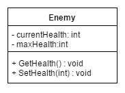

基本的 UML 图由三个代表类及其包含的数据的框组成。上面的框是类的名称。向下看，你会看到类将拥有的属性或变量（也称为数据成员），然后在下面的框中你会看到它将拥有的函数。属性左侧的加号（**+**）表示它将是公共的，而减号（**-**）表示它将是私有的。对于函数，你会看到冒号（**:**）右侧的内容是函数的返回类型。它也可以包括括号，这将显示函数的输入参数。有些函数不需要它们，所以我们不需要放置它们。此外，请注意，在这种情况下，我确实为两个函数都添加了`void`作为返回类型，但这不是必需的。

# 类之间的关系

当然，那个类相当简单。在大多数程序中，我们也有多个类，并且它们可以以不同的方式相互关联。这里有一个更深入的例子，展示了类之间的关系。

# 继承

首先，我们有继承，它显示了类之间的 IS-A 关系。

```cpp
class FlyingEnemy: public Enemy 
{ 
  public: 
    void Fly(void); 
  private: 
    int flySpeed; 
};

```

当一个对象从另一个对象继承时，它将拥有父类中包含的所有方法和字段，同时也会添加它们自己的内容和功能。在这个例子中，我们有一个特殊的`FlyingEnemy`类，它除了具有`Enemy`类的所有功能外，还具有飞行的能力。

在 UML 中，这通常通过一条实线和一个空心箭头表示，看起来如下：

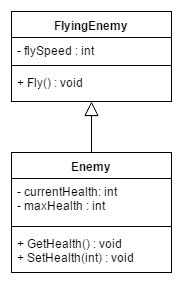

# 聚合

下一个概念是聚合，这由 HAS-A 关系表示。这是指一个类包含从程序中的其他地方获取的其他类的实例集合。这些被认为具有弱 HAS-A 关系，因为它们可以存在于类的外部。

在这个例子中，我创建了一个名为`CombatEncounter`的新类，它可以添加无限数量的敌人。然而，当使用聚合时，那些敌人将在`CombatEncounter`开始之前存在；当它结束时，它们仍然存在。通过代码来看，它可能看起来像这样：

```cpp
class CombatEncounter 
{ 
  public: 
    void AddEnemy(Enemy* pEnemy); 
  private: 
    std::list<Enemy*> enemies; 

};

```

在 UML 中，它看起来像这样：

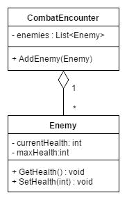

# 组合

当使用组合时，这是一个强 HAS-A 关系，这是指一个类包含一个或多个其他类的实例。与聚合不同，这些实例不是独立创建的，而是在类的构造函数中创建，然后由其析构函数销毁。用简单的话来说，它们不能独立于整体存在。

在这个例子中，我们为`Enemy`类创建了一些新的属性，增加了它可以使用的一些战斗技能，就像《宝可梦》系列中那样。在这种情况下，对于每一个敌人，它将能够拥有四种技能：

```cpp
class AttackSkill 
{ 
  public: 
    void UseAttack(void);  
  private: 
    int damage; 
    float cooldown; 
}; 

class Enemy  
{ 
  public: 
    void GetHealth(void) const; 
    void SetHealth(int); 
  private: 
    int         currentHealth; 
    int         maxHealth; 
    AttackSkill skill1; 
    AttackSkill skill2; 
    AttackSkill skill3; 
    AttackSkill skill4; 
};

```

图表中的线条看起来与聚合相似，除了菱形被填充了：

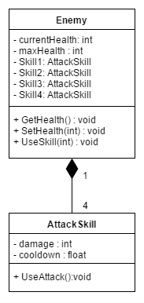

# 实现

最后，我们有实现，我们将在*接口介绍*部分讨论它。

这种沟通方式的优势在于，无论您使用什么编程语言，提出的想法都会以相同的方式工作，并且不需要特定的实现。这并不是说特定的实现没有价值，这就是为什么我们也会在代码中包含问题的实现。

关于 UML 的信息有很多，不同的人喜欢使用各种不同的格式。我发现的一个很好的指南，可能对您有所帮助，可以在[`cppcodetips.wordpress.com/2013/12/23/uml-class-diagram-explained-with-c-samples/`](https://en.wikipedia.org/wiki/Software_design_pattern)找到。

# 分离“为什么”和“如何”

在创建游戏时，我们需要处理许多不同的系统，以便提供完整的游戏体验。我们需要有被绘制到屏幕上的对象，需要有逼真的物理效果，当它们相互碰撞时需要做出反应，需要动画，需要有游戏玩法行为，而且在这所有之上，我们还需要确保它每秒运行 60 次。

# 理解关注点分离

每一个这些不同的方面都是一个自身的问题，试图一次性解决所有这些问题将会非常头疼。作为一个开发者，学习的一个重要概念就是将问题分块，将它们分解成越来越简单的部分，直到它们都变得可管理。在计算机科学中，有一个被称为关注点分离的设计原则，它处理这个问题。在这个方面，一个关注点可能是指会改变程序代码的某个东西。记住这一点，我们会将这些关注点分别划分到它们各自独立的区域，尽可能减少功能上的重叠。或者，我们可以让每个区域解决一个独立的问题。

现在我们提到关注点时，它们是一个独特的功能或一个独特的区域。记住这一点，它可以是像整个类那样高级，也可以是像函数那样低级。通过将这些关注点分解成可以完全独立工作的自包含部分，我们获得了一些明显的优势。通过分离每个系统并确保它们不相互依赖，我们可以以最小的麻烦更改或扩展项目的任何部分。这个概念为我们将要讨论的几乎每一个设计模式奠定了基础。

通过有效地使用这种分离，我们可以创建出灵活、模块化且易于理解的代码。它还将使我们能够以更迭代的模式构建项目，因为每个类和函数都有其明确定义的目的。我们不必过于担心添加新功能会破坏之前编写的代码，因为依赖关系在于现有的功能类，而不是相反。这意味着我们可以轻松地通过添加诸如**可下载内容**（**DLC**）之类的功能来扩展游戏。这可能包括新的游戏类型、额外的玩家或具有独特人工智能的新敌人。最后，我们可以将已经编写的内容与引擎解耦，以便在未来的项目中使用，节省时间和开发成本。

# 接口简介

使用设计模式的主要特点之一是始终面向接口编程，而不是面向实现。换句话说，任何类层次结构的顶部都应该有一个抽象类或接口。

# 多态复习

在好莱坞，许多演员和女演员在拍摄电影时扮演许多不同的角色。他们可以是故事中的英雄，也可以是反派，或者任何其他角色，因为他们扮演着角色。无论他们得到什么角色，当他们被拍摄时，他们都在表演，即使他们具体做的事情可能相当不同。这种行为与多态的概念类似。

多态是面向对象语言的三根支柱之一（与封装和继承并列）。它来自单词*poly*（意为多）和*morph*（意为变化）。

多态是一种在继承层次结构中调用不同特定类函数的方法，尽管我们的代码只使用单一类型。这个单一类型，即基类引用，将根据派生类型以多种方式改变。继续使用好莱坞的例子，我们可以告诉一个演员扮演一个角色，根据他们被选中的角色，他们会做不同的事情。

通过在基类函数上使用`virtual`关键字并在派生类中重写该函数，我们可以获得从基类引用调用该派生类函数的能力。虽然一开始可能看起来有些复杂，但通过示例会变得更加清晰。例如，如果我们有以下类：

```cpp
class Animal 
{ 
  public: 
    virtual void Speak(void) const //virtual in the base class 
    { 
      //Using the Mach 5 console print 
      M5DEBUG_PRINT("...\n"); 
    } 
};

```

我可以创建一个具有自己方法的派生类，而无需以任何方式修改基类。此外，我们还有能力在派生类中替换或重写方法，而不会影响基类。假设我想改变这个函数：

```cpp
class Cat: public Animal 
  { 
  public: 
    void Speak(void) const //overridden in the derived class 
  { 
  M5DEBUG_PRINT("Meow\n"); 
  } 

void Purr(void) const //unrelated function 
  { 
    M5DEBUG_PRINT("*purr*\n"); 
  } 
}; 
class Dog: public Animal 
  { 
    public: 
    void Speak(void) const //overridden in the derived class 
    { 
      M5DEBUG_PRINT("Woof\n"); 
    } 
};

```

由于派生类可以在需要基类的地方使用，因此我们可以使用基类指针或指针数组来引用派生类，并在运行时调用正确的函数。让我们看看以下代码：

```cpp
void SomeFunction(void) 
{ 
  const int SIZE = 2; 
  Cat cat; 
  Dog dog; 
  Animal* animals[SIZE] = {&cat, &dog}; 

  for(int i = 0; i < SIZE; ++i) 
  { 
    animals[i]->Speak(); 
  } 
}

```

以下是对应代码的输出：

```cpp
Meow 
Woof

```

正如你所见，即使我们有一个基类指针数组，也会调用正确的派生类函数。如果函数没有被标记为虚拟的，或者派生类没有覆盖正确的函数，多态将不会工作。

# 理解接口

接口不实现任何函数，只是声明了类将支持的方法。然后，所有派生类都将进行实现。这样，开发者将有更多的自由来实现函数以适应每个实例，同时由于使用面向对象语言的本质，事物将正确工作。

接口可能只包含静态最终变量，并且可能只包含抽象方法，这意味着它们不能在类中实现。然而，我们可以有从其他接口继承的接口。在创建这些类时，我们可以实现我们想要的任意数量的接口。这使得我们能够使类变得更加多态，但通过这样做，我们同意我们将实现接口中定义的每个函数。因为实现接口的类扩展了基类，所以我们可以说它具有与该类型的 IS-A 关系。

现在，接口有一个缺点，那就是它们往往需要编写大量的代码来实现每个不同版本的需求，但在这本书的过程中，我们将讨论调整和/或解决这个问题的方法。

在 C++中，没有官方的接口概念，但你可以通过创建一个抽象类来模拟接口的行为。

这里有一个接口的简单示例及其实现：

```cpp
class Enemy 
{ 
  public: 
    virtual ~Enemy(void) {/*Empty virtual destructor*/} 
    virtual void DisplayInfo(void) = 0; 
    virtual void Attack(void)      = 0; 
    virtual void Move(void)        = 0; 
}; 

class FakeEnemy: public Enemy 
{ 
  public: 
  virtual void DisplayInfo(void) 
  { 
    M5DEBUG_PRINT("I am a FAKE enemy"); 
  } 

  virtual void Attack(void) 
    { 
      M5DEBUG_PRINT("I cannot attack"); 
    } 

  virtual void Move(void) 
  { 
    M5DEBUG_PRINT("I cannot move"); 
  } 
};

```

下面是它在 UML 中的样子：

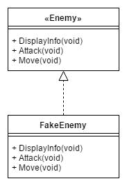

# 代码模块化的优点

过程式编程（例如 C 风格）和面向对象编程之间的重要区别是封装或模块化代码的能力。我们通常认为这只是数据隐藏：使变量私有。在 C 风格程序中，函数和数据是分开的，但很难重用任何一个函数，因为它可能依赖于程序中的其他函数或其他数据。在面向对象编程中，我们允许将数据和函数组合成可重用的组件。这意味着我们可以（希望）将一个类或模块放入一个新的项目中。这也意味着，由于数据是私有的，只要接口或公共方法不改变，变量就可以很容易地更改。封装的概念很重要，但它们并没有向我们展示这个提供给我们全部的力量。

编写面向对象代码的目的是创建能够自我负责的对象。在代码中使用大量的 if/else 或 switch 语句可能是设计不良的迹象。例如，如果我有三个类需要从文本文件中读取数据，我可以选择使用 switch 语句为每个类类型读取数据，或者将文本文件传递给一个类方法，让类自己读取数据。当与继承和多态的力量结合时，这甚至更强大。

通过让类负责自身，类可以改变而不会破坏其他代码，其他代码也可以改变而不会破坏类。我们可以想象，如果整个游戏都是用主函数编写的，代码将会多么脆弱。任何添加或删除的内容都可能破坏其他代码。每当有新成员加入团队时，他们需要完全理解游戏中的每一行代码和每一个变量，才能被信任编写任何内容。

通过将代码分成函数或类，我们使代码更容易阅读、测试、调试和维护。当然，任何加入团队的人都需要理解一些代码，但如果他们正在处理游戏逻辑或文件加载，可能不需要理解所有的图形代码。

设计模式是针对常见编程问题的解决方案，足够灵活以应对变化。它们通过将代码部分隔离开来做到这一点。这不是偶然的。为了本书的目的，好的设计的定义是封装、灵活、可重用的代码。因此，这些解决方案被组织成类或类的组合，以封装代码中变化的部分。这并不令人惊讶。

# Mach5 引擎的结构

在整本书中，我们将使用设计模式来解决常见的游戏编程问题。最好的方式是通过实例来演示，因此我们将研究这些问题的产生，并使用 Mach5 引擎（一个由*Matt Casanova*设计的 C++ 2D 游戏引擎）来实现解决方案。通过查看游戏的全源代码，我们将能够看到许多模式是如何协同工作以创建强大且易于使用的系统的。

然而，在我们深入探讨模式之前，我们应该花一点时间解释一下引擎的结构。你不需要理解每一行源代码，但理解一些核心引擎组件及其使用方式是很重要的。这样我们才能更好地理解我们将面临的问题以及解决方案是如何相互配合的。

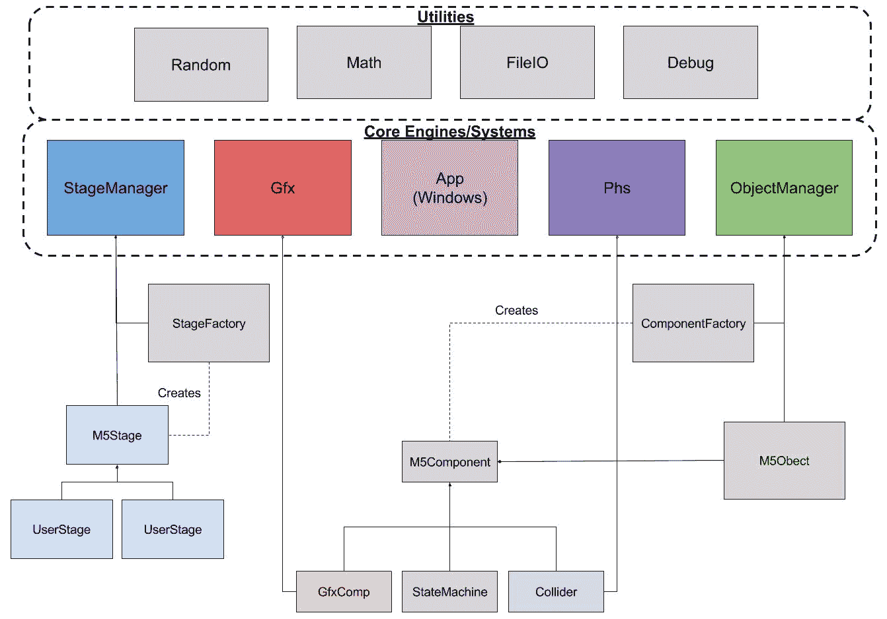

当查看图表时，一开始可能会有些混乱，所以让我们分别检查引擎的每一部分。

# Mach5 核心引擎和系统

这些天来，引擎的含义变得有些模糊。当人们谈论引擎时，他们通常指的是像 Unreal 或 Unity 这样的完整游戏创建工具。虽然这些也是引擎，但这个术语并不总是需要工具。像 Id Software 的 Quake 引擎或 Valve Corporation 的 Source 引擎这样的游戏引擎是独立于工具存在的，尽管后者确实包括用于创建关卡的工具 Hammer Editor。

引擎这个术语也被用来指代更大代码库中的组件。这包括渲染引擎、音频引擎或物理引擎等。这些甚至可以完全独立于更大的代码库创建。Orge 3D 是一个开源的 3D 图形引擎，而 Havok Physics 引擎是由 Havok 公司创建的专有软件，被许多游戏使用。

因此，当我们谈论 Mach5 引擎的引擎或系统时，我们实际上是在指执行特定任务的代码集合。

# 应用程序

`M5App` 或应用程序层是一个负责与操作系统交互的类。由于我们试图编写干净、可重用的代码，因此我们不应该将游戏代码与任何操作系统功能调用混合。如果我们这样做，我们的游戏将难以移植到另一个系统。`M5App` 类在 WinMain 中创建，负责创建和销毁其他每个系统。任何时候我们的游戏需要与操作系统交互，包括更改分辨率、切换到全屏或从设备获取输入时，我们都会使用 `M5App` 类。在我们的情况下，我们将使用的操作系统将是 Windows。

# 阶段管理器

`M5StageManager` 类负责控制每个阶段的逻辑。我们考虑的主要菜单、信用屏幕、选项菜单、加载屏幕和可玩关卡都被视为阶段。它们包含控制游戏流程的行为。阶段行为的例子包括从文件中读取游戏对象数据、在特定时间间隔后生成单位，或者在菜单和关卡之间切换。

`StageManager` 确实不是一个标准化的名称。在其他引擎中，这段代码可能被称为游戏逻辑引擎；然而，我们的大部分游戏逻辑将被分离成组件，所以这个名字不太合适。无论叫什么名字，这个类都将控制需要为当前阶段创建哪些对象，以及何时切换到下一个阶段或完全退出游戏。

尽管这个名字使用的是 *manager* 而不是 *engine*，但它仍然是游戏的核心系统之一。这个类控制着主游戏循环并管理用户关卡集合。为了制作游戏，用户必须从基类 `M5Stage` 派生至少一个类，并重载虚拟函数以实现他们的游戏逻辑。

# 对象管理器

`M5ObjectManager`负责创建、销毁、更新和搜索游戏对象。游戏对象是游戏中可见或不可见的任何东西。这可能包括玩家、子弹、敌人和触发器——在游戏中，当与之碰撞时会导致事件的不可见区域。派生的`M5Stage`类将使用`M5ObjectManager`来创建适合该阶段的对象。它们还可以搜索特定的游戏对象以更新游戏逻辑。例如，一个阶段可能会搜索玩家对象。如果没有找到，则管理器将切换到游戏结束阶段。

如前图所示，我们的游戏将使用组件。这意味着`M5ObjectManager`也将负责创建这些组件。

# 图形引擎

这本书不是关于创建图形引擎的，但我们确实需要一个来绘制到屏幕上。类似于`M5App`类封装了重要的操作系统功能调用，我们的`M5Gfx`类封装了我们的图形 API。我们希望确保任何 API 调用和我们的游戏逻辑之间有一个清晰的分离。这对于我们可以将我们的游戏移植到另一个系统非常重要。例如，我们可能希望为 PC、XBox One 和 PlayStation 4 开发我们的游戏。这意味着我们需要支持多个图形 API，因为并非所有平台都提供单个 API。如果我们的游戏逻辑包含 API 代码，那么这些文件将需要为每个平台进行修改。

我们不会深入探讨如何实现完整的图形引擎的细节，但我们将概述图形的工作原理。将此视为图形引擎世界的入门指南。

此类允许我们操作和绘制纹理，以及控制游戏摄像机和找到世界的可见范围。`M5Gfx` 还管理两个图形组件数组，一个用于世界空间，一个用于屏幕空间。屏幕空间组件最常用的用途是创建**用户界面**（**UI**）元素，如按钮。

# 工具和实用程序

除了游戏的核心引擎和系统之外，每个引擎都应该提供一些基本工具和支持代码。Mach5 引擎包括几个工具类别：

+   **调试工具**：这包括调试断言、消息窗口以及创建调试控制台

+   **随机数生成器**：从最小/最大值创建随机`int`或`float`的辅助函数

+   **数学**：这包括 2D 向量和 4 x 4 矩阵，以及一些更通用的数学辅助函数

+   **文件输入输出**：支持读取和写入`.ini`文件

# 在游戏中使用设计模式的问题

不幸的是，使用设计模式的方式也可能带来一些问题。常言道，执行最快的代码是那些从未被调用的代码，而使用设计模式通常需要你在项目中添加比其他方式更多的代码。这将产生性能成本，因为每次使用引擎的某个部分时，可能需要进行更多的计算。

例如，使用某些原则可能会导致你编写的某些类变得极其臃肿，充满了额外的代码。设计模式是向项目中添加的另一种复杂性。如果问题本身很简单，那么在直接实现设计模式之前，先关注简单的解决方案会是一个更好的主意，仅仅因为你听说过它。

有时候遵循简单的**K.I.S.S**规则会更好。并记住，掌握模式的知识比使用模式本身更有价值。

# 设置项目

现在我们已经很好地理解了为什么我们要使用设计模式，让我们设置我们将在这本书中使用的游戏引擎：Mach5 引擎。为了开始，我们需要下载引擎以及运行项目所需的软件。执行以下步骤：

1.  打开您选择的网页浏览器并访问以下网站：[`beta.visualstudio.com/downloads/`](https://beta.visualstudio.com/downloads/)。一旦到达那里，将鼠标移到左侧的 Visual Studio Community 版本，然后点击免费下载选项，如图所示：


1.  如果出现一个窗口询问如何处理文件，请继续打开它或保存并点击运行按钮打开它：


1.  从那里，等待安装程序弹出，然后选择自定义，然后点击下一步开始下载程序：

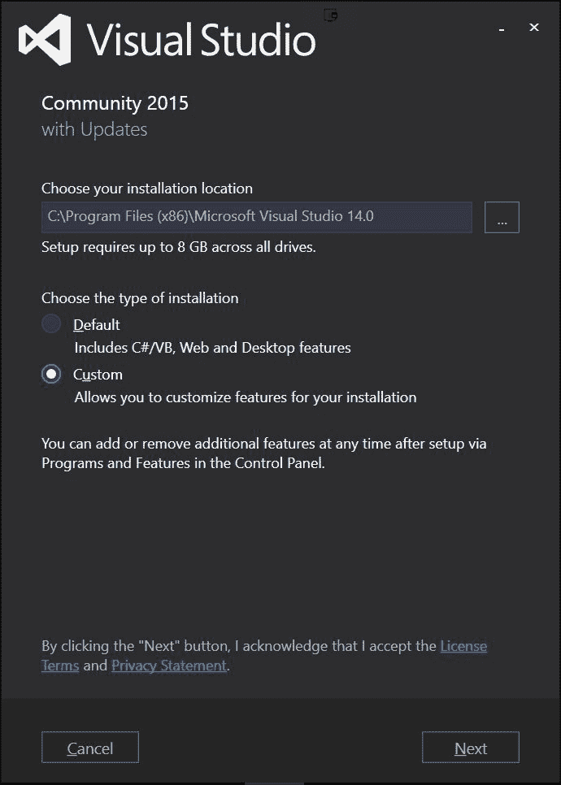

1.  现在你一旦到达功能部分，取消选择所有已选选项，然后打开编程语言选项卡并勾选 Visual C++。你可以继续移除其他选项，因为我们不会使用它们。然后点击下一步按钮，然后安装，并允许它更改您的计算机：

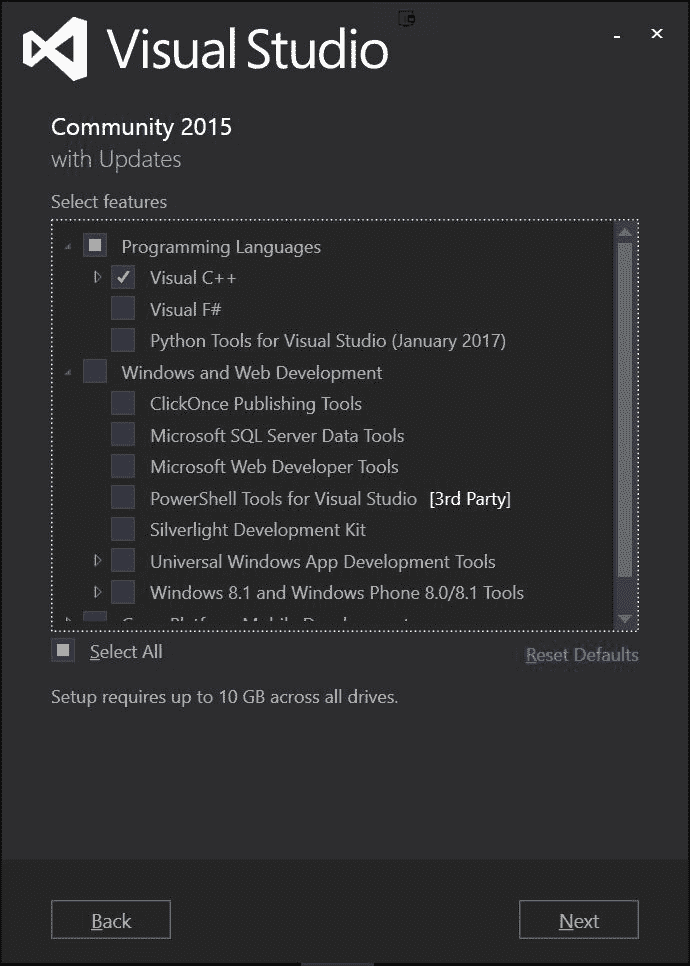

在这一点上，你可能需要等待一段时间，所以请去喝杯咖啡，一旦完成，你需要重新启动计算机。之后，请继续进行项目。

1.  安装完成后，接下来你需要实际安装引擎本身。考虑到这一点，转到[`github.com/mattCasanova/Mach5`](https://beta.visualstudio.com/downloads/)，并从那里点击克隆或下载部分，然后点击下载 ZIP：

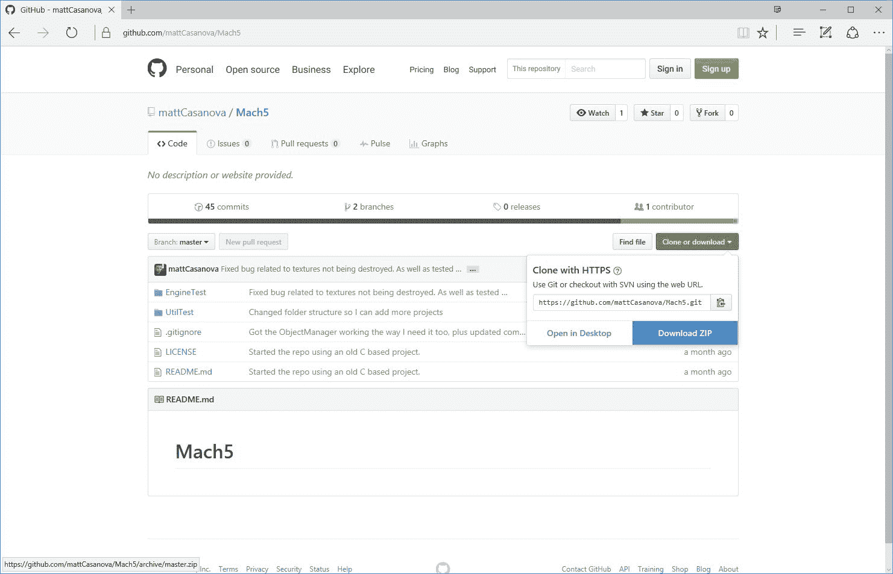

1.  下载完成后，请将文件解压缩到您选择的文件夹中；然后打开`Mach5-master\EngineTest`文件夹，双击`EngineTest.sln`文件，并启动 Visual Studio。

1.  你可能会看到一个登录界面要求你登录；请继续并注册或点击屏幕底部的“现在不，稍后再说”选项。然后你可以选择一个颜色主题；然后点击开始 Visual Studio。

1.  启动时，你可能会收到一个安全警告，询问你是否仍然想要打开此项目。这会从任何不在你机器上创建的 Visual Studio 解决方案中显示出来，所以它想要确保你知道它从哪里来，但在这个情况下，项目是完全安全的。请继续取消选中“在此解决方案中的每个项目都询问我”选项，然后选择“确定”：

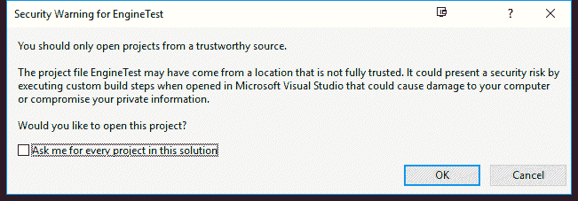

1.  一旦加载完成，你应该最终看到 Visual Studio 界面，它应该看起来像这样：

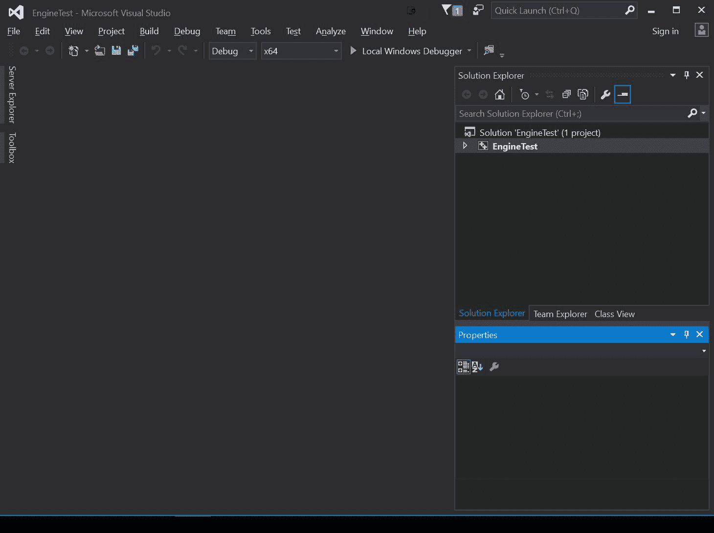

Visual Studio 是一个非常强大的工具，对于开发者来说，学习它所有的功能非常有用。我们将在使用它们时讨论这些功能，但本书不应被视为关于 Visual Studio 的终极指南。

如果你想要了解更多关于 Visual Studio 界面的信息，请查看：[`msdn.microsoft.com/en-us/library/jj620919.aspxa`](https://msdn.microsoft.com/en-us/library/jj620919.aspxa)。

1.  引擎是为 32 位处理器构建的，所以将 x64 下拉菜单更改为 x86，然后点击播放按钮或按 *F5*。然后它会询问你是否希望重新构建项目。请继续说“是”。如果一切顺利，你应该最终看到一个调试窗口和一个游戏窗口。几秒钟后，它应该过渡到一个简单的默认项目：

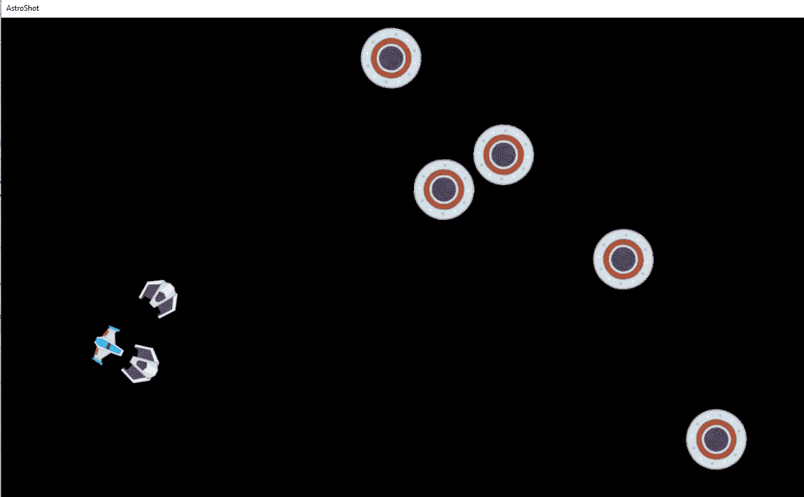

你可以通过使用 *W*、*A* 和 *D* 键来移动角色，使用 *Spacebar* 向敌人射击子弹。一旦你玩够了，就按 *Esc* 键进入菜单，然后点击退出按钮离开项目并返回到编辑器！

# 摘要

就这样！在本章中，你了解了一些关于设计模式的基本知识，并且已经在你的电脑上运行了 Mach5 引擎。

具体来说，我们了解到设计模式是针对常见编程问题的解决方案。有很多理由我们应该使用它们，但为了有效地使用模式，你首先需要知道你正在尝试解决什么问题，以及哪些模式可以在那种情况下帮助你，这正是本书旨在教给你的内容。

我们了解到游戏开发总是不断变化，以及有一个计划以及一个能够支持这些变化的架构是多么重要。考虑到这一点，我们学习了在创建我们的架构时将要用到的各种编码方面。

我们深入学习了关注点分离原则及其重要性，了解如何将“是什么”和“怎么做”分开；使它们不相互依赖，这样我们就可以以最小的麻烦更改或扩展项目的任何部分。之后，我们探讨了接口是什么以及它们如何有助于为我们提供一个可以在此基础上构建的基础。后来，我们深入研究了 Mach5 引擎，看到了一个关于模块化代码如何工作的例子，以及它的优势。我们还看到了在游戏中使用设计模式可以是一件好事，以及它们所存在的问题。

最后，我们亲自下载了 Mach5 引擎并确保它能够正确工作。接下来，在下一章中，我们将处理我们的第一个设计模式——单例模式，并看看它如何对我们有用！
