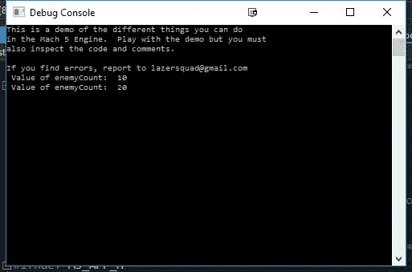
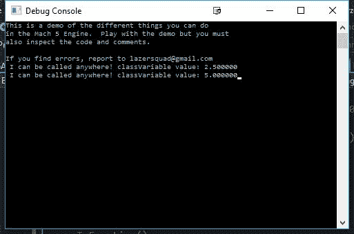
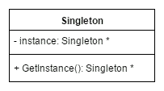
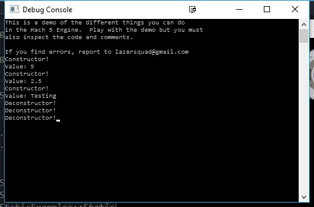
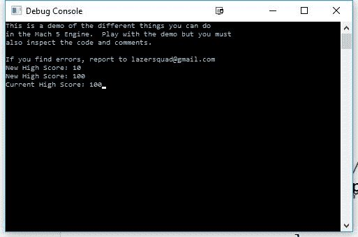

# 第二章：一统天下的单例 - 单例模式

现在我们已经了解了什么是设计模式，以及为什么我们想要使用它们，让我们首先谈谈大多数人学习的设计模式，即单例模式。

单例模式可能是最著名的模式，也是最常被误用的模式。它确实围绕它有很多争议，所以在讨论这个模式时，了解何时不应用它同样重要（甚至更重要）。

# 章节概述

在本章中，我们将解释关于这种模式的优缺点，以及为什么 Mach5 引擎中的核心系统，如图形引擎和对象管理器，被用作单例。最后，我们将解释在 C++中实现这一点的多种不同方法，以及每种选择的优缺点。

# 你的目标

本章将分为多个主题。它将包含一个从开始到结束的简单分步过程。以下是我们的任务大纲：

+   类访问修饰符概述

+   全局访问的优缺点

+   理解`static`关键字

+   什么是单例？

+   学习模板

+   单例的模板化

+   单一实例的优点和缺点

+   单例模式的应用：`Application`类

+   设计决策

# 类访问修饰符概述

在使用面向对象编程语言时，最重要的特性之一是能够隐藏数据，通过使用`public`、`private`和`protected`等访问修饰符，我们可以具体指定数据或函数如何被其他类访问：

```cpp
class ModifierExamples 
{ 
  public int publicInteger; 
  private void PrivateMethod() {} 
  protected float protectedNumber; 
};

```

一个类可以有无限数量的变量或函数，可以是`public`、`private`或`protected`，甚至可以控制对类中整个部分的访问：

```cpp
class MoreModifierExamples 
{ 
  public: 
    // until we reach another tag, all variables and functions  
    // will be public 
    int publicIntegar; 
    int anotherExample; 

  private: 
    // Now, they'll be private 
    void PrivateFunction() {} 
    double safeValue; 

  protected: 
    // And now... protected 
    float protectedNumber; 
    int AlsoProtected() { return 0; } 
};

```

当你在带有访问修饰符名称的标签部分旁边放置一个冒号`:`，直到出现另一个部分标签，所有列出的类部分都将使用该特定的一个。

当我们使用`public`访问修饰符时，我们表示这个变量或函数可以在我们的程序中的任何地方使用或访问，甚至可以在我们创建的类之外。在函数或类之外声明变量，或将变量标记为`public`和`static`，通常被称为全局变量。我们将在下一节讨论全局变量，但就目前而言，让我们也过一下其他访问修饰符。

当使用`private`时，我们限制我们的变量或函数的使用，只允许在类内部或从`friend`函数中使用。默认情况下，类中的所有变量和函数都是`private`的。

想了解更多关于`friend`函数的信息，请查看[`en.cppreference.com/w/cpp/language/friend`](http://en.cppreference.com/w/cpp/language/friend)。

第三种类型，`protected`，与`private`类型相同，只不过它仍然可以被子类（或派生类）访问。这在使用继承时非常有用，这样你仍然可以访问那些变量和/或函数。

# 静态关键字

在深入研究单例模式之前，了解`static`关键字的意义是很重要的，因为当我们构建这个模式时，我们将使用其功能。当我们使用`static`关键字时，它将在三个主要上下文中使用：

+   函数内部

+   在类定义内部

+   在具有多个文件的程序中的全局变量前

# 函数内的静态关键字

第一个，在函数内部使用，基本上意味着一旦变量被初始化，它将保留在计算机的内存中，直到程序结束，保持它在多次函数运行中的值。一个简单的例子可能如下所示：

```cpp
#include <string> 

class StaticExamples 
{ 
public: 
  void InFunction() 
  { 
    static int enemyCount = 0; 

    // Increase the value of enemyCount 
    enemyCount += 10; 

    std::string toDisplay = "\n Value of enemyCount:  " +  
                std::to_string(enemyCount); 

    printf(toDisplay.c_str()); 
  } 
};

```

如果我们调用它，看起来会像以下这样：

```cpp
  StaticExamples se; 

  se.InFunction(); 
  se.InFunction();

```

当我们调用它时，以下内容会被显示：



如你所见，值继续存在，我们可以根据需要访问和/或修改其内容。这可以用于许多事情，比如可能需要知道上一次调用此函数时发生了什么，或者存储任何类型的数据。还值得注意的是，静态变量被类的所有实例共享，因此，如果我们有两个类型为`StaticExamples`的变量，它们都会显示相同的`enemyCount`。我们将利用这样一个事实，即如果以这种方式创建一个对象，它将始终在本章的后续部分可用。

# 类定义中的静态关键字

第二种方式是将类中的变量或函数定义为`static`。通常情况下，当你创建一个类的实例时，编译器必须为类中包含的每个变量在连续的内存块中预留额外的内存。当我们声明某个变量为`static`时，而不是创建一个新的变量来存储数据，一个变量被所有类的实例共享。此外，由于它是所有副本共享的，因此你不需要类的实例就可以调用它。请看以下加粗的代码来创建我们的变量：

```cpp
class StaticExamples 

{ 
public: 
 static float classVariable; static void StaticFunction() 
  { 
    // Note, can only use static variables and functions within 
    // static function 
 std::string toDisplay = "\n I can be called anywhere! classVariable value: " + std::to_string(classVariable); 

    printf(toDisplay.c_str()); 
  } 

  void InFunction() 
  { 
    static int enemyCount = 0; 

    // Increase the value of enemyCount 
    enemyCount += 10; 

    std::string toDisplay = "\n Value of enemyCount:  " +  
                std::to_string(enemyCount); 

    printf(toDisplay.c_str()); 
  } 
};

```

现在，在先前的代码中我们定义了一个变量和一个函数，但这并不是我们需要做的所有准备工作。当创建静态变量时，你无法在类内部初始化它，而需要在`.cpp`文件中初始化，而不是我们可以用于类定义的`.h`文件。如果你不初始化它，你会得到错误，所以这是一个好主意。在我们的例子中，它看起来会像以下这样：

```cpp
// StaticExamples.cpp 
float StaticExamples::classVariable = 2.5f;

```

注意，当我们初始化时，我们还需要包括类型，但我们使用`ClassName::variableName`模板，类似于你在`.cpp`文件中定义函数的方式。现在一切都已经设置好了，让我们看看我们如何在正常代码中访问它们：

```cpp
StaticExamples::StaticFunction(); 
StaticExamples::classVariable = 5; 
StaticExamples::StaticFunction();

```

注意，我们不需要通过创建一个变量来访问它，而是可以直接使用类名后跟作用域运算符（`::`），然后选择我们想要使用的静态变量或函数。当我们运行它时，它看起来会是这样：



如你所见，它工作得非常完美！

# 作为文件全局变量的静态

如你所知，C++是一种与 C 编程语言紧密相关的编程语言。C++被设计成具有与 C 相同的大部分功能，并在此基础上添加了更多功能。C 不是面向对象的，因此当它创建`static`关键字时，它被用来指示项目中的其他文件（作为项目的一部分）不能访问该变量，而只有文件内部的代码可以使用它。这是为了在 C 中创建类似类的行为。由于 C++中有类，我们通常不使用它，但我认为为了完整性，我应该提到这一点。

# 全局变量的优缺点

再次强调，全局变量是在函数或类外部声明的变量。这样做使得我们的变量在所有函数中都是可访问的，因此我们称之为全局变量。在学校学习编程时，我们经常被告知全局变量是坏事，或者至少，在函数中修改全局变量被认为是不良的编程实践。

使用全局变量有很多原因是不好的：

+   当使用的元素作用域有限时，源代码最容易理解。在程序中添加可以在任何地方读取或修改的全局变量会使跟踪事物所在位置变得更加困难，同时也会使新开发者理解起来更加困难。

+   由于全局变量可以在任何地方被修改，我们失去了对确认变量中包含的数据是否有效的任何控制。例如，你可能只想支持一定数量的值，但作为一个全局变量，这是不可能阻止的。通常，我们建议出于这个原因使用`getter`/`setter`函数。

+   使用全局变量使得我们的程序耦合度更高，这使得在我们需要从很多不同地方获取信息以使事物正常工作时，很难重用项目中的某些方面。将相互关联的事物分组通常可以改善项目。

+   当与链接器一起工作时，如果你的全局变量名称常见，在编译项目时你经常会遇到问题。幸运的是，你会得到一个错误，并需要修复这个问题。不幸的是，你也可能遇到一个问题，即你试图在一个项目中使用局部作用域的变量，但由于拼写错误或过度依赖智能提示而选择了全局版本，我看到学生在多次场合这样做。

+   随着项目规模的扩大，维护和/或对全局变量进行更改变得更加困难，因为你可能需要修改代码的许多部分才能正确调整。

这并不是说全局访问完全没有坏处。有一些原因会让人们考虑在他们的项目中使用它：

+   不了解局部变量的概念

+   不了解如何创建类

+   想要节省按键次数

+   不想总是将变量传递给函数

+   不知如何声明变量，所以将其设置为全局变量意味着任何人都可以访问它

+   为了简化项目中需要任何地方都可以访问的组件

除了最后一点，那些问题真的是想要使用全局变量的糟糕理由，因为它们可能会在你一开始节省一些时间，但随着你的项目越来越大，阅读代码会变得困难得多。此外，一旦你将某物设置为全局，将来将其转换为非全局将变得更加困难。想想看，与其使用全局变量，不如根据需要将参数传递给不同的函数，这样更容易理解每个函数做什么以及它需要与什么一起工作以实现其功能。

这并不是说在某个时候使用全局变量是不合理甚至是一个好主意。当全局变量代表在整个项目中真正需要可用的组件时，使用全局变量简化了项目的代码，这与我们想要实现的目标相似。

*Norm Matloff* 也有一篇文章解释了他认为在编写代码时有必要使用全局变量的情况。如果你想听一个不同的观点，请查看[`heather.cs.ucdavis.edu/~matloff/globals.html`](http://heather.cs.ucdavis.edu/~matloff/globals.html)。

基本上，总是将变量限制在项目所需的最小作用域内，不要更多。这尤其在你只需要一个东西，但计划用这个对象做很多不同的事情时，会想到这一点。这就是 Singleton 设计模式的一般想法，也是为什么在继续前进之前理解其一般用法很重要的原因。

# 什么是 Singleton？

Singleton 模式简而言之，就是你在项目中可以访问的类，因为只有一个对象（实例）被创建（实例化）。该模式提供了一种方式，让程序员可以通过创建游戏中的一个对象的单例来全局访问类的信息。

虽然使用全局变量存在很多问题，但你可以将 Singleton 视为一种*改进的*全局变量，因为你不可以创建多个。考虑到这一点，Singleton 模式对于在游戏项目中只有唯一实例的类来说是一个吸引人的选择，例如你的图形管道和输入库，因为在你项目中拥有多个这些类是没有意义的。

这个单一对象使用静态变量和静态函数来能够在不通过所有代码传递的情况下访问对象。

在 Mach5 引擎中，Singleton 用于应用程序、输入、图形和物理引擎。它们还用于资源管理器、对象管理器和游戏状态管理器。我们将在本章后面更深入地研究引擎中更基础的一个，即`Application`类。但在我们到达那里之前，让我们深入了解我们如何实际上创建我们自己的 Singleton。

实现 Singleton 模式或获得类似 Singleton 的行为有多种方式。在介绍我们最终的版本之前，我们将讨论一些常见的版本及其优缺点，这个最终版本是 Mach5 引擎使用的方式。

实现 Singleton 模式功能的一种非常常见的方式可能看起来像以下这样：



通过代码，它看起来可能有点像这样：

```cpp
class Singleton 
{ 
  public: 
    static Singleton * GetInstance() 
    { 
      // If the instance does not exist, create one 
      if (!instance) 
      { 
        instance = new Singleton; 
      } 

      return instance; 
    } 

  private: 
    static Singleton * instance;  
};

```

在这个类中，我们有一个名为`GetInstance`的函数和一个名为`instance`的单个属性。请注意，我们在这个实例中使用指针，并且只有在实际使用时才分配内存来创建我们的 Singleton。实例属性代表我们类的唯一版本，因此它被设置为`static`。尽管它是私有的，但其他人无法访问其数据，除非我们给他们提供访问权限。为了提供这种访问权限，我们创建了`GetInstance`函数。这个函数首先检查实例是否存在，如果不存在，它将动态分配内存来创建一个，将实例设置为它，然后返回对象。

这只会在初始化时将实例正确地设置为`0`或`nullptr`时才有效，幸运的是，这是 C++中静态指针的默认行为。

# 在 Singleton 中保持单一性

正如我们之前提到的，单例模式最重要的部分之一是只有一个这样的对象。这导致了一些与我们所编写的原始代码相关的问题，即在使用一些简单的 C++时，其他程序员在您的团队中创建此类类的多个实例相当容易。首先也是最明显的是，他们可以创建一个`Singleton`变量（`Singleton`类型的变量），如下所示：

```cpp
Singleton singleton;

```

此外，作为高级编程语言，C++在创建类时会尝试自动为您做一些事情，以消除一些否则可能需要手动处理的工作。其中之一是自动在类之间创建一些功能，以便您能够创建或复制自定义类的对象，我们称之为构造函数和复制构造函数。在我们的例子中，您也可以以下方式创建当前对象的副本：

```cpp
Singleton instanceCopy(*(Singleton::GetInstance()));

```

编译器还会创建默认析构函数和赋值运算符，将数据从一个对象移动到另一个对象。

幸运的是，这是一个简单的问题。如果我们自己创建这些函数（声明一个显式版本），C++会注意到我们想要做一些特殊的事情，因此它不会创建默认的。因此，为了解决这个问题，我们只需要添加一个赋值运算符和一些私有构造函数，您可以在我们更改的粗体代码中看到这些：

```cpp
class Singleton 
{ 
public: 
  static Singleton * GetInstance() 
  { 
    // If the instance does not exist, create one 
    if (!instance) 
    { 
      instance = new Singleton; 
    } 

    return instance; 
  } 

private: 
  static Singleton * instance;  

 // Disable usability of silently generated functions Singleton(); ~Singleton(); Singleton(const Singleton &); Singleton& operator=(const Singleton&); 

};

```

如果您使用的是 C++ 11 或更高版本，我们还可以选择将我们不希望使用的函数标记为已删除，其外观如下：

`Singleton() = delete;`

`~Singleton() = delete;`

`Singleton(const Singleton &) = delete;`

`Singleton& operator=(const Singleton&) = delete;`

关于删除关键字（delete）的更多信息，请查看[`www.stroustrup.com/C++11FAQ.html#default`](http://www.stroustrup.com/C++11FAQ.html#default)。

另一个可能成为问题的情况是实例是一个指针。这是因为，作为一个指针，我们的用户有权限调用 delete 操作，而我们希望确保对象始终可供用户访问。为了最小化这个问题，我们可以通过将函数更改为以下形式（注意返回类型，以及我们在最后一行现在使用`*instance`）来将我们的指针改为引用：

```cpp
static Singleton& GetInstance() 
{ 
  // If the instance does not exist, create one 
  if (!instance) 
  { 
    instance = new Singleton; 
  } 

  return *instance; 
}

```

程序员习惯于使用引用作为项目中其他地方存在的对象的别名。如果他们看到类似以下内容，可能会感到惊讶：

```cpp
Singleton& singleton = Singleton::GetInstance(); 
delete &singleton;

```

虽然技术上可行，但程序员不会期望在引用的地址上使用 delete。使用引用的好处是，当您在代码中需要它们时，您知道它们存在，因为它们在代码的某个地方被管理着——您不需要担心它们是如何被使用的。

# 正确删除我们的对象

人们也习惯于使用指针而不是引用来查找内存泄露，这也许会给我们留下一个问题，即在我们当前的代码中，我们分配了内存但并没有真正删除它。

现在，从技术上讲，我们并没有创建内存泄露。内存泄露出现在你分配数据并失去了对它的所有引用时。此外，现代操作系统会在我们的项目退出时负责释放进程的内存。

但这并不意味着这是一件好事。根据单例类使用的信息，我们可能会在某个时刻引用不再存在的东西。

要让我们的对象正确地删除自己，我们需要在游戏关闭时销毁单例。唯一的问题是，我们需要确保在确定没有人会之后使用单例时才这样做。

然而，既然我们要讨论最佳实践，那么在看到资源泄露时实际解决这一问题会更好。针对这个问题的解决方案是由*斯科特·梅耶斯*在他的书《More Effective C++》中提出的，他利用了编译器的一些特性，即位于函数中的静态变量将在我们程序的整个运行时间内存在。例如，让我们看看以下函数：

```cpp
void SpawnEnemy() 
{ 
  static int numberOfEnemies = 0; 
  ++numberOfEnemies; 

  // Spawn the enemy 
}

```

`numberOfEnemies`变量是在项目中的任何代码执行之前创建和初始化的，很可能是当游戏正在加载时。然后，一旦第一次调用`SpawnEnemy`，它就已经被设置为`0`（或`nullptr`）。方便的是，由于对象不是动态分配的，编译器也会生成代码，以便当游戏退出时，它会自动调用我们的对象的析构函数。

考虑到这一点，我们可以将我们的单例类修改如下：

```cpp
class Singleton 
{ 
  public: 
    static Singleton & GetInstance() 
    { 
      static Singleton instance; 
      return instance; 
    } 

  private: 
    // Disable usability of silently generated functions 
    Singleton(); 
    ~Singleton(); 
    Singleton(const Singleton &); 
    Singleton& operator=(const Singleton&); 

};

```

特别注意我们对`GetInstance`函数所做的更改以及我们类实例变量的移除。这种方法提供了自动销毁`Singleton`类最简单的方式，并且对于大多数用途来说效果良好。

# 学习模板

另一种要添加到你的编程概念工具箱中的技术，我们将在下一节中使用，是模板的概念。**模板**是一种让你能够创建泛型类的方法，这些类可以扩展以对不同数据类型具有相同的功能。它是抽象的另一种形式，让你能够为类定义一组基本行为，而无需知道将使用哪种类型的数据。如果你之前使用过 STL，那么你已经在使用模板，可能没有意识到。这就是为什么列表类可以包含任何类型的对象。

下面是一个简单的模板类的例子：

```cpp
#include <iostream> // std::cout 

template <class T> 
class TemplateExample 
{ 
public: 
  // Constructor 
  TemplateExample(); 
  // Destructor 
  ~TemplateExample(); 
  // Function 
  T TemplatedFunction(T); 
};

```

在这种情况下，我们创建了`TemplateExample`类，它有三个函数。构造函数和析构函数看起来很正常，但我有这个`TemplateFunction`函数，它接受一个类型为`T`的对象，并返回一个类型为`T`的对象。这个`T`来自我们示例代码中的第一行，即模板`<class T>`部分。任何有`T`的地方都将被替换为我们想要使用此模板的任何类。

现在，与常规函数不同，我们必须在我们的`.h`文件中定义模板函数，这样当我们需要使用这个模板创建对象时，它就会知道函数将做什么。此外，语法也有所不同：

```cpp
template <class T> TemplateExample<T>::TemplateExample() 
{ 
  printf("\nConstructor!"); 
} 

template <class T> TemplateExample<T>::~TemplateExample() 
{ 
  printf("\nDeconstructor!"); 
} 

template <class T> T TemplateExample<T>::TemplatedFunction(T obj) 
{ 
  std::cout << "\nValue: " << obj; 
  return obj; 
}

```

在这个例子中，我只是打印出文本以显示当调用特定功能时的显示内容，但我还想指出`std::cout`的使用，使用它需要在文件顶部添加`#include <iostream>`。

在这个例子中，我们使用标准库的`cout`函数，而不是我们之前使用的`printf`，因为`cout`允许我们输入`obj`（无论其类型如何）来显示某些内容，而默认情况下`printf`是无法做到这一点的。

完成之后，我们就可以在我们的项目中使用它了：

```cpp
  TemplateExample<int> teInt; 
  teInt.TemplatedFunction(5); 

  TemplateExample<float> teFloat; 
  teFloat.TemplatedFunction(2.5); 

  TemplateExample<std::string> teString; 
  teString.TemplatedFunction("Testing");

```

如你所见，这将创建三种不同类型的`TemplateExample`类对象，使用不同的类型。当我们调用`TemplatedFunction`函数时，它将按照我们期望的方式打印出来：



之后，当我们学习到抽象类型时，我们可以使用模板与它们一起处理任何类型的数据。就我们目前的情况而言，我们将利用这一功能来允许我们创建尽可能多的单例（Singletons）！

# 模板化单例

现在，假设我们的单例（Singleton）工作得正如我们所期望的那样，你可能会希望在将来创建更多的单例。你可以从头开始创建它们，但更好的做法是创建一个一致的方法，通过创建模板和继承来创建一个单一的实施方案，这样我们就可以为任何类使用它。同时，我们还可以了解创建`Singleton`类的一种替代方法，它看起来可能如下所示：

```cpp
template <typename T> 
class Singleton 
{ 
public: 
  Singleton() 
  { 
    // Set our instance variable when we are created 
    if (instance == nullptr) 
    { 
      instance = static_cast<T*>(this); 
    } 
    else 
    { 
      // If instance already exists, we have a problem 
      printf("\nError: Trying to create more than one Singleton"); 
    } 
  } 

  // Once destroyed, remove access to instance 
  virtual ~Singleton() 
  { 
    instance = nullptr; 
  } 

  // Get a reference to our instance 
  static T & GetInstance() 
  { 
    return *instance; 
  } 

  // Creates an instance of our instance 
  static void CreateInstance() 
  {   
    new T(); 
  } 

  // Deletes the instance, needs to be called or resource leak 
  static void RemoveInstance() 
  { 
    delete instance; 
  } 

private: 
  // Note, needs to be a declaration 
  static T * instance; 

}; 

template <typename T> T * Singleton<T>::instance = nullptr;

```

你会注意到，大部分差异都与类本身有关。我们代码中的第一行使用了`template`关键字，这告诉编译器我们正在创建一个模板，而`typename T`告诉编译器，当我们使用这个模板创建新对象时，类型`T`将被替换为我们想要它基于的任何类。

我还想指出使用静态转换将我们的单例指针转换为`T`的使用。在代码中通常使用`static_cast`来逆转隐式转换。需要注意的是，`static_cast`不会对是否正确执行运行时检查。如果你知道你引用的是特定类型的对象，那么检查是不必要的。在我们的情况下，这是安全的，因为我们将从单例对象转换为从它派生出的类型（`T`）。

当然，看到这个例子被使用可能很有用，所以让我们创建一个可以作为单例使用的类的例子，比如用来管理我们游戏的高分：

```cpp
class HighScoreManager : public Singleton<HighScoreManager> 
{ 
public: 
  void CheckHighScore(int score); 

private: 
  int highScore; 
};

```

注意这里，当我们声明我们的`HighScoreManager`类时，我们说它继承自`Singleton`类，并且反过来，我们将`HighScoreManager`类传递给`Singleton`模板。这种模式被称为“好奇地重复出现的模板模式”。

关于“好奇地重复出现的模板模式”的更多信息，请查看[`en.wikipedia.org/wiki/Curiously_recurring_template_pattern`](https://en.wikipedia.org/wiki/Curiously_recurring_template_pattern)。

在定义了类之后，让我们继续添加我们为这个类创建的函数的示例实现：

```cpp
void HighScoreManager::CheckHighScore(int score) 
{ 
  std::string toDisplay; 

  if (highScore < score) 
  { 
    highScore = score; 
    toDisplay = "\nNew High Score: " + std::to_string(score); 
    printf(toDisplay.c_str()); 
  } 
  else 
  { 
    toDisplay = "\nCurrent High Score: " + std::to_string(highScore); 
    printf(toDisplay.c_str()); 
  } 
}

```

通过使用我们类的模板化版本，我们不需要创建与上一个类相同的材料。我们只需关注这个类需要做的特定事情。在这种情况下，它是检查我们的当前最高分，并在我们打破它时将其设置为传递给我们的任何值。

当然，看到我们的代码在运行中是件好事，在这种情况下，我使用了位于 Mach5 `EngineTest`项目下的`SpaceShooter/Stages/SplashStage.cpp`中的`SplashStage`类。为此，我在`Init`函数中添加了以下加粗的行：

```cpp
void SplashStage::Init(void) 
{ 
  //This code will only show in the console if it is active and you  
  //are in debug mode. 
  M5DEBUG_PRINT("This is a demo of the different things you can do\n"); 
  M5DEBUG_PRINT("in the Mach 5 Engine.  Play with the demo but you must\n"); 
  M5DEBUG_PRINT("also inspect the code and comments.\n\n"); 
  M5DEBUG_PRINT("If you find errors, report to lazersquad@gmail.com"); 

 HighScoreManager::CreateInstance(); HighScoreManager::GetInstance().CheckHighScore(10); HighScoreManager::GetInstance().CheckHighScore(100); HighScoreManager::GetInstance().CheckHighScore(50); 

  //Create ini reader and starting vars 
  M5IniFile iniFile; 

  // etc. etc.

```

在这种情况下，我们的实例是通过创建一个新的`HighScoreManager`来创建的。如果没有这样做，那么当调用`GetInstance`时，我们的项目可能会崩溃，所以非常重要的一点是要调用它。然后多次调用我们的`CheckHighScore`函数以验证功能是否正确工作。然后，在`Shutdown`函数中，添加以下加粗的行以确保单例被正确删除：

```cpp
void SplashStage::Shutdown(void) 
{ 
 HighScoreManager::RemoveInstance(); 

  M5ObjectManager::DestroyAllObjects(); 
}

```

所有这些都完成之后，保存文件，并运行游戏。输出将如下所示：



如你所见，我们的代码运行正确！

注意，这与我们最初脚本版本中讨论的缺点相同，即我们必须手动创建对象并删除它；但它减少了在项目中创建多个单例时的许多繁琐工作。如果你打算在项目中创建多个，这可能是一个值得考虑的方法。

# 使用单个实例的优点/缺点

有可能在你继续你的项目过程中，原本看起来只需要一个实例的东西，突然变成你需要更多实例的情况。在游戏中，一个最简单的例子就是玩家。当你开始游戏时，你可能认为你只会有一个玩家，但也许后来你决定添加合作模式。根据你之前所做的，这可能对项目造成小的或巨大的变化。

最后，一旦程序员了解了单例模式，我们经常看到的一个更常见的错误是，为每一件事都创建管理器，然后让所有管理器都成为单例。

# 单例模式在实际中的应用 - 应用程序类

单例模式通过拥有一个特殊函数来实现其易于在任何地方访问的能力。我们使用这个函数来获取 `Singleton` 对象。当这个函数被调用时，我们将检查该对象是否已经被创建。如果已经创建，我们将简单地返回对该对象的引用。如果没有，我们将创建它，然后返回对新创建对象的引用。

现在，除了有这种访问方式之外，我们还想阻止用户创建它们，因此我们需要将我们的类构造函数定义为私有的。

现在我们已经了解了单例模式的一些实现方式，我们还有一个版本，这是我们实际上在 Mach5 引擎中使用的版本。

在 Mach5 中，包含的单例只有引擎代码的方面。引擎代码被设计成可以与任何游戏一起工作，这意味着它没有任何游戏特定的内容，这意味着它不需要有实例，因为它们只是指令。以这种方式构建引擎使得将来将其带到其他游戏中变得更加容易，因为它已经从任何特定于游戏的内容中分离出来。

在这种情况下，让我们打开位于 `EngineTest` 项目下的 `Core/Singletons/App` 目录中的 `M5App.h` 文件，看看类本身：

```cpp
//! Singleton class to Control the Window 
class M5App 
{ 
public: 
  friend class M5StageManager; 

  /*Call These in Main*/ 

  /*This must be called first, before the game is started*/ 
  static void Init(const M5InitData& initStruct); 
  /*Call this after you add your stages to start the game*/ 
  static void Update(void); 
  /*Call this after Update is finished*/ 
  static void Shutdown(void); 

  /*Call these to control or get info about the application*/ 

  /*Use this to change to fullscreen and back*/ 
  static void SetFullScreen(bool fullScreen); 
  /*Use this to show and hide the window*/ 
  static void ShowWindow(bool show); 
  /*Use this to show and hide the default window cursor*/ 
  static void ShowCursor(bool showCursor); 
  /*Use this to change the resolution of the game*/ 
  static void SetResolution(int width, int height); 
  /*Returns the width and height of the window (client area)*/ 
  static M5Vec2 GetResolution(void); 

private: 
  static LRESULT CALLBACK M5WinProc(HWND win, UINT msg, WPARAM wp, LPARAM lp); 
  static void ProcessMessages(void); 

};//end M5APP

```

现在，Mach5 引擎遵循单例模式。然而，它的实现方式与之前我们所看到的有所不同。你可能注意到在类定义中，每个创建的函数和变量都被设置为静态的。

这为我们提供了一些独特的优势，即我们不需要担心用户创建类的多个版本，因为他们将仅限于使用静态属性和变量，这些属性和变量被一切共享。这意味着我们不需要担心之前提到的那些边缘情况。这可能是因为 Mach5 引擎的类不需要有子类；我们不需要创建指针，甚至不需要调用 `GetInstance` 函数。

您还会注意到之前提到的 `Init`、`Update` 和 `Shutdown` 函数。我们之前提到，手动创建和销毁我们的 `singleton` 类是一个缺点，但有一些明显的优势。在之前的例子中，类的创建顺序由编译器决定，因为我们无法控制顺序。然而，在我们的游戏引擎中，在启动图形库 (`M5Gfx`) 之前创建我们的应用程序 (`M5App`) 是有意义的，而我们确保这一点的唯一方法就是告诉我们的引擎这样做，您可以查看 `Main.cpp` 文件中的 `WinMain` 函数，这是我们在创建项目时首先打开的。我已经提前将 `M5App` 的使用加粗：

```cpp
int WINAPI WinMain(HINSTANCE instance, 
                   HINSTANCE /*prev*/,  
                   LPSTR /*commandLine*/,  
                   int /*show*/) 
{ 
  /*This should appear at the top of winmain to have windows find memory leaks*/ 
  M5DEBUG_LEAK_CHECKS(-1); 

  M5InitData initData;          /*Declare my InitStruct*/ 
  M5GameData gameData = { 0 };  /*Create my game data initial values*/ 
  M5IniFile iniFile;            /*To load my init data from file*/ 

  iniFile.ReadFile("GameData/InitData.ini"); 
  iniFile.SetToSection("InitData"); 

  /*Set up my InitStruct*/ 
  iniFile.GetValue("width", initData.width); 
  iniFile.GetValue("height", initData.height); 
  iniFile.GetValue("framesPerSecond", initData.fps); 
  iniFile.GetValue("fullScreen", initData.fullScreen); 

  initData.title        = "AstroShot"; 
  initData.instance     = instance; 
  /*Information about your specific gamedata */ 
  initData.pGData       = &gameData; 
  initData.gameDataSize = sizeof(M5GameData); 

  /*Pass InitStruct to Function.  This function must be called first!!!*/ 
 M5App::Init(initData); 

  /*Make sure to add what stage we will start in*/ 
  M5StageManager::SetStartStage(ST_SplashStage); 

 /*Start running the game*/ M5App::Update(); /*This function must be called after the window has closed!!!*/ M5App::Shutdown(); 

  return 0; 
}

```

之后，我们可以查看 `M5App` 的 `Init` 函数，并看到它将初始化我们项目中的其他单例：

```cpp
void M5App::Init(const M5InitData& initData) 
{ 
  // ... 
    // Other init code above... 

 M5StageManager::Init(initData.pGData, initData.gameDataSize, initData.fps); M5ObjectManager::Init(); M5Input::Init(); 
}

```

通过这种控制，我们的用户对事物创建的流程和顺序有了更好的了解。但当然，有了这种巨大的力量，也伴随着巨大的责任。

单例模式仅适用于单线程应用程序。如果您正在开发一个多线程游戏，您将希望使用由 *Doug Schmidt* 和 *Tim Harrison* 创建的双重检查锁定模式，您可以查看更多关于它的信息：[`en.wikipedia.org/wiki/Double-checked_locking`](https://en.wikipedia.org/wiki/Double-checked_locking)。

# 摘要

在本章中，我们快速回顾了许多编程概念，并开始学习我们的第一个设计模式——单例，它旨在使我们始终能够访问类的函数和变量，因为将只有一个这样的对象。

我们讨论了使用单例模式的一些典型缺陷，例如，即使这种情况不太可能，对象未来可能会有多个副本。

我们学习了创建单例的三种不同方法，从 *Singleton* 开始，然后扩展它并对其部分进行模板化以创建奇特重复的模板模式，然后我们看到了一个最终的无缝静态版本，以最小的麻烦达到相同的效果。

这些方法各有优缺点，我们希望您能有效地使用它们，在相关的地方使用。现在我们已经触及了大家熟悉的模式设计，我们可以转向下一个挑战：学习如何处理我们每个游戏特有的逻辑。
