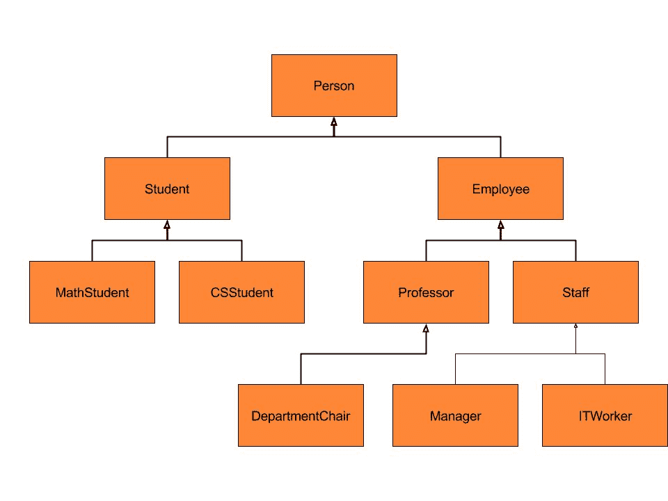
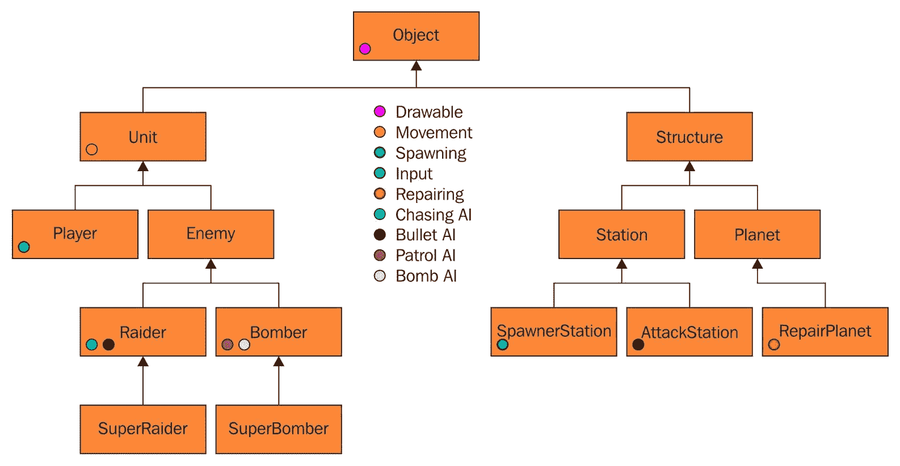
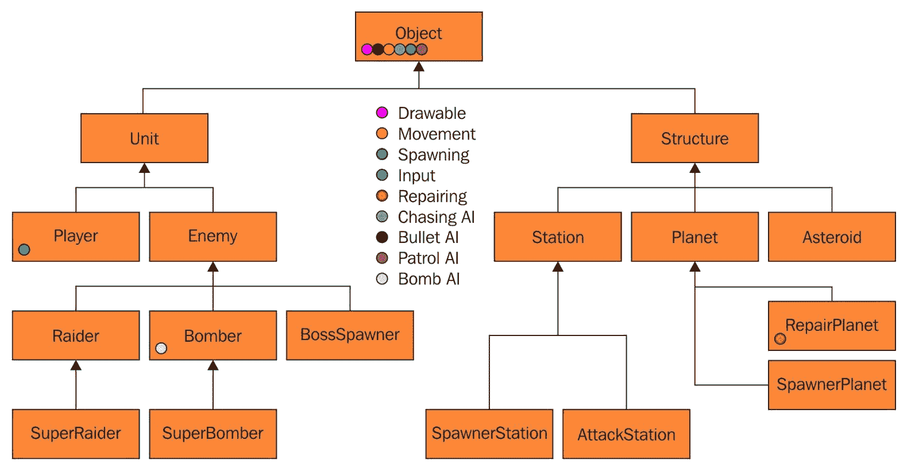
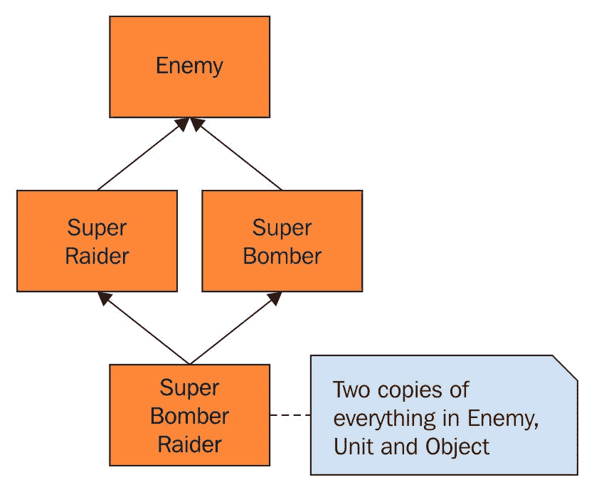
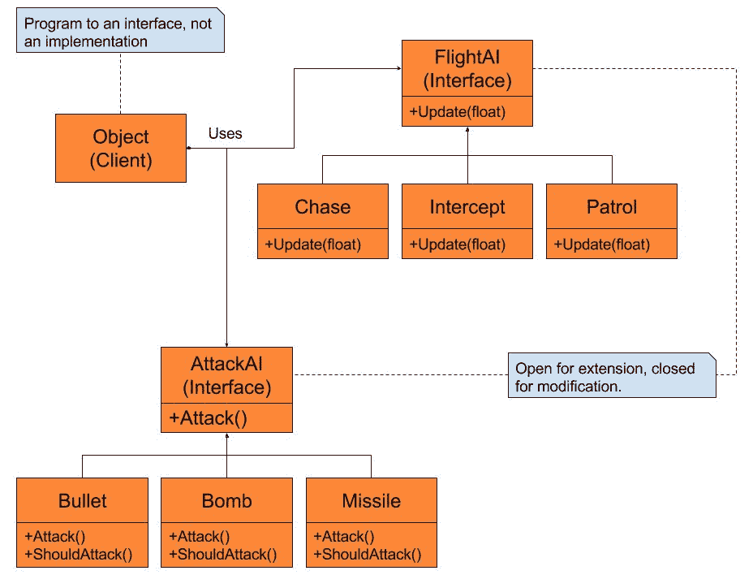
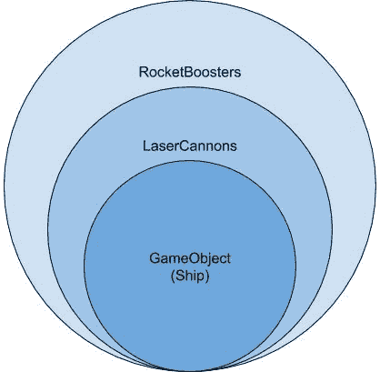
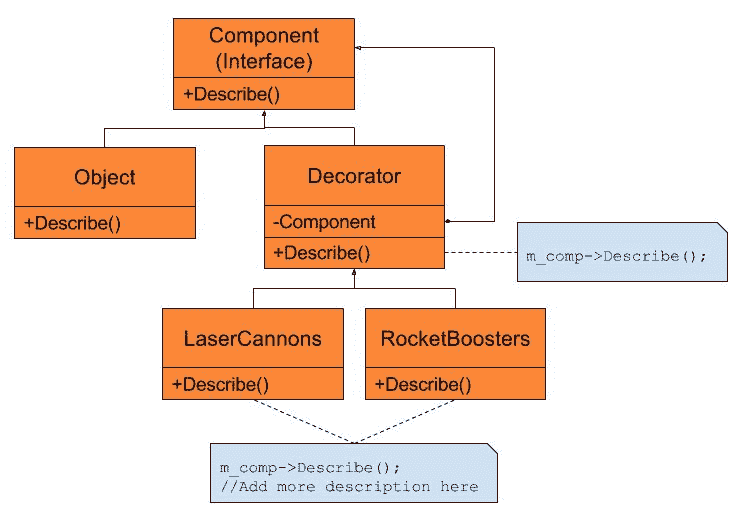
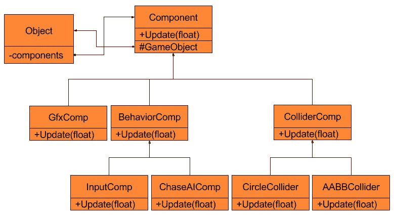

# 第三章：使用组件对象模型创建灵活性

在上一章中，我们看到了单例模式如何帮助我们解决创建和使用游戏核心引擎的问题。引擎代码被设计成可以与任何游戏一起工作，这意味着它没有任何游戏特定的内容。因此，随着游戏设计的演变，我们不需要担心游戏设计的变化会破坏我们的引擎。编写图形或物理引擎代码的目标是使其尽可能可重用或与游戏无关。这意味着当你完成当前游戏后，你应该能够几乎不需要或不需要修改就使用代码在下一款游戏中。实现这一目标的方法是将引擎代码与任何与特定游戏相关的代码分离。

另一方面，游戏对象完全特定于我们的游戏。如果游戏发生变化，所有我们的对象类型都需要相应地改变。如果我们正在制作平台游戏，突然改为制作太空射击游戏，我们的图形和物理引擎代码可能不需要改变。然而，每个游戏对象和行为都会改变。虽然这可能是最极端的例子，但事实是，我们的游戏对象很可能会发生很大变化。因此，让我们看看我们如何使用模式来解决这个虽然小但非常重要的游戏问题。

# 章节概述

在本章中，我们将专注于创建一个足够灵活的游戏对象，以便适应我们的游戏设计的变化。我们将首先查看新程序员创建游戏对象最常见的两种方式，以及使用这些方法时出现的问题。然后我们将讨论两种可以帮助我们解决问题的设计模式。最后，我们将得出创建可重用、灵活游戏对象的解决方案。由于我们知道我们的游戏设计和游戏对象很可能会发生变化，我们将回答以下问题：

+   是否可以以可重用的方式编写游戏对象？

+   我们如何将游戏对象与核心引擎代码解耦？

+   如果我们有一个可重用的游戏对象，我们如何使其足够灵活，以便在不同的游戏中使用或适应游戏设计在开发过程中的变化？

在这个过程中，我们将讨论一些重要的设计原则，这些原则将在本书中反复出现，并帮助你编写干净和稳固的代码。

# 你的目标

在本章中，我们将重点关注许多重要概念，并深入探讨一些有趣的代码。其中一些概念是关于不实现游戏对象的方法。学习错误的方法往往与学习正确的方法一样重要。以下是我们将涵盖的主题和本章的任务概述：

+   为什么单体游戏对象是一个糟糕的设计

+   为什么继承层次结构缺乏灵活性

+   学习和实现策略模式和装饰者模式

+   学习和实现组件对象模型

# 为什么单体游戏对象是一个糟糕的设计

当你将其分解为最简单的术语时，编程就是用代码解决问题。有人有一个游戏或应用程序的想法，需要解决的问题是如何逻辑且正确地向计算机描述这个想法。在日常工作中，这些问题通常以将你今天编写的代码与之前你或另一个程序员编写的代码集成在一起的形式出现。在解决问题时，总是在*简单的方式*和*正确的方式*之间进行不断的斗争。

解决问题的*简单方法*意味着以尽可能快的方式解决当前问题。这种方法的例子可能包括直接编写数字或字符串字面量而不是使用命名常量，复制代码而不是编写函数或重构代码到基类，或者只是不考虑其对整个代码库的影响而编写代码。

另一方面，以*正确的方式*解决问题意味着思考新代码将如何与旧代码交互。这也意味着思考如果设计发生变化，新代码将如何与未来代码交互。*正确的方式*并不意味着对问题只有一个正确的解决方案。通常有几种可能的方法可以达到相同的结果。编程中涉及的创造力是编程如此有趣的原因之一。

经验丰富的程序员知道，从长远来看，*简单的方式*往往最终会变得困难。这通常是因为快速修复解决了当前问题，但没有考虑到项目演变过程中可能发生的变化。

# 单一的游戏对象

制作游戏对象的*简单方法*是拥有一个包含游戏对象所需所有数据的单个`struct`。这似乎是正确的，因为游戏中的所有东西都有相同的基本数据。例如，我们知道玩家和敌人都有位置、缩放和旋转。所以我们的结构将看起来像这样：

```cpp
struct GameObject 
{ 
  //using vectors from the Mach 5 Engine 
  M5Vec2 pos; 
  M5Vec2 scale; 
  float rotation; 
};

```

这个游戏对象在理论上工作得很好，但它太基础了。确实，我们游戏中的所有东西可能都需要位置、缩放和旋转。即使是不可见的触发区域也需要这些属性。然而，就目前而言，我们无法绘制我们的对象：我们没有生命值，也没有造成伤害的方法。所以，让我们添加一些东西，使游戏对象更加真实：

```cpp
struct Object 
{ 
  //using vectors from the Mach 5 Engine 
  M5Vec2 pos; 
  M5Vec2 scale; 
  float rotation; 
  float damage; 
  int health; 
  int textureID;      //for drawing 
  float textureCoords[4]; //for sprite animation 
  unsignedchar color[4]; //the color of our image 
};

```

现在我们已经为我们游戏对象添加了一些更多基本元素。我们的大多数游戏对象类型都将拥有生命值和伤害，我们添加了一个纹理 ID，这样我们就可以绘制我们的游戏对象，还有一些纹理坐标，这样我们就可以使用精灵表进行动画。最后，我们添加了一个颜色，这样我们就可以重复使用相同的纹理，并为不同的敌人着色（想想南梦宫的*吃豆人*中的不同幽灵）。

目前这还不算太糟糕，但不幸的是，这只是开始。一旦我们开始制作真正的游戏而不是仅仅头脑风暴一个基本游戏对象，我们的结构成员数量就开始激增。

想象我们正在制作一个太空射击游戏。我们希望添加很多东西：

+   玩家将拥有多种类型的武器，每种武器造成的伤害量不同

+   玩家可能能够访问炸弹和导弹，每种都有弹药计数

+   导弹需要寻找目标

+   炸弹需要一个爆炸半径

+   有两个超级敌人，每个都拥有特殊能力并带有冷却时间

+   玩家和超级敌人都有使用护盾的能力

+   UI 按钮与点击它们相关的某些动作

+   我们有增加生命值和增加生命值的升级道具

+   我们需要给所有对象添加生命值计数，以考虑升级效果

+   我们应该给对象添加速度，并基于时间进行移动，而不是直接设置位置

+   我们需要添加一个游戏对象类型的枚举，以便我们可以正确更新它

现在我们来看看我们的游戏对象是什么样的：

```cpp
struct GameObject 
{ 
 M5Vec2    pos; 
 M5Vec2    scale; 
 M5Vec2    vel; 
 float     rotation;  
 ObjectType  type;     //Our object type enum 
 int       objectID;   //So the missile can target 
 int       lives; 
 int       shieldHealth; //For Player and SuperBomber 
 int       health; 
 float     playerLaserDamage; 
 float     playerIonDamage; 
 float     playerWaveCannonDamage; 
 float     superRaiderDamage; 
 float     superRaiderAbilityDamage; 
 float     superRaiderAbilityCoolDownTime; 
 float     superBomberDamage; 
 float     superBomberAbilityDamage; 
 float     superBomberAbilityCoolDownTime; 
 int       bombCount; 
 float     bombRadius; 
 int       missileCount; 
 int       missileTargetID; 
 int       textureID;    //the object image 
 float     textureCoords[4];//for sprite animation 
 unsigned  char color[4];    //the color of our image 
 Command*  command;     //The command to do 
};

```

如你所见，这种创建游戏对象的基本方法扩展性并不好。我们结构体中已经有了超过 25 个成员，我们甚至还没有讨论添加能够生成或修复单位的太空站。我们只有两种 BOSS 类型，我们可以通过允许不同敌人使用不同的玩家武器，如激光或导弹，来制作几种敌人类型，但我们仍然有限制。

这种方法的重大问题是，随着游戏的扩大，我们的游戏对象也必须变得非常大。某些类型，如玩家，将使用许多这些成员，但其他类型，如 UI 按钮，只会使用一小部分。这意味着如果我们有很多游戏对象，我们很可能每个对象都在浪费大量内存。

# 对象行为的问题

到目前为止，我们只考虑了游戏对象有哪些成员。我们还没有考虑每个对象的行为如何更新。目前，游戏对象只是数据。因为它没有函数，所以不能自我更新。我们可以轻松地为游戏对象添加一个`Update`函数，但为了正确更新每种类型的对象，我们需要一个`switch`语句：

```cpp
//Create our objects 
Object gameObjects[MAX_COUNT]; 

//initialization code here 
//... 

//Update loop 
for(int i = 0; i < objectInUse; ++i) 
{ 
  switch(gameObjects[i].type) 
  { 
    case OT_PLAYER: 
      //Update based on input 
      break; 
    case OT_SUPER_RAIDER: 
      //Add intercept code here 
      break; 
    case OT_SUPER_BOMBER: 
      //Add case code here 
      break; 
    case OT_MISSILE: 
      //Add find target and chase code here 
      break; 
    case OT_BOMB: 
      //add grow to max radius code here 
      break; 
    default: 
      M5DEBUG_ASSERT(true, "Incorrect Object Type"); 
  } 
}

```

再次强调，这种方法扩展性不好。随着我们添加更多对象类型，我们需要在`switch`语句中添加更多的情况。由于我们只有一个`struct`类型，我们需要在需要执行特定对象类型操作时，有一个`switch`语句。

如果我们添加行为，我们还将面临在对象中添加数据或将值硬编码到`switch`语句中的决策。例如，如果我们的炸弹增大尺寸，它是如何增大的？我们可以在`switch`语句中硬编码`scale.x *= 1.1f`，或者我们可以在我们的结构体中添加成员数据浮点`bombScaleFactor`。

最后，这种方法并不那么灵活。改变我们的设计非常困难，因为我们的代码中到处都是`switch`语句和公共成员。如果我们制作这样的游戏，那么几个月后我们的代码库就会变得一团糟。最糟糕的部分是，一旦游戏完成，我们就无法重用任何代码。游戏对象和所有行为都会非常特定于游戏玩法，除非我们制作续集，否则我们需要重新制作一个全新的游戏对象。

# 单一游戏对象的好处

值得注意的是，即使你选择这种方法，你仍然可以使你的核心引擎与游戏对象解耦。例如，在编写图形引擎时，我们不是将游戏对象作为参数传递给`Draw`函数，而是传递图形引擎需要的成员：

```cpp
void Graphics::SetTexture(int textureID); 
void Graphics::SetTextureCoords(const float* coordArray); 
void Graphics::Draw(const M5Mtx44& worldMtx); 
vs 
void Graphics::Draw(const Object& obj);

```

为创建这种对象进行另一个论点是，我们知道我们的游戏对象中确切有什么。与其他方法相比，我们永远不需要将我们的对象进行类型转换或搜索对象内的属性。这些操作使代码更复杂，并略有性能成本。通过使用简单的`struct`，我们直接访问变量，代码更容易理解。

我们可能唯一会使用这种方法的情况是，如果我们 100%确定对象类型数量不会很大，例如，如果你正在制作一个益智游戏，唯一的游戏对象是羊和墙壁。益智游戏通常非常简单，反复使用相同的机制。在这种情况下，这是一个好的方法，因为它简单，不需要花费时间构建复杂系统。

# 为什么继承层次结构不灵活

**玩家**、**敌人**、**导弹**和**医疗兵**都应该从一个基类派生出来的想法对于刚开始学习面向对象编程的程序员来说非常普遍。在纸面上，如果你有一个掠夺者和超级掠夺者，一个应该继承自另一个，这是非常有道理的。我认为这源于继承的教授方式。当你刚开始学习继承时，你几乎总是会看到一张类似这样的图片：



图 3.1 - 学习编程时典型的继承图

许多入门级编程课程过于关注继承的机制，以至于忘记了如何正确地使用它。像上面的图片这样的图示很容易让人理解 ITWorker 是 Employee，而 Employee 是 Person。然而，一旦你超越了机制，就是时候学习如何正确地使用继承。这就是为什么存在关于设计模式的书籍。

继承是一种强大的工具，它允许我们通过添加特定于派生类的成员和方法来扩展类。它允许我们从通用代码开始，创建更专业的类。这解决了我们在第一部分中遇到的极端膨胀的对象结构的一个原始问题。继承允许我们从一个现有的类，如 Raider，添加更多成员来创建 SuperRaider：

```cpp
//Inheritance Based Object: 
class Object 
{ 
  public: 
    Object(void); 
    virtual ~Object(void);//virtual destructor is important 
    virtual void Update(float dt); 
    virtual void CollisionReaction(Object* pCollidedWith); 
  protected: 
    //We still need the basic data in all object 
    M5Vec2 m_pos; 
    M5Vec2 m_scale; 
    float m_rotation; 
    int m_textureID; 
}; 

//Inheritance Based derived class 
class Unit: public Object 
{ 
  public: 
    Unit(void); 
    virtual ~Unit(void);   
    virtual void Update(float dt); 
    virtual void CollisionReaction(Object* pCollidedWith); 
  protected: 
    M5Vec2 m_vel;//So that Units can move 
    float m_maxSpeed; 
    float m_health; 
    float m_damage; 
}; 

class Enemy: public Unit 
{ 
  public: 
    Enemy(void); 
    virtual ~Enemy(void); 
    virtual void Update(float dt); 
    virtual void CollisionReaction(Object* pCollidedWith); 
  protected: 
    unsigned char m_color[4]; 
    float m_textureCoords[4];//For animation 
};

```


图 3.2 - 太空射击游戏继承层次结构的示例

这种层次结构在最初设计太空射击游戏时非常有意义。它允许我们将`Raider`类或`Bomber`类的细节与`Player`类分离。添加游戏对象很容易，因为我们可以通过扩展类来创建所需的内容。移除游戏对象也很容易，因为所有代码都包含在每个派生类中。实际上，现在我们有单独的类，每个类都可以通过类方法负责自己。这意味着我们不再需要在代码中到处使用`switch`语句。

最好的是，我们可以使用虚函数的力量将我们的派生类与游戏的核心引擎解耦。通过使用指向派生类实例的基类指针数组，我们的核心引擎，如图形或物理，仅与对象接口耦合，而不是与派生类，如`Planet`或`SpawnerStation`耦合。

没有继承层次结构，代码如下：

```cpp
//Create our objects 
Object gameObjects[MAX_COUNT]; 

//initialization code here 
//... 

for(int i = 0; i < objectsInUse; ++i) 
{ 
 switch(gameObjects[i].type) 
 { 
  case OT_PLAYER: 
   //Update based on input 
  break; 
  case OT_PLANET: 
   //Add intercept code here 
  break; 
  case OT_ENEMY_SPAWNER: 
   //Add case code here 
  break; 
  case OT_RAIDER: 
   //Add find target and chase code here 
  break; 
  case OT_BOMBER: 
   //Move slowly and do large damage code here 
  break; 
  default: 
   M5DEBUG_ASSERT(true, "Incorrect Object Type"); 
 } 
}

```

使用继承和多态，代码如下：

```cpp
//Create our objects 
Object* gameObjects[MAX_COUNT];//array of pointers 

//initialization code here 
//... 

for(int i = 0; i < objectsInUse; ++i) 
gameObjects[i]->Update(dt);

```

# 按照代码的功能而不是它的本质来组织代码

真正的区别在于 Raider 和 Bomber 吗？Raider 和 SuperRaider 有何不同？也许它们有不同的速度、不同的纹理和不同的伤害值？这些数据的变化真的需要一个新的类吗？这些其实只是不同的值，而不是不同的行为。问题是，我们正在创建额外的类，因为 Raider 和 SuperRaider 的概念是不同的，但它们的行为并没有差异。

我们的实际类层次结构违反了我教授的三个原则，其中两个是从四人帮的书中学到的：

“保持你的继承树浅”

“优先使用对象组合而不是类继承” —— 四人帮，第 20 页

“考虑在设计中的哪些部分应该是可变的。这种方法与关注重新设计的起因相反。与其考虑什么可能迫使设计发生变化，不如考虑你希望在无需重新设计的情况下能够改变的内容。这里的重点是封装变化的概念，这是许多设计模式的主题” —— 四人帮，第 29 页

表述第三原则的另一种方式如下：

“找出变化的部分并将其封装”

这些原则旨在消除或完全避免在使用继承时可能和将会出现的问题。

我们当前设计的问题在于，如果我们为每种对象类型创建一个新的类，我们最终会得到很多小类，它们大部分是相同的。掠夺者、超级掠夺者、轰炸机和超级轰炸机大部分相同，只有一些细微的差异，其中一些只是`float`和`int`值的差异。虽然这种方法可能看起来比“简单方法”有所改进，但它成为一个问题，因为我们将在许多类中反复编写相同的行为代码。如果我们有很多敌人，我们可能会在每一个`Update`函数中编写相同的`ChasePlayerAI`基本代码。唯一的解决方案是将`ChasePlayerAI`移动到基类中。

让我们再次看看我们的太空射击层次结构，但这次，让我们在我们的类中添加一些不同的行为：



图 3.3 - 在我们的对象中添加行为之后（参考图形包）

我们已经决定，我们的基`object`类至少应该是可绘制的，以使事情简单。如果一个像触发区域这样的对象需要不可见，我们只需通过在可绘制行为中放置一个`bool`来简单地支持禁用渲染，这样它就不会被绘制。然而，使用这种游戏对象方法，我仍然有一些重复的代码。`Raider`类和`AttackStation`类都有一些针对玩家进行瞄准和射击子弹的 AI。我们只重复了一次代码，所以可能不是什么大问题。

不幸的是，所有的游戏设计都会发生变化。当我们的设计师想要在我们的游戏中添加小行星时会发生什么？从技术上讲，它们是结构，因此需要从那个类继承一些数据，但它们也会移动。我们的设计师也非常喜欢`SpawnerStation`类，并希望将那种能力添加到一个新的`SpawnerPlanet`类和一个新的`BossSpawner`类中。我们应该再次重写代码两次，还是将代码重构到基类中？我们的设计师还希望赋予`Station`类在区域内缓慢巡逻的能力。这意味着`Station`类也需要巡逻 AI 能力。现在让我们看看我们的层次结构：



图 3.4 - 在将重复的代码重构到基类之后（参考图形包）

结果表明，这种方法并不像最初看起来那样灵活。为了使我们的设计真正灵活，几乎所有的行为都需要被分解到基类中。最终，我们并没有比用“简单方法”编写我们的游戏对象时好多少。而且，我们的设计师仍然可能想要创建一个追逐玩家的`RepairHelper`，这意味着所有东西都将位于基类中。

这可能听起来像是一个人为的例子，但请记住，游戏开发可能需要数年，并且很可能会发生变化。DMA Design 的《侠盗猎车手》最初被命名为《Race'n'Chase》，但后来因为一个错误导致警察试图将玩家赶下马路而不是将其拦下。这最终变得更有趣。另一个例子是 Blizzard 的第一人称射击游戏《Overwatch》，它最初作为一款大型多人在线游戏开发了 7 年。

面向对象编程的目的是认识到设计会发生变化，并考虑到这种变化来编写代码。

我们使用继承方法时的另一个问题是，在运行时添加或删除能力并不容易。假设我们的游戏有一个特殊升级物品，可以让玩家使用护盾 1 分钟。护盾将在 1 分钟内吸收玩家受到的 50%的伤害，然后自行移除。我们现在的问题是确保当子弹与护盾碰撞时，它将部分伤害转移到玩家身上。护盾不仅负责自己，还负责玩家对象。

这种相同的情况存在于所有将在一段时间内影响另一个游戏对象的事物中。想象一下，如果我们想让我们的掠夺者能够在 5 秒内对玩家造成酸伤害。我们需要一种方法将这种酸伤害附加到玩家身上，并在 5 秒后记住移除它。我们可以在`Player`类中添加新的变量，例如`bool hasAcid`和`float acidTime`，这样我们就可以知道在这个帧上是否应该造成酸伤害。然而，这仍然不是一个灵活的解决方案，因为每种新的随时间造成的伤害类型都需要这样的新变量。

此外，如果三个敌人用酸伤害攻击玩家，就没有办法堆叠酸伤害效果。如果我们喜欢这种能力，并希望玩家使用它，我们还需要给所有游戏对象这些额外的基于时间的伤害变量和行为代码。我们真正想做的就是在运行时将酸行为（或任何效果）附加到游戏对象上，并在效果结束时自动将其移除。我们将在本章后面讨论如何做到这一点，但首先我们需要讨论与 C++中的继承层次结构相关的一个更多问题。

# 避免死亡钻石

我们使用继承方法时遇到的最終問題涉及我们将代码重用推向極端的情况。在我们的层次结构中，我们有`SuperRaider`，它非常快，很弱，并且射击小子弹。我们还有`SuperBomber`，它很慢，很强，并且射击大炸弹。有一天，一个聪明的設計師會想要創建一個非常快、很强，并且能夠射擊小子和大炸彈的`SuperBomberRaider`。以下是我们的部分樹：



图 3.5 - 死亡钻石的示例

当然，这被称为**死亡钻石**（或**可怕的死亡钻石**），之所以这样命名是因为继承树形成了一个钻石形状。问题是我们的`SuperBomberRaider`同时继承自`SuperBomber`和`SuperRaider`。这两个类各自继承自`Enemy`、`Unit`和`object`。这意味着`SuperBomberRaider`将会有两份`m_pos`、`m_scale`、`m_rotation`以及`object`、`Unit`和`Enemy`的每一个成员。

`Object`、`Unit`和`Enemy`中包含的任何函数也都会有两份副本。这意味着我们需要指定我们希望使用的函数版本。这听起来可能不错，因为我们从两个类中获得了行为，但请记住，单个基类函数只会修改它们自己的变量版本。在调用`SuperRaider::Update`和`SuperBomber::Update`之后，我们现在需要确定在绘制我们的对象时我们想要使用哪个版本的`m_pos`（以及`m_scale`和`m_rotation`）。

C++有解决这个问题的方法，但大多数程序员都认为这种解决方案使得事情更难以理解，也更难以使用。一般来说，我们应该避免使用多重继承。我们已经看到了它可能引起的一些问题，而且我们甚至还没有讨论在这种情况下使用`new`和`delete`可能引起的错误。

# 策略模式和装饰者模式

我们看到，在尝试使我们的游戏对象更加灵活的过程中，很多行为都被分解到了基类中。我们也说过，在运行时附加行为并在我们完成时将其分离会很好。

实际上，有两种设计模式有可能帮助我们进行设计，即策略模式和装饰者模式。策略模式主要关于封装一系列行为而不是继承。装饰者模式主要关于根据需要动态地添加责任。

# 策略模式解释

策略模式是关于封装一系列行为，并通过接口让客户端控制行为，而不是将行为硬编码到客户端函数本身中。这意味着我们希望游戏对象完全独立于它所使用的行为。想象一下，如果我们想给每个敌人分配不同的攻击和飞行 AI，我们可以使用策略模式而不是创建继承树：

```cpp
class Enemy: public Unit 
{ 
  public: 
    Enemy(void); 
    virtual ~Enemy(void); 
    virtual void Update(float dt); 
    virtual void CollisionReaction(Object* pCollidedWith); 
  protected: 
    unsigned char m_color[4]; 
    FlightAI*   m_flight; 
    AttackAI*   m_attack; 
};

```

在这种情况下，我们的客户端是`Enemy`类，客户端控制的接口是`AttackAI`和`FlightAI`。这比从`Enemy`继承要好得多，因为我们只封装了变化的部分：行为。这种模式允许我们创建任意数量的`FlightAI`派生类，并将它们重用来创建不同种类的游戏对象类型，而无需扩展我们的继承树。由于我们可以混合不同的策略组合，我们可以得到大量不同的整体行为。

我们将共享单位和结构相同的策略，因此我们应该完全删除我们的继承树，只使用`Object`作为我们的客户端。这样，`Object`类就变成了策略的集合，我们的设计更简单。此外，我们遵循了一些优秀的编程原则：

+   面向接口编程意味着我们的客户端依赖于抽象类中的行为，而不是在客户端本身放置行为。

+   我们的开界面对扩展是开放的，这样我们就可以轻松地添加我们需要的任何行为。接口很简单，因此不需要更改，这可能会破坏代码。

+   我们的继承树很浅，所以我们不需要担心死亡钻石问题。



图 3.6 - 使用策略模式的我们的对象示例

策略模式允许我们的游戏对象非常灵活，而无需继承树。通过前面图中显示的这六个小类，我们可以拥有总共九种不同的游戏对象行为。如果我们添加一个新的**FlightAI**，我们就有 12 种可能的游戏对象行为。创建全新的策略允许有大量的混合行为。然而，如果我们只扩展两种策略，我们根本不需要修改**对象**。这对玩家也适用，如果我们创建一个**AttackAI**和一个**FlightAI**，它们可以访问输入。

只保留两种策略是不太可能的，这意味着每次我们添加一个新的策略时，我们都需要通过添加一个新成员和修改`Update`函数来改变**对象**。这意味着虽然这个模式足够灵活，可以让我们在运行时更改策略，但我们不能动态地添加行为。如果我们需要在游戏中添加酸伤害作为减益效果，我们需要一个`Damage`基类，并将`Damage`基类指针赋予`object`：

```cpp
class Object 
{ 
  public: 
    //Same as before... 
  protected: 
     //Other Object Strategies 
     //... 
     Damage* m_damage. 
};

```

这似乎不是一个很好的解决方案，因为大多数伤害都是瞬时的，而且大多数时候，玩家甚至没有受到伤害。这意味着这将要么是 null，要么是一个空的策略类，例如使用一个`NoDamage`派生类，它将每帧更新但不会做任何事情。这也不是堆叠腐蚀效果或让两种类型的伤害影响玩家，例如腐蚀伤害和冰伤害，这可能会让玩家移动速度变慢 10 秒的方法。我们真的需要一种动态添加和删除这些能力的方法。幸运的是，有一个模式可以做到这一点。

# 装饰者模式解释

装饰者模式的目的是在运行时动态地向对象添加责任。目标是提供一个灵活的替代方案来创建派生类，同时仍然允许扩展行为。这意味着我们可以将我们的`object`添加装饰或，在我们的情况下，在运行时添加行为。

这个模式要求 `Decorator` 和我们的 `object` 都从一个公共基类派生，这样它们就共享相同的接口。然后每个 `Decorator` 将在其上添加自身，以创建更有趣的对象类型和效果。当一个函数在 `Decorator` 上被调用时，它将调用下一层的相应函数，最终调用 `object` 的函数。在概念上与 *俄罗斯套娃* 类似，套娃内部包含越来越小的版本。最内层的最终对象总是具有核心功能的对象：



图 3.7 - 装饰者模式的层叠效果

下面是一个简化的代码版本：

```cpp
class Component //Our base interface 
{ 
  public: 
    virtual ~Component(void) {} 
    virtual std::string Describe(void) const = 0; 
}; 

class Object: public Component //Our core class to decorate 
{ 
  public: 
    Object(const std::string& name):m_name(name){} 
    virtual std::string Describe(void) const 
  { 
    return m_name; 
  } 
  private: 
    std::string m_name; 
}; 

//Our base and derived Decorators 
class Decorator: public Component 
{ 
  public: 
    Decorator(Component* comp):m_comp(comp){} 
    virtual ~Decorator(void) { delete m_comp; } 
  protected: 
    Component* m_comp; 
}; 

class RocketBoosters: public Decorator 
{ 
  public: 
    RocketBoosters(Component* comp) : Decorator(comp) {} 
    virtual std::string Describe(void) const 
  { 
    return m_comp->Describe() + " with RocketBoosters"; 
  } 
}; 

class LaserCannons: public Decorator 
{ 
  public: 
    LaserCannons(Component* comp) : Decorator(comp) {} 
    virtual std::string Describe(void) const 
  { 
    return m_comp->Describe() + " with LaserCannons"; 
  } 
};

```



图 3.8 - 使用我们的对象实现的装饰者模式

```cpp
//Using this code: 
int main(void) 
{ 
  Component* ship = new Object("Player"); 
  std::cout << ship->Describe() << std::endl; 
  delete ship; 

  Component* rocketShip = new RocketBoosters(new 
     GameObject("Enemy")); 
  std::cout << rocketShip->Describe() << std::endl; 
  delete rocketShip; 

  Component* laserRocketShip = new LaserCannons(new 
     RocketBoosters(new GameObject("Boss"))); 
  std::cout << laserRocketShip->Describe() << std::endl; 
  delete laserRocketShip; 
}

```

`Decorator` 类层叠我们的具体 `object` 类，并在 `object` 上添加更多信息。然而，目前我们只是在添加表面装饰。由于 `Decorator` 类不知道它是否有指向 `object` 类或另一个 `Decorator` 的指针，它不能修改 `object`。一个很好的类比是，策略模式改变对象的内部结构，而装饰者模式改变对象的皮肤。这可能很有用，但并不能帮助我们解决增益/减益问题。为了解决这个问题，我们需要添加一个方法来沿着链找到 `object`，或者在 `Decorator` 的构造函数中提供一个指向 `object` 的指针。

另一个问题是这个模式被设计用来动态添加 `Decorator`，但不允许我们移除一个。在使用腐蚀伤害 `Decorator` 的情况下，我们只想让它存在一段时间，然后自动断开连接。这是不可能的，因为 `Decorator` 没有指向其父级的指针。

游戏的最终问题是我们不能让 `Decorators` 孤立存在。有时，不同的游戏玩法可能需要相互交互。例如，腐蚀伤害 `Decorator` 可能会影响 `object` 的健康；然而，它可能首先需要检查 `object` 是否有护盾 `Decorator` 并从护盾中扣除健康。

不幸的是，装饰者模式和策略模式都无法完美地为我们工作。我们真正需要的是一个结合策略模式和装饰者模式的新模式，它能够做到以下事情：

+   将特定行为封装到组件中，这样我们就避免了 `Object` 继承树

+   允许有灵活数量的组件，这样我们就不需要每次创建新的组件类型时都修改 `Object`

+   允许我们在运行时添加和移除组件

+   使组件能够直接访问 `Object` 以便进行修改

+   允许组件被其他组件搜索以便它们可以交互

# 解释组件对象模型

虽然这个替代方案可以用许多名字来称呼，但还没有一个确切的名称。在这本书中，我们将称之为**组件对象模型**，但其他人称之为**实体组件系统**或只是**组件系统**。无论你叫它什么，这个概念的学习非常简单，实现起来也很容易。

组件对象模型颠倒了装饰器模式的概念，其中每个`Decorator`都在游戏对象之上添加了一层新层。而不是分层我们的`对象`，我们已经看到这会带来问题，我们将装饰物放在它的内部。由于我们不知道需要多少，我们的`对象`将包含一个装饰物的容器，而不是一个单独的指针。在最简单的情况下，我们的`对象`不过是一个这些组件的容器。

如果你在网上搜索组件对象模型（或基于组件的对象模型），你将得到与我们在策略模式中看到的结果相似的结果。对象包含对每个可能策略的硬编码指针。虽然单独使用这种方法比使用单体对象或基于继承的对象要好得多，但我们仍然被困在检查空指针或不断修改我们`对象`中存在的策略。

在这种方法中，每种策略类型都将从一个公共接口派生。这样，我们的`对象`可以包含一个数组，或者在我们的情况下是一个基类`Component`指针的 STL 向量。这就像`Decorator`，除了我们的`对象`是一个独立的类；它不派生自`Component`接口。相反，一个`Component`将有一个指向其父`对象`类的指针。这解决了`Decorator`不知道它持有的是另一个`Decorator`的指针，还是实际`对象`的指针的问题。在这里，我们通过始终给我们的`Component`提供一个指向它控制的`对象`的指针来避免这个问题：

```cpp
//Using only Strategy Pattern 
class Object 
{ 
  public: 
    void Update(float dt);//Non virtual function to update 
       Strategies 
 //Other interface here 
 //... 
  private://Lots of different Strategies 
    GfxComp*   m_gfx; 
    BehaviorComp* m_behavior; 
    ColliderComp* m_collider; 
}; 

//Using Flexible Component Object Model 
class Object 
{ 
  public: 
    void Update(float dt);//Non virtual function to update 
       Components 
    //Other interface here 
 //... 
  private: 
    std::vector<Component*> m_components. 
}; 

//Our Base Component 
class Component 
{ 
  public: 
    virtual void Update(float dt) = 0; 
  protected: 
    Object* m_obj; 
};

```



图 3.9 - 组件对象模型

这种方法使我们非常灵活，因为我们的`对象`不过是一系列组件。里面没有特定于任何类型的特定内容。没有严格为玩家或 SuperRaider 编写的代码。我们可以在运行时自由添加、更改或删除任何内容。这很重要，因为在开发的早期阶段，游戏设计和游戏对象会发生变化很多。如果我们对不同的基类`Strategies`进行硬编码指针，我们将在游戏对象中花费大量时间更改这些指针类型。

使用组件对象模型使我们的代码几乎完全可重用。游戏对象本身只是一个空的组件容器，而且它们通常非常简单，大多数组件，如**CircleCollider**，都可以在任何游戏中使用。这意味着原本只为玩家或 SpawnerStation 设计的行为组件可以很容易地用于任何游戏对象。

# 实现组件对象模型

现在我们已经看到了代码和图示的基本版本，让我们看看 Mach5 引擎是如何实现这个系统的。正如您将看到的，所谓的 `M5object` 包含位置、旋转、缩放和速度。当然，这些元素可以包含在一个变换组件中；然而，这些元素非常常见，大多数其他组件都需要访问这些信息。这与纹理坐标或圆形碰撞器的半径等数据不同，这些数据可能根本不需要共享：

```cpp
//Component based Game object used in the Mach 5 Engine 
class M5Object 
{ 
  public: 
    M5Object(M5ArcheTypes type); 
    ~M5Object(void); 

    //Public interface 
    void     Update(float dt); 
    void     AddComponent(M5Component* pComponent); 
    void     RemoveComponent(M5Component* pComponent); 
    void     RemoveAllComponents(void); 
    void     RemoveAllComponents(M5ComponentTypes type); 
    int     GetID(void) const; 
    M5ArcheTypes GetType(void) const; 
    M5Object*  Clone(void) const; 
    template<typename T> 
    void GetComponent(M5ComponentTypes type, T*& pComp); 
    template<typename T> 
    void GetAllComponents(M5ComponentTypes type,
       std::vector<T*>& comps); 

    M5Vec2    pos;    
    M5Vec2    scale;    
    M5Vec2    vel;    
    float    rotation;  
    float    rotationVel; 
    bool     isDead; 
  private: 
    //Shorter name for my vector 
    typedef std::vector<M5Component*> ComponentVec; 
    //Shorter name for my iterator 
    typedef ComponentVec::iterator  VecItor; 

    ComponentVec m_components; 
    M5ArcheTypes m_type;      
    int     m_id;       
    static int  s_objectIDCounter; 
};

```

您首先会注意到，这段代码中有两个枚举，`M5ArcheTypes` 和 `M5ComponentTypes`。当我们谈到创建工厂时，这些将变得更有用。然而，现在，理解这些将允许我们在 `M5objects` 集合中搜索并获取所需的组件就足够了。例如，如果我们有一个 `M5objects` 集合，但我们需要找到玩家，`M5ArcheTypes` 枚举将允许我们做到这一点。

您接下来会注意到，`M5object` 不仅仅是一个组件的容器。它有一些公共和私有数据。公共数据不太可能需要验证或保护。我们可以创建获取器和设置器，但它们实际上只是简单地获取和设置数据，所以并不是绝对必要的。由于它们是公共的，我们将永远锁定为公共。如果您希望将它们设置为 `private` 并创建 `accessor` 方法，那也是可以的。有一些非常重要的变量我们希望是私有的。ID 和类型一旦设置就不能更改，并且组件数组通过添加、删除和清除所有组件的函数进行访问。让我们首先讨论公共变量的用途：

+   `pos`: `M5Object` 的位置。这是物体的旋转中心或支点。

+   `scale`: 旋转前的 `M5Object` 的高度和宽度。

+   `vel`: `M5Object` 的速度。这用于基于时间的移动，而不是简单地设置位置为正负某个值。

+   `rotation`: 以弧度为单位的旋转。正旋转是逆时针方向。

+   `rotationalVel`: `M5Object` 的旋转速度，用于基于时间的旋转。

+   `isDead`: 这允许 `M5Object` 标记自己以供删除。其他对象或组件可以自由调用 `M5ObjectManager` 中找到的 `DestroyObject` 函数之一；然而，在对象的 `Update` 函数中间删除对象并不是一个好主意。

我们将这些作为 `M5object` 的一部分，因为它们非常常见，所有或几乎所有组件都需要访问它们。我们将它们标记为公共的，因为没有必要对数据进行验证或保护。

私有部分从两个类型 `defs` 开始。它们允许我们为模板类型创建更短的名字。这仅仅是一个风格选择。另一个风格选择是在所有私有成员变量名前加上 `m_`。这或类似的做法是类成员的常见做法。我们没有对公共成员这样做，因为我们更倾向于将它们视为属性。现在让我们看看其余的私有数据：

+   `m_components`：这是一个 `M5Component` 指针数组。向量中的每个组件都会在 `Update` 函数中被更新。

+   `m_type`：对象的类型。它将在构造函数中设置，并且永远不会改变。它允许用户使用 `M5ObjectManager` 根据类型搜索或删除对象。

+   `m_id`：这是 `M5Objects` 之间的唯一 ID。在导弹需要针对特定实例的对象的情况下可能很有用。如果导弹包含指向目标对象的指针，它就无法知道该对象是否已被销毁。如果我们知道 ID，我们可以搜索以查看目标是否仍然存在。

+   `s_objectIDCounter`：这是所有 `M5Objects` 的共享 ID 计数器。这保证了每个对象都会得到一个唯一的值，因为它们都在使用相同的共享变量。注意，这个变量被标记为 `s_` 以表示它是静态的。

这就是 `object` 中的所有数据。现在，让我们看看函数。

`M5object` 是类的构造函数。它设置了变量的起始值，以及设置类型和唯一 ID。注意，我们为向量预留了一定量的起始空间。一个游戏对象可以有它需要的任何数量的组件，但在实际游戏中，我们并不期望它们的平均数量超过几个。通过预分配，我们可以避免任何额外的 `new` 调用（我们无论如何都会做很多）：

```cpp
M5Object::M5Object(M5ArcheTypes type) : 
pos(0, 0), 
  scale(1, 1), 
  vel(0, 0), 
  rotation(0), 
  rotationVel(0), 
  isDead(false), 
  m_components(), 
  m_type(type), 
  m_id(++s_objectIDCounter) 
{ 
  m_components.reserve(START_SIZE); 
}

```

`~M5object` 是我们游戏对象的析构函数。在这里，我们想要确保删除游戏对象中的所有组件，因此我们使用了一个公共函数来帮助我们：

```cpp
M5Object::~M5Object(void) 
{ 
  RemoveAllComponents(); 
}

```

`AddComponent` 将给定的组件指针添加到这个对象向量中。你将注意到，在添加组件之前，你需要首先检查确保相同的指针还没有在列表中。虽然这种情况不太可能发生，但它可能是一个难以发现的严重错误，所以进行检查是值得的。当给一个组件时，使用 `M5Component` 的 `SetParent` 方法也很重要，以确保这个对象将由组件控制：

```cpp
void M5Object::AddComponent(M5Component* pToAdd) 
{  
  //Make sure this component doesn't already exist 
  VecItor found = std::find(m_components.begin(), 
     m_components.end(), pComponent); 

  if (found != m_components.end()) 
   return; 

  //Set this object as the parent 
  pComponent->SetParent(this); 
  m_components.push_back(pComponent); 
}

```

`Update` 是 `M5object` 中最常用的函数。这个函数将由 `M5ObjectManager` 在每一帧自动调用。它用于更新每个组件，以及根据它们的速度更新位置和旋转。`Update` 函数的另一个重要作用是删除任何已死亡的组件。除了 `RemoveAllComponents` 函数外，这是删除组件的唯一地方：

```cpp
void M5Object::Update(float dt) 
{ 
  int endIndex = m_components.size() - 1; 
  for (; endIndex >= 0; --endIndex) 
  { 
    if (m_components[endIndex]->isDead) 
    { 
      delete m_components[endIndex]; 
      m_components[endIndex] = m_components[m_components.size() 
         - 1]; 
      m_components.pop_back(); 
    } 
    else 
    { 
      m_components[endIndex]->Update(dt); 
    } 
  } 
//Update object data 
  pos.x  += vel.x * dt; 
  pos.y  += vel.y * dt; 
  rotation += rotationVel * dt; 
}

```

`RemoveComponent`用于处理对象上有增益或减益效果的情况，你希望舞台或其他对象删除它。例如，玩家可能在使用护盾，但在被电离子伤害击中后，物理碰撞体找到护盾并立即将其移除。除了使用此方法外，简单地标记组件为已死亡并在下一个更新循环中清理它也是可以的。

这段代码遵循与`AddComponent`函数相似的模板。首先，我们检查组件是否存在。如果存在，我们将它与向量中的最后一个元素交换位置，然后从向量中弹出。之后，我们使用`SetParent`方法在删除之前将此对象作为父指针移除。这是一个小的预防措施，因为，如果存在指向此组件的另一个指针，程序将崩溃而不是产生未定义的错误：

```cpp
void M5Object::RemoveComponent(M5Component* pComponent) 
{ 
  //Make the sure the instance exists in this object 
  VecItor end = m_components.end(); 
  VecItor itor = std::find(m_components.begin(), end, pToRemove); 

  if (itor != end) 
    return; 

  (*itor)->isDead = true; 
}

```

`RemoveAllComponents`是用于析构函数的辅助函数。它删除对象中的所有组件。除了析构函数外，可能没有太多用途。然而，它被公开，以便在那些罕见的情况下，你需要这种行为。此函数简单地遍历向量并删除每个组件，然后最终清空向量：

```cpp
void M5Object::RemoveAllComponents(void) 
  { 
  VecItor itor = m_components.begin(); 
  VecItor end = m_components.end(); 
  while (itor != end) 
  { 
    delete (*itor); 
    ++itor; 
  } 
  m_components.clear(); 
}

```

`RemoveAllComponents`的第二个版本会移除特定类型的所有组件。这是另一种情况，外部代码，如舞台、对象或甚至另一个组件需要移除同一类型的组件组。例如，这可以用来移除玩家身上的所有腐蚀性伤害效果。

在这段代码中，我们正在寻找正确的类型，因此不能使用`std::vector::find`方法。相反，我们使用一个`for`循环并检查每个组件的类型。如果我们找到正确的类型，我们就删除当前的一个，与末尾交换，然后弹出。由于我们在进行交换的同时继续搜索，我们必须确保再次检查当前索引是否匹配：

```cpp
void M5Object::RemoveAllComponents(M5ComponentTypes type) 
{ 
   for (size_t i = 0; i < m_components.size(); ++i)  
   { 
    if (m_components[i]->GetType() == type) 
     m_components[i]->isDead = true; 
  } 
}

```

`GetComponent`和`GetAllComponents`是辅助函数，用于在`M5object`中查找和转换特定的组件类型，如果它们存在。正如我之前所说的，有时组件之间的交互是必要的。在这种情况下，我们需要一种方法来搜索特定的组件并将其转换为正确的类型。这两个函数几乎相同。第一个找到正确组件类型的第一个实例并将其分配给指针参数。如果不存在，我们确保将参数设置为`0`。第二个找到所有正确类型的组件并将它们保存在向量参数中。这些是模板函数，因此组件可以被转换为用户提供的正确类型：

```cpp
template<typename T> 
void M5Object::GetComponent(M5ComponentTypes type, T*& pComp) 
{ 
  size_t size = m_components.size(); 
  for (size_t i = 0; i < size; ++i) 
  { 
    //if we found the correct type, set and return 
    if (m_components[i]->GetType() == type) 
    { 
      pComp = static_cast<T*>(m_components[i]); 
      return; 
    } 
  } 
  pComp = 0; 
} 

template<typename T> 
void GetAllComponent(M5ComponentTypes type, std::vector<T*>& comps) 
{ 
  size_t size = m_components.size(); 
  for (size_t i = 0; i < size; ++i) 
  { 
    //if we found the correct type, add to vector 
    if (m_components[i]->GetType() == type) 
    comps.push_back(static_cast<T*>(m_components[i])); 
  } 
}

```

`GetID`和`GetType`函数仅返回私有类数据。`Clone`方法更有趣，但当我们讨论原型模式时，我们会更详细地介绍它。

# 实现组件

现在你已经看到了 `M5object`，让我们看看 Mach5 引擎如何创建和使用组件层次结构。由于这是一个抽象类，无法创建 `M5Component` 的实例。它只是一个接口。

正如你所看到的，基组件包含与 `M5object` 相同的一些成员。由于我们将有很多组件，因此为每个组件指定一个类型很重要，这样它们就可以被搜索。为每个组件提供一个唯一的标识符也很重要。由于这些组件可以在任何时候被删除，因此保存一个 ID 而不是指针很重要，因为指针可能会变得无效：

```cpp
class M5Component 
{ 
  public: 
    M5Component(M5ComponentTypes type); 
    virtual ~M5Component(void); 
    virtual M5Component* Clone(void) = 0; 
    virtual void Update(float dt)= 0; 
    virtual void FromFile(M5IniFile&); 
    void SetParent(M5Object* pParent); 
    M5ComponentTypes GetType(void) const; 
    int GetID(void) const; 
 //public data 
    bool isDead; 
  protected: 
    M5Object* m_pObj; 
  private: 
    int m_id; 
    M5ComponentTypes m_type; 
    staticint    s_compIDCounter; 
};

```

数据部分不包含像 `M5object` 那么多的内容，但现在它被分为三个部分，即 `public`、`private` 和 `protected`：

+   `isDead`: 这是唯一的公共数据，它起着与游戏对象中成员类似的作用。这允许组件为自己标记为删除。在组件自己的 `Update` 函数中调用 `RemoveComponent` 并不是一个好主意。

+   `m_pObj`: 这是一个指向拥有此组件的 `M5Object` 的指针。

+   `m_id`: 此组件的唯一标识符。这允许用户再次访问这个特定的组件，而不会存在保存可能变得无效的指针的风险。

+   `m_type`: 此组件的类型。这允许用户在游戏对象中搜索特定的组件。

+   `s_compIDCounter`: 这用于为每个组件创建一个唯一的标识符。

`M5Component` 的功能并不那么有趣，因为它们大多是虚拟的。然而，了解它们的目的还是值得的。

`M5Component` 是组件的非默认构造函数。它接受一个 `M5ComponentTypes` 类型的参数，以确保私有数据 `m_type` 被派生类型设置：

```cpp
M5Component::M5Component(M5ComponentTypes type): 
  isDead(false), 
  m_pObj(0), 
  m_type(type), 
  m_id(++s_componentID) 
{ 
}

```

`~M5Component` 是类的析构函数。由于这是一个基类，存在一个虚析构函数非常重要，这样在多态使用时将调用正确的方法：

```cpp
M5Component::~M5Component(void) 
{ 
  //Empty Base Class virtual destructor 
}

```

`Update` 是组件执行动作的地方。这个方法会在每一帧被调用，其目的是向 `M5object` 添加行为和/或数据。它被标记为纯虚函数 (`= 0`)，这样基类就必须重写它。这也意味着基类版本没有函数体。

`FromFile` 是一个虚拟函数，允许组件从预加载的 INI 文件中读取数据。它没有被标记为纯虚函数，这意味着组件不需要重写这个函数。如果派生组件没有从文件中加载的数据，这种情况可能发生：

```cpp
void M5Component::FromFile(M5IniFile&) 
{ 
  //Empty for the base class 
}

```

`SetParent` 方法仅仅是 `m_pObj` 的设置器。回想一下 `M5object` 的 `AddComponent` 函数。当一个组件被添加到对象中时，对象会使用这个函数，这样组件就知道要控制哪个对象。

`GetType` 和 `GetID` 函数与 `M5object` 中的函数类似。它们允许组件可搜索和保存，而无需使用可能变得无效的指针。`M5Component` 还有一个纯虚的 `Clone` 方法。基类中没有函数体。当我们讨论原型模式时，我们将讨论 `M5Component` 和 `M5object` 的 `Clone` 方法。

要向对象添加行为，我们必须从 `M5Component` 基类派生，重载必要的函数，向 `M5ComponentTypes` 枚举添加一个值，然后最后将类及其关联的构建器注册到对象管理器中。当然，这些步骤容易出错，反复执行会非常繁琐。

因此，Mach5 引擎包含一个批处理文件来自动执行这些步骤。通过将组件添加到文件层次结构中的 `Source` 文件夹内，批处理文件将找到所有名为 `*Component.h` 的文件，其中星号是一个通配符字符，包括任何有效的 C++ 标识符。

例如，如果一个名为 `LazerComponent` 的组件位于名为 `LazerComponent.h` 的文件中，将自动创建一个名为 `CT_LazerComponent` 的枚举值，以及正确的类构建器，并且两者都将注册到 `M5ObjectManager`。

# 创建和删除对象和组件

为了使用组件对象模型，首先创建一个游戏对象，然后添加一些组件，最后将其添加到 `M5ObjectManager`，该管理器每帧都会调用游戏对象的更新。让我们看看创建对象和组件的代码示例。

如果我们想要创建一个在屏幕上飞行的 `Player` 对象，但保持在屏幕范围内，我们可以在阶段的 `Init` 方法中这样做：

```cpp
M5Object* pObj = new M5Object(AT_Player); 
GfxComponent* pGfxComp = new GfxComponent; 
PlayerInputComponent* pInput = new PlayerInputComponent; 
ClampComponent* pClamp = new ClampComponent; 
pObj->AddComponent(pGfxComp); 
pObj->AddComponent(pInput); 
pObj->AddComponent(pClamp ); 
//Set position, rotation, scale here 
//... 
M5ObjectManager::AddObject(pObj);

```

这段代码运行良好，但存在一些问题。首先，我们没有指定想要的纹理。然而，我们可以轻松地将 `textureID` 或文件名作为参数添加到 `GfxComponent` 构造函数中。更大的问题是，这段代码编写起来很繁琐，我们不希望反复编写。如果我们要在另一个阶段创建一个玩家，它可能包含完全相同的代码。因此，更好的方法是把这个代码分解到 `M5ObjectManager` 中：

```cpp
M5Object* M5ObjectManager::CreateObject(M5ArcheTypes type) 
{ 
  switch(type) 
  { 
    case AT_Player: 
    M5Object* pObj = new M5Object(AT_Player); 
    GfxComponent* pGfxComp = new GfxComponent; 
    PlayerInputComponent* pInput = new PlayerInputComponent; 
    ClampComponent* pClamp = new ClampComponent; 
    pObj->AddComponent(pGfxComp); 
    pObj->AddComponent(pInput); 
    pObj->AddComponent(pClamp ); 
    AddObject(pObj); 
    //Set position, rotation, scale here 
    //... 
    return pObj; 
    break; 
    case AT_Bullet: 
     //...More Code here

```

现在，在我们的阶段 `Init` 函数中，我们可以简单地写下以下内容：

```cpp
M5Object* pObj = M5ObjectManager::CreateObject(AT_Splash); 
//Set additional data here if needed

```

然而，这相当硬编码。这明确地创建了玩家（以及每种类型）所需的所有组件，这意味着我们的`M5ObjectManager`现在包含了特定于游戏的代码。使用组件对象模型的优点在于其灵活性，但我们通过使用硬编码的`switch`语句而失去了一些灵活性。我们真正希望我们的设计师，而不是程序员，来选择放入玩家、掠夺者或超级掠夺者中的内容。这意味着从文件中加载我们的对象类型。在我们的情况下，我们将使用 INI 文件，因为它们易于使用且易于理解。它们由全局或标记的键/值对部分组成。以下是在`Player.ini`中找到的一个示例玩家原型：

```cpp
posX  = 0 
posY  = 0 
velX  = 0 
velY  = 0 
scaleX = 10 
scaleY = 10 
rot  = 0 
rotVel = 0 
components = GfxComponent PlayerInputComponent ClampComponent 

[GfxComponent] 
texture = playerShip.tga 

[PlayerInputComponent] 
forwardSpeed = 100 
bulletSpeed = 7000 
rotationSpeed = 10

```

注意，INI 文件的第一（全局）部分包含在`M5object`中找到的所有数据。由于我们知道这些变量始终存在于对象中，因此它们被放置在顶部。这包括该原型将使用的组件列表。这里我们有`GfxComponent`、`PlayerInputComponent`和`ClampComponent`。接下来的部分是与每个组件关联的数据，例如，对于`GfxComponent`，我们可以指定要加载的纹理。`ClampComponent`不需要加载任何数据，因此我们不需要为它添加一个部分。

将组件对象模型与单体对象或继承树进行比较，我们可以看到基于组件的方法在灵活性和可重用性方面远远超过。使用这种方法，我们可以编写尽可能多的不同组件，并让设计师选择每个对象使用的行为。最好的部分是，除了最特定于游戏的组件之外，所有内容都可以在另一款游戏中重用。

这意味着`PlayerInputComponent`可能无法在另一款游戏中重用，但`ClampComponent`和`GfxComponent`可以在我们制作另一款太空射击游戏、平台游戏或赛车游戏时使用。

关于用于图形和物理的组件，如`GfxComponent`和`CircleColliderComponent`的一个注意事项：它们在意义上是特殊的，因为它们需要以其他组件可能不需要的方式与核心引擎交互。例如，图形引擎可能希望根据它们是否为世界空间对象或屏幕空间对象（称为 HUD 空间，因为这些将是按钮和生命值条等东西）来组织这些组件。物理引擎可能希望使用特殊的分区数据结构来最小化需要执行的碰撞测试数量。因此，这些组件在通过对象管理器创建时自动注册到相应的核心引擎，并在它们被删除时自动注销。

# 性能问题

使用组件对象模型有很多好处。如今，许多引擎因为其提供的灵活性而采用这种方法。然而，这种灵活性是以性能为代价的。最大的性能成本是新/删除调用、缓存一致性以及虚方法。

我们的 `M5ObjectManager` 使用指向 `M5objects` 的指针，而 `M5objects` 使用指向组件的 STL 向量。这意味着当我们创建 `子弹`、`小行星`、`入侵者` 和 `行星` 时，我们不断地调用 new 和 delete。这些函数运行缓慢，有可能使我们的内存碎片化。在后面的章节中，我们将看到对象池如何帮助我们解决这两个问题。

然而，即使有对象池，我们仍然会遇到缓存未命中问题。事实上，遍历连续数据数组的速度比遍历指向数据指针的数组要快得多。当使用组件对象模型时，CPU 将花费更多的时间追踪指针并将数据加载到缓存中，如果我们只是使用数组的话。不幸的是，这是我们为了灵活性所付出的代价。根据游戏的不同，这可能会导致问题，也可能不会。

虚方法也是潜在性能问题的来源，因为必须始终在运行时查找要调用的函数，并且编译器无法内联它们。同样，这也是我们为了灵活性所付出的代价。我们有一种方法允许我们的设计师从文件中加载行为并在运行时更改该行为。在我看来，这至少在开发周期的开始阶段，超过了性能问题。

你可能听说过“过早优化是万恶之源”。更重要的是，要专注于制作一个有趣的游戏，并在以后解决性能问题。你总有在开发周期后期将特定行为或数据硬编码到游戏对象中的选项。如果可能的话，你可以在后期优化阶段合并两个或更多总是一起使用的组件。然而，通过早期限制你的灵活性，你可能永远发现不到来自混合两个组件的有趣特性，而这种混合原本并未计划。

我的建议是首先关注算法优化，然后是宏优化，最后是微优化。我的意思是，在担心 CPU 缓存中的内容或虚函数的性能成本之前，最好先担心你的物理引擎的时间复杂性和你执行了多少次绘制调用或碰撞测试。虽然它们可能是个问题，但这些事情属于微优化范畴。

然而，在开始使用不熟悉的游戏引擎创建游戏的长过程之前，进行一些简单的原型测试可能是个好主意，以确保引擎能够满足游戏的需求。例如，程序员可以估算对象和组件的数量，并测试性能以查看引擎是否可行。

# 摘要

在本章中，我们探索了许多创建游戏对象的不同方法。我们看到了使用单体对象或大型继承树的问题。现在我们知道，在创建大型游戏时，这两种方法都不具备可扩展性。它们都存在代码中巨大膨胀的类和依赖性问题。

我们还看到了使用组件对象模型可以为我们的游戏带来的灵活性。它让程序员能够专注于编写新代码，同时允许设计师使用这些代码来创建新的对象类型，甚至在运行时。由于我们现在可以在文件中完全定义对象，我们可以创建一个工具，让我们的设计师，甚至玩家，能够创建全新的对象，或者可能是一个全新的游戏。

我们还简要地提到了与使用组件对象模型相关的性能问题。虽然这些问题可能成为问题，但相比之下，专注于算法优化而不是非常低级的 CPU 指令优化要好得多。我们将在后面的章节中重新审视这些问题。

现在，让我们继续探讨一个可以帮助我们实现游戏核心引擎之一以及一种小型但重要的组件类型的设计模式。在下一章中，我们将发现状态模式如何帮助我们解耦代码，并为我们实现游戏中的人工智能提供一种很好的方法。
