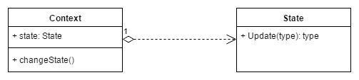
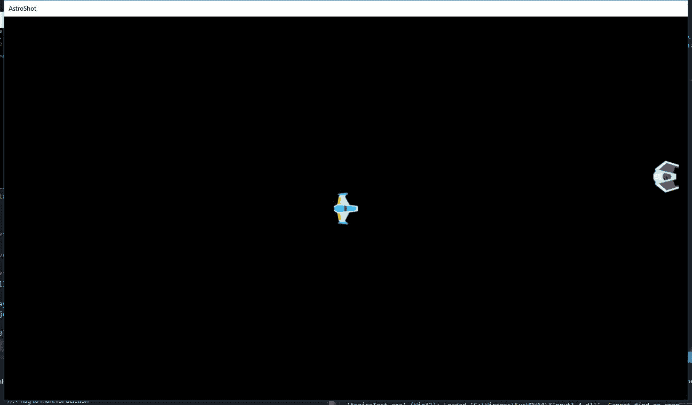
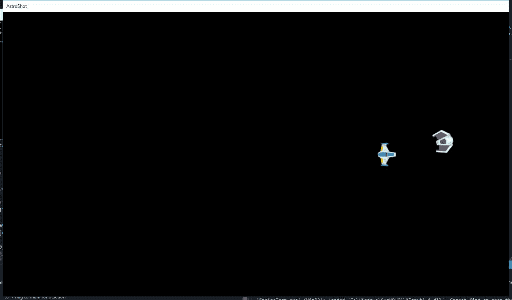
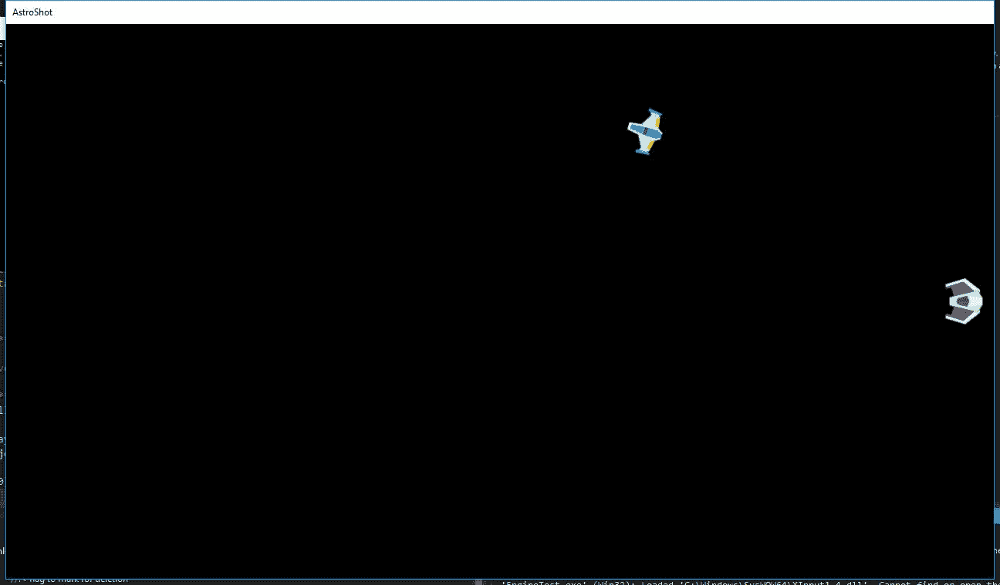
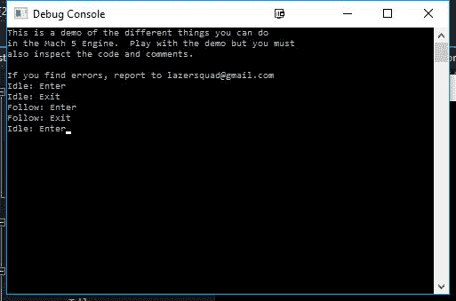
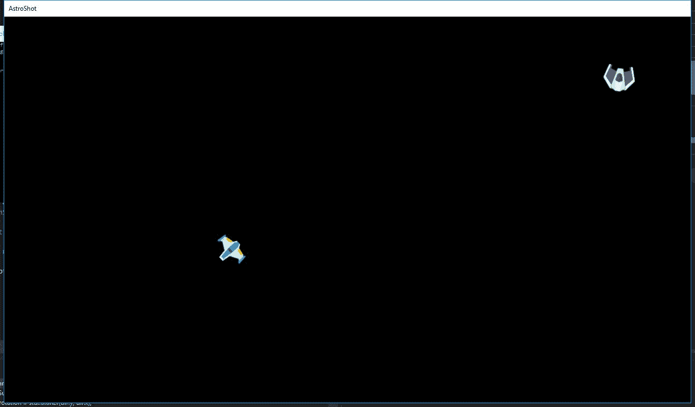

# 使用状态模式的人工智能

在上一章中，我们讨论了组件对象模型。现在给实体赋予行为就像创建一个新的组件并让该组件控制游戏对象一样简单。

每当有人开始制作游戏时，他们首先编写游戏玩法代码。这是有趣的部分。每个人都想看到图形和物理效果在屏幕上显示。例如，暂停屏幕、选项菜单或甚至第二个关卡都是次要的。为玩家组织行为也是如此。程序员们热衷于让玩家跳跃和冲刺，但随着玩家新能力的增加，可能会有一些组合是你不希望允许的。例如，玩家可能不允许在跳跃时冲刺，或者可能每 3 秒才能冲刺一次。状态模式解决了这些问题。

通过首先编写游戏状态管理器，解决了切换到菜单或暂停的问题。通过将有限状态机作为游戏对象的组件进行编码，解决了复杂行为或玩家或敌人的问题。通过将多个状态机添加到同一个游戏对象中，可以非常简单地创建复杂的行为，正如许多游戏中所见，这是 Unreal 引擎中广泛使用的内置功能，Unity 使用 Hutong Games LLC 流行的 Playmaker 扩展提供了视觉编辑器。

# 章节概述

在本章中，我们将创建一个简单的状态机来通过输入控制玩家，同时创建一个敌人状态机，当玩家靠近时会检测到并跟随。我们还将查看 Mach5 引擎中的基础 `StateMachineComponent` 类，并展示通过编写几个状态代码，我们可以轻松地创建更复杂的行为。我们还将展示将多个状态机添加到对象中可以创建多个同时运行的行为，从而避免重复的状态代码。

# 你的目标

本章将分为几个主题。它将包含一个从开始到结束的简单步骤过程。以下是我们的任务大纲：

+   状态模式解释

+   状态机简介

+   枚举概述

+   根据我们的状态做事

+   为什么 if 语句可能会让你失业

+   扩展状态机

+   状态模式在实际应用中的体现--M5StateMachine

+   状态模式在实际应用中的体现--StageManager

+   状态机的问题

# 状态模式解释

状态模式是一种允许游戏对象根据游戏中的不同刺激改变其行为和功能的方法，尤其是在对象内部的变量或条件发生变化时，因为这些变化可能会触发状态的变化。对象的状态由某些上下文（在游戏行业中通常被称为机器）管理，但状态告诉机器何时改变状态以及相应的功能。状态模式包含两个部分：状态和上下文。上下文对象持有当前状态，并且可以被状态类用来改变应该运行哪个状态，而状态对象则持有实际的功能：



在 Mach5 引擎中，有一个类已经使用了状态模式（`M5StateMachine`），但在我们深入研究一个完整的版本之前，让我们真正从头开始构建一个。

实现状态模式或获得类似状态行为的方法有很多。在我们转向最终版本之前，我们将讨论一些常见的版本以及使用它们的优缺点。

# 状态机简介

我们经常编写代码来根据我们的期望以及玩家的期望来对游戏环境中的事件做出反应。例如，如果我们正在创建一个 2D 横版滚动平台游戏，当玩家按下箭头键时，我们期望玩家的角色移动，每次我们按下空格键时，我们期望精灵跳入空中。或者在一个 3D 游戏中，当我们的玩家看到带有大按钮的面板时，他们期望能够按下它。

我们日常生活中有很多事情也是这样，对某些刺激做出反应。例如，当你使用电视遥控器时，你期望某些事情发生，或者甚至在你滑动或轻触手机时。根据提供的刺激，我们的对象的状态可能会改变。我们称那些可以在同一时间处于多个状态之一的对象为状态机。

你写的几乎每一个程序都可以被视为某种状态机。当你向项目中添加一个`if`语句时，你就已经开发出了可以处于至少一个那些状态中的代码。也就是说，你不想在代码中有一大堆`switch`和/或`if`语句，因为这会使代码很快失控，并使理解代码的确切功能变得困难。

作为程序员，我们经常希望将问题分解成最简单的形式，让我们看看一种可能的方法。在游戏开发中，你会听到关于**FSM**的提及，它代表**有限状态机**。有限意味着只有一定数量的状态，并且它们都明确定义了它们可以做什么以及它们如何在状态之间变化。

# 枚举概述

假设我们要创建一个简单的敌人。这个敌人默认不会做任何事情，但如果玩家靠近，它会向玩家移动。然而，如果玩家离得太远，它们将停止追击。最后，如果玩家射击敌人，敌人会死亡。所以，考虑到这一点，我们可以提取所需的各个状态。它们如下所示：

+   空闲

+   跟随

+   死亡

当我们创建我们的状态机时，我们需要一种方法来跟踪我们的对象将处于哪种状态。有人可能会认为一种方法是为每个可能的状态设置一个`bool`（布尔值，真或假），并将它们都设置为`false`，除了我们当前所在的状态。这是一个非常糟糕的想法。

另一个想法可能是只使用一个整数，并为每个可能的值设置一个值。这同样是一个糟糕的想法，因为以这种方式使用数字基本上和我们在代码中使用魔法数字是一样的，因为这些数字对人们来说没有逻辑性。作为替代方案，你可以为每个可能的值设置`#defines`，但这样将允许人们随意输入任何数字，没有任何保护措施。相反，每当我们看到一系列只有其中一个为真时，我们可以利用枚举的编程特性，简称枚举。

使用枚举的基本概念是，你可以创建自己的自定义数据类型，这些数据类型仅限于具有某些值的列表。与整数或`#defines`不同，这些数字使用常量表示，使我们能够拥有具有值的全部优势，例如能够比较值。在我们的情况下，我们的状态枚举可能看起来如下所示：

```cpp
enum State 
{ 
  Idle, 
  Follow, 
  Death 
}; 

```

# 对状态进行操作

现在我们已经定义了状态，让我们现在使我们的代码能够根据对象所处的状态实际执行一些操作。在这个第一个例子中，我将更新`EngineTest`项目中已经存在的`ChasePlayerComponent`类。

从右侧的解决方案资源管理器选项卡中，打开`SpaceShooter/Components/ChasePlayerComp`文件夹，访问`ChasePlayerComponent.h`文件。从那里，用以下加粗的更改替换类：

```cpp
enum State{
 Idle, Follow, Death }; 

//!< Simple AI to Chase the Player 
class ChasePlayerComponent : public M5Component 
{ 
public: 
  ChasePlayerComponent(void); 
  virtual void Update(float dt); 
  virtual void FromFile(M5IniFile& iniFile); 
  virtual ChasePlayerComponent* Clone(void); 
private: 
  float m_speed; 
  float m_followDistance; 
 float m_loseDistance; 

 void FollowPlayer(); 
 float GetDistanceFromPlayer(); 
 State m_currentState; 

}; 

```

`FollowPlayer`和`GetDistanceFromPlayer`函数将是我们功能中的辅助函数。我们已经添加了我们的状态`enum`来存储我们可以处于的每个可能状态，并添加了`m_currentState`变量来保存我们当前所在的状态。为了确定何时切换状态，我们还有两个其他值，`m_followDistance`和`m_loseDistance`，它们分别表示玩家需要与敌人保持多少像素的距离才能跟随，以及玩家需要逃多远才能逃脱。

现在我们已经完成了这个，让我们首先在`ChasePlayerComponent.cpp`文件的底部添加一些辅助函数，这样我们就可以在更新其他函数后拥有适当的功能：

```cpp
/*************************************************************************/ 
/*!   
Makes it so the enemy will move in the direction of the player 
*/ 
/*************************************************************************/ 
void ChasePlayerComponent::FollowPlayer() 
{ 
  std::vector<M5Object*> players; 
  M5ObjectManager::GetAllObjectsByType(AT_Player, players); 
  M5Vec2 dir; 
  M5Vec2::Sub(dir, players[0]->pos, m_pObj->pos); 
  m_pObj->rotation = std::atan2f(dir.y, dir.x); 
  dir.Normalize(); 
  dir *= m_speed; 
  m_pObj->vel = dir; 
} 

/*************************************************************************/ 
/*! 
Returns the distance of the object this is attached to the player 
*/ 
/*************************************************************************/ 
float ChasePlayerComponent::GetDistanceFromPlayer() 
{ 
  std::vector<M5Object*> players; 
  M5ObjectManager::GetAllObjectsByType(AT_Player, players); 

  return M5Vec2::Distance(m_pObj->pos, players[0]->pos); 
} 

```

这些函数使用一些基本的线性代数来移动我们的对象朝向玩家，并获取两个位置之间的距离。

深入探讨其背后的数学超出了本书的范围，但如果您想了解更多，我强烈建议您查看以下链接。代码是为 Cocos2D 编写的，所以它不会与 Mach5 使用的完全相同，但概念解释得很好：[`www.raywenderlich.com/35866/trigonometry-for-game-programming-part-1`](https://www.raywenderlich.com/35866/trigonometry-for-game-programming-part-1)。

现在我们已经实现了这个功能，我们需要更新一些内容。首先，我们将使用构造函数来设置`currentState`变量的初始值：

```cpp
/*************************************************************************/ 
/*! 
Sets component type and starting values for player 
*/   
/*************************************************************************/ 
ChasePlayerComponent::ChasePlayerComponent(void): 
  M5Component(CT_ChasePlayerComponent), 
  m_speed(1) 
  { 
    m_currentState = Idle; 
  } 

```

接下来，我们需要告诉我们的对象通过其 INI 文件读取对象的值：

```cpp
void ChasePlayerComponent::FromFile(M5IniFile& iniFile) 
{ 
  iniFile.SetToSection("ChasePlayerComponent"); 
  iniFile.GetValue("speed", m_speed); 
 iniFile.GetValue("followDistance", m_followDistance); 
 iniFile.GetValue("loseDistance", m_loseDistance); 

} 

```

`FromFile`只在初始化时创建的第一个对象上调用一次。为了在不重新编译项目的情况下轻松调整值，Mach 5 从文件中读取信息来设置变量。我们还没有修改`.ini`文件，但一旦完成所有这些修改，我们将会：

```cpp
M5Component* ChasePlayerComponent::Clone(void) 
{ 
  ChasePlayerComponent* pNew = new ChasePlayerComponent; 
  pNew->m_speed = m_speed; 
  pNew->m_followDistance = m_followDistance;
 pNew->m_loseDistance = m_loseDistance; 
  return pNew; 
} 

```

然后，我们需要转到 Windows 资源管理器，移动到项目的`EngineTest/EngineTest/ArcheTypes`文件夹，然后访问`Raider.ini`文件，并将新属性添加到对象中：

```cpp
posX   = 0 
posY   = 0 
velX   = 0 
velY   = 0 
scaleX = 10 
scaleY = 10 
rot    = 0 
rotVel = 0 
components = GfxComponent ColliderComponent ChasePlayerComponent 

[GfxComponent] 
texture = enemyBlack3.tga 
drawSpace = world 

[ColliderComponent] 
radius = 5 
isResizeable = 0 

[ChasePlayerComponent] 
speed = 40 
followDistance = 50 
loseDistance = 75 

```

如果文本编辑器没有为您打开，请随意使用记事本。在这种情况下，我们正在添加两个新的属性，它们代表我们之前创建的值。

然后，我们需要更新我们的阶段，使其更容易进行测试。回到 Windows 资源管理器，打开`EngineTest/EngineTest/Stages`文件夹，然后打开`Level01.ini`文件，将其设置为以下内容：

```cpp
ArcheTypes = Player Raider 

[Player] 
count = 1 
pos = 0 0 

[Raider] 
count = 1 
pos = 100 10 

```

使用这种方法，我们的级别将只包含位于世界中心的玩家和一个位于(`100`, `10`)的敌人掠夺者。完成所有这些后，保存文件，然后回到我们的`ChasePlayerComponent.cpp`文件，将`Update`函数替换为以下内容：

```cpp
void ChasePlayerComponent::Update(float) 
{ 
  // Depending on  what state we are in, do different things 
  switch (m_currentState) 
  { 
  case Idle: 
    // No longer move if we were 
    m_pObj->vel = M5Vec2(0, 0); 

    // If the player gets too close, the enemy notices them 
    if (GetDistanceFromPlayer() < m_followDistance) 
    { 
      // And will begin to give chase 
      m_currentState = Follow; 
    } 

    return; 
  case Follow: 
    // Follow the player 
    FollowPlayer(); 

    // If the player manages to get away from the enemy 
    if (GetDistanceFromPlayer() > m_loseDistance) 
    { 
      // Stop in your tracks 
      m_currentState = Idle; 
    } 
    break; 
  case Death: 
    // Set object for deletion 
    m_pObj->isDead = true; 
    break; 
  } 

} 

```

保存所有内容，然后运行项目。如果一切顺利，你应该会看到一个像这样的场景：



注意，由于我们的敌人最初处于空闲状态，它不会移动。然而，如果我们靠近它，它看起来会像这样：



你会看到它现在会跟随我们而不会停止。如果我们设法远离敌人，它们会停止：



这清楚地展示了使用状态模式的基本原理，尽管我们可以做很多事情来改进它，我们很快就会讨论。

# 条件语句的问题

我们接下来需要考虑的是，我们应该根据当前的状态来做些什么。在编写程序时，我们之前学到的 `if` 和 `switch` 等条件语句可能会使代码更难以管理。有时，当你编写特定功能的代码时，编写 `if` 语句是完全可以理解的，特别是如果你在编写时它是有意义的。例如，以下代码完全合理：

```cpp
void MinValue(int a, int b) 
{ 
  if (a < b) 
    return a; 
  else 
    return b; 
} 

// Could also be written in the following way: 
void MinValue(int a, int b) 
{ 
  return (a < b) ? a : b; 
} 

```

然而，如果你正在编写检查对象类型或变量是否为特定类型的代码，那可能是个问题。例如，看看以下函数：

```cpp
void AttackPlayer(Weapon * weapon) 
  { 
    if (weapon.name == "Bow")     
    { 
      ShootArrow(weapon); 
    } 
    else if (weapon.name == "Sword") 
    { 
      MeleeAttack(weapon); 
    } 
    else 
    { 
      IdleAnimation(weapon); 
    } 
} 

```

正如你所见，如果我们开始走这条路，我们将在整个项目中添加许多不同的检查，这将使得如果我们决定添加更多支持的内容，我们的代码将难以更改。首先，当我们看到一些比较相同值并根据该值执行某些操作时，我们应该使用 `switch` 语句，就像我们之前做的那样，但进行一些修改：

```cpp
void AttackPlayer(Weapon * weapon) 
{ 
// C++ doesn't support using string literals in switch  
// statements so we have to use a different variable 
// type, such as an integer 
  switch (weapon.type) 
  { 
  case 0: 
    ShootArrow(weapon); 
    break; 

  case 1: 
    MeleeAttack(weapon); 
    break; 

  default: 
    IdleAnimation(weapon); 

  } 

} 

```

但在这个特定的情况下，我们只是根据值调用不同的函数，每个函数都是某种攻击方式。相反，我们应该利用多态性，让代码自动完成正确的事情：

```cpp
  class Weapon 
  { 
  public: 
    virtual void Attack()  
    { 
      // Do nothing 
    }; 
  }; 

  class Bow : Weapon 
  { 
  public: 
    virtual void Attack() 
    { 
      // Attack with Bow 
    }; 
  }; 

  void AttackPlayer(Weapon * weapon) 
  { 
    weapon->Attack(); 
  } 

```

现在每当调用 `AttackPlayer` 时，它将自动完成正确的事情。

只需记住，创建复杂的行为会导致编写丑陋的代码，并增加出现错误的可能性。如果你忘记了一个需要存在的条件，你的游戏可能就会崩溃，让你知道有问题，但它无法做任何事情。然后，当你发现你的游戏最终崩溃时，你的生活就会变得复杂得多，你的游戏可能变得无法玩或根本不好玩。

罗伯特·埃尔德有一个关于这个主题的链接，我认为它解释了你可以用条件语句做的一些疯狂的事情，这几乎肯定会让你失业：[`blog.robertelder.org/switch-statements-statement-expressions/`](http://blog.robertelder.org/switch-statements-statement-expressions/)。

不要因为代码中有条件语句而烦恼，但确保你只在你真正需要它们的时候包含它们。随着你继续编码，你会更好地了解何时是合适的，但这是你需要记住的事情。

# 扩展状态机

所以目前，你会注意到在空闲状态下，我们每帧都将速度设置为 `0,0`。在这个简单的例子中，这并不是什么大问题，但这种过度计算是我们未来想要避免的。我们实际上只需要在进入状态时做一次，我们可能还希望在离开状态时执行某些操作，但在当前的状态机形式中，我们无法做到这一点，所以我们需要重做一些事情。

首先，让我们回到`ChasePlayerComponent.h`文件，并添加以下粗体函数定义：

```cpp
class ChasePlayerComponent : public M5Component 
{ 
public: 
  ChasePlayerComponent(void); 
  virtual void Update(float dt); 
  virtual void FromFile(M5IniFile& iniFile); 
  virtual M5Component* Clone(void); 
  virtual void EnterState(State state);
 virtual void UpdateState(State state, float dt);
 virtual void ExitState(State state); 
  virtual void SetNewState(State state, bool initialState = false); 
private: 
  float m_speed; 
  float m_followDistance; 
  float m_loseDistance; 

  void FollowPlayer(); 
  float GetDistanceFromPlayer(); 
  State m_currentState; 

}; 

```

因此，我们不是让`Update`函数处理所有事情，而是现在为我们的状态可能处于的不同时间创建了三个函数：进入新状态、根据该状态更新，以及离开状态时应该做什么。除此之外，我们还有一个`SetNewState`函数，它将负责将状态更改为其他状态。所有这些函数都接受一个`State`枚举来选择如何执行，其中`Update`状态还有通过这一帧过去的时间，而`SetNewState`有一个选项表示这是你第一次设置状态，因此你不需要离开上一个状态。之后，我们需要实际添加这些新函数的功能：

```cpp
void ChasePlayerComponent::EnterState(State state) 
{ 
  // Depending on what state we are in, do different things 
  switch (state) 
  { 
  case Idle: 
    // No longer move if we were 
    if (m_pObj) 
    {   
      m_pObj->vel = M5Vec2(0, 0); 
    } 

    M5DEBUG_PRINT("\nIdle: Enter"); 
    break; 

  case Follow: 
    M5DEBUG_PRINT("\nFollow: Enter"); 
    break; 

  case Death: 
    m_pObj->isDead = true; 
    M5DEBUG_PRINT("\nDeath: Enter"); 
    break; 
  } 
} 

void ChasePlayerComponent::UpdateState(State state, float) 
{ 
  // Depending on what state we are in, do different things 
  switch (state) 
  { 
  case Idle: 
    //M5DEBUG_PRINT("\nIdle: Update"); 
    // If the player gets too close, the enemy notices them 
    if (GetDistanceFromPlayer() < m_followDistance) 
    { 
      // And will begin to give chase 
      SetNewState(Follow); 
    } 

    break; 

  case Follow: 
    //M5DEBUG_PRINT("\nFollow: Update"); 

    // Follow the player 
    FollowPlayer(); 

    // If the player manages to get away from the enemy 
    if (GetDistanceFromPlayer() > m_loseDistance) 
    { 
      // Stop in your tracks 
      SetNewState(Idle); 
    } 
    break; 
  } 
} 

void ChasePlayerComponent::ExitState(State state) 
{ 
  // Depending on what state we are in, do different things 
  switch (state) 
  { 
  case Idle: 
    M5DEBUG_PRINT("\nIdle: Exit"); 
    break; 

  case Follow: 
    M5DEBUG_PRINT("\nFollow: Exit"); 
    break; 
  } 
} 

// initialState by default is false, so will only need to give 
// second parameter the first time it is called 
void ChasePlayerComponent::SetNewState(State state, bool initialState) 
{ 
  if (!initialState) 
  { 
    // Exit of our old state 
    ExitState(currentState); 
  } 

  // Then start up our new one 
  m_currentState = state; 
  EnterState(m_currentState); 
} 

```

然后，我们需要更新我们的`Update`函数，使其仅调用我们的正确函数：

```cpp
void ChasePlayerComponent::Update(float dt) 
{ 
  UpdateState(m_currentState, dt); 
} 

```

我们还需要更改我们的构造函数，使其不再设置当前状态，而是由我们自己设置：

```cpp
/*************************************************************************/ 
/*! 
Sets component type and starting values for player 
*/ 
/*************************************************************************/ 
ChasePlayerComponent::ChasePlayerComponent(void): 
  M5Component(CT_ChasePlayerComponent), 
  m_speed(1) 
{ 
  SetNewState(Idle, true); 
} 

```

首先，请注意我正在调用`M5DEBUG_PRINT`函数。这样做是为了让我们更容易地知道我们正在在不同状态之间切换。为了演示的目的，我注释掉了`Update`函数的版本，但也许你可以查看一下。注意在这个版本中，我们为每个函数都有一个`switch`语句，并根据在那里设置的状态执行不同的操作。

在我的编辑器版本中，默认情况下文本不会显示在屏幕上。为了解决这个问题，请转到`SplashStage.cpp`文件并注释掉以下粗体代码：

```cpp
SplashStage::~SplashStage(void) 
{ 
  //We are done this with ArcheType so lets get rid of it. 
  M5ObjectManager::RemoveArcheType(AT_Splash); 
  //M5DEBUG_DESTROY_CONSOLE(); 
} 

```

现在让我们运行我们的项目！



你可以从编辑器中看出我们何时切换状态，以及代码是否被正确调用！

这个版本工作得相当不错，但也有一些问题；主要是它涉及到大量的重写，并且每次我们想要创建一个新版本时，都需要复制/粘贴这个功能并做出相应的更改。接下来，我们将看看 Mach5 引擎中包含的状态机以及它相对于我们之前讨论的内容所具有的优势。

# 状态模式在实际应用中的体现 - M5StateMachine 类

Mach5 引擎本身也有它自己的状态机实现，使用继承来允许用户不必反复重写基本功能，并使用函数指针而不是为每个状态有一个函数。函数指针就像它的名字一样——指向函数在内存中的地址的指针——我们可以从这个信息中调用它。

要了解更多关于函数指针及其使用方法的信息，请查看[`www.cprogramming.com/tutorial/function-pointers.html`](http://www.cprogramming.com/tutorial/function-pointers.html)。

你可以在这里查看其基础版本，从`Header`文件开始：

```cpp
#ifndef M5STATEMACNINE_H 
#define M5STATEMACNINE_H 

#include "M5Component.h" 
#include "M5Vec2.h" 

//! Base State for M5StateMachines 
class M5State 
{ 
public: 
  //! Empty virtual destructor 
  virtual ~M5State(void) {} 
  //! Called when we first enter a state 
  virtual void Enter(float dt)  = 0; 
  //! called once per frame 
  virtual void Update(float dt) = 0; 
  //! called before we exit a state 
  virtual void Exit(float dt)   = 0; 
}; 

//! Base class for Finite statemanchine component for AstroShot 
class M5StateMachine : public M5Component 
{ 
public: 
  M5StateMachine(M5ComponentTypes type); 
  virtual ~M5StateMachine(void); 
  virtual void Update(float dt); 
  void SetNextState(M5State* pNext); 
private: 
  M5State* m_pCurr; //!< a pointer to our current state to be updated 
}; 

#endif //M5STATEMACNINE_H 

```

在前面的代码中，请注意我们最终将`StateMachine`和`State`对象分解成它们自己的类，状态函数有自己的`Enter`、`Update`和`Exit`函数。状态机跟踪我们当前所处的状态，并使用`Update`和`SetNextState`函数适当地更新，`SetStateState`函数用于指定我们应该从哪个状态开始。类的实现看起来有点像这样：

```cpp
#include "M5StateMachine.h"

M5StateMachine::M5StateMachine(M5ComponentTypes type):
 M5Component(type),
 m_pCurr(nullptr)
{
}

M5StateMachine::~M5StateMachine(void)
{
}

void M5StateMachine::Update(float dt)
{
 m_pCurr->Update(dt);
}

void M5StateMachine::SetNextState(M5State* pNext)
{
 if(m_pCurr)
 m_pCurr->Exit();

 m_pCurr = pNext;
 m_pCurr->Enter();
}

```

这个系统提供了一个模板，我们可以在此基础上扩展，以创建更复杂、更有趣的行为。以`RandomGoComponent`类为例，其头文件看起来如下：

```cpp
#ifndef RANDOM_LOCATION_COMPONENT_H 
#define RANDOM_LOCATION_COMPONENT_H 

#include "Core\M5Component.h" 
#include "Core\M5StateMachine.h" 
#include "Core\M5Vec2.h" 

//Forward declation 
class RandomGoComponent; 

class RLCFindState : public M5State 
{ 
public: 
  RLCFindState(RandomGoComponent* parent); 
  void Enter(float dt); 
  void Update(float dt); 
  void Exit(float dt); 
private: 
  RandomGoComponent* m_parent; 
}; 
class RLCRotateState : public M5State 
{ 
public: 
  RLCRotateState(RandomGoComponent* parent); 
  void Enter(float dt); 
  void Update(float dt); 
  void Exit(float dt); 
private: 
  float m_targetRot; 
  M5Vec2 m_dir; 
  RandomGoComponent* m_parent; 
}; 
class RLCGoState : public M5State 
{ 
public: 
  RLCGoState(RandomGoComponent* parent); 
  void Enter(float dt); 
  void Update(float dt); 
  void Exit(float dt); 
private: 
  RandomGoComponent* m_parent; 
}; 

class RandomGoComponent : public M5StateMachine 
{ 
public: 
  RandomGoComponent(void); 
  virtual void FromFile(M5IniFile&); 
  virtual M5Component* Clone(void); 
private: 
  friend RLCFindState; 
  friend RLCGoState; 
  friend RLCRotateState; 

  float          m_speed; 
  float          m_rotateSpeed; 
  M5Vec2         m_target; 
  RLCFindState   m_findState; 
  RLCRotateState m_rotateState; 
  RLCGoState     m_goState; 
}; 

#endif // !RANDOM_LOCATION_COMPONENT_H 

```

这个类包含三个状态，`Find`、`Rotate`和`Go`，这些状态已经被添加为`RandomGoComponent`中的对象。每个状态都有它们自己的`Enter`、`Update`和`Exit`功能，除了构造函数和对其父对象的引用。类的实现看起来大致如下：

```cpp
#include "RandomGoStates.h"
#include "RandomGoComponent.h"

#include "Core\M5Random.h"
#include "Core\M5Object.h"
#include "Core\M5Intersect.h"
#include "Core\M5Gfx.h"
#include "Core\M5Math.h"
#include <cmath>

FindState::FindState(RandomGoComponent* parent): m_parent(parent)
{
}
void FindState::Enter()
{
 M5Vec2 botLeft;
 M5Vec2 topRight;
 M5Gfx::GetWorldBotLeft(botLeft);
 M5Gfx::GetWorldTopRight(topRight);

 M5Vec2 target;
 target.x = M5Random::GetFloat(botLeft.x, topRight.x);
 target.y = M5Random::GetFloat(botLeft.y, topRight.y);

 m_parent->SetTarget(target);

}
void FindState::Update(float)
{
 m_parent->SetNextState(m_parent->GetState(RGS_ROTATE_STATE));
}
void FindState::Exit()
{
}

```

这个类只是告诉我们的主状态机其预期的位置。这只需要做一次，所以它在`Enter`状态下完成。`Update`状态只是声明完成之后，我们希望移动到`Rotate`状态，而`Exit`什么也不做。技术上，我们可能无法创建它，但这也可以，因为基类也没有做任何事情，但如果你愿意扩展它，它就在这里：

```cpp
RotateState::RotateState(RandomGoComponent* parent): m_parent(parent)
{
}
void RotateState::Enter()
{
 M5Vec2 target = m_parent->GetTarget();

 M5Vec2::Sub(m_dir, target, m_parent->GetM5Object()->pos);

 m_targetRot = std::atan2f(m_dir.y, m_dir.x);
 m_targetRot = M5Math::Wrap(m_targetRot, 0.f, M5Math::TWO_PI);

 m_parent->GetM5Object()->rotationVel = m_parent->GetRotationSpeed();
}
void RotateState::Update(float)
{
 m_parent->GetM5Object()->rotation = M5Math::Wrap(m_parent->GetM5Object()->rotation, 0.f, M5Math::TWO_PI);

 if (M5Math::IsInRange(m_parent->GetM5Object()->rotation, m_targetRot - .1f, m_targetRot + .1f))
 m_parent->SetNextState(m_parent->GetState(RGS_GO_STATE));
}
void RotateState::Exit()
{
 m_parent->GetM5Object()->rotationVel = 0;

 m_dir.Normalize();
 M5Vec2::Scale(m_dir, m_dir, m_parent->GetSpeed());

 m_parent->GetM5Object()->vel = m_dir;
}

```

`Rotate`状态将只是旋转角色，直到它面对它想要去的位置。如果它在旋转范围内，它将切换到`Go`状态。但在离开之前，它将在`Exit`函数中将父对象的速率设置为适当的方向：

```cpp
GoState::GoState(RandomGoComponent* parent): m_parent(parent)
{
}
void GoState::Enter()
{
}
void GoState::Update(float)
{
 M5Vec2 target = m_parent->GetTarget();
 if (M5Intersect::PointCircle(target, m_parent->GetM5Object()->pos, m_parent->GetM5Object()->scale.x))
 m_parent->SetNextState(m_parent->GetState(RGS_FIND_STATE));
}
void GoState::Exit()
{
 m_parent->GetM5Object()->vel.Set(0, 0);
}

```

`Go`状态只是检查敌人是否与我们要去的目标相交。如果是，我们就会将我们的状态设置为移动回`Find`状态并重新开始一切，并在`Exit`函数中停止玩家移动：

```cpp
RandomGoComponent::RandomGoComponent():
 M5StateMachine(CT_RandomGoComponent),
 m_speed(1),
 m_rotateSpeed(1),
 m_findState(this),
 m_rotateState(this),
 m_goState(this)
{
 SetNextState(&m_findState);
}
void RandomGoComponent::FromFile(M5IniFile& iniFile)
{
 iniFile.SetToSection("RandomGoComponent");
 iniFile.GetValue("speed", m_speed);
 iniFile.GetValue("rotationSpeed", m_speed);
}
RandomGoComponent* RandomGoComponent::Clone(void) const
{
 RandomGoComponent* pNew = new RandomGoComponent;
 pNew->m_speed = m_speed;
 pNew->m_rotateSpeed = m_rotateSpeed;
 return pNew;
}

M5State* RandomGoComponent::GetState(RandomGoStates state)
{
 switch (state)
 {
 case RGS_FIND_STATE:
 return &m_findState;
 break;
 case RGS_ROTATE_STATE:
 return &m_rotateState;
 break;
 case RGS_GO_STATE:
 return &m_goState;
 break;
 }

 //In case somethings goes wrong 
 return &m_findState;
}

```

如您所见，这与我们之前所做的工作非常相似--设置我们的第一个状态，从 INI 文件中获取初始值，然后在克隆时设置正确的事情。最后，我们还有一个`GetState`函数，它将返回玩家当前的状态，就像我们之前讨论的那样使用 switch 语句。

要看到这个效果，请前往`Raider.ini`文件并修改代码以适应以下内容：

```cpp
posX   = 0 
posY   = 0 
velX   = 0 
velY   = 0 
scaleX = 10 
scaleY = 10 
rot    = 0 
rotVel = 0 
components = GfxComponent ColliderComponent RandomGoComponent 

[GfxComponent] 
texture = enemyBlack3.tga 
drawSpace = world 

[ColliderComponent] 
radius = 5 
isResizeable = 0 

[RandomGoComponent] 
speed = 40 
rotationSpeed = 40 

```

如果一切顺利，保存文件然后运行项目！



现在，我们将看到敌人不断地移动到新的区域，在到达之前旋转！

# 状态模式的应用 - StageManager

Mach5 引擎使用状态模式的另一个方面是`M5StageManager`类：

```cpp
class M5StageManager 
{ 
public: 
  friend class M5App; 

  //Registers a GameStage and a builder with the the StageManger 
  static void AddStage(M5StageTypes type, M5StageBuilder* builder); 
  //Removes a Stage Builder from the Manager 
  static void RemoveStage(M5StageTypes type); 
  //Clears all stages from the StageManager 
  static void ClearStages(void); 
  //Sets the given stage ID to the starting stage of the game 
  static void SetStartStage(M5StageTypes startStage); 
  //Test if the game is quitting 
  static bool IsQuitting(void); 
  //Test stage is restarting 
  static bool IsRestarting(void); 
  //Gets the pointer to the users game specific data 
  static M5GameData& GetGameData(void); 
  //Sets the next stage for the game 
  static void SetNextStage(M5StageTypes nextStage); 
  // Pauses the current stage, so it can be resumed but changes stages 
  static void PauseAndSetNextStage(M5StageTypes nextStage); 
  // Resumes the previous stage 
  static void Resume(void); 
  //Tells the game to quit 
  static void Quit(void); 
  //Tells the stage to restart 
  static void Restart(void); 
private: 
  static void Init(const M5GameData& gameData, int framesPerSecond);
  static void Update(void); 
  static void Shutdown(void); 
  static void InitStage(void); 
  static void ChangeStage(void); 

};//end M5StageManager 

```

由于游戏中只会存在一个这样的实例，因此所有功能都已被设置为静态，类似于单例模式，但根据项目所处的状态，它将执行不同的操作。以改变我们处于的阶段为例。我相信你会发现这和之前我们改变状态的方式非常相似：

```cpp
void M5StageManager::ChangeStage(void)
{
 /*Only unload if we are not restarting*/
 if (s_isPausing)
 {
   M5ObjectManager::Pause();
   M5Phy::Pause();
   M5Gfx::Pause(s_drawPaused);
   PauseInfo pi(s_pStage, s_currStage);
   s_pauseStack.push(pi);
   s_isPausing = false;
 }
 else if (s_isResuming)
 {
   /*Make sure to shutdown the stage*/
   s_pStage->Shutdown();
   delete s_pStage;
   s_pStage = nullptr;
 }
 else if (!s_isRestarting) //Just changine the stage
 {
   /*Make sure to shutdown the stage*/
   s_pStage->Shutdown();
   delete s_pStage;
   s_pStage = nullptr;

   //If we are setting the next state, that means we are ignore all
   //paused states, so lets clear the pause stack
   while (!s_pauseStack.empty())
   {
     M5Gfx::Resume();
     M5Phy::Resume();
     M5ObjectManager::Resume();
     PauseInfo pi = s_pauseStack.top();
     pi.pStage->Shutdown();
     delete pi.pStage;
     s_pauseStack.pop();
   }

 }
 else if (s_isRestarting)
 {
   /*Make sure to shutdown the stage*/
   s_pStage->Shutdown();
 }

 s_currStage = s_nextStage;
}

```

我强烈建议你仔细查看文件，并逐个函数地了解它们是如何相互作用的。

# 关于有限状态机（FSM）的问题

我们已经看到了有限状态机（FSM）可以作为有价值的东西添加到项目中，以及它们如何使简单的 AI 行为变得更容易，但它们也存在一些问题。

传统的有限状态机，如我们在此处展示的，随着时间的推移，可能会变得难以管理，因为你继续向其中添加许多不同的状态。困难的部分是在添加新上下文的同时，将状态的数量保持在最低，以便你的角色可以响应。

当你重建具有其他部分的行为时，你将编写大量类似的代码，这可能会消耗时间。最近在游戏行业中发生的一件事是，AI 程序员正在转向更复杂的方式来处理 AI，例如行为树。

如果你感兴趣，想知道为什么有些人认为有限状态机的时代已经结束，请查看[`aigamedev.com/open/article/fsm-age-is-over/`](http://aigamedev.com/open/article/fsm-age-is-over/)。在这里可以找到关于有限状态机的问题以及一些潜在的解决方案来修复这些问题：[`aigamedev.com/open/article/hfsm-gist/`](http://aigamedev.com/open/article/hfsm-gist/)。

# 摘要

在本章中，我们学习了状态模式，这是一种允许游戏对象根据游戏中的不同刺激改变其行为和功能的方法。我们学习了状态和上下文（机器）以及它们是如何一起使用的。然后我们学习了如何使用状态模式来获得一些关于 AI 编程的曝光，以及我们项目的游戏状态管理器是如何工作的以及为什么它很重要。当然，有限状态机在用于 AI 方面最为流行，但也可以用于 UI 以及处理用户输入，使它们成为你武器库中的另一个有用工具。
