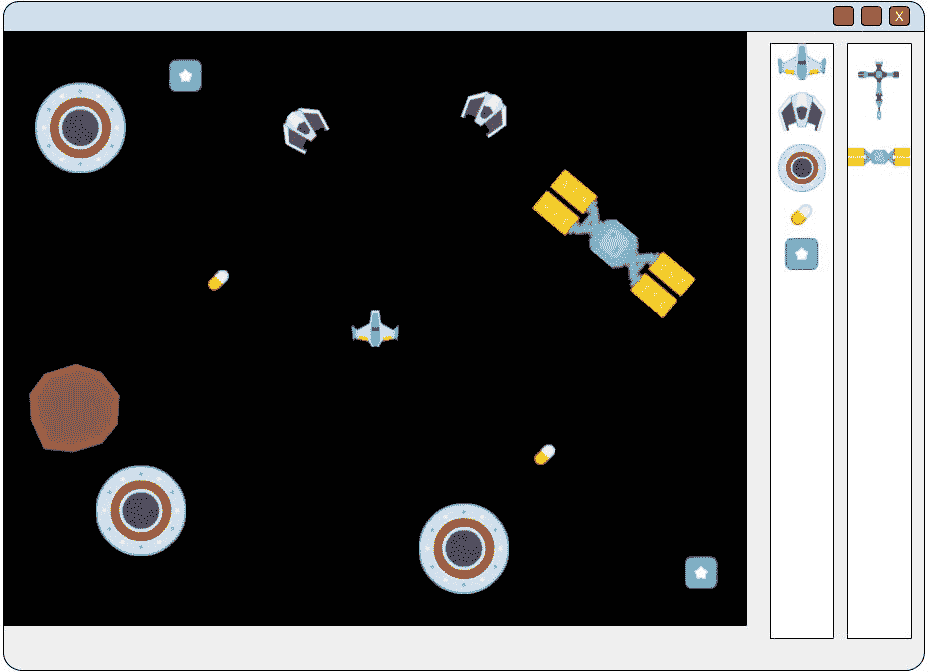
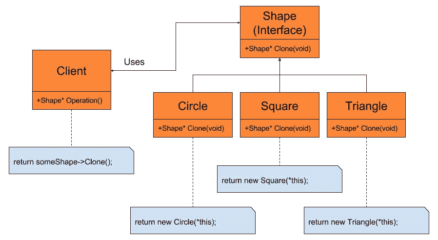

# 第六章：使用原型模式创建对象

在上一章中，我们看到了如何使用动态工厂帮助我们解耦高级模块，例如 `M5StageManager` 或 `M5ObjectManager`，以及我们派生出的 `M5Stage` 或 `M5Component` 类的实现细节。我们通过将这些依赖项推入将被动态工厂使用的派生构建器类中来实现这一点。这使我们能够在不修改高级模块的情况下自由地更改派生的阶段和组件类。由于我们不需要为每个阶段和组件创建派生类构建器，C++ 模板类使得使用动态工厂变得非常容易。

然而，我们必须为每个我们想要的 `M5Object` 类型创建一个构建器，因为它们将包含一组每个对象独特的组件。不幸的是，这些构建器可能需要频繁更改，因为我们进行游戏测试、平衡和修改游戏设计。每次这些构建器更改时，游戏都需要重新编译。

目标是让我们的游戏对象类型完全在文件中定义。这将使游戏设计师能够在不接触 C++ 代码或重新编译的情况下测试、调整和平衡游戏。当然，所有这些都可以在关卡编辑器工具中完成，这个工具也可以提供给玩家，让他们能够创建额外的游戏内容。

在本章中，我们将探讨原型模式以及它如何帮助我们完全在文本文件中定义对象。我们将首先查看该模式的一个简单示例，然后查看 Mach5 引擎以及 `M5ObjectManager` 如何具体使用该模式从文件中读取游戏对象定义。在这个过程中，我们将查看一些有助于我们编写更好、更安全代码的 C++ 语言特性。

# 你的目标

下面是我们将在本章中涵盖的主题以及你的任务概述：

+   学习使用工厂为游戏对象带来的麻烦

+   实现 Prototype 模式

+   学习 Mach5 引擎如何使用原型模式

+   在 Mach5 引擎中实现组件

+   学习如何在文件中完全定义对象

# 使用工厂为游戏对象带来的麻烦

在第五章，“通过工厂方法模式解耦代码”中，我们学习了如何使用动态工厂来解耦我们的阶段、组件和对象与高级模块。我们通过将每个派生类的依赖项放入一个单独的构建器类中而不是高级模块中来实现这一点。让我们看看创建派生类型阶段构建器的例子：

```cpp
//SplashStageBuilder.h-------------------- 
#include "M5StageBuilder.h" 

class SplashStageBuilder: public M5StageBuilder 
{ 
public: 
  virtual M5Stage* Build(void); 
}; 

//SplashStageBuilder.cpp-------------------- 
#include "SplashStageBuilder.h" 
#include "SplashStage.h" 

M5Stage* SplashStageBuilder::Build(void) 
{ 
  return new SplashStage(); 
} 

```

我们这样做的原因是，`SplashStage`类的更改只会影响这个文件，而不是像`M5StageManager`这样的文件。这意味着对派生阶段或阶段构建器类的任何更改都不会破坏其他代码，因为其他代码只会使用`M5Stage`指针。对这个类的更改仍然可能破坏其他代码，尤其是如果这个阶段完全从游戏中移除。然而，通过最小化依赖关系，我们减少了未来需要更改其他代码的可能性。

在 Mach5 引擎中，`M5Stage`派生类只需要一个默认构造函数。这是为了尽可能简化构建器类。每个阶段类将从文件中读取其所需的数据。读取哪个文件的逻辑被写入构造函数中。同样简单的默认构造函数设计也用于`M5Component`派生类。这意味着我们不需要为每个阶段或组件创建构建器类，而是可以使用 C++模板的力量：

```cpp
//M5StageBuilder.h 
class M5StageBuilder 
{ 
public: 
  virtual ~M5StageBuilder(void) {} //empty virtual destructor 
  virtual M5Stage* Build(void) = 0; 
}; 

template <typename T> 
class M5StageTBuilder: public M5StageBuilder 
{ 
public: 
  virtual M5Stage* Build(void); 
}; 

template <typename T> 
M5Stage* M5StageTBuilder<T>::Build(void) 
{ 
  return new T(); 
} 

```

通过使用 C++模板，我们可以减少需要手动创建的小类数量，同时仍然获得工厂的解耦优势。当然，总有可能一些阶段或组件需要更复杂的构造函数或构建器类。在这种情况下，当需要时，我们可以轻松地创建所需的类。不幸的是，我们无法选择在对象类型上使用模板。

# 使用构建器与对象一起使用

我们的游戏对象大多是组件的集合。每个对象类型将根据设计师的决定拥有不同的组件和组件数据。随着开发的进行，这些集合很可能会发生变化。记住，尽管每个单独的组件在工厂中都有一个构建器，但对象需要以某种方式实例化这些单独的组件。让我们看看使用构建器为`Player`和`Raider`对象创建简化的示例：

```cpp
//PlayerBuilder.h-------------------- 
#include "M5ObjectBuilder.h" 

class PlayerBuilder: public M5ObjectBuilder 
{ 
public: 
virtual M5Object* Build(void); 
}; 

//PlayerBuilder.cpp-------------------- 
#include "PlayerBuilder.h" 
#include "M5Object.h" 
#include "M5ObjectManager.h" 

M5Object* PlayerBuilder::Build(void) 
{ 
M5Object* pObj = new M5Object; 
//Build and set Gfx component for player 
GfxComponent* pGfx = 
   M5ObjectManager::CreateComponent(CT_GfxComponent); 
pGfx->SetTexture("playerShip.tga"); 
pGfx->SetDrawSpace(DS_WORLD); 

//Build and set input component for player 
PlayerInputComponent* pPI = 
   M5ObjectManager::CreateComponent(CT_PlayerInputComponent); 
pPI->SetSpeed(100); 
pPI->SetRotationSpeed(10); 

pObj->AddComponent(pGfx); 
pObj->AddComponent(pPI); 

//...add more components here 

return pObj; 
} 

//RaiderBuilder.h-------------------- 
#include "M5ObjectBuilder.h" 

class RaiderBuilder: public M5ObjectBuilder 
{ 
public: 
virtual M5Object* Build(void); 
}; 

// RaiderBuilder.cpp-------------------- 
#include "RaiderBuilder.h" 
#include "M5Object.h" 
#include "M5ObjectManager.h" 

M5Object* RaiderBuilder::Build(void) 
{ 
  M5Object* pObj = new M5Object; 
  //Build and set Gfx component for Raider 
  GfxComponent* pGfx = 
     M5ObjectManager::CreateComponent(CT_GfxComponent); 
  pGfx->SetTexture("enemyBlack3.tga"); 
  pGfx->SetDrawSpace(DS_WORLD); 

  //Build and set behavior for Raider 
  ChasePlayerComponent* pCP = 
     M5ObjectManager::CreateComponent(CT_ChasePlayerComponent); 
  pPI->SetSpeed(40); 

  pObj->AddComponent(pGfx); 
  pObj->AddComponent(pCP); 

return pObj; 
} 

```

在这两个简单的示例中，我们可以看到为什么每个对象构建器需要不同。每个特定的对象类型将有一组独特的组件。这些示例每个只使用两个组件，但我们还没有考虑我们的物理碰撞器、任何武器组件或额外的行为。即使在这些简短的示例中，这两种对象类型都使用了`GfxComponent`，但由于数据（如纹理）的不同，我们需要不同的代码。由于只有一个对象类，而不是派生类层次结构，因此无法让对象管理必要组件的创建。

为了解决这个问题，我们可能需要为每个对象类型提供一个构建器类，或者提供一个具有`switch`语句和每个对象类型案例的单个对象构建器。这两种解决方案的问题在于组件列表和每个组件的数据很可能会经常变化。现在，我们不再担心高级模块和依赖关系，而是有两个新的问题需要担心。

第一个问题是编译时间恒定且可能很长。我们已经知道，随着开发工作的继续，游戏设计将会发生变化。这可能意味着不仅需要更改组件，还需要更改这些组件内的值。在某个阶段，尤其是在开发后期，游戏可能已经完成，但并不完全平衡。在这个阶段，游戏对象及其相应的代码将不断进行调整。健康、伤害、速度和其他属性的更改可能会频繁发生，导致代码需要重新编译。

影响项目编译时间长短的因素有很多。在最佳情况下，我们可能只需更改一个文件，重新编译的速度会非常快。然而，即使只有从 10 到 11 的速度值这样的微小变化，如果唯一改变的就是这一点，那么 10 秒的编译时间也可能变得令人烦恼。平衡单个单位这样简单的事情可能需要一整天的时间，而且在其他单位平衡后，还需要进行额外的调整。我们的目标是将修改对象和查看修改结果的速度尽可能快。

第二个问题是关于谁负责进行这些平衡更改。一种情况是程序员负责，因为所有的平衡更改都是代码更改。这是一个不好的情况，因为我们已经提到，平衡可能需要很长时间，现在设计师和程序员都参与了进来。设计师可能无法正确地向程序员解释期望的结果，因此他们必须坐在一起调整和编译，反复进行。如果设计师可以自由地进行平衡，而程序员可以自由地修复错误或优化所需的代码，那就更好了。

另一种情况是设计师负责对代码进行平衡更改。这里的问题是设计师可能对引擎或编程语言不太熟悉。完全有可能设计师根本没有任何编程经验，因此他们可能不熟悉集成开发环境（IDE）或版本控制系统。引入错误或破坏项目的可能性非常高。

# 解决方案 - 从文件读取

我们解决这两个问题的方案是将所有硬编码的值移动到文本或二进制文件中，这些文件将在运行时由引擎读取。由于我们在游戏中使用的是基于组件的系统，这意味着我们可以在文件中定义哪些组件属于一个对象。这种方法的优点是，这些文件可以通过关卡编辑器或其他内容创建工具由设计师创建。目前，我们不会关注这些文件是如何创建的，而是关注它们是如何被读取到我们的引擎中，以及我们如何可以使用它们来替代对象构建器类。

既然我们已经决定在文件中定义我们的对象，我们就需要考虑我们的引擎何时会读取它们。针对我们的问题有几个不同的解决方案。第一个解决方案是每次我们需要一个新的 Raider、Bullet 或 Asteroid 时，让我们的构建器简单地读取一个文件。这是一个常见的初步想法，但这是一个非常糟糕的想法。与访问已经存在于 RAM 中的数据相比，从硬盘读取文件非常慢。根据因素的不同，它可能慢 10,000 到 50,000 倍或更多。这就像一个正常的 5 分钟车程需要 173 天 14 小时 40 分钟。如果你从 1 月 1 日开始驾驶，你会在 6 月 21 日到达商店。

这并不意味着我们永远不应该从硬盘读取文件。这仅仅意味着我们需要更加策略性地处理它。使用这个解决方案意味着我们可以在同一帧中多次读取完全相同的文件。这就像进行半年的旅行去商店买鸡蛋，回家后立即又回到商店买牛奶。我们不应该多次读取相同的文件，而应该只读取一次并将数据存储到 RAM 中。由于这个过程非常慢，我们应该避免在游戏过程中读取和写入文件，而应该尽可能在加载时间从文件中加载更多内容。

在大规模游戏中，例如*Rockstar 的《侠盗猎车手 3》*，需要一次性保存在 RAM 中的数据太多。这类游戏会不断从不在内存中的文件读取数据，并释放不再使用的资源。这是通过在单独的线程上读取文件来实现的，这样就不会暂停或减慢主游戏玩法。这个文件流过程涉及大量工作，包括确保当玩家需要时关键游戏元素已经在内存中，以免影响游戏玩法。然而，即使像这样流式传输数据的游戏，一旦数据在内存中，也不会浪费时间重复读取文件。

现在，我们不会担心线程。因此，对我们来说，一个更常见的解决方案是在加载屏幕期间读取文件一次，创建我们需要的对象类型，然后只需在需要新实例时复制这些对象。这将使我们能够专注于模式，同时解决与此问题相关的关键问题，而无需担心多线程架构的困难。

即使不使用线程，我们仍然有问题。我们不知道组件的类型，如何复制包含组件的对象？通常，在创建新对象时，我们需要 new 关键字，这意味着我们还需要调用构造函数。当然，我们有一个用于类型的`enum`，这意味着我们可以使用 switch 语句并调用正确的复制构造函数。然而，我们已经知道 switch 语句可能很难维护，应该避免使用。

组件工厂将创建正确类型的新组件，但我们仍然需要编写一个复制函数，以便在创建后能够复制数据。如果有一个函数可以根据对象的类型构建和复制数据，那就太好了。我们需要一个像虚拟函数一样工作的构造函数。

# 原型模式解释

原型模式为我们提供了一种复制类的方法，而无需知道该类的实际类型。这通常被称为虚拟构造函数，因为我们可以使用它来创建和复制派生类，同时只使用基类指针或引用。当与对象层次结构一起使用时，这种模式最为强大，但它不仅需要与虚拟函数一起使用。原型模式的另一个目的是简单地创建一个原型（或原型）实例的对象，并使用它进行复制。

假设我们正在创建一个关卡编辑器。在工具的中间，我们会有一张关卡地图。在这里，我们可以放置瓦片、升级、敌人和玩家。在地图的旁边，我们会有一系列用于我们游戏中的对象和瓦片，这些都可以放置在地图上。以下截图可以展示这一点：



图 6-1 - 简单关卡编辑器的示例

由于我们追求代码的整洁，我们在处理绘图、处理点击和操作侧边对象以及定义我们特定对象类型的代码部分之间有明确的分离。然而，当我们从侧边点击并拖动一个对象时，我们会创建一个新实例的对象，并在鼠标位置绘制它，最终在用户放置它的地图上绘制。根据依赖倒置原则，我们知道我们不希望我们的高级模块依赖于我们的低级对象。相反，它们都应该依赖于抽象。

原型与原型的对比

在我们更深入地了解这个模式之前，我们应该稍微谈谈一下词汇选择。在 Mach5 引擎中，我们将读取和创建的文件以及我们将使用的枚举被称为原型，而不是原型。原型是一个完美、不变、理想的事物的例子。原型通常是某个东西的早期版本，通常是未完善的，后来的版本可以偏离。虽然这两个词都可以正确使用，但作者使用“原型”一词来指代文件中的对象定义，尽管这个模式被称为原型模式。

# 虚拟构造函数

原型模式很简单。它涉及提供一个对象，你可能想要复制它的`Clone`方法，并让对象了解如何执行复制。实际的方法名称并不重要。"Clone"只是其中一个常见的例子。当与对象层次结构一起使用时，这最有用，其中你想要复制一个对象，但不知道你持有的派生对象的类型。只需在层次结构的接口中添加一个`Clone`方法，并让派生类各自实现该方法。让我们从一个简单的例子开始：



在下面的代码中，我们有我们的接口对象`Shape`。在这个例子中，我们只讨论简单的形状。由于这个类将用作接口，我们必须将析构函数标记为虚拟的，以便在删除派生类时调用正确的析构函数。接下来，我们有两个纯虚函数。`Draw`方法可以是任何我们需要虚拟行为的操作。在这个简单的情况下，我们只是使用打印语句而不是在屏幕上绘制形状。`Clone`方法将是我们的虚拟构造函数。这个方法将知道如何复制自身并返回一个新实例：

```cpp
class Shape 
{ 
public: 
  virtual ~Shape(void) {}//empty base class constructor 
  virtual void Draw(void) const    = 0; 
  virtual Shape* Clone(void) const = 0; 
}; 

```

现在，让我们看看派生类的示例：

```cpp
class Circle : public Shape 
{ 
public: 
  virtual void Draw(void) const 
  { 
    std::cout << "I'm a Circle" << std::endl; 
  } 
  virtual Shape* Clone(void) const 
  { 
    return new Circle(*this); 
  } 
}; 

class Square : public Shape 
{ 
public: 
  virtual void Draw(void) const 
  { 
    std::cout << "I'm a Square" << std::endl; 
  } 
  virtual Shape* Clone(void) const 
  { 
    return new Square(*this); 
  } 
}; 

class Triangle : public Shape 
{ 
public: 
  virtual void Draw(void) const 
  { 
    std::cout << "I'm a Triangle" << std::endl; 
  } 
  virtual Shape* Clone(void) const 
  { 
    return new Triangle(*this); 
  } 
}; 

```

当然，我们的派生类知道如何绘制自身。为了保持简单，`Draw`方法只是打印到控制台。这里的重要部分是每个`Draw`方法都有不同的行为；在这种情况下，打印一个硬编码的字符串。`Clone`方法才是真正的魔法所在--每个方法都返回自身的一个新实例。具体来说，它们正在调用自己的拷贝构造函数。这将允许客户端持有任何`Shape`的指针，并获得正确的派生类型的副本，而无需知道或关心要调用哪个构造函数。让我们通过代码示例来看看这一点：

```cpp
int main(void) 
{ 
  //seed the RNG 
  std::srand(static_cast<unsigned>(time(0))); 
  //Create my shapes 
  const int MAX = 3; 
  Shape* shapes[MAX] = { new Circle(),  
                          new Square(),  
                          new Triangle() }; 

      for (int i = 0; i < MAX * 2; ++i) 
  { 
    Shape* pCopy = shapes[std::rand() % MAX]->Clone(); 
    copy->Draw(); 
    delete pCopy; 
  } 

  //make sure to delete my original shapes 
  for (int i = 0; i < MAX; ++i) 
    delete shapes[i]; 

  return 0; 
} 

```

前几行只是初始化随机数生成器和形状数组。在数组中，你可以看到我们创建了一个新的`Circle`、`Square`和`Triangle`实例。这些将成为我们要克隆的原型`Shapes`。

下一个部分是一个循环，用于展示`Clone`方法的工作。我们使用数组的随机索引来克隆一个对象。由于它是随机的，我们无法知道哪个`Shape`将被克隆。这模拟了用户的随机点击。一旦我们克隆了`Shape`，我们就可以自由地调用`Draw`或其他任何接口方法。循环结束时，我们删除了克隆的`Shape`，但当然，这不会删除数组中的原型`Shape`，因为它是对象的一个副本。循环之后，我们遍历原型数组，并删除这些形状。

下面的输出是前面代码的结果：

```cpp
I'm a Triangle 
I'm a Square 
I'm a Square 
I'm a Circle 
I'm a Circle 
I'm a Square 

```

# 构造函数的问题

现在我们已经对虚拟构造函数和原型模式有了一些了解，让我们看看我们正在试图解决的具体问题。

要理解构造问题，我们首先需要理解类和该类的对象之间的区别。类是程序员创建的。它们是程序使用的代码模板或配方，用于创建对象。在 C++中，我们无法在运行时创建类。我们没有在程序运行时引入新代码的方法。

这是因为 C++是一种静态类型语言。这意味着如果编译时无法在该类型上执行操作，则语言会尝试防止这些操作。例如，我们不能将一个浮点数除以一个`void*`，因为 C++编译器会在编译时检查操作是否有意义，如果无意义，则会报错。

C++中的这种静态类型是为什么我们必须为每个变量声明一个类型。这也是为什么在这种情况下我们需要指定构造函数的原因：

```cpp
Base* p = new Derived; 

```

在这种情况下，编译器必须知道我们试图创建的类。不幸的是，在 C++中，类没有一等公民地位。这意味着我们不能将类作为函数的参数传递或将其用作返回值。我们不能复制一个类，将其保存在变量中，或在运行时创建它。一些语言确实具有这些功能。以下是在 C++中如果类具有一等公民地位时你可以做的事情的例子：

```cpp
//This isn't real C++ code 
Shape* CreateShape(class theShape) 
{ 
  Shape* pShape = new theShape; 
  return pShape; 
} 

```

虽然这可能很有用，但我们将会以一些类型安全性为代价来换取灵活性。C++编译器执行的静态类型检查有机会在问题成为运行时错误之前捕获它们。这是好事。我们应该享受 C++提供的类型检查。我们也应该认识到它对我们的代码灵活性有何影响。

尽管 C++是一种静态类型语言，但我们有方法绕过这个问题。其中一种方法是我们在上章中创建的工厂。我们被迫自己编写工厂，但我们仍然可以选择在运行时创建哪个类，同时获得所有其他类和类型的静态类型的好处。工厂只是我们避免类没有一等公民地位刚性的方法之一。虚拟构造函数是另一种方法。

# 虚拟构造函数的好处

使用虚拟构造函数可以非常强大。最大的好处是现在我们可以将类视为一等公民。我们可以复制一个对象而无需知道其确切类型。我们可以在我们的级别编辑器示例中使用原型模式，也可以在我们的游戏中使用它。任何时候我们需要复制而不知道确切类型时，我们都可以使用这个模式。正如我们之前所说，C++是一种静态类型语言，这意味着编译器将确保我们在编译时使用正确的类型。这种静态类型检查帮助我们编写更安全的代码。

通过使用动态工厂和虚拟构造函数，我们绕过了这种类型检查。编译器仍然在我们处理的指针上进行类型检查，但我们是在运行时选择派生类。这可能导致我们如果在克隆时混淆了类型，会引发难以找到的 bug。这并不意味着我们不应该使用这些模式；只是了解我们在灵活性上做出了一些牺牲是好的。

# 我们不需要知道类型

正如我们所说的，使用原型模式的最大好处之一是我们可以在不知道类型的情况下创建副本。这意味着我们可以在不关心涉及到的派生类的情况下创建函数参数或函数返回类型的副本。这也意味着我们可以与另一个类或方法共享指针，我们不需要关心类型是否被修改。

在下面的例子中，我们有一个具有生成特定类型形状能力的`SpawnShape`类。通过使用原型模式，该类不需要关心它正在生成什么类型。构造函数接受一个指向某个形状的指针，然后只需要调用`Clone`方法。如果基类指针指向一个`Circle`，则将创建一个圆。然而，如果我们有一个指向`Triangle`的指针，则将创建一个三角形。以下是一个展示原型模式如何工作的示例：

```cpp
class ShapeSpawner 
{ 
public: 
ShapeSpawner (Shape* pShape, float maxTime): 
  m_pToSpawn(pShape), 
  m_spawnTime(0.f), 
  m_maxSpawnTime(maxTime) 
{ 
  } 
void Update(float dt) 
{ 
  m_spawnTime += dt; 
  if(m_spawnTime > m_maxSpawnTime) 
  { 
    //The class doesn't care what type it is cloning 
    Shape* pClone = m_pToSpawn->Clone(); 

    //...Register the clone somehow 

    //Reset timer   
    m_spawnTime = 0; 
  } 
} 
private: 
  Shape* m_pToSpawn; 
  float  m_spawnTime; 
  float  m_maxSpawnTime; 
}; 

```

我们的`SpawnShape`类不关心它是在生成`Circle`、`Square`还是`Triangle`，或者我们以后可能创建的任何新形状。它可以复制形状而不需要知道形状的真实类型。如果我们添加一个公共的`SetShape`方法，我们甚至可以在运行时更改生成的类型。与只能生成`Circles`的更严格示例相比：

```cpp
class CircleSpawner 
{ 
public: 
CircleSpawner (Circle* pCircle, float maxTime): 
  m_pToSpawn(pCircle), 
  m_spawnTime(0.f), 
  m_maxSpawnTime(maxTime) 
{ 
} 
  void Update(float dt) 
{ 
  m_spawnTime += dt; 
  if(m_spawnTime > m_maxSpawnTime) 
  { 
    //Use copy constructor 
 Circle* pClone = new Circle(*m_pToSpawn); 

    //...Register the clone somehow 

    //Reset timer   
    m_spawnTime = 0; 
  } 
} 
private: 
 Circle* m_pToSpawn; 
  float   m_spawnTime; 
  float   m_maxSpawnTime; 
}; 

```

在第二个例子（不使用原型模式）中，我们被迫使用派生类的复制构造函数，在这种情况下是`Circle`。如果我们想生成`Square`或`Triangle`，我们需要创建一个`SquareSpawner`或`TriangleSpawner`。这会产生大量的重复代码。如果我们添加更多的形状，情况可能会变得更糟。通过使用原型模式，我们可以减少所需的类数量。

# 无需子类化

类的减少是使用虚拟构造函数的另一个重大好处。在上面的例子中，我们只需要一个`SpawnShape`，而不是复制我们的生成类或创建派生版本。考虑我们之前看到的工厂构建类。我们被迫为每个新的`M5Component`和`M5Stage`创建一个抽象基类和派生类。C++模板帮助我们自动生成代码，但代码仍然存在。

通过使用虚拟构造函数，我们不需要为每个`M5Stage`、`M5Component`、`Shape`或其他继承层次结构创建派生构建类。我们可以让对象自己复制。这意味着我们应该移除我们的工厂并始终使用原型模式吗？这取决于。

记住，在使用原型模式时，我们必须首先实例化一个对象，然后才能进行克隆。这对于形状或组件来说是可以的，因为这些类型非常小。然而，`M5Stage` 派生类可能非常大，它们也可能引起副作用。这意味着阶段的构造函数可能会向 `M5ObjectManager` 添加对象，或者加载纹理或其他大型资源。

由于使用 C++ 模板使得创建我们的构建器变得如此简单，我们可以继续在阶段和组件中使用它们。然而，我们希望避免为 `M5Object` 创建构建器，因为这些构建器在开发过程中很可能发生变化。通过使用虚拟构造函数并创建可以克隆自己的原型（或原型），我们的其余代码将不会受到类型更改的影响。

# 制作精确副本很容易

在这里，原型概念不需要与虚拟函数一起使用。例如，我们可能有一组对象，例如简单、困难和疯狂敌人，我们想要复制。这些对象可能是完全相同的类类型，但它们可能有非常不同的健康、速度和伤害值。在这种情况下，我们有我们想要从中复制的典型示例。当然，在这种情况下，我们也可以简单地使用复制构造函数，但在像 Mach5 引擎这样的情况下，复制构造函数可能不存在。

无论哪种方式，由于我们不需要创建派生构建器类，我们可以在运行时添加原型。以上面提到的简单、困难和疯狂敌人类型为例。我们可能只有一个文件定义了简单敌人的健康值为 `50`，例如。然后在运行时，我们可以创建一个健康值为 `100` 的困难敌人原型和一个健康值为 `200` 的疯狂敌人原型。我们总是可以简单地加倍每个困难和疯狂敌人的健康和伤害值，或者文件可以包含困难版本和疯狂版本的缩放因子。

另一个我们可能想要修改数据的例子是，如果我们有一个敌基地在设定时间后生成敌人（就像我们上面的 `ShapeSpawner`）。在这个例子中，基地可能会随着时间的推移增加对象的健康和伤害。因此，基地最初可能会创建健康值为 `50` 的敌人，但每次生成后，健康值会增加 `5`。所以，第二个敌人的健康值为 `55`。第三个敌人的健康值为 `60`。由于每个基地都有一个特定的实例，每个基地都会生成具有不同健康值的敌人。

对象也可以通过游戏内关卡编辑器进行修改。想象一下，在仅进行游戏测试时意识到敌人太容易被杀死的好处。使用原型模式和游戏内关卡编辑器，我们可以暂停游戏，编辑对象类型的属性，然后继续游戏。这种方法不需要程序员，也不需要重新编译时间。甚至不需要重新启动游戏。当然，同样的效果也可以通过单独的关卡编辑器或仅通过修改原型文件并在运行时重新加载文件来实现。在这些情况下，我们可以看到创建特定实例的副本非常简单且非常有用。

# Mach5 中`clone`方法示例

到目前为止，我们已经看到了原型模式的简单实现示例。如果你认为这些示例很简单，那么你很幸运——它不会比这更难。我们还讨论了几种在游戏中使用对象实例和虚拟构造函数的方法。现在让我们看看 Mach 5 引擎如何在`M5Component`和`M5Object`类中使用原型模式。由于`M5Object`类使用了`M5Component Clone`方法，让我们先看看组件。

在第三章，“使用组件对象模型改进装饰器模式”中，我们检查了`M5Component`类中的几乎所有方法和成员变量。然而，我们没有讨论的方法是`Clone`方法：

```cpp
//! M5Component.h 
class M5Component 
{ 
public: 
//! virtual constructor for M5Component, must override 
virtual M5Component* Clone(void) const = 0;   

//The rest of the class is the same as before 
}; 

```

如你所见，`M5Component`类实现了一个纯虚`Clone`方法，就像我们在上面的`Shape`类中看到的那样。由于`M5Component`类仅用作抽象基类，我们不希望为克隆提供任何默认行为。克隆只对派生类有意义。这部分组件再次展示出来，这样我们就可以理解重载此方法的接口应该是什么。

# Gfx 和碰撞组件

现在我们已经看到了接口，让我们看看两个非常重要的组件。这些组件之所以重要，是因为它们允许游戏对象与我们的引擎中的两个其他核心部分进行交互，即图形和物理。

我们首先来看的是`GfxComponent`类。这个类允许游戏对象在游戏中有一个视觉表示。它包含绘制游戏中物体所需的最基本信息：

```cpp
//GfxComponent.h 
enum DrawSpace 
{ 
  DS_WORLD, 
  DS_HUD 
}; 

class GfxComponent : public M5Component 
{ 
public: 
  GfxComponent(void); 
  ~GfxComponent(void); 
  void Draw(void) const; 
  virtual void Update(float dt); 
  virtual GfxComponent* Clone(void) const; 
  virtual void FromFile(M5IniFile& iniFile); 
  void SetTextureID(int id); 
  void SetDrawSpace(DrawSpace drawSpace); 
private: 
  int       m_textureID;  //!< Texture id loaded from graphics. 
  DrawSpace m_drawSpace;  //!The space to draw in 
}; 

```

我们绘制一个物体所需的两条信息是绘制哪种纹理以及绘制在哪个空间中。当然，我们需要一个纹理来绘制，但绘制空间可能有点令人困惑。它只是一个`enum`，告诉我们应该使用哪种图形投影类型与物体一起使用。目前，只需知道 HUD 绘制空间始终位于顶部，不受相机移动或相机缩放的影响即可。当然，可能还有更多数据，例如纹理颜色和纹理坐标。如果我们想的话，这些可以在派生类中添加。这里我们只是展示基本内容。

有几个函数用于设置这些值，以及之前提到过的 `FromFile` 函数。对于这个组件，`Update` 函数不做任何事情，因为没有需要更新的内容。`Draw` 函数将由图形引擎调用，使每个 `M5Component` 负责绘制自己。然而，本章最重要的函数仍然是 `Clone`：

```cpp
GfxComponent* GfxComponent::Clone(void) const 
{ 
  //Allocates new object and copies data 
  GfxComponent* pNew = new GfxComponent; 
  pNew->m_pObj = m_pObj; 
  pNew->m_textureID = m_textureID; 
  pNew->m_drawSpace = m_drawSpace; 

  if (m_drawSpace == DrawSpace::DS_WORLD) 
    M5Gfx::RegisterWorldComponent(pNew); 
  else 
    M5Gfx::RegisterHudComponent(pNew); 

  return pNew; 
} 

```

在这个函数中，我们只是创建一个新的 `GfxComponent` 并从该对象复制相关数据到新创建的一个中。你没有看到的是，在 `GfxComponent` 构造函数中，通过调用 `M5Component` 组件构造函数来设置组件类型，当然，这也给这个组件赋予了一个唯一的 ID。我们最后做的事情是根据绘制空间将这个组件注册到图形引擎中。这个类在销毁时会自动取消注册：

```cpp
GfxComponent::GfxComponent(void): 
  M5Component(CT_GfxComponent), 
  m_textureID(0), 
  m_drawSpace(DrawSpace::DS_WORLD) 
{ 
} 
GfxComponent::~GfxComponent(void) 
{ 
  M5Gfx::UnregisterComponent(this); 
} 

```

现在我们已经看到了 `GfxComponent`，让我们来看看所有物理碰撞器中最基本的。Mach5 引擎的 `ColliderComponent` 对于 2D 游戏来说尽可能简单。目前，它只关注圆形与圆形的碰撞。它很容易扩展以测试矩形碰撞：

```cpp
//ColliderComponent.h 
class ColliderComponent : public M5Component 
{ 
public: 
  ColliderComponent(void); 
  ~ColliderComponent(void); 
  virtual void Update(float dt); 
  virtual void FromFile(M5IniFile& iniFile); 
  virtual ColliderComponent* Clone(void) const; 
  void TestCollision(const ColliderComponent* pOther); 
private: 
  float m_radius; 
}; 

```

这个类与之前的类非常相似，因为它与游戏引擎的核心组件之一相连。就像所有组件一样，`FromFile` 必须被重载以从 `.ini` 文件中读取组件数据。`Update` 也必须被重载，但就像 `GfxComponent` 一样，在这个简单版本中它并不做任何事情。如果这个类使用了有向边界框，`Update` 函数就可以用来更新有向框的角点。`TestCollision` 函数也非常重要。它被 **物理引擎** 调用来测试这个对象是否与另一个对象发生碰撞。如果是，这两个对象将被添加到一个可以稍后解决的碰撞对列表中。再次强调，本章最重要的函数是 `Clone`：

```cpp
ColliderComponent* ColliderComponent::Clone(void) const 
{ 
  ColliderComponent* pNew = new ColliderComponent; 
  pNew->m_radius = m_radius; 
  pNew->m_pObj   = m_pObj; 
  M5Phy::RegisterCollider(pNew); 

  return pNew; 
} 

```

就像 `GfxComponent` 一样，这个组件首先创建一个自己的新版本，然后将重要信息复制到新组件中。在返回新组件之前，它首先将自己注册到物理引擎中。由于它已经注册，所以在销毁时必须取消注册，所以我们就在析构函数中这样做：

```cpp
ColliderComponent::ColliderComponent(void) : 
   M5Component(CT_ColliderComponent), m_radius(0) 
{ 
} 
ColliderComponent::~ColliderComponent(void) 
{ 
  M5Phy::UnregisterCollider(this); 
} 

```

在这两个类中，有几个要点需要指出。首先，请注意我们并没有克隆`m_type`、`m_id`或`isDead`变量。这并不是必要的。类型是由`M5Component`基类中的构造函数设置的，当我们调用构造函数时。`id`也是在基类中设置的，但重要的是要指出，`m_id`的目的就是要唯一。如果我们也复制了`id`，那么它就不会发挥正确的作用。相反，我们正在复制其他重要的数据，但我们认识到这是一个独立的组件，而不仅仅是一个精确的副本。出于同样的原因，我们也没有复制`isDead`变量。我们正在创建一个类似于旧组件的新组件，但仍然是一个独立的组件。如果我们复制了`isDead`，那么这个组件在这个帧或下一个帧中就会被删除。

接下来，这两个类在克隆方法中而不是构造函数中将自己注册到引擎中。这是因为它们的预期用途。我们的对象管理器将在游戏开始时保存这些预先创建的原型组件，以便它们可以随时被克隆。我们不希望这些初始组件污染图形或物理引擎。

然而，我们假设一个对象正在被克隆，并且它也需要存在于游戏世界中，所以我们当时进行了注册。这似乎是最标准的克隆原因。对于用户来说，只关心克隆，而不是担心克隆、注册然后注销，会更好。如果用户希望进行非标准操作，他们可以在克隆后自由注销。

# 克隆对象

我们已经看到了几个`M5Component`派生类如何使用原型模式的例子。我们稍后会看看更多重要的例子，但现在让我们看看`M5Object`类是如何使用这些`Clone`方法的，以及`M5Object`本身是如何被克隆的。回想一下，`M5Object`也有一个`Clone`方法。尽管这个类不是层次结构的一部分，但它仍然可以使用原型模式的概念来创建可克隆的实例。以下是`M5Object`的`Clone`方法：

```cpp
//M5Object.h 
class M5Object//Everything is the same as before 
{ 
public: 
  M5Object*    Clone(void) const; 
}; 
//M5Object.cpp 
M5Object* M5Object::Clone(void) const 
{ 
  //create new object 
  M5Object* pClone = new M5Object(m_type); 
  //copy the internal data 
  pClone->pos         = pos; 
  pClone->vel         = vel; 
  pClone->scale       = scale; 
  pClone->rotation    = rotation; 
  pClone->rotationVel = rotationVel; 

  //clone all components 
  size_t size = m_components.size(); 
  for (size_t i = 0; i < size; ++i) 
  { 
    M5Component* pComp = m_components[i]->Clone(); 
    pClone->AddComponent(pComp); 
  } 
  return pClone; 
} 

```

当我们克隆时，重要的是要复制旧对象的所有相关数据。这不仅包括像位置和速度这样的东西，还包括所有组件。因此，我们在函数开始时创建了一个新实例，并将正确的类型传递给构造函数。这将设置`m_type`和`m_id`变量。记住，尽管我们在克隆，但我们想确保每个对象都有一个唯一的 ID。接下来，我们复制数据。就像组件一样，我们不需要复制`isDead`值。

最后，我们有一个循环来克隆当前对象中的所有组件。这展示了原型模式的强大之处。我们不需要知道每个组件的类型——我们只需要循环，调用 `Clone` 来创建副本，然后将这个副本添加到新创建的对象中。记住，`AddComponent` 方法会改变每个组件中的 `m_pObj`。这将确保所有组件都指向它们正确的所有者。

最后，原型模式很简单。每个组件的 `Clone` 方法都很简单，使用它们来克隆对象也很简单。甚至在使用这些克隆对象在 `M5ObjectManager` 中也很容易。我们将在接下来的几页中查看这一点，但首先让我们谈谈一些读者可能注意到的细节。第一个是我们没有在任何 Mach5 `Clone` 方法中使用拷贝构造函数，尽管我们在 `Shape` 示例中使用了它。下一个是 `GfxComponent` 和 `CollideComponent` 的返回类型与 `M5Component` 接口中的返回类型不同。

# 选择拷贝构造函数

正如我们之前所说的，并且正如你在上面的代码示例中看到的，我们在任何组件的 `Clone` 方法中都没有使用拷贝构造函数。我们也没有在 `M5Object` 的 `Clone` 方法中使用它们。默认情况下，类会由编译器生成拷贝构造函数和赋值运算符。在上面的 `Shape` 示例中，我们在 `Clone` 方法中使用了编译器生成的拷贝构造函数。

然而，在 Mach5 引擎中，有一个重要的选择需要考虑。拷贝构造函数应该如何处理 `m_id` 变量的值？记住，这个 ID 应该对每个对象和每个组件都是唯一的。然而，如果我们使用编译器生成的拷贝构造函数，包括 `m_id` 在内的每个变量都将按值复制。这意味着每次我们使用拷贝构造函数时，我们都会有两个具有完全相同标识符的对象。

有时候我们确实希望这样，例如，如果我们想要有一个对象向量而不是对象指针，例如。当使用标准向量（和其他容器）时，在向容器添加元素时会调用拷贝构造函数。如果我们添加一个对象，我们可能希望它复制标识符。也可能我们希望将对象在容器周围的位置移动。最可能的是，我们希望它保持相同的标识符。

然而，这并不是我们希望在 `Clone` 方法中看到的行为。我们希望每个克隆都是一个独立的实体，具有不同的唯一标识符。当然，我们可以编写自己的拷贝构造函数，并为每个新创建的对象或组件分配一个不同的标识符，就像我们在默认构造函数中所做的那样。不幸的是，如果我们使用标准容器这样做，我们会在它们内部每次调用拷贝构造函数时生成新的标识符。在这种情况下，标识符就不会与正确的对象或组件匹配。

在 Mach5 引擎中，我们使用指针容器而不是对象或组件容器，因此作者决定完全删除复制构造函数（和赋值运算符）。这将消除所有关于该过程的混淆。如果你想复制，你可以调用 `Clone` 方法，因为你不能调用复制构造函数。做出不同的决定是可以的。在另一个使用对象容器而不是指针容器的不同引擎中，可能会做出不同的决定。

在 Mach5 引擎中，我们通过将它们设置为私有来从对象中删除这些方法，这样就不能调用它们。在 C++ 11 中，你可以将它们标记为已删除，这样编译器就不会为你生成它们。赋值运算符已经删除，因为这些类包含不能重新分配的 `const` 数据：

```cpp
//In M5Object.h 
M5Object(const M5Object& rhs) = delete; 

//In M5Component.h 
M5Component(const M5Component& rhs) = delete; 

```

# 协变返回类型

聪明的读者也会注意到，Mach5 引擎中每个 `Clone` 方法的返回类型实际上都是不同的。基类 `M5Component` 返回 `M5Component*`，然而派生类返回它们自己类类型的指针。这是 C++（以及一些其他语言）中称为协变返回类型的一个特性。让我们使用上面提到的 `Shape` 类来查看这个特性：

```cpp
class Shape 
{ 
public: 
  virtual ~Shape(void) {}//empty base class constructor 
  virtual void Draw(void) const    = 0; 
  virtual Shape* Clone(void) const = 0; 
}; 

class Circle : public Shape 
{ 
public: 
  virtual void Draw(void) const; 
  virtual Shape* Clone(void) const; 
}; 

int main(void) 
{ 
  Circle* pCircle = new Circle(); 

   //The line won't compile 
 Circle* pClone = pCircle->Clone(); 

  delete pClone; 
  delete pCircle; 
  return 0; 
} 

```

如果 `Circle` 类的 `Clone` 方法返回 `Shape*`，编译器将不允许我们直接将结果赋值给 `Circle*`。我们需要进行 `static_cast` 或 `dynamic_cast`，这意味着我们必须编写如下代码：

```cpp
  Circle* pCircle = new Circle(); 
  Shape* pClone  = pCircle->Clone(); 

  Circle* pCircle2 = dynamic_cast<Circle*>(pClone); 
  if (pCircle2) 
  { 
    //do something specific to circle 
  } 

```

在这两种情况下，`Clone` 方法将返回一个圆。然而，编译器无法知道这一点，所以我们被迫进行类型转换。使用虚函数的标准规则是函数签名必须相同，包括返回类型。使用协变返回类型，编译器将允许我们在继承层次结构中将返回类型的基类替换为更具体类型：

```cpp
class Circle : public Shape 
{ 
public: 
  virtual void Draw(void) const; 
   //Example of using a covariant return type 
  virtual Circle* Clone(void) const; 
}; 

int main(void) 
{ 
  Circle* pCircle = new Circle(); 
  //No need to cast 
  Circle* pClone = pCircle->Clone(); 

  //... Do something Circle specific with pClone 

  delete pClone; 
  delete pCircle; 
  return 0; 
} 

```

通过使用协变返回类型，我们可以在克隆需要访问其实际类型属性的对象时消除不必要的类型转换。值得注意的是，这个特性仅适用于指针或引用。这意味着如果 `Shape` 的 `Clone` 方法返回的是形状，而不是 `Shape*`，我们就不会有这种选择。

# 从文件中加载原型

现在我们已经详细了解了原型模式，并讨论了它是如何与 Mach5 引擎的组件一起使用的，让我们看看我们如何使用它从文件中加载数据对象。为此，我们首先需要查看对象文件，然后查看 `M5ObjectManager` 中用于加载和创建这些对象的特定方法。

# 原型文件

我们需要做的第一件事是查看我们如何在文件中定义我们的对象原型。Mach5 引擎使用`.ini`文件作为原型、关卡以及与引擎初始化相关的一切。如果您想保持它们作为人类可读和可修改的，一个更标准的文件格式将是 XML 或 JSON。如果您不希望用户修改它们，文件始终可以保存为二进制格式。

我们选择`.ini`文件，因为它们既易于人类阅读，也易于计算机程序读取。它们只有几条简单的规则，所以只需几句话就可以解释清楚。它们只包含由方括号`[ ]`定义的命名部分，以及形式为`key = value`的键值对。唯一的例外是全球部分，它没有名称，因此没有方括号。让我们看看一个基本的原型文件示例。这是一个`Player.ini`的示例：

```cpp
posX       = 0 
posY       = 0 
velX       = 0 
velY       = 0 
scaleX     = 10 
scaleY     = 10 
rot        = 0 
rotVel     = 0 
components = GfxComponent PlayerInputComponent ColliderComponent 

[GfxComponent] 
texture       = playerShip.tga 
drawSpace     = world 

[PlayerInputComponent] 
forwardSpeed  = 100 
speedDamp     = .99 
bulletSpeed   = 7000 
rotationSpeed = 10 

[ColliderComponent] 
radius        = 5 

```

如您所见，`Player.ini`文件的全局部分包含在`M5Object`中定义的所有可变值的值。除了组件键之外，所有内容都是在`M5Object`的`FromFile`方法中读取的。在这种情况下，我们的大部分起始值都是零。这是因为像玩家对象的起始位置这样的东西将取决于关卡，因此这些数据将在创建后进行修改。

最重要的是组件。组件键包含一个对象将使用的组件列表。这些字符串将由`M5ObjectManager`用于创建组件，然后读取每个部分中定义的特定组件数据。这使我们能够重用组件，例如`ColliderComponent`，因为使用它们的每个对象都可以有不同的组件数据。在这种情况下，玩家对象将有一个半径为`5`，但子弹可能有一个半径为`1`。

# 对象管理器

`M5ObjectManager`是一个单例类，它负责加载原型和创建对象等任务。这个类中有许多成员和方法，所以查看所有内容会花费太多时间。在本节中，我们只将介绍与从原型文件加载和创建对象相关的特定方法。请记住，由于该类是单例，我们具有全局访问权限。因此，每个成员和方法都是静态的：

```cpp
class M5ObjectManager 
{ 
public: 
  static M5Object* CreateObject(M5ArcheTypes type); 
  static void AddArcheType(M5ArcheTypes type,  
                            const char* fileName); 
  static void RemoveArcheType(M5ArcheTypes type); 

   //Plus other methods 

private: 
  typedef M5Factory<M5ComponentTypes,  
                   M5ComponentBuilder,  
                   M5Component>  ComponentFactory; 
  typedef std::unordered_map<M5ArcheTypes,  
                            M5Object*>  ArcheTypeMap 
static ComponentFactory  s_componentFactory; 
static ArcheTypesMap     s_archetypes; 

//Plus other members 
}; 

```

在这里，我们展示了最重要的成员和方法，以展示如何从文件中加载对象。我们没有展示的是与销毁或搜索特定对象相关的方法。如果您对这些功能感兴趣，请随时查阅本书附带的全源代码。

在公共部分，`AddArcheType` 方法将被用来读取原型文件，创建对象，并将其存储以供以后使用。`RemoveArcheType` 方法用于在不再需要对象时删除它。最后，`CreateObject` 方法将用于克隆之前加载的其中一个原型。在私有部分，我们定义了一些类型以简化命名。您可以看到我们正在使用我们在第五章第五章中创建的模板化动态工厂，即通过工厂方法模式解耦代码。我们还有一个已加载的原型对象的映射。

让我们更仔细地看看这些方法：

```cpp
void M5ObjectManager::AddArcheType(M5ArcheTypes type, 
   const char* fileName) 
{ 
  MapItor found = s_archetypes.find(type); 
  M5DEBUG_ASSERT(found == s_archeypes.end(), 
     "Trying to add a prototype that already exists"); 

  M5IniFile file; 
  file.ReadFile(fileName); 
  M5Object* pObj = new M5Object(type); 
  pObj->FromFile(file); 

  std::string components;//A string of all my components 
  file.GetValue("components", components); 

//parse the component string and create each component 
  std::stringstream ss(components); 
  std::string name; 

//Loop through the stream and get each component name 
  while (ss >> name) 
  { 
    M5Component* pComp = s_componentFactory.Build( 
                         StringToComponent(name)); 
    pComp->FromFile(file); 
    pObj->AddComponent(pComp); 
  } 
//Add the prototype to the prototype map 
  s_archeypes.insert(std::make_pair(type, pObj)); 
} 

```

这个函数可能看起来很复杂，但这里正是魔法发生的地方。让我们从开始的地方说起。这个函数接受两个参数，一个枚举 ID，用于指定要创建的类型，以及一个与该 `enum` ID 关联的文件名。接下来，我们需要检查这个 `M5Archetypes` ID 是否之前已经被加载过。如果已经加载过，那么肯定存在错误。在检查枚举错误之后，我们读取 `.ini` 文件。如果文件不存在，`ReadFile` 方法将断言。

如果没有出现任何错误，我们将创建一个新的 `M5Object`，并将 `M5ArcheTypes` ID 传递给构造函数。这仅仅设置了对象的类型，但没有做其他任何事情。为了设置对象的数据，我们调用 `FromFile` 方法来从 `.ini` 文件中读取全局部分。这将设置对象的位置、缩放、旋转以及对象中的其他一切，除了实际组件，这需要以不同的方式处理。

组件的问题在于，文件中包含的组件名称是作为字符串存储的，但为了游戏中的性能考虑，我们希望避免进行字符串比较。这意味着我们需要以某种方式将这些字符串转换为 `enum` 值。这就是 `StringToComponent` 函数的目的。这个函数是一个 `if`/`else` 链，它将根据参数返回正确的枚举值。这样的函数可能会在维护上出现问题。我们将在后面的章节中讨论如何使用 Windows 批处理文件来自动化这个过程。

在我们从文件读取对象数据之后，我们接着从文件中读取组件列表。这是一个由空格分隔的组件名称列表。我们可以有很多种方法来提取每个单独的组件名称，但其中最简单的方法之一是使用 STL 的 `stringstream` 对象。这允许我们从流中提取单独的字符串，就像 `std::cin` 一样。

在创建我们的 `stringstream` 对象后，我们遍历流并提取名称。然后，我们将转换后的 `M5ComponentTypes` 枚举使用 `s_componentFactory` 来构建正确的组件。在构建正确的组件后，我们将 `.ini` 文件传递给组件的 `FromFile` 方法，让派生组件读取其自己的数据。然后我们确保将组件添加到对象中。最后，在读取所有组件后，我们将类型和对象指针添加到我们的 `s_archetypes` 映射中。

这可能看起来像是一种加载对象复杂的方法。然而，这个函数不需要了解任何派生组件类型，或者哪些组件与特定对象类型相关联。如果我们的原型 `.ini` 文件发生变化，我们不需要重新编译此代码。我们可以自由地添加、删除或更改游戏和我们的高级模块 `M5ObjectManager` 中的对象，而无需更改：

```cpp
void M5ObjectManager::RemoveArcheType(M5ArcheTypes type) 
{ 
  MapItor found = s_archetypes.find(type); 
  M5DEBUG_ASSERT(found != s_archetypes.end(), 
     "Trying to Remove a prototype that doesn't exist"); 

  delete found->second; 
  found->second = 0; 
  s_archetypes.erase(found); 
} 

```

`RemoveArcheType` 方法比 `AddArcheType` 简单得多。我们在这里需要做的只是确保要删除的类型存在于映射中，我们通过首先找到并使用调试断言（如果它不存在）来实现这一点。然后我们删除原型对象并在映射中擦除迭代器。

`RemoveArcheType` 方法不需要被调用，因为所有原型对象将在游戏退出时被删除。然而，如果用户想要最小化游戏中存在的原型，这可以用来实现。默认情况下，Mach5 引擎在游戏开始前自动加载所有原型 `.ini` 文件：

```cpp
M5Object* M5ObjectManager::CreateObject(M5ArcheTypes type) 
{ 
  MapItor found = s_archetypes.find(type); 
  M5DEBUG_ASSERT(found != s_archetypes.end(), 
     "Trying to create and Archetype that doesn't exist"); 

  M5Object* pClone = found->second->Clone(); 
  s_objects.push_back(pClone);//A std::vector<M5Object*> 
  return pClone; 
} 

```

最后，我们有一个允许用户创建原型对象的方法。在这里，用户提供他们想要创建的 `M5ArcheTypes` 类型。首先，该方法执行我们熟悉的常规错误检查。然后，在找到正确的迭代器后，我们利用原型模式的 `Clone` 方法来复制从原型对象中所有数据和组件。在创建对象后，我们自动将其添加到活动游戏对象列表中，并将指针返回给用户，以便他们可以根据需要修改位置和速度等属性。

# 摘要

在本章中，我们重点介绍了创建灵活的代码。由于我们正在使用组件对象模型与游戏对象一起使用，我们想要确保，随着对象的变化，它们能够很好地处理这种变化。这意味着我们不想在游戏测试和平衡对象时修改大量其他文件。

我们在本章开头说过，我们游戏对象的目标是在文件中完全定义它们。由于我们在对象中使用组件，我们希望在文件中定义对象使用的组件。通过在文件中定义对象，我们的程序员可以自由地工作在其他代码上，设计师可以平衡和游戏测试，而无需担心破坏游戏或引入错误。

在查看原型模式的简单示例之后，我们探讨了它在 Mach5 引擎中的应用。我们看到了 `M5Component` 类和 `M5Object` 类都使用 `Clone` 方法来简化对象的复制。当然，这些方法是由 `M5ObjectManager` 使用的，以便用户可以根据 `M5ArcheTypes` 枚举创建对象。

现在创建对象可以通过文件完成，我们应该关注一个更难看到的问题。由于我们使用了大量的对象指针，这些指针将会有很多组件指针，我们应该讨论一些与内存相关的问题。这就是我们在下一章将要涉及的内容。
