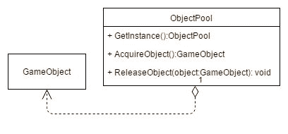
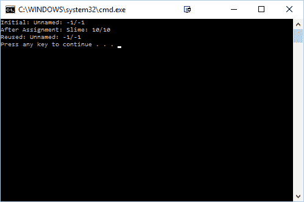
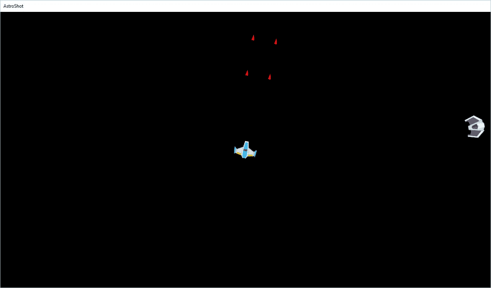
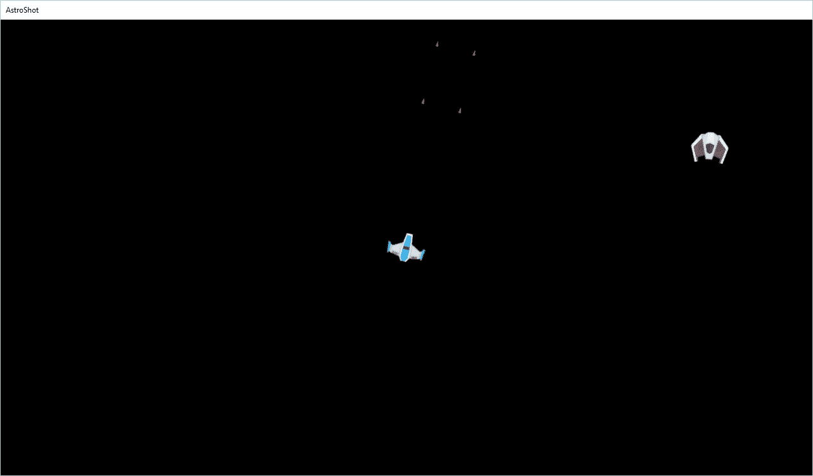

# 使用对象池提高性能

在编程语言中，对于计算机来说，最耗时的事情之一就是处理内存分配。这相当低效，并且根据所使用的资源，可能会极大地减慢你的游戏速度。

在射击游戏中常见的一个元素，或者任何有爆炸或子弹的游戏，是快速连续创建和销毁许多对象。以 *东方 Project* 系列游戏为例，玩家和敌人都会发射大量子弹。如果以最简单的方式完成，当需要创建子弹时调用 `new`，当需要移除它时调用 `delete`，这会导致我们的游戏随着时间的推移而变得卡顿或冻结。

为了防止这种情况发生，我们可以利用对象池模式。

# 章节概述

在本章中，我们将创建一个对象池，允许玩家在屏幕上为游戏生成大量子弹。

# 你的目标

本章将分为几个主题。它将包含一个从头到尾的简单分步过程。以下是我们的任务大纲：

+   为什么我们应该关心内存

+   对象池模式解释

+   使用内存池--重载 `new` 和 `delete`

+   设计决策

# 为什么你应该关心内存

作为程序员，你可能已经习惯了使用 `new` 和 `delete`（如果你正在编写 C 语言，则是 `malloc` 和 `free`），你可能想知道为什么你想自己处理内存，尽管它已经内置到语言中并且使用起来很简单。好吧，首先，就像使用高级编程语言的大多数方面一样，你并不知道幕后发生了什么。如果你编写自己的逻辑来处理内存，你可以创建自己的统计数据和额外的调试支持，例如自动初始化数据。你还可以检查内存泄漏等问题。

然而，对于游戏开发者来说，最重要的方面是性能。为单个对象或一次性为成千上万个对象分配内存，所需时间与计算机查找你的计算机内存中未使用的空隙并给出该连续内存块起始地址所需的时间大致相同。如果你一次又一次地请求小块内存，这可能导致内存碎片化，也就是说，当你想要获取更大的对象时，没有足够的连续空闲空间。


我们可能开始时有一些这样的内存，灰色部分是空闲内存，黑色部分是因为我们为该数据量调用了 `new`。每次我们调用 `new` 时，计算机都需要寻找第一个有足够空间容纳我们提供的对象类型的空地址：


之后，我们删除了一些内存，腾出了一些空间，但计算机需要查看每个地址并花费更多时间搜索：


最后，我们到达了一个地方，那里几乎没有开放数据，并且由于内存碎片化，插入新数据需要大量工作。

这对于开发控制台或移动设备游戏尤其重要，因为你要处理的内存大小远小于你在 PC 上习惯使用的大小。如果你五年或更早之前使用过电脑，你可能记得电脑碎片化的概念，其中电脑会移动内存块以创建可以稍后使用的较大块。但这是一个非常耗时的过程。

Mach5 并不容易提供支持以这种方式创建游戏对象的能力，但如果你对此感兴趣，我们确实有一种可以使用对象池概念的方法来避免资源浪费；我们将在本章后面讨论这一点。

一篇关于为游戏编程编写内存管理器的优秀文章可以在[`www.gamasutra.com/view/feature/2971/play_by_play_effective_memory_.php`](http://www.gamasutra.com/view/feature/2971/play_by_play_effective_memory_.php)找到。

# 对象池模式解释

之前，我们讨论了单例设计模式及其如何在项目中创建单个实例，通常是静态的。我们知道只有一个，并且它只创建一次，我们可以无问题地与项目的其余部分共享它。然而，单例模式仅在实例初始化时才有效。

对象池类似，但不是单个对象，我们希望有一个组（或池）的对象（或实例），我们可以在项目的其余部分中引用。每当项目想要访问这些对象时，我们还有一个被称为**对象池**的另一个对象，它充当项目与对象本身之间的联络员。

也被称为资源池或 N 吨在其他计算机科学领域（但在游戏开发中通常被称为对象池）中，你可以将对象池想象成一个类似管理者的角色。当我们的程序需要使用一个对象时，管理者知道哪些对象正在被使用，并将提供一个未被使用的对象，或者扩展以创建一个新的对象。这促进了之前创建的对象的重用，而不是在运行时创建和删除它们。当初始化类实例的成本很高，或者实例化的速率很高而对象的使用时间很低时，这提供了一系列优势。

让我们以我们的太空射击游戏为例。每次我们按下空格键时，我们都会创建一个新的激光对象。同样，每次我们射击某个东西时，我们都需要销毁它们。这将减慢我们游戏的表现。对于这样一个简单的游戏来说，这并不是一个大问题，但在 AAA 游戏中，我们经常使用这个想法，例如，在 Naughty Dog 的 *Uncharted* 系列中的任何一款游戏或大多数 FPS 游戏中。这些游戏中的敌人非常复杂，将它们放入游戏中成本很高。因此，通常不会在游戏中保留一大堆敌人对象，而是在使用敌人并让它们死亡后，它们会变得不可见，当你需要新的敌人时，死亡的物体会被移动到新的位置并重新激活。

对象池的基本元素看起来可能像这样：



在我们的对象池的情况下，我们有一些类型的变量，我们想要持有其副本。在这种情况下，我将其命名为 `GameObject`，但你也会听到它被称为 `Reusable` 或 `Resource` 类。我们使用 `AcquireObject` 函数从我们的对象池中获取一个对象，当我们完成对其操作时，我们使用 `ReleaseObject` 函数。`GetInstance` 函数的工作方式与我们在前面讨论的 Singleton 类类似，它为我们提供了访问它所引用的 `ObjectPool` 的权限。

在 Mach5 引擎中，默认情况下并没有包含对象池，因此我们需要扩展引擎以支持它。这意味着我们需要从头开始构建一个。

有多种方式来实现对象池模式或获得类似的行为。在我们转向最终版本之前，我们将讨论一些常见的版本及其缺点。

# 实现基本对象池

让我们先从一个可以创建多个实例的简单类开始创建对象池：

```cpp
class GameObject 
{ 
private: 
  // Character's health 
  int currentHealth; 
  int maxHealth; 

  // Character's name 
  std::string name; 

public: 
  GameObject(); 
  void Initialize(std::string _name = "Unnamed", 
     int _maxHealth = -1); 
  std::string GetInfo(); 

};

```

因此，这个示例 `GameObject` 类包含一个用于识别对象的名称和一些示例属性，使类看起来更像游戏对象。显然，你可以轻松地添加更多属性，并且相同的原理适用。在这种情况下，我们有一个名为 `Initialize` 的函数，它为类提供 `set` 和 `reset` 值。最后，我添加了一个 `GetInfo` 函数来打印有关类的信息，这样我们就可以验证一切是否正常工作。

类的实现将看起来像这样：

```cpp
/*************************************************************************/ 
/*! 
Constructor that initializes the class' data 
*/ 
/*************************************************************************/ 
GameObject::GameObject() 
{ 
  Initialize(); 
} 

/*************************************************************************/ 
/*! 
Initializes or resets the values of the class 
*/ 
/*************************************************************************/ 
void GameObject::Initialize(std::string _name, int _maxHealth) 
{ 
  name = _name; 
  maxHealth = _maxHealth; 
  currentHealth = maxHealth; 
} 

/*************************************************************************/ 
/*! 
Prints out information about the class 
*/ 
/*************************************************************************/ 
std::string GameObject::GetInfo() 
{ 
  return name + ": " + std::to_string(currentHealth) + "/" + 
     std::to_string(maxHealth); 
} 

```

现在我们已经创建了游戏对象，我们需要创建池：

```cpp
class GameObject; 

class ObjectPool 
{ 
private: 
  std::list<GameObject*> pool; 
  static ObjectPool* instance; 

  // Private constructor so users are unable to create without 
  // GetInstance 
  ObjectPool() {} 

public: 

  static ObjectPool* GetInstance(); 
  GameObject* AcquireObject(); 
  void ReleaseObject(GameObject* object); 
  void ClearPool(); 

};

```

首先，有两个变量：`pool`，它将包含我们对象池中所有的可用对象，以及`instance`，这是我们访问它的一种方式。请注意，我们的对象池使用 Singleton 设计模式，这意味着对于你想要复制的每种类型的对象，只能有一个。在这种情况下，我们遇到了之前讨论过的问题，即你必须实际删除池并移除创建的所有元素，这就是为什么我们添加了一个`ClearPool`函数，它正好做了这件事。类的实现将类似于以下内容：

```cpp
ObjectPool* ObjectPool::GetInstance() 
{ 
  if (instance == nullptr) 
  { 
    instance = new ObjectPool(); 
  } 
  return instance; 
}

```

在这个先前的函数中，我们首先检查`instance`是否已设置。如果没有设置，我们为其动态分配内存并将其设置为`instance`变量。无论如何，我们之后都会有一个实例，这就是我们返回的内容：

```cpp
/*************************************************************************/ 
/*! 
Returns the first available object if it exists. If not, it will create a new 
one for us 
*/ 
/*************************************************************************/ 

GameObject* ObjectPool::AcquireObject() 
{ 
  // Check if we have any objects available 
  if (!pool.empty()) 
  { 
    // Get reference to an avaliable object 
    GameObject* object = pool.back(); 

    // Since we are going to use it, it's no longer available, 
    // so we need to remove the last element from our list 
    pool.pop_back(); 

    // Finally, return the reference 
    return object; 
  } 
  else 
  { 
    // If none are available, create a new one 
    return new GameObject() 
  } 
} 

/*************************************************************************/ 
/*! 
Marks an object as being available again 

\param 
The object to be made available again 
*/ 
/*************************************************************************/ 
void ObjectPool::ReleaseObject(GameObject* object) 
{ 
  // Reset the object 
  object->Initialize(); 

  // Add it to our avaliable list 
  pool.push_back(object); 
} 

/*************************************************************************/ 
/*! 
Takes care of removing all of the objects from the pool whenever we're finished 
working with it. 
*/ 
/*************************************************************************/ 
void ObjectPool::ClearPool() 
{ 
  while (!pool.empty()) 
  { 
    GameObject * object = pool.back(); 
    pool.pop_back(); 
    delete object; 
  } 
}

```

`ClearPool`函数会持续从池中移除对象，直到池为空。我们首先通过使用`back`函数获取对象的引用，来检索最后一个元素。

然后我们在删除对象本身之前从池中移除该元素：

```cpp
ObjectPool* ObjectPool::instance = 0;

```

最后，C++要求我们必须初始化`instance`变量，所以我们最后添加了这一项。

一旦我们有了这个基础代码，我们就可以开始使用类了。一个示例用法可能是以下内容：

```cpp
  ObjectPool* pool = ObjectPool::GetInstance(); 
  GameObject * slime = pool->AcquireObject(); 

  std::cout << "Initial: " << slime->GetInfo() << std::endl; 

  slime->Initialize("Slime", 10); 

  std::cout << "After Assignment: " << slime->GetInfo() << 
std::endl; 

  pool->ReleaseObject(slime); 

  slime = pool->AcquireObject(); 

  std::cout << "Reused: " << slime->GetInfo() << std::endl; 

  pool->ClearPool(); 
  delete pool;

```

如果我们将此脚本保存并在空白项目中运行它，你会看到以下内容：



在这种情况下，我们首先获取使用`GetInstance`函数的`ObjectPool`，然后使用`AcquireObject`函数（它调用`new`来创建对象）从对象池中获取一个对象。从那里我们打印出它的值，由于构造函数，它被设置为预定义的默认值。然后我们分配值并使用它。之后，我们将它从放置在池中的列表中释放出来，以便在准备好时重用。然后我们再次获取该对象，并显示它已经重置，可以像之前一样重用！

# C++中的操作符重载

现在我们有一个很好的基础可以在此基础上构建，但实际上我们可以使我们的对象池更容易使用。C++中一个很酷的特性是你可以覆盖操作符的默认行为，通常称为**操作符重载**。这是通过创建具有特定名称的函数来完成的，这些名称包含操作符关键字，后面跟着你想要定义的操作符。就像常规函数一样，它们也有返回类型以及传递给它们的参数。

关于操作符重载及其在 C++中的工作方式，更多信息请查看[`www.cprogramming.com/tutorial/operator_overloading.html`](http://www.cprogramming.com/tutorial/operator_overloading.html)。

除了常见的操作符，如`+`、`-`和`/`之外，我们还有能力重载`new`和`delete`操作符，这样我们就可以使用我们自己的自定义对象池了！

要做到这一点，我们需要将以下内容添加到`GameObject`类的末尾，并将以下加粗行添加到类定义中：

```cpp
class GameObject 
{ 
private: 
  // Character's health 
  int currentHealth; 
  int maxHealth; 

  // Character's name 
  std::string name; 

public: 
  GameObject(); 
  void Initialize(std::string _name = "Unnamed", 
     int _maxHealth = -1); 
  std::string GetInfo(); 

 void* operator new(size_t); void operator delete(void* obj); 

};

```

在这里，我们向`GameObject`类添加了两个新函数——一个用于我们创建自己的`new`版本，另一个用于我们的`delete`版本。然后，我们需要添加实现：

```cpp
void* GameObject::operator new(size_t) 
{ 
  return ObjectPool::GetInstance()->AcquireObject(); 
} 

void GameObject::operator delete(void* obj) 
{ 
  ObjectPool::GetInstance()->ReleaseObject(static_cast<GameObject*>(obj)); 
}

```

在我们的案例中，我们只是使用`ObjectPool`类的函数在需要时获取和释放我们的对象，而不是一直分配内存。然后，我们可以按如下方式修改原始实现代码：

```cpp
  ObjectPool* pool = ObjectPool::GetInstance(); 
 GameObject * slime = new GameObject(); 

  std::cout << "Initial: " << slime->GetInfo() << std::endl; 

  slime->Initialize("Slime", 10); 

  std::cout << "After Assignment: " 
     << slime->GetInfo() << std::endl; 

 delete slime; slime = new GameObject(); 

  std::cout << "Reused: " << slime->GetInfo() << std::endl; 

  pool->ClearPool(); 
  delete pool; 

  return 0;

```

现在，请不要立即运行代码。如果你还记得，我们在`ObjectPool`类内部调用了`new`和`delete`运算符，所以现在运行代码将导致堆栈溢出错误，因为当`AquireObject`调用`new`时，它将调用`GameObject`类的`new`版本，然后它又调用`AquireObject`函数，如此循环往复。为了解决这个问题，我们需要使用 C 版本的内存分配，即`malloc`和`free`函数，从系统中获取内存：

```cpp
/*************************************************************************/ 
/*! 
Returns the first available object if it exists. If not, it will create a new 
one for us 
*/ 
/*************************************************************************/ 

GameObject* ObjectPool::AcquireObject() 
{ 
  // Check if we have any objects available 
  if (!pool.empty()) 
  { 
    // Get reference to an avaliable object 
    GameObject* object = pool.back(); 

    // Since we are going to use it, it's no longer available, so 
    // we need to remove the last element from our list 
    pool.pop_back(); 

    // Finally, return the reference 
    return object; 
  } 
  else 
  { 
    // If none are avaliable, create a new one 
 return static_cast<GameObject*>(malloc(sizeof(GameObject))); 
  } 
} 

/*************************************************************************/ 
/*! 
Takes care of removing all of the objects from the pool whenever we're finished 
working with it. 
*/ 
/*************************************************************************/ 
void ObjectPool::ClearPool() 
{ 
  while (!pool.empty()) 
  { 
    GameObject * object = pool.back(); 
    pool.pop_back(); 
 free(object); 
  } 
}

```

现在我们应该能够运行并查看一切是否按预期工作！这个版本在用户仍然调用`new`和`delete`的情况下工作得相当好；然而，它随着时间的推移提供了性能提升。

# 为 Mach5 构建对象池

现在我们已经看到了对象池的实际应用，接下来让我们学习如何将对象池模式集成到 Mach5 游戏引擎中。由于我们正在创建一个射击游戏，在游戏过程中我们生成很多的是来自我们飞船的激光子弹，这使得使用对象池功能变得非常合适。与之前的示例不同，我们将看到一个不需要使用指针来访问池的对象池版本，我们也不必担心池的创建。为了做到这一点，我们需要对起始项目做一些调整。首先，我们需要改变子弹的销毁方式。

如果你进入位于`Mach5-master\EngineTest\EngineTest\ArcheTypes`的`Bullet.ini`文件，你会看到以下内容：

```cpp
posX = 0
posY = 0
velX = 0
velY = 0
scaleX = 2.5
scaleY = 2.5
rot = 0
rotVel = 0
components = GfxComponent ColliderComponent OutsideViewKillComponent

[GfxComponent]
texture = bullet.tga
drawSpace = world
texScaleX = 1
texScaleY = 1
texTransX = 0
texTransY = 0

[ColliderComponent]
radius = 1.25

```

进入并移除`OutsideViewKillComponent`，并用`BulletComponent`替换它。我们替换`OutsideViewKillComponent`是因为当它离开屏幕时，它会将对象的`isDead`属性设置为`true`，这将调用它上面的`delete`并从世界中移除它。我们实际上将自行处理这个问题，所以让我们用我们自己的行为来替换它，这个行为我们将在这个章节稍后编写的`BulletComponent`脚本中实现。

接下来，我们希望为我们的`ObjectPool`创建一个新的位置，因此，考虑到这一点，转到解决方案资源管理器选项卡，然后右键单击 Core/Singletons 文件夹，并选择新建过滤器。创建一个后，将其命名为`ObjectPool`。从那里，右键单击新创建的文件夹，并选择新建项...然后从菜单中选择头文件(.h)选项，并将其命名为`M5ObjectPool.h`。

在`.h`文件中，我们将放入以下代码：

```cpp
/*************************************************************************/ 
/*! 
\file   M5ObjectPool.h 
\author John P. Doran 
\par    email: john\@johnpdoran.com 
\par    Mach5 Game Engine 
\date   2016/11/19 

Globally accessible static class for object caching to avoid creating new objects 
if we already have one not being used. 

*/ 
/*************************************************************************/ 
#ifndef M5OBJECT_POOL_H 
#define M5OBJECT_POOL_H 

#include <vector> 
#include <queue> 

#include "EngineTest\Source\Core\M5Object.h" 

template <M5ArcheTypes T> 
class M5ObjectPool 
{ 
public: 
  // Gives to us the first available object, creating a new one if none is available 
  static M5Object * AcquireObject(); 

  // Returns the object to the pool making it available for reuse 
  static void ReleaseObject(M5Object* object); 

  // Removes all of the objects in the pool and removes references
  // as needed 
  static void ClearPool(); 

private: 
  // All of the objects in the object pool 
  static std::vector<M5Object*>  pool; 

  // All of the objects that are currently available 
  static std::deque<M5Object*> available; 
}; 

#endif //M5OBJECT_POOL_H

```

你会注意到这个类与我们过去所做的工作非常相似，但我们不是使用`GameObject`类，而是使用 Mach5 引擎的`M5Object`类。我们还模板化了这个类，使其能够与任何存在的对象原型一起工作（包括我们的子弹，它由`AT_Bullet`表示）。我还添加了一个新的变量`available`，它是一个**deque**（发音为**deck**），代表双端队列。这个变量将包含所有存在且未使用的对象，这样我们就可以轻松地判断是否有可用的对象，或者是否需要创建一个新的对象。

如果你想了解更多关于 deque 类的信息，请查看[`www.cplusplus.com/reference/deque/deque/`](http://www.cplusplus.com/reference/deque/deque/)。

我们还希望创建一个`M5ObjectPool.cpp`文件。在`.cpp`中，我们将写入以下代码：

```cpp
/*************************************************************************/ 
/*! 
\file   M5ObjectPool.cpp 
\author John P. Doran 
\par    email: john\@johnpdoran.com 
\par    Mach5 Game Engine 
\date   2016/11/19 

Globally accessible static class for object caching to avoid creating new objects 
if we already have one not being used. 

*/ 
/*************************************************************************/ 
#include "M5ObjectPool.h" 
#include "Source\Core\M5ObjectManager.h" 

template class M5ObjectPool<AT_Bullet>;// explicit instantiation     

/*************************************************************************/ 
/*! 
Returns the first available object if it exists. If not, it will create a new 
one for us 
*/ 
/*************************************************************************/ 

template <M5ArcheTypes T> 
M5Object * M5ObjectPool<T>::AcquireObject() 
{ 
  // Check if we have any available 
  if (!available.empty()) 
  { 
    // Get reference to an available object 
    M5Object * object = available.back(); 

    // Since we are going to use it, it's no longer available, 
    // so we need to remove the last element from our list 
    available.pop_back(); 

    // Finally, return the reference 
    return object; 
  } 
  else 
  { 
    M5Object * object = M5ObjectManager::CreateObject(T); 

    pool.push_back(object); 

    return object; 
  } 
}

```

在这个例子中，我们首先会检查是否有任何对象在可用列表中。如果没有，我们将创建一个新的对象，利用`M5ObjectManager`类的`CreateObject`函数。然后，我们将其添加到池中，因为它是我们对象池中的一个对象，但我们不会使其可用，因为它在被获取后将会被使用：

```cpp
/*************************************************************************/ 
/*! 
Marks an object as being available again 

\param 
The object to be made available again 
*/ 
/*************************************************************************/ 
template <M5ArcheTypes T> 
void M5ObjectPool<T>::ReleaseObject(M5Object * object) 
{ 
  // If it's valid, move this object into our available list 
  if ((object->GetType() == T) && 
    (std::find(pool.begin(), pool.end(), object) != pool.end())) 
  { 
    //Make sure we haven't already been added already 
    if(std::find(available.begin(), available.end(), object) == available.end()) 
    { 
      available.push_back(object); 
    } 
  } 

}

```

在这种情况下，`ReleaseObject`函数将一个对象标记为可重复使用。但是，我们想要进行一些错误检查，以确保函数被正确使用，并且没有提供无效的对象。

首先，代码确保对象与对象池的类型相同，并且实际上位于池中的某个位置。这确保了我们只会将有效的对象添加到我们的可用 deque 中。如果我们知道对象是有效的，那么我们就会查看 deque 中已有的对象，并确保该对象尚未被添加。如果没有，我们将其添加到可用 deque 中：

```cpp
/*************************************************************************/ 
/*! 
Takes care of removing all of the objects from the pool whenever we're finished working with it. 
*/ 
/*************************************************************************/ 
template<M5ArcheTypes T> 
void M5ObjectPool<T>::ClearPool() 
{   
  //  Go through each of our objects and destroy them 
  for (int i = pool.size() - 1; i >= 0; --i) 
  { 
    M5ObjectManager::DestroyObject(pool[i]); 
    pool.pop_back(); 
  } 

  // Now clear out the available queue 
  available.clear(); 
}

```

在`ClearPool`函数中，我们只是遍历池中的每一个对象，并销毁那个游戏对象。然后，我们清空可用列表：

```cpp
template<M5ArcheTypes T> 
std::vector<M5Object*>  M5ObjectPool<T>::pool; 

template<M5ArcheTypes T> 
std::deque<M5Object*>  M5ObjectPool<T>::available;

```

最后，我们需要声明池和可用对象，以便将来可以创建它们。

现在我们有了这个基本功能，我们需要将这些对象返回到我们的可用池中。为此，我们需要添加之前提到的`BulletComponent`组件。由于这个组件仅属于我们的游戏，让我们转到`SpaceShooter`/`Components`过滤器，创建一个新的过滤器，称为`BulletComp`。从那里，创建两个新的文件，`BulletComponent.h`和`BulletComponent.cpp`，确保位置设置为`Mach5-master\EngineTest\EngineTest\Source\`文件夹。

在`.h`文件中，放入以下代码：

```cpp
#ifndef BULLET_COMPONENT_H 
#define BULLET_COMPONENT_H 

#include "Core\M5Component.h" 

//!< Removes The parent Game Object if it is outside the view port 
class BulletComponent : public M5Component 
{ 
public: 
  BulletComponent(); 
  virtual void Update(float dt); 
  virtual M5Component* Clone(void); 
}; 

#endif // !BULLET_COMPONENT_H

```

接下来，在`.cpp`文件中，使用以下代码：

```cpp
#include "BulletComponent.h" 
#include "Core\M5Gfx.h" 
#include "Core\M5Math.h" 
#include "Core\M5Object.h"   
#include "EngineTest\M5ObjectPool.h" 

BulletComponent::BulletComponent(): 
M5Component(CT_BulletComponent) 
{ 
} 

void BulletComponent::Update(float /*dt*/) 
{ 
  M5Vec2 pos = m_pObj->pos; 
  M5Vec2 scale = m_pObj->scale; 
  scale *= .5f; 
  M5Vec2 botLeft; 
  M5Vec2 topRight; 
  M5Gfx::GetWorldBotLeft(botLeft); 
  M5Gfx::GetWorldTopRight(topRight); 

  if (pos.x + scale.x > topRight.x || pos.x - 
     scale.x < botLeft.x || 
    pos.y + scale.y > topRight.y || pos.y - scale.y < botLeft.y) 
  { 
    M5ObjectPool<AT_Bullet>::ReleaseObject(m_pObj); 
  } 

} 

M5Component * BulletComponent::Clone(void) 
{ 
  BulletComponent * pNew = new BulletComponent; 
  pNew->m_pObj = m_pObj; 
  return pNew; 
}

```

保存你的文件。这样，如果对象有一个子弹组件，它将被返回到列表中；但我们必须首先制作我们的对象。进入`PlayerInputComponent.cpp`文件，并更新`Update`函数中创建子弹的代码部分，如下所示：

```cpp
//then check for bullets 
 if (M5Input::IsTriggered(M5_SPACE) || M5Input::IsTriggered(M5_GAMEPAD_A))
 {

 M5Object* bullet1 = M5ObjectPool<AT_Bullet>::AcquireObject();
 M5Object* bullet2 = M5ObjectPool<AT_Bullet>::AcquireObject();
 bullet2->rotation = bullet1->rotation = m_pObj->rotation;

 M5Vec2 bulletDir(std::cos(bullet1->rotation), std::sin(bullet1->rotation));
 M5Vec2 perp(bulletDir.y, -bulletDir.x);
 bullet1->pos = m_pObj->pos + perp * .5f * m_pObj->scale.y;
 bullet2->pos = m_pObj->pos - perp * .5f * m_pObj->scale.y;

 M5Vec2::Scale(bulletDir, bulletDir, m_bulletSpeed * dt);

 bullet1->vel = m_pObj->vel + bulletDir;
 bullet2->vel = m_pObj->vel + bulletDir;

 }

```

注意，我们将`bullet1`和`bullet2`的创建替换为使用我们的`ObjectPool`类的`AcquireObject`函数，而不是我们的`ObjectManager`类的版本。

现在我们很难看出我们是在使用刚刚创建的对象，还是正在重用的对象。在我们将其放回对象池之前，让我们回到`BulletComponent`并修改一个属性：

```cpp
void BulletComponent::Update(float /*dt*/) 
{ 
  M5Vec2 pos = m_pObj->pos; 
  M5Vec2 scale = m_pObj->scale; 
  scale *= .5f; 
  M5Vec2 botLeft; 
  M5Vec2 topRight; 
  M5Gfx::GetWorldBotLeft(botLeft); 
  M5Gfx::GetWorldTopRight(topRight); 

  if (pos.x + scale.x > topRight.x || pos.x - scale.x < botLeft.x || 
    pos.y + scale.y > topRight.y || pos.y - scale.y < botLeft.y) 
  { 

 m_pObj->scale = M5Vec2(1.5f, 1.5f); 
    M5ObjectPool<AT_Bullet>::ReleaseObject(m_pObj); 
  } 

}

```

现在我们可以保存我们的脚本并运行我们的游戏！



你会注意到，在游戏开始时，对象的缩放比例为`2.5, 2.5`。然而，一旦一些对象离开屏幕，你会看到以下类似的截图：



当我们射击新子弹时，它们已经被缩小了！有了这个，我们知道我们的池子正在正常工作，并且我们正在重用我们之前创建的对象！

# 对象池的问题

现在，尽管对象池很棒，但我们应该花点时间讨论你不想使用对象池的情况，以及可供选择的替代方案。

首先，你需要记住，当你使用内存管理器时，你是在告诉计算机你比它们聪明，你知道数据应该如何处理。这比其他语言通常给你的权力要大，正如我们在本书第二章一个实例统治一切 - 单例中提到的，使用 Uncle Ben 的名言，“*能力越大，责任越大*”。当使用对象池时，你通常希望它在对象只有有限的生命周期并且会创建很多对象，但不是同时创建时使用。如果在某个时刻你将在屏幕上有 10,000 个对象，但游戏的其他部分你最多只有 30 个，那么那 9,970 个其他对象的内存将只是在那里等待，以防万一你想再次使用它。

同时处理大量对象的一种替代方法是使用循环链表，其中最后一个元素连接到第一个。这将保证你永远不会创建比你分配的内存更多的东西。如果你恰好绕了一圈，你只是在替换最旧的元素，而且如果你一次在屏幕上有这么多东西，用户不会注意到最旧的元素被移除。这对于像粒子系统这样的东西很有用，我们将在第十章共享对象与享元模式中讨论。如果你在生成许多粒子，人们可能不会注意到游戏在用新粒子替换最旧的粒子。

想了解更多关于循环链表的信息，请查看[`www.tutorialspoint.com/data_structures_algorithms/circular_linked_list_algorithm.htm`](https://www.tutorialspoint.com/data_structures_algorithms/circular_linked_list_algorithm.htm)。

我们还使用了一种类型的对象池，每次只分配一个元素。或者，你也可以一次性为大量元素分配内存，以确保你始终有预留的内存。虽然在这个情况下并不需要，但确实是在处理大型类时值得使用的方法。

虽然列出的代码示例是 C#编写的，但 Michal Warkocz 列出了一些非常好的例子，说明了为什么对象池可能不是这里的好选择：[`blog.goyello.com/2015/03/24/how-to-fool-garbage-collector/`](https://blog.goyello.com/2015/03/24/how-to-fool-garbage-collector/)。

# 摘要

在本章中，我们通过存储和重用对象而不是创建和删除对象，使用对象池来减少系统资源和用户的不满。在花时间润色你的工作之后，你可能想要花时间修改你游戏的用户界面，这正是我们将在下一章中讨论的内容！
