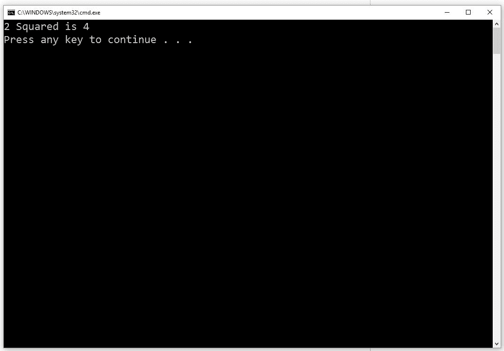
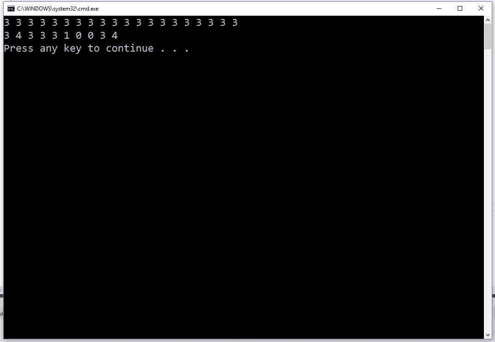
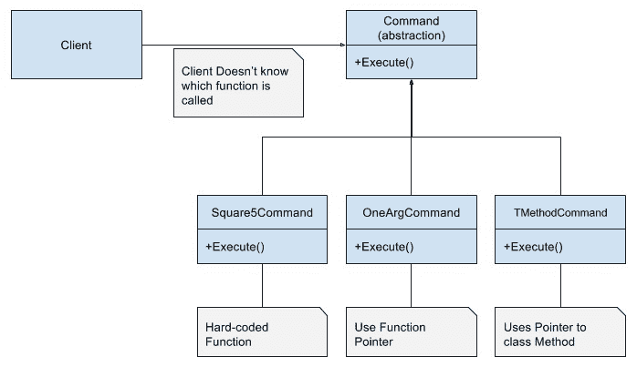
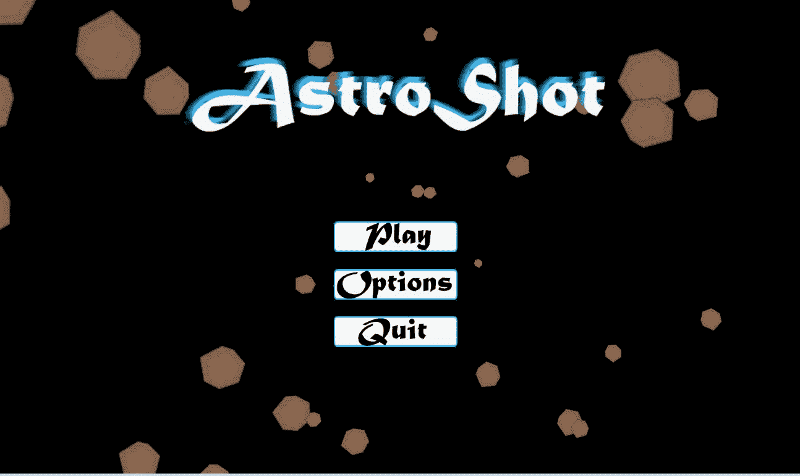

# 通过命令模式控制 UI

在上一章中，我们深入探讨了计算机内存的位和字节，以便使我们的组件更加高效且易于调试。了解这些细节可能是游戏以每秒 60 帧或 30 帧运行的区别。了解如何控制内存使用是成为一名优秀程序员的重要方面。这也是编程中最困难的事情之一。在本章中，我们将从底层编程中暂时休息一下，看看一些高级内容。

用户界面，或 UI，与内存管理或场景切换一样重要。你甚至可以争论它更重要，因为玩家不关心底层细节。他们只想玩一个有趣的游戏。然而，不管游戏玩法有多有趣，如果 UI 难以导航或控制，乐趣水平会迅速下降。

你能记得你玩过一个控制极差的游戏的时刻吗？你继续玩游戏了吗？这很有趣，因为对于如此重要的事情，它经常有机会被推迟到项目结束时。即使在本书中，我们也必须等到第八章才能涵盖它。然而，优秀的游戏将 UI 设计和用户体验设计为首要任务。

有很多关于如何设计用户界面和制作用户体验的优秀书籍。这不是其中之一。相反，我们将查看 UI 背后的代码如何以灵活的方式实现，以便与我们的引擎的其他部分一起工作。制作一个优秀的 UI 的第一步是设计代码，使按钮和其他输入易于创建和更改。

我们将从查看一个非常简单但强大的模式开始，这个模式允许我们将函数调用与想要调用它们的对象解耦。当我们讨论这个模式时，我们将查看 C++允许我们将函数视为对象的一些语法上丑陋且令人困惑的方式。我们还将看到 Mach5 引擎如何使用这个模式来创建可点击的 UI 按钮。

# 章节概述

本章全部关于将用户界面和输入与其执行的动作分离。我们将学习命令模式以及它如何帮助我们解耦代码。我们将通过首先理解问题，然后查看如何以 C 风格的方式解决这个问题来做到这一点。然后，在深入研究了命令模式之后，我们将看到它在 Mach5 引擎中的实现。

# 你的目标

以下列出了本章要完成的事情：

+   学习处理输入的简单方法以及为什么应该避免它

+   使用函数指针和类方法指针实现命令模式

+   学习 Mach5 引擎如何使用命令模式

+   在 Mach5 引擎中实现 UI 按钮

# 我们如何通过按钮控制动作？

在 第三章，“使用组件对象模型改进装饰器模式”，我们实现了游戏对象。现在我们有了它们，创建屏幕上的按钮似乎很简单。事实上，在实时策略等类型中，可点击按钮和游戏对象之间没有区别。玩家可以点击任何单位或建筑并给予指令。

初看之下，我们的按钮可以是游戏对象。它们都有位置、缩放和纹理，这个纹理将被绘制到屏幕上。根据游戏的不同，你可能使用正交投影来绘制按钮，而对象则使用透视投影来绘制。然而，差异远不止于此。

在本质上，按钮有一个在点击或选择时需要执行的操作。这种行为通常是简单的；它不需要创建一个完整的状态机类。然而，它确实需要一点思考，这样我们才不会在高级模块中到处硬编码按钮功能，或者在不同地方重复类似的代码。

在 第五章，“通过工厂方法模式解耦代码”，我们看到了处理菜单屏幕上按钮点击的一个极其简单的方法。回想一下，这段代码是由作者在他们编程生涯早期编写的：

```cpp
if ((p.x > .15 * GetSystemMetrics(SM_CXSCREEN)) && 
    (p.x < .42 * GetSystemMetrics(SM_CXSCREEN)) && 
    (p.y > .58 * GetSystemMetrics(SM_CYSCREEN)) && 
    (p.y < .70 * GetSystemMetrics(SM_CYSCREEN))) 
{ 
  if (mousedown) 
  { 
    mGameState = TCodeRex::LOAD; 
    mGameLevel = L0; 
  } 
} 

```

这段代码存在很多问题：

+   首先，矩形点击区域被硬编码到全屏模式的比例中。如果我们从宽屏 16:9 比例切换到标准 4:3 比例，或者如果我们从全屏模式切换到窗口模式，这段代码将无法正确工作。

+   第二，点击区域基于屏幕而不是按钮本身。如果按钮位置或大小发生变化，这段代码将无法正确工作。

+   第三，这个菜单屏幕是与 Windows 的 `GetSystemMetrics` 函数耦合的，而不是像 `M5App` 类这样的封装平台代码类。这意味着如果我们想在不同的操作系统或平台上运行，这个菜单以及可能的所有菜单都需要进行修改。

+   最后，状态（Mach5 中的阶段）切换动作被硬编码到菜单中。如果我们决定执行不同的动作，我们需要修改菜单。如果这个动作可以通过按钮点击和键盘输入来执行，我们需要更新和维护这两部分代码。

如您所见，这不是处理游戏中按钮的理想方式。这基本上是你可以实现按钮的最糟糕的方式。如果任何东西发生变化，这段代码很可能就会出错。如果作者能说这段代码只是为了演示不应该做什么，那会很好。不幸的是，在你阅读这本书的时候，这样的书并不存在，所以他不得不通过艰难的方式学习。

# 回调函数

处理这些按钮动作的更好方法是使用回调函数。在 C/C++中，回调函数是通过函数指针实现的。它们允许你像传递变量一样传递函数。这意味着函数可以被传递到其他函数，从函数返回，甚至存储在变量中并在以后调用。这允许我们将特定函数与调用它的模块解耦。这是在运行时更改要调用哪个函数的 C 风格方法。

正如指向`int`的指针只能指向`int`，指向`float`的指针只能指向`float`一样，指向函数的指针只能指向具有相同签名的函数。一个例子是以下函数：

```cpp
int Square(int x) 

```

此函数接受一个单个`int`作为参数并返回一个`int`。此返回值和参数列表是函数的签名。因此，此函数的指针将是：

```cpp
int (*)(int); 

```

我们没有给函数指针命名，所以它应该看起来像这样：

```cpp
int (*pFunc)(int); 

```

注意，变量名`pFunc`周围的括号是必需的，否则编译器会认为这是一个返回指针到`int`的函数的原型。

我们现在可以创建一个指向特定函数的指针并通过该变量调用该函数：

```cpp
int (*pFunc)(int); 
pFunc = Square; 
std::cout << "2 Squared is "<< pFunc(2) << std::endl; 

```

上述代码的输出如下：



图 8 1 - 函数指针输出

注意，我们不需要取`Square`函数的地址（尽管这种语法是允许的）；这是因为 C 和 C++中函数的名称已经是该函数的指针。这就是为什么我们可以调用`pFunc`而无需解引用它。不幸的是，关于函数指针的一切在你习惯之前都很奇怪。你必须努力记住语法，因为它与变量指针的工作方式不同。

通过查看更大的示例，我们可以熟悉这种语法。让我们编写一个程序，用三种不同的方式填充数组并打印数组：

```cpp
//Fills array with random values from 0 to maxVal - 1 
void RandomFill(int* array, int size, int maxVal) 
{ 
  for (int i = 0; i < size; ++i) 
    array[i] = std::rand() % maxVal; 
} 

//Fills array with value 
void ValueFill(int* array, int size, int value) 
{ 
  for (int i = 0; i < size; ++i) 
    array[i] = value; 
} 

//Fills array with ordered values from 0 - maxVal - 1 repeatedly 
void ModFill(int* array, int size, int maxVal) 
{ 
  for (int i = 0; i < size; ++i) 
    array[i] = i % maxVal; 
} 

//Helper to print array 
void PrintArray(const int* array, int size) 
{ 
  for (int i = 0; i < size; ++i) 
    std::cout << array[i] << " "; 
  std::cout << std::endl; 
} 

```

我们编写此程序的目标是编写一个函数，该函数可以用任何填充函数填充数组，包括尚未编写的函数。由于我们有一个通用的函数签名，我们可以创建一个名为`FillAndPrint`的函数，它将接受任何具有匹配签名的函数的指针作为参数。这将允许`FillAndPrint`与特定的填充函数解耦，并允许它用于尚未存在的函数。`FillAndPrint`的原型将如下所示：

```cpp
void FillAndPrint(void (*fillFunc)(int*, int, int), int* array, int size, int param); 

```

这非常丑陋且难以阅读。所以，让我们使用`typedef`来稍微清理一下代码。记住，`typedef`允许我们给我们的类型起一个不同的、更易读的名字：

```cpp
//Defines a function pointer type named FillFUnc 
typedef void(*FillFunc)(int*, int, int); 

void FillAndPrint(FillFunc pFunc, int* array, int size, int param) 
{ 
  pFunc(array, size, param); 
  PrintArray(array, size); 
} 

```

在`main`函数中，此代码的用户可以选择他们想要使用的填充函数，甚至可以编写一个完全新的函数（如果签名相同），而无需更改`FillAndPrint`：

```cpp
int main(void) 
{ 
  const int SIZE = 20; 
  int array[SIZE]; 
  //See the Random number generator 
  std::srand(static_cast<unsigned>(time(0))); 
  FillAndPrint(ValueFill, array, 20, 3); 
  FillAndPrint(RandomFill, array, 10, 5); 

  return 0; 
} 

```

下面是此代码将输出到命令行的内容：



图 8 2 - 以不同方式使用 FillAndPrint

如果我们包含一个 `helper` 函数来选择并返回正确的填充函数，我们甚至可以在运行时允许用户选择填充：

```cpp
FillFunc PickFill(int index) 
{   
  switch (index) 
  { 
  case 0: 
    return RandomFill; 
  case 1: 
    return ValueFill; 
  default: 
    //We could report an error if the value is outside of the 
    //range, but instead we just use a default 
    return ModFill; 
  } 
} 

//Our Second main example 
int main(void) 
{ 
  const int SIZE = 20; 
  int array[SIZE]; 
  int fillChoice; 
  int param; 

  //This doesn't properly explain to the user, 
  //but it is just an example 
  std::cout << "Enter a Fill Mode and parameter to use" 
            << std::endl; 
  std::cin  >> fillChoice; 
  std::cin  >> param; 
  //See the Random number generator 
  std::srand(static_cast<unsigned>(time(0))); 
  FillAndPrint(PickFill(fillChoice), array, 20, param); 

  return 0; 
} 

```

这是一个非常简单的例子，但你已经可以看到使用函数指针如何使我们能够编写灵活的代码。`FillAndPrint` 完全与任何特定的函数调用解耦。不幸的是，你也能看到这个系统的两个缺陷。函数必须具有完全相同的签名，并且函数的参数必须传递给函数指针的使用者。

这两个问题使得函数指针既有趣又强大，但并不是支持具有各种参数列表的多种动作的游戏按钮的最佳解决方案。此外，我们可能还想支持使用 C++ 成员函数的动作。到目前为止，我们所看到的所有示例都是 C 风格的全局函数。我们将在稍后解决这些问题，但首先我们应该看看我们将如何触发我们的按钮点击。

# 组件中的重复代码

我们有一个想要将特定的函数调用与其调用位置解耦的问题。如果能创建一个按钮组件来保存函数指针或类似的东西，并在组件被点击时调用它，那就太好了。

一种可能的解决方案是为我们想要执行的所有动作创建一个新的组件。例如，我们可能想要创建一个将舞台更改为主菜单的组件。我们可以创建一个知道如何执行该特定动作的组件类：

```cpp
//MainMenuComponent.h 
class MainMenuComponent : public M5Component 
{ 
public: 
  MainMenuComponent(void); 
  ~MainMenuComponent(void); 
  virtual void Update(float dt); 
  virtual void FromFile(M5IniFile&); 
  virtual MainMenuComponent* Clone(void) const; 
private: 
}; 

//MainMenuComponent.cpp 
void MainMenuComponent::Update(float /*dt*/) 
{ 
  M5Vec2 mouseClick; 
  M5Input::GetMouse(mouseClick); 

  if(M5Input::IsTriggered(M5_MOUSE_LEFT) && 
     M5Intersect::PointRect(clickPoint, 
       m_pObj->pos, m_pObj->scale.x, m_pObj->scale.y)) 
  { 
    M5StageManager::SetNextStage(ST_MainMenu); 
  } 
} 

```

前面的例子是一个非常简单的例子，因为它只是调用了一个带有硬编码参数的静态函数，但函数指针以及函数参数可以很容易地传递给这个组件的构造函数。实际上，我们可以将任何对象传递给构造函数，并在更新函数中硬编码一个特定的方法调用。例如，我们可以将一个 `M5Object` 传递给上面的组件。按钮点击可能会改变对象的纹理。例如：

```cpp
// SwapTextureComponent.cpp 
void SwapTextureComponent::Update(float /*dt*/) 
{ 
  M5Vec2 mouseClick; 
  M5Input::GetMouse(mouseClick); 

  if(M5Input::IsTriggered(M5_MOUSE_LEFT) && 
     M5Intersect::PointRect(clickPoint, 
     m_pObj->pos, m_pObj->scale.x, m_pObj->scale.y)) 
{ 
  //Get the Graphics Component 
  M5GfxComponent* pGfx = 0; 
    m_savedObj->GetComponent(CT_GfxComponent, pGfx); 

    //Do something to swap the texture...  
  } 
} 

```

不幸的是，这种代码有一个大问题；动作完全耦合到按钮点击。这有两个原因不好。首先，除非我们向我们的 UI 按钮点击组件添加额外的键，否则我们无法使用这个动作来响应键盘或控制器的按下。其次，当我们有一系列想要执行的动作时会发生什么？例如，同步多个 UI 对象的移动，或者编写游戏中的场景脚本。由于动作需要鼠标在对象上按下，我们的动作非常有限。

这个方法不好的另一个原因是我们必须在创建的每个按钮组件中重复相同的鼠标点击测试代码。我们希望做的是将动作与按钮点击组件解耦。我们需要创建一个单独的 UI 按钮组件和一个动作类。通过这样做，我们可以提取重复的代码部分，并且能够独立使用这些动作。

# 命令模式的解释

命令模式正是解决我们问题的模式。命令模式的目的就是将请求动作的请求者与执行动作的对象解耦。这正是我们面临的问题。我们的请求者是按钮，它需要与将要进行的任何特定函数调用解耦。命令模式将我们的函数指针概念包装成一个具有简单接口的类，用于执行函数调用。然而，这个模式给了我们更多的灵活性。我们将能够轻松地封装具有多个参数的函数指针，以及 C++对象和成员函数。让我们从两个具有相同参数数量和返回类型的简单函数开始：

```cpp
int Square(int x) 
{ 
  return x * x; 
} 

int Cube(int x) 
{ 
  return x*x*x; 
} 

```

命令模式将请求封装成一个对象，并提供一个公共接口来执行该请求。在我们的例子中，我们将调用我们的接口方法`Execute()`，但它可以是任何名称。让我们看看`Command`抽象类：

```cpp
//Base Command Class 
class Command 
{ 
public: 
  virtual ~Command(void) {} 
  virtual void Execute(void) = 0; 
}; 

```

如您所见，命令模式接口非常简单——它只是一个单一的方法。通常，我们将该方法标记为纯虚函数，这样基类就不能被实例化。此外，我们创建一个空的虚析构函数，以便在需要时调用正确的派生类析构函数。正如我所说的，方法名称并不重要。我见过例如`Do`、`DoAction`、`Perform`等例子。在这里，我们将其称为`Execute`，因为这是《四人帮》所著原始书籍中的名称。

从一开始，我们就通过使用这个模式获得了比函数指针更多的好处。对于每个我们编写的派生类`Execute`方法，这意味着我们可以在那个`Execute`函数中直接硬编码任何函数和任何参数。回想一下，当使用函数指针时，我们需要在调用时传递参数：

```cpp
//Derived command classes 
class Square5Command: public Command 
{ 
public: 
  virtual void Execute(void) 
  { 
    std::cout << "5 squared is " << Square(5) << std::endl; 
  } 
}; 

```

在这个例子中，我们只是将函数调用和函数参数硬编码在原地。现在对于这样一个简单的函数来说，这可能看起来不太有用，但在游戏中可能会用到。正如我们稍后将要看到的，Mach5 引擎有一个退出游戏的命令。该命令直接调用`StageManager::Quit()`。

在大多数情况下，我们可能不想硬编码函数和参数。这正是这个模式力量的体现。在接下来的例子中，我们可以利用这两个函数具有相同签名的事实。这意味着我们可以创建一个函数指针，并将函数及其参数传递给命令。这里的优点是，因为命令是一个对象，它有一个构造函数。因此，我们可以构造一个具有动作及其参数的对象，该参数将由该动作使用：

```cpp
//The function signature of both Square and Cube 
typedef int (*OneArgFunc)(int); 

//Command that can use any function of type OneArgFunc 
class OneArgCommand: public Command 
{ 
public: 
  OneArgCommand(OneArgFunc action, int* pValue): 
    m_action(action), m_pValue(pValue) 
  { 
  } 
  virtual void Execute(void) 
  { 
    *m_pValue = m_action(*m_pValue); 
  } 
private: 
  OneArgFunc m_action; 
  int*       m_pValue; 
}; 

```

这里有一些有趣的事情正在发生。首先，这个命令可以调用任何返回 `int` 并接受一个 `int` 参数的函数。这意味着它可以用于 Square 和 Cube，也可以用于我们以后想出的任何其他函数。下一个有趣的事情是我们可以在构造函数中设置操作和参数；这允许我们在类中保存参数并在以后使用它们。仅使用函数指针是无法做到这一点的。最后，你可能已经注意到我们传递的是一个指向 `int` 的指针，而不是一个 `int`。这展示了我们如何保存函数调用的返回值，并且也允许我们以更灵活的方式考虑这些命令。

命令不仅用于退出游戏或更改阶段。我们可以有一个在执行时改变游戏对象位置的命令，或者根据某些用户输入或按钮点击交换玩家和敌人的位置。通过使用命令，我们可以通过 UI 控制游戏的各个方面。这听起来很像一个关卡编辑器。

现在我们已经看到了两种命令类型，让我们看看客户端如何使用它们。我们将从一个简单的 main 函数开始。我们将在这个调用它的函数中构建命令，但它们也可以通过函数调用设置。重要的是，在客户端调用 Execute 的点上，他们不需要知道正在调用哪个函数，或者需要什么参数（如果有的话）：

```cpp
int main(void) 
{ 
  const int SIZE = 3; 
  int value = 2; 
   //This commands could be loaded via another function 
  Command* commands[SIZE] = { 
    new Square5Command, 
    new OneArgCommand(Square, &value), 
    new OneArgCommand(Cube, &value), 
  }; 

  //The Client Code 
  commands[0]->Execute();//Square5 
  std::cout << "value is " << value << std::endl; 
  commands[1]->Execute();//OneArg Square 
  std::cout << "value is " << value << std::endl; 
  commands[2]->Execute();//OneArg Cube 
  std::cout << "value is " << value << std::endl; 

   for (int i = 0; i < SIZE; ++i) 
    delete commands[i]; 

  return 0; 
} 

```

上述代码的输出如下：

```cpp
5 squared is 25 
value is 2 
value is 4 
value is 64 

```

如我们所见，客户端可以使用相同的接口调用不同的函数，而且不需要关心函数参数。对于这样一个简单的模式，命令模式是惊人的。而且它变得更好。

# 两个参数及以上

我们看到使用函数指针的一个限制是签名必须相同。它们必须有相同的返回类型，以及相同的参数类型和数量。我们可以看到这一点在命令模式中并不成立。客户端在调用时不需要知道或关心具体的签名，因为每个命令都共享公共的 Execute 接口。作为一个例子，让我们看看一个具有多个参数的函数，并为该类型创建一个命令。以下是该函数：

```cpp
int Add(int x, int y) 
{ 
  return x + y; 
} 

```

如我们之前提到的，函数的复杂性并不重要。现在，让我们专注于接受多个参数的函数，就像这个 Add 函数的情况一样。为了使我们的代码更容易阅读，让我们也为这个签名创建一个 `typedef`：

```cpp
typedef int (*TwoArgsFunc)(int, int); 

```

最后，让我们为所有匹配此签名的函数创建一个 `Command`：

```cpp
class TwoArgCommand: public Command 
{ 
public: 
  TwoArgCommand(TwoArgsFunc action, int x, int y) : 
    m_action(action), m_first(x), m_second(y) 
  { 
  } 

  virtual void Execute(void) 
  { 
    std::cout << "The Result is " 
                << m_action(m_first, m_second) 
                << std::endl; 
  } 
private: 
  TwoArgsFunc m_action; 
  int         m_first; 
  int         m_second; 
}; 

```

`main` 函数现在更新如下。这里我们只显示代码中更改的部分：

```cpp
Command* commands[SIZE] = { 
    new Square5Command, 
    new OneArgCommand(Square, &value), 
    new OneArgCommand(Cube, &value), 
    new TwoArgCommand(Add, 5, 6) 
  }; 

//The Client Code 
  commands[0]->Execute();//Square5 
  std::cout << "value is " << value << std::endl; 
  commands[1]->Execute();//OneArg Square 
  std::cout << "value is " << value << std::endl; 
  commands[2]->Execute();//OneArg Cube 
  std::cout << "value is " << value << std::endl; 
  commands[3]->Execute();//TwoArg 

```

上述代码的输出如下：

```cpp
5 squared is 25 
value is 2 
value is 4 
value is 64 
The Result is 11 

```

正如你所见，我们可以轻松地为每个需要的函数指针签名创建一个新的命令。当客户端调用方法时，他们不需要知道使用了多少参数。不幸的是，尽管我们的命令可以接受多个参数，但这些参数仍然只能使用`int`。如果我们想让他们使用`float`，我们就需要创建新的命令或使用模板命令。

在现实世界的场景中，你可以根据需要创建命令，并且只为需要的类型创建它们。另一个更常见的选项是让命令调用 C++类方法，因为方法有使用类变量而不是传入参数的选项。

# 成员函数指针

到目前为止，我们已经看到了如何使用函数指针与命令模式结合，允许客户端调用我们的函数而无需关心参数类型或数量。这非常实用。但是，关于使用 C++对象与命令结合，我们该怎么办？虽然我们可以让命令与对象一起工作，但我们需要先思考一下这个问题。

调用成员函数最基本的方法是在`Execute`方法中简单地硬编码它们。例如，我们可以将一个对象传递给命令构造函数，并始终调用一个非常具体的函数。在示例中，`m_gameObject`是指向传递给构造函数的对象的指针。然而，`Draw`是我们总是调用的硬编码方法。这与在`Square5Command`中硬编码函数相同：

```cpp
//Example of hard-coding a class method 
virtual void Execute(void) 
{ 
  m_gameObject->Draw(); 
} 

```

由于`m_gameObject`是一个变量，调用`Draw`的对象可以改变，但我们仍然总是调用`Draw`。在这种情况下，我们没有调用其他内容的选项。这仍然很有用，但我们希望有调用类类型上任何方法的能力。那么，我们如何获得这种能力呢？我们需要了解成员函数指针。

使用成员函数指针与使用非成员函数指针并没有太大的区别。然而，语法可能比你想象的要奇怪一些。回想一下，在调用非静态类方法时，第一个参数总是隐式传递给指针：

```cpp
class SomeClass 
{ 
public: 
  //Example of what the compiler adds to every 
  //Non-static class method. THIS IS NOT REAL CODE 
void SomeFunc(SomeClass* const this); 
private: 
  int m_x; 
}; 

```

`this`指针允许类方法知道它需要修改哪个类的实例。编译器自动将其作为第一个参数传递给所有非静态成员函数，并且使用`this`指针的地址作为所有成员变量的偏移量：

```cpp
SomeClass someClass; 
//when we type this 
someClass.SomeFunc(); 

//The compiler does something like this 
SomeClass::SomeFunc(&someClass); 

```

即使它是隐式传递的，并且不是参数列表的一部分，我们仍然可以在我们的代码中访问`this`指针：

```cpp
void SomeClass::SomeFunc(/* SomeClass* const this */) 
{ 
//We can still use the this pointer even though it isn't 
//in the parameter list 
this->m_x += 2; 

//But we don't have to use it. 
m_x += 2; 
} 

```

理解这一点很重要，因为普通函数和成员函数并不相同。类成员是类作用域的一部分，并且它们有一个隐式参数。因此，我们不能像普通函数那样保存对它们的指针。类方法的签名包括类类型，这意味着我们必须使用作用域解析运算符：

```cpp
SomeClass someClass; 
//This doesn't work because they are not the same type 
void (*BadFunc)(void) = &SomeClass::SomeFunc; 

//We must include the class type 
void (SomeClass::*GoodFunc)(void) = &SomeClass::SomeFunc; 

```

只要有正确的指针类型是不够的。类成员访问运算符，即点运算符（`.`）和箭头运算符（`->`），并不是设计用来与任意函数指针一起工作的。它们是设计用来与已知的数据类型或已知函数名称一起工作的，这些函数名称在类中声明。由于我们的函数指针直到运行时才知道，这些运算符将不起作用。我们需要不同的运算符，这些运算符将知道如何与成员函数指针一起工作。这些运算符是成员指针运算符（`.*`）和（`->*`）。

不幸的是，这些运算符的优先级低于函数调用运算符。因此，我们需要在对象和成员函数指针周围添加一个额外的括号组：

```cpp
SomeClass someClass; 
void (SomeClass::*GoodFunc)(void) = &SomeClass::SomeFunc; 

//this doesn't work. GoodFunc isn't part of the class 
someClass.GoodFunc(); 
//Extra parenthesis is required for .* and ->* 
(someClass.*GoodFunc)(); 

```

成员指针还有很多内容。这里只是简要介绍。如果您想了解更多信息，请访问[`isocpp.org/wiki/faq/pointers-to-members`](https://isocpp.org/wiki/faq/pointers-to-members)。

# 成员指针命令

现在我们已经知道了如何使用成员函数指针，我们可以创建可以接受一个对象和要调用的特定成员函数的命令。就像之前一样，我们将使用一个简单的例子。示例类并没有设计成做任何有趣的事情，它只是用来演示概念：

```cpp
class SomeObject 
{ 
public: 
  SomeObject(int x):m_x(x){} 

  void Display(void) 
  { 
    std::cout << "x is " << m_x << std::endl; 
  } 
  void Change(void) 
  { 
    m_x += m_x; 
  } 
private: 
  int m_x; 
}; 

```

这里有一个简单的类，称为`SomeObject`。它有一个接受`int`参数的构造函数，并使用它来设置私有成员变量`m_x`。它还有两个函数：一个将值打印到屏幕上，另一个改变值。目前，我们通过给这两个成员函数相同的签名并且不接收任何参数来保持事情简单。这允许我们为这种类型的方法创建一个`typedef`。请记住，类类型是函数签名的一部分：

```cpp
typedef void (SomeObject::*SomeObjectMember)(void); 

```

这创建了一个名为`SomeObjectMember`的类型，它可以很容易地用作函数参数、函数返回类型，甚至可以作为一个成员保存到另一个类中（当然，这正是我们接下来将要做的）。即使你对函数指针和成员函数指针的语法非常熟悉，仍然是一个好的实践来创建这些`typedef`。它们使代码对每个人来说都更容易阅读，正如你将在下一个代码示例中看到的那样：

```cpp
class SomeObjectCommand: public Command 
{ 
public: 
  SomeObjectCommand(SomeObject* pObj, SomeObjectMember member) : 
    m_pObj(pObj), m_member(member) 
  { 
  } 
  virtual void Execute(void) 
  { 
    (m_pObj->*m_member)(); 
  } 
private: 
  SomeObject*      m_pObj; 
  SomeObjectMember m_member; 
}; 

```

由于调用成员函数指针的语法可能很难正确使用，使用`#define`宏可能会有所帮助。虽然大多数时候应该避免使用宏，但这是少数几次宏可以帮助使代码更易读的情况：

```cpp
#define CALL_MEMBER_FUNC(pObj, member) ((pObj)->*(member)) 

```

这将我们的`Execute`函数改为如下：

```cpp
virtual void Execute(void) 
{ 
  CALL_MEMBER_FUNC(m_pObj, m_member)(); 
} 

```

我们所做的一切就是将丑陋的东西隐藏在宏中，但至少人们会更好地理解它在做什么。需要注意的是，这个宏只适用于对象指针，因为它使用了箭头星运算符（`->*`）。

现在，在`main`函数中，我们可以创建指向对象成员的命令：

```cpp
int main(void) 
{ 
  const int SIZE = 6; 
  int value = 2; 
  SomeObject object(10); 
  Command* commands[SIZE] = { 
    new Square5Command, 
    new OneArgCommand(Square, &value), 
    new OneArgCommand(Cube, &value), 
    new TwoArgCommand(Add, 5, 6), 
    new SomeObjectCommand(&object, &SomeObject::Display), 
    new SomeObjectCommand(&object, &SomeObject::Change) 
  }; 

  //The Client Code 
  commands[0]->Execute();//Square5 
  std::cout << "value is " << value << std::endl; 
  commands[1]->Execute();//OneArg Square 
  std::cout << "value is " << value << std::endl; 
  commands[2]->Execute();//OneArg Cube 
  std::cout << "value is " << value << std::endl; 
  commands[3]->Execute();//TwoArg 

  //Member function pointers 
  commands[4]->Execute();//Display 
  commands[5]->Execute();//Change 
  commands[4]->Execute();//Display 

  for (int i = 0; i < SIZE; ++i) 
    delete commands[i]; 

  return 0; 
} 

```

以下是指令层次结构的类图：



图 8.3 - 命令层次结构

尽管这只是一个简单的演示，但我们可以看到，无论它们是调用函数指针还是成员函数指针，无论参数数量如何，客户端代码都是相同的。不幸的是，我们仍然需要为每个需要的函数和类类型创建一个`typedef`。然而，C++模板也可以帮助我们。我们可以创建一个模板命令类，它可以调用具有特定签名（在我们的情况下，`void (Class::*)(void)`）的类方法，这将适用于所有类：

```cpp
template<typename Type, typename Method> 
class TMethodCommand: public Command 
{ 
public: 
  TMethodCommand(Type* pObj, Method method) : 
     m_pObj(pObj), m_method(method) 
  { 
  } 

  virtual void Execute(void) 
  { 
    (m_pObj->*m_method)(); 
  } 
private: 
  Type*  m_pObj; 
  Method m_method; 
}; 

```

正如你在`Execute`方法中看到的，这仅限于调用不带参数的方法，但它可以很容易地修改以适应你游戏的需求。

# 命令模式的好处

如果看所有那些疯狂的代码让你眼花缭乱，你并不孤单。函数指针和成员函数指针调用的复杂语法是 C++中最难的部分之一。因此，许多人避免使用它们。然而，他们也错过了这些特性提供的强大功能。

另一方面，仅仅因为某件事物很强大，并不意味着它总是适合这项工作的正确工具。简单通常更好，而且由于存在许多间接层次，我们刚才看到的代码有可能引发很多错误。是否使用这些工具取决于你自己的决定。话虽如此，让我们讨论一下使用命令模式的优点，这样你可以更好地决定何时何地使用它。

# 将函数调用视为对象

使用命令模式的最大好处是我们封装了函数或方法调用及其参数。这意味着调用所需的一切都可以传递给另一个函数，从函数返回，或存储为变量以供以后使用。这比仅使用函数或方法指针提供了额外的间接层次，但它意味着客户端不需要担心细节。他们只需要决定何时执行命令。

由于在传递给客户端之前我们需要知道所有函数参数，这可能看起来并不很有用。然而，这种情况可能比你想象的更常见。客户端不需要知道函数调用的细节意味着，例如 UI 这样的系统可以非常灵活，甚至可能从文件中读取。

在上述示例中，很明显，在调用时，客户端不知道给定数组索引中存在哪个命令。这是设计上的。可能不那么明显的是，数组可能已经使用函数的返回值而不是使用新操作符（我们在第五章，*通过工厂方法模式解耦代码*中学到）的硬编码调用填充。这种灵活性意味着要执行的函数可以在运行时更改。

这的一个完美例子是游戏中一个上下文相关的 *动作按钮*。由于游戏手柄上的按钮数量有限，根据玩家正在做什么来改变按钮的动作通常很有用。这可能意味着一个按钮负责与 NPC 交谈、拾取物品、打开门或根据玩家的位置和所做的事情触发 *快速反应事件*。

没有命令模式，组织、维护和执行游戏中所有可能动作的逻辑将会极其复杂。有了命令模式，它为每个可执行项提供了一个命令，并在玩家靠近时使其可用。

# 物理上解耦客户端和函数调用

好设计的其中一个方面是低耦合。我们之前已经讨论过很多次这个问题，这里同样适用。首先，由于客户端只依赖于基础 `Command` 类，因此更容易进行测试。这是因为客户端和特定的函数调用或操作都可以独立测试，以确保它们能正常工作。此外，由于这些单元测试测试的是更小的代码量，我们可以更有信心地认为所有可能的用例都得到了测试。这也意味着客户端或命令有更大的机会因为项目内部低耦合而被重用。

其次，当代码库发生变化时，客户端不太可能出错。由于客户端不知道调用的是哪些函数或方法，任何对参数数量或方法名称的更改都仅限于实现更改方法的命令。如果需要添加更多命令，这些命令将自动与现有客户端一起工作，因为它们将使用 `Command` 类接口。

最后，编译时间可以减少，因为客户端需要包含的头部文件更少。包含更少的头部文件可以降低编译时间，因为每次头部文件发生变化时，包含它的每个源文件都必须重新编译。即使是头部文件中注释的最小更改，也意味着所有从该头部文件调用的函数调用都必须在编译时重新检查语法，并在链接时重新链接。由于我们的客户端不知道函数调用的细节，因此不需要包含任何头部文件。

# 时间解耦

这种类型的解耦讨论得不多，因为它只适用于少数情况，而且大多数情况下，这并不是我们想要的。通常，当我们调用一个函数时，我们希望它立即执行。我们代码中有特定的算法，该代码的时序和顺序非常重要。这并不适用于所有代码。一种情况是多线程代码，其中多个代码路径同时执行。其他情况是 UI 或上下文相关的按钮，其中要执行的操作是预先设置的，而不是硬编码在位置上。让我们通过一些代码作为例子来看一下：

```cpp
//Examples of setting up function calls 
//Immediate execution 
Add(5, 6); 
//Delayed execution 
Command* p1 = new TwoArgCommand(Add, 5, 6); 

//Immediate execution 
someObject.Display(); 
//Delayed execution 
Command* p2 = new SomeObjectCommand(&object,&SomeObject::Display); 

```

在上述所有四种情况下，都给出了函数和参数。然而，命令版本可以根据客户端的需求传递给其他方法，根据需要调用和/或恢复。

# 撤销和重做

将调用细节打包到类中的另一个主要好处是能够撤销操作。每个现代桌面应用程序，以及目前制作得最好的网络应用程序，都具备撤销最后一步或几步操作的能力。当你为你的游戏实现关卡编辑器时，这应该是一个你努力遵循的标准。

在应用程序中实现单级撤销可能看起来是一项庞大的任务。直观的方法可能是保存应用程序的整个状态，可能是一个文件，并在需要撤销时重新加载该状态。根据应用程序的不同，可能需要保存大量数据。这种方法在可以具有数十或数百级撤销的应用程序中扩展性不好。随着用户执行更多操作，你需要确保在保存当前状态之前删除最旧的状态。

当你还需要实现重做时，这种简单的方法变得更加困难。显然，我们每天使用的文本编辑器和工具不会在硬盘上存储数百个撤销和重做文件。一定有更好的方法。

而不是保存整个程序的状态，你只需要保存关于发生动作的信息以及哪些数据被更改。保存一个函数及其参数听起来很像命令模式。让我们看看一个简单的例子，在关卡编辑器中将游戏对象从一个地方移动到另一个地方。我们可以创建一个像这样的命令：

```cpp
class MoveCommand: public Command 
{ 
public: 
MoveCommand (Object* pObj, const Vec2D& moveTo) : 
  m_pObj(pObj), m_method(method), m_oldPos(pObj->pos) 
{ 
} 
virtual void Execute(void) 
{ 
  m_pObj->pos = m_moveTo; 
} 

//Add this method to the Command Interface 
virtual void Undo(void) 
{ 
  m_pObj->pos = m_oldPos; 
} 
private: 
Object* m_pObj; 
Vec2D   m_moveTo; 
Vec2D   m_oldPos;//Save the old position so we can redo 
}; 

```

通过将`Undo`方法添加到命令接口，并确保在`Execute`方法中保存将被修改的旧数据，撤销和重做变得极其简单。首先，我们需要为我们的编辑器中可以执行的所有操作实现一个命令。然后，当用户与编辑器交互时，他们总是调用一个命令并将其添加到我们的命令数组末尾。撤销和重做只是调用当前数组索引的`Execute`或`Undo`方法的问题。

创建所有这些命令可能看起来工作量很大，确实如此。然而，这项工作取代了当用户按键或点击鼠标时硬编码函数调用的工作。最终，你会构建一个人们愿意使用的更好的系统。

# 在 Mach5 中使用命令实现简单 UI

既然我们已经了解了命令模式是什么，让我们看看它在 Mach5 引擎中的应用。你会惊讶地发现这里代码并不多。这是因为一旦你理解了背后的代码，使用命令模式就变得很简单。在本节中，我们将查看负责鼠标点击的组件以及引擎内部使用的命令。

让我们看看`M5Command`类：

```cpp
class M5Command 
{ 
public: 
  virtual ~M5Command(void) {}//Empty Virtual Destructor 
  virtual void Execute(void) = 0; 
  virtual M5Command* Clone(void) const = 0; 
}; 

```

这里是 Mach5 引擎中使用的 `M5Command` 类。正如你所见，它几乎与我们在示例中使用的 `Command` 类完全相同。唯一的区别是，由于我们计划在组件内部使用它，因此它需要一个虚拟构造函数。这样我们就可以在不了解真实类型的情况下复制它。

`UIButtonComponent` 类的代码如下：

```cpp
class UIButtonComponent: public M5Component 
{ 
public: 
  UIButtonComponent(void); 
  ~UIButtonComponent(void); 
  virtual void Update(float dt); 
  virtual UIButtonComponent* Clone(void) const; 
  void SetOnClick(M5Command* pCommand); 
private: 
  M5Command* m_pOnClick; 
}; 

```

如你所见，我们的 UI 按钮是一个组件。这意味着任何游戏对象都有可能被点击。然而，这个类是专门设计来与屏幕空间中的对象一起工作的，这是操作系统给我们鼠标坐标的方式。这里的其余代码看起来可能正如你所期望的那样。作为 `UIButtonComponent` 类的一部分，我们有一个私有的 `M5Command`。尽管这个类很简单，但我们会逐一查看每个方法的功能：

```cpp
UI Button Component::UI Button Component(void) : 
  M5Component(CT_UIButtonComponent), m_pOnClick(nullptr) 
{ 
} 

```

构造函数很简单（就像大多数组件构造函数一样），因为它们被设计为通过工厂创建。我们设置组件类型，并确保将命令指针设置为空，以便为后续的更安全代码做好准备：

```cpp
UIButtonComponent::~UIButtonComponent(void) 
{ 
  delete m_pOnClick; 
  m_pOnClick = 0; 
} 

```

析构函数是空指针派上用场的地方。删除空指针是完全合法的，因此我们知道这段代码将工作，即使这个组件从未收到命令：

```cpp
void UIButtonComponent::Update(float) 
{ 
  if (M5Input::IsTriggered(M5_MOUSE_LEFT)) 
  { 
    M5Vec2 clickPoint; 
    M5Input::GetMouse(clickPoint); 
    if (M5Intersect::PointRect(clickPoint, m_pObj->pos, 
       m_pObj->scale.x, m_pObj->scale.y)) 
    { 
      M5DEBUG_ASSERT(m_pOnClick != 0,
         "The UIButton command is null"): 
      m_pOnClick->Execute(); 
    } 
  } 
} 

```

`Update` 函数是我们执行测试以查看鼠标点击是否与对象创建的矩形相交的地方。正如我们之前提到的，这个类可以与所有对象一起工作，但为了简化代码，我们决定只使用这个类来处理屏幕空间中的项目。在这个决定中，重要的代码是 `GetMouse` 函数。这个函数始终返回屏幕空间中的坐标。检查对象是在屏幕空间还是世界空间中，并使用 `M5Gfx` 方法 `ConvertScreenToWorld` 转换坐标是可能的。

那个空指针在这里也很有用。由于我们知道命令指针是有效的或为空，我们可以在执行它之前对代码进行调试断言来测试我们的代码：

```cpp
UIButtonComponent* UIButtonComponent::Clone(void) const 
{ 
UIButtonComponent* pClone = new UIButtonComponent(); 
pClone->m_pObj = m_pObj; 

if(pClone->m_pOnClick != nullptr) 
  pClone->m_pOnClick = m_pOnClick->Clone(); 

return pClone; 
} 

```

`Clone` 方法看起来可能正如你在阅读第六章，*使用原型模式创建对象*后所期望的那样。这是我们需要在使用命令之前始终测试空值的一种情况。我们不能克隆一个空命令，并且无论命令是否已设置，克隆此组件都是完全有效的：

```cpp
void UIButtonComponent::SetOnClick(M5Command* pCommand) 
{ 
//Make sure to delete the old one 
delete m_pOnClick; 
m_pOnClick = pCommand; 
} 

```

`SetOnClick` 方法允许我们设置和重置与此组件关联的命令。再次强调，我们在删除命令之前不需要测试我们的命令。同样，我们也不需要测试方法参数是否为非空，因为空值是完全可接受的。

尽管我们还没有为这个类做这个，但这个类可以很容易地扩展以包括一个 `OnMouseOver` 事件，当鼠标在对象矩形内但未点击时，该事件会被触发。这样的功能可以为 UI 和世界对象提供很多用途。实现它就像在 `Update` 函数中交换两个条件语句一样简单：

```cpp
void UIButtonComponent::Update(float) 
{ 
  M5Vec2 clickPoint; 
  M5Input::GetMouse(clickPoint); 
  if (M5Intersect::PointRect(clickPoint, m_pObj->pos, 
     m_pObj->scale.x, m_pObj->scale.y)) 
  { 
    if (M5Input::IsTriggered(M5_MOUSE_LEFT)) 
    { 
      //Do onClick Command 
    } 
    else 
    { 
      //Do onMouseOver Command
     } 
  } 
} 

```

# 使用命令

现在我们已经看到了基本的 `M5Command` 类和 `UIButtonComponent` 类，让我们看看其中一个派生命令，看看它在游戏中是如何使用的。我们将要查看的命令是游戏中常见的一个。这是允许我们从一个阶段切换到下一个阶段的动作：

```cpp
class ChangeStageCommand: public M5Command 
{ 
public: 
ChangeStageCommand(M5StageTypes nextStage); 
ChangeStageCommand(void); 
virtual void Execute(void); 
void SetNextStage(M5StageTypes nextStage); 
virtual ChangeStageCommand* Clone(void) const; 
private: 
  M5StageTypes m_stage; 
}; 

```

当与 `UIButtonComponent` 一起使用时，这将允许用户点击按钮并切换到新阶段。正如你所见，在构造函数和 `SetNextStage` 方法中，有两种方式可以改变阶段。这使用户能够创建一个命令，并在以后决定它将切换到哪个阶段。`Execute` 方法尽可能简单，因为 `StageManager` 是一个单例：

```cpp
void ChangeStageCommand::Execute(void) 
{ 
  M5StageManager::SetNextStage(m_stage); 
} 

```

以下是将要输出的内容：



图 8 4 - Mach5 引擎中 UIButtons 的示例

要真正实现灵活性，我们希望所有 `UIButtons` 都能从文件中加载。就像游戏对象一样，最好菜单和关卡不与特定命令耦合。至少，我们更愿意避免为每个按钮硬编码位置和大小。这在使用游戏对象时证明是很容易的。玩家或掠夺者游戏对象非常具体，所以在读取关卡文件时，我们只需要覆盖每个对象的位置。大小、纹理名称和其他属性可以从中更具体的原型文件中读取。

按钮更难一些，因为每个按钮可能使用不同的纹理名称，有不同的尺寸，并使用不同的命令。我们无法在按钮原型文件中设置这些数据，因为所有按钮都是不同的。此外，需要控制特定游戏对象的命令很难从文件中加载，因为我们除了类型之外没有关于对象的信息。这意味着虽然我们可以创建和加载一个控制玩家的命令，我们只有一个，但我们不能创建和加载一个控制任意掠夺者的命令，因为我们可能每个阶段都有很多。

一个高质量的关卡编辑器可以解决这两个问题，因为工具可以更好地管理数据。这甚至可以包括分配可以由游戏中的命令使用的对象 ID。对于这本书，为每个按钮定义原型效果很好。虽然这看起来像是一项大量工作，但每个原型文件中的数据否则将硬编码到 `.cpp` 文件中。

# 概述

在本章中，我们专注于创建灵活、可重用的按钮。尽管 UI 可能不如游戏机制那样有趣或值得讨论，但对玩家来说，它同样重要。这就是为什么创建一个良好的系统，以智能的方式添加和管理 UI，对于制作一款优秀的游戏至关重要。

我们深入研究了 C++函数指针和成员指针。这因其复杂性和难以理解而闻名。然而，通过掌握这些技术，我们可以创建灵活的命令，可以调用任何 C 风格函数或 C++对象方法。

虽然这项技术并非总是必需的，但在 UI 方面，它使我们能够创建一个极其灵活的系统。我们的 UI 对象和大多数命令都可以从文件中设置和读取。如果你要创建一个关卡编辑器，你可以轻松地使用这个系统从文件中创建和读取所有 UI 按钮和命令。

现在我们已经有一个灵活的系统来创建 UI，让我们继续讨论制作游戏时每个人都会遇到的其他问题。在下一章中，我们将讨论一种模式，它将使我们能够更好地将引擎代码与游戏代码分离。
