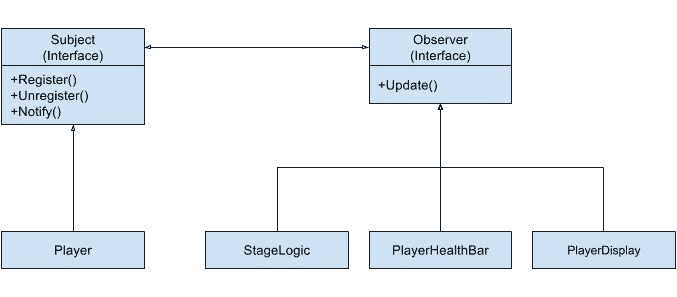

# 通过观察者模式解耦游戏

哇！前两章充满了指针疯狂。这两章结合起来，涵盖了可能被认为是 C++中最难的部分。虽然所有设计模式都在某种程度上处理指针和使用虚函数，但与第七章《通过对象池提高性能》和第八章《通过命令模式控制 UI》中涵盖的内容相比，难度并不会更大。

在第七章《通过对象池提高性能》中，我们深入到了 C++内存的底层。这涉及到类型转换和奇怪的指针操作，大多数人都会避免。在第八章《通过命令模式控制 UI》中，我们处理了控制 UI 的问题，这是一个更高级别的操作。然而，我们学习了如何以允许我们创建灵活代码的方式控制 C++对象及其方法，但这也可能非常令人困惑。

如果您觉得那些章节很舒服，那么您做得很好。如果您觉得那些主题有点难，您并不孤单。无论如何，您都应该很高兴地知道，本章涵盖了一个易于理解、易于实现且易于将我们的核心系统与可能经常更改的游戏特定代码解耦的模式。

在本章中，我们将介绍一个名为**观察者**的模式，它用于以解耦的方式将对象连接在一起。正如您将看到的，它非常简单易实现，并且可以在我们的代码库的许多地方应用。

# 章节概述

本章全部关于学习如何使用观察者模式解耦代码。本章与其他章节略有不同，因为它不是关于使用观察者模式解决一个大模式；它是关于学习将其应用于导致游戏开发过程中代码混乱的许多小情况。观察者模式将向您展示有更好的方法。

首先，我们将探讨游戏代码不可避免地泄漏到我们的引擎代码中的情况。然后，我们将学习观察者模式以及它如何改善这些情况。在这个过程中，我们将查看来自 Mach5 引擎的一些示例代码。然而，由于这个模式有如此多的用途，我们将关注它如何被整合到游戏中，而不是展示一个大型具体的示例。

# 您的目标

+   学习两种可能导致您的引擎代码出现问题的游戏代码方式

+   实现简单的观察者模式示例

+   学习观察者模式的优缺点

# 游戏如何渗透到每个系统中

第一次有人制作游戏时，游戏和引擎之间很可能没有明显的区别。这通常是因为没有引擎。常见的第一个游戏可能包括井字棋或猜谜游戏。这样的游戏足够简单，可以完全在 main 函数中编写，或者可能使用几个函数。它们也足够简单，不需要复杂的系统，如图形或物理。不需要可重用的引擎代码。

当你学习编程更多时，你可能会决定尝试使用图形 API（如 DirectX 或 OpenGL）制作一个 2D 游戏。这样的代码第一次使用时可能非常困难，所以编写干净分离的代码不是首要任务。就像以前一样，游戏只是用几个函数或类制作的。绘图代码通常与碰撞代码混合在一个文件中。

在某个时候，我们都会到达一个地方，那里的代码变得过于复杂和脆弱。硬编码太多的游戏对象类型或太多的关卡让我们希望有更好的方法。当然，这正是这本书的原因。我们正在尝试找到创建游戏更好的方法。在这本书的整个过程中，有一个主要主题：事情总是变化的！

为了应对这种变化，我们试图在我们的游戏部分中区分出那些会变化的部分和那些不太可能变化的部分。用明确的话说，我们正在尝试将我们的引擎代码与游戏玩法代码分开。这种清晰的部件分离引导我们通过了八个章节，这些章节解决了游戏中非常庞大和具体的问题。每个游戏都必须处理创建具有复杂行为的灵活游戏对象。因此，我们学习了组件对象模型和有限状态机。每个游戏都必须处理创建易于修改的用户界面。因此，我们学习了如何使用命令模式从文件中读取动作。这些都是常见问题，有常见解决方案。

然而，随着你编写更多的代码并开始向你的游戏添加更多功能，你总会发现引擎和游戏玩法之间的清晰分离开始变得模糊。其中一个变得明显的地方是物理。物理引擎负责移动对象，以及测试和解决碰撞。

虽然这个引擎应该是纯粹的数学，但事实是，一个游戏不仅仅由物理对象组成。它由子弹、侵略者、玩家等等组成。当子弹与玩家碰撞时，我们必须执行一些非常具体的游戏玩法代码，例如删除子弹，在碰撞点创建一个小粒子效果，并减少玩家的生命值。问题是，这段代码应该在何处执行？如果代码放在物理引擎内部，它将与每个游戏对象类型高度耦合。如果它在引擎外部执行，我们需要以干净的方式将碰撞信息传递到正确的位置。

游戏成就也会出现同样的逐渐增加游戏代码的问题。成就总是特定于游戏的，但最终它们会混入整个代码库中。它们可能包括跟踪行为，比如玩家发射了多少子弹，到跟踪总游戏时间或游戏暂停了多久。然而，它们也可能总是与引擎特定的行为相关，比如分辨率更改了多少次，建立了多少网络连接，创建了或销毁了多少 UFO 游戏对象，或者发生了多少种特定类型的碰撞事件。这种引擎和游戏代码之间的模糊界限，以及一般性的依赖性增加，使得代码重用变得非常困难。

# 硬编码需求

我们知道，将游戏代码引入我们的引擎会增加依赖性并限制代码重用。我们还知道，对于特定的动作，随着游戏功能的添加，需求很可能会发生变化。想象一下在我们的太空射击游戏中添加分屏多人游戏控制器支持的情况。随着更多控制器被插入，会创建更多的玩家，游戏难度增加，我们分割屏幕以跟随新玩家。在这种情况下，原始的控制器检测发生在输入管理器中，但我们需要通知几个其他引擎，有事情发生了。这段代码的一个例子可能如下所示：

```cpp
//Not real code, just an example! 
void InputManager:Update(void) 
{ 
int controllerCount = GetControllerCount(); 
if(controllerCount > m_currentControllerCount) 
{ 
  m_currentControllerCount = controllerCount; 
  Object* pObj = ObjectManager::CreatePlayer(controllerCount); 
  GameLogic::SetDifficulty(controllerCount); 
  //player position is the camera location for the screen 
  Graphics::SetScreenCount(controllerCount, pObj->pos); 

  } 
} 

```

我们可以合理地确信这段代码不会改变。如果我们确信，那么直接硬编码需求是可行的。然而，如果我们不确定，最好假设需求总是会发生变化的。我们可能需要支持在线多人游戏并向网络管理器发送消息。我们可能允许玩家从可能的玩家飞船列表中选择他们想要的飞船类型，因此我们需要调用不同的对象管理器函数，或者通过阶段管理器暂停并切换到新的飞船选择阶段。

在这种情况下，我们有一组对象，当事件发生时需要被通知。我们希望通知自动发生，但不想每次有新的对象需要被通知时都更改输入管理器。更普遍地说，我们有一个广播对象，我们不想每次有新的对象需要监听时都更改它。这就像 Wi-Fi 路由器需要每次有新设备进入范围时都进行更新一样。

上述情况描述了不同核心引擎之间的交互。然而，这些交互之所以以这种方式发生，仅仅是因为游戏的具体需求。即使没有游戏代码，特定游戏的功能已经逐渐渗透到输入引擎中，如果我们要制作不同的游戏，就需要对其进行更改。当然，我们可以尝试将一些代码提取到游戏逻辑引擎中，或者只是将类似的代码放入一个阶段。还有其他方法吗？我们将考虑这一点，但首先，我们将从另一个角度探讨这个问题。

# 轮询

尽管你尽了最大努力，游戏玩法往往变得一团糟。游戏中有许多相互作用的部件，完全减少游戏代码的耦合是不可能的。虽然图形引擎和物理引擎可以完全独立且解耦是有道理的，但我们甚至不应该尝试在游戏玩法上这样做。游戏代码就是游戏本身。我们能做的最好的事情就是尝试优雅地处理游戏设计的修改。

这种情况最明显的例子是我们从第四章中看到的，*使用状态模式的智能代理*。状态通常需要访问对象管理器，因此会扫描整个对象列表以查找对象。它们也可能需要访问物理引擎以查看它们是否在本帧或下一帧与对象发生碰撞。游戏代码是将其他所有东西粘合在一起的代码，因此它实际上不能完全解耦。

另一个例子可能是以屏幕空间绘制 HUD 对象。如果窗口分辨率改变，对象需要重新定位。屏幕中央的 800 x 600 分辨率的按钮在 1280 x 1024 分辨率下仍然需要在屏幕中央。这意味着位置不能硬编码，必须在分辨率改变时自动调整。有两种方法可以做到这一点。第一种与上面的例子相同；我们可以让更改分辨率的按钮调用其他系统的方法。第二种是让关心分辨率更改的对象向应用程序请求分辨率：

```cpp
void RepositionComponent::Update(float /*dt*/) 
{ 
  M5Vec2 windowSize = M5App::GetResolution(); 
  m_pObj->pos.x = windowSize.x * m_xScale; 
  m_pObj->pos.y = windowSize.y * m_yScale; 
} 

```

这里是一个`RepositionComponent`的例子。每一帧，它都会向`M5App`请求窗口分辨率，并将对象设置为窗口指定的缩放比例。一个需要位于屏幕中央的对象会有`x`和`y`缩放值为`.5`。如果分辨率是 800 x 600，对象的位将是`x = 400`，`y = 300`。如果分辨率更改为 1280 x 1024，对象的位将是`x = 640`，`y = 512`。

这完全符合预期，但它做了很多不必要的操作。问题不在于这段代码会让你的游戏变慢；你可以在看到减速之前让成千上万的物体这样做。然而，这个组件每秒请求 60 次分辨率，而分辨率更改可能只在一次游戏会话中发生一次。更有可能的是，玩家会选择一次分辨率，游戏设置会将其保存到文件中，并在之后的每次会话中自动加载它。

这种轮询方法的问题在于`RepositionComponent`无法知道分辨率何时改变。如果这段代码只在数据改变时运行，那会很好。相反，它不断地请求完全相同的数据，并在每一帧计算完全相同的位置。

上面的例子很小。类似这样的问题可能看起来很微不足道。单独来看，它们甚至可能不是问题，但，当它们累积起来时，可能会影响你的游戏。这一点在本章迄今为止的所有例子中都是成立的。它们看起来很容易一个个解决，但它们可能会累积成大量的浪费的 CPU 周期以及开发者的时间。如果能有一个易于实现的模式来解决游戏中出现的这些小问题那就太好了。幸运的是，观察者模式正是如此。

# 观察者模式解释

观察者模式的目的是定义对象之间的一对多关系。当一个对象的状态发生变化时，所有依赖它的对象都会得到通知。在这个模式中，对象的典型名称是**主题**（单个），和**观察者**（多个）。主题将包含观察者需要知道的数据。而不是通常的类从另一个类请求数据（轮询）的情况，我们的主题将在数据发生变化时通知观察者列表。

术语主题和观察者一开始可能有点令人困惑。然而，这个概念非常简单，而且是我们大多数人熟悉的。在尝试理解观察者模式时，想想博客和订阅者。在这种情况下，博客是主题，订阅者是观察者。

一个博客可能每天更新一次，每周更新一次，每月更新一次，甚至更少。博客的读者可以选择检查更新，然而，如果读者检查的频率高于博客更新的频率，这可能会浪费很多时间。相反，粉丝通常会选择订阅电子邮件列表，以便在更新发布时得到通知。博客保留一个订阅者列表，并在更新发布时给列表上的每个人发送电子邮件。

# 主题和观察者

让我们通过一个代码示例来更好地理解这个模式。实现这个模式有几种不同的方法，所以我们将沿途讨论实现策略：

```cpp
class Observer 
{ 
public: 
  virtual ~Observer(void) {} 
  virtual void Update(float currentHealth, float maxHealth) = 0; 
}; 

```

我们从我们的`Observer`接口开始。和往常一样，我们使我们的析构函数为虚函数。我们需要的唯一方法是`Update`方法，然而，和往常一样，名称并不重要。这是主题将用来通知观察者有东西发生变化的那个方法。你可能注意到更新非常具体。在这种情况下，它有两个浮点数作为参数。这是一个可能会改变并导致我们的代码出错的依赖项。我们将在稍后讨论改进。

你可能也会注意到没有成员数据。可能给基类提供一个指向主题的指针，并让这个类负责向主题注册和注销（订阅和取消订阅）。我们决定将这种行为移动到派生类中，这样我们可以尽可能保持基类简单：

```cpp
class Subject 
{ 
public: 
  virtual ~Subject(void) {} 
  virtual void RegisterObserver(Observer* pToAdd)      = 0; 
  virtual void UnregisterObserver(Observer* pToRemove) = 0; 
  virtual void Notify(void)                            = 0; 
}; 

```

我们的主题（Subject）几乎和观察者（Observer）一样简单。我们需要的关键方法是观察者订阅和取消订阅主题的方式。在这里，我们称这些方法为`RegisterObserver`和`UnregisterObserver`。我们还添加了一个`Notify`方法，它将用于调用所有已注册观察者的`Update`方法。这个方法没有必要是公开的，甚至根本不需要存在。只要派生类在注册的观察者上调用`Update`，我们就正确地使用了这个模式。

再次，你会注意到这个类中没有数据成员。我们可以在基类中轻松地添加一个观察者指针的向量。实际上，我们可以轻松实现这些方法，因为它们几乎总是相同的。然而，我们选择保持这个类简单，并让派生类选择如何实现这些方法。

# 玩家

为了展示观察者模式如何使用，我们将考察游戏中常见的情景。我们将有一个玩家，其拥有一些需要共享的生命值。玩家的生命值在游戏中可以用于许多事情。生命值的数值可能作为 HUD 的一部分显示。它也可以在 HUD 中或直接在玩家的顶部或底部以彩色生命条的形式显示。此外，当玩家生命值达到或低于零时，游戏可能会切换到游戏结束界面。

这些显示元素以及场景切换机制直接依赖于玩家的生命值。由于这些变量不太可能都在同一个作用域中，如果我们尝试通过轮询来实现，这将需要一些工作。在这种情况下，每个对象都需要找到玩家并请求生命值。由于玩家的生命值不太可能每帧都改变，大部分工作都是浪费的。相反，我们将让玩家从主题（Subject）派生，这样当生命值改变时，它就可以通知所有观察者：

```cpp
class Player: public Subject 
{ 
public: 
  Player(float maxHealth); 
  void AdjustHealth(float health); 
  virtual void RegisterObserver(Observer* pToAdd); 
  virtual void UnregisterObserver(Observer* pToRemove); 
  virtual void Notify(void); 
private: 
  typedef std::vector<Observer*> ObserverVec; 

  float       m_maxHealth; 
  float       m_health; 
  ObserverVec m_observers; 
}; 

```

这个`Player`类非常简单。由于这只是一个示例，我们只会关注生命值。在构造函数中，我们可以设置最大生命值。`AdjustHealth`方法将用于改变生命值。当然，我们也会实现基类中的每个虚拟方法。在`private`部分，我们使用 STL 向量来跟踪我们的观察者。我们还存储了构造函数的值，以及我们当前生命值的变量：

```cpp
Player::Player(float maxHealh): 
  m_maxHealth(maxHealth), 
  m_health(maxHealth) 
{ 
} 

```

`Player`构造函数设置用户传入的数据。由于基`Subject`类没有数据，这里没有特别的事情要做：

```cpp
void Player::RegisterObserver(Observer* pToAdd) 
{ 
  ObserverVec::iterator itor; 
  itor = std::find(m_observers.begin(), 
                    m_observers.end(), 
                    pToAdd); 

  assert(itor == m_observers.end()); 
  m_observers.push_back(pToAdd); 
} 

```

`RegisterObserver`方法接受一个观察者的指针并将其添加到观察者的向量中。根据观察者的行为，被添加到列表两次可能会引起很多问题，并且可能是一个难以追踪的困难错误。在这个例子中，我们选择断言如果相同的观察者被添加两次。之后，我们将其添加到我们的向量中：

```cpp
void Player::UnregisterObserver(Observer* pToRemove) 
{ 
  ObserverVec::iterator itor; 
  itor = std::find(m_observers.begin(), 
                    m_observers.end(), 
                    pToRemove); 

  if (itor != m_observers.end()) 
  { 
    std::swap(*itor, *(--m_observers.end())); 
    m_observers.pop_back(); 
  } 
} 

```

我们的 `UnregisterObserver` 类稍微宽容一些。如果我们没有在向量中找到观察者，我们会忽略它，而不是抛出一个断言。这将在稍后更加清晰。你会看到我们的观察者将自动在它们的析构函数中移除或注销。然而，注销两次不太可能引起问题。`std::swap(*itor, *(--m_observers.end()))` 这行代码可能看起来有点吓人。记住，`end` 方法返回一个指向向量末尾之后的迭代器。所以，在我们解引用之前，我们递减我们的迭代器，使其指向向量中的最后一个元素。然后我们交换并弹出，移除正确的元素：

```cpp
void Player::Notify(void) 
{ 
  size_t size = m_observers.size(); 
  for (size_t i = 0; i < size; ++i) 
    m_observers[i]->Update(m_health, m_maxHealth); 
} 

```

如我们之前所说，`Notify` 方法并不需要存在。如果类逻辑在内部通知观察者，比如在 `Setter` 方法或数据变化时，如我们的 `AdjustHealth` 方法，那就很好了。然而，如果有多个观察者关心的数据，用户可以做出许多更改，并一次性将所有数据发送给观察者。或者，也许在游戏开始之前初始化观察者数据。

这种方法很简单。它遍历观察者的向量，并调用 `Update` 方法，将健康数据发送给关心这些数据的对象：

```cpp
void Player::AdjustHealth(float adjustHealth) 
{ 
  m_health += adjustHealth; 
  Notify(); 
} 

```

这种方法模拟玩家获得或失去健康。如你所见，在健康值修改后，类调用自己的 `Notify` 方法，让所有观察者都知道这个变化。

# 观察者

对于这个例子，我们有之前提到的三个观察者。两个与以不同方式显示玩家健康值有关；另一个用于玩家健康值为零或以下时退出：

```cpp
//Used to quit the game when the "game", when the player's health 
//is less than or equal to 0 
class StageLogic : public Observer 
{ 
public: 
  StageLogic (Subject* pSubject); 
  bool IsQuitting(void) const; 
  ~StageLogic(void); 
  virtual void Update(float currentHealth, float maxHealth); 
private: 
  bool     m_isQuitting; 
  Subject* m_pSubject; 
}; 

//Used to Color the player health bar based on the how full it is 
class PlayerHealthBar : public Observer 
{ 
public: 
  PlayerHealthBar(Subject* pSubject); 
  ~PlayerHealthBar(void); 
  void Display(void) const; 
  virtual void Update(float currentHealth, float maxHealth); 
private: 
  float       m_percent; 
  std::string m_color; 
  Subject*    m_pSubject; 
}; 

//Used to Display the health of the player as a value 
class PlayerDisplay : public Observer 
{ 
public: 
  PlayerDisplay(Subject* pSubject); 
  ~PlayerDisplay(void); 
  void Display(void) const; 
  virtual void Update(float currentHealth, float maxHealth); 
private: 
  float    m_health; 
  Subject* m_pSubject; 
}; 

```

如你所见，每个派生 `Observer` 类都重载了基类的 `Update` 方法。你也会注意到每个构造函数只接受一个指向主题的指针作为唯一参数，并将该指针保存到成员变量中。这并不是必需的，但它使得注册和注销更加方便，因为对象会自己处理。在这个例子中，所有三个观察者的构造函数和析构函数都做了完全相同的事情。这里有一个例子：

```cpp
PlayerDisplay::PlayerDisplay(Subject* pSubject): 
  m_health(0.0f), 
  m_pSubject (pSubject) 
{ 
  m_pSubject ->RegisterObserver(this); 
} 

PlayerDisplay::~PlayerDisplay(void) 
{ 
  m_pSubject ->UnregisterObserver(this); 
} 

```

是否保留对主题的指针的选择取决于你。它有一些问题，我们稍后会讨论；然而，它允许观察者在析构函数中注销。这意味着用户不需要这样做，这使得使用 `Observers` 类非常容易。如果我们不保留这个指针，注销必须手动完成，这可能会根据你如何访问主题和观察者而变得困难。

其余的 `Observer` 方法都很简单，并且根本不与主题交互。相反，`Update` 方法基于 `currentHealth` 和 `maxHealth` 的值执行一些逻辑。对于两个显示元素，这意味着计算一些值；对于 `StageLogic` 类，这意味着如果当前健康值为零或更少，则将 `m_isQuitting` 设置为 true。让我们看看观察者中的一个 `Update` 的例子：

```cpp
void PlayerHealthBar::Update(float currentHealth, float maxHealth) 
{ 
  m_percent = (currentHealth / maxHealth) * 100.f; 

  if (m_percent >= 75.0f) 
    m_color = "Green"; 
  else if (m_percent < 75.0f && m_percent > 35.0f) 
    m_color = "Yellow"; 
 else 
    m_color = "Red"; 

} 

```



图 9 1 主题和观察者的交互

如您所见，`Update` 方法并不复杂。上述方法中没有任何部分使用了主题。数据可能来自任何地方。最有趣的部分是这些对象现在使用起来多么简单。所有三个观察者都在使用玩家的健康值，但他们不需要调用任何 `Player` 方法。尽管这四个对象相互交互，但使用它们却极其简单。让我们看看我们如何一起使用这些对象：

```cpp
int main(void) 
{ 
  //Our value to decrement by 
  const float DECREMENT       = -1.0f; 
  const float STARTING_HEALTH =  5.0f; 

  //creating our objects 
  Player          player(STARTING_HEALTH); 
  PlayerDisplay   display(&player); 
  PlayerHealthBar bar(&player); 
  StageLogic      stageLogic(&player); 

  //Set the initial values to print 
  player.Notify(); 

  //loop until player is dead 
  while (!stageLogic.IsQuitting()) 
  { 
    display.Display(); 
    bar.Display(); 
    player.AdjustHealth(DECREMENT); 
  } 

  return 0; 
} 

```

`main` 函数开始时使用一些 `const` 值以提高可读性。之后，我们创建我们的对象。我们首先创建我们的 `Player`，它是我们的主题。然后我们创建我们的观察者。每个观察者都获得对主题的指针。记住，它们只依赖于主题接口，而不是派生的 `Player` 类。一旦所有观察者都创建完毕，`Player` 就会进行一个初始的 `Notify` 调用，以便观察者从正确的数据开始。最后，我们使用我们的对象。这个 while 循环的简单性令人惊叹。由于将它们链接在一起的代码都是内部的，因此使用这些对象变得非常容易。将上面的例子与不使用观察者模式的代码版本进行比较：

```cpp
  //Alternate code without Observer pattern 
   while (!stageLogic.IsQuitting()) 
  { 
     display.SetHeath(player.getHealth()); 
     display.Display(); 

     bar.setHealth(player.getHealth(), player.getMaxHealth()); 
     bar.Display(); 

     player.AdjustHealth(DECREMENT); 

     stageLogic.SetQuit(player.GetHealth() <= 0); 
  } 

```

使用观察者模式允许我们编写更优雅、更易于使用的代码。不幸的是，许多程序员编写的代码更接近第二个版本。他们没有意识到，只要稍微思考一下对象之间的交互方式，代码就更容易使用、更容易阅读，并且更高效，因为它只在数据发生变化时从玩家获取数据。

在这个简单的例子中，可能看起来代码并没有太大不同，但请记住，这只是尽可能简单地演示这个模式。第二个版本看起来合理，因为所有对象都在同一个作用域内。除了构造函数外，在实际项目中，观察者代码保持不变。然而，第二个版本可能会变成一个单例方法调用和对象查找的混乱。

# 推与拉

我们之前观察到的观察者模式的一个大问题是基类中的 `Update` 方法有限制。在我们的例子中，它只能与期望两个浮点数的观察者一起使用。如果我们想要不同的观察者风格，我们需要创建一个新的 `Observer` 类和一个新的主题来与之一起工作。

这种模式的推送版本非常棒，因为类是完全解耦的。派生类根本不需要了解彼此。为了这种解耦，我们需要为每个想要使用的方法签名编写大量的 `Subject` 和 `Observer` 基类。这个模式的另一种版本允许观察者从 Subject 中拉取他们想要的数据。在拉取版本中，Subject 在 `Update` 方法中将自身作为参数发送，观察者使用 Subject 的 `Getter` 方法只拉取它想要的数据。

这正是我们下一个例子中发生的情况。`PlayerHealthBar` 类现在接受一个指向 Subject 的指针。在这种情况下，我们期望 Subject 是 Player 类型。`Update` 方法可以使用它需要的任何 Player 数据来完成其任务：

```cpp
//Now the update method takes a pointer to the subject 
class Observer 
{ 
public: 
  virtual ~Observer(void) {} 
  //Pull version of the Observer Pattern 
  virtual void Update(Subject* pSubject) = 0; 
}; 

//Example of an Observer Update method that pulls data 
void PlayerHealthBar::Update(Subject* pSubject) 
{ 
  //Make sure we have a Player 
  Player* pPlayer = dynamic_cast<Player*>(pSubject); 
  if(pPlayer == 0) 
    return; 

  m_percent = (pPlayer->GetHealth() / pPlayer->GetMaxHealth()); 
   m_percent *= 100.f; 

  if (m_percent >= 75.0f) 
    m_color = "Green"; 
  else if (m_percent < 75.0f && m_percent > 35.0f) 
    m_color = "Yellow"; 
 else 
    m_color = "Red"; 
} 

```

在模式的拉取版本中，`Observer` 依赖于派生的 `Subject` 类（在这种情况下是 Player），但 `Update` 方法更加灵活。此外，这个观察者可以观察多个不同的 Subject。`Update` 方法可以有一系列 `if` 语句来确定哪个可能的 Subject 执行了调用。类与特定对象耦合得更紧密。然而，由于观察者现在可以观察多个 Subject，相同的 `Observer` 类可以用于更广泛的对象。例如，一个单独的 `Observer` 类可以用来跟踪游戏中每种类型的对象死亡的数量，通过将自己注册到每个创建的游戏对象中并监控所有 Subject 的健康状态。

# 使用观察者模式的好处

在本章的开始，我们看到了交互式游戏代码的三个问题。正如我们之前所说的，这些问题并不大，但它们无处不在，并且随着项目的推进可能导致代码不够灵活。观察者模式以非常简单的方式解决了这些问题。

使用观察者模式最大的好处是我们可以减少依赖和耦合。通过使用观察者模式的推送版本，我们的类可以完全通过接口进行交互，因此它们之间没有任何依赖。在先前的例子中，Player 和 Player Display 是完全解耦的。这意味着对其中一个的更改不会影响另一个。首先，这使得每个类更容易进行测试和调试，因为它们可以单独工作。然而，这也意味着随着游戏的变化，这些类可以独立变化。这意味着单个类可以很容易地在当前项目或单独的项目中重用。唯一的问题是推送版本使我们陷入了一个单一的 `Update` 方法签名。

使用观察者模式的拉取版本增加了依赖性；然而，主题/观察者系统要灵活得多。观察者现在可以监听多个主题，主题可以将其不同的数据与每个观察者共享。尽管依赖性增加了，但这仅限于观察者一侧，因为主题仍然不需要了解它们的观察者。这些增加的依赖性仍然比替代方案更好，因为它们仅限于需要交互的两个类。如果不使用观察者模式，则需要使用第三个类来将这些两个类连接起来。

这个模式的第二个好处是我们不再需要硬编码方法或要求。由于事件被广播到任何注册的对象，如果新的对象需要事件，则无需重新编译。这减少了编译时间，并限制了破坏代码的机会。

这不仅限于将系统连接到其他系统。由于观察者可以在运行时注册和注销，游戏对象可以将自己注册到其他游戏对象。想象一下一个敌人太空站，它不断地产生掠夺者。通过将掠夺者注册到产生它们的站，每个站都可以充当小型指挥官，轻松地协调攻击和防御的部队。

最后一个好处是无需轮询对象。在前面的例子中，我们看到了两个 `while` 循环——一个使用观察者模式，另一个每帧轮询数据。我们看到了使用观察者模式时代码看起来多么整洁。除了看起来更整洁之外，第一个例子出现 bug 的可能性也更低，因为一旦注册，观察者将始终接收到更新的数据。在一个更大的项目中，另一种方法要求每个对象在代码库的许多地方不断请求数据。确保每个需要数据的对象在许多位置每帧都请求数据可能是一项艰巨的任务。

除了在每次轮询发生时非常难以找到和维护之外，这种方法还会导致代码效率降低。我们不应该试图过早地优化我们的代码，而且这很可能不是我们游戏的瓶颈，这就是为什么我们最后才提到它。然而，最快的代码是永远不会运行的代码。在使用观察者模式时，如果数据从未改变且事件从未发生，`Update` 方法永远不会被调用。因此，使用观察者方法有可能比每帧轮询数十次或数百次来提高我们的性能。

# 使用观察者模式的问题

当然，观察者模式并不是一个完美的解决方案。没有完美的解决方案，如果有，这本书将会非常短。就像每个模式一样，学习如何使用它以及如何不使用它同样重要。学习何时使用一个模式与学习何时不使用一个模式同样重要。

使用观察者模式时需要注意一些事项。所有模式的目的是简化开发周期。然而，如果模式没有被完全理解，可能会浪费很多时间调试本意是为了节省时间的多层代码。

# 悬垂引用

每个人都应该注意的第一个主要问题是悬垂引用的问题。我们必须确保我们对象持有的指针永远不会变得无效。理解这个问题的最好方法是查看命令模式并将其与观察者进行比较。

命令模式和观察者模式之间最大的区别是所有权的差异。在命令模式中，命令的客户或用户拥有一个指针。这意味着客户负责删除命令。这之所以重要，是因为没有其他类拥有命令指针，因此它不应变得无效。在 Mach5 引擎中，`UIButtonComponent` 拥有一个命令。它在析构函数中删除该命令，或者当它被赋予新的命令指针时。

将此与观察者模式进行对比。主题包含一个指向观察者的指针，观察者可以持有指向主题的指针。两个对象都不拥有对方，并且任何时刻都可以删除任一对象。它们是独立的对象，只是恰好通过指针相互通信。

在删除观察者之前，必须将其从它所观察的每一个主题中注销。否则，主题将不断尝试通过无效指针更新它，导致未定义的行为。在示例中，我们通过让观察者持有主题的指针并在析构函数中注销自己来实现这一点。如果主题先被删除，这会导致问题。在示例中，主题没有方法通知观察者它将被删除。如果主题先被删除，观察者仍然会在自己的析构函数中尝试注销，导致未定义的行为。

解决这个问题的有两个方案。首先，我们可以确保主题在观察者之前不会被删除。其次，我们可以从观察者中移除主题指针，并确保在它被删除之前，观察者仍然从正确的主题中注销。这两个方案都可能很难保证。如果你在游戏中实现了观察者模式，你必须考虑这个问题。

# 过度使用

观察者模式第二个问题是过度使用的风险。我们之前提到，当方法的需求不完全清楚或可能发生变化时，观察者模式是一个很好的选择。虽然游戏中的任何事物都可能发生变化，但将其推向极端将导致一个无法编程的项目，并且永远不会完成。在最极端的情况下，每个对象都可以既是主题（Subject）也是观察者（Observer）。每个方法都将最终具有灵活性，因为我们可以在运行时更改其所有内容。每个调用都会通知观察者，进而通知更多的观察者。

当然，没有人会将自己的引擎实现到那种极端，但过度使用观察者模式仍然是一个问题。调试通知长列表观察者的方法可能很困难。如果需要穿越多层才能找到任何实际代码，这会变得更糟。找到正确的平衡可能很困难。如果你觉得你的代码正变成一个相互连接的指针蜘蛛网，可能就是时候寻找更好的解决方案了。

# 实现接口

接下来要考虑的是观察者模式的实现。在上面的例子中，主题（Subject）和观察者（Observer）被设计成接口类。C++ 没有支持接口的语言特性，但这并不意味着我们不能编写使用它们的代码。

接口是一个不包含数据成员且没有方法实现的类。C++ 允许抽象基类的概念。这指的是至少标记一个方法为纯虚函数的类，使用 `= 0` 符号。这意味着该类不能被实例化，而必须被继承。这与接口不同，因为抽象基类可以包含成员数据以及方法实现（包括纯虚方法）。

这个区别对我们来说很重要，因为 C++ 允许多重继承，尽管强烈建议不要使用这个特性。从多个基类继承意味着你可能会继承具有相同名称的数据成员和方法。由于每个父类也可能从多个类继承，因此理解任何派生类从哪些实现中继承整个树可能很困难。这几乎肯定会引起意外的行为。这就是为什么你应该避免多重继承，而应该坚持使用单一父类，你的实现是从该父类派生的。

接口略有不同。许多语言不允许你从包含实现的多重类中继承，但它们确实允许你实现多个接口。由于接口不包含方法实现或数据成员，因此不存在名称冲突或意外继承行为的风险。通过实现接口，你只是在承诺你的类将响应方法调用。实现行为是派生类的责任。

主题（Subject）和观察者（Observer）被设计为接口类，以防它们需要与阶段（Stages）、组件（Components）或任何其他需要从基类派生的类一起使用。当然，你不必使用多重继承，总能找到其他解决方案。例如，你可以创建一个新的类，该类从观察者（Observer）派生，让你的组件包含（而不是继承）这个新类，而不是继承。

# 何时通知

使用观察者模式时需要考虑的最后一件事是何时通知观察者。第一个选项是在任何数据更改后通知观察者。在上面的例子中，玩家在`AdjustHealth`方法中调用了`Notify`。这意味着观察者将立即获得最新信息。然而，如果`AdjustHealth`方法在一个帧内被多次调用，就会浪费很多时间多次更新观察者。如果观察者观察的不仅仅是玩家的健康，这个问题会变得更糟。

另一个选项是在所有数据更改后通知观察者。显然，这个解决方案更有效，但很大程度上取决于你的系统是如何工作的。在前面的例子中，可能首先更新所有玩家信息（在这种情况下，只是健康），然后在显示任何内容之前调用`Notify`。

在一个具有许多不同主题和观察者，并且每帧以不同方式交互的游戏引擎中，知道何时所有数据都已更新可能很困难。可能没有一种方法可以排序游戏对象，以便在观察者之前更新所有主题。可能存在一种情况，即作为观察者的 HUD 对象已经在主题更新之前更新了。由于其他系统（如物理系统）可能影响游戏对象中的数据，这变得更加困难。

最后，没有正确的时间来通知观察者。只通知一次可能更有效率。然而，如果系统复杂，尝试批量处理所有`Notify`调用可能不值得编程上的麻烦。

# 摘要

在本章中，我们专注于可重用引擎代码与特定游戏玩法代码之间的通信。我们了解到，在游戏玩法代码有可能渗透到每个系统的情况下，很难在这两部分之间做出明确的区分。这是有道理的，因为要制作游戏，你必须编写与每个其他系统交互的代码。然而，这也意味着代码的重用会有些困难。

我们看到，解决这个问题的方法是通过让所有通信都通过接口类来进行，从而解耦我们的引擎和游戏玩法代码。这些接口类是所谓的观察者模式的基础。通过使用这个模式，我们可以使我们的代码更加整洁、易于使用和复用。

当谈到设计模式时，观察者模式是最简单的。很少有模式像它一样易于实现或理解。一旦开始使用它，你就会 wonder 你是如何在没有它的前提下编程的。然而，我们也了解到在使用该模式时有一些需要注意的事项，其中最糟糕的是悬挂引用。

现在我们有了将游戏玩法与我们的引擎分离的强大工具，让我们继续解决与代码复用相关的问题。在下一章中，我们将讨论一种允许我们复用对象并节省内存的模式。在这个过程中，我们将学习如何制作出色的粒子系统。
