# 图形和动画简介

在过去的 10 章中，我们深入探讨了最流行的设计模式之一。每一章的目标都是理解和解决每个人在创建游戏时都会遇到的一些常见问题。在这个过程中，我们创建了具有灵活基于状态的决策能力的基于组件的游戏对象。我们使用单例模式创建了核心引擎，如`StageManager`和`ObjectManager`，以便游戏对象、组件和引擎之间的通信变得极其简单。我们还研究了对象池和享元模式，这些模式使我们的游戏能够更有效地使用内存。

在本章中，我们将专注于图形。然而，我们不会关注如何实现图形引擎。那需要不止一章。相反，我们将关注无论你使用哪个图形**应用程序编程接口（API**），都需要理解的概念。

图形是任何游戏引擎的重要组成部分，并且很可能成为游戏的性能瓶颈。然而，无论我们使用 DirectX、OpenGL 还是其他图形 API，我们都必须了解幕后发生的事情。我们不应该陷入这样的陷阱，认为因为我们没有编写图形 API，就没有设计决策要做。

# 章节概述

本章与之前的不同，因为它不是专注于设计模式。相反，我们将关注图形的低级细节，以便更好地理解我们的代码如何影响移动和动画游戏对象。

首先，我们将探讨计算机显示器的工作原理。我们将深入了解像素和屏幕分辨率。我们将查看像素如何在屏幕上绘制，以及理解撕裂的概念，了解为什么我们听到那么多关于**每秒帧数（fps**）的讨论，以及为什么游戏试图达到每秒 30 或 60 帧。

接下来，我们将探讨游戏中的计时。我们将学习为什么我们希望有一个一致的帧率。我们还将查看当我们的帧率不一致时会发生什么，以及我们如何确保整个游戏中的帧时间保持一致。

# 你的目标

+   学习计算机显示器的工作原理以及刷新率是什么

+   了解双缓冲以及为什么它用于图形

+   了解基于时间的移动和动画，以及为什么我们希望有一个一致的帧率

# 监视器刷新率简介

这些天，平面屏幕**液晶显示器（LCD**）非常常见。然而，为了理解刷新率和双缓冲，我们需要了解旧式显示器如何显示图像。在这个过程中，我们将学习一些常见的图形术语，如像素和屏幕分辨率：

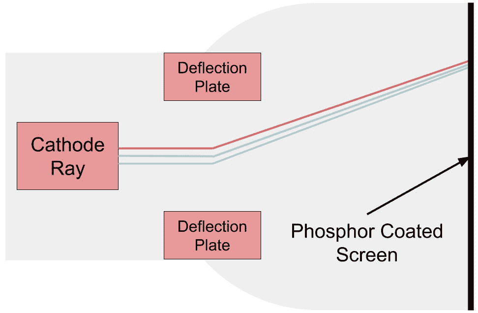

图 11.1 - 简化的阴极射线管图

**阴极射线管**（**CRT**）显示器包含数百万个微小的红色、绿色和蓝色磷光点。这些点在电子束穿过屏幕以创建图像时短暂发光。**阴极**是真空密封玻璃管内的加热丝。**射线**是由电子枪产生的电子流，电子枪由磁偏转板控制。通过调整板的磁场，电子束可以移动并调整以击中屏幕的每个部分。

屏幕涂有磷光材料，这是一种有机材料，当被电子撞击时会短暂发光。它包含许多红色、绿色和蓝色的点组。通过改变每个点上的电子束强度，可以产生不同的颜色。例如，当红色、绿色和蓝色以最大强度发射时，产生白色。

由于一种颜色是由一组红色、绿色和蓝色的点产生的，因此这些点组的最大数量限制了水平或垂直方向上可以显示的颜色数量。相同颜色两点之间的对角距离称为点距。


图 11.2 屏幕上像素的近距离视图

# 像素是什么？

像素，或称*图像元素*，是计算机图像或显示器上可编程颜色的基本单位。最好将像素视为一个逻辑单位，而不是物理单位。这是因为像素的大小取决于当前显示屏幕的分辨率。在屏幕的最大分辨率下，一个像素正好映射到一个点组。这意味着最大分辨率下像素的大小等于点距。较小的分辨率将使用多个点组来创建一个颜色。

屏幕的分辨率是水平像素数乘以垂直像素数，通常写作**宽度 x 高度**。例如，640 x 480 的分辨率意味着屏幕宽度为 640 像素，高度为 480 像素，总共 307,200 像素。当然，每个像素的颜色数据必须存储在计算机内存中，因此更高的分辨率使用更多的像素和更多的内存。例如，如果每个像素使用一个字节的内存，我们的 640 x 480 显示器就需要 300 千字节的内存。1280 x 1024 的显示器需要 1.25 兆字节。让我们看一下下面的屏幕截图：


图 11.3 - 800 x 600 屏幕分辨率的示例

存储像素颜色信息的 RAM 位置称为**帧缓冲区**。帧缓冲区由程序写入，然后传输到显示器。阴极射线管解释像素颜色并以适当的强度发射电子束。偏转板将电子束导向磷光屏上的适当点组。

在上面的例子中，每个像素的大小仅为 1 字节。然而，像素可以是，并且通常也是，超过 1 字节。随着计算机速度的提高和内存价格的降低，我们可以使用每像素更多的位。在 8 位色彩中，红色和绿色各自使用 3 位，总共 8 个色彩级别，而蓝色只使用 2 位，或 4 个级别。这为每个像素提供了 256 种可能的色彩。

16 位色彩，或称为高色彩，提供了一些不同的选项。一种可能性是每个红色、绿色和蓝色使用 4 位。这 4 位为每种颜色提供了 16 个级别，总共 4,096 种颜色（16 x 16 x 16），还有一个可选的 4 位用于透明度。另一种可能性是每种颜色使用 5 位，透明度使用 1 位，总共 32,768 种颜色。最后，通过红色和蓝色各使用 5 位，绿色使用 6 位，总共可以达到 65,536 种颜色。

真实色彩是以每色 8 位来定义的。这意味着红色、绿色和蓝色各自都有 8 位，或者 256 种可能的色彩级别。如果使用 24 位，我们就能得到总共 16,777,216 种可能的色彩。如今，每像素 32 位的使用越来越普遍。最后的 8 位用于透明度。透明度允许与背景色彩进行不同级别的混合。这使得每个像素可以有总共 4,294,967,295 种色彩。

帧缓冲区的大小是通过将分辨率乘以每像素字节数（色彩深度）来计算的。对于一个使用 1280 x 1024 分辨率的游戏，我们需要 1280 x 1024 x 4 字节，即 5 兆字节用于帧缓冲区。考虑到现代计算机通常有 8 到 12GB 的 RAM，这可能看起来并不多。然而，值得记住的是，如果我们正在更新屏幕上的每个像素，我们正在更新 1,310,720 个像素，或者 5,242,880 字节的数据。这是假设我们只填充每种颜色一次，并且不需要与重叠颜色混合。

# 水平和垂直空白

显示器通过读取帧缓冲区中的数据并按顺序更新来刷新。我们可以将这个过程想象成在 C 或 C++中迭代一个二维数组。在每一扫描行的末尾，电子枪会被调整以指向下一扫描行的起始位置。在最后一个像素被点亮之后，还需要进行一次调整，以便光束可以从顶部重新开始。

电子枪从扫描线 X 的最右侧像素移动到扫描线 X + 1 的最左侧像素所需的时间被称为**水平消隐间隔**。这是因为电子枪被消隐，意味着在此间隔内它输出零电子。这是为了防止像素在从扫描线到扫描线的移动过程中被点亮。同样，电子枪从最后一行扫描线的末端移动回第一行扫描线所需的时间被称为**垂直消隐间隔**。再次，电子枪被消隐以防止像素在返回顶部扫描线时被点亮。垂直消隐间隔是一个短暂的间隔，在此期间整个显示已经更新，并且帧缓冲区当前没有被显示器读取：

```cpp
//Example code drawing 640x480 display 
//Including H Blank Interval and V-Blank Interval 
for(int h = 0; h < 480; ++h) 
{ 
  for(int w = 0; w < 640; ++w) 
  { 
    //Sets pixel color and moves to next pixel 
    SetPixel(framebuffer[h][w]); 
  } 
//Resets to start of scan line and moves down one row 
  ResetHorizontal(); 
} 
//Resets to first pixel of first scan line 
ResetVerticle();

```

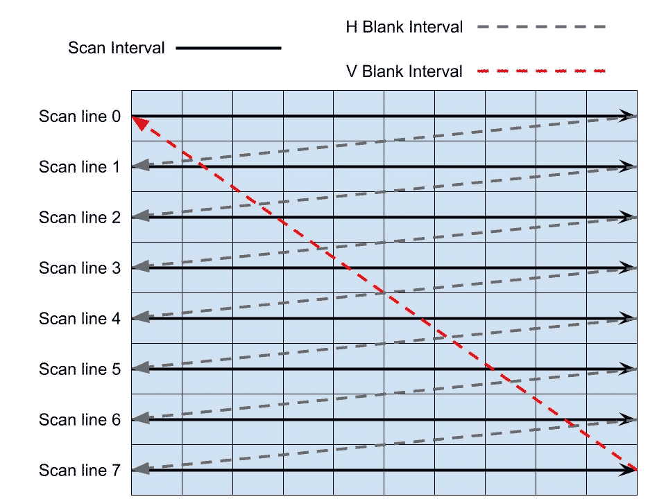

图 11.4-显示电子枪的运动模式，包括水平和垂直消隐间隔

屏幕上的磷光点只会在短时间内被点亮，因此电子枪必须不断重新点亮它们。电子枪每秒从左到右和从上到下移动多次，以刷新每个像素并显示正确的图像。如果这个过程太慢，显示将看起来闪烁。

# 刷新率

监视器每秒刷新显示的次数被称为其垂直刷新率，或者简称为刷新率。监视器的刷新率以赫兹（Hz）为单位进行测量。因此，每秒可以刷新显示 30 次的监视器具有 30 Hz 的刷新率。许多监视器的刷新率为 60 Hz，然而，具有 120 Hz 甚至 240 Hz 刷新率的监视器变得越来越常见。

重要的是要认识到监视器的刷新率与游戏或程序的性能无关。拥有更高刷新率的监视器不会提高游戏的帧率，除非游戏本身可以支持更高的帧率。程序更新帧缓冲区的次数以每秒帧数或 fps 来衡量，并且与监视器刷新的次数完全独立。当这两个数字不同步时，显示将不会正确。让我们看看当每秒帧数少于刷新率时的问题：


图 11.5 比较帧率与刷新率

这些天，电视节目和电影通常以每秒 24 帧的速度播放，而电视和监视器的典型刷新率为 60 Hz。在*图 11.5*中，我们将一秒分成 60 个顶部的红色条来表示我们的刷新率，以及 24 个底部的蓝色条来表示电影的帧。每个红色条代表帧将在屏幕上显示的 1/60 秒。每根垂直深红色线代表监视器刷新的时刻。

如您所见，刷新周期与电影的帧并不正确对齐。在*图 11.5*中，我们可以清楚地看到**帧 1**在屏幕上持续了 3/60 秒（或 1/20 秒），而**帧 2**只在屏幕上持续了 2/60 秒（或 1/30 秒）。**帧 1**在屏幕上的持续时间比原始的 1/24 秒长，而**帧 2**则短。由于帧在屏幕上显示的时间不等，视频看起来会有抖动。虽然这可能看起来差别不大，但有些人足够敏感，能注意到轻微的加速和减速效果：

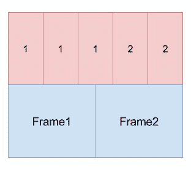

图 11.6 - 刷新率和帧每秒不同步的示例

电视和电影有调整这种问题的方法，比如在帧之间进行插值。由于**帧 1**和**帧 2**已经知道，混合、插值和生成显示前的中间帧很容易。然而，这并不能帮助我们当我们的游戏与显示器不同步时。

由于游戏是交互式的，玩家的动作决定了屏幕上接下来将显示的内容。**帧 2**的细节由玩家对**帧 1**的输入决定。这意味着帧缓冲区的内容必须每帧生成，不能提前知道。

在上述示例中，我们通过假设写入帧缓冲区是瞬时的来简化问题。当然，这并不真实。即使电影的下一帧已经知道，写入帧缓冲区仍然需要时间。除非我们能在垂直空白间隔期间完全复制到帧缓冲区，否则我们将在屏幕上绘制显示时写入帧缓冲区。

如果我们能正确地安排时间，我们总是可以在电子枪读取像素后立即写入像素。然而，如果我们与电子枪不同步，最终会有一个点我们没有为当前帧写入像素，而电子枪读取了旧值。让我们近距离看看这个问题：

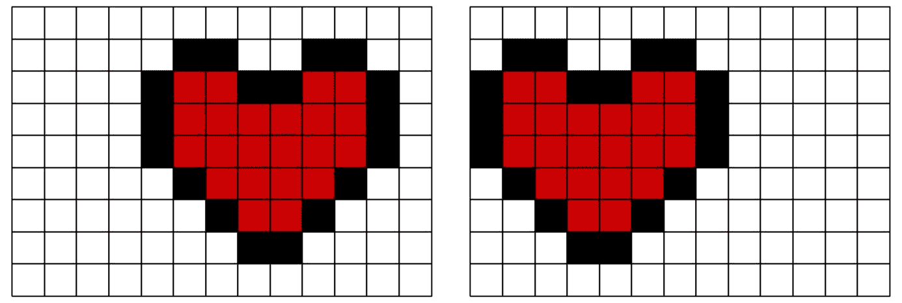

图 11.7 - 帧缓冲区中的起始位置（左）和结束位置（右）

*图 11.7*展示了我们希望在屏幕上看到的内容。左图是帧 1 中游戏对象的位置。右图是对象移动后的结束位置。这是我们想要展示的两个不同时间点。然而，如果显示在读取我们写入帧缓冲区的像素时，如果我们没有完成当前帧的写入，我们就会看到撕裂效果：


图 11.8 - 帧缓冲区中的撕裂示例

如*图 11.8*所示，第一幅图像是正确的。我们在显示读取像素之后写入像素。在第二幅图像中，正在读取的像素几乎赶上了正在写入的像素。在这个时候，帧缓冲区包含每幅图像的一半。第三幅图像显示显示已经超过了写入像素。正确的像素已经写入，但它们写入得太晚了。第四幅图像显示了用户会在屏幕上看到的内容。由于显示读取速度比像素写入速度快，图像看起来像被撕裂成两半。这种效果被称为撕裂。

当我们的每秒帧数和刷新率不同步时，就会发生撕裂。不幸的是，要使这两个值完全对齐可能非常困难，稍微偏离就会导致一些撕裂。为了解决这个问题，我们需要在显示读取之前输出整个帧的像素。

# 双缓冲

解决我们的读写问题的方法是双缓冲。双缓冲正是其名称所暗示的。我们不会只使用一个帧缓冲区，而是使用两个：一个用于读取，一个用于写入。当然，由于我们现在有两个帧缓冲区，我们需要两倍的内存。对于一个 1280 x 1024 的显示器，每像素使用 4 字节，我们需要每个帧缓冲区 5 兆字节，总共 10 兆字节。

到目前为止，所有这些都可以通过使用操作系统命令在软件中实现。然而，随着显示器对内存和更复杂图像的需求增加，专门硬件被创建出来。现代显卡可以包含用于帧缓冲区、纹理、3D 三角形网格等的大量内存。它们还可以包含数百甚至数千个核心，以同时将 3D 点转换为像素数据。

理解这一点很重要，因为作为一个程序员，你不需要自己实现双缓冲。这是在硬件级别实现的，并且我们的游戏将通过使用 DirectX 或 OpenGL 等 3D 图形 API 自动实现双缓冲。

# 后缓冲区

正如我们所说的，双缓冲是通过使用两个帧缓冲区来实现的，这样我们永远不会在用于显示的同一缓冲区上设置像素。当前正在显示的帧缓冲区称为前缓冲区或主缓冲区，而我们正在绘制的帧缓冲区称为后缓冲区或辅助缓冲区。

当后缓冲区上的绘图完成时，缓冲区会进行交换，使得后缓冲区现在成为前缓冲区，而前缓冲区现在成为后缓冲区。当然，缓冲区本身并没有交换。相反，缓冲区的指针进行了交换。显示器有一个指向一个缓冲区的指针，并且目前正在读取它。显卡有一个指向另一个缓冲区的指针，它用于所有的绘图操作。这种指针交换，或者称为页面翻转（有时也这么叫），比从后缓冲区复制数据到前缓冲区要快得多：


图 11.9 - 双缓冲示例

如您在接下来的两张图片中可以看到，显示器可以在图形处理单元或 GPU 绘制到后缓冲区的同时读取前缓冲区。然而，双缓冲并没有阻止撕裂现象。我们已经防止了对正在显示的同一缓冲区进行绘图，但如果我们在屏幕刷新过程中交换缓冲区，我们仍然会有撕裂现象。这是解决撕裂问题的关键第一步。然而，在我们解决这个问题之前，让我们谈谈当我们与显示器刷新率不同步时会发生什么，因为我们每秒生成太多的帧：


图 11.10 - 页面翻转后的双缓冲

想象一下我们的游戏每秒生成 90 帧的情况。这意味着比我们为了每刷新一次生成一帧所需的帧数多出 30 帧。这意味着我们在浪费时间创建永远不会被看到的帧。在每秒 90 帧的情况下，三分之一的帧永远不会被玩家看到。正如您在*图 11.11*中可以看到的，每第三帧，用绿色突出显示，将被跳过，因为它位于两个刷新间隔之间。如果我们以每秒 120 帧或更快的速度更新，将跳过的帧数会更多：

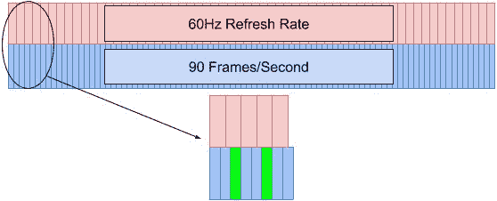

图 11.11 - 比较 60 Hz 刷新率与 90 fps

在每秒 90 帧的情况下，每一帧需要 1/90 秒来完成。从玩家的角度来看，显示的第三帧（实际上是我们第四帧）已经更新了总共 1/45 秒，或者说是一倍的时间。就像 24 fps 的电影一样，这可能会引起一些玩家注意到的颤动效果，因为所有物体看起来都移动了两次那么远。

当每秒更新这么多次时，这些时间片非常小。它们可能小到玩家可能注意不到。跳帧的真正问题是我们的游戏正在做它根本不需要做的工作。由于帧永远不会被玩家看到，因此没有必要浪费时间生成它。

值得指出的是，只有更新图形的部分是浪费的。更新输入、AI 或物理速度超过显示器刷新速度是完全正常的。事实上，如果时间步长更小，物理会更准确。我们只是想强调，绝对没有理由比显示器的刷新率更快地绘制帧。

对于大多数游戏来说，这从来不是问题。提高帧率的通常解决方案是做更多的工作，使你的游戏更有趣。如果你的游戏运行速度超过 60 fps，你的游戏可能不是最好的。再次强调，没有必要每秒绘制比屏幕上能显示的更多的帧。

# VSync

因此，我们现在已经看到了两种情况，其中我们的帧计数与刷新率不同步。在这两种情况下，我们都可能遇到撕裂，在帧率非常高的情况下，我们浪费了 CPU/GPU 周期，这些周期本可以用来改进我们的游戏。我们想要避免撕裂。我们想要与显示器的刷新同步。我们如何解决这个问题？

解决方案是垂直空白间隔。记住，垂直空白间隔是电子枪从显示器的最后一个像素重新定位到第一个像素的时候。在这段短暂的时间内，整个显示已经绘制完成，并且前缓冲区没有被使用。这个时间段太短，无法复制后缓冲区的内容到前缓冲区。然而，它足够长，可以交换指针，这就是页面翻转机制的工作原理。

现代计算机显示器和电视可以在垂直空白间隔或 V-Blank 发生时向计算机发送信号。显卡在完全绘制后缓冲区后，会等待 V-Blank 信号再交换缓冲区。这保证了永远不会出现撕裂，因为不同帧的部分永远不会在单个刷新中被读取。

正如我们所说，双缓冲是在硬件级别实现的。与垂直空白间隔同步也是如此。通过使用 DirectX 或 OpenGL 等 3D 图形 API，你可以免费获得这个功能。这种 V-Blank 同步或 VSync 是在初始化图形时必须启用的一个选项。一旦 VSync 开启，我们就不必担心撕裂现象。此外，游戏永远不会在每帧刷新时生成超过一个帧，因为显卡总是在交换缓冲区之前等待 V-Blank 信号。

与显示器刷新率同步是防止撕裂的好方法。如果一个游戏每秒可以更新 60 次或更多，后缓冲区和前缓冲区将始终能够交换，我们将有一个平滑、无撕裂的游戏。然而，我们还没有讨论如果后缓冲区没有准备好交换，因为帧完成所需时间超过 1/60 秒会发生什么。

重要的是要理解，每次 V-Blank 信号到来时，前后缓冲区并不会自动交换。相反，交换是在程序员的请求下进行的。通过函数调用通知显卡已准备了一个新帧，并且应该交换缓冲区。如果关闭了 VSync，这种交换将立即发生。然而，如果启用了 VSync，显卡将等待 V-Blank 信号到来，无论这个时间有多长。如果我们的更新只是慢了 1/100，意味着一个帧需要 1/59 秒来完成，我们将错过 V-Blank 并需要等待下一个。

由于当前帧尚未准备好，显示器再次显示上一帧。相同的帧将在屏幕上显示 1/30 秒。由于后缓冲区必须等待到下一个 V-Blank 才能交换，我们的游戏无法开始处理下一帧。我们的游戏在等待 V-Blank 时处于空闲状态。这意味着如果我们的游戏使用 VSync 并且无法达到每秒 60 帧，我们的帧率将下降到每秒 30 帧。如果我们的游戏无法达到每秒 30 帧，我们的帧率将降低到 3/60 秒，或 20 fps。

对于一些程序员和一些游戏来说，达到每秒 30 帧是完全可行的。为了实现更美丽的效果或更精确的物理效果，降低到每秒 30 帧可能是一个重要的权衡。每个人必须决定他们自己的游戏什么才是正确的。然而，许多玩家根本不喜欢每秒 30 帧。玩家经常说他们可以注意到更多的抖动运动，更重要的是，他们注意到输入延迟。

记住，如果我们无法达到 60 fps 的目标，显卡必须在返回交换调用之前等待下一个 V-Blank。这意味着我们的游戏无法处理物理、AI 甚至输入。玩家在屏幕上看到的帧数减半，这意味着物体在每一帧中移动得更多。此外，输入现在每 1/30 秒而不是每 1/60 秒从玩家那里收集一次。虽然这看起来可能不多，但对于像*第一人称射击*这样的快速反应游戏来说，这可能太长了。

*图 11.12* 展示了在 VSync 场景下前后缓冲区内容的一个示例，其中游戏无法以与显示器相同的速率更新。显示每 1/60 秒或每 0.0167 秒刷新一次。游戏可以每 1/50 秒或每 0.02 秒更新一次。在下面的图像中，显示器的刷新被涂成红色或绿色。红色刷新表示游戏帧尚未准备好，因此显示的是上一帧。绿色刷新表示游戏帧已准备好，因此缓冲区被交换。

蓝色代表游戏帧完成的时间。这并不意味着新帧会立即显示。这是因为显卡会等待到下一次刷新来交换缓冲区。重要的是要理解，游戏不会每 1/50 秒更新一次，原因相同。相反，每个游戏更新都是在最后一次缓冲区交换后的 1/50 秒：

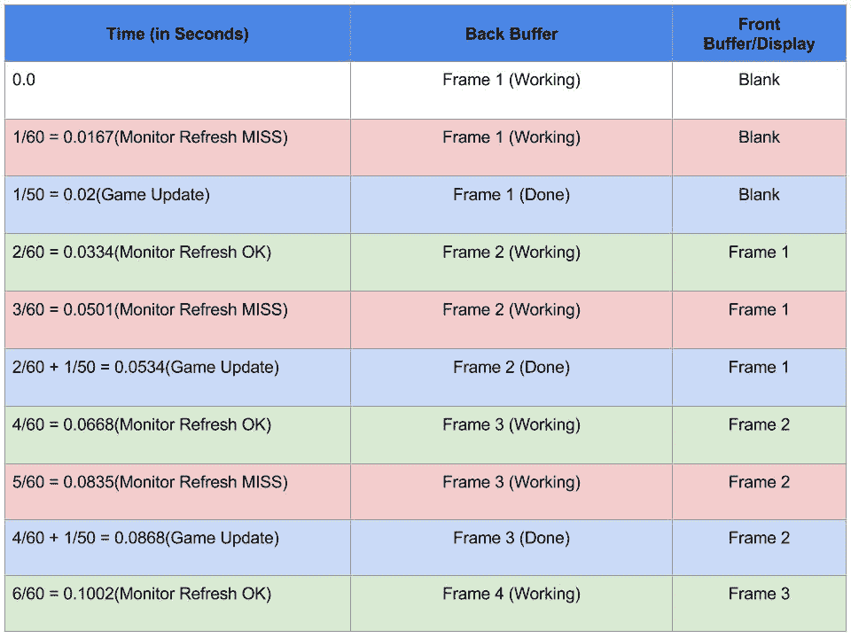

图 11.12 - 使用 VSync 时显示后缓冲区和前缓冲区的内容

# 三缓冲

在我们的游戏中开启 VSync 可以提高图形的外观，因为我们保证撕裂永远不会发生。不幸的是，如果我们的游戏帧没有及时完成下一次刷新，显卡会等待到下一个 V-Blank 来交换缓冲区。即使我们的游戏只错过了 1/100 秒的刷新，这也是正确的。如果我们的帧偏移了这么短的时间，我们的 fps 会降到 30。这是因为后缓冲区的内容还没有被交换，所以我们不能开始绘制下一帧。

如果我们能够在等待 V-Blank 信号的同时开始绘制下一帧，那将很理想。为了做到这一点，我们需要一个额外的帧缓冲区来在等待时绘制。这正是三缓冲的工作方式。

对于三缓冲，我们总共有三个帧缓冲区。对于一个 1280 x 1024 的显示，每个像素 4 字节，我们需要总共 15 兆字节。然而，通过使用额外的内存，我们总是有一个缓冲区可以绘制，所以我们应该总是能够达到我们的 fps 目标。

在三缓冲中，我们仍然有主缓冲区和辅助缓冲区，但现在我们还有一个三级缓冲区。我们首先开始绘制到后缓冲区。如果我们能在刷新之前完成当前帧，我们就可以立即开始绘制到三级缓冲区。如果我们没有及时完成，需要等待下一次刷新，就像在双缓冲场景中一样。然而，我们只需要错过一次刷新。一旦后缓冲区被填满，我们就可以立即开始处理三级缓冲区。无论如何，一旦后缓冲区被填满，我们就会永远领先一帧。主缓冲区将用于显示，辅助缓冲区将准备好并等待交换，而显卡将使用三级缓冲区进行绘制：


图 11.13 - 在 V-Blank 之前绘制到三级缓冲区

当发生 V-Blank 时，如果所有缓冲区都准备好了，它们可以交换。辅助缓冲区成为主缓冲区用于显示。三级缓冲区成为辅助缓冲区并等待显示。最后，主缓冲区成为新的三级缓冲区，用于绘制：


图 11.14 - 场景 1 - 在 V-Blank 之后交换所有缓冲区

如果在 V-Blank 时三级缓冲区没有准备好，它会继续绘制直到帧完成，并且可以与原始主缓冲区交换而不需要等待 V-Blank：

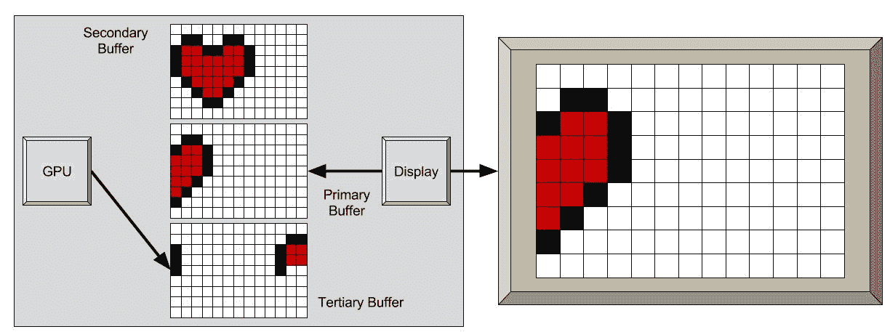

图 11.15 - 场景 2A - 在 V-Blank 之后交换主缓冲区和次级缓冲区

通过使用三缓冲，我们解决了游戏中有几个慢帧时突然从 60 帧每秒降到 30 帧每秒的问题。这也允许我们在情况略低于 60 帧每秒时避免降到 30 帧每秒，并且（几乎）持续达到 60 帧每秒，因为我们不需要等到 V-Blank 才能开始下一帧：

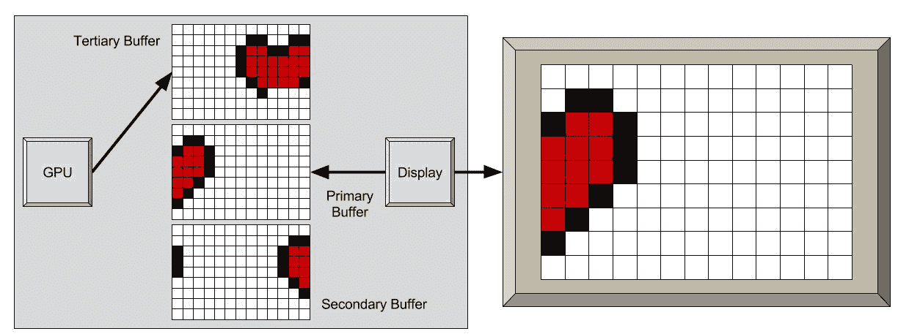

图 11.16 - 场景 2B - 绘制完成后交换次级缓冲区和三级缓冲区

然而，如*图 11.17*所示，三缓冲仍然有可能错过刷新。使用之前相同的案例，我们的游戏以每秒 1/50 秒的速度更新，而显示器以每秒 1/60 秒的速度刷新，我们仍然会错过每六个刷新中的一个。当帧率越低时，我们错过的刷新次数越多，这并不令人惊讶。如果我们每个帧需要 1/30 秒或更长时间才能完成，我们无法期望达到 60 帧每秒：

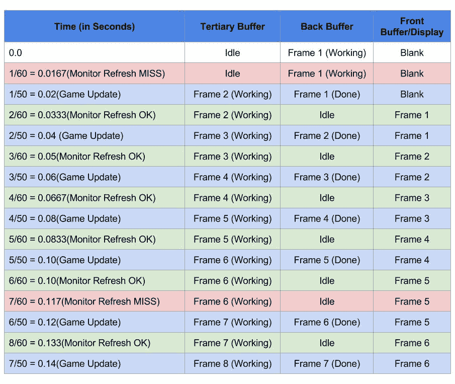

图 11.17 - 使用三缓冲错过刷新的示例

尽管三缓冲可以让我们在保持 60 帧每秒的同时避免撕裂，但在决定使用它之前，你必须考虑一个重要的因素。屏幕上刚刚出现的内容和当前正在处理的帧之间存在两帧的延迟。三缓冲允许我们在次级缓冲区等待显示下一帧的同时，在三级缓冲区处理另一个帧，而此时主缓冲区正在显示。这使得我们领先一帧，从而可以避免帧率下降，但降低了玩家的响应时间。

如果按下跳跃按钮，玩家角色不会立即跳跃，直到当前帧和下一帧都已被显示。这是因为正在处理的帧，包括游戏对象对输入的响应，正被放入三级缓冲区。如果主缓冲区和次级缓冲区在屏幕上各显示 1/60 秒，那么玩家输入将会有 1/30 秒的有效延迟。游戏看起来就像是以 60 帧每秒的速度运行（因为它确实是），物理行为就像游戏是以 60 帧每秒的速度运行（因为它确实是），但由于输入延迟，游戏感觉就像是以 30 帧每秒的速度运行。

由你决定什么最适合你的游戏。许多玩家可能甚至不会注意到输入延迟，因为时间间隔非常小。然而，对于像第一人称射击游戏或需要精确控制跳跃或转向的游戏来说，这可能是不可以接受的。

# 液晶显示器

我们花了很多时间讨论阴极射线管（CRT）显示器的工作原理。这是很重要的，这样我们才能理解垂直空白间隔以及它与双缓冲的关系。然而，由于液晶（LCD）和 LED 显示器更为常见，这似乎有点过时。我们不会讨论这两种类型显示器的工作原理，因为这对我们帧率没有影响。重要的是，这些显示器会模拟 V-Blank 信号。即使它们不需要刷新并且没有电子枪，它们仍然会向显卡发送一个模拟信号。这样，你的程序仍然可以与显示器的**刷新**率锁定。

# 基于时间的移动和动画

到目前为止，我们已经在本章中涵盖了大量的内容。我们一直在研究帧率和刷新率，以便理解它们与屏幕上显示的内容之间的关系。然而，游戏的帧率可能会影响游戏的每个引擎。它甚至可能影响开发过程中的测试和调试。

在游戏开发的初期，游戏逻辑并不复杂，单位数量也很低。因此，每秒数千帧是很常见的。随着开发的继续，这个帧率会逐渐下降到数百，然后（希望）稳定在每秒 60 帧左右。想象一下，如果有一些游戏逻辑每 10 帧生成一个敌人。根据我们处于开发周期的哪个阶段，我们可能每秒生成六个或六十个敌人。这使得游戏很难测试和调试，因为它并不一致。

使这个问题更加有趣的是，即使在单个游戏会话中，也没有任何东西是可以保证一致的。在游戏开始时，没有敌人，所以帧率可能高达每秒 600 帧。这意味着我们每秒生成 60 个敌人。五秒后，屏幕上有 300 个敌人，这使得物理和图形都非常缓慢。突然，我们的帧率可能会下降到每秒 30 帧，减慢敌人创建的速度。随着玩家消灭更多敌人，帧率会上升，导致敌人生成更快，然后帧率再次下降。

这个问题不仅限于影响游戏逻辑。它是一个影响任何在帧之间发生变化的问题。特别是，它将影响游戏对象的动画。在这里，动画指的是游戏对象内部发生变化的任何东西。这包括随时间改变游戏对象的纹理，这是我们通常认为的动画方式。然而，它还包括随时间移动、缩放、旋转，或改变对象的颜色和透明度。为了更好地理解这个问题，让我们看看每帧移动一个单位如何对游戏开发产生不利影响。

# 基于帧的移动

当我们想要移动一个游戏对象时，最简单的方法是以恒定的速率更新位置。这对于某些游戏来说可能效果很好。然而，对于模拟汽车、宇宙飞船，甚至是重力，这看起来不会正确。现在，我们将使用这种方法作为一个例子，然后稍后看看基于物理的运动。由于我们只是在更新对象的位置，将玩家向右移动的代码将看起来像这样：

```cpp
//Move the player to the right 
//This is just an example 
//A game should not be hard-coded like this 
pos.x += 5;

```

值得注意的是，数值 5 不是以英寸或米来衡量的；它是游戏单位。游戏单位是完全任意的，并且取决于游戏中的物体大小。3D 建模程序将允许你为你的模型设置比例单位。如果每个模型都使用相同的单位，并且模型在游戏世界中没有缩放，那么就可以用这些单位来考虑游戏世界。然而，更常见的是将所有东西都视为任意的游戏单位。物体在屏幕上的移动量取决于物体的大小以及它距离相机的远近。如果一切看起来和感觉都与其他事物正确相关，那么就是可以的。

在前面的例子中，假设大小和相机距离是固定的，玩家在屏幕上移动的距离将完全取决于我们的帧率。例如，如果我们每秒得到 1,000 帧，就像我们在开发初期可能做到的那样，我们的玩家将在`x`方向上移动 5,000 个游戏单位。在开发后期，当我们每秒得到 100 帧时，我们的玩家在`x`方向上只会移动 500 个单位。为了获得相同数量的移动，我们需要改变玩家的速度：

```cpp
//Move the player to the right 
//This is just an example 
//A game should not be hard-coded like this 
pos.x += 50;

```

当我们接近完成游戏时，我们可能只能得到每秒 60 帧。这意味着玩家的速度需要再次改变。为了获得相同数量的移动，玩家的速度需要是 83.333 fps。不幸的是，即使在游戏发布后，我们仍然有同样的问题。随着显卡和 CPU 的变快，我们游戏的帧率将增加，这意味着玩家会移动得太快。游戏体验完全依赖于计算机硬件。

通过启用 VSync 可以解决这个问题。正如我们之前看到的，使用 VSync 将有效地将我们的帧率锁定到监视器的刷新率。这将保证我们的帧率有一个最大值。然而，当玩家升级到 120 Hz 的显示器，玩家移动速度加倍时，玩家会非常困惑。此外，如果游戏在几帧内运行缓慢，VSync 会导致我们的帧率下降到 30 fps。突然之间，玩家的移动速度减半。即使使用 VSync，我们的游戏体验也完全依赖于硬件。

显然，使用基于帧的移动并不是一个好的选择。随着帧率的上升和下降，我们必须改变玩家的移动速度。正如我们之前所说的，这个问题在所有动画中都会出现。旋转物体的旋转速度、缩放、粒子的淡入淡出速度以及显示纹理前需要显示的帧数都必须在开发过程中不断修改，而且在不同硬件上仍然不会保持一致。

# 基于时间的移动

与基于帧的移动相比，基于时间来设定我们的移动方式要好得多。时间在整个开发过程中以及在所有硬件上都是一致的，无论是现在还是未来。无论我们的游戏是每秒更新 3 帧还是 3,000 帧，一秒始终等于一秒。

使用基于时间的移动非常棒，因为它允许我们使用存在了数百年的方程。我们不需要重新发明轮子来模拟速度和加速度。正如我们之前所说的，对于某些游戏来说，使用恒定速度移动玩家是可以的，但这并不是真实物理的工作方式。汽车和宇宙飞船不会瞬间加速。重力会使你下落得越来越快。

当你把球扔给一个十岁的孩子时，他们不需要进行复杂的计算就能接住球；他们可以轻松做到。同样，在半真实模拟中，玩家会期望物理表现得*正常*。为了在我们的游戏中模拟真实或半真实的物理，我们应该了解如何将速度和物理融入我们的移动中。

我们可以通过从物体的最终位置减去初始位置，然后除以位移所需的时间来计算物体的速度。另一种说法是，速度等于位置变化除以时间变化。我们可以利用这一点来创建一个方程，并将其放入我们的代码中：

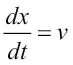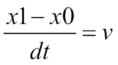

我们也可以通过从最终速度减去初始速度并除以时间变化来计算物体的加速度。加速度是速度变化除以时间变化：

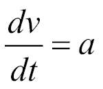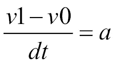

我们还知道，根据牛顿第二运动定律，力等于质量乘以加速度。这也意味着加速度等于力除以质量：


这意味着，如果我们知道物体的当前位置、速度以及作用在物体上的力，我们就可以找到物体在未来的某个时刻的位置和速度。在我们的游戏中，我们可以使用这三个方程来模拟运动：


这三个方程中的前两个被称为欧拉积分（发音为 Oiler）。具体来说，它被称为显式欧拉。在代码中，它看起来可能像这样：

```cpp
float EulerIntegration(float pos, float vel, float accel, 
   float totalTime, float dt) 
{ 
  float time = 0.0f; 
  while (time < totalTime) 
  { 
    pos += vel * dt; 
    vel += accel * dt; 
    time += dt; 
    } 
  return pos; 
}

```

这段代码的内部循环是我们在游戏中如何使用它的一个很好的例子。每一帧，我们将根据`dt`和加速度更新我们的位置和速度。在这一帧计算出的速度将用于更新下一帧中物体的位置。在循环外部，这些方程是完美的。如果我们以每小时 55 英里的速度在高速公路上行驶，一小时后我们预计会多出 55 英里。同样，如果我们以每秒 8 英里的加速度加速，那么 10 秒后我们预计速度将达到 80 英里。

然而，在循环内部我们会有一些误差。欧拉积分只有在加速度和速度保持恒定时才是准确的。在先前的代码示例中，每次循环中速度都在变化，因此它的不准确性与步长的平方成正比。这意味着步长越大，误差就越大。

让我们比较欧拉积分与运动学方程之一，看看这个误差如何影响我们的结果。我们将测试的运动学方程是：


其中`p`是我们新的位置，`p⁰`是我们初始位置，`v⁰`是我们初始速度，`a`是我们加速度，`t`是我们时间。

让我们假设我们的起始位置是 0，我们的起始速度也是 0。通常，在物理方程中，加速度的单位是每秒每秒，而不是每小时每秒。所以，让我们说我们在 10 秒内以每秒 20 英尺的加速度加速。10 秒后，我们的车将行驶 500 英尺：


因此，运动学方程说我们在 10 秒后将从起点起 1000 英尺远。使用相同的数据，我们可以将其放入我们的欧拉积分函数中。我们将每秒积分 10 秒：

```cpp
  Time = 0  pos =    0.00 vel =   0.00 
  Time = 1  pos =    0.00 vel =  20.00 
  Time = 2  pos =   20.00 vel =  40.00 
  Time = 3  pos =   60.00 vel =  60.00 
  Time = 4  pos =  120.00 vel =  80.00 
  Time = 5  pos =  200.00 vel = 100.00 
  Time = 6  pos =  300.00 vel = 120.00 
  Time = 7  pos =  420.00 vel = 140.00 
  Time = 8  pos =  560.00 vel = 160.00 
  Time = 9  pos =  720.00 vel = 180.00 
  Time = 10 pos =  900.00 vel = 200.00

```

欧拉积分说我们将从起点起 900 英尺远。运动学方程和欧拉积分相差 100 英尺。这是在仅 10 秒后。我们积分的时间越长，误差就越大。当然，我们之前已经解释了为什么会有这个问题。误差与时间步长成正比。如果我们使用更小的时间步长，我们将有更小的误差。幸运的是，我们的游戏将每秒更新多个帧。让我们再次进行积分，但让我们使用一些更现实的时间步长。让我们选择 30 fps、60 fps 和 120 fps 的值。这给我们提供了 0.0333、0.0167 和 0.008 的时间步长：

```cpp
  dt = 1.000000   pos = 900.00 
  dt = 0.033333   pos = 996.67 
  dt = 0.016667   pos = 998.33 
dt = 0.008333   pos = 1000.83

```

如您所见，通过使用更小的时间步长，我们更接近匹配的结果。在 120 fps 时，我们相当准确，但在 60 fps 时，我们计算出的误差只有几英尺。不幸的是，即使加速度保持恒定，运动学方程也不准确。

对于许多游戏来说，欧拉积分可能就足够了。误差足够小，以至于玩家可能不会注意到。当然，这取决于游戏玩法和帧率。创建一个极其精确的物理积分器超出了本书的范围。

如果你的游戏需要非常精确的物理效果，请查看以下链接中的 Verlet 积分或 RK4 积分：

[`zh.wikipedia.org/wiki/Verlet 积分`](https://zh.wikipedia.org/wiki/Verlet 积分),

[`zh.wikipedia.org/wiki/Runge-Kutta 方法`](https://zh.wikipedia.org/wiki/Runge-Kutta 方法)

无论你选择哪种积分方法，它都将比使用基于帧的运动更好、更可靠。重要的是要记住，游戏中任何发生变化的部分都必须使用时间。这包括旋转，如果你愿意，可以使用类似的旋转速度和旋转加速度。它还包括随时间缩放、随时间动画纹理，甚至改变颜色和透明度。这将使我们的游戏具有非常一致的外观和感觉，同时使测试和调试在整个开发过程中变得更加容易。

# 摘要

我们在本章中确实涵盖了大量的内容。现在，你对计算机显示器的工作原理的了解可能比你原本想要的要多。在本章中，我们深入探讨了帧缓冲区以及屏幕上像素着色的细节。我们了解到，如果帧率与显示器不同步，可能会导致撕裂。我们还探讨了双缓冲和 VSync 的使用如何解决这个问题。不幸的是，我们也看到了 VSync 可能会引起它自己的问题。我们还探讨了三缓冲，并分析了其优缺点。最终，没有完美的答案。总会有一些权衡。你必须接受撕裂，或者由于 VSync 而导致的帧率急剧下降的可能性。

最后，我们通过查看帧率如何影响我们游戏的其他代码部分来结束本章。具体来说，我们研究了物理和动画，并了解到我们必须使用基于时间的物理和动画来使我们的游戏具有更一致的外观和感觉。

在下一章中，我们将从底层细节中解脱出来，看看编程的大图景。这包括我们的编码哲学以及我们为什么关心高质量代码。我们将探讨一些可以帮助使游戏开发不那么头痛的技巧和窍门，以及介绍 Mach5 引擎中的一些特定内容，虽然它们不是模式，但仍然可以使你的编码生活变得更加容易。
