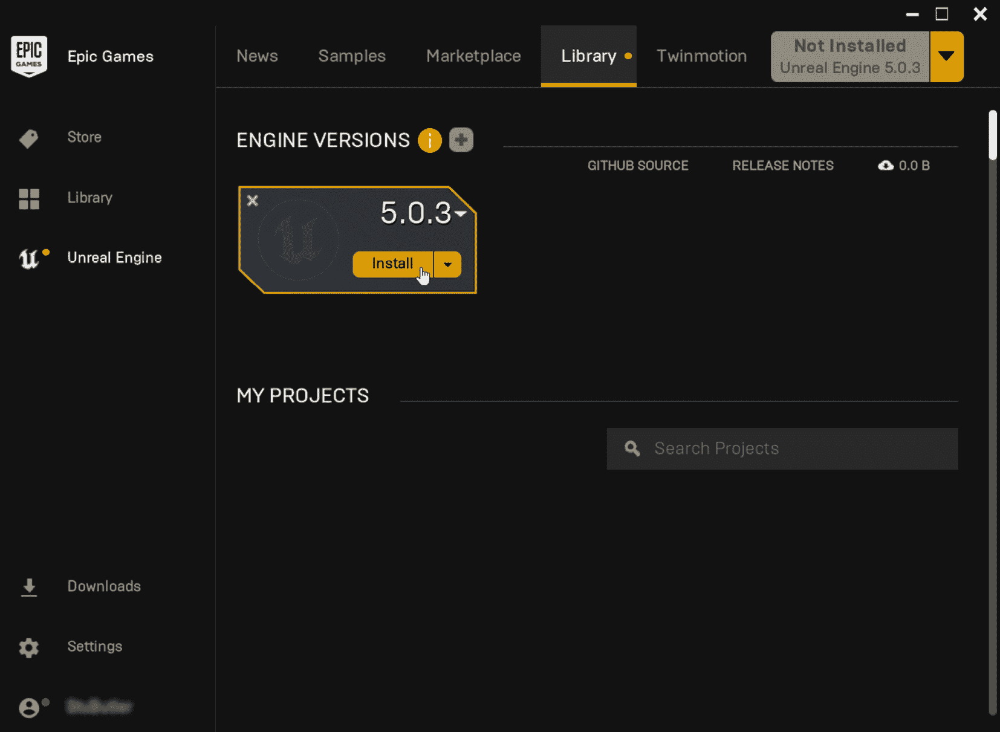
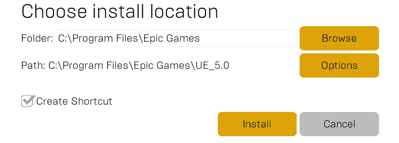
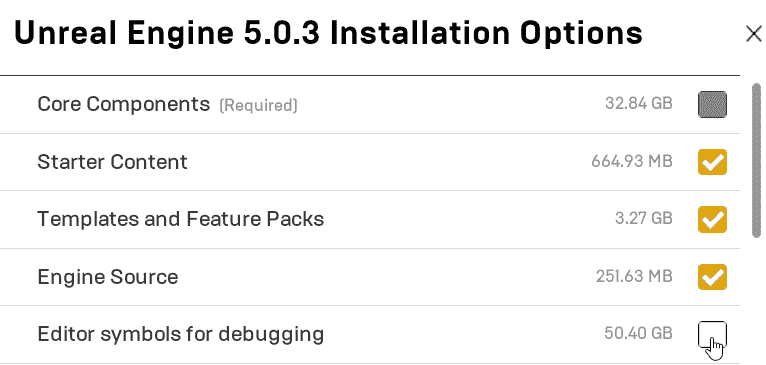
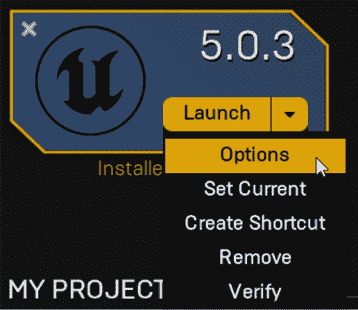
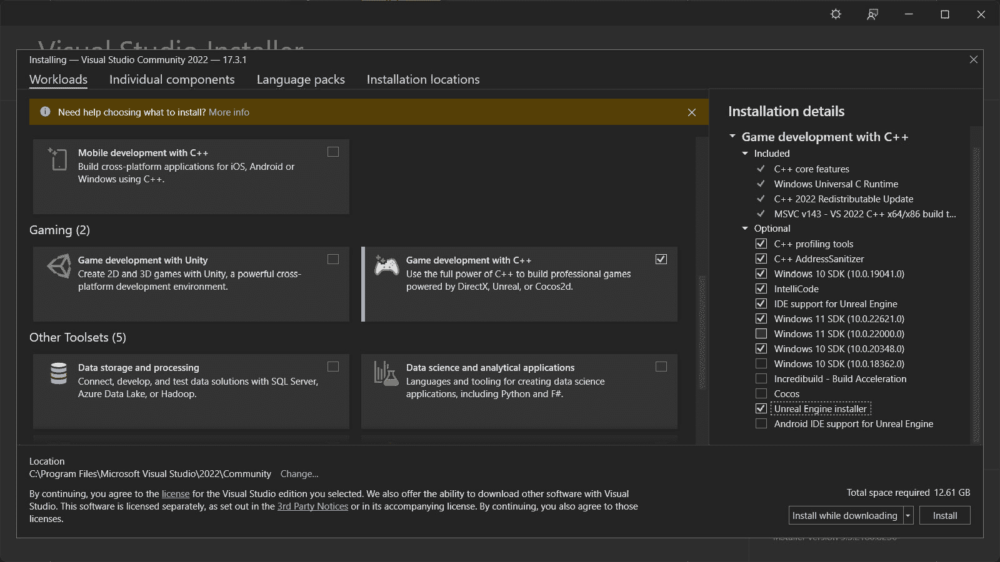
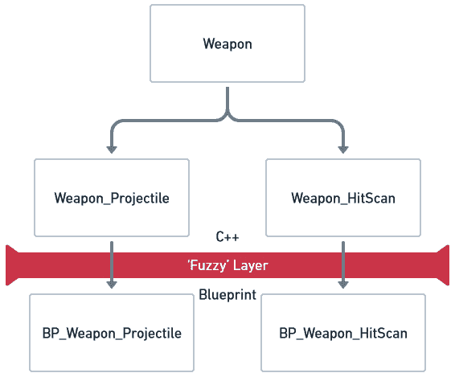
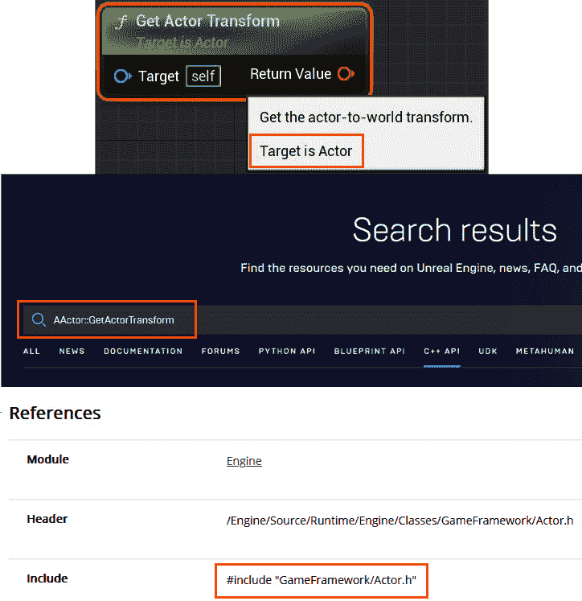
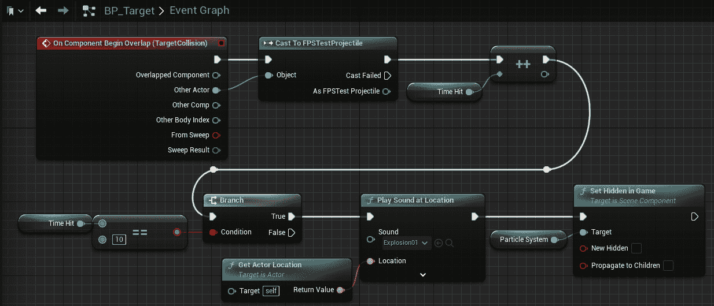

# 理解 Unreal Engine 5 及其层

设计模式是一系列工具和实践，通过这些工具和实践我们可以学会编写更快、更易于协作的代码。

将设计模式应用于在**Unreal Engine 5**（**UE5**）中开发的项目，将使你的项目性能更优，更易于阅读和构建，同时也能加深你对引擎工作原理的理解。

我们将从了解 Unreal Engine 的历史开始，确保我们为使用该引擎做好准备，涵盖一些关于 C++和 Unreal Engine 的视觉脚本语言**Blueprint**如何关联的基本概念。

在本章中，我们将涵盖以下主要主题：

+   介绍 Unreal Engine 5

+   安装 Unreal Engine 5 并准备你的开发环境

+   “模糊”层——连接 C++与 Blueprint 的桥梁

+   从蓝图翻译回 C++

# 技术要求

在开始这段探索之旅之前，要知道本书将假设你对 C++语法和 Unreal Engine 编辑器有一定的了解。熟悉指针以及如何在所选的**集成开发环境**（**IDE**）中跟踪代码，对于理解 Unreal 核心 API 至关重要。

你将需要以下软件：

+   Unreal Engine 5（本书是根据 5.0.3 版本编写的）。

+   **Visual Studio**是一个不错的免费 IDE（对引擎的基本支持是存在的，这意味着项目可能会显示错误，*IntelliSense*可能无法自动完成一些关键字，但项目可以编译和运行）。

+   如果你能够访问，JetBrains Rider 2022 版或更高版本内置了对 Unreal Engine 的支持，这将使开发过程变得更加容易。Rider 是 Visual Studio 的替代 IDE，通常被使用 Unreal 的程序员所青睐。它提供了对在 Unreal Engine 中使用 C++的改进支持，包括自动完成。你可以通过访问[`www.jetbrains.com/lp/rider-unreal/`](https://www.jetbrains.com/lp/rider-unreal/)了解更多信息。

# 介绍 Unreal Engine 5

Unreal Engine 5，简称 Unreal，是由*Epic Games*开发的游戏引擎。与任何其他游戏引擎一样，Unreal 的核心功能仅仅是处理文件和指令中的数据，将其转换为屏幕上可见的数据。提供的工具套件旨在协助你完成创造性和可预测的任务。这些工具是由精英程序员和设计师为你量身定制的，就像将你的开发外包给顶级团队一样。

然而，就像一个由新手驾驶的高性能赛车，即使是最好的工具也可能表现不佳。Epic 的专家们并不了解你们会如何使用他们的工具。因此，在设计我们的代码架构时，我们需要牢记这种沟通的断裂。这正是本书的用武之地，它将教授在 Unreal Engine 5 中编写游戏时预期的最佳实践。

Unreal Engine 为覆盖广泛游戏类型的众多游戏作品提供了强大的支持，并在多个平台上发布。

Unreal Engine 3 推动了第七代游戏机中一些最大的热门游戏，从由*Epic Games*自己开发的第三人称射击游戏系列*战争机器*，到来自*NetherRealm*的格斗游戏*不义联盟：我们之中神*和*Mortal Kombat*，以及包括由*Firaxis Games*开发的*XCOM*系列在内的策略游戏。

第八代游戏机见证了 Unreal Engine 4 的阵容扩展，包括*Milestone*的*MotoGP*游戏和*Kunos Simulazioni*的*Assetto Corsa Competizione*，以及通过*PlayerUnknowns’ Battlegrounds*（*PUBG Studios*）引入了广受欢迎的 Battle Royale 游戏类型，该游戏被列为*维基百科*上第五大畅销视频游戏，以及*Epic Games*的*Fortnite*，它在 2021 年 12 月过渡到 Unreal Engine 5，如*第三章*中所述。

Unreal Engine 5 具备一系列新的关键技术，包括*Nanite*，一个子网格级别的细节系统，允许大规模多边形模型在任何距离上以甚至屏幕空间船体大小渲染，以及*Lumen*，一个实时光照解决方案，它通过随着时间的推移逐步混合网格距离场和图集化的局部表面数据，以低成本创建逼真的光照效果。这些新技术推动了从 4.26/4.27 到 5.0 的过渡，作为 Unreal 渲染技术全面重做的部分。该引擎在发布*《黑客帝国：觉醒：Unreal Engine 体验》*时首次亮相，这是一个展示凯瑞-安·莫斯和基努·里维斯逼真形象的演示，以及一个具有令人印象深刻的群众和交通模拟的开放世界城市。

越来越多的游戏工作室选择用 Unreal Engine 5 替换自家的专有游戏引擎；例如，*CD Projekt Red*（*巫师*）和*Crystal Dynamics*（*古墓丽影*）已经宣布决定在其游戏系列的最新版本中使用 Unreal Engine 5。

现在我们已经简要介绍了 Unreal Engine 的过去、血统和对游戏历史的影响，接下来我们将设置好一切，以便你准备好使用 C++的 Unreal Engine 5。

# 安装 Unreal Engine 5 和准备你的开发环境

你可以通过 Epic Games 启动器（从 https://unrealengine.com 获取，它将为你安装引擎）或从 GitHub（www.github.com/EpicGames）下载 Unreal Engine，允许用户编译引擎并修改它以适应他们的项目。

要参与本书中的活动，除非您真的想这样做，否则您不需要从源代码编译引擎。从源代码编译的好处可能会在您使用 Unreal Engine 和 C++的旅程中晚些时候显现。然而，您需要安装引擎的 5.0.3（或更高）版本，并且需要安装一个 IDE。本节涵盖了使用 Unreal 启动器和 Visual Studio 2022 Community 安装从头开始下载、安装和设置引擎的过程。如果您已经安装了引擎和 Visual Studio，您可以跳过本节。

首先，您需要通过点击页面右上角的**下载**按钮，然后点击下一页上的**下载启动器**按钮，从[`unrealengine.com`](https://unrealengine.com)下载启动器。

下载完成后，您需要从`.msi`安装程序中安装启动器。

启动器是 Epic Games Store 的所在地，您的购买和下载的游戏库以及 Unreal Engine（4 及以上版本）。您需要导航到**Unreal Engine**，然后**库**，点击*黄色加号图标*，从结果引擎槽中选择您的引擎版本：



图 1.1 – 默认的 Epic Games 启动器，未安装任何引擎版本

或者，如果您还没有安装任何版本的引擎，您可以在启动器应用程序的右上角点击*黄色下拉按钮*。

这两种方法都会为您提供选择安装引擎位置的选择。如果可能的话，建议在 SSD 上安装引擎，因为引擎从 SSD 加载的速度将显著快于 HDD：



图 1.2 – 安装位置选项

点击**选项**按钮，您将看到一系列可选元素，用于安装引擎：



图 1.3 – Unreal Engine 5.0.3 的安装选项

我们建议安装**入门内容**、**模板和功能包**以及**引擎源**。

**引擎源**将使浏览和调试代码更容易，但不会允许您重新构建引擎；为此功能，您需要从 GitHub 下载源代码，如前所述。

**编辑器符号用于调试**允许在编辑器中调试 C++。这不是必需的，但将有助于从编辑器跳转到引擎代码，并允许您探索蓝图节点背后的代码。

如果您决定以后要添加/删除元素，您可以通过点击引擎槽旁边的**启动**旁边的*向下箭头*来修改这些选择，并选择**选项**：



图 1.4 – 引擎槽中选项菜单的位置

选中 **调试的编辑器符号**旁边的复选框，然后点击 **应用**。

一旦安装了引擎，您就可以继续安装 Visual Studio。

您需要从 [`visualstudio.microsoft.com/downloads/`](https://visualstudio.microsoft.com/downloads/) 下载 Visual Studio 安装程序。

当您运行安装程序时，在 **工作负载**选项卡中选择 **使用 C++ 进行游戏开发**预设，并选择可选组件，如图 *图 1**.5* 所示：



图 1.5 – Visual Studio Community 2022 的建议安装选项

一旦您安装了 Visual Studio，您就应该准备就绪了。如果您想进一步改善在 Unreal Engine 5.0.X 中使用 Visual Studio 的体验，您可以从 *Epic* 在 [`docs.unrealengine.com/5.0/en-US/setting-up-visual-studio-development-environment-for-cplusplus-projects-in-unreal-engine/`](https://docs.unrealengine.com/5.0/en-US/setting-up-visual-studio-development-environment-for-cplusplus-projects-in-unreal-engine/) 提供的一些额外指导中找到。

现在我们已经安装了引擎并设置了我们的集成开发环境，我们可以开始探索 C++ 代码与蓝图之间的联系。

# “模糊”层 – 连接 C++ 和蓝图之间的差距

大多数引擎都基于层的概念。每个层都有特定的任务，并且当按正确的顺序堆叠时，它们简化了引擎的开发和维护。例如，如果出现一种新的图形语言，明智的做法是支持它，那么只需要更改具有图形管道的层。

在引擎中层的数量或分层结构方面没有固定的规则，但您通常会找到一个类似于 *表 1.1* 的分离：

| **工具**充满了加快标准任务的编辑器功能。这个套件通常是引擎所宣传的。 |
| --- |
| **游戏玩法**为便于交互机制而创建的所有自定义系统，这些机制将在构建的游戏中是独特的。 |
| --- |
| **功能**处理所有自动内部系统的地方，如输入捕获和物理处理等。 |
| --- |
| **资源**在这里处理资源内存管理和资产流式传输。 |
| --- |
| **平台**基本上，图形管道定义和构建平台原生集成（如果引擎支持的话）。 |
| --- |
| **基础**充满了核心依赖库，如用于编辑器的 UI 框架和数学库。 |

表 1.1 – 常见引擎层及其用途

尽管虚幻引擎可能不会明确以这种方式标记其层，但我们可以通过虚幻引擎处理 C++和蓝图游戏的方式看到它们在行动中的表现。使用某些指定器在 C++中创建的函数可以在蓝图中被访问，但反之则不然。这表明我们的操作有一个顺序，信号只能单向传递。我们将把这个游戏层之间的内部分离称为**模糊层**。

模糊层存在的事实对我们设计系统的方式施加了限制，但反过来，我们获得了一种分离，使得游戏程序设计师可以与设计师并肩工作，几乎没有摩擦。可以在可访问的蓝图内为简单的创意用途开发系统，而更高效的 C++代码则隐藏在视线之外。为了便于这种构建，虚幻引擎为我们提供了**属性指定器**和**函数指定器**来定义信号如何穿透。

## 属性指定器

属性指定器定义了在蓝图层中查看和访问时 C++定义的变量的特征。虚幻引擎文档提供了一个方便的表格，解释了每个指定器提供的不同安全级别，以及一些为事件、集合和网络复制设计的更具体的指定器。以下是最常用的六个显示属性指定器：

+   `EditAnywhere` – 该值可以在所有类默认值和实例详细面板中更改。此指定器通常在原型设计时使用，因为它在大多数地方显示变量，并提供了更改其值的最多种选项。然而，为了这种灵活性，必须付出安全性的代价，允许任何设计师更改默认值和实例值，因此一旦系统经过测试并证明可以工作，应将访问权限限制到实际需要的范围内。

+   `EditDefaultsOnly` – 该值只能在类默认值中更改。当需要更改变量以进行平衡且所有实例都在运行时生成时，这很有用，因为你无论如何都无法访问实例详细面板。也可以用于确保在必要时，没有生成的实例具有不同的值。

+   `EditInstanceOnly` – 该值只能在实例详细面板中更改。这对于允许设计师在场景中为特定放置的演员使用不同的值很有用，但将默认值限制为经过测试并证明可以工作的值。

+   `VisibleAnywhere` – 该值将在所有类默认值和实例详细面板中可见，但无法从编辑器中更改它。这对于调试初始化过程如何影响值很有用，当不知道代码是否通常错误或仅在边缘情况下错误时。后者将在实例级别显示不正确的值，而前者将在两个级别都显示错误。

+   `VisibleInstanceOnly` – 该值仅在实例详细面板中可见。当您有大量实例生成时，这对于在各个实例中调试表面级值非常有用，而不会因为调试消息而使屏幕杂乱无章。

+   `VisibleDefaultsOnly` – 该值仅在类默认值中可见。对于设计师来说，这有助于参考功能值并创建一个与演员视觉元素相匹配的对等性。这是最高的安全级别，因为每个演员都将在一个地方显示起始值。

目前我们需要注意的两个访问修饰符是：`BlueprintReadOnly` 和 `BlueprintReadWrite`。它们允许基于蓝图的孩子类在其图中访问仅获取器或获取器和设置器。

## 函数修饰符

函数修饰符的工作方式与属性修饰符类似，定义了蓝图层应该如何查看和访问函数，但它们的用法有一些细微差别。您可以在虚幻文档中找到函数修饰符的完整列表（[`docs.unrealengine.com/5.0/en-US/ufunctions-in-unreal-engine/`](https://docs.unrealengine.com/5.0/en-US/ufunctions-in-unreal-engine/))，但我们接下来要详细讨论的是三个我们感兴趣的：

+   `BlueprintCallable` – 如其名所示，如果该函数位于父类中并且具有正确的封装类型（公共或受保护），则蓝图类可以调用此函数。

+   `BlueprintImplementableEvent` – 该函数签名的存根在 C++ 中定义，没有实现。这允许 C++ 系统调用它，而蓝图系统填充其实际体。您可能用它来触发当枪被发射时在枪上产生的激光束等视觉效果。

+   `BlueprintNativeEvent` – 这允许 C++ 定义一个在蓝图中被填充的函数，但在此情况下，也可以有一个*默认*实现，它也将被执行。虚幻通过为您生成两个额外的函数定义来实现这一点：`*_Implementation()` 和 `Execute_*()`。前者用于必须运行的 C++ 方面，后者是在 C++ 中必须调用的函数，以触发两个实现。

重要提示

与分层一样，`BlueprintNativeEvents` 的 C++ 方面将在蓝图方面之前执行。

使用属性和函数修饰符，我们可以创建跨越模糊层的系统，但与路由函数信号一样重要的是设计继承层次结构，以使此过程更加平滑。

## 有用的继承

作为标准实践，最好确保您世界中实例化的任何内容都是蓝图类。这有助于调试，并且当您在编辑器中具有所有用于跟踪执行的视觉工具时，它有助于将类与引用链接。如果类被重命名或移动到目录中，则链接是活动的而不是基于文本的，从而防止崩溃。

要使这种继承策略生效，建议你从抽象游戏玩法的角度思考你的系统。哪些类影响机制？这些类需要有一个 C++表示形式以提高效率，因此可以设计一个层次结构。从那里，我们继承蓝图类从每个分支的末端。这为我们提供了蓝图类来链接、创建实例并添加视觉组件：



图 1.6 – 包含弹道和击中扫描机制类型的武器机制示例层次结构

在*图 1.6*中，C++类将包含所有与弹药、伤害演员、交互处理等相关逻辑。然后，在蓝图类中，将添加用于显示网格、运行后坐力动画和显示枪口闪光等组件。在发射逻辑的某个地方，很可能有一个从`Weapon`父类中调用的函数，其代码如下：

```cpp
UFUNCTION(BlueprintImplementableEvent)
void Fire_Visuals();
```

这可以在蓝图类中实现，以触发视觉效果。使用我们稍后将要介绍的某些模式，即类型对象模式，你可以通过一些简单的资产和变量更改，从这些少数几个类中创建出大量武器。这展示了艺术家、设计师和程序员如何在一个系统上协同工作，而不会相互干扰，同时还能从 C++的效率提升中受益。

理论上，这个过程是完美的，但理论很少能转化为现实世界。通常，大量的开发时间都花在基于论坛帖子、文档和视频来解决问题上。这些资源的存在是很好的；你遇到的几乎所有问题都可能是别人解决过的，但没有保证它们是以相同的实践开发的。你可能会遇到这样的情况，你需要修复的问题在蓝图教程/示例中，而你的系统需要它在 C++中，所以让我们看看转换过程。

# 从蓝图转换回 C++

为自己配备从蓝图转换回 C++的工具是明智之举，这不仅适用于之前提到的日常修复，也适用于大型公司中的三 A 级设置。大型工作室中典型的虚幻引擎机制开发流程可能遵循以下过程：

1.  设计师有一个机制的想法，并被给予时间在蓝图中进行原型设计，作为**概念验证**。

1.  这个机制已经过测试，以确定是否应该进一步开发。

1.  如果得到绿灯，那么将程序员的工作转换为将原型转换为更健壮的 C++系统。

我们已经介绍了设计 C++系统以与 Blueprint 有效工作的工具，但当面对上述情况时，你如何将另一个人的愿景转化为既高效又不失其优点的东西呢？显然的答案是直接翻译。节点对节点。这个过程很简单，因为 Blueprint 中的节点在字面上就是你在引擎源中必须找到的 C++函数。让我们更仔细地看看：

1.  第一步是将鼠标悬停在节点上。每个节点都有一个`Target`类，鼠标悬停会告诉你那是什么。

1.  接下来，我们转到 Unreal Engine 文档([`www.unrealengine.com/en-US/bing-search?`](https://www.unrealengine.com/en-US/bing-search?))并搜索*U<目标类名>::<无空格的节点名>*。

1.  函数的 Unreal 文档页面可能很简洁，但它会给出包含该函数的文件头部的`#include`目录。一旦一个类被包含，就可以通过自动完成点访问器来使用和探索它。

重要提示

如果目标是`Actor`，那么它开头将有一个`A`而不是`U`，如图*图 1.7*所示。这是 UE5 的一个奇怪之处；每次出现这种情况，都会像这样在框中提到。



图 1.7 – 显示从节点到 Unreal C++文档的过程

这个过程可能看起来很繁琐，但经过一段时间搜索不同的事情后，你将开始看到模式，并能够找出函数可能在哪里。每个带有执行引脚（白色箭头）的节点然后成为一行代码，输入引脚形成函数参数，输出引脚通常是返回类型（多个会形成一个结构体）。

小贴士

阅读以下头文件将有助于掌握翻译过程，因为它们是最常用的：`AActor.h`、`UGameplayStatics.h`和`UkismetSystemLibrary.h`。

下一个问题是如何知道在 C++和 Blueprint 之间留下哪条线？从理论上讲，你可以用 C++做所有事情，但正如我们已经展示的，出于团队合作的原因，这不是一个好主意。答案已经暗示过了，但通常，你希望所有视觉的或与游戏机制无关的东西都是 Blueprint-based。这条线具体在哪里取决于解释，不值得过分纠结。

## 工作示例

为了巩固这个理论，让我们通过一个例子来工作。在*图 1.8*中，你可以看到一个示例 Blueprint 系统，该系统设计用于在物体被投射物重叠时增加一个整数值；然后，一旦达到 10 次重叠，它将播放一个声音并显示一个粒子效果：



图 1.8 – 基本函数中的一系列蓝图节点；这个蓝图片段使用重定向节点进行了排列以提高可读性，但通常会更线性地布局

首先，我们需要一个 C++类来继承，鉴于它被命名为`BP_Target`，我们可以将其命名为`Target`。`Target`类需要一些变量；我们可以从事件中得知存在一个名为`TargetCollision`的碰撞组件，其重叠事件绑定到这个函数上。作为一个组件，它需要存储在指针中；否则，我们将引用类而不是实例。我们还需要一个名为`TimesHit`的整数。如前所述，机制是由程序员、设计师和艺术家团队制作的。将正确的粒子系统用于用户反馈是设计师的工作，所以我们现在将其作为蓝图，但我们确实需要一个方法来触发蓝图端，因此需要一个`BlueprintImplementableEvent`。考虑到这一点，我们新类的头文件看起来可能如下所示：

Target.h

```cpp
#pragma once
#include "CoreMinimal.h"
#include "GameFramework/Actor.h"
#include "Target.generated.h"
class USphereComponent;
UCLASS(Abstract)
class EXAMPLE_API ATarget : public AActor
{
    GENERATED_BODY()
    UPROPERTY(EditDefaultsOnly)
    USphereComponent* _TargetCollision;
    int _TimesHit;
public:
    ATarget();
    UFUNCTION()
    void OnTargetCollisionBeginOverlap(AActor* OtherActor,
        int32 OtherBodyIndex, bool bFromSweep, const
        FHitResult& SweepResult);
    UFUNCTION(BlueprintImplementableEvent)
    Void TenHitVisuals();
};
```

重要提示

注意`UCLASS()`调用中包含的`Abstract`标签。这将阻止设计师意外创建未设置任何视觉的 C++类实例。

下一步是填充函数体：

Target.cpp

```cpp
#include "Target.h"
#include "Components/SphereComponent.h"
#include "ExampleProjectile.h"
ATarget::ATarget()
{
    _TargetCollision =CreateDefaultSubobject <USphereComponent>
        (TEXT("TargetCollision"));
    _TargetCollision->SetupAttachment(RootComponent);
    _TargetCollision->
        OnComponentBeginOverlap.AddDynamic( this,
        &ATarget::OnTargetCollisionBeginOverlap);
    _TimesHit = 0;
}
void ATarget::OnTargetCollisionBeginOverlap
    (UPrimitiveComponent* OverlappedComponent, AActor*
        OtherActor, UPrimitiveComponent* OtherComp, int32
        OtherBodyIndex, bool bFromSweep, const FHitResult&
        SweepResult)
{
    ExampleProjectile* otherProj =
        Cast<AExampleProjectile>(OtherActor);
    if (otherProj != nullptr)
    {
        _TimesHit++;
        if (_TimesHit == 10)
        {
            TenHitVisuals();
        }
    }
}
```

构造函数将是标准的，为碰撞组件创建默认的子对象，并将重叠函数绑定到该组件的重叠事件（`OnTargetCollisionBeginOverlap`）。在`overlap`函数中，转换节点变为对临时“缓存”变量的转换，并使用`if`语句检查其值是否为`nullptr`。然后`_TimesHit`可以递增，分支转换为`if`语句，如果通过，将调用`BlueprintImplementableEvent`将信号传递给`Blueprint`子类。

注意

你不需要构建这个示例；它仅用于参考。

在本书的其余部分，将会有更多从蓝图到 C++转换的示例，但如果你想看到一些第一方示例，Epic 创建的模板项目可以在 C++和蓝图版本中加载。

# 摘要

在本章中，我们讨论了什么是虚幻引擎 5 以及如何设置一个有用的开发环境。我们还定义了一些将在后续章节中使用的术语和工具，并分享了一个构建机制的最佳实践策略。

最后，我们展示了从其他实践到我们新最佳实践的转换过程。

这为设计良好结构的系统奠定了基础。到这一点，你应该至少能够为你的游戏规划机制，并实现利用 C++和蓝图的功能。

在下一章中，我们将通过实现本书后面将看到的某些模式来优化一个糟糕的项目。这应该在你深入探讨每个模式之前，让你理解设计模式为什么有用。

让我们通过回答一些问题来结束本章，以测试我们的知识并巩固本章中涵盖的一些实践。

# 问题

1.  以下哪个描述了 `BlueprintNativeEvent` 的实现？

    1.  可以在 Blueprint 中描述的函数。

    1.  在 C++ 中定义的函数，同时具有 C++ 和 Blueprint 实现方式。

    1.  在 C++ 中声明但在 Blueprint 中使用 `Execute` 函数的事件。

1.  Nanite 是如何工作的？

    1.  魔法

    1.  网格距离公式

    1.  子网格 **LOD** 组

1.  以下哪个不是属性指定器？

    1.  `BlueprintWriteOnly`

    1.  `EditInstanceOnly`

    1.  `VisibleAnywhere`

1.  哪个基类在 C++ 中将其每个子项的起始位置添加了 `A`？

    1.  `GameplayStatics`

    1.  `Actor`

    1.  `ActorComponents`

1.  所有 C++ 函数应该标记为以下哪个？

    1.  `BuildOnly`

    1.  `Pure`

    1.  `Abstract`

## 答案

1.  B

1.  C

1.  A

1.  B

1.  C
