# 第二章：“Hello Patterns”

本章将专注于支撑所有良好代码的原则。设计模式是这些原则的扩展，因此，在跑之前先走一步是很重要的。一旦基础知识已经掌握，我们将查看一些不良的蓝图代码，以便我们能够理解修复过程，我们将通过遵循一些逐步指南来完成这项工作。

在本章中，我们将涵盖以下主题：

+   S.O.L.I.D. 原则

+   探索常见问题的解决方案

+   权衡

# 技术要求

对于本章，你需要一个空白 UE5 项目已打开并准备就绪。目前不需要 C++；我们将专注于蓝图代码以保持简单。

该项目的文件可以在 GitHub 的`chapter2`分支上找到，网址为[`github.com/PacktPublishing/Game-Development-Patterns-with-Unreal-Engine-5/tree/main/Chapter02`](https://github.com/PacktPublishing/Game-Development-Patterns-with-Unreal-Engine-5/tree/main/Chapter02)

如果你之前没有创建过空白 UE5 项目，以下步骤将指导你创建一个简单的蓝图项目，这正是我们本章所需要的：

1.  点击**Epic Launcher** | **Unreal Engine** | **Library**标签页右上角的**启动**按钮，这是我们第一章节中安装引擎的位置。

1.  在**Unreal** **项目浏览器**的左侧选择**游戏**。

1.  在主部分中选择**空白**，并关闭**起始内容**。这将防止 Unreal 向项目中添加大量不必要的资产。

1.  选择一个合理的位置（默认位置即可）并将项目名称设置为`HelloPatterns`：

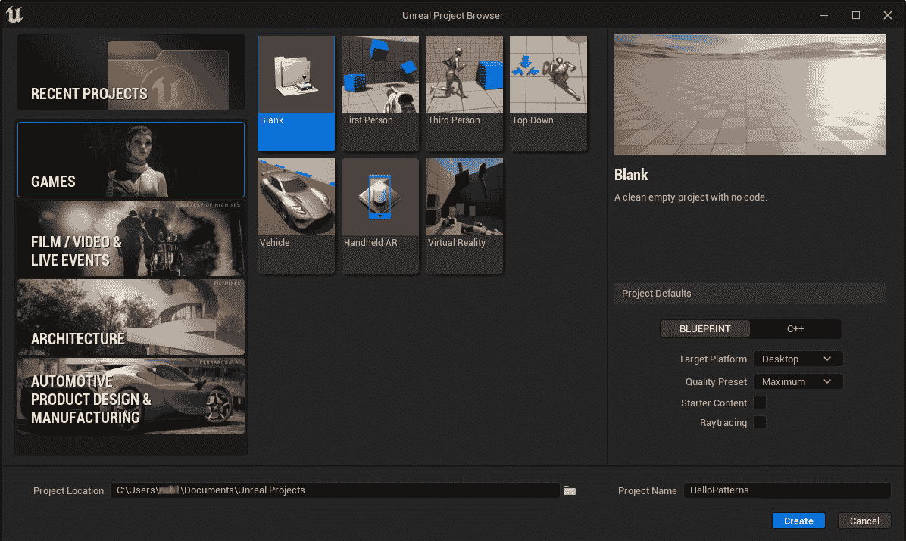

图 2.1 – 设置用于创建的新、空白游戏项目的 Unreal 项目浏览器

1.  点击**创建**。

现在你的项目已经设置好了，你就可以准备本章的交互部分了，但首先，让我们讨论一下当我们说**良好代码**时我们指的是什么。

# S.O.L.I.D. 原则

要理解设计模式为什么有效，我们需要了解支撑良好代码的原则。让我们快速浏览一下大多数人第一次接触代码的经历。

通用**Hello World**程序以及随后的初学者练习都是由线性代码组成的。线性代码通过单个文件按顺序执行每一行，其中整个程序被编写。循环、选择和语句实际上构成了所有内容。

随着每个程序变得越来越大，代码变得难以维护。解决方案是面向对象。**面向对象编程**（**OOP**）增加了许多内容，主要是类和对象，正如其名称所暗示的。随着 OOP 的复杂性增加，很容易不小心构建进系统中的基本问题，使得系统无法扩展。遵循一套规则可以极大地简化构建适用于你和下一个维护者的代码的过程。这些规则以 **S.O.L.I.D.** 原则的形式出现，在此定义如下：

+   S – **单一职责**

+   O – **开闭原则**

+   L – **里氏替换**

+   I – **接口隔离**

+   D – **依赖倒置**

## 单一职责

在《敏捷软件开发：原则、模式和最佳实践》一书中，罗伯特·C·马丁说以下内容：

一个类应该只有一个改变的理由，这意味着一个类应该只有一个职责。

每个类都应该 *名副其实*——或者，在这个案例中，就是类的名称。如果你雇佣一个水管工，你不希望这个水管工在修理管道的同时还背诵 *哈姆雷特*。对于代码来说，同样的道理；如果你有一个数学库类，你期望它接收数字并执行一些方程后返回结果。你不会期望它使用这些数字作为种子来生成一个图像，并将其设置为你的桌面背景。当然，这是一个极端的例子，甚至可能被认为是病毒，但这个观点是成立的。

编写一个符合其名称所期望的类，有助于团队协作。游戏可以变得非常大，有许多相互连接的系统，如果开发者能够仅从函数和类名中理解一个类的职责以及如何操作它，那么就可以节省时间。实现可以简单到一致的命名约定与模块化功能相结合。例如，在用于我们玩家的对象中的库存组件上，名为 `AddItem(ItemType type, int amount)` 的函数可能向玩家的库存中添加一定数量的物品。由于命名清晰，你不需要打开函数就能知道它做什么。

## 开闭原则

在《敏捷软件开发：原则、模式和最佳实践》一书中，罗伯特·C·马丁说：

对象或实体应该易于扩展，但不易于修改。

新功能应该易于创建，无需修改现有代码。通过类似保存系统这样的例子，我们可以很容易地看到这一点。如果你想要将你的游戏移植到多个平台，那么为每个平台拥有不同的 `save` 方法是有意义的。起初，有两个目标平台（PC 和 Xbox）；保存系统可能看起来是这样的：

示例 SaveClass.cpp

```cpp
void SaveClass::SaveGame(GameProgress* gameProgress)
{
    if(target == "PC")
    {
        //save game progress the PC way
    }
    else if (target == "XBOX")
    {
        //save game progress the Xbox way
    }
}
```

在某个时候，你决定扩展系统以使其也能在 PlayStation 上工作。这是另一个需要处理的平台。修改看起来很简单——只需在不断扩展的语句中添加一个新的情况。问题就在这里；我们支持的平台越多，这个列表就越长，函数将占用更多的时间和内存：

SaveClass.cpp 的示例

```cpp
void SaveClass::SaveGame(GameProgress* gameProgress)
{
    if (target == "PC")
    {
        // save game progress the PC way
    }
    else if (target == "XBOX")
    {
        // save game progress the Xbox way
    }
    else if (target == "another platform")
    {
        // save game progress on another platform
    }
    else if (target == "yet another platform")
    {
        // save game progress on yet another platform
    }
}
```

解决方案是将`save`函数旋转为一个抽象函数，并为每个平台在图 2.2 中显示的每个平台提供一个覆盖的子类函数。这不仅意味着可以通过添加一个新的子类来添加新的平台，而且我们也不必实例化我们将永远不会使用的保存系统版本，从而节省内存：

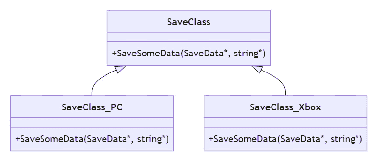

图 2.2 – 应用开放-封闭原则的 SaveClass 实例的 UML 图

接下来，我们将探讨 Liskov 替换。

## Liskov 替换

在《敏捷软件开发：原则、模式和惯例》一书中，Robert C. Martin 指出以下内容：

设 q(x) 为关于类型 T 的 x 的对象的可证明属性。那么，对于类型 S 的对象 y（其中 S 是 T 的子类型），q(y) 应该是可证明的。

实质上，如果在你的代码中使用了一个子类，你应该能够将其替换为其任何兄弟类，而无需修改调用代码的结构或使用变量进行不期望的目的。在先前的例子中，我们将保存系统转换成了一个父子结构。如果我们添加云保存，我们就不再有发送数据的文件路径，而是使用 IP 地址。嗯，我们可以通过将 IP 地址通过文件路径参数传递来实现这一点，如以下摘录所示，但这违反了我们的命名约定。毫无疑问，将来会有某人需要使用这个函数，却不会理解他们需要做什么。此外，任何不在请求类型中的数据都必须由调用对象转换，发送，然后在子实现中解析，这浪费了时间：

调用保存系统的程序摘录

```cpp
SaveClass* _XboxSaver = new SaveClass_Xbox();
SaveClass* _CloudSaver = new SaveClass_Cloud();
SaveData* _DataToSave;
//Some code to prepare save data
_XboxSaver->SaveSomeData(_DataToSave, "filepath");
_CloudSaver->SaveSomeData(_DataToSave, "127.0.0.1");
```

解决这个原则的方法是将可能变化的变量设为子类的一个成员。这样，初始化函数可以处理确保请求正确的数据，并且我们可以根据需要轻松地替换`save`对象。这也意味着父类中的抽象功能可以在任何使用的地方以相同的方式调用，使得随着系统的增长维护变得更加容易：

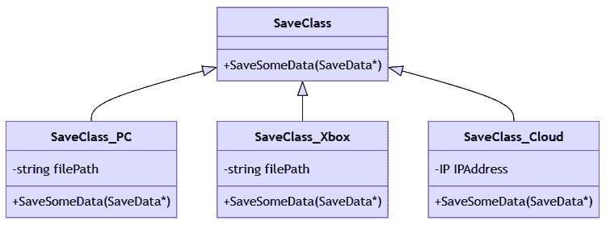

图 2.3 – 应用 Liskov 替换原则的 SaveClass 继承的 UML 图

因此，如果我们将 Liskov 替换原则应用到我们的代码中：

调用更好的保存系统的程序摘录

```cpp
SaveClass* _XboxSaver = new SaveClass_Xbox("filePath");
SaveClass* _CloudSaver = new SaveClass_Cloud(new IP());
SaveData* _DataToSave;
//Some code to prepare save data
_XboxSaver->SaveSomeData(_DataToSave);
_CloudSaver->SaveSomeData(_DataToSave);
```

如您所见，调用格式相同，因此可以互换并满足原则。

## 接口分离

在《敏捷软件开发：原则、模式和实践》一书中，Robert C. Martin 指出以下内容：

客户端不应被强制实现它不使用的接口，或者客户端不应被强制依赖于它们不使用的方法。

如果父类定义了一个抽象函数，子类必须重写它。当为某些子类实现抽象函数时，这会导致问题，因为其他不需要该功能的子类必须重写以立即将其置为空。解决方案可以是扩展继承，为需要此额外功能的类提供另一层，或者创建一个接口（仅在多继承语言中可用），将功能添加到某些子类中。

回到保存系统，如果您需要在 Xbox 和 PlayStation 上保存之前获取账户授权，则可以通过继承来完成。可以创建一个新的 `Save` 子类，它声明了一个获取授权的抽象函数。然后它成为需要该函数的每个保存系统的父类：

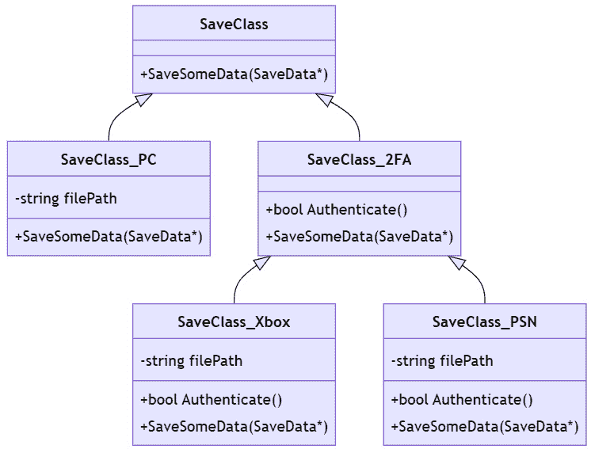

Figure 2.4 – UML 图显示 SaveClass 通过纯继承应用接口分离的继承

因此，如果我们将接口分离的概念应用到我们的代码中：

检查保存前认证的程序摘录

```cpp
SaveClass2FA* _PSNSaver = new SaveClass_PSN("filePath");
SaveData* _DataToSave;
// Some code to prepare save data
if (_PSNSaver->Authenticate())
{
    _PSNSaver->SaveSomeData(_DataToSave);
}
```

重要提示

从技术上讲，*Figure 2**.4* 中显示的结构将违反之前的 Liskov 替换原则，因为不继承自中间 *接口* 层的子类不能被替换到模式中。决定哪个原则更重要是设计代码的技能的一部分，通常是通过实践学到的。

虽然这种继承结构确实满足了**接口分离**原则，但它最终会变得相当混乱，有很多分离的行为。还有另一种方法。将单一责任原则的第一条应用到这个树中，我们将每个分离的行为移入其自己的类。然后可以在需要的地方创建此类对象并将其注入保存系统中。结果是更多独立的类，但结构更清晰、更小。这就是使用**类组合**来解决结构问题的方法：

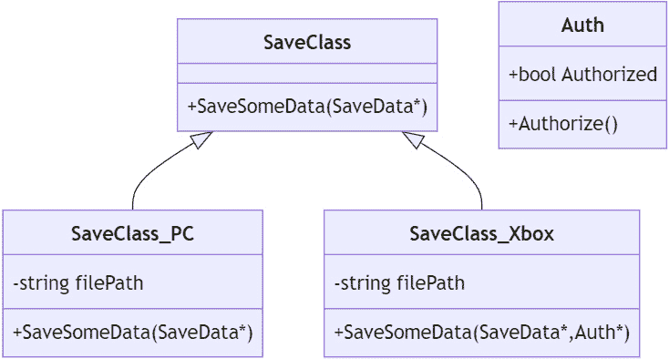

Figure 2.5 – UML 图显示 SaveClass 与 Auth 层次结构

因此，如果我们将类组合应用到我们的代码中：

Figure 2.5 的程序摘录

```cpp
Auth* _Authorizer = new Auth();
SaveClass* _XboxSaver = new SaveClass_Xbox("filePath");
SaveData* _DataToSave;
//Some code to prepare save data
_Authorizer->Authorize();
_XboxSaver->SaveSomeData(_DataToSave, _Authorizer);
```

`SaveSomeData` 函数将检查 `Auth` 类型对象的授权状态，因为它需要这样做。

## 依赖倒置

在 *敏捷软件开发：原则、模式和实务* 一书中，Robert C. Martin 指出：

实体必须依赖于抽象，而不是具体化。它指出，高级模块不应依赖于低级模块，而它们应该依赖于抽象。

这种模式在 UE5 中非常有用。简单来说，如果你在某个地方注入一个类的引用，它实际上应该是具有所需功能的最高级抽象父类。在 PlayerController 中，你不会引用特定的 pawn 子类，而是引用 pawn 的概念。更好的是，你可以引用所需功能的接口；这将防止进行长的类型过滤转换链。

在保存示例中，注入账户授权者是一个具体化，它假设每个 `save` 模块将以相同的方式进行授权。实际上，注入一个只包含授权状态的 `Authorizer` 父类会更为合适。在创建要注入的对象时，我们将其创建为正确的子类并调用其 `Authorize` 函数，该函数可以自由地按需操作。你甚至可以将这种结构用于其他地方的授权：

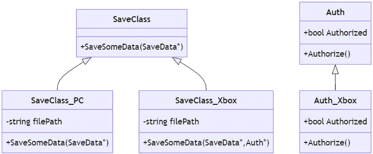

Figure 2.6 – UML 图显示 SaveClass 与 Auth 层次结构

因此，如果我们对我们的代码应用依赖倒置，它将看起来像：

Figure 2.6 的程序摘录

```cpp
Auth* _Authorizer = new Auth_Xbox();
SaveClass* _XboxSaver = new SaveClass_Xbox("filePath");
SaveData* _DataToSave;
//Some code to prepare save data
_Authorizer->Authorize();
_XboxSaver->SaveSomeData(_DataToSave, _Authorizer);
```

经历了这么多理论，但有了它，我们可以对糟糕的系统进行实际的改进。这些改进应该巩固我们代码的基础，为我们在本书后面使用更结构化的模式做好准备。

下一节将指导你通过一个普通初学者的流程来创建项目并快速使其工作，这样你就可以将所学应用到实践中，看到实际的改进。

# 探索常见问题的解决方案

我们将探索一系列蓝图脚本的示例，其中预期的结果已经实现，但由于采用的方法而引发问题。然后我们将提供一种改进的方法，这使得蓝图更高效、更整洁、更可重用，或更容易在开发后期进行扩展。本节的目的在于帮助你开始识别你自己的代码中潜在的改进区域，无论你是工作在蓝图还是 C++ 中。

重要提示

在本节中我们将要查看的一切都是糟糕的代码，以证明一个观点。即使是接下来的修复也不是完美的，但它是为了教育目的而编写的，因此有所简化。

对于本节，你需要一个空的项目，你可能在章节开头就已经创建了这个项目，以及来自章节开头提供的 GitHub 链接的 `chapter2` 分支中的 `content` 文件夹。

如果你之前没有使用过 GitHub，请点击 `.zip` 文件，然后将其提取到你的新项目文件夹中。

将 `.zip` 文件中的 `HelloPatterns` 文件夹直接放入你的内容目录中；这将为你提供一些我们将首先回顾的坏习惯示例，然后解释如何修复它们。

要修复这些问题，首先，复制每个蓝图资产，并将后缀从 `_Bad` 更改为 `_Better`。这将确保你可以在重新工作这些蓝图时回顾我们开始和结束时的差异。

要开始修复这些蓝图，你需要通过在 **内容浏览器** 中双击它们来打开它们。一旦打开，导航到 **事件图** 选项卡，在那里你会找到我们覆盖的示例。按照每个 **解决方案** 下面的步骤来改进蓝图。

## 移动盒子问题

我们将要查看的第一个示例是一个简单的移动盒子（静态网格组件），它从起始位置（相对 `0`,`0`,`50`）滑动到结束位置（相对 `200`,`0`,`50`)。这两个位置都已经在蓝图中被存储为向量变量，并且已经设置了默认值，如前所述。

注意

在这里，我们使用相对位置，这是一个基于父实体位置的向量变量。如果一个组件的父演员在世界中的位置是 (0,0,0)，那么在组件上的相对位置 (0,0,50) 也会在世界中是 (0,0,50)。然而，如果父演员移动到 (10,10,0)，组件的世界位置将是 (10,10,50)，因为世界位置和相对位置结合为组件提供世界位置。

移动盒子的蓝图代码有两个逻辑链通过分支节点（蓝图中的 `if` 语句版本）使用 `Update` 循环）选择。一个逻辑链用于将盒子向前移动，从起点到终点，另一个用于将其向后移动。使用哪个由 **Forward** 布尔变量控制：

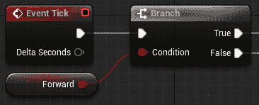

图 2.7 – 选择移动方向的“事件计时分支”

“向前移动”逻辑链通过使用 **Set Relative Location** 节点将 1 厘米添加到盒子的相对位置 **x** 坐标，并更新相对于演员的位置。

然后进行一次检查，比较当前相对位置和终点，误差容忍度为 0.0。如果位置相等，则 **Forward** 被设置为 **False**，这意味着在下一次计时，分支将选择反向逻辑更改：

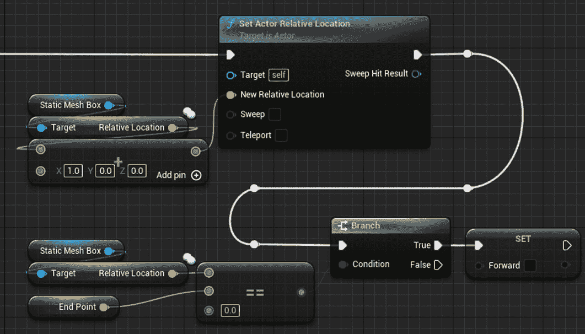

图 2.8 – 移动盒子的向前移动逻辑链

*向后移动*逻辑链从盒子的相对位置*x*坐标中减去 1 厘米，并以相同的方式更新位置。这里的区别在于，检查将相对位置与终点进行比较，当它们相等时，将**前进**设置为**True**，在下一个 tick 上切换分支到*向前移动*逻辑。这会无限重复，或者直到 actor 被销毁：

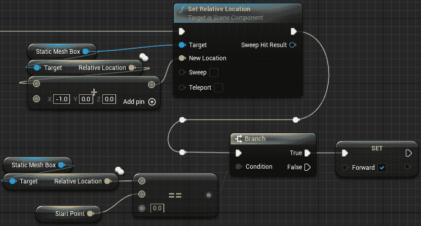

图 2.9 – 移动盒子的向后移动逻辑链

我们在这里遇到的问题是我们在每个 tick 上检查盒子是否到达了目的地。对一个盒子进行这种比较可能不会引起很多问题，但如果你在一个场景中移动很多项目，这种无辜的计算就是资源的浪费，这是我们极力避免的。

### 移动盒子的解决方案

让我们看看如何使用时间线构建一个更好的方法：

1.  首先删除**事件图**中的所有节点，除了**设置相对位置**和**静态网格****盒子**节点。

1.  首先通过在图上右键单击，输入`custom event`并按*Enter*键添加一个自定义事件节点。你可以在任何时候选择**添加自定义事件…**选项；输入更多名称将简单地帮助减少可用的选项，希望这样可以加快速度：

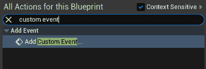

图 2.10 – 使用自定义事件过滤在事件图中创建节点

1.  将自定义事件命名为`PingPongMovement`——在这个阶段，它应该是相当字面的，因为这就是我们正在编写的代码：

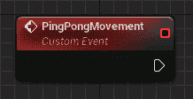

图 2.11 – 用于 PingPongMovement 的自定义事件节点

1.  从`添加时间线`拖出，当提示时选择`T_MoveBox`。这将为你提供一个时间线节点，这是一种特殊的节点类型，它包含一个或多个可以用于在时间线节点**更新**链中调用其他节点的值的图：

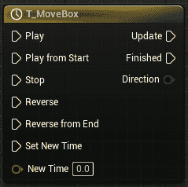

图 2.12 – 一个名为 T_MoveBox 的时间线节点

1.  双击**T_MoveBox**节点；这将打开一个新标签页，允许我们创建和编辑此时间线中的图。注意，标签页顶部的**时间线长度**为 5.0 秒。这意味着时间线将从第一次调用时执行其更新链 5.0 秒：

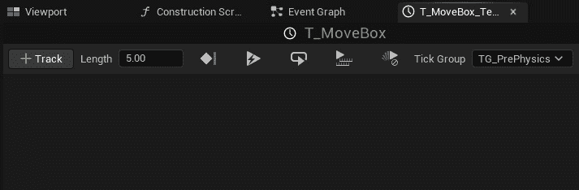

图 2.13 – 默认设置下的空时间线标签页

1.  点击**+Track**按钮，选择**添加****浮点轨道**。

1.  将轨道命名为`MovementAlpha`。这将向时间线节点添加一个浮点轨道图和浮点值输出：

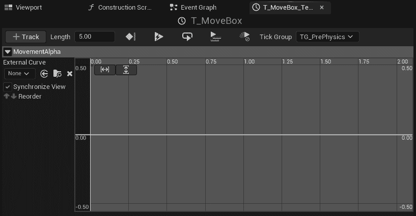

图 2.14 – 时间轴中添加的浮点轨迹

1.  右键单击浮点图，并选择**添加键到 CurveFloat_0**；重复此操作以创建第二个键。

1.  选择第一个关键帧，并将`0.0`输入到两个变量中。

1.  选择第二个关键帧，并设置`5.0`和`1.0`：

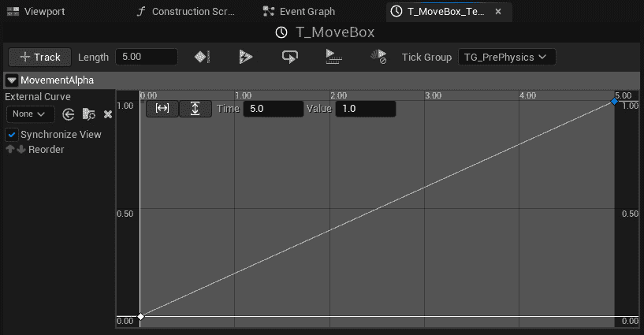

图 2.15 – 带有线性图的 MovementAlpha 轨迹

1.  根据时间轴的当前时间返回到`MovementAlpha`曲线：

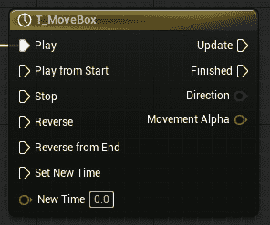

图 2.16 – 现在带有 Movement Alpha 浮点引脚的时间轴节点

1.  将旧解决方案中的**设置相对位置**和**静态网格箱**节点连接到时间轴的**更新**输出引脚。

1.  从`lerp`拖动以创建一个**Lerp (Vector)**节点。此设置允许我们在两个向量之间进行插值，以控制盒子相对于对象位置的运动。

1.  将**蓝图编辑器**窗口左侧的**Start Point**变量拖放到**Lerp (Vector)**节点的**A**引脚上。**A**引脚是 lerp 的起始值。

1.  将**End Point**变量拖放到**Lerp (Vector)**节点的**B**引脚上。**B**引脚是 lerp 的结束值。

1.  将**Lerp (Vector)**节点的**Alpha**引脚连接到时间轴节点的**Movement Alpha**引脚：

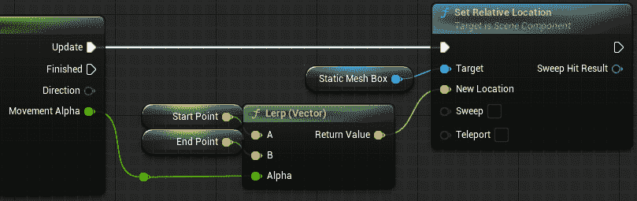

图 2.17 – 时间轴的更新逻辑完成

现在更新逻辑已完成，我们需要设置蓝图以启动时间轴。为此，请按照以下步骤操作：

1.  右键单击`Event BeginPlay`节点。这是一个内置事件，当创建 actor 时（无论是在游戏开始时还是在其他函数生成时）会被调用。

1.  将`Ping Pong Movement`拖出；你现在应该在**调用函数**展开栏下看到一个**Ping Pong Movement**选项——选择它。这将创建对我们的自定义事件的调用：

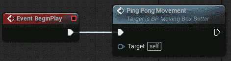

图 2.18 – 从 Event BeginPlay 事件调用 Ping Pong Movement

这将现在将盒子从起始位置移动到终点位置，在相对空间中；通过将`BP_MovingBox_Better`蓝图从**内容浏览器**放入世界并点击视口上方的**播放**按钮进行测试：


图 2.19 – 来自主 Unreal Engine 编辑器用户界面的编辑器播放控制

接下来，我们想要设置蓝图，以便当盒子到达终点位置后，它会回到起始位置并无限循环。为此，请按照以下步骤操作：

1.  通过在键盘上按住**Alt**键并点击连接的任一端，从时间线节点断开**Ping Pong Movement**自定义事件节点。

1.  从**翻转器**节点拖动。每次进入该节点时，该节点会在执行引脚**A**和**B**之间切换。节点总是以**A**作为其第一次运行的起始。可以使用**bool**引脚来通知其他逻辑，但在这个解决方案中我们不需要它。

1.  将**翻转器**节点的**A**引脚连接到**T_MoveBox**时间线节点的**从开始播放**引脚。

1.  将**翻转器**节点的**B**引脚连接到**T_MoveBox**时间线节点的**从结束反转**引脚：

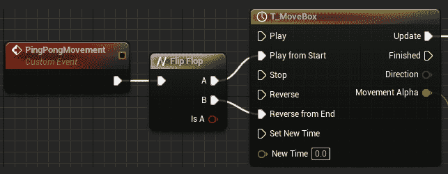

图 2.20 – 翻转器节点和时间线

1.  最后，将时间线节点的**完成**引脚连接到一个**Ping Pong Movement**函数调用节点（现有的或新的），每次它完成时都会重新启动该过程：

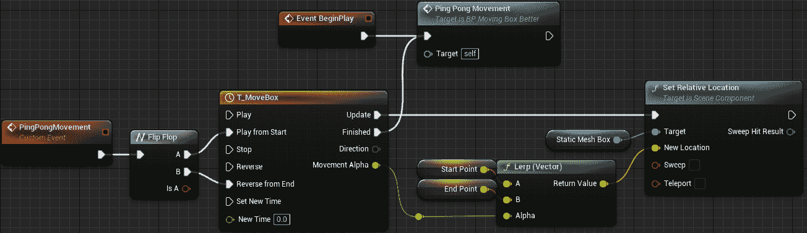

图 2.21 – 移动盒子的改进蓝图，在编辑器中布局以提高可读性

现在，尝试再次在编辑器中按下**播放**按钮（视口上方的**播放**按钮）。你应该现在看到盒子在一个方向上移动，然后又回到另一个方向，反复进行。

这种方法由于不需要比较，因此提供了更高效的解决方案。更新逻辑仍然持续运行，就像**设置相对位置**节点在 tick 方法中运行一样，但由于时间线控制方向变化发生的时间，我们不再需要在每次移动后进行任何向量位置的比较。

时间线还可以让我们在想要移动物体时拥有更多的控制。当前的设置具有由线性曲线控制的线性运动。将关键类型更改为自动（右键单击关键点）或添加额外的关键点可以提供更有趣的运动，并允许你将动画原理等考虑因素纳入你的移动对象中，这是在不使用曲线的情况下非常难以做到的。

## 旋转盒子问题

我们将要查看的第二个示例是一个简单的旋转盒子。蓝图演员包含相同的静态网格组件，但这次它被设置为在每次 tick 时原地旋转 2 度：

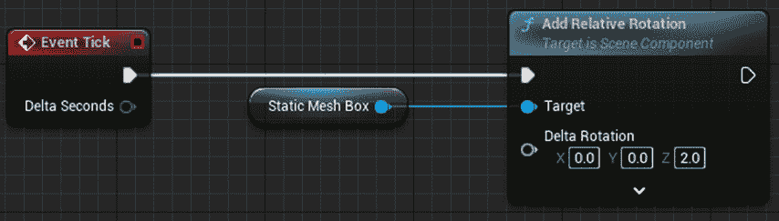

图 2.22 – 旋转盒子的蓝图代码

蓝图代码还检查当盒子的旋转达到 360 度或以上时，从旋转值中减去 360 度，以确保在游戏进行时旋转值不会失控螺旋：

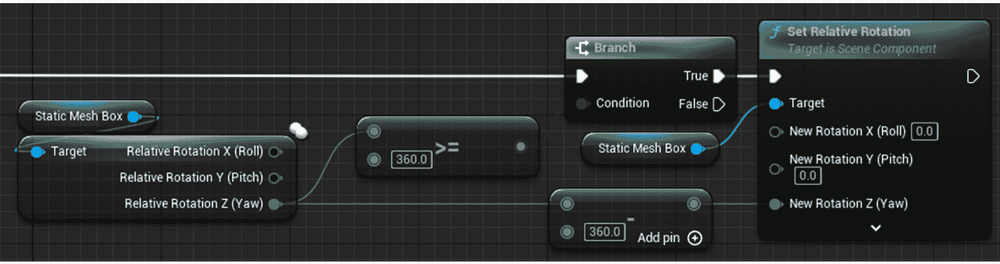

图 2.23 – 维持 0 到 360 度之间旋转的检查

已经实施的检查相对合理，如果它是单个旋转的一部分或者是在动画蓝图内与角色旋转一起工作，那么它将是理想的。

这种实现的问题在于我们再次在**刻度**上工作，并且随着每个额外旋转盒子的增加，检查将变得更加繁琐。

### 旋转盒子问题的解决方案

对于旋转盒子，解决方案是使用一个现有的解决方案。我们不需要编写不同的代码，可以使用 UE5 提供的组件来实现所需的结果。按照以下步骤操作：

1.  首先，从**事件图**中删除所有逻辑，它不是必需的。

1.  在**组件**标签页中，点击**添加**按钮并搜索**旋转运动**组件：

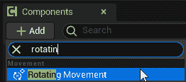

图 2.24 – 在添加组件列表中选中的旋转运动组件

1.  通过点击**我的****蓝图**标签页中的**变量**卷展栏中的**+**来创建一个新变量。

1.  将变量命名为`Rotation Rate`，通过点击当前类型（通常在您使用新的蓝图时是**布尔型**）并从列表中选择**旋转器**来设置类型。

1.  通过点击变量类型右侧的*眼睛*图标使变量**实例可编辑**，这将允许用户设置场景中每个盒子的旋转速率。

1.  编译蓝图并设置`0,0,180`的默认值：

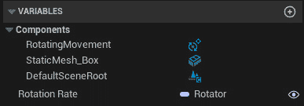

图 2.25 – 在我的蓝图标签页中的结果变量列表

1.  在`设置旋转速率`节点中，将您刚刚创建的**旋转速率**变量连接到**旋转速率**引脚：


图 2.26 – 构建脚本逻辑，使用创建的变量设置旋转运动组件的旋转速率

现在，当将`BP_RotatingBox_Better`放入世界时，您将能够在**详细**面板的**默认值**部分设置**旋转速率**值。尝试放置多个盒子并设置不同的值。当您在**编辑器**中按下**播放**按钮时，您应该看到盒子按预期旋转。

由于其不依赖于**事件刻度**以及当旋转超过 360 度时移除比较检查以保持值在 0-360 范围内，这种解决方案再次提供了一种更高效的方法。

这种方法的另一个好处是，我们现在有一个**实例可编辑**的旋转速率变量，这为用户提供更多的控制和定制，允许每个盒子都有自己的旋转速率。该变量还允许我们在所有三个轴上旋转盒子，而原始方法只围绕**z**（偏航）轴旋转盒子。

## 级联铸链问题

这个例子是我们经常在新开发者之间通信时看到的情况。

这里的实现是为了一个游戏，玩家角色可能携带三把武器中的一把：手枪、霰弹枪或步枪。铸被用来识别携带武器的类，当铸返回 true 时，会调用每个武器的射击事件：

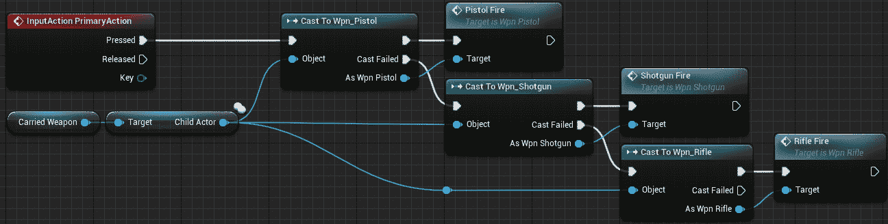

图 2.27 – CH_Example_Bad 资产中蓝图中的级联铸链

这里有几个问题。首先，这是 Unreal 中铸节点（cast node）的特性。虽然对于原型设计来说很好，但铸操作会带来资源影响，其中我们尝试铸到的每个演员都会作为演员的一部分被加载。因此，在这种情况下，所有三把武器都包含在角色中，以便能够检查**携带武器**子演员是否与它们的类匹配。

您可以通过检查任何演员的大小图来查看铸对内存的影响。

要这样做，请按照以下步骤操作：

1.  在**内容浏览器**中选择**演员**蓝图。

1.  右键单击并选择**大小图…**。

这将打开一个弹出窗口，显示所选演员的大小（内存中）：

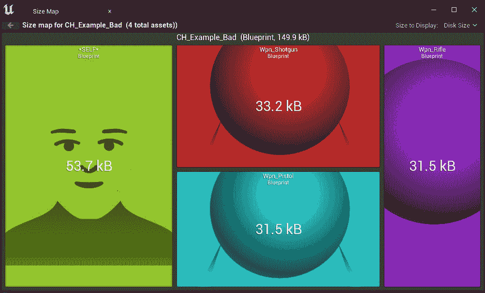

图 2.28 – 具有级联铸链的角色蓝图类的大小图

生成的蓝图（仅包含基本角色类元素和铸链）大小为 149.9 kB，而一个标准角色（仅将子演员设置为手枪）的大小为 56.1 kB。通过将子演员的默认类设置为演员，可以进一步减小大小，从而优化蓝图对内存的影响，但这并不是证明我们试图证明的观点所必需的；铸操作会导致不必要的内存问题：

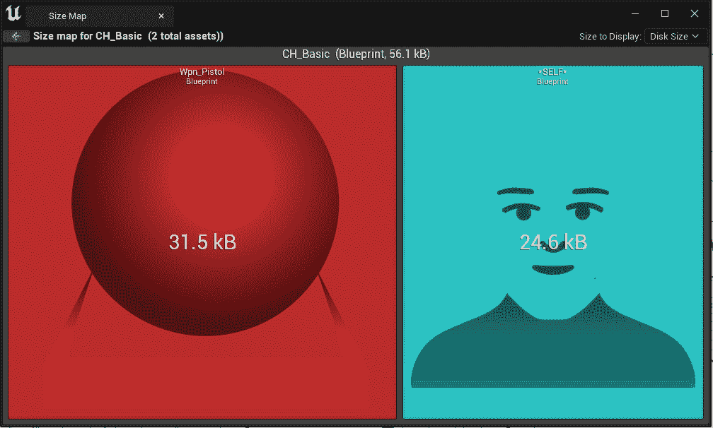

图 2.29 – 具有仅一个子演员组件的角色蓝图类的大小图

在前面显示的这两个例子中，`Wpn_Pistol` 类只是一个带有自定义事件（在最终游戏中将射击武器）的空演员；然而，该类目前只包含一个 `Fire`。如果您考虑添加网格、纹理、粒子系统和音频组件，具有级联铸链的角色潜在的大小将比实际需要的大得多。

第二个问题是铸操作的处理时间以及铸到下一个武器类之前的等待失败时间。虽然我们谈论的是毫秒，但所有这些都会累积起来，尤其是如果有多个角色，或者你的非玩家角色使用相同的角色蓝图。

递归转换链的最后一个问题是这种方法的灵活性（或额外的工作）。在当前设置中，只有链中包含的三种武器可以被角色使用。为了增加可用武器的数量（随着项目的进展或作为发布后的可下载内容的一部分），需要在链中添加更多的转换，这将放大上述两个问题的效果，并且添加它们通常很耗时，尤其是如果链中需要任何其他逻辑，如弹药管理和冷却时间。

如果你想查看当前设置的输出，那么从 `TestFiles` 目录打开 `TestLevel` 地图，点击 *播放*，然后点击鼠标左键；你将在屏幕的左上角看到与每个武器相关的打印信息。按下键盘上的 *1*、*2* 和 *3* 键将在不同的武器类之间切换。

让我们来看看这个问题的解决方案。

### 解决递归链问题的方案

对于这个问题，有两种潜在的解决方案；第一种是使用父类和子类方法，转换到父类，这将允许在所有子类上调用**事件 Fire**。由于这仍然使用转换，父类仍然包含在角色中，增加了内存使用量。

第二个解决方案，我们将要实施的是使用一个接口。

接口允许两个演员进行通信，而无需识别目标演员的类类型。

蓝图接口可以通过任何蓝图图使用演员引用（这是类层次结构中的最高级别）来调用。接收演员需要实现接口以定义它将如何响应接口事件调用。

在构建这个解决方案时，我们将创建一个简单的蓝图接口，将其添加到所有武器中，并从角色中调用它，简单地将武器作为演员类引用，从而消除了类型转换的需要。按照以下步骤进行：

1.  首先，通过在`BI_Weapon`中右键单击来创建一个蓝图接口。我们使用前缀`BI`来标记这是一个蓝图接口。

1.  打开 `Fire`。

1.  打开 `BI_Weapon`。点击它将**BI 武器**接口添加到**实现**的**接口**列表中：

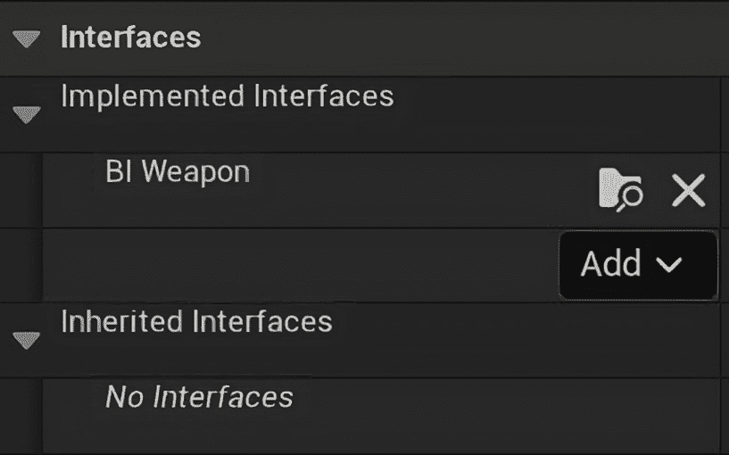

图 2.30 – 实现接口列表中的 BI 武器

1.  现在，在“我的蓝图”选项卡下的“接口”卷展栏中已经添加了一个**Fire**函数。双击它；这将创建一个**事件 Fire**接口事件：

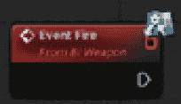

图 2.31 – 事件 Fire 接口事件，由右上角的接口图标表示

1.  从 `Print String` 节点拖出，然后替换为 `Pistol –` `Interface Fire`。

1.  在**Wpn_Rifle**和**Wpn_Shotgun**资产上重复*步骤 3 到 5*，将**打印字符串**节点更改为包含每件武器的名称。

1.  复制**CH_Example_Bad**资产并将其重命名为**CH_Example_Better**。

1.  打开**CH_Example_Better**并从**InputAction PrimaryAction**逻辑流程中删除所有节点，除了**携带武器**和**目标子****演员**节点。

1.  从`Fire (Message)`拖动；这将创建一个**Fire**接口事件调用，它将在当前设置为**携带****武器**类的任何类上被调用：

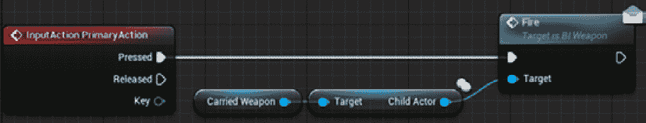

图 2.32 – 使用接口调用的结果 InputAction PrimaryAction 蓝图逻辑

为了测试这种方法，我们需要将`TestLevel`映射交换到我们刚刚创建的更好的例子上。

1.  从**内容浏览器**中的`TestFiles`目录打开`GM_Test`。

1.  将**默认 Pawn 类**下拉菜单更改为**CH_Example_Better**。

现在，当你玩这个关卡并点击左鼠标按钮时，你会看到新的接口打印出来。

我们所取得的结果基本上与之前相同；然而，实现它的代码更整洁、更快、使用更少的内存，并且通过避免强制转换并使用接口而无限可扩展。

# 权衡

在任何模式的实现或修复中，你获得的东西和它所付出的代价之间有一个权衡，在实现模式时考虑长期影响是很重要的。

在我们探索的大多数情况下，收益是简单性、可读性或内存足迹的减少，这应该有助于你的游戏顺利运行。这些都是值得维护良好代码库的关键元素。代价通常是时间。某些模式可能需要更长的时间来实现，在某些情况下，为了以特定方式重构代码可能会消耗宝贵的时间。

然而，长期效果超过了初始时间成本，因为后来在开发过程中节省的时间用于构建在现有系统之上或之内将证明在游戏开发周期后期是有益的。

# 摘要

在本章中，我们讨论了支撑良好代码的 S.O.L.I.D.原则，探讨了具体示例以及随着复杂性的增加，我们需要考虑这些原则以保持代码的功能。这些原则在游戏开发行业中得到了广泛认可，因此理解它们不仅有助于提高代码效率和可读性，还允许在大型项目中与共同开发者进行顺畅的沟通。

我们还探索了一系列新用户在使用虚幻引擎时遇到的问题及其解决方案，具体关注了一系列常见任务，例如移动物品和管理角色上的武器选择。虽然这些解决方案是具体的，但它们提供了开发者如何轻易地发现自己陷入大型、笨重的蓝图中的见解，这些蓝图可以通过利用内置系统和工具来解决。

在下一章中，我们将探讨这些清洁代码的原则，并查看艺电（Epic Games）是如何通过引擎将这些原则应用到他们为我们构建的一些模式中的。从某种意义上说，这是引擎的实用性。这些模式将包括双缓冲、享元和空间划分。
