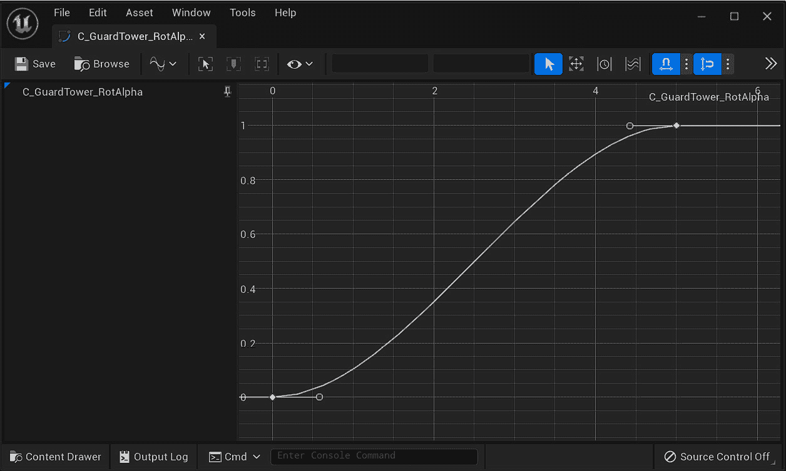

# 忘记滴答

在本章中，我们将探讨滴答（每帧调用的事件或过程）的主题，为什么使用它可能会给我们的游戏项目带来帧率问题，以及两种在不使用滴答的情况下构建系统的方法，以减少系统对 CPU 的影响。我们将以一个 RTS 游戏中的守卫塔为例，其搜索灯来回旋转。如果玩家的单位被搜索灯看到，它将停止旋转。我们将从上一章中引入的 Update 模式开始，并逐步改进，通过使用定时器、时间线和事件驱动解决方案来减少我们对 Update 模式的依赖。在每一步中，我们将衡量代码效率，使用执行计数来量化我们的改进。

在本章中，我们将涵盖以下主题：

+   滴答事件及其使用时面临的挑战

+   定时器和时间线

+   事件驱动系统

# 技术要求

在本章中，我们将关注项目文件夹中*第五章*的守卫塔类，该文件夹通过 GitHub 链接，我们在前几章中已下载。如果您没有跟随前几章的发展，您可以从 GitHub 上的`chapter5`分支下载项目版本，准备开始*第五章*教程，链接为[`github.com/PacktPublishing/Game-Development-Patterns-with-Unreal-Engine-5/tree/main/Chapter05`](https://github.com/PacktPublishing/Game-Development-Patterns-with-Unreal-Engine-5/tree/main/Chapter05)

# 在我们开始之前

在这个类中，我们将使用一种新的智能指针类型。`TObjectPtr<>`是 Unreal Engine 5 处理演员上持有的组件的标准方式。之前的标准是使用原始指针，但新的垃圾收集器将不再支持这种方式，因为新的系统提供了引用跟踪来检测对象是否实际被使用。这意味着仅存储在原始指针中的对象可能会被误认为是解除引用的内存，并且在仍在使用时被删除。

在函数内部，我们仍然会使用原始指针，因为这些变量将超出作用域，因此不需要垃圾收集器来释放它们的内存。成员变量对象引用将存储为`TObjectPtr<>`，资产引用存储为`TSoftObjectPtr<>`。

# 一个滴答作响的世界

在上一章中，我们介绍了更新模式的概念。当使用更新模式时，我们设计时遵循的理念是许多不同类型的类需要在每一帧上执行代码。为了实现这一点，我们将使用更新函数，或者在虚幻引擎中，使用 **Tick 事件**。这种模式提供了一种快速实现事情发生的方法，这也是它具有一定影响力的原因，吸引了大量学习资源依赖于它。虽然学习材料的数量并不使这成为一个好主意，但它确实允许系统快速建立，从而使从这类资源中学习变得容易理解。问题在于，在依赖这种方法的高成本下，似乎失去了理解。当我们把任何节点或代码行放在 tick 的管辖范围内时，我们需要记住它每帧运行一次。在现代机器上，这相当于每秒平均 60 次，但可能会根据硬件而变化，这对于开发者来说是一个重要的考虑因素。对于现代硬件上的小型游戏，偶尔的变量设置或变换更改可能没问题；然而，如果你考虑到循环的影响，这会变得非常令人担忧。这应该清楚地表明，尽管 tick 看起来很强大，但其表面之下隐藏着一个问题网络。

为了说明问题，让我们看看位于 *第五章* 文件夹中的 `AGuardTower_CH5_1` 实例。我们在头文件中遵循最佳实践，使用前向声明的类来定义成员组件，并使用尽可能有限的属性指定符。你可能注意到，除了构造函数外，唯一的功能是 `Tick`。在这个函数中，我们执行所有搜索灯功能。在搜索灯的 `tick` 函数中逐步执行，我们有以下内容：

+   调用父级 `Tick`

+   一个球体追踪，获取任何位于灯光大致区域内的实例的引用

+   检查检测到的实例是否为玩家兵种类型

+   当玩家未被找到时，代码分支将搜索灯旋转到各个方向

`GuardTower` 实体文件包含一个看起来是这样的 `tick` 函数：

GuardTower_CH5_1.cpp 的 `Tick` 函数

```cpp
void AGuardTower_CH5_1::Tick(float DeltaTime)
{
    Super::Tick(DeltaTime);
    FVector startLocation = _Arrow->GetComponentLocation();
    FVector endLocation = _Arrow->GetComponentLocation() +         (_Arrow->GetForwardVector() * _DetectionRange);
    FHitResult hit;
    UKismetSystemLibrary::SphereTraceSingle(GetWorld(),startLocation,
    endLocation,_DetectionRadius, UEngineTypes::
        ConvertToTraceType(ECC_Visibility), false, {},
            EDrawDebugTrace::ForOneFrame,hit, true);
    ACharacter* otherCasted = Cast<AEliteUnit>(hit.GetActor());
    _EnemySpotted = (otherCasted != nullptr);
    if (!_EnemySpotted)
    {
        if (_RotateForward)
        {
            _LightPivot->AddLocalRotation(FRotator(0.0, 0.2, 0.0));
            if (FMath::IsNearlyEqual                 (_LightPivot->GetRelativeRotation().Yaw, 40.f))
            {
                _RotateForward = false;
            }
        }
        else
        {
            _LightPivot->AddLocalRotation(FRotator(0.0, -0.2, 0.0));
            if (FMath::IsNearlyEqual                 (_LightPivot->GetRelativeRotation().Yaw, -40.f))
            {
                _RotateForward = true;
            }
        }
    }
}
```

这段代码确实在运行，你可以看到如果你将 `BP_GuardTower` 的实例拖入位于 *第五章* 文件夹中的级别，你可以看到。然而，有一些问题，所以让我们按顺序分析这些问题：

+   由于所有逻辑都在 tick 中，我们经常执行一些昂贵的操作。单独进行球体追踪本身并不太昂贵，但如果每帧、每个场景中的防御塔都执行一次球体追踪，计算成本会迅速增加。

+   很多的获取函数被反复使用而没有缓存。世界指针可以在 `BeginPlay` 时缓存，因为不太可能改变，并且可以一次完成对箭头组件位置的多次调用。这些只是一些小的改进。

+   转换在虚幻引擎早期并不像现在这样昂贵。话虽如此，当转换到一个类时，目标类必须被加载以确保匹配。在转换到大型类时必须记住这一点，因为它可能会增加 RAM 中进程的大小。其他选择可能包括如果你只需要某些功能，则转换到接口，如果只是进行有效性检查，则检查标签，或者，更好的是，尝试颠倒通信并消除转换的需要。

+   然后我们有一个我们将称之为**门控轮询**的模式。在时间刻度时，检查是否需要运行一段代码；如果是，就运行它。这种门控轮询模式被重复几次用于不同的代码块。现在应该已经响起了警钟，但可能是因为错误的原因。是的，我们有一个重复的代码模式，我们之前讨论过避免重复；这不是真正的问题所在。任何时候我们处理可能或可能不发生的事情，我们都保证在某些帧上进行了浪费的检查。我们应该考虑如何避免检查，并且只有在确实需要发生时才处理代码。

+   最后，我们有一个复合问题，涉及到门控轮询的每个分支。是的，我们正在硬编码值，包括旋转限制和旋转速度。将硬编码的`0.2`和`40`转换为名为`_RotationSpeed`和`_RotationLimit`的浮点成员变量是第一部分的简单修复。将`EditAnywhere`添加到每个新变量上面的`UPROPERTY()`块中，将允许设计师不仅可以在演员中平衡值，还可以在他们自己的级别中创建不同的实例。这仍然留下了我们代码中的一个问题。时间刻度不是恒定的，但我们正在使用一个恒定值进行旋转。这就是`DeltaTime`发挥作用的地方。它是作为自上次渲染帧以来经过的时间传递给时间刻度的参数。通过乘以这个值，它们将在 1 个真实世界中均匀应用。

应该很清楚，这段代码有很大的改进空间，但有多大呢？在*第三章*中，我们讨论了 Big O 符号，但为了获得更高分辨率的分析，我们需要计算算法的*T(n)*或时间效率。这应该为我们提供一个基线，以证明我们可以定量地做得更好。

第一个球体追踪部分包含大约三个任务，六个函数调用，三个算术操作，以及球体追踪的内部时间。转换部分包含两个函数调用，一个测试和一个赋值。在`if`块中，两个分支的执行次数基本相同，所以我们只计算顶层分支，这给我们带来了两个测试，四个函数调用和一个赋值。总的来说，这大约是每帧 23 + 1 * 球体追踪执行次数，没有超出标准设置的额外开销。在 60 **帧每秒**（**FPS**）的情况下，我们将会运行 1380 + 60 * 球体追踪执行次数。

重要提示

你可以在`GuardTower_CH5`类的`_2`和`_3`版本下找到以下两个部分的完整工作解决方案，但请尽量跟随本节内容，对`_1`版本进行修改，以充分利用本章内容。

现在我们已经审查了使用 Tick 作为守卫塔的问题，让我们开始探讨如何修复它，移除我们对 Tick 的依赖，并编写更好的代码。

# 一个停止的时钟

现在，我们将处理这个问题：门控轮询。解决这个问题的常用方法是`UKismetSystemLibrary`，在那里你会发现简单地调用它有点麻烦。定时器会在它们活跃的每一帧上执行检查，以查看它们指向的函数是否应该被触发。这可以是一种有用的行为，用于动态设置延迟或系统，你只想在设定的时间后收到信号，例如每秒减少一次而不是每帧减少一次的倒计时。然而，时间线提供了一种处理行为的方式，类似于在查询曲线时进行更新。这些曲线的长度是预先确定的，尽管时间线的播放速度可以被调整以实现动态长度。时间线还可以持有多种类型的轨道，播放时它们都会同步，允许单个时间线驱动大量元素。这为我们的问题提供了一个更好的解决方案，因为我们需要保留更新行为，但占用更小的空间，减少每帧执行的检查数量。

观察以下代码，我们可以看到在 C++中设置时间线时，我们首先将以下变量和函数添加到我们的头文件中，以方便时间线。乍一看，似乎向类中添加这么多内容会减慢处理速度，但每个元素都有其作用。前两个变量是委托，将为我们提供将函数动态链接到时间线的方法。这些后面跟着我们将要链接的函数。这种模式遵循以下命名约定，以帮助未来的可读性：

+   `On<object name><delegate purpose>`用于委托

+   `Handle_<对象名称><委托目的>`用于链接函数

以下两个函数`StartRotation`和`StopRotation`只是简单地作为时间线方法的包装器。

时间线本身被创建为`TObjectPtr<>`，允许进行前瞻性引用计数和更安全的垃圾回收。这个属性说明符也不太重要，因为我们通过我们创建的函数访问所有需要的功能。最后一个变量是`TSoftObjectPtr<>`到`UCurveFloat`。这种类型由引擎用于将 2D 空间中的样条曲线存储为一系列带有切线的关键帧。我们将使用它来驱动我们的搜索灯角度随时间变化，但我们希望设计师能够访问以进行更改。这意味着我们需要将变量存储为一个对尚未存在的资产的引用，因此使用了`TSoftObjectPtr<>`包装器。将此设置为`EditAnywhere`将允许通过各自的编辑面板设置默认值和实例变体：

守望塔时间线标题

```cpp
private:
    FOnTimelineFloat onTimeline_Update;
    FOnTimelineEventStatic onTimeline_Finished;
    UFUNCTION()
    void Handle_RotateLight_Update(float val);
    UFUNCTION()
    void Handle_RotateLight_Finished();
    void StartRotation();
    void StopRotation();
protected:
    UPROPERTY()
    TObjectPtr<UTimelineComponent> T_RotateLight;
    UPROPERTY(EditAnywhere)
    TSoftObjectPointer<UCurveFloat> _Curve;
```

现在，我们将注意力转向这里显示的`GuardTower`构造函数实现。我们需要在构造函数中创建时间线组件。然后，我们的委托需要绑定到监听函数。这样的绑定将允许在必要时重新绑定，而任何从这个类派生出来的类都将始终有一个默认响应。还值得注意的是，绑定是通过创建为`FName`类型的函数名来完成的。这将使拼写和大小写变得重要，而且你的 IDE 不太可能为这些提供自动完成功能：

守望塔时间线构造函数

```cpp
T_RotateLight = CreateDefaultSubobject<UTimelineComponent> (TEXT("T_RotateLight"));
onTimeline_Update.BindUFunction(this, FName("Handle_RotateLight_Update"));
onTimeline_Finished.BindUFunction(this, FName("Handle_RotateLight_Finished"));
```

我们不能在构造函数内部进行任何更多的设置，因为我们被这样一个事实所阻碍：我们还没有为`_Curve`变量设置一个值。这需要在编辑器中进行链接，这将迫使其余的初始化过程进入`BeginPlay`方法。

首先要考虑的是，变量可能根本就没有设置值，这将使继续任何设置的必要性失效。我们不会将所有代码都嵌套在一个条件为真的`if`语句中，而是将条件反转以检查负条件，并插入一个早期返回。这使得我们的代码更易于阅读，并在构造函数时减少了我们需要记住的信息量。

在此之后，时间线需要设置一些事情，如下面的代码块所示。它应该运行的任何轨道都需要被添加。在这里，我们将添加一个基于`_Curve`变量引用的任何资产的浮点轨道。这需要注入一个在值变化时将调用的委托以及用于未来参考的轨道名称。在这里，我们将插入更新委托`onTimeline_Update`和一个对我们使用有意义的新的`FName`值。然后，同样需要为时间线的完成回调执行相同的操作。这与其他函数略有不同，因为它不需要曲线或名称，只需要一个回调。所以，我们在这里所做的只是插入完成委托`onTimeline_Finished`。

在这个情况下，我们还需要将循环性质设置为 `false`，并将忽略时间膨胀属性设置为 `true`。我们将控制时间轴的重放，因此不需要任何自动行为，另一个变量主要用来展示你可以通过时间轴获得什么样的控制。有许多其他属性可以调整以微调时间轴的行为，因此花时间探索类型头部的函数是非常值得的。

有用提示

如果你想探索类型或类头，可以在你的代码中定义该类型的变量。这将允许你右键单击该类型并选择**转到定义**（在 Visual Studio 和 Rider 中为 *F12*）。

所有这些更改都应该使你得到一个看起来像以下代码的 `Beginplay` 时间轴设置：

守望塔时间轴设置

```cpp
Super::BeginPlay();
if (_Curve == nullptr)
{
    return;
}
T_RotateLight->AddInterpFloat(_Curve, onTimeline_Update,     FName("Alpha"));
T_RotateLight->SetTimelineFinishedFunc(onTimeline_Finished);
T_RotateLight->SetLooping(false);
T_RotateLight->SetIgnoreTimeDilation(true);
StartRotation();
```

现在，我们需要填写回调处理函数，这些函数在本质上相当简单 – 一个用于在可杀死的更新中旋转灯光，另一个用于当灯光达到旋转限制时改变灯光的方向：

回调处理函数

```cpp
void AGuardTower_CH5_3::Handle_RotateLight_Update(float val)
{
    _LightPivot->SetRelativeRotation(
    FRotator(0.f, FMath::Lerp(-40.f, 40.f, val), 0.f));
}
void AGuardTower_CH5_3::Handle_RotateLight_Finished()
{
    _RotateForward = !_RotateForward;
    StartRotation();
}
```

我们最后需要做的是调用 `StartRotation()` 函数来启动时间轴。这个函数的主体简单地调用时间轴的 `Play()` 函数，如果 `_RotateForward` 是 `true`；否则，它调用 `Reverse()`。我们还有一个 `Stop()` 函数的包装器，但这除了是良好开发实践之外没有提供任何好处，它只是在时间轴上调用 `Stop()` 函数。完成这些后，我们可以删除旧 `tick` 函数末尾的嵌套 `if` 语句，在我们的球体追踪中添加 `StopRotating()` 调用，其中将 `_EnemySpotted` 设置为 `true`，然后前往编辑器将我们的 `_Curve variable` 与资产链接起来。

时间轴工作后，我们可以利用其其他一些功能来提高游戏体验。旧的旋转行为在每轮都是线性的，并不适合游戏。使用 f 曲线控制旋转会向玩家透露未来的动作。随着旋转速度减慢，玩家会本能地理解灯光即将改变方向，并据此进行规划。这个 `C_GuardTower_RotAlpha` 的概念可以在 *第五章*（B18297_05.xhtml#_idTextAnchor068）文件夹中的守望塔类中找到。该曲线是一个简单的 f 曲线，起点和终点具有平直的切线，覆盖范围从 (`0,` `0`) 到 (`5,` `1`），如图 *图 5**.1* 所示。



图 5.1 – 曲线编辑器窗口中的 C_SearchLightRotation 曲线资产

既然我们已经用时间线系统替换了旧的门控轮询，我们应该重新计算 *T(n)* 性能。我们移除了两个测试，四个函数调用和一个赋值，总数降至 16 + 1 * 球体追踪。然后，我们添加了一个时间线，这相当于每一帧一个测试和一个函数调用，一个测试和六个函数调用，这些将在一次运行，一个测试和两个函数调用，这些目前每 5 秒运行一次。简单地将这些值加在一起会使情况看起来更糟，给出了 28 + 1 * 球体追踪，但这是不正确的。新的代码不会像旧的那样定期运行，当乘以正确的频率时，你得到 (60 * (18 + 1 * 球体追踪)) + (3 / 5) = ~1081 + 60 * 球体追踪每秒，加上 7 个开销。这大约是第一次实现的 22%的提升。

这很好，但我们仍然有一个问题。我们仍然在每个 tick 时做某件事：球体追踪。每一帧都会在空间中投射一个球体，以查看玩家的角色是否在塔的“视野”中。这种设置反映了我们之前的问题，即门控轮询。每一帧，我们都运行测试。如果玩家被重叠，我们就触发可见逻辑。如果玩家未被检测到或只是看不见，那么什么都不会发生，我们检查的那个球体追踪就浪费了。

下一个部分将介绍改进这个过程以及指导在考虑效率与设计之间选择路线的架构决策。

# 事件驱动系统

软件工程师的职责是解决问题。大多数时候，这意味着在某些情况下进行特殊处理，以确保各种情况都能得到处理。有时，问题得到了完美的解决，问题不是被解决了，而是从存在中消除了。在我们当前的系统中，我们想要解决在每个帧中为玩家在世界上追踪球体的问题。

问题不是，*我们如何使这更高效？* 而是我们应该问，*为什么是球体追踪？* 真正的答案并不明确。是的，它允许我们检查玩家的空间体积，但碰撞体也能做到。是的，我们可以检查光网格和地板之间的所有空间，但在我们的游戏中，玩家不能跳。是的，我们可以判断是否有物体阻挡了玩家的视线，但当我们不确定时，更便宜的线追踪也能做到。

从这三个答案中，我们可以形成一个新解决方案。原则上，我们将球体碰撞体，作为最便宜的原始操作，附加到光上。随着光的摆动，附加的碰撞体也会摆动。当碰撞体与玩家重叠时，我们使用从光到玩家的线追踪来查看是否有清晰的视线。这实际上颠倒了搜索灯和玩家之间的交互。现在，搜索灯不再每帧询问世界它是否能看到玩家。现在，只有当玩家被看到时，世界才会告诉搜索灯。

在我们的实现中漫步，我们将一个处理函数链接到我们新球体组件的`onComponentBeginOverlap`事件。这个处理函数，在下面的代码中详细说明，首先检查我们是否已经与玩家单位发生了碰撞。如果是这样，那么我们可以忽略未来的碰撞。在一个更大的场景中，场景中有更多的碰撞体，你可能想忽略这个检查，而是继续增加计数器，因为搜索灯足够大，可以一次覆盖多个单位。然后我们将重叠的演员转换为我们知道玩家将使用的类。这同样可以改为检查`teamID`或类似的群体识别值。这将允许多个玩家或派系使用相同的单位。接下来的几行设置了值并执行了从光位置到我们刚刚重叠的单位中心的线迹。这样做是因为我们将要挥舞的碰撞体不知道它所在的地图以及任何可能阻挡视线的墙壁。我们将使用线迹作为另一个早期返回，因为如果它击中了某个东西，这意味着我们可以忽略由于网格阻挡视线而导致的玩家碰撞。在建立了清晰的视线后，我们然后简单地设置`_EnemySpotted`变量为`true`并停止由时间线驱动的旋转。这将是您将链接到类似警报系统的地方，以吸引附近友军单位的注意。

让我们从“开始重叠”开始：

守望塔球体开始重叠函数

```cpp
if (_EnemyUnit != nullptr)
{
    return;
}
_EnemyUnit = Cast<AEliteUnit>(OtherActor);
if (_EnemyUnit == nullptr)
{
    return;
}
FHitResult hit(ForceInit);
FVector start = _Arrow->GetComponentLocation();
FVector end = _EnemyUnit->GetActorLocation();
if (UKismetSystemLibrary::LineTraceSingle(
        GetWorld(), start, end,
        UEngineTypes::ConvertToTraceType(ECC_Visibility),
        false, {_EnemyUnit}, EDrawDebugTrace::ForDuration, hit,
        true, FLinearColor::Red, FLinearColor::Green, 0.5f))
{
    return;
}
_EnemySpotted = true;
StopRotation();
```

`onComponentEndOverlap`等价事件由以下代码块中显示的函数处理，它要小得多，因为它只需要检查离开碰撞的演员是否是最初触发警报的那个。然后，它可以重置`_EnemySpotted`和`_EnemeyUnit`变量，然后继续时间线旋转代码：

守望塔球体重叠结束

```cpp
if(_EnemyUnit != OtherActor) {
    return;
}
    _EnemySpotted = false;
    _EnemyUnit = nullptr;
    StartRotation();
```

重要注意事项

在*第一章*的末尾探讨了组件重叠函数。请记住，只绑定匹配`FComponentBeginOverlapSignature`和`FComponentEndOverlapSignature`的函数。样本代码中使用的参数遵循以下模式：`UPrimitiveComponent* OverlappedComponent, AActor* OtherActor, UPrimitiveComponent* OtherComp, int32 OtherBodyIndex, bool FromSweep, const FHitResult& SweepResult`用于开始重叠，我们可以看到它们是相同的，只是去掉了结束重叠的最后两个参数。

这个最后的改变，从追踪到碰撞器，需要对 *T(n)* 性能进行另一次重新计算。我们将 Tick 函数中的其余功能完全重新定位，只留下 Timeline 更新在运行。这使我们每帧的执行次数降至 2！尽管如此，处理过程并没有完全移除。在最坏的情况下，玩家会与球体碰撞器重叠，并在一秒内完成交互，这意味着所有代码都可能被触发。这相当于四个赋值、八个函数调用、三个测试，以及在开始重叠时进行一次 *线迹跟踪* 和在结束重叠时进行两个赋值、一个函数调用和一个测试。此外，还有四个函数调用用于设置新组件并绑定这些函数，如以下代码所示，这使我们的每帧成本达到 2，每秒 19 + 1 *线迹跟踪，每 5 秒 3。这使得 (60 * 2) + (19 + 1 *线迹跟踪) + (3 / 5) = ~140 + 1 *线迹跟踪每秒，并且有 11 的开销设置成本。这比第一次实现提高了 90%，显示了改变方法如何对性能产生巨大影响，即使它看起来像是创建了更多内容。为了参考，以下代码可以用来将处理程序函数链接到相关组件重叠事件，如果你需要一个语法示例。你的函数可能有不同的名字，但这些行必须运行，以便回调能够工作：

GuardTower 构造函数中用于球体组件设置的换行

```cpp
_Sphere = CreateDefaultSubObject<USphereComponent>(TEXT("Sphere"));
_Sphere->SetupAttachment(_LightMesh);
_Sphere->OnComponentBeginOverlap.AddDynamic(this, &AguardTower_CH5_3::OnSphereOverlapBegin);
_Sphere->OnComponentEndOverlap.AddDynamic(this, &AguardTower_CH5_3::OnSphereOverlapEnd);
```

这里的性能优势显示得相当极端，但与处理所有行为在 Tick 中的原型方法相比，这实际上是常态。我们还可以将这种技术应用于任何广泛使用 Update 模式的场景。虚幻引擎 5 已经在增强输入系统中使用它，只有在输入被按下时才会触发代表回调事件。旧的轮询系统会在轴输入上触发，无论是否需要，这使我们不得不门控那些不需要的值。我们还可以看看虚幻提供通信选项的一些地方，即 UI 和网络——两个非常不同的领域，但原则是相同的。两者都提供了一种使用轮询或更新方法快速设置链接的方式，该方法每帧都会触发。对于 UI，它是属性绑定，对于网络，我们有复制变量。在两种情况下，每帧都会运行一些额外的函数来查看它所链接的变量是否已更新。希望与刚才我们探讨的例子中的平行关系是清晰的。具体的解决方案是手动通过自定义函数调用更新 UI，并在处理网络系统时使用复制函数，也称为**远程过程调用**（**RPC**），它允许我们仅在需要更新时通过网络发送数据。

本章完成后，你现在应该理解了设计事件驱动系统的重要性和方法。我们已经展示了我们可以以许多方式创建具有相同功能性的代码，但使用事件驱动方法可以节省大量的处理，即使这意味着更复杂的设置。作为额外任务，考虑如何使搜索灯为多个可控单位工作，或者一旦它看到了单位，它如何跟踪该单位直到失去视线。在更高层次上，搜索灯如何通知周围敌人它已经看到了你的单位？建议你在每个章节之后回顾这个类，看看后来学到的工具如何进一步改进它。

# 摘要

通过我们示例游戏中瞭望塔的明确例子，我们学习了许多不同的技术和考虑因素，以提升我们系统中的效率。我们通过将门控轮询系统替换为可终止的更新和事件驱动系统，应用了始终尝试做更少的通用技术。我们使用了 Unreal Engine 特有的工具，如时间轴和计时器，来实现这些模式，并思考了它们的应用可能如何影响游戏玩法设计，而不仅仅是基于数字的效率目标。本章重点关注的改进迭代过程也展示了如何通过使用 *T(n)* 计算来量化每一步，以小而可测量的方式改进代码。向前看，我们将探讨更多通用的编程工具及其在 Unreal 中的实现，以扩展这个工具集。主要的收获是将问题分解为其基本部分，并在过程中衡量你的改进。这将使你能够更好地与团队沟通你的过程，并与团队协作实现目标。
